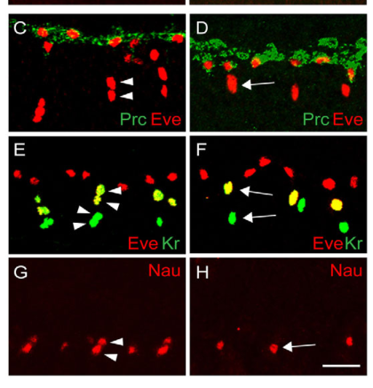

## Question

# Gene Research for Functional Annotation

## ⚠️ CRITICAL: Gene/Protein Identification Context

**BEFORE YOU BEGIN RESEARCH:** You MUST verify you are researching the CORRECT gene/protein. Gene symbols can be ambiguous, especially for less well-characterized genes from non-model organisms.

### Target Gene/Protein Identity (from UniProt):
- **UniProt Accession:** A1Z9X4
- **Protein Description:** SubName: Full=Hibris, isoform B {ECO:0000313|EMBL:AAO41390.1}; SubName: Full=Hibris, isoform C {ECO:0000313|EMBL:AHN56237.1};
- **Gene Information:** Name=hbs {ECO:0000313|EMBL:AAO41390.1, ECO:0000313|FlyBase:FBgn0287864}; Synonyms=A69 {ECO:0000313|EMBL:AAO41390.1}, a69 {ECO:0000313|EMBL:AAO41390.1}, CT22841 {ECO:0000313|EMBL:AAO41390.1}, Dmel\CG7449 {ECO:0000313|EMBL:AAO41390.1}, Hbs {ECO:0000313|EMBL:AAO41390.1}, icon {ECO:0000313|EMBL:AAO41390.1}; ORFNames=CG7449 {ECO:0000313|EMBL:AAO41390.1, ECO:0000313|FlyBase:FBgn0287864}, Dmel_CG7449 {ECO:0000313|EMBL:AAO41390.1};
- **Organism (full):** Drosophila melanogaster (Fruit fly).
- **Protein Family:** Not specified in UniProt
- **Key Domains:** CD80_C2-set. (IPR013162); Cell_adhesion_signaling. (IPR051275); FN3_dom. (IPR003961); FN3_sf. (IPR036116); Ig-like_dom. (IPR007110)

### MANDATORY VERIFICATION STEPS:

1. **Check if the gene symbol "hbs" matches the protein description above**
2. **Verify the organism is correct:** Drosophila melanogaster (Fruit fly).
3. **Check if protein family/domains align with what you find in literature**
4. **If you find literature for a DIFFERENT gene with the same or similar symbol, STOP**

### If Gene Symbol is Ambiguous or You Cannot Find Relevant Literature:

**DO NOT PROCEED WITH RESEARCH ON A DIFFERENT GENE.** Instead:
- State clearly: "The gene symbol 'hbs' is ambiguous or literature is limited for this specific protein"
- Explain what you found (e.g., "Found extensive literature on a different gene with the same symbol in a different organism")
- Describe the protein based ONLY on the UniProt information provided above
- Suggest that the protein function can be inferred from domain/family information

### Research Target:

Please provide a comprehensive research report on the gene **hbs** (gene ID: hbs, UniProt: A1Z9X4) in DROME.

The research report should be a detailed narrative explaining the function, biological processes, and localization of the gene product. Citations should be given for all claims.

You should prioritize authoritative reviews and primary scientific literature when conducting research. You can supplement
this with annotations you find in gene/protein databases, but these can be outdated or inaccurate.

We are specifically interested in the primary function of the gene - for enzymes, what reaction is catalyzed, and what is the substrate specificity? For transporters, what is the substrate? For structural proteins or adapters, what is the broader structural role? For signaling molecules, what is the role in the pathway.

We are interested in where in or outside the cell the gene product carries out its function.

We are also interested in the signaling or biochemical pathways in which the gene functions. We are less interested in broad pleiotropic effects, except where these elucidate the precise role.

Include evidence where possible. We are interested in both experimental evidence as well as inference from structure, evolution, or bioinformatic analysis. Precise studies should be prioritized over high-throughput, where available.

## Output

Question: You are an expert researcher providing comprehensive, well-cited information.

Provide detailed information focusing on:
1. Key concepts and definitions with current understanding
2. Recent developments and latest research (prioritize 2023-2024 sources)
3. Current applications and real-world implementations
4. Expert opinions and analysis from authoritative sources
5. Relevant statistics and data from recent studies

Format as a comprehensive research report with proper citations. Include URLs and publication dates where available.
Always prioritize recent, authoritative sources and provide specific citations for all major claims.

# Gene Research for Functional Annotation

## ⚠️ CRITICAL: Gene/Protein Identification Context

**BEFORE YOU BEGIN RESEARCH:** You MUST verify you are researching the CORRECT gene/protein. Gene symbols can be ambiguous, especially for less well-characterized genes from non-model organisms.

### Target Gene/Protein Identity (from UniProt):
- **UniProt Accession:** A1Z9X4
- **Protein Description:** SubName: Full=Hibris, isoform B {ECO:0000313|EMBL:AAO41390.1}; SubName: Full=Hibris, isoform C {ECO:0000313|EMBL:AHN56237.1};
- **Gene Information:** Name=hbs {ECO:0000313|EMBL:AAO41390.1, ECO:0000313|FlyBase:FBgn0287864}; Synonyms=A69 {ECO:0000313|EMBL:AAO41390.1}, a69 {ECO:0000313|EMBL:AAO41390.1}, CT22841 {ECO:0000313|EMBL:AAO41390.1}, Dmel\CG7449 {ECO:0000313|EMBL:AAO41390.1}, Hbs {ECO:0000313|EMBL:AAO41390.1}, icon {ECO:0000313|EMBL:AAO41390.1}; ORFNames=CG7449 {ECO:0000313|EMBL:AAO41390.1, ECO:0000313|FlyBase:FBgn0287864}, Dmel_CG7449 {ECO:0000313|EMBL:AAO41390.1};
- **Organism (full):** Drosophila melanogaster (Fruit fly).
- **Protein Family:** Not specified in UniProt
- **Key Domains:** CD80_C2-set. (IPR013162); Cell_adhesion_signaling. (IPR051275); FN3_dom. (IPR003961); FN3_sf. (IPR036116); Ig-like_dom. (IPR007110)

### MANDATORY VERIFICATION STEPS:

1. **Check if the gene symbol "hbs" matches the protein description above**
2. **Verify the organism is correct:** Drosophila melanogaster (Fruit fly).
3. **Check if protein family/domains align with what you find in literature**
4. **If you find literature for a DIFFERENT gene with the same or similar symbol, STOP**

### If Gene Symbol is Ambiguous or You Cannot Find Relevant Literature:

**DO NOT PROCEED WITH RESEARCH ON A DIFFERENT GENE.** Instead:
- State clearly: "The gene symbol 'hbs' is ambiguous or literature is limited for this specific protein"
- Explain what you found (e.g., "Found extensive literature on a different gene with the same symbol in a different organism")
- Describe the protein based ONLY on the UniProt information provided above
- Suggest that the protein function can be inferred from domain/family information

### Research Target:

Please provide a comprehensive research report on the gene **hbs** (gene ID: hbs, UniProt: A1Z9X4) in DROME.

The research report should be a detailed narrative explaining the function, biological processes, and localization of the gene product. Citations should be given for all claims.

You should prioritize authoritative reviews and primary scientific literature when conducting research. You can supplement
this with annotations you find in gene/protein databases, but these can be outdated or inaccurate.

We are specifically interested in the primary function of the gene - for enzymes, what reaction is catalyzed, and what is the substrate specificity? For transporters, what is the substrate? For structural proteins or adapters, what is the broader structural role? For signaling molecules, what is the role in the pathway.

We are interested in where in or outside the cell the gene product carries out its function.

We are also interested in the signaling or biochemical pathways in which the gene functions. We are less interested in broad pleiotropic effects, except where these elucidate the precise role.

Include evidence where possible. We are interested in both experimental evidence as well as inference from structure, evolution, or bioinformatic analysis. Precise studies should be prioritized over high-throughput, where available.

# Functional annotation report: *hbs* (Hibris), *Drosophila melanogaster*

## Identity and principal function

The specified UniProt accession **A1Z9X4** identifies *D. melanogaster hbs* (**Hibris; CG7449**), including the isoform annotations supplied in the question. Independent fly literature identifies Hibris as a nephrin-related member of the **Irre cell recognition module (IRM)**, not as *sticks-and-stones* (*sns*), *kirre/dumbfounded*, or *roughest* (*rst*). In particular, Hbs and Sns are distinct nephrin-like paralogs; Kirre and Rst belong to the interacting Neph-like branch. Thus, the organism, name and reported immunoglobulin/FNIII domains are consistent with the intended protein. The precise accession–isoform mapping comes from the supplied UniProt record rather than an independently verified publication. (shelton2009theimmunoglobulinsuperfamily pages 1-2, linneweber2015thecelladhesion pages 2-4)

**Best-supported primary annotation:** Hbs is a **transmembrane, immunoglobulin-superfamily cell-recognition and adhesion protein** that helps neighboring cells establish selective contacts and can initiate intracellular events required for embryonic myoblast fusion. Its principal characterized activity is **protein–protein recognition at the cell surface**, not catalysis or solute transport; consequently, no enzymatic reaction or transported substrate is known. Hbs and Sns share approximately **48% sequence identity** and are predicted to have **nine extracellular Ig-like domains and one fibronectin type-III domain**. Their intracellular regions differ substantially: approximately **165 amino acids in Hbs versus 374 in Sns**. These observations provide the molecular basis for the UniProt Ig-like, CD80_C2-set, FN3 and cell-adhesion/signaling domain annotations, although a domain match alone does not establish a tissue-specific function. (shelton2009theimmunoglobulinsuperfamily pages 1-2, bali2022sticksandstones pages 2-3)

The following synthesis distinguishes **direct *hbs* experiments** from work primarily concerning its paralog Sns.

| Tissue/context | Hbs localization or partner | Direct experimental finding | Evidence strength and caveat |
|---|---|---|---|
| Embryonic fusion-competent myoblasts | Hbs is a cell-surface protein restricted to fusion-competent myoblasts; it co-localizes and associates in cis with paralog Sns and binds Kirre across contacting cells. | *sns* mutants retain limited precursor fusion, whereas *sns,hbs* double mutants generally leave DA1, DO1 and VA1 precursors mononucleate. Hbs and Sns cytodomains are required for rescue; Hbs also mediates Kirre-dependent S2-cell aggregation and is tyrosine-phosphorylated. Shelton et al., published April 2009, [DOI](https://doi.org/10.1242/dev.026302). (shelton2009theimmunoglobulinsuperfamily pages 1-2, shelton2009theimmunoglobulinsuperfamily pages 4-5, shelton2009theimmunoglobulinsuperfamily media 8b0a2524) | **Strong, Hbs-specific genetic, rescue, localization and biochemical evidence.** Hbs is a positive but less efficient, partially redundant substitute for Sns; overexpression effects should not be interpreted as its normal physiological role. |
| Pupal retina—pigment-cell sorting | Hbs occurs in primary pigment cells and is preferentially concentrated with Roughest/IrreC (Rst) at apical primary-pigment/interommatidial-cell interfaces; ectopic Rst can relocalize Hbs to cone-cell/primary-pigment-cell contacts. | Preferential Hbs–Rst adhesion is required for sorting interommatidial precursors into the ordered ommatidial lattice; altered Rst localization changes Hbs distribution. Fischbach et al. review, published January 2009, [DOI](https://doi.org/10.1080/01677060802471668). (fischbach2009theirrecell pages 7-9) | **Mechanistically persuasive but summarized here through an authoritative review of earlier primary work.** Expression assignments can vary with developmental stage and boundary; the key functional interface is the primary-pigment/interommatidial-cell border. |
| Developing eye and adult R8 photoreceptors | Hbs is strong in the third-instar morphogenetic furrow, then weaker posteriorly; Hbs protein appears in emerging photoreceptor preclusters and ultimately all photoreceptors. | Loss of *hbs* reduced Rh5-positive R8 cells from 29% in controls to 9% in the *a69* hypomorph and increased Rh3/Rh6 mispairing from 8% to 25%. GMR-driven *hbs* raised Rh5-positive R8 cells to 70%; in R7-deficient *sevenless* flies, it raised Rh5 from 12% to 51%, indicating partial R7 independence. Tan et al., published 14 October 2020, [DOI](https://doi.org/10.1371/journal.pone.0240451). (tan2020drosophilar8photoreceptor pages 4-7, tan2020drosophilar8photoreceptor pages 9-12) | **Strong retinal genetics, mosaic analysis and gain-of-function evidence; molecular partner remains unresolved.** In this paper, “sens” means **Senseless**, not *sticks-and-stones* (*sns*); its co-labeling must not be cited as an Hbs–Sns interaction. |
| Wing-margin sensory-organ precursors | Hbs is at apical adherens-junction contacts throughout the neurogenic region and enriched at sensory-organ-precursor borders; precursor-specific RNAi supports expression within those precursors. | Single *hbs* knockdown mildly altered precursor/bristle spacing, whereas combined *hbs*/*sns* knockdown severely disrupted the pattern. Hbs misexpression changed bristle numbers and spacing, supporting dosage-sensitive, partly redundant adhesion. Linneweber et al., published 8 June 2015, [DOI](https://doi.org/10.1371/journal.pone.0128490). (linneweber2015thecelladhesion pages 4-5) | **Moderate-to-strong tissue-specific localization and RNAi evidence.** Redundancy and cross-regulation among four IRM proteins make a uniquely Hbs-specific mechanism difficult to isolate. |
| Garland and pericardial nephrocytes | Hbs is a nephrin-family paralog expressed only in a subset of nephrocytes. | The foundational nephrocyte study identified *hbs* and *sns* as nephrin orthologues but focused functional analysis on Sns and Duf/Kirre, which are maintained broadly at the plasma-membrane diaphragm. Weavers et al., published October 2009, [DOI](https://doi.org/10.1038/nature07526). (weavers2009theinsectnephrocyte pages 1-2) | **Limited direct evidence for Hbs function.** Hbs has not been shown to be the essential, general diaphragm component: the demonstrated filtration complex and modern structural work center on **Sns–Kirre**, so Sns-specific loss, filtration and ultrastructural phenotypes must not be transferred to Hbs. |

*Table: Hbs-specific localization and functional evidence across five Drosophila tissues, with direct experiments separated from paralog-based inference. The nephrocyte row highlights the crucial limitation that Sns–Kirre, not Hbs, is the broadly demonstrated filtration-diaphragm complex.*

## Where Hbs acts and how

**Embryonic muscle: adhesion coupled to fusion signaling.** Hbs is present on the surface of **fusion-competent myoblasts (FCMs)**, while its opposing-cell partner Kirre is found on **founder myoblasts**. In mixed S2-cell assays, Hbs-expressing cells adhered to Kirre-expressing cells comparably to Sns-expressing cells. Within FCMs, Hbs and Sns colocalize at discrete surface sites and co-immunoprecipitate when expressed together in cells or embryonic mesoderm, supporting an association **in cis**; Hbs–Kirre adhesion operates between cells **in trans**. Co-immunoprecipitation demonstrates association, not by itself the complete architecture of the complex. (shelton2009theimmunoglobulinsuperfamily pages 1-2, shelton2009theimmunoglobulinsuperfamily pages 4-5, shelton2009theimmunoglobulinsuperfamily pages 6-7, shelton2009theimmunoglobulinsuperfamily pages 7-8)

The decisive genetics show **partial redundancy rather than simple antagonism**. DA1, DO1 and VA1 muscle founders retain limited bi- or trinucleate precursor formation in *sns* mutants, but generally remain mononucleate in *sns,hbs* double mutants; loss of one *sns* copy also worsens the *hbs* fusion phenotype. The directly examined Figure 2 panels C–H illustrate these single- versus double-mutant outcomes. Elevated Hbs can rescue some later fusion in *sns* mutants, but less efficiently than Sns. Importantly, cytoplasmically truncated Hbs or Sns does **not** restore precursor fusion to the double mutant: extracellular adhesion alone is insufficient, and a cytoplasmic signaling function is required. (shelton2009theimmunoglobulinsuperfamily pages 4-5, shelton2009theimmunoglobulinsuperfamily media 8b0a2524, shelton2009theimmunoglobulinsuperfamily pages 5-6, shelton2009theimmunoglobulinsuperfamily pages 7-8)

Hbs is **N-glycosylated and tyrosine-phosphorylated** in the experimental embryonic system; its cytodomain contains candidate interaction motifs. These findings support an adhesion-to-intracellular-response mechanism, but do **not** identify a proven Hbs-specific kinase, direct adaptor, or complete downstream cascade. Established actin-regulatory pathways associated with the wider myoblast-fusion machinery should therefore not automatically be described as direct Hbs binding partners. Earlier apparently inhibitory *hbs* overexpression phenotypes are reconciled by the subsequent loss-of-function/rescue evidence: excess, less-efficient Hbs might compete with or sequester Sns, but that explanation remains a proposed mechanism. (shelton2009theimmunoglobulinsuperfamily pages 1-2, shelton2009theimmunoglobulinsuperfamily pages 4-5, shelton2009theimmunoglobulinsuperfamily pages 5-6, shelton2009theimmunoglobulinsuperfamily pages 7-8)

**Retinal epithelium: selective cell contacts.** During pupal eye patterning, Hbs occurs in **primary pigment cells** at apical contacts with **interommatidial precursor cells**; preferential association with Rst/IrreC at the pigment-cell/precursor-cell boundary helps organize the ommatidial lattice. Misexpressing Rst in cone cells redistributes Hbs to cone-cell/primary-pigment-cell interfaces, providing localization-based support for partner-dependent adhesion. This mechanistic account is documented in the IRM review, which summarizes the earlier Bao–Cagan eye study; expression and contact locations depend on developmental stage and should not be reduced to an assertion that Hbs is exclusively at one retinal border. (fischbach2009theirrecell pages 6-7, fischbach2009theirrecell pages 7-9)

**Photoreceptor subtype specification.** Separately from pupal epithelial sorting, third-instar eye discs express Hbs strongly near the **morphogenetic furrow** and in emerging photoreceptor clusters, eventually in all photoreceptors. Mutant-clone experiments place its requirement **within the retina** for normal Rh5-positive R8 differentiation and matching of R7/R8 opsin subtypes. In Tan and colleagues’ 2020 study, Rh5-positive R8 cells comprised **29% of control ommatidia** versus **9% in the *a69* mutant**; Rh3-positive-R7/Rh6-positive-R8 mispairing rose from **8% to 25%**. GMR-driven *hbs* expression increased Rh5-positive R8 cells to **70%**. Even without R7 cells in a *sevenless* background, the same overexpression increased Rh5-positive R8 cells from **12% to 51%**. These are genotype-specific percentages of scored ommatidia, **not** population estimates for all flies. They establish necessity and partial gain-of-function sufficiency, but neither an identified direct retinal ligand nor a fully resolved signaling pathway. Notably, the retinal paper’s label “sens” refers to **Senseless**, not *sticks-and-stones* (*sns*). (tan2020drosophilar8photoreceptor pages 7-9, tan2020drosophilar8photoreceptor pages 4-7, tan2020drosophilar8photoreceptor pages 9-12)

**Wing sensory-organ spacing.** In third-instar wing discs, Hbs occurs at **apical cell borders** in the neurogenic anterior wing margin and is enriched at sensory-organ-precursor boundaries. Precursor-specific RNA interference reduces the corresponding Hbs signal, supporting expression by these precursors. Single *hbs* knockdown causes comparatively mild precursor/bristle-spacing defects, while combined *hbs* and *sns* knockdown markedly disrupts spacing. This is evidence for context-dependent, partially redundant **differential adhesion and cell sorting**, rather than a distinct biochemical substrate for Hbs. (linneweber2015thecelladhesion pages 4-5)

## Nephrocytes: an important paralog distinction

Hbs belongs to the same evolutionary nephrin-like group as Sns, and foundational experiments report Hbs expression in **only a subset of nephrocytes**. They did **not** establish Hbs as the generally indispensable filtration-diaphragm protein. Instead, the nephrocyte loss-of-function and membrane-localization experiments concentrated on **Sns and Duf/Kirre**, expressed broadly in garland and pericardial nephrocytes. The **2023** kidney-model review likewise describes the diaphragm principally as a **Sns–Duf/Kirre** structure. Thus, loss of nephrocyte diaphragms or impaired filtration demonstrated after *sns* or *kirre* disruption must **not** be assigned to an *hbs* mutant without separate evidence. (weavers2009theinsectnephrocyte pages 1-2, koehler2023insightsintohuman pages 2-5)

## Recent research, practical uses and evidence limits

The most informative **2023** authoritative synthesis, Koehler and Huber, describes nephrocytes as experimentally accessible, podocyte-like cells for **human kidney-disease variant analysis, slit-diaphragm imaging and drug testing**. These are demonstrated applications of the **fly nephrocyte model**, not established clinical applications of Hbs itself. A **2025 bioRxiv preprint**, useful as a clearly labeled later development rather than a 2023–2024 peer-reviewed *hbs* study, used cryo-electron tomography to model the diaphragm’s bilayered fishnet architecture and again investigated **Sns and Kirre**, not Hbs. The literature retrieved here did not substantiate a **2023–2024 primary mechanistic study specifically testing Hbs**, so older direct experiments remain more informative for annotating this particular gene than newer work on its family. (koehler2023insightsintohuman pages 2-5, koehler2023insightsintohuman pages 9-11, moser2025theslitdiaphragm pages 1-7)

Partner specificity also matters outside these tissues. A **2022** biochemical study directly detected binding of **Sns**, but **not Hbs**, to the Lar receptor phosphatase under its extracellular-domain assay conditions; Hbs still bound Kirre in the assay. Accordingly, Lar-dependent neuronal effects established for Sns should not be transferred to Hbs. Overall, the strongest functional assignment is **selective, dosage-sensitive cell-surface adhesion with a necessary intracellular contribution to myoblast fusion**; a universal nephrocyte-filtration role, a specific Hbs–Lar pathway and the molecular mechanism underlying its R8 fate effects remain unestablished. (bali2022sticksandstones pages 3-5, shelton2009theimmunoglobulinsuperfamily pages 7-8, tan2020drosophilar8photoreceptor pages 9-12)

### Principal sources and dates

- Shelton *et al.*, **April 2009**, primary genetic, rescue and biochemical study of Hbs in myoblast fusion: https://doi.org/10.1242/dev.026302. (shelton2009theimmunoglobulinsuperfamily pages 1-2, shelton2009theimmunoglobulinsuperfamily pages 7-8)
- Weavers *et al.*, **2009**, foundational nephrocyte study distinguishing restricted Hbs expression from Sns/Duf-focused functional tests: https://doi.org/10.1038/nature07526. (weavers2009theinsectnephrocyte pages 1-2)
- Fischbach *et al.*, **January 2009**, IRM review and eye-contact analysis: https://doi.org/10.1080/01677060802471668. (fischbach2009theirrecell pages 7-9)
- Linneweber *et al.*, **8 June 2015**, wing sensory-spacing genetics and localization: https://doi.org/10.1371/journal.pone.0128490. (linneweber2015thecelladhesion pages 2-4, linneweber2015thecelladhesion pages 4-5)
- Tan *et al.*, **14 October 2020**, retinal genetics and quantitative opsin phenotypes: https://doi.org/10.1371/journal.pone.0240451. (tan2020drosophilar8photoreceptor pages 4-7, tan2020drosophilar8photoreceptor pages 9-12)
- Bali *et al.*, **March 2022**, biochemical distinction between Hbs and Sns as Lar-binding candidates: https://doi.org/10.7554/elife.71469. (bali2022sticksandstones pages 3-5)
- Koehler and Huber, **May 2023**, review of contemporary nephrocyte applications and the Sns/Kirre diaphragm: https://doi.org/10.1007/s00467-023-05996-w. (koehler2023insightsintohuman pages 2-5, koehler2023insightsintohuman pages 9-11)

References

1. (shelton2009theimmunoglobulinsuperfamily pages 1-2): Claude Shelton, Kiranmai S. Kocherlakota, Shufei Zhuang, and Susan M. Abmayr. The immunoglobulin superfamily member hbs functions redundantly with sns in interactions between founder and fusion-competent myoblasts. Development, 136:1159-1168, Apr 2009. URL: https://doi.org/10.1242/dev.026302, doi:10.1242/dev.026302. This article has 95 citations and is from a domain leading peer-reviewed journal.

2. (linneweber2015thecelladhesion pages 2-4): Gerit Arne Linneweber, Mathis Winking, and Karl-Friedrich Fischbach. The cell adhesion molecules roughest, hibris, kin of irre and sticks and stones are required for long range spacing of the drosophila wing disc sensory sensilla. PLOS ONE, 10:e0128490, Jun 2015. URL: https://doi.org/10.1371/journal.pone.0128490, doi:10.1371/journal.pone.0128490. This article has 25 citations and is from a peer-reviewed journal.

3. (bali2022sticksandstones pages 2-3): Namrata Bali, Hyung-Kook (Peter) Lee, and Kai Zinn. Sticks and stones, a conserved cell surface ligand for the type iia rptp lar, regulates neural circuit wiring in drosophila. eLife, Mar 2022. URL: https://doi.org/10.7554/elife.71469, doi:10.7554/elife.71469. This article has 19 citations and is from a domain leading peer-reviewed journal.

4. (shelton2009theimmunoglobulinsuperfamily pages 4-5): Claude Shelton, Kiranmai S. Kocherlakota, Shufei Zhuang, and Susan M. Abmayr. The immunoglobulin superfamily member hbs functions redundantly with sns in interactions between founder and fusion-competent myoblasts. Development, 136:1159-1168, Apr 2009. URL: https://doi.org/10.1242/dev.026302, doi:10.1242/dev.026302. This article has 95 citations and is from a domain leading peer-reviewed journal.

5. (shelton2009theimmunoglobulinsuperfamily media 8b0a2524): Claude Shelton, Kiranmai S. Kocherlakota, Shufei Zhuang, and Susan M. Abmayr. The immunoglobulin superfamily member hbs functions redundantly with sns in interactions between founder and fusion-competent myoblasts. Development, 136:1159-1168, Apr 2009. URL: https://doi.org/10.1242/dev.026302, doi:10.1242/dev.026302. This article has 95 citations and is from a domain leading peer-reviewed journal.

6. (fischbach2009theirrecell pages 7-9): Karl-Friedrich Fischbach, Gerit Arne Linneweber, Till Felix Malte Andlauer, Alexander Hertenstein, Bernhard Bonengel, and Kokil Chaudhary. The irre cell recognition module (irm) proteins. Journal of Neurogenetics, 23:48-67, Jan 2009. URL: https://doi.org/10.1080/01677060802471668, doi:10.1080/01677060802471668. This article has 72 citations and is from a peer-reviewed journal.

7. (tan2020drosophilar8photoreceptor pages 4-7): Hong Tan, Ruth E. Fulton, Wen-Hai Chou, Denise A. Birkholz, Meridee P. Mannino, David M. Yamaguchi, John C. Aldrich, Thomas L. Jacobsen, and Steven G. Britt. Drosophila r8 photoreceptor cell subtype specification requires hibris. PLoS ONE, 15:e0240451, Oct 2020. URL: https://doi.org/10.1371/journal.pone.0240451, doi:10.1371/journal.pone.0240451. This article has 4 citations and is from a peer-reviewed journal.

8. (tan2020drosophilar8photoreceptor pages 9-12): Hong Tan, Ruth E. Fulton, Wen-Hai Chou, Denise A. Birkholz, Meridee P. Mannino, David M. Yamaguchi, John C. Aldrich, Thomas L. Jacobsen, and Steven G. Britt. Drosophila r8 photoreceptor cell subtype specification requires hibris. PLoS ONE, 15:e0240451, Oct 2020. URL: https://doi.org/10.1371/journal.pone.0240451, doi:10.1371/journal.pone.0240451. This article has 4 citations and is from a peer-reviewed journal.

9. (linneweber2015thecelladhesion pages 4-5): Gerit Arne Linneweber, Mathis Winking, and Karl-Friedrich Fischbach. The cell adhesion molecules roughest, hibris, kin of irre and sticks and stones are required for long range spacing of the drosophila wing disc sensory sensilla. PLOS ONE, 10:e0128490, Jun 2015. URL: https://doi.org/10.1371/journal.pone.0128490, doi:10.1371/journal.pone.0128490. This article has 25 citations and is from a peer-reviewed journal.

10. (weavers2009theinsectnephrocyte pages 1-2): Helen Weavers, Silvia Prieto-Sánchez, Ferdinand Grawe, Amparo Garcia-López, Ruben Artero, Michaela Wilsch-Bräuninger, Mar Ruiz-Gómez, Helen Skaer, and Barry Denholm. The insect nephrocyte is a podocyte-like cell with a filtration slit diaphragm. Nature, 457:322-326, Oct 2009. URL: https://doi.org/10.1038/nature07526, doi:10.1038/nature07526. This article has 387 citations and is from a highest quality peer-reviewed journal.

11. (shelton2009theimmunoglobulinsuperfamily pages 6-7): Claude Shelton, Kiranmai S. Kocherlakota, Shufei Zhuang, and Susan M. Abmayr. The immunoglobulin superfamily member hbs functions redundantly with sns in interactions between founder and fusion-competent myoblasts. Development, 136:1159-1168, Apr 2009. URL: https://doi.org/10.1242/dev.026302, doi:10.1242/dev.026302. This article has 95 citations and is from a domain leading peer-reviewed journal.

12. (shelton2009theimmunoglobulinsuperfamily pages 7-8): Claude Shelton, Kiranmai S. Kocherlakota, Shufei Zhuang, and Susan M. Abmayr. The immunoglobulin superfamily member hbs functions redundantly with sns in interactions between founder and fusion-competent myoblasts. Development, 136:1159-1168, Apr 2009. URL: https://doi.org/10.1242/dev.026302, doi:10.1242/dev.026302. This article has 95 citations and is from a domain leading peer-reviewed journal.

13. (shelton2009theimmunoglobulinsuperfamily pages 5-6): Claude Shelton, Kiranmai S. Kocherlakota, Shufei Zhuang, and Susan M. Abmayr. The immunoglobulin superfamily member hbs functions redundantly with sns in interactions between founder and fusion-competent myoblasts. Development, 136:1159-1168, Apr 2009. URL: https://doi.org/10.1242/dev.026302, doi:10.1242/dev.026302. This article has 95 citations and is from a domain leading peer-reviewed journal.

14. (fischbach2009theirrecell pages 6-7): Karl-Friedrich Fischbach, Gerit Arne Linneweber, Till Felix Malte Andlauer, Alexander Hertenstein, Bernhard Bonengel, and Kokil Chaudhary. The irre cell recognition module (irm) proteins. Journal of Neurogenetics, 23:48-67, Jan 2009. URL: https://doi.org/10.1080/01677060802471668, doi:10.1080/01677060802471668. This article has 72 citations and is from a peer-reviewed journal.

15. (tan2020drosophilar8photoreceptor pages 7-9): Hong Tan, Ruth E. Fulton, Wen-Hai Chou, Denise A. Birkholz, Meridee P. Mannino, David M. Yamaguchi, John C. Aldrich, Thomas L. Jacobsen, and Steven G. Britt. Drosophila r8 photoreceptor cell subtype specification requires hibris. PLoS ONE, 15:e0240451, Oct 2020. URL: https://doi.org/10.1371/journal.pone.0240451, doi:10.1371/journal.pone.0240451. This article has 4 citations and is from a peer-reviewed journal.

16. (koehler2023insightsintohuman pages 2-5): Sybille Koehler and Tobias B. Huber. Insights into human kidney function from the study of drosophila. Pediatric Nephrology (Berlin, Germany), 38:3875-3887, May 2023. URL: https://doi.org/10.1007/s00467-023-05996-w, doi:10.1007/s00467-023-05996-w. This article has 21 citations.

17. (koehler2023insightsintohuman pages 9-11): Sybille Koehler and Tobias B. Huber. Insights into human kidney function from the study of drosophila. Pediatric Nephrology (Berlin, Germany), 38:3875-3887, May 2023. URL: https://doi.org/10.1007/s00467-023-05996-w, doi:10.1007/s00467-023-05996-w. This article has 21 citations.

18. (moser2025theslitdiaphragm pages 1-7): Deborah Moser, Konrad Lang, Alexandra N. Birtasu, Margot P. Scheffer, Martin Helmstädter, Tobias Hermle, and Achilleas S. Frangakis. The slit diaphragm in drosophila features a bi-layered, fishnet-like architecture. bioRxiv, Mar 2025. URL: https://doi.org/10.1101/2025.03.06.641875, doi:10.1101/2025.03.06.641875. This article has 0 citations.

19. (bali2022sticksandstones pages 3-5): Namrata Bali, Hyung-Kook (Peter) Lee, and Kai Zinn. Sticks and stones, a conserved cell surface ligand for the type iia rptp lar, regulates neural circuit wiring in drosophila. eLife, Mar 2022. URL: https://doi.org/10.7554/elife.71469, doi:10.7554/elife.71469. This article has 19 citations and is from a domain leading peer-reviewed journal.

## Artifacts

- [Edison artifact artifact-00](hbs-deep-research-falcon_artifacts/artifact-00.md)

## Citations

1. fischbach2009theirrecell pages 7-9
2. linneweber2015thecelladhesion pages 4-5
3. weavers2009theinsectnephrocyte pages 1-2
4. bali2022sticksandstones pages 3-5
5. shelton2009theimmunoglobulinsuperfamily pages 1-2
6. linneweber2015thecelladhesion pages 2-4
7. bali2022sticksandstones pages 2-3
8. shelton2009theimmunoglobulinsuperfamily pages 4-5
9. shelton2009theimmunoglobulinsuperfamily pages 6-7
10. shelton2009theimmunoglobulinsuperfamily pages 7-8
11. shelton2009theimmunoglobulinsuperfamily pages 5-6
12. fischbach2009theirrecell pages 6-7
13. koehler2023insightsintohuman pages 2-5
14. koehler2023insightsintohuman pages 9-11
15. moser2025theslitdiaphragm pages 1-7
16. DOI
17. https://doi.org/10.1242/dev.026302
18. https://doi.org/10.1080/01677060802471668
19. https://doi.org/10.1371/journal.pone.0240451
20. https://doi.org/10.1371/journal.pone.0128490
21. https://doi.org/10.1038/nature07526
22. https://doi.org/10.1242/dev.026302.
23. https://doi.org/10.1038/nature07526.
24. https://doi.org/10.1080/01677060802471668.
25. https://doi.org/10.1371/journal.pone.0128490.
26. https://doi.org/10.1371/journal.pone.0240451.
27. https://doi.org/10.7554/elife.71469.
28. https://doi.org/10.1007/s00467-023-05996-w.
29. https://doi.org/10.1242/dev.026302,
30. https://doi.org/10.1371/journal.pone.0128490,
31. https://doi.org/10.7554/elife.71469,
32. https://doi.org/10.1080/01677060802471668,
33. https://doi.org/10.1371/journal.pone.0240451,
34. https://doi.org/10.1038/nature07526,
35. https://doi.org/10.1007/s00467-023-05996-w,
36. https://doi.org/10.1101/2025.03.06.641875,