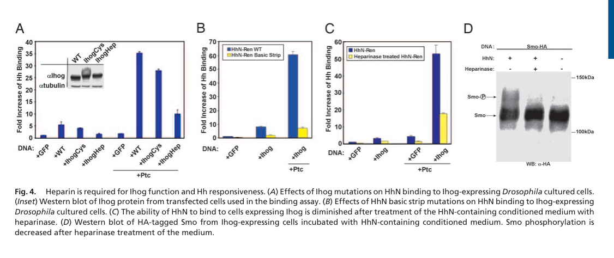

## Question

# Gene Research for Functional Annotation

## ⚠️ CRITICAL: Gene/Protein Identification Context

**BEFORE YOU BEGIN RESEARCH:** You MUST verify you are researching the CORRECT gene/protein. Gene symbols can be ambiguous, especially for less well-characterized genes from non-model organisms.

### Target Gene/Protein Identity (from UniProt):
- **UniProt Accession:** Q9VM64
- **Protein Description:** RecName: Full=Interference hedgehog {ECO:0000303|PubMed:16630821}; Flags: Precursor;
- **Gene Information:** Name=ihog; ORFNames=CG9211;
- **Organism (full):** Drosophila melanogaster (Fruit fly).
- **Protein Family:** Belongs to the immunoglobulin superfamily. IHOG family.
- **Key Domains:** FN3_dom. (IPR003961); FN3_sf. (IPR036116); Ig-like_dom. (IPR007110); Ig-like_dom_sf. (IPR036179); Ig-like_fold. (IPR013783)

### MANDATORY VERIFICATION STEPS:

1. **Check if the gene symbol "ihog" matches the protein description above**
2. **Verify the organism is correct:** Drosophila melanogaster (Fruit fly).
3. **Check if protein family/domains align with what you find in literature**
4. **If you find literature for a DIFFERENT gene with the same or similar symbol, STOP**

### If Gene Symbol is Ambiguous or You Cannot Find Relevant Literature:

**DO NOT PROCEED WITH RESEARCH ON A DIFFERENT GENE.** Instead:
- State clearly: "The gene symbol 'ihog' is ambiguous or literature is limited for this specific protein"
- Explain what you found (e.g., "Found extensive literature on a different gene with the same symbol in a different organism")
- Describe the protein based ONLY on the UniProt information provided above
- Suggest that the protein function can be inferred from domain/family information

### Research Target:

Please provide a comprehensive research report on the gene **ihog** (gene ID: ihog, UniProt: Q9VM64) in DROME.

The research report should be a detailed narrative explaining the function, biological processes, and localization of the gene product. Citations should be given for all claims.

You should prioritize authoritative reviews and primary scientific literature when conducting research. You can supplement
this with annotations you find in gene/protein databases, but these can be outdated or inaccurate.

We are specifically interested in the primary function of the gene - for enzymes, what reaction is catalyzed, and what is the substrate specificity? For transporters, what is the substrate? For structural proteins or adapters, what is the broader structural role? For signaling molecules, what is the role in the pathway.

We are interested in where in or outside the cell the gene product carries out its function.

We are also interested in the signaling or biochemical pathways in which the gene functions. We are less interested in broad pleiotropic effects, except where these elucidate the precise role.

Include evidence where possible. We are interested in both experimental evidence as well as inference from structure, evolution, or bioinformatic analysis. Precise studies should be prioritized over high-throughput, where available.

## Output

Question: You are an expert researcher providing comprehensive, well-cited information.

Provide detailed information focusing on:
1. Key concepts and definitions with current understanding
2. Recent developments and latest research (prioritize 2023-2024 sources)
3. Current applications and real-world implementations
4. Expert opinions and analysis from authoritative sources
5. Relevant statistics and data from recent studies

Format as a comprehensive research report with proper citations. Include URLs and publication dates where available.
Always prioritize recent, authoritative sources and provide specific citations for all major claims.

# Gene Research for Functional Annotation

## ⚠️ CRITICAL: Gene/Protein Identification Context

**BEFORE YOU BEGIN RESEARCH:** You MUST verify you are researching the CORRECT gene/protein. Gene symbols can be ambiguous, especially for less well-characterized genes from non-model organisms.

### Target Gene/Protein Identity (from UniProt):
- **UniProt Accession:** Q9VM64
- **Protein Description:** RecName: Full=Interference hedgehog {ECO:0000303|PubMed:16630821}; Flags: Precursor;
- **Gene Information:** Name=ihog; ORFNames=CG9211;
- **Organism (full):** Drosophila melanogaster (Fruit fly).
- **Protein Family:** Belongs to the immunoglobulin superfamily. IHOG family.
- **Key Domains:** FN3_dom. (IPR003961); FN3_sf. (IPR036116); Ig-like_dom. (IPR007110); Ig-like_dom_sf. (IPR036179); Ig-like_fold. (IPR013783)

### MANDATORY VERIFICATION STEPS:

1. **Check if the gene symbol "ihog" matches the protein description above**
2. **Verify the organism is correct:** Drosophila melanogaster (Fruit fly).
3. **Check if protein family/domains align with what you find in literature**
4. **If you find literature for a DIFFERENT gene with the same or similar symbol, STOP**

### If Gene Symbol is Ambiguous or You Cannot Find Relevant Literature:

**DO NOT PROCEED WITH RESEARCH ON A DIFFERENT GENE.** Instead:
- State clearly: "The gene symbol 'ihog' is ambiguous or literature is limited for this specific protein"
- Explain what you found (e.g., "Found extensive literature on a different gene with the same symbol in a different organism")
- Describe the protein based ONLY on the UniProt information provided above
- Suggest that the protein function can be inferred from domain/family information

### Research Target:

Please provide a comprehensive research report on the gene **ihog** (gene ID: ihog, UniProt: Q9VM64) in DROME.

The research report should be a detailed narrative explaining the function, biological processes, and localization of the gene product. Citations should be given for all claims.

You should prioritize authoritative reviews and primary scientific literature when conducting research. You can supplement
this with annotations you find in gene/protein databases, but these can be outdated or inaccurate.

We are specifically interested in the primary function of the gene - for enzymes, what reaction is catalyzed, and what is the substrate specificity? For transporters, what is the substrate? For structural proteins or adapters, what is the broader structural role? For signaling molecules, what is the role in the pathway.

We are interested in where in or outside the cell the gene product carries out its function.

We are also interested in the signaling or biochemical pathways in which the gene functions. We are less interested in broad pleiotropic effects, except where these elucidate the precise role.

Include evidence where possible. We are interested in both experimental evidence as well as inference from structure, evolution, or bioinformatic analysis. Precise studies should be prioritized over high-throughput, where available.

# Functional annotation report: *Drosophila melanogaster ihog* (CG9211; UniProt Q9VM64)

## Identity and principal function

**Identity verified.** The primary literature identifies *CG9211* as *ihog*, short for **interference hedgehog**, in *Drosophila melanogaster*. Its reported architecture matches the supplied UniProt description: Ihog is an immunoglobulin-superfamily, type I single-pass membrane protein with **four extracellular immunoglobulin-like domains, followed by two fibronectin type III domains (FN1 and FN2)** and a cytoplasmic tail. The accession **Q9VM64** comes from the supplied UniProt record; the papers examined identify the protein by gene name rather than accession. **Boi, or brother of Ihog (CG32796), is a separate fly protein**, not an alternative name for this gene. (yao2006theihogcellsurface pages 1-2, mclellan2006structureofa pages 1-2, yao2006theihogcellsurface pages 4-6)

**Primary annotation:** Ihog is a **cell-surface Hedgehog (Hh)-binding co-receptor and adhesion protein**. On Hh-responding cells, its extracellular domains help capture Hh and enable effective Hh reception by the canonical receptor Patched (Ptc). Ihog also stabilizes contacts made by signaling filopodia, or *cytonemes*, helping organize Hh distribution and reception. It is **not an enzyme or transporter**: ligand recognition and extracellular organization, rather than catalysis or substrate translocation, best describe its established activity. (yao2006theihogcellsurface pages 1-2, yao2006theihogcellsurface pages 10-12, simon2021glypicansdefineunique pages 1-2, yang2021competitivecoordinationofa pages 1-2)

## Molecular mechanism and pathway position

Biochemical pull-down experiments assigned direct recognition of the Hh signaling fragment **HhN** to Ihog’s **FN1** domain. FN1 by itself binds HhN in vitro, but **FN1 and FN2 together** are needed for strong cooperation with Ptc and for restoration of Hh responsiveness in the tested cell assays. Deleting Ihog’s intracellular tail did not prevent that rescue, indicating that the essential activity measured there resides in the extracellular receptor-associated region rather than in an obligatory cytoplasmic signaling motif. FN2 has been implicated in association with Ptc, but its requirement in these assays should not be mistaken for direct FN2–Hh binding. (yao2006theihogcellsurface pages 6-9, yao2006theihogcellsurface pages 9-10, yang2021competitivecoordinationofa pages 1-2)

This cooperation is substantial but assay-specific: in Drosophila S2-R+ cells, Ihog plus Ptc gave **59-fold more HhN binding than Ihog expression with *ptc* knockdown**, and **30-fold more than Ptc expression with *ihog* knockdown**. These are comparisons against different RNAi-treated controls, **not** measurements of fold-change in an intact animal. In the pathway, Hh reception relieves Ptc-mediated inhibition of Smoothened (Smo), permitting downstream Cubitus interruptus (Ci)-dependent transcription. Genetic epistasis supports Ihog acting **at or upstream of Ptc, before Smo**: loss of Ptc, activation of Smo, or perturbation of downstream Costal2 can bypass impaired Ihog-dependent reception. Ihog therefore assists ligand reception; it is not itself the downstream transcriptional effector. (yao2006theihogcellsurface pages 9-10, yao2006theihogcellsurface pages 1-2, yao2006theihogcellsurface pages 10-12)

**Structural and glycosaminoglycan evidence.** McLellan and colleagues resolved a heparin-dependent HhN–Ihog FN1–FN2 complex at **2.2 Å** resolution. Mutagenesis identified the biologically supported Hh contact on FN1; its interface buries approximately **1,180 Ų**. Heparinase treatment reduced HhN binding to Ihog- and/or Ptc-expressing cells by approximately **threefold** and diminished Hh-induced Smo phosphorylation. These experiments establish an important contribution from sulfated glycosaminoglycans to efficient receptor-complex binding. The crystallographic **2:2** complex should not, on its own, be interpreted as the established stoichiometry of the receptor assembly on a living cell. The cropped structural interface and heparinase-response panels provide complementary visual evidence. (mclellan2006structureofa pages 2-4, mclellan2006structureofa media 7dad8e16, mclellan2006structureofa media 794f0835)

The table summarizes the principal experimental observations and distinguishes them from mechanistic interpretations. (yao2006theihogcellsurface pages 9-10, mclellan2006structureofa pages 2-4, simon2021glypicansdefineunique pages 15-17, lalioti2025thedrosophilaepidermal pages 1-2)

| Molecular/functional facet | Precise experiment or observation | Biological inference and caveat | Publication |
|---|---|---|---|
| **Hh–Ptc co-reception; FN-domain requirements** | In S2-R+ cells, coexpressed Ihog and Patched (Ptc) produced **59-fold** more HhN binding than Ihog with *ptc* knockdown and **30-fold** more than Ptc with *ihog* knockdown. FN1 alone bound HhN, but both FN1 and FN2 were required for Ptc synergy and rescue of *ihog*-RNAi; deleting the cytoplasmic tail did not prevent rescue. (yao2006theihogcellsurface pages 9-10) | **Strong direct biochemical/cell-based evidence:** Ihog is an extracellular Hh co-receptor rather than an enzyme; FN1 captures Hh, while FN2 probably engages Ptc or another receptor-complex component. Tail dispensability indicates that Ihog need not transmit the signal through its own cytoplasmic domain. | Yao, Lum & Beachy (2006), *Cell*. [https://doi.org/10.1016/j.cell.2006.02.040](https://doi.org/10.1016/j.cell.2006.02.040) |
| **Heparan-sulfate-dependent Hh recognition** | A heparin-dependent HhN–IhogFN1–2 complex was solved at **2.2 Å**; the physiologically supported FN1–Hh interface buried about **1,180 Ų**. Heparinase reduced HhN binding to Ihog- and/or Ptc-expressing cells by approximately **threefold** and reduced Smoothened phosphorylation. (mclellan2006structureofa pages 2-4) | **Strong structural and functional evidence:** sulfated glycosaminoglycan promotes high-affinity Hh–Ihog receptor-complex assembly. The crystallographic asymmetric unit contained 2:2 complexes, but this does not by itself prove the membrane complex’s physiological stoichiometry. | McLellan et al. (2006), *PNAS*. [https://doi.org/10.1073/pnas.0606738103](https://doi.org/10.1073/pnas.0606738103) |
| **Glypican specificity and membrane stabilization** | Dally and Dally-like protein (Dlp) maintained Ihog—but not Boi—at the plasma membrane. FN1 contributed to recruitment of both glypicans; deleting FN2 eliminated Dally interaction while preserving Dlp interaction. Hh-binding-defective FN1 substitutions prevented Hh accumulation but retained glypican binding. (simon2021glypicansdefineunique pages 2-3, simon2021glypicansdefineunique pages 15-17) | **Strong in-vivo genetic/imaging evidence:** glypican and Hh contacts use separable surfaces within Ihog’s extracellular FN region. Dally has the clearer FN2 dependence; describing Dlp as exclusively “FN1-binding” would overstate the mapping. | Simon et al. (2021), *eLife*. [https://doi.org/10.7554/eLife.64581](https://doi.org/10.7554/eLife.64581) |
| **Distinct Ihog and Boi contributions to the Hh gradient** | *ihog* depletion reduced Ptc, Ci and Engrailed responses, whereas *boi* depletion produced a milder, flatter or slightly extended gradient; removing both co-receptors abolished signaling. Ihog was enriched basally and was required for the long-range gradient, while Boi showed a more apical distribution and distinct short-range effects. (simon2021glypicansdefineunique pages 12-14, simon2021glypicansdefineunique pages 15-17) | **Strong in-vivo evidence against simple redundancy:** Ihog/CG9211 must not be conflated with Boi/CG32796. Some earlier assays showed compensation, but spatially resolved wing-disc experiments reveal non-equivalent functions. | Simon et al. (2021), *eLife*. [https://doi.org/10.7554/eLife.64581](https://doi.org/10.7554/eLife.64581) |
| **Trans-homophilic adhesion and ligand competition** | Ihog mediated Ihog–Ihog adhesion across opposing membranes and stabilized or bundled cytonemes. Homophilic adhesion and Hh binding used overlapping sites in the FN1 heparin-binding region; membrane-tethered Hh displaced the weaker homophilic interaction. Ihog constructs defective in FN1-dependent adhesion failed to produce normal bundling. (yang2021competitivecoordinationofa pages 18-19, yang2021competitivecoordinationofa pages 1-2, yang2021competitivecoordinationof pages 16-19) | **Strong cell-biological evidence plus mechanistic modeling:** Ihog first stabilizes cytoneme contacts, then Hh capture can switch Ihog into a ligand–receptor complex. The proposed affinity hierarchy and transition sequence are mechanistic interpretations rather than a complete in-vivo kinetic measurement. | Yang et al. (2021), *eLife*. [https://doi.org/10.7554/eLife.65770](https://doi.org/10.7554/eLife.65770) |
| **Cytoneme orientation by Ihog–glypican landscapes** | Confronted cell populations showed Ihog-level-dependent cytoneme stabilization and orientation; neighboring clones affected cytoneme behavior at separations below approximately **15 μm**. Basal Ihog/glypican distributions measured experimentally were used to simulate cytoneme trajectories. (aguirretamaral2022predictivemodelfor pages 1-2, aguirretamaral2022predictivemodelfor pages 12-13) | **Mixed experimental and computational evidence:** altered orientation and stabilization were observed, but the claim that extracellular Ihog–glypican concentration fields are sufficient to guide trajectories is a predictive-model result, not direct visualization of every molecular encounter. | Aguirre-Tamaral et al. (2022), *Nature Communications*. [https://doi.org/10.1038/s41467-022-33262-4](https://doi.org/10.1038/s41467-022-33262-4) |
| **EGFR/Ras1 control of basal Ihog and Cheerio** | EGFR or Ras1 inhibition reduced basal Ihog and increased its endocytic/lysosomal accumulation; activated EGFR or Ras1 increased basolateral Ihog. Ihog recruited Cheerio/filamin A to basal membrane patches, while Cheerio inhibition shortened and reduced Ihog-stabilized cytonemes. In histoblasts, mean cytoneme persistence fell from **12 min** to **9.2 min** after EGFR depletion. (lalioti2025thedrosophilaepidermal pages 1-2, lalioti2025thedrosophilaepidermal pages 8-11, lalioti2025thedrosophilaepidermal pages 5-8) | **Strong genetic and live-imaging evidence:** EGFR–Ras1 is an upstream regulator of Ihog membrane availability and its cytoskeletal stabilization module, not Ihog’s primary Hh-receptor signal. The lifetime comparison measures the effect of EGFR depletion and should not be attributed solely to loss of Ihog. | Lalioti et al. (2025), *Nature Communications*. [https://doi.org/10.1038/s41467-025-57162-5](https://doi.org/10.1038/s41467-025-57162-5) |
| **Current transport models and cellular compartment** | The 2024 synthesis contrasts (i) direct extracellular Hh relay along glypican heparan-sulfate chains and (ii) basal cytoneme-mediated transfer. Ihog, Ptc, Hh, Dally and Dlp colocalize on receiving cytonemes; Ihog also occurs with Disp, Shifted and glypicans on producing-cell cytonemes. (jimenezjimenez2024hedgehogonthe pages 11-12, jimenezjimenez2024hedgehogonthe pages 14-16) | **Authoritative review, not a single decisive experiment:** both transport mechanisms may operate by tissue or context. Ihog’s presence in producing cells may support Hh retention, presentation or release, but this is distinct from its best-established receiving-cell function—cooperating with Ptc to activate Smo—and should not be treated as equivalent receptor activation. | Jiménez-Jiménez, Grobe & Guerrero (2024), *Cells*, published 29 February 2024. [https://doi.org/10.3390/cells13050418](https://doi.org/10.3390/cells13050418) |

*Table: Evidence-graded summary of molecular, cellular and modeling studies on *Drosophila melanogaster* Ihog/CG9211 (Q9VM64), explicitly distinguished from Boi. It separates established receiving-cell co-receptor activity from producing-cell localization and model-dependent interpretations.*

## Where Ihog acts: surface membrane, glypicans, and cytonemes

Ihog’s functional Hh-binding domains face the **extracellular space**. Detection on nonpermeabilized cells and by cell-surface biotinylation directly supports plasma-membrane exposure. In developing wing-disc epithelia, Ihog is particularly associated with **basal/basolateral membranes and cytonemes** involved in Hh delivery and reception; the 2024 review also documents its presence on cytonemes of **both receiving and producing cells**. Localization on producing cells does not imply that they activate the Ptc–Smo response through Ihog: ligand presentation and ligand reception are distinct roles. (yao2006theihogcellsurface pages 6-9, simon2021glypicansdefineunique pages 12-14, jimenezjimenez2024hedgehogonthe pages 14-16)

The heparan-sulfate glypicans **Dally and Dally-like protein (Dlp)** help maintain Ihog at the membrane. Removing both glypicans, or disrupting heparan-sulfate synthesis, lowers membrane Ihog; Boi is not regulated in the same way. Ihog’s FN domains participate in these interactions, with an important distinction: **FN2 deletion disrupts the Dally interaction while retaining interaction with Dlp** in the experiments examined. An engineered FN1 variant unable to accumulate Hh nevertheless retained glypican interaction. Thus, glypican-dependent Ihog stabilization and direct Hh capture are connected but experimentally separable; calling all FN1-mediated interactions a single identical binding event would overstate the evidence. (simon2021glypicansdefineunique pages 2-3, simon2021glypicansdefineunique pages 15-17, jimenezjimenez2024hedgehogonthe pages 11-12)

Ihog also mediates **trans-homophilic adhesion**—binding Ihog on an opposing cell membrane—and promotes stable cytoneme contacts. Adhesion and Hh capture involve overlapping regions of the FN1 heparin-binding surface. Cell-aggregation, imaging, mutational, and modeling experiments support the interpretation that ligand can compete with the weaker Ihog–Ihog contact, shifting Ihog from an adhesive contact toward Hh reception. The proposed sequence of cytoneme contact, ligand displacement, and receptor-complex transport or internalization is a mechanistic model, not a fully timed in-vivo molecular trajectory. (yang2021competitivecoordinationofa pages 1-2, yang2021competitivecoordinationofa pages 18-19, yang2021competitivecoordinationofa pages 8-10)

## Biological importance and distinction from Boi

In wing imaginal discs, *ihog* loss reduces Hh-dependent **Ptc, Ci, and Engrailed** readouts and compromises gradient formation, including long-range responses. Earlier cell-based work found that Boi could compensate in particular rescue assays. More spatially resolved wing-disc experiments, however, show that **Ihog and Boi are not simply interchangeable**: Boi is relatively more apical, Boi depletion produces a different and generally milder alteration of the gradient when Ihog remains, and loss of **both** eliminates the observed Hh response. A 2024 synthesis characterizes Ihog as especially important for the long-range gradient and Boi for short-range signaling. These conclusions concern *Drosophila* tissues and should not be reassigned to mammalian homologues. (yao2006theihogcellsurface pages 4-6, simon2021glypicansdefineunique pages 12-14, simon2021glypicansdefineunique pages 15-17, jimenezjimenez2024hedgehogonthe pages 11-12)

Ihog is useful experimentally as a means of examining **Hh cytoneme contacts and gradient formation** in wing discs and abdominal histoblasts: expressing Ihog stabilizes cytonemes for live imaging. This is a research implementation of its adhesive behavior, **not a therapeutic or industrial application**. A 2022 study combined observed Ihog- and glypican-dependent cytoneme behavior with simulated trajectories, proposing that their spatial distributions guide contact formation. The guidance prediction is model-supported; the underlying cytoneme and protein-localization observations are experimental. (simon2021glypicansdefineunique pages 14-15, aguirretamaral2022predictivemodelfor pages 1-2, aguirretamaral2022predictivemodelfor pages 12-13)

## Recent research and remaining uncertainties

The **2024 review by Jiménez-Jiménez, Grobe, and Guerrero** places Ihog–glypican complexes within a broader discussion of Hh movement. It distinguishes basal, cytoneme-associated delivery from possible extracellular handover of Hh between glypican heparan-sulfate chains. Both mechanisms could depend on glypicans, and the authors do **not** conclude that one universally excludes the other. Accordingly, Ihog’s direct biochemical co-receptor role is more firmly established than a single, universal model of long-distance Hh transport. (jimenezjimenez2024hedgehogonthe pages 11-12, jimenezjimenez2024hedgehogonthe pages 14-16)

Subsequent **peer-reviewed work published in February 2025** identified an upstream regulator of Ihog’s working location: **EGFR–Ras1 signaling maintains basal membrane Ihog** in wing-disc cells. EGFR or Ras1 inhibition lowered basal Ihog; activation increased it. The study also associated EGFR inhibition with Ihog internalization and showed that Ihog recruits **Cheerio**, the Drosophila filamin-A homologue, to basal membrane regions; Cheerio perturbation impaired Ihog-associated cytoneme stabilization. In abdominal histoblast imaging, **EGFR depletion** reduced mean cytoneme persistence from **12 to 9.2 minutes**. That comparison tests EGFR depletion and must **not** be reported as the effect size of *ihog* deletion alone. These findings refine regulation of Ihog localization and adhesion without changing its primary annotation as an Hh co-receptor. (lalioti2025thedrosophilaepidermal pages 5-8, lalioti2025thedrosophilaepidermal pages 8-11, lalioti2025thedrosophilaepidermal pages 1-2)

A **June 2025 bioRxiv preprint** additionally reports that Ihog’s extracellular Ig domains can recruit the extracellular factor Shifted independently of the FN1-dependent Hh interaction, and proposes an Ihog–Shifted–Hh retention complex. This is a potentially informative extension of its producing-cell role, but the cited study is a **preprint**, so its proposed complex should be kept distinct from the established FN1/Hh and Ptc-cooperation results. (jimenezjimenez2025directcelltocelltransport pages 6-8)

**Overall assessment:** Direct binding, structure, cell-surface localization, genetic epistasis, and tissue imaging converge on Ihog/CG9211 as a **heparan-sulfate-assisted Hh co-receptor at the extracellular plasma-membrane interface**, with an additional adhesive role in organizing signaling contacts. Precisely how all Ihog-associated contacts partition Hh between producing-cell retention, cytoneme transfer, and receiving-cell uptake remains an active mechanistic question. (yao2006theihogcellsurface pages 10-12, mclellan2006structureofa pages 2-4, yang2021competitivecoordinationofa pages 1-2, jimenezjimenez2024hedgehogonthe pages 14-16)

### Principal sources and publication dates

- Yao, Lum & Beachy, **21 April 2006**, *Cell*, “The Ihog Cell-Surface Proteins Bind Hedgehog and Mediate Pathway Activation.” https://doi.org/10.1016/j.cell.2006.02.040 (yao2006theihogcellsurface pages 9-10)
- McLellan *et al.*, **14 November 2006**, *Proceedings of the National Academy of Sciences*, “Structure of a heparin-dependent complex of Hedgehog and Ihog.” https://doi.org/10.1073/pnas.0606738103 (mclellan2006structureofa pages 2-4)
- Yang *et al.*, **May 2021**, *eLife*, “Competitive coordination of the dual roles of the Hedgehog co-receptor in homophilic adhesion and signal reception.” https://doi.org/10.7554/eLife.65770 (yang2021competitivecoordinationofa pages 1-2)
- Simon *et al.*, **August 2021**, *eLife*, “Glypicans define unique roles for the Hedgehog co-receptors boi and ihog in cytoneme-mediated gradient formation.” https://doi.org/10.7554/eLife.64581 (simon2021glypicansdefineunique pages 1-2)
- Aguirre-Tamaral *et al.*, **September 2022**, *Nature Communications*, “Predictive model for cytoneme guidance in Hedgehog signaling based on Ihog–Glypicans interaction.” https://doi.org/10.1038/s41467-022-33262-4 (aguirretamaral2022predictivemodelfor pages 1-2)
- Jiménez-Jiménez, Grobe & Guerrero, **February 2024**, *Cells*, “Hedgehog on the Move: Glypican-Regulated Transport and Gradient Formation in Drosophila.” https://doi.org/10.3390/cells13050418 (jimenezjimenez2024hedgehogonthe pages 11-12)
- Lalioti *et al.*, **February 2025**, *Nature Communications*, “The Drosophila epidermal growth factor receptor pathway regulates Hedgehog signalling and cytoneme behaviour.” https://doi.org/10.1038/s41467-025-57162-5 (lalioti2025thedrosophilaepidermal pages 1-2)

References

1. (yao2006theihogcellsurface pages 1-2): Shenqin Yao, Lawrence Lum, and Philip Beachy. The ihog cell-surface proteins bind hedgehog and mediate pathway activation. Cell, 125:343-357, Apr 2006. URL: https://doi.org/10.1016/j.cell.2006.02.040, doi:10.1016/j.cell.2006.02.040. This article has 296 citations and is from a highest quality peer-reviewed journal.

2. (mclellan2006structureofa pages 1-2): Jason S. McLellan, Shenqin Yao, Xiaoyan Zheng, Brian V. Geisbrecht, Rodolfo Ghirlando, Philip A. Beachy, and Daniel J. Leahy. Structure of a heparin-dependent complex of hedgehog and ihog. Proceedings of the National Academy of Sciences, 103:17208-17213, Nov 2006. URL: https://doi.org/10.1073/pnas.0606738103, doi:10.1073/pnas.0606738103. This article has 125 citations and is from a highest quality peer-reviewed journal.

3. (yao2006theihogcellsurface pages 4-6): Shenqin Yao, Lawrence Lum, and Philip Beachy. The ihog cell-surface proteins bind hedgehog and mediate pathway activation. Cell, 125:343-357, Apr 2006. URL: https://doi.org/10.1016/j.cell.2006.02.040, doi:10.1016/j.cell.2006.02.040. This article has 296 citations and is from a highest quality peer-reviewed journal.

4. (yao2006theihogcellsurface pages 10-12): Shenqin Yao, Lawrence Lum, and Philip Beachy. The ihog cell-surface proteins bind hedgehog and mediate pathway activation. Cell, 125:343-357, Apr 2006. URL: https://doi.org/10.1016/j.cell.2006.02.040, doi:10.1016/j.cell.2006.02.040. This article has 296 citations and is from a highest quality peer-reviewed journal.

5. (simon2021glypicansdefineunique pages 1-2): Eléanor Simon, Carlos Jiménez-Jiménez, Irene Seijo-Barandiarán, Gustavo Aguilar, David Sánchez-Hernández, Adrián Aguirre-Tamaral, Laura González-Méndez, Pedro Ripoll, and Isabel Guerrero. Glypicans define unique roles for the hedgehog co-receptors boi and ihog in cytoneme-mediated gradient formation. eLife, Aug 2021. URL: https://doi.org/10.7554/elife.64581, doi:10.7554/elife.64581. This article has 27 citations and is from a domain leading peer-reviewed journal.

6. (yang2021competitivecoordinationofa pages 1-2): Shu Yang, Ya Zhang, Chuxuan Yang, Xuefeng Wu, Sarah Maria El Oud, Rongfang Chen, Xudong Cai, Xufeng S Wu, Ganhui Lan, and Xiaoyan Zheng. Competitive coordination of the dual roles of the hedgehog co-receptor in homophilic adhesion and signal reception. eLife, May 2021. URL: https://doi.org/10.7554/elife.65770, doi:10.7554/elife.65770. This article has 11 citations and is from a domain leading peer-reviewed journal.

7. (yao2006theihogcellsurface pages 6-9): Shenqin Yao, Lawrence Lum, and Philip Beachy. The ihog cell-surface proteins bind hedgehog and mediate pathway activation. Cell, 125:343-357, Apr 2006. URL: https://doi.org/10.1016/j.cell.2006.02.040, doi:10.1016/j.cell.2006.02.040. This article has 296 citations and is from a highest quality peer-reviewed journal.

8. (yao2006theihogcellsurface pages 9-10): Shenqin Yao, Lawrence Lum, and Philip Beachy. The ihog cell-surface proteins bind hedgehog and mediate pathway activation. Cell, 125:343-357, Apr 2006. URL: https://doi.org/10.1016/j.cell.2006.02.040, doi:10.1016/j.cell.2006.02.040. This article has 296 citations and is from a highest quality peer-reviewed journal.

9. (mclellan2006structureofa pages 2-4): Jason S. McLellan, Shenqin Yao, Xiaoyan Zheng, Brian V. Geisbrecht, Rodolfo Ghirlando, Philip A. Beachy, and Daniel J. Leahy. Structure of a heparin-dependent complex of hedgehog and ihog. Proceedings of the National Academy of Sciences, 103:17208-17213, Nov 2006. URL: https://doi.org/10.1073/pnas.0606738103, doi:10.1073/pnas.0606738103. This article has 125 citations and is from a highest quality peer-reviewed journal.

10. (mclellan2006structureofa media 7dad8e16): Jason S. McLellan, Shenqin Yao, Xiaoyan Zheng, Brian V. Geisbrecht, Rodolfo Ghirlando, Philip A. Beachy, and Daniel J. Leahy. Structure of a heparin-dependent complex of hedgehog and ihog. Proceedings of the National Academy of Sciences, 103:17208-17213, Nov 2006. URL: https://doi.org/10.1073/pnas.0606738103, doi:10.1073/pnas.0606738103. This article has 125 citations and is from a highest quality peer-reviewed journal.

11. (mclellan2006structureofa media 794f0835): Jason S. McLellan, Shenqin Yao, Xiaoyan Zheng, Brian V. Geisbrecht, Rodolfo Ghirlando, Philip A. Beachy, and Daniel J. Leahy. Structure of a heparin-dependent complex of hedgehog and ihog. Proceedings of the National Academy of Sciences, 103:17208-17213, Nov 2006. URL: https://doi.org/10.1073/pnas.0606738103, doi:10.1073/pnas.0606738103. This article has 125 citations and is from a highest quality peer-reviewed journal.

12. (simon2021glypicansdefineunique pages 15-17): Eléanor Simon, Carlos Jiménez-Jiménez, Irene Seijo-Barandiarán, Gustavo Aguilar, David Sánchez-Hernández, Adrián Aguirre-Tamaral, Laura González-Méndez, Pedro Ripoll, and Isabel Guerrero. Glypicans define unique roles for the hedgehog co-receptors boi and ihog in cytoneme-mediated gradient formation. eLife, Aug 2021. URL: https://doi.org/10.7554/elife.64581, doi:10.7554/elife.64581. This article has 27 citations and is from a domain leading peer-reviewed journal.

13. (lalioti2025thedrosophilaepidermal pages 1-2): Vasiliki S. Lalioti, Ana-Citlali Gradilla, Carlos Jiménez-Jiménez, Clara Fernández-Pardo, David Sánchez-Hernández, Adrián Aguirre-Tamaral, Irene Sánchez-Platero, Sheila Jordán-Àlvarez, James G. Wakefield, and Isabel Guerrero. The drosophila epidermal growth factor receptor pathway regulates hedgehog signalling and cytoneme behaviour. Nature Communications, Feb 2025. URL: https://doi.org/10.1038/s41467-025-57162-5, doi:10.1038/s41467-025-57162-5. This article has 5 citations and is from a highest quality peer-reviewed journal.

14. (simon2021glypicansdefineunique pages 2-3): Eléanor Simon, Carlos Jiménez-Jiménez, Irene Seijo-Barandiarán, Gustavo Aguilar, David Sánchez-Hernández, Adrián Aguirre-Tamaral, Laura González-Méndez, Pedro Ripoll, and Isabel Guerrero. Glypicans define unique roles for the hedgehog co-receptors boi and ihog in cytoneme-mediated gradient formation. eLife, Aug 2021. URL: https://doi.org/10.7554/elife.64581, doi:10.7554/elife.64581. This article has 27 citations and is from a domain leading peer-reviewed journal.

15. (simon2021glypicansdefineunique pages 12-14): Eléanor Simon, Carlos Jiménez-Jiménez, Irene Seijo-Barandiarán, Gustavo Aguilar, David Sánchez-Hernández, Adrián Aguirre-Tamaral, Laura González-Méndez, Pedro Ripoll, and Isabel Guerrero. Glypicans define unique roles for the hedgehog co-receptors boi and ihog in cytoneme-mediated gradient formation. eLife, Aug 2021. URL: https://doi.org/10.7554/elife.64581, doi:10.7554/elife.64581. This article has 27 citations and is from a domain leading peer-reviewed journal.

16. (yang2021competitivecoordinationofa pages 18-19): Shu Yang, Ya Zhang, Chuxuan Yang, Xuefeng Wu, Sarah Maria El Oud, Rongfang Chen, Xudong Cai, Xufeng S Wu, Ganhui Lan, and Xiaoyan Zheng. Competitive coordination of the dual roles of the hedgehog co-receptor in homophilic adhesion and signal reception. eLife, May 2021. URL: https://doi.org/10.7554/elife.65770, doi:10.7554/elife.65770. This article has 11 citations and is from a domain leading peer-reviewed journal.

17. (yang2021competitivecoordinationof pages 16-19): Shu Yang, Ya Zhang, Chuxuan Yang, Xuefeng Wu, Sarah Maria El Oud, Rongfang Chen, Xudong Cai, Xufeng S. Wu, Ganhui Lan, and Xiaoyan Zheng. Competitive coordination of the dual roles of the hedgehog co-receptor in homophilic adhesion and signal reception. eLife, Feb 2021. URL: https://doi.org/10.1101/2021.02.19.432013, doi:10.1101/2021.02.19.432013. This article has 14 citations and is from a domain leading peer-reviewed journal.

18. (aguirretamaral2022predictivemodelfor pages 1-2): Adrián Aguirre-Tamaral, Manuel Cambón, David Poyato, Juan Soler, and Isabel Guerrero. Predictive model for cytoneme guidance in hedgehog signaling based on ihog- glypicans interaction. Nature Communications, Sep 2022. URL: https://doi.org/10.1038/s41467-022-33262-4, doi:10.1038/s41467-022-33262-4. This article has 10 citations and is from a highest quality peer-reviewed journal.

19. (aguirretamaral2022predictivemodelfor pages 12-13): Adrián Aguirre-Tamaral, Manuel Cambón, David Poyato, Juan Soler, and Isabel Guerrero. Predictive model for cytoneme guidance in hedgehog signaling based on ihog- glypicans interaction. Nature Communications, Sep 2022. URL: https://doi.org/10.1038/s41467-022-33262-4, doi:10.1038/s41467-022-33262-4. This article has 10 citations and is from a highest quality peer-reviewed journal.

20. (lalioti2025thedrosophilaepidermal pages 8-11): Vasiliki S. Lalioti, Ana-Citlali Gradilla, Carlos Jiménez-Jiménez, Clara Fernández-Pardo, David Sánchez-Hernández, Adrián Aguirre-Tamaral, Irene Sánchez-Platero, Sheila Jordán-Àlvarez, James G. Wakefield, and Isabel Guerrero. The drosophila epidermal growth factor receptor pathway regulates hedgehog signalling and cytoneme behaviour. Nature Communications, Feb 2025. URL: https://doi.org/10.1038/s41467-025-57162-5, doi:10.1038/s41467-025-57162-5. This article has 5 citations and is from a highest quality peer-reviewed journal.

21. (lalioti2025thedrosophilaepidermal pages 5-8): Vasiliki S. Lalioti, Ana-Citlali Gradilla, Carlos Jiménez-Jiménez, Clara Fernández-Pardo, David Sánchez-Hernández, Adrián Aguirre-Tamaral, Irene Sánchez-Platero, Sheila Jordán-Àlvarez, James G. Wakefield, and Isabel Guerrero. The drosophila epidermal growth factor receptor pathway regulates hedgehog signalling and cytoneme behaviour. Nature Communications, Feb 2025. URL: https://doi.org/10.1038/s41467-025-57162-5, doi:10.1038/s41467-025-57162-5. This article has 5 citations and is from a highest quality peer-reviewed journal.

22. (jimenezjimenez2024hedgehogonthe pages 11-12): Carlos Jiménez-Jiménez, Kay Grobe, and Isabel Guerrero. Hedgehog on the move: glypican-regulated transport and gradient formation in drosophila. Cells, 13:418, Feb 2024. URL: https://doi.org/10.3390/cells13050418, doi:10.3390/cells13050418. This article has 2 citations.

23. (jimenezjimenez2024hedgehogonthe pages 14-16): Carlos Jiménez-Jiménez, Kay Grobe, and Isabel Guerrero. Hedgehog on the move: glypican-regulated transport and gradient formation in drosophila. Cells, 13:418, Feb 2024. URL: https://doi.org/10.3390/cells13050418, doi:10.3390/cells13050418. This article has 2 citations.

24. (yang2021competitivecoordinationofa pages 8-10): Shu Yang, Ya Zhang, Chuxuan Yang, Xuefeng Wu, Sarah Maria El Oud, Rongfang Chen, Xudong Cai, Xufeng S Wu, Ganhui Lan, and Xiaoyan Zheng. Competitive coordination of the dual roles of the hedgehog co-receptor in homophilic adhesion and signal reception. eLife, May 2021. URL: https://doi.org/10.7554/elife.65770, doi:10.7554/elife.65770. This article has 11 citations and is from a domain leading peer-reviewed journal.

25. (simon2021glypicansdefineunique pages 14-15): Eléanor Simon, Carlos Jiménez-Jiménez, Irene Seijo-Barandiarán, Gustavo Aguilar, David Sánchez-Hernández, Adrián Aguirre-Tamaral, Laura González-Méndez, Pedro Ripoll, and Isabel Guerrero. Glypicans define unique roles for the hedgehog co-receptors boi and ihog in cytoneme-mediated gradient formation. eLife, Aug 2021. URL: https://doi.org/10.7554/elife.64581, doi:10.7554/elife.64581. This article has 27 citations and is from a domain leading peer-reviewed journal.

26. (jimenezjimenez2025directcelltocelltransport pages 6-8): Carlos Jiménez-Jiménez, Gustavo Aguilar, Clara Fernández-Pardo, Markus Affolter, and Isabel Guerrero. Direct cell-to-cell transport of hedgehog morphogen is aided by the diffusible carrier shifted/dmwif1. bioRxiv, Jun 2025. URL: https://doi.org/10.1101/2025.06.04.657875, doi:10.1101/2025.06.04.657875. This article has 0 citations.

## Artifacts

- [Edison artifact artifact-00](ihog-deep-research-falcon_artifacts/artifact-00.md)

## Citations

1. yao2006theihogcellsurface pages 9-10
2. mclellan2006structureofa pages 2-4
3. jimenezjimenez2025directcelltocelltransport pages 6-8
4. yang2021competitivecoordinationofa pages 1-2
5. simon2021glypicansdefineunique pages 1-2
6. aguirretamaral2022predictivemodelfor pages 1-2
7. jimenezjimenez2024hedgehogonthe pages 11-12
8. lalioti2025thedrosophilaepidermal pages 1-2
9. yao2006theihogcellsurface pages 1-2
10. mclellan2006structureofa pages 1-2
11. yao2006theihogcellsurface pages 4-6
12. yao2006theihogcellsurface pages 10-12
13. yao2006theihogcellsurface pages 6-9
14. simon2021glypicansdefineunique pages 15-17
15. simon2021glypicansdefineunique pages 2-3
16. simon2021glypicansdefineunique pages 12-14
17. yang2021competitivecoordinationofa pages 18-19
18. yang2021competitivecoordinationof pages 16-19
19. aguirretamaral2022predictivemodelfor pages 12-13
20. lalioti2025thedrosophilaepidermal pages 8-11
21. lalioti2025thedrosophilaepidermal pages 5-8
22. jimenezjimenez2024hedgehogonthe pages 14-16
23. yang2021competitivecoordinationofa pages 8-10
24. simon2021glypicansdefineunique pages 14-15
25. https://doi.org/10.1016/j.cell.2006.02.040
26. https://doi.org/10.1073/pnas.0606738103
27. https://doi.org/10.7554/eLife.64581
28. https://doi.org/10.7554/eLife.65770
29. https://doi.org/10.1038/s41467-022-33262-4
30. https://doi.org/10.1038/s41467-025-57162-5
31. https://doi.org/10.3390/cells13050418
32. https://doi.org/10.1016/j.cell.2006.02.040](https://doi.org/10.1016/j.cell.2006.02.040
33. https://doi.org/10.1073/pnas.0606738103](https://doi.org/10.1073/pnas.0606738103
34. https://doi.org/10.7554/eLife.64581](https://doi.org/10.7554/eLife.64581
35. https://doi.org/10.7554/eLife.65770](https://doi.org/10.7554/eLife.65770
36. https://doi.org/10.1038/s41467-022-33262-4](https://doi.org/10.1038/s41467-022-33262-4
37. https://doi.org/10.1038/s41467-025-57162-5](https://doi.org/10.1038/s41467-025-57162-5
38. https://doi.org/10.3390/cells13050418](https://doi.org/10.3390/cells13050418
39. https://doi.org/10.1016/j.cell.2006.02.040,
40. https://doi.org/10.1073/pnas.0606738103,
41. https://doi.org/10.7554/elife.64581,
42. https://doi.org/10.7554/elife.65770,
43. https://doi.org/10.1038/s41467-025-57162-5,
44. https://doi.org/10.1101/2021.02.19.432013,
45. https://doi.org/10.1038/s41467-022-33262-4,
46. https://doi.org/10.3390/cells13050418,
47. https://doi.org/10.1101/2025.06.04.657875,