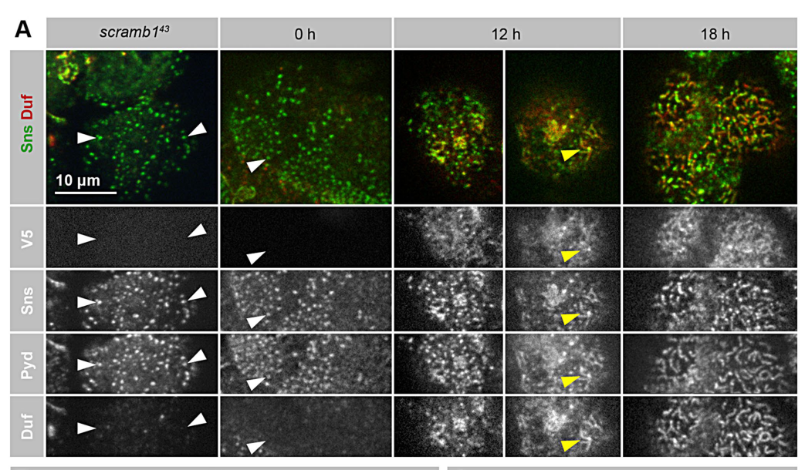

## Question

# Gene Research for Functional Annotation

## ⚠️ CRITICAL: Gene/Protein Identification Context

**BEFORE YOU BEGIN RESEARCH:** You MUST verify you are researching the CORRECT gene/protein. Gene symbols can be ambiguous, especially for less well-characterized genes from non-model organisms.

### Target Gene/Protein Identity (from UniProt):
- **UniProt Accession:** Q9W4T9
- **Protein Description:** SubName: Full=Kin of irre, isoform A {ECO:0000313|EMBL:AAF45847.2}; SubName: Full=Kin of irre, isoform B {ECO:0000313|EMBL:AAN09598.1}; SubName: Full=Kin of irre, isoform C {ECO:0000313|EMBL:AFH07219.1}; SubName: Full=Kin of irre, isoform D {ECO:0000313|EMBL:AFH07220.1}; SubName: Full=Kin of irre, isoform E {ECO:0000313|EMBL:AFH07221.1}; SubName: Full=Kin of irre, isoform F {ECO:0000313|EMBL:AFH07222.1}; SubName: Full=Kin of irre, isoform G {ECO:0000313|EMBL:AGB95042.1};
- **Gene Information:** Name=kirre {ECO:0000313|EMBL:AAF45847.2, ECO:0000313|FlyBase:FBgn0028369}; Synonyms=CT12279 {ECO:0000313|EMBL:AAF45847.2}, Dmel\CG3653 {ECO:0000313|EMBL:AAF45847.2}, dNeph {ECO:0000313|EMBL:AAF45847.2}, DUF {ECO:0000313|EMBL:AAF45847.2}, Duf {ECO:0000313|EMBL:AAF45847.2}, duf {ECO:0000313|EMBL:AAF45847.2}, DUF/KIRRE {ECO:0000313|EMBL:AAF45847.2}, Duf/Kirre {ECO:0000313|EMBL:AAF45847.2}, duf/kirre {ECO:0000313|EMBL:AAF45847.2}, EG:163A10.1 {ECO:0000313|EMBL:AAF45847.2}, Kirre {ECO:0000313|EMBL:AAF45847.2}, Neph1 {ECO:0000313|EMBL:AAF45847.2}, RH09239 {ECO:0000313|EMBL:AAF45847.2}; ORFNames=CG3653 {ECO:0000313|EMBL:AAF45847.2, ECO:0000313|FlyBase:FBgn0028369}, Dmel_CG3653 {ECO:0000313|EMBL:AAF45847.2};
- **Organism (full):** Drosophila melanogaster (Fruit fly).
- **Protein Family:** Not specified in UniProt
- **Key Domains:** CD80_C2-set. (IPR013162); Cell_adhesion_signaling. (IPR051275); Ig-like_dom. (IPR007110); Ig-like_dom_sf. (IPR036179); Ig-like_fold. (IPR013783)

### MANDATORY VERIFICATION STEPS:

1. **Check if the gene symbol "kirre" matches the protein description above**
2. **Verify the organism is correct:** Drosophila melanogaster (Fruit fly).
3. **Check if protein family/domains align with what you find in literature**
4. **If you find literature for a DIFFERENT gene with the same or similar symbol, STOP**

### If Gene Symbol is Ambiguous or You Cannot Find Relevant Literature:

**DO NOT PROCEED WITH RESEARCH ON A DIFFERENT GENE.** Instead:
- State clearly: "The gene symbol 'kirre' is ambiguous or literature is limited for this specific protein"
- Explain what you found (e.g., "Found extensive literature on a different gene with the same symbol in a different organism")
- Describe the protein based ONLY on the UniProt information provided above
- Suggest that the protein function can be inferred from domain/family information

### Research Target:

Please provide a comprehensive research report on the gene **kirre** (gene ID: kirre, UniProt: Q9W4T9) in DROME.

The research report should be a detailed narrative explaining the function, biological processes, and localization of the gene product. Citations should be given for all claims.

You should prioritize authoritative reviews and primary scientific literature when conducting research. You can supplement
this with annotations you find in gene/protein databases, but these can be outdated or inaccurate.

We are specifically interested in the primary function of the gene - for enzymes, what reaction is catalyzed, and what is the substrate specificity? For transporters, what is the substrate? For structural proteins or adapters, what is the broader structural role? For signaling molecules, what is the role in the pathway.

We are interested in where in or outside the cell the gene product carries out its function.

We are also interested in the signaling or biochemical pathways in which the gene functions. We are less interested in broad pleiotropic effects, except where these elucidate the precise role.

Include evidence where possible. We are interested in both experimental evidence as well as inference from structure, evolution, or bioinformatic analysis. Precise studies should be prioritized over high-throughput, where available.

## Output

Question: You are an expert researcher providing comprehensive, well-cited information.

Provide detailed information focusing on:
1. Key concepts and definitions with current understanding
2. Recent developments and latest research (prioritize 2023-2024 sources)
3. Current applications and real-world implementations
4. Expert opinions and analysis from authoritative sources
5. Relevant statistics and data from recent studies

Format as a comprehensive research report with proper citations. Include URLs and publication dates where available.
Always prioritize recent, authoritative sources and provide specific citations for all major claims.

# Gene Research for Functional Annotation

## ⚠️ CRITICAL: Gene/Protein Identification Context

**BEFORE YOU BEGIN RESEARCH:** You MUST verify you are researching the CORRECT gene/protein. Gene symbols can be ambiguous, especially for less well-characterized genes from non-model organisms.

### Target Gene/Protein Identity (from UniProt):
- **UniProt Accession:** Q9W4T9
- **Protein Description:** SubName: Full=Kin of irre, isoform A {ECO:0000313|EMBL:AAF45847.2}; SubName: Full=Kin of irre, isoform B {ECO:0000313|EMBL:AAN09598.1}; SubName: Full=Kin of irre, isoform C {ECO:0000313|EMBL:AFH07219.1}; SubName: Full=Kin of irre, isoform D {ECO:0000313|EMBL:AFH07220.1}; SubName: Full=Kin of irre, isoform E {ECO:0000313|EMBL:AFH07221.1}; SubName: Full=Kin of irre, isoform F {ECO:0000313|EMBL:AFH07222.1}; SubName: Full=Kin of irre, isoform G {ECO:0000313|EMBL:AGB95042.1};
- **Gene Information:** Name=kirre {ECO:0000313|EMBL:AAF45847.2, ECO:0000313|FlyBase:FBgn0028369}; Synonyms=CT12279 {ECO:0000313|EMBL:AAF45847.2}, Dmel\CG3653 {ECO:0000313|EMBL:AAF45847.2}, dNeph {ECO:0000313|EMBL:AAF45847.2}, DUF {ECO:0000313|EMBL:AAF45847.2}, Duf {ECO:0000313|EMBL:AAF45847.2}, duf {ECO:0000313|EMBL:AAF45847.2}, DUF/KIRRE {ECO:0000313|EMBL:AAF45847.2}, Duf/Kirre {ECO:0000313|EMBL:AAF45847.2}, duf/kirre {ECO:0000313|EMBL:AAF45847.2}, EG:163A10.1 {ECO:0000313|EMBL:AAF45847.2}, Kirre {ECO:0000313|EMBL:AAF45847.2}, Neph1 {ECO:0000313|EMBL:AAF45847.2}, RH09239 {ECO:0000313|EMBL:AAF45847.2}; ORFNames=CG3653 {ECO:0000313|EMBL:AAF45847.2, ECO:0000313|FlyBase:FBgn0028369}, Dmel_CG3653 {ECO:0000313|EMBL:AAF45847.2};
- **Organism (full):** Drosophila melanogaster (Fruit fly).
- **Protein Family:** Not specified in UniProt
- **Key Domains:** CD80_C2-set. (IPR013162); Cell_adhesion_signaling. (IPR051275); Ig-like_dom. (IPR007110); Ig-like_dom_sf. (IPR036179); Ig-like_fold. (IPR013783)

### MANDATORY VERIFICATION STEPS:

1. **Check if the gene symbol "kirre" matches the protein description above**
2. **Verify the organism is correct:** Drosophila melanogaster (Fruit fly).
3. **Check if protein family/domains align with what you find in literature**
4. **If you find literature for a DIFFERENT gene with the same or similar symbol, STOP**

### If Gene Symbol is Ambiguous or You Cannot Find Relevant Literature:

**DO NOT PROCEED WITH RESEARCH ON A DIFFERENT GENE.** Instead:
- State clearly: "The gene symbol 'kirre' is ambiguous or literature is limited for this specific protein"
- Explain what you found (e.g., "Found extensive literature on a different gene with the same symbol in a different organism")
- Describe the protein based ONLY on the UniProt information provided above
- Suggest that the protein function can be inferred from domain/family information

### Research Target:

Please provide a comprehensive research report on the gene **kirre** (gene ID: kirre, UniProt: Q9W4T9) in DROME.

The research report should be a detailed narrative explaining the function, biological processes, and localization of the gene product. Citations should be given for all claims.

You should prioritize authoritative reviews and primary scientific literature when conducting research. You can supplement
this with annotations you find in gene/protein databases, but these can be outdated or inaccurate.

We are specifically interested in the primary function of the gene - for enzymes, what reaction is catalyzed, and what is the substrate specificity? For transporters, what is the substrate? For structural proteins or adapters, what is the broader structural role? For signaling molecules, what is the role in the pathway.

We are interested in where in or outside the cell the gene product carries out its function.

We are also interested in the signaling or biochemical pathways in which the gene functions. We are less interested in broad pleiotropic effects, except where these elucidate the precise role.

Include evidence where possible. We are interested in both experimental evidence as well as inference from structure, evolution, or bioinformatic analysis. Precise studies should be prioritized over high-throughput, where available.

# Functional annotation of *Drosophila melanogaster kirre* (UniProt Q9W4T9)

## Identity and principal function

**Identity verified.** The specified fly gene, *kirre* (CG3653; FlyBase FBgn0028369), encodes **Kin of irre**, also called **Dumbfounded (Duf)**. It is distinct from the neighboring fly paralog *roughest* (*rst/irreC*) and from mammalian **KIRREL/NEPH1**, to which it is evolutionarily related. The original fly sequence study identified a signal peptide, one membrane-spanning segment and five extracellular immunoglobulin-like repeats, consistent with the Ig-like domains supplied for Q9W4T9. The studied embryonic cDNA predicted a 761-residue protein; lengths should not be assumed identical across the accession’s annotated isoforms. [Ruiz-Gómez *et al.*, *Cell*, July 2000](https://doi.org/10.1016/S0092-8674(00)00024-6). (ruizgomez2000drosophiladumbfoundeda pages 2-3, ruizgomez2000drosophiladumbfoundeda pages 3-4)

**Primary annotation:** Kirre/Duf is a **cell-surface adhesion and recognition protein that organizes contacts and associated intracellular signaling**, rather than an enzyme, transporter or demonstrated membrane fusogen. Its extracellular Ig-like region participates in interactions with the fly nephrin-family proteins Sticks and stones (**Sns**) and Hibris (**Hbs**); its intracellular region helps recruit fusion-associated scaffolds. Its best-established functions are founder-cell recognition during myoblast fusion and construction of the nephrocyte filtration slit diaphragm. The effect of the same adhesion-protein pair depends on cellular context: recent olfactory-circuit experiments implicate Kirre–Hbs/Sns in **repulsion** of inappropriate neuronal partners. (bulchand2010theintracellulardomain pages 1-2, shelton2009theimmunoglobulinsuperfamily pages 4-5, weavers2009theinsectnephrocyte pages 2-4, li2025repulsiveinteractionsinstruct pages 4-6)

The following evidence map separates those contexts and their experimental limitations. (bulchand2010theintracellulardomain pages 1-2, weavers2009theinsectnephrocyte pages 2-4, castillomancho2024phospholipidscramblase1 pages 4-6, li2025repulsiveinteractionsinstruct pages 4-6)

| Context / where Kirre acts | Direct molecular role and partner | Most discriminating experiment | Confidence/qualification |
|---|---|---|---|
| Embryonic somatic and visceral myoblast fusion; founder-cell and growing-myotube plasma membrane, concentrated at the fusogenic synapse | Kirre/Duf is a single-pass Ig-superfamily adhesion receptor that binds FCM-side Sns and Hbs and recruits or stabilizes Rols/Ants and Loner through its cytoplasmic region. It organizes adhesion-linked actin signaling but is **not itself a fusogen**; its paralog Rst is substantially redundant in founder cells. | Combined loss of `duf/kirre` and `rst` abolishes fusion, whereas single loss is mild; ectopic Duf recruits myoblasts. Duf truncation and co-immunoprecipitation mapped Rols/Loner interaction to its intracellular region ([Bulchand et al., 2010](https://doi.org/10.1371/journal.pone.0009374)). Duf/Kirre and Rols7 accumulate at visceral fusion sites ([Rudolf et al., 2014](https://doi.org/10.1186/1471-2121-15-27)). Ecdysone–EcR/USP activates `ants/rols`, whose product stabilizes Duf at the fusogenic synapse ([Ruan et al., 2024](https://doi.org/10.1016/j.cub.2024.02.056)). (bulchand2010theintracellulardomain pages 1-2, bulchand2010theintracellulardomain pages 4-6, ruan2024interorgansteroidhormone pages 3-5, ruan2024interorgansteroidhormone pages 6-8, rudolf2014distinctgeneticprograms pages 1-3) | **High** for recognition, adhesion and scaffold recruitment. The classic attractant phenotype does not by itself prove long-range chemotaxis. Kirre initiates fusion-site signaling rather than catalyzing lipid-bilayer merger; downstream actin requirements differ among somatic, circular-visceral and longitudinal-visceral muscles. |
| Garland and pericardial nephrocytes; cortical slit diaphragms sealing entrances to labyrinthine channels | Kirre/Duf is the fly NEPH1-like structural adhesion component. It colocalizes and cooperates with Sns/nephrin across the extracellular slit, while its cytoplasmic side participates in a Pyd/ZO-1-containing diaphragm complex. | A **duf-only deficiency**, `Df(1)duf^sps-1`, and other `duf` loss genotypes eliminate nephrocyte diaphragms and impair filtration ([Weavers et al., 2009](https://doi.org/10.1038/nature07526)). In `scramb1` mutants, Sns/Pyd/Src64B cortical pre-complexes form but lack Duf; induced Scramb1 restores Duf recruitment and diaphragm strands ([Castillo-Mancho et al., 2024](https://doi.org/10.1007/s00018-024-05287-z)). Cryo-ET subsequently resolved a bilayered fishnet whose geometry can be populated by interacting Sns and Kirre molecules ([Moser et al., 2025](https://doi.org/10.1038/s41467-025-64347-5)). (weavers2009theinsectnephrocyte pages 9-13, weavers2009theinsectnephrocyte pages 2-4, weavers2009theinsectnephrocyte pages 5-7, castillomancho2024phospholipidscramblase1 pages 4-6, moser2025theslitdiaphragma pages 4-5, moser2025theslitdiaphragma pages 2-4) | **High** for essential structural and filtration function and slit-diaphragm localization. Scramb1 probably recruits or stabilizes Kirre indirectly through membrane and Pyd organization; direct Scramb1–Kirre binding was not shown. Cryo-ET establishes architecture, but exact Sns:Kirre stoichiometry and domain arrangement remain models rather than uniquely resolved assignments. |
| Developing olfactory circuit; Kirre on VA1v olfactory-receptor-neuron axons, opposing Hbs/Sns on non-partner VA1d projection-neuron dendrites | Heterophilic Kirre–Hbs/Sns signaling acts **repulsively** in this neural context, excluding non-cognate ORN–PN matches—the opposite functional output from adhesion-associated attraction in muscle. | `kirre` loss or VA1v-ORN-specific knockdown and VA1d-PN-specific `hbs` or `sns` knockdown all caused VA1v axons to invade VA1d. Kirre overexpression in VA1d ORNs caused mistargeting that was suppressed by `hbs`, `sns`, or double-mutant backgrounds; reducing endogenous Kirre argued against a homophilic explanation ([Li et al., 2025 preprint](https://doi.org/10.1101/2025.03.01.640985)). (li2025repulsiveinteractionsinstruct pages 4-6, li2025repulsiveinteractionsinstruct pages 2-4) | **Moderate–high**, but based here on a 2025 preprint. The cellular orientation is critical: **Kirre is ORN-side and Hbs/Sns are PN-side** in the tested VA1v–VA1d interaction. Genetics supports trans-cellular repulsion; direct binding relies on earlier biochemical and structural evidence. |
| Evolutionary and preclinical applications; comparative NEPH1 biology and fly podocyte models | Kirre belongs to the conserved Irre-cell-recognition/Neph family. Mammalian NEPH1 can replace selected Kirre functions, making the fly useful for dissecting conserved adhesion, filtration-barrier assembly and trafficking mechanisms. | Mouse Neph1—but not Neph2 or Neph3—rescued the `kirre` garland-nephrocyte phenotype; a conserved cytoplasmic KIN1 motif was required ([Helmstädter et al., 2012](https://doi.org/10.1371/journal.pone.0040300)). Kirre/Sns-containing nephrocyte diaphragms are used as structural and functional readouts in genetic disease models, imaging and omics ([Koehler and Huber, 2023](https://doi.org/10.1007/s00467-023-05996-w)). (helmstadter2012functionalstudyof pages 1-3, helmstadter2012functionalstudyof pages 4-7, koehler2023insightsintohuman pages 2-5) | **High** for evolutionary conservation and model utility; **low for direct clinical translation**. Fly diaphragms are autocellular and lack mammalian glomerular endothelial contacts. No cited study establishes Kirre as an approved drug target or demonstrates that compounds affecting fly diaphragm morphology act directly on Kirre. |

*Table: Evidence map for Drosophila melanogaster Kirre/Duf (UniProt Q9W4T9), distinguishing its experimentally supported roles in muscle fusion, nephrocyte filtration and neural wiring. It highlights recent structural and assembly findings while identifying redundancy, inferential limits and translational caveats.*

## Molecular role in muscle development

**Where it acts.** In embryonic somatic muscle, Duf is expressed on **founder myoblasts and growing myotubes**, facing fusion-competent myoblasts (FCMs), which express Sns and Hbs. Duf and Sns concentrate at the intercellular **fusogenic synapse**, within the fusion-restricted myogenic adhesive structure (*FuRMAS*). Duf is also detected with the adaptor Rols7 at contacts between longitudinal visceral founder cells and Sns-positive FCMs. Thus its function is principally at the **plasma membrane and the extracellular interface between two cells**, with its cytoplasmic tail connecting contact recognition to intracellular machinery. [Ruiz-Gómez *et al.*, 2000](https://doi.org/10.1016/S0092-8674(00)00024-6); [Rudolf *et al.*, *BMC Cell Biology*, July 2014](https://doi.org/10.1186/1471-2121-15-27). (ruizgomez2000drosophiladumbfoundeda pages 3-4, bulchand2010theintracellulardomain pages 1-2, rudolf2014distinctgeneticprograms pages 1-3)

**What it does.** Ectopic embryonic Duf expression redirects and clusters FCMs, whereas mutant embryos lack their normal aggregation around founders even though founder specification can persist. Those observations establish a founder-associated **recruitment/recognition cue**, but do not by themselves distinguish a diffusible, long-range chemotactic signal from contact-mediated attraction or stabilization. S2-cell adhesion experiments support heterotypic Duf–Sns binding; Hbs-expressing cells likewise adhere to Kirre-expressing cells. In *sns* mutants, Hbs supports limited initial fusion, whereas *sns;hbs* double mutants generally lack even the resulting binucleate muscle precursors. [Ruiz-Gómez *et al.*, 2000](https://doi.org/10.1016/S0092-8674(00)00024-6); [Shelton *et al.*, *Development*, April 2009](https://doi.org/10.1242/dev.026302). (ruizgomez2000drosophiladumbfoundeda pages 6-7, dworak2002myoblastfusionin pages 3-4, shelton2009theimmunoglobulinsuperfamily pages 4-5)

**Genetic qualification.** The severe phenotype in an early chromosomal deficiency cannot be assigned to *kirre* alone: it also affected the neighboring, partly redundant *rst*. Later experiments showed that loss of **both Duf/Kirre and Rst** blocks somatic fusion, while single loss can be much milder. Re-expression and domain-rescue experiments establish a substantive Duf function despite that redundancy. Calling Kirre alone universally indispensable for embryonic myoblast fusion would therefore overstate the evidence. [Dworak and Sink, *BioEssays*, July 2002](https://doi.org/10.1002/bies.10115); [Bulchand *et al.*, *PLoS ONE*, 23 February 2010](https://doi.org/10.1371/journal.pone.0009374). (dworak2002myoblastfusionin pages 3-4, bulchand2010theintracellulardomain pages 1-2)

**How adhesion connects to the fusion pathway.** Duf’s intracellular region associates with **Rolling pebbles/Antisocial (Rols/Ants)** and **Loner** and recruits them toward cell contacts in experimental assays. Cytoplasmic truncation progressively reduces that recruitment and the efficiency of later fusion rounds; the extreme C-terminal predicted PDZ-binding sequence proved dispensable in the tested embryonic rescue assay. These data support a **scaffolding/signaling role**, not a catalytic activity or proof that Duf itself merges lipid bilayers. At the contact, Duf–Sns-dependent organization precedes actin remodeling, including an F-actin-rich invasive structure in the FCM. Downstream actin-regulator requirements are not identical across somatic, circular-visceral and longitudinal-visceral fusion. [Bulchand *et al.*, 2010](https://doi.org/10.1371/journal.pone.0009374); [Rudolf *et al.*, 2014](https://doi.org/10.1186/1471-2121-15-27). (bulchand2010theintracellulardomain pages 4-6, bulchand2010theintracellulardomain pages 1-2, ruan2024interorgansteroidhormone pages 3-5, rudolf2014distinctgeneticprograms pages 1-3)

A particularly relevant **2024 pathway result** places Duf downstream of developmental hormonal regulation *without making Duf the hormone receptor*: amnioserosa-derived ecdysone activates muscle EcR/USP, which cooperates with Twist to increase transcription of *ants/rols*. Ants stabilizes Duf protein at the fusogenic synapse; ecdysone-deficient embryos have reduced Duf **protein despite unchanged *duf* transcript**, and restoring Ants rescues fusion. This specifies the pathway **ecdysone → EcR/USP and Twist → Ants/Rols → Duf stabilization → organized Duf–Sns contacts and fusion-associated actin**. [Ruan *et al.*, *Current Biology*, 8 April 2024](https://doi.org/10.1016/j.cub.2024.02.056). (ruan2024interorgansteroidhormone pages 5-6, ruan2024interorgansteroidhormone pages 6-8, ruan2024interorgansteroidhormone pages 8-10)

## Filtration-barrier function and precise localization

Garland and pericardial nephrocytes use Kirre/Duf in a second, exceptionally well-supported structural role. Here it is concentrated with Sns at **slit diaphragms spanning entrances to plasma-membrane invaginations called labyrinthine channels**; the junction faces the extracellular haemolymph. Surface immunolabeling and immunoelectron microscopy place Duf **at the diaphragm itself**, while genetic disruption of either *duf* or *sns* removes or severely disrupts diaphragms. Importantly, experiments included a **small deficiency removing the *duf* locus alone**, not solely deletions shared with *rst*. [Weavers *et al.*, *Nature*, 2009](https://doi.org/10.1038/nature07526). (weavers2009theinsectnephrocyte pages 9-13, weavers2009theinsectnephrocyte pages 1-2, weavers2009theinsectnephrocyte pages 2-4, weavers2009theinsectnephrocyte pages 5-7)

Functional measurements support a barrier role rather than simply expression at a junction. In one study, larval Duf-deficient nephrocytes had a basement membrane measuring **202 ± 24 nm** (*n* = 13), versus **57 ± 4 nm** (*n* = 11) in controls. In a fluorescent-dextran uptake assay, the reported **large-to-small dextran uptake ratio** changed from **1:3.6** in wild type (*n* = 20) to **1:22.5** in *duf* mutants (*n* = 20); small-dextran uptake was reported as unchanged. These values describe a disrupted, more restrictive overall uptake phenotype—not a direct measurement of Kirre binding to a dextran “substrate.” [Weavers *et al.*, 2009](https://doi.org/10.1038/nature07526). (weavers2009theinsectnephrocyte pages 2-4, weavers2009theinsectnephrocyte pages 4-5)

**2024 assembly mechanism.** In *scramb1* mutant nephrocytes, cortical foci already contain Sns, the ZO-1-related scaffold Polychaetoid (**Pyd**) and active Src64B, **but lack Duf** and fail to mature into normal diaphragms. Inducing Scramb1 restores Duf accumulation in these complexes; short Duf-positive diaphragm structures appear by approximately **12 hours**, with a broader strand network by **18 hours**. This supports a requirement for Scramb1-dependent membrane organization in **recruiting or stabilizing Kirre**, not direct Scramb1–Kirre binding: the investigators did not establish such direct binding and found that Duf did not recruit Scramb1 in their S2-cell assay. Figure 3 shows the staged appearance of Duf alongside Scramb1, Sns and Pyd. [Castillo-Mancho *et al.*, *Cellular and Molecular Life Sciences*, June 2024](https://doi.org/10.1007/s00018-024-05287-z). (castillomancho2024phospholipidscramblase1 pages 4-6, castillomancho2024phospholipidscramblase1 media aac6cc06)

**2025 structural advance.** Cryo-electron tomography of native fly nephrocytes resolved the diaphragm as **two stacked extracellular fishnet-like layers**, rather than establishing a simple one-dimensional zipper. The intermembrane width was approximately **44 nm**; the authors averaged **595 diaphragm segments** in the accessible study text. Fluorescence microscopy localized Sns and Kirre to the same diaphragm pattern. Their Ig-domain lengths and the observed geometry support molecular models involving interactions across the slit, but the images **do not identify every strand as Kirre versus Sns or determine a unique protein arrangement or stoichiometry**. Thus the fishnet is observed; its exact molecular assignment remains a model. [Moser *et al.*, *Nature Communications*, October 2025](https://doi.org/10.1038/s41467-025-64347-5). (moser2025theslitdiaphragma pages 4-5, moser2025theslitdiaphragma pages 2-4, moser2025theslitdiaphragm pages 7-13)

## Other context: neuronal recognition

A **March 2025 preprint** reports a different consequence of Kirre-mediated cell-surface recognition in the developing olfactory system. In its tested VA1v–VA1d circuit, **Kirre acts on olfactory receptor neuron (ORN) axons**, while **Hbs and Sns act on opposing projection-neuron (PN) dendrites**. VA1v-ORN-specific *kirre* knockdown or VA1d-PN-specific *hbs* or *sns* knockdown caused VA1v axons to mistarget into the nonpartner VA1d glomerulus. Conversely, Kirre overexpression in VA1d ORNs induced mistargeting suppressed by reducing Hbs/Sns. The authors interpret these reciprocal, cell-specific effects as **heterophilic repulsion preventing inappropriate partner matching**; their experiments do not establish a Kirre-specific intracellular repulsion cascade. This preprint finding should not be mistaken for a reversal of the ORN/PN expression assignment, or generalized to every tissue in which Kirre and Sns associate. [Li *et al.*, *bioRxiv*, March 2025](https://doi.org/10.1101/2025.03.01.640985). (li2025repulsiveinteractionsinstruct pages 4-6, li2025repulsiveinteractionsinstruct pages 2-4)

## Research use and interpretation

The fly Kirre–Sns diaphragm provides a **tractable experimental readout** for investigating conserved nephrin/NEPH1-like junction organization, trafficking and filtration in genetic kidney-disease models. Functional conservation has experimental support: mammalian **Neph1**, but not Neph2 or Neph3, rescued a tested fly *kirre*-deficient garland-nephrocyte phenotype, and Kirre cytoplasmic-domain analyses implicated a conserved **KIN1** motif in that context. This does **not** make fly *kirre* a human disease gene or show that a particular drug acts directly on Kirre. Moreover, fly nephrocyte diaphragms occur between processes of an individual cell, unlike mammalian inter-podocyte junctions, and fly nephrocytes do not reproduce the entire glomerular vascular environment. [Helmstädter *et al.*, *PLoS ONE*, July 2012](https://doi.org/10.1371/journal.pone.0040300); [Koehler and Huber, *Pediatric Nephrology*, May 2023](https://doi.org/10.1007/s00467-023-05996-w). (helmstadter2012functionalstudyof pages 4-7, koehler2023insightsintohuman pages 2-5)

**Bottom line:** annotate Q9W4T9 as a **single-pass, Ig-superfamily plasma-membrane adhesion protein** that recognizes opposing cells and organizes adhesion-linked signaling during fly muscle fusion, and as an **essential structural constituent of the nephrocyte slit-diaphragm filtration barrier**. Specify the relevant cell and junction when describing localization; distinguish its demonstrated partner interactions from proposed downstream mechanisms, and distinguish *kirre*-specific effects from redundancy with *rst*. (ruizgomez2000drosophiladumbfoundeda pages 2-3, bulchand2010theintracellulardomain pages 1-2, weavers2009theinsectnephrocyte pages 2-4, castillomancho2024phospholipidscramblase1 pages 4-6)

References

1. (ruizgomez2000drosophiladumbfoundeda pages 2-3): Mar Ruiz-Gómez, Nikola Coutts, Alivia Price, Michael V Taylor, and Michael Bate. Drosophila dumbfounded a myoblast attractant essential for fusion. Cell, 102:189-198, Jul 2000. URL: https://doi.org/10.1016/s0092-8674(00)00024-6, doi:10.1016/s0092-8674(00)00024-6. This article has 390 citations and is from a highest quality peer-reviewed journal.

2. (ruizgomez2000drosophiladumbfoundeda pages 3-4): Mar Ruiz-Gómez, Nikola Coutts, Alivia Price, Michael V Taylor, and Michael Bate. Drosophila dumbfounded a myoblast attractant essential for fusion. Cell, 102:189-198, Jul 2000. URL: https://doi.org/10.1016/s0092-8674(00)00024-6, doi:10.1016/s0092-8674(00)00024-6. This article has 390 citations and is from a highest quality peer-reviewed journal.

3. (bulchand2010theintracellulardomain pages 1-2): Sarada Bulchand, Sree Devi Menon, Simi Elizabeth George, and William Chia. The intracellular domain of dumbfounded affects myoblast fusion efficiency and interacts with rolling pebbles and loner. PLoS ONE, 5:e9374, Feb 2010. URL: https://doi.org/10.1371/journal.pone.0009374, doi:10.1371/journal.pone.0009374. This article has 37 citations and is from a peer-reviewed journal.

4. (shelton2009theimmunoglobulinsuperfamily pages 4-5): Claude Shelton, Kiranmai S. Kocherlakota, Shufei Zhuang, and Susan M. Abmayr. The immunoglobulin superfamily member hbs functions redundantly with sns in interactions between founder and fusion-competent myoblasts. Development, 136:1159-1168, Apr 2009. URL: https://doi.org/10.1242/dev.026302, doi:10.1242/dev.026302. This article has 95 citations and is from a domain leading peer-reviewed journal.

5. (weavers2009theinsectnephrocyte pages 2-4): Helen Weavers, Silvia Prieto-Sánchez, Ferdinand Grawe, Amparo Garcia-López, Ruben Artero, Michaela Wilsch-Bräuninger, Mar Ruiz-Gómez, Helen Skaer, and Barry Denholm. The insect nephrocyte is a podocyte-like cell with a filtration slit diaphragm. Nature, 457:322-326, Oct 2009. URL: https://doi.org/10.1038/nature07526, doi:10.1038/nature07526. This article has 387 citations and is from a highest quality peer-reviewed journal.

6. (li2025repulsiveinteractionsinstruct pages 4-6): Zhuoran Li, Cheng Lyu, Chuanyun Xu, Ying Hu, David J. Luginbuhl, Asaf B. Caspi-Lebovic, Jessica M. Priest, Engin Özkan, and Liqun Luo. Repulsive interactions instruct synaptic partner matching in an olfactory circuit. bioRxiv, Mar 2025. URL: https://doi.org/10.1101/2025.03.01.640985, doi:10.1101/2025.03.01.640985. This article has 5 citations.

7. (castillomancho2024phospholipidscramblase1 pages 4-6): Vicente Castillo-Mancho, Alexandra Atienza-Manuel, Jorge Sarmiento-Jiménez, Mar Ruiz-Gómez, and Joaquim Culi. Phospholipid scramblase 1: an essential component of the nephrocyte slit diaphragm. Cellular and Molecular Life Sciences: CMLS, Jun 2024. URL: https://doi.org/10.1007/s00018-024-05287-z, doi:10.1007/s00018-024-05287-z. This article has 5 citations.

8. (bulchand2010theintracellulardomain pages 4-6): Sarada Bulchand, Sree Devi Menon, Simi Elizabeth George, and William Chia. The intracellular domain of dumbfounded affects myoblast fusion efficiency and interacts with rolling pebbles and loner. PLoS ONE, 5:e9374, Feb 2010. URL: https://doi.org/10.1371/journal.pone.0009374, doi:10.1371/journal.pone.0009374. This article has 37 citations and is from a peer-reviewed journal.

9. (ruan2024interorgansteroidhormone pages 3-5): Zhi-Rong Ruan, Ze Yu, Chao Xing, and Elizabeth H. Chen. Inter-organ steroid hormone signaling promotes myoblast fusion via direct transcriptional regulation of a single key effector gene. Current Biology, 34:1438-1452.e6, Apr 2024. URL: https://doi.org/10.1016/j.cub.2024.02.056, doi:10.1016/j.cub.2024.02.056. This article has 9 citations and is from a highest quality peer-reviewed journal.

10. (ruan2024interorgansteroidhormone pages 6-8): Zhi-Rong Ruan, Ze Yu, Chao Xing, and Elizabeth H. Chen. Inter-organ steroid hormone signaling promotes myoblast fusion via direct transcriptional regulation of a single key effector gene. Current Biology, 34:1438-1452.e6, Apr 2024. URL: https://doi.org/10.1016/j.cub.2024.02.056, doi:10.1016/j.cub.2024.02.056. This article has 9 citations and is from a highest quality peer-reviewed journal.

11. (rudolf2014distinctgeneticprograms pages 1-3): Anja Rudolf, Detlev Buttgereit, Matthias Jacobs, Georg Wolfstetter, Dörthe Kesper, Michael Pütz, Susanne Berger, Renate Renkawitz-Pohl, Anne Holz, and Susanne F Önel. Distinct genetic programs guide drosophila circular and longitudinal visceral myoblast fusion. BMC Cell Biology, Jul 2014. URL: https://doi.org/10.1186/1471-2121-15-27, doi:10.1186/1471-2121-15-27. This article has 16 citations.

12. (weavers2009theinsectnephrocyte pages 9-13): Helen Weavers, Silvia Prieto-Sánchez, Ferdinand Grawe, Amparo Garcia-López, Ruben Artero, Michaela Wilsch-Bräuninger, Mar Ruiz-Gómez, Helen Skaer, and Barry Denholm. The insect nephrocyte is a podocyte-like cell with a filtration slit diaphragm. Nature, 457:322-326, Oct 2009. URL: https://doi.org/10.1038/nature07526, doi:10.1038/nature07526. This article has 387 citations and is from a highest quality peer-reviewed journal.

13. (weavers2009theinsectnephrocyte pages 5-7): Helen Weavers, Silvia Prieto-Sánchez, Ferdinand Grawe, Amparo Garcia-López, Ruben Artero, Michaela Wilsch-Bräuninger, Mar Ruiz-Gómez, Helen Skaer, and Barry Denholm. The insect nephrocyte is a podocyte-like cell with a filtration slit diaphragm. Nature, 457:322-326, Oct 2009. URL: https://doi.org/10.1038/nature07526, doi:10.1038/nature07526. This article has 387 citations and is from a highest quality peer-reviewed journal.

14. (moser2025theslitdiaphragma pages 4-5): Deborah Moser, Konrad Lang, Alexandra N. Birtasu, Florian Grahammer, Martin Helmstädter, Margot P. Scheffer, Tobias Hermle, and Achilleas S. Frangakis. The slit diaphragm in drosophila exhibits a bilayered, fishnet architecture. Nature Communications, Oct 2025. URL: https://doi.org/10.1038/s41467-025-64347-5, doi:10.1038/s41467-025-64347-5. This article has 10 citations and is from a highest quality peer-reviewed journal.

15. (moser2025theslitdiaphragma pages 2-4): Deborah Moser, Konrad Lang, Alexandra N. Birtasu, Florian Grahammer, Martin Helmstädter, Margot P. Scheffer, Tobias Hermle, and Achilleas S. Frangakis. The slit diaphragm in drosophila exhibits a bilayered, fishnet architecture. Nature Communications, Oct 2025. URL: https://doi.org/10.1038/s41467-025-64347-5, doi:10.1038/s41467-025-64347-5. This article has 10 citations and is from a highest quality peer-reviewed journal.

16. (li2025repulsiveinteractionsinstruct pages 2-4): Zhuoran Li, Cheng Lyu, Chuanyun Xu, Ying Hu, David J. Luginbuhl, Asaf B. Caspi-Lebovic, Jessica M. Priest, Engin Özkan, and Liqun Luo. Repulsive interactions instruct synaptic partner matching in an olfactory circuit. bioRxiv, Mar 2025. URL: https://doi.org/10.1101/2025.03.01.640985, doi:10.1101/2025.03.01.640985. This article has 5 citations.

17. (helmstadter2012functionalstudyof pages 1-3): Martin Helmstädter, Kevin Lüthy, Markus Gödel, Matias Simons, Ashish, Deepak Nihalani, Stefan A. Rensing, Karl-Friedrich Fischbach, and Tobias B. Huber. Functional study of mammalian neph proteins in drosophila melanogaster. PLoS ONE, 7:e40300, Jul 2012. URL: https://doi.org/10.1371/journal.pone.0040300, doi:10.1371/journal.pone.0040300. This article has 37 citations and is from a peer-reviewed journal.

18. (helmstadter2012functionalstudyof pages 4-7): Martin Helmstädter, Kevin Lüthy, Markus Gödel, Matias Simons, Ashish, Deepak Nihalani, Stefan A. Rensing, Karl-Friedrich Fischbach, and Tobias B. Huber. Functional study of mammalian neph proteins in drosophila melanogaster. PLoS ONE, 7:e40300, Jul 2012. URL: https://doi.org/10.1371/journal.pone.0040300, doi:10.1371/journal.pone.0040300. This article has 37 citations and is from a peer-reviewed journal.

19. (koehler2023insightsintohuman pages 2-5): Sybille Koehler and Tobias B. Huber. Insights into human kidney function from the study of drosophila. Pediatric Nephrology (Berlin, Germany), 38:3875-3887, May 2023. URL: https://doi.org/10.1007/s00467-023-05996-w, doi:10.1007/s00467-023-05996-w. This article has 21 citations.

20. (ruizgomez2000drosophiladumbfoundeda pages 6-7): Mar Ruiz-Gómez, Nikola Coutts, Alivia Price, Michael V Taylor, and Michael Bate. Drosophila dumbfounded a myoblast attractant essential for fusion. Cell, 102:189-198, Jul 2000. URL: https://doi.org/10.1016/s0092-8674(00)00024-6, doi:10.1016/s0092-8674(00)00024-6. This article has 390 citations and is from a highest quality peer-reviewed journal.

21. (dworak2002myoblastfusionin pages 3-4): Heather A. Dworak and Helen Sink. Myoblast fusion in drosophila. BioEssays : news and reviews in molecular, cellular and developmental biology, 24 7:591-601, Jul 2002. URL: https://doi.org/10.1002/bies.10115, doi:10.1002/bies.10115. This article has 113 citations.

22. (ruan2024interorgansteroidhormone pages 5-6): Zhi-Rong Ruan, Ze Yu, Chao Xing, and Elizabeth H. Chen. Inter-organ steroid hormone signaling promotes myoblast fusion via direct transcriptional regulation of a single key effector gene. Current Biology, 34:1438-1452.e6, Apr 2024. URL: https://doi.org/10.1016/j.cub.2024.02.056, doi:10.1016/j.cub.2024.02.056. This article has 9 citations and is from a highest quality peer-reviewed journal.

23. (ruan2024interorgansteroidhormone pages 8-10): Zhi-Rong Ruan, Ze Yu, Chao Xing, and Elizabeth H. Chen. Inter-organ steroid hormone signaling promotes myoblast fusion via direct transcriptional regulation of a single key effector gene. Current Biology, 34:1438-1452.e6, Apr 2024. URL: https://doi.org/10.1016/j.cub.2024.02.056, doi:10.1016/j.cub.2024.02.056. This article has 9 citations and is from a highest quality peer-reviewed journal.

24. (weavers2009theinsectnephrocyte pages 1-2): Helen Weavers, Silvia Prieto-Sánchez, Ferdinand Grawe, Amparo Garcia-López, Ruben Artero, Michaela Wilsch-Bräuninger, Mar Ruiz-Gómez, Helen Skaer, and Barry Denholm. The insect nephrocyte is a podocyte-like cell with a filtration slit diaphragm. Nature, 457:322-326, Oct 2009. URL: https://doi.org/10.1038/nature07526, doi:10.1038/nature07526. This article has 387 citations and is from a highest quality peer-reviewed journal.

25. (weavers2009theinsectnephrocyte pages 4-5): Helen Weavers, Silvia Prieto-Sánchez, Ferdinand Grawe, Amparo Garcia-López, Ruben Artero, Michaela Wilsch-Bräuninger, Mar Ruiz-Gómez, Helen Skaer, and Barry Denholm. The insect nephrocyte is a podocyte-like cell with a filtration slit diaphragm. Nature, 457:322-326, Oct 2009. URL: https://doi.org/10.1038/nature07526, doi:10.1038/nature07526. This article has 387 citations and is from a highest quality peer-reviewed journal.

26. (castillomancho2024phospholipidscramblase1 media aac6cc06): Vicente Castillo-Mancho, Alexandra Atienza-Manuel, Jorge Sarmiento-Jiménez, Mar Ruiz-Gómez, and Joaquim Culi. Phospholipid scramblase 1: an essential component of the nephrocyte slit diaphragm. Cellular and Molecular Life Sciences: CMLS, Jun 2024. URL: https://doi.org/10.1007/s00018-024-05287-z, doi:10.1007/s00018-024-05287-z. This article has 5 citations.

27. (moser2025theslitdiaphragm pages 7-13): Deborah Moser, Konrad Lang, Alexandra N. Birtasu, Margot P. Scheffer, Martin Helmstädter, Tobias Hermle, and Achilleas S. Frangakis. The slit diaphragm in drosophila features a bi-layered, fishnet-like architecture. bioRxiv, Mar 2025. URL: https://doi.org/10.1101/2025.03.06.641875, doi:10.1101/2025.03.06.641875. This article has 0 citations.

## Artifacts

- [Edison artifact artifact-00](kirre-deep-research-falcon_artifacts/artifact-00.md)

## Citations

1. ruizgomez2000drosophiladumbfoundeda pages 2-3
2. ruizgomez2000drosophiladumbfoundeda pages 3-4
3. bulchand2010theintracellulardomain pages 1-2
4. shelton2009theimmunoglobulinsuperfamily pages 4-5
5. weavers2009theinsectnephrocyte pages 2-4
6. li2025repulsiveinteractionsinstruct pages 4-6
7. bulchand2010theintracellulardomain pages 4-6
8. ruan2024interorgansteroidhormone pages 3-5
9. ruan2024interorgansteroidhormone pages 6-8
10. rudolf2014distinctgeneticprograms pages 1-3
11. weavers2009theinsectnephrocyte pages 9-13
12. weavers2009theinsectnephrocyte pages 5-7
13. moser2025theslitdiaphragma pages 4-5
14. moser2025theslitdiaphragma pages 2-4
15. li2025repulsiveinteractionsinstruct pages 2-4
16. helmstadter2012functionalstudyof pages 1-3
17. helmstadter2012functionalstudyof pages 4-7
18. koehler2023insightsintohuman pages 2-5
19. ruizgomez2000drosophiladumbfoundeda pages 6-7
20. dworak2002myoblastfusionin pages 3-4
21. ruan2024interorgansteroidhormone pages 5-6
22. ruan2024interorgansteroidhormone pages 8-10
23. weavers2009theinsectnephrocyte pages 1-2
24. weavers2009theinsectnephrocyte pages 4-5
25. moser2025theslitdiaphragm pages 7-13
26. Ruiz-Gómez *et al.*, *Cell*, July 2000
27. Bulchand et al., 2010
28. Rudolf et al., 2014
29. Ruan et al., 2024
30. Weavers et al., 2009
31. Castillo-Mancho et al., 2024
32. Moser et al., 2025
33. Li et al., 2025 preprint
34. Helmstädter et al., 2012
35. Koehler and Huber, 2023
36. Ruiz-Gómez *et al.*, 2000
37. Rudolf *et al.*, *BMC Cell Biology*, July 2014
38. Shelton *et al.*, *Development*, April 2009
39. Dworak and Sink, *BioEssays*, July 2002
40. Bulchand *et al.*, *PLoS ONE*, 23 February 2010
41. Bulchand *et al.*, 2010
42. Rudolf *et al.*, 2014
43. Ruan *et al.*, *Current Biology*, 8 April 2024
44. Weavers *et al.*, *Nature*, 2009
45. Weavers *et al.*, 2009
46. Castillo-Mancho *et al.*, *Cellular and Molecular Life Sciences*, June 2024
47. Moser *et al.*, *Nature Communications*, October 2025
48. Li *et al.*, *bioRxiv*, March 2025
49. Helmstädter *et al.*, *PLoS ONE*, July 2012
50. Koehler and Huber, *Pediatric Nephrology*, May 2023
51. https://doi.org/10.1016/S0092-8674(00
52. https://doi.org/10.1371/journal.pone.0009374
53. https://doi.org/10.1186/1471-2121-15-27
54. https://doi.org/10.1016/j.cub.2024.02.056
55. https://doi.org/10.1038/nature07526
56. https://doi.org/10.1007/s00018-024-05287-z
57. https://doi.org/10.1038/s41467-025-64347-5
58. https://doi.org/10.1101/2025.03.01.640985
59. https://doi.org/10.1371/journal.pone.0040300
60. https://doi.org/10.1007/s00467-023-05996-w
61. https://doi.org/10.1242/dev.026302
62. https://doi.org/10.1002/bies.10115
63. https://doi.org/10.1016/s0092-8674(00
64. https://doi.org/10.1371/journal.pone.0009374,
65. https://doi.org/10.1242/dev.026302,
66. https://doi.org/10.1038/nature07526,
67. https://doi.org/10.1101/2025.03.01.640985,
68. https://doi.org/10.1007/s00018-024-05287-z,
69. https://doi.org/10.1016/j.cub.2024.02.056,
70. https://doi.org/10.1186/1471-2121-15-27,
71. https://doi.org/10.1038/s41467-025-64347-5,
72. https://doi.org/10.1371/journal.pone.0040300,
73. https://doi.org/10.1007/s00467-023-05996-w,
74. https://doi.org/10.1002/bies.10115,
75. https://doi.org/10.1101/2025.03.06.641875,