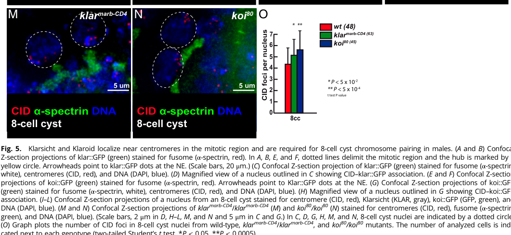

## Question

# Gene Research for Functional Annotation

## ⚠️ CRITICAL: Gene/Protein Identification Context

**BEFORE YOU BEGIN RESEARCH:** You MUST verify you are researching the CORRECT gene/protein. Gene symbols can be ambiguous, especially for less well-characterized genes from non-model organisms.

### Target Gene/Protein Identity (from UniProt):
- **UniProt Accession:** A0A0B4KEE4
- **Protein Description:** RecName: Full=Klaroid protein {ECO:0000305};
- **Gene Information:** Name=koi {ECO:0000312|FlyBase:FBgn0265003}; ORFNames=CG44154 {ECO:0000312|FlyBase:FBgn0265003};
- **Organism (full):** Drosophila melanogaster (Fruit fly).
- **Protein Family:** Not specified in UniProt
- **Key Domains:** SUN1-5. (IPR045119); SUN_dom. (IPR012919); Sad1_UNC (PF07738)

### MANDATORY VERIFICATION STEPS:

1. **Check if the gene symbol "koi" matches the protein description above**
2. **Verify the organism is correct:** Drosophila melanogaster (Fruit fly).
3. **Check if protein family/domains align with what you find in literature**
4. **If you find literature for a DIFFERENT gene with the same or similar symbol, STOP**

### If Gene Symbol is Ambiguous or You Cannot Find Relevant Literature:

**DO NOT PROCEED WITH RESEARCH ON A DIFFERENT GENE.** Instead:
- State clearly: "The gene symbol 'koi' is ambiguous or literature is limited for this specific protein"
- Explain what you found (e.g., "Found extensive literature on a different gene with the same symbol in a different organism")
- Describe the protein based ONLY on the UniProt information provided above
- Suggest that the protein function can be inferred from domain/family information

### Research Target:

Please provide a comprehensive research report on the gene **koi** (gene ID: koi, UniProt: A0A0B4KEE4) in DROME.

The research report should be a detailed narrative explaining the function, biological processes, and localization of the gene product. Citations should be given for all claims.

You should prioritize authoritative reviews and primary scientific literature when conducting research. You can supplement
this with annotations you find in gene/protein databases, but these can be outdated or inaccurate.

We are specifically interested in the primary function of the gene - for enzymes, what reaction is catalyzed, and what is the substrate specificity? For transporters, what is the substrate? For structural proteins or adapters, what is the broader structural role? For signaling molecules, what is the role in the pathway.

We are interested in where in or outside the cell the gene product carries out its function.

We are also interested in the signaling or biochemical pathways in which the gene functions. We are less interested in broad pleiotropic effects, except where these elucidate the precise role.

Include evidence where possible. We are interested in both experimental evidence as well as inference from structure, evolution, or bioinformatic analysis. Precise studies should be prioritized over high-throughput, where available.

## Output

Question: You are an expert researcher providing comprehensive, well-cited information.

Provide detailed information focusing on:
1. Key concepts and definitions with current understanding
2. Recent developments and latest research (prioritize 2023-2024 sources)
3. Current applications and real-world implementations
4. Expert opinions and analysis from authoritative sources
5. Relevant statistics and data from recent studies

Format as a comprehensive research report with proper citations. Include URLs and publication dates where available.
Always prioritize recent, authoritative sources and provide specific citations for all major claims.

# Gene Research for Functional Annotation

## ⚠️ CRITICAL: Gene/Protein Identification Context

**BEFORE YOU BEGIN RESEARCH:** You MUST verify you are researching the CORRECT gene/protein. Gene symbols can be ambiguous, especially for less well-characterized genes from non-model organisms.

### Target Gene/Protein Identity (from UniProt):
- **UniProt Accession:** A0A0B4KEE4
- **Protein Description:** RecName: Full=Klaroid protein {ECO:0000305};
- **Gene Information:** Name=koi {ECO:0000312|FlyBase:FBgn0265003}; ORFNames=CG44154 {ECO:0000312|FlyBase:FBgn0265003};
- **Organism (full):** Drosophila melanogaster (Fruit fly).
- **Protein Family:** Not specified in UniProt
- **Key Domains:** SUN1-5. (IPR045119); SUN_dom. (IPR012919); Sad1_UNC (PF07738)

### MANDATORY VERIFICATION STEPS:

1. **Check if the gene symbol "koi" matches the protein description above**
2. **Verify the organism is correct:** Drosophila melanogaster (Fruit fly).
3. **Check if protein family/domains align with what you find in literature**
4. **If you find literature for a DIFFERENT gene with the same or similar symbol, STOP**

### If Gene Symbol is Ambiguous or You Cannot Find Relevant Literature:

**DO NOT PROCEED WITH RESEARCH ON A DIFFERENT GENE.** Instead:
- State clearly: "The gene symbol 'koi' is ambiguous or literature is limited for this specific protein"
- Explain what you found (e.g., "Found extensive literature on a different gene with the same symbol in a different organism")
- Describe the protein based ONLY on the UniProt information provided above
- Suggest that the protein function can be inferred from domain/family information

### Research Target:

Please provide a comprehensive research report on the gene **koi** (gene ID: koi, UniProt: A0A0B4KEE4) in DROME.

The research report should be a detailed narrative explaining the function, biological processes, and localization of the gene product. Citations should be given for all claims.

You should prioritize authoritative reviews and primary scientific literature when conducting research. You can supplement
this with annotations you find in gene/protein databases, but these can be outdated or inaccurate.

We are specifically interested in the primary function of the gene - for enzymes, what reaction is catalyzed, and what is the substrate specificity? For transporters, what is the substrate? For structural proteins or adapters, what is the broader structural role? For signaling molecules, what is the role in the pathway.

We are interested in where in or outside the cell the gene product carries out its function.

We are also interested in the signaling or biochemical pathways in which the gene functions. We are less interested in broad pleiotropic effects, except where these elucidate the precise role.

Include evidence where possible. We are interested in both experimental evidence as well as inference from structure, evolution, or bioinformatic analysis. Precise studies should be prioritized over high-throughput, where available.

# Functional annotation report: *Drosophila melanogaster koi* / Klaroid

## Executive conclusion

The requested target is correctly identified as ***Drosophila melanogaster koi*** (ORF **CG44154**), encoding **Klaroid**, with the supplied UniProt accession **A0A0B4KEE4**. Independent literature consistently uses **Koi** and **Klaroid** for the same fly SUN-family nuclear-envelope protein and identifies Koi as the fly counterpart of mammalian SUN1; no conflicting same-organism KOI protein was encountered. The exact A0A0B4KEE4–CG44154 mapping was not printed in the retrieved papers and therefore remains anchored to the supplied UniProt record, but the organism, name, localization, and SUN-protein classification all agree with the literature. (tan2018ari1regulatesmyonuclear pages 5-7, sutton2024comparativeexplorationof pages 2-4)

Klaroid is **not an enzyme or transporter**. Its primary function is that of a **structural and mechanical adaptor on the inner-nuclear-membrane side of LINC complexes**. It enables KASH proteins—principally Klarsicht and Msp-300—to remain at the nuclear envelope, thereby connecting nuclei or nuclear chromosomal structures to cytoplasmic microtubule-based force-generating systems. This mechanism supports nuclear migration and positioning, myonuclear distribution, and microtubule-driven chromosome pairing. (razafsky2009bringingkashunder pages 3-4, ding2017outernuclearmembrane pages 1-2)

| Annotation aspect | Best-supported conclusion | Evidence type | Representative quantitative evidence | Confidence / limitation |
|---|---|---|---|---|
| Identity | In *Drosophila melanogaster*, **koi** encodes Klaroid; the supplied UniProt record maps **A0A0B4KEE4** to **koi/CG44154**. Literature independently identifies Koi as Drosophila Klaroid and a SUN-family protein. (tan2018ari1regulatesmyonuclear pages 5-7, sutton2024comparativeexplorationof pages 2-4) | UniProt annotation supplied by user; independent protein-trap and comparative literature | Not applicable | **High** for koi = Klaroid in *D. melanogaster*; the retrieved papers did not independently print A0A0B4KEE4 or CG44154, so that exact mapping rests on the supplied UniProt record. |
| SUN domains and inferred topology | The SUN/Sad1–UNC domain assignment supports classification as an inner-nuclear-membrane LINC protein whose conserved C-terminal SUN region faces the perinuclear space and engages KASH tails. (razafsky2009bringingkashunder pages 3-4, ding2017outernuclearmembrane pages 1-2) | UniProt/InterPro/Pfam domain annotation plus conserved SUN–KASH architecture | No Koi-specific topology measurement retrieved | **High** for SUN-family classification; **moderate** for exact membrane orientation because it is conserved-domain inference rather than a Koi-specific topology assay. |
| Nuclear-envelope localization | Endogenous/protein-trap Koi is ubiquitously expressed and enriched at the nuclear envelope; Koi::GFP also localizes near the nuclear envelope in male germ cells and Johnston’s-organ cells. (tan2018ari1regulatesmyonuclear pages 5-7, rubin2021premeioticpairingof pages 6-10, sutton2024comparativeexplorationof pages 15-17) | Fluorescent protein-trap/knock-in imaging and immunostaining | Koi forms one or two nuclear-envelope dots in many 4-, 8-, and early 16-cell male cyst nuclei. (rubin2021premeioticpairingof pages 6-10) | **High**; demonstrated in several tissues, although light microscopy alone does not resolve inner versus outer membrane. |
| Klarsicht/Msp-300 LINC partners | Koi is required for nuclear-envelope recruitment or retention of the KASH proteins Klarsicht and Msp-300, forming the core SUN side of Drosophila LINC complexes. (razafsky2009bringingkashunder pages 3-4, ding2017outernuclearmembrane pages 1-2) | Loss-of-function localization experiments; genetic interaction; conserved SUN–KASH mechanism | In *kud* mutants, elevated Koi occurred in **80% of cells (n=84)** versus **5% of controls (n=62)**, illustrating regulated LINC-component abundance. (ding2017outernuclearmembrane pages 5-6) | **High** for functional dependence and LINC membership; direct purified-protein binding or Koi–KASH structural data were not retrieved. |
| Photoreceptor nuclear migration | Koi enables apical migration of developing photoreceptor nuclei by maintaining Klarsicht at the nuclear envelope, thereby coupling nuclei to centrosome/microtubule machinery. (razafsky2009bringingkashunder pages 6-7, patterson2004thefunctionsof pages 6-7) | Mutant phenotypes, localization dependency, and genetic/cell-biological analysis | Reported qualitatively as failure of **most** mutant nuclei to migrate apically; no exact Koi-specific percentage was available in the retrieved text. (razafsky2009bringingkashunder pages 6-7) | **High** for requirement in eye nuclear migration; exact force-transmission geometry remains partly model-based. |
| Myonuclear positioning | Koi-containing LINC complexes are required to distribute muscle nuclei normally; strong loss causes severe nuclear clustering. (tan2018ari1regulatesmyonuclear pages 5-7) | Koi protein-trap localization and loss-of-function muscle phenotyping | The **koi84/deficiency** genotype showed strong myonuclear clustering with **100% penetrance**. (tan2018ari1regulatesmyonuclear pages 5-7) | **High**; penetrance is strong, but Koi works with other LINC and cytoskeletal components rather than acting alone. |
| Germline homolog pairing | Koi links nuclear-envelope/centromere organization to microtubule-driven chromosome movements and is required for efficient premeiotic homolog pairing in both sexes. Pairing is impaired, not completely abolished. (rubin2022premeioticpairingof pages 7-8, rubin2021premeioticpairingof pages 10-14) | Endogenous GFP localization, null-mutant centromere counting, live imaging, and cell-cycle-rescue experiments | Male 8-cell cysts averaged **5.7 CID foci in koi mutants versus 4 in wild type**; WT **n=48**, *koi* **n=45**, **P<5×10⁻⁴**. Female cell-cycle extension increased the pairing window from **28 to 45 h** and reduced mutant CID foci from **4.5 to 3.6**. (rubin2022premeioticpairingof pages 7-8, rubin2022premeioticpairingof media 7f4042c7) | **High** for efficient pairing; normal male segregation in the tested assay indicates residual pairing or compensatory mechanisms. |
| 2024 Johnston’s-organ study | Koi is broadly expressed at Johnston’s-organ nuclear membranes. Strong loss delayed courtship behavior but did **not** significantly alter sound-evoked electrical responses, so the behavioral phenotype was not demonstrated to arise from hearing loss. (sutton2024comparativeexplorationof pages 2-4, sutton2024comparativeexplorationof pages 15-17) | Expression imaging, mutant courtship assay, and auditory electrophysiology | Courtship delay was statistically significant; SEP difference was nonsignificant, but exact Koi sample sizes and effect values were unavailable in the retrieved text. | **Moderate** for a behavioral role; **evidence against an essential role in measured auditory transduction** under the tested conditions. |
| Enzymatic activity | Koi is a structural/mechanical adaptor in the LINC complex, not an enzyme or transporter; no catalytic reaction, substrate specificity, or transported solute is supported. Its relevant “substrates” are physical partners and forces rather than small molecules. (razafsky2009bringingkashunder pages 3-4, ding2017outernuclearmembrane pages 1-2) | Domain architecture, localization, partner-dependence, and loss-of-function phenotypes | Not applicable | **High**; no catalytic motifs or biochemical activity were identified, although post-translational regulation of Koi can modulate its abundance or function. |

*Table: Evidence-tier summary for Drosophila Koi/Klaroid, separating directly demonstrated localization and phenotypes from topology inferred through conserved SUN-domain architecture. Quantitative results highlight the strongest functional evidence and important negative findings.*

## 1. Identity and domain verification

### Gene and organism

- **Gene:** *koi*, also represented by **CG44154** in the supplied UniProt record.
- **Protein:** Klaroid, commonly abbreviated **Koi**.
- **Organism:** *Drosophila melanogaster*.
- **UniProt accession:** **A0A0B4KEE4**, according to the record supplied in the query.

The literature independently calls Koi “the Drosophila SUN protein Klaroid,” distinguishes it from the second fly SUN protein Spag4, and places it with the KASH proteins Klarsicht and Msp-300 in LINC complexes. A 2024 comparative study likewise maps mammalian SUN1 to fly *koi*. (tan2018ari1regulatesmyonuclear pages 5-7, sutton2024comparativeexplorationof pages 2-4)

### Domain architecture

The supplied annotations—**SUN1–5** (InterPro IPR045119), **SUN domain** (IPR012919), and **Sad1/UNC** (Pfam PF07738)—are fully consistent with Klaroid’s experimentally established LINC-complex role. SUN domains define the nuclear-envelope proteins that bind KASH-domain tails in the perinuclear space. Literature specifically identifies Klaroid as a SUN-domain protein and demonstrates that it is required for nuclear-envelope localization of Klarsicht and Msp-300. (razafsky2009bringingkashunder pages 3-4, ding2017outernuclearmembrane pages 1-2)

The most likely topology is the canonical SUN-protein arrangement: a transmembrane protein concentrated at the **inner nuclear membrane**, with the conserved SUN region exposed to the perinuclear lumen to engage KASH tails extending from the outer nuclear membrane. This topology is strongly supported by family conservation and partner dependence, but the retrieved studies did not include a Koi-specific protease-protection or ultrastructural topology experiment. Light-microscopy localization should therefore be described conservatively as **nuclear-envelope localization**, with inner-membrane orientation inferred from SUN architecture. (ding2017outernuclearmembrane pages 1-2)

## 2. Primary molecular function

Klaroid forms the nuclear-side anchor of a **linker of nucleoskeleton and cytoskeleton, or LINC, complex**. In the standard model:

1. Koi is embedded in the inner nuclear membrane.
2. Its SUN domain interacts across the perinuclear space with the KASH tail of Klarsicht or Msp-300 in the outer nuclear membrane.
3. KASH proteins connect the nuclear envelope to cytoplasmic microtubules, motors, and other cytoskeletal machinery.
4. Cytoskeletal force can consequently move or position the nucleus and influence chromosome dynamics inside it.

Loss or depletion of Koi causes Klarsicht and Msp-300 to lose nuclear-envelope localization, establishing that Koi is required for assembly or retention of functional fly LINC complexes rather than merely being correlated with them. (razafsky2009bringingkashunder pages 3-4, ding2017outernuclearmembrane pages 1-2)

Koi therefore has no catalytic reaction, substrate specificity, or transported solute. Its relevant molecular inputs are **protein partners and mechanical forces**. The strongest direct functional annotation is: **SUN-domain nuclear-envelope adaptor required for KASH-protein localization and nucleocytoskeletal force transmission**.

## 3. Cellular localization

A GFP protein-trap allele showed Koi to be broadly expressed and localized at the nuclear envelope. In male germ cells, endogenous GFP-tagged Koi was initially distributed around the envelope and subsequently formed one or two envelope-associated foci in 4-, 8-, and early 16-cell cysts, frequently near CID-marked centromeres. (tan2018ari1regulatesmyonuclear pages 5-7, rubin2021premeioticpairingof pages 6-10)

The same localization principle extends to specialized tissues. In the 2024 Johnston’s-organ study, Koi was broadly expressed and localized to nuclear membranes in auditory-organ cell types. Thus, available evidence favors a widely deployed nuclear-envelope protein rather than a tissue-specific factor. (sutton2024comparativeexplorationof pages 15-17)

## 4. Biological processes and pathways

### 4.1 Photoreceptor nuclear migration

The foundational phenotype is failed apical nuclear migration in the developing eye. *koi* mutants resemble *klarsicht* mutants: most photoreceptor precursor nuclei fail to reach their normal apical positions. Koi is required to place or retain Klarsicht at the nuclear envelope; without this bridge, the centrosome/microtubule apparatus becomes functionally uncoupled from the nucleus. (razafsky2009bringingkashunder pages 6-7)

Earlier Klarsicht and lamin experiments showed that microtubule-organizing centers still form in migration-defective cells but frequently separate from nuclei, supporting a mechanical-coupling defect rather than a failure to generate a centrosome or microtubule network. Koi provides the SUN component subsequently recognized as completing that envelope-spanning linkage. (patterson2004thefunctionsof pages 6-7)

### 4.2 Muscle nuclear positioning

Koi is also required to distribute nuclei along muscle fibers. The **koi84/deficiency** loss-of-function combination produced severe myonuclear clustering with **100% penetrance**. This is direct evidence that Koi-containing LINC complexes are necessary for normal myonuclear organization. (tan2018ari1regulatesmyonuclear pages 5-7)

LINC abundance must also be regulated. In *kuduk* mutants, elevated Koi was detected in **80% of cells (n=84)** versus **5% of control cells (n=62)**, while reducing *koi* dosage rescued follicle-cell apoptosis. These findings indicate that excessive or improperly assembled LINC components can be deleterious; Kuduk therefore acts as a quality-control regulator rather than simply promoting maximal Koi accumulation. (ding2017outernuclearmembrane pages 5-6)

The ubiquitin-ligase study of Ari-1 further connects Koi abundance or regulation to myonuclear organization and places the protein within a broader regulatory network involving Ari-1 and Parkin. Nevertheless, Koi’s core role remains mechanical LINC-complex function, not ubiquitin catalysis. (tan2018ari1regulatesmyonuclear pages 5-7)

### 4.3 Germline chromosome movement and homolog pairing

Koi extends LINC mechanics from whole-nucleus movement to chromosome organization. In male germline cysts, Koi::GFP localizes at the nuclear envelope near centromeres. In *koi80* mutants, nuclei at the eight-cell stage averaged approximately **5.7 CID foci**, compared with **4 in wild type**; more foci indicate less complete centromere pairing. The imaged analysis included **48 wild-type and 45 koi-mutant nuclei**, with **P<5×10⁻⁴** for the mutant increase. (rubin2022premeioticpairingof pages 7-8, rubin2022premeioticpairingof media 7f4042c7, rubin2022premeioticpairingof media 97f73d06)

Chromosome-specific measurements found pairing reduced to approximately **45% for chromosome II centromeres and 55% for chromosome III centromeres** in *koi* mutants. Despite inefficient pairing, X and II chromosomes segregated normally in the reported male assay, showing that Koi improves pairing efficiency but is not absolutely required for every pairing or segregation event. (rubin2022premeioticpairingof pages 7-8)

In females, microtubule-driven nuclear rotations promote chromosome dynamics through the Koi–Klar LINC system. Importantly, slowing cyst divisions can partly compensate for defective mechanics: *CycB* knockdown expanded the pairing window from **28 to 45 hours** and reduced *koi*-mutant CID foci from **4.5 to 3.6**; related manipulation of *cdc2/Cdk1* or *twine* also extended the window. The study followed **37 germaria for 257 hours**. This supports a kinetic interpretation in which Koi accelerates productive chromosome encounters rather than specifying homolog identity. (rubin2022premeioticpairingof pages 7-8, rubin2021premeioticpairingof pages 10-14)

### 4.4 Oogenesis: important qualification

Koi should not be annotated simply as “essential for oogenesis.” Earlier work reported that Klaroid, Klarsicht, and Msp-300 have no indispensable global function during oogenesis, even though later mechanistic studies demonstrate specific contributions to germline nuclear rotations and homolog pairing. The appropriate annotation is therefore **context-dependent participation in germline nuclear/chromosome dynamics**, not universal necessity for egg production. (ding2017outernuclearmembrane pages 15-15)

## 5. Recent developments, especially 2024

### Johnston’s organ and auditory-gene screening

Sutton and colleagues, published in **PLOS ONE on February 2024**, evaluated fly orthologues of mammalian deafness genes. Koi, treated as the fly SUN1 counterpart, was broadly present at Johnston’s-organ nuclear membranes. Strong loss-of-function animals had a statistically significant courtship delay, but their sound-evoked potentials did not differ significantly from controls. The behavioral effect therefore cannot be assigned to defective auditory transduction on the available evidence. This is an important negative result: expression in an auditory organ does not by itself establish a hearing requirement. DOI/URL: https://doi.org/10.1371/journal.pone.0297846. (sutton2024comparativeexplorationof pages 2-4, sutton2024comparativeexplorationof pages 15-17)

### Nuclear-envelope and muscle research

A **January 2024** Journal of Cell Biology study on PIGB and muscle nuclear-lamina organization continues to use Koi as the canonical SUN component connecting the nucleus to cytoplasmic microtubules through KASH proteins. This reflects the current consensus rather than a new catalytic function for Koi: the protein serves as a reference node when dissecting nuclear mechanics and lamina organization. DOI/URL: https://doi.org/10.1083/jcb.202301062.

The 2024 literature retrieved here does not overturn the established model. Instead, it expands experimental contexts in which Koi localization, mutants, or tagged alleles can probe nuclear mechanics, while emphasizing that tissue expression does not always imply an essential physiological phenotype.

## 6. Experimental applications and real-world relevance

Koi is currently useful primarily as a **research tool and genetic model component**, rather than as a clinical target:

- **Live or fixed nuclear-envelope imaging:** endogenous Koi::GFP and protein-trap alleles mark the nuclear envelope and specialized centromere-associated envelope foci. (rubin2021premeioticpairingof pages 6-10, rubin2022premeioticpairingof media 97f73d06)
- **Force-transmission assays:** *koi* loss tests whether nuclear migration, myonuclear spacing, or chromosome movement requires a LINC connection. (razafsky2009bringingkashunder pages 6-7, tan2018ari1regulatesmyonuclear pages 5-7, rubin2022premeioticpairingof pages 7-8)
- **Genetic interaction studies:** dosage manipulations have revealed LINC regulation by Kuduk and Ari-1/Parkin-associated pathways. (tan2018ari1regulatesmyonuclear pages 5-7, ding2017outernuclearmembrane pages 5-6)
- **Comparative disease-gene modeling:** because Koi is treated as a fly SUN1 counterpart, it can test conservation of nuclear-envelope mechanisms implicated in vertebrate muscle, sensory, and nuclear-envelope disorders. The 2024 auditory study illustrates both the value and the limitation of this approach: behavioral phenotypes require direct physiological validation. (sutton2024comparativeexplorationof pages 2-4)

No human therapy, diagnostic assay, industrial application, or clinical trial directly targeting fly Koi was identified. “Real-world implementation” is therefore best understood as deployment in *Drosophila* developmental, muscle, meiosis, and nuclear-mechanics models.

## 7. Evidence-weighted annotation

### Recommended primary function

> **Klaroid/Koi is a SUN-domain nuclear-envelope structural adaptor that recruits or stabilizes KASH proteins at the nuclear envelope to form LINC complexes, coupling nuclear or chromosome-associated structures to cytoplasmic microtubule-based forces.**

### Recommended process terms

Strongly supported processes include:

- LINC-complex assembly or organization;
- KASH-protein localization to the nuclear envelope;
- nucleocytoskeletal force transmission;
- photoreceptor nuclear migration;
- myonuclear positioning and spacing;
- microtubule-dependent nuclear/chromosome movement;
- efficient premeiotic homolog/centromere pairing.

### Recommended localization

- **Nuclear envelope:** directly demonstrated.
- **Inner nuclear membrane:** strongly inferred from SUN-family architecture and KASH dependence, but not resolved directly by the retrieved light-microscopy experiments.
- **Perinuclear/centromere-adjacent envelope foci:** demonstrated in developing male germline cysts. (rubin2021premeioticpairingof pages 6-10, rubin2022premeioticpairingof media 97f73d06)

## 8. Uncertainties and cautions

1. **Accession mapping:** A0A0B4KEE4 and CG44154 come from the supplied UniProt record; the retrieved papers independently validate *koi* = Klaroid but did not print that accession.
2. **Topology:** exact inner-membrane orientation is inferred from conserved SUN/KASH architecture; nuclear-envelope fluorescence alone cannot distinguish the two membranes.
3. **Direct binding:** Koi-dependent Klarsicht/Msp-300 localization is compelling functional evidence, but the retrieved evidence did not include a purified Koi–KASH binding structure or affinity measurement.
4. **Pleiotropy:** courtship, apoptosis, or developmental phenotypes should not automatically be treated as primary Koi functions. They are most plausibly downstream of altered nuclear mechanics unless a more specific mechanism is demonstrated.
5. **No enzymatic annotation:** assigning catalytic activity, substrate specificity, or transport activity would be unsupported.

## Key references

- Kracklauer MP et al. **“Drosophila klaroid encodes a SUN domain protein required for Klarsicht localization to the nuclear envelope and nuclear migration in the eye.”** *Fly*, March 2007. https://doi.org/10.4161/fly.4254.
- Razafsky D, Hodzic D. **“Bringing KASH under the SUN: the many faces of nucleo-cytoskeletal connections.”** *Journal of Cell Biology*, August 2009. https://doi.org/10.1083/jcb.200906068. (razafsky2009bringingkashunder pages 6-7, razafsky2009bringingkashunder pages 3-4)
- Christophorou N et al. **“Microtubule-driven nuclear rotations promote meiotic chromosome dynamics.”** *Nature Cell Biology*, October 2015. https://doi.org/10.1038/ncb3249. (christophorou2015microtubuledrivennuclearrotations pages 11-12)
- Ding Z-Y et al. **“Outer nuclear membrane protein Kuduk modulates the LINC complex and nuclear envelope architecture.”** *Journal of Cell Biology*, September 2017. https://doi.org/10.1083/jcb.201606043. (ding2017outernuclearmembrane pages 5-6, ding2017outernuclearmembrane pages 1-2)
- Tan KL et al. **“Ari-1 Regulates Myonuclear Organization Together with Parkin and Is Associated with Aortic Aneurysms.”** *Developmental Cell*, April 2018. https://doi.org/10.1016/j.devcel.2018.03.020. (tan2018ari1regulatesmyonuclear pages 5-7)
- Rubin T et al. **“Premeiotic pairing of homologous chromosomes during Drosophila male meiosis.”** *PNAS*, November 2022. https://doi.org/10.1073/pnas.2207660119. (rubin2022premeioticpairingof pages 7-8, rubin2022premeioticpairingof pages 8-9)
- Sutton DC et al. **“Comparative exploration of mammalian deafness gene homologues in the Drosophila auditory organ…”** *PLOS ONE*, February 2024. https://doi.org/10.1371/journal.pone.0297846. (sutton2024comparativeexplorationof pages 2-4, sutton2024comparativeexplorationof pages 15-17)

References

1. (tan2018ari1regulatesmyonuclear pages 5-7): Kai Li Tan, Nele A. Haelterman, Callie S. Kwartler, Ellen S. Regalado, Pei-Tseng Lee, Sonal Nagarkar-Jaiswal, Dong-Chuan Guo, Lita Duraine, Michael F. Wangler, Michael J. Bamshad, Deborah A. Nickerson, Guang Lin, Dianna M. Milewicz, and Hugo J. Bellen. Ari-1 regulates myonuclear organization together with parkin and is associated with aortic aneurysms. Developmental cell, 45 2:226-244.e8, Apr 2018. URL: https://doi.org/10.1016/j.devcel.2018.03.020, doi:10.1016/j.devcel.2018.03.020. This article has 68 citations and is from a highest quality peer-reviewed journal.

2. (sutton2024comparativeexplorationof pages 2-4): Daniel C. Sutton, Jonathan C. Andrews, Dylan M. Dolezal, Ye Jin Park, Hongjie Li, Daniel F. Eberl, Shinya Yamamoto, and Andrew K. Groves. Comparative exploration of mammalian deafness gene homologues in the drosophila auditory organ shows genetic correlation between insect and vertebrate hearing. PLOS ONE, 19:e0297846, Feb 2024. URL: https://doi.org/10.1371/journal.pone.0297846, doi:10.1371/journal.pone.0297846. This article has 2 citations and is from a peer-reviewed journal.

3. (razafsky2009bringingkashunder pages 3-4): David Razafsky and Didier Hodzic. Bringing kash under the sun: the many faces of nucleo-cytoskeletal connections. The Journal of Cell Biology, 186:461-472, Aug 2009. URL: https://doi.org/10.1083/jcb.200906068, doi:10.1083/jcb.200906068. This article has 308 citations.

4. (ding2017outernuclearmembrane pages 1-2): Zhao-Ying Ding, Ying-Hsuan Wang, Yu-Cheng Huang, Myong-Chol Lee, Min-Jen Tseng, Ya-Hui Chi, and Min-Lang Huang. Outer nuclear membrane protein kuduk modulates the linc complex and nuclear envelope architecture. The Journal of Cell Biology, 216:2827-2841, Sep 2017. URL: https://doi.org/10.1083/jcb.201606043, doi:10.1083/jcb.201606043. This article has 16 citations.

5. (rubin2021premeioticpairingof pages 6-10): Thomas Rubin, Nicolas Macaisne, Ana Maria Vallés, Clara Guilleman, Isabelle Gaugué, and Jean-René Huynh. Pre-meiotic pairing of homologous chromosomes during <i>drosophila</i> male meiosis. Dec 2021. URL: https://doi.org/10.1101/2021.12.07.471586, doi:10.1101/2021.12.07.471586. This article has 2 citations.

6. (sutton2024comparativeexplorationof pages 15-17): Daniel C. Sutton, Jonathan C. Andrews, Dylan M. Dolezal, Ye Jin Park, Hongjie Li, Daniel F. Eberl, Shinya Yamamoto, and Andrew K. Groves. Comparative exploration of mammalian deafness gene homologues in the drosophila auditory organ shows genetic correlation between insect and vertebrate hearing. PLOS ONE, 19:e0297846, Feb 2024. URL: https://doi.org/10.1371/journal.pone.0297846, doi:10.1371/journal.pone.0297846. This article has 2 citations and is from a peer-reviewed journal.

7. (ding2017outernuclearmembrane pages 5-6): Zhao-Ying Ding, Ying-Hsuan Wang, Yu-Cheng Huang, Myong-Chol Lee, Min-Jen Tseng, Ya-Hui Chi, and Min-Lang Huang. Outer nuclear membrane protein kuduk modulates the linc complex and nuclear envelope architecture. The Journal of Cell Biology, 216:2827-2841, Sep 2017. URL: https://doi.org/10.1083/jcb.201606043, doi:10.1083/jcb.201606043. This article has 16 citations.

8. (razafsky2009bringingkashunder pages 6-7): David Razafsky and Didier Hodzic. Bringing kash under the sun: the many faces of nucleo-cytoskeletal connections. The Journal of Cell Biology, 186:461-472, Aug 2009. URL: https://doi.org/10.1083/jcb.200906068, doi:10.1083/jcb.200906068. This article has 308 citations.

9. (patterson2004thefunctionsof pages 6-7): Kristin Patterson, Ari B. Molofsky, Christina Robinson, Shelley Acosta, Courtney Cater, and Janice A. Fischer. The functions of klarsicht and nuclear lamin in developmentally regulated nuclear migrations of photoreceptor cells in the<i>drosophila</i>eye. Feb 2004. URL: https://doi.org/10.1091/mbc.e03-06-0374, doi:10.1091/mbc.e03-06-0374. This article has 202 citations and is from a domain leading peer-reviewed journal.

10. (rubin2022premeioticpairingof pages 7-8): Thomas Rubin, Nicolas Macaisne, Ana Maria Vallés, Clara Guilleman, Isabelle Gaugué, Laurine Dal Toe, and Jean-René Huynh. Premeiotic pairing of homologous chromosomes during <i>drosophila</i> male meiosis. Nov 2022. URL: https://doi.org/10.1073/pnas.2207660119, doi:10.1073/pnas.2207660119. This article has 24 citations and is from a highest quality peer-reviewed journal.

11. (rubin2021premeioticpairingof pages 10-14): Thomas Rubin, Nicolas Macaisne, Ana Maria Vallés, Clara Guilleman, Isabelle Gaugué, and Jean-René Huynh. Pre-meiotic pairing of homologous chromosomes during <i>drosophila</i> male meiosis. Dec 2021. URL: https://doi.org/10.1101/2021.12.07.471586, doi:10.1101/2021.12.07.471586. This article has 2 citations.

12. (rubin2022premeioticpairingof media 7f4042c7): Thomas Rubin, Nicolas Macaisne, Ana Maria Vallés, Clara Guilleman, Isabelle Gaugué, Laurine Dal Toe, and Jean-René Huynh. Premeiotic pairing of homologous chromosomes during <i>drosophila</i> male meiosis. Nov 2022. URL: https://doi.org/10.1073/pnas.2207660119, doi:10.1073/pnas.2207660119. This article has 24 citations and is from a highest quality peer-reviewed journal.

13. (rubin2022premeioticpairingof media 97f73d06): Thomas Rubin, Nicolas Macaisne, Ana Maria Vallés, Clara Guilleman, Isabelle Gaugué, Laurine Dal Toe, and Jean-René Huynh. Premeiotic pairing of homologous chromosomes during <i>drosophila</i> male meiosis. Nov 2022. URL: https://doi.org/10.1073/pnas.2207660119, doi:10.1073/pnas.2207660119. This article has 24 citations and is from a highest quality peer-reviewed journal.

14. (ding2017outernuclearmembrane pages 15-15): Zhao-Ying Ding, Ying-Hsuan Wang, Yu-Cheng Huang, Myong-Chol Lee, Min-Jen Tseng, Ya-Hui Chi, and Min-Lang Huang. Outer nuclear membrane protein kuduk modulates the linc complex and nuclear envelope architecture. The Journal of Cell Biology, 216:2827-2841, Sep 2017. URL: https://doi.org/10.1083/jcb.201606043, doi:10.1083/jcb.201606043. This article has 16 citations.

15. (christophorou2015microtubuledrivennuclearrotations pages 11-12): Nicolas Christophorou, Thomas Rubin, Isabelle Bonnet, Tristan Piolot, Marion Arnaud, and Jean-René Huynh. Microtubule-driven nuclear rotations promote meiotic chromosome dynamics. Nature Cell Biology, 17:1388-1400, Oct 2015. URL: https://doi.org/10.1038/ncb3249, doi:10.1038/ncb3249. This article has 83 citations and is from a highest quality peer-reviewed journal.

16. (rubin2022premeioticpairingof pages 8-9): Thomas Rubin, Nicolas Macaisne, Ana Maria Vallés, Clara Guilleman, Isabelle Gaugué, Laurine Dal Toe, and Jean-René Huynh. Premeiotic pairing of homologous chromosomes during <i>drosophila</i> male meiosis. Nov 2022. URL: https://doi.org/10.1073/pnas.2207660119, doi:10.1073/pnas.2207660119. This article has 24 citations and is from a highest quality peer-reviewed journal.

## Artifacts

- [Edison artifact artifact-00](koi-deep-research-falcon_artifacts/artifact-00.md)

## Citations

1. rubin2021premeioticpairingof pages 6-10
2. ding2017outernuclearmembrane pages 5-6
3. razafsky2009bringingkashunder pages 6-7
4. ding2017outernuclearmembrane pages 1-2
5. sutton2024comparativeexplorationof pages 15-17
6. patterson2004thefunctionsof pages 6-7
7. rubin2022premeioticpairingof pages 7-8
8. ding2017outernuclearmembrane pages 15-15
9. sutton2024comparativeexplorationof pages 2-4
10. christophorou2015microtubuledrivennuclearrotations pages 11-12
11. razafsky2009bringingkashunder pages 3-4
12. rubin2021premeioticpairingof pages 10-14
13. rubin2022premeioticpairingof pages 8-9
14. https://doi.org/10.1371/journal.pone.0297846.
15. https://doi.org/10.1083/jcb.202301062.
16. https://doi.org/10.4161/fly.4254.
17. https://doi.org/10.1083/jcb.200906068.
18. https://doi.org/10.1038/ncb3249.
19. https://doi.org/10.1083/jcb.201606043.
20. https://doi.org/10.1016/j.devcel.2018.03.020.
21. https://doi.org/10.1073/pnas.2207660119.
22. https://doi.org/10.1016/j.devcel.2018.03.020,
23. https://doi.org/10.1371/journal.pone.0297846,
24. https://doi.org/10.1083/jcb.200906068,
25. https://doi.org/10.1083/jcb.201606043,
26. https://doi.org/10.1101/2021.12.07.471586,
27. https://doi.org/10.1091/mbc.e03-06-0374,
28. https://doi.org/10.1073/pnas.2207660119,
29. https://doi.org/10.1038/ncb3249,