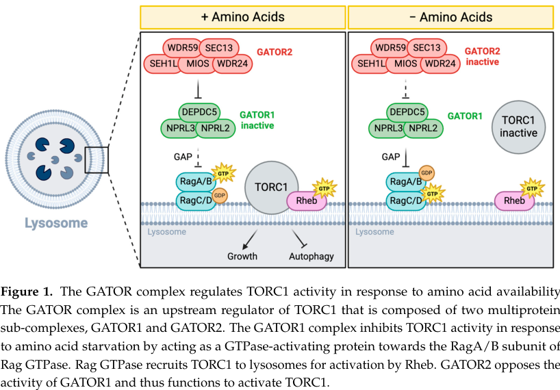

## Question

# Gene Research for Functional Annotation

## ⚠️ CRITICAL: Gene/Protein Identification Context

**BEFORE YOU BEGIN RESEARCH:** You MUST verify you are researching the CORRECT gene/protein. Gene symbols can be ambiguous, especially for less well-characterized genes from non-model organisms.

### Target Gene/Protein Identity (from UniProt):
- **UniProt Accession:** Q9VK45
- **Protein Description:** RecName: Full=Serine/threonine-protein kinase mTor {ECO:0000305}; EC=2.7.11.1 {ECO:0000269|PubMed:11069885}; AltName: Full=Target of rapamycin {ECO:0000303|PubMed:11069885}; AltName: Full=mechanistic Target of rapamycin {ECO:0000303|PubMed:11069885};
- **Gene Information:** Name=mTor {ECO:0000303|PubMed:11069885, ECO:0000312|FlyBase:FBgn0021796}; Synonyms=Tor {ECO:0000303|PubMed:11069885}; ORFNames=CG5092 {ECO:0000312|FlyBase:FBgn0021796};
- **Organism (full):** Drosophila melanogaster (Fruit fly).
- **Protein Family:** Belongs to the PI3/PI4-kinase family. .
- **Key Domains:** ARM-like. (IPR011989); ARM-type_fold. (IPR016024); DDR_Repair_Kinase. (IPR050517); FATC_dom. (IPR003152); FRB_dom. (IPR009076)

### MANDATORY VERIFICATION STEPS:

1. **Check if the gene symbol "mTor" matches the protein description above**
2. **Verify the organism is correct:** Drosophila melanogaster (Fruit fly).
3. **Check if protein family/domains align with what you find in literature**
4. **If you find literature for a DIFFERENT gene with the same or similar symbol, STOP**

### If Gene Symbol is Ambiguous or You Cannot Find Relevant Literature:

**DO NOT PROCEED WITH RESEARCH ON A DIFFERENT GENE.** Instead:
- State clearly: "The gene symbol 'mTor' is ambiguous or literature is limited for this specific protein"
- Explain what you found (e.g., "Found extensive literature on a different gene with the same symbol in a different organism")
- Describe the protein based ONLY on the UniProt information provided above
- Suggest that the protein function can be inferred from domain/family information

### Research Target:

Please provide a comprehensive research report on the gene **mTor** (gene ID: mTor, UniProt: Q9VK45) in DROME.

The research report should be a detailed narrative explaining the function, biological processes, and localization of the gene product. Citations should be given for all claims.

You should prioritize authoritative reviews and primary scientific literature when conducting research. You can supplement
this with annotations you find in gene/protein databases, but these can be outdated or inaccurate.

We are specifically interested in the primary function of the gene - for enzymes, what reaction is catalyzed, and what is the substrate specificity? For transporters, what is the substrate? For structural proteins or adapters, what is the broader structural role? For signaling molecules, what is the role in the pathway.

We are interested in where in or outside the cell the gene product carries out its function.

We are also interested in the signaling or biochemical pathways in which the gene functions. We are less interested in broad pleiotropic effects, except where these elucidate the precise role.

Include evidence where possible. We are interested in both experimental evidence as well as inference from structure, evolution, or bioinformatic analysis. Precise studies should be prioritized over high-throughput, where available.

## Output

Question: You are an expert researcher providing comprehensive, well-cited information.

Provide detailed information focusing on:
1. Key concepts and definitions with current understanding
2. Recent developments and latest research (prioritize 2023-2024 sources)
3. Current applications and real-world implementations
4. Expert opinions and analysis from authoritative sources
5. Relevant statistics and data from recent studies

Format as a comprehensive research report with proper citations. Include URLs and publication dates where available.
Always prioritize recent, authoritative sources and provide specific citations for all major claims.

# Gene Research for Functional Annotation

## ⚠️ CRITICAL: Gene/Protein Identification Context

**BEFORE YOU BEGIN RESEARCH:** You MUST verify you are researching the CORRECT gene/protein. Gene symbols can be ambiguous, especially for less well-characterized genes from non-model organisms.

### Target Gene/Protein Identity (from UniProt):
- **UniProt Accession:** Q9VK45
- **Protein Description:** RecName: Full=Serine/threonine-protein kinase mTor {ECO:0000305}; EC=2.7.11.1 {ECO:0000269|PubMed:11069885}; AltName: Full=Target of rapamycin {ECO:0000303|PubMed:11069885}; AltName: Full=mechanistic Target of rapamycin {ECO:0000303|PubMed:11069885};
- **Gene Information:** Name=mTor {ECO:0000303|PubMed:11069885, ECO:0000312|FlyBase:FBgn0021796}; Synonyms=Tor {ECO:0000303|PubMed:11069885}; ORFNames=CG5092 {ECO:0000312|FlyBase:FBgn0021796};
- **Organism (full):** Drosophila melanogaster (Fruit fly).
- **Protein Family:** Belongs to the PI3/PI4-kinase family. .
- **Key Domains:** ARM-like. (IPR011989); ARM-type_fold. (IPR016024); DDR_Repair_Kinase. (IPR050517); FATC_dom. (IPR003152); FRB_dom. (IPR009076)

### MANDATORY VERIFICATION STEPS:

1. **Check if the gene symbol "mTor" matches the protein description above**
2. **Verify the organism is correct:** Drosophila melanogaster (Fruit fly).
3. **Check if protein family/domains align with what you find in literature**
4. **If you find literature for a DIFFERENT gene with the same or similar symbol, STOP**

### If Gene Symbol is Ambiguous or You Cannot Find Relevant Literature:

**DO NOT PROCEED WITH RESEARCH ON A DIFFERENT GENE.** Instead:
- State clearly: "The gene symbol 'mTor' is ambiguous or literature is limited for this specific protein"
- Explain what you found (e.g., "Found extensive literature on a different gene with the same symbol in a different organism")
- Describe the protein based ONLY on the UniProt information provided above
- Suggest that the protein function can be inferred from domain/family information

### Research Target:

Please provide a comprehensive research report on the gene **mTor** (gene ID: mTor, UniProt: Q9VK45) in DROME.

The research report should be a detailed narrative explaining the function, biological processes, and localization of the gene product. Citations should be given for all claims.

You should prioritize authoritative reviews and primary scientific literature when conducting research. You can supplement
this with annotations you find in gene/protein databases, but these can be outdated or inaccurate.

We are specifically interested in the primary function of the gene - for enzymes, what reaction is catalyzed, and what is the substrate specificity? For transporters, what is the substrate? For structural proteins or adapters, what is the broader structural role? For signaling molecules, what is the role in the pathway.

We are interested in where in or outside the cell the gene product carries out its function.

We are also interested in the signaling or biochemical pathways in which the gene functions. We are less interested in broad pleiotropic effects, except where these elucidate the precise role.

Include evidence where possible. We are interested in both experimental evidence as well as inference from structure, evolution, or bioinformatic analysis. Precise studies should be prioritized over high-throughput, where available.

# Functional annotation report: *Drosophila melanogaster* mTor (Q9VK45)

## Identity and scope

The requested protein is **fly mTor**, also called **Tor or dTOR**, encoded by **CG5092**; the supplied UniProt accession is **Q9VK45** and the supplied FlyBase identifier is **FBgn0021796**. The original fly study independently identified CG5092 as a **single-copy, 2,471-amino-acid TOR gene**, distinct from the human *MTOR* gene. Its reported sequence similarity to human TOR and its conserved N-terminal HEAT-repeat region and C-terminal rapamycin-binding and kinase regions agree with the supplied ARM-like, FRB and FATC domain annotations. TOR belongs to the **phosphatidylinositol-3-kinase-related protein kinase (PIKK) family**: similarity to lipid kinases does **not** make its established reaction a phosphoinositide-lipid phosphorylation reaction. The Q9VK45 and FBgn0021796 cross-references here are from the supplied identification information; the independent primary-paper match is CG5092. (zhang2000regulationofcellular pages 1-2, zhang2000regulationofcellular pages 2-4, wu2012thetargetof pages 1-4)

## Primary molecular function and substrate specificity

**dTOR is an intracellular, ATP-dependent serine/threonine protein kinase.** Its catalytic reaction can be expressed as **ATP + protein–Ser/Thr–OH → ADP + protein–Ser/Thr–O–phosphate**. The relevant substrates are *proteins*, selected in part by which of two assemblies contains dTOR: **TOR complex 1 (TORC1)** or **TOR complex 2 (TORC2)**. The conserved N-terminal repeat region provides protein-interaction surfaces; the FAT and FATC regions flank the kinase region, and the FRB region binds the FKBP12–rapamycin inhibitory complex. Domain-based interpretations do not by themselves prove a particular fly substrate or organelle location. (frappaolo2023usingdrosophilamelanogaster pages 1-3, wu2012thetargetof pages 1-4)

**TORC1 preferentially drives the dS6K and Thor/d4E-BP translation-control branches.** In fly S2 cells, rapamycin reduced dS6K phosphorylation; rapamycin-resistant dTOR maintained it, whereas a version additionally impaired in kinase activity did not. Overexpressing S6K rescued viable flies carrying certain partial-loss *dTor* allele combinations. These experiments establish **dTOR-kinase-dependent S6K signaling**, although the transfected-cell assay alone is not a purified dTOR–S6K phosphotransfer reaction. **dS6K Thr398** is a commonly measured TOR-pathway phosphorylation readout; its regulation also involves other kinases, including PDK1, so a change in that readout should not automatically be interpreted as exclusive direct dTOR catalysis. (zhang2000regulationofcellular pages 5-6, miron2003signalingfromakt pages 9-10)

The fly 4E-BP, **Thor**, inhibits cap-dependent translation by binding eIF4E. Phosphorylation reduces that inhibitory interaction. Site-directed analysis identified regulation involving **Thor Thr37 and Thr46**, with **Thr46 particularly important for Thor activity**. Insulin increased recruitment of Thor and dS6K to fly TOR complexes and reduced Thor–eIF4E association. These results strongly support TORC1-dependent control, while recruitment, genetics and phospho-immunoblots should be distinguished from purified-enzyme proof for each individual fly phosphosite. **Ribosomal protein S6 is downstream of S6K**, not an established direct substrate of dTOR on the evidence cited here. (miron2003signalingfromakt pages 1-2, glatter2011modularityandhormone pages 10-11, zhang2000regulationofcellular pages 8-9)

**TORC2 has a different principal fly readout: Akt/PKB Ser505**, its hydrophobic-motif site. Loss of fly Rictor reduced Ser505 phosphorylation by **more than 95%** in the reported larval comparison; loss of Sin1 similarly disrupted the signal. Thus Ser505 is a particularly well-supported *TORC2-dependent* site, although the cited fly mutant experiment does not itself reconstitute purified dTOR-mediated Akt phosphorylation. The fly data also warn against equating a phosphosite with every organismal outcome: Rictor- and Sin1-deficient flies were viable despite markedly reduced Akt hydrophobic-motif phosphorylation. (hietakangas2007reevaluatingaktregulation pages 2-3, hietakangas2007reevaluatingaktregulation pages 1-2, frappaolo2023usingdrosophilamelanogaster pages 5-7)

The following evidence map separates complex-specific outputs from less certain claims about direct phosphorylation and location. (glatter2011modularityandhormone pages 10-11, frappaolo2023usingdrosophilamelanogaster pages 7-8)

| Complex / context | Fly binding partners | Supported phosphorylation output and evidence | Functional location / interpretation |
|---|---|---|---|
| **Shared dTOR kinase** — mTor/Tor/CG5092, UniProt Q9VK45 | dTOR is the catalytic subunit shared by TORC1 and TORC2; fly TOR is a single-copy PIKK-family protein kinase. | Kinase-active dTOR is required to maintain growth-factor-dependent dS6K phosphorylation; rapamycin-resistant dTOR rescued this readout, whereas a kinase-dead derivative did not. This demonstrates dTOR kinase dependence but is not, by itself, a purified-substrate reaction. (zhang2000regulationofcellular pages 1-2, zhang2000regulationofcellular pages 5-6) | Intracellular signaling enzyme whose complex membership determines substrate selection. |
| **dTORC1** | dRaptor, Lobe/PRAS40 and dLST8/dGbL; insulin promotes Lobe dissociation and recruitment of dS6K and Thor/d4E-BP. (glatter2011modularityandhormone pages 10-11) | Principal fly readouts are **dS6K Thr398** and **Thor/d4E-BP Thr37/Thr46**; Thr46 is the major activity-regulating 4E-BP event. Evidence combines kinase-dependent phosphorylation, RNAi, phosphosite analysis and genetic rescue; ribosomal protein S6 is downstream of dS6K and should not be called a direct dTOR substrate. (miron2003signalingfromakt pages 1-2, zhang2000regulationofcellular pages 5-6) | Nutrient-rich signaling is modeled at the **lysosomal surface**, where Rag GTPases recruit TORC1 for activation by Rheb. This conserved framework is supported by fly GATOR genetics, but it does not establish direct imaging of Q9VK45 in every fly tissue. (bettedi2024unveilinggator2function pages 1-2) |
| **dTORC2** | dRictor, dSin1 and dLST8. | **Akt Ser505** is the best-supported fly TORC2 phosphorylation output: rictor loss reduced Ser505 phosphorylation by **>95%**, and Sin1 loss produced a similar defect. This is strong complex-dependent in-vivo/cell evidence; the cited experiment does not reconstitute purified dTOR–Akt phosphotransfer. (hietakangas2007reevaluatingaktregulation pages 2-3) | Distinct from TORC1; supports full Akt activity and thereby growth and survival signaling. Its precise compartmental distribution in fly tissues is less firmly resolved than the lysosomal TORC1 model. |
| **Autophagy branch downstream of TOR** | Atg1–Atg13 physically associates with TOR in fly tissue. | Atg1 and Atg13 phosphorylation depends on nutrients, TOR activity and Atg1 kinase, and both are required for starvation- or rapamycin-induced autophagy. Because the fly experiments include feedback and Atg1 autophosphorylation, these proteins are best labeled **TOR-dependent regulators**, not unqualified direct dTOR substrates. (chang2009anatg1atg13complex pages 1-2) | Demonstrated in larval fat body and other tissues; TOR activity suppresses the autophagic program under nutrient-replete conditions. |
| **Golgi-associated activation model** | dGOLPH3 recruits dRheb to Golgi membranes and promotes the dRheb–dTctp complex; dGOLPH3 also interacts with dLST8. | dGOLPH3 depletion lowers phosphorylated dS6K, providing a TORC1 pathway readout. This is genetic/interaction evidence upstream of dTOR, not proof that dTOR itself was directly imaged or catalytically assayed at the Golgi. (frappaolo2023usingdrosophilamelanogaster pages 7-8) | The **Golgi is a candidate fly TOR-activation hub**, but the firm fly localization result is Golgi-associated **Rheb/GOLPH3**; direct Golgi localization of Q9VK45 remains unestablished in the cited evidence. |

*Table: Compact evidence map for Q9VK45 showing fly TOR-complex composition, phosphorylation outputs, localization models, and the distinction between direct biochemical evidence and pathway-level readouts.*

## Pathways, biological processes and place of action

**Nutrients and growth factors converge on TORC1 through distinguishable inputs.** Fly insulin signaling engages PI3K and Akt; TSC1–TSC2 restrains the small GTPase **Rheb**, and relief of that restraint favors TORC1 activity. Amino-acid sensing instead engages **Rag GTPases** and their **GATOR1/GATOR2** regulators. In the established lysosomal-surface model, active Rags recruit TORC1 to the lysosome, where Rheb can activate it; GATOR1 restrains Rag-dependent activation and GATOR2 counteracts GATOR1. This describes the intracellular signaling site and regulatory framework, **not** transport of nutrients by dTOR or secretion of the dTOR protein. Figure 1 of the 2024 fly-focused GATOR review illustrates these relationships. (frappaolo2023usingdrosophilamelanogaster pages 4-5, bettedi2024unveilinggator2function pages 1-2, bettedi2024unveilinggator2function media d2dc9f1e)

Fly biochemistry supports physically distinct TOR assemblies. Quantitative interaction proteomics identified a fly TORC1 containing **dTOR, dRaptor, Lobe**—the fly PRAS40-related protein—and **dGbL/LST8**; insulin altered partner association and promoted recruitment of Thor and dS6K. Fly TORC2 comprises **dTOR, dRictor, dSin1 and dLST8**, consistent with its different Akt-Ser505 output. Importantly, the presence of a mammalian complex partner in a generic mTOR diagram is **not** evidence that it is present in flies; the fly proteomics report, for example, notes the absence of DEPTOR from the fly genome. (glatter2011modularityandhormone pages 10-11, frappaolo2023usingdrosophilamelanogaster pages 5-7)

**Localization needs qualification.** The lysosomal surface is the principal mechanistic model for nutrient-dependent TORC1 activation. Fly work additionally places **GOLPH3-dependent Rheb recruitment at Golgi membranes**: disrupting GOLPH3’s Golgi-binding properties disrupted its interaction with Rheb, while GOLPH3 depletion changed the downstream phospho-S6K readout. This makes the Golgi a plausible additional activation hub, **but localization of Rheb and GOLPH3 does not, by itself, demonstrate that Q9VK45 was directly imaged at the Golgi or that all TORC1 reactions take place there**. The evidence supports an intracellular kinase acting in spatially regulated multiprotein complexes rather than a constitutively fixed location. (frappaolo2023usingdrosophilamelanogaster pages 7-8, frappaolo2023usingdrosophilamelanogaster pages 8-10)

By coupling these signals to S6K and Thor, TORC1 regulates protein synthesis and growth; its nutrient-dependent activity also restrains **autophagy**. In larval fat body, *Atg13* mutant cells failed to induce autophagy after starvation or rapamycin treatment, and fly Atg1/Atg13 were found in a TOR-associated, nutrient-sensitive phosphorylation network. Because Atg1 kinase activity and feedback contribute to that network, **TOR-dependent Atg1/Atg13 phosphorylation should not be presented without qualification as proof of direct dTOR phosphorylation of every observed site**. TORC2-dependent Akt signaling contributes to growth signaling but is mechanistically separable from the TORC1 translation readouts. (chang2009anatg1atg13complex pages 1-2, chang2009anatg1atg13complex pages 2-4, frappaolo2023usingdrosophilamelanogaster pages 5-7)

## Recent research and practical use of the fly model

**Methionine sensing, 2024.** Liu and colleagues identified **UNMET/CG11596**, a protein **distinct from mTor**, as a fly nutrient sensor that associates with GATOR2 in a manner controlled by the methionine-derived metabolite **S-adenosylmethionine (SAM)**. In fly cells, depleting UNMET specifically disrupted the TORC1 response to methionine while sparing responses to several other tested amino acids. The result refines *upstream regulation of the Q9VK45 pathway*; it does not assign SAM binding or nutrient-receptor activity to dTOR itself. The authors argue that flies and vertebrates independently recruited different proteins to sense this metabolite. The 2024 GATOR review further emphasizes tissue-dependent regulatory behavior that can be missed in cell culture. (bettedi2024unveilinggator2function pages 6-7, liu2024anevolutionarymechanism pages 10-11, bettedi2024unveilinggator2function pages 2-4)

**Metabolic-tissue experiments, 2024.** Rodríguez-Vázquez and colleagues knocked down late glycolytic enzymes in larval fat body and observed reduced Rheb/*mTor* expression and **hypophosphorylated S6K**, together with adipose atrophy and distant muscle defects. Their data connect energetic state to the fly TOR pathway, but the authors note that altered phosphatase activity could also contribute to the phospho-S6K measurement. Thus this is a pathway-level response, not a new dTOR substrate assignment. (rodriguezvazquez2024fatbodyglycolysis pages 1-2, rodriguezvazquez2024fatbodyglycolysis pages 6-8)

**Drug-testing applications and a caution, 2024.** Genetic manipulation, phosphorylation assays and rapamycin or ATP-site inhibitors make flies useful for studying nutrient signaling, growth and candidate interventions. A screen in one relatively long-lived **male *y w* fly strain** found that most tested TOR/PI3K-related compounds did not extend lifespan; the replicated benefit for **100 nM AZD8055 was only 1.3%** and fell within the variation of other control groups. The investigators noted genotype, dose, uptake and formulation limitations. This result should not be generalized to all fly strains, sexes, TOR functions or human treatment; compounds used in humans target the conserved pathway, **not the fly Q9VK45 protein in patients**. (bearden2024effectsoftarget pages 1-2, bearden2024effectsoftarget pages 14-15)

**Magnitude of the core genetic phenotype.** In the foundational fly study, a strong *dTor* deletion produced larvae reaching only **24% of wild-type mass**; partial alleles reached approximately **40%** and **79%**. Wing epithelial mutant cells measured approximately **56% of control cell area** (*n* = **498** cells). These precise genetic observations establish the kinase’s importance for cell-autonomous growth, but cell size is a physiological consequence, **not a biochemical substrate**. (zhang2000regulationofcellular pages 4-5)

## Interpretation

The most defensible primary annotation for **Drosophila mTor/Q9VK45** is **a PIKK-family serine/threonine protein kinase that serves as the catalytic component of TORC1 and TORC2**. TORC1 connects amino-acid and insulin/Rheb signals to S6K-, Thor- and autophagy-related outputs; TORC2 controls Akt-Ser505-associated signaling. Lysosome-associated TORC1 recruitment is the principal compartmental model, with Golgi-associated Rheb regulation providing an additional, more carefully qualified spatial mechanism in flies. Claims that dTOR directly phosphorylates every TOR-responsive protein, senses methionine itself, phosphorylates phosphoinositide lipids, or is proven to reside at the Golgi exceed the cited fly evidence. (zhang2000regulationofcellular pages 1-2, miron2003signalingfromakt pages 1-2, hietakangas2007reevaluatingaktregulation pages 2-3, bettedi2024unveilinggator2function pages 1-2, frappaolo2023usingdrosophilamelanogaster pages 7-8)

### Selected sources and publication dates

- Zhang H *et al.* **November 2000.** “Regulation of cellular growth by the Drosophila target of rapamycin dTOR.” *Genes & Development*. https://doi.org/10.1101/gad.835000. (zhang2000regulationofcellular pages 1-2, zhang2000regulationofcellular pages 4-5, zhang2000regulationofcellular pages 5-6)
- Miron M *et al.* **December 2003.** “Signaling from Akt to FRAP/TOR targets both 4E-BP and S6K in *Drosophila melanogaster*.” *Molecular and Cellular Biology*. https://doi.org/10.1128/MCB.23.24.9117-9126.2003. (miron2003signalingfromakt pages 1-2)
- Hietakangas V and Cohen SM. **March 2007.** “Re-evaluating AKT regulation: role of TOR complex 2 in tissue growth.” *Genes & Development*. https://doi.org/10.1101/gad.416307. (hietakangas2007reevaluatingaktregulation pages 2-3, hietakangas2007reevaluatingaktregulation pages 1-2)
- Chang Y-Y and Neufeld TP. **April 2009.** “An Atg1/Atg13 complex with multiple roles in TOR-mediated autophagy regulation.” *Molecular Biology of the Cell*. https://doi.org/10.1091/mbc.e08-12-1250. (chang2009anatg1atg13complex pages 1-2, chang2009anatg1atg13complex pages 2-4)
- Glatter T *et al.* **November 2011.** “Modularity and hormone sensitivity of the *Drosophila melanogaster* insulin receptor/target of rapamycin interaction proteome.” *Molecular Systems Biology*. https://doi.org/10.1038/msb.2011.79. (glatter2011modularityandhormone pages 10-11)
- Frappaolo A and Giansanti MG. **14 November 2023.** “Using *Drosophila melanogaster* to dissect the roles of the mTOR signaling pathway in cell growth.” *Cells*. https://doi.org/10.3390/cells12222622. (frappaolo2023usingdrosophilamelanogaster pages 1-3, frappaolo2023usingdrosophilamelanogaster pages 7-8)
- Liu GY *et al.* **March 2024.** “An evolutionary mechanism to assimilate new nutrient sensors into the mTORC1 pathway.” *Nature Communications*. https://doi.org/10.1038/s41467-024-46680-3. (liu2024anevolutionarymechanism pages 10-11)
- Rodríguez-Vázquez M *et al.* **September 2024.** “Fat body glycolysis defects inhibit mTOR and promote distant muscle disorganization through TNF-α/egr and ImpL2 signaling in *Drosophila* larvae.” *EMBO Reports*. https://doi.org/10.1038/s44319-024-00241-3. (rodriguezvazquez2024fatbodyglycolysis pages 1-2, rodriguezvazquez2024fatbodyglycolysis pages 6-8)
- Bearden AA *et al.* **26 October 2024.** “Effects of target of rapamycin and phosphatidylinositol 3-kinase inhibitors and other autophagy-related supplements on life span in *y w* male *Drosophila melanogaster*.” *International Journal of Molecular Sciences*. https://doi.org/10.3390/ijms252111504. (bearden2024effectsoftarget pages 1-2)
- Bettedi L *et al.* **30 October 2024.** “Unveiling GATOR2 function: novel insights from *Drosophila* research.” *Cells*. https://doi.org/10.3390/cells13211795. (bettedi2024unveilinggator2function pages 1-2, bettedi2024unveilinggator2function media d2dc9f1e)

References

1. (zhang2000regulationofcellular pages 1-2): Hongbing Zhang, James P. Stallock, Joyce C. Ng, Christoph Reinhard, and Thomas P. Neufeld. Regulation of cellular growth by the drosophila target of rapamycin dtor. Genes & development, 14 21:2712-24, Nov 2000. URL: https://doi.org/10.1101/gad.835000, doi:10.1101/gad.835000. This article has 790 citations and is from a highest quality peer-reviewed journal.

2. (zhang2000regulationofcellular pages 2-4): Hongbing Zhang, James P. Stallock, Joyce C. Ng, Christoph Reinhard, and Thomas P. Neufeld. Regulation of cellular growth by the drosophila target of rapamycin dtor. Genes & development, 14 21:2712-24, Nov 2000. URL: https://doi.org/10.1101/gad.835000, doi:10.1101/gad.835000. This article has 790 citations and is from a highest quality peer-reviewed journal.

3. (wu2012thetargetof pages 1-4): Chang-Chih Wu, Po-Chien Chou, and Estela Jacinto. The target of rapamycin: structure and functions. ArXiv, Jun 2012. URL: https://doi.org/10.5772/37927, doi:10.5772/37927. This article has 8 citations.

4. (frappaolo2023usingdrosophilamelanogaster pages 1-3): Anna Frappaolo and Maria Grazia Giansanti. Using drosophila melanogaster to dissect the roles of the mtor signaling pathway in cell growth. Cells, 12:2622, Nov 2023. URL: https://doi.org/10.3390/cells12222622, doi:10.3390/cells12222622. This article has 28 citations.

5. (zhang2000regulationofcellular pages 5-6): Hongbing Zhang, James P. Stallock, Joyce C. Ng, Christoph Reinhard, and Thomas P. Neufeld. Regulation of cellular growth by the drosophila target of rapamycin dtor. Genes & development, 14 21:2712-24, Nov 2000. URL: https://doi.org/10.1101/gad.835000, doi:10.1101/gad.835000. This article has 790 citations and is from a highest quality peer-reviewed journal.

6. (miron2003signalingfromakt pages 9-10): Mathieu Miron, Paul Lasko, and Nahum Sonenberg. Signaling from akt to frap/tor targets both 4e-bp ands6k in drosophilamelanogaster. Molecular and Cellular Biology, 23:9117-9126, Dec 2003. URL: https://doi.org/10.1128/mcb.23.24.9117-9126.2003, doi:10.1128/mcb.23.24.9117-9126.2003. This article has 175 citations and is from a domain leading peer-reviewed journal.

7. (miron2003signalingfromakt pages 1-2): Mathieu Miron, Paul Lasko, and Nahum Sonenberg. Signaling from akt to frap/tor targets both 4e-bp ands6k in drosophilamelanogaster. Molecular and Cellular Biology, 23:9117-9126, Dec 2003. URL: https://doi.org/10.1128/mcb.23.24.9117-9126.2003, doi:10.1128/mcb.23.24.9117-9126.2003. This article has 175 citations and is from a domain leading peer-reviewed journal.

8. (glatter2011modularityandhormone pages 10-11): Timo Glatter, Ralf B Schittenhelm, Oliver Rinner, Katarzyna Roguska, Alexander Wepf, Martin A Jünger, Katja Köhler, Irena Jevtov, Hyungwon Choi, Alexander Schmidt, Alexey I Nesvizhskii, Hugo Stocker, Ernst Hafen, Ruedi Aebersold, and Matthias Gstaiger. Modularity and hormone sensitivity of the drosophila melanogaster insulin receptor/target of rapamycin interaction proteome. Molecular Systems Biology, 7:547-547, Nov 2011. URL: https://doi.org/10.1038/msb.2011.79, doi:10.1038/msb.2011.79. This article has 77 citations and is from a highest quality peer-reviewed journal.

9. (zhang2000regulationofcellular pages 8-9): Hongbing Zhang, James P. Stallock, Joyce C. Ng, Christoph Reinhard, and Thomas P. Neufeld. Regulation of cellular growth by the drosophila target of rapamycin dtor. Genes & development, 14 21:2712-24, Nov 2000. URL: https://doi.org/10.1101/gad.835000, doi:10.1101/gad.835000. This article has 790 citations and is from a highest quality peer-reviewed journal.

10. (hietakangas2007reevaluatingaktregulation pages 2-3): Ville Hietakangas and Stephen M. Cohen. Re-evaluating akt regulation: role of tor complex 2 in tissue growth. Genes & development, 21 6:632-7, Mar 2007. URL: https://doi.org/10.1101/gad.416307, doi:10.1101/gad.416307. This article has 176 citations and is from a highest quality peer-reviewed journal.

11. (hietakangas2007reevaluatingaktregulation pages 1-2): Ville Hietakangas and Stephen M. Cohen. Re-evaluating akt regulation: role of tor complex 2 in tissue growth. Genes & development, 21 6:632-7, Mar 2007. URL: https://doi.org/10.1101/gad.416307, doi:10.1101/gad.416307. This article has 176 citations and is from a highest quality peer-reviewed journal.

12. (frappaolo2023usingdrosophilamelanogaster pages 5-7): Anna Frappaolo and Maria Grazia Giansanti. Using drosophila melanogaster to dissect the roles of the mtor signaling pathway in cell growth. Cells, 12:2622, Nov 2023. URL: https://doi.org/10.3390/cells12222622, doi:10.3390/cells12222622. This article has 28 citations.

13. (frappaolo2023usingdrosophilamelanogaster pages 7-8): Anna Frappaolo and Maria Grazia Giansanti. Using drosophila melanogaster to dissect the roles of the mtor signaling pathway in cell growth. Cells, 12:2622, Nov 2023. URL: https://doi.org/10.3390/cells12222622, doi:10.3390/cells12222622. This article has 28 citations.

14. (bettedi2024unveilinggator2function pages 1-2): Lucia Bettedi, Yingbiao Zhang, Shu Yang, and Mary A. Lilly. Unveiling gator2 function: novel insights from drosophila research. Cells, 13:1795, Oct 2024. URL: https://doi.org/10.3390/cells13211795, doi:10.3390/cells13211795. This article has 4 citations.

15. (chang2009anatg1atg13complex pages 1-2): Yu-Yun Chang and Thomas P. Neufeld. An atg1/atg13 complex with multiple roles in tor-mediated autophagy regulation. Molecular biology of the cell, 20 7:2004-14, Apr 2009. URL: https://doi.org/10.1091/mbc.e08-12-1250, doi:10.1091/mbc.e08-12-1250. This article has 555 citations and is from a domain leading peer-reviewed journal.

16. (frappaolo2023usingdrosophilamelanogaster pages 4-5): Anna Frappaolo and Maria Grazia Giansanti. Using drosophila melanogaster to dissect the roles of the mtor signaling pathway in cell growth. Cells, 12:2622, Nov 2023. URL: https://doi.org/10.3390/cells12222622, doi:10.3390/cells12222622. This article has 28 citations.

17. (bettedi2024unveilinggator2function media d2dc9f1e): Lucia Bettedi, Yingbiao Zhang, Shu Yang, and Mary A. Lilly. Unveiling gator2 function: novel insights from drosophila research. Cells, 13:1795, Oct 2024. URL: https://doi.org/10.3390/cells13211795, doi:10.3390/cells13211795. This article has 4 citations.

18. (frappaolo2023usingdrosophilamelanogaster pages 8-10): Anna Frappaolo and Maria Grazia Giansanti. Using drosophila melanogaster to dissect the roles of the mtor signaling pathway in cell growth. Cells, 12:2622, Nov 2023. URL: https://doi.org/10.3390/cells12222622, doi:10.3390/cells12222622. This article has 28 citations.

19. (chang2009anatg1atg13complex pages 2-4): Yu-Yun Chang and Thomas P. Neufeld. An atg1/atg13 complex with multiple roles in tor-mediated autophagy regulation. Molecular biology of the cell, 20 7:2004-14, Apr 2009. URL: https://doi.org/10.1091/mbc.e08-12-1250, doi:10.1091/mbc.e08-12-1250. This article has 555 citations and is from a domain leading peer-reviewed journal.

20. (bettedi2024unveilinggator2function pages 6-7): Lucia Bettedi, Yingbiao Zhang, Shu Yang, and Mary A. Lilly. Unveiling gator2 function: novel insights from drosophila research. Cells, 13:1795, Oct 2024. URL: https://doi.org/10.3390/cells13211795, doi:10.3390/cells13211795. This article has 4 citations.

21. (liu2024anevolutionarymechanism pages 10-11): Grace Y. Liu, Patrick Jouandin, Raymond E. Bahng, Norbert Perrimon, and David M. Sabatini. An evolutionary mechanism to assimilate new nutrient sensors into the mtorc1 pathway. Nature Communications, Mar 2024. URL: https://doi.org/10.1038/s41467-024-46680-3, doi:10.1038/s41467-024-46680-3. This article has 38 citations and is from a highest quality peer-reviewed journal.

22. (bettedi2024unveilinggator2function pages 2-4): Lucia Bettedi, Yingbiao Zhang, Shu Yang, and Mary A. Lilly. Unveiling gator2 function: novel insights from drosophila research. Cells, 13:1795, Oct 2024. URL: https://doi.org/10.3390/cells13211795, doi:10.3390/cells13211795. This article has 4 citations.

23. (rodriguezvazquez2024fatbodyglycolysis pages 1-2): Miriam Rodríguez-Vázquez, Jennifer Falconi, Lisa Heron-Milhavet, Patrice Lassus, Charles Géminard, and Alexandre Djiane. Fat body glycolysis defects inhibit mtor and promote distant muscle disorganization through tnf-α/egr and impl2 signaling in drosophila larvae. EMBO Reports, 25:4410-4432, Sep 2024. URL: https://doi.org/10.1038/s44319-024-00241-3, doi:10.1038/s44319-024-00241-3. This article has 16 citations and is from a highest quality peer-reviewed journal.

24. (rodriguezvazquez2024fatbodyglycolysis pages 6-8): Miriam Rodríguez-Vázquez, Jennifer Falconi, Lisa Heron-Milhavet, Patrice Lassus, Charles Géminard, and Alexandre Djiane. Fat body glycolysis defects inhibit mtor and promote distant muscle disorganization through tnf-α/egr and impl2 signaling in drosophila larvae. EMBO Reports, 25:4410-4432, Sep 2024. URL: https://doi.org/10.1038/s44319-024-00241-3, doi:10.1038/s44319-024-00241-3. This article has 16 citations and is from a highest quality peer-reviewed journal.

25. (bearden2024effectsoftarget pages 1-2): Aaron A. Bearden, Emily M. Stewart, Candace C. Casher, Meredith A. Shaddix, Amber C. Nobles, and Robin J. Mockett. Effects of target of rapamycin and phosphatidylinositol 3-kinase inhibitors and other autophagy-related supplements on life span in y w male drosophila melanogaster. International Journal of Molecular Sciences, 25:11504, Oct 2024. URL: https://doi.org/10.3390/ijms252111504, doi:10.3390/ijms252111504. This article has 6 citations.

26. (bearden2024effectsoftarget pages 14-15): Aaron A. Bearden, Emily M. Stewart, Candace C. Casher, Meredith A. Shaddix, Amber C. Nobles, and Robin J. Mockett. Effects of target of rapamycin and phosphatidylinositol 3-kinase inhibitors and other autophagy-related supplements on life span in y w male drosophila melanogaster. International Journal of Molecular Sciences, 25:11504, Oct 2024. URL: https://doi.org/10.3390/ijms252111504, doi:10.3390/ijms252111504. This article has 6 citations.

27. (zhang2000regulationofcellular pages 4-5): Hongbing Zhang, James P. Stallock, Joyce C. Ng, Christoph Reinhard, and Thomas P. Neufeld. Regulation of cellular growth by the drosophila target of rapamycin dtor. Genes & development, 14 21:2712-24, Nov 2000. URL: https://doi.org/10.1101/gad.835000, doi:10.1101/gad.835000. This article has 790 citations and is from a highest quality peer-reviewed journal.

## Artifacts

- [Edison artifact artifact-00](mTor-deep-research-falcon_artifacts/artifact-00.md)

## Citations

1. glatter2011modularityandhormone pages 10-11
2. hietakangas2007reevaluatingaktregulation pages 2-3
3. frappaolo2023usingdrosophilamelanogaster pages 7-8
4. zhang2000regulationofcellular pages 4-5
5. miron2003signalingfromakt pages 1-2
6. liu2024anevolutionarymechanism pages 10-11
7. bearden2024effectsoftarget pages 1-2
8. zhang2000regulationofcellular pages 1-2
9. zhang2000regulationofcellular pages 2-4
10. wu2012thetargetof pages 1-4
11. frappaolo2023usingdrosophilamelanogaster pages 1-3
12. zhang2000regulationofcellular pages 5-6
13. miron2003signalingfromakt pages 9-10
14. zhang2000regulationofcellular pages 8-9
15. hietakangas2007reevaluatingaktregulation pages 1-2
16. frappaolo2023usingdrosophilamelanogaster pages 5-7
17. frappaolo2023usingdrosophilamelanogaster pages 4-5
18. frappaolo2023usingdrosophilamelanogaster pages 8-10
19. rodriguezvazquez2024fatbodyglycolysis pages 1-2
20. rodriguezvazquez2024fatbodyglycolysis pages 6-8
21. bearden2024effectsoftarget pages 14-15
22. https://doi.org/10.1101/gad.835000.
23. https://doi.org/10.1128/MCB.23.24.9117-9126.2003.
24. https://doi.org/10.1101/gad.416307.
25. https://doi.org/10.1091/mbc.e08-12-1250.
26. https://doi.org/10.1038/msb.2011.79.
27. https://doi.org/10.3390/cells12222622.
28. https://doi.org/10.1038/s41467-024-46680-3.
29. https://doi.org/10.1038/s44319-024-00241-3.
30. https://doi.org/10.3390/ijms252111504.
31. https://doi.org/10.3390/cells13211795.
32. https://doi.org/10.1101/gad.835000,
33. https://doi.org/10.5772/37927,
34. https://doi.org/10.3390/cells12222622,
35. https://doi.org/10.1128/mcb.23.24.9117-9126.2003,
36. https://doi.org/10.1038/msb.2011.79,
37. https://doi.org/10.1101/gad.416307,
38. https://doi.org/10.3390/cells13211795,
39. https://doi.org/10.1091/mbc.e08-12-1250,
40. https://doi.org/10.1038/s41467-024-46680-3,
41. https://doi.org/10.1038/s44319-024-00241-3,
42. https://doi.org/10.3390/ijms252111504,