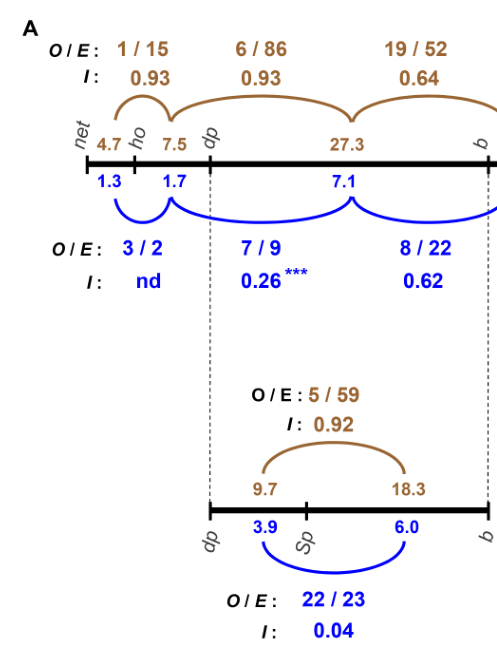

## Question

# Gene Research for Functional Annotation

## ⚠️ CRITICAL: Gene/Protein Identification Context

**BEFORE YOU BEGIN RESEARCH:** You MUST verify you are researching the CORRECT gene/protein. Gene symbols can be ambiguous, especially for less well-characterized genes from non-model organisms.

### Target Gene/Protein Identity (from UniProt):
- **UniProt Accession:** Q9VXG8
- **Protein Description:** RecName: Full=Serine/threonine-protein kinase ATR; EC=2.7.11.1; AltName: Full=Ataxia telangiectasia and Rad3-related protein homolog; Short=ATR homolog; Short=dATR; AltName: Full=Meiotic protein 41;
- **Gene Information:** Name=mei-41; ORFNames=CG4252;
- **Organism (full):** Drosophila melanogaster (Fruit fly).
- **Protein Family:** Belongs to the PI3/PI4-kinase family. ATM subfamily.
- **Key Domains:** ARM-like. (IPR011989); ARM-type_fold. (IPR016024); ATR-like_M-HEAT. (IPR056802); DDR_Repair_Kinase. (IPR050517); FATC_dom. (IPR003152)

### MANDATORY VERIFICATION STEPS:

1. **Check if the gene symbol "mei-41" matches the protein description above**
2. **Verify the organism is correct:** Drosophila melanogaster (Fruit fly).
3. **Check if protein family/domains align with what you find in literature**
4. **If you find literature for a DIFFERENT gene with the same or similar symbol, STOP**

### If Gene Symbol is Ambiguous or You Cannot Find Relevant Literature:

**DO NOT PROCEED WITH RESEARCH ON A DIFFERENT GENE.** Instead:
- State clearly: "The gene symbol 'mei-41' is ambiguous or literature is limited for this specific protein"
- Explain what you found (e.g., "Found extensive literature on a different gene with the same symbol in a different organism")
- Describe the protein based ONLY on the UniProt information provided above
- Suggest that the protein function can be inferred from domain/family information

### Research Target:

Please provide a comprehensive research report on the gene **mei-41** (gene ID: mei-41, UniProt: Q9VXG8) in DROME.

The research report should be a detailed narrative explaining the function, biological processes, and localization of the gene product. Citations should be given for all claims.

You should prioritize authoritative reviews and primary scientific literature when conducting research. You can supplement
this with annotations you find in gene/protein databases, but these can be outdated or inaccurate.

We are specifically interested in the primary function of the gene - for enzymes, what reaction is catalyzed, and what is the substrate specificity? For transporters, what is the substrate? For structural proteins or adapters, what is the broader structural role? For signaling molecules, what is the role in the pathway.

We are interested in where in or outside the cell the gene product carries out its function.

We are also interested in the signaling or biochemical pathways in which the gene functions. We are less interested in broad pleiotropic effects, except where these elucidate the precise role.

Include evidence where possible. We are interested in both experimental evidence as well as inference from structure, evolution, or bioinformatic analysis. Precise studies should be prioritized over high-throughput, where available.

## Output

Question: You are an expert researcher providing comprehensive, well-cited information.

Provide detailed information focusing on:
1. Key concepts and definitions with current understanding
2. Recent developments and latest research (prioritize 2023-2024 sources)
3. Current applications and real-world implementations
4. Expert opinions and analysis from authoritative sources
5. Relevant statistics and data from recent studies

Format as a comprehensive research report with proper citations. Include URLs and publication dates where available.
Always prioritize recent, authoritative sources and provide specific citations for all major claims.

# Gene Research for Functional Annotation

## ⚠️ CRITICAL: Gene/Protein Identification Context

**BEFORE YOU BEGIN RESEARCH:** You MUST verify you are researching the CORRECT gene/protein. Gene symbols can be ambiguous, especially for less well-characterized genes from non-model organisms.

### Target Gene/Protein Identity (from UniProt):
- **UniProt Accession:** Q9VXG8
- **Protein Description:** RecName: Full=Serine/threonine-protein kinase ATR; EC=2.7.11.1; AltName: Full=Ataxia telangiectasia and Rad3-related protein homolog; Short=ATR homolog; Short=dATR; AltName: Full=Meiotic protein 41;
- **Gene Information:** Name=mei-41; ORFNames=CG4252;
- **Organism (full):** Drosophila melanogaster (Fruit fly).
- **Protein Family:** Belongs to the PI3/PI4-kinase family. ATM subfamily.
- **Key Domains:** ARM-like. (IPR011989); ARM-type_fold. (IPR016024); ATR-like_M-HEAT. (IPR056802); DDR_Repair_Kinase. (IPR050517); FATC_dom. (IPR003152)

### MANDATORY VERIFICATION STEPS:

1. **Check if the gene symbol "mei-41" matches the protein description above**
2. **Verify the organism is correct:** Drosophila melanogaster (Fruit fly).
3. **Check if protein family/domains align with what you find in literature**
4. **If you find literature for a DIFFERENT gene with the same or similar symbol, STOP**

### If Gene Symbol is Ambiguous or You Cannot Find Relevant Literature:

**DO NOT PROCEED WITH RESEARCH ON A DIFFERENT GENE.** Instead:
- State clearly: "The gene symbol 'mei-41' is ambiguous or literature is limited for this specific protein"
- Explain what you found (e.g., "Found extensive literature on a different gene with the same symbol in a different organism")
- Describe the protein based ONLY on the UniProt information provided above
- Suggest that the protein function can be inferred from domain/family information

### Research Target:

Please provide a comprehensive research report on the gene **mei-41** (gene ID: mei-41, UniProt: Q9VXG8) in DROME.

The research report should be a detailed narrative explaining the function, biological processes, and localization of the gene product. Citations should be given for all claims.

You should prioritize authoritative reviews and primary scientific literature when conducting research. You can supplement
this with annotations you find in gene/protein databases, but these can be outdated or inaccurate.

We are specifically interested in the primary function of the gene - for enzymes, what reaction is catalyzed, and what is the substrate specificity? For transporters, what is the substrate? For structural proteins or adapters, what is the broader structural role? For signaling molecules, what is the role in the pathway.

We are interested in where in or outside the cell the gene product carries out its function.

We are also interested in the signaling or biochemical pathways in which the gene functions. We are less interested in broad pleiotropic effects, except where these elucidate the precise role.

Include evidence where possible. We are interested in both experimental evidence as well as inference from structure, evolution, or bioinformatic analysis. Precise studies should be prioritized over high-throughput, where available.

# Functional annotation of *mei-41* in *Drosophila melanogaster*

## Identity and principal function

**The target is the fruit-fly gene *mei-41* (CG4252), corresponding to the supplied UniProt accession Q9VXG8. Its product, Mei-41, is the fly ortholog of ATR, not the fly ortholog of ATM:** ATM is encoded by the distinct gene *tefu*. This distinction matters because older papers sometimes call Mei-41 an “ATM/ATR” homolog, reflecting historical nomenclature rather than identity with Tefu. A 2024 comparative study independently identifies the fly genes as ATR/*mei-41* and ATM/*tefu*. (bayer2018overexpressionofthe pages 1-2, laurencon2003phenotypicanalysisof pages 1-2, urban2024bradysia(sciara)coprophila pages 9-10)

Mei-41 is a **serine/threonine protein kinase and DNA-damage/replication-checkpoint signal transducer**. Its primary biochemical role is to use ATP to phosphorylate protein serine or threonine residues, relaying information about incompletely replicated or damaged DNA to downstream checkpoint and repair responses. The supplied UniProt/InterPro annotations—an ATR-like HEAT-repeat region, ARM-like folds, a DNA-damage-response kinase region and a FATC domain—are consistent with this assignment to the phosphatidylinositol-3-kinase-related protein kinase (*PIKK*) family; the designation describes evolutionary/structural relatedness, **not evidence that Mei-41 primarily phosphorylates lipids**. The fly studies examined support the kinase/pathway assignment, but do not independently establish precise domain boundaries or a comprehensive, purified-enzyme substrate-specificity profile for Q9VXG8. (laurencon2003phenotypicanalysisof pages 1-2, bayer2018overexpressionofthe pages 1-2)

## Pathways, substrates and strength of evidence

In dividing somatic cells and early embryos, the best-supported signaling relationship is **Mei-41/ATR → Grapes (Grp)/Chk1 → delayed mitotic progression**. DNA damage or incomplete replication produces Mei-41-dependent Grp phosphorylation in fly cells. Experimentally increasing Mei-41 in larval imaginal discs reduces the number of mitotic cells, prolongs arrest after irradiation and produces a phosphorylation-consistent Grp mobility shift. The overexpression experiment establishes pathway activity *in vivo*, **not** direct transfer of phosphate from purified Mei-41 to Grp or an exact Grp phosphosite. Mus304, the fly ATRIP homolog, participates in the related damage-checkpoint pathway, although its requirement depends on biological context. (bayer2018overexpressionofthe pages 7-8, bayer2018overexpressionofthe pages 4-7, bayer2018overexpressionofthe pages 2-4, abdu2002activationofa pages 2-4)

A second experimentally implicated substrate is the chromatin-associated histone variant **H2Av**. Following meiotic DNA double-strand breaks (DSBs), Mei-41/ATR and Tefu/ATM have overlapping requirements for generating phosphorylated H2Av (γ-H2Av). In a conditional *mei-41; tefu* double mutant at the restrictive temperature, newly damaged meiotic nuclei lost γ-H2Av staining; restoring kinase activity restored the mark. Thus, both kinases contribute to H2Av damage marking, and γ-H2Av **must not be presented as a Mei-41-specific product**. These genetic experiments establish kinase-dependent phosphorylation in cells, rather than an exclusive direct Mei-41–H2Av reaction in a purified system. (joyce2011drosophilaatmand pages 2-4, joyce2011drosophilaatmand pages 4-5)

The meiotic checkpoint has **different downstream wiring**. In oocytes with unrepaired meiotic breaks, Mei-41-dependent signaling is associated with phosphorylation of **Mnk/Chk2**, altered Vasa and Gurken regulation, and changes in oocyte nuclear organization. Removing *mnk* suppressed the spindle-class mutant patterning and nuclear defects, whereas removing *grp* did **not** suppress that meiotic phenotype. A phosphatase-sensitive Mnk mobility shift depended on *mei-41*, but direct phosphorylation of Mnk by isolated Mei-41 was not demonstrated in that experiment. It would therefore be inaccurate to describe Grp/Chk1 as the universal effector of Mei-41 in every tissue. (abdu2002activationofa pages 2-4, abdu2002activationofa pages 1-2)

## Biological processes and where the protein acts

**Replication and somatic damage checkpoints.** Maternal Mei-41 is required for the early-embryo checkpoint that delays rapid nuclear divisions when DNA replication is incomplete, particularly around the midblastula transition. In larval dividing tissues, it is required for a damage-induced delay in mitotic entry and contributes to genome integrity following irradiation and replication stress. A separation-of-function allele study found that female fertility, checkpoint responses and resistance to methyl methanesulfonate can be genetically distinguished: Mei-41 therefore acts in several molecular contexts rather than one invariant linear pathway. (brodsky2000mus304encodesa pages 1-2, morgan2017meioticcrossoverpatterning pages 29-33, laurencon2003phenotypicanalysisof pages 1-2, brodsky2000mus304encodesa pages 8-9)

**Meiotic DSB response and repair.** In the female germline, Mei-41 detects or transduces the response to persisting recombination-associated damage and is needed for normal DSB repair and the oocyte checkpoint. In one cytological comparison, region-3 oocytes retained approximately **21.0 ± 1.3 γ-H2Av foci** in *mei-41* mutants, versus approximately **0.1** in wild type. This contrasts with the distinct role of Tefu/ATM in limiting the number of programmed meiotic breaks: the two kinases should not be assigned each other’s phenotypes. γ-H2Av also turns over, so its staining is a dynamic damage-response readout, not an immutable count of DNA ends. (joyce2011drosophilaatmand pages 2-4, joyce2011drosophilaatmand pages 5-7, joyce2011drosophilaatmand pages 4-5)

**Crossover formation and positioning.** Mei-41 has a specific role beyond a generic cell-cycle checkpoint in generating normally patterned female meiotic crossovers. To examine null mutants despite their maternal-effect embryonic lethality, Brady and colleagues supplied wild-type Mei-41 **after** the period of meiotic recombination. Crossovers then fell to roughly **one-third of wild-type levels**; crossover interference and assurance were substantially reduced, while centromere-proximal crossover suppression remained largely intact. This supports the authors’ interpretation that Mei-41 is needed after early establishment of the centromere effect but before completion of the normal interfering crossover pathway. The precise Mei-41 phosphorylation target responsible for this meiotic effect remains unresolved. The study’s cropped **Figure 2, panels A and C**, provides visual comparisons of interference and zero-exchange-bivalent frequencies. (brady2018lossofdrosophila pages 1-2, brady2018lossofdrosophila pages 3-4, brady2018lossofdrosophila pages 5-6, brady2018lossofdrosophila pages 6-8, brady2018lossofdrosophila pages 8-9, brady2018lossofdrosophila media fa22c24d)

**Subcellular location.** The function supported most strongly by experiments is **intracellular signaling at replicating or damaged genomes and meiotic chromosomes**, with γ-H2Av measured on nuclear chromatin. Nevertheless, these studies do **not** establish that endogenous Mei-41 is constitutively restricted to the nucleus or demonstrate its precise localization at every stage. An important potential misattribution is that the reported predominantly **cytoplasmic** FLAG-protein staining concerns **Mus304**, not Mei-41. A nuclear/chromatin site of action is consequently a strong functional inference, while an exclusive Mei-41 compartment assignment would overstate the localization evidence reviewed here. (joyce2011drosophilaatmand pages 4-5, brodsky2000mus304encodesa pages 8-9)

The following results show how the functional interpretation depends on tissue and experimental readout.

| Biological setting | Perturbation and readout | Functional inference and evidence limits | Primary paper; publication date; DOI |
|---|---|---|---|
| Larval wing imaginal discs; somatic G2/M checkpoint | GAL4/UAS induction increased *mei-41* RNA approximately **500-fold**. Mei-41 overexpression reduced PH3-positive mitotic cells, prolonged post-irradiation arrest, and caused an HA-Grp/Chk1 mobility shift on Phos-Tag PAGE similar to that after **40 Gy** irradiation (bayer2018overexpressionofthe pages 2-4, bayer2018overexpressionofthe pages 7-8). | Supports a Mei-41→Grp/Chk1 checkpoint branch. The mobility shift is consistent with phosphorylation but is **not** a purified-protein kinase assay and therefore does not prove direct catalysis. | Bayer et al.; **17 September 2018**; [10.1186/s41065-018-0066-4](https://doi.org/10.1186/s41065-018-0066-4) |
| Female meiotic prophase; H2Av damage marking and DSB repair | Region-3 oocytes retained approximately **21.0 ± 1.3 γ-H2Av foci** in *mei-41* mutants versus approximately **0.1** in wild type. Conditional *mei-41; tefu* double mutants had **0 γ-H2Av foci** at restrictive temperature, whereas ATR activity at permissive temperature restored the signal (joyce2011drosophilaatmand pages 2-4, e.f.2011drosophilaatmand pages 3-4, joyce2011drosophilaatmand pages 4-5). | Mei-41/ATR contributes to meiotic DSB repair and is redundant with **Tefu/ATM** for H2Av phosphorylation. γ-H2Av is dynamic and not an exact permanent DSB count; this evidence does not assign ATM’s DSB-number feedback function to Mei-41. | Joyce et al.; **31 October 2011**; [10.1083/jcb.201104121](https://doi.org/10.1083/jcb.201104121) |
| Female meiosis; crossover formation on chromosome arm 2L | Wild type produced **1,943 crossovers among 4,222 progeny**; *mei-41* null females produced **1,175 among 7,801 progeny** after late maternal rescue bypassed embryonic lethality (brady2018lossofdrosophila pages 3-4, brady2018lossofdrosophila pages 5-6). | Establishes that Mei-41/ATR promotes normal crossover formation and distribution. Late rescue was designed to restore the maternal embryonic requirement only after meiotic recombination, but incomplete rescue and aneuploidy complicate organism-level fertility outcomes. | Brady, McMahan & Sekelsky; **1 February 2018**; [10.1534/genetics.117.300634](https://doi.org/10.1534/genetics.117.300634) |
| Female meiosis; X-chromosome crossover assurance | Zero-exchange-bivalent frequency was **0.285 expected versus 0.112 observed** in wild type (*P* < 0.0001), but **0.582 expected versus 0.572 observed** in *mei-41* mutants (*P* = 0.3008) (morgan2017meioticcrossoverpatterning pages 51-55, brady2018lossofdrosophila pages 5-6). | Wild type exhibits crossover assurance, whereas assurance is effectively lost in the mutant. Interference is also strongly reduced, while the centromere effect is largely retained; these are genetic-patterning measurements, not identification of a direct Mei-41 substrate. | Brady, McMahan & Sekelsky; **1 February 2018**; [10.1534/genetics.117.300634](https://doi.org/10.1534/genetics.117.300634) |
| Oocyte checkpoint activated by unrepaired meiotic DSBs | *mnk/Chk2* loss completely suppressed spindle-class dorsal–ventral defects and produced **100% suppression** of abnormal oocyte nuclear morphology. *grp/Chk1* did not suppress these phenotypes. A phosphatase-sensitive Mnk mobility shift required *mei-41* (abdu2002activationofa pages 2-4). | In this meiotic checkpoint, Mei-41 signals principally through Mnk/Chk2—not Grp/Chk1—to alter Gurken/Vasa-dependent patterning. Dependence and mobility shifts support pathway order but do not prove direct Mei-41 phosphorylation of Mnk. | Abdu, Brodsky & Schüpbach; **1 October 2002**; [10.1016/S0960-9822(02)01165-X](https://doi.org/10.1016/S0960-9822(02)01165-X) |
| 2024 wing-disc model of Cas9-induced DSBs in Wnt/Wg-compromised tissue | RNAi against *mei-41*/ATR **did not suppress apoptosis**; by contrast, reducing Chk2/*lok*, p53, or E2F1 strongly suppressed the response (ewencampen2024wntsignalingmodulates pages 5-7). | Mei-41 is dispensable for the apoptotic output in this particular high-DSB context; the dominant branch is Chk2–p53–E2F1. This negative result does not contradict Mei-41’s established replication-stress and G2/M-checkpoint functions. | Ewen-Campen & Perrimon; **24 July 2024**; [10.1371/journal.pbio.3002547](https://doi.org/10.1371/journal.pbio.3002547) |
| Notch-induced polyploid salivary-gland tumor model | *mei-41* was transcriptionally upregulated in NICD tumors. Tumor-specific *mei-41* knockdown significantly reduced tumor size and left large polyploid cells in **36.7% of tumors (n = 30)**; depletion alone caused no obvious salivary-gland phenotype (wang2021polyploidmitosisand pages 7-9, wang2021polyploidmitosisand pages 9-11). | Indicates that Mei-41-dependent damage responses support depolyploidization and growth of genomically unstable fly tumors. This is a genetic model application—not evidence that Q9VXG8 is a clinically validated drug target or that human ATR inhibitors act selectively on fly Mei-41. | Wang et al.; **12 July 2021**; [10.1016/j.devcel.2021.05.017](https://doi.org/10.1016/j.devcel.2021.05.017) |

*Table: Experimental evidence connecting Drosophila Q9VXG8 MEI-41/ATR to checkpoint signaling, meiotic repair and crossover patterning, apoptosis-context specificity, and polyploid tumor growth. The table separates direct observations from mechanistic inference and keeps Mei-41/ATR distinct from Tefu/ATM and human ATR.*

## Recent findings and research use

**A direct 2024 fly test refines, rather than overturns, the annotation.** In wing imaginal discs with Wnt/Wg signaling compromised and Cas9-induced DSBs, RNAi against *mei-41* **did not suppress apoptosis**. In the same assay, reducing *lok*/Chk2, p53 or E2F1 strongly suppressed apoptosis. The result identifies an important boundary: Mei-41’s well-established replication and mitotic-checkpoint functions do not mean it is indispensable for **every** DNA-damage-induced apoptotic output. This paper appeared **24 July 2024**: https://doi.org/10.1371/journal.pbio.3002547. (ewencampen2024wntsignalingmodulates pages 5-7, jaklevic2004relativecontributionof pages 1-3)

Fly *mei-41* perturbation also has a concrete **research-model application**, not a demonstrated clinical application. In a Notch-induced, polyploid *Drosophila* salivary-gland tumor model, *mei-41* was upregulated and its knockdown reduced tumor size; enlarged polyploid cells remained in **36.7% of the knockdown tumors examined (n = 30)**. This implicates the damage response in growth or ploidy reduction in that particular fly model; it does not establish that inhibiting fly Mei-41 treats human cancer. The primary study appeared **12 July 2021**: https://doi.org/10.1016/j.devcel.2021.05.017. Inducible Mei-41 expression is likewise an experimental checkpoint tool: one study measured approximately **500-fold RNA induction** and monitored Grp phosphorylation and mitotic recovery. Published **September 2018**: https://doi.org/10.1186/s41065-018-0066-4. (wang2021polyploidmitosisand pages 7-9, wang2021polyploidmitosisand pages 9-11, bayer2018overexpressionofthe pages 2-4, bayer2018overexpressionofthe pages 7-8)

Recent related literature warrants careful attribution. A *Drosophila* centromere-effect study, published online **27 December 2023** and in a **2024** journal issue, found that centromere-proximal crossover suppression was robust to several alterations in centromere number and repetitive DNA; it informs the interpretation of crossover patterning but is **not itself a new perturbation of Mei-41**: https://doi.org/10.1093/genetics/iyad216. Likewise, a **2024** study of meiotic Mec1/ATR studied **yeast**, not Q9VXG8 in flies; human ATR inhibitor findings cannot establish substrate specificity or drug responses for the fly protein without separate testing. (pazhayam2024centromereproximalsuppressionof pages 1-2, crawford2024separablerolesof pages 1-2, borenas2024alksignalingprimes pages 1-2)

**Bottom line.** The defensible primary annotation for Q9VXG8 is an intracellular **ATR-family protein serine/threonine checkpoint kinase** coupling incomplete replication and DNA damage to cell-cycle control, chromatin damage signaling and female meiotic repair/crossover regulation. Grp/Chk1 is a strongly supported downstream checkpoint effector in somatic/embryonic contexts; Mnk/Chk2 mediates the tested oocyte checkpoint; H2Av phosphorylation is shared with Tefu/ATM. Exact direct-substrate sites, exclusive endogenous subcellular localization and the biochemical intermediary that patterns meiotic crossovers remain important limits on a more specific annotation. (bayer2018overexpressionofthe pages 7-8, abdu2002activationofa pages 2-4, joyce2011drosophilaatmand pages 2-4, brady2018lossofdrosophila pages 8-9, brodsky2000mus304encodesa pages 8-9)

References

1. (bayer2018overexpressionofthe pages 1-2): Fabienne E. Bayer, Mirjam Zimmermann, Anette Preiss, and Anja C. Nagel. Overexpression of the drosophila atr homologous checkpoint kinase mei-41 induces a g2/m checkpoint in drosophila imaginal tissue. Hereditas, Sep 2018. URL: https://doi.org/10.1186/s41065-018-0066-4, doi:10.1186/s41065-018-0066-4. This article has 12 citations and is from a peer-reviewed journal.

2. (laurencon2003phenotypicanalysisof pages 1-2): Anne Laurençon, Amanda Purdy, Jeff Sekelsky, R Scott Hawley, and Tin Tin Su. Phenotypic analysis of separation-of-function alleles of mei-41, drosophila atm/atr. Genetics, 164:589-601, Jun 2003. URL: https://doi.org/10.1093/genetics/164.2.589, doi:10.1093/genetics/164.2.589. This article has 104 citations and is from a domain leading peer-reviewed journal.

3. (urban2024bradysia(sciara)coprophila pages 9-10): John M Urban, Jack R Bateman, Kodie R Garza, Julia Borden, Jaison Jain, Alexia Brown, Bethany J Thach, Jacob E Bliss, and Susan A Gerbi. Bradysia (sciara) coprophila larvae up-regulate dna repair pathways and down-regulate developmental regulators in response to ionizing radiation. Genetics, Dec 2024. URL: https://doi.org/10.1093/genetics/iyad208, doi:10.1093/genetics/iyad208. This article has 5 citations and is from a domain leading peer-reviewed journal.

4. (bayer2018overexpressionofthe pages 7-8): Fabienne E. Bayer, Mirjam Zimmermann, Anette Preiss, and Anja C. Nagel. Overexpression of the drosophila atr homologous checkpoint kinase mei-41 induces a g2/m checkpoint in drosophila imaginal tissue. Hereditas, Sep 2018. URL: https://doi.org/10.1186/s41065-018-0066-4, doi:10.1186/s41065-018-0066-4. This article has 12 citations and is from a peer-reviewed journal.

5. (bayer2018overexpressionofthe pages 4-7): Fabienne E. Bayer, Mirjam Zimmermann, Anette Preiss, and Anja C. Nagel. Overexpression of the drosophila atr homologous checkpoint kinase mei-41 induces a g2/m checkpoint in drosophila imaginal tissue. Hereditas, Sep 2018. URL: https://doi.org/10.1186/s41065-018-0066-4, doi:10.1186/s41065-018-0066-4. This article has 12 citations and is from a peer-reviewed journal.

6. (bayer2018overexpressionofthe pages 2-4): Fabienne E. Bayer, Mirjam Zimmermann, Anette Preiss, and Anja C. Nagel. Overexpression of the drosophila atr homologous checkpoint kinase mei-41 induces a g2/m checkpoint in drosophila imaginal tissue. Hereditas, Sep 2018. URL: https://doi.org/10.1186/s41065-018-0066-4, doi:10.1186/s41065-018-0066-4. This article has 12 citations and is from a peer-reviewed journal.

7. (abdu2002activationofa pages 2-4): Uri Abdu, Michael Brodsky, and Trudi Schüpbach. Activation of a meiotic checkpoint during drosophila oogenesis regulates the translation of gurken through chk2/mnk. Current Biology, 12:1645-1651, Oct 2002. URL: https://doi.org/10.1016/s0960-9822(02)01165-x, doi:10.1016/s0960-9822(02)01165-x. This article has 175 citations and is from a highest quality peer-reviewed journal.

8. (joyce2011drosophilaatmand pages 2-4): Eric F. Joyce, Michael Pedersen, Stanley Tiong, Sanese K. White-Brown, Anshu Paul, Shelagh D. Campbell, and Kim S. McKim. Drosophila atm and atr have distinct activities in the regulation of meiotic dna damage and repair. The Journal of Cell Biology, 195:359-367, Oct 2011. URL: https://doi.org/10.1083/jcb.201104121, doi:10.1083/jcb.201104121. This article has 166 citations.

9. (joyce2011drosophilaatmand pages 4-5): Eric F. Joyce, Michael Pedersen, Stanley Tiong, Sanese K. White-Brown, Anshu Paul, Shelagh D. Campbell, and Kim S. McKim. Drosophila atm and atr have distinct activities in the regulation of meiotic dna damage and repair. The Journal of Cell Biology, 195:359-367, Oct 2011. URL: https://doi.org/10.1083/jcb.201104121, doi:10.1083/jcb.201104121. This article has 166 citations.

10. (abdu2002activationofa pages 1-2): Uri Abdu, Michael Brodsky, and Trudi Schüpbach. Activation of a meiotic checkpoint during drosophila oogenesis regulates the translation of gurken through chk2/mnk. Current Biology, 12:1645-1651, Oct 2002. URL: https://doi.org/10.1016/s0960-9822(02)01165-x, doi:10.1016/s0960-9822(02)01165-x. This article has 175 citations and is from a highest quality peer-reviewed journal.

11. (brodsky2000mus304encodesa pages 1-2): Michael H. Brodsky, Jeff J. Sekelsky, Garson Tsang, R. Scott Hawley, and Gerald M. Rubin. Mus304 encodes a novel dna damage checkpoint protein required during drosophila development. Genes & development, 14 6:666-78, Mar 2000. URL: https://doi.org/10.1101/gad.14.6.666, doi:10.1101/gad.14.6.666. This article has 153 citations and is from a highest quality peer-reviewed journal.

12. (morgan2017meioticcrossoverpatterning pages 29-33): Morgan Brady. Meiotic crossover patterning in the absence of atr. Text, 2017. URL: https://doi.org/10.17615/zyjn-df95, doi:10.17615/zyjn-df95. This article has 0 citations and is from a peer-reviewed journal.

13. (brodsky2000mus304encodesa pages 8-9): Michael H. Brodsky, Jeff J. Sekelsky, Garson Tsang, R. Scott Hawley, and Gerald M. Rubin. Mus304 encodes a novel dna damage checkpoint protein required during drosophila development. Genes & development, 14 6:666-78, Mar 2000. URL: https://doi.org/10.1101/gad.14.6.666, doi:10.1101/gad.14.6.666. This article has 153 citations and is from a highest quality peer-reviewed journal.

14. (joyce2011drosophilaatmand pages 5-7): Eric F. Joyce, Michael Pedersen, Stanley Tiong, Sanese K. White-Brown, Anshu Paul, Shelagh D. Campbell, and Kim S. McKim. Drosophila atm and atr have distinct activities in the regulation of meiotic dna damage and repair. The Journal of Cell Biology, 195:359-367, Oct 2011. URL: https://doi.org/10.1083/jcb.201104121, doi:10.1083/jcb.201104121. This article has 166 citations.

15. (brady2018lossofdrosophila pages 1-2): Morgan M Brady, Susan McMahan, and Jeff Sekelsky. Loss of <i>drosophila</i> mei-41/atr alters meiotic crossover patterning. Genetics, 208:579-588, Feb 2018. URL: https://doi.org/10.1534/genetics.117.300634, doi:10.1534/genetics.117.300634. This article has 29 citations and is from a domain leading peer-reviewed journal.

16. (brady2018lossofdrosophila pages 3-4): Morgan M Brady, Susan McMahan, and Jeff Sekelsky. Loss of <i>drosophila</i> mei-41/atr alters meiotic crossover patterning. Genetics, 208:579-588, Feb 2018. URL: https://doi.org/10.1534/genetics.117.300634, doi:10.1534/genetics.117.300634. This article has 29 citations and is from a domain leading peer-reviewed journal.

17. (brady2018lossofdrosophila pages 5-6): Morgan M Brady, Susan McMahan, and Jeff Sekelsky. Loss of <i>drosophila</i> mei-41/atr alters meiotic crossover patterning. Genetics, 208:579-588, Feb 2018. URL: https://doi.org/10.1534/genetics.117.300634, doi:10.1534/genetics.117.300634. This article has 29 citations and is from a domain leading peer-reviewed journal.

18. (brady2018lossofdrosophila pages 6-8): Morgan M Brady, Susan McMahan, and Jeff Sekelsky. Loss of <i>drosophila</i> mei-41/atr alters meiotic crossover patterning. Genetics, 208:579-588, Feb 2018. URL: https://doi.org/10.1534/genetics.117.300634, doi:10.1534/genetics.117.300634. This article has 29 citations and is from a domain leading peer-reviewed journal.

19. (brady2018lossofdrosophila pages 8-9): Morgan M Brady, Susan McMahan, and Jeff Sekelsky. Loss of <i>drosophila</i> mei-41/atr alters meiotic crossover patterning. Genetics, 208:579-588, Feb 2018. URL: https://doi.org/10.1534/genetics.117.300634, doi:10.1534/genetics.117.300634. This article has 29 citations and is from a domain leading peer-reviewed journal.

20. (brady2018lossofdrosophila media fa22c24d): Morgan M Brady, Susan McMahan, and Jeff Sekelsky. Loss of <i>drosophila</i> mei-41/atr alters meiotic crossover patterning. Genetics, 208:579-588, Feb 2018. URL: https://doi.org/10.1534/genetics.117.300634, doi:10.1534/genetics.117.300634. This article has 29 citations and is from a domain leading peer-reviewed journal.

21. (e.f.2011drosophilaatmand pages 3-4): Unknown authors. Unknown title. Unknown journal, Unknown year. This article has 0 citations and is from a peer-reviewed journal.

22. (morgan2017meioticcrossoverpatterning pages 51-55): Morgan Brady. Meiotic crossover patterning in the absence of atr. Text, 2017. URL: https://doi.org/10.17615/zyjn-df95, doi:10.17615/zyjn-df95. This article has 0 citations and is from a peer-reviewed journal.

23. (ewencampen2024wntsignalingmodulates pages 5-7): Ben Ewen-Campen and Norbert Perrimon. Wnt signaling modulates the response to dna damage in the drosophila wing imaginal disc by regulating the egfr pathway. PLOS Biology, 22:e3002547, Jul 2024. URL: https://doi.org/10.1371/journal.pbio.3002547, doi:10.1371/journal.pbio.3002547. This article has 13 citations and is from a highest quality peer-reviewed journal.

24. (wang2021polyploidmitosisand pages 7-9): Xian-Feng Wang, Sheng-An Yang, Shangyu Gong, Chih-Hsuan Chang, Juan Martin Portilla, Deeptiman Chatterjee, Jerome Irianto, Hongcun Bao, Yi-Chun Huang, and Wu-Min Deng. Polyploid mitosis and depolyploidization promote chromosomal instability and tumor progression in a notch-induced tumor model. Developmental Cell, 56:1976-1988.e4, Jul 2021. URL: https://doi.org/10.1016/j.devcel.2021.05.017, doi:10.1016/j.devcel.2021.05.017. This article has 54 citations and is from a highest quality peer-reviewed journal.

25. (wang2021polyploidmitosisand pages 9-11): Xian-Feng Wang, Sheng-An Yang, Shangyu Gong, Chih-Hsuan Chang, Juan Martin Portilla, Deeptiman Chatterjee, Jerome Irianto, Hongcun Bao, Yi-Chun Huang, and Wu-Min Deng. Polyploid mitosis and depolyploidization promote chromosomal instability and tumor progression in a notch-induced tumor model. Developmental Cell, 56:1976-1988.e4, Jul 2021. URL: https://doi.org/10.1016/j.devcel.2021.05.017, doi:10.1016/j.devcel.2021.05.017. This article has 54 citations and is from a highest quality peer-reviewed journal.

26. (jaklevic2004relativecontributionof pages 1-3): Burnley R. Jaklevic and Tin Tin Su. Relative contribution of dna repair, cell cycle checkpoints, and cell death to survival after dna damage in drosophila larvae. Current Biology, 14:23-32, Jan 2004. URL: https://doi.org/10.1016/j.cub.2003.12.032, doi:10.1016/j.cub.2003.12.032. This article has 97 citations and is from a highest quality peer-reviewed journal.

27. (pazhayam2024centromereproximalsuppressionof pages 1-2): Nila M. Pazhayam, Leah K. Frazier, and J. Sekelsky. Centromere-proximal suppression of meiotic crossovers in drosophila is robust to changes in centromere number, repetitive dna content, and centromere-clustering. Genetics, Dec 2024. URL: https://doi.org/10.1093/genetics/iyad216, doi:10.1093/genetics/iyad216. This article has 14 citations and is from a domain leading peer-reviewed journal.

28. (crawford2024separablerolesof pages 1-2): Margaret R. Crawford, Jon A. Harper, Tim J. Cooper, Marie-Claude Marsolier-Kergoat, Bertrand Llorente, and Matthew J. Neale. Separable roles of the dna damage response kinase mec1atr and its activator rad24rad17 during meiotic recombination. PLOS Genetics, 20:e1011485, Dec 2024. URL: https://doi.org/10.1371/journal.pgen.1011485, doi:10.1371/journal.pgen.1011485. This article has 2 citations and is from a domain leading peer-reviewed journal.

29. (borenas2024alksignalingprimes pages 1-2): Marcus Borenäs, Ganesh Umapathy, Dan E. Lind, Wei-Yun Lai, Jikui Guan, Joel Johansson, Eva Jennische, Alexander Schmidt, Yeshwant Kurhe, Jonatan L. Gabre, Agata Aniszewska, Anneli Strömberg, Mats Bemark, Michael N. Hall, Jimmy Van den Eynden, Bengt Hallberg, and Ruth H. Palmer. Alk signaling primes the dna damage response sensitizing alk-driven neuroblastoma to therapeutic atr inhibition. Proceedings of the National Academy of Sciences of the United States of America, Dec 2024. URL: https://doi.org/10.1073/pnas.2315242121, doi:10.1073/pnas.2315242121. This article has 28 citations and is from a highest quality peer-reviewed journal.

## Artifacts

- [Edison artifact artifact-00](mei-41-deep-research-falcon_artifacts/artifact-00.md)

## Citations

1. abdu2002activationofa pages 2-4
2. ewencampen2024wntsignalingmodulates pages 5-7
3. bayer2018overexpressionofthe pages 1-2
4. laurencon2003phenotypicanalysisof pages 1-2
5. bayer2018overexpressionofthe pages 7-8
6. bayer2018overexpressionofthe pages 4-7
7. bayer2018overexpressionofthe pages 2-4
8. joyce2011drosophilaatmand pages 2-4
9. joyce2011drosophilaatmand pages 4-5
10. abdu2002activationofa pages 1-2
11. morgan2017meioticcrossoverpatterning pages 29-33
12. joyce2011drosophilaatmand pages 5-7
13. brady2018lossofdrosophila pages 1-2
14. brady2018lossofdrosophila pages 3-4
15. brady2018lossofdrosophila pages 5-6
16. brady2018lossofdrosophila pages 6-8
17. brady2018lossofdrosophila pages 8-9
18. morgan2017meioticcrossoverpatterning pages 51-55
19. wang2021polyploidmitosisand pages 7-9
20. wang2021polyploidmitosisand pages 9-11
21. jaklevic2004relativecontributionof pages 1-3
22. pazhayam2024centromereproximalsuppressionof pages 1-2
23. crawford2024separablerolesof pages 1-2
24. borenas2024alksignalingprimes pages 1-2
25. 10.1186/s41065-018-0066-4
26. 10.1083/jcb.201104121
27. 10.1534/genetics.117.300634
28. 10.1016/S0960-9822(02)01165-X
29. 10.1371/journal.pbio.3002547
30. 10.1016/j.devcel.2021.05.017
31. https://doi.org/10.1186/s41065-018-0066-4
32. https://doi.org/10.1083/jcb.201104121
33. https://doi.org/10.1534/genetics.117.300634
34. https://doi.org/10.1016/S0960-9822(02
35. https://doi.org/10.1371/journal.pbio.3002547
36. https://doi.org/10.1016/j.devcel.2021.05.017
37. https://doi.org/10.1371/journal.pbio.3002547.
38. https://doi.org/10.1016/j.devcel.2021.05.017.
39. https://doi.org/10.1186/s41065-018-0066-4.
40. https://doi.org/10.1093/genetics/iyad216.
41. https://doi.org/10.1186/s41065-018-0066-4,
42. https://doi.org/10.1093/genetics/164.2.589,
43. https://doi.org/10.1093/genetics/iyad208,
44. https://doi.org/10.1016/s0960-9822(02
45. https://doi.org/10.1083/jcb.201104121,
46. https://doi.org/10.1101/gad.14.6.666,
47. https://doi.org/10.17615/zyjn-df95,
48. https://doi.org/10.1534/genetics.117.300634,
49. https://doi.org/10.1371/journal.pbio.3002547,
50. https://doi.org/10.1016/j.devcel.2021.05.017,
51. https://doi.org/10.1016/j.cub.2003.12.032,
52. https://doi.org/10.1093/genetics/iyad216,
53. https://doi.org/10.1371/journal.pgen.1011485,
54. https://doi.org/10.1073/pnas.2315242121,