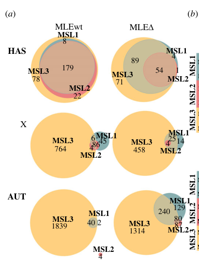
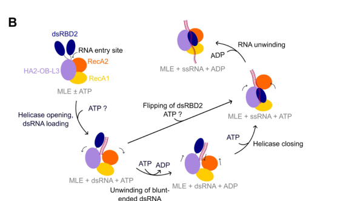

## Question

# Gene Research for Functional Annotation

## ⚠️ CRITICAL: Gene/Protein Identification Context

**BEFORE YOU BEGIN RESEARCH:** You MUST verify you are researching the CORRECT gene/protein. Gene symbols can be ambiguous, especially for less well-characterized genes from non-model organisms.

### Target Gene/Protein Identity (from UniProt):
- **UniProt Accession:** P24785
- **Protein Description:** RecName: Full=Dosage compensation regulator mle; EC=3.6.4.13 {ECO:0000269|PubMed:26545078, ECO:0000269|PubMed:9184214}; AltName: Full=Protein male-less; AltName: Full=Protein maleless {ECO:0000303|PubMed:1653648}; AltName: Full=Protein no action potential;
- **Gene Information:** Name=mle {ECO:0000303|PubMed:1653648, ECO:0000312|FlyBase:FBgn0002774}; Synonyms=nap {ECO:0000312|FlyBase:FBgn0002774}; ORFNames=CG11680 {ECO:0000312|FlyBase:FBgn0002774};
- **Organism (full):** Drosophila melanogaster (Fruit fly).
- **Protein Family:** Belongs to the DEAD box helicase family. DEAH subfamily.
- **Key Domains:** DEAD-box_helicase_OB_fold. (IPR011709); DEAD/DEAH_box_helicase_dom. (IPR011545); DHX9_DEXHc. (IPR044447); DHX9_DSRM_1. (IPR044445); DHX9_DSRM_2. (IPR044446)

### MANDATORY VERIFICATION STEPS:

1. **Check if the gene symbol "mle" matches the protein description above**
2. **Verify the organism is correct:** Drosophila melanogaster (Fruit fly).
3. **Check if protein family/domains align with what you find in literature**
4. **If you find literature for a DIFFERENT gene with the same or similar symbol, STOP**

### If Gene Symbol is Ambiguous or You Cannot Find Relevant Literature:

**DO NOT PROCEED WITH RESEARCH ON A DIFFERENT GENE.** Instead:
- State clearly: "The gene symbol 'mle' is ambiguous or literature is limited for this specific protein"
- Explain what you found (e.g., "Found extensive literature on a different gene with the same symbol in a different organism")
- Describe the protein based ONLY on the UniProt information provided above
- Suggest that the protein function can be inferred from domain/family information

### Research Target:

Please provide a comprehensive research report on the gene **mle** (gene ID: mle, UniProt: P24785) in DROME.

The research report should be a detailed narrative explaining the function, biological processes, and localization of the gene product. Citations should be given for all claims.

You should prioritize authoritative reviews and primary scientific literature when conducting research. You can supplement
this with annotations you find in gene/protein databases, but these can be outdated or inaccurate.

We are specifically interested in the primary function of the gene - for enzymes, what reaction is catalyzed, and what is the substrate specificity? For transporters, what is the substrate? For structural proteins or adapters, what is the broader structural role? For signaling molecules, what is the role in the pathway.

We are interested in where in or outside the cell the gene product carries out its function.

We are also interested in the signaling or biochemical pathways in which the gene functions. We are less interested in broad pleiotropic effects, except where these elucidate the precise role.

Include evidence where possible. We are interested in both experimental evidence as well as inference from structure, evolution, or bioinformatic analysis. Precise studies should be prioritized over high-throughput, where available.

## Output

Question: You are an expert researcher providing comprehensive, well-cited information.

Provide detailed information focusing on:
1. Key concepts and definitions with current understanding
2. Recent developments and latest research (prioritize 2023-2024 sources)
3. Current applications and real-world implementations
4. Expert opinions and analysis from authoritative sources
5. Relevant statistics and data from recent studies

Format as a comprehensive research report with proper citations. Include URLs and publication dates where available.
Always prioritize recent, authoritative sources and provide specific citations for all major claims.

# Gene Research for Functional Annotation

## ⚠️ CRITICAL: Gene/Protein Identification Context

**BEFORE YOU BEGIN RESEARCH:** You MUST verify you are researching the CORRECT gene/protein. Gene symbols can be ambiguous, especially for less well-characterized genes from non-model organisms.

### Target Gene/Protein Identity (from UniProt):
- **UniProt Accession:** P24785
- **Protein Description:** RecName: Full=Dosage compensation regulator mle; EC=3.6.4.13 {ECO:0000269|PubMed:26545078, ECO:0000269|PubMed:9184214}; AltName: Full=Protein male-less; AltName: Full=Protein maleless {ECO:0000303|PubMed:1653648}; AltName: Full=Protein no action potential;
- **Gene Information:** Name=mle {ECO:0000303|PubMed:1653648, ECO:0000312|FlyBase:FBgn0002774}; Synonyms=nap {ECO:0000312|FlyBase:FBgn0002774}; ORFNames=CG11680 {ECO:0000312|FlyBase:FBgn0002774};
- **Organism (full):** Drosophila melanogaster (Fruit fly).
- **Protein Family:** Belongs to the DEAD box helicase family. DEAH subfamily.
- **Key Domains:** DEAD-box_helicase_OB_fold. (IPR011709); DEAD/DEAH_box_helicase_dom. (IPR011545); DHX9_DEXHc. (IPR044447); DHX9_DSRM_1. (IPR044445); DHX9_DSRM_2. (IPR044446)

### MANDATORY VERIFICATION STEPS:

1. **Check if the gene symbol "mle" matches the protein description above**
2. **Verify the organism is correct:** Drosophila melanogaster (Fruit fly).
3. **Check if protein family/domains align with what you find in literature**
4. **If you find literature for a DIFFERENT gene with the same or similar symbol, STOP**

### If Gene Symbol is Ambiguous or You Cannot Find Relevant Literature:

**DO NOT PROCEED WITH RESEARCH ON A DIFFERENT GENE.** Instead:
- State clearly: "The gene symbol 'mle' is ambiguous or literature is limited for this specific protein"
- Explain what you found (e.g., "Found extensive literature on a different gene with the same symbol in a different organism")
- Describe the protein based ONLY on the UniProt information provided above
- Suggest that the protein function can be inferred from domain/family information

### Research Target:

Please provide a comprehensive research report on the gene **mle** (gene ID: mle, UniProt: P24785) in DROME.

The research report should be a detailed narrative explaining the function, biological processes, and localization of the gene product. Citations should be given for all claims.

You should prioritize authoritative reviews and primary scientific literature when conducting research. You can supplement
this with annotations you find in gene/protein databases, but these can be outdated or inaccurate.

We are specifically interested in the primary function of the gene - for enzymes, what reaction is catalyzed, and what is the substrate specificity? For transporters, what is the substrate? For structural proteins or adapters, what is the broader structural role? For signaling molecules, what is the role in the pathway.

We are interested in where in or outside the cell the gene product carries out its function.

We are also interested in the signaling or biochemical pathways in which the gene functions. We are less interested in broad pleiotropic effects, except where these elucidate the precise role.

Include evidence where possible. We are interested in both experimental evidence as well as inference from structure, evolution, or bioinformatic analysis. Precise studies should be prioritized over high-throughput, where available.

# Functional annotation of *mle* in *Drosophila melanogaster*

## Identity and principal function

**Identity verified.** The specified UniProt accession [P24785](https://www.uniprot.org/uniprotkb/P24785/entry) refers to *D. melanogaster* **maleless** (*mle*; the supplied record also lists *nap* and CG11680), not to a similarly named protein from another organism. Experimental studies independently identify fly MLE as a DExH/DEAH-family, ATP-dependent helicase with two N-terminal double-stranded-RNA-binding domains (dsRBDs), a two-RecA-domain motor, associated HA2 and OB-like domains, and a C-terminal region involved in nuclear localization. The historical *nap* allele connects this same protein to neuronal RNA processing. “DEAD-box family” in broad annotations should therefore not obscure the more precise **DExH/DEAH–RNA-helicase-A subgroup** designation. (tikhonova2024interactionofmle pages 2-3, prabu2015structureofthe pages 1-3, jagtap2019structuredynamicsand pages 1-2, cugusi2015thedrosophilahelicase pages 1-2)

**The best-established primary function is to use ATP to remodel the long noncoding roX1 and roX2 RNAs so that the male-specific-lethal dosage-compensation complex assembles and operates on the male X chromosome.** In this pathway, MLE is an RNA-remodeling enzyme and assembly factor, **not** the enzyme that acetylates histones: histone H4 lysine-16 acetylation (H4K16ac) is catalyzed by its complex partner MOF. (maenner2013atpdependentroxrna pages 1-2, prabu2015structureofthe pages 1-3, morra2011roleofthe pages 1-2)

## Catalytic activity and substrate specificity

MLE couples **ATP hydrolysis, ATP + H₂O → ADP + inorganic phosphate**, to RNA translocation, duplex unwinding and ribonucleoprotein remodeling. Its physiological substrates most firmly established by binding, remodeling and genetic experiments are structured **roX RNAs**, particularly uridine-rich roX-box-containing stem-loops. It recognizes duplex RNA through dsRBDs and engages single-stranded RNA in a channel formed by its helicase and auxiliary domains. A 2.1-Å structure of MLE’s catalytic core bound to U₁₀ RNA and an ATP-transition-state mimic showed **four uridines making base-specific contacts**; biochemical assays also showed binding to U-rich over A-rich model RNA and unwinding of RNA duplexes, including blunt-ended substrates. DExH-family studies and a subsequent MLE structural model support **3′→5′ RNA translocation**. Neither the transition-state mimic nor the uridine preference means that MLE chemically modifies uridine. (prabu2015structureofthe pages 1-3, prabu2015structureofthe pages 3-4, lang2024regulationandmechanisms pages 6-8)

Substrate preference is **not absolute RNA-only catalysis**: purified MLE also unwinds RNA–DNA hybrids in vitro, while earlier work reported a preference for double-stranded RNA and RNA–DNA substrates with suitable loading ends. Nevertheless, specific chromosomal DNA or histones have not been demonstrated to be MLE’s principal *in vivo* catalytic substrates. RNA-dependent ATPase activity and roX remodeling provide the stronger mechanistic explanation of its dosage-compensation role. (morra2008themlesubunit pages 1-2, morra2011roleofthe pages 1-2)

The domains have distinguishable functions. dsRBD2 is closely coupled to the motor and is crucial for efficient RNA-dependent ATPase/helicase activity; dsRBD1 can contribute to duplex binding and targeting but is less critical for catalysis. A 2.90-Å crystal structure of tandem dsRBDs bound to a **55-nucleotide roX2 stem-loop** showed cooperative recognition, with dsRBD2 binding more strongly. There is an important experimental qualification: a separate 2019 NMR/cell study found that mutations weakening dsRBD1’s RNA binding *in vitro* did **not** measurably prevent steady-state roX2 binding or X-territory localization under its cellular conditions. Thus, complete domain deletions and particular RNA-contact substitutions should not be treated as interchangeable tests of dsRBD1 function. (lv2019structuralinsightsreveal pages 1-2, jagtap2019structuredynamicsand pages 1-2, lv2019structuralinsightsreveal pages 10-12, jagtap2019structuredynamicsand pages 11-12)

## Mechanism in X-chromosome dosage compensation

Male flies have one X chromosome; the MSL complex raises transcription of many X-linked genes toward the output of the two female X chromosomes. Its protein components are MSL1, MSL2, MSL3, MOF and MLE, together with roX RNA. MLE and several partners are expressed in both sexes, but the functional chromosome-wide MSL assembly is male-specific because, notably, **MSL2 is restricted to males**. High-affinity chromosomal sites nucleate recruitment; the complex subsequently occupies active X-linked genes, where MOF supplies H4K16ac. Thus MLE acts **upstream of, and within, the assembly and targeting pathway**, rather than directly writing the chromatin mark. (tikhonova2024interactionofmle pages 1-2, maenner2013atpdependentroxrna pages 1-2, lucchesi2015dosagecompensationin pages 6-8, morra2011roleofthe pages 1-2)

The clearest molecular sequence is **roX binding → ATP-dependent stem-loop remodeling → exposure or creation of productive MSL2-binding RNA structure → MSL ribonucleoprotein assembly → appropriate male-X recruitment and spreading**. Purified MLE disrupted a functional roX2 stem-loop upon ATP addition, promoting selective MSL2 association; a remodeled configuration was also detected in chromatin-bound roX2 *in vivo*. Transcript-wide crosslinking studies identified roX1 and roX2 as prominent endogenous MLE RNA targets. The RNA-binding protein UNR additionally binds roX2 and facilitates MLE–roX2 association and MLE occupancy at X-linked high-affinity sites; UNR depletion reduced these associations without demonstrating that UNR itself performs MLE’s ATP-dependent reaction. (maenner2013atpdependentroxrna pages 1-2, militti2014unrfacilitatesthe pages 1-2, militti2014unrfacilitatesthe pages 4-5, ilik2013tandemstemloopsin pages 1-2)

Genetics indicates that the **ATPase and duplex-unwinding outputs are separable**. Earlier separation-of-function experiments found ATPase activity sufficient to support transcriptional enhancement near occupied high-affinity sites, whereas helicase activity was required for normal complex spreading across the X. This is a context-specific experimental distinction, not evidence that ATP hydrolysis and helicase action are unrelated biochemical processes. Disrupting dsRBD2 severely impairs roX association and productive complex function; both RNA-binding domains contribute to correct chromosomal targeting. Interpret individual deletion phenotypes cautiously: one 2011 study’s detailed chromosomal-staining results differ in places from the simplified account in its abstract, so the broad conclusion is stronger than any single claimed domain-to-H4K16ac assignment. (morra2008themlesubunit pages 1-2, izzo2008structurefunctionanalysisof pages 9-10, morra2011roleofthe pages 1-2, morra2011roleofthe pages 4-6)

## Where MLE acts

**The established site of its principal physiological action is the nucleus**, on roX-containing ribonucleoproteins and at the **male X-chromosome territory**, including sites involved in MSL recruitment. Its C-terminal region contains a nuclear-localization signal: removing the NLS-containing glycine-rich region retains mutant MLE substantially in the cytoplasm and can also retain other MSL components there. These mutant-transport observations must **not** be misread as evidence that wild-type MLE normally carries out dosage compensation in the cytoplasm. MLE is present in female cells too, where it can participate in functions distinct from a complete male MSL complex. No extracellular role is established. (morra2011roleofthe pages 1-2, cugusi2015thedrosophilahelicase pages 1-2, izzo2008structurefunctionanalysisof pages 11-12, morra2011roleofthe pages 6-9)

## Developments reported in 2023–2024

**RNA-induced motor regulation (2023).** Jagtap and colleagues reported cryo-EM states of fly MLE in *Molecular Cell* (2023; DOI [10.1016/j.molcel.2023.10.026](https://doi.org/10.1016/j.molcel.2023.10.026)). Their 2024 coauthor review describes a compact substrate-free state with an occluded RNA channel; a duplex-RNA-bound state in which dsRBD2 positions RNA near that channel; and a single-stranded-RNA-bound state in which dsRBD2 engages the motor and the channel accommodates RNA. The resulting model makes dsRBD2 a **substrate-recruiting and autoregulatory switch**, rather than just a passive RNA tether. The exact temporal order of ATP and RNA binding remains unresolved. The primary article’s full text was not available in this retrieval, so these mechanistic details are attributed to the coauthors’ review rather than presented as an independent reanalysis of its experiments. (lang2024regulationandmechanisms pages 12-13, lang2024regulationandmechanisms pages 6-8, lang2024regulationandmechanisms pages 4-6, lang2024regulationandmechanisms media 6b735456)

**An additional X-recruitment interface (March 2024).** Tikhonova and colleagues found that an unstructured MLE region immediately beyond its globular core binds the **sixth zinc finger of CLAMP**, a GA-repeat-binding factor implicated in MSL recruitment. Deletion mapping implicated approximately MLE residues **1158–1195**; a transgenic construct removing **1158–1179** lost detectable CLAMP co-immunoprecipitation. In adult male flies, deleting this CLAMP-binding segment weakened MSL2 at X-chromosome high-affinity sites, reduced X-associated MSL3 signal by approximately **two- to threefold**, and produced approximately **330 additional autosomal MSL1 peaks**. Across the reported ChIP-seq calls, MSL2 peaks numbered **223 versus 82** in wild-type-MLE versus deletion lines. Male rescue was incomplete: at higher mutant-transgene expression, surviving males occurred at about **one per five females**, were weak, and died within a week. These are compelling genetic and complex-occupancy results, but the ChIP signals measure **MSL proteins**, not a new chemical reaction of MLE; the authors also reported transgene-expression and developmental-stage qualifications. (tikhonova2024interactionofmle pages 3-4, tikhonova2024interactionofmle pages 6-7, tikhonova2024interactionofmle pages 7-8, tikhonova2024interactionofmle pages 4-5, tikhonova2024interactionofmle pages 5-6, tikhonova2024interactionofmle media 1804bfc8)

## Other demonstrated or proposed roles

The *nap* connection supports a **separate RNA-processing function**: temperature-sensitive *mle* mutation disrupts processing of the *para* voltage-gated sodium-channel transcript, lowers channel expression and causes temperature-sensitive neuronal paralysis. The proposed immediate substrate is a structured *para* pre-mRNA region whose remodeling helps normal editing-associated processing and splicing; the available evidence does **not** establish MLE as the enzyme catalyzing adenosine-to-inosine editing itself. This is a useful physiological example of MLE acting outside male-X dosage compensation, including in both sexes. (prabu2015structureofthe pages 1-3, garber2012effectofsodium pages 1-3, izzo2008structurefunctionanalysisof pages 1-2, cugusi2015thedrosophilahelicase pages 1-2)

Affinity purification and follow-up assays found **140 confident protein interactors**, including **16 spliceosomal proteins** and RNA-dependent associations with hnRNP-related factors; other experiments detected association with Mi-2, MEP-1 and p66 of chromatin-regulatory machinery. These establish biochemical associations and motivate additional nuclear RNA-processing/chromatin hypotheses, but do not prove that every identified partner is a direct MLE substrate or that MLE is an obligate catalytic subunit of each complex. Likewise, roles inferred from the human ortholog **DHX9** should not automatically be assigned to fly MLE. (cugusi2015thedrosophilahelicase pages 8-9, cugusi2015thedrosophilahelicase pages 3-5, cugusi2015thedrosophilahelicase pages 6-8, cugusi2015thedrosophilahelicase pages 5-6)

**Functional annotation:** *mle* encodes a primarily nuclear, ATP-dependent DExH RNA helicase whose most securely identified endogenous substrate class is structured **roX lncRNA**. Its defining pathway role is to make roX RNA competent for assembly, recruitment and chromosome-wide action of the male-X MSL dosage-compensation machinery; additional evidence supports structured neuronal pre-mRNA processing, whereas many proposed genome-wide RNA and chromatin functions remain less mechanistically resolved. (maenner2013atpdependentroxrna pages 1-2, prabu2015structureofthe pages 1-3, garber2012effectofsodium pages 1-3, tikhonova2024interactionofmle pages 7-8, ilik2013tandemstemloopsin pages 1-2)

References

1. (tikhonova2024interactionofmle pages 2-3): Evgeniya Tikhonova, Anastasia Revel-Muroz, Pavel Georgiev, and Oksana Maksimenko. Interaction of mle with clamp zinc finger is involved in proper msl proteins binding to chromosomes in drosophila. Open Biology, Mar 2024. URL: https://doi.org/10.1098/rsob.230270, doi:10.1098/rsob.230270. This article has 8 citations and is from a peer-reviewed journal.

2. (prabu2015structureofthe pages 1-3): J. Rajan Prabu, Marisa Müller, Andreas W. Thomae, Steffen Schüssler, Fabien Bonneau, Peter B. Becker, and Elena Conti. Structure of the rna helicase mle reveals the molecular mechanisms for uridine specificity and rna-atp coupling. Molecular cell, 60 3:487-99, Nov 2015. URL: https://doi.org/10.1016/j.molcel.2015.10.011, doi:10.1016/j.molcel.2015.10.011. This article has 84 citations and is from a highest quality peer-reviewed journal.

3. (jagtap2019structuredynamicsand pages 1-2): Pravin Kumar Ankush Jagtap, Marisa Müller, Pawel Masiewicz, Sören von Bülow, Nele Merret Hollmann, Po-Chia Chen, Bernd Simon, Andreas W Thomae, Peter B Becker, and Janosch Hennig. Structure, dynamics and rox2-lncrna binding of tandem double-stranded rna binding domains dsrbd1,2 of drosophila helicase maleless. Nucleic Acids Research, 47:4319-4333, Feb 2019. URL: https://doi.org/10.1093/nar/gkz125, doi:10.1093/nar/gkz125. This article has 25 citations and is from a highest quality peer-reviewed journal.

4. (cugusi2015thedrosophilahelicase pages 1-2): Simona Cugusi, Satish Kallappagoudar, Huiping Ling, and John C. Lucchesi. The drosophila helicase maleless (mle) is implicated in functions distinct from its role in dosage compensation*. Molecular &amp; Cellular Proteomics, 14:1478-1488, Jun 2015. URL: https://doi.org/10.1074/mcp.m114.040667, doi:10.1074/mcp.m114.040667. This article has 30 citations and is from a domain leading peer-reviewed journal.

5. (maenner2013atpdependentroxrna pages 1-2): Sylvain Maenner, Marisa Müller, Jonathan Fröhlich, Diana Langer, and Peter B. Becker. Atp-dependent rox rna remodeling by the helicase maleless enables specific association of msl proteins. Molecular cell, 51 2:174-84, Jul 2013. URL: https://doi.org/10.1016/j.molcel.2013.06.011, doi:10.1016/j.molcel.2013.06.011. This article has 118 citations and is from a highest quality peer-reviewed journal.

6. (morra2011roleofthe pages 1-2): Rosa Morra, Ruth Yokoyama, Huiping Ling, and John C Lucchesi. Role of the atpase/helicase maleless (mle) in the assembly, targeting, spreading and function of the male-specific lethal (msl) complex of drosophila. Epigenetics & Chromatin, 4:6-6, Apr 2011. URL: https://doi.org/10.1186/1756-8935-4-6, doi:10.1186/1756-8935-4-6. This article has 37 citations and is from a peer-reviewed journal.

7. (prabu2015structureofthe pages 3-4): J. Rajan Prabu, Marisa Müller, Andreas W. Thomae, Steffen Schüssler, Fabien Bonneau, Peter B. Becker, and Elena Conti. Structure of the rna helicase mle reveals the molecular mechanisms for uridine specificity and rna-atp coupling. Molecular cell, 60 3:487-99, Nov 2015. URL: https://doi.org/10.1016/j.molcel.2015.10.011, doi:10.1016/j.molcel.2015.10.011. This article has 84 citations and is from a highest quality peer-reviewed journal.

8. (lang2024regulationandmechanisms pages 6-8): Nina Lang, Pravin Kumar Ankush Jagtap, and Janosch Hennig. Regulation and mechanisms of action of rna helicases. RNA Biology, 21:1100-1114, Oct 2024. URL: https://doi.org/10.1080/15476286.2024.2415801, doi:10.1080/15476286.2024.2415801. This article has 29 citations and is from a peer-reviewed journal.

9. (morra2008themlesubunit pages 1-2): Rosa Morra, Edwin R. Smith, Ruth Yokoyama, and John C. Lucchesi. The mle subunit of the <i>drosophila</i> msl complex uses its atpase activity for dosage compensation and its helicase activity for targeting. Molecular and Cellular Biology, 28:958-966, Feb 2008. URL: https://doi.org/10.1128/mcb.00995-07, doi:10.1128/mcb.00995-07. This article has 52 citations and is from a domain leading peer-reviewed journal.

10. (lv2019structuralinsightsreveal pages 1-2): Mengqi Lv, Yixiang Yao, Fudong Li, Ling Xu, Lingna Yang, Qingguo Gong, Yong-Zhen Xu, Yunyu Shi, Yu-Jie Fan, and Yajun Tang. Structural insights reveal the specific recognition of rox rna by the dsrna-binding domains of the rna helicase mle and its indispensable role in dosage compensation in<i>drosophila</i>. Nucleic Acids Research, 47:3142-3157, Jan 2019. URL: https://doi.org/10.1093/nar/gky1308, doi:10.1093/nar/gky1308. This article has 25 citations and is from a highest quality peer-reviewed journal.

11. (lv2019structuralinsightsreveal pages 10-12): Mengqi Lv, Yixiang Yao, Fudong Li, Ling Xu, Lingna Yang, Qingguo Gong, Yong-Zhen Xu, Yunyu Shi, Yu-Jie Fan, and Yajun Tang. Structural insights reveal the specific recognition of rox rna by the dsrna-binding domains of the rna helicase mle and its indispensable role in dosage compensation in<i>drosophila</i>. Nucleic Acids Research, 47:3142-3157, Jan 2019. URL: https://doi.org/10.1093/nar/gky1308, doi:10.1093/nar/gky1308. This article has 25 citations and is from a highest quality peer-reviewed journal.

12. (jagtap2019structuredynamicsand pages 11-12): Pravin Kumar Ankush Jagtap, Marisa Müller, Pawel Masiewicz, Sören von Bülow, Nele Merret Hollmann, Po-Chia Chen, Bernd Simon, Andreas W Thomae, Peter B Becker, and Janosch Hennig. Structure, dynamics and rox2-lncrna binding of tandem double-stranded rna binding domains dsrbd1,2 of drosophila helicase maleless. Nucleic Acids Research, 47:4319-4333, Feb 2019. URL: https://doi.org/10.1093/nar/gkz125, doi:10.1093/nar/gkz125. This article has 25 citations and is from a highest quality peer-reviewed journal.

13. (tikhonova2024interactionofmle pages 1-2): Evgeniya Tikhonova, Anastasia Revel-Muroz, Pavel Georgiev, and Oksana Maksimenko. Interaction of mle with clamp zinc finger is involved in proper msl proteins binding to chromosomes in drosophila. Open Biology, Mar 2024. URL: https://doi.org/10.1098/rsob.230270, doi:10.1098/rsob.230270. This article has 8 citations and is from a peer-reviewed journal.

14. (lucchesi2015dosagecompensationin pages 6-8): John C. Lucchesi and Mitzi I. Kuroda. Dosage compensation in drosophila. Cold Spring Harbor perspectives in biology, 7 5:a019398, May 2015. URL: https://doi.org/10.1101/cshperspect.a019398, doi:10.1101/cshperspect.a019398. This article has 167 citations and is from a peer-reviewed journal.

15. (militti2014unrfacilitatesthe pages 1-2): Cristina Militti, Sylvain Maenner, Peter B. Becker, and Fátima Gebauer. Unr facilitates the interaction of mle with the lncrna rox2 during drosophila dosage compensation. Nature Communications, Aug 2014. URL: https://doi.org/10.1038/ncomms5762, doi:10.1038/ncomms5762. This article has 38 citations and is from a highest quality peer-reviewed journal.

16. (militti2014unrfacilitatesthe pages 4-5): Cristina Militti, Sylvain Maenner, Peter B. Becker, and Fátima Gebauer. Unr facilitates the interaction of mle with the lncrna rox2 during drosophila dosage compensation. Nature Communications, Aug 2014. URL: https://doi.org/10.1038/ncomms5762, doi:10.1038/ncomms5762. This article has 38 citations and is from a highest quality peer-reviewed journal.

17. (ilik2013tandemstemloopsin pages 1-2): Ibrahim Avsar Ilik, Jeffrey J. Quinn, Plamen Georgiev, Filipe Tavares-Cadete, Daniel Maticzka, Sarah Toscano, Yue Wan, Robert C. Spitale, Nicholas Luscombe, Rolf Backofen, Howard Y. Chang, and Asifa Akhtar. Tandem stem-loops in rox rnas act together to mediate x chromosome dosage compensation in drosophila. Molecular cell, 51 2:156-73, Jul 2013. URL: https://doi.org/10.1016/j.molcel.2013.07.001, doi:10.1016/j.molcel.2013.07.001. This article has 208 citations and is from a highest quality peer-reviewed journal.

18. (izzo2008structurefunctionanalysisof pages 9-10): Annalisa Izzo, Catherine Regnard, Violette Morales, Elisabeth Kremmer, and Peter B. Becker. Structure-function analysis of the rna helicase maleless. Nucleic Acids Research, 36:950-962, Dec 2008. URL: https://doi.org/10.1093/nar/gkm1108, doi:10.1093/nar/gkm1108. This article has 55 citations and is from a highest quality peer-reviewed journal.

19. (morra2011roleofthe pages 4-6): Rosa Morra, Ruth Yokoyama, Huiping Ling, and John C Lucchesi. Role of the atpase/helicase maleless (mle) in the assembly, targeting, spreading and function of the male-specific lethal (msl) complex of drosophila. Epigenetics & Chromatin, 4:6-6, Apr 2011. URL: https://doi.org/10.1186/1756-8935-4-6, doi:10.1186/1756-8935-4-6. This article has 37 citations and is from a peer-reviewed journal.

20. (izzo2008structurefunctionanalysisof pages 11-12): Annalisa Izzo, Catherine Regnard, Violette Morales, Elisabeth Kremmer, and Peter B. Becker. Structure-function analysis of the rna helicase maleless. Nucleic Acids Research, 36:950-962, Dec 2008. URL: https://doi.org/10.1093/nar/gkm1108, doi:10.1093/nar/gkm1108. This article has 55 citations and is from a highest quality peer-reviewed journal.

21. (morra2011roleofthe pages 6-9): Rosa Morra, Ruth Yokoyama, Huiping Ling, and John C Lucchesi. Role of the atpase/helicase maleless (mle) in the assembly, targeting, spreading and function of the male-specific lethal (msl) complex of drosophila. Epigenetics & Chromatin, 4:6-6, Apr 2011. URL: https://doi.org/10.1186/1756-8935-4-6, doi:10.1186/1756-8935-4-6. This article has 37 citations and is from a peer-reviewed journal.

22. (lang2024regulationandmechanisms pages 12-13): Nina Lang, Pravin Kumar Ankush Jagtap, and Janosch Hennig. Regulation and mechanisms of action of rna helicases. RNA Biology, 21:1100-1114, Oct 2024. URL: https://doi.org/10.1080/15476286.2024.2415801, doi:10.1080/15476286.2024.2415801. This article has 29 citations and is from a peer-reviewed journal.

23. (lang2024regulationandmechanisms pages 4-6): Nina Lang, Pravin Kumar Ankush Jagtap, and Janosch Hennig. Regulation and mechanisms of action of rna helicases. RNA Biology, 21:1100-1114, Oct 2024. URL: https://doi.org/10.1080/15476286.2024.2415801, doi:10.1080/15476286.2024.2415801. This article has 29 citations and is from a peer-reviewed journal.

24. (lang2024regulationandmechanisms media 6b735456): Nina Lang, Pravin Kumar Ankush Jagtap, and Janosch Hennig. Regulation and mechanisms of action of rna helicases. RNA Biology, 21:1100-1114, Oct 2024. URL: https://doi.org/10.1080/15476286.2024.2415801, doi:10.1080/15476286.2024.2415801. This article has 29 citations and is from a peer-reviewed journal.

25. (tikhonova2024interactionofmle pages 3-4): Evgeniya Tikhonova, Anastasia Revel-Muroz, Pavel Georgiev, and Oksana Maksimenko. Interaction of mle with clamp zinc finger is involved in proper msl proteins binding to chromosomes in drosophila. Open Biology, Mar 2024. URL: https://doi.org/10.1098/rsob.230270, doi:10.1098/rsob.230270. This article has 8 citations and is from a peer-reviewed journal.

26. (tikhonova2024interactionofmle pages 6-7): Evgeniya Tikhonova, Anastasia Revel-Muroz, Pavel Georgiev, and Oksana Maksimenko. Interaction of mle with clamp zinc finger is involved in proper msl proteins binding to chromosomes in drosophila. Open Biology, Mar 2024. URL: https://doi.org/10.1098/rsob.230270, doi:10.1098/rsob.230270. This article has 8 citations and is from a peer-reviewed journal.

27. (tikhonova2024interactionofmle pages 7-8): Evgeniya Tikhonova, Anastasia Revel-Muroz, Pavel Georgiev, and Oksana Maksimenko. Interaction of mle with clamp zinc finger is involved in proper msl proteins binding to chromosomes in drosophila. Open Biology, Mar 2024. URL: https://doi.org/10.1098/rsob.230270, doi:10.1098/rsob.230270. This article has 8 citations and is from a peer-reviewed journal.

28. (tikhonova2024interactionofmle pages 4-5): Evgeniya Tikhonova, Anastasia Revel-Muroz, Pavel Georgiev, and Oksana Maksimenko. Interaction of mle with clamp zinc finger is involved in proper msl proteins binding to chromosomes in drosophila. Open Biology, Mar 2024. URL: https://doi.org/10.1098/rsob.230270, doi:10.1098/rsob.230270. This article has 8 citations and is from a peer-reviewed journal.

29. (tikhonova2024interactionofmle pages 5-6): Evgeniya Tikhonova, Anastasia Revel-Muroz, Pavel Georgiev, and Oksana Maksimenko. Interaction of mle with clamp zinc finger is involved in proper msl proteins binding to chromosomes in drosophila. Open Biology, Mar 2024. URL: https://doi.org/10.1098/rsob.230270, doi:10.1098/rsob.230270. This article has 8 citations and is from a peer-reviewed journal.

30. (tikhonova2024interactionofmle media 1804bfc8): Evgeniya Tikhonova, Anastasia Revel-Muroz, Pavel Georgiev, and Oksana Maksimenko. Interaction of mle with clamp zinc finger is involved in proper msl proteins binding to chromosomes in drosophila. Open Biology, Mar 2024. URL: https://doi.org/10.1098/rsob.230270, doi:10.1098/rsob.230270. This article has 8 citations and is from a peer-reviewed journal.

31. (garber2012effectofsodium pages 1-3): Graham Garber, Lee Ann Smith, Robert A. Reenan, and Blanka Rogina. Effect of sodium channel abundance on drosophila development, reproductive capacity and aging. Fly, 6:57-67, Jan 2012. URL: https://doi.org/10.4161/fly.18570, doi:10.4161/fly.18570. This article has 12 citations and is from a peer-reviewed journal.

32. (izzo2008structurefunctionanalysisof pages 1-2): Annalisa Izzo, Catherine Regnard, Violette Morales, Elisabeth Kremmer, and Peter B. Becker. Structure-function analysis of the rna helicase maleless. Nucleic Acids Research, 36:950-962, Dec 2008. URL: https://doi.org/10.1093/nar/gkm1108, doi:10.1093/nar/gkm1108. This article has 55 citations and is from a highest quality peer-reviewed journal.

33. (cugusi2015thedrosophilahelicase pages 8-9): Simona Cugusi, Satish Kallappagoudar, Huiping Ling, and John C. Lucchesi. The drosophila helicase maleless (mle) is implicated in functions distinct from its role in dosage compensation*. Molecular &amp; Cellular Proteomics, 14:1478-1488, Jun 2015. URL: https://doi.org/10.1074/mcp.m114.040667, doi:10.1074/mcp.m114.040667. This article has 30 citations and is from a domain leading peer-reviewed journal.

34. (cugusi2015thedrosophilahelicase pages 3-5): Simona Cugusi, Satish Kallappagoudar, Huiping Ling, and John C. Lucchesi. The drosophila helicase maleless (mle) is implicated in functions distinct from its role in dosage compensation*. Molecular &amp; Cellular Proteomics, 14:1478-1488, Jun 2015. URL: https://doi.org/10.1074/mcp.m114.040667, doi:10.1074/mcp.m114.040667. This article has 30 citations and is from a domain leading peer-reviewed journal.

35. (cugusi2015thedrosophilahelicase pages 6-8): Simona Cugusi, Satish Kallappagoudar, Huiping Ling, and John C. Lucchesi. The drosophila helicase maleless (mle) is implicated in functions distinct from its role in dosage compensation*. Molecular &amp; Cellular Proteomics, 14:1478-1488, Jun 2015. URL: https://doi.org/10.1074/mcp.m114.040667, doi:10.1074/mcp.m114.040667. This article has 30 citations and is from a domain leading peer-reviewed journal.

36. (cugusi2015thedrosophilahelicase pages 5-6): Simona Cugusi, Satish Kallappagoudar, Huiping Ling, and John C. Lucchesi. The drosophila helicase maleless (mle) is implicated in functions distinct from its role in dosage compensation*. Molecular &amp; Cellular Proteomics, 14:1478-1488, Jun 2015. URL: https://doi.org/10.1074/mcp.m114.040667, doi:10.1074/mcp.m114.040667. This article has 30 citations and is from a domain leading peer-reviewed journal.

## Artifacts

## Citations

1. tikhonova2024interactionofmle pages 2-3
2. prabu2015structureofthe pages 1-3
3. jagtap2019structuredynamicsand pages 1-2
4. cugusi2015thedrosophilahelicase pages 1-2
5. maenner2013atpdependentroxrna pages 1-2
6. morra2011roleofthe pages 1-2
7. prabu2015structureofthe pages 3-4
8. lang2024regulationandmechanisms pages 6-8
9. morra2008themlesubunit pages 1-2
10. lv2019structuralinsightsreveal pages 1-2
11. lv2019structuralinsightsreveal pages 10-12
12. jagtap2019structuredynamicsand pages 11-12
13. tikhonova2024interactionofmle pages 1-2
14. lucchesi2015dosagecompensationin pages 6-8
15. militti2014unrfacilitatesthe pages 1-2
16. militti2014unrfacilitatesthe pages 4-5
17. ilik2013tandemstemloopsin pages 1-2
18. izzo2008structurefunctionanalysisof pages 9-10
19. morra2011roleofthe pages 4-6
20. izzo2008structurefunctionanalysisof pages 11-12
21. morra2011roleofthe pages 6-9
22. lang2024regulationandmechanisms pages 12-13
23. lang2024regulationandmechanisms pages 4-6
24. tikhonova2024interactionofmle pages 3-4
25. tikhonova2024interactionofmle pages 6-7
26. tikhonova2024interactionofmle pages 7-8
27. tikhonova2024interactionofmle pages 4-5
28. tikhonova2024interactionofmle pages 5-6
29. garber2012effectofsodium pages 1-3
30. izzo2008structurefunctionanalysisof pages 1-2
31. cugusi2015thedrosophilahelicase pages 8-9
32. cugusi2015thedrosophilahelicase pages 3-5
33. cugusi2015thedrosophilahelicase pages 6-8
34. cugusi2015thedrosophilahelicase pages 5-6
35. P24785
36. 10.1016/j.molcel.2023.10.026
37. https://www.uniprot.org/uniprotkb/P24785/entry
38. https://doi.org/10.1016/j.molcel.2023.10.026
39. https://doi.org/10.1098/rsob.230270,
40. https://doi.org/10.1016/j.molcel.2015.10.011,
41. https://doi.org/10.1093/nar/gkz125,
42. https://doi.org/10.1074/mcp.m114.040667,
43. https://doi.org/10.1016/j.molcel.2013.06.011,
44. https://doi.org/10.1186/1756-8935-4-6,
45. https://doi.org/10.1080/15476286.2024.2415801,
46. https://doi.org/10.1128/mcb.00995-07,
47. https://doi.org/10.1093/nar/gky1308,
48. https://doi.org/10.1101/cshperspect.a019398,
49. https://doi.org/10.1038/ncomms5762,
50. https://doi.org/10.1016/j.molcel.2013.07.001,
51. https://doi.org/10.1093/nar/gkm1108,
52. https://doi.org/10.4161/fly.18570,