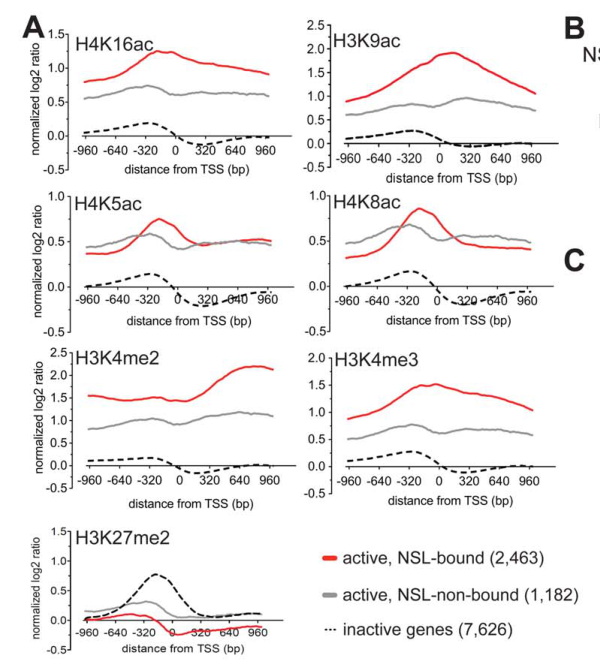

## Question

# Gene Research for Functional Annotation

## ⚠️ CRITICAL: Gene/Protein Identification Context

**BEFORE YOU BEGIN RESEARCH:** You MUST verify you are researching the CORRECT gene/protein. Gene symbols can be ambiguous, especially for less well-characterized genes from non-model organisms.

### Target Gene/Protein Identity (from UniProt):
- **UniProt Accession:** O02193
- **Protein Description:** RecName: Full=Histone acetyltransferase MOF {ECO:0000305}; EC=2.3.1.48 {ECO:0000269|PubMed:10882077, ECO:0000269|PubMed:11258702, ECO:0000269|PubMed:18510926, ECO:0000269|PubMed:20620953, ECO:0000269|PubMed:22421046, ECO:0000305|PubMed:16543150}; AltName: Full=Males-absent on the first protein {ECO:0000303|PubMed:9155031};
- **Gene Information:** Name=mof {ECO:0000303|PubMed:9155031, ECO:0000312|FlyBase:FBgn0014340}; ORFNames=CG3025 {ECO:0000312|FlyBase:FBgn0014340};
- **Organism (full):** Drosophila melanogaster (Fruit fly).
- **Protein Family:** Belongs to the MYST (SAS/MOZ) family. .
- **Key Domains:** Acyl_CoA_acyltransferase. (IPR016181); Chromo-like_dom_sf. (IPR016197); HAT_MYST-type. (IPR002717); MYST_HAT. (IPR050603); Tudor-knot. (IPR025995)

### MANDATORY VERIFICATION STEPS:

1. **Check if the gene symbol "mof" matches the protein description above**
2. **Verify the organism is correct:** Drosophila melanogaster (Fruit fly).
3. **Check if protein family/domains align with what you find in literature**
4. **If you find literature for a DIFFERENT gene with the same or similar symbol, STOP**

### If Gene Symbol is Ambiguous or You Cannot Find Relevant Literature:

**DO NOT PROCEED WITH RESEARCH ON A DIFFERENT GENE.** Instead:
- State clearly: "The gene symbol 'mof' is ambiguous or literature is limited for this specific protein"
- Explain what you found (e.g., "Found extensive literature on a different gene with the same symbol in a different organism")
- Describe the protein based ONLY on the UniProt information provided above
- Suggest that the protein function can be inferred from domain/family information

### Research Target:

Please provide a comprehensive research report on the gene **mof** (gene ID: mof, UniProt: O02193) in DROME.

The research report should be a detailed narrative explaining the function, biological processes, and localization of the gene product. Citations should be given for all claims.

You should prioritize authoritative reviews and primary scientific literature when conducting research. You can supplement
this with annotations you find in gene/protein databases, but these can be outdated or inaccurate.

We are specifically interested in the primary function of the gene - for enzymes, what reaction is catalyzed, and what is the substrate specificity? For transporters, what is the substrate? For structural proteins or adapters, what is the broader structural role? For signaling molecules, what is the role in the pathway.

We are interested in where in or outside the cell the gene product carries out its function.

We are also interested in the signaling or biochemical pathways in which the gene functions. We are less interested in broad pleiotropic effects, except where these elucidate the precise role.

Include evidence where possible. We are interested in both experimental evidence as well as inference from structure, evolution, or bioinformatic analysis. Precise studies should be prioritized over high-throughput, where available.

## Output

Question: You are an expert researcher providing comprehensive, well-cited information.

Provide detailed information focusing on:
1. Key concepts and definitions with current understanding
2. Recent developments and latest research (prioritize 2023-2024 sources)
3. Current applications and real-world implementations
4. Expert opinions and analysis from authoritative sources
5. Relevant statistics and data from recent studies

Format as a comprehensive research report with proper citations. Include URLs and publication dates where available.
Always prioritize recent, authoritative sources and provide specific citations for all major claims.

# Gene Research for Functional Annotation

## ⚠️ CRITICAL: Gene/Protein Identification Context

**BEFORE YOU BEGIN RESEARCH:** You MUST verify you are researching the CORRECT gene/protein. Gene symbols can be ambiguous, especially for less well-characterized genes from non-model organisms.

### Target Gene/Protein Identity (from UniProt):
- **UniProt Accession:** O02193
- **Protein Description:** RecName: Full=Histone acetyltransferase MOF {ECO:0000305}; EC=2.3.1.48 {ECO:0000269|PubMed:10882077, ECO:0000269|PubMed:11258702, ECO:0000269|PubMed:18510926, ECO:0000269|PubMed:20620953, ECO:0000269|PubMed:22421046, ECO:0000305|PubMed:16543150}; AltName: Full=Males-absent on the first protein {ECO:0000303|PubMed:9155031};
- **Gene Information:** Name=mof {ECO:0000303|PubMed:9155031, ECO:0000312|FlyBase:FBgn0014340}; ORFNames=CG3025 {ECO:0000312|FlyBase:FBgn0014340};
- **Organism (full):** Drosophila melanogaster (Fruit fly).
- **Protein Family:** Belongs to the MYST (SAS/MOZ) family. .
- **Key Domains:** Acyl_CoA_acyltransferase. (IPR016181); Chromo-like_dom_sf. (IPR016197); HAT_MYST-type. (IPR002717); MYST_HAT. (IPR050603); Tudor-knot. (IPR025995)

### MANDATORY VERIFICATION STEPS:

1. **Check if the gene symbol "mof" matches the protein description above**
2. **Verify the organism is correct:** Drosophila melanogaster (Fruit fly).
3. **Check if protein family/domains align with what you find in literature**
4. **If you find literature for a DIFFERENT gene with the same or similar symbol, STOP**

### If Gene Symbol is Ambiguous or You Cannot Find Relevant Literature:

**DO NOT PROCEED WITH RESEARCH ON A DIFFERENT GENE.** Instead:
- State clearly: "The gene symbol 'mof' is ambiguous or literature is limited for this specific protein"
- Explain what you found (e.g., "Found extensive literature on a different gene with the same symbol in a different organism")
- Describe the protein based ONLY on the UniProt information provided above
- Suggest that the protein function can be inferred from domain/family information

### Research Target:

Please provide a comprehensive research report on the gene **mof** (gene ID: mof, UniProt: O02193) in DROME.

The research report should be a detailed narrative explaining the function, biological processes, and localization of the gene product. Citations should be given for all claims.

You should prioritize authoritative reviews and primary scientific literature when conducting research. You can supplement
this with annotations you find in gene/protein databases, but these can be outdated or inaccurate.

We are specifically interested in the primary function of the gene - for enzymes, what reaction is catalyzed, and what is the substrate specificity? For transporters, what is the substrate? For structural proteins or adapters, what is the broader structural role? For signaling molecules, what is the role in the pathway.

We are interested in where in or outside the cell the gene product carries out its function.

We are also interested in the signaling or biochemical pathways in which the gene functions. We are less interested in broad pleiotropic effects, except where these elucidate the precise role.

Include evidence where possible. We are interested in both experimental evidence as well as inference from structure, evolution, or bioinformatic analysis. Precise studies should be prioritized over high-throughput, where available.

# Functional annotation report: *Drosophila melanogaster mof* (UniProt O02193)

## Identity and principal function

**Identity verified.** The supplied accession O02193 refers to fruit-fly *mof* (CG3025), encoding **males-absent-on-the-first (MOF)**, a nuclear MYST-family histone lysine acetyltransferase. Fly studies independently identify its MYST catalytic region and chromobarrel domain; mammalian KAT8/MOF is an **ortholog, not the protein annotated here**. The principal experimentally established reaction is transfer of an acetyl group from **acetyl-CoA to the ε-amino group of nucleosomal histone H4 lysine 16**, producing H4K16ac and CoA. MOF performs this reaction in two distinct chromatin-regulatory assemblies, MSL and NSL. (schunter2017ubiquitylationofthe pages 1-2, smith2000thedrosophilamsl pages 2-2, sheikh2019thenon‐specificlethal pages 1-2)

**Evidence for catalysis and specificity.** Recombinant fly MOF residues 518–827 preferentially acetylated H4 using radiolabeled acetyl-CoA. MSL complexes isolated from fly cells produced predominantly **H4K16ac on nucleosomes**: residue-level analysis did not detect labeling of H4K5, H4K8 or H4K12 under those assay conditions. The MOF G691E mutation sharply reduced complex-associated activity. In a separate fly experiment, C680A and E714Q reduced recombinant HAT activity approximately **five- to eightfold**, while G691E reduced it at least **tenfold**; targeting wild-type, but not equivalently active mutant, MOF to reporter promoters increased local H4K16ac and robustly stimulated transcription. These experiments support H4K16 as the dominant physiological substrate, not an assertion that purified MOF can *never* acetylate another residue. (smith2000thedrosophilamsl pages 4-6, smith2000thedrosophilamsl pages 2-2, schiemann2010sexbiasedtranscriptionenhancement pages 3-6, schiemann2010sexbiasedtranscriptionenhancement pages 1-2)

MOF’s MYST acetyl-CoA-binding/HAT region supplies catalysis; its chromobarrel region participates in nucleic-acid interactions, and complex partners influence chromatin targeting and apparent substrate selectivity. Fly-specific residue numbers should not be confused with catalytic-residue numbering in human KAT8. H4K16ac can weaken internucleosomal interactions, providing a physical basis for transcriptional effects, although acetylation and transcription are not interchangeable measurements. (schunter2017ubiquitylationofthe pages 1-2, kiss2024rnamodulationof pages 19-22, schiemann2010sexbiasedtranscriptionenhancement pages 2-3)

The two principal operating contexts are summarized below. Figure 2 of Lam and colleagues independently illustrates the promoter-enriched NSL occupancy and H4K16ac pattern discussed here. (lam2012thenslcomplex pages 4-6, lam2012thenslcomplex media 432fe3e0)

| Biochemical context | Site specificity/reaction and evidence | Nuclear location and function | Source |
|---|---|---|---|
| Canonical MSL dosage-compensation complex | MOF transfers acetyl groups from acetyl-CoA predominantly to nucleosomal histone H4 Lys16. MSL immunoprecipitates selectively produced H4K16ac; the MOF G691E mutant had markedly reduced activity. (smith2000thedrosophilamsl pages 4-6, smith2000thedrosophilamsl pages 2-2, smith2000thedrosophilamsl pages 2-4) | Male X chromosome; MOF-associated H4K16ac supports approximately twofold transcriptional upregulation of X-linked genes. (smith2000thedrosophilamsl pages 1-2, smith2000thedrosophilamsl pages 4-6) | Smith et al., 2000. [DOI](https://doi.org/10.1128/mcb.20.1.312-318.2000) |
| NSL complex | NSL-bound fly promoters were enriched for H4K16ac, but **not** correspondingly enriched for H4K5ac or H4K8ac; therefore, broader specificity reported in vitro or in human systems should not be assumed in flies in vivo. (lam2012thenslcomplex pages 4-6, lam2012thenslcomplex media 432fe3e0) | Promoter-proximal, genome-wide housekeeping-gene regulation in both sexes. At least one of four assayed NSL proteins occupied 6,510 TSSs, all four occupied 2,841 TSSs, and 85.5% of promoters bound by all four belonged to housekeeping genes. NSL depletion reduced Pol II, TBP and TFIIB recruitment. (lam2012thenslcomplex pages 1-2, lam2012thenslcomplex pages 4-6, lam2012thenslcomplex pages 7-9) | Lam et al., 2012. [DOI](https://doi.org/10.1371/journal.pgen.1002736) |
| NSL–BET transcription axis | MOF/NSL-dependent H4 acetylation, including promoter H4K16ac, acts upstream of Drosophila BET protein recruitment; depletion of MOF or NSL1 reduced dBRD4 occupancy. (gaub2020evolutionaryconservednsl pages 8-9, gaub2020evolutionaryconservednsl pages 6-7) | NSL and dBRD4 co-occupy constitutively active promoters and support productive Pol II transcription; 86% of NSL3-bound promoters were also occupied by dBRD4. (gaub2020evolutionaryconservednsl pages 1-2, gaub2020evolutionaryconservednsl pages 3-4) | Gaub et al., 2020. [DOI](https://doi.org/10.1038/s41467-020-16103-0) |
| Reconstituted four-protein MSL complex | In vitro mass spectrometry showed initial H4K16 acetylation followed over time by minor H4K12-, H4K8- and H4K5-containing multi-acetylated species. Long roX2 or nonspecific RNA suppressed this secondary oligo-acetylation, favoring H4K16ac. These noncanonical sites are **in-vitro observations and are not established as significant fly substrates in vivo**. (kiss2024rnamodulationof pages 94-97, kiss2024rnamodulationof pages 110-113, kiss2024rnamodulationof pages 99-102) | Reconstituted nucleosome-array system modeling MSL activity on male-X chromatin; RNA may shorten nucleosome residence and constrain acetylation specificity, but this proposed mechanism requires in-vivo validation. (kiss2024rnamodulationof pages 110-113) | Kiss, 2024 dissertation. [DOI](https://doi.org/10.5282/edoc.34194) |

*Table: Fly-specific evidence distinguishing canonical H4K16 acetylation from complex-dependent transcriptional functions and newer noncanonical in-vitro observations. Mammalian KAT8 findings are excluded.*

## Cellular location and pathways

**Male-X dosage compensation: MSL complex.** MOF operates on **nuclear chromatin**, predominantly the single X chromosome of somatic males when assembled with MSL1, MSL2, MSL3, the RNA helicase MLE and roX1/roX2 long noncoding RNAs. Male-specific MSL2 helps establish X-chromosome targeting at high-affinity recognition sites; associated MOF then acetylates H4K16 across active X-linked chromatin. MSL occupancy is biased toward transcribed gene bodies and their 3′ regions, whereas the H4K16ac domain extends more broadly. The pathway supports approximately **twofold upregulation** of male X-linked transcription, balancing expression against the two female X chromosomes; disrupting *mof* causes the defining male-lethal dosage-compensation phenotype. The exact chromosomal spreading and transcriptional mechanisms should not be reduced to H4K16ac alone. (smith2000thedrosophilamsl pages 1-2, schunter2017ubiquitylationofthe pages 1-2, smith2000thedrosophilamsl pages 4-6, charapitsa2009biochemicalandfunctional pages 83-87)

**Housekeeping-gene transcription: NSL complex.** MOF also associates with the non-specific-lethal complex, including NSL1, NSL2, NSL3, MCRS2, MBD-R2 and WDS. In **both sexes**, this complex is concentrated at promoters on the X chromosome **and autosomes**, rather than being restricted to male-X gene bodies. Fly genome-wide ChIP detected at least one of four assayed NSL subunits at **6,510 transcription start sites** and all four at **2,841**; **85.5%** of sites bound by all four belonged to genes expressed constitutively across developmental stages. NSL1/NSL3 depletion reduced promoter-associated RNA polymerase II, with accompanying loss of TBP and TFIIB recruitment—evidence for a role in efficient transcription initiation. Notably, this study found no major H4K16ac decrease after the particular NSL-subunit knockdowns, so acetylation is **not proven to be the sole cause** of their initiation phenotype. (charapitsa2009biochemicalandfunctional pages 79-83, lam2012thenslcomplex pages 4-6, lam2012thenslcomplex pages 7-9)

NSL-bound fly promoters show **H4K16ac enrichment**, but Lam and colleagues did **not** observe corresponding H4K5ac or H4K8ac enrichment. Thus, reports that a **human** MOF–NSL complex acetylates H4K5/H4K8 in vitro should not be transferred uncritically to fly MOF’s normal substrates. A complementary fly study placed the NSL/MOF-dependent acetylation signal upstream of recruitment of the BET protein dBRD4 and productive transcription: **86% of NSL3-bound promoters** were also occupied by dBRD4, and MOF or NSL1 depletion impaired dBRD4 occupancy. These are chromatin and perturbation data supporting a recruitment model, not proof that a single acetylated residue alone specifies BET binding. (lam2012thenslcomplex pages 4-6, gaub2020evolutionaryconservednsl pages 3-4, gaub2020evolutionaryconservednsl pages 6-7, gaub2020evolutionaryconservednsl pages 11-13)

## Developments in 2023–2024 and interpretation

**Substrate selectivity is conditional, not absolute.** A **2024 fly biochemical dissertation**, describing reconstituted four-protein MSL experiments, used mass spectrometry to resolve acetylation states that site-specific immunoblots cannot distinguish. H4K16 was modified first; longer incubations produced H4K12/K16 and then additional H4K8- and H4K5-containing acetylated species. With H4K16 replaced by arginine, H4K12ac still reached approximately **4% after 5 minutes** and **13% after 60 minutes** in vitro. Long roX2 RNA reduced secondary multi-acetylation, but unrelated long RNA showed a similar effect. These results refine the older description of *strict* H4K16 exclusivity; **secondary acetylation and RNA-dependent control have not thereby been established as physiological fly activities**. The cited directly examined work is a dissertation, so its in-vitro mechanistic conclusions merit a lower evidentiary weight than independently validated in-vivo results. (kiss2024rnamodulationof pages 99-102, kiss2024rnamodulationof pages 110-113, kiss2024rnamodulationof pages 94-97)

**Recruitment models were reassessed.** A **2024 *Genetics*** study compared H4K16R dosage-compensation controls with Set2 and H3.2/H3.3K36 mutations. Whereas loss of the H4K16 acetylation target has the expected male-specific viability consequences, combined H3K36 substitutions did not consistently reduce compensated X-gene expression or correlate with MSL3 binding. Its authors conclude that H3K36me3 is **not required as a general direct MSL-spreading signal**; Set2/H3K36 effects are context-dependent and may act through processes shared between sexes. This revises a proposed targeting mechanism without overturning MOF’s established H4K16 reaction. (salzler2024set2andh3k36 pages 5-8)

**Cell-type boundary.** A **2023 *eLife*** study found that fly spermatocytes lack the usual X-linked dosage-compensation output while displaying H4K16ac enrichment on the **Y** chromosome. It did **not** establish by MOF-specific depletion or localization that MOF deposits that Y-chromosome mark. Consequently, the somatic male-X mechanism should not automatically be assigned to the germline, and detection of H4K16ac alone is not proof of MOF activity at a locus. (anderson2023chromosomespecificmaturationof pages 1-2, anderson2023chromosomespecificmaturationof pages 8-10)

## Research use and annotation judgment

Fly *mof* is an experimentally tractable model for dissecting **chromatin-dependent transcription**, using mutant complementation, purified-complex acetylation assays, reporter tethering and chromatin-occupancy profiling. For functional annotation, the strongest formulation is: **nuclear acetyl-CoA-dependent histone H4K16 acetyltransferase; catalytic subunit of MSL-mediated somatic male-X dosage compensation and NSL-mediated promoter regulation in both sexes**. Additional H4 lysines are plausible **condition-dependent in-vitro** substrates; broad nonhistone-substrate, mitochondrial or clinical functions of mammalian KAT8 should not be assigned to O02193 without fly-specific evidence. (smith2000thedrosophilamsl pages 4-6, schiemann2010sexbiasedtranscriptionenhancement pages 1-2, lam2012thenslcomplex pages 4-6, kiss2024rnamodulationof pages 110-113, schunter2017ubiquitylationofthe pages 1-2)

### Selected sources and publication dates

- Smith *et al.*, *Molecular and Cellular Biology*, **January 2000**: fly MSL biochemical specificity. https://doi.org/10.1128/MCB.20.1.312-318.2000 (smith2000thedrosophilamsl pages 1-2, smith2000thedrosophilamsl pages 4-6)
- Schiemann *et al.*, *BMC Molecular Biology*, **November 2010**: fly MOF active-site mutants and reporter assays. https://doi.org/10.1186/1471-2199-11-80 (schiemann2010sexbiasedtranscriptionenhancement pages 1-2, schiemann2010sexbiasedtranscriptionenhancement pages 3-6)
- Lam *et al.*, *PLoS Genetics*, **June 2012**: fly NSL promoter occupancy, histone marks and transcription initiation. https://doi.org/10.1371/journal.pgen.1002736 (lam2012thenslcomplex pages 4-6, lam2012thenslcomplex pages 7-9)
- Schunter *et al.*, *PLoS ONE*, **16 May 2017**: fly MOF complexes and dosage-compensation context. https://doi.org/10.1371/journal.pone.0177408 (schunter2017ubiquitylationofthe pages 1-2)
- Gaub *et al.*, *Nature Communications*, **May 2020**: fly NSL–BET transcription axis with cross-species comparisons. https://doi.org/10.1038/s41467-020-16103-0 (gaub2020evolutionaryconservednsl pages 6-7, gaub2020evolutionaryconservednsl pages 3-4)
- Anderson *et al.*, *eLife*, **30 November 2023**: sex-chromosome chromatin in fly spermatocytes. https://doi.org/10.7554/eLife.89373 (anderson2023chromosomespecificmaturationof pages 1-2, anderson2023chromosomespecificmaturationof pages 8-10)
- Kiss, dissertation, **2024**: reconstituted fly MSL acetylation and RNA assays; **not a peer-reviewed journal article**. https://doi.org/10.5282/edoc.34194 (kiss2024rnamodulationof pages 99-102, kiss2024rnamodulationof pages 110-113)
- Salzler *et al.*, *Genetics*, **October 2024**: Set2/H3K36 versus H4K16-dependent dosage-compensation mechanisms. https://doi.org/10.1093/genetics/iyae168 (salzler2024set2andh3k36 pages 5-8, salzler2024set2andh3k36 pages 1-5)

References

1. (schunter2017ubiquitylationofthe pages 1-2): Sarah Schunter, Raffaella Villa, Victoria Flynn, Jan B. Heidelberger, Anne-Kathrin Classen, Petra Beli, and Peter B. Becker. Ubiquitylation of the acetyltransferase mof in drosophila melanogaster. PLoS ONE, 12:e0177408, May 2017. URL: https://doi.org/10.1371/journal.pone.0177408, doi:10.1371/journal.pone.0177408. This article has 23 citations and is from a peer-reviewed journal.

2. (smith2000thedrosophilamsl pages 2-2): Edwin R. Smith, Antonio Pannuti, Weigang Gu, Arnd Steurnagel, Richard G. Cook, C. David Allis, and John C. Lucchesi. The drosophila msl complex acetylates histone h4 at lysine 16, a chromatin modification linked to dosage compensation. Molecular and Cellular Biology, 20:312-318, Jan 2000. URL: https://doi.org/10.1128/mcb.20.1.312-318.2000, doi:10.1128/mcb.20.1.312-318.2000. This article has 403 citations and is from a domain leading peer-reviewed journal.

3. (sheikh2019thenon‐specificlethal pages 1-2): Bilal N Sheikh, Sukanya Guhathakurta, and Asifa Akhtar. The non‐specific lethal (nsl) complex at the crossroads of transcriptional control and cellular homeostasis. EMBO Reports, Jun 2019. URL: https://doi.org/10.15252/embr.201847630, doi:10.15252/embr.201847630. This article has 122 citations and is from a highest quality peer-reviewed journal.

4. (smith2000thedrosophilamsl pages 4-6): Edwin R. Smith, Antonio Pannuti, Weigang Gu, Arnd Steurnagel, Richard G. Cook, C. David Allis, and John C. Lucchesi. The drosophila msl complex acetylates histone h4 at lysine 16, a chromatin modification linked to dosage compensation. Molecular and Cellular Biology, 20:312-318, Jan 2000. URL: https://doi.org/10.1128/mcb.20.1.312-318.2000, doi:10.1128/mcb.20.1.312-318.2000. This article has 403 citations and is from a domain leading peer-reviewed journal.

5. (schiemann2010sexbiasedtranscriptionenhancement pages 3-6): Anja H Schiemann, Fang Li, Vikki M Weake, Esther J Belikoff, Kent C Klemmer, Stanley A Moore, and Maxwell J Scott. Sex-biased transcription enhancement by a 5' tethered gal4-mof histone acetyltransferase fusion protein in drosophila. BMC Molecular Biology, 11:80-80, Nov 2010. URL: https://doi.org/10.1186/1471-2199-11-80, doi:10.1186/1471-2199-11-80. This article has 6 citations and is from a peer-reviewed journal.

6. (schiemann2010sexbiasedtranscriptionenhancement pages 1-2): Anja H Schiemann, Fang Li, Vikki M Weake, Esther J Belikoff, Kent C Klemmer, Stanley A Moore, and Maxwell J Scott. Sex-biased transcription enhancement by a 5' tethered gal4-mof histone acetyltransferase fusion protein in drosophila. BMC Molecular Biology, 11:80-80, Nov 2010. URL: https://doi.org/10.1186/1471-2199-11-80, doi:10.1186/1471-2199-11-80. This article has 6 citations and is from a peer-reviewed journal.

7. (kiss2024rnamodulationof pages 19-22): Anna Elisabeth Kiss. Rna modulation of structure and function of the drosophila msl complex in vitro. Dissertation, Jan 2024. URL: https://doi.org/10.5282/edoc.34194, doi:10.5282/edoc.34194. This article has 0 citations.

8. (schiemann2010sexbiasedtranscriptionenhancement pages 2-3): Anja H Schiemann, Fang Li, Vikki M Weake, Esther J Belikoff, Kent C Klemmer, Stanley A Moore, and Maxwell J Scott. Sex-biased transcription enhancement by a 5' tethered gal4-mof histone acetyltransferase fusion protein in drosophila. BMC Molecular Biology, 11:80-80, Nov 2010. URL: https://doi.org/10.1186/1471-2199-11-80, doi:10.1186/1471-2199-11-80. This article has 6 citations and is from a peer-reviewed journal.

9. (lam2012thenslcomplex pages 4-6): Kin Chung Lam, Friederike Mühlpfordt, Juan M. Vaquerizas, Sunil Jayaramaiah Raja, Herbert Holz, Nicholas M. Luscombe, Thomas Manke, and Asifa Akhtar. The nsl complex regulates housekeeping genes in drosophila. PLoS Genetics, 8:e1002736, Jun 2012. URL: https://doi.org/10.1371/journal.pgen.1002736, doi:10.1371/journal.pgen.1002736. This article has 126 citations and is from a domain leading peer-reviewed journal.

10. (lam2012thenslcomplex media 432fe3e0): Kin Chung Lam, Friederike Mühlpfordt, Juan M. Vaquerizas, Sunil Jayaramaiah Raja, Herbert Holz, Nicholas M. Luscombe, Thomas Manke, and Asifa Akhtar. The nsl complex regulates housekeeping genes in drosophila. PLoS Genetics, 8:e1002736, Jun 2012. URL: https://doi.org/10.1371/journal.pgen.1002736, doi:10.1371/journal.pgen.1002736. This article has 126 citations and is from a domain leading peer-reviewed journal.

11. (smith2000thedrosophilamsl pages 2-4): Edwin R. Smith, Antonio Pannuti, Weigang Gu, Arnd Steurnagel, Richard G. Cook, C. David Allis, and John C. Lucchesi. The drosophila msl complex acetylates histone h4 at lysine 16, a chromatin modification linked to dosage compensation. Molecular and Cellular Biology, 20:312-318, Jan 2000. URL: https://doi.org/10.1128/mcb.20.1.312-318.2000, doi:10.1128/mcb.20.1.312-318.2000. This article has 403 citations and is from a domain leading peer-reviewed journal.

12. (smith2000thedrosophilamsl pages 1-2): Edwin R. Smith, Antonio Pannuti, Weigang Gu, Arnd Steurnagel, Richard G. Cook, C. David Allis, and John C. Lucchesi. The drosophila msl complex acetylates histone h4 at lysine 16, a chromatin modification linked to dosage compensation. Molecular and Cellular Biology, 20:312-318, Jan 2000. URL: https://doi.org/10.1128/mcb.20.1.312-318.2000, doi:10.1128/mcb.20.1.312-318.2000. This article has 403 citations and is from a domain leading peer-reviewed journal.

13. (lam2012thenslcomplex pages 1-2): Kin Chung Lam, Friederike Mühlpfordt, Juan M. Vaquerizas, Sunil Jayaramaiah Raja, Herbert Holz, Nicholas M. Luscombe, Thomas Manke, and Asifa Akhtar. The nsl complex regulates housekeeping genes in drosophila. PLoS Genetics, 8:e1002736, Jun 2012. URL: https://doi.org/10.1371/journal.pgen.1002736, doi:10.1371/journal.pgen.1002736. This article has 126 citations and is from a domain leading peer-reviewed journal.

14. (lam2012thenslcomplex pages 7-9): Kin Chung Lam, Friederike Mühlpfordt, Juan M. Vaquerizas, Sunil Jayaramaiah Raja, Herbert Holz, Nicholas M. Luscombe, Thomas Manke, and Asifa Akhtar. The nsl complex regulates housekeeping genes in drosophila. PLoS Genetics, 8:e1002736, Jun 2012. URL: https://doi.org/10.1371/journal.pgen.1002736, doi:10.1371/journal.pgen.1002736. This article has 126 citations and is from a domain leading peer-reviewed journal.

15. (gaub2020evolutionaryconservednsl pages 8-9): Aline Gaub, Bilal N. Sheikh, M. Felicia Basilicata, Marie Vincent, Mathilde Nizon, Cindy Colson, Matthew J. Bird, James E. Bradner, Julien Thevenon, Michael Boutros, and Asifa Akhtar. Evolutionary conserved nsl complex/brd4 axis controls transcription activation via histone acetylation. Nature Communications, May 2020. URL: https://doi.org/10.1038/s41467-020-16103-0, doi:10.1038/s41467-020-16103-0. This article has 38 citations and is from a highest quality peer-reviewed journal.

16. (gaub2020evolutionaryconservednsl pages 6-7): Aline Gaub, Bilal N. Sheikh, M. Felicia Basilicata, Marie Vincent, Mathilde Nizon, Cindy Colson, Matthew J. Bird, James E. Bradner, Julien Thevenon, Michael Boutros, and Asifa Akhtar. Evolutionary conserved nsl complex/brd4 axis controls transcription activation via histone acetylation. Nature Communications, May 2020. URL: https://doi.org/10.1038/s41467-020-16103-0, doi:10.1038/s41467-020-16103-0. This article has 38 citations and is from a highest quality peer-reviewed journal.

17. (gaub2020evolutionaryconservednsl pages 1-2): Aline Gaub, Bilal N. Sheikh, M. Felicia Basilicata, Marie Vincent, Mathilde Nizon, Cindy Colson, Matthew J. Bird, James E. Bradner, Julien Thevenon, Michael Boutros, and Asifa Akhtar. Evolutionary conserved nsl complex/brd4 axis controls transcription activation via histone acetylation. Nature Communications, May 2020. URL: https://doi.org/10.1038/s41467-020-16103-0, doi:10.1038/s41467-020-16103-0. This article has 38 citations and is from a highest quality peer-reviewed journal.

18. (gaub2020evolutionaryconservednsl pages 3-4): Aline Gaub, Bilal N. Sheikh, M. Felicia Basilicata, Marie Vincent, Mathilde Nizon, Cindy Colson, Matthew J. Bird, James E. Bradner, Julien Thevenon, Michael Boutros, and Asifa Akhtar. Evolutionary conserved nsl complex/brd4 axis controls transcription activation via histone acetylation. Nature Communications, May 2020. URL: https://doi.org/10.1038/s41467-020-16103-0, doi:10.1038/s41467-020-16103-0. This article has 38 citations and is from a highest quality peer-reviewed journal.

19. (kiss2024rnamodulationof pages 94-97): Anna Elisabeth Kiss. Rna modulation of structure and function of the drosophila msl complex in vitro. Dissertation, Jan 2024. URL: https://doi.org/10.5282/edoc.34194, doi:10.5282/edoc.34194. This article has 0 citations.

20. (kiss2024rnamodulationof pages 110-113): Anna Elisabeth Kiss. Rna modulation of structure and function of the drosophila msl complex in vitro. Dissertation, Jan 2024. URL: https://doi.org/10.5282/edoc.34194, doi:10.5282/edoc.34194. This article has 0 citations.

21. (kiss2024rnamodulationof pages 99-102): Anna Elisabeth Kiss. Rna modulation of structure and function of the drosophila msl complex in vitro. Dissertation, Jan 2024. URL: https://doi.org/10.5282/edoc.34194, doi:10.5282/edoc.34194. This article has 0 citations.

22. (charapitsa2009biochemicalandfunctional pages 83-87): Iryna Charapitsa. Biochemical and functional characterisation of the novel non specific lethal complex. Text, Jan 2009. URL: https://doi.org/10.11588/heidok.00009846, doi:10.11588/heidok.00009846. This article has 0 citations and is from a peer-reviewed journal.

23. (charapitsa2009biochemicalandfunctional pages 79-83): Iryna Charapitsa. Biochemical and functional characterisation of the novel non specific lethal complex. Text, Jan 2009. URL: https://doi.org/10.11588/heidok.00009846, doi:10.11588/heidok.00009846. This article has 0 citations and is from a peer-reviewed journal.

24. (gaub2020evolutionaryconservednsl pages 11-13): Aline Gaub, Bilal N. Sheikh, M. Felicia Basilicata, Marie Vincent, Mathilde Nizon, Cindy Colson, Matthew J. Bird, James E. Bradner, Julien Thevenon, Michael Boutros, and Asifa Akhtar. Evolutionary conserved nsl complex/brd4 axis controls transcription activation via histone acetylation. Nature Communications, May 2020. URL: https://doi.org/10.1038/s41467-020-16103-0, doi:10.1038/s41467-020-16103-0. This article has 38 citations and is from a highest quality peer-reviewed journal.

25. (salzler2024set2andh3k36 pages 5-8): Harmony R Salzler, Vasudha Vandadi, Julia R Sallean, and A Gregory Matera. Set2 and h3k36 regulate the drosophila male x chromosome in a context-specific manner, independent from msl complex spreading. Genetics, Oct 2024. URL: https://doi.org/10.1093/genetics/iyae168, doi:10.1093/genetics/iyae168. This article has 3 citations and is from a domain leading peer-reviewed journal.

26. (anderson2023chromosomespecificmaturationof pages 1-2): James T Anderson, Steven Henikoff, and Kami Ahmad. Chromosome-specific maturation of the epigenome in the drosophila male germline. eLife, Nov 2023. URL: https://doi.org/10.7554/elife.89373, doi:10.7554/elife.89373. This article has 20 citations and is from a domain leading peer-reviewed journal.

27. (anderson2023chromosomespecificmaturationof pages 8-10): James T Anderson, Steven Henikoff, and Kami Ahmad. Chromosome-specific maturation of the epigenome in the drosophila male germline. eLife, Nov 2023. URL: https://doi.org/10.7554/elife.89373, doi:10.7554/elife.89373. This article has 20 citations and is from a domain leading peer-reviewed journal.

28. (salzler2024set2andh3k36 pages 1-5): Harmony R Salzler, Vasudha Vandadi, Julia R Sallean, and A Gregory Matera. Set2 and h3k36 regulate the drosophila male x chromosome in a context-specific manner, independent from msl complex spreading. Genetics, Oct 2024. URL: https://doi.org/10.1093/genetics/iyae168, doi:10.1093/genetics/iyae168. This article has 3 citations and is from a domain leading peer-reviewed journal.

## Artifacts

- [Edison artifact artifact-00](mof-deep-research-falcon_artifacts/artifact-00.md)

## Citations

1. kiss2024rnamodulationof pages 110-113
2. schunter2017ubiquitylationofthe pages 1-2
3. smith2000thedrosophilamsl pages 2-2
4. smith2000thedrosophilamsl pages 4-6
5. schiemann2010sexbiasedtranscriptionenhancement pages 3-6
6. schiemann2010sexbiasedtranscriptionenhancement pages 1-2
7. kiss2024rnamodulationof pages 19-22
8. schiemann2010sexbiasedtranscriptionenhancement pages 2-3
9. lam2012thenslcomplex pages 4-6
10. smith2000thedrosophilamsl pages 2-4
11. smith2000thedrosophilamsl pages 1-2
12. lam2012thenslcomplex pages 1-2
13. lam2012thenslcomplex pages 7-9
14. gaub2020evolutionaryconservednsl pages 8-9
15. gaub2020evolutionaryconservednsl pages 6-7
16. gaub2020evolutionaryconservednsl pages 1-2
17. gaub2020evolutionaryconservednsl pages 3-4
18. kiss2024rnamodulationof pages 94-97
19. kiss2024rnamodulationof pages 99-102
20. charapitsa2009biochemicalandfunctional pages 83-87
21. charapitsa2009biochemicalandfunctional pages 79-83
22. gaub2020evolutionaryconservednsl pages 11-13
23. anderson2023chromosomespecificmaturationof pages 1-2
24. anderson2023chromosomespecificmaturationof pages 8-10
25. DOI
26. https://doi.org/10.1128/mcb.20.1.312-318.2000
27. https://doi.org/10.1371/journal.pgen.1002736
28. https://doi.org/10.1038/s41467-020-16103-0
29. https://doi.org/10.5282/edoc.34194
30. https://doi.org/10.1128/MCB.20.1.312-318.2000
31. https://doi.org/10.1186/1471-2199-11-80
32. https://doi.org/10.1371/journal.pone.0177408
33. https://doi.org/10.7554/eLife.89373
34. https://doi.org/10.1093/genetics/iyae168
35. https://doi.org/10.1371/journal.pone.0177408,
36. https://doi.org/10.1128/mcb.20.1.312-318.2000,
37. https://doi.org/10.15252/embr.201847630,
38. https://doi.org/10.1186/1471-2199-11-80,
39. https://doi.org/10.5282/edoc.34194,
40. https://doi.org/10.1371/journal.pgen.1002736,
41. https://doi.org/10.1038/s41467-020-16103-0,
42. https://doi.org/10.11588/heidok.00009846,
43. https://doi.org/10.1093/genetics/iyae168,
44. https://doi.org/10.7554/elife.89373,