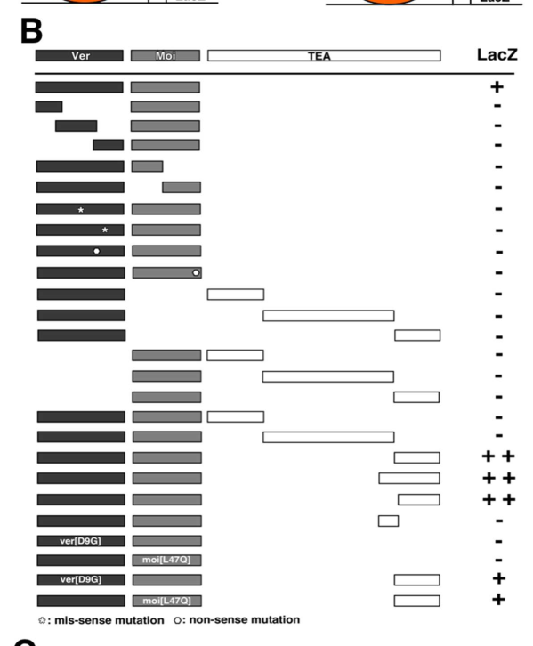

## Question

# Gene Research for Functional Annotation

## ⚠️ CRITICAL: Gene/Protein Identification Context

**BEFORE YOU BEGIN RESEARCH:** You MUST verify you are researching the CORRECT gene/protein. Gene symbols can be ambiguous, especially for less well-characterized genes from non-model organisms.

### Target Gene/Protein Identity (from UniProt):
- **UniProt Accession:** B7Z0L8
- **Protein Description:** RecName: Full=Protein modigliani {ECO:0000303|PubMed:19181850};
- **Gene Information:** Name=moi {ECO:0000312|FlyBase:FBgn0261019}; Synonyms=DTL {ECO:0000303|PubMed:19240120}, DTLu {ECO:0000303|PubMed:15684427}; ORFNames=CG31241 {ECO:0000303|PubMed:15684427}, CG42350 {ECO:0000312|FlyBase:FBgn0261019};
- **Organism (full):** Drosophila melanogaster (Fruit fly).
- **Protein Family:** Not specified in UniProt
- **Key Domains:** Modigliani. (IPR062604); Modigliani (PF29856)

### MANDATORY VERIFICATION STEPS:

1. **Check if the gene symbol "moi" matches the protein description above**
2. **Verify the organism is correct:** Drosophila melanogaster (Fruit fly).
3. **Check if protein family/domains align with what you find in literature**
4. **If you find literature for a DIFFERENT gene with the same or similar symbol, STOP**

### If Gene Symbol is Ambiguous or You Cannot Find Relevant Literature:

**DO NOT PROCEED WITH RESEARCH ON A DIFFERENT GENE.** Instead:
- State clearly: "The gene symbol 'moi' is ambiguous or literature is limited for this specific protein"
- Explain what you found (e.g., "Found extensive literature on a different gene with the same symbol in a different organism")
- Describe the protein based ONLY on the UniProt information provided above
- Suggest that the protein function can be inferred from domain/family information

### Research Target:

Please provide a comprehensive research report on the gene **moi** (gene ID: moi, UniProt: B7Z0L8) in DROME.

The research report should be a detailed narrative explaining the function, biological processes, and localization of the gene product. Citations should be given for all claims.

You should prioritize authoritative reviews and primary scientific literature when conducting research. You can supplement
this with annotations you find in gene/protein databases, but these can be outdated or inaccurate.

We are specifically interested in the primary function of the gene - for enzymes, what reaction is catalyzed, and what is the substrate specificity? For transporters, what is the substrate? For structural proteins or adapters, what is the broader structural role? For signaling molecules, what is the role in the pathway.

We are interested in where in or outside the cell the gene product carries out its function.

We are also interested in the signaling or biochemical pathways in which the gene functions. We are less interested in broad pleiotropic effects, except where these elucidate the precise role.

Include evidence where possible. We are interested in both experimental evidence as well as inference from structure, evolution, or bioinformatic analysis. Precise studies should be prioritized over high-throughput, where available.

## Output

Question: You are an expert researcher providing comprehensive, well-cited information.

Provide detailed information focusing on:
1. Key concepts and definitions with current understanding
2. Recent developments and latest research (prioritize 2023-2024 sources)
3. Current applications and real-world implementations
4. Expert opinions and analysis from authoritative sources
5. Relevant statistics and data from recent studies

Format as a comprehensive research report with proper citations. Include URLs and publication dates where available.
Always prioritize recent, authoritative sources and provide specific citations for all major claims.

# Gene Research for Functional Annotation

## ⚠️ CRITICAL: Gene/Protein Identification Context

**BEFORE YOU BEGIN RESEARCH:** You MUST verify you are researching the CORRECT gene/protein. Gene symbols can be ambiguous, especially for less well-characterized genes from non-model organisms.

### Target Gene/Protein Identity (from UniProt):
- **UniProt Accession:** B7Z0L8
- **Protein Description:** RecName: Full=Protein modigliani {ECO:0000303|PubMed:19181850};
- **Gene Information:** Name=moi {ECO:0000312|FlyBase:FBgn0261019}; Synonyms=DTL {ECO:0000303|PubMed:19240120}, DTLu {ECO:0000303|PubMed:15684427}; ORFNames=CG31241 {ECO:0000303|PubMed:15684427}, CG42350 {ECO:0000312|FlyBase:FBgn0261019};
- **Organism (full):** Drosophila melanogaster (Fruit fly).
- **Protein Family:** Not specified in UniProt
- **Key Domains:** Modigliani. (IPR062604); Modigliani (PF29856)

### MANDATORY VERIFICATION STEPS:

1. **Check if the gene symbol "moi" matches the protein description above**
2. **Verify the organism is correct:** Drosophila melanogaster (Fruit fly).
3. **Check if protein family/domains align with what you find in literature**
4. **If you find literature for a DIFFERENT gene with the same or similar symbol, STOP**

### If Gene Symbol is Ambiguous or You Cannot Find Relevant Literature:

**DO NOT PROCEED WITH RESEARCH ON A DIFFERENT GENE.** Instead:
- State clearly: "The gene symbol 'moi' is ambiguous or literature is limited for this specific protein"
- Explain what you found (e.g., "Found extensive literature on a different gene with the same symbol in a different organism")
- Describe the protein based ONLY on the UniProt information provided above
- Suggest that the protein function can be inferred from domain/family information

### Research Target:

Please provide a comprehensive research report on the gene **moi** (gene ID: moi, UniProt: B7Z0L8) in DROME.

The research report should be a detailed narrative explaining the function, biological processes, and localization of the gene product. Citations should be given for all claims.

You should prioritize authoritative reviews and primary scientific literature when conducting research. You can supplement
this with annotations you find in gene/protein databases, but these can be outdated or inaccurate.

We are specifically interested in the primary function of the gene - for enzymes, what reaction is catalyzed, and what is the substrate specificity? For transporters, what is the substrate? For structural proteins or adapters, what is the broader structural role? For signaling molecules, what is the role in the pathway.

We are interested in where in or outside the cell the gene product carries out its function.

We are also interested in the signaling or biochemical pathways in which the gene functions. We are less interested in broad pleiotropic effects, except where these elucidate the precise role.

Include evidence where possible. We are interested in both experimental evidence as well as inference from structure, evolution, or bioinformatic analysis. Precise studies should be prioritized over high-throughput, where available.

# Functional annotation report: *Drosophila melanogaster* **moi** (Modigliani; UniProt B7Z0L8)

## Identity and principal function

The specified target is *D. melanogaster* **moi**, encoding the approximately 178-amino-acid, 20-kDa protein Modigliani. Its established primary function is **chromosome-end protection**: Moi is a nuclear, telomere-associated protein-interaction subunit needed to assemble a protective cap and prevent chromosome ends from undergoing inappropriate DNA-damage responses and end-to-end fusion. It is not an enzyme with a demonstrated catalytic reaction or a transporter. (raffa2009thedrosophilamodigliani pages 1-2, raffa2009thedrosophilamodigliani pages 2-2, cicconi2017thedrosophilatelomerecapping pages 11-12)

**A critical identity distinction:** the historical CG31241 locus produces two separate proteins from a shared transcript. Its first open reading frame encodes Moi; its overlapping second open reading frame encodes a 491-amino-acid Tat-like protein, DTL, associated with RNA-methyltransferase homology. Expression and complementation experiments separated the products and showed that **Moi/ORF1**, not DTL/ORF2, supplies telomere protection. Thus, RNA-methyltransferase activity must not be assigned to B7Z0L8 because of the older *DTL* naming overlap. The supplied Modigliani-domain annotation is compatible with this identity but does not establish an enzymatic activity. (raffa2009thedrosophilamodigliani pages 2-2, raffa2009thedrosophilamodigliani pages 2-4)

The following table distinguishes observations made on Moi from properties measured on its protein partners or their complexes. (raffa2009thedrosophilamodigliani pages 2-2, zhang2016mtvanssdna pages 6-8, cicconi2017thedrosophilatelomerecapping pages 10-11)

| Evidence question | Direct observation | Functional interpretation / limitation | Primary study DOI / date |
|---|---|---|---|
| **Identity: which product is Moi?** | The *D. melanogaster* bicistronic locus produces separate proteins: ORF1 encodes **178-aa, ~20-kDa Moi**, whereas overlapping ORF2 encodes a **491-aa, ~60-kDa DTL/Tat-like RNA methyltransferase**; no ORF1–ORF2 fusion protein was detected. ORF1 alone rescued the telomere phenotype. (raffa2009thedrosophilamodigliani pages 2-2, raffa2009thedrosophilamodigliani pages 2-4) | B7Z0L8/Moi is the small telomere protein, **not the methyltransferase**. Consequently, methyltransferase activity assigned to DTL/ORF2 must not be transferred to Moi. | [10.1073/pnas.0812702106](https://doi.org/10.1073/pnas.0812702106), 17 Feb 2009 |
| **Loss and rescue: is Moi required for chromosome-end protection?** | *moi1* mutant metaphases averaged **5.6 telomere associations per cell**, with double associations about fourfold more frequent than single associations. Transgenes containing wild-type ORF1 reduced this to **0.02–0.04 per cell**; at least 100 cells from at least three brains were scored per mutant genotype. (raffa2009thedrosophilamodigliani pages 2-2) | Strong loss-of-function and gene-specific rescue evidence establishes Moi as essential for preventing telomere–telomere fusion. This is a structural capping phenotype, not evidence of catalysis. | [10.1073/pnas.0812702106](https://doi.org/10.1073/pnas.0812702106), 17 Feb 2009 |
| **Localization: where does Moi act?** | Functional GFP–Moi produced **six discrete foci** in unfixed salivary-gland polytene nuclei; immunostaining placed the signals exclusively at chromosome ends and showed precise colocalization with HOAP. (raffa2009thedrosophilamodigliani pages 2-4) | Moi carries out its demonstrated function in the **nucleus at telomeres**. Failure to visualize GFP–Moi at mitotic ends was attributed to low abundance and does not outweigh polytene localization and genetic evidence. | [10.1073/pnas.0812702106](https://doi.org/10.1073/pnas.0812702106), 17 Feb 2009 |
| **Molecular binding and complex assembly** | Purified His–Moi was captured by GST–HOAP and GST–HP1 but not GST alone, supporting direct interactions. Moi and Ver interacted in yeast two-hybrid assays; Moi–Ver plus the Tea C terminus formed a tripartite interaction. Moi **G45R** strongly disrupted interaction and caused severe fusion/larval lethality, whereas **L47Q** interaction was partly restored by Tea and produced a milder fusion/pupal-lethal phenotype. (raffa2009thedrosophilamodigliani pages 4-5, zhang2016mtvanssdna pages 6-8, zhang2016mtvanssdna media 45dffc8d) | Moi is best annotated as a **protein-interaction/assembly subunit** linking telomeric factors, including the HOAP-associated cap and Moi–Tea–Ver module. The interaction network is supported by multiple assays, although a single purified, invariant “terminin” holocomplex has not been fully structurally resolved. | [10.1073/pnas.0812702106](https://doi.org/10.1073/pnas.0812702106), 17 Feb 2009; [10.1371/journal.pgen.1006435](https://doi.org/10.1371/journal.pgen.1006435), 11 Nov 2016 |
| **DNA biochemistry: does Moi bind or modify DNA?** | EMSA detected **no ssDNA–Moi complex** at 100 or 400 nM GST–Moi, and Moi did not alter Ver binding to ssDNA. By contrast, purified trimeric Moi–Tea–Ver bound sequence-independent ssDNA as short as 10 nt and protected it from ExoI; the Moi–Ver subcomplex did not. Independent EMSA/AFM experiments directly assigned ssDNA binding to Ver. (zhang2016mtvanssdna pages 6-8, zhang2016mtvanssdna pages 8-10, cicconi2017thedrosophilatelomerecapping pages 10-11, cicconi2017thedrosophilatelomerecapping pages 12-14) | Moi has **no demonstrated catalytic reaction or intrinsic ssDNA-binding activity**. ssDNA protection is a property of the complete MTV complex, with direct DNA contact demonstrated for Ver—not Moi. A natural *Drosophila* telomeric overhang remained inferential rather than directly demonstrated in these studies. | [10.1371/journal.pgen.1006435](https://doi.org/10.1371/journal.pgen.1006435), 11 Nov 2016; [10.1093/nar/gkw1244](https://doi.org/10.1093/nar/gkw1244), online 9 Dec 2016 / issue 2017 |
| **DNA-damage suppression** | In *moi* mutants, **48% of polytene telomeres** carried γ-H2AV (**n=170**); among positive ends, **53%** had strong γ-H2AV signals, compared with **6% of γ-H2AV-positive wild-type ends**. Strong γ-H2AV/HOAP signal frequencies were significantly higher in *moi* mutants (**P<0.001**, Mann–Whitney). (cicconi2017thedrosophilatelomerecapping pages 11-12, cicconi2017thedrosophilatelomerecapping pages 12-14) | Moi-dependent capping suppresses inappropriate DNA-damage signaling at chromosome termini. The marker establishes telomere deprotection but does not by itself identify which repair pathway produces the ensuing fusion. | [10.1093/nar/gkw1244](https://doi.org/10.1093/nar/gkw1244), online 9 Dec 2016 / issue 2017 |

*Table: Primary evidence distinguishing Moi/B7Z0L8 from the overlapping DTL methyltransferase and defining Moi as a telomeric protein-complex subunit. Quantitative genetic, localization, biochemical, and DNA-damage evidence is separated from mechanistic inference.*

## Experimental basis and site of action

The clearest causal experiment combines **loss of function with gene-specific rescue**. In larval-brain metaphases, the strong *moi¹* allele produced a mean **5.6 telomere associations per cell**, involving multiple chromosome ends; double associations were approximately four times as frequent as single associations. Constructs containing functional Moi/ORF1 reduced the frequency to **0.02–0.04 per cell**. These observations place Moi at the step that prevents chromosome termini from fusing, rather than merely associating it with a downstream developmental phenotype. The investigators assessed at least 100 cells from at least three brains per mutant genotype. (raffa2009thedrosophilamodigliani pages 2-2)

Moi acts **inside the nucleus, at chromosome telomeres**. A rescuing GFP–Moi fusion produced six discrete foci in salivary-gland polytene nuclei, and chromosome immunostaining showed that the foci coincide with the telomere protein HOAP at chromosome ends. Moi fluorescence was difficult to detect directly at mitotic ends; that technical limitation should not be interpreted as evidence for a different compartment or function. No extracellular role is established. (raffa2009thedrosophilamodigliani pages 2-4, raffa2011termininaprotein pages 3-5)

## Molecular role in the telomere-protection pathway

Unlike most telomerase-dependent systems, *Drosophila* extends chromosome ends through specialized retrotransposons, including HeT-A, TART and TAHRE. Its protective cap can assemble without a particular terminal DNA sequence. **End extension and end protection are distinct processes**: the evidence establishes Moi as a capping factor, not as an enzyme that adds telomeric DNA or catalyzes retrotransposition. Telomere specialists use **terminin** for the fly-specific protective protein network, commonly encompassing HOAP, HipHop, Moi and Verrocchio; subsequent work identified Tea and a biochemically tractable **Moi–Tea–Ver (MTV)** module. Its protective role is *functionally analogous*, not demonstrably sequence-homologous, to aspects of mammalian shelterin and overhang-protecting systems. (zhang2016mtvanssdna pages 1-2, raffa2011termininaprotein pages 3-5, raffa2013organizationandevolution pages 2-3)

Moi has a particularly well-supported **assembly/adaptor role**. Purified-protein pulldowns showed that Moi associates directly with both **HOAP** and heterochromatin protein **HP1**. HOAP is required for Moi accumulation at telomeres, whereas *moi* loss leaves substantial HOAP at chromosome ends: HOAP staining was observed at **91%** of control telomeres and **86%** of unfused *moi¹* telomeres. HP1 and Woc also remained detectable at mutant polytene telomeres. Thus, Moi is not simply required to place these upstream factors at chromosome ends; it contributes a subsequent protective function. Mre11 is also needed for Moi localization, plausibly through its established contribution to HOAP recruitment rather than a demonstrated direct Moi–Mre11 interaction. (raffa2009thedrosophilamodigliani pages 4-5)

On the other side of the assembly network, Moi physically associates with **Ver**, and tripartite interaction assays support its association with **Tea and Ver**. Tea can localize without Moi, whereas Moi and Ver depend on other telomeric capping components for their normal recruitment. Together, these findings support an approximate loading hierarchy of HOAP/HipHop-associated chromatin → Tea → Moi–Ver, although the complete architecture and every recruitment step are not fully resolved. Importantly, experiments that mutated Moi itself link interaction to function: **Moi G45R** impaired complex interaction and produced severe telomere-fusion/larval-lethal phenotypes; **Moi L47Q** had a milder phenotype, concordant with partial restoration of tripartite interaction by Tea. Figure 3 of the primary study shows this interaction–phenotype comparison. (zhang2016mtvanssdna pages 5-6, zhang2016mtvanssdna pages 6-8, zhang2016mtvanssdna pages 8-10, zhang2016mtvanssdna media 45dffc8d)

The substrate distinction matters. Purified **MTV** bound single-stranded DNA without apparent sequence specificity—including tested oligonucleotides as short as 10 nucleotides—and protected bound DNA from exonuclease I *in vitro*; the tested Moi–Ver subcomplex did not show equivalent binding under those conditions. Independent electrophoretic and atomic-force microscopy experiments demonstrated **Ver** binding to single-stranded DNA. In contrast, isolated **Moi did not bind the tested single-stranded substrate** in electrophoretic assays and did not measurably enhance Ver binding. Moi should therefore be annotated as a necessary **protein-complex component of telomeric DNA protection**, **not** as an independently demonstrated DNA-binding protein. The studies inferred that a single-stranded overhang exists at native fly telomeres, but did not directly establish its structure or assign its exact in-vivo DNA contacts to Moi. (zhang2016mtvanssdna pages 6-8, zhang2016mtvanssdna pages 8-10, cicconi2017thedrosophilatelomerecapping pages 10-11, cicconi2017thedrosophilatelomerecapping pages 12-14)

## Consequence for DNA-damage signaling

Moi-dependent capping helps prevent a natural chromosome end from being treated as damaged DNA. In *moi* mutants, phosphorylated histone H2AV, a fly DNA-damage marker, was detectable at **48% of examined polytene telomeres** (*n* = 170); **53% of marker-positive mutant telomeres** had a strong signal, versus **6% of marker-positive wild-type telomeres**. This is a change in **signal strength among positive ends**, not evidence that 53% of all mutant telomeres were strongly stained. Separately, Ver loss increased telomeric RPA70 recruitment, consistent with exposure of single-stranded DNA within the same protective pathway. The *moi* staining and fusion phenotypes establish deprotection, but do not alone specify precisely which DNA-repair reaction joins the ends. (cicconi2017thedrosophilatelomerecapping pages 11-12, cicconi2017thedrosophilatelomerecapping pages 12-14)

## Recent developments, applications and limits of inference

A **November 2024 bioRxiv preprint** used interspecies replacement of **HipHop**, not Moi, to investigate the evolution of this end-protection system. Introducing *D. yakuba* HipHop into *D. melanogaster* disrupted HOAP recruitment and increased telomere fusions; changing six residues in HipHop’s HOAP-interaction region, or supplying the matching interaction partner, rescued protection. This offers recent evidence that compatible assembly of telomeric protein partners is essential, **but it does not directly test Moi or establish adaptive changes in Moi**. The preprint should not displace the gene-specific genetic and biochemical studies above. (lin2024adaptiveproteincoevolution pages 1-4, lin2024adaptiveproteincoevolution pages 4-6, lin2024adaptiveproteincoevolution pages 9-11)

Moi’s demonstrated real-world use is as an **experimental model and perturbation target** for investigating telomere capping, protein-complex recruitment, sequence-independent chromosome-end recognition and genome instability in flies. The evidence reviewed here does not support describing B7Z0L8 as a clinical biomarker, approved therapeutic target, or human orthologue of a particular shelterin subunit. (raffa2009thedrosophilamodigliani pages 1-2, raffa2011termininaprotein pages 3-5, raffa2009thedrosophilamodigliani pages 2-2)

## Key sources and publication dates

- Raffa GD *et al.* **17 February 2009**. “The *Drosophila modigliani (moi)* gene encodes a HOAP-interacting protein required for telomere protection.” *PNAS* **106**, 2271–2276. https://doi.org/10.1073/pnas.0812702106. Original gene identification, rescue, localization and HOAP/HP1 interactions. (raffa2009thedrosophilamodigliani pages 1-2, raffa2009thedrosophilamodigliani pages 2-2, raffa2009thedrosophilamodigliani pages 4-5)
- Raffa GD *et al.* **2011**. “Terminin: A protein complex that mediates epigenetic maintenance of *Drosophila* telomeres.” *Nucleus* **2**, 383–391. https://doi.org/10.4161/nucl.2.5.17873. Expert synthesis of terminin and recruitment dependencies. (raffa2011termininaprotein pages 3-5)
- Raffa GD *et al.* **2013**. “Organization and Evolution of *Drosophila* Terminin.” *Frontiers in Oncology* **3**, article 112. https://doi.org/10.3389/fonc.2013.00112. Comparative interpretation of fly and human chromosome-end protection. (raffa2013organizationandevolution pages 2-3)
- Zhang Y *et al.* **11 November 2016**. “MTV, an ssDNA Protecting Complex Essential for Transposon-Based Telomere Maintenance in *Drosophila*.” *PLOS Genetics* **12**, e1006435. https://doi.org/10.1371/journal.pgen.1006435. Moi–Tea–Ver interactions, engineered *moi* variants and biochemical ssDNA protection. (zhang2016mtvanssdna pages 1-2, zhang2016mtvanssdna pages 6-8, zhang2016mtvanssdna pages 8-10, zhang2016mtvanssdna media 45dffc8d)
- Cicconi A *et al.* **online 9 December 2016; 2017 journal issue**. “The *Drosophila* telomere-capping protein Verrocchio binds single-stranded DNA and protects telomeres from DNA damage response.” *Nucleic Acids Research* **45**, 3068–3085. https://doi.org/10.1093/nar/gkw1244. Direct distinction between Ver and Moi DNA binding, and mutant telomeric damage markers. (cicconi2017thedrosophilatelomerecapping pages 1-2, cicconi2017thedrosophilatelomerecapping pages 10-11, cicconi2017thedrosophilatelomerecapping pages 11-12)
- Lin S-Y *et al.* **November 2024, preprint**. “Adaptive protein coevolution preserves telomere integrity.” *bioRxiv*. https://doi.org/10.1101/2024.11.11.623029. Recent partner-evolution context; experiments concern HipHop and HOAP, not Moi directly. (lin2024adaptiveproteincoevolution pages 1-4, lin2024adaptiveproteincoevolution pages 4-6)

References

1. (raffa2009thedrosophilamodigliani pages 1-2): Grazia D. Raffa, Giorgia Siriaco, Simona Cugusi, Laura Ciapponi, Giovanni Cenci, Edward Wojcik, and Maurizio Gatti. The drosophila modigliani (moi) gene encodes a hoap-interacting protein required for telomere protection. Proceedings of the National Academy of Sciences, 106:2271-2276, Feb 2009. URL: https://doi.org/10.1073/pnas.0812702106, doi:10.1073/pnas.0812702106. This article has 91 citations and is from a highest quality peer-reviewed journal.

2. (raffa2009thedrosophilamodigliani pages 2-2): Grazia D. Raffa, Giorgia Siriaco, Simona Cugusi, Laura Ciapponi, Giovanni Cenci, Edward Wojcik, and Maurizio Gatti. The drosophila modigliani (moi) gene encodes a hoap-interacting protein required for telomere protection. Proceedings of the National Academy of Sciences, 106:2271-2276, Feb 2009. URL: https://doi.org/10.1073/pnas.0812702106, doi:10.1073/pnas.0812702106. This article has 91 citations and is from a highest quality peer-reviewed journal.

3. (cicconi2017thedrosophilatelomerecapping pages 11-12): Alessandro Cicconi, Emanuela Micheli, Fiammetta Vernì, Alison Jackson, Ana Citlali Gradilla, Francesca Cipressa, Domenico Raimondo, Giuseppe Bosso, James G. Wakefield, Laura Ciapponi, Giovanni Cenci, Maurizio Gatti, Stefano Cacchione, and Grazia Daniela Raffa. The drosophila telomere-capping protein verrocchio binds single-stranded dna and protects telomeres from dna damage response. Nucleic Acids Research, 45:3068-3085, Dec 2017. URL: https://doi.org/10.1093/nar/gkw1244, doi:10.1093/nar/gkw1244. This article has 31 citations and is from a highest quality peer-reviewed journal.

4. (raffa2009thedrosophilamodigliani pages 2-4): Grazia D. Raffa, Giorgia Siriaco, Simona Cugusi, Laura Ciapponi, Giovanni Cenci, Edward Wojcik, and Maurizio Gatti. The drosophila modigliani (moi) gene encodes a hoap-interacting protein required for telomere protection. Proceedings of the National Academy of Sciences, 106:2271-2276, Feb 2009. URL: https://doi.org/10.1073/pnas.0812702106, doi:10.1073/pnas.0812702106. This article has 91 citations and is from a highest quality peer-reviewed journal.

5. (zhang2016mtvanssdna pages 6-8): Yi Zhang, Liang Zhang, Xiaona Tang, Shilpa R. Bhardwaj, Jingyun Ji, and Yikang S. Rong. Mtv, an ssdna protecting complex essential for transposon-based telomere maintenance in drosophila. PLOS Genetics, 12:e1006435, Nov 2016. URL: https://doi.org/10.1371/journal.pgen.1006435, doi:10.1371/journal.pgen.1006435. This article has 39 citations and is from a domain leading peer-reviewed journal.

6. (cicconi2017thedrosophilatelomerecapping pages 10-11): Alessandro Cicconi, Emanuela Micheli, Fiammetta Vernì, Alison Jackson, Ana Citlali Gradilla, Francesca Cipressa, Domenico Raimondo, Giuseppe Bosso, James G. Wakefield, Laura Ciapponi, Giovanni Cenci, Maurizio Gatti, Stefano Cacchione, and Grazia Daniela Raffa. The drosophila telomere-capping protein verrocchio binds single-stranded dna and protects telomeres from dna damage response. Nucleic Acids Research, 45:3068-3085, Dec 2017. URL: https://doi.org/10.1093/nar/gkw1244, doi:10.1093/nar/gkw1244. This article has 31 citations and is from a highest quality peer-reviewed journal.

7. (raffa2009thedrosophilamodigliani pages 4-5): Grazia D. Raffa, Giorgia Siriaco, Simona Cugusi, Laura Ciapponi, Giovanni Cenci, Edward Wojcik, and Maurizio Gatti. The drosophila modigliani (moi) gene encodes a hoap-interacting protein required for telomere protection. Proceedings of the National Academy of Sciences, 106:2271-2276, Feb 2009. URL: https://doi.org/10.1073/pnas.0812702106, doi:10.1073/pnas.0812702106. This article has 91 citations and is from a highest quality peer-reviewed journal.

8. (zhang2016mtvanssdna media 45dffc8d): Yi Zhang, Liang Zhang, Xiaona Tang, Shilpa R. Bhardwaj, Jingyun Ji, and Yikang S. Rong. Mtv, an ssdna protecting complex essential for transposon-based telomere maintenance in drosophila. PLOS Genetics, 12:e1006435, Nov 2016. URL: https://doi.org/10.1371/journal.pgen.1006435, doi:10.1371/journal.pgen.1006435. This article has 39 citations and is from a domain leading peer-reviewed journal.

9. (zhang2016mtvanssdna pages 8-10): Yi Zhang, Liang Zhang, Xiaona Tang, Shilpa R. Bhardwaj, Jingyun Ji, and Yikang S. Rong. Mtv, an ssdna protecting complex essential for transposon-based telomere maintenance in drosophila. PLOS Genetics, 12:e1006435, Nov 2016. URL: https://doi.org/10.1371/journal.pgen.1006435, doi:10.1371/journal.pgen.1006435. This article has 39 citations and is from a domain leading peer-reviewed journal.

10. (cicconi2017thedrosophilatelomerecapping pages 12-14): Alessandro Cicconi, Emanuela Micheli, Fiammetta Vernì, Alison Jackson, Ana Citlali Gradilla, Francesca Cipressa, Domenico Raimondo, Giuseppe Bosso, James G. Wakefield, Laura Ciapponi, Giovanni Cenci, Maurizio Gatti, Stefano Cacchione, and Grazia Daniela Raffa. The drosophila telomere-capping protein verrocchio binds single-stranded dna and protects telomeres from dna damage response. Nucleic Acids Research, 45:3068-3085, Dec 2017. URL: https://doi.org/10.1093/nar/gkw1244, doi:10.1093/nar/gkw1244. This article has 31 citations and is from a highest quality peer-reviewed journal.

11. (raffa2011termininaprotein pages 3-5): Grazia D. Raffa, Laura Ciapponi, Giovanni Cenci, and Maurizio Gatti. Terminin: a protein complex that mediates epigenetic maintenance of drosophila telomeres. Nucleus, 2:383-391, Sep 2011. URL: https://doi.org/10.4161/nucl.2.5.17873, doi:10.4161/nucl.2.5.17873. This article has 107 citations and is from a peer-reviewed journal.

12. (zhang2016mtvanssdna pages 1-2): Yi Zhang, Liang Zhang, Xiaona Tang, Shilpa R. Bhardwaj, Jingyun Ji, and Yikang S. Rong. Mtv, an ssdna protecting complex essential for transposon-based telomere maintenance in drosophila. PLOS Genetics, 12:e1006435, Nov 2016. URL: https://doi.org/10.1371/journal.pgen.1006435, doi:10.1371/journal.pgen.1006435. This article has 39 citations and is from a domain leading peer-reviewed journal.

13. (raffa2013organizationandevolution pages 2-3): Grazia D. Raffa, Giovanni Cenci, Laura Ciapponi, and Maurizio Gatti. Organization and evolution of drosophila terminin: similarities and differences between drosophila and human telomeres. Frontiers in Oncology, May 2013. URL: https://doi.org/10.3389/fonc.2013.00112, doi:10.3389/fonc.2013.00112. This article has 37 citations.

14. (zhang2016mtvanssdna pages 5-6): Yi Zhang, Liang Zhang, Xiaona Tang, Shilpa R. Bhardwaj, Jingyun Ji, and Yikang S. Rong. Mtv, an ssdna protecting complex essential for transposon-based telomere maintenance in drosophila. PLOS Genetics, 12:e1006435, Nov 2016. URL: https://doi.org/10.1371/journal.pgen.1006435, doi:10.1371/journal.pgen.1006435. This article has 39 citations and is from a domain leading peer-reviewed journal.

15. (lin2024adaptiveproteincoevolution pages 1-4): Sung-Ya Lin, Hannah Futeran, and Mia T. Levine. Adaptive protein coevolution preserves telomere integrity. bioRxiv, Nov 2024. URL: https://doi.org/10.1101/2024.11.11.623029, doi:10.1101/2024.11.11.623029. This article has 1 citations.

16. (lin2024adaptiveproteincoevolution pages 4-6): Sung-Ya Lin, Hannah Futeran, and Mia T. Levine. Adaptive protein coevolution preserves telomere integrity. bioRxiv, Nov 2024. URL: https://doi.org/10.1101/2024.11.11.623029, doi:10.1101/2024.11.11.623029. This article has 1 citations.

17. (lin2024adaptiveproteincoevolution pages 9-11): Sung-Ya Lin, Hannah Futeran, and Mia T. Levine. Adaptive protein coevolution preserves telomere integrity. bioRxiv, Nov 2024. URL: https://doi.org/10.1101/2024.11.11.623029, doi:10.1101/2024.11.11.623029. This article has 1 citations.

18. (cicconi2017thedrosophilatelomerecapping pages 1-2): Alessandro Cicconi, Emanuela Micheli, Fiammetta Vernì, Alison Jackson, Ana Citlali Gradilla, Francesca Cipressa, Domenico Raimondo, Giuseppe Bosso, James G. Wakefield, Laura Ciapponi, Giovanni Cenci, Maurizio Gatti, Stefano Cacchione, and Grazia Daniela Raffa. The drosophila telomere-capping protein verrocchio binds single-stranded dna and protects telomeres from dna damage response. Nucleic Acids Research, 45:3068-3085, Dec 2017. URL: https://doi.org/10.1093/nar/gkw1244, doi:10.1093/nar/gkw1244. This article has 31 citations and is from a highest quality peer-reviewed journal.

## Artifacts

- [Edison artifact artifact-00](moi-deep-research-falcon_artifacts/artifact-00.md)

## Citations

1. raffa2009thedrosophilamodigliani pages 2-2
2. raffa2009thedrosophilamodigliani pages 2-4
3. raffa2009thedrosophilamodigliani pages 4-5
4. raffa2011termininaprotein pages 3-5
5. raffa2013organizationandevolution pages 2-3
6. raffa2009thedrosophilamodigliani pages 1-2
7. cicconi2017thedrosophilatelomerecapping pages 11-12
8. zhang2016mtvanssdna pages 6-8
9. cicconi2017thedrosophilatelomerecapping pages 10-11
10. zhang2016mtvanssdna pages 8-10
11. cicconi2017thedrosophilatelomerecapping pages 12-14
12. zhang2016mtvanssdna pages 1-2
13. zhang2016mtvanssdna pages 5-6
14. lin2024adaptiveproteincoevolution pages 1-4
15. lin2024adaptiveproteincoevolution pages 4-6
16. lin2024adaptiveproteincoevolution pages 9-11
17. cicconi2017thedrosophilatelomerecapping pages 1-2
18. 10.1073/pnas.0812702106
19. 10.1371/journal.pgen.1006435
20. 10.1093/nar/gkw1244
21. https://doi.org/10.1073/pnas.0812702106
22. https://doi.org/10.1371/journal.pgen.1006435
23. https://doi.org/10.1093/nar/gkw1244
24. https://doi.org/10.1073/pnas.0812702106.
25. https://doi.org/10.4161/nucl.2.5.17873.
26. https://doi.org/10.3389/fonc.2013.00112.
27. https://doi.org/10.1371/journal.pgen.1006435.
28. https://doi.org/10.1093/nar/gkw1244.
29. https://doi.org/10.1101/2024.11.11.623029.
30. https://doi.org/10.1073/pnas.0812702106,
31. https://doi.org/10.1093/nar/gkw1244,
32. https://doi.org/10.1371/journal.pgen.1006435,
33. https://doi.org/10.4161/nucl.2.5.17873,
34. https://doi.org/10.3389/fonc.2013.00112,
35. https://doi.org/10.1101/2024.11.11.623029,