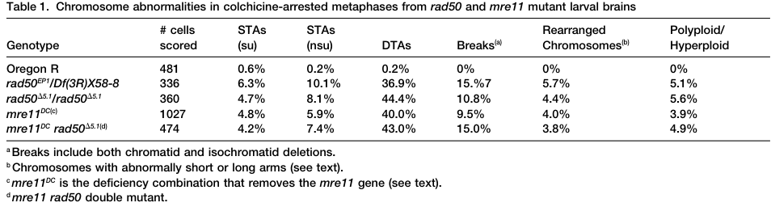

## Question

# Gene Research for Functional Annotation

## ⚠️ CRITICAL: Gene/Protein Identification Context

**BEFORE YOU BEGIN RESEARCH:** You MUST verify you are researching the CORRECT gene/protein. Gene symbols can be ambiguous, especially for less well-characterized genes from non-model organisms.

### Target Gene/Protein Identity (from UniProt):
- **UniProt Accession:** Q9XYZ4
- **Protein Description:** RecName: Full=Double-strand break repair protein {ECO:0000256|PIRNR:PIRNR000882};
- **Gene Information:** Name=mre11 {ECO:0000313|EMBL:AAF53093.1, ECO:0000313|FlyBase:FBgn0020270}; Synonyms=16928 {ECO:0000313|EMBL:AAF53093.1}, Dmel\CG16928 {ECO:0000313|EMBL:AAF53093.1}, dMre11 {ECO:0000313|EMBL:AAF53093.1}, MRE11 {ECO:0000313|EMBL:AAF53093.1}, Mre11 {ECO:0000313|EMBL:AAF53093.1}; ORFNames=CG16928 {ECO:0000313|EMBL:AAF53093.1, ECO:0000313|FlyBase:FBgn0020270}, Dmel_CG16928 {ECO:0000313|EMBL:AAF53093.1};
- **Organism (full):** Drosophila melanogaster (Fruit fly).
- **Protein Family:** Belongs to the MRE11/RAD32 family.
- **Key Domains:** Calcineurin-like_PHP. (IPR004843); Metallo-depent_PP-like. (IPR029052); Mre11. (IPR003701); Mre11_capping_dom. (IPR038487); Mre11_DNA-bd. (IPR007281)

### MANDATORY VERIFICATION STEPS:

1. **Check if the gene symbol "mre11" matches the protein description above**
2. **Verify the organism is correct:** Drosophila melanogaster (Fruit fly).
3. **Check if protein family/domains align with what you find in literature**
4. **If you find literature for a DIFFERENT gene with the same or similar symbol, STOP**

### If Gene Symbol is Ambiguous or You Cannot Find Relevant Literature:

**DO NOT PROCEED WITH RESEARCH ON A DIFFERENT GENE.** Instead:
- State clearly: "The gene symbol 'mre11' is ambiguous or literature is limited for this specific protein"
- Explain what you found (e.g., "Found extensive literature on a different gene with the same symbol in a different organism")
- Describe the protein based ONLY on the UniProt information provided above
- Suggest that the protein function can be inferred from domain/family information

### Research Target:

Please provide a comprehensive research report on the gene **mre11** (gene ID: mre11, UniProt: Q9XYZ4) in DROME.

The research report should be a detailed narrative explaining the function, biological processes, and localization of the gene product. Citations should be given for all claims.

You should prioritize authoritative reviews and primary scientific literature when conducting research. You can supplement
this with annotations you find in gene/protein databases, but these can be outdated or inaccurate.

We are specifically interested in the primary function of the gene - for enzymes, what reaction is catalyzed, and what is the substrate specificity? For transporters, what is the substrate? For structural proteins or adapters, what is the broader structural role? For signaling molecules, what is the role in the pathway.

We are interested in where in or outside the cell the gene product carries out its function.

We are also interested in the signaling or biochemical pathways in which the gene functions. We are less interested in broad pleiotropic effects, except where these elucidate the precise role.

Include evidence where possible. We are interested in both experimental evidence as well as inference from structure, evolution, or bioinformatic analysis. Precise studies should be prioritized over high-throughput, where available.

## Output

Question: You are an expert researcher providing comprehensive, well-cited information.

Provide detailed information focusing on:
1. Key concepts and definitions with current understanding
2. Recent developments and latest research (prioritize 2023-2024 sources)
3. Current applications and real-world implementations
4. Expert opinions and analysis from authoritative sources
5. Relevant statistics and data from recent studies

Format as a comprehensive research report with proper citations. Include URLs and publication dates where available.
Always prioritize recent, authoritative sources and provide specific citations for all major claims.

# Gene Research for Functional Annotation

## ⚠️ CRITICAL: Gene/Protein Identification Context

**BEFORE YOU BEGIN RESEARCH:** You MUST verify you are researching the CORRECT gene/protein. Gene symbols can be ambiguous, especially for less well-characterized genes from non-model organisms.

### Target Gene/Protein Identity (from UniProt):
- **UniProt Accession:** Q9XYZ4
- **Protein Description:** RecName: Full=Double-strand break repair protein {ECO:0000256|PIRNR:PIRNR000882};
- **Gene Information:** Name=mre11 {ECO:0000313|EMBL:AAF53093.1, ECO:0000313|FlyBase:FBgn0020270}; Synonyms=16928 {ECO:0000313|EMBL:AAF53093.1}, Dmel\CG16928 {ECO:0000313|EMBL:AAF53093.1}, dMre11 {ECO:0000313|EMBL:AAF53093.1}, MRE11 {ECO:0000313|EMBL:AAF53093.1}, Mre11 {ECO:0000313|EMBL:AAF53093.1}; ORFNames=CG16928 {ECO:0000313|EMBL:AAF53093.1, ECO:0000313|FlyBase:FBgn0020270}, Dmel_CG16928 {ECO:0000313|EMBL:AAF53093.1};
- **Organism (full):** Drosophila melanogaster (Fruit fly).
- **Protein Family:** Belongs to the MRE11/RAD32 family.
- **Key Domains:** Calcineurin-like_PHP. (IPR004843); Metallo-depent_PP-like. (IPR029052); Mre11. (IPR003701); Mre11_capping_dom. (IPR038487); Mre11_DNA-bd. (IPR007281)

### MANDATORY VERIFICATION STEPS:

1. **Check if the gene symbol "mre11" matches the protein description above**
2. **Verify the organism is correct:** Drosophila melanogaster (Fruit fly).
3. **Check if protein family/domains align with what you find in literature**
4. **If you find literature for a DIFFERENT gene with the same or similar symbol, STOP**

### If Gene Symbol is Ambiguous or You Cannot Find Relevant Literature:

**DO NOT PROCEED WITH RESEARCH ON A DIFFERENT GENE.** Instead:
- State clearly: "The gene symbol 'mre11' is ambiguous or literature is limited for this specific protein"
- Explain what you found (e.g., "Found extensive literature on a different gene with the same symbol in a different organism")
- Describe the protein based ONLY on the UniProt information provided above
- Suggest that the protein function can be inferred from domain/family information

### Research Target:

Please provide a comprehensive research report on the gene **mre11** (gene ID: mre11, UniProt: Q9XYZ4) in DROME.

The research report should be a detailed narrative explaining the function, biological processes, and localization of the gene product. Citations should be given for all claims.

You should prioritize authoritative reviews and primary scientific literature when conducting research. You can supplement
this with annotations you find in gene/protein databases, but these can be outdated or inaccurate.

We are specifically interested in the primary function of the gene - for enzymes, what reaction is catalyzed, and what is the substrate specificity? For transporters, what is the substrate? For structural proteins or adapters, what is the broader structural role? For signaling molecules, what is the role in the pathway.

We are interested in where in or outside the cell the gene product carries out its function.

We are also interested in the signaling or biochemical pathways in which the gene functions. We are less interested in broad pleiotropic effects, except where these elucidate the precise role.

Include evidence where possible. We are interested in both experimental evidence as well as inference from structure, evolution, or bioinformatic analysis. Precise studies should be prioritized over high-throughput, where available.

# Functional annotation report: *Drosophila melanogaster mre11*

**Identity and scope.** The supplied UniProt record identifies Q9XYZ4 as fruit-fly Mre11, encoded by *mre11* (CG16928; FlyBase FBgn0020270), a member of the MRE11/RAD32 family with a metallo-dependent phosphoesterase region, an Mre11 capping domain, and a DNA-binding region. Primary studies explicitly investigate *Drosophila* Mre11 as a component of the Mre11–Rad50–Nbs (MRN) complex, consistent with that identification. The retrieved articles do **not** independently print the Q9XYZ4-to-CG16928 accession mapping; that mapping and the precise domain identifiers remain attributable to the UniProt information supplied in the question, rather than to a separately verified database lookup. No findings from a different gene or organism are treated below as direct evidence about the fly protein. (ciapponi2004thedrosophilamre11rad50 pages 1-2, gao2009mre11rad50nbscomplexis pages 1-1)

## Primary molecular function and substrates

**Mre11 is the DNA-processing and DNA-end-recognition subunit of MRN**, rather than a transporter or a telomere-specific structural cap. Its predicted catalytic reaction is hydrolysis of DNA phosphodiester bonds. Biochemical work on homologs establishes two relevant activities: endonucleolytic incision of a DNA strand near a double-strand-break (DSB) end—particularly a hairpin-structured or protein-blocked end—and **3′→5′ exonucleolytic** processing back toward that end. The incision and subsequent processing help remove terminal obstacles; EXO1 or DNA2 can then extend degradation of the **5′-terminated strand away from the break**, leaving the 3′ single-stranded tail used in homology-directed repair. Mre11’s local 3′→5′ exonuclease polarity should therefore not be confused with the net 5′→3′ polarity of cellular end resection. RAD50-dependent ATP conformational changes regulate access to Mre11’s active site, and the CtIP/Sae2 family promotes the initiating incision. These substrate-specific biochemical conclusions derive principally from yeast, mammalian, and other homologous systems: **a purified-Q9XYZ4 fly substrate-specificity assay was not identified** in the retrieved literature. The supplied metallo-phosphoesterase and Mre11 domain assignments support—but do not themselves experimentally prove—the corresponding catalytic annotation in flies. (colombo2024functionalandmolecular pages 1-2, ceccaldi2025mechanismsandregulation pages 3-5, syed2018themre11rad50nbs1complex pages 7-9, jeff2017dnarepairin pages 7-8)

The fly **mre11^158S** allele changes an evolutionarily conserved catalytic-region histidine, H230, to tyrosine; the equivalent residue is important for nuclease activity in yeast and human MRE11. It must **not** be interpreted as a clean in-vivo demonstration that loss of fly nuclease activity causes telomere uncapping. In the 2009 fly study, mutant Mre11 still associated efficiently with Rad50, whereas maternal Nbs was depleted and the Mre11–Rad50 subcomplex failed to associate with embryonic chromatin. The investigators attributed the prominent embryonic phenotype to this loss of functional chromatin-associated MRN, not to a demonstrated loss of fly Mre11 catalysis. (gao2009mre11rad50nbscomplexis pages 1-1, gao2009mre11rad50nbscomplexis pages 3-4)

## Biological processes: direct evidence in flies

**Chromosome-break protection and DSB response.** Independently generated *mre11* loss-of-function backgrounds produced chromosome breaks, telomere associations and developmental lethality; rescue of the cytological phenotypes with *mre11*-containing constructs strengthened gene assignment in the deficiency study, although its organismal lethality was not rescued because the deficiency affected other loci. In larval-brain metaphases, 40.0% of *mre11*^DC^ cells had double telomeric associations and 9.5% had chromosome breaks, compared with 0.2% and 0%, respectively, in wild type. *mre11 rad50* double mutants resembled the single mutants, supporting action in a shared complex rather than two independent chromosome-protection pathways. After X-irradiation, mutant cells were at least an order of magnitude more sensitive than controls to induced chromosomal breaks. These are strong functional evidence for genome maintenance, although chromosome-break counts alone do not specify which individual DNA-cleavage step failed. (ciapponi2004thedrosophilamre11rad50 pages 1-2, ciapponi2004thedrosophilamre11rad50 pages 3-4, ciapponi2004thedrosophilamre11rad50 media f7ed2f40, ciapponi2004thedrosophilamre11rad50 pages 4-5)

**Telomere capping is a particularly well-established fly role.** Unlike canonical telomerase-based telomeres, fly chromosome ends can be maintained by specialized retrotransposons and protected independently of a particular terminal DNA sequence. HOAP, HipHop, Moi and Ver comprise the fly telomere-specific terminin machinery; Mre11–Rad50–Nbs belongs instead to the conserved, broadly acting factors needed to establish or maintain protection. In *mre11*^DC^ larval brains, detectable HOAP was present at only **5.5% of unfused telomeres**, compared with **80.5%** in controls; telomeric HP1 accumulation was also lost on examined mutant polytene chromosomes. The simplest supported annotation is that MRN **facilitates accumulation of capping factors at chromosome ends**, thereby preventing their inappropriate joining. Direct biochemical binding of fly Mre11 to HOAP, or a uniquely telomere-localized Mre11 pool, has not been established by these observations. (oikemus2006epigenetictelomereprotection pages 1-2, raffa2013organizationandevolution pages 1-2, ciapponi2004thedrosophilamre11rad50 pages 4-5)

**Maternal requirement in early embryos.** Adults homozygous for hypomorphic *mre11*^158S^ can survive with relatively mild postembryonic telomere dysfunction—about **0.2 telomere associations per nucleus** (*n*=118), versus **0.04** in controls—but mutant mothers produce embryos that fail early nuclear divisions. Telomere associations occurred in **95.3%** of scored *mre11*^158S^ embryonic nuclei (*n*=257); live imaging found chromosome bridges in **38%** of anaphases and telophases. Sequencing of amplified junctions identified head-to-head HeT-A arrangements consistent with **covalent telomere fusions**, rather than mere microscopic proximity of chromosome ends. These experiments connect MRN-dependent capping to chromosome segregation in a real developmental setting. The study reported delayed repair of some meiotic breaks but normal meiotic progression in these mutant females; it did not establish that defective meiosis caused the subsequent embryonic catastrophe. (gao2009mre11rad50nbscomplexis pages 1-1, gao2009mre11rad50nbscomplexis pages 1-3, gao2009mre11rad50nbscomplexis pages 5-6)

The principal direct observations and their evidential limits are summarized here; the cited cropped chromosome-abnormality table provides visual support for the larval-brain comparisons. (ciapponi2004thedrosophilamre11rad50 media f7ed2f40)

| Specific functional annotation | Organism / evidence type | Key quantitative observation / limitation | Primary dated DOI URL |
|---|---|---|---|
| Prevents telomere fusion and spontaneous chromosome breakage as part of the Mre11–Rad50 complex | *D. melanogaster*; direct null-mutant cytogenetics | *mre11*^DC^: 40.0% double telomeric associations and 9.5% breaks (1,027 metaphases), versus 0.2% and 0% in wild type (481 metaphases); *mre11 rad50* double-mutant similarity supports a shared epistasis group (ciapponi2004thedrosophilamre11rad50 pages 3-4, ciapponi2004thedrosophilamre11rad50 media f7ed2f40) | Ciapponi et al., 10 Aug 2004, [10.1016/j.cub.2004.07.019](https://doi.org/10.1016/j.cub.2004.07.019) |
| Enables recruitment or stable accumulation of telomere-capping proteins HOAP and HP1 | *D. melanogaster*; direct immunocytology | HOAP detected at 5.5% of unfused *mre11*^DC^ telomeres versus 80.5% of control telomeres (400 examined per genotype); no HOAP was detected at fusion sites. Mechanism of recruitment remains unresolved (ciapponi2004thedrosophilamre11rad50 pages 4-5) | Ciapponi et al., 10 Aug 2004, [10.1016/j.cub.2004.07.019](https://doi.org/10.1016/j.cub.2004.07.019) |
| Maternal MRN caps telomeres and permits chromosome segregation during early embryogenesis | *D. melanogaster*; direct hypomorphic-mutant cytology, live imaging and junction sequencing | In *mre11*^158S^ embryos, telomere associations occurred in 95.3% of nuclei (n=257), and bridges appeared in 38% of monitored anaphases/telophases; sequenced mutant products confirmed covalent head-to-head HeT-A fusions (gao2009mre11rad50nbscomplexis pages 1-3) | Gao et al., 30 Jun 2009, [10.1073/pnas.0902707106](https://doi.org/10.1073/pnas.0902707106) |
| Nbs-dependent nuclear/chromatin deployment of the Mre11–Rad50 subcomplex | *D. melanogaster*; direct immunostaining, immunoblotting and co-immunoprecipitation | Maternal Nbs was depleted in *mre11*^158S^ embryos; Mre11–Rad50 remained near-normal in extracts but was excluded from interphase and metaphase chromatin. This phenotype reflects complex localization/integrity rather than demonstrated loss of fly Mre11 catalysis (gao2009mre11rad50nbscomplexis pages 3-4) | Gao et al., 30 Jun 2009, [10.1073/pnas.0902707106](https://doi.org/10.1073/pnas.0902707106) |
| Functions in an ATM/MRN telomere-protection branch partially redundant with ATR/Mei-41 | *D. melanogaster*; direct genetic interaction and neuroblast cytogenetics | *mre11 mei-41* double mutants averaged 6 fusions per nucleus; 18% of nuclei were polyploid (n=89), supporting parallel MRN–ATM and ATR protection pathways (bi2005drosophilaatmand pages 3-4) | Bi et al., 18 Oct 2005, [10.1073/pnas.0504981102](https://doi.org/10.1073/pnas.0504981102) |
| Conserved Mre11 endonuclease cleaves blocked or structured DNA ends after activation by Sae2/CtIP and Rad50 | *S. cerevisiae*; direct genetics plus structural prediction—cross-species inference for fly Mre11 | Phosphorylated Sae2 promotes MRX incision of hairpin- or protein-blocked ends; deleting Sae2’s final 23 residues selectively impaired MRX-dependent cleavage. Not assayed with purified *Drosophila* Mre11 (colombo2024functionalandmolecular pages 1-2) | Colombo et al., 18 Nov 2024, [10.1093/nar/gkae1049](https://doi.org/10.1093/nar/gkae1049) |
| Conserved nuclease model: Mre11 endonucleolytic incision plus 3′→5′ processing initiates net 5′-strand resection | Multi-organism authoritative review—cross-species inference for fly Mre11 | MRN incises the 5′-ending strand, particularly at blocked ends, then Mre11 processes 3′→5′ back toward the terminus; EXO1 or DNA2 extends resection 5′→3′ away from the break. No direct *Drosophila* substrate-specific biochemical assay was identified (ceccaldi2025mechanismsandregulation pages 3-5) | Ceccaldi & Cejka, 26 Mar 2025, [10.1038/s41580-025-00841-4](https://doi.org/10.1038/s41580-025-00841-4) |

*Table: Evidence supporting functional annotation of Drosophila Mre11, separating direct fly genetics and cytology from conserved enzymatic mechanisms inferred from yeast and multi-organism research.*

## Location and signaling pathways

**Cellular location.** The supported site of function is the **nucleus and chromosome-associated chromatin**. In wild-type syncytial embryos, Mre11 and Rad50 exhibited similar nuclear immunostaining patterns, with foci particularly apparent on condensed chromosomes; Nbs was more broadly distributed in interphase nuclei and relatively depleted from mitotic chromatin. The MR foci were **not consistently enriched at telomeres**. In *mre11*^158S^ and *nbs* mutant embryos, MR staining persisted outside chromatin but disappeared from interphase and metaphase chromatin while Nbs protein was strongly depleted. Independently, Rad50 was seen along wild-type larval mitotic chromosomes, with pericentric enrichment, and became unstable in an *mre11*-deficient background. Thus nuclear/chromatin deployment is experimentally grounded, whereas designation of Mre11 as an exclusively telomeric protein would be inaccurate. (gao2009mre11rad50nbscomplexis pages 3-4, ciapponi2004thedrosophilamre11rad50 pages 3-4, raffa2013organizationandevolution pages 1-2)

**Pathway placement.** Fly genetics places Mre11 and Nbs in an **ATM/Tefu-associated telomere-protection branch** that is partly redundant with **ATR/Mei-41–ATRIP/Mus304** protection. An *mre11 mei-41* double mutant averaged **six telomere fusions per nucleus**, with **18% polyploid nuclei** (*n*=89); the much stronger combined phenotype supports partially compensating branches. *mre11*–*atm* genetic epistasis supports their shared capping function, but Mre11 also has chromosome-break-protection activities that cannot be reduced to ATM signaling alone. Fly Nbs-mutant studies additionally implicate the MRN system in ionizing-radiation responses and homologous-recombination gap repair. The familiar molecular model in which MRN detects DSBs, promotes ATM signaling and initiates CtIP-assisted resection is well supported across organisms; the cited fly double-mutant experiments chiefly establish **pathway relationships**, not a direct biochemical measurement of ATM activation by purified fly Mre11. (bi2004telomereprotectionwithout pages 1-2, bi2005drosophilaatmand pages 3-4, bi2004telomereprotectionwithout pages 2-4, mukherjee2009dnadamageresponses pages 1-2, ceccaldi2025mechanismsandregulation pages 3-5)

## Recent research and application

**What changed in 2023–2024?** Recent work refines how to interpret this conserved protein, rather than replacing the fly genetics. A **2024 yeast primary study** linked phosphorylated Sae2 and its C-terminal region to activation of MRX incision at hairpin- or protein-blocked DNA ends; this sharpens a testable substrate-specificity hypothesis for fly Mre11 but is **not a fly experiment**. A **2024 comparative meiotic-recombination review** depicts fly MRN involvement with an explicit question mark in its comparative machinery table, underscoring that detailed meiotic assignments should not be imported uncritically from budding yeast. Direct fly *CtIP* knockout experiments published in **2021** found roughly twofold reductions in homologous recombination and in single-strand annealing assays requiring approximately 550-bp or 3.6-kb resection; these support a relevant fly resection pathway but do **not** directly assay Mre11–CtIP interaction or Mre11’s catalytic activity. A **2025 authoritative resection review** consolidates the endonuclease-then-exonuclease model across organisms. No retrieved **2023–2024 primary study directly measured the substrate specificity of Q9XYZ4**. (colombo2024functionalandmolecular pages 1-2, arter2024divergenceandconservation pages 4-5, yannuzzi2021theroleof pages 1-2, ceccaldi2025mechanismsandregulation pages 3-5)

**Practical use and limits.** *Drosophila mre11* mutants are experimentally useful for dissecting telomere capping, maternal contributions to genome stability, DNA-damage responses and genetic interactions between ATM and ATR; embryonic imaging, larval-neuroblast chromosome spreads, immunolocalization and HeT-A fusion-junction sequencing are demonstrated implementations. Translating human-MRE11 nuclease inhibitors, mammalian telomerase biology or yeast-specific meiotic mechanisms directly into fly annotations would exceed the available fly evidence. In particular, the unresolved question is which catalytic versus scaffolding/localization activities of the **fly protein itself** are required for each phenotype. (gao2009mre11rad50nbscomplexis pages 1-3, ciapponi2004thedrosophilamre11rad50 pages 1-2, raffa2013organizationandevolution pages 1-2, ceccaldi2025mechanismsandregulation pages 3-5)

### Selected sources and publication dates

- Ciapponi *et al.*, **10 August 2004**, *Current Biology*, “The Drosophila Mre11/Rad50 Complex Is Required to Prevent Both Telomeric Fusion and Chromosome Breakage”: https://doi.org/10.1016/j.cub.2004.07.019. (ciapponi2004thedrosophilamre11rad50 pages 1-2, ciapponi2004thedrosophilamre11rad50 pages 4-5)
- Bi, Wei and Rong, **10 August 2004**, *Current Biology*, “Telomere Protection without a Telomerase”: https://doi.org/10.1016/j.cub.2004.06.063. (bi2004telomereprotectionwithout pages 1-2)
- Bi *et al.*, **18 October 2005**, *PNAS*, ATM/ATR telomere-maintenance genetics: https://doi.org/10.1073/pnas.0504981102. (bi2005drosophilaatmand pages 1-3, bi2005drosophilaatmand pages 3-4)
- Oikemus *et al.*, **19 May 2006**, *PLoS Genetics*, epigenetic fly telomere protection: https://doi.org/10.1371/journal.pgen.0020071. (oikemus2006epigenetictelomereprotection pages 1-2)
- Gao *et al.*, **30 June 2009**, *PNAS*, MRN-dependent embryonic telomere capping: https://doi.org/10.1073/pnas.0902707106. (gao2009mre11rad50nbscomplexis pages 1-1, gao2009mre11rad50nbscomplexis pages 1-3)
- Yannuzzi *et al.*, **16 September 2021**, *Genes*, fly CtIP-dependent homology-directed repair: https://doi.org/10.3390/genes12091430. (yannuzzi2021theroleof pages 1-2)
- Colombo *et al.*, **18 November 2024**, *Nucleic Acids Research*, **yeast** Sae2–MRX nuclease regulation: https://doi.org/10.1093/nar/gkae1049. (colombo2024functionalandmolecular pages 1-2)
- Arter and Keeney, **2024**, *Nature Reviews Genetics*, comparative meiotic machinery: https://doi.org/10.1038/s41576-023-00669-8. (arter2024divergenceandconservation pages 4-5)
- Ceccaldi and Cejka, **2025**, *Nature Reviews Molecular Cell Biology*, DNA-end-resection mechanisms: https://doi.org/10.1038/s41580-025-00841-4. (ceccaldi2025mechanismsandregulation pages 3-5)

References

1. (ciapponi2004thedrosophilamre11rad50 pages 1-2): Laura Ciapponi, Giovanni Cenci, Judith Ducau, Carlos Flores, Dena Johnson-Schlitz, Marcin M. Gorski, William R. Engels, and Maurizio Gatti. The drosophila mre11/rad50 complex is required to prevent both telomeric fusion and chromosome breakage. Current Biology, 14:1360-1366, Aug 2004. URL: https://doi.org/10.1016/j.cub.2004.07.019, doi:10.1016/j.cub.2004.07.019. This article has 164 citations and is from a highest quality peer-reviewed journal.

2. (gao2009mre11rad50nbscomplexis pages 1-1): Guanjun Gao, Xiaolin Bi, Jie Chen, Deepa Srikanta, and Yikang S. Rong. Mre11-rad50-nbs complex is required to cap telomeres during drosophila embryogenesis. Proceedings of the National Academy of Sciences, 106:10728-10733, Jun 2009. URL: https://doi.org/10.1073/pnas.0902707106, doi:10.1073/pnas.0902707106. This article has 52 citations and is from a highest quality peer-reviewed journal.

3. (colombo2024functionalandmolecular pages 1-2): Chiara Vittoria Colombo, Erika Casari, Marco Gnugnoli, Flavio Corallo, Renata Tisi, and Maria Pia Longhese. Functional and molecular insights into the role of sae2 c-terminus in the activation of mrx endonuclease. Nucleic Acids Research, 52:13849-13864, Nov 2024. URL: https://doi.org/10.1093/nar/gkae1049, doi:10.1093/nar/gkae1049. This article has 1 citations and is from a highest quality peer-reviewed journal.

4. (ceccaldi2025mechanismsandregulation pages 3-5): Raphael Ceccaldi and Petr Cejka. Mechanisms and regulation of dna end resection in the maintenance of genome stability. Nature reviews. Molecular cell biology, 26:586-599, Mar 2025. URL: https://doi.org/10.1038/s41580-025-00841-4, doi:10.1038/s41580-025-00841-4. This article has 75 citations.

5. (syed2018themre11rad50nbs1complex pages 7-9): Aleem Syed and John A. Tainer. The mre11-rad50-nbs1 complex conducts the orchestration of damage signaling and outcomes to stress in dna replication and repair. Annual review of biochemistry, 87:263-294, Jun 2018. URL: https://doi.org/10.1146/annurev-biochem-062917-012415, doi:10.1146/annurev-biochem-062917-012415. This article has 517 citations and is from a domain leading peer-reviewed journal.

6. (jeff2017dnarepairin pages 7-8): Jeff Sekelsky. Dna repair in drosophila: mutagens, models, and missing genes. Genetics, 205:471-490, Jan 2017. URL: https://doi.org/10.1534/genetics.116.186759, doi:10.1534/genetics.116.186759. This article has 161 citations and is from a domain leading peer-reviewed journal.

7. (gao2009mre11rad50nbscomplexis pages 3-4): Guanjun Gao, Xiaolin Bi, Jie Chen, Deepa Srikanta, and Yikang S. Rong. Mre11-rad50-nbs complex is required to cap telomeres during drosophila embryogenesis. Proceedings of the National Academy of Sciences, 106:10728-10733, Jun 2009. URL: https://doi.org/10.1073/pnas.0902707106, doi:10.1073/pnas.0902707106. This article has 52 citations and is from a highest quality peer-reviewed journal.

8. (ciapponi2004thedrosophilamre11rad50 pages 3-4): Laura Ciapponi, Giovanni Cenci, Judith Ducau, Carlos Flores, Dena Johnson-Schlitz, Marcin M. Gorski, William R. Engels, and Maurizio Gatti. The drosophila mre11/rad50 complex is required to prevent both telomeric fusion and chromosome breakage. Current Biology, 14:1360-1366, Aug 2004. URL: https://doi.org/10.1016/j.cub.2004.07.019, doi:10.1016/j.cub.2004.07.019. This article has 164 citations and is from a highest quality peer-reviewed journal.

9. (ciapponi2004thedrosophilamre11rad50 media f7ed2f40): Laura Ciapponi, Giovanni Cenci, Judith Ducau, Carlos Flores, Dena Johnson-Schlitz, Marcin M. Gorski, William R. Engels, and Maurizio Gatti. The drosophila mre11/rad50 complex is required to prevent both telomeric fusion and chromosome breakage. Current Biology, 14:1360-1366, Aug 2004. URL: https://doi.org/10.1016/j.cub.2004.07.019, doi:10.1016/j.cub.2004.07.019. This article has 164 citations and is from a highest quality peer-reviewed journal.

10. (ciapponi2004thedrosophilamre11rad50 pages 4-5): Laura Ciapponi, Giovanni Cenci, Judith Ducau, Carlos Flores, Dena Johnson-Schlitz, Marcin M. Gorski, William R. Engels, and Maurizio Gatti. The drosophila mre11/rad50 complex is required to prevent both telomeric fusion and chromosome breakage. Current Biology, 14:1360-1366, Aug 2004. URL: https://doi.org/10.1016/j.cub.2004.07.019, doi:10.1016/j.cub.2004.07.019. This article has 164 citations and is from a highest quality peer-reviewed journal.

11. (oikemus2006epigenetictelomereprotection pages 1-2): Sarah R Oikemus, Joana Queiroz-Machado, KuanJu Lai, Nadine McGinnis, Claudio Sunkel, and Michael H Brodsky. Epigenetic telomere protection by drosophila dna damage response pathways. PLoS Genetics, 2:e71, May 2006. URL: https://doi.org/10.1371/journal.pgen.0020071, doi:10.1371/journal.pgen.0020071. This article has 65 citations and is from a domain leading peer-reviewed journal.

12. (raffa2013organizationandevolution pages 1-2): Grazia D. Raffa, Giovanni Cenci, Laura Ciapponi, and Maurizio Gatti. Organization and evolution of drosophila terminin: similarities and differences between drosophila and human telomeres. Frontiers in Oncology, May 2013. URL: https://doi.org/10.3389/fonc.2013.00112, doi:10.3389/fonc.2013.00112. This article has 37 citations.

13. (gao2009mre11rad50nbscomplexis pages 1-3): Guanjun Gao, Xiaolin Bi, Jie Chen, Deepa Srikanta, and Yikang S. Rong. Mre11-rad50-nbs complex is required to cap telomeres during drosophila embryogenesis. Proceedings of the National Academy of Sciences, 106:10728-10733, Jun 2009. URL: https://doi.org/10.1073/pnas.0902707106, doi:10.1073/pnas.0902707106. This article has 52 citations and is from a highest quality peer-reviewed journal.

14. (gao2009mre11rad50nbscomplexis pages 5-6): Guanjun Gao, Xiaolin Bi, Jie Chen, Deepa Srikanta, and Yikang S. Rong. Mre11-rad50-nbs complex is required to cap telomeres during drosophila embryogenesis. Proceedings of the National Academy of Sciences, 106:10728-10733, Jun 2009. URL: https://doi.org/10.1073/pnas.0902707106, doi:10.1073/pnas.0902707106. This article has 52 citations and is from a highest quality peer-reviewed journal.

15. (bi2005drosophilaatmand pages 3-4): Xiaolin Bi, Deepa Srikanta, Laura Fanti, Sergio Pimpinelli, RamaKrishna Badugu, Rebecca Kellum, and Yikang S. Rong. Drosophila atm and atr checkpoint kinases control partially redundant pathways for telomere maintenance. Proceedings of the National Academy of Sciences of the United States of America, 102 42:15167-72, Oct 2005. URL: https://doi.org/10.1073/pnas.0504981102, doi:10.1073/pnas.0504981102. This article has 111 citations and is from a highest quality peer-reviewed journal.

16. (bi2004telomereprotectionwithout pages 1-2): Xiaolin Bi, Su-Chin D Wei, and Yikang S Rong. Telomere protection without a telomerase the role of atm and mre11 in drosophila telomere maintenance. Current Biology, 14:1348-1353, Aug 2004. URL: https://doi.org/10.1016/j.cub.2004.06.063, doi:10.1016/j.cub.2004.06.063. This article has 138 citations and is from a highest quality peer-reviewed journal.

17. (bi2004telomereprotectionwithout pages 2-4): Xiaolin Bi, Su-Chin D Wei, and Yikang S Rong. Telomere protection without a telomerase the role of atm and mre11 in drosophila telomere maintenance. Current Biology, 14:1348-1353, Aug 2004. URL: https://doi.org/10.1016/j.cub.2004.06.063, doi:10.1016/j.cub.2004.06.063. This article has 138 citations and is from a highest quality peer-reviewed journal.

18. (mukherjee2009dnadamageresponses pages 1-2): Sushmita Mukherjee, Matthew C. LaFave, and Jeff Sekelsky. Dna damage responses in drosophila nbs mutants with reduced or altered nbs function. DNA repair, 8 7:803-12, Jul 2009. URL: https://doi.org/10.1016/j.dnarep.2009.03.004, doi:10.1016/j.dnarep.2009.03.004. This article has 11 citations and is from a peer-reviewed journal.

19. (arter2024divergenceandconservation pages 4-5): Meret Arter and Scott Keeney. Divergence and conservation of the meiotic recombination machinery. Nature reviews. Genetics, 25:309-325, Nov 2024. URL: https://doi.org/10.1038/s41576-023-00669-8, doi:10.1038/s41576-023-00669-8. This article has 79 citations.

20. (yannuzzi2021theroleof pages 1-2): Ian Yannuzzi, Margaret A. Butler, Joel Fernandez, and Jeannine R. LaRocque. The role of drosophila ctip in homology-directed repair of dna double-strand breaks. Genes, 12:1430, Sep 2021. URL: https://doi.org/10.3390/genes12091430, doi:10.3390/genes12091430. This article has 11 citations.

21. (bi2005drosophilaatmand pages 1-3): Xiaolin Bi, Deepa Srikanta, Laura Fanti, Sergio Pimpinelli, RamaKrishna Badugu, Rebecca Kellum, and Yikang S. Rong. Drosophila atm and atr checkpoint kinases control partially redundant pathways for telomere maintenance. Proceedings of the National Academy of Sciences of the United States of America, 102 42:15167-72, Oct 2005. URL: https://doi.org/10.1073/pnas.0504981102, doi:10.1073/pnas.0504981102. This article has 111 citations and is from a highest quality peer-reviewed journal.

## Artifacts

- [Edison artifact artifact-00](mre11-deep-research-falcon_artifacts/artifact-00.md)

## Citations

1. bi2005drosophilaatmand pages 3-4
2. colombo2024functionalandmolecular pages 1-2
3. ceccaldi2025mechanismsandregulation pages 3-5
4. bi2004telomereprotectionwithout pages 1-2
5. oikemus2006epigenetictelomereprotection pages 1-2
6. yannuzzi2021theroleof pages 1-2
7. arter2024divergenceandconservation pages 4-5
8. jeff2017dnarepairin pages 7-8
9. raffa2013organizationandevolution pages 1-2
10. bi2004telomereprotectionwithout pages 2-4
11. mukherjee2009dnadamageresponses pages 1-2
12. bi2005drosophilaatmand pages 1-3
13. 10.1016/j.cub.2004.07.019
14. 10.1073/pnas.0902707106
15. 10.1073/pnas.0504981102
16. 10.1093/nar/gkae1049
17. 10.1038/s41580-025-00841-4
18. https://doi.org/10.1016/j.cub.2004.07.019
19. https://doi.org/10.1073/pnas.0902707106
20. https://doi.org/10.1073/pnas.0504981102
21. https://doi.org/10.1093/nar/gkae1049
22. https://doi.org/10.1038/s41580-025-00841-4
23. https://doi.org/10.1016/j.cub.2004.07.019.
24. https://doi.org/10.1016/j.cub.2004.06.063.
25. https://doi.org/10.1073/pnas.0504981102.
26. https://doi.org/10.1371/journal.pgen.0020071.
27. https://doi.org/10.1073/pnas.0902707106.
28. https://doi.org/10.3390/genes12091430.
29. https://doi.org/10.1093/nar/gkae1049.
30. https://doi.org/10.1038/s41576-023-00669-8.
31. https://doi.org/10.1038/s41580-025-00841-4.
32. https://doi.org/10.1016/j.cub.2004.07.019,
33. https://doi.org/10.1073/pnas.0902707106,
34. https://doi.org/10.1093/nar/gkae1049,
35. https://doi.org/10.1038/s41580-025-00841-4,
36. https://doi.org/10.1146/annurev-biochem-062917-012415,
37. https://doi.org/10.1534/genetics.116.186759,
38. https://doi.org/10.1371/journal.pgen.0020071,
39. https://doi.org/10.3389/fonc.2013.00112,
40. https://doi.org/10.1073/pnas.0504981102,
41. https://doi.org/10.1016/j.cub.2004.06.063,
42. https://doi.org/10.1016/j.dnarep.2009.03.004,
43. https://doi.org/10.1038/s41576-023-00669-8,
44. https://doi.org/10.3390/genes12091430,