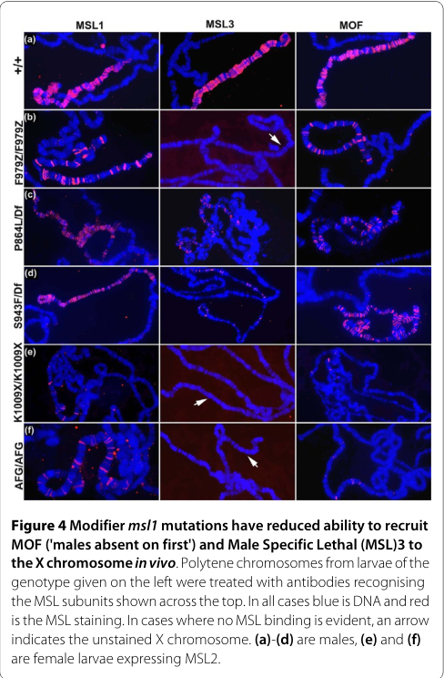

## Question

# Gene Research for Functional Annotation

## ⚠️ CRITICAL: Gene/Protein Identification Context

**BEFORE YOU BEGIN RESEARCH:** You MUST verify you are researching the CORRECT gene/protein. Gene symbols can be ambiguous, especially for less well-characterized genes from non-model organisms.

### Target Gene/Protein Identity (from UniProt):
- **UniProt Accession:** P50535
- **Protein Description:** RecName: Full=Protein male-specific lethal-1 {ECO:0000303|PubMed:7781064};
- **Gene Information:** Name=msl-1 {ECO:0000303|PubMed:7781064, ECO:0000312|FlyBase:FBgn0005617}; ORFNames=CG10385 {ECO:0000312|FlyBase:FBgn0005617};
- **Organism (full):** Drosophila melanogaster (Fruit fly).
- **Protein Family:** Belongs to the msl-1 family. .
- **Key Domains:** Msl-1. (IPR026711); PEHE_dom. (IPR029332); PEHE (PF15275)

### MANDATORY VERIFICATION STEPS:

1. **Check if the gene symbol "msl-1" matches the protein description above**
2. **Verify the organism is correct:** Drosophila melanogaster (Fruit fly).
3. **Check if protein family/domains align with what you find in literature**
4. **If you find literature for a DIFFERENT gene with the same or similar symbol, STOP**

### If Gene Symbol is Ambiguous or You Cannot Find Relevant Literature:

**DO NOT PROCEED WITH RESEARCH ON A DIFFERENT GENE.** Instead:
- State clearly: "The gene symbol 'msl-1' is ambiguous or literature is limited for this specific protein"
- Explain what you found (e.g., "Found extensive literature on a different gene with the same symbol in a different organism")
- Describe the protein based ONLY on the UniProt information provided above
- Suggest that the protein function can be inferred from domain/family information

### Research Target:

Please provide a comprehensive research report on the gene **msl-1** (gene ID: msl-1, UniProt: P50535) in DROME.

The research report should be a detailed narrative explaining the function, biological processes, and localization of the gene product. Citations should be given for all claims.

You should prioritize authoritative reviews and primary scientific literature when conducting research. You can supplement
this with annotations you find in gene/protein databases, but these can be outdated or inaccurate.

We are specifically interested in the primary function of the gene - for enzymes, what reaction is catalyzed, and what is the substrate specificity? For transporters, what is the substrate? For structural proteins or adapters, what is the broader structural role? For signaling molecules, what is the role in the pathway.

We are interested in where in or outside the cell the gene product carries out its function.

We are also interested in the signaling or biochemical pathways in which the gene functions. We are less interested in broad pleiotropic effects, except where these elucidate the precise role.

Include evidence where possible. We are interested in both experimental evidence as well as inference from structure, evolution, or bioinformatic analysis. Precise studies should be prioritized over high-throughput, where available.

## Output

Question: You are an expert researcher providing comprehensive, well-cited information.

Provide detailed information focusing on:
1. Key concepts and definitions with current understanding
2. Recent developments and latest research (prioritize 2023-2024 sources)
3. Current applications and real-world implementations
4. Expert opinions and analysis from authoritative sources
5. Relevant statistics and data from recent studies

Format as a comprehensive research report with proper citations. Include URLs and publication dates where available.
Always prioritize recent, authoritative sources and provide specific citations for all major claims.

# Gene Research for Functional Annotation

## ⚠️ CRITICAL: Gene/Protein Identification Context

**BEFORE YOU BEGIN RESEARCH:** You MUST verify you are researching the CORRECT gene/protein. Gene symbols can be ambiguous, especially for less well-characterized genes from non-model organisms.

### Target Gene/Protein Identity (from UniProt):
- **UniProt Accession:** P50535
- **Protein Description:** RecName: Full=Protein male-specific lethal-1 {ECO:0000303|PubMed:7781064};
- **Gene Information:** Name=msl-1 {ECO:0000303|PubMed:7781064, ECO:0000312|FlyBase:FBgn0005617}; ORFNames=CG10385 {ECO:0000312|FlyBase:FBgn0005617};
- **Organism (full):** Drosophila melanogaster (Fruit fly).
- **Protein Family:** Belongs to the msl-1 family. .
- **Key Domains:** Msl-1. (IPR026711); PEHE_dom. (IPR029332); PEHE (PF15275)

### MANDATORY VERIFICATION STEPS:

1. **Check if the gene symbol "msl-1" matches the protein description above**
2. **Verify the organism is correct:** Drosophila melanogaster (Fruit fly).
3. **Check if protein family/domains align with what you find in literature**
4. **If you find literature for a DIFFERENT gene with the same or similar symbol, STOP**

### If Gene Symbol is Ambiguous or You Cannot Find Relevant Literature:

**DO NOT PROCEED WITH RESEARCH ON A DIFFERENT GENE.** Instead:
- State clearly: "The gene symbol 'msl-1' is ambiguous or literature is limited for this specific protein"
- Explain what you found (e.g., "Found extensive literature on a different gene with the same symbol in a different organism")
- Describe the protein based ONLY on the UniProt information provided above
- Suggest that the protein function can be inferred from domain/family information

### Research Target:

Please provide a comprehensive research report on the gene **msl-1** (gene ID: msl-1, UniProt: P50535) in DROME.

The research report should be a detailed narrative explaining the function, biological processes, and localization of the gene product. Citations should be given for all claims.

You should prioritize authoritative reviews and primary scientific literature when conducting research. You can supplement
this with annotations you find in gene/protein databases, but these can be outdated or inaccurate.

We are specifically interested in the primary function of the gene - for enzymes, what reaction is catalyzed, and what is the substrate specificity? For transporters, what is the substrate? For structural proteins or adapters, what is the broader structural role? For signaling molecules, what is the role in the pathway.

We are interested in where in or outside the cell the gene product carries out its function.

We are also interested in the signaling or biochemical pathways in which the gene functions. We are less interested in broad pleiotropic effects, except where these elucidate the precise role.

Include evidence where possible. We are interested in both experimental evidence as well as inference from structure, evolution, or bioinformatic analysis. Precise studies should be prioritized over high-throughput, where available.

# Functional annotation of *Drosophila melanogaster msl-1* (UniProt P50535)

## Identity and principal function

The supplied UniProt record identifies **P50535 as male-specific lethal-1 (MSL1), encoded by *msl-1* (CG10385) in *Drosophila melanogaster***. The organism, protein name and reported PEHE domain agree with studies of fly MSL1; the retrieved papers do not independently print the P50535 accession, so the accession-to-gene mapping here rests on the UniProt information supplied in the question. This report does **not** substitute a similarly named protein from another organism. Fly MSL1 is a 1,039-amino-acid protein with an N-terminal coiled-coil region and C-terminal PEHE region. (kiss2024rnamodulationof pages 14-17, tikhonova2024interactionofmle pages 1-2, gelbart2009drosophiladosagecompensation pages 3-4)

**Primary annotation:** MSL1 is a **nuclear chromatin-associated assembly scaffold and adapter** in the male-specific lethal (MSL), or dosage-compensation, ribonucleoprotein complex. It organizes the MSL1–MSL2 core and connects it to MSL3 and the histone acetyltransferase MOF. **MSL1 is not the enzyme that acetylates histones**: MOF catalyzes histone H4 lysine-16 acetylation (H4K16ac). Consequently, no catalytic reaction or enzymatic substrate specificity should be assigned to MSL1 itself. Its relevant binding partners include MSL2, MSL3, MOF and the *roX* RNA-associated complex. (prabhakaran2010anewstrategy pages 1-2, tikhonova2024interactionofmle pages 1-2, lindehell2015proximityligationassays pages 2-3)

## Molecular mechanism and biological process

XY male flies have one X chromosome, whereas XX females have two. The canonical MSL complex increases transcriptional output from the male X, contributing to approximately twofold compensation of X-linked expression. Its five principal proteins are MSL1, MSL2, MSL3, MLE and MOF, assembled with the long noncoding RNAs roX1 and roX2. MSL1 provides organization and recruitment; MLE remodels *roX* RNAs, MSL2 contributes male-specific X targeting, and MOF supplies histone-acetyltransferase activity. H4K16ac is enriched on the compensated male X. The transcriptional effect is associated especially with active X-linked gene bodies, although the exact contribution of chromatin decompaction versus transcription-cycle effects remains a mechanistic question rather than a reaction catalyzed by MSL1. (prabhakaran2010anewstrategy pages 1-2, tikhonova2024interactionofmle pages 1-2, gelbart2009drosophiladosagecompensation pages 3-4, lindehell2015proximityligationassays pages 2-3)

The **N-terminal coiled-coil** supports MSL1 self-association and interaction with MSL2, building the complex core. The **C-terminal PEHE-containing region** supports recruitment of MSL3 and MOF. Male specificity is not equivalent to expression of MSL1 only in males: MSL2 availability is a principal sex-specific switch, while MSL1 protein is less abundant in females. In a foundational transgenic experiment, simultaneous overexpression of MSL1 and MSL2 caused **100% female-specific lethality**, illustrating the consequences of inappropriate activation of this machinery. (tikhonova2024interactionofmle pages 1-2, chang1998modulationofmsl1 pages 1-2)

Direct structure–function evidence comes from mutations in the PEHE-containing C terminus. In the 2010 study, **P864L and S943F** MSL1 variants occupied much of the male X yet recruited less MSL3 and MOF; **F979Z** occupied only approximately **30–50 X-chromosome bands**, recruited MOF at those sites, and showed no detectable chromosomal MSL3. P864L or S943F combined with F979Z supported only about **7% male viability**. Importantly, the tested C-terminal mutant proteins could still co-immunoprecipitate MSL3 and MOF from cell extracts. Thus, an interaction detectable in solution is **not** sufficient evidence of stable MSL3 tethering or productive chromosome-wide spreading *in vivo*. The paper’s polytene-chromosome Figure 4 directly illustrates this distinction. (prabhakaran2010anewstrategy pages 2-4, prabhakaran2010anewstrategy pages 5-6, prabhakaran2010anewstrategy media b35f28a4)

A complementary N-terminal mutational study found that the combined **residues 3–7 “GS” substitution** impaired male viability and X-chromosome recruitment, whereas the separately tested basic-residue and aromatic-residue substitutions were much less disruptive. Immunoprecipitation recovered roX2 RNA with wild-type MSL1 but not with MSL1-GS or MSL1-Δ41–85. The Δ41–85 variant also reduced recruitment of MSL1, MSL2 and MSL3 to X-chromosomal high-affinity sites. These observations support an important contribution of the MSL1 N terminus to RNA-associated assembly and robust chromatin recruitment; RNA co-immunoprecipitation alone does not establish which contacts are direct. **Evidence-status qualification:** the retrievable text is a bioRxiv preprint initially posted in 2020 and updated **4 May 2024**, not the peer-reviewed eLife version; these detailed mutant claims are therefore labeled as preprint evidence here. (babosha2020nterminusofdrosophilamelanogastermsl1 pages 15-18, babosha2020nterminusofdrosophilamelanogastermsl1 pages 9-12, babosha2020nterminusofdrosophilamelanogastermsl1 pages 12-15)

The domain-level experimental evidence is summarized below.

| MSL1 region / feature | Experimentally supported molecular role | Key evidence | Functional interpretation | Source |
|---|---|---|---|---|
| Overall architecture | Organizing scaffold of the male-specific lethal dosage-compensation complex; **MSL1 is not the acetyltransferase**. It connects the MSL1–MSL2 core to MSL3 and catalytic MOF. | Genetics, co-immunoprecipitation, polytene-chromosome imaging and ChIP-seq. MOF—not MSL1—catalyzes histone H4 lysine-16 acetylation. | Adapter/scaffold that assembles and positions the chromatin-targeting and acetylase modules on the male X chromosome. | Prabhakaran & Kelley, *BMC Biology* (2010), DOI: [10.1186/1741-7007-8-80](https://doi.org/10.1186/1741-7007-8-80); Tikhonova et al., *Open Biology* (2024), DOI: [10.1098/rsob.230270](https://doi.org/10.1098/rsob.230270) (prabhakaran2010anewstrategy pages 1-2, tikhonova2024interactionofmle pages 1-2) |
| N-terminal coiled-coil | Supports MSL1 homodimerization and binding to the MSL2 RING-domain region, forming the structural MSL1–MSL2 core. | Interaction assays, mutant co-immunoprecipitation and genetic/chromosome-localization studies. | Builds the core onto which the remaining dosage-compensation machinery is assembled; male specificity principally comes from male-restricted MSL2 availability rather than from MSL1 itself. | Tikhonova et al., *Open Biology* (2024), DOI: [10.1098/rsob.230270](https://doi.org/10.1098/rsob.230270); Babosha et al., bioRxiv preprint (2020; updated May 4, 2024; **not peer reviewed**), DOI: [10.1101/2020.11.11.378323](https://doi.org/10.1101/2020.11.11.378323) (tikhonova2024interactionofmle pages 1-2, babosha2020nterminusofdrosophilamelanogastermsl1 pages 9-12) |
| N-terminal residues 3–7 (KRFKW) | Promote stable roX2 association and efficient recruitment of MSL1, MSL2 and MSL3 to X-chromosomal high-affinity sites. | The combined GS substitution reduced MSL1 abundance about 1.5–2-fold, strongly impaired male viability and X binding, and eliminated detectable roX2 recovery by MSL1 RNA immunoprecipitation; separate aromatic-only or basic-only substitutions were much less disruptive. | Basic and aromatic residues act cooperatively in RNA-coupled complex assembly rather than serving as an enzymatic active site. | Babosha et al., bioRxiv preprint (2020; updated May 4, 2024; **not peer reviewed**), DOI: [10.1101/2020.11.11.378323](https://doi.org/10.1101/2020.11.11.378323) (babosha2020nterminusofdrosophilamelanogastermsl1 pages 15-18, babosha2020nterminusofdrosophilamelanogastermsl1 pages 9-12) |
| N-terminal residues 41–85 | Required for detectable MSL1–roX2 association, robust X-chromosomal complex recruitment and a subset of MSL1-only promoter interactions. | Δ41–85 protein remained expressed but failed to recover roX2 by RNA immunoprecipitation and strongly reduced MSL1/MSL2/MSL3 occupancy at high-affinity sites; unlike the GS mutant, it also lost MSL1-only promoter binding. | Couples RNA-dependent canonical dosage compensation to an additional RNA-independent/promoter-associated MSL1 function. | Babosha et al., bioRxiv preprint (2020; updated May 4, 2024; **not peer reviewed**), DOI: [10.1101/2020.11.11.378323](https://doi.org/10.1101/2020.11.11.378323) (babosha2020nterminusofdrosophilamelanogastermsl1 pages 15-18, babosha2020nterminusofdrosophilamelanogastermsl1 pages 12-15) |
| C-terminal PEHE/C-terminal region, including P864, S943 and F979 | Recruits or stably tethers MSL3 and MOF to X chromatin. P864L and S943F painted much of the X but reduced MSL3/MOF staining; the F979 frameshift bound only about 30–50 X bands, recruited MOF at those sites and had no detectable chromosomal MSL3. | EMS modifier screen of about 10,000 sons, genetics, viability assays and immunostaining of polytene chromosomes. P864L or S943F combined with F979Z supported only about 7% viability. | The PEHE-containing C terminus is the docking interface linking the MSL1 scaffold to the MSL3–MOF acetylase module; disruption compromises chromosome-wide spreading and dosage compensation. | Prabhakaran & Kelley, *BMC Biology* (2010), DOI: [10.1186/1741-7007-8-80](https://doi.org/10.1186/1741-7007-8-80) (prabhakaran2010anewstrategy pages 2-4, prabhakaran2010anewstrategy pages 5-6) |
| PEHE interactions in solution versus on chromatin | All five tested C-terminal mutant fragments could co-immunoprecipitate MSL3 and MOF from S2-cell extracts, even when the corresponding proteins failed to retain MSL3 detectably on polytene X chromosomes. | Direct comparison of soluble co-immunoprecipitation with in vivo chromosome immunostaining; AFG showed somewhat weaker soluble MSL3 binding. | Binary association in solution is insufficient to establish productive chromatin recruitment. PEHE can support soluble interaction, whereas the adjacent fly-specific C-terminal region is important for stable MSL3 tethering and spreading on X chromatin. | Prabhakaran & Kelley, *BMC Biology* (2010), DOI: [10.1186/1741-7007-8-80](https://doi.org/10.1186/1741-7007-8-80) (prabhakaran2010anewstrategy pages 5-6) |
| MSL1-only autosomal promoter occupancy | MSL1 can occupy promoter-enriched autosomal sites with little or no MSL2, independently of the intact canonical dosage-compensation complex. Disrupting MLE–CLAMP coupling generated approximately 330 additional autosomal MSL1 peaks, predominantly at promoters. | Adult-fly ChIP-seq; autosomal MSL1 signal increased significantly after deletion of the MLE CLAMP-binding domain (Wilcoxon *p* = 1.77 × 10⁻³⁹). MSL1GS retained MSL1-only promoter binding, whereas Δ41–85 did not. | Indicates a noncanonical promoter-associated role or binding mode for MSL1 distinct from male-X targeting; its precise transcriptional consequence remains less firmly defined than canonical dosage compensation. | Tikhonova et al., *Open Biology* (2024), DOI: [10.1098/rsob.230270](https://doi.org/10.1098/rsob.230270); Babosha et al., bioRxiv preprint (2020; updated May 4, 2024; **not peer reviewed**), DOI: [10.1101/2020.11.11.378323](https://doi.org/10.1101/2020.11.11.378323) (tikhonova2024interactionofmle pages 7-8, babosha2020nterminusofdrosophilamelanogastermsl1 pages 12-15) |

*Table: Experimentally supported domain map for *Drosophila melanogaster* MSL1 (P50535), separating its scaffold and recruitment functions from MOF-mediated catalysis. The table also distinguishes soluble interactions from productive chromatin tethering and flags non-peer-reviewed evidence.*

## Where MSL1 functions

**Principal site:** the **nucleus, on chromatin of the male X chromosome**, notably high-affinity recruitment sites and, as part of the assembled complex, regions associated with actively transcribed X-linked genes. Immunostaining of larval salivary-gland polytene chromosomes places MSL1 and its partners along the male X. Chromosome-based proximity-ligation assays detected MSL1 close to MSL2, MSL3, MLE and MOF on that chromosome; proximity supports co-residence but does not by itself establish direct physical binding between every pair. Adult-fly ChIP-seq found MSL proteins at approximately **90% of previously defined high-affinity X sites** in the examined control animals. This is an intracellular chromatin function, not secretion or membrane transport. (prabhakaran2010anewstrategy pages 5-6, tikhonova2024interactionofmle pages 7-8, lindehell2015proximityligationassays pages 5-7)

Targeting is selective rather than a property of MSL1 alone. MSL2 and the GA-repeat-binding factor CLAMP contribute to high-affinity-site recognition, while MLE-dependent *roX* RNA remodeling contributes to complex assembly. A **March 2024 peer-reviewed** study identified an MLE–CLAMP interaction and tested it genetically and by ChIP-seq. Deleting MLE’s CLAMP-binding region weakened MSL2 occupancy at high-affinity sites, reduced X-chromosomal MSL3 signal approximately **two- to threefold**, yet left the overall MSL1 X profile largely intact. These results caution against equating MSL1 occupancy with complete, fully functional complex assembly. (tikhonova2024interactionofmle pages 1-2, tikhonova2024interactionofmle pages 7-8)

**Additional chromatin contexts:** MSL1 also occupies some **autosomal promoters** without substantial MSL2 signal. In the 2024 MLE–CLAMP perturbation experiment, roughly **330 additional autosomal MSL1 peaks**, predominantly promoter-associated, appeared while the broad X profile persisted. This is credible evidence for a noncanonical localization, but binding does not establish that MSL1 alone activates those genes or performs canonical X dosage compensation there. In early embryos, MSL3 association with active genes across the genome was strongly dependent on maternally supplied MSL1, consistent with an MSL1-containing chromatin-associated subcomplex before fully male-specific X targeting. Evidence linking MSL1 and selected other MSL components to male autosomal heterochromatic-gene expression is more context-dependent and should remain secondary to its well-established X-chromosome scaffold function. (tikhonova2024interactionofmle pages 7-8, babosha2020nterminusofdrosophilamelanogastermsl1 pages 12-15, koya2015modulationofheterochromatin pages 4-6, koya2015modulationofheterochromatin pages 8-10)

## Recent developments, interpretation and research use

The **2024 MLE–CLAMP study** sharpened the distinction between initial chromatin occupancy and productive assembly: despite largely preserved MSL1 X occupancy, loss of the MLE interaction substantially altered MSL2/MSL3 targeting and expanded MSL1 occupancy at autosomal promoters. The 2024-updated MSL1 mutational preprint offers a complementary explanation at the protein level: defects in MSL1’s N-terminal *roX*-association and recruitment functions can disrupt high-affinity-site occupancy even when some alternative promoter binding persists. Together, these studies favor a **modular scaffold model**, rather than treating MSL1 as either the histone acetyltransferase or a sufficient X-recognition factor by itself. (babosha2020nterminusofdrosophilamelanogastermsl1 pages 15-18, tikhonova2024interactionofmle pages 7-8, babosha2020nterminusofdrosophilamelanogastermsl1 pages 12-15)

A **January 2024 dissertation** reported in-vitro work suggesting that a Drosophila MSL assembly can acetylate additional H4-tail lysines after H4K16 and that RNA can alter the distribution of acetylated products. This concerns the behavior of **MOF-containing complexes**, not an MSL1 catalytic activity; because the retrieved supporting text is a dissertation rather than the separately identified peer-reviewed biochemical article, its detailed processivity conclusions should be treated as provisional in this annotation. (kiss2024rnamodulationof pages 110-113)

In practice, *msl-1* mutant rescue, polytene-chromosome immunostaining, RNA co-immunoprecipitation and ChIP-seq provide experimentally implemented ways to distinguish **complex assembly**, **RNA association**, **chromosomal targeting** and **downstream dosage compensation**. For functional annotation, the strongest assignment is therefore: *msl-1* encodes a nuclear MSL-complex scaffold required to assemble and properly position a MOF-containing chromatin-regulatory complex for male-X transcriptional dosage compensation. Autosomal promoter binding and early embryonic roles are supported observations, but their precise independent biochemical outputs are less resolved. (prabhakaran2010anewstrategy pages 5-6, babosha2020nterminusofdrosophilamelanogastermsl1 pages 15-18, tikhonova2024interactionofmle pages 7-8, koya2015modulationofheterochromatin pages 8-10)

### Selected sources and publication dates

- Tikhonova E. *et al.* **March 2024**, *Open Biology*, “Interaction of MLE with CLAMP zinc finger is involved in proper MSL proteins binding to chromosomes in Drosophila.” https://doi.org/10.1098/rsob.230270. (tikhonova2024interactionofmle pages 1-2, tikhonova2024interactionofmle pages 7-8)
- Babosha V. *et al.* **2020 preprint; updated 4 May 2024**, “N-Terminus of Drosophila Melanogaster MSL1 Is Critical for Dosage Compensation.” https://doi.org/10.1101/2020.11.11.378323. **Preprint evidence as retrieved.** (babosha2020nterminusofdrosophilamelanogastermsl1 pages 15-18, babosha2020nterminusofdrosophilamelanogastermsl1 pages 12-15)
- Prabhakaran M. and Kelley R. L. **June 2010**, *BMC Biology*, “A new strategy for isolating genes controlling dosage compensation in Drosophila using a simple epigenetic mosaic eye phenotype.” https://doi.org/10.1186/1741-7007-8-80. (prabhakaran2010anewstrategy pages 2-4, prabhakaran2010anewstrategy pages 5-6)
- Lindehell H. *et al.* **February 2015**, *Chromosoma*, “Proximity ligation assays of protein and RNA interactions in the male-specific lethal complex on Drosophila melanogaster polytene chromosomes.” https://doi.org/10.1007/s00412-015-0509-x. (lindehell2015proximityligationassays pages 5-7)
- Koya S. K. and Meller V. H. **October 2015**, *PLOS ONE*, “Modulation of Heterochromatin by Male Specific Lethal Proteins and roX RNA in Drosophila melanogaster Males.” https://doi.org/10.1371/journal.pone.0140259. (koya2015modulationofheterochromatin pages 8-10)
- Gelbart M. E. and Kuroda M. I. **May 2009**, *Development*, authoritative mechanistic review, “Drosophila dosage compensation: a complex voyage to the X chromosome.” https://doi.org/10.1242/dev.029645. (gelbart2009drosophiladosagecompensation pages 3-4)
- Chang K. A. and Kuroda M. I. **October 1998**, *Genetics*, “Modulation of MSL1 Abundance in Female Drosophila Contributes to the Sex Specificity of Dosage Compensation.” https://doi.org/10.1093/genetics/150.2.699. (chang1998modulationofmsl1 pages 1-2)

References

1. (kiss2024rnamodulationof pages 14-17): Anna Elisabeth Kiss. Rna modulation of structure and function of the drosophila msl complex in vitro. Dissertation, Jan 2024. URL: https://doi.org/10.5282/edoc.34194, doi:10.5282/edoc.34194. This article has 0 citations.

2. (tikhonova2024interactionofmle pages 1-2): Evgeniya Tikhonova, Anastasia Revel-Muroz, Pavel Georgiev, and Oksana Maksimenko. Interaction of mle with clamp zinc finger is involved in proper msl proteins binding to chromosomes in drosophila. Open Biology, Mar 2024. URL: https://doi.org/10.1098/rsob.230270, doi:10.1098/rsob.230270. This article has 8 citations and is from a peer-reviewed journal.

3. (gelbart2009drosophiladosagecompensation pages 3-4): Marnie E. Gelbart and Mitzi I. Kuroda. Drosophila dosage compensation: a complex voyage to the x chromosome. Development, 136:1399-1410, May 2009. URL: https://doi.org/10.1242/dev.029645, doi:10.1242/dev.029645. This article has 311 citations and is from a domain leading peer-reviewed journal.

4. (prabhakaran2010anewstrategy pages 1-2): Mahalakshmi Prabhakaran and Richard L Kelley. A new strategy for isolating genes controlling dosage compensation in drosophila using a simple epigenetic mosaic eye phenotype. BMC Biology, 8:80-80, Jun 2010. URL: https://doi.org/10.1186/1741-7007-8-80, doi:10.1186/1741-7007-8-80. This article has 4 citations and is from a domain leading peer-reviewed journal.

5. (lindehell2015proximityligationassays pages 2-3): Henrik Lindehell, Maria Kim, and Jan Larsson. Proximity ligation assays of protein and rna interactions in the male-specific lethal complex on drosophila melanogaster polytene chromosomes. Chromosoma, 124:385-395, Feb 2015. URL: https://doi.org/10.1007/s00412-015-0509-x, doi:10.1007/s00412-015-0509-x. This article has 15 citations and is from a peer-reviewed journal.

6. (chang1998modulationofmsl1 pages 1-2): Kimberly A Chang and Mitzi I Kuroda. Modulation of msl1 abundance in female drosophila contributes to the sex specificity of dosage compensation. Genetics, 150:699-709, Oct 1998. URL: https://doi.org/10.1093/genetics/150.2.699, doi:10.1093/genetics/150.2.699. This article has 58 citations and is from a domain leading peer-reviewed journal.

7. (prabhakaran2010anewstrategy pages 2-4): Mahalakshmi Prabhakaran and Richard L Kelley. A new strategy for isolating genes controlling dosage compensation in drosophila using a simple epigenetic mosaic eye phenotype. BMC Biology, 8:80-80, Jun 2010. URL: https://doi.org/10.1186/1741-7007-8-80, doi:10.1186/1741-7007-8-80. This article has 4 citations and is from a domain leading peer-reviewed journal.

8. (prabhakaran2010anewstrategy pages 5-6): Mahalakshmi Prabhakaran and Richard L Kelley. A new strategy for isolating genes controlling dosage compensation in drosophila using a simple epigenetic mosaic eye phenotype. BMC Biology, 8:80-80, Jun 2010. URL: https://doi.org/10.1186/1741-7007-8-80, doi:10.1186/1741-7007-8-80. This article has 4 citations and is from a domain leading peer-reviewed journal.

9. (prabhakaran2010anewstrategy media b35f28a4): Mahalakshmi Prabhakaran and Richard L Kelley. A new strategy for isolating genes controlling dosage compensation in drosophila using a simple epigenetic mosaic eye phenotype. BMC Biology, 8:80-80, Jun 2010. URL: https://doi.org/10.1186/1741-7007-8-80, doi:10.1186/1741-7007-8-80. This article has 4 citations and is from a domain leading peer-reviewed journal.

10. (babosha2020nterminusofdrosophilamelanogastermsl1 pages 15-18): Valentin Babosha, Natalia Klimenko, Anastasia Revel-Muroz, Evgeniya Tikhonova, Pavel Georgiev, and Oksana Maksimenko. N-terminus of<i>drosophila melanogaster</i>msl1 is critical for dosage compensation. BioRxiv, Nov 2020. URL: https://doi.org/10.1101/2020.11.11.378323, doi:10.1101/2020.11.11.378323. This article has 0 citations.

11. (babosha2020nterminusofdrosophilamelanogastermsl1 pages 9-12): Valentin Babosha, Natalia Klimenko, Anastasia Revel-Muroz, Evgeniya Tikhonova, Pavel Georgiev, and Oksana Maksimenko. N-terminus of<i>drosophila melanogaster</i>msl1 is critical for dosage compensation. BioRxiv, Nov 2020. URL: https://doi.org/10.1101/2020.11.11.378323, doi:10.1101/2020.11.11.378323. This article has 0 citations.

12. (babosha2020nterminusofdrosophilamelanogastermsl1 pages 12-15): Valentin Babosha, Natalia Klimenko, Anastasia Revel-Muroz, Evgeniya Tikhonova, Pavel Georgiev, and Oksana Maksimenko. N-terminus of<i>drosophila melanogaster</i>msl1 is critical for dosage compensation. BioRxiv, Nov 2020. URL: https://doi.org/10.1101/2020.11.11.378323, doi:10.1101/2020.11.11.378323. This article has 0 citations.

13. (tikhonova2024interactionofmle pages 7-8): Evgeniya Tikhonova, Anastasia Revel-Muroz, Pavel Georgiev, and Oksana Maksimenko. Interaction of mle with clamp zinc finger is involved in proper msl proteins binding to chromosomes in drosophila. Open Biology, Mar 2024. URL: https://doi.org/10.1098/rsob.230270, doi:10.1098/rsob.230270. This article has 8 citations and is from a peer-reviewed journal.

14. (lindehell2015proximityligationassays pages 5-7): Henrik Lindehell, Maria Kim, and Jan Larsson. Proximity ligation assays of protein and rna interactions in the male-specific lethal complex on drosophila melanogaster polytene chromosomes. Chromosoma, 124:385-395, Feb 2015. URL: https://doi.org/10.1007/s00412-015-0509-x, doi:10.1007/s00412-015-0509-x. This article has 15 citations and is from a peer-reviewed journal.

15. (koya2015modulationofheterochromatin pages 4-6): S. Kiran Koya and Victoria H. Meller. Modulation of heterochromatin by male specific lethal proteins and rox rna in drosophila melanogaster males. PLoS ONE, 10:e0140259, Oct 2015. URL: https://doi.org/10.1371/journal.pone.0140259, doi:10.1371/journal.pone.0140259. This article has 22 citations and is from a peer-reviewed journal.

16. (koya2015modulationofheterochromatin pages 8-10): S. Kiran Koya and Victoria H. Meller. Modulation of heterochromatin by male specific lethal proteins and rox rna in drosophila melanogaster males. PLoS ONE, 10:e0140259, Oct 2015. URL: https://doi.org/10.1371/journal.pone.0140259, doi:10.1371/journal.pone.0140259. This article has 22 citations and is from a peer-reviewed journal.

17. (kiss2024rnamodulationof pages 110-113): Anna Elisabeth Kiss. Rna modulation of structure and function of the drosophila msl complex in vitro. Dissertation, Jan 2024. URL: https://doi.org/10.5282/edoc.34194, doi:10.5282/edoc.34194. This article has 0 citations.

## Artifacts

- [Edison artifact artifact-00](msl-1-deep-research-falcon_artifacts/artifact-00.md)

## Citations

1. prabhakaran2010anewstrategy pages 5-6
2. kiss2024rnamodulationof pages 110-113
3. lindehell2015proximityligationassays pages 5-7
4. koya2015modulationofheterochromatin pages 8-10
5. gelbart2009drosophiladosagecompensation pages 3-4
6. kiss2024rnamodulationof pages 14-17
7. tikhonova2024interactionofmle pages 1-2
8. prabhakaran2010anewstrategy pages 1-2
9. lindehell2015proximityligationassays pages 2-3
10. prabhakaran2010anewstrategy pages 2-4
11. tikhonova2024interactionofmle pages 7-8
12. koya2015modulationofheterochromatin pages 4-6
13. 10.1186/1741-7007-8-80
14. 10.1098/rsob.230270
15. 10.1101/2020.11.11.378323
16. https://doi.org/10.1186/1741-7007-8-80
17. https://doi.org/10.1098/rsob.230270
18. https://doi.org/10.1101/2020.11.11.378323
19. https://doi.org/10.1098/rsob.230270.
20. https://doi.org/10.1101/2020.11.11.378323.
21. https://doi.org/10.1186/1741-7007-8-80.
22. https://doi.org/10.1007/s00412-015-0509-x.
23. https://doi.org/10.1371/journal.pone.0140259.
24. https://doi.org/10.1242/dev.029645.
25. https://doi.org/10.1093/genetics/150.2.699.
26. https://doi.org/10.5282/edoc.34194,
27. https://doi.org/10.1098/rsob.230270,
28. https://doi.org/10.1242/dev.029645,
29. https://doi.org/10.1186/1741-7007-8-80,
30. https://doi.org/10.1007/s00412-015-0509-x,
31. https://doi.org/10.1093/genetics/150.2.699,
32. https://doi.org/10.1101/2020.11.11.378323,
33. https://doi.org/10.1371/journal.pone.0140259,