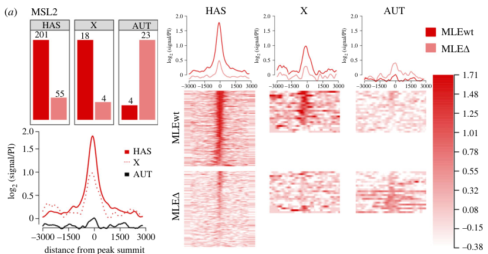

## Question

# Gene Research for Functional Annotation

## ⚠️ CRITICAL: Gene/Protein Identification Context

**BEFORE YOU BEGIN RESEARCH:** You MUST verify you are researching the CORRECT gene/protein. Gene symbols can be ambiguous, especially for less well-characterized genes from non-model organisms.

### Target Gene/Protein Identity (from UniProt):
- **UniProt Accession:** P50534
- **Protein Description:** RecName: Full=E3 ubiquitin-protein ligase msl-2 {ECO:0000305}; EC=2.3.2.27 {ECO:0000269|PubMed:21726816, ECO:0000269|PubMed:23084834}; AltName: Full=Protein male-specific lethal-2 {ECO:0000303|PubMed:7781064};
- **Gene Information:** Name=msl-2 {ECO:0000303|PubMed:7781064, ECO:0000312|FlyBase:FBgn0005616}; ORFNames=CG3241 {ECO:0000312|FlyBase:FBgn0005616};
- **Organism (full):** Drosophila melanogaster (Fruit fly).
- **Protein Family:** Belongs to the MSL2 family. .
- **Key Domains:** MSL2. (IPR037922); Msl2-CXC. (IPR032049); Msl2_Znf-RING. (IPR032043); Tesmin/TSO1-like_CXC. (IPR033467); Znf_RING. (IPR001841)

### MANDATORY VERIFICATION STEPS:

1. **Check if the gene symbol "msl-2" matches the protein description above**
2. **Verify the organism is correct:** Drosophila melanogaster (Fruit fly).
3. **Check if protein family/domains align with what you find in literature**
4. **If you find literature for a DIFFERENT gene with the same or similar symbol, STOP**

### If Gene Symbol is Ambiguous or You Cannot Find Relevant Literature:

**DO NOT PROCEED WITH RESEARCH ON A DIFFERENT GENE.** Instead:
- State clearly: "The gene symbol 'msl-2' is ambiguous or literature is limited for this specific protein"
- Explain what you found (e.g., "Found extensive literature on a different gene with the same symbol in a different organism")
- Describe the protein based ONLY on the UniProt information provided above
- Suggest that the protein function can be inferred from domain/family information

### Research Target:

Please provide a comprehensive research report on the gene **msl-2** (gene ID: msl-2, UniProt: P50534) in DROME.

The research report should be a detailed narrative explaining the function, biological processes, and localization of the gene product. Citations should be given for all claims.

You should prioritize authoritative reviews and primary scientific literature when conducting research. You can supplement
this with annotations you find in gene/protein databases, but these can be outdated or inaccurate.

We are specifically interested in the primary function of the gene - for enzymes, what reaction is catalyzed, and what is the substrate specificity? For transporters, what is the substrate? For structural proteins or adapters, what is the broader structural role? For signaling molecules, what is the role in the pathway.

We are interested in where in or outside the cell the gene product carries out its function.

We are also interested in the signaling or biochemical pathways in which the gene functions. We are less interested in broad pleiotropic effects, except where these elucidate the precise role.

Include evidence where possible. We are interested in both experimental evidence as well as inference from structure, evolution, or bioinformatic analysis. Precise studies should be prioritized over high-throughput, where available.

## Output

Question: You are an expert researcher providing comprehensive, well-cited information.

Provide detailed information focusing on:
1. Key concepts and definitions with current understanding
2. Recent developments and latest research (prioritize 2023-2024 sources)
3. Current applications and real-world implementations
4. Expert opinions and analysis from authoritative sources
5. Relevant statistics and data from recent studies

Format as a comprehensive research report with proper citations. Include URLs and publication dates where available.
Always prioritize recent, authoritative sources and provide specific citations for all major claims.

# Gene Research for Functional Annotation

## ⚠️ CRITICAL: Gene/Protein Identification Context

**BEFORE YOU BEGIN RESEARCH:** You MUST verify you are researching the CORRECT gene/protein. Gene symbols can be ambiguous, especially for less well-characterized genes from non-model organisms.

### Target Gene/Protein Identity (from UniProt):
- **UniProt Accession:** P50534
- **Protein Description:** RecName: Full=E3 ubiquitin-protein ligase msl-2 {ECO:0000305}; EC=2.3.2.27 {ECO:0000269|PubMed:21726816, ECO:0000269|PubMed:23084834}; AltName: Full=Protein male-specific lethal-2 {ECO:0000303|PubMed:7781064};
- **Gene Information:** Name=msl-2 {ECO:0000303|PubMed:7781064, ECO:0000312|FlyBase:FBgn0005616}; ORFNames=CG3241 {ECO:0000312|FlyBase:FBgn0005616};
- **Organism (full):** Drosophila melanogaster (Fruit fly).
- **Protein Family:** Belongs to the MSL2 family. .
- **Key Domains:** MSL2. (IPR037922); Msl2-CXC. (IPR032049); Msl2_Znf-RING. (IPR032043); Tesmin/TSO1-like_CXC. (IPR033467); Znf_RING. (IPR001841)

### MANDATORY VERIFICATION STEPS:

1. **Check if the gene symbol "msl-2" matches the protein description above**
2. **Verify the organism is correct:** Drosophila melanogaster (Fruit fly).
3. **Check if protein family/domains align with what you find in literature**
4. **If you find literature for a DIFFERENT gene with the same or similar symbol, STOP**

### If Gene Symbol is Ambiguous or You Cannot Find Relevant Literature:

**DO NOT PROCEED WITH RESEARCH ON A DIFFERENT GENE.** Instead:
- State clearly: "The gene symbol 'msl-2' is ambiguous or literature is limited for this specific protein"
- Explain what you found (e.g., "Found extensive literature on a different gene with the same symbol in a different organism")
- Describe the protein based ONLY on the UniProt information provided above
- Suggest that the protein function can be inferred from domain/family information

### Research Target:

Please provide a comprehensive research report on the gene **msl-2** (gene ID: msl-2, UniProt: P50534) in DROME.

The research report should be a detailed narrative explaining the function, biological processes, and localization of the gene product. Citations should be given for all claims.

You should prioritize authoritative reviews and primary scientific literature when conducting research. You can supplement
this with annotations you find in gene/protein databases, but these can be outdated or inaccurate.

We are specifically interested in the primary function of the gene - for enzymes, what reaction is catalyzed, and what is the substrate specificity? For transporters, what is the substrate? For structural proteins or adapters, what is the broader structural role? For signaling molecules, what is the role in the pathway.

We are interested in where in or outside the cell the gene product carries out its function.

We are also interested in the signaling or biochemical pathways in which the gene functions. We are less interested in broad pleiotropic effects, except where these elucidate the precise role.

Include evidence where possible. We are interested in both experimental evidence as well as inference from structure, evolution, or bioinformatic analysis. Precise studies should be prioritized over high-throughput, where available.

# Functional annotation of *Drosophila melanogaster msl-2* (UniProt P50534)

## Identity and principal function

The supplied UniProt accession **P50534** identifies the fruit-fly gene *msl-2* (CG3241), encoding male-specific lethal protein 2 (MSL2). The species, protein name and supplied RING/CXC domain annotations agree with experimental studies of **Drosophila** MSL2; the retrieved papers do not independently print the accession-to-CG3241 mapping. This distinction matters because mammalian proteins called MSL2 have related biochemical activities but cannot automatically be assigned the fly protein’s chromosome-targeting mechanism or substrate residues. (tikhonova2024interactionofmle pages 1-2, zheng2014structuralbasisof pages 1-2, zheng2014structuralbasisof pages 7-8)

**The best-established physiological role of fly MSL2 is to initiate and organize the male-specific lethal dosage-compensation complex (MSL-DCC) on the single male X chromosome.** The complex comprises MSL1, MSL2, MSL3, the RNA helicase MLE, the histone acetyltransferase MOF and *roX1* or *roX2* long noncoding RNA. Its chromosome-wide effect is increased transcription of X-linked genes, conventionally described as approximately twofold relative to one uncompensated X. MOF—not MSL2—catalyzes the complex’s established H4K16 acetylation reaction. MSL2 is also a RING-family E3 ubiquitin ligase, but the contribution of its individual ubiquitination reactions to dosage compensation is less securely established than its targeting and assembly function. (tikhonova2024interactionofmle pages 1-2, schunter2017ubiquitylationofthe pages 1-2, wu2011theringfinger pages 8-10, salzler2024set2andh3k36 pages 1-5)

## Molecular mechanism, reaction and substrates

The **N-terminal RING finger** contributes both to ubiquitin-ligase activity and to association with the MSL1 scaffold. MSL1 dimerization provides a core capable of associating with two MSL2 molecules; disrupting MSL1 dimerization compromises X-chromosome targeting and causes male-specific lethality. These observations make MSL2 a chromatin-targeting and complex-assembly factor, not simply a freely acting ubiquitin enzyme. Structural work on the homologous MSL1–MSL2 core supports the dimeric architecture, while fly experiments establish its functional significance. (tikhonova2024interactionofmle pages 1-2, hallacli2012msl1mediateddimerizationof pages 1-2)

As an E3 ligase, MSL2 promotes **transfer of ubiquitin from an E2~ubiquitin conjugate onto substrate lysines** in reactions requiring the upstream E1/E2 ubiquitination machinery and ATP. In a purified *Drosophila* MSL1–MSL2 preparation, the complex ubiquitinated **nucleosomal histone H2B**. The proposed homologous acceptor in fly H2B is **K31**; the extensively characterized **H2B K34** reaction and its stimulation of H3K4/H3K79 methylation were principally established with *mammalian* MSL1–MSL2. The 2011 authors explicitly left open whether fly H2B K31 ubiquitination contributes to dosage compensation *in vivo*. Accordingly, H2B K34 should not be reported unqualified as the measured substrate residue of P50534 in flies. (wu2011theringfinger pages 8-10, wu2011theringfinger pages 1-2)

Other demonstrated **biochemical substrates** include MSL1, MOF and MSL2 itself; MSL3 has also been reported among MSL2-ubiquitinated complex subunits. Recombinant fly MSL2 preferentially ubiquitinated lysines in the first approximately 400 amino acids of MOF *in vitro*, and autoubiquitination was observed without added substrate. However, MOF ubiquitination detected in cells occurred in **both sexes**, and the distinctive MOF N-terminal sites observed *in vitro* were **not detected in vivo**. Mutating those N-terminal lysines did not abolish MOF’s ability to support male survival. Thus, MOF ubiquitination by MSL2 is a credible reaction in a biochemical assay, **not an established obligatory physiological step** of dosage compensation; proposals that it controls complex abundance or quality remain hypotheses. DNA inhibited MSL2-dependent MOF ubiquitination *in vitro*, suggesting—but not proving—that DNA-bound complexes are protected from this activity. (schunter2017ubiquitylationofthe pages 2-3, hallacli2012msl1mediateddimerizationof pages 1-2, schunter2017ubiquitylationofthe pages 10-12, schunter2017ubiquitylationofthe pages 3-6)

The following evidence hierarchy separates MSL2’s direct activities from a catalytic activity of its partner MOF:

| Role or substrate | Evidence in *Drosophila melanogaster* MSL2 | What is **not** established |
|---|---|---|
| **CXC-domain recognition of GA-rich MSL recognition elements (MREs)** | Purified CXC bound an MRE-derived sequence with apparent Kd = 2.7 ± 0.7 µM; mutation of the central GA repeat weakened binding to 42.8 ± 3.3 µM. Structural and mutational evidence identified R543 as essential for sequence readout and linked CXC DNA binding to X-chromosome localization. (zheng2014structuralbasisof pages 1-2, zheng2014structuralbasisof pages 2-4) | The CXC domain alone does not fully specify X-chromosome targeting: MSL1-dependent dimerization, CLAMP, and local chromatin context also contribute. |
| **Nucleosomal H2B ubiquitylation** | A purified fly dMSL1/dMSL2 heterodimer ubiquitylated nucleosomal H2B in vitro. The proposed fly residue is H2B K31, homologous to mammalian H2B K34. (wu2011theringfinger pages 8-10) | Endogenous H2B K31 ubiquitylation by MSL2 has not been directly demonstrated in flies, and its physiological contribution to dosage compensation remains unresolved. |
| **MSL-complex protein ubiquitylation** | Fly MSL2 ubiquitylates MSL1 and, in biochemical assays, itself, MSL3, and MOF. MOF sites mapped in vitro include lysines in its N-terminal region; MSL2 autoubiquitylation was observed without added substrate. (hallacli2012msl1mediateddimerizationof pages 1-2, schunter2017ubiquitylationofthe pages 2-3, schunter2017ubiquitylationofthe pages 3-6) | A definitive in-vivo substrate hierarchy and functional outcome are lacking. MOF ubiquitylation detected in both male and female cells indicates substantial MSL2-independent activity; male-specific MSL2-dependent MOF ubiquitylation was not detected. (schunter2017ubiquitylationofthe pages 10-12, schunter2017ubiquitylationofthe pages 3-6) |
| **MOF-mediated H4K16 acetylation** | MSL2 recruits and organizes the MSL dosage-compensation complex containing MOF; **MOF**, not MSL2, catalyzes H4K16 acetylation associated with activation of the male X chromosome. (hallacli2012msl1mediateddimerizationof pages 1-2, schunter2017ubiquitylationofthe pages 10-12) | MSL2 has no established intrinsic histone-acetyltransferase activity. H4K16ac is a downstream activity of the associated MOF enzyme. |
| **MLE–CLAMP-assisted recruitment of MSL2 (2024)** | Deleting MLE’s CLAMP-binding domain reduced adult-male MSL2 ChIP-seq peaks from **223 to 82**, significantly weakened binding at X-chromosome high-affinity sites, and left only **25%** of those sites significantly enriched for MSL2. (tikhonova2024interactionofmle pages 7-8) | This perturbation does not show that MLE–CLAMP is the sole targeting route: residual MSL2 occupancy and other recruitment mechanisms, including direct CXC–DNA and MSL2–CLAMP interactions, remain. |

*Table: Evidence-ranked functions and candidate substrates of *D. melanogaster* MSL2 (P50534), with explicit separation of established biochemical findings from unresolved in-vivo roles.*

## Chromosome recognition, pathway and cellular location

MSL2 functions predominantly **in the nucleus, on chromatin within the male X-chromosome territory**. Its CXC zinc-binding domain recognizes GA-rich MSL recognition elements (MREs) at chromosomal entry or high-affinity sites (CES/HAS). Crystal structures show that an MSL2 CXC arginine reads DNA bases through the minor groove and that paired CXC domains can engage an MRE cooperatively. Purified CXC bound an MRE-derived oligonucleotide with an apparent dissociation constant of **2.7 ± 0.7 µM**, versus **42.8 ± 3.3 µM** after mutation of its central GA repeat—approximately a 16-fold reduction in affinity. Because only a minority of the many genomic MRE-like motifs recruit the complex, DNA sequence alone does not explain chromosome specificity. (zheng2014structuralbasisof pages 1-2, zheng2014structuralbasisof pages 7-8, zheng2014structuralbasisof pages 2-4)

At these sites, MSL2 cooperates with the GA-binding factor **CLAMP**, while MSL1 supplies a dimeric scaffold. MLE remodels *roX* RNA during complex assembly; MSL3, MOF and the RNA-containing complex associate with transcribed X-chromosome regions. MOF deposits **H4K16ac**, a chromatin modification closely linked to elevated X-linked transcription. MSL2 therefore acts upstream of, and helps position, the H4K16-acetylating enzyme rather than catalyzing acetylation itself. The traditional proposal that Set2-dependent H3K36me3 directly drives MSL3-mediated spreading should now be treated as a model under test, not a settled obligatory pathway. (tikhonova2024interactionofmle pages 1-2, hallacli2012msl1mediateddimerizationof pages 1-2, salzler2024set2andh3k36 pages 1-5, shevelyov2022dosagecompensationin pages 2-3)

Female restriction is an important localization constraint: **Sex-lethal represses *msl-2* expression in females**, preventing normal assembly of the male X-targeted complex. Experimentally providing MSL2 to females can induce MSL targeting to X-chromosomal sites, demonstrating its importance in initiating the male-specific assembly program. Descriptions of the protein as “male-specific” refer to its normal regulated expression; they do not imply that an experimentally expressed protein cannot enter a female nucleus. (babosha2020nterminusofdrosophilamelanogastermsl1 pages 12-15, tikhonova2024interactionofmle pages 1-2, hallacli2012architectureofdrosophila pages 14-18)

## Recent primary research and quantitative results

- **MLE–CLAMP cooperativity, March 2024.** Tikhonova and colleagues mapped an interaction between an unstructured C-terminal region of MLE and a CLAMP zinc finger, complementing the established MSL2–CLAMP connection. Removing the MLE CLAMP-binding region reduced adult-male MSL2 ChIP-seq peaks from **223 to 82**; at X-linked HAS, binding was significantly weaker (**Wilcoxon p = 3.28 × 10⁻²³**), and only **25%** remained significantly enriched for MSL2. The mutant also showed impaired male survival. The cropped **Figure 6a** illustrates the reduction in MSL2 occupancy. These findings establish an additional recruitment contribution, not that MLE–CLAMP is the only route to the X. [Tikhonova *et al.*, *Open Biology* **14**, 230270 (March 2024), https://doi.org/10.1098/rsob.230270.] (tikhonova2024interactionofmle pages 1-2, tikhonova2024interactionofmle pages 7-8, tikhonova2024interactionofmle media 2a88750f, tikhonova2024interactionofmle pages 5-6)

- **Sequence context, May 2024.** Hodkinson and colleagues tested hybrid histone-gene-array transgenes. Approximately **50% of polytene-chromosome spreads** carrying a two-MRE transgene displayed ectopic autosomal MSL2; constructs carrying longer X-linked CES sequences recruited it in a majority of examined larvae. The result demonstrates that locally encoded X-linked recruitment information can redirect the MSL machinery even outside the X chromosome, while CLAMP’s effects depend on the GA element **and its local sequence context**. It is a transgene result, not evidence that native fly MSL2 normally targets the autosomal histone locus. [Hodkinson *et al.*, *Genetics* **227**, iyae060 (online 22 May 2024), https://doi.org/10.1093/genetics/iyae060.] (hodkinson2024sequencerelianceof pages 1-2, hodkinson2024sequencerelianceof pages 8-9)

- **Reassessment of spreading, October 2024.** Salzler and colleagues compared Set2 mutants and combined canonical/variant histone H3 K36 substitutions. They found heterogeneous X-linked expression changes, often echoed in females; combined H3.2K36R/H3.3K36R changes did **not** produce a consistent loss of X-gene expression correlated with MSL3 binding. Their interpretation is that Set2/H3K36 can affect processes used in compensation without H3K36me3 being an obligatory direct MSL-spreading signal. [Salzler *et al.*, *Genetics* (October 2024), https://doi.org/10.1093/genetics/iyae168.] (salzler2024set2andh3k36 pages 1-5)

- **RNA-dependent biochemical specificity, 2024.** In reconstituted nucleosome-array experiments reported in a **doctoral dissertation**, adding *roX2* RNA altered contacts within the MLE and MSL1–MSL2 portions of the complex and favored MOF-dependent **H4K16 monoacetylation** over subsequent multi-lysine H4 acetylation. Unrelated sufficiently long RNAs produced a similar effect. This is informative mechanistic work, but it does **not** establish a *roX2*-specific allosteric mechanism or the same effect in living flies. [Kiss, *RNA modulation of structure and function of the Drosophila MSL complex in vitro* (2024 dissertation), https://doi.org/10.5282/edoc.34194.] (kiss2024rnamodulationof pages 11-14, kiss2024rnamodulationof pages 110-113, kiss2024rnamodulationof pages 90-92, kiss2024rnamodulationof pages 94-97)

## Research use and remaining uncertainties

In practice, fly MSL2 is an experimentally tractable **model for chromosome-selective transcriptional regulation**: researchers quantify its chromatin occupancy by ChIP-seq, visualize X localization on polytene chromosomes, perturb MRE/CXC or CLAMP interactions, and score male survival or ectopic recruitment from inserted X-derived DNA. These are research implementations, **not clinical applications** of P50534. (tikhonova2024interactionofmle pages 7-8, hodkinson2024sequencerelianceof pages 1-2, hodkinson2024sequencerelianceof pages 8-9, tikhonova2024interactionofmle pages 6-7)

**Bottom line:** Annotate P50534 primarily as the male-restricted **MSL dosage-compensation complex organizer and X-chromatin-targeting subunit**, with experimentally supported **RING E3 ubiquitin-ligase activity**. Specify nucleosomal fly H2B and MSL-complex proteins as biochemical substrates, but distinguish *in-vitro* reactions from demonstrated physiological modifications. Its firmly established location and pathway are the **nucleus → male X-chromosome chromatin → MSL/MOF-dependent H4K16 acetylation and transcriptional upregulation**. (tikhonova2024interactionofmle pages 1-2, wu2011theringfinger pages 8-10, hallacli2012msl1mediateddimerizationof pages 1-2, zheng2014structuralbasisof pages 1-2, schunter2017ubiquitylationofthe pages 10-12)

References

1. (tikhonova2024interactionofmle pages 1-2): Evgeniya Tikhonova, Anastasia Revel-Muroz, Pavel Georgiev, and Oksana Maksimenko. Interaction of mle with clamp zinc finger is involved in proper msl proteins binding to chromosomes in drosophila. Open Biology, Mar 2024. URL: https://doi.org/10.1098/rsob.230270, doi:10.1098/rsob.230270. This article has 8 citations and is from a peer-reviewed journal.

2. (zheng2014structuralbasisof pages 1-2): Sanduo Zheng, Raffaella Villa, Jia Wang, Yingang Feng, Jinfeng Wang, Peter B. Becker, and Keqiong Ye. Structural basis of x chromosome dna recognition by the msl2 cxc domain during drosophila dosage compensation. Genes & Development, 28:2652-2662, Dec 2014. URL: https://doi.org/10.1101/gad.250936.114, doi:10.1101/gad.250936.114. This article has 39 citations and is from a highest quality peer-reviewed journal.

3. (zheng2014structuralbasisof pages 7-8): Sanduo Zheng, Raffaella Villa, Jia Wang, Yingang Feng, Jinfeng Wang, Peter B. Becker, and Keqiong Ye. Structural basis of x chromosome dna recognition by the msl2 cxc domain during drosophila dosage compensation. Genes & Development, 28:2652-2662, Dec 2014. URL: https://doi.org/10.1101/gad.250936.114, doi:10.1101/gad.250936.114. This article has 39 citations and is from a highest quality peer-reviewed journal.

4. (schunter2017ubiquitylationofthe pages 1-2): Sarah Schunter, Raffaella Villa, Victoria Flynn, Jan B. Heidelberger, Anne-Kathrin Classen, Petra Beli, and Peter B. Becker. Ubiquitylation of the acetyltransferase mof in drosophila melanogaster. PLoS ONE, 12:e0177408, May 2017. URL: https://doi.org/10.1371/journal.pone.0177408, doi:10.1371/journal.pone.0177408. This article has 23 citations and is from a peer-reviewed journal.

5. (wu2011theringfinger pages 8-10): Lipeng Wu, Barry M. Zee, Yanming Wang, Benjamin A. Garcia, and Yali Dou. The ring finger protein msl2 in the mof complex is an e3 ubiquitin ligase for h2b k34 and is involved in crosstalk with h3 k4 and k79 methylation. Molecular cell, 43 1:132-44, Jul 2011. URL: https://doi.org/10.1016/j.molcel.2011.05.015, doi:10.1016/j.molcel.2011.05.015. This article has 201 citations and is from a highest quality peer-reviewed journal.

6. (salzler2024set2andh3k36 pages 1-5): Harmony R Salzler, Vasudha Vandadi, Julia R Sallean, and A Gregory Matera. Set2 and h3k36 regulate the drosophila male x chromosome in a context-specific manner, independent from msl complex spreading. Genetics, Oct 2024. URL: https://doi.org/10.1093/genetics/iyae168, doi:10.1093/genetics/iyae168. This article has 3 citations and is from a domain leading peer-reviewed journal.

7. (hallacli2012msl1mediateddimerizationof pages 1-2): Erinc Hallacli, Michael Lipp, Plamen Georgiev, Clare Spielman, Stephen Cusack, Asifa Akhtar, and Jan Kadlec. Msl1-mediated dimerization of the dosage compensation complex is essential for male x-chromosome regulation in drosophila. Molecular cell, 48 4:587-600, Nov 2012. URL: https://doi.org/10.1016/j.molcel.2012.09.014, doi:10.1016/j.molcel.2012.09.014. This article has 73 citations and is from a highest quality peer-reviewed journal.

8. (wu2011theringfinger pages 1-2): Lipeng Wu, Barry M. Zee, Yanming Wang, Benjamin A. Garcia, and Yali Dou. The ring finger protein msl2 in the mof complex is an e3 ubiquitin ligase for h2b k34 and is involved in crosstalk with h3 k4 and k79 methylation. Molecular cell, 43 1:132-44, Jul 2011. URL: https://doi.org/10.1016/j.molcel.2011.05.015, doi:10.1016/j.molcel.2011.05.015. This article has 201 citations and is from a highest quality peer-reviewed journal.

9. (schunter2017ubiquitylationofthe pages 2-3): Sarah Schunter, Raffaella Villa, Victoria Flynn, Jan B. Heidelberger, Anne-Kathrin Classen, Petra Beli, and Peter B. Becker. Ubiquitylation of the acetyltransferase mof in drosophila melanogaster. PLoS ONE, 12:e0177408, May 2017. URL: https://doi.org/10.1371/journal.pone.0177408, doi:10.1371/journal.pone.0177408. This article has 23 citations and is from a peer-reviewed journal.

10. (schunter2017ubiquitylationofthe pages 10-12): Sarah Schunter, Raffaella Villa, Victoria Flynn, Jan B. Heidelberger, Anne-Kathrin Classen, Petra Beli, and Peter B. Becker. Ubiquitylation of the acetyltransferase mof in drosophila melanogaster. PLoS ONE, 12:e0177408, May 2017. URL: https://doi.org/10.1371/journal.pone.0177408, doi:10.1371/journal.pone.0177408. This article has 23 citations and is from a peer-reviewed journal.

11. (schunter2017ubiquitylationofthe pages 3-6): Sarah Schunter, Raffaella Villa, Victoria Flynn, Jan B. Heidelberger, Anne-Kathrin Classen, Petra Beli, and Peter B. Becker. Ubiquitylation of the acetyltransferase mof in drosophila melanogaster. PLoS ONE, 12:e0177408, May 2017. URL: https://doi.org/10.1371/journal.pone.0177408, doi:10.1371/journal.pone.0177408. This article has 23 citations and is from a peer-reviewed journal.

12. (zheng2014structuralbasisof pages 2-4): Sanduo Zheng, Raffaella Villa, Jia Wang, Yingang Feng, Jinfeng Wang, Peter B. Becker, and Keqiong Ye. Structural basis of x chromosome dna recognition by the msl2 cxc domain during drosophila dosage compensation. Genes & Development, 28:2652-2662, Dec 2014. URL: https://doi.org/10.1101/gad.250936.114, doi:10.1101/gad.250936.114. This article has 39 citations and is from a highest quality peer-reviewed journal.

13. (tikhonova2024interactionofmle pages 7-8): Evgeniya Tikhonova, Anastasia Revel-Muroz, Pavel Georgiev, and Oksana Maksimenko. Interaction of mle with clamp zinc finger is involved in proper msl proteins binding to chromosomes in drosophila. Open Biology, Mar 2024. URL: https://doi.org/10.1098/rsob.230270, doi:10.1098/rsob.230270. This article has 8 citations and is from a peer-reviewed journal.

14. (shevelyov2022dosagecompensationin pages 2-3): Yuri Y. Shevelyov, Sergey V. Ulianov, Mikhail S. Gelfand, Stepan N. Belyakin, and Sergey V. Razin. Dosage compensation in drosophila: its canonical and non-canonical mechanisms. International Journal of Molecular Sciences, 23:10976, Sep 2022. URL: https://doi.org/10.3390/ijms231810976, doi:10.3390/ijms231810976. This article has 15 citations.

15. (babosha2020nterminusofdrosophilamelanogastermsl1 pages 12-15): Valentin Babosha, Natalia Klimenko, Anastasia Revel-Muroz, Evgeniya Tikhonova, Pavel Georgiev, and Oksana Maksimenko. N-terminus of<i>drosophila melanogaster</i>msl1 is critical for dosage compensation. BioRxiv, Nov 2020. URL: https://doi.org/10.1101/2020.11.11.378323, doi:10.1101/2020.11.11.378323. This article has 0 citations.

16. (hallacli2012architectureofdrosophila pages 14-18): Erinc Hallacli. Architecture of drosophila dosage compensation complex. Text, Jan 2012. URL: https://doi.org/10.11588/heidok.00013699, doi:10.11588/heidok.00013699. This article has 0 citations and is from a peer-reviewed journal.

17. (tikhonova2024interactionofmle media 2a88750f): Evgeniya Tikhonova, Anastasia Revel-Muroz, Pavel Georgiev, and Oksana Maksimenko. Interaction of mle with clamp zinc finger is involved in proper msl proteins binding to chromosomes in drosophila. Open Biology, Mar 2024. URL: https://doi.org/10.1098/rsob.230270, doi:10.1098/rsob.230270. This article has 8 citations and is from a peer-reviewed journal.

18. (tikhonova2024interactionofmle pages 5-6): Evgeniya Tikhonova, Anastasia Revel-Muroz, Pavel Georgiev, and Oksana Maksimenko. Interaction of mle with clamp zinc finger is involved in proper msl proteins binding to chromosomes in drosophila. Open Biology, Mar 2024. URL: https://doi.org/10.1098/rsob.230270, doi:10.1098/rsob.230270. This article has 8 citations and is from a peer-reviewed journal.

19. (hodkinson2024sequencerelianceof pages 1-2): Lauren J Hodkinson, Julia Gross, Casey A Schmidt, Pamela P Diaz-Saldana, Tsutomo Aoki, and Leila E Rieder. Sequence reliance of the drosophila context-dependent transcription factor clamp. Genetics, May 2024. URL: https://doi.org/10.1093/genetics/iyae060, doi:10.1093/genetics/iyae060. This article has 7 citations and is from a domain leading peer-reviewed journal.

20. (hodkinson2024sequencerelianceof pages 8-9): Lauren J Hodkinson, Julia Gross, Casey A Schmidt, Pamela P Diaz-Saldana, Tsutomo Aoki, and Leila E Rieder. Sequence reliance of the drosophila context-dependent transcription factor clamp. Genetics, May 2024. URL: https://doi.org/10.1093/genetics/iyae060, doi:10.1093/genetics/iyae060. This article has 7 citations and is from a domain leading peer-reviewed journal.

21. (kiss2024rnamodulationof pages 11-14): Anna Elisabeth Kiss. Rna modulation of structure and function of the drosophila msl complex in vitro. Dissertation, Jan 2024. URL: https://doi.org/10.5282/edoc.34194, doi:10.5282/edoc.34194. This article has 0 citations.

22. (kiss2024rnamodulationof pages 110-113): Anna Elisabeth Kiss. Rna modulation of structure and function of the drosophila msl complex in vitro. Dissertation, Jan 2024. URL: https://doi.org/10.5282/edoc.34194, doi:10.5282/edoc.34194. This article has 0 citations.

23. (kiss2024rnamodulationof pages 90-92): Anna Elisabeth Kiss. Rna modulation of structure and function of the drosophila msl complex in vitro. Dissertation, Jan 2024. URL: https://doi.org/10.5282/edoc.34194, doi:10.5282/edoc.34194. This article has 0 citations.

24. (kiss2024rnamodulationof pages 94-97): Anna Elisabeth Kiss. Rna modulation of structure and function of the drosophila msl complex in vitro. Dissertation, Jan 2024. URL: https://doi.org/10.5282/edoc.34194, doi:10.5282/edoc.34194. This article has 0 citations.

25. (tikhonova2024interactionofmle pages 6-7): Evgeniya Tikhonova, Anastasia Revel-Muroz, Pavel Georgiev, and Oksana Maksimenko. Interaction of mle with clamp zinc finger is involved in proper msl proteins binding to chromosomes in drosophila. Open Biology, Mar 2024. URL: https://doi.org/10.1098/rsob.230270, doi:10.1098/rsob.230270. This article has 8 citations and is from a peer-reviewed journal.

## Artifacts

- [Edison artifact artifact-00](msl-2-deep-research-falcon_artifacts/artifact-00.md)

## Citations

1. wu2011theringfinger pages 8-10
2. tikhonova2024interactionofmle pages 7-8
3. tikhonova2024interactionofmle pages 1-2
4. zheng2014structuralbasisof pages 1-2
5. zheng2014structuralbasisof pages 7-8
6. schunter2017ubiquitylationofthe pages 1-2
7. wu2011theringfinger pages 1-2
8. schunter2017ubiquitylationofthe pages 2-3
9. schunter2017ubiquitylationofthe pages 10-12
10. schunter2017ubiquitylationofthe pages 3-6
11. zheng2014structuralbasisof pages 2-4
12. shevelyov2022dosagecompensationin pages 2-3
13. hallacli2012architectureofdrosophila pages 14-18
14. tikhonova2024interactionofmle pages 5-6
15. hodkinson2024sequencerelianceof pages 1-2
16. hodkinson2024sequencerelianceof pages 8-9
17. kiss2024rnamodulationof pages 11-14
18. kiss2024rnamodulationof pages 110-113
19. kiss2024rnamodulationof pages 90-92
20. kiss2024rnamodulationof pages 94-97
21. tikhonova2024interactionofmle pages 6-7
22. Tikhonova *et al.*, *Open Biology* **14**, 230270 (March 2024), https://doi.org/10.1098/rsob.230270.
23. Hodkinson *et al.*, *Genetics* **227**, iyae060 (online 22 May 2024), https://doi.org/10.1093/genetics/iyae060.
24. Salzler *et al.*, *Genetics* (October 2024), https://doi.org/10.1093/genetics/iyae168.
25. Kiss, *RNA modulation of structure and function of the Drosophila MSL complex in vitro* (2024 dissertation), https://doi.org/10.5282/edoc.34194.
26. https://doi.org/10.1098/rsob.230270.]
27. https://doi.org/10.1093/genetics/iyae060.]
28. https://doi.org/10.1093/genetics/iyae168.]
29. https://doi.org/10.5282/edoc.34194.]
30. https://doi.org/10.1098/rsob.230270,
31. https://doi.org/10.1101/gad.250936.114,
32. https://doi.org/10.1371/journal.pone.0177408,
33. https://doi.org/10.1016/j.molcel.2011.05.015,
34. https://doi.org/10.1093/genetics/iyae168,
35. https://doi.org/10.1016/j.molcel.2012.09.014,
36. https://doi.org/10.3390/ijms231810976,
37. https://doi.org/10.1101/2020.11.11.378323,
38. https://doi.org/10.11588/heidok.00013699,
39. https://doi.org/10.1093/genetics/iyae060,
40. https://doi.org/10.5282/edoc.34194,