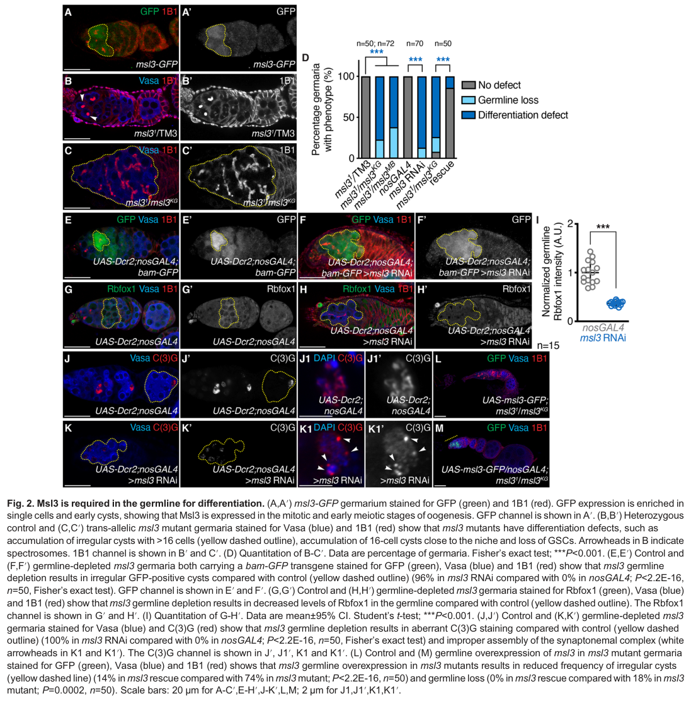

## Question

# Gene Research for Functional Annotation

## ⚠️ CRITICAL: Gene/Protein Identification Context

**BEFORE YOU BEGIN RESEARCH:** You MUST verify you are researching the CORRECT gene/protein. Gene symbols can be ambiguous, especially for less well-characterized genes from non-model organisms.

### Target Gene/Protein Identity (from UniProt):
- **UniProt Accession:** P50536
- **Protein Description:** RecName: Full=Protein male-specific lethal-3 {ECO:0000303|PubMed:7768187};
- **Gene Information:** Name=msl-3 {ECO:0000303|PubMed:7768187, ECO:0000312|FlyBase:FBgn0002775}; ORFNames=CG8631 {ECO:0000312|FlyBase:FBgn0002775};
- **Organism (full):** Drosophila melanogaster (Fruit fly).
- **Protein Family:** Not specified in UniProt
- **Key Domains:** Chromo-like_dom_sf. (IPR016197); MRG. (IPR008676); MRG_C_sf. (IPR038217); MRG_dom. (IPR026541); MSL3_chromo-like. (IPR053820)

### MANDATORY VERIFICATION STEPS:

1. **Check if the gene symbol "msl-3" matches the protein description above**
2. **Verify the organism is correct:** Drosophila melanogaster (Fruit fly).
3. **Check if protein family/domains align with what you find in literature**
4. **If you find literature for a DIFFERENT gene with the same or similar symbol, STOP**

### If Gene Symbol is Ambiguous or You Cannot Find Relevant Literature:

**DO NOT PROCEED WITH RESEARCH ON A DIFFERENT GENE.** Instead:
- State clearly: "The gene symbol 'msl-3' is ambiguous or literature is limited for this specific protein"
- Explain what you found (e.g., "Found extensive literature on a different gene with the same symbol in a different organism")
- Describe the protein based ONLY on the UniProt information provided above
- Suggest that the protein function can be inferred from domain/family information

### Research Target:

Please provide a comprehensive research report on the gene **msl-3** (gene ID: msl-3, UniProt: P50536) in DROME.

The research report should be a detailed narrative explaining the function, biological processes, and localization of the gene product. Citations should be given for all claims.

You should prioritize authoritative reviews and primary scientific literature when conducting research. You can supplement
this with annotations you find in gene/protein databases, but these can be outdated or inaccurate.

We are specifically interested in the primary function of the gene - for enzymes, what reaction is catalyzed, and what is the substrate specificity? For transporters, what is the substrate? For structural proteins or adapters, what is the broader structural role? For signaling molecules, what is the role in the pathway.

We are interested in where in or outside the cell the gene product carries out its function.

We are also interested in the signaling or biochemical pathways in which the gene functions. We are less interested in broad pleiotropic effects, except where these elucidate the precise role.

Include evidence where possible. We are interested in both experimental evidence as well as inference from structure, evolution, or bioinformatic analysis. Precise studies should be prioritized over high-throughput, where available.

## Output

Question: You are an expert researcher providing comprehensive, well-cited information.

Provide detailed information focusing on:
1. Key concepts and definitions with current understanding
2. Recent developments and latest research (prioritize 2023-2024 sources)
3. Current applications and real-world implementations
4. Expert opinions and analysis from authoritative sources
5. Relevant statistics and data from recent studies

Format as a comprehensive research report with proper citations. Include URLs and publication dates where available.
Always prioritize recent, authoritative sources and provide specific citations for all major claims.

# Gene Research for Functional Annotation

## ⚠️ CRITICAL: Gene/Protein Identification Context

**BEFORE YOU BEGIN RESEARCH:** You MUST verify you are researching the CORRECT gene/protein. Gene symbols can be ambiguous, especially for less well-characterized genes from non-model organisms.

### Target Gene/Protein Identity (from UniProt):
- **UniProt Accession:** P50536
- **Protein Description:** RecName: Full=Protein male-specific lethal-3 {ECO:0000303|PubMed:7768187};
- **Gene Information:** Name=msl-3 {ECO:0000303|PubMed:7768187, ECO:0000312|FlyBase:FBgn0002775}; ORFNames=CG8631 {ECO:0000312|FlyBase:FBgn0002775};
- **Organism (full):** Drosophila melanogaster (Fruit fly).
- **Protein Family:** Not specified in UniProt
- **Key Domains:** Chromo-like_dom_sf. (IPR016197); MRG. (IPR008676); MRG_C_sf. (IPR038217); MRG_dom. (IPR026541); MSL3_chromo-like. (IPR053820)

### MANDATORY VERIFICATION STEPS:

1. **Check if the gene symbol "msl-3" matches the protein description above**
2. **Verify the organism is correct:** Drosophila melanogaster (Fruit fly).
3. **Check if protein family/domains align with what you find in literature**
4. **If you find literature for a DIFFERENT gene with the same or similar symbol, STOP**

### If Gene Symbol is Ambiguous or You Cannot Find Relevant Literature:

**DO NOT PROCEED WITH RESEARCH ON A DIFFERENT GENE.** Instead:
- State clearly: "The gene symbol 'msl-3' is ambiguous or literature is limited for this specific protein"
- Explain what you found (e.g., "Found extensive literature on a different gene with the same symbol in a different organism")
- Describe the protein based ONLY on the UniProt information provided above
- Suggest that the protein function can be inferred from domain/family information

### Research Target:

Please provide a comprehensive research report on the gene **msl-3** (gene ID: msl-3, UniProt: P50536) in DROME.

The research report should be a detailed narrative explaining the function, biological processes, and localization of the gene product. Citations should be given for all claims.

You should prioritize authoritative reviews and primary scientific literature when conducting research. You can supplement
this with annotations you find in gene/protein databases, but these can be outdated or inaccurate.

We are specifically interested in the primary function of the gene - for enzymes, what reaction is catalyzed, and what is the substrate specificity? For transporters, what is the substrate? For structural proteins or adapters, what is the broader structural role? For signaling molecules, what is the role in the pathway.

We are interested in where in or outside the cell the gene product carries out its function.

We are also interested in the signaling or biochemical pathways in which the gene functions. We are less interested in broad pleiotropic effects, except where these elucidate the precise role.

Include evidence where possible. We are interested in both experimental evidence as well as inference from structure, evolution, or bioinformatic analysis. Precise studies should be prioritized over high-throughput, where available.

# Functional annotation report: *Drosophila melanogaster msl-3* (UniProt P50536)

## Identity and principal function

**Identity check.** The specified UniProt accession P50536 and gene designation *msl-3* (CG8631; FlyBase FBgn0002775) identify **male-specific lethal 3 in *Drosophila melanogaster***. Fly studies describe the corresponding protein as an approximately 513-residue MSL3 with an N-terminal chromo-like/chromo-barrel domain and a C-terminal MRG domain, consistent with the supplied InterPro annotations. This report concerns that fly protein, not mammalian MSL3 or the related fly protein MRG15. The accession and CG number are supplied by the UniProt identity in the question; the cited experimental papers independently support the species, gene name, and domain architecture. (buscaino2006x‐chromosometargetingand pages 2-3, buscaino2006x‐chromosometargetingand pages 1-2, morales2005themrgdomain pages 1-2)

**Primary molecular function.** MSL3 is a **noncatalytic chromatin-associated adaptor and reader** in the male-specific lethal (MSL), or dosage-compensation, ribonucleoprotein complex. Its principal established role is to help assemble and distribute this complex across active genes on the single male X chromosome and thereby enable increased X-linked transcription. MSL3 does **not** catalyze histone acetylation: the complex’s acetyltransferase, MOF, transfers an acetyl group to histone H4 lysine 16 (H4K16). MSL3 binds the MSL1 scaffold, supports MOF activity on nucleosomes, and contributes to chromatin targeting. The complex also contains MSL2, the MLE helicase, and roX1/roX2 long noncoding RNAs. Its output contributes to the approximately twofold expression increase needed to balance the male X against the two female X chromosomes; this does not mean MSL3 alone accounts for all X-chromosome upregulation. (morales2005themrgdomain pages 1-2, morales2005themrgdomain pages 4-5, salzler2024set2andh3k36 pages 1-5, tikhonova2024interactionofmle pages 1-2)

The following primary-study findings distinguish MSL3’s male-X and female-germline functions and the principal uncertainty about its chromatin ligand.

| Biological setting | Specific molecular role and localization | Strongest experimental observation | Primary publication |
|---|---|---|---|
| Male dosage-compensation complex | The C-terminal MRG domain binds the MSL1 scaffold, incorporating nuclear MSL3 into the male-X complex and enabling **MOF**, not MSL3, to acetylate nucleosomal H4. | Deleting MRG-region sequences abolished MSL1 interaction, MOF activation, and X-territory targeting. An N-terminally truncated MSL3 retaining the MRG domain restored X-territory H4K16ac in 68% of transfected cells after endogenous-MSL3 depletion. (morales2005themrgdomain pages 1-2, morales2005themrgdomain pages 5-7, morales2005themrgdomain pages 4-5) | Morales *et al.*, 1 July 2005, *Molecular and Cellular Biology*. [DOI](https://doi.org/10.1128/MCB.25.14.5947-5954.2005) |
| Male-X targeting and viability | The N-terminal chromo-like/chromo-barrel domain promotes targeting from chromatin-entry or high-affinity sites across active X-linked gene bodies; the C-terminal MRG region supports complex incorporation and X localization. | Chromodomain mutants retained entry-site binding but lost the full genomic distribution and preferential affinity for H3K36me3-containing nucleosomes. Deleting the chromo-barrel gave only 8.3% male rescue, whereas MRG-disrupting constructs gave 0%. (buscaino2006x‐chromosometargetingand pages 2-3, buscaino2006x‐chromosometargetingand pages 1-2, sural2008themsl3chromodomain pages 1-12) | Sural *et al.*, 30 November 2008, *Nature Structural & Molecular Biology*. [DOI](https://doi.org/10.1038/nsmb.1520); Buscaino *et al.*, 10 March 2006, *EMBO Reports*. [DOI](https://doi.org/10.1038/sj.embor.7400658) |
| Chromatin-ligand biochemistry | The *Drosophila* chromo-barrel binds methylated histone-tail peptides, with an in-vitro preference for H4K20me1/2 over H3K36me3. This is reader/adaptor activity, not catalysis. | Fly-domain SPR dissociation constants were approximately 1.00 mM for H4K20me1, 0.98 mM for H4K20me2, and 9.4 mM for H3K36me3. The corresponding aromatic-cage mutation reduced male rescue from 83.8% to 31.9%. The reported 2.5-angstrom crystal structure was **human MSL3**, not fly MSL3. (moore2010structuralandbiochemical pages 1-2, moore2010structuralandbiochemical pages 9-10) | Moore *et al.*, 24 December 2010, *Journal of Biological Chemistry*. [DOI](https://doi.org/10.1074/jbc.M110.134312) |
| Multivalent nucleosome recognition | Chromodomain recognition can integrate DNA and histone-tail state: DNA facilitates H4K20me1 recognition, whereas nearby H4K16 acetylation antagonizes binding, potentially limiting or redirecting propagation after MOF activity. | A ternary structure showed the DNA minor groove accommodating the H4 tail while H4K20me1 occupied the MSL3 aromatic cage; biochemical assays found that H4K16ac antagonized this interaction. (mcelroy2014arewethere pages 3-4, kiss2024rnamodulationof pages 118-120) | Kim *et al.*, 25 July 2010, *Nature Structural & Molecular Biology*. [DOI](https://doi.org/10.1038/nsmb.1856) |
| Female ovary, mitotic and early-meiotic germline | Msl3-GFP localizes to germline stem-cell daughters and early cysts. Independently of the male MSL complex, Msl3 acts with Set2 and ATAC to promote transcription of synaptonemal-complex genes and **RpS19b**, thereby supporting Rbfox1 translation and differentiation. | Germline depletion produced abnormal cysts in 96% of germaria versus 0% of controls; germline Msl3 reduced the mutant defect from 74% to 14%. RpS19b restored egg-chamber formation from 16% to 98% but not synaptonemal-complex organization or fertility, separating differentiation from meiotic-recombination functions. (mccarthy2022msl3promotesgermline pages 4-5, mccarthy2022msl3promotesgermline pages 1-2, mccarthy2022msl3promotesgermline pages 3-4, mccarthy2022msl3promotesgermline pages 5-7, mccarthy2022msl3promotesgermline pages 7-10, mccarthy2022msl3promotesgermline media b2fd7346) | McCarthy *et al.*, 5 January 2022, *Development*. [DOI](https://doi.org/10.1242/dev.199625) |
| Current reassessment of male-X spreading | MSL3 remains a gene-body targeting factor, but H3K36me3 should not be described as its universally essential physiological ligand. Set2/H3K36 effects appear indirect, sex-common, and dependent on tissue and developmental context. | Combined H3.2K36R/H3.3K36R mutants showed neither consistent male-X downregulation nor correlation with MSL3 binding; Set2-loss effects near high-affinity sites resembled an initiation defect rather than defective MSL3-mediated spreading. (salzler2024set2andh3k36 pages 1-5, salzler2024set2andh3k36 pages 11-14, salzler2024set2andh3k36 pages 30-33) | Salzler *et al.*, 22 October 2024, *Genetics*. [DOI](https://doi.org/10.1093/genetics/iyae168) |

*Table: Primary evidence defining Drosophila MSL3 as a nuclear chromatin reader and noncatalytic MSL-complex adaptor, with a separate role in female germline differentiation. The table also highlights the current uncertainty over H3K36me3 as an essential physiological targeting ligand.*

## Mechanism and site of action

**Complex incorporation and acetylation.** MSL3 acts on **nuclear chromatin**, particularly the territory and transcribed gene bodies of the male X chromosome. Its C-terminal MRG region interacts with the C terminus of MSL1. In reconstituted reactions containing nucleosomes, acetyl-CoA, MSL1, and MOF, intact MSL3 promotes MOF-dependent acetylation of nucleosomal H4; MRG-disrupting deletions abolish MSL1 binding and this stimulation. In male cells, MSL1-binding-deficient MSL3 also fails to accumulate on the X-chromosomal territory. These experiments identify MSL3 chiefly as a structural and regulatory partner that positions and enables an enzyme, **not** as the enzyme itself. (morales2005themrgdomain pages 3-4, morales2005themrgdomain pages 1-2, morales2005themrgdomain pages 4-5)

MSL3’s N-terminal region binds nucleic acids in vitro, with a preference for RNA over double-stranded DNA in the tested competition assay; that result does not establish sequence-specific recognition of roX RNA. An MRG-containing truncation lacking the N-terminal chromo-related and measured nucleic-acid-binding region nevertheless supported X-territory H4K16 acetylation in **68%** of transfected cells after depletion of endogenous MSL3, versus **12.5%** of untransfected depleted cells retaining an acetylated territory. Thus, direct N-terminal nucleic-acid binding is not obligatory for *initial* complex recruitment or detectable territory acetylation under those conditions, even though N-terminal functions matter for full compensation in whole flies. (morales2005themrgdomain pages 3-4, morales2005themrgdomain pages 5-7, morales2005themrgdomain pages 4-5)

**Chromosome recognition versus gene-body distribution.** Initial recognition of X-linked high-affinity sites is associated primarily with the MSL1–MSL2 targeting core and its cofactors. MSL3 is especially important for the subsequent broad association with active X-linked genes, whose MSL occupancy is concentrated toward gene bodies and their 3′ portions rather than promoters. In chromodomain-mutant experiments, initial chromatin-entry-site binding persisted but the full X-linked distribution was impaired; mutant complexes also lost preferential in-vitro affinity for H3K36me3-containing nucleosomes. This is strong evidence that MSL3’s chromo-like domain contributes to chromatin engagement **after** initial targeting, but not proof that any one methyl mark is its indispensable in-vivo ligand. (gelbart2009drosophiladosagecompensation pages 3-4, sural2008themsl3chromodomain pages 1-12)

Domain-dissection assays support a useful distinction: deleting the chromo-barrel markedly impaired male viability and dosage compensation, whereas removing the MRG region prevented proper X targeting despite retained nuclear localization. The precise phenotype depends on the construct and assay: partial X-territory acetylation after cell-culture expression of an N-terminal truncation is not equivalent to restoration of normal male survival or chromosome-wide transcription. (buscaino2006x‐chromosometargetingand pages 2-3, buscaino2006x‐chromosometargetingand pages 1-2, morales2005themrgdomain pages 5-7)

**What does the chromo-like domain recognize?** The evidence is substrate- and assay-dependent. Experiments with fly MSL3 reported preferential binding to H3K36me3-containing **nucleosomes**, which originally supported a model in which Set2-marked active genes attract the complex. Separately, surface-plasmon-resonance assays with the isolated *fly* chromo-barrel found stronger binding to **H4K20me1/me2 peptides** than to H3K36me3 peptides; at 250 mM NaCl, the reported dissociation constants were approximately **1.00 mM**, **0.98 mM**, and **9.4 mM**, respectively. These are weak interactions measured with isolated domains and peptides, not direct rankings of ligand importance in intact fly chromatin. A complementary structure/biochemistry study identified DNA-assisted recognition of H4K20me1 and antagonism by nearby H4K16 acetylation. Crucially, the 2.5-Å crystal structure reported by Moore and colleagues was of **human** MSL3; its fly-specific evidence consisted of binding and fly-genetic experiments, so that human structure should not be presented as a crystal structure of P50536. (sural2008themsl3chromodomain pages 1-12, moore2010structuralandbiochemical pages 1-2, moore2010structuralandbiochemical pages 9-10)

**The important 2024 revision.** A direct methyl-mark-to-spreading model is now contested. Earlier fly genetics found that Set2 loss reduced MSL recruitment at a subset of X-linked genes, while a 2021 histone-replacement study found that Set2’s effect on dosage compensation was **not** reproduced by replacing canonical histone H3K36. In a 2024 *Genetics* study, combined H3.2K36R/H3.3K36R mutants showed neither consistent loss of X-linked expression nor an expression change correlated with MSL3 occupancy, unlike H4K16R controls. Some Set2-associated expression effects occurred in females as well as males; their relationship to high-affinity-site distance did not resemble a simple failure of MSL3-dependent spreading. The supported annotation is therefore **chromatin reader involved in targeting**, with **H3K36me3-nucleosome and H4K20-methylated-tail interactions demonstrated in particular assays**, rather than “obligate H3K36me3 reader for all male-X spreading.” Tissue and developmental context, other Set2 targets, and alternative methylation states remain plausible contributors. (salzler2024set2andh3k36 pages 1-5, salzler2024set2andh3k36 pages 11-14, lindehell2021theroleof pages 1-2, lindehell2021theroleof pages 4-6)

A separate 2024 fly study showed that disrupting an MLE–CLAMP interaction decreased association of MSL proteins with the male X and increased male lethality. This refines the **complex-level** recruitment pathway; it does not establish CLAMP as a direct MSL3 ligand. (tikhonova2024interactionofmle pages 1-2, tikhonova2024interactionofmle pages 4-5)

## Additional, experimentally established function in females

The name “male-specific lethal” does **not** imply that the protein acts only in males. Endogenously tagged Msl3 was observed in single germline cells and early cysts in the female ovarian germarium. There, Msl3 is required for differentiation toward an oocyte and acts **independently of the canonical male MSL complex**: *msl2* and *roX* expression is very low in the studied female tissue, and disrupting other tested MSL components did not reproduce the early-oogenesis phenotype. The evidence establishes expression in those germline cells and a transcription-related role; it does not map a unique subnuclear compartment for every female-germline action. (mccarthy2022msl3promotesgermline pages 1-2, mccarthy2022msl3promotesgermline pages 3-4, mccarthy2022msl3promotesgermline media b2fd7346)

Genetic interaction and knockdown experiments place Msl3 with the Set2–H3K36me3 and Ada2a-containing **ATAC** acetyltransferase pathways. This association is supported by genetics and transcriptional measurements, rather than proof that Msl3 itself acetylates histones or that a stable Msl3–ATAC complex has been isolated. The pathway promotes transcription of the germline-enriched ribosomal-protein paralog *RpS19b* and several synaptonemal-complex genes, including *ord*, *sunn*, and *cona*. Reduced RpS19b lowers translation of the meiotic-entry regulator Rbfox1: Rbfox1 protein and polysome-associated mRNA decline while its total mRNA is not correspondingly lost. Restoring RpS19b rescues early cyst differentiation and egg-chamber formation, but **does not** restore proper synaptonemal-complex organization or fertility. Thus, Msl3 contributes to at least two experimentally separable transcriptional outputs in female germ cells, rather than simply extending the male-X mechanism to females. (mccarthy2022msl3promotesgermline pages 4-5, mccarthy2022msl3promotesgermline pages 3-4, mccarthy2022msl3promotesgermline pages 5-7, mccarthy2022msl3promotesgermline pages 7-10)

The strength of that conclusion is illustrated by the fly genetics: germline *msl3* depletion produced irregular differentiating cysts in **96%** of examined germaria versus **0%** of controls (*n*=50 per condition). Germline restoration of Msl3 reduced the irregular-cyst frequency from **74% to 14%** in the reported mutant comparison; RpS19b restoration increased egg-chamber formation from **16% to 98%** in its corresponding comparison, without rescuing the meiotic organization defect. These percentages are specific to their respective experimental genotypes, not estimates of effects in an unperturbed population. (mccarthy2022msl3promotesgermline pages 3-4, mccarthy2022msl3promotesgermline pages 5-7, mccarthy2022msl3promotesgermline pages 7-10, mccarthy2022msl3promotesgermline media b2fd7346)

## Research use and overall annotation

**Current application** is chiefly as an experimental model of chromosome-selective chromatin targeting, histone-tail recognition, dosage compensation, and the distinction between gene-body targeting and catalytic chromatin modification. Fly alleles, tagged proteins, cultured male cells, chromatin-occupancy assays, and female-germline rescue experiments provide complementary readouts. These are research implementations, **not an established clinical use** of fly MSL3; phenotypes of mammalian homologs must be evaluated separately. (mccarthy2022msl3promotesgermline pages 3-4, moore2010structuralandbiochemical pages 1-2, morales2005themrgdomain pages 4-5, moore2010structuralandbiochemical pages 9-10)

**Recommended functional annotation:** *A nuclear, chromatin-associated MRG-domain adaptor and chromo-like-domain reader. In male Drosophila, MSL3 couples MSL1/MOF complex assembly and nucleosomal H4K16 acetylation to effective distribution of the MSL dosage-compensation complex across active X-linked genes. In the female germline it additionally promotes Set2/ATAC-associated transcriptional programs required for cyst differentiation and meiotic gene expression, independently of the canonical male MSL complex.* Do not annotate MSL3 as the H4K16 acetyltransferase, or designate H3K36me3 as an unequivocally essential physiological binding substrate. (morales2005themrgdomain pages 1-2, mccarthy2022msl3promotesgermline pages 3-4, morales2005themrgdomain pages 4-5, mccarthy2022msl3promotesgermline pages 5-7, salzler2024set2andh3k36 pages 1-5)

### Selected primary sources and review

- Morales *et al.* **July 2005**. “The MRG domain mediates the functional integration of MSL3 into the dosage compensation complex.” *Molecular and Cellular Biology* 25:5947–5954. https://doi.org/10.1128/MCB.25.14.5947-5954.2005 (morales2005themrgdomain pages 1-2, morales2005themrgdomain pages 4-5)
- Buscaino *et al.* **May 2006**. “X-chromosome targeting and dosage compensation are mediated by distinct domains in MSL-3.” *EMBO Reports* 7:531–538. https://doi.org/10.1038/sj.embor.7400658 (buscaino2006x‐chromosometargetingand pages 2-3, buscaino2006x‐chromosometargetingand pages 1-2)
- Sural *et al.* **2008**. “The MSL3 chromodomain directs a key targeting step for dosage compensation of the Drosophila X chromosome.” *Nature Structural & Molecular Biology* 15:1318–1325. https://doi.org/10.1038/nsmb.1520 (sural2008themsl3chromodomain pages 1-12)
- Moore *et al.* **December 2010**. “Structural and biochemical studies on the chromo-barrel domain of male specific lethal 3.” *Journal of Biological Chemistry* 285:40879–40890. https://doi.org/10.1074/jbc.M110.134312 (moore2010structuralandbiochemical pages 1-2, moore2010structuralandbiochemical pages 9-10)
- McCarthy *et al.* **January 2022**. “Msl3 promotes germline stem cell differentiation in female Drosophila.” *Development* 149:dev199625. https://doi.org/10.1242/dev.199625 (mccarthy2022msl3promotesgermline pages 1-2, mccarthy2022msl3promotesgermline pages 3-4, mccarthy2022msl3promotesgermline pages 7-10)
- Salzler *et al.* **October 2024**. “Set2 and H3K36 regulate the Drosophila male X chromosome in a context-specific manner, independent from MSL complex spreading.” *Genetics*. https://doi.org/10.1093/genetics/iyae168 (salzler2024set2andh3k36 pages 30-33, salzler2024set2andh3k36 pages 1-5)
- Gelbart and Kuroda. **May 2009**. “Drosophila dosage compensation: a complex voyage to the X chromosome.” *Development* 136:1399–1410. https://doi.org/10.1242/dev.029645 — mechanistic review providing context for the primary studies. (gelbart2009drosophiladosagecompensation pages 3-4)

References

1. (buscaino2006x‐chromosometargetingand pages 2-3): Alessia Buscaino, Gaëlle Legube, and Asifa Akhtar. X‐chromosome targeting and dosage compensation are mediated by distinct domains in msl‐3. EMBO reports, 7:531-538, May 2006. URL: https://doi.org/10.1038/sj.embor.7400658, doi:10.1038/sj.embor.7400658. This article has 54 citations and is from a highest quality peer-reviewed journal.

2. (buscaino2006x‐chromosometargetingand pages 1-2): Alessia Buscaino, Gaëlle Legube, and Asifa Akhtar. X‐chromosome targeting and dosage compensation are mediated by distinct domains in msl‐3. EMBO reports, 7:531-538, May 2006. URL: https://doi.org/10.1038/sj.embor.7400658, doi:10.1038/sj.embor.7400658. This article has 54 citations and is from a highest quality peer-reviewed journal.

3. (morales2005themrgdomain pages 1-2): Violette Morales, Catherine Regnard, Annalisa Izzo, Irene Vetter, and Peter B. Becker. The mrg domain mediates the functional integration of msl3 into the dosage compensation complex. Molecular and Cellular Biology, 25:5947-5954, Jul 2005. URL: https://doi.org/10.1128/mcb.25.14.5947-5954.2005, doi:10.1128/mcb.25.14.5947-5954.2005. This article has 70 citations and is from a domain leading peer-reviewed journal.

4. (morales2005themrgdomain pages 4-5): Violette Morales, Catherine Regnard, Annalisa Izzo, Irene Vetter, and Peter B. Becker. The mrg domain mediates the functional integration of msl3 into the dosage compensation complex. Molecular and Cellular Biology, 25:5947-5954, Jul 2005. URL: https://doi.org/10.1128/mcb.25.14.5947-5954.2005, doi:10.1128/mcb.25.14.5947-5954.2005. This article has 70 citations and is from a domain leading peer-reviewed journal.

5. (salzler2024set2andh3k36 pages 1-5): Harmony R Salzler, Vasudha Vandadi, Julia R Sallean, and A Gregory Matera. Set2 and h3k36 regulate the drosophila male x chromosome in a context-specific manner, independent from msl complex spreading. Genetics, Oct 2024. URL: https://doi.org/10.1093/genetics/iyae168, doi:10.1093/genetics/iyae168. This article has 3 citations and is from a domain leading peer-reviewed journal.

6. (tikhonova2024interactionofmle pages 1-2): Evgeniya Tikhonova, Anastasia Revel-Muroz, Pavel Georgiev, and Oksana Maksimenko. Interaction of mle with clamp zinc finger is involved in proper msl proteins binding to chromosomes in drosophila. Open Biology, Mar 2024. URL: https://doi.org/10.1098/rsob.230270, doi:10.1098/rsob.230270. This article has 8 citations and is from a peer-reviewed journal.

7. (morales2005themrgdomain pages 5-7): Violette Morales, Catherine Regnard, Annalisa Izzo, Irene Vetter, and Peter B. Becker. The mrg domain mediates the functional integration of msl3 into the dosage compensation complex. Molecular and Cellular Biology, 25:5947-5954, Jul 2005. URL: https://doi.org/10.1128/mcb.25.14.5947-5954.2005, doi:10.1128/mcb.25.14.5947-5954.2005. This article has 70 citations and is from a domain leading peer-reviewed journal.

8. (sural2008themsl3chromodomain pages 1-12): Tuba H Sural, Shouyong Peng, Bing Li, Jerry L Workman, Peter J Park, and Mitzi I Kuroda. The msl3 chromodomain directs a key targeting step for dosage compensation of the drosophila x chromosome. Nature structural & molecular biology, 15:1318-1325, Nov 2008. URL: https://doi.org/10.1038/nsmb.1520, doi:10.1038/nsmb.1520. This article has 152 citations and is from a highest quality peer-reviewed journal.

9. (moore2010structuralandbiochemical pages 1-2): Stanley A. Moore, Yurdagul Ferhatoglu, Yunhua Jia, Rami A. Al-Jiab, and Maxwell J. Scott. Structural and biochemical studies on the chromo-barrel domain of male specific lethal 3 (msl3) reveal a binding preference for mono- or dimethyllysine 20 on histone h4. Journal of Biological Chemistry, 285:40879-40890, Dec 2010. URL: https://doi.org/10.1074/jbc.m110.134312, doi:10.1074/jbc.m110.134312. This article has 57 citations and is from a domain leading peer-reviewed journal.

10. (moore2010structuralandbiochemical pages 9-10): Stanley A. Moore, Yurdagul Ferhatoglu, Yunhua Jia, Rami A. Al-Jiab, and Maxwell J. Scott. Structural and biochemical studies on the chromo-barrel domain of male specific lethal 3 (msl3) reveal a binding preference for mono- or dimethyllysine 20 on histone h4. Journal of Biological Chemistry, 285:40879-40890, Dec 2010. URL: https://doi.org/10.1074/jbc.m110.134312, doi:10.1074/jbc.m110.134312. This article has 57 citations and is from a domain leading peer-reviewed journal.

11. (mcelroy2014arewethere pages 3-4): Kyle A. McElroy, Hyuckjoon Kang, and Mitzi I. Kuroda. Are we there yet? initial targeting of the male-specific lethal and polycomb group chromatin complexes in drosophila. Open Biology, 4:140006, Mar 2014. URL: https://doi.org/10.1098/rsob.140006, doi:10.1098/rsob.140006. This article has 19 citations and is from a peer-reviewed journal.

12. (kiss2024rnamodulationof pages 118-120): Anna Elisabeth Kiss. Rna modulation of structure and function of the drosophila msl complex in vitro. Dissertation, Jan 2024. URL: https://doi.org/10.5282/edoc.34194, doi:10.5282/edoc.34194. This article has 0 citations.

13. (mccarthy2022msl3promotesgermline pages 4-5): Alicia McCarthy, Kahini Sarkar, Elliot T. Martin, Maitreyi Upadhyay, Seoyeon Jang, Nathan D. Williams, Paolo E. Forni, Michael Buszczak, and Prashanth Rangan. Msl3 promotes germline stem cell differentiation in female <i>drosophila</i>. Development, Jan 2022. URL: https://doi.org/10.1242/dev.199625, doi:10.1242/dev.199625. This article has 32 citations and is from a domain leading peer-reviewed journal.

14. (mccarthy2022msl3promotesgermline pages 1-2): Alicia McCarthy, Kahini Sarkar, Elliot T. Martin, Maitreyi Upadhyay, Seoyeon Jang, Nathan D. Williams, Paolo E. Forni, Michael Buszczak, and Prashanth Rangan. Msl3 promotes germline stem cell differentiation in female <i>drosophila</i>. Development, Jan 2022. URL: https://doi.org/10.1242/dev.199625, doi:10.1242/dev.199625. This article has 32 citations and is from a domain leading peer-reviewed journal.

15. (mccarthy2022msl3promotesgermline pages 3-4): Alicia McCarthy, Kahini Sarkar, Elliot T. Martin, Maitreyi Upadhyay, Seoyeon Jang, Nathan D. Williams, Paolo E. Forni, Michael Buszczak, and Prashanth Rangan. Msl3 promotes germline stem cell differentiation in female <i>drosophila</i>. Development, Jan 2022. URL: https://doi.org/10.1242/dev.199625, doi:10.1242/dev.199625. This article has 32 citations and is from a domain leading peer-reviewed journal.

16. (mccarthy2022msl3promotesgermline pages 5-7): Alicia McCarthy, Kahini Sarkar, Elliot T. Martin, Maitreyi Upadhyay, Seoyeon Jang, Nathan D. Williams, Paolo E. Forni, Michael Buszczak, and Prashanth Rangan. Msl3 promotes germline stem cell differentiation in female <i>drosophila</i>. Development, Jan 2022. URL: https://doi.org/10.1242/dev.199625, doi:10.1242/dev.199625. This article has 32 citations and is from a domain leading peer-reviewed journal.

17. (mccarthy2022msl3promotesgermline pages 7-10): Alicia McCarthy, Kahini Sarkar, Elliot T. Martin, Maitreyi Upadhyay, Seoyeon Jang, Nathan D. Williams, Paolo E. Forni, Michael Buszczak, and Prashanth Rangan. Msl3 promotes germline stem cell differentiation in female <i>drosophila</i>. Development, Jan 2022. URL: https://doi.org/10.1242/dev.199625, doi:10.1242/dev.199625. This article has 32 citations and is from a domain leading peer-reviewed journal.

18. (mccarthy2022msl3promotesgermline media b2fd7346): Alicia McCarthy, Kahini Sarkar, Elliot T. Martin, Maitreyi Upadhyay, Seoyeon Jang, Nathan D. Williams, Paolo E. Forni, Michael Buszczak, and Prashanth Rangan. Msl3 promotes germline stem cell differentiation in female <i>drosophila</i>. Development, Jan 2022. URL: https://doi.org/10.1242/dev.199625, doi:10.1242/dev.199625. This article has 32 citations and is from a domain leading peer-reviewed journal.

19. (salzler2024set2andh3k36 pages 11-14): Harmony R Salzler, Vasudha Vandadi, Julia R Sallean, and A Gregory Matera. Set2 and h3k36 regulate the drosophila male x chromosome in a context-specific manner, independent from msl complex spreading. Genetics, Oct 2024. URL: https://doi.org/10.1093/genetics/iyae168, doi:10.1093/genetics/iyae168. This article has 3 citations and is from a domain leading peer-reviewed journal.

20. (salzler2024set2andh3k36 pages 30-33): Harmony R Salzler, Vasudha Vandadi, Julia R Sallean, and A Gregory Matera. Set2 and h3k36 regulate the drosophila male x chromosome in a context-specific manner, independent from msl complex spreading. Genetics, Oct 2024. URL: https://doi.org/10.1093/genetics/iyae168, doi:10.1093/genetics/iyae168. This article has 3 citations and is from a domain leading peer-reviewed journal.

21. (morales2005themrgdomain pages 3-4): Violette Morales, Catherine Regnard, Annalisa Izzo, Irene Vetter, and Peter B. Becker. The mrg domain mediates the functional integration of msl3 into the dosage compensation complex. Molecular and Cellular Biology, 25:5947-5954, Jul 2005. URL: https://doi.org/10.1128/mcb.25.14.5947-5954.2005, doi:10.1128/mcb.25.14.5947-5954.2005. This article has 70 citations and is from a domain leading peer-reviewed journal.

22. (gelbart2009drosophiladosagecompensation pages 3-4): Marnie E. Gelbart and Mitzi I. Kuroda. Drosophila dosage compensation: a complex voyage to the x chromosome. Development, 136:1399-1410, May 2009. URL: https://doi.org/10.1242/dev.029645, doi:10.1242/dev.029645. This article has 311 citations and is from a domain leading peer-reviewed journal.

23. (lindehell2021theroleof pages 1-2): Henrik Lindehell, Alexander Glotov, Eshagh Dorafshan, Yuri B. Schwartz, and Jan Larsson. The role of h3k36 methylation and associated methyltransferases in chromosome-specific gene regulation. Science Advances, Oct 2021. URL: https://doi.org/10.1126/sciadv.abh4390, doi:10.1126/sciadv.abh4390. This article has 18 citations and is from a highest quality peer-reviewed journal.

24. (lindehell2021theroleof pages 4-6): Henrik Lindehell, Alexander Glotov, Eshagh Dorafshan, Yuri B. Schwartz, and Jan Larsson. The role of h3k36 methylation and associated methyltransferases in chromosome-specific gene regulation. Science Advances, Oct 2021. URL: https://doi.org/10.1126/sciadv.abh4390, doi:10.1126/sciadv.abh4390. This article has 18 citations and is from a highest quality peer-reviewed journal.

25. (tikhonova2024interactionofmle pages 4-5): Evgeniya Tikhonova, Anastasia Revel-Muroz, Pavel Georgiev, and Oksana Maksimenko. Interaction of mle with clamp zinc finger is involved in proper msl proteins binding to chromosomes in drosophila. Open Biology, Mar 2024. URL: https://doi.org/10.1098/rsob.230270, doi:10.1098/rsob.230270. This article has 8 citations and is from a peer-reviewed journal.

## Artifacts

- [Edison artifact artifact-00](msl-3-deep-research-falcon_artifacts/artifact-00.md)

## Citations

1. gelbart2009drosophiladosagecompensation pages 3-4
2. morales2005themrgdomain pages 1-2
3. morales2005themrgdomain pages 4-5
4. tikhonova2024interactionofmle pages 1-2
5. morales2005themrgdomain pages 5-7
6. moore2010structuralandbiochemical pages 1-2
7. moore2010structuralandbiochemical pages 9-10
8. mcelroy2014arewethere pages 3-4
9. kiss2024rnamodulationof pages 118-120
10. morales2005themrgdomain pages 3-4
11. lindehell2021theroleof pages 1-2
12. lindehell2021theroleof pages 4-6
13. tikhonova2024interactionofmle pages 4-5
14. DOI
15. https://doi.org/10.1128/MCB.25.14.5947-5954.2005
16. https://doi.org/10.1038/nsmb.1520
17. https://doi.org/10.1038/sj.embor.7400658
18. https://doi.org/10.1074/jbc.M110.134312
19. https://doi.org/10.1038/nsmb.1856
20. https://doi.org/10.1242/dev.199625
21. https://doi.org/10.1093/genetics/iyae168
22. https://doi.org/10.1242/dev.029645
23. https://doi.org/10.1038/sj.embor.7400658,
24. https://doi.org/10.1128/mcb.25.14.5947-5954.2005,
25. https://doi.org/10.1093/genetics/iyae168,
26. https://doi.org/10.1098/rsob.230270,
27. https://doi.org/10.1038/nsmb.1520,
28. https://doi.org/10.1074/jbc.m110.134312,
29. https://doi.org/10.1098/rsob.140006,
30. https://doi.org/10.5282/edoc.34194,
31. https://doi.org/10.1242/dev.199625,
32. https://doi.org/10.1242/dev.029645,
33. https://doi.org/10.1126/sciadv.abh4390,