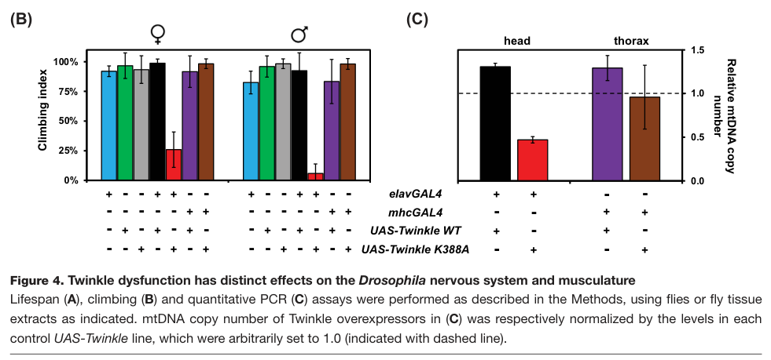

## Question

# Gene Research for Functional Annotation

## ⚠️ CRITICAL: Gene/Protein Identification Context

**BEFORE YOU BEGIN RESEARCH:** You MUST verify you are researching the CORRECT gene/protein. Gene symbols can be ambiguous, especially for less well-characterized genes from non-model organisms.

### Target Gene/Protein Identity (from UniProt):
- **UniProt Accession:** Q9VL76
- **Protein Description:** RecName: Full=Mitochondrial DNA helicase {ECO:0000312|FlyBase:FBgn0032154}; EC=5.6.2.3 {ECO:0000250|UniProtKB:Q96RR1}; AltName: Full=Twinkle mtDNA helicase {ECO:0000305}; AltName: Full=Twinkle protein, mitochondrial {ECO:0000305}; Flags: Precursor;
- **Gene Information:** Name=mtDNA-helicase {ECO:0000312|FlyBase:FBgn0032154}; Synonyms=Twinkle {ECO:0000303|PubMed:17272269, ECO:0000312|FlyBase:FBgn0032154}; ORFNames=CG5924 {ECO:0000312|FlyBase:FBgn0032154};
- **Organism (full):** Drosophila melanogaster (Fruit fly).
- **Protein Family:** Not specified in UniProt
- **Key Domains:** DNA_helicase_DnaB-like_C. (IPR007694); P-loop_NTPase. (IPR027417); Twinkle-like. (IPR027032); AAA_25 (PF13481)

### MANDATORY VERIFICATION STEPS:

1. **Check if the gene symbol "mtDNA-helicase" matches the protein description above**
2. **Verify the organism is correct:** Drosophila melanogaster (Fruit fly).
3. **Check if protein family/domains align with what you find in literature**
4. **If you find literature for a DIFFERENT gene with the same or similar symbol, STOP**

### If Gene Symbol is Ambiguous or You Cannot Find Relevant Literature:

**DO NOT PROCEED WITH RESEARCH ON A DIFFERENT GENE.** Instead:
- State clearly: "The gene symbol 'mtDNA-helicase' is ambiguous or literature is limited for this specific protein"
- Explain what you found (e.g., "Found extensive literature on a different gene with the same symbol in a different organism")
- Describe the protein based ONLY on the UniProt information provided above
- Suggest that the protein function can be inferred from domain/family information

### Research Target:

Please provide a comprehensive research report on the gene **mtDNA-helicase** (gene ID: mtDNA-helicase, UniProt: Q9VL76) in DROME.

The research report should be a detailed narrative explaining the function, biological processes, and localization of the gene product. Citations should be given for all claims.

You should prioritize authoritative reviews and primary scientific literature when conducting research. You can supplement
this with annotations you find in gene/protein databases, but these can be outdated or inaccurate.

We are specifically interested in the primary function of the gene - for enzymes, what reaction is catalyzed, and what is the substrate specificity? For transporters, what is the substrate? For structural proteins or adapters, what is the broader structural role? For signaling molecules, what is the role in the pathway.

We are interested in where in or outside the cell the gene product carries out its function.

We are also interested in the signaling or biochemical pathways in which the gene functions. We are less interested in broad pleiotropic effects, except where these elucidate the precise role.

Include evidence where possible. We are interested in both experimental evidence as well as inference from structure, evolution, or bioinformatic analysis. Precise studies should be prioritized over high-throughput, where available.

## Output

Question: You are an expert researcher providing comprehensive, well-cited information.

Provide detailed information focusing on:
1. Key concepts and definitions with current understanding
2. Recent developments and latest research (prioritize 2023-2024 sources)
3. Current applications and real-world implementations
4. Expert opinions and analysis from authoritative sources
5. Relevant statistics and data from recent studies

Format as a comprehensive research report with proper citations. Include URLs and publication dates where available.
Always prioritize recent, authoritative sources and provide specific citations for all major claims.

# Gene Research for Functional Annotation

## ⚠️ CRITICAL: Gene/Protein Identification Context

**BEFORE YOU BEGIN RESEARCH:** You MUST verify you are researching the CORRECT gene/protein. Gene symbols can be ambiguous, especially for less well-characterized genes from non-model organisms.

### Target Gene/Protein Identity (from UniProt):
- **UniProt Accession:** Q9VL76
- **Protein Description:** RecName: Full=Mitochondrial DNA helicase {ECO:0000312|FlyBase:FBgn0032154}; EC=5.6.2.3 {ECO:0000250|UniProtKB:Q96RR1}; AltName: Full=Twinkle mtDNA helicase {ECO:0000305}; AltName: Full=Twinkle protein, mitochondrial {ECO:0000305}; Flags: Precursor;
- **Gene Information:** Name=mtDNA-helicase {ECO:0000312|FlyBase:FBgn0032154}; Synonyms=Twinkle {ECO:0000303|PubMed:17272269, ECO:0000312|FlyBase:FBgn0032154}; ORFNames=CG5924 {ECO:0000312|FlyBase:FBgn0032154};
- **Organism (full):** Drosophila melanogaster (Fruit fly).
- **Protein Family:** Not specified in UniProt
- **Key Domains:** DNA_helicase_DnaB-like_C. (IPR007694); P-loop_NTPase. (IPR027417); Twinkle-like. (IPR027032); AAA_25 (PF13481)

### MANDATORY VERIFICATION STEPS:

1. **Check if the gene symbol "mtDNA-helicase" matches the protein description above**
2. **Verify the organism is correct:** Drosophila melanogaster (Fruit fly).
3. **Check if protein family/domains align with what you find in literature**
4. **If you find literature for a DIFFERENT gene with the same or similar symbol, STOP**

### If Gene Symbol is Ambiguous or You Cannot Find Relevant Literature:

**DO NOT PROCEED WITH RESEARCH ON A DIFFERENT GENE.** Instead:
- State clearly: "The gene symbol 'mtDNA-helicase' is ambiguous or literature is limited for this specific protein"
- Explain what you found (e.g., "Found extensive literature on a different gene with the same symbol in a different organism")
- Describe the protein based ONLY on the UniProt information provided above
- Suggest that the protein function can be inferred from domain/family information

### Research Target:

Please provide a comprehensive research report on the gene **mtDNA-helicase** (gene ID: mtDNA-helicase, UniProt: Q9VL76) in DROME.

The research report should be a detailed narrative explaining the function, biological processes, and localization of the gene product. Citations should be given for all claims.

You should prioritize authoritative reviews and primary scientific literature when conducting research. You can supplement
this with annotations you find in gene/protein databases, but these can be outdated or inaccurate.

We are specifically interested in the primary function of the gene - for enzymes, what reaction is catalyzed, and what is the substrate specificity? For transporters, what is the substrate? For structural proteins or adapters, what is the broader structural role? For signaling molecules, what is the role in the pathway.

We are interested in where in or outside the cell the gene product carries out its function.

We are also interested in the signaling or biochemical pathways in which the gene functions. We are less interested in broad pleiotropic effects, except where these elucidate the precise role.

Include evidence where possible. We are interested in both experimental evidence as well as inference from structure, evolution, or bioinformatic analysis. Precise studies should be prioritized over high-throughput, where available.

# Functional annotation report: *Drosophila melanogaster* mtDNA-helicase (Q9VL76)

## Identity and principal function

**Identity verified.** The target is the *D. melanogaster* nuclear gene **mtDNA-helicase**, also called **Twinkle** and **CG5924**. Investigators cloned CG5924 as the fly homolog of mitochondrial Twinkle; the human gene **TWNK** is an ortholog, **not** the gene being annotated. The supplied UniProt assignment Q9VL76 and its DnaB-like helicase, P-loop NTPase and Twinkle-like domains are consistent with the published fly protein’s phage-T7-gp4-related helicase architecture. This is neither the fly **Suv3** mitochondrial RNA helicase nor the human TWNK protein. (matsushima2007differentialphenotypesof pages 1-2, rodrigues2022mitochondrialdnamaintenance pages 4-5, so2021implicationsofmembrane pages 1-2)

**Primary annotation:** Twinkle is the mitochondrial **replicative DNA helicase**. Its functional substrate is parental **double-stranded mitochondrial DNA (mtDNA) at a replication fork**: nucleotide-triphosphate-powered strand separation supplies templates for synthesis by mitochondrial DNA polymerase γ (Pol γ). Its conserved C-terminal DnaB-like/P-loop motor contains the Walker A lysine **K388**, implicated in nucleotide binding and hydrolysis; the intervening linker supports assembly of the ring-shaped enzyme. Sedimentation of purified fly protein at **12.4 S** supports a complex of approximately six 70-kDa subunits. The 5′→3′ direction assigned to the replisome helicase is consistent with fly-focused synthesis and ortholog biochemistry, but a purified-Q9VL76 substrate-by-substrate polarity or nucleotide-preference measurement was **not established by the fly experiments examined here**. Thus its precise kinetic preferences should not be stated as directly measured in this species. (matsushima2007differentialphenotypesof pages 6-7, rodrigues2022mitochondrialdnamaintenance pages 10-11, rodrigues2022mitochondrialdnamaintenance pages 2-4, kaguni2016structurefunctionand pages 3-4)

The N-terminal region is **primase-like, not an established primase**: although bacteriophage T7 gp4 combines primase and helicase functions, fly and human Twinkle lack the corresponding demonstrated primer-synthesis activity. In fly protein, the N-terminal module instead binds DNA and contains a **[2Fe–2S] cluster** coordinated by **C68, C71, C102 and C105**. An isolated N-terminal domain bound both single- and double-stranded DNA oligomers with apparent dissociation constants of approximately **120 nM**; the cluster increased protein stability *in vitro*. These are measured properties of the **isolated domain**, not measurements of complete replisome unwinding or evidence that Twinkle itself synthesizes RNA primers. The fly Fe–S feature should not be transferred indiscriminately to human TWNK, whose corresponding metal-binding cysteines are not conserved. (stiban2014thenterminaldomain pages 2-4, stiban2014thenterminaldomain pages 1-2, so2021implicationsofmembrane pages 1-2, rodrigues2022mitochondrialdnamaintenance pages 4-5)

## Localization and biochemical pathway

The protein functions **inside mitochondria, in association with mtDNA replication machinery**, rather than in the nucleus or as a secreted signaling protein. In Schneider cells, fractionation placed approximately **90% of overexpressed fly helicase** in the mitochondrial fraction; analyses of mitochondrial fractions from transgenic adult heads and thoraces further detected expressed protein. The expected working compartment is the **mitochondrial matrix at mtDNA replication forks/nucleoids**. General Twinkle nucleoid colocalization is documented, although the cited fly fractionation does not by itself resolve precise intramitochondrial positioning. (matsushima2007differentialphenotypesof pages 2-3, rodrigues2022mitochondrialdnamaintenance pages 10-11, liu2024theinitiationof pages 1-2, sanchezmartinez2012modelingpathogenicmutations pages 1-2)

Biochemistry suggests possible positioning near the **mitochondrial inner membrane**: purified fly Twinkle N-terminal domain binds model lipid vesicles, increasingly strongly when they contain cardiolipin, with salt-sensitive binding and a comparison against another negatively charged lipid. This demonstrates *in-vitro* lipid association, **not direct proof of inner-membrane anchoring in living flies**. NUBPL has been proposed as an Fe–S donor or functional partner on the basis of interaction-screen and replication-pause evidence, but cluster transfer to Twinkle has not been established directly; it is not needed to assign Twinkle’s core helicase function. (so2021implicationsofmembrane pages 7-9, so2021implicationsofmembrane pages 9-11, so2021implicationsofmembrane pages 11-13)

Twinkle works in the **mtDNA maintenance/replication pathway**, with Pol γ synthesizing DNA behind the unwinding fork and mitochondrial single-stranded DNA-binding protein (mtSSB) stabilizing exposed templates. Fly replication-intermediate analysis finds predominantly **unidirectional, strand-coupled theta replication**, beginning in the mitochondrial genome’s A+T-rich noncoding region; limited asynchronous intermediates also occur. This matters because mammalian mtDNA-replication models cannot simply be substituted for the fly pathway. The 2024 specialist review emphasizes that the mitochondrial RNA polymerase **PolrMT**, including its exoribonuclease activity, participates in forming RNA primers for fly DNA synthesis: primer generation should **not** be assigned to Twinkle on the basis of its primase-like fold. (joers2013analysisofreplication pages 1-2, liu2024theinitiationof pages 2-5, liu2024theinitiationof pages 1-2, rodrigues2022mitochondrialdnamaintenance pages 4-5)

## Experimental evidence and recent developments

Reciprocal fly-cell perturbations establish a strong **copy-number-maintenance role**. In the original CG5924 study, RNAi lowering helicase to undetectable levels reduced mtDNA to approximately **one-fifth of control**, whereas wild-type overexpression raised mtDNA approximately **1.4-fold**. Mutating the conserved motor residues **K388A** or **D483A** produced dominant-negative mtDNA depletion and poor cell viability; analogous disease-associated variants showed differing strengths. In whole flies, wild-type overexpression increased mtDNA without a prominent initial phenotype, while K388A and **A442P** caused marked depletion, developmental lethality and downstream oxidative-phosphorylation impairment. These genetic data establish the enzyme’s biological role more directly than domain prediction alone; apoptosis and impaired proliferation are **downstream consequences**, not its catalytic activity. (matsushima2007differentialphenotypesof pages 1-2, matsushima2007differentialphenotypesof pages 6-7, sanchezmartinez2012modelingpathogenicmutations pages 1-2)

Copy number does **not** fully describe its effects. In a separate S2-cell study, increasing wild-type helicase raised replication-intermediate abundance and reduced pausing at slow zones, **without increasing bulk mtDNA copy number** under those conditions. The same cells developed deletions in repeats near the A+T-rich replication origin and abnormal branched, catenated or RNA-containing replication intermediates. Therefore the 1.4-fold increase reported in an earlier overexpression system is **condition-dependent**, not a universal response; excessive Twinkle can disturb fork processing or genome integrity even when total copies remain stable. (ciesielski2018structuralrearrangementsin pages 1-2, ciesielski2018structuralrearrangementsin pages 8-9, ciesielski2018structuralrearrangementsin pages 5-7)

**Tissue and developmental context remains important.** In adult flies, a 2022 fly-specific investigation found that pan-neuronal K388A expression depleted head mtDNA by **more than 50%**, shortened life and severely impaired climbing; wild-type expression increased mtDNA by approximately **30%**. Despite high expression, the same defective variant in **adult thoracic muscle** had no detectable effect on muscle mtDNA or the measured locomotor and survival outcomes. The authors explicitly treated possible alternative helicases, protein partners or replication modes as **hypotheses**, not identified replacements for CG5924. These findings are visible in the cropped neuronal-versus-muscle experimental panels. (rodrigues2022mitochondrialdnamaintenance pages 11-12, rodrigues2022mitochondrialdnamaintenance pages 10-11, rodrigues2022mitochondrialdnamaintenance media 9ad69b98)

A **2024 preprint, subsequently published in peer-reviewed form on 17 January 2025**, adds a distinct developmental-muscle experiment. Direct **larval muscle-specific Twinkle RNAi** lowered whole-animal glycogen by **40–60%**, without a reported glucose change. The same work places Twinkle among mitochondrial gene-expression factors regulated in the context of motor-neuron-to-muscle **Actβ–Baboon/TGF-β–Activin signaling**. Twinkle is **not** the Activin receptor or a signaling ligand; its relevant molecular action remains mtDNA replication. Larval RNAi with a glycogen endpoint and adult expression of a dominant-negative variant with mtDNA/behavior endpoints are different experiments and do not establish a definitive contradiction about an absolute muscle requirement. The glycogen effect is downstream of mitochondrial maintenance, not evidence for a glycogen-processing activity of the helicase. The **June 2024** replication-initiation review independently reinforces the separation between PolrMT-generated primers and Twinkle-mediated fork unwinding. (bretscher2025glycogenhomeostasisand pages 11-12, bretscher2025glycogenhomeostasisand pages 9-11, bretscher2024glycogenhomeostasisand pages 17-21, liu2024theinitiationof pages 1-2, liu2024theinitiationof pages 2-5)

The following evidence summary distinguishes direct fly observations from mechanistic inference:

| Annotation | Fly-specific evidence and quantitative result | Confidence and limitation | Primary source |
|---|---|---|---|
| **Identity and localization** | The cloned *Drosophila melanogaster* locus **CG5924** encodes the Twinkle-homologous mitochondrial DNA helicase. Subcellular fractionation placed approximately **90%** of overexpressed protein in the mitochondrial fraction of Schneider cells. | **High** for identity and mitochondrial localization. This is fly Q9VL76/CG5924, not human TWNK. | Matsushima & Kaguni, 2007, *Journal of Biological Chemistry*, [doi:10.1074/jbc.M610550200](https://doi.org/10.1074/jbc.M610550200) (matsushima2007differentialphenotypesof pages 1-2, matsushima2007differentialphenotypesof pages 2-3) |
| **Catalytic role and replisome context** | Fly Twinkle sedimented as an approximately **12.4-S hexamer** of roughly 70-kDa protomers. Conserved Walker-A residue **K388** is required for ATP binding and hydrolysis; Twinkle operates with Pol γ and mtSSB in the mitochondrial replisome. | **High** for hexamerization and catalytic-site dependence; **moderate** for detailed substrate mechanism. No direct fly-specific 5′→3′ kinetic substrate analysis was identified, so polarity and fork mechanism rely partly on conserved-domain and ortholog evidence. | Matsushima & Kaguni, 2007, [doi:10.1074/jbc.M610550200](https://doi.org/10.1074/jbc.M610550200); Rodrigues et al., 2022, [doi:10.1042/BSR20211693](https://doi.org/10.1042/BSR20211693) (rodrigues2022mitochondrialdnamaintenance pages 10-11, matsushima2007differentialphenotypesof pages 6-7, rodrigues2022mitochondrialdnamaintenance pages 2-4) |
| **N-terminal Fe–S and DNA-binding module** | The isolated N-terminal domain coordinates a **[2Fe–2S] cluster** through C68, C71, C102 and C105 and binds ssDNA and dsDNA oligomers with an apparent **Kd of approximately 120 nM**. | **High** for the isolated N-terminal domain. It is a DNA-binding and stability module, not a demonstrated ATPase, helicase or primase; fly Twinkle primase activity has not been shown. | Stiban et al., 2014, *Journal of Biological Chemistry*, [doi:10.1074/jbc.M114.587774](https://doi.org/10.1074/jbc.M114.587774) (stiban2014thenterminaldomain pages 2-4, stiban2014thenterminaldomain pages 1-2, stiban2014thenterminaldomain pages 10-12) |
| **Requirement for mtDNA copy-number maintenance** | RNAi depletion in Schneider cells reduced mtDNA copy number approximately **fivefold**, whereas wild-type helicase overexpression increased it **1.4-fold**. Active-site mutants K388A and D483A caused dominant-negative mtDNA depletion and loss of viability. | **High**, based on reciprocal loss- and gain-of-function results in fly cells. Overexpression does not reproduce endogenous physiological regulation. | Matsushima & Kaguni, 2007, [doi:10.1074/jbc.M610550200](https://doi.org/10.1074/jbc.M610550200) (matsushima2007differentialphenotypesof pages 3-4, matsushima2007differentialphenotypesof pages 1-2) |
| **Adult neuronal versus muscle requirement** | Pan-neuronal K388A expression reduced head mtDNA by **more than 50%**, shortened lifespan and severely impaired climbing; wild-type expression increased mtDNA by about **30%**. In adult thoracic muscle, high K388A expression produced no detectable change in mtDNA, locomotion or longevity. | **Moderate**: compelling tissue-specific dominant-negative data, but not a clean null. The apparent adult-muscle dispensability remains unresolved and must not be generalized to larval muscle. | Rodrigues et al., 2022, [doi:10.1042/BSR20211693](https://doi.org/10.1042/BSR20211693) (rodrigues2022mitochondrialdnamaintenance pages 11-12, rodrigues2022mitochondrialdnamaintenance pages 10-11, rodrigues2022mitochondrialdnamaintenance media 9ad69b98) |
| **Developmental muscle and metabolism** | Muscle-specific Twinkle RNAi during early larval development caused a **40–60% reduction in whole-animal glycogen**, without changing glucose. The study places Twinkle downstream of motor-neuron-to-muscle Actβ/Baboon signaling that regulates nuclear-encoded mtDNA-expression factors. | **Moderate** for the metabolic phenotype. This is **larval muscle RNAi**, distinct from adult-muscle K388A overexpression; glycogen is an indirect downstream endpoint rather than a helicase assay. | Bretscher & O’Connor, 2024 preprint, [doi:10.1101/2024.06.25.600699](https://doi.org/10.1101/2024.06.25.600699); peer-reviewed January 17, 2025, [doi:10.1016/j.isci.2024.111611](https://doi.org/10.1016/j.isci.2024.111611) (bretscher2025glycogenhomeostasisand pages 11-12, bretscher2024glycogenhomeostasisand pages 17-21) |
| **Risk of excess helicase** | In Schneider cells, elevated wild-type Twinkle increased replication intermediates and relieved slow-zone pausing but did **not** increase bulk mtDNA copy number. It generated approximately **370-, 1,070- and 1,720-bp** deletions in repeated elements of the A+T-rich origin region, together with stalled-fork-like, branched, catenated and RNA-containing intermediates. | **High** for structural instability. Copy number alone can miss replication stress; increased Twinkle is not uniformly beneficial and may disrupt replisome stoichiometry or termination. | Ciesielski et al., 2018, *Nucleic Acids Research*, [doi:10.1093/nar/gky094](https://doi.org/10.1093/nar/gky094) (ciesielski2018structuralrearrangementsin pages 8-9, ciesielski2018structuralrearrangementsin pages 5-7, ciesielski2018structuralrearrangementsin pages 1-2) |

*Table: Evidence-grade functional annotation of Drosophila Q9VL76/CG5924, with quantitative fly-specific findings and explicit limitations. The table distinguishes direct experiments from ortholog-based mechanistic inference and separates larval muscle RNAi from adult dominant-negative expression.*

## Evidence-weighted conclusion and applications

The most defensible annotation is **an imported, mitochondrial, oligomeric DNA-unwinding motor required for efficient maintenance of fly mtDNA**, acting at replication forks alongside Pol γ and mtSSB. Its experimentally supported fly-specific features include mitochondrial enrichment, oligomer formation, conserved motor-site dependence, a DNA-binding Fe–S-bearing N-terminal domain and pronounced responses to loss or excess of protein. The **exact full-length fly enzyme’s nucleotide/substrate kinetic selectivity, in-vivo membrane attachment, Fe–S-dependent regulation and apparent adult-muscle redundancy** remain less certain than the core replication role. Fly RNAi, transgenic disease-variant expression, and replication-intermediate analysis are research implementations for studying mitochondrial genome maintenance and modeling human Twinkle-linked disease; they are **experimental models, not established Twinkle-targeted therapies**. (matsushima2007differentialphenotypesof pages 1-2, matsushima2007differentialphenotypesof pages 6-7, stiban2014thenterminaldomain pages 2-4, so2021implicationsofmembrane pages 7-9, rodrigues2022mitochondrialdnamaintenance pages 11-12, ciesielski2018structuralrearrangementsin pages 8-9, sanchezmartinez2012modelingpathogenicmutations pages 1-2)

### Selected authoritative sources and publication dates

- Matsushima Y, Kaguni LS. **30 March 2007**. Fly CG5924 cloning, mitochondrial enrichment, RNAi, mutant phenotypes and oligomerization. *Journal of Biological Chemistry*. https://doi.org/10.1074/jbc.M610550200. (matsushima2007differentialphenotypesof pages 1-2, matsushima2007differentialphenotypesof pages 2-3, matsushima2007differentialphenotypesof pages 6-7)
- Sanchez-Martinez A *et al.* **28 August 2012**. Transgenic fly Twinkle disease-variant experiments. *PLOS ONE*. https://doi.org/10.1371/journal.pone.0043954. (sanchezmartinez2012modelingpathogenicmutations pages 1-2)
- Stiban J *et al.* **August 2014**. Fly N-terminal [2Fe–2S] and DNA-binding biochemistry. *Journal of Biological Chemistry*. https://doi.org/10.1074/jbc.M114.587774. (stiban2014thenterminaldomain pages 2-4)
- Ciesielski GL *et al.* **February 2018**. Replication intermediates and genome rearrangements after fly helicase overexpression. *Nucleic Acids Research*. https://doi.org/10.1093/nar/gky094. (ciesielski2018structuralrearrangementsin pages 1-2, ciesielski2018structuralrearrangementsin pages 5-7)
- So M *et al.* **7 December 2021**. Fly N-terminal lipid-vesicle binding and proposed membrane association. *Frontiers in Genetics*. https://doi.org/10.3389/fgene.2021.790521. (so2021implicationsofmembrane pages 1-2, so2021implicationsofmembrane pages 7-9)
- Rodrigues APC *et al.* **November 2022**. Fly-specific mtDNA-maintenance synthesis and new adult neuronal/muscle experiments. *Bioscience Reports*. https://doi.org/10.1042/BSR20211693. (rodrigues2022mitochondrialdnamaintenance pages 4-5, rodrigues2022mitochondrialdnamaintenance pages 11-12)
- Liu Y *et al.* **17 June 2024**, version of record. Fly mtDNA replication initiation and RNA-primer synthesis. *Biochemical Society Transactions*. https://doi.org/10.1042/BST20230952. (liu2024theinitiationof pages 1-2, liu2024theinitiationof pages 2-5)
- Bretscher H, O’Connor MB. **July 2024 preprint; 17 January 2025 peer-reviewed publication**. Direct larval-muscle Twinkle knockdown and Actβ signaling context. *iScience*. https://doi.org/10.1016/j.isci.2024.111611; preprint https://doi.org/10.1101/2024.06.25.600699. (bretscher2025glycogenhomeostasisand pages 11-12, bretscher2024glycogenhomeostasisand pages 17-21)

References

1. (matsushima2007differentialphenotypesof pages 1-2): Yuichi Matsushima and Laurie S. Kaguni. Differential phenotypes of active site and human autosomal dominant progressive external ophthalmoplegia mutations in drosophila mitochondrial dna helicase expressed in schneider cells*. Journal of Biological Chemistry, 282:9436-9444, Mar 2007. URL: https://doi.org/10.1074/jbc.m610550200, doi:10.1074/jbc.m610550200. This article has 47 citations and is from a domain leading peer-reviewed journal.

2. (rodrigues2022mitochondrialdnamaintenance pages 4-5): Ana P.C. Rodrigues, Audrey C. Novaes, Grzegorz L. Ciesielski, and Marcos T. Oliveira. Mitochondrial dna maintenance in <i>drosophila melanogaster</i>. Bioscience Reports, Nov 2022. URL: https://doi.org/10.1042/bsr20211693, doi:10.1042/bsr20211693. This article has 15 citations and is from a peer-reviewed journal.

3. (so2021implicationsofmembrane pages 1-2): Minyoung So, Johnny Stiban, Grzegorz L. Ciesielski, Stacy L. Hovde, and Laurie S. Kaguni. Implications of membrane binding by the fe-s cluster-containing n-terminal domain in the drosophila mitochondrial replicative dna helicase. Frontiers in Genetics, Dec 2021. URL: https://doi.org/10.3389/fgene.2021.790521, doi:10.3389/fgene.2021.790521. This article has 7 citations and is from a peer-reviewed journal.

4. (matsushima2007differentialphenotypesof pages 6-7): Yuichi Matsushima and Laurie S. Kaguni. Differential phenotypes of active site and human autosomal dominant progressive external ophthalmoplegia mutations in drosophila mitochondrial dna helicase expressed in schneider cells*. Journal of Biological Chemistry, 282:9436-9444, Mar 2007. URL: https://doi.org/10.1074/jbc.m610550200, doi:10.1074/jbc.m610550200. This article has 47 citations and is from a domain leading peer-reviewed journal.

5. (rodrigues2022mitochondrialdnamaintenance pages 10-11): Ana P.C. Rodrigues, Audrey C. Novaes, Grzegorz L. Ciesielski, and Marcos T. Oliveira. Mitochondrial dna maintenance in <i>drosophila melanogaster</i>. Bioscience Reports, Nov 2022. URL: https://doi.org/10.1042/bsr20211693, doi:10.1042/bsr20211693. This article has 15 citations and is from a peer-reviewed journal.

6. (rodrigues2022mitochondrialdnamaintenance pages 2-4): Ana P.C. Rodrigues, Audrey C. Novaes, Grzegorz L. Ciesielski, and Marcos T. Oliveira. Mitochondrial dna maintenance in <i>drosophila melanogaster</i>. Bioscience Reports, Nov 2022. URL: https://doi.org/10.1042/bsr20211693, doi:10.1042/bsr20211693. This article has 15 citations and is from a peer-reviewed journal.

7. (kaguni2016structurefunctionand pages 3-4): Laurie S. Kaguni and Marcos T. Oliveira. Structure, function and evolution of the animal mitochondrial replicative dna helicase. Critical Reviews in Biochemistry and Molecular Biology, 51:53-64, Jan 2016. URL: https://doi.org/10.3109/10409238.2015.1117056, doi:10.3109/10409238.2015.1117056. This article has 36 citations and is from a peer-reviewed journal.

8. (stiban2014thenterminaldomain pages 2-4): Johnny Stiban, Gregory A. Farnum, Stacy L. Hovde, and Laurie S. Kaguni. The n-terminal domain of the drosophila mitochondrial replicative dna helicase contains an iron-sulfur cluster and binds dna. Journal of Biological Chemistry, 289:24032-24042, Aug 2014. URL: https://doi.org/10.1074/jbc.m114.587774, doi:10.1074/jbc.m114.587774. This article has 25 citations and is from a domain leading peer-reviewed journal.

9. (stiban2014thenterminaldomain pages 1-2): Johnny Stiban, Gregory A. Farnum, Stacy L. Hovde, and Laurie S. Kaguni. The n-terminal domain of the drosophila mitochondrial replicative dna helicase contains an iron-sulfur cluster and binds dna. Journal of Biological Chemistry, 289:24032-24042, Aug 2014. URL: https://doi.org/10.1074/jbc.m114.587774, doi:10.1074/jbc.m114.587774. This article has 25 citations and is from a domain leading peer-reviewed journal.

10. (matsushima2007differentialphenotypesof pages 2-3): Yuichi Matsushima and Laurie S. Kaguni. Differential phenotypes of active site and human autosomal dominant progressive external ophthalmoplegia mutations in drosophila mitochondrial dna helicase expressed in schneider cells*. Journal of Biological Chemistry, 282:9436-9444, Mar 2007. URL: https://doi.org/10.1074/jbc.m610550200, doi:10.1074/jbc.m610550200. This article has 47 citations and is from a domain leading peer-reviewed journal.

11. (liu2024theinitiationof pages 1-2): Yi Liu, Haibin Liu, Fan Zhang, and Hong Xu. The initiation of mitochondrial dna replication. Biochemical Society Transactions, 52:1243-1251, Jun 2024. URL: https://doi.org/10.1042/bst20230952, doi:10.1042/bst20230952. This article has 7 citations and is from a peer-reviewed journal.

12. (sanchezmartinez2012modelingpathogenicmutations pages 1-2): Alvaro Sanchez-Martinez, Manuel Calleja, Susana Peralta, Yuichi Matsushima, Rosana Hernandez-Sierra, Alexander J. Whitworth, Laurie S. Kaguni, and Rafael Garesse. Modeling pathogenic mutations of human twinkle in drosophila suggests an apoptosis role in response to mitochondrial defects. PLoS ONE, 7:e43954, Aug 2012. URL: https://doi.org/10.1371/journal.pone.0043954, doi:10.1371/journal.pone.0043954. This article has 30 citations and is from a peer-reviewed journal.

13. (so2021implicationsofmembrane pages 7-9): Minyoung So, Johnny Stiban, Grzegorz L. Ciesielski, Stacy L. Hovde, and Laurie S. Kaguni. Implications of membrane binding by the fe-s cluster-containing n-terminal domain in the drosophila mitochondrial replicative dna helicase. Frontiers in Genetics, Dec 2021. URL: https://doi.org/10.3389/fgene.2021.790521, doi:10.3389/fgene.2021.790521. This article has 7 citations and is from a peer-reviewed journal.

14. (so2021implicationsofmembrane pages 9-11): Minyoung So, Johnny Stiban, Grzegorz L. Ciesielski, Stacy L. Hovde, and Laurie S. Kaguni. Implications of membrane binding by the fe-s cluster-containing n-terminal domain in the drosophila mitochondrial replicative dna helicase. Frontiers in Genetics, Dec 2021. URL: https://doi.org/10.3389/fgene.2021.790521, doi:10.3389/fgene.2021.790521. This article has 7 citations and is from a peer-reviewed journal.

15. (so2021implicationsofmembrane pages 11-13): Minyoung So, Johnny Stiban, Grzegorz L. Ciesielski, Stacy L. Hovde, and Laurie S. Kaguni. Implications of membrane binding by the fe-s cluster-containing n-terminal domain in the drosophila mitochondrial replicative dna helicase. Frontiers in Genetics, Dec 2021. URL: https://doi.org/10.3389/fgene.2021.790521, doi:10.3389/fgene.2021.790521. This article has 7 citations and is from a peer-reviewed journal.

16. (joers2013analysisofreplication pages 1-2): Priit Jõers and Howard T. Jacobs. Analysis of replication intermediates indicates that drosophila melanogaster mitochondrial dna replicates by a strand-coupled theta mechanism. PLoS ONE, 8:e53249, Jan 2013. URL: https://doi.org/10.1371/journal.pone.0053249, doi:10.1371/journal.pone.0053249. This article has 41 citations and is from a peer-reviewed journal.

17. (liu2024theinitiationof pages 2-5): Yi Liu, Haibin Liu, Fan Zhang, and Hong Xu. The initiation of mitochondrial dna replication. Biochemical Society Transactions, 52:1243-1251, Jun 2024. URL: https://doi.org/10.1042/bst20230952, doi:10.1042/bst20230952. This article has 7 citations and is from a peer-reviewed journal.

18. (ciesielski2018structuralrearrangementsin pages 1-2): Grzegorz L Ciesielski, Cristina A Nadalutti, Marcos T Oliveira, Howard T Jacobs, Jack D Griffith, and Laurie S Kaguni. Structural rearrangements in the mitochondrial genome of drosophila melanogaster induced by elevated levels of the replicative dna helicase. Nucleic Acids Research, 46:3034-3046, Feb 2018. URL: https://doi.org/10.1093/nar/gky094, doi:10.1093/nar/gky094. This article has 15 citations and is from a highest quality peer-reviewed journal.

19. (ciesielski2018structuralrearrangementsin pages 8-9): Grzegorz L Ciesielski, Cristina A Nadalutti, Marcos T Oliveira, Howard T Jacobs, Jack D Griffith, and Laurie S Kaguni. Structural rearrangements in the mitochondrial genome of drosophila melanogaster induced by elevated levels of the replicative dna helicase. Nucleic Acids Research, 46:3034-3046, Feb 2018. URL: https://doi.org/10.1093/nar/gky094, doi:10.1093/nar/gky094. This article has 15 citations and is from a highest quality peer-reviewed journal.

20. (ciesielski2018structuralrearrangementsin pages 5-7): Grzegorz L Ciesielski, Cristina A Nadalutti, Marcos T Oliveira, Howard T Jacobs, Jack D Griffith, and Laurie S Kaguni. Structural rearrangements in the mitochondrial genome of drosophila melanogaster induced by elevated levels of the replicative dna helicase. Nucleic Acids Research, 46:3034-3046, Feb 2018. URL: https://doi.org/10.1093/nar/gky094, doi:10.1093/nar/gky094. This article has 15 citations and is from a highest quality peer-reviewed journal.

21. (rodrigues2022mitochondrialdnamaintenance pages 11-12): Ana P.C. Rodrigues, Audrey C. Novaes, Grzegorz L. Ciesielski, and Marcos T. Oliveira. Mitochondrial dna maintenance in <i>drosophila melanogaster</i>. Bioscience Reports, Nov 2022. URL: https://doi.org/10.1042/bsr20211693, doi:10.1042/bsr20211693. This article has 15 citations and is from a peer-reviewed journal.

22. (rodrigues2022mitochondrialdnamaintenance media 9ad69b98): Ana P.C. Rodrigues, Audrey C. Novaes, Grzegorz L. Ciesielski, and Marcos T. Oliveira. Mitochondrial dna maintenance in <i>drosophila melanogaster</i>. Bioscience Reports, Nov 2022. URL: https://doi.org/10.1042/bsr20211693, doi:10.1042/bsr20211693. This article has 15 citations and is from a peer-reviewed journal.

23. (bretscher2025glycogenhomeostasisand pages 11-12): Heidi Bretscher and Michael B. O’Connor. Glycogen homeostasis and mitochondrial dna expression require motor neuron to muscle tgf-β/activin signaling in drosophila. iScience, 28:111611, Jan 2025. URL: https://doi.org/10.1016/j.isci.2024.111611, doi:10.1016/j.isci.2024.111611. This article has 0 citations and is from a peer-reviewed journal.

24. (bretscher2025glycogenhomeostasisand pages 9-11): Heidi Bretscher and Michael B. O’Connor. Glycogen homeostasis and mitochondrial dna expression require motor neuron to muscle tgf-β/activin signaling in drosophila. iScience, 28:111611, Jan 2025. URL: https://doi.org/10.1016/j.isci.2024.111611, doi:10.1016/j.isci.2024.111611. This article has 0 citations and is from a peer-reviewed journal.

25. (bretscher2024glycogenhomeostasisand pages 17-21): Heidi Bretscher and Michael B. O’Connor. Glycogen homeostasis and mtdna expression require motor neuron to muscle tgfβ/activin signaling in drosophila. bioRxiv, Jul 2024. URL: https://doi.org/10.1101/2024.06.25.600699, doi:10.1101/2024.06.25.600699. This article has 0 citations.

26. (stiban2014thenterminaldomain pages 10-12): Johnny Stiban, Gregory A. Farnum, Stacy L. Hovde, and Laurie S. Kaguni. The n-terminal domain of the drosophila mitochondrial replicative dna helicase contains an iron-sulfur cluster and binds dna. Journal of Biological Chemistry, 289:24032-24042, Aug 2014. URL: https://doi.org/10.1074/jbc.m114.587774, doi:10.1074/jbc.m114.587774. This article has 25 citations and is from a domain leading peer-reviewed journal.

27. (matsushima2007differentialphenotypesof pages 3-4): Yuichi Matsushima and Laurie S. Kaguni. Differential phenotypes of active site and human autosomal dominant progressive external ophthalmoplegia mutations in drosophila mitochondrial dna helicase expressed in schneider cells*. Journal of Biological Chemistry, 282:9436-9444, Mar 2007. URL: https://doi.org/10.1074/jbc.m610550200, doi:10.1074/jbc.m610550200. This article has 47 citations and is from a domain leading peer-reviewed journal.

## Artifacts

- [Edison artifact artifact-00](mtDNA-helicase-deep-research-falcon_artifacts/artifact-00.md)

## Citations

1. sanchezmartinez2012modelingpathogenicmutations pages 1-2
2. stiban2014thenterminaldomain pages 2-4
3. matsushima2007differentialphenotypesof pages 1-2
4. rodrigues2022mitochondrialdnamaintenance pages 4-5
5. so2021implicationsofmembrane pages 1-2
6. matsushima2007differentialphenotypesof pages 6-7
7. rodrigues2022mitochondrialdnamaintenance pages 10-11
8. rodrigues2022mitochondrialdnamaintenance pages 2-4
9. kaguni2016structurefunctionand pages 3-4
10. stiban2014thenterminaldomain pages 1-2
11. matsushima2007differentialphenotypesof pages 2-3
12. liu2024theinitiationof pages 1-2
13. so2021implicationsofmembrane pages 7-9
14. so2021implicationsofmembrane pages 9-11
15. so2021implicationsofmembrane pages 11-13
16. joers2013analysisofreplication pages 1-2
17. liu2024theinitiationof pages 2-5
18. ciesielski2018structuralrearrangementsin pages 1-2
19. ciesielski2018structuralrearrangementsin pages 8-9
20. ciesielski2018structuralrearrangementsin pages 5-7
21. rodrigues2022mitochondrialdnamaintenance pages 11-12
22. bretscher2025glycogenhomeostasisand pages 11-12
23. bretscher2025glycogenhomeostasisand pages 9-11
24. bretscher2024glycogenhomeostasisand pages 17-21
25. stiban2014thenterminaldomain pages 10-12
26. matsushima2007differentialphenotypesof pages 3-4
27. 2Fe–2S
28. doi:10.1074/jbc.M610550200
29. doi:10.1042/BSR20211693
30. doi:10.1074/jbc.M114.587774
31. doi:10.1101/2024.06.25.600699
32. doi:10.1016/j.isci.2024.111611
33. doi:10.1093/nar/gky094
34. https://doi.org/10.1074/jbc.M610550200
35. https://doi.org/10.1042/BSR20211693
36. https://doi.org/10.1074/jbc.M114.587774
37. https://doi.org/10.1101/2024.06.25.600699
38. https://doi.org/10.1016/j.isci.2024.111611
39. https://doi.org/10.1093/nar/gky094
40. https://doi.org/10.1074/jbc.M610550200.
41. https://doi.org/10.1371/journal.pone.0043954.
42. https://doi.org/10.1074/jbc.M114.587774.
43. https://doi.org/10.1093/nar/gky094.
44. https://doi.org/10.3389/fgene.2021.790521.
45. https://doi.org/10.1042/BSR20211693.
46. https://doi.org/10.1042/BST20230952.
47. https://doi.org/10.1016/j.isci.2024.111611;
48. https://doi.org/10.1101/2024.06.25.600699.
49. https://doi.org/10.1074/jbc.m610550200,
50. https://doi.org/10.1042/bsr20211693,
51. https://doi.org/10.3389/fgene.2021.790521,
52. https://doi.org/10.3109/10409238.2015.1117056,
53. https://doi.org/10.1074/jbc.m114.587774,
54. https://doi.org/10.1042/bst20230952,
55. https://doi.org/10.1371/journal.pone.0043954,
56. https://doi.org/10.1371/journal.pone.0053249,
57. https://doi.org/10.1093/nar/gky094,
58. https://doi.org/10.1016/j.isci.2024.111611,
59. https://doi.org/10.1101/2024.06.25.600699,