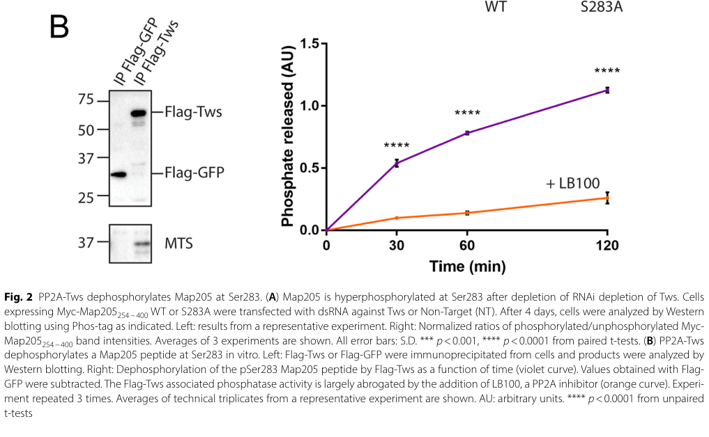

## Question

# Gene Research for Functional Annotation

## ⚠️ CRITICAL: Gene/Protein Identification Context

**BEFORE YOU BEGIN RESEARCH:** You MUST verify you are researching the CORRECT gene/protein. Gene symbols can be ambiguous, especially for less well-characterized genes from non-model organisms.

### Target Gene/Protein Identity (from UniProt):
- **UniProt Accession:** P23696
- **Protein Description:** RecName: Full=Serine/threonine-protein phosphatase PP2A; EC=3.1.3.16 {ECO:0000269|PubMed:32966759, ECO:0000269|PubMed:37995689}; AltName: Full=Protein microtubule star;
- **Gene Information:** Name=mts; Synonyms=PP2A, Pp2A-28D; ORFNames=CG7109;
- **Organism (full):** Drosophila melanogaster (Fruit fly).
- **Protein Family:** Belongs to the PPP phosphatase family. PP-2A subfamily.
- **Key Domains:** Calcineurin-like_PHP. (IPR004843); Metallo-depent_PP-like. (IPR029052); PPA2-like. (IPR047129); Ser/Thr-sp_prot-phosphatase. (IPR006186); Metallophos (PF00149)

### MANDATORY VERIFICATION STEPS:

1. **Check if the gene symbol "mts" matches the protein description above**
2. **Verify the organism is correct:** Drosophila melanogaster (Fruit fly).
3. **Check if protein family/domains align with what you find in literature**
4. **If you find literature for a DIFFERENT gene with the same or similar symbol, STOP**

### If Gene Symbol is Ambiguous or You Cannot Find Relevant Literature:

**DO NOT PROCEED WITH RESEARCH ON A DIFFERENT GENE.** Instead:
- State clearly: "The gene symbol 'mts' is ambiguous or literature is limited for this specific protein"
- Explain what you found (e.g., "Found extensive literature on a different gene with the same symbol in a different organism")
- Describe the protein based ONLY on the UniProt information provided above
- Suggest that the protein function can be inferred from domain/family information

### Research Target:

Please provide a comprehensive research report on the gene **mts** (gene ID: mts, UniProt: P23696) in DROME.

The research report should be a detailed narrative explaining the function, biological processes, and localization of the gene product. Citations should be given for all claims.

You should prioritize authoritative reviews and primary scientific literature when conducting research. You can supplement
this with annotations you find in gene/protein databases, but these can be outdated or inaccurate.

We are specifically interested in the primary function of the gene - for enzymes, what reaction is catalyzed, and what is the substrate specificity? For transporters, what is the substrate? For structural proteins or adapters, what is the broader structural role? For signaling molecules, what is the role in the pathway.

We are interested in where in or outside the cell the gene product carries out its function.

We are also interested in the signaling or biochemical pathways in which the gene functions. We are less interested in broad pleiotropic effects, except where these elucidate the precise role.

Include evidence where possible. We are interested in both experimental evidence as well as inference from structure, evolution, or bioinformatic analysis. Precise studies should be prioritized over high-throughput, where available.

## Output

Question: You are an expert researcher providing comprehensive, well-cited information.

Provide detailed information focusing on:
1. Key concepts and definitions with current understanding
2. Recent developments and latest research (prioritize 2023-2024 sources)
3. Current applications and real-world implementations
4. Expert opinions and analysis from authoritative sources
5. Relevant statistics and data from recent studies

Format as a comprehensive research report with proper citations. Include URLs and publication dates where available.
Always prioritize recent, authoritative sources and provide specific citations for all major claims.

# Gene Research for Functional Annotation

## ⚠️ CRITICAL: Gene/Protein Identification Context

**BEFORE YOU BEGIN RESEARCH:** You MUST verify you are researching the CORRECT gene/protein. Gene symbols can be ambiguous, especially for less well-characterized genes from non-model organisms.

### Target Gene/Protein Identity (from UniProt):
- **UniProt Accession:** P23696
- **Protein Description:** RecName: Full=Serine/threonine-protein phosphatase PP2A; EC=3.1.3.16 {ECO:0000269|PubMed:32966759, ECO:0000269|PubMed:37995689}; AltName: Full=Protein microtubule star;
- **Gene Information:** Name=mts; Synonyms=PP2A, Pp2A-28D; ORFNames=CG7109;
- **Organism (full):** Drosophila melanogaster (Fruit fly).
- **Protein Family:** Belongs to the PPP phosphatase family. PP-2A subfamily.
- **Key Domains:** Calcineurin-like_PHP. (IPR004843); Metallo-depent_PP-like. (IPR029052); PPA2-like. (IPR047129); Ser/Thr-sp_prot-phosphatase. (IPR006186); Metallophos (PF00149)

### MANDATORY VERIFICATION STEPS:

1. **Check if the gene symbol "mts" matches the protein description above**
2. **Verify the organism is correct:** Drosophila melanogaster (Fruit fly).
3. **Check if protein family/domains align with what you find in literature**
4. **If you find literature for a DIFFERENT gene with the same or similar symbol, STOP**

### If Gene Symbol is Ambiguous or You Cannot Find Relevant Literature:

**DO NOT PROCEED WITH RESEARCH ON A DIFFERENT GENE.** Instead:
- State clearly: "The gene symbol 'mts' is ambiguous or literature is limited for this specific protein"
- Explain what you found (e.g., "Found extensive literature on a different gene with the same symbol in a different organism")
- Describe the protein based ONLY on the UniProt information provided above
- Suggest that the protein function can be inferred from domain/family information

### Research Target:

Please provide a comprehensive research report on the gene **mts** (gene ID: mts, UniProt: P23696) in DROME.

The research report should be a detailed narrative explaining the function, biological processes, and localization of the gene product. Citations should be given for all claims.

You should prioritize authoritative reviews and primary scientific literature when conducting research. You can supplement
this with annotations you find in gene/protein databases, but these can be outdated or inaccurate.

We are specifically interested in the primary function of the gene - for enzymes, what reaction is catalyzed, and what is the substrate specificity? For transporters, what is the substrate? For structural proteins or adapters, what is the broader structural role? For signaling molecules, what is the role in the pathway.

We are interested in where in or outside the cell the gene product carries out its function.

We are also interested in the signaling or biochemical pathways in which the gene functions. We are less interested in broad pleiotropic effects, except where these elucidate the precise role.

Include evidence where possible. We are interested in both experimental evidence as well as inference from structure, evolution, or bioinformatic analysis. Precise studies should be prioritized over high-throughput, where available.

# Functional annotation of *mts* in *Drosophila melanogaster*

## Identity and principal function

**Identity verified.** The supplied UniProt accession [P23696](https://www.uniprot.org/uniprotkb/P23696/entry) identifies *mts* (*microtubule star*; synonym *Pp2A-28D*, gene designation *CG7109*) in *Drosophila melanogaster*. Independent fly studies identify Mts as the **catalytic C subunit of protein phosphatase 2A (PP2A)**—not the PP2A-29B scaffold or a regulatory subunit. Its supplied PPP-family and metallophosphatase-domain annotations agree with that experimentally established identity. (chen2007multipleproteinphosphatases pages 7-8, rui2020proteinphosphatasepp2a pages 1-2, guelle2024pp2atwsdephosphorylatesmap205 pages 1-3)

Mts catalyzes hydrolysis of phosphate esters on **protein phosphoserine and phosphothreonine**: protein–O–PO₃²⁻ + H₂O → protein–OH + inorganic phosphate. Like other PPP phosphatases, PP2A uses a bimetallic active site to activate water for this reaction; the precise metal content of fly Mts under physiological conditions is not established by the studies discussed here. Its biological substrate specificity is **not** a single invariant list of proteins. Mts associates with the PP2A-29B A scaffold and alternative targeting partners—including Twins (Tws/B55), Widerborst or Well rounded (Wdb/Wrd; B56-family proteins), and specialized complexes—which direct catalytic activity toward particular phosphoproteins and cellular locations. Consequently, a phenotype following *mts* depletion does not, by itself, establish that the affected protein is directly dephosphorylated by Mts. (brautigan2018proteinserinethreoninephosphatases pages 7-9, brautigan2018proteinserinethreoninephosphatases pages 2-4, rui2020proteinphosphatasepp2a pages 1-2, wolterhoff2020pp2aphosphataseis pages 1-2, li2025mechanismsofpp2aankle2 pages 4-5)

The following evidence-tier summary identifies the most informative substrate relationships. Its distinction between a phosphatase assay, a regulated cellular phosphosite, and pathway-level genetic evidence is central to annotating this broadly acting enzyme. (guelle2024pp2atwsdephosphorylatesmap205 pages 3-6, emondfraser2023identificationofpp2ab55 pages 5-6, yang2024innateimmuneand pages 4-5)

| Holoenzyme/context | Phosphoprotein/site and mechanism | Evidence strength / localization | Primary study (date, DOI URL) |
|---|---|---|---|
| **PP2A–Tws/B55; mitotic exit and cytokinesis** | **Map205 pSer283:** dephosphorylation restores Map205–Polo association and Map205-dependent recruitment of Polo to spindle/midbody microtubules. | **Direct biochemical evidence:** Tws immunoprecipitates co-purified Mts and released phosphate from a pSer283 peptide in vitro; activity was inhibited by LB-100. Tws depletion increased cellular pSer283. Localization evidence concerns **Polo/Map205 on microtubules**, not fluorescently localized Mts. (guelle2024pp2atwsdephosphorylatesmap205 pages 1-3, guelle2024pp2atwsdephosphorylatesmap205 pages 3-6, guelle2024pp2atwsdephosphorylatesmap205 media d6f30c4b) | Guelle, Emond-Fraser & Archambault, **2024-12**. [DOI](https://doi.org/10.1186/s13008-024-00141-x) |
| **PP2A–Tws/B55; post-mitotic nuclear-envelope reassembly** | **Otefin/emerin Ser50 and Ser54:** dephosphorylation near the LEM domain promotes Otefin binding to BAF and assembly of an Otefin–BAF–lamin complex. | **Strong cellular substrate evidence, but no purified-enzyme reconstitution:** Tws-dependent phosphoproteomics, Phos-tag assays, PP2A inhibition, interaction assays, and phosphosite mutants. Otefin was imaged at the inner nuclear membrane/spindle envelope and reassembling nuclei; this does not establish Mts localization there. (emondfraser2023identificationofpp2ab55 pages 5-6, emondfraser2023identificationofpp2ab55 pages 11-13, emondfraser2023identificationofpp2ab55 pages 7-8, emondfraser2023identificationofpp2ab55 pages 8-9) | Emond-Fraser *et al.*, **2023-07**. [DOI](https://doi.org/10.1098/rsob.230104) |
| **PP2A–Ankle2; nuclear reassembly** | **BAF N-terminal Ser2/Thr4/Ser5:** Ankle2-associated PP2A promotes dephosphorylation, chromosome recruitment of BAF after anaphase, and subsequent lamin/nuclear-envelope assembly. | **Association, phosphoproteomic and cell-biological evidence—not a purified phosphatase assay.** Ankle2 co-purifies PP2A-29B/Mts and competes with Tws; Ankle2 depletion increases phospho-BAF, whereas BAF-3A remains chromosome-associated. ER/spindle-envelope localization was shown for tagged **Ankle2/Vap33**, not directly for endogenous Mts. (li2025mechanismsofpp2aankle2 pages 5-7, li2025mechanismsofpp2aankle2 pages 4-5, li2024nuclearreassemblydefects pages 3-6, li2025mechanismsofpp2aankle2 pages 7-9, li2025mechanismsofpp2aankle2 pages 2-3) | Li *et al.*, **2024-08-26**, [PLOS Biology DOI](https://doi.org/10.1371/journal.pbio.3002780); Li *et al.*, eLife reviewed preprint/version of record, **2025-02**, [DOI](https://doi.org/10.7554/eLife.104233.3) |
| **PP2A–Tws-associated polarity complex; asymmetric neuroblast division** | **Par-6 after Aurora-A phosphorylation:** Mts/PP2A counteracts Aurora-A-dependent Par-6 phosphorylation, thereby restraining aPKC signaling and downstream Lgl phosphorylation. Exact phosphosite was not defined. | **Physical association and cellular phosphorylation evidence; no purified-enzyme assay:** Mts associated with Par-6, and PP2A inhibition caused a phosphatase-reversible Par-6 mobility shift. Functional context is the neuroblast Par-6–aPKC polarity complex, not a demonstrated subcellular map of Mts. (ogawa2009proteinphosphatase2a pages 5-6) | Ogawa *et al.*, **2009-09**. [DOI](https://doi.org/10.1242/jcs.050955) |
| **STRIPAK–PP2A containing Mts; innate-immune/Tak1–Tao–Hippo signaling** | **Tao-1 phosphorylation:** STRIPAK normally restrains Tao-1 phosphorylation; Tak1 promotes lysosomal degradation of Cka, releasing Tao–Hpo signaling and increasing downstream Hpo/Wts/Mats/Yki phosphorylation. | **Pathway and cell-based evidence; direct Mts-mediated Tao-1 dephosphorylation is unproven.** RNAi against Mts, PP2A-29B and other STRIPAK components increased Tao-1 phosphorylation. Tao-1 binds Cka, while Cka—not Mts—was imaged with lysosomal Lamp1. (yang2024innateimmuneand pages 5-5, yang2024innateimmuneand pages 4-5, yang2024innateimmuneand pages 2-3, yang2024innateimmuneand pages 5-6) | Yang *et al.*, **2024-01**. [DOI](https://doi.org/10.1038/s41467-023-44542-y) |
| **PP2A–Wrd/B56; Crumbs–Expanded–Hippo signaling** | **Expanded/Ex phosphorylation and stability:** Mts catalytic activity opposes Crumbs-induced Ex phosphorylation and degradation; PP2A–Wrd stabilizes Ex and can promote Hippo signaling, unlike Hippo-inhibitory PP2A–Cka/STRIPAK. Exact Ex phosphosite was not established. | **Cell-based biochemical and genetic evidence; not purified-protein dephosphorylation.** Wild-type Mts reversed an Ex mobility shift and stabilized Ex, whereas catalytic-dead Mts-H118N did not. The requested 2024 source is a **preprint**; a peer-reviewed EMBO Journal version appeared in 2026. (sekar2024adualrole pages 15-19, sekar2024adualrole pages 1-6, sekar2024adualrole pages 44-48) | Sekar *et al.*, **2024-11** preprint. [DOI](https://doi.org/10.1101/2024.11.14.623552) |
| **PP2A/Mts–Sgg/GSK3–kinesin axis; FUS-ALS model** | **Sgg inhibitory Ser9:** Mts overexpression reduces inhibitory Sgg phosphorylation, consistent with Sgg activation; downstream GSK3-dependent Klc Ser433 hyperphosphorylation is linked to impaired kinesin-1/mitochondrial transport. | **Genetic, pharmacological and phosphorylation-state evidence; direct Sgg dephosphorylation by purified Mts was not shown.** Reducing/inhibiting mts or sgg rescued fly FUS phenotypes, while PP2A/GSK3 inhibition improved mitochondrial transport in patient-derived motor neurons. Klc is treated as a GSK3 substrate, not a demonstrated direct Mts substrate. (tziortzouda2024pp2aandgsk3 pages 16-17, tziortzouda2024pp2aandgsk3 pages 12-13, tziortzouda2024pp2aandgsk3 pages 13-16, tziortzouda2024pp2aandgsk3 pages 1-2) | Tziortzouda *et al.*, **2024-02**. [DOI](https://doi.org/10.1007/s00401-024-02689-y) |

*Table: Evidence-tier summary of experimentally supported phosphoprotein relationships for the verified Drosophila melanogaster Mts PP2A catalytic subunit. It distinguishes direct phosphatase assays from cellular, genetic, and pathway-level evidence while avoiding unsupported localization claims.*

## Where Mts acts and what it does

**Mitotic microtubules and cytokinesis.** The clearest recent substrate-level demonstration is **Map205 phosphorylated at Ser283**, a CDK-regulated site. In a December 2024 study, Flag-Tws immunoprecipitates containing Mts released phosphate from a Map205-pSer283 peptide *in vitro*; the PP2A inhibitor LB-100 largely suppressed this activity. Tws depletion also increased cellular Ser283 phosphorylation. Dephosphorylation allows Map205 to reassociate with Polo kinase and recruit a pool of Polo to microtubules during mitotic exit. Tws-depleted cells showed reduced microtubule-associated Polo, abnormal central spindles, and delayed cytokinesis. These observations support a catalytic role in a microtubule-regulatory circuit; the authors caution that Polo mislocalization has **not been formally proved to cause** all the cytokinesis defects. The assay and its Mts co-purification are shown in the study’s cropped Figure 2B. [Guelle *et al.*, December 2024; DOI: 10.1186/s13008-024-00141-x](https://doi.org/10.1186/s13008-024-00141-x). (guelle2024pp2atwsdephosphorylatesmap205 pages 3-6, guelle2024pp2atwsdephosphorylatesmap205 pages 6-7, guelle2024pp2atwsdephosphorylatesmap205 media d6f30c4b)

**Reassembling nuclear envelope.** A July 2023 phosphoproteomic study identified the inner-nuclear-membrane protein Otefin, the fly emerin homolog, as a PP2A–Tws-regulated protein. Its **Ser50 and Ser54** sites lie adjacent to the BAF-binding LEM domain. Tws depletion increased phosphorylation of these sites; phosphosite substitutions and interaction assays showed that phosphorylation disfavors Otefin association with BAF and assembly of an Otefin–BAF–lamin complex. During mitotic exit, this regulation helps time Otefin recruitment to reassembling nuclei. This is strong *cellular* substrate evidence, but it is distinct from the purified or immunoprecipitated-enzyme assay performed for Map205. [Emond-Fraser *et al.*, July 2023; DOI: 10.1098/rsob.230104](https://doi.org/10.1098/rsob.230104). (emondfraser2023identificationofpp2ab55 pages 5-6, emondfraser2023identificationofpp2ab55 pages 7-8, emondfraser2023identificationofpp2ab55 pages 8-9)

A complementary route involves **BAF**, which must lose N-terminal phosphates to bind chromosomes after anaphase and support lamin recruitment. A 2024 fly study tested BAF **Ser2, Thr4, and Ser5**: depletion of Ankle2 increased phosphorylated BAF, whereas a nonphosphorylatable three-alanine BAF mutant remained chromosome-associated even after Ankle2 depletion. Subsequent work found that Ankle2 co-purifies with **Mts and PP2A-29B**, competes with Tws for association with the PP2A core, and is required to limit BAF Thr4/Ser5 phosphorylation. Thus Ankle2 is supported as a specialized PP2A-targeting partner, although structural models and cellular phosphosite changes should not be mistaken for direct enzymatic reconstitution of the Ankle2–Mts–BAF reaction. [Li *et al.*, August 26, 2024; DOI: 10.1371/journal.pbio.3002780](https://doi.org/10.1371/journal.pbio.3002780); [Li *et al.*, 2025; DOI: 10.7554/eLife.104233](https://doi.org/10.7554/eLife.104233). (li2024nuclearreassemblydefects pages 3-6, li2025mechanismsofpp2aankle2 pages 5-7, li2025mechanismsofpp2aankle2 pages 4-5)

**Subcellular localization must be attributed to the right molecule.** Mts is an intracellular catalytic component of complexes acting in cytoplasmic and nuclear-associated processes; the cited experiments do **not** establish one exclusive, permanent location for endogenous Mts. Polo and Map205 were tracked on microtubules, Otefin at the inner nuclear membrane, and tagged Ankle2 with Vap33 on endoplasmic-reticulum and spindle-envelope membranes and around re-forming nuclei. Ankle2–Vap33 provides a plausible means of positioning an associated PP2A activity near the emerging nuclear envelope, but localization of these partners is not direct visualization of endogenous Mts. [Li *et al.*, 2025](https://doi.org/10.7554/eLife.104233). (guelle2024pp2atwsdephosphorylatesmap205 pages 3-6, emondfraser2023identificationofpp2ab55 pages 8-9, li2025mechanismsofpp2aankle2 pages 7-9, li2025mechanismsofpp2aankle2 pages 2-3)

**Polarity and neuronal cytoskeleton.** In dividing neuroblasts, Mts associates with Par-6 and counteracts Aurora-A-dependent Par-6 phosphorylation, restraining Par-6–aPKC signaling and downstream Lgl phosphorylation. Physical association, genetics, and a phosphatase-reversible Par-6 phosphorylation shift support this mechanism; the cited experiments do not define a Par-6 phosphosite or provide the Map205-type isolated-complex assay. [Ogawa *et al.*, September 2009; DOI: 10.1242/jcs.050955](https://doi.org/10.1242/jcs.050955). (ogawa2009proteinphosphatase2a pages 1-2, ogawa2009proteinphosphatase2a pages 5-6)

In sensory-neuron dendrites, the regulatory partner changes what Mts-containing PP2A accomplishes. **Wdb-containing PP2A** promotes the ecdysone-associated Sox14–Mical program required for pruning; **Tws-containing PP2A** maintains dendritic minus-end-out microtubule orientation and restrains Klp10A abundance or activity. Suppressing Klp10A rescues the microtubule-orientation defect following loss of PP2A, but does not fully restore pruning, consistent with separable cytoskeletal and gene-expression mechanisms. Neither Klp10A nor Mical was thereby established as a direct Mts substrate. A separate 2022 analysis found subtype-dependent actin organization and increased dendritic microtubule turnover upon *mts* reduction. [Rui *et al.*, March 2020; DOI: 10.15252/embr.201948843](https://doi.org/10.15252/embr.201948843); [Bhattacharjee *et al.*, November 2022; DOI: 10.3389/fnmol.2022.926567](https://doi.org/10.3389/fnmol.2022.926567). (rui2020proteinphosphatasepp2a pages 11-14, rui2020proteinphosphatasepp2a pages 1-2, bhattacharjee2022pp2aphosphataseregulates pages 11-12)

## Signaling pathways and newer applications

**Hippo signaling illustrates context-dependent directionality.** A January 2024 study found that depleting Mts, PP2A-29B, or other components of the **STRIPAK–PP2A** assembly increases Tao-1 phosphorylation. Its model is that innate-immune kinase Tak1 promotes lysosomal removal of STRIPAK component Cka, releasing Tao–Hippo signaling and inhibiting Yorkie-mediated transcription. Tao-1 is consequently a **candidate PP2A-regulated target**, not a biochemically proven direct Mts substrate in that study. [Yang *et al.*, January 2024; DOI: 10.1038/s41467-023-44542-y](https://doi.org/10.1038/s41467-023-44542-y). (yang2024innateimmuneand pages 5-5, yang2024innateimmuneand pages 4-5, yang2024innateimmuneand pages 2-3)

Conversely, a **November 2024 preprint** reported that Mts-containing **PP2A–Wrd** opposes Crumbs-associated phosphorylation and degradation of the upstream Hippo regulator Expanded, potentially *promoting* Hippo signaling. Wild-type Mts—but not a catalytically impaired mutant—reversed Expanded’s phosphorylation-associated mobility shift and stabilized it in cells. The opposing PP2A–Wrd and STRIPAK–PP2A effects underscore that the regulatory assembly, rather than the identity of Mts alone, determines pathway output. The 2024 report was a **preprint**; a peer-reviewed version appeared in 2026. [Sekar *et al.*, November 2024 preprint; DOI: 10.1101/2024.11.14.623552](https://doi.org/10.1101/2024.11.14.623552); [peer-reviewed version, 2026; DOI: 10.1038/s44318-026-00850-9](https://doi.org/10.1038/s44318-026-00850-9). (sekar2024adualrole pages 15-19, sekar2026pp2aphosphataseregulates pages 1-3, sekar2024adualrole pages 1-6)

**Disease-model use, not an established therapy.** In a February 2024 FUS-associated ALS model, reducing *mts* or *sgg* (the fly GSK3 ortholog) improved fly survival phenotypes. Mts overexpression reduced inhibitory Sgg phosphorylation, consistent with a PP2A→GSK3→kinesin signaling axis; *mts* or *sgg* reduction also reduced fly kinesin-light-chain Ser433 phosphorylation. PP2A or GSK3 inhibition improved mitochondrial transport in patient-derived motor neurons. The screen examined **473** large deletion lines and reported **24** candidate modifier genes after follow-up; these are experimental screening counts, not population disease statistics. The data support a model-system application, **not** direct proof that Sgg is dephosphorylated by purified Mts or that broad PP2A inhibition is clinically safe or effective. [Tziortzouda *et al.*, February 2024; DOI: 10.1007/s00401-024-02689-y](https://doi.org/10.1007/s00401-024-02689-y). (tziortzouda2024pp2aandgsk3 pages 5-6, tziortzouda2024pp2aandgsk3 pages 16-17, tziortzouda2024pp2aandgsk3 pages 13-16, tziortzouda2024pp2aandgsk3 pages 1-2)

**Overall annotation.** *mts* encodes the conserved catalytic machinery that removes phosphoserine/phosphothreonine from proteins. Its best-defined fly activities involve phosphosite-specific control of mitotic exit and nuclear-envelope reassembly, while alternative targeting partners extend its action to polarity, dendritic cytoskeletal organization, and Hippo signaling. **Map205-pSer283** has particularly clear direct enzymatic support; Otefin and BAF have strong cellular phosphosite evidence; many additional pathway relationships remain indirect or complex-dependent. Mts is therefore more accurately annotated as a **targeted, intracellular PP2A catalytic subunit** than as a microtubule structural protein or an enzyme with one exclusive substrate or organelle. (guelle2024pp2atwsdephosphorylatesmap205 pages 3-6, emondfraser2023identificationofpp2ab55 pages 5-6, li2025mechanismsofpp2aankle2 pages 4-5, brautigan2018proteinserinethreoninephosphatases pages 2-4)

References

1. (chen2007multipleproteinphosphatases pages 7-8): Feng Chen, Vincent Archambault, Ashok Kar, Pietro Lio', Pier Paolo D'Avino, Rita Sinka, Kathryn Lilley, Ernest D. Laue, Peter Deak, Luisa Capalbo, and David M. Glover. Multiple protein phosphatases are required for mitosis in drosophila. Current Biology, 17:293-303, Feb 2007. URL: https://doi.org/10.1016/j.cub.2007.01.068, doi:10.1016/j.cub.2007.01.068. This article has 184 citations and is from a highest quality peer-reviewed journal.

2. (rui2020proteinphosphatasepp2a pages 1-2): Menglong Rui, Kay Siong Ng, Quan Tang, Shufeng Bu, and Fengwei Yu. Protein phosphatase pp2a regulates microtubule orientation and dendrite pruning in drosophila. EMBO reports, Mar 2020. URL: https://doi.org/10.15252/embr.201948843, doi:10.15252/embr.201948843. This article has 36 citations and is from a highest quality peer-reviewed journal.

3. (guelle2024pp2atwsdephosphorylatesmap205 pages 1-3): Marine Guelle, Virginie Emond-Fraser, and Vincent Archambault. Pp2a-tws dephosphorylates map205, is required for polo localization to microtubules and promotes cytokinesis in drosophila. Cell Division, Dec 2024. URL: https://doi.org/10.1186/s13008-024-00141-x, doi:10.1186/s13008-024-00141-x. This article has 0 citations and is from a peer-reviewed journal.

4. (brautigan2018proteinserinethreoninephosphatases pages 7-9): David L. Brautigan and Shirish Shenolikar. Protein serine/threonine phosphatases: keys to unlocking regulators and substrates. Annual review of biochemistry, 87:921-964, Jun 2018. URL: https://doi.org/10.1146/annurev-biochem-062917-012332, doi:10.1146/annurev-biochem-062917-012332. This article has 228 citations and is from a domain leading peer-reviewed journal.

5. (brautigan2018proteinserinethreoninephosphatases pages 2-4): David L. Brautigan and Shirish Shenolikar. Protein serine/threonine phosphatases: keys to unlocking regulators and substrates. Annual review of biochemistry, 87:921-964, Jun 2018. URL: https://doi.org/10.1146/annurev-biochem-062917-012332, doi:10.1146/annurev-biochem-062917-012332. This article has 228 citations and is from a domain leading peer-reviewed journal.

6. (wolterhoff2020pp2aphosphataseis pages 1-2): Neele Wolterhoff, Ulrike Gigengack, and Sebastian Rumpf. Pp2a phosphatase is required for dendrite pruning via actin regulation in drosophila. EMBO Reports, Mar 2020. URL: https://doi.org/10.15252/embr.201948870, doi:10.15252/embr.201948870. This article has 33 citations and is from a highest quality peer-reviewed journal.

7. (li2025mechanismsofpp2aankle2 pages 4-5): Jingjing Li, Xinyue Wang, Laia Jordana, Éric Bonneil, Victoria Ginestet, Momina Ahmed, Mohammed Bourouh, Cristina Mirela Pascariu, T Martin Schmeing, Pierre Thibault, and Vincent Archambault. Mechanisms of pp2a-ankle2 dependent nuclear reassembly after mitosis. eLife, Feb 2025. URL: https://doi.org/10.7554/elife.104233.3, doi:10.7554/elife.104233.3. This article has 10 citations and is from a domain leading peer-reviewed journal.

8. (guelle2024pp2atwsdephosphorylatesmap205 pages 3-6): Marine Guelle, Virginie Emond-Fraser, and Vincent Archambault. Pp2a-tws dephosphorylates map205, is required for polo localization to microtubules and promotes cytokinesis in drosophila. Cell Division, Dec 2024. URL: https://doi.org/10.1186/s13008-024-00141-x, doi:10.1186/s13008-024-00141-x. This article has 0 citations and is from a peer-reviewed journal.

9. (emondfraser2023identificationofpp2ab55 pages 5-6): Virginie Emond-Fraser, Myreille Larouche, Peter Kubiniok, Éric Bonneil, Jingjing Li, Mohammed Bourouh, Laura Frizzi, Pierre Thibault, and Vincent Archambault. Identification of pp2a-b55 targets uncovers regulation of emerin during nuclear envelope reassembly in drosophila. Open Biology, Jul 2023. URL: https://doi.org/10.1098/rsob.230104, doi:10.1098/rsob.230104. This article has 13 citations and is from a peer-reviewed journal.

10. (yang2024innateimmuneand pages 4-5): Yinan Yang, Huijing Zhou, Xiawei Huang, Chengfang Wu, Kewei Zheng, Jingrong Deng, Yonggang Zheng, Jiahui Wang, Xiaofeng Chi, Xianjue Ma, Huimin Pan, Rui Shen, Duojia Pan, and Bo Liu. Innate immune and proinflammatory signals activate the hippo pathway via a tak1-stripak-tao axis. Nature Communications, Jan 2024. URL: https://doi.org/10.1038/s41467-023-44542-y, doi:10.1038/s41467-023-44542-y. This article has 23 citations and is from a highest quality peer-reviewed journal.

11. (guelle2024pp2atwsdephosphorylatesmap205 media d6f30c4b): Marine Guelle, Virginie Emond-Fraser, and Vincent Archambault. Pp2a-tws dephosphorylates map205, is required for polo localization to microtubules and promotes cytokinesis in drosophila. Cell Division, Dec 2024. URL: https://doi.org/10.1186/s13008-024-00141-x, doi:10.1186/s13008-024-00141-x. This article has 0 citations and is from a peer-reviewed journal.

12. (emondfraser2023identificationofpp2ab55 pages 11-13): Virginie Emond-Fraser, Myreille Larouche, Peter Kubiniok, Éric Bonneil, Jingjing Li, Mohammed Bourouh, Laura Frizzi, Pierre Thibault, and Vincent Archambault. Identification of pp2a-b55 targets uncovers regulation of emerin during nuclear envelope reassembly in drosophila. Open Biology, Jul 2023. URL: https://doi.org/10.1098/rsob.230104, doi:10.1098/rsob.230104. This article has 13 citations and is from a peer-reviewed journal.

13. (emondfraser2023identificationofpp2ab55 pages 7-8): Virginie Emond-Fraser, Myreille Larouche, Peter Kubiniok, Éric Bonneil, Jingjing Li, Mohammed Bourouh, Laura Frizzi, Pierre Thibault, and Vincent Archambault. Identification of pp2a-b55 targets uncovers regulation of emerin during nuclear envelope reassembly in drosophila. Open Biology, Jul 2023. URL: https://doi.org/10.1098/rsob.230104, doi:10.1098/rsob.230104. This article has 13 citations and is from a peer-reviewed journal.

14. (emondfraser2023identificationofpp2ab55 pages 8-9): Virginie Emond-Fraser, Myreille Larouche, Peter Kubiniok, Éric Bonneil, Jingjing Li, Mohammed Bourouh, Laura Frizzi, Pierre Thibault, and Vincent Archambault. Identification of pp2a-b55 targets uncovers regulation of emerin during nuclear envelope reassembly in drosophila. Open Biology, Jul 2023. URL: https://doi.org/10.1098/rsob.230104, doi:10.1098/rsob.230104. This article has 13 citations and is from a peer-reviewed journal.

15. (li2025mechanismsofpp2aankle2 pages 5-7): Jingjing Li, Xinyue Wang, Laia Jordana, Éric Bonneil, Victoria Ginestet, Momina Ahmed, Mohammed Bourouh, Cristina Mirela Pascariu, T Martin Schmeing, Pierre Thibault, and Vincent Archambault. Mechanisms of pp2a-ankle2 dependent nuclear reassembly after mitosis. eLife, Feb 2025. URL: https://doi.org/10.7554/elife.104233.3, doi:10.7554/elife.104233.3. This article has 10 citations and is from a domain leading peer-reviewed journal.

16. (li2024nuclearreassemblydefects pages 3-6): Jingjing Li, Laia Jordana, Haytham Mehsen, Xinyue Wang, and Vincent Archambault. Nuclear reassembly defects after mitosis trigger apoptotic and p53-dependent safeguard mechanisms in drosophila. PLOS Biology, 22:e3002780, Aug 2024. URL: https://doi.org/10.1371/journal.pbio.3002780, doi:10.1371/journal.pbio.3002780. This article has 9 citations and is from a highest quality peer-reviewed journal.

17. (li2025mechanismsofpp2aankle2 pages 7-9): Jingjing Li, Xinyue Wang, Laia Jordana, Éric Bonneil, Victoria Ginestet, Momina Ahmed, Mohammed Bourouh, Cristina Mirela Pascariu, T Martin Schmeing, Pierre Thibault, and Vincent Archambault. Mechanisms of pp2a-ankle2 dependent nuclear reassembly after mitosis. eLife, Feb 2025. URL: https://doi.org/10.7554/elife.104233.3, doi:10.7554/elife.104233.3. This article has 10 citations and is from a domain leading peer-reviewed journal.

18. (li2025mechanismsofpp2aankle2 pages 2-3): Jingjing Li, Xinyue Wang, Laia Jordana, Éric Bonneil, Victoria Ginestet, Momina Ahmed, Mohammed Bourouh, Cristina Mirela Pascariu, T Martin Schmeing, Pierre Thibault, and Vincent Archambault. Mechanisms of pp2a-ankle2 dependent nuclear reassembly after mitosis. eLife, Feb 2025. URL: https://doi.org/10.7554/elife.104233.3, doi:10.7554/elife.104233.3. This article has 10 citations and is from a domain leading peer-reviewed journal.

19. (ogawa2009proteinphosphatase2a pages 5-6): Hironori Ogawa, Nao Ohta, Woongjoon Moon, and Fumio Matsuzaki. Protein phosphatase 2a negatively regulates apkc signaling by modulating phosphorylation of par-6 in drosophila neuroblast asymmetric divisions. Journal of Cell Science, 122:3242-3249, Sep 2009. URL: https://doi.org/10.1242/jcs.050955, doi:10.1242/jcs.050955. This article has 69 citations and is from a domain leading peer-reviewed journal.

20. (yang2024innateimmuneand pages 5-5): Yinan Yang, Huijing Zhou, Xiawei Huang, Chengfang Wu, Kewei Zheng, Jingrong Deng, Yonggang Zheng, Jiahui Wang, Xiaofeng Chi, Xianjue Ma, Huimin Pan, Rui Shen, Duojia Pan, and Bo Liu. Innate immune and proinflammatory signals activate the hippo pathway via a tak1-stripak-tao axis. Nature Communications, Jan 2024. URL: https://doi.org/10.1038/s41467-023-44542-y, doi:10.1038/s41467-023-44542-y. This article has 23 citations and is from a highest quality peer-reviewed journal.

21. (yang2024innateimmuneand pages 2-3): Yinan Yang, Huijing Zhou, Xiawei Huang, Chengfang Wu, Kewei Zheng, Jingrong Deng, Yonggang Zheng, Jiahui Wang, Xiaofeng Chi, Xianjue Ma, Huimin Pan, Rui Shen, Duojia Pan, and Bo Liu. Innate immune and proinflammatory signals activate the hippo pathway via a tak1-stripak-tao axis. Nature Communications, Jan 2024. URL: https://doi.org/10.1038/s41467-023-44542-y, doi:10.1038/s41467-023-44542-y. This article has 23 citations and is from a highest quality peer-reviewed journal.

22. (yang2024innateimmuneand pages 5-6): Yinan Yang, Huijing Zhou, Xiawei Huang, Chengfang Wu, Kewei Zheng, Jingrong Deng, Yonggang Zheng, Jiahui Wang, Xiaofeng Chi, Xianjue Ma, Huimin Pan, Rui Shen, Duojia Pan, and Bo Liu. Innate immune and proinflammatory signals activate the hippo pathway via a tak1-stripak-tao axis. Nature Communications, Jan 2024. URL: https://doi.org/10.1038/s41467-023-44542-y, doi:10.1038/s41467-023-44542-y. This article has 23 citations and is from a highest quality peer-reviewed journal.

23. (sekar2024adualrole pages 15-19): Aashika Sekar, Alberto Rizzo, Elodie Sins, Alexander D. Fulford, and Paulo S. Ribeiro. A dual role for the pp2a phosphatase in hippo signalling regulation. bioRxiv, Nov 2024. URL: https://doi.org/10.1101/2024.11.14.623552, doi:10.1101/2024.11.14.623552. This article has 0 citations.

24. (sekar2024adualrole pages 1-6): Aashika Sekar, Alberto Rizzo, Elodie Sins, Alexander D. Fulford, and Paulo S. Ribeiro. A dual role for the pp2a phosphatase in hippo signalling regulation. bioRxiv, Nov 2024. URL: https://doi.org/10.1101/2024.11.14.623552, doi:10.1101/2024.11.14.623552. This article has 0 citations.

25. (sekar2024adualrole pages 44-48): Aashika Sekar, Alberto Rizzo, Elodie Sins, Alexander D. Fulford, and Paulo S. Ribeiro. A dual role for the pp2a phosphatase in hippo signalling regulation. bioRxiv, Nov 2024. URL: https://doi.org/10.1101/2024.11.14.623552, doi:10.1101/2024.11.14.623552. This article has 0 citations.

26. (tziortzouda2024pp2aandgsk3 pages 16-17): Paraskevi Tziortzouda, Jolien Steyaert, Wendy Scheveneels, Adria Sicart, Katarina Stoklund Dittlau, Adriana Margarida Barbosa Correia, Thibaut Burg, Arun Pal, Andreas Hermann, Philip Van Damme, Thomas G. Moens, and Ludo Van Den Bosch. Pp2a and gsk3 act as modifiers of fus-als by modulating mitochondrial transport. Acta Neuropathologica, Feb 2024. URL: https://doi.org/10.1007/s00401-024-02689-y, doi:10.1007/s00401-024-02689-y. This article has 13 citations and is from a highest quality peer-reviewed journal.

27. (tziortzouda2024pp2aandgsk3 pages 12-13): Paraskevi Tziortzouda, Jolien Steyaert, Wendy Scheveneels, Adria Sicart, Katarina Stoklund Dittlau, Adriana Margarida Barbosa Correia, Thibaut Burg, Arun Pal, Andreas Hermann, Philip Van Damme, Thomas G. Moens, and Ludo Van Den Bosch. Pp2a and gsk3 act as modifiers of fus-als by modulating mitochondrial transport. Acta Neuropathologica, Feb 2024. URL: https://doi.org/10.1007/s00401-024-02689-y, doi:10.1007/s00401-024-02689-y. This article has 13 citations and is from a highest quality peer-reviewed journal.

28. (tziortzouda2024pp2aandgsk3 pages 13-16): Paraskevi Tziortzouda, Jolien Steyaert, Wendy Scheveneels, Adria Sicart, Katarina Stoklund Dittlau, Adriana Margarida Barbosa Correia, Thibaut Burg, Arun Pal, Andreas Hermann, Philip Van Damme, Thomas G. Moens, and Ludo Van Den Bosch. Pp2a and gsk3 act as modifiers of fus-als by modulating mitochondrial transport. Acta Neuropathologica, Feb 2024. URL: https://doi.org/10.1007/s00401-024-02689-y, doi:10.1007/s00401-024-02689-y. This article has 13 citations and is from a highest quality peer-reviewed journal.

29. (tziortzouda2024pp2aandgsk3 pages 1-2): Paraskevi Tziortzouda, Jolien Steyaert, Wendy Scheveneels, Adria Sicart, Katarina Stoklund Dittlau, Adriana Margarida Barbosa Correia, Thibaut Burg, Arun Pal, Andreas Hermann, Philip Van Damme, Thomas G. Moens, and Ludo Van Den Bosch. Pp2a and gsk3 act as modifiers of fus-als by modulating mitochondrial transport. Acta Neuropathologica, Feb 2024. URL: https://doi.org/10.1007/s00401-024-02689-y, doi:10.1007/s00401-024-02689-y. This article has 13 citations and is from a highest quality peer-reviewed journal.

30. (guelle2024pp2atwsdephosphorylatesmap205 pages 6-7): Marine Guelle, Virginie Emond-Fraser, and Vincent Archambault. Pp2a-tws dephosphorylates map205, is required for polo localization to microtubules and promotes cytokinesis in drosophila. Cell Division, Dec 2024. URL: https://doi.org/10.1186/s13008-024-00141-x, doi:10.1186/s13008-024-00141-x. This article has 0 citations and is from a peer-reviewed journal.

31. (ogawa2009proteinphosphatase2a pages 1-2): Hironori Ogawa, Nao Ohta, Woongjoon Moon, and Fumio Matsuzaki. Protein phosphatase 2a negatively regulates apkc signaling by modulating phosphorylation of par-6 in drosophila neuroblast asymmetric divisions. Journal of Cell Science, 122:3242-3249, Sep 2009. URL: https://doi.org/10.1242/jcs.050955, doi:10.1242/jcs.050955. This article has 69 citations and is from a domain leading peer-reviewed journal.

32. (rui2020proteinphosphatasepp2a pages 11-14): Menglong Rui, Kay Siong Ng, Quan Tang, Shufeng Bu, and Fengwei Yu. Protein phosphatase pp2a regulates microtubule orientation and dendrite pruning in drosophila. EMBO reports, Mar 2020. URL: https://doi.org/10.15252/embr.201948843, doi:10.15252/embr.201948843. This article has 36 citations and is from a highest quality peer-reviewed journal.

33. (bhattacharjee2022pp2aphosphataseregulates pages 11-12): Shatabdi Bhattacharjee, Erin N. Lottes, Sumit Nanda, Andre Golshir, Atit A. Patel, Giorgio A. Ascoli, and Daniel N. Cox. Pp2a phosphatase regulates cell-type specific cytoskeletal organization to drive dendrite diversity. Frontiers in Molecular Neuroscience, Nov 2022. URL: https://doi.org/10.3389/fnmol.2022.926567, doi:10.3389/fnmol.2022.926567. This article has 14 citations.

34. (sekar2026pp2aphosphataseregulates pages 1-3): Aashika Sekar, Alberto Rizzo, Elodie Sins, Alexander D Fulford, Lucy Silcock, and Paulo S Ribeiro. Pp2a phosphatase regulates hippo signalling in dual manner. The EMBO Journal, 45:5943-5971, Jul 2026. URL: https://doi.org/10.1038/s44318-026-00850-9, doi:10.1038/s44318-026-00850-9. This article has 0 citations.

35. (tziortzouda2024pp2aandgsk3 pages 5-6): Paraskevi Tziortzouda, Jolien Steyaert, Wendy Scheveneels, Adria Sicart, Katarina Stoklund Dittlau, Adriana Margarida Barbosa Correia, Thibaut Burg, Arun Pal, Andreas Hermann, Philip Van Damme, Thomas G. Moens, and Ludo Van Den Bosch. Pp2a and gsk3 act as modifiers of fus-als by modulating mitochondrial transport. Acta Neuropathologica, Feb 2024. URL: https://doi.org/10.1007/s00401-024-02689-y, doi:10.1007/s00401-024-02689-y. This article has 13 citations and is from a highest quality peer-reviewed journal.

## Artifacts

- [Edison artifact artifact-00](mts-deep-research-falcon_artifacts/artifact-00.md)

## Citations

1. chen2007multipleproteinphosphatases pages 7-8
2. brautigan2018proteinserinethreoninephosphatases pages 7-9
3. brautigan2018proteinserinethreoninephosphatases pages 2-4
4. yang2024innateimmuneand pages 4-5
5. li2024nuclearreassemblydefects pages 3-6
6. yang2024innateimmuneand pages 5-5
7. yang2024innateimmuneand pages 2-3
8. yang2024innateimmuneand pages 5-6
9. sekar2024adualrole pages 15-19
10. sekar2024adualrole pages 1-6
11. sekar2024adualrole pages 44-48
12. P23696
13. DOI
14. PLOS Biology DOI
15. Guelle *et al.*, December 2024; DOI: 10.1186/s13008-024-00141-x
16. Emond-Fraser *et al.*, July 2023; DOI: 10.1098/rsob.230104
17. Li *et al.*, August 26, 2024; DOI: 10.1371/journal.pbio.3002780
18. Li *et al.*, 2025; DOI: 10.7554/eLife.104233
19. Li *et al.*, 2025
20. Ogawa *et al.*, September 2009; DOI: 10.1242/jcs.050955
21. Rui *et al.*, March 2020; DOI: 10.15252/embr.201948843
22. Bhattacharjee *et al.*, November 2022; DOI: 10.3389/fnmol.2022.926567
23. Yang *et al.*, January 2024; DOI: 10.1038/s41467-023-44542-y
24. Sekar *et al.*, November 2024 preprint; DOI: 10.1101/2024.11.14.623552
25. peer-reviewed version, 2026; DOI: 10.1038/s44318-026-00850-9
26. Tziortzouda *et al.*, February 2024; DOI: 10.1007/s00401-024-02689-y
27. https://www.uniprot.org/uniprotkb/P23696/entry
28. https://doi.org/10.1186/s13008-024-00141-x
29. https://doi.org/10.1098/rsob.230104
30. https://doi.org/10.1371/journal.pbio.3002780
31. https://doi.org/10.7554/eLife.104233.3
32. https://doi.org/10.1242/jcs.050955
33. https://doi.org/10.1038/s41467-023-44542-y
34. https://doi.org/10.1101/2024.11.14.623552
35. https://doi.org/10.1007/s00401-024-02689-y
36. https://doi.org/10.7554/eLife.104233
37. https://doi.org/10.15252/embr.201948843
38. https://doi.org/10.3389/fnmol.2022.926567
39. https://doi.org/10.1038/s44318-026-00850-9
40. https://doi.org/10.1016/j.cub.2007.01.068,
41. https://doi.org/10.15252/embr.201948843,
42. https://doi.org/10.1186/s13008-024-00141-x,
43. https://doi.org/10.1146/annurev-biochem-062917-012332,
44. https://doi.org/10.15252/embr.201948870,
45. https://doi.org/10.7554/elife.104233.3,
46. https://doi.org/10.1098/rsob.230104,
47. https://doi.org/10.1038/s41467-023-44542-y,
48. https://doi.org/10.1371/journal.pbio.3002780,
49. https://doi.org/10.1242/jcs.050955,
50. https://doi.org/10.1101/2024.11.14.623552,
51. https://doi.org/10.1007/s00401-024-02689-y,
52. https://doi.org/10.3389/fnmol.2022.926567,
53. https://doi.org/10.1038/s44318-026-00850-9,