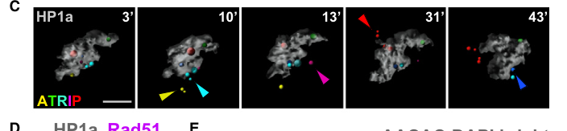

## Question

# Gene Research for Functional Annotation

## ⚠️ CRITICAL: Gene/Protein Identification Context

**BEFORE YOU BEGIN RESEARCH:** You MUST verify you are researching the CORRECT gene/protein. Gene symbols can be ambiguous, especially for less well-characterized genes from non-model organisms.

### Target Gene/Protein Identity (from UniProt):
- **UniProt Accession:** Q9VVN4
- **Protein Description:** RecName: Full=ATR-interacting protein mus304; AltName: Full=Mutagen-sensitive protein 304;
- **Gene Information:** Name=mus304; ORFNames=CG7347;
- **Organism (full):** Drosophila melanogaster (Fruit fly).
- **Protein Family:** Belongs to the ATRIP family. .
- **Key Domains:** ATRIP. (IPR033349); ATRIP_mid. (IPR063346); Mus304_C. (IPR063309); ATRIP_mid (PF28913); Mus304_C (PF28915)

### MANDATORY VERIFICATION STEPS:

1. **Check if the gene symbol "mus304" matches the protein description above**
2. **Verify the organism is correct:** Drosophila melanogaster (Fruit fly).
3. **Check if protein family/domains align with what you find in literature**
4. **If you find literature for a DIFFERENT gene with the same or similar symbol, STOP**

### If Gene Symbol is Ambiguous or You Cannot Find Relevant Literature:

**DO NOT PROCEED WITH RESEARCH ON A DIFFERENT GENE.** Instead:
- State clearly: "The gene symbol 'mus304' is ambiguous or literature is limited for this specific protein"
- Explain what you found (e.g., "Found extensive literature on a different gene with the same symbol in a different organism")
- Describe the protein based ONLY on the UniProt information provided above
- Suggest that the protein function can be inferred from domain/family information

### Research Target:

Please provide a comprehensive research report on the gene **mus304** (gene ID: mus304, UniProt: Q9VVN4) in DROME.

The research report should be a detailed narrative explaining the function, biological processes, and localization of the gene product. Citations should be given for all claims.

You should prioritize authoritative reviews and primary scientific literature when conducting research. You can supplement
this with annotations you find in gene/protein databases, but these can be outdated or inaccurate.

We are specifically interested in the primary function of the gene - for enzymes, what reaction is catalyzed, and what is the substrate specificity? For transporters, what is the substrate? For structural proteins or adapters, what is the broader structural role? For signaling molecules, what is the role in the pathway.

We are interested in where in or outside the cell the gene product carries out its function.

We are also interested in the signaling or biochemical pathways in which the gene functions. We are less interested in broad pleiotropic effects, except where these elucidate the precise role.

Include evidence where possible. We are interested in both experimental evidence as well as inference from structure, evolution, or bioinformatic analysis. Precise studies should be prioritized over high-throughput, where available.

## Output

Question: You are an expert researcher providing comprehensive, well-cited information.

Provide detailed information focusing on:
1. Key concepts and definitions with current understanding
2. Recent developments and latest research (prioritize 2023-2024 sources)
3. Current applications and real-world implementations
4. Expert opinions and analysis from authoritative sources
5. Relevant statistics and data from recent studies

Format as a comprehensive research report with proper citations. Include URLs and publication dates where available.
Always prioritize recent, authoritative sources and provide specific citations for all major claims.

# Gene Research for Functional Annotation

## ⚠️ CRITICAL: Gene/Protein Identification Context

**BEFORE YOU BEGIN RESEARCH:** You MUST verify you are researching the CORRECT gene/protein. Gene symbols can be ambiguous, especially for less well-characterized genes from non-model organisms.

### Target Gene/Protein Identity (from UniProt):
- **UniProt Accession:** Q9VVN4
- **Protein Description:** RecName: Full=ATR-interacting protein mus304; AltName: Full=Mutagen-sensitive protein 304;
- **Gene Information:** Name=mus304; ORFNames=CG7347;
- **Organism (full):** Drosophila melanogaster (Fruit fly).
- **Protein Family:** Belongs to the ATRIP family. .
- **Key Domains:** ATRIP. (IPR033349); ATRIP_mid. (IPR063346); Mus304_C. (IPR063309); ATRIP_mid (PF28913); Mus304_C (PF28915)

### MANDATORY VERIFICATION STEPS:

1. **Check if the gene symbol "mus304" matches the protein description above**
2. **Verify the organism is correct:** Drosophila melanogaster (Fruit fly).
3. **Check if protein family/domains align with what you find in literature**
4. **If you find literature for a DIFFERENT gene with the same or similar symbol, STOP**

### If Gene Symbol is Ambiguous or You Cannot Find Relevant Literature:

**DO NOT PROCEED WITH RESEARCH ON A DIFFERENT GENE.** Instead:
- State clearly: "The gene symbol 'mus304' is ambiguous or literature is limited for this specific protein"
- Explain what you found (e.g., "Found extensive literature on a different gene with the same symbol in a different organism")
- Describe the protein based ONLY on the UniProt information provided above
- Suggest that the protein function can be inferred from domain/family information

### Research Target:

Please provide a comprehensive research report on the gene **mus304** (gene ID: mus304, UniProt: Q9VVN4) in DROME.

The research report should be a detailed narrative explaining the function, biological processes, and localization of the gene product. Citations should be given for all claims.

You should prioritize authoritative reviews and primary scientific literature when conducting research. You can supplement
this with annotations you find in gene/protein databases, but these can be outdated or inaccurate.

We are specifically interested in the primary function of the gene - for enzymes, what reaction is catalyzed, and what is the substrate specificity? For transporters, what is the substrate? For structural proteins or adapters, what is the broader structural role? For signaling molecules, what is the role in the pathway.

We are interested in where in or outside the cell the gene product carries out its function.

We are also interested in the signaling or biochemical pathways in which the gene functions. We are less interested in broad pleiotropic effects, except where these elucidate the precise role.

Include evidence where possible. We are interested in both experimental evidence as well as inference from structure, evolution, or bioinformatic analysis. Precise studies should be prioritized over high-throughput, where available.

# Functional annotation report: *Drosophila melanogaster* mus304

## Identity and principal function

**Identity verified at the gene and protein-family level.** The target is *D. melanogaster* **mus304**, encoding mutagen-sensitive protein 304, the fly functional counterpart of **ATRIP** (ATR-interacting protein). It is distinct from **mei-41**, which encodes the ATR checkpoint kinase, and from other similarly named *mus* genes. The accession **Q9VVN4**, ORF name **CG7347**, and ATRIP/ATRIP_mid/Mus304_C domain labels are supplied in the question; the examined papers corroborate the mus304–ATRIP assignment but do not independently establish every database identifier or domain boundary. The cloned mus304 cDNA predicts an 846-amino-acid protein with an N-terminal coiled-coil region; mutant and transgene-rescue experiments connect this protein to the mus304 phenotypes. (brodsky2000mus304encodesa pages 8-9, brodsky2000mus304encodesa pages 6-8, bi2005drosophilaatmand pages 4-5, jeff2017dnarepairin pages 5-6)

**Best-supported annotation:** Mus304 is a **non-enzymatic DNA-damage-response and replication-checkpoint factor** associated with the MEI-41/ATR pathway. It helps couple damaged or incompletely replicated DNA to cell-cycle control, supports chromosome integrity, and contributes to telomere protection. No reaction catalyzed by Mus304, enzymatic substrate specificity, or transporter activity has been established. Its designation as an ATRIP-family partner is supported by comparative assignment and fly genetics; the cited fly studies do **not** establish a direct purified Mus304–MEI-41 or Mus304–RPA binding constant. (brodsky2000mus304encodesa pages 2-4, bi2005drosophilaatmand pages 4-5, brodsky2000mus304encodesa pages 9-10, jeff2017dnarepairin pages 5-6)

The following matrix separates Mus304-specific observations from mechanistic interpretations.

| Function | Direct Mus304-specific observation | Evidence level / caveat |
|---|---|---|
| Identity and molecular role | *Drosophila melanogaster* **mus304** encodes the functional ATRIP ortholog, an 846-aa, predicted coiled-coil checkpoint protein that functions genetically with MEI-41/ATR. It is a non-enzymatic regulatory/scaffold factor; no catalytic reaction is established. (brodsky2000mus304encodesa pages 8-9, bi2005drosophilaatmand pages 4-5, jeff2017dnarepairin pages 5-6) | **Strong identity; mechanistic inference.** Rescue by mus304 transgenes and mutant sequencing establish the gene product. ATRIP-family assignment is authoritative, but direct binding of fly Mus304 to MEI-41 or RPA was not demonstrated in these studies. |
| Irradiation-induced G2/M checkpoint | Unirradiated mus304 imaginal discs had normal mitosis, but failed to suppress mitosis after 4,000-rad X-irradiation; the defect occurred in eye, wing, leg, and other dividing larval tissues and was not explained by delayed arrest or rapid recovery. (brodsky2000mus304encodesa pages 2-4) | **Strong direct genetic/cellular evidence.** PH3-positive mitotic-cell assays establish that Mus304 is essential for damage-induced G2/M arrest, although they do not identify its direct biochemical substrate. |
| Genome stability, meiosis, and embryogenesis | Chromosome aberrations per 100 metaphases were **0.7 wild type vs 9.6 mus304** without irradiation and **19 vs 60** after 220 rad. Meiotic distance fell from **40.0 to 20.9 cM**; mutants showed approximately 10-fold more X nondisjunction and 50-fold more X loss. Among maternal-mutant embryos, 16% arrested around cycles 3–5 and 60% arrested partially or completely near cycle 14. (brodsky2000mus304encodesa pages 4-5, brodsky2000mus304encodesa pages 5-6) | **Strong direct genetic and cytological evidence.** These data establish checkpoint-dependent genome maintenance and developmental roles, but do not show that Mus304 itself repairs DNA or catalyzes recombination. |
| Nuclear damage-site localization | GFP–ATRIP/Mus304 foci formed on irradiated heterochromatic breaks, peaked early, and moved from within the HP1a domain to its periphery or outside it, often splitting during movement. Early resection/ATRIP loading occurred before Rad51 recruitment. (chiolo2011doublestrandbreaksin pages 3-5, chiolo2011doublestrandbreaksin media 0420a908) | **Strong live-cell localization evidence.** This supersedes a simplistic “cytoplasmic-only” model based on overexpressed Flag–Mus304; it supports a damage-induced nuclear pool. Recruitment to resected DNA is consistent with ATRIP biology, but direct fly Mus304–RPA binding was not established. |
| Telomere protection | mus304 alone caused little overt telomere uncapping, but strong **tefu/ATM; mus304** double mutants averaged **7.12 telomere fusions per nucleus**, with nearly 20% of 86 nuclei polyploid; only 6/64 strong-double-mutant nuclei retained detectable telomeric HOAP. (bi2005drosophilaatmand pages 4-5) | **Strong direct genetic/cytological evidence.** Mus304/ATRIP acts redundantly with ATM-dependent telomere protection and helps recruit or retain the HOAP cap; this is broader than canonical checkpoint arrest. |
| Suppression of de novo telomere formation | At an I-SceI-induced germline break, terminal-deletion recovery rose from **0.15 ± 0.02 in wild type to 0.60 ± 0.03 in mus304**. Transposon-addition events increased from **1/49 to 17/42 germlines** (approximately 20-fold; *P* < 0.0001). (beaucher2012multiplepathwayssuppress pages 6-7) | **Strong direct genetic evidence.** Mus304 normally prevents persistent DSBs from being converted into new telomeres. The proposed mechanism—longer DSB persistence and inappropriate recruitment of telomere-capping/transposon machinery—is an interpretation, not a demonstrated direct Mus304 biochemical activity. |

*Table: Direct evidence for Drosophila Mus304/ATRIP across checkpoint signaling, genome maintenance, damage-site localization, and telomere biology. Quantitative findings are separated from mechanistic inferences and unresolved biochemical details.*

## Checkpoint pathway and biochemical interpretation

In a direct assay of the **DNA-damage-induced G2/M checkpoint**, unirradiated mus304 mutant eye imaginal discs had normal mitotic-cell numbers and morphology, whereas irradiation failed to suppress mitosis. A 4,000-rad time course ruled out merely delayed arrest or rapid recovery; analogous requirements were observed in wing, leg, and other tested imaginal discs. Under a sensitized rough-eye assay, combined mei-41 and mus304 mutations were no more severe than either single mutation, supporting a **shared genetic pathway**, not proving physical protein interaction. The checkpoint response was completely lost in the assayed mus304 discs but only partially impaired in *grapes*/*grp* mutants, indicating that these factors need not have identical contributions in every tissue. (brodsky2000mus304encodesa pages 2-4, brodsky2000mus304encodesa pages 4-5, brodsky2000mus304encodesa pages 8-9)

The **mechanistic model**, principally inferred from ATRIP biology in other organisms, is that replication stress or DNA-end resection generates single-stranded DNA coated by replication protein A (RPA); ATRIP helps position the ATR kinase at that signal, where additional factors promote checkpoint activation. A 2024 review describes RPA–ATRIP-dependent recruitment and the roles of TopBP1 and the 9-1-1 clamp in ATR activation. In the fly, irradiation-induced Mus304/ATRIP foci at damage sites and the mei-41–mus304 genetic relationship support this model, but they do not themselves demonstrate direct binding of fly Mus304 to RPA, identify its binding interface, or establish which downstream kinase substrates depend specifically on Mus304. Fly evidence for *grp*/Chk1 in the broader pathway must not be mistaken for a direct Mus304-to-Grp biochemical assay. (joo2024atrilogyof pages 2-4, chiolo2011doublestrandbreaksin pages 3-5, bi2005drosophilaatmand pages 4-5, brodsky2000mus304encodesa pages 9-10)

## Cellular localization: a context-dependent nuclear pool

The apparent localization discrepancy is important. The original study found that **tagged Mus304 was predominantly cytoplasmic** in interphase S2 cells and overexpressing eye discs, was absent from condensed metaphase chromosomes, and showed no obvious redistribution after irradiation. Its authors expressly could not exclude a small, functionally important nuclear fraction; expression from the native promoter was too weak for protein detection in embryos or discs. (brodsky2000mus304encodesa pages 8-9, brodsky2000mus304encodesa pages 9-10)

Subsequent live-cell imaging provides direct evidence for **nuclear damage-site localization**: after irradiation, GFP-tagged fly ATRIP/Mus304 formed foci within the HP1a-marked heterochromatin domain. The foci appeared within minutes and moved toward or beyond the domain boundary by approximately 30–40 minutes, before Rad51-associated late recombination events; the study also reported ATRIP association with HP1a and H3K9me3 in co-immunoprecipitation experiments after damage. **Figure 3C** visually documents GFP–ATRIP foci moving out of the HP1a domain. Thus, “cytoplasmic only” is not a defensible functional localization: available evidence supports a cytoplasmic pool and an irradiation-responsive **nuclear/chromatin-associated pool**, without establishing their relative abundance in untagged native tissues. (chiolo2011doublestrandbreaksin pages 3-5, chiolo2011doublestrandbreaksin pages 5-6, chiolo2011doublestrandbreaksin media 0420a908)

## Genome maintenance, meiosis, and early development

Direct chromosome cytology shows the consequences of Mus304 loss. Spontaneous chromosome aberrations were **0.7 versus 9.6 per 100 metaphases** in wild-type versus mus304 larval neuroblasts; after 220 rad of X-rays they were **19 versus 60 per 100 metaphases**. A separate adult-wing loss-of-heterozygosity assay found approximately **75 ± 3 mutant clones and 106 ± 6 affected cells per wing** in a strong mus304 genotype, compared with about **0.4 ± 0.2 affected cells per wing** in the reported control. Loss of heterozygosity does not by itself distinguish a DNA break from mutation, recombination, or chromosome loss. These findings show that Mus304 promotes genome stability; they do not establish that it directly performs a DNA-repair chemical step. (brodsky2000mus304encodesa pages 4-5)

Maternal Mus304 is especially important where chromosome transactions occur during rapid development. In females carrying a partial-loss-of-function allele, total measured meiotic recombination fell from **40.0 to 20.9 centimorgans** across the assayed chromosome intervals; X-chromosome nondisjunction and loss increased by approximately **10-fold and 50-fold**, respectively. Among **453 embryos** from mus304 mutant mothers, **16%** arrested around nuclear cycles 3–5 and **60%** showed complete or partial arrest near cycle 14. Maternal mus304 RNA was detected in oocytes, nurse cells, and early embryos and declined by interphase 14. The original authors interpreted these developmental and meiotic findings as particularly sensitive outcomes of impaired checkpoint control, rather than proof that Mus304 is itself a recombinase or transcription factor. (brodsky2000mus304encodesa pages 5-6, brodsky2000mus304encodesa pages 8-9, brodsky2000mus304encodesa pages 9-10)

## Telomere protection and DNA-end fate

Mus304 also participates in a **partly redundant chromosome-end protection pathway**. A mus304 single mutant has little obvious telomere-uncapping phenotype, but simultaneous impairment of **tefu/ATM** and mus304 produced severe telomere fusion: a strong double-mutant combination averaged **7.12 fusions per nucleus**, and nearly **20% of 86 nuclei** were polyploid. In one strong tefu mus304 comparison, telomeric HOAP staining was detectable in only **6 of 64 nuclei**. A separate genetic/cytological study likewise found that mus304 combined with *tefu* or *nbs* increased telomere fusions and could eliminate detectable telomeric HOAP, whereas mus304 alone did not substantially reduce HOAP localization. The evidence supports MEI-41–Mus304 and ATM-associated pathways jointly maintaining the telomere cap; **direct recruitment of HOAP by purified Mus304 has not been shown**. (bi2005drosophilaatmand pages 4-5, oikemus2006epigenetictelomereprotection pages 5-7)

In a distinct **germline DNA-end-fate assay**, researchers generated an I-SceI double-strand break near a chromosome end. Recovery of terminal-deletion progeny increased from **0.15 ± 0.02** in wild type to **0.60 ± 0.03** in mus304 mutants, while germlines producing detectable telomere-associated transposon additions increased from **1/49 to 17/42**—reported as approximately a **20-fold** increase. This is an experimentally useful implementation of the fly model for testing whether a break is repaired or becomes a new telomere. The investigators proposed that compromised checkpoint signaling allows breaks to persist long enough for telomere establishment; their suggested involvement of CST-like factors was **speculative**, not a demonstrated Mus304 interaction. (beaucher2012multiplepathwayssuppress pages 6-7, beaucher2012multiplepathwayssuppress pages 8-9, beaucher2012multiplepathwayssuppress pages 9-10)

## Recent research and evidence limits

A **2024** synthesis of ATR mechanisms reinforces the conserved RPA–ATRIP–ATR recruitment framework, but it does **not** experimentally characterize Q9VVN4 or demonstrate that every mammalian ATRIP interaction occurs in fly Mus304. Targeted searches did not identify a convincing **2023–2024 primary mechanistic study specifically perturbing fly mus304**; the most informative Mus304-specific experimental reports retrieved remain the checkpoint, telomere, and damage-focus studies above. ATR- or MEI-41-only findings should not be relabeled as Mus304-specific results. The practical applications supported here are **research assays**—fly irradiation/checkpoint screens, live imaging of chromatin-associated repair foci, and genetic tests of telomere capping and neotelomere formation—not a validated Mus304-directed clinical application. (joo2024atrilogyof pages 2-4, brodsky2000mus304encodesa pages 2-4, chiolo2011doublestrandbreaksin pages 3-5, beaucher2012multiplepathwayssuppress pages 6-7)

### Principal sources and publication links

- Brodsky *et al.*, **March 2000**, “mus304 encodes a novel DNA damage checkpoint protein required during Drosophila development,” *Genes & Development*. https://doi.org/10.1101/gad.14.6.666 (brodsky2000mus304encodesa pages 2-4, brodsky2000mus304encodesa pages 4-5, brodsky2000mus304encodesa pages 5-6)
- Bi *et al.*, **October 2005**, “Drosophila ATM and ATR checkpoint kinases control partially redundant pathways for telomere maintenance,” *PNAS*. https://doi.org/10.1073/pnas.0504981102 (bi2005drosophilaatmand pages 4-5)
- Oikemus *et al.*, **May 2006**, “Epigenetic Telomere Protection by Drosophila DNA Damage Response Pathways,” *PLoS Genetics*. https://doi.org/10.1371/journal.pgen.0020071 (oikemus2006epigenetictelomereprotection pages 5-7)
- Chiolo *et al.*, **March 2011**, “Double-Strand Breaks in Heterochromatin Move Outside of a Dynamic HP1a Domain to Complete Recombinational Repair,” *Cell*. https://doi.org/10.1016/j.cell.2011.02.012 (chiolo2011doublestrandbreaksin pages 3-5, chiolo2011doublestrandbreaksin media 0420a908)
- Beaucher *et al.*, **June 2012**, “Multiple Pathways Suppress Telomere Addition to DNA Breaks in the Drosophila Germline,” *Genetics*. https://doi.org/10.1534/genetics.112.138818 (beaucher2012multiplepathwayssuppress pages 6-7)
- Sekelsky, **January 2017**, “DNA Repair in Drosophila: Mutagens, Models, and Missing Genes,” *Genetics*; authoritative fly-repair review identifying mus304 as ATRIP. https://doi.org/10.1534/genetics.116.186759 (jeff2017dnarepairin pages 3-5, jeff2017dnarepairin pages 5-6)
- Joo *et al.*, **October 2024**, “A TRilogy of ATR’s Non-Canonical Roles Throughout the Cell Cycle and Its Relation to Cancer,” *Cancers*; **comparative ATR-pathway context, not direct fly-Mus304 evidence**. https://doi.org/10.3390/cancers16203536 (joo2024atrilogyof pages 2-4)

References

1. (brodsky2000mus304encodesa pages 8-9): Michael H. Brodsky, Jeff J. Sekelsky, Garson Tsang, R. Scott Hawley, and Gerald M. Rubin. Mus304 encodes a novel dna damage checkpoint protein required during drosophila development. Genes & development, 14 6:666-78, Mar 2000. URL: https://doi.org/10.1101/gad.14.6.666, doi:10.1101/gad.14.6.666. This article has 153 citations and is from a highest quality peer-reviewed journal.

2. (brodsky2000mus304encodesa pages 6-8): Michael H. Brodsky, Jeff J. Sekelsky, Garson Tsang, R. Scott Hawley, and Gerald M. Rubin. Mus304 encodes a novel dna damage checkpoint protein required during drosophila development. Genes & development, 14 6:666-78, Mar 2000. URL: https://doi.org/10.1101/gad.14.6.666, doi:10.1101/gad.14.6.666. This article has 153 citations and is from a highest quality peer-reviewed journal.

3. (bi2005drosophilaatmand pages 4-5): Xiaolin Bi, Deepa Srikanta, Laura Fanti, Sergio Pimpinelli, RamaKrishna Badugu, Rebecca Kellum, and Yikang S. Rong. Drosophila atm and atr checkpoint kinases control partially redundant pathways for telomere maintenance. Proceedings of the National Academy of Sciences of the United States of America, 102 42:15167-72, Oct 2005. URL: https://doi.org/10.1073/pnas.0504981102, doi:10.1073/pnas.0504981102. This article has 111 citations and is from a highest quality peer-reviewed journal.

4. (jeff2017dnarepairin pages 5-6): Jeff Sekelsky. Dna repair in drosophila: mutagens, models, and missing genes. Genetics, 205:471-490, Jan 2017. URL: https://doi.org/10.1534/genetics.116.186759, doi:10.1534/genetics.116.186759. This article has 161 citations and is from a domain leading peer-reviewed journal.

5. (brodsky2000mus304encodesa pages 2-4): Michael H. Brodsky, Jeff J. Sekelsky, Garson Tsang, R. Scott Hawley, and Gerald M. Rubin. Mus304 encodes a novel dna damage checkpoint protein required during drosophila development. Genes & development, 14 6:666-78, Mar 2000. URL: https://doi.org/10.1101/gad.14.6.666, doi:10.1101/gad.14.6.666. This article has 153 citations and is from a highest quality peer-reviewed journal.

6. (brodsky2000mus304encodesa pages 9-10): Michael H. Brodsky, Jeff J. Sekelsky, Garson Tsang, R. Scott Hawley, and Gerald M. Rubin. Mus304 encodes a novel dna damage checkpoint protein required during drosophila development. Genes & development, 14 6:666-78, Mar 2000. URL: https://doi.org/10.1101/gad.14.6.666, doi:10.1101/gad.14.6.666. This article has 153 citations and is from a highest quality peer-reviewed journal.

7. (brodsky2000mus304encodesa pages 4-5): Michael H. Brodsky, Jeff J. Sekelsky, Garson Tsang, R. Scott Hawley, and Gerald M. Rubin. Mus304 encodes a novel dna damage checkpoint protein required during drosophila development. Genes & development, 14 6:666-78, Mar 2000. URL: https://doi.org/10.1101/gad.14.6.666, doi:10.1101/gad.14.6.666. This article has 153 citations and is from a highest quality peer-reviewed journal.

8. (brodsky2000mus304encodesa pages 5-6): Michael H. Brodsky, Jeff J. Sekelsky, Garson Tsang, R. Scott Hawley, and Gerald M. Rubin. Mus304 encodes a novel dna damage checkpoint protein required during drosophila development. Genes & development, 14 6:666-78, Mar 2000. URL: https://doi.org/10.1101/gad.14.6.666, doi:10.1101/gad.14.6.666. This article has 153 citations and is from a highest quality peer-reviewed journal.

9. (chiolo2011doublestrandbreaksin pages 3-5): Irene Chiolo, Aki Minoda, Serafin U. Colmenares, Aris Polyzos, Sylvain V. Costes, and Gary H. Karpen. Double-strand breaks in heterochromatin move outside of a dynamic hp1a domain to complete recombinational repair. Cell, 144:732-744, Mar 2011. URL: https://doi.org/10.1016/j.cell.2011.02.012, doi:10.1016/j.cell.2011.02.012. This article has 665 citations and is from a highest quality peer-reviewed journal.

10. (chiolo2011doublestrandbreaksin media 0420a908): Irene Chiolo, Aki Minoda, Serafin U. Colmenares, Aris Polyzos, Sylvain V. Costes, and Gary H. Karpen. Double-strand breaks in heterochromatin move outside of a dynamic hp1a domain to complete recombinational repair. Cell, 144:732-744, Mar 2011. URL: https://doi.org/10.1016/j.cell.2011.02.012, doi:10.1016/j.cell.2011.02.012. This article has 665 citations and is from a highest quality peer-reviewed journal.

11. (beaucher2012multiplepathwayssuppress pages 6-7): Michelle Beaucher, Xiao-Feng Zheng, Flavia Amariei, and Yikang S Rong. Multiple pathways suppress telomere addition to dna breaks in the drosophila germline. Genetics, 191:407-417, Jun 2012. URL: https://doi.org/10.1534/genetics.112.138818, doi:10.1534/genetics.112.138818. This article has 25 citations and is from a domain leading peer-reviewed journal.

12. (joo2024atrilogyof pages 2-4): Yoon Ki Joo, Carlos Ramírez, and Lilian Kabeche. A trilogy of atr’s non-canonical roles throughout the cell cycle and its relation to cancer. Cancers, 16:3536, Oct 2024. URL: https://doi.org/10.3390/cancers16203536, doi:10.3390/cancers16203536. This article has 9 citations.

13. (chiolo2011doublestrandbreaksin pages 5-6): Irene Chiolo, Aki Minoda, Serafin U. Colmenares, Aris Polyzos, Sylvain V. Costes, and Gary H. Karpen. Double-strand breaks in heterochromatin move outside of a dynamic hp1a domain to complete recombinational repair. Cell, 144:732-744, Mar 2011. URL: https://doi.org/10.1016/j.cell.2011.02.012, doi:10.1016/j.cell.2011.02.012. This article has 665 citations and is from a highest quality peer-reviewed journal.

14. (oikemus2006epigenetictelomereprotection pages 5-7): Sarah R Oikemus, Joana Queiroz-Machado, KuanJu Lai, Nadine McGinnis, Claudio Sunkel, and Michael H Brodsky. Epigenetic telomere protection by drosophila dna damage response pathways. PLoS Genetics, 2:e71, May 2006. URL: https://doi.org/10.1371/journal.pgen.0020071, doi:10.1371/journal.pgen.0020071. This article has 65 citations and is from a domain leading peer-reviewed journal.

15. (beaucher2012multiplepathwayssuppress pages 8-9): Michelle Beaucher, Xiao-Feng Zheng, Flavia Amariei, and Yikang S Rong. Multiple pathways suppress telomere addition to dna breaks in the drosophila germline. Genetics, 191:407-417, Jun 2012. URL: https://doi.org/10.1534/genetics.112.138818, doi:10.1534/genetics.112.138818. This article has 25 citations and is from a domain leading peer-reviewed journal.

16. (beaucher2012multiplepathwayssuppress pages 9-10): Michelle Beaucher, Xiao-Feng Zheng, Flavia Amariei, and Yikang S Rong. Multiple pathways suppress telomere addition to dna breaks in the drosophila germline. Genetics, 191:407-417, Jun 2012. URL: https://doi.org/10.1534/genetics.112.138818, doi:10.1534/genetics.112.138818. This article has 25 citations and is from a domain leading peer-reviewed journal.

17. (jeff2017dnarepairin pages 3-5): Jeff Sekelsky. Dna repair in drosophila: mutagens, models, and missing genes. Genetics, 205:471-490, Jan 2017. URL: https://doi.org/10.1534/genetics.116.186759, doi:10.1534/genetics.116.186759. This article has 161 citations and is from a domain leading peer-reviewed journal.

## Artifacts

- [Edison artifact artifact-00](mus304-deep-research-falcon_artifacts/artifact-00.md)

## Citations

1. bi2005drosophilaatmand pages 4-5
2. beaucher2012multiplepathwayssuppress pages 6-7
3. oikemus2006epigenetictelomereprotection pages 5-7
4. joo2024atrilogyof pages 2-4
5. jeff2017dnarepairin pages 5-6
6. chiolo2011doublestrandbreaksin pages 3-5
7. chiolo2011doublestrandbreaksin pages 5-6
8. beaucher2012multiplepathwayssuppress pages 8-9
9. beaucher2012multiplepathwayssuppress pages 9-10
10. jeff2017dnarepairin pages 3-5
11. https://doi.org/10.1101/gad.14.6.666
12. https://doi.org/10.1073/pnas.0504981102
13. https://doi.org/10.1371/journal.pgen.0020071
14. https://doi.org/10.1016/j.cell.2011.02.012
15. https://doi.org/10.1534/genetics.112.138818
16. https://doi.org/10.1534/genetics.116.186759
17. https://doi.org/10.3390/cancers16203536
18. https://doi.org/10.1101/gad.14.6.666,
19. https://doi.org/10.1073/pnas.0504981102,
20. https://doi.org/10.1534/genetics.116.186759,
21. https://doi.org/10.1016/j.cell.2011.02.012,
22. https://doi.org/10.1534/genetics.112.138818,
23. https://doi.org/10.3390/cancers16203536,
24. https://doi.org/10.1371/journal.pgen.0020071,