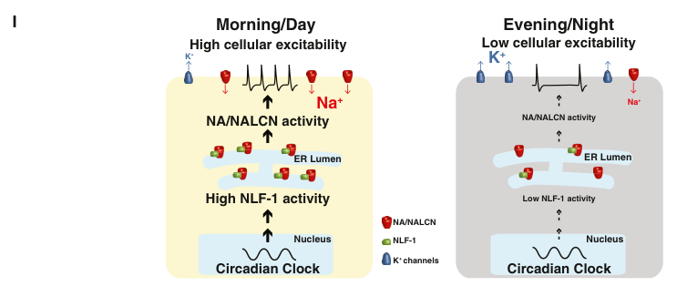

## Question

# Gene Research for Functional Annotation

## ⚠️ CRITICAL: Gene/Protein Identification Context

**BEFORE YOU BEGIN RESEARCH:** You MUST verify you are researching the CORRECT gene/protein. Gene symbols can be ambiguous, especially for less well-characterized genes from non-model organisms.

### Target Gene/Protein Identity (from UniProt):
- **UniProt Accession:** A8JUW5
- **Protein Description:** RecName: Full=Sodium leak channel NALCN {ECO:0000256|ARBA:ARBA00074738}; AltName: Full=Sodium leak channel non-selective protein {ECO:0000256|ARBA:ARBA00081688}; AltName: Full=Voltage gated channel-like protein 1 {ECO:0000256|ARBA:ARBA00082498};
- **Gene Information:** Name=na {ECO:0000313|EMBL:ABW09413.2, ECO:0000313|FlyBase:FBgn0002917}; Synonyms=alpha1U {ECO:0000313|EMBL:ABW09413.2}, Dma1U {ECO:0000313|EMBL:ABW09413.2}, Dmalpha1U {ECO:0000313|EMBL:ABW09413.2}, Dmel\CG1517 {ECO:0000313|EMBL:ABW09413.2}, har {ECO:0000313|EMBL:ABW09413.2}, har 38 {ECO:0000313|EMBL:ABW09413.2}, har 85 {ECO:0000313|EMBL:ABW09413.2}, har38 {ECO:0000313|EMBL:ABW09413.2}, har85 {ECO:0000313|EMBL:ABW09413.2}, harA {ECO:0000313|EMBL:ABW09413.2}, NA {ECO:0000313|EMBL:ABW09413.2}, Na {ECO:0000313|EMBL:ABW09413.2}, NALCN {ECO:0000313|EMBL:ABW09413.2}; ORFNames=CG1517 {ECO:0000313|EMBL:ABW09413.2, ECO:0000313|FlyBase:FBgn0002917}, Dmel_CG1517 {ECO:0000313|EMBL:ABW09413.2};
- **Organism (full):** Drosophila melanogaster (Fruit fly).
- **Protein Family:** Belongs to the NALCN family.
- **Key Domains:** Ion_trans_dom. (IPR005821); NALCN. (IPR028823); Volt_channel_dom_sf. (IPR027359); Ion_trans (PF00520)

### MANDATORY VERIFICATION STEPS:

1. **Check if the gene symbol "na" matches the protein description above**
2. **Verify the organism is correct:** Drosophila melanogaster (Fruit fly).
3. **Check if protein family/domains align with what you find in literature**
4. **If you find literature for a DIFFERENT gene with the same or similar symbol, STOP**

### If Gene Symbol is Ambiguous or You Cannot Find Relevant Literature:

**DO NOT PROCEED WITH RESEARCH ON A DIFFERENT GENE.** Instead:
- State clearly: "The gene symbol 'na' is ambiguous or literature is limited for this specific protein"
- Explain what you found (e.g., "Found extensive literature on a different gene with the same symbol in a different organism")
- Describe the protein based ONLY on the UniProt information provided above
- Suggest that the protein function can be inferred from domain/family information

### Research Target:

Please provide a comprehensive research report on the gene **na** (gene ID: na, UniProt: A8JUW5) in DROME.

The research report should be a detailed narrative explaining the function, biological processes, and localization of the gene product. Citations should be given for all claims.

You should prioritize authoritative reviews and primary scientific literature when conducting research. You can supplement
this with annotations you find in gene/protein databases, but these can be outdated or inaccurate.

We are specifically interested in the primary function of the gene - for enzymes, what reaction is catalyzed, and what is the substrate specificity? For transporters, what is the substrate? For structural proteins or adapters, what is the broader structural role? For signaling molecules, what is the role in the pathway.

We are interested in where in or outside the cell the gene product carries out its function.

We are also interested in the signaling or biochemical pathways in which the gene functions. We are less interested in broad pleiotropic effects, except where these elucidate the precise role.

Include evidence where possible. We are interested in both experimental evidence as well as inference from structure, evolution, or bioinformatic analysis. Precise studies should be prioritized over high-throughput, where available.

## Output

Question: You are an expert researcher providing comprehensive, well-cited information.

Provide detailed information focusing on:
1. Key concepts and definitions with current understanding
2. Recent developments and latest research (prioritize 2023-2024 sources)
3. Current applications and real-world implementations
4. Expert opinions and analysis from authoritative sources
5. Relevant statistics and data from recent studies

Format as a comprehensive research report with proper citations. Include URLs and publication dates where available.
Always prioritize recent, authoritative sources and provide specific citations for all major claims.

# Gene Research for Functional Annotation

## ⚠️ CRITICAL: Gene/Protein Identification Context

**BEFORE YOU BEGIN RESEARCH:** You MUST verify you are researching the CORRECT gene/protein. Gene symbols can be ambiguous, especially for less well-characterized genes from non-model organisms.

### Target Gene/Protein Identity (from UniProt):
- **UniProt Accession:** A8JUW5
- **Protein Description:** RecName: Full=Sodium leak channel NALCN {ECO:0000256|ARBA:ARBA00074738}; AltName: Full=Sodium leak channel non-selective protein {ECO:0000256|ARBA:ARBA00081688}; AltName: Full=Voltage gated channel-like protein 1 {ECO:0000256|ARBA:ARBA00082498};
- **Gene Information:** Name=na {ECO:0000313|EMBL:ABW09413.2, ECO:0000313|FlyBase:FBgn0002917}; Synonyms=alpha1U {ECO:0000313|EMBL:ABW09413.2}, Dma1U {ECO:0000313|EMBL:ABW09413.2}, Dmalpha1U {ECO:0000313|EMBL:ABW09413.2}, Dmel\CG1517 {ECO:0000313|EMBL:ABW09413.2}, har {ECO:0000313|EMBL:ABW09413.2}, har 38 {ECO:0000313|EMBL:ABW09413.2}, har 85 {ECO:0000313|EMBL:ABW09413.2}, har38 {ECO:0000313|EMBL:ABW09413.2}, har85 {ECO:0000313|EMBL:ABW09413.2}, harA {ECO:0000313|EMBL:ABW09413.2}, NA {ECO:0000313|EMBL:ABW09413.2}, Na {ECO:0000313|EMBL:ABW09413.2}, NALCN {ECO:0000313|EMBL:ABW09413.2}; ORFNames=CG1517 {ECO:0000313|EMBL:ABW09413.2, ECO:0000313|FlyBase:FBgn0002917}, Dmel_CG1517 {ECO:0000313|EMBL:ABW09413.2};
- **Organism (full):** Drosophila melanogaster (Fruit fly).
- **Protein Family:** Belongs to the NALCN family.
- **Key Domains:** Ion_trans_dom. (IPR005821); NALCN. (IPR028823); Volt_channel_dom_sf. (IPR027359); Ion_trans (PF00520)

### MANDATORY VERIFICATION STEPS:

1. **Check if the gene symbol "na" matches the protein description above**
2. **Verify the organism is correct:** Drosophila melanogaster (Fruit fly).
3. **Check if protein family/domains align with what you find in literature**
4. **If you find literature for a DIFFERENT gene with the same or similar symbol, STOP**

### If Gene Symbol is Ambiguous or You Cannot Find Relevant Literature:

**DO NOT PROCEED WITH RESEARCH ON A DIFFERENT GENE.** Instead:
- State clearly: "The gene symbol 'na' is ambiguous or literature is limited for this specific protein"
- Explain what you found (e.g., "Found extensive literature on a different gene with the same symbol in a different organism")
- Describe the protein based ONLY on the UniProt information provided above
- Suggest that the protein function can be inferred from domain/family information

### Research Target:

Please provide a comprehensive research report on the gene **na** (gene ID: na, UniProt: A8JUW5) in DROME.

The research report should be a detailed narrative explaining the function, biological processes, and localization of the gene product. Citations should be given for all claims.

You should prioritize authoritative reviews and primary scientific literature when conducting research. You can supplement
this with annotations you find in gene/protein databases, but these can be outdated or inaccurate.

We are specifically interested in the primary function of the gene - for enzymes, what reaction is catalyzed, and what is the substrate specificity? For transporters, what is the substrate? For structural proteins or adapters, what is the broader structural role? For signaling molecules, what is the role in the pathway.

We are interested in where in or outside the cell the gene product carries out its function.

We are also interested in the signaling or biochemical pathways in which the gene functions. We are less interested in broad pleiotropic effects, except where these elucidate the precise role.

Include evidence where possible. We are interested in both experimental evidence as well as inference from structure, evolution, or bioinformatic analysis. Precise studies should be prioritized over high-throughput, where available.

# Functional annotation report: *Drosophila melanogaster na* (UniProt A8JUW5)

## Identity and principal function

**Gene identity is verified.** The supplied UniProt record identifies A8JUW5 as the *D. melanogaster* protein encoded by *na*/CG1517, also called **NARROW ABDOMEN**, Dmα1U and *har*. Independently, Nash and colleagues genetically mapped the fly *na/har* locus to CG1517, identified mutant sequence changes, and associated one splice-site variant with the anesthetic and walking phenotypes. Subsequent fly studies identify NA as the ortholog of mammalian NALCN—not a human protein that happens to share its name. Its ion-transport and voltage-channel-like domain annotations are consistent with this assignment. (nash2002anunusualcation pages 1-2, lear2013unc79andunc80 pages 1-2, ren2011sodiumleakchannels pages 2-3)

**Recommended primary annotation:** NA is the **pore-forming component of a neuronal, background cation channel that conducts a depolarizing Na⁺ leak current across the plasma membrane**. It helps set resting membrane potential and excitability, particularly in circadian pacemaker neurons. It transports ions; it does not catalyze a biochemical reaction. Fly patch-clamp experiments identify a tetrodotoxin-insensitive, extracellular-Na⁺-dependent current that falls in *na* mutants and returns with *na* expression. Thus Na⁺ conduction is established directly in flies, whereas a complete Na⁺/K⁺/Li⁺ permeability ranking for fly NA is not. (flourakis2015aconservedbicycle pages 5-6, flourakis2015aconservedbicycle pages 1-3, flourakis2015aconservedbicycle pages 10-11)

The protein has four homologous, six-transmembrane-segment domains and a conserved **EEKE pore motif**, fitting the NALCN branch of the NaV/CaV-related channel superfamily. Changing its pore signature from EEKE to EEEE impaired behavioral rescue even when mutant protein was expressed, providing fly genetic evidence that a functional ion-conducting pore—not simply the protein’s presence—is important. This experiment does **not** itself determine the altered pore’s ion selectivity. (lear2005theionchannel pages 1-2, lear2005theionchannel pages 6-7, monteil2024newinsightsinto pages 10-12)

| Functional annotation | Fly evidence | Inference / uncertainty | Core DOI URL and year |
|---|---|---|---|
| **Gene identity: `na` = `CG1517` = `Dmα1U`, the fly NALCN-family channel** | Genetic mapping, mutant sequencing and recombination linked `na`/`har` phenotypes to `CG1517`; `har85` alters a splice junction. This independently matches the supplied *D. melanogaster* A8JUW5 record. (nash2002anunusualcation pages 1-2) | High-confidence identity. “NALCN” denotes orthology/family membership; A8JUW5 is the fly protein, not human NALCN. | [10.1016/S0960-9822(02)01358-1](https://doi.org/10.1016/S0960-9822(02)01358-1), 2002 |
| **Neuronal sodium-leak conductance** | In DN1p pacemaker neurons, a TTX-resistant, NMDG-sensitive current was reduced in `na` mutants and restored by `na` rescue. At ZT0–4, Nlf-1 RNAi reduced current density from **1.9 ± 0.7 pA/pF** (control, *n*=4) to **0.6 ± 0.2 pA/pF** (*n*=5; *p*<0.05). (flourakis2015aconservedbicycle pages 5-6, flourakis2015aconservedbicycle pages 8-9) | Direct fly evidence supports inward Na⁺ leak as the primary transported current. A complete fly ion-permeability series was not measured. | [10.1016/j.cell.2015.07.036](https://doi.org/10.1016/j.cell.2015.07.036), 2015 |
| **Neuronal membrane/neuropil localization** | Immunostaining concentrated NA in synaptic neuropil, especially ellipsoid-body lateral triangles in the central complex and medulla/lobula regions of the optic lobe; staining was strongly reduced in mutants. (nash2002anunusualcation pages 1-2, nash2002anunusualcation pages 2-4) | Supports neuronal plasma-membrane/neuropil function, but the experiment did not resolve nanoscale pre- versus postsynaptic localization. | [10.1016/S0960-9822(02)01358-1](https://doi.org/10.1016/S0960-9822(02)01358-1), 2002 |
| **NA–UNC79–UNC80 channel complex** | Co-immunoprecipitation from adult fly-head membrane preparations demonstrated that NA, UNC79 and UNC80 associate; loss of any component reduced the others post-transcriptionally. (lear2013unc79andunc80 pages 10-11, lear2013unc79andunc80 pages 11-12) | Direct evidence for a fly complex. Exact stoichiometry and atomic arrangement derive from later vertebrate structures, not these fly experiments. | [10.1371/journal.pone.0078147](https://doi.org/10.1371/journal.pone.0078147), 2013 |
| **Circadian neural output and functional pore** | `na` mutants retained substantial PERIOD oscillation but lost robust behavioral rhythms, placing NA mainly downstream of the molecular clock. Clock-neuron rescue restored rhythmicity; changing the conserved **EEKE** pore motif to **EEEE** failed to rescue effectively despite protein expression. (lear2005theionchannel pages 1-2, lear2005theionchannel pages 6-7) | Strong genetic evidence that ion conduction—not merely a structural role—is required. Elevated terminal PDF immunoreactivity suggests reduced release but is not a direct secretion measurement. | [10.1016/j.neuron.2005.10.030](https://doi.org/10.1016/j.neuron.2005.10.030), 2005 |
| **Long-lived, developmentally supplied channel complex** | Developmentally produced NA complex persisted into adulthood; pooled temperature-shift data yielded an estimated NA half-life of **~29 days**, while adult-only expression generated ~27–30% of developmental/constitutive protein levels. (moose2017thenarrowabdomen pages 8-9, moose2017thenarrowabdomen pages 9-10) | The 29-day value is an indirect estimate from head extracts, not a direct single-molecule turnover measurement. Findings qualify a simple model of daily replacement through rhythmic Nlf-1 trafficking. | [10.3389/fncel.2017.00159](https://doi.org/10.3389/fncel.2017.00159), 2017 |
| **Conserved NALCN selectivity and gating context** | No corresponding measurements were made on fly NA in this source. Mammalian/vertebrate channelosomes expressed heterologously showed **PNa ≈ PLi > PK > PCs**, direct Ca²⁺ pore block, and partial voltage dependence mediated mainly by S4 charges in domains I–II. (monteil2024newinsightsinto pages 24-25) | Orthology-based mechanistic inference only. These permeability, Ca²⁺-block and voltage-dependence values must **not** be annotated as direct *Drosophila* measurements. | [10.1152/physrev.00014.2022](https://doi.org/10.1152/physrev.00014.2022), 2024 |

*Table: Direct Drosophila evidence is separated from mechanistic inference based on vertebrate NALCN. The table highlights provenance, quantitative results and key limitations for functional annotation of A8JUW5.*

## Cellular location and molecular partners

NA carries out its transport function at **neuronal membranes**, with immunostaining concentrated in adult-brain neuropil rather than primarily in cell-body regions. Observed sites include the ellipsoid body of the central complex and the medulla and lobula regions of the optic lobe; NA is also expressed in circadian pacemaker neurons and their projections. These experiments establish regional localization but do not resolve a universal presynaptic-versus-postsynaptic placement for individual channels. (nash2002anunusualcation pages 2-4, lear2005theionchannel pages 1-2, lear2005theionchannel pages 8-9)

NA participates in a **channel complex with UNC79 and UNC80**: the proteins co-immunoprecipitate from fly-head preparations, and disrupting any one lowers the abundance of the others largely without parallel transcript reductions. Raising NA expression does not substitute for either missing auxiliary protein, indicating that their role is more than maintaining NA abundance. Nlf-1/CG33988 is a further functional regulator: its knockdown lowers NA-dependent current and NA protein abundance. A precise physical interaction or direct demonstration of NLF-1-driven trafficking of NA to the fly neuronal surface was **not** established by the fly measurements cited here. Cryo-EM evidence placing FAM155 near the extracellular pore and UNC79–UNC80 on the intracellular side comes from **human**, not fly, channelosomes. (lear2013unc79andunc80 pages 11-12, lear2013unc79andunc80 pages 10-11, flourakis2015aconservedbicycle pages 7-8, monteil2024newinsightsinto pages 17-19, monteil2024newinsightsinto pages 15-17)

## Biological process: electrical output of the circadian clock

The clearest circuit-level role of NA is to convert molecular-clock timing into rhythmic neuronal activity and locomotion. *na* mutants have impaired light–dark anticipatory behavior and weak free-running rhythms, yet retain substantial oscillations of the clock protein PERIOD. Expression of NA in clock neurons rescues behavioral defects; experiments targeting distinct pacemaker subsets indicate that their contributions to morning, evening and constant-dark behavior differ. NA therefore acts **primarily in clock-neuron excitability and output**, rather than as an indispensable component of the core transcriptional clock. The original investigators also observed subtle PERIOD and period-length changes, so “downstream” should not be taken to mean that feedback on the clock is impossible. (lear2005theionchannel pages 1-2, lear2005theionchannel pages 6-7, lear2005theionchannel pages 9-10)

Direct recordings give the mechanism specificity. In posterior dorsal clock neurons (DN1p), the NA-dependent sodium current is greater in the morning (**ZT0–4**) than toward evening (**ZT8–12**); its rhythm is reduced in *na* mutants and restored by neuronal *na* rescue. In rescued mutant DN1p neurons, measured current densities were **2.3 ± 0.3 pA/pF** in the morning versus **1.1 ± 0.1 pA/pF** in the evening (*n* = 4 at each time). Reducing Nlf-1 lowered morning sodium-current density from **1.9 ± 0.7** to **0.6 ± 0.2 pA/pF** (control *n* = 4; knockdown *n* = 5; *p* < 0.05) and left neurons hyperpolarized and relatively silent. Nlf-1 overexpression raised evening current from **1.0 ± 0.05** to **1.9 ± 0.1 pA/pF** in the tested groups. Related clock-dependent current rhythms were reported in large ventral lateral neurons. These are **fly-neuron measurements**, not measurements transferred from mouse suprachiasmatic neurons. (flourakis2015aconservedbicycle pages 5-6, flourakis2015aconservedbicycle pages 6-7, flourakis2015aconservedbicycle pages 9-10, flourakis2015aconservedbicycle pages 8-9)

The resulting **“bicycle” model** describes opposing electrical drives: higher daytime NA-mediated inward sodium leak favors depolarization and firing, whereas a stronger evening potassium conductance favors hyperpolarization. Nlf-1 transcript cycles in DN1p neurons even under initial constant darkness; *na*, *unc79* and *unc80* transcripts did not show comparably robust cycles in that study. The model is supported by electrophysiology and Nlf-1 manipulations, but its depiction of daily channel delivery should not be mistaken for direct imaging of rhythmic surface trafficking in fly neurons. The relevant schematic is Figure 6I of Flourakis *et al.* (2015). (flourakis2015aconservedbicycle pages 4-4, flourakis2015aconservedbicycle pages 7-8, flourakis2015aconservedbicycle pages 6-7, flourakis2015aconservedbicycle media 3b551e40)

An additional output hypothesis involves the neuropeptide **PDF**. *na* mutants accumulate PDF immunoreactivity in clock-neuron dorsal terminals at a time when it is normally low, consistent with altered release or turnover. **Extracellular PDF secretion was not directly measured**, however, and the behavioral evidence does not imply that PDF signaling is abolished. NA’s established molecular action remains ion conduction, not direct PDF transport. (lear2005theionchannel pages 8-9, lear2013unc79andunc80 pages 10-11)

## Recent interpretation, wider uses and limitations

A 2017 temporal-expression study refined the rhythmic-trafficking interpretation. Much fly-head NA-complex protein made during development persisted for **at least 5–7 adult days**; pooled abundance measurements yielded an **approximately 29-day half-life estimate** for NA. Adult-only expression produced substantially less protein than developmental/constitutive expression. These findings suggest that the daily change in measured current need not result solely from wholesale daily replacement of surface channels: post-translational regulation, persistent developmental protein, and possibly cell-specific turnover remain relevant. The half-life is an estimate from head extracts, **not** a direct turnover measurement in identified DN1p membranes. (moose2017thenarrowabdomen pages 1-2, moose2017thenarrowabdomen pages 9-10)

The complex is experimentally useful for dissecting circuit output. In one fly genetic comparison, pacemaker-neuron transgenic rescue yielded **97% rhythmic** *unc79* mutants (*n* = 61) and **93% rhythmic** *unc80* mutants (*n* = 42), compared with **7%** (*n* = 56) and **3%** (*n* = 66), respectively, in corresponding mutant controls. NA-associated phenotypes also include reversed relative light-versus-dark locomotor activity, disrupted walking/anesthetic responses and social behavior, but these pleiotropic observations do not establish additional transported substrates or a distinct primary molecular function. (lear2013unc79andunc80 pages 9-10, nash2002anunusualcation pages 1-2, nash2002anunusualcation pages 4-5, cochetbissuel2014thesodiumleak pages 6-7)

**What 2023–2024 research adds—and what it does not:** the authoritative **2024 *Physiological Reviews*** synthesis updates NALCN biophysics using principally vertebrate expression systems. Those studies report **PNa ≈ PLi > PK > PCs**, direct inhibition of monovalent current by extracellular Ca²⁺ and other divalent ions, and voltage sensitivity involving S4 charges chiefly in domains I–II. Thus “leak” does **not** mean that every assembly is perfectly voltage independent. Human channelosome structures further define auxiliary-subunit organization. These are valuable conserved-family insights, **not direct determinations of the fly A8JUW5 channel’s permeability series, Ca²⁺ block or atomic structure**. Similarly, GPCR/Src-dependent modulation demonstrated for other species should not automatically be annotated as an established *Drosophila na* signaling pathway. The searches for this report did not establish a 2023–2024 fly-specific experiment that supersedes the cited mechanistic fly studies. (monteil2024newinsightsinto pages 24-25, monteil2024newinsightsinto pages 17-19, monteil2024newinsightsinto pages 29-31)

**Bottom line:** annotate A8JUW5 with high confidence as a neuronal membrane **Na⁺-conducting NALCN-family channel subunit**, functioning with UNC79/UNC80 and regulated by Nlf-1 to provide depolarizing background current. Its best-demonstrated biological pathway in *Drosophila* is the electrical-output arm of the circadian pacemaker; precise fly-specific permeability beyond Na⁺, surface-trafficking dynamics and direct PDF-release mechanisms remain less certain. (nash2002anunusualcation pages 1-2, flourakis2015aconservedbicycle pages 5-6, lear2013unc79andunc80 pages 11-12, flourakis2015aconservedbicycle pages 7-8, lear2005theionchannel pages 8-9)

### Principal sources and publication dates

- Nash *et al.*, “An Unusual Cation Channel Mediates Photic Control of Locomotion in Drosophila,” *Current Biology*, **December 2002**. https://doi.org/10.1016/S0960-9822(02)01358-1. (nash2002anunusualcation pages 1-2)
- Lear *et al.*, “The Ion Channel Narrow Abdomen Is Critical for Neural Output of the Drosophila Circadian Pacemaker,” *Neuron*, **December 2005**. https://doi.org/10.1016/j.neuron.2005.10.030. (lear2005theionchannel pages 1-2)
- Lear *et al.*, “UNC79 and UNC80 …,” *PLOS ONE*, **November 2013**. https://doi.org/10.1371/journal.pone.0078147. (lear2013unc79andunc80 pages 11-12)
- Flourakis *et al.*, “A Conserved Bicycle Model for Circadian Clock Control of Membrane Excitability,” *Cell*, **August 2015**. https://doi.org/10.1016/j.cell.2015.07.036. (flourakis2015aconservedbicycle pages 5-6, flourakis2015aconservedbicycle pages 7-8)
- Moose *et al.*, “The Narrow Abdomen Ion Channel Complex Is Highly Stable …,” *Frontiers in Cellular Neuroscience*, **June 2017**. https://doi.org/10.3389/fncel.2017.00159. (moose2017thenarrowabdomen pages 9-10)
- Monteil *et al.*, “New insights into the physiology and pathophysiology of the atypical sodium leak channel NALCN,” *Physiological Reviews*, **January 2024**. https://doi.org/10.1152/physrev.00014.2022. (monteil2024newinsightsinto pages 24-25)

References

1. (nash2002anunusualcation pages 1-2): Howard A. Nash, Robert L. Scott, Bridget C. Lear, and Ravi Allada. An unusual cation channel mediates photic control of locomotion in drosophila. Current Biology, 12:2152-2158, Dec 2002. URL: https://doi.org/10.1016/s0960-9822(02)01358-1, doi:10.1016/s0960-9822(02)01358-1. This article has 112 citations and is from a highest quality peer-reviewed journal.

2. (lear2013unc79andunc80 pages 1-2): Bridget C. Lear, Eric J. Darrah, Benjamin T. Aldrich, Senetibeb Gebre, Robert L. Scott, Howard A. Nash, and Ravi Allada. Unc79 and unc80, putative auxiliary subunits of the narrow abdomen ion channel, are indispensable for robust circadian locomotor rhythms in drosophila. PLoS ONE, 8:e78147, Nov 2013. URL: https://doi.org/10.1371/journal.pone.0078147, doi:10.1371/journal.pone.0078147. This article has 62 citations and is from a peer-reviewed journal.

3. (ren2011sodiumleakchannels pages 2-3): Dejian Ren. Sodium leak channels in neuronal excitability and rhythmic behaviors. Neuron, 72:899-911, Dec 2011. URL: https://doi.org/10.1016/j.neuron.2011.12.007, doi:10.1016/j.neuron.2011.12.007. This article has 203 citations and is from a highest quality peer-reviewed journal.

4. (flourakis2015aconservedbicycle pages 5-6): Matthieu Flourakis, Elzbieta Kula-Eversole, Alan L. Hutchison, Tae Hee Han, Kimberly Aranda, Devon L. Moose, Kevin P. White, Aaron R. Dinner, Bridget C. Lear, Dejian Ren, Casey O. Diekman, Indira M. Raman, and Ravi Allada. A conserved bicycle model for circadian clock control of membrane excitability. Cell, 162:836-848, Aug 2015. URL: https://doi.org/10.1016/j.cell.2015.07.036, doi:10.1016/j.cell.2015.07.036. This article has 252 citations and is from a highest quality peer-reviewed journal.

5. (flourakis2015aconservedbicycle pages 1-3): Matthieu Flourakis, Elzbieta Kula-Eversole, Alan L. Hutchison, Tae Hee Han, Kimberly Aranda, Devon L. Moose, Kevin P. White, Aaron R. Dinner, Bridget C. Lear, Dejian Ren, Casey O. Diekman, Indira M. Raman, and Ravi Allada. A conserved bicycle model for circadian clock control of membrane excitability. Cell, 162:836-848, Aug 2015. URL: https://doi.org/10.1016/j.cell.2015.07.036, doi:10.1016/j.cell.2015.07.036. This article has 252 citations and is from a highest quality peer-reviewed journal.

6. (flourakis2015aconservedbicycle pages 10-11): Matthieu Flourakis, Elzbieta Kula-Eversole, Alan L. Hutchison, Tae Hee Han, Kimberly Aranda, Devon L. Moose, Kevin P. White, Aaron R. Dinner, Bridget C. Lear, Dejian Ren, Casey O. Diekman, Indira M. Raman, and Ravi Allada. A conserved bicycle model for circadian clock control of membrane excitability. Cell, 162:836-848, Aug 2015. URL: https://doi.org/10.1016/j.cell.2015.07.036, doi:10.1016/j.cell.2015.07.036. This article has 252 citations and is from a highest quality peer-reviewed journal.

7. (lear2005theionchannel pages 1-2): Bridget C. Lear, Jui-Ming Lin, J. Russel Keath, Jermaine J. McGill, Indira M. Raman, and Ravi Allada. The ion channel narrow abdomen is critical for neural output of the drosophila circadian pacemaker. Neuron, 48:965-976, Dec 2005. URL: https://doi.org/10.1016/j.neuron.2005.10.030, doi:10.1016/j.neuron.2005.10.030. This article has 136 citations and is from a highest quality peer-reviewed journal.

8. (lear2005theionchannel pages 6-7): Bridget C. Lear, Jui-Ming Lin, J. Russel Keath, Jermaine J. McGill, Indira M. Raman, and Ravi Allada. The ion channel narrow abdomen is critical for neural output of the drosophila circadian pacemaker. Neuron, 48:965-976, Dec 2005. URL: https://doi.org/10.1016/j.neuron.2005.10.030, doi:10.1016/j.neuron.2005.10.030. This article has 136 citations and is from a highest quality peer-reviewed journal.

9. (monteil2024newinsightsinto pages 10-12): Arnaud Monteil, Nathalie C. Guérineau, Antonio Gil-Nagel, Paloma Parra-Diaz, Philippe Lory, and Adriano Senatore. New insights into the physiology and pathophysiology of the atypical sodium leak channel nalcn. Physiological Reviews, 104:399-472, Jan 2024. URL: https://doi.org/10.1152/physrev.00014.2022, doi:10.1152/physrev.00014.2022. This article has 47 citations and is from a highest quality peer-reviewed journal.

10. (flourakis2015aconservedbicycle pages 8-9): Matthieu Flourakis, Elzbieta Kula-Eversole, Alan L. Hutchison, Tae Hee Han, Kimberly Aranda, Devon L. Moose, Kevin P. White, Aaron R. Dinner, Bridget C. Lear, Dejian Ren, Casey O. Diekman, Indira M. Raman, and Ravi Allada. A conserved bicycle model for circadian clock control of membrane excitability. Cell, 162:836-848, Aug 2015. URL: https://doi.org/10.1016/j.cell.2015.07.036, doi:10.1016/j.cell.2015.07.036. This article has 252 citations and is from a highest quality peer-reviewed journal.

11. (nash2002anunusualcation pages 2-4): Howard A. Nash, Robert L. Scott, Bridget C. Lear, and Ravi Allada. An unusual cation channel mediates photic control of locomotion in drosophila. Current Biology, 12:2152-2158, Dec 2002. URL: https://doi.org/10.1016/s0960-9822(02)01358-1, doi:10.1016/s0960-9822(02)01358-1. This article has 112 citations and is from a highest quality peer-reviewed journal.

12. (lear2013unc79andunc80 pages 10-11): Bridget C. Lear, Eric J. Darrah, Benjamin T. Aldrich, Senetibeb Gebre, Robert L. Scott, Howard A. Nash, and Ravi Allada. Unc79 and unc80, putative auxiliary subunits of the narrow abdomen ion channel, are indispensable for robust circadian locomotor rhythms in drosophila. PLoS ONE, 8:e78147, Nov 2013. URL: https://doi.org/10.1371/journal.pone.0078147, doi:10.1371/journal.pone.0078147. This article has 62 citations and is from a peer-reviewed journal.

13. (lear2013unc79andunc80 pages 11-12): Bridget C. Lear, Eric J. Darrah, Benjamin T. Aldrich, Senetibeb Gebre, Robert L. Scott, Howard A. Nash, and Ravi Allada. Unc79 and unc80, putative auxiliary subunits of the narrow abdomen ion channel, are indispensable for robust circadian locomotor rhythms in drosophila. PLoS ONE, 8:e78147, Nov 2013. URL: https://doi.org/10.1371/journal.pone.0078147, doi:10.1371/journal.pone.0078147. This article has 62 citations and is from a peer-reviewed journal.

14. (moose2017thenarrowabdomen pages 8-9): Devon L. Moose, Stephanie J. Haase, Benjamin T. Aldrich, and Bridget C. Lear. The narrow abdomen ion channel complex is highly stable and persists from development into adult stages to promote behavioral rhythmicity. Frontiers in Cellular Neuroscience, Jun 2017. URL: https://doi.org/10.3389/fncel.2017.00159, doi:10.3389/fncel.2017.00159. This article has 17 citations.

15. (moose2017thenarrowabdomen pages 9-10): Devon L. Moose, Stephanie J. Haase, Benjamin T. Aldrich, and Bridget C. Lear. The narrow abdomen ion channel complex is highly stable and persists from development into adult stages to promote behavioral rhythmicity. Frontiers in Cellular Neuroscience, Jun 2017. URL: https://doi.org/10.3389/fncel.2017.00159, doi:10.3389/fncel.2017.00159. This article has 17 citations.

16. (monteil2024newinsightsinto pages 24-25): Arnaud Monteil, Nathalie C. Guérineau, Antonio Gil-Nagel, Paloma Parra-Diaz, Philippe Lory, and Adriano Senatore. New insights into the physiology and pathophysiology of the atypical sodium leak channel nalcn. Physiological Reviews, 104:399-472, Jan 2024. URL: https://doi.org/10.1152/physrev.00014.2022, doi:10.1152/physrev.00014.2022. This article has 47 citations and is from a highest quality peer-reviewed journal.

17. (lear2005theionchannel pages 8-9): Bridget C. Lear, Jui-Ming Lin, J. Russel Keath, Jermaine J. McGill, Indira M. Raman, and Ravi Allada. The ion channel narrow abdomen is critical for neural output of the drosophila circadian pacemaker. Neuron, 48:965-976, Dec 2005. URL: https://doi.org/10.1016/j.neuron.2005.10.030, doi:10.1016/j.neuron.2005.10.030. This article has 136 citations and is from a highest quality peer-reviewed journal.

18. (flourakis2015aconservedbicycle pages 7-8): Matthieu Flourakis, Elzbieta Kula-Eversole, Alan L. Hutchison, Tae Hee Han, Kimberly Aranda, Devon L. Moose, Kevin P. White, Aaron R. Dinner, Bridget C. Lear, Dejian Ren, Casey O. Diekman, Indira M. Raman, and Ravi Allada. A conserved bicycle model for circadian clock control of membrane excitability. Cell, 162:836-848, Aug 2015. URL: https://doi.org/10.1016/j.cell.2015.07.036, doi:10.1016/j.cell.2015.07.036. This article has 252 citations and is from a highest quality peer-reviewed journal.

19. (monteil2024newinsightsinto pages 17-19): Arnaud Monteil, Nathalie C. Guérineau, Antonio Gil-Nagel, Paloma Parra-Diaz, Philippe Lory, and Adriano Senatore. New insights into the physiology and pathophysiology of the atypical sodium leak channel nalcn. Physiological Reviews, 104:399-472, Jan 2024. URL: https://doi.org/10.1152/physrev.00014.2022, doi:10.1152/physrev.00014.2022. This article has 47 citations and is from a highest quality peer-reviewed journal.

20. (monteil2024newinsightsinto pages 15-17): Arnaud Monteil, Nathalie C. Guérineau, Antonio Gil-Nagel, Paloma Parra-Diaz, Philippe Lory, and Adriano Senatore. New insights into the physiology and pathophysiology of the atypical sodium leak channel nalcn. Physiological Reviews, 104:399-472, Jan 2024. URL: https://doi.org/10.1152/physrev.00014.2022, doi:10.1152/physrev.00014.2022. This article has 47 citations and is from a highest quality peer-reviewed journal.

21. (lear2005theionchannel pages 9-10): Bridget C. Lear, Jui-Ming Lin, J. Russel Keath, Jermaine J. McGill, Indira M. Raman, and Ravi Allada. The ion channel narrow abdomen is critical for neural output of the drosophila circadian pacemaker. Neuron, 48:965-976, Dec 2005. URL: https://doi.org/10.1016/j.neuron.2005.10.030, doi:10.1016/j.neuron.2005.10.030. This article has 136 citations and is from a highest quality peer-reviewed journal.

22. (flourakis2015aconservedbicycle pages 6-7): Matthieu Flourakis, Elzbieta Kula-Eversole, Alan L. Hutchison, Tae Hee Han, Kimberly Aranda, Devon L. Moose, Kevin P. White, Aaron R. Dinner, Bridget C. Lear, Dejian Ren, Casey O. Diekman, Indira M. Raman, and Ravi Allada. A conserved bicycle model for circadian clock control of membrane excitability. Cell, 162:836-848, Aug 2015. URL: https://doi.org/10.1016/j.cell.2015.07.036, doi:10.1016/j.cell.2015.07.036. This article has 252 citations and is from a highest quality peer-reviewed journal.

23. (flourakis2015aconservedbicycle pages 9-10): Matthieu Flourakis, Elzbieta Kula-Eversole, Alan L. Hutchison, Tae Hee Han, Kimberly Aranda, Devon L. Moose, Kevin P. White, Aaron R. Dinner, Bridget C. Lear, Dejian Ren, Casey O. Diekman, Indira M. Raman, and Ravi Allada. A conserved bicycle model for circadian clock control of membrane excitability. Cell, 162:836-848, Aug 2015. URL: https://doi.org/10.1016/j.cell.2015.07.036, doi:10.1016/j.cell.2015.07.036. This article has 252 citations and is from a highest quality peer-reviewed journal.

24. (flourakis2015aconservedbicycle pages 4-4): Matthieu Flourakis, Elzbieta Kula-Eversole, Alan L. Hutchison, Tae Hee Han, Kimberly Aranda, Devon L. Moose, Kevin P. White, Aaron R. Dinner, Bridget C. Lear, Dejian Ren, Casey O. Diekman, Indira M. Raman, and Ravi Allada. A conserved bicycle model for circadian clock control of membrane excitability. Cell, 162:836-848, Aug 2015. URL: https://doi.org/10.1016/j.cell.2015.07.036, doi:10.1016/j.cell.2015.07.036. This article has 252 citations and is from a highest quality peer-reviewed journal.

25. (flourakis2015aconservedbicycle media 3b551e40): Matthieu Flourakis, Elzbieta Kula-Eversole, Alan L. Hutchison, Tae Hee Han, Kimberly Aranda, Devon L. Moose, Kevin P. White, Aaron R. Dinner, Bridget C. Lear, Dejian Ren, Casey O. Diekman, Indira M. Raman, and Ravi Allada. A conserved bicycle model for circadian clock control of membrane excitability. Cell, 162:836-848, Aug 2015. URL: https://doi.org/10.1016/j.cell.2015.07.036, doi:10.1016/j.cell.2015.07.036. This article has 252 citations and is from a highest quality peer-reviewed journal.

26. (moose2017thenarrowabdomen pages 1-2): Devon L. Moose, Stephanie J. Haase, Benjamin T. Aldrich, and Bridget C. Lear. The narrow abdomen ion channel complex is highly stable and persists from development into adult stages to promote behavioral rhythmicity. Frontiers in Cellular Neuroscience, Jun 2017. URL: https://doi.org/10.3389/fncel.2017.00159, doi:10.3389/fncel.2017.00159. This article has 17 citations.

27. (lear2013unc79andunc80 pages 9-10): Bridget C. Lear, Eric J. Darrah, Benjamin T. Aldrich, Senetibeb Gebre, Robert L. Scott, Howard A. Nash, and Ravi Allada. Unc79 and unc80, putative auxiliary subunits of the narrow abdomen ion channel, are indispensable for robust circadian locomotor rhythms in drosophila. PLoS ONE, 8:e78147, Nov 2013. URL: https://doi.org/10.1371/journal.pone.0078147, doi:10.1371/journal.pone.0078147. This article has 62 citations and is from a peer-reviewed journal.

28. (nash2002anunusualcation pages 4-5): Howard A. Nash, Robert L. Scott, Bridget C. Lear, and Ravi Allada. An unusual cation channel mediates photic control of locomotion in drosophila. Current Biology, 12:2152-2158, Dec 2002. URL: https://doi.org/10.1016/s0960-9822(02)01358-1, doi:10.1016/s0960-9822(02)01358-1. This article has 112 citations and is from a highest quality peer-reviewed journal.

29. (cochetbissuel2014thesodiumleak pages 6-7): Maud Cochet-Bissuel, Philippe Lory, and Arnaud Monteil. The sodium leak channel, nalcn, in health and disease. Frontiers in Cellular Neuroscience, May 2014. URL: https://doi.org/10.3389/fncel.2014.00132, doi:10.3389/fncel.2014.00132. This article has 192 citations.

30. (monteil2024newinsightsinto pages 29-31): Arnaud Monteil, Nathalie C. Guérineau, Antonio Gil-Nagel, Paloma Parra-Diaz, Philippe Lory, and Adriano Senatore. New insights into the physiology and pathophysiology of the atypical sodium leak channel nalcn. Physiological Reviews, 104:399-472, Jan 2024. URL: https://doi.org/10.1152/physrev.00014.2022, doi:10.1152/physrev.00014.2022. This article has 47 citations and is from a highest quality peer-reviewed journal.

## Artifacts

- [Edison artifact artifact-00](na-deep-research-falcon_artifacts/artifact-00.md)

## Citations

1. nash2002anunusualcation pages 1-2
2. monteil2024newinsightsinto pages 24-25
3. lear2005theionchannel pages 1-2
4. moose2017thenarrowabdomen pages 9-10
5. ren2011sodiumleakchannels pages 2-3
6. flourakis2015aconservedbicycle pages 5-6
7. flourakis2015aconservedbicycle pages 1-3
8. flourakis2015aconservedbicycle pages 10-11
9. lear2005theionchannel pages 6-7
10. monteil2024newinsightsinto pages 10-12
11. flourakis2015aconservedbicycle pages 8-9
12. nash2002anunusualcation pages 2-4
13. moose2017thenarrowabdomen pages 8-9
14. lear2005theionchannel pages 8-9
15. flourakis2015aconservedbicycle pages 7-8
16. monteil2024newinsightsinto pages 17-19
17. monteil2024newinsightsinto pages 15-17
18. lear2005theionchannel pages 9-10
19. flourakis2015aconservedbicycle pages 6-7
20. flourakis2015aconservedbicycle pages 9-10
21. flourakis2015aconservedbicycle pages 4-4
22. moose2017thenarrowabdomen pages 1-2
23. nash2002anunusualcation pages 4-5
24. cochetbissuel2014thesodiumleak pages 6-7
25. monteil2024newinsightsinto pages 29-31
26. 10.1016/S0960-9822(02)01358-1
27. 10.1016/j.cell.2015.07.036
28. 10.1371/journal.pone.0078147
29. 10.1016/j.neuron.2005.10.030
30. 10.3389/fncel.2017.00159
31. 10.1152/physrev.00014.2022
32. https://doi.org/10.1016/S0960-9822(02
33. https://doi.org/10.1016/j.cell.2015.07.036
34. https://doi.org/10.1371/journal.pone.0078147
35. https://doi.org/10.1016/j.neuron.2005.10.030
36. https://doi.org/10.3389/fncel.2017.00159
37. https://doi.org/10.1152/physrev.00014.2022
38. https://doi.org/10.1016/j.neuron.2005.10.030.
39. https://doi.org/10.1371/journal.pone.0078147.
40. https://doi.org/10.1016/j.cell.2015.07.036.
41. https://doi.org/10.3389/fncel.2017.00159.
42. https://doi.org/10.1152/physrev.00014.2022.
43. https://doi.org/10.1016/s0960-9822(02
44. https://doi.org/10.1371/journal.pone.0078147,
45. https://doi.org/10.1016/j.neuron.2011.12.007,
46. https://doi.org/10.1016/j.cell.2015.07.036,
47. https://doi.org/10.1016/j.neuron.2005.10.030,
48. https://doi.org/10.1152/physrev.00014.2022,
49. https://doi.org/10.3389/fncel.2017.00159,
50. https://doi.org/10.3389/fncel.2014.00132,