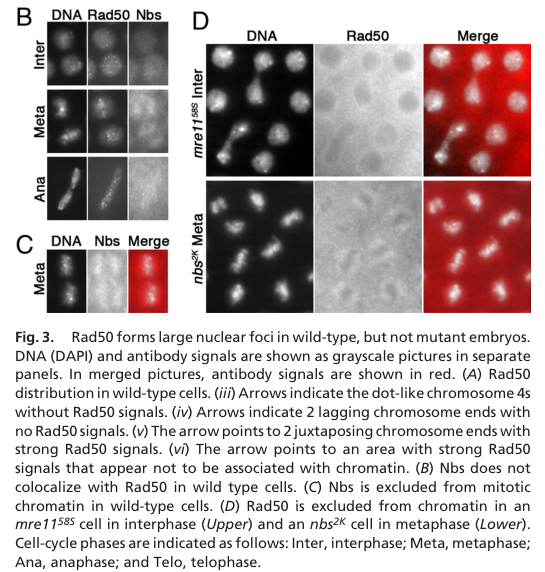
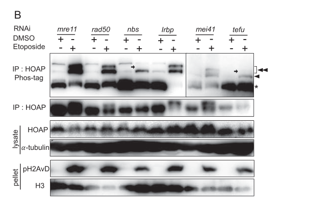

## Question

# Gene Research for Functional Annotation

## ⚠️ CRITICAL: Gene/Protein Identification Context

**BEFORE YOU BEGIN RESEARCH:** You MUST verify you are researching the CORRECT gene/protein. Gene symbols can be ambiguous, especially for less well-characterized genes from non-model organisms.

### Target Gene/Protein Identity (from UniProt):
- **UniProt Accession:** Q9VT40
- **Protein Description:** RecName: Full=Nibrin {ECO:0000256|ARBA:ARBA00020013, ECO:0000256|PIRNR:PIRNR011869};
- **Gene Information:** Name=nbs {ECO:0000313|EMBL:AAF50215.4, ECO:0000313|FlyBase:FBgn0261530}; Synonyms=6754 {ECO:0000313|EMBL:AAF50215.4}, Dmel\CG6754 {ECO:0000313|EMBL:AAF50215.4}, Dnbs1 {ECO:0000313|EMBL:AAF50215.4}, dNbs1 {ECO:0000313|EMBL:AAF50215.4}, l(3)67BDp {ECO:0000313|EMBL:AAF50215.4}, l(3)67BDr {ECO:0000313|EMBL:AAF50215.4}, l(3)e77A1 {ECO:0000313|EMBL:AAF50215.4}, NBS {ECO:0000313|EMBL:AAF50215.4}, Nbs {ECO:0000313|EMBL:AAF50215.4}, NBS1 {ECO:0000313|EMBL:AAF50215.4}, Nbs1 {ECO:0000313|EMBL:AAF50215.4}, nbs1 {ECO:0000313|EMBL:AAF50215.4}; ORFNames=CG6754 {ECO:0000313|EMBL:AAF50215.4, ECO:0000313|FlyBase:FBgn0261530}, Dmel_CG6754 {ECO:0000313|EMBL:AAF50215.4};
- **Organism (full):** Drosophila melanogaster (Fruit fly).
- **Protein Family:** Belongs to the Nibrin family.
- **Key Domains:** BRCT_dom. (IPR001357); BRCT_dom_sf. (IPR036420); FHA_dom. (IPR000253); Nibrin-rel. (IPR040227); Nibrin_BRCT2. (IPR032429)

### MANDATORY VERIFICATION STEPS:

1. **Check if the gene symbol "nbs" matches the protein description above**
2. **Verify the organism is correct:** Drosophila melanogaster (Fruit fly).
3. **Check if protein family/domains align with what you find in literature**
4. **If you find literature for a DIFFERENT gene with the same or similar symbol, STOP**

### If Gene Symbol is Ambiguous or You Cannot Find Relevant Literature:

**DO NOT PROCEED WITH RESEARCH ON A DIFFERENT GENE.** Instead:
- State clearly: "The gene symbol 'nbs' is ambiguous or literature is limited for this specific protein"
- Explain what you found (e.g., "Found extensive literature on a different gene with the same symbol in a different organism")
- Describe the protein based ONLY on the UniProt information provided above
- Suggest that the protein function can be inferred from domain/family information

### Research Target:

Please provide a comprehensive research report on the gene **nbs** (gene ID: nbs, UniProt: Q9VT40) in DROME.

The research report should be a detailed narrative explaining the function, biological processes, and localization of the gene product. Citations should be given for all claims.

You should prioritize authoritative reviews and primary scientific literature when conducting research. You can supplement
this with annotations you find in gene/protein databases, but these can be outdated or inaccurate.

We are specifically interested in the primary function of the gene - for enzymes, what reaction is catalyzed, and what is the substrate specificity? For transporters, what is the substrate? For structural proteins or adapters, what is the broader structural role? For signaling molecules, what is the role in the pathway.

We are interested in where in or outside the cell the gene product carries out its function.

We are also interested in the signaling or biochemical pathways in which the gene functions. We are less interested in broad pleiotropic effects, except where these elucidate the precise role.

Include evidence where possible. We are interested in both experimental evidence as well as inference from structure, evolution, or bioinformatic analysis. Precise studies should be prioritized over high-throughput, where available.

## Output

Question: You are an expert researcher providing comprehensive, well-cited information.

Provide detailed information focusing on:
1. Key concepts and definitions with current understanding
2. Recent developments and latest research (prioritize 2023-2024 sources)
3. Current applications and real-world implementations
4. Expert opinions and analysis from authoritative sources
5. Relevant statistics and data from recent studies

Format as a comprehensive research report with proper citations. Include URLs and publication dates where available.
Always prioritize recent, authoritative sources and provide specific citations for all major claims.

# Gene Research for Functional Annotation

## ⚠️ CRITICAL: Gene/Protein Identification Context

**BEFORE YOU BEGIN RESEARCH:** You MUST verify you are researching the CORRECT gene/protein. Gene symbols can be ambiguous, especially for less well-characterized genes from non-model organisms.

### Target Gene/Protein Identity (from UniProt):
- **UniProt Accession:** Q9VT40
- **Protein Description:** RecName: Full=Nibrin {ECO:0000256|ARBA:ARBA00020013, ECO:0000256|PIRNR:PIRNR011869};
- **Gene Information:** Name=nbs {ECO:0000313|EMBL:AAF50215.4, ECO:0000313|FlyBase:FBgn0261530}; Synonyms=6754 {ECO:0000313|EMBL:AAF50215.4}, Dmel\CG6754 {ECO:0000313|EMBL:AAF50215.4}, Dnbs1 {ECO:0000313|EMBL:AAF50215.4}, dNbs1 {ECO:0000313|EMBL:AAF50215.4}, l(3)67BDp {ECO:0000313|EMBL:AAF50215.4}, l(3)67BDr {ECO:0000313|EMBL:AAF50215.4}, l(3)e77A1 {ECO:0000313|EMBL:AAF50215.4}, NBS {ECO:0000313|EMBL:AAF50215.4}, Nbs {ECO:0000313|EMBL:AAF50215.4}, NBS1 {ECO:0000313|EMBL:AAF50215.4}, Nbs1 {ECO:0000313|EMBL:AAF50215.4}, nbs1 {ECO:0000313|EMBL:AAF50215.4}; ORFNames=CG6754 {ECO:0000313|EMBL:AAF50215.4, ECO:0000313|FlyBase:FBgn0261530}, Dmel_CG6754 {ECO:0000313|EMBL:AAF50215.4};
- **Organism (full):** Drosophila melanogaster (Fruit fly).
- **Protein Family:** Belongs to the Nibrin family.
- **Key Domains:** BRCT_dom. (IPR001357); BRCT_dom_sf. (IPR036420); FHA_dom. (IPR000253); Nibrin-rel. (IPR040227); Nibrin_BRCT2. (IPR032429)

### MANDATORY VERIFICATION STEPS:

1. **Check if the gene symbol "nbs" matches the protein description above**
2. **Verify the organism is correct:** Drosophila melanogaster (Fruit fly).
3. **Check if protein family/domains align with what you find in literature**
4. **If you find literature for a DIFFERENT gene with the same or similar symbol, STOP**

### If Gene Symbol is Ambiguous or You Cannot Find Relevant Literature:

**DO NOT PROCEED WITH RESEARCH ON A DIFFERENT GENE.** Instead:
- State clearly: "The gene symbol 'nbs' is ambiguous or literature is limited for this specific protein"
- Explain what you found (e.g., "Found extensive literature on a different gene with the same symbol in a different organism")
- Describe the protein based ONLY on the UniProt information provided above
- Suggest that the protein function can be inferred from domain/family information

### Research Target:

Please provide a comprehensive research report on the gene **nbs** (gene ID: nbs, UniProt: Q9VT40) in DROME.

The research report should be a detailed narrative explaining the function, biological processes, and localization of the gene product. Citations should be given for all claims.

You should prioritize authoritative reviews and primary scientific literature when conducting research. You can supplement
this with annotations you find in gene/protein databases, but these can be outdated or inaccurate.

We are specifically interested in the primary function of the gene - for enzymes, what reaction is catalyzed, and what is the substrate specificity? For transporters, what is the substrate? For structural proteins or adapters, what is the broader structural role? For signaling molecules, what is the role in the pathway.

We are interested in where in or outside the cell the gene product carries out its function.

We are also interested in the signaling or biochemical pathways in which the gene functions. We are less interested in broad pleiotropic effects, except where these elucidate the precise role.

Include evidence where possible. We are interested in both experimental evidence as well as inference from structure, evolution, or bioinformatic analysis. Precise studies should be prioritized over high-throughput, where available.

# Functional annotation of *nbs* in *Drosophila melanogaster*

## Identity and principal function

**The target is fruit-fly nibrin, not another protein abbreviated “NBS.”** The supplied UniProt accession [Q9VT40](https://www.uniprot.org/uniprotkb/Q9VT40/entry) identifies *D. melanogaster nbs*, also designated **CG6754** and FlyBase **FBgn0261530**. Species-specific studies independently identify fly Nbs as the nibrin/NBS1 component of the **Mre11–Rad50–Nbs (MRN) complex**. They describe an N-terminal FHA domain, two BRCT domains and a C-terminal Mre11-interaction region, consistent with the supplied domain annotation; the CG6754-to-Q9VT40 linkage itself comes from the supplied accession information. This is **not** a plant NBS–LRR resistance protein. (oikemus2006epigenetictelomereprotection pages 2-3, mukherjee2009dnadamageresponses pages 4-5)

**Primary annotation:** Nbs is a **nuclear DNA-damage-response and chromatin-associated adaptor**, not an enzyme or transporter. Its best-supported roles are to enable productive Mre11–Rad50 association with chromatin, support homology-directed repair of double-strand breaks (DSBs), transmit damage-dependent checkpoint signals, and help establish a chromosome-end state that prevents telomere fusion. DNA-end processing is a function of the **MRN complex**; nuclease activity should not be assigned to Nbs itself. Fly experiments also reveal an Nbs-associated role in maintaining heterochromatin protein HP1a and an ATM-dependent response of the telomere-capping protein HOAP to DSB-inducing drugs. (gao2009mre11rad50nbscomplexis pages 1-1, mukherjee2009dnadamageresponses pages 7-8, bosso2019nbs1interactswith pages 2-4, on2023telomerecappingprotein pages 4-5)

## Where Nbs acts

Nbs acts **inside the nucleus**, on or in support of chromosome-associated DNA-repair machinery. A predicted nuclear-localization signal at residues **684–698** supports this assignment, while embryo immunostaining provides direct localization evidence: wild-type Nbs was broadly distributed through interphase nuclei and **underrepresented on mitotic chromatin**. It did not extensively colocalize with the prominent Mre11–Rad50 foci in those embryos. When maternally supplied Nbs was depleted, Mre11 and Rad50 were largely excluded from chromatin despite their continued presence in extracts. Thus, Nbs is required for their normal chromatin association in that developmental setting; the observations do **not** establish that Nbs itself forms persistent telomeric foci. The relevant localization panels are shown in Gao *et al.*, Figure 3. (mukherjee2009dnadamageresponses pages 4-5, gao2009mre11rad50nbscomplexis pages 3-4, gao2009mre11rad50nbscomplexis pages 4-5, gao2009mre11rad50nbscomplexis media 031e640d)

## Molecular roles and pathways

### DSB repair and checkpoint signaling

An informative fly repair assay excised a P element to create a **14-kb gap** repaired predominantly by synthesis-dependent strand annealing (**SDSA**). Reduced Nbs dosage impaired completion of SDSA; stronger, FHA-altering *nbs* mutants also showed less detectable repair synthesis and shorter synthesis tracts. Among the analyzed incomplete-repair products, **82%** of wild-type products, **59%** of *nbs¹/+* products and **19%** of *nbs¹/nbsSM9* products had synthesis tracts of at least **900 bp**. Evidence of synthesis among all analyzed repair events fell from **97%** in wild type to **62%** in the stronger mutant. These data implicate Nbs not only in an early step compatible with end processing but also in sustaining or restarting synthesis during large-gap repair; the precise downstream step remains unresolved. The FHA-domain interpretation is qualified because mutant protein abundance was not measured. [Mukherjee *et al.*, *DNA Repair*, July 2009](https://doi.org/10.1016/j.dnarep.2009.03.004). (mukherjee2009dnadamageresponses pages 5-7, mukherjee2009dnadamageresponses pages 7-8, mukherjee2009dnadamageresponses pages 8-10)

The same study found **no significant reduction** in the tested single-strand-annealing or imprecise end-joining assays. Single-strand annealing required several kilobases of resection, so its persistence cautions against claiming that fly Nbs is absolutely required for all resection. Residual mutant function or maternally supplied Nbs could also have masked a requirement. Junction patterns nevertheless changed: short, **1–5-bp** microhomology junctions were reduced, while end joining remained possible. Nbs therefore influences **repair-pathway outcomes** rather than acting as an indispensable enzyme for every DSB-repair route. (mukherjee2009dnadamageresponses pages 5-7, mukherjee2009dnadamageresponses pages 8-10)

Nbs also participates in the irradiation-induced **G2/M checkpoint**. In larval assays, the response was nearly absent in *nbs* null mutants after **1,000 or 4,000 rads**; even *nbs¹/+* heterozygotes lost the low-dose response and had a weakened high-dose response. This is evidence of **dosage-sensitive checkpoint signaling**. Genetic analyses place Nbs in responses involving ATM/**Tefu** and ATR/**Mei-41–Mus304**; whether a particular downstream consequence requires the full MRN complex depends on the assay. [Oikemus *et al.*, *PLoS Genetics*, May 2006](https://doi.org/10.1371/journal.pgen.0020071); [Mukherjee *et al.*, 2009](https://doi.org/10.1016/j.dnarep.2009.03.004). (oikemus2006epigenetictelomereprotection pages 5-7, mukherjee2009dnadamageresponses pages 7-8, oikemus2006epigenetictelomereprotection pages 2-3)

### Chromosome-end protection

Fly telomeres are unusual: their elongation uses specialized retrotransposons rather than telomerase, while a sequence-independent protective complex called **terminin** contains HOAP, HipHop, Moi and Ver. **Nbs is not a terminin subunit**; it is a conserved, multifunctional factor needed for effective end protection. Genetic and staining studies associate loss of Nbs/MRN with diminished telomeric HOAP, end-to-end fusions and chromosome instability. Combined loss of ATM-pathway and ATR-pathway activity produces much stronger uncapping, supporting partially compensating routes to chromosome-end protection. [Raffa *et al.*, *Frontiers in Oncology*, May 2013](https://doi.org/10.3389/fonc.2013.00112); [Oikemus *et al.*, 2006](https://doi.org/10.1371/journal.pgen.0020071). (raffa2013organizationandevolution pages 1-2, oikemus2006epigenetictelomereprotection pages 5-7, raffa2011termininaprotein pages 5-6)

In a direct genetic comparison, *nbs¹* cells averaged **1.9 telomere fusions per nucleus**, whereas *nbs¹ mei-41* double mutants averaged approximately **five**, supporting partial redundancy between Nbs-associated and ATR-associated protection. Maternal-effect experiments then showed that Nbs-deficient embryos lose Mre11–Rad50 chromatin association and develop covalently joined telomeres and mitotic failure. Importantly, that study did **not** find convincing telomeric enrichment of MRN foci or detect an MRN–HOAP co-immunoprecipitation under its conditions. A model in which Nbs enables a chromatin environment permissive for capping is consequently better established than a model requiring Nbs to be a stable physical cap at every chromosome end. [Bi *et al.*, *PNAS*, October 2005](https://doi.org/10.1073/pnas.0504981102); [Gao *et al.*, *PNAS*, June 2009](https://doi.org/10.1073/pnas.0902707106). (bi2005drosophilaatmand pages 3-4, gao2009mre11rad50nbscomplexis pages 1-1, gao2009mre11rad50nbscomplexis pages 3-4, gao2009mre11rad50nbscomplexis pages 4-5)

### Chromatin-associated HP1a function

Drosophila S2-cell co-immunoprecipitation and GST pull-down experiments associate HP1a with Nbs-containing MRN and implicate the HP1a **chromoshadow domain**. These extract-based assays demonstrate association, not unequivocal binding between two purified proteins. Loss of an MRN component reduced HP1a protein abundance by **more than 50%**; adding HP1a reduced spontaneous chromosome breaks in *nbs* mutants by approximately **fivefold**, but did not comparably rescue *mre11* or *rad50* mutants or correct telomere-fusion frequency. This suggests a particularly important Nbs–HP1a relationship for **chromosome-break suppression**, distinct from simply replacing Nbs at the telomere cap. [Bosso *et al.*, *Cell Death & Disease*, December 2019](https://doi.org/10.1038/s41419-019-2185-x). (bosso2019nbs1interactswith pages 2-4, bosso2019nbs1interactswith pages 4-6)

## Developments reported in 2023–2024

**A defined ATM–Nbs-dependent protein response.** On, Kato and Itoh treated Drosophila S2R+ cells with etoposide or bleomycin and detected damage-induced phosphorylation of HOAP. Knockdown of **Nbs or ATM/Tefu**, but **not Mre11 or Rad50**, removed a *hyperphosphorylated* HOAP band; other phosphorylated HOAP remained. Deletions mapped a region required for the response to HOAP residues **211–270**, and the observed phosphorylation did not remove HOAP from its detectable DNA-associated nuclear foci. The study demonstrates **Nbs-dependent signaling**, not that Nbs phosphorylates HOAP or that the precise phosphosites and physiological consequences have been established. [On *et al.*, *Journal of Insect Biotechnology and Sericology* **92:1–15**, 2023](https://www.jstage.jst.go.jp/browse/jibs/92/1/_contents). The study’s Figure 3 compares the RNAi conditions directly. (on2023telomerecappingprotein pages 1-2, on2023telomerecappingprotein pages 4-5, on2023telomerecappingprotein pages 7-9, on2023telomerecappingprotein media 0639f238)

**Neural-stem-cell research use.** In a larval-brain, neuroblast-specific RNAi screen, **30 Gy** X-ray exposure produced nuclear Prospero—a marker used for premature neuroblast fate termination—in **12.6%** of Nbs-depleted neuroblasts versus **8.6%** of controls. Nbs depletion also had a baseline phenotype without irradiation. Together with perturbations of other MRN and homologous-recombination factors, this supports a role for DNA repair in preserving neuroblast fate under severe irradiation, but does not isolate an Nbs-specific biochemical mechanism. [Xu *et al.*, *Life Science Alliance*, May 2023](https://doi.org/10.26508/lsa.202201802). (xu2023hrrepairpathway pages 3-5)

**Oxidative-stress research use.** Hemocyte-directed *nbs* RNAi increased the proportion of flies susceptible after **18 hours of 15 mM paraquat** to **48.2 ± 6.7%**, versus **10.7 ± 1.2%** in controls. The broader study associates hemocyte DNA-damage signaling with restraint of JNK/*upd3*-linked inflammatory signaling and systemic stress responses; its pathway-level findings should not be interpreted as proof that Nbs directly regulates *upd3*. The paper carries an **eLife 2023;12:RP86700** citation, while the inspected record identifies **8 January 2024** as its Version-of-Record date. [Hersperger *et al.*, *eLife*](https://doi.org/10.7554/eLife.86700). (hersperger2024dnadamagesignaling pages 10-12, hersperger2024dnadamagesignaling pages 1-2)

The following evidence matrix brings together the principal genotype-specific measurements and their interpretive limits.

| Date and study | Biological role / experiment | Key observation | Functional inference | Limitation |
|---|---|---|---|---|
| **2005 — Bi et al.** [PNAS](https://doi.org/10.1073/pnas.0504981102), DOI: 10.1073/pnas.0504981102 | Telomere protection; metaphase analysis of *nbs* and ATR/*mei-41* mutants | *nbs¹* averaged **1.9 telomere fusions per nucleus**; *nbs¹ mei-41* double mutants averaged **~5**, about 2.5-fold above *nbs¹* alone. (bi2005drosophilaatmand pages 3-4) | Nbs functions in an ATM/Mre11-associated telomere-protection pathway partially redundant with ATR/Mei-41. | Fusion phenotypes establish a pathway requirement, not direct localization or catalytic activity. Nuclease activity belongs to Mre11, not Nbs. |
| **2009 — Gao et al.** [PNAS](https://doi.org/10.1073/pnas.0902707106), DOI: 10.1073/pnas.0902707106 | Maternal Nbs, MRN chromatin loading, and embryonic telomere capping; immunostaining, immunoblotting, co-IP, and chromosome analysis | Hypomorphic *nbs* embryos showed **0.3 telomere associations per nucleus**, versus **0.04** in wild type. Maternal Nbs depletion excluded Mre11–Rad50 from chromatin; wild-type Nbs was broadly nuclear and underrepresented on mitotic chromatin rather than telomere-enriched. (gao2009mre11rad50nbscomplexis pages 1-1, gao2009mre11rad50nbscomplexis pages 3-4, gao2009mre11rad50nbscomplexis media 031e640d) | Nbs is a nuclear organizer/adaptor required for productive Mre11–Rad50 chromatin association and telomere-cap maintenance during early development. | Nbs was not shown to accumulate specifically at telomeres. The study did not assign nuclease activity to Nbs and could not fully separate Nbs depletion from effects of the hypomorphic *mre11* background. |
| **2009 — Mukherjee et al.** [DNA Repair](https://doi.org/10.1016/j.dnarep.2009.03.004), DOI: 10.1016/j.dnarep.2009.03.004 | Homology-directed gap repair by synthesis-dependent strand annealing after P-element excision | Among non-completed-SDSA products, synthesis tracts of **≥900 bp** occurred in **82%** of wild type, **59%** of *nbs¹/+*, and **19%** of *nbs¹/nbsSM9* events; the mutant retained measured SSA and substantial end joining. (mukherjee2009dnadamageresponses pages 5-7, mukherjee2009dnadamageresponses pages 7-8, mukherjee2009dnadamageresponses pages 8-10) | Nbs dosage and its FHA-containing N-terminal region promote initiation and repeated extension or completion of SDSA rather than serving as a general DNA-processing enzyme. | Mutant protein abundance was not measured; residual activity or maternal Nbs could explain retained repair. The assay does not show Nbs resecting DNA—Mre11 is the MRN nuclease. |
| **2019 — Bosso et al.** [Cell Death & Disease](https://doi.org/10.1038/s41419-019-2185-x), DOI: 10.1038/s41419-019-2185-x | HP1a–MRN association and chromosome integrity; co-IP, GST pull-down, protein-stability assays, and genetic rescue | Loss of *nbs*, *mre11*, or *rad50* reduced HP1a protein by **>50%**. Extra HP1a reduced spontaneous chromosome breaks in *nbs* mutants by **~5-fold**, but did not rescue *mre11* or *rad50* mutants or telomere fusions. (bosso2019nbs1interactswith pages 2-4, bosso2019nbs1interactswith pages 4-6) | Nbs has a comparatively specific functional relationship with HP1a, supporting HP1a stability and chromosome integrity beyond generic MRN-complex loss. | Extract-based pull-downs demonstrate association, not unequivocal direct binding of purified proteins; reduced HP1a in *mre11* or *rad50* mutants may be secondary to reduced Nbs. |
| **2023 — On, Kato & Itoh**, *Journal of Insect Biotechnology and Sericology* **92:1–15** | ATM–Nbs-dependent response of the terminin protein HOAP; etoposide/bleomycin treatment, RNAi, immunoprecipitation, and Phos-tag electrophoresis | RNAi against **Nbs or ATM/Tefu selectively eliminated hyperphosphorylated HOAP**, whereas *mre11* or *rad50* RNAi did not. Basal or single phosphorylation persisted after Nbs or ATM depletion, and HOAP remained DNA-associated. (on2023telomerecappingprotein pages 4-5, on2023telomerecappingprotein pages 7-9, on2023telomerecappingprotein pages 9-10, on2023telomerecappingprotein media 0639f238) | Nbs participates in an ATM signaling branch that regulates HOAP hyperphosphorylation after DSB-inducing treatment and is separable from the complete MRN complex in this assay. | RNAi does not show that Nbs phosphorylates HOAP directly; Nbs is not a kinase. Persistent phosphorylation indicates additional pathways, and the physiological consequence remains unresolved. |
| **2023 — Xu et al.** [Life Science Alliance](https://doi.org/10.26508/lsa.202201802), DOI: 10.26508/lsa.202201802 | Neural-stem-cell maintenance after **30 Gy X-ray** exposure; neuroblast-specific RNAi and nuclear Prospero scoring | Nuclear Prospero occurred in **12.6%** of Nbs-depleted neuroblasts versus **8.6%** of controls; Nbs RNAi also produced a baseline phenotype without irradiation. (xu2023hrrepairpathway pages 3-5) | Nbs, as part of MRN/HR repair capacity, helps preserve neuroblast identity under severe irradiation stress. | Only 5–10 brains per genotype were examined; nuclear Prospero is an indirect fate marker, and several repair-gene knockdowns shared the modest phenotype. No rescue or direct HR assay established an Nbs-specific mechanism. |
| **2023 article; Version of Record 8 Jan 2024 — Hersperger et al.** [eLife](https://doi.org/10.7554/eLife.86700), DOI: 10.7554/eLife.86700 | Hemocyte-specific *nbs* RNAi during oxidative stress; **15 mM paraquat for 18 h**, survival and immune-signaling analyses | Paraquat susceptibility was **48.2 ± 6.7%** with hemocyte *nbs* RNAi versus **10.7 ± 1.2%** in controls. Normal-food lifespan and starvation resistance were not comparably reduced. (hersperger2024dnadamagesignaling pages 10-12, hersperger2024dnadamagesignaling pages 1-2) | Nbs-dependent DNA-damage signaling in macrophage-like plasmatocytes supports organismal oxidative-stress tolerance and restrains JNK/*upd3*-linked inflammatory signaling. | The organismal phenotype does not distinguish Nbs-mediated MRN repair from checkpoint/signaling effects; most mechanistic assays addressed pathway-level DDR perturbation rather than an Nbs-specific biochemical action. |

*Table: Species-verified evidence for Q9VT40/Nbs summarizes its roles in MRN organization, DNA repair, checkpoint signaling, telomere protection, chromatin regulation, and stress responses. Nbs adaptor and signaling functions are distinguished from Mre11 nuclease activity.*

## Functional-annotation conclusion and boundaries

The most defensible concise annotation for **Q9VT40/Nbs** is: **a nuclear nibrin-family adaptor in the Drosophila MRN DNA-damage-response complex that enables Mre11–Rad50 chromatin function, promotes homologous-recombination-associated gap repair and irradiation checkpoints, and supports sequence-independent telomere protection; it also participates in HP1a-associated chromosome integrity and an ATM-dependent HOAP phosphorylation response.** The molecular mechanism of Nbs-dependent HOAP regulation, the extent of Nbs residence at individual telomeres or DSBs, and whether particular MRN biochemical activities are indispensable for fly telomere capping remain less certain than the genetic requirements. No catalytic reaction or transported substrate should be annotated for Nbs. (mukherjee2009dnadamageresponses pages 4-5, mukherjee2009dnadamageresponses pages 7-8, gao2009mre11rad50nbscomplexis pages 4-5, bosso2019nbs1interactswith pages 2-4, on2023telomerecappingprotein pages 4-5)

References

1. (oikemus2006epigenetictelomereprotection pages 2-3): Sarah R Oikemus, Joana Queiroz-Machado, KuanJu Lai, Nadine McGinnis, Claudio Sunkel, and Michael H Brodsky. Epigenetic telomere protection by drosophila dna damage response pathways. PLoS Genetics, 2:e71, May 2006. URL: https://doi.org/10.1371/journal.pgen.0020071, doi:10.1371/journal.pgen.0020071. This article has 65 citations and is from a domain leading peer-reviewed journal.

2. (mukherjee2009dnadamageresponses pages 4-5): Sushmita Mukherjee, Matthew C. LaFave, and Jeff Sekelsky. Dna damage responses in drosophila nbs mutants with reduced or altered nbs function. DNA repair, 8 7:803-12, Jul 2009. URL: https://doi.org/10.1016/j.dnarep.2009.03.004, doi:10.1016/j.dnarep.2009.03.004. This article has 11 citations and is from a peer-reviewed journal.

3. (gao2009mre11rad50nbscomplexis pages 1-1): Guanjun Gao, Xiaolin Bi, Jie Chen, Deepa Srikanta, and Yikang S. Rong. Mre11-rad50-nbs complex is required to cap telomeres during drosophila embryogenesis. Proceedings of the National Academy of Sciences, 106:10728-10733, Jun 2009. URL: https://doi.org/10.1073/pnas.0902707106, doi:10.1073/pnas.0902707106. This article has 52 citations and is from a highest quality peer-reviewed journal.

4. (mukherjee2009dnadamageresponses pages 7-8): Sushmita Mukherjee, Matthew C. LaFave, and Jeff Sekelsky. Dna damage responses in drosophila nbs mutants with reduced or altered nbs function. DNA repair, 8 7:803-12, Jul 2009. URL: https://doi.org/10.1016/j.dnarep.2009.03.004, doi:10.1016/j.dnarep.2009.03.004. This article has 11 citations and is from a peer-reviewed journal.

5. (bosso2019nbs1interactswith pages 2-4): Giuseppe Bosso, Francesca Cipressa, Maria Lina Moroni, Rosa Pennisi, Jacopo Albanesi, Valentina Brandi, Simona Cugusi, Fioranna Renda, Laura Ciapponi, Fabio Polticelli, Antonio Antoccia, Alessandra di Masi, and Giovanni Cenci. Nbs1 interacts with hp1 to ensure genome integrity. Cell Death &amp; Disease, Dec 2019. URL: https://doi.org/10.1038/s41419-019-2185-x, doi:10.1038/s41419-019-2185-x. This article has 29 citations and is from a peer-reviewed journal.

6. (on2023telomerecappingprotein pages 4-5): K On, Y Kato, and M Itoh. Telomere capping protein hoap is phosphorylated via the atm-nbs pathway following treatment with dsb inducing drugs in drosophila. Unknown journal, 2023.

7. (gao2009mre11rad50nbscomplexis pages 3-4): Guanjun Gao, Xiaolin Bi, Jie Chen, Deepa Srikanta, and Yikang S. Rong. Mre11-rad50-nbs complex is required to cap telomeres during drosophila embryogenesis. Proceedings of the National Academy of Sciences, 106:10728-10733, Jun 2009. URL: https://doi.org/10.1073/pnas.0902707106, doi:10.1073/pnas.0902707106. This article has 52 citations and is from a highest quality peer-reviewed journal.

8. (gao2009mre11rad50nbscomplexis pages 4-5): Guanjun Gao, Xiaolin Bi, Jie Chen, Deepa Srikanta, and Yikang S. Rong. Mre11-rad50-nbs complex is required to cap telomeres during drosophila embryogenesis. Proceedings of the National Academy of Sciences, 106:10728-10733, Jun 2009. URL: https://doi.org/10.1073/pnas.0902707106, doi:10.1073/pnas.0902707106. This article has 52 citations and is from a highest quality peer-reviewed journal.

9. (gao2009mre11rad50nbscomplexis media 031e640d): Guanjun Gao, Xiaolin Bi, Jie Chen, Deepa Srikanta, and Yikang S. Rong. Mre11-rad50-nbs complex is required to cap telomeres during drosophila embryogenesis. Proceedings of the National Academy of Sciences, 106:10728-10733, Jun 2009. URL: https://doi.org/10.1073/pnas.0902707106, doi:10.1073/pnas.0902707106. This article has 52 citations and is from a highest quality peer-reviewed journal.

10. (mukherjee2009dnadamageresponses pages 5-7): Sushmita Mukherjee, Matthew C. LaFave, and Jeff Sekelsky. Dna damage responses in drosophila nbs mutants with reduced or altered nbs function. DNA repair, 8 7:803-12, Jul 2009. URL: https://doi.org/10.1016/j.dnarep.2009.03.004, doi:10.1016/j.dnarep.2009.03.004. This article has 11 citations and is from a peer-reviewed journal.

11. (mukherjee2009dnadamageresponses pages 8-10): Sushmita Mukherjee, Matthew C. LaFave, and Jeff Sekelsky. Dna damage responses in drosophila nbs mutants with reduced or altered nbs function. DNA repair, 8 7:803-12, Jul 2009. URL: https://doi.org/10.1016/j.dnarep.2009.03.004, doi:10.1016/j.dnarep.2009.03.004. This article has 11 citations and is from a peer-reviewed journal.

12. (oikemus2006epigenetictelomereprotection pages 5-7): Sarah R Oikemus, Joana Queiroz-Machado, KuanJu Lai, Nadine McGinnis, Claudio Sunkel, and Michael H Brodsky. Epigenetic telomere protection by drosophila dna damage response pathways. PLoS Genetics, 2:e71, May 2006. URL: https://doi.org/10.1371/journal.pgen.0020071, doi:10.1371/journal.pgen.0020071. This article has 65 citations and is from a domain leading peer-reviewed journal.

13. (raffa2013organizationandevolution pages 1-2): Grazia D. Raffa, Giovanni Cenci, Laura Ciapponi, and Maurizio Gatti. Organization and evolution of drosophila terminin: similarities and differences between drosophila and human telomeres. Frontiers in Oncology, May 2013. URL: https://doi.org/10.3389/fonc.2013.00112, doi:10.3389/fonc.2013.00112. This article has 37 citations.

14. (raffa2011termininaprotein pages 5-6): Grazia D. Raffa, Laura Ciapponi, Giovanni Cenci, and Maurizio Gatti. Terminin: a protein complex that mediates epigenetic maintenance of drosophila telomeres. Nucleus, 2:383-391, Sep 2011. URL: https://doi.org/10.4161/nucl.2.5.17873, doi:10.4161/nucl.2.5.17873. This article has 107 citations and is from a peer-reviewed journal.

15. (bi2005drosophilaatmand pages 3-4): Xiaolin Bi, Deepa Srikanta, Laura Fanti, Sergio Pimpinelli, RamaKrishna Badugu, Rebecca Kellum, and Yikang S. Rong. Drosophila atm and atr checkpoint kinases control partially redundant pathways for telomere maintenance. Proceedings of the National Academy of Sciences of the United States of America, 102 42:15167-72, Oct 2005. URL: https://doi.org/10.1073/pnas.0504981102, doi:10.1073/pnas.0504981102. This article has 111 citations and is from a highest quality peer-reviewed journal.

16. (bosso2019nbs1interactswith pages 4-6): Giuseppe Bosso, Francesca Cipressa, Maria Lina Moroni, Rosa Pennisi, Jacopo Albanesi, Valentina Brandi, Simona Cugusi, Fioranna Renda, Laura Ciapponi, Fabio Polticelli, Antonio Antoccia, Alessandra di Masi, and Giovanni Cenci. Nbs1 interacts with hp1 to ensure genome integrity. Cell Death &amp; Disease, Dec 2019. URL: https://doi.org/10.1038/s41419-019-2185-x, doi:10.1038/s41419-019-2185-x. This article has 29 citations and is from a peer-reviewed journal.

17. (on2023telomerecappingprotein pages 1-2): K On, Y Kato, and M Itoh. Telomere capping protein hoap is phosphorylated via the atm-nbs pathway following treatment with dsb inducing drugs in drosophila. Unknown journal, 2023.

18. (on2023telomerecappingprotein pages 7-9): K On, Y Kato, and M Itoh. Telomere capping protein hoap is phosphorylated via the atm-nbs pathway following treatment with dsb inducing drugs in drosophila. Unknown journal, 2023.

19. (on2023telomerecappingprotein media 0639f238): K On, Y Kato, and M Itoh. Telomere capping protein hoap is phosphorylated via the atm-nbs pathway following treatment with dsb inducing drugs in drosophila. Unknown journal, 2023.

20. (xu2023hrrepairpathway pages 3-5): Xiao Xu, Huanping An, Cheng Wu, Rong-Xia Sang, Litao Wu, Y. Lou, Xiaohang Yang, and Yongmei Xi. Hr repair pathway plays a crucial role in maintaining neural stem cell fate under irradiation stress. Life Science Alliance, 6:e202201802, May 2023. URL: https://doi.org/10.26508/lsa.202201802, doi:10.26508/lsa.202201802. This article has 11 citations and is from a peer-reviewed journal.

21. (hersperger2024dnadamagesignaling pages 10-12): Fabian Hersperger, Tim Meyring, Pia Weber, Chintan Chhatbar, Gianni Monaco, Marc S. Dionne, Katrin Paeschke, Marco Prinz, Olaf Groß, Anne-Kathrin Classen, and Katrin Kierdorf. Dna damage signaling in drosophila macrophages modulates systemic cytokine levels in response to oxidative stress. ArXiv, Dec 2024. URL: https://doi.org/10.7554/elife.86700.2, doi:10.7554/elife.86700.2. This article has 18 citations.

22. (hersperger2024dnadamagesignaling pages 1-2): Fabian Hersperger, Tim Meyring, Pia Weber, Chintan Chhatbar, Gianni Monaco, Marc S. Dionne, Katrin Paeschke, Marco Prinz, Olaf Groß, Anne-Kathrin Classen, and Katrin Kierdorf. Dna damage signaling in drosophila macrophages modulates systemic cytokine levels in response to oxidative stress. ArXiv, Dec 2024. URL: https://doi.org/10.7554/elife.86700.2, doi:10.7554/elife.86700.2. This article has 18 citations.

23. (on2023telomerecappingprotein pages 9-10): K On, Y Kato, and M Itoh. Telomere capping protein hoap is phosphorylated via the atm-nbs pathway following treatment with dsb inducing drugs in drosophila. Unknown journal, 2023.

## Artifacts

- [Edison artifact artifact-00](nbs-deep-research-falcon_artifacts/artifact-00.md)

## Citations

1. xu2023hrrepairpathway pages 3-5
2. bi2005drosophilaatmand pages 3-4
3. oikemus2006epigenetictelomereprotection pages 2-3
4. mukherjee2009dnadamageresponses pages 4-5
5. mukherjee2009dnadamageresponses pages 7-8
6. on2023telomerecappingprotein pages 4-5
7. mukherjee2009dnadamageresponses pages 5-7
8. mukherjee2009dnadamageresponses pages 8-10
9. oikemus2006epigenetictelomereprotection pages 5-7
10. raffa2013organizationandevolution pages 1-2
11. raffa2011termininaprotein pages 5-6
12. on2023telomerecappingprotein pages 1-2
13. on2023telomerecappingprotein pages 7-9
14. hersperger2024dnadamagesignaling pages 10-12
15. hersperger2024dnadamagesignaling pages 1-2
16. on2023telomerecappingprotein pages 9-10
17. Q9VT40
18. Mukherjee *et al.*, *DNA Repair*, July 2009
19. Oikemus *et al.*, *PLoS Genetics*, May 2006
20. Mukherjee *et al.*, 2009
21. Raffa *et al.*, *Frontiers in Oncology*, May 2013
22. Oikemus *et al.*, 2006
23. Bi *et al.*, *PNAS*, October 2005
24. Gao *et al.*, *PNAS*, June 2009
25. Bosso *et al.*, *Cell Death & Disease*, December 2019
26. On *et al.*, *Journal of Insect Biotechnology and Sericology* **92:1–15**, 2023
27. Xu *et al.*, *Life Science Alliance*, May 2023
28. Hersperger *et al.*, *eLife*
29. PNAS
30. DNA Repair
31. Cell Death & Disease
32. Life Science Alliance
33. eLife
34. https://www.uniprot.org/uniprotkb/Q9VT40/entry
35. https://doi.org/10.1016/j.dnarep.2009.03.004
36. https://doi.org/10.1371/journal.pgen.0020071
37. https://doi.org/10.3389/fonc.2013.00112
38. https://doi.org/10.1073/pnas.0504981102
39. https://doi.org/10.1073/pnas.0902707106
40. https://doi.org/10.1038/s41419-019-2185-x
41. https://www.jstage.jst.go.jp/browse/jibs/92/1/_contents
42. https://doi.org/10.26508/lsa.202201802
43. https://doi.org/10.7554/eLife.86700
44. https://doi.org/10.1371/journal.pgen.0020071,
45. https://doi.org/10.1016/j.dnarep.2009.03.004,
46. https://doi.org/10.1073/pnas.0902707106,
47. https://doi.org/10.1038/s41419-019-2185-x,
48. https://doi.org/10.3389/fonc.2013.00112,
49. https://doi.org/10.4161/nucl.2.5.17873,
50. https://doi.org/10.1073/pnas.0504981102,
51. https://doi.org/10.26508/lsa.202201802,
52. https://doi.org/10.7554/elife.86700.2,