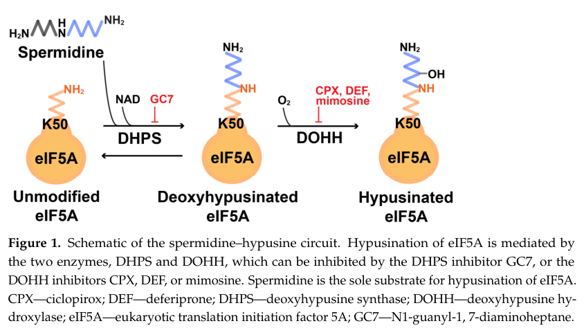

## Question

# Gene Research for Functional Annotation

## ⚠️ CRITICAL: Gene/Protein Identification Context

**BEFORE YOU BEGIN RESEARCH:** You MUST verify you are researching the CORRECT gene/protein. Gene symbols can be ambiguous, especially for less well-characterized genes from non-model organisms.

### Target Gene/Protein Identity (from UniProt):
- **UniProt Accession:** Q9V9U4
- **Protein Description:** RecName: Full=Deoxyhypusine hydroxylase {ECO:0000255|HAMAP-Rule:MF_03101}; Short=DOHH {ECO:0000255|HAMAP-Rule:MF_03101}; EC=1.14.99.29 {ECO:0000255|HAMAP-Rule:MF_03101}; AltName: Full=Deoxyhypusine dioxygenase {ECO:0000255|HAMAP-Rule:MF_03101}; AltName: Full=Deoxyhypusine monooxygenase {ECO:0000255|HAMAP-Rule:MF_03101};
- **Gene Information:** Name=nero {ECO:0000255|HAMAP-Rule:MF_03101}; Synonyms=l(3)s1921; ORFNames=CG2245;
- **Organism (full):** Drosophila melanogaster (Fruit fly).
- **Protein Family:** Belongs to the deoxyhypusine hydroxylase family.
- **Key Domains:** ARM-like. (IPR011989); ARM-type_fold. (IPR016024); Deoxyhypusine_hydroxylase. (IPR027517); PBS_lyase_HEAT. (IPR004155); HEAT_2 (PF13646)

### MANDATORY VERIFICATION STEPS:

1. **Check if the gene symbol "nero" matches the protein description above**
2. **Verify the organism is correct:** Drosophila melanogaster (Fruit fly).
3. **Check if protein family/domains align with what you find in literature**
4. **If you find literature for a DIFFERENT gene with the same or similar symbol, STOP**

### If Gene Symbol is Ambiguous or You Cannot Find Relevant Literature:

**DO NOT PROCEED WITH RESEARCH ON A DIFFERENT GENE.** Instead:
- State clearly: "The gene symbol 'nero' is ambiguous or literature is limited for this specific protein"
- Explain what you found (e.g., "Found extensive literature on a different gene with the same symbol in a different organism")
- Describe the protein based ONLY on the UniProt information provided above
- Suggest that the protein function can be inferred from domain/family information

### Research Target:

Please provide a comprehensive research report on the gene **nero** (gene ID: nero, UniProt: Q9V9U4) in DROME.

The research report should be a detailed narrative explaining the function, biological processes, and localization of the gene product. Citations should be given for all claims.

You should prioritize authoritative reviews and primary scientific literature when conducting research. You can supplement
this with annotations you find in gene/protein databases, but these can be outdated or inaccurate.

We are specifically interested in the primary function of the gene - for enzymes, what reaction is catalyzed, and what is the substrate specificity? For transporters, what is the substrate? For structural proteins or adapters, what is the broader structural role? For signaling molecules, what is the role in the pathway.

We are interested in where in or outside the cell the gene product carries out its function.

We are also interested in the signaling or biochemical pathways in which the gene functions. We are less interested in broad pleiotropic effects, except where these elucidate the precise role.

Include evidence where possible. We are interested in both experimental evidence as well as inference from structure, evolution, or bioinformatic analysis. Precise studies should be prioritized over high-throughput, where available.

## Output

Question: You are an expert researcher providing comprehensive, well-cited information.

Provide detailed information focusing on:
1. Key concepts and definitions with current understanding
2. Recent developments and latest research (prioritize 2023-2024 sources)
3. Current applications and real-world implementations
4. Expert opinions and analysis from authoritative sources
5. Relevant statistics and data from recent studies

Format as a comprehensive research report with proper citations. Include URLs and publication dates where available.
Always prioritize recent, authoritative sources and provide specific citations for all major claims.

# Gene Research for Functional Annotation

## ⚠️ CRITICAL: Gene/Protein Identification Context

**BEFORE YOU BEGIN RESEARCH:** You MUST verify you are researching the CORRECT gene/protein. Gene symbols can be ambiguous, especially for less well-characterized genes from non-model organisms.

### Target Gene/Protein Identity (from UniProt):
- **UniProt Accession:** Q9V9U4
- **Protein Description:** RecName: Full=Deoxyhypusine hydroxylase {ECO:0000255|HAMAP-Rule:MF_03101}; Short=DOHH {ECO:0000255|HAMAP-Rule:MF_03101}; EC=1.14.99.29 {ECO:0000255|HAMAP-Rule:MF_03101}; AltName: Full=Deoxyhypusine dioxygenase {ECO:0000255|HAMAP-Rule:MF_03101}; AltName: Full=Deoxyhypusine monooxygenase {ECO:0000255|HAMAP-Rule:MF_03101};
- **Gene Information:** Name=nero {ECO:0000255|HAMAP-Rule:MF_03101}; Synonyms=l(3)s1921; ORFNames=CG2245;
- **Organism (full):** Drosophila melanogaster (Fruit fly).
- **Protein Family:** Belongs to the deoxyhypusine hydroxylase family.
- **Key Domains:** ARM-like. (IPR011989); ARM-type_fold. (IPR016024); Deoxyhypusine_hydroxylase. (IPR027517); PBS_lyase_HEAT. (IPR004155); HEAT_2 (PF13646)

### MANDATORY VERIFICATION STEPS:

1. **Check if the gene symbol "nero" matches the protein description above**
2. **Verify the organism is correct:** Drosophila melanogaster (Fruit fly).
3. **Check if protein family/domains align with what you find in literature**
4. **If you find literature for a DIFFERENT gene with the same or similar symbol, STOP**

### If Gene Symbol is Ambiguous or You Cannot Find Relevant Literature:

**DO NOT PROCEED WITH RESEARCH ON A DIFFERENT GENE.** Instead:
- State clearly: "The gene symbol 'nero' is ambiguous or literature is limited for this specific protein"
- Explain what you found (e.g., "Found extensive literature on a different gene with the same symbol in a different organism")
- Describe the protein based ONLY on the UniProt information provided above
- Suggest that the protein function can be inferred from domain/family information

### Research Target:

Please provide a comprehensive research report on the gene **nero** (gene ID: nero, UniProt: Q9V9U4) in DROME.

The research report should be a detailed narrative explaining the function, biological processes, and localization of the gene product. Citations should be given for all claims.

You should prioritize authoritative reviews and primary scientific literature when conducting research. You can supplement
this with annotations you find in gene/protein databases, but these can be outdated or inaccurate.

We are specifically interested in the primary function of the gene - for enzymes, what reaction is catalyzed, and what is the substrate specificity? For transporters, what is the substrate? For structural proteins or adapters, what is the broader structural role? For signaling molecules, what is the role in the pathway.

We are interested in where in or outside the cell the gene product carries out its function.

We are also interested in the signaling or biochemical pathways in which the gene functions. We are less interested in broad pleiotropic effects, except where these elucidate the precise role.

Include evidence where possible. We are interested in both experimental evidence as well as inference from structure, evolution, or bioinformatic analysis. Precise studies should be prioritized over high-throughput, where available.

# Functional annotation of *Drosophila melanogaster nero*

## Identity and principal conclusion

The target is the fruit-fly **nero/CG2245** locus, which encodes a **deoxyhypusine hydroxylase (DOHH) homolog**, not another gene called *nero*. The strongest locus-specific evidence is genetic: two *nero* alleles delete **189** and **123 base pairs**, respectively, from the CG2245 coding region, and a CG2245 genomic clone rescues the mutant phenotype. The UniProt accession **Q9V9U4** and synonym *l(3)s1921* are supplied in the question; the retrieved papers independently corroborate *nero*–CG2245–DOHH, but did not independently verify that accession or synonym. The supplied ARM-like/HEAT-related domain annotations agree with the established HEAT-repeat architecture of the DOHH family. (park2010functionalsignificanceof pages 5-7, dever2014thehypusinecontainingtranslation pages 6-7)

**Functional annotation:** Nero carries out the final, oxygen-dependent step of **eIF5A hypusination**: hydroxylation of the *deoxyhypusine residue already attached to eIF5A* to produce hypusinated eIF5A. This is much more specific than hydroxylation of free amino acids or indiscriminate protein oxidation. Fly genetics strongly establishes the locus and its role in this pathway; the detailed catalytic mechanism and substrate-recognition evidence come primarily from biochemical studies of other eukaryotic DOHH proteins, rather than an assay of purified fly Nero. (park2010functionalsignificanceof pages 5-7, park2010functionalsignificanceof pages 1-2, park2022posttranslationalformationof pages 6-7)

## Reaction, substrate specificity and structure

Hypusination has two sequential reactions. Deoxyhypusine synthase (DHPS) transfers a **4-aminobutyl group from spermidine** to a particular eIF5A lysine, producing protein-bound deoxyhypusine. **Nero/DOHH then hydroxylates carbon 2 of that side chain**, yielding protein-bound hypusine, *Nε-(4-amino-2-hydroxybutyl)lysine*. Thus spermidine supplies the group in the **preceding DHPS reaction**; the immediate Nero substrate is **deoxyhypusinated eIF5A**, and oxygen is required for hydroxylation. The inspected 2024 pathway schematic depicts these two separate enzyme steps. (park2010functionalsignificanceof pages 1-2, park2022posttranslationalformationof pages 6-7, nakanishi2024themanyfaces pages 1-2, nakanishi2024themanyfaces media b0987763)

DOHH and DHPS display unusually narrow **protein-substrate specificity**: eIF5A is the only established cellular protein carrying hypusine, and experiments with the modification enzymes indicate that free lysine, free deoxyhypusine and short eIF5A-derived peptides do not replace the appropriately structured eIF5A protein substrate. Accordingly, neither an independent small-molecule substrate nor a second physiological Nero protein substrate is established here. The often-cited human eIF5A **Lys50** and yeast **Lys51** positions should not be assigned to fly eIF5A without checking its sequence. (park2010functionalsignificanceof pages 1-2, dever2014thehypusinecontainingtranslation pages 6-7, park2022posttranslationalformationof pages 6-7)

The characterized DOHH family consists of approximately **eight α-helical-hairpin HEAT repeats** forming a superhelical fold, with a **non-heme diiron center** and conserved His–Glu motifs. Purified recombinant DOHH has an estimated **two iron atoms per holoprotein**. Structural, mutational and biochemical studies support oxygen activation through a diiron–peroxo intermediate and subsequent hydroxylation of the deoxyhypusine side chain. These family properties rationalize the HEAT/ARM-fold-related calls supplied for Nero, but specific residue numbers established for human DOHH cannot be assigned to Nero without alignment. DOHH is mechanistically distinct from α-ketoglutarate-dependent prolyl or lysyl hydroxylases. (dever2014thehypusinecontainingtranslation pages 6-7, park2022posttranslationalformationof pages 6-7)

## Biological pathway and direct fly evidence

The relevant biochemical sequence is **spermidine → DHPS-dependent deoxyhypusine–eIF5A → Nero/DOHH-dependent hypusine–eIF5A → eIF5A-dependent translation**. Although historically called an “initiation factor,” hypusinated eIF5A is now particularly associated with overcoming difficult ribosomal pauses during **translation elongation** and with facilitating termination; polyproline-containing and other constraining peptide motifs can be sensitive. Nero modifies the translation factor—it is **not itself a ribosomal elongation factor**. (nakanishi2024themanyfaces pages 1-2, dever2014thehypusinecontainingtranslation pages 6-7)

In the fly study by **Patel and colleagues (2009)**, homozygous or compound-heterozygous *nero* mutants died as **second-instar larvae**. Mutants had smaller cells and tissues, less BrdU incorporation and delayed cell-cycle progression. Fed mutant larvae nevertheless developed autophagic structures in the **fat body**, consistent with an inappropriate starvation-like response. eIF5A abundance rose in *nero* mutants, while eIF5A knockdown recapitulated aspects of the mutant phenotype. In cultured **Drosophila S2 cells**, RNAi against either Nero or eIF5A increased polysomes, consistent with impaired translation elongation. These observations connect the enzyme’s modification of eIF5A to growth and nutrient-response phenotypes; they **do not establish autophagy as a second catalytic activity of Nero**, nor, by themselves, identify the individual translated fly mRNAs responsible. These details were checked against the authoritative 2010 review because the original 2009 article’s full text was not obtainable through the available search tools. (park2010functionalsignificanceof pages 5-7)

For perspective, loss of DOHH is compatible with growth of budding yeast under ordinary conditions, whereas fly DOHH loss causes larval lethality. The requirement for the final hydroxylation step therefore cannot simply be inferred from yeast viability experiments. Separately, assays of deoxyhypusinated eIF5A indicate that this intermediate can retain some translational activity under certain experimental conditions; complete hydroxylation should not be described as universally required for *any* eIF5A activity. (dever2014thehypusinecontainingtranslation pages 6-7, nakanishi2024themanyfaces pages 9-10)

## Where Nero functions

**The precise subcellular distribution of fly Nero remains unresolved in the literature retrieved here.** Its well-supported site of *action* is wherever it encounters intracellular deoxyhypusinated eIF5A; its downstream consequence is principally on cytoplasmic ribosome-associated translation. Mammalian microscopy finds mature hypusinated **eIF5A** predominantly cytoplasmic, but those observations visualize **the substrate, not Nero/DOHH**, and cannot establish whether fly Nero itself resides exclusively in the cytosol, shuttles through the nucleus, or occupies another compartment. The autophagic structures seen in *nero* mutant fat body report a **phenotype**, not localization of the enzyme to autophagosomes. No specific extracellular or organellar site should be claimed for fly Nero on the present evidence. (lee2009theeffectof pages 3-4, park2010functionalsignificanceof pages 5-7)

## Recent developments and applications

A **2024 review** emphasizes that DOHH-specific experiments remain comparatively scarce relative to studies of DHPS and eIF5A. It highlights a **2022 yeast** study in which oxygen-dependent Lia1/DOHH activity influenced early elongation of selected proteins involved in oxidative phosphorylation, oxidative-stress responses and protein folding. This refines the general view that DOHH merely completes an undifferentiated global translation modification; **whether Nero controls analogous transcripts in flies remains untested**. The review also stresses tissue-specific outcomes and the importance of distinguishing acute from chronic inhibition of the hypusine pathway. (nakanishi2024themanyfaces pages 9-10, nakanishi2024themanyfaces pages 1-2)

**Current practical uses** of *nero* are principally as a **fly genetic and S2-cell perturbation model** for testing the consequences of eIF5A maturation on growth, translation and autophagy. At the wider, non-fly pathway level, DOHH has attracted interest in neurodevelopmental disease and cancer. Reported DOHH-directed experimental inhibitors include the iron-chelating compounds **ciclopirox, deferiprone and mimosine**, whereas **GC7 inhibits DHPS**, the *preceding* enzyme. The inhibitors and clinical associations should not be presented as an approved, Nero-specific treatment or as evidence of therapeutic selectivity in flies; the 2024 review explicitly calls for better inhibitors and careful assessment of systemic effects. (park2010functionalsignificanceof pages 5-7, nakanishi2024themanyfaces media b0987763, nakanishi2024themanyfaces pages 9-10, nakanishi2024themanyfaces pages 2-4)

The evidence hierarchy, including what remains an extrapolation rather than a fly measurement, is summarized below. (park2010functionalsignificanceof pages 5-7, park2022posttranslationalformationof pages 6-7, nakanishi2024themanyfaces pages 9-10)

| Functional claim | Evidence and experimental system | Inference / qualification |
|---|---|---|
| **Identity:** *Drosophila melanogaster nero* is the DOHH-homolog locus **CG2245**; target accession **Q9V9U4** | The *nero1* and *nero2* alleles delete 189 bp and 123 bp, respectively, from the CG2245 ORF; a CG2245 genomic clone complemented the mutations in flies. (park2010functionalsignificanceof pages 5-7) | Strong locus-specific genetic verification for *nero* = CG2245. Q9V9U4 and the alias *l(3)s1921* come from the supplied UniProt record and were not independently reported in the retrieved papers. |
| **Primary enzymatic function:** DOHH hydroxylates the C2 position of the deoxyhypusine side chain on eIF5A, producing mature hypusine-eIF5A | Biochemical assays in non-fly systems measured conversion of radiolabeled deoxyhypusine-eIF5A to hypusine-eIF5A; mechanistic studies support O–O cleavage, hydrogen abstraction and hydroxyl rebound. (park2022posttranslationalformationof pages 6-7) | This is the high-confidence family-based annotation for Nero. The retrieved fly evidence established genetic dependence on the pathway but did **not** directly assay purified Nero catalytic activity. |
| **Substrate specificity:** the physiological substrate is intact deoxyhypusinated eIF5A, not free deoxyhypusine, lysine or a short model peptide | DHPS and DOHH require the sequence surrounding the modification site and the folded macromolecular structure of eIF5A; eIF5A is the only known hypusine-containing cellular protein. (park2010functionalsignificanceof pages 1-2, dever2014thehypusinecontainingtranslation pages 6-7) | Strong conserved biochemical evidence supports specific recognition of fly eIF5A by Nero; direct kinetic constants for purified Drosophila Nero were not found. |
| **Structure and cofactors:** Nero belongs to the HEAT-repeat, non-heme diiron DOHH family | Canonical DOHH contains eight α-helical-hairpin HEAT repeats, two iron atoms per holoprotein and four conserved His–Glu motifs that coordinate the catalytic center and/or bind eIF5A. (dever2014thehypusinecontainingtranslation pages 6-7, park2022posttranslationalformationof pages 6-7) | Consistent with the supplied ARM-like, ARM-fold, PBS-lyase/HEAT and HEAT_2 domain calls. Residue numbering from human DOHH should not be transferred to Nero without sequence alignment. |
| **Essential developmental role and growth phenotype in flies** | Homozygous or heteroallelic *nero1/nero2* animals died as second-instar larvae and showed smaller cells or tissues, reduced BrdU incorporation and delayed cell-cycle progression; genomic rescue tied these effects to CG2245. (park2010functionalsignificanceof pages 5-7) | Direct fly genetic evidence that Nero-dependent eIF5A maturation is required for larval development, cellular growth and proliferation; exact effect sizes were unavailable in the retrieved text. |
| **Autophagy and starvation-response phenotype** | Fed *nero* mutant larvae displayed autophagic structures in fat bodies, while eIF5A RNAi generated similar phenotypes and eIF5A abundance increased in mutants. (park2010functionalsignificanceof pages 5-7) | Supports Nero acting upstream of eIF5A in growth and autophagy control. Autophagy is best interpreted as a downstream consequence of impaired hypusine-dependent translation or nutrient-state control, not as a second Nero catalytic activity. |
| **Translation-elongation pathway** | RNAi against either Nero or eIF5A increased polysomes in Drosophila S2 cells; broader biochemical evidence places hypusinated eIF5A at stalled ribosomes during elongation. (park2010functionalsignificanceof pages 5-7, dever2014thehypusinecontainingtranslation pages 6-7) | The concordant S2-cell profiles connect Nero to eIF5A-mediated translation elongation, although they do not identify individual Nero-dependent fly transcripts. |
| **Subcellular localization** | No direct fly Nero immunolocalization, tagged-protein imaging or fractionation result was identified. Mammalian work shows mature hypusinated eIF5A is predominantly cytoplasmic, but it did not map DOHH itself. (lee2009theeffectof pages 3-4) | Nero likely acts where it encounters newly deoxyhypusinated eIF5A, with downstream translation occurring mainly in the cytoplasm; a specific cytosolic, nuclear, mitochondrial or other organellar assignment for fly Nero remains **unverified**. |
| **Recent mechanistic update: oxygen-responsive DOHH function** | A 2024 review highlights yeast evidence that oxygen regulates Lia1/DOHH activity and thereby affects N-terminal translation of selected oxidative-phosphorylation, oxidative-stress and protein-folding proteins. (nakanishi2024themanyfaces pages 9-10) | Important current DOHH biology, but demonstrated in yeast rather than Drosophila. It is a testable hypothesis for Nero, not an established fly function. |
| **Applications and therapeutic relevance** | The hypusine circuit is being investigated in development, neurodevelopmental disease and cancer; DOHH inhibitors include ciclopirox, deferiprone and mimosine. A 2024 review stresses that DOHH-specific studies are limited and that more selective inhibitors are needed. (nakanishi2024themanyfaces pages 1-2, nakanishi2024themanyfaces pages 9-10, nakanishi2024themanyfaces media b0987763) | These are pathway-level mammalian or translational applications, not current applications of fly Nero itself. Essentiality and pleiotropic effects warrant caution when extrapolating therapeutic inhibition to whole animals. |

*Table: Evidence-ranked annotation of Drosophila Nero/CG2245, separating direct fly genetics from conserved DOHH biochemistry and cross-species developments. The table highlights unresolved localization and limits on therapeutic extrapolation.*

## Key sources and evidence limits

- **Fly locus and phenotypes:** Patel PH *et al.* “The Drosophila deoxyhypusine hydroxylase homologue nero and its target eIF5A are required for cell growth and the regulation of autophagy.” *Journal of Cell Biology*, **June 2009**, 185:1181–1194. https://doi.org/10.1083/jcb.200904161. Fly-specific results above are supported through the accessible account in Park *et al.*, because the original full text was not retrieved. (park2010functionalsignificanceof pages 5-7)
- **Authoritative fly-focused biochemical review:** Park MH *et al.* “Functional significance of eIF5A and its hypusine modification in eukaryotes.” *Amino Acids*, **February 2010**, 38:491–500. https://doi.org/10.1007/s00726-009-0408-7. (park2010functionalsignificanceof pages 5-7, park2010functionalsignificanceof pages 1-2)
- **Catalytic mechanism and specificity:** Park MH *et al.* “Post-translational formation of hypusine in eIF5A: implications in human neurodevelopment.” *Amino Acids*, **2022**, 54:485–499. https://doi.org/10.1007/s00726-021-03023-6. These structural and assay results predominantly concern non-fly DOHH. (park2022posttranslationalformationof pages 6-7)
- **Current pathway interpretation:** Nakanishi S and Cleveland JL. “The Many Faces of Hypusinated eIF5A.” *International Journal of Molecular Sciences*, **26 July 2024**, 25:8171. https://doi.org/10.3390/ijms25158171. Its pathway diagram and oxygen-response discussion provide context, **not new fly Nero localization or fly-specific catalysis data**. (nakanishi2024themanyfaces pages 1-2, nakanishi2024themanyfaces pages 9-10, nakanishi2024themanyfaces media b0987763)

References

1. (park2010functionalsignificanceof pages 5-7): M. H. Park, K. Nishimura, C. F. Zanelli, and S. R. Valentini. Functional significance of eif5a and its hypusine modification in eukaryotes. Amino Acids, 38:491-500, Feb 2010. URL: https://doi.org/10.1007/s00726-009-0408-7, doi:10.1007/s00726-009-0408-7. This article has 440 citations and is from a peer-reviewed journal.

2. (dever2014thehypusinecontainingtranslation pages 6-7): Thomas E. Dever, Erik Gutierrez, and Byung-Sik Shin. The hypusine-containing translation factor eif5a. Critical Reviews in Biochemistry and Molecular Biology, 49:413-425, Sep 2014. URL: https://doi.org/10.3109/10409238.2014.939608, doi:10.3109/10409238.2014.939608. This article has 212 citations and is from a peer-reviewed journal.

3. (park2010functionalsignificanceof pages 1-2): M. H. Park, K. Nishimura, C. F. Zanelli, and S. R. Valentini. Functional significance of eif5a and its hypusine modification in eukaryotes. Amino Acids, 38:491-500, Feb 2010. URL: https://doi.org/10.1007/s00726-009-0408-7, doi:10.1007/s00726-009-0408-7. This article has 440 citations and is from a peer-reviewed journal.

4. (park2022posttranslationalformationof pages 6-7): Myung Hee Park, Rajesh Kumar Kar, Siddharth Banka, Alban Ziegler, and Wendy K. Chung. Post-translational formation of hypusine in eif5a: implications in human neurodevelopment. Amino Acids, 54:485-499, Jul 2022. URL: https://doi.org/10.1007/s00726-021-03023-6, doi:10.1007/s00726-021-03023-6. This article has 58 citations and is from a peer-reviewed journal.

5. (nakanishi2024themanyfaces pages 1-2): Shima Nakanishi and John L. Cleveland. The many faces of hypusinated eif5a: cell context-specific effects of the hypusine circuit and implications for human health. International Journal of Molecular Sciences, 25:8171, Jul 2024. URL: https://doi.org/10.3390/ijms25158171, doi:10.3390/ijms25158171. This article has 16 citations.

6. (nakanishi2024themanyfaces media b0987763): Shima Nakanishi and John L. Cleveland. The many faces of hypusinated eif5a: cell context-specific effects of the hypusine circuit and implications for human health. International Journal of Molecular Sciences, 25:8171, Jul 2024. URL: https://doi.org/10.3390/ijms25158171, doi:10.3390/ijms25158171. This article has 16 citations.

7. (nakanishi2024themanyfaces pages 9-10): Shima Nakanishi and John L. Cleveland. The many faces of hypusinated eif5a: cell context-specific effects of the hypusine circuit and implications for human health. International Journal of Molecular Sciences, 25:8171, Jul 2024. URL: https://doi.org/10.3390/ijms25158171, doi:10.3390/ijms25158171. This article has 16 citations.

8. (lee2009theeffectof pages 3-4): Seung Bum Lee, Jong Hwan Park, Jörn Kaevel, Monika Sramkova, Roberto Weigert, and Myung Hee Park. The effect of hypusine modification on the intracellular localization of eif5a. Biochemical and biophysical research communications, 383 4:497-502, Jun 2009. URL: https://doi.org/10.1016/j.bbrc.2009.04.049, doi:10.1016/j.bbrc.2009.04.049. This article has 89 citations and is from a peer-reviewed journal.

9. (nakanishi2024themanyfaces pages 2-4): Shima Nakanishi and John L. Cleveland. The many faces of hypusinated eif5a: cell context-specific effects of the hypusine circuit and implications for human health. International Journal of Molecular Sciences, 25:8171, Jul 2024. URL: https://doi.org/10.3390/ijms25158171, doi:10.3390/ijms25158171. This article has 16 citations.

## Artifacts

- [Edison artifact artifact-00](nero-deep-research-falcon_artifacts/artifact-00.md)

## Citations

1. park2010functionalsignificanceof pages 5-7
2. park2022posttranslationalformationof pages 6-7
3. lee2009theeffectof pages 3-4
4. nakanishi2024themanyfaces pages 9-10
5. dever2014thehypusinecontainingtranslation pages 6-7
6. park2010functionalsignificanceof pages 1-2
7. nakanishi2024themanyfaces pages 1-2
8. nakanishi2024themanyfaces pages 2-4
9. https://doi.org/10.1083/jcb.200904161.
10. https://doi.org/10.1007/s00726-009-0408-7.
11. https://doi.org/10.1007/s00726-021-03023-6.
12. https://doi.org/10.3390/ijms25158171.
13. https://doi.org/10.1007/s00726-009-0408-7,
14. https://doi.org/10.3109/10409238.2014.939608,
15. https://doi.org/10.1007/s00726-021-03023-6,
16. https://doi.org/10.3390/ijms25158171,
17. https://doi.org/10.1016/j.bbrc.2009.04.049,