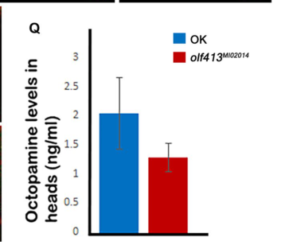

## Question

# Gene Research for Functional Annotation

## ⚠️ CRITICAL: Gene/Protein Identification Context

**BEFORE YOU BEGIN RESEARCH:** You MUST verify you are researching the CORRECT gene/protein. Gene symbols can be ambiguous, especially for less well-characterized genes from non-model organisms.

### Target Gene/Protein Identity (from UniProt):
- **UniProt Accession:** Q6NP60
- **Protein Description:** RecName: Full=MOXD1 homolog 2;
- **Gene Information:** Name=olf413; ORFNames=CG12673;
- **Organism (full):** Drosophila melanogaster (Fruit fly).
- **Protein Family:** Belongs to the copper type II ascorbate-dependent
- **Key Domains:** Cu2_ascorb_mOase-like_C. (IPR014784); Cu2_ascorb_mOase_N. (IPR000323); Cu2_ascorb_mOase_N_sf. (IPR036939); Cu2_monoox_C. (IPR024548); DBH-like. (IPR000945)

### MANDATORY VERIFICATION STEPS:

1. **Check if the gene symbol "olf413" matches the protein description above**
2. **Verify the organism is correct:** Drosophila melanogaster (Fruit fly).
3. **Check if protein family/domains align with what you find in literature**
4. **If you find literature for a DIFFERENT gene with the same or similar symbol, STOP**

### If Gene Symbol is Ambiguous or You Cannot Find Relevant Literature:

**DO NOT PROCEED WITH RESEARCH ON A DIFFERENT GENE.** Instead:
- State clearly: "The gene symbol 'olf413' is ambiguous or literature is limited for this specific protein"
- Explain what you found (e.g., "Found extensive literature on a different gene with the same symbol in a different organism")
- Describe the protein based ONLY on the UniProt information provided above
- Suggest that the protein function can be inferred from domain/family information

### Research Target:

Please provide a comprehensive research report on the gene **olf413** (gene ID: olf413, UniProt: Q6NP60) in DROME.

The research report should be a detailed narrative explaining the function, biological processes, and localization of the gene product. Citations should be given for all claims.

You should prioritize authoritative reviews and primary scientific literature when conducting research. You can supplement
this with annotations you find in gene/protein databases, but these can be outdated or inaccurate.

We are specifically interested in the primary function of the gene - for enzymes, what reaction is catalyzed, and what is the substrate specificity? For transporters, what is the substrate? For structural proteins or adapters, what is the broader structural role? For signaling molecules, what is the role in the pathway.

We are interested in where in or outside the cell the gene product carries out its function.

We are also interested in the signaling or biochemical pathways in which the gene functions. We are less interested in broad pleiotropic effects, except where these elucidate the precise role.

Include evidence where possible. We are interested in both experimental evidence as well as inference from structure, evolution, or bioinformatic analysis. Precise studies should be prioritized over high-throughput, where available.

## Output

Question: You are an expert researcher providing comprehensive, well-cited information.

Provide detailed information focusing on:
1. Key concepts and definitions with current understanding
2. Recent developments and latest research (prioritize 2023-2024 sources)
3. Current applications and real-world implementations
4. Expert opinions and analysis from authoritative sources
5. Relevant statistics and data from recent studies

Format as a comprehensive research report with proper citations. Include URLs and publication dates where available.
Always prioritize recent, authoritative sources and provide specific citations for all major claims.

# Gene Research for Functional Annotation

## ⚠️ CRITICAL: Gene/Protein Identification Context

**BEFORE YOU BEGIN RESEARCH:** You MUST verify you are researching the CORRECT gene/protein. Gene symbols can be ambiguous, especially for less well-characterized genes from non-model organisms.

### Target Gene/Protein Identity (from UniProt):
- **UniProt Accession:** Q6NP60
- **Protein Description:** RecName: Full=MOXD1 homolog 2;
- **Gene Information:** Name=olf413; ORFNames=CG12673;
- **Organism (full):** Drosophila melanogaster (Fruit fly).
- **Protein Family:** Belongs to the copper type II ascorbate-dependent
- **Key Domains:** Cu2_ascorb_mOase-like_C. (IPR014784); Cu2_ascorb_mOase_N. (IPR000323); Cu2_ascorb_mOase_N_sf. (IPR036939); Cu2_monoox_C. (IPR024548); DBH-like. (IPR000945)

### MANDATORY VERIFICATION STEPS:

1. **Check if the gene symbol "olf413" matches the protein description above**
2. **Verify the organism is correct:** Drosophila melanogaster (Fruit fly).
3. **Check if protein family/domains align with what you find in literature**
4. **If you find literature for a DIFFERENT gene with the same or similar symbol, STOP**

### If Gene Symbol is Ambiguous or You Cannot Find Relevant Literature:

**DO NOT PROCEED WITH RESEARCH ON A DIFFERENT GENE.** Instead:
- State clearly: "The gene symbol 'olf413' is ambiguous or literature is limited for this specific protein"
- Explain what you found (e.g., "Found extensive literature on a different gene with the same symbol in a different organism")
- Describe the protein based ONLY on the UniProt information provided above
- Suggest that the protein function can be inferred from domain/family information

### Research Target:

Please provide a comprehensive research report on the gene **olf413** (gene ID: olf413, UniProt: Q6NP60) in DROME.

The research report should be a detailed narrative explaining the function, biological processes, and localization of the gene product. Citations should be given for all claims.

You should prioritize authoritative reviews and primary scientific literature when conducting research. You can supplement
this with annotations you find in gene/protein databases, but these can be outdated or inaccurate.

We are specifically interested in the primary function of the gene - for enzymes, what reaction is catalyzed, and what is the substrate specificity? For transporters, what is the substrate? For structural proteins or adapters, what is the broader structural role? For signaling molecules, what is the role in the pathway.

We are interested in where in or outside the cell the gene product carries out its function.

We are also interested in the signaling or biochemical pathways in which the gene functions. We are less interested in broad pleiotropic effects, except where these elucidate the precise role.

Include evidence where possible. We are interested in both experimental evidence as well as inference from structure, evolution, or bioinformatic analysis. Precise studies should be prioritized over high-throughput, where available.

# Functional annotation of *Drosophila melanogaster olf413* (CG12673; UniProt Q6NP60)

## Identity and principal conclusion

**The gene symbol *olf413* is ambiguous or literature is limited for this specific protein.** For the specified fruit-fly target, however, its identity is supported: a 2024 primary study explicitly identifies *olf413* as **CG12673**, describes it as a paralogue of the separate *Tbh* gene, and reports copper type-II ascorbate-dependent monooxygenase and tyramine/dopamine β-hydroxylase-like domains. These findings agree with the supplied UniProt description, “MOXD1 homolog 2.” The paper does not itself establish the Q6NP60 accession; that identifier is retained from the supplied target information. Findings about canonical *Tbh*, mammalian dopamine β-hydroxylase, or other similarly named proteins must not be attributed to *olf413*. (ramya2024olf413anoctopamine pages 1-2, ramya2024olf413anoctopamine pages 6-8)

**Best-supported annotation:** *olf413* encodes a **putative copper/ascorbate-dependent monooxygenase associated with octopamine biogenesis**, required for normal embryonic axon patterning. Its **specific catalyzed reaction, physiological substrate, and intracellular site of action remain unestablished**. This distinction matters: decreased octopamine in a mutant demonstrates a pathway association, not that purified Olf413 converts tyramine directly into octopamine. (ramya2024olf413anoctopamine pages 6-8, ramya2024olf413anoctopamine pages 4-6)

The following summary separates observations on this exact gene from family-based predictions.

| Annotation or finding | Evidence for exact *D. melanogaster olf413* | Evidence level and limitations |
|---|---|---|
| Identity and family | *olf413* is CG12673; the target accession is Q6NP60. The protein is annotated with copper type-II ascorbate-dependent monooxygenase and tyramine/dopamine β-hydroxylase-like domains and is a paralogue—not the canonical *Tbh* gene. (ramya2024olf413anoctopamine pages 1-2, ramya2024olf413anoctopamine pages 6-8) | Strong gene-identity and domain-prediction evidence; Q6NP60 was supplied as the target accession but was not stated in the paper examined. |
| Candidate catalytic function | Domain homology suggests an ascorbate- and copper-dependent β-hydroxylation reaction related to tyramine → octopamine, but tyramine is **not experimentally established as the olf413 substrate**. (ramya2024olf413anoctopamine pages 6-8) | Hypothesis only: no purified-enzyme assay, kinetic analysis, substrate panel, catalytic-residue test, tyramine measurement, or direct product demonstration. |
| Octopamine biogenesis | LC–MS/MS found consistently reduced octopamine in homozygous *olf413*^MI02014 adult-head samples versus Oregon-K controls. Each group had three independent replicates; each preparation pooled 10 newly eclosed heads with equal male/female representation. (ramya2024olf413anoctopamine pages 2-4, ramya2024olf413anoctopamine pages 4-6) | Direct metabolite association, but indirect evidence of catalysis; no defensible absolute concentration was reported in the accessible text, and tyramine was not measured. |
| Tissue expression | GAL4/UAS-GFP reporters marked embryonic ventral nerve cord and PNS neurons, larval/adult brain neurons, and—using MI02014—embryonic myoblasts and somatic muscle bundles. GFP-positive larval-brain cells were Elav-positive and Repo-negative. (ramya2024olf413anoctopamine pages 2-4, ramya2024olf413anoctopamine pages 4-6) | Reporter/enhancer activity supports neuronal and embryonic-muscle expression. It does **not** establish protein-level expression or subcellular localization in vesicles, ER, Golgi, cytosol, or extracellular space. |
| Viability | Table 1 reported *olf413*^SG1.1 homozygotes: 100% lethality, 0 observed/250 expected; *olf413*^MI02014 homozygotes: 96%, 4/100; SG1.1/MI02014 transheterozygotes: 36.4%, 159/250. (ramya2024olf413anoctopamine pages 4-6, ramya2024olf413anoctopamine media 480ec016) | Strong genetic association, although these percentages were calculated from expected versus observed non-Stubble adult progeny—not conventional direct embryonic hatch-rate measurements. |
| Axon development | Anti-FasII staining showed disorganized or broken ventral-nerve-cord tracts and peripheral motor-axon growth, guidance, branching, fasciculation, boundary-crossing, and premature-termination defects. The most severe class occurred in 40% of SG1.1 homozygotes, 56.2% of MI02014 homozygotes, and 46.15% of transheterozygotes. (ramya2024olf413anoctopamine pages 4-6, ramya2024olf413anoctopamine pages 6-8) | Direct morphological evidence that *olf413* is required for normal embryonic axon patterning; it does not by itself show whether reduced octopamine causes the defects. |
| Critical missing tests | No direct olf413 enzyme assay, substrate-specificity analysis, tyramine quantification, metabolite or transgenic rescue, olf413-specific protein localization, or validated protein-level loss in the alleles was reported. The authors specifically called for qPCR and immunohistochemical quantification. (ramya2024olf413anoctopamine pages 6-8, ramya2024olf413anoctopamine pages 8-9) | Primary molecular function and intracellular site of action remain unresolved; annotation should therefore remain “putative copper/ascorbate-dependent monooxygenase involved in octopamine biogenesis,” not definitive tyramine β-hydroxylase. |

*Table: Evidence-level summary restricted to Drosophila olf413/CG12673 (Q6NP60), separating direct genetic and metabolomic findings from domain-based catalytic inference. Lethality percentages denote expected-versus-observed adult progeny, not direct embryonic hatch rates.*

## Molecular function and biochemical pathway

The relevant pathway is **octopamine biosynthesis**, in which the established Drosophila enzyme tyramine β-hydroxylase, encoded by ***Tbh***, converts **tyramine to octopamine**. Copper-dependent monooxygenases use an electron donor such as ascorbate to support oxygen-dependent hydroxylation. Olf413’s domain architecture and predicted paralogy make β-hydroxylation a reasonable *hypothesis*, potentially involving tyramine, but neither tyramine specificity nor a precise reaction equation has been demonstrated **for Olf413**. Describing it without qualification as “the tyramine β-hydroxylase” would conflate two genes. (ruppert2024thedrosophilatyraminebetahydroxylase pages 1-6, prigge2000newinsightsinto pages 1-3, knight2015distinctregulationof pages 1-2, ramya2024olf413anoctopamine pages 6-8)

The strongest gene-specific biochemical result comes from Ramya and colleagues’ **February 2024** study: LC–MS/MS measurements found **less octopamine in heads of surviving homozygous *olf413*^MI02014 adults** than in Oregon-K controls. The assay used **three independent preparations per group**, each comprising **10 newly eclosed heads**, with equal numbers of males and females. The accessible text and examined figure establish the direction of change but do not supply a defensible absolute concentration or fold change. The study did **not** report a corresponding tyramine measurement, purified-Olf413 activity, or tests comparing alternative amine substrates. Reduced octopamine could reflect direct synthesis or an indirect effect on an octopaminergic system. (ramya2024olf413anoctopamine pages 2-4, ramya2024olf413anoctopamine pages 4-6, ramya2024olf413anoctopamine media 7ed6a598)

The distinction from *Tbh* has experimental significance. A **June 2024 preprint concerning *Tbh*, not *olf413*** describes multiple Tbh isoforms and reports expression of one isoform in neuronal populations not simply identified with octopamine synthesis; it illustrates why even closely related hydroxylase proteins should not be assigned an exclusive substrate or pathway role from sequence alone. Earlier Drosophila work likewise links secretory-vesicle ascorbate supply to measured **TβH** activity, but that work does not establish Olf413’s compartment or cofactors experimentally. (ruppert2024thedrosophilatyraminebetahydroxylase pages 1-6, knight2015distinctregulationof pages 1-2)

## Where the gene acts: tissues versus intracellular localization

Two independent GAL4 reporter configurations place *olf413*-associated **regulatory activity** in the developing nervous system: embryonic ventral nerve cord and peripheral neuronal clusters, and larval central brain, suboesophageal ganglion and ventral ganglion. Adult reporter labeling includes neurons in the lobula-plate optomotor system. In larval brains, SG1.1-reporter-positive cells stained for **Elav**, a neuronal marker, but not **Repo**, a glial marker. The *olf413*^MI02014 reporter additionally marked **embryonic muscle precursors and somatic muscle bundles**, whereas the SG1.1 enhancer-trap pattern represented a narrower, predominantly neuronal subset. The SG1.1 insertion was mapped approximately **1.9 kb upstream of CG12673**, supporting—but not making identical—its reporter pattern and endogenous gene expression. (ramya2024olf413anoctopamine pages 2-4, ramya2024olf413anoctopamine pages 4-6)

**There is no verified subcellular localization for the Olf413 protein in the examined gene-specific work.** Reporter fluorescence identifies cells with promoter/enhancer activity; it does not demonstrate that the enzyme resides in synaptic vesicles, the endoplasmic reticulum, cytosol, extracellular fluid, or another compartment. A secretory-pathway or vesicular location may be considered by analogy with certain related monooxygenases, but it should remain a prediction, not an annotation asserted as observed for Q6NP60. The 2024 authors explicitly called for additional transcript and protein quantification in their mutant alleles. (prigge2000newinsightsinto pages 1-3, ramya2024olf413anoctopamine pages 4-6, ramya2024olf413anoctopamine pages 8-9)

## Biological process: embryonic axon growth and guidance

The same **2024** investigation examined an SG1.1 enhancer-trap allele and the intronic *olf413*^MI02014 disruption allele. In its adult-progeny-based complementation table, **0/250 expected SG1.1 homozygotes**, **4/100 expected MI02014 homozygotes**, and **159/250 expected transheterozygotes** were recovered—reported as **100%, 96%, and 36.4% lethality**, respectively. These percentages compare observed with expected adult progeny and should not be mistaken for directly measured embryo hatch percentages. Late-stage homozygous embryos often completed visible structures but failed to hatch. (ramya2024olf413anoctopamine pages 4-6, ramya2024olf413anoctopamine pages 6-8, ramya2024olf413anoctopamine media 480ec016)

Anti-Fasciclin-II staining of mutant embryos revealed disrupted ventral-nerve-cord tracts and peripheral motor projections: impaired axon extension, abnormal branching or fasciculation, midline and segment-boundary misrouting, and premature termination before target muscles. The reported most-severe phenotype frequencies were **40% in SG1.1 homozygotes**, **56.2% in MI02014 homozygotes**, and **46.15% in transheterozygotes**. The broader MI02014 reporter pattern, including embryonic muscle, led the authors to propose combined neuronal and muscle contributions. Nevertheless, neither the extent to which octopamine depletion *causes* these wiring defects nor a cell-autonomous catalytic mechanism was established. (ramya2024olf413anoctopamine pages 4-6, ramya2024olf413anoctopamine pages 6-8)

These findings distinguish *olf413* biologically from canonical *Tbh*: the authors contrast *olf413*’s pronounced embryonic-lethal wiring phenotypes with the reported survival to adulthood and ovulation abnormalities of *Tbh* null flies. Paralogy therefore supports a related biochemical **possibility**, not interchangeable developmental functions. (ramya2024olf413anoctopamine pages 6-8)

## Additional studies, implementation, and remaining uncertainties

The 2024 paper cites **two 2023 studies of this same gene**: one on taste recognition, preference and feeding, and one on negative-geotactic motor function. Their primary full texts were not obtainable here; consequently, detailed assay results or quantitative effect sizes from them cannot be independently verified. They support the existence of a developing behavioral research program, not a validated commercial, clinical, or therapeutic application. The established real-world use is **Drosophila genetic research**: the SG1.1 and MI02014 alleles and their GAL4 reporters allow investigation of neurodevelopment, tissue-specific expression, and octopamine-related phenotypes. (ramya2024olf413anoctopamine pages 2-4, ramya2024olf413anoctopamine pages 8-9, ramya2024olf413anoctopamine pages 9-10)

**Priority experiments for a definitive annotation** would express and purify Olf413 to test tyramine, dopamine and other candidate substrates with product-resolved assays; quantify both tyramine and octopamine in matched mutants; rescue biochemical and axonal phenotypes with wild-type versus catalytically impaired Olf413; and localize the endogenous protein with a validated tag or antibody. Until such results are available, the precise substrate, reaction and location of Olf413’s activity should be reported as **unknown**, while its association with octopamine levels and embryonic axon patterning can be reported as experimentally supported. (ramya2024olf413anoctopamine pages 6-8, ramya2024olf413anoctopamine pages 2-4, ramya2024olf413anoctopamine pages 8-9)

### Principal sources and access

- **Ramya R, Venkatesh CR, Shyamala BV.** “olf413 an octopamine biogenesis pathway gene is required for axon growth and pathfinding during embryonic nervous system development in *Drosophila melanogaster*.” *BMC Research Notes* **17:46**, **February 2024**. Primary gene-specific experimental source. https://doi.org/10.1186/s13104-024-06700-3. (ramya2024olf413anoctopamine pages 1-2, ramya2024olf413anoctopamine pages 6-8)
- **Ramya R, Shyamala BV.** “Olf413, a putative octopamine biosynthesis pathway gene is required for negative geotactic motor function in *Drosophila melanogaster*.” *Journal of Genetics* **102:52**, **2023**. Identified from the 2024 article’s references; full text not evaluated. https://doi.org/10.1007/s12041-023-01449-3. (ramya2024olf413anoctopamine pages 9-10)
- **Ramya R, Shyamala BV.** “olf413 gene controls taste recognition, preference and feeding activity in *Drosophila melanogaster*.” *Annual Research & Review in Biology* **38(5):24–31**, **2023**. Identified from the 2024 article’s references; full text not evaluated. https://doi.org/10.9734/arrb/2023/v38i530585. (ramya2024olf413anoctopamine pages 9-10)
- **Ruppert M and colleagues.** “The Drosophila tyramine-beta-hydroxylase gene encodes multiple isoforms with different functions.” **June 2024 bioRxiv preprint**, cited solely for comparison with the **distinct *Tbh* gene**. https://doi.org/10.1101/2024.06.10.598396. (ruppert2024thedrosophilatyraminebetahydroxylase pages 1-6)
- **Knight D and colleagues.** “Distinct Regulation of Transmitter Release at the Drosophila NMJ by Different Isoforms of *nemy*.” *PLOS ONE* **10:e0132548**, **3 August 2015**. Background on ascorbate supply and *Tbh* activity, not direct Olf413 evidence. https://doi.org/10.1371/journal.pone.0132548. (knight2015distinctregulationof pages 1-2)

References

1. (ramya2024olf413anoctopamine pages 1-2): Ravindrakumar Ramya, Chikkate Ramakrishnappa Venkatesh, and Baragur Venkatanarayanasetty Shyamala. Olf413 an octopamine biogenesis pathway gene is required for axon growth and pathfinding during embryonic nervous system development in drosophila melanogaster. BMC Research Notes, Feb 2024. URL: https://doi.org/10.1186/s13104-024-06700-3, doi:10.1186/s13104-024-06700-3. This article has 0 citations and is from a peer-reviewed journal.

2. (ramya2024olf413anoctopamine pages 6-8): Ravindrakumar Ramya, Chikkate Ramakrishnappa Venkatesh, and Baragur Venkatanarayanasetty Shyamala. Olf413 an octopamine biogenesis pathway gene is required for axon growth and pathfinding during embryonic nervous system development in drosophila melanogaster. BMC Research Notes, Feb 2024. URL: https://doi.org/10.1186/s13104-024-06700-3, doi:10.1186/s13104-024-06700-3. This article has 0 citations and is from a peer-reviewed journal.

3. (ramya2024olf413anoctopamine pages 4-6): Ravindrakumar Ramya, Chikkate Ramakrishnappa Venkatesh, and Baragur Venkatanarayanasetty Shyamala. Olf413 an octopamine biogenesis pathway gene is required for axon growth and pathfinding during embryonic nervous system development in drosophila melanogaster. BMC Research Notes, Feb 2024. URL: https://doi.org/10.1186/s13104-024-06700-3, doi:10.1186/s13104-024-06700-3. This article has 0 citations and is from a peer-reviewed journal.

4. (ramya2024olf413anoctopamine pages 2-4): Ravindrakumar Ramya, Chikkate Ramakrishnappa Venkatesh, and Baragur Venkatanarayanasetty Shyamala. Olf413 an octopamine biogenesis pathway gene is required for axon growth and pathfinding during embryonic nervous system development in drosophila melanogaster. BMC Research Notes, Feb 2024. URL: https://doi.org/10.1186/s13104-024-06700-3, doi:10.1186/s13104-024-06700-3. This article has 0 citations and is from a peer-reviewed journal.

5. (ramya2024olf413anoctopamine media 480ec016): Ravindrakumar Ramya, Chikkate Ramakrishnappa Venkatesh, and Baragur Venkatanarayanasetty Shyamala. Olf413 an octopamine biogenesis pathway gene is required for axon growth and pathfinding during embryonic nervous system development in drosophila melanogaster. BMC Research Notes, Feb 2024. URL: https://doi.org/10.1186/s13104-024-06700-3, doi:10.1186/s13104-024-06700-3. This article has 0 citations and is from a peer-reviewed journal.

6. (ramya2024olf413anoctopamine pages 8-9): Ravindrakumar Ramya, Chikkate Ramakrishnappa Venkatesh, and Baragur Venkatanarayanasetty Shyamala. Olf413 an octopamine biogenesis pathway gene is required for axon growth and pathfinding during embryonic nervous system development in drosophila melanogaster. BMC Research Notes, Feb 2024. URL: https://doi.org/10.1186/s13104-024-06700-3, doi:10.1186/s13104-024-06700-3. This article has 0 citations and is from a peer-reviewed journal.

7. (ruppert2024thedrosophilatyraminebetahydroxylase pages 1-6): Manuela Ruppert, Stefanie Hampel, Nagraj Sambrani, Osman Cibik, Gerbera Classen, Andrea Duenisch, Claire Fuchs, Thomas Kell, Sravya Paluri, and Henrike Scholz. The drosophila tyramine-beta-hydroxylase gene encodes multiple isoforms with different functions. bioRxiv, Jun 2024. URL: https://doi.org/10.1101/2024.06.10.598396, doi:10.1101/2024.06.10.598396. This article has 3 citations.

8. (prigge2000newinsightsinto pages 1-3): S. T. Prigge, R. E. Mains, B. A. Eipper, and L. M. Amzel* **. New insights into copper monooxygenases and peptide amidation: structure, mechanism and function. Cellular and Molecular Life Sciences, 57:1236-1259, Aug 2000. URL: https://doi.org/10.1007/pl00000763, doi:10.1007/pl00000763. This article has 581 citations and is from a domain leading peer-reviewed journal.

9. (knight2015distinctregulationof pages 1-2): David Knight, Konstantin G. Iliadi, Natalia Iliadi, Ronit Wilk, Jack Hu, Henry M. Krause, Paul Taylor, Michael F. Moran, and Gabrielle L. Boulianne. Distinct regulation of transmitter release at the drosophila nmj by different isoforms of nemy. PLoS ONE, 10:e0132548, Aug 2015. URL: https://doi.org/10.1371/journal.pone.0132548, doi:10.1371/journal.pone.0132548. This article has 11 citations and is from a peer-reviewed journal.

10. (ramya2024olf413anoctopamine media 7ed6a598): Ravindrakumar Ramya, Chikkate Ramakrishnappa Venkatesh, and Baragur Venkatanarayanasetty Shyamala. Olf413 an octopamine biogenesis pathway gene is required for axon growth and pathfinding during embryonic nervous system development in drosophila melanogaster. BMC Research Notes, Feb 2024. URL: https://doi.org/10.1186/s13104-024-06700-3, doi:10.1186/s13104-024-06700-3. This article has 0 citations and is from a peer-reviewed journal.

11. (ramya2024olf413anoctopamine pages 9-10): Ravindrakumar Ramya, Chikkate Ramakrishnappa Venkatesh, and Baragur Venkatanarayanasetty Shyamala. Olf413 an octopamine biogenesis pathway gene is required for axon growth and pathfinding during embryonic nervous system development in drosophila melanogaster. BMC Research Notes, Feb 2024. URL: https://doi.org/10.1186/s13104-024-06700-3, doi:10.1186/s13104-024-06700-3. This article has 0 citations and is from a peer-reviewed journal.

## Artifacts

- [Edison artifact artifact-00](olf413-deep-research-falcon_artifacts/artifact-00.md)

## Citations

1. ruppert2024thedrosophilatyraminebetahydroxylase pages 1-6
2. knight2015distinctregulationof pages 1-2
3. prigge2000newinsightsinto pages 1-3
4. https://doi.org/10.1186/s13104-024-06700-3.
5. https://doi.org/10.1007/s12041-023-01449-3.
6. https://doi.org/10.9734/arrb/2023/v38i530585.
7. https://doi.org/10.1101/2024.06.10.598396.
8. https://doi.org/10.1371/journal.pone.0132548.
9. https://doi.org/10.1186/s13104-024-06700-3,
10. https://doi.org/10.1101/2024.06.10.598396,
11. https://doi.org/10.1007/pl00000763,
12. https://doi.org/10.1371/journal.pone.0132548,