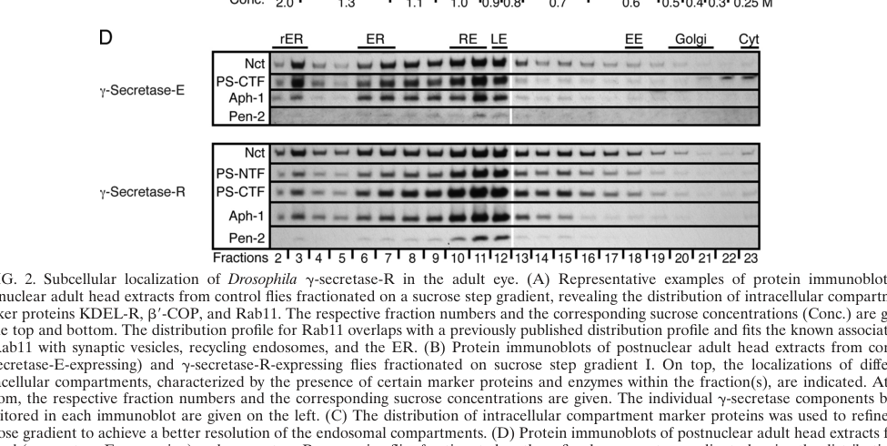

## Question

# Gene Research for Functional Annotation

## ⚠️ CRITICAL: Gene/Protein Identification Context

**BEFORE YOU BEGIN RESEARCH:** You MUST verify you are researching the CORRECT gene/protein. Gene symbols can be ambiguous, especially for less well-characterized genes from non-model organisms.

### Target Gene/Protein Identity (from UniProt):
- **UniProt Accession:** Q86BE9
- **Protein Description:** RecName: Full=Gamma-secretase subunit pen-2; AltName: Full=Presenilin enhancer protein 2;
- **Gene Information:** Name=pen-2; ORFNames=CG33198;
- **Organism (full):** Drosophila melanogaster (Fruit fly).
- **Protein Family:** Belongs to the PEN-2 family. .
- **Key Domains:** Gamma_Secretase_Asp_P_PEN2. (IPR019379); PEN-2 (PF10251)

### MANDATORY VERIFICATION STEPS:

1. **Check if the gene symbol "pen-2" matches the protein description above**
2. **Verify the organism is correct:** Drosophila melanogaster (Fruit fly).
3. **Check if protein family/domains align with what you find in literature**
4. **If you find literature for a DIFFERENT gene with the same or similar symbol, STOP**

### If Gene Symbol is Ambiguous or You Cannot Find Relevant Literature:

**DO NOT PROCEED WITH RESEARCH ON A DIFFERENT GENE.** Instead:
- State clearly: "The gene symbol 'pen-2' is ambiguous or literature is limited for this specific protein"
- Explain what you found (e.g., "Found extensive literature on a different gene with the same symbol in a different organism")
- Describe the protein based ONLY on the UniProt information provided above
- Suggest that the protein function can be inferred from domain/family information

### Research Target:

Please provide a comprehensive research report on the gene **pen-2** (gene ID: pen-2, UniProt: Q86BE9) in DROME.

The research report should be a detailed narrative explaining the function, biological processes, and localization of the gene product. Citations should be given for all claims.

You should prioritize authoritative reviews and primary scientific literature when conducting research. You can supplement
this with annotations you find in gene/protein databases, but these can be outdated or inaccurate.

We are specifically interested in the primary function of the gene - for enzymes, what reaction is catalyzed, and what is the substrate specificity? For transporters, what is the substrate? For structural proteins or adapters, what is the broader structural role? For signaling molecules, what is the role in the pathway.

We are interested in where in or outside the cell the gene product carries out its function.

We are also interested in the signaling or biochemical pathways in which the gene functions. We are less interested in broad pleiotropic effects, except where these elucidate the precise role.

Include evidence where possible. We are interested in both experimental evidence as well as inference from structure, evolution, or bioinformatic analysis. Precise studies should be prioritized over high-throughput, where available.

## Output

Question: You are an expert researcher providing comprehensive, well-cited information.

Provide detailed information focusing on:
1. Key concepts and definitions with current understanding
2. Recent developments and latest research (prioritize 2023-2024 sources)
3. Current applications and real-world implementations
4. Expert opinions and analysis from authoritative sources
5. Relevant statistics and data from recent studies

Format as a comprehensive research report with proper citations. Include URLs and publication dates where available.
Always prioritize recent, authoritative sources and provide specific citations for all major claims.

# Gene Research for Functional Annotation

## ⚠️ CRITICAL: Gene/Protein Identification Context

**BEFORE YOU BEGIN RESEARCH:** You MUST verify you are researching the CORRECT gene/protein. Gene symbols can be ambiguous, especially for less well-characterized genes from non-model organisms.

### Target Gene/Protein Identity (from UniProt):
- **UniProt Accession:** Q86BE9
- **Protein Description:** RecName: Full=Gamma-secretase subunit pen-2; AltName: Full=Presenilin enhancer protein 2;
- **Gene Information:** Name=pen-2; ORFNames=CG33198;
- **Organism (full):** Drosophila melanogaster (Fruit fly).
- **Protein Family:** Belongs to the PEN-2 family. .
- **Key Domains:** Gamma_Secretase_Asp_P_PEN2. (IPR019379); PEN-2 (PF10251)

### MANDATORY VERIFICATION STEPS:

1. **Check if the gene symbol "pen-2" matches the protein description above**
2. **Verify the organism is correct:** Drosophila melanogaster (Fruit fly).
3. **Check if protein family/domains align with what you find in literature**
4. **If you find literature for a DIFFERENT gene with the same or similar symbol, STOP**

### If Gene Symbol is Ambiguous or You Cannot Find Relevant Literature:

**DO NOT PROCEED WITH RESEARCH ON A DIFFERENT GENE.** Instead:
- State clearly: "The gene symbol 'pen-2' is ambiguous or literature is limited for this specific protein"
- Explain what you found (e.g., "Found extensive literature on a different gene with the same symbol in a different organism")
- Describe the protein based ONLY on the UniProt information provided above
- Suggest that the protein function can be inferred from domain/family information

### Research Target:

Please provide a comprehensive research report on the gene **pen-2** (gene ID: pen-2, UniProt: Q86BE9) in DROME.

The research report should be a detailed narrative explaining the function, biological processes, and localization of the gene product. Citations should be given for all claims.

You should prioritize authoritative reviews and primary scientific literature when conducting research. You can supplement
this with annotations you find in gene/protein databases, but these can be outdated or inaccurate.

We are specifically interested in the primary function of the gene - for enzymes, what reaction is catalyzed, and what is the substrate specificity? For transporters, what is the substrate? For structural proteins or adapters, what is the broader structural role? For signaling molecules, what is the role in the pathway.

We are interested in where in or outside the cell the gene product carries out its function.

We are also interested in the signaling or biochemical pathways in which the gene functions. We are less interested in broad pleiotropic effects, except where these elucidate the precise role.

Include evidence where possible. We are interested in both experimental evidence as well as inference from structure, evolution, or bioinformatic analysis. Precise studies should be prioritized over high-throughput, where available.

# Functional annotation report: *Drosophila melanogaster pen-2* (Q86BE9)

## Identity and evidence boundary

The supplied UniProt identification specifies *pen-2* (ORF **CG33198**, accession **Q86BE9**) in *Drosophila melanogaster*, encoding gamma-secretase subunit PEN-2, also called presenilin enhancer protein 2. This is consistent with the supplied PEN-2 family and domain annotations (PF10251; IPR019379). Independently, a primary study identified a *Drosophila pen-2* sequence, deposited as **AF512426**, and experimentally tested fly *pen-2*. The papers examined do **not** explicitly cross-reference AF512426, CG33198 and Q86BE9; that exact identifier mapping therefore rests on the supplied UniProt record. *C. elegans pen-2* and mammalian **PSENEN/PEN-2** are related genes, not interchangeable species-specific records. (francis2002aph1andpen2 pages 12-13, francis2002aph1andpen2 pages 2-3, serneels2024functionalandtopological pages 1-2)

**Principal annotation:** Fly PEN-2 is an integral-membrane, **noncatalytic subunit of the four-protein γ-secretase complex**, alongside presenilin (Psn), nicastrin (Nct) and Aph-1. Its best-supported role is to enable formation, accumulation and activity of the presenilin-containing complex that cleaves membrane-embedded substrates. Presenilin supplies the protease’s catalytic aspartates; PEN-2 has no independently established catalytic reaction or substrate-binding specificity. Its loss reduces processed presenilin as well as cleavage of Notch-related and APP-derived substrates in fly cells. (francis2002aph1andpen2 pages 7-8, serneels2024functionalandtopological pages 1-2, stempfle2010invivoreconstitution pages 4-6)

The following table separates direct fly observations from mechanistic inference based on another organism. (francis2002aph1andpen2 pages 7-8, serneels2024functionalandtopological pages 1-2, stempfle2010invivoreconstitution pages 4-6)

| Question / observation | Species and method | Inference and limitation | Primary reference |
|---|---|---|---|
| **Identity:** Q86BE9, gene *pen-2*, ORF CG33198 | *Drosophila melanogaster*. Q86BE9/CG33198 mapping comes from the supplied UniProt record. Francis et al. independently deposited a *Drosophila pen-2* sequence as GenBank AF512426. | Confirms literature on fly PEN-2 rather than similarly named *C. elegans* or mammalian proteins. The paper does **not** itself map AF512426 to Q86BE9/CG33198, so that exact cross-reference remains database-derived. (francis2002aph1andpen2 pages 12-13) | Francis et al. (2002), [10.1016/S1534-5807(02)00189-2](https://doi.org/10.1016/S1534-5807(02)00189-2) |
| **Loss of function:** *pen-2* RNAi reduced APP-C99 and Notch-NECN reporter activity, secreted Aβ40/Aβ42, and processed presenilin CTF; C59 and NINTRA controls were unaffected. | *Drosophila* Dmel2 cells; dsRNA, cleavage-dependent luciferase reporters, Aβ ELISA, and immunoblotting. Aβ40 was approximately tenfold more abundant than Aβ42; effects resembled presenilin, *aph-1*, and *nct* RNAi, although *pen-2* RNAi was more variable. | Strong direct evidence that fly PEN-2 is required at the presenilin-dependent intramembrane-cleavage step and for processed presenilin accumulation, not for downstream reporter transcription. It does not show that PEN-2 is catalytic or establish its localization. (francis2002aph1andpen2 pages 7-8, francis2002aph1andpen2 pages 8-9) | Francis et al. (2002), [10.1016/S1534-5807(02)00189-2](https://doi.org/10.1016/S1534-5807(02)00189-2) |
| **Complex membership and localization:** tagged Pen-2 copurified with Presenilin, Nicastrin, and Aph-1; endogenous and reconstituted complexes predominantly cofractionated with Rab7- and Rab11-positive membranes. | Adult *Drosophila* heads; four-subunit GAL4/UAS reconstitution, co-immunoprecipitation, tandem affinity purification, size-exclusion chromatography, and refined sucrose-gradient fractionation. | Demonstrates PEN-2 incorporation into the four-subunit fly γ-secretase complex and associates the complex mainly with late and recycling endosomal fractions. Fractionation gives compartment-level rather than nanoscale localization; endogenous Pen-2 detection approached the assay sensitivity limit. (stempfle2010invivoreconstitution pages 4-6, stempfle2010invivoreconstitution media ebd9ab3f) | Stempfle et al. (2010), [10.1128/MCB.00030-10](https://doi.org/10.1128/MCB.00030-10) |
| **Physiological activity:** four-subunit reconstitution increased APPL intracellular-domain production, reduced APPL C-terminal fragments, and elevated a wing Notch reporter strongly in 15% and weakly in another 30% of flies (n = 30); controls showed no increase (n = 40). | *Drosophila* adult heads and wing imaginal discs; APPL immunoblotting and NRE-EGFP/Su(H)-dependent Notch reporter imaging. | Shows that a Pen-2-containing complex is active in vivo toward endogenous fly APPL and enhances Notch output. Because all four subunits were co-overexpressed, the experiment does not isolate PEN-2's contribution; the Notch response was incompletely penetrant. (stempfle2010invivoreconstitution pages 4-6, stempfle2010invivoreconstitution pages 6-7) | Stempfle et al. (2010), [10.1128/MCB.00030-10](https://doi.org/10.1128/MCB.00030-10) |
| **Substrate dependence:** reconstituted fly γ-secretase decreased cleavage-reporter output from human APP, including an ectodomain-deleted construct, but slightly increased human APLP2 processing. | Transgenic *Drosophila* expressing human APP/APLP2 reporters with or without the four-subunit fly complex. | Indicates that increasing γ-secretase does not uniformly increase cleavage and that substrate identity or context matters. These heterologous results are not direct evidence for normal fly PEN-2 substrate specificity or mammalian-cell behavior. (stempfle2010invivoreconstitution pages 6-7) | Stempfle et al. (2010), [10.1128/MCB.00030-10](https://doi.org/10.1128/MCB.00030-10) |
| **Recent mechanistic context:** mammalian PSENEN forms a re-entry hairpin; its N terminus is cytosolic and C terminus luminal/extracellular. Gly22 and Pro27 support complex formation, presenilin endoproteolysis, stability, and activity; knockout abolishes detectable APP processing and causes severe Notch-deficiency phenotypes. | **Mammalian, not fly:** *Psenen*-null mouse embryos and fibroblasts, cysteine-scanning accessibility, mutagenesis, assembly assays, and substrate-processing measurements. | Supports PEN-2 as more than a passive scaffold while preserving presenilin as the catalytic subunit. Topology and residue-level conclusions are plausible evolutionary inferences for Q86BE9 but remain unverified experimentally in *Drosophila*. (serneels2024functionalandtopological pages 1-2, serneels2024functionalandtopological pages 6-7, serneels2024functionalandtopological pages 2-3) | Serneels et al. (2024; online 10 December 2023), [10.1016/j.jbc.2023.105533](https://doi.org/10.1016/j.jbc.2023.105533) |

*Table: Evidence supporting the functional annotation of Drosophila PEN-2, with direct fly experiments separated from mammalian mechanistic inference. Limitations of identifier mapping, localization, and cross-species interpretation are stated explicitly.*

## Molecular function and substrate scope

γ-Secretase performs **intramembrane peptide-bond hydrolysis** on suitable membrane-tethered protein fragments. In canonical fly Notch signaling, ligand-dependent receptor activation is followed by an extracellular **S2** cleavage, attributed to Kuzbanian, and a γ-secretase-dependent **S3** cleavage that releases the Notch intracellular domain (NICD). NICD then enters the nucleus to drive Notch-responsive transcription. PEN-2’s role is in the γ-secretase step—not in acting as the ligand, S2 protease or nuclear transcription factor. (pinot2024spatiotemporalregulationof pages 2-4, francis2002aph1andpen2 pages 7-8)

The clearest **gene-specific fly experiment** used dsRNA against *pen-2* in Dmel2 cells. Knockdown reduced cleavage-dependent signaling from membrane-tethered **Notch NECN-GV** and **human APP-derived C99-GV** reporters, while leaving their already-released intracellular-domain controls **NINTRA-GV** and **C59-GV** unaffected. It also reduced secretion of **Aβ40 and Aβ42** from the introduced APP-derived substrate and markedly lowered the fly presenilin C-terminal fragment, without detectable accumulation of full-length presenilin. The control reporters narrow the defect to cleavage or complex function rather than general failure of downstream transcription. Reduced presenilin fragment abundance supports a role in maturation and/or stability, but the experiment alone cannot resolve each step of assembly. **These Aβ assays used an introduced APP substrate; they do not establish that endogenous fly APPL normally produces human Aβ.** (francis2002aph1andpen2 pages 7-8)

Fly **APPL**, the APP-family homolog, has separate in-vivo support as a substrate: coexpression of all four fly γ-secretase components increased APPL intracellular-domain production and depleted APPL C-terminal fragments in adult-head assays. Both fragments generated by endogenous upstream proteolysis and fragments generated using introduced human BACE were processed. Because this experiment increased all four subunits together, it establishes activity of a **PEN-2-containing complex**, not the isolated effect of PEN-2 overexpression. (stempfle2010invivoreconstitution pages 4-6, stempfle2010invivoreconstitution pages 6-7)

**Substrate specificity is a property of the assembled enzyme in context, not an assigned intrinsic specificity of PEN-2 alone.** In transgenic flies, the reconstituted complex increased fly APPL processing and Notch output but decreased reporter cleavage from introduced **human APP**, including an ectodomain-deleted construct; introduced human **APLP2** showed a slight increase. Thus, more assembled complex does not necessarily mean more cleavage of every substrate, and heterologous human-substrate behavior should not be treated as the normal specificity of endogenous fly PEN-2. (stempfle2010invivoreconstitution pages 4-6, stempfle2010invivoreconstitution pages 6-7)

## Biological pathway and site of action

The most precisely demonstrated signaling role is **Notch receptor activation**. In wing imaginal discs, four-subunit γ-secretase reconstitution increased a Notch-response-element reporter strongly in **15%** and weakly in an additional **30%** of experimental flies (**n = 30**); no comparable increase occurred in controls (**n = 40**). This is evidence for a positive effect on pathway output, not a claim that PEN-2 alone causes the reported penetrance. A 2024 fly-focused review places the proteolytic step within spatially regulated Delta–Notch communication, including trafficking-dependent fate decisions in sensory-organ precursor lineages. (stempfle2010invivoreconstitution pages 6-7, pinot2024spatiotemporalregulationof pages 2-4, pinot2024spatiotemporalregulationof pages 1-2)

PEN-2 acts **within cellular membranes as part of γ-secretase**, rather than as a secreted extracellular factor or a nuclear signaling protein. In fractionated adult fly heads, endogenous and reconstituted complexes had similar distributions, predominantly in fractions positive for **Rab7** and **Rab11**, markers associated respectively with late and recycling endosomal compartments. Tagged fly Pen-2 copurified with other subunits; the original investigators cautioned that endogenous Pen-2 detection was near their assay’s sensitivity limit. These data establish membrane-compartment association, **not** exclusive residence in either endosome class or the precise membrane on which each substrate is cleaved. ER and Golgi membranes were considered in the fractionation analysis, but a definitive compartment-by-compartment map for native PEN-2 was not established. The relevant cropped primary-data panel is Stempfle *et al.*’s Figure 2D. (stempfle2010invivoreconstitution pages 4-6, stempfle2010invivoreconstitution media ebd9ab3f)

## Recent mechanistic research and interpretation

A **2024 mammalian primary study**, important for interpreting the conserved protein family but **not an experiment on Q86BE9**, found that PSENEN supports mature γ-secretase formation and activity. In *Psenen*-null mouse fibroblasts, APP processing was undetectable and APP C-terminal fragments accumulated; knockout embryos exhibited a pronounced Notch-deficiency phenotype. Structural/topological analysis described a membrane **re-entry hairpin**, with the N terminus cytoplasmic and the C terminus luminal or extracellular. Mutational analysis implicated **Gly22 and Pro27** of mammalian PSENEN in complex formation and stabilization. The investigators argue that PEN-2 may contribute more than passive scaffolding, while assigning the catalytic aspartates to presenilin. **These residue numbers, topology and knockout outcomes must not be asserted as directly measured properties of fly Q86BE9.** (serneels2024functionalandtopological pages 1-2, serneels2024functionalandtopological pages 6-7, serneels2024functionalandtopological pages 2-3)

Recent expert syntheses likewise emphasize that γ-secretase is a multicomponent intramembrane protease and that altering its activity can affect both APP-family processing and essential Notch signaling. This makes fly *pen-2* depletion and four-subunit reconstitution useful **research implementations** for testing complex assembly, compartment distribution and substrate-dependent signaling. The fly experiments described here are model-system studies, **not** evidence of a therapeutic application of fly PEN-2. No recent fly-specific PEN-2 experiment retrieved here supersedes the direct 2002 and 2010 functional findings; the 2024 studies chiefly refine pathway context or the mechanism of a **mammalian homolog**. (strooper2024newprecisionmedicine pages 2-3, pinot2024spatiotemporalregulationof pages 2-4, francis2002aph1andpen2 pages 7-8, stempfle2010invivoreconstitution pages 4-6)

## Quantitative findings and confidence

In the Dmel2 assay, secreted **Aβ40 was approximately tenfold more abundant than Aβ42** from introduced APP C99; **presenilin RNAi** reduced both peptides by about **85%**. Those figures characterize the assay and its presenilin dependence; they are **not numerical estimates of PEN-2 knockdown efficiency**. The strongest conclusion for fly *pen-2* is therefore **high-confidence participation in presenilin-dependent γ-secretase function and Notch/APP-fragment processing**. Endosomal association of the fly complex has direct fractionation support, whereas PEN-2’s precise native topology, residue-level contributions and any PEN-2-specific preference among physiological substrates remain less certain. (francis2002aph1andpen2 pages 7-8, stempfle2010invivoreconstitution pages 4-6, stempfle2010invivoreconstitution media ebd9ab3f, serneels2024functionalandtopological pages 1-2)

### Principal sources and publication dates

- Francis *et al.* **July 2002**, *Developmental Cell*, “aph-1 and pen-2 Are Required for Notch Pathway Signaling, γ-Secretase Cleavage of βAPP, and Presenilin Protein Accumulation.” https://doi.org/10.1016/S1534-5807(02)00189-2. (francis2002aph1andpen2 pages 7-8)
- Stempfle *et al.* **July 2010**, *Molecular and Cellular Biology*, “In Vivo Reconstitution of γ-Secretase in Drosophila Results in Substrate Specificity.” https://doi.org/10.1128/MCB.00030-10. (stempfle2010invivoreconstitution pages 4-6, stempfle2010invivoreconstitution pages 6-7)
- Serneels *et al.* **January 2024**; published online **10 December 2023**, *Journal of Biological Chemistry*, “Functional and topological analysis of PSENEN, the fourth subunit of the γ-secretase complex.” https://doi.org/10.1016/j.jbc.2023.105533. **Mammalian evidence.** (serneels2024functionalandtopological pages 1-2)
- Pinot and Le Borgne, **June 2024**, *Cells*, “Spatio-Temporal Regulation of Notch Activation in Asymmetrically Dividing Sensory Organ Precursor Cells in Drosophila melanogaster Epithelium.” https://doi.org/10.3390/cells13131133. **Fly pathway review.** (pinot2024spatiotemporalregulationof pages 2-4, pinot2024spatiotemporalregulationof pages 1-2)

References

1. (francis2002aph1andpen2 pages 12-13): Ross Francis, Garth McGrath, Jianhuan Zhang, David A. Ruddy, Mary Sym, Javier Apfeld, Monique Nicoll, Mark Maxwell, Bing Hai, Michael C. Ellis, Annette L. Parks, Wei Xu, Jinhe Li, Mark Gurney, Richard L. Myers, Carol S. Himes, Ronald Hiebsch, Cara Ruble, Jeffrey S. Nye, and Daniel Curtis. Aph-1 and pen-2 are required for notch pathway signaling, γ-secretase cleavage of βapp, and presenilin protein accumulation. Developmental Cell, 3:85-97, Jul 2002. URL: https://doi.org/10.1016/s1534-5807(02)00189-2, doi:10.1016/s1534-5807(02)00189-2. This article has 1211 citations and is from a highest quality peer-reviewed journal.

2. (francis2002aph1andpen2 pages 2-3): Ross Francis, Garth McGrath, Jianhuan Zhang, David A. Ruddy, Mary Sym, Javier Apfeld, Monique Nicoll, Mark Maxwell, Bing Hai, Michael C. Ellis, Annette L. Parks, Wei Xu, Jinhe Li, Mark Gurney, Richard L. Myers, Carol S. Himes, Ronald Hiebsch, Cara Ruble, Jeffrey S. Nye, and Daniel Curtis. Aph-1 and pen-2 are required for notch pathway signaling, γ-secretase cleavage of βapp, and presenilin protein accumulation. Developmental Cell, 3:85-97, Jul 2002. URL: https://doi.org/10.1016/s1534-5807(02)00189-2, doi:10.1016/s1534-5807(02)00189-2. This article has 1211 citations and is from a highest quality peer-reviewed journal.

3. (serneels2024functionalandtopological pages 1-2): Lutgarde Serneels, Leen Bammens, An Zwijsen, Alexandra Tolia, Lucía Chávez-Gutiérrez, and Bart De Strooper. Functional and topological analysis of psenen, the fourth subunit of the γ-secretase complex. Journal of Biological Chemistry, 300:105533, Jan 2024. URL: https://doi.org/10.1016/j.jbc.2023.105533, doi:10.1016/j.jbc.2023.105533. This article has 8 citations and is from a domain leading peer-reviewed journal.

4. (francis2002aph1andpen2 pages 7-8): Ross Francis, Garth McGrath, Jianhuan Zhang, David A. Ruddy, Mary Sym, Javier Apfeld, Monique Nicoll, Mark Maxwell, Bing Hai, Michael C. Ellis, Annette L. Parks, Wei Xu, Jinhe Li, Mark Gurney, Richard L. Myers, Carol S. Himes, Ronald Hiebsch, Cara Ruble, Jeffrey S. Nye, and Daniel Curtis. Aph-1 and pen-2 are required for notch pathway signaling, γ-secretase cleavage of βapp, and presenilin protein accumulation. Developmental Cell, 3:85-97, Jul 2002. URL: https://doi.org/10.1016/s1534-5807(02)00189-2, doi:10.1016/s1534-5807(02)00189-2. This article has 1211 citations and is from a highest quality peer-reviewed journal.

5. (stempfle2010invivoreconstitution pages 4-6): Denise Stempfle, Ritu Kanwar, Alexander Loewer, Mark E. Fortini, and Gunter Merdes. <i>in vivo</i> reconstitution of γ-secretase in <i>drosophila</i> results in substrate specificity. Molecular and Cellular Biology, 30:3165-3175, Jul 2010. URL: https://doi.org/10.1128/mcb.00030-10, doi:10.1128/mcb.00030-10. This article has 32 citations and is from a domain leading peer-reviewed journal.

6. (francis2002aph1andpen2 pages 8-9): Ross Francis, Garth McGrath, Jianhuan Zhang, David A. Ruddy, Mary Sym, Javier Apfeld, Monique Nicoll, Mark Maxwell, Bing Hai, Michael C. Ellis, Annette L. Parks, Wei Xu, Jinhe Li, Mark Gurney, Richard L. Myers, Carol S. Himes, Ronald Hiebsch, Cara Ruble, Jeffrey S. Nye, and Daniel Curtis. Aph-1 and pen-2 are required for notch pathway signaling, γ-secretase cleavage of βapp, and presenilin protein accumulation. Developmental Cell, 3:85-97, Jul 2002. URL: https://doi.org/10.1016/s1534-5807(02)00189-2, doi:10.1016/s1534-5807(02)00189-2. This article has 1211 citations and is from a highest quality peer-reviewed journal.

7. (stempfle2010invivoreconstitution media ebd9ab3f): Denise Stempfle, Ritu Kanwar, Alexander Loewer, Mark E. Fortini, and Gunter Merdes. <i>in vivo</i> reconstitution of γ-secretase in <i>drosophila</i> results in substrate specificity. Molecular and Cellular Biology, 30:3165-3175, Jul 2010. URL: https://doi.org/10.1128/mcb.00030-10, doi:10.1128/mcb.00030-10. This article has 32 citations and is from a domain leading peer-reviewed journal.

8. (stempfle2010invivoreconstitution pages 6-7): Denise Stempfle, Ritu Kanwar, Alexander Loewer, Mark E. Fortini, and Gunter Merdes. <i>in vivo</i> reconstitution of γ-secretase in <i>drosophila</i> results in substrate specificity. Molecular and Cellular Biology, 30:3165-3175, Jul 2010. URL: https://doi.org/10.1128/mcb.00030-10, doi:10.1128/mcb.00030-10. This article has 32 citations and is from a domain leading peer-reviewed journal.

9. (serneels2024functionalandtopological pages 6-7): Lutgarde Serneels, Leen Bammens, An Zwijsen, Alexandra Tolia, Lucía Chávez-Gutiérrez, and Bart De Strooper. Functional and topological analysis of psenen, the fourth subunit of the γ-secretase complex. Journal of Biological Chemistry, 300:105533, Jan 2024. URL: https://doi.org/10.1016/j.jbc.2023.105533, doi:10.1016/j.jbc.2023.105533. This article has 8 citations and is from a domain leading peer-reviewed journal.

10. (serneels2024functionalandtopological pages 2-3): Lutgarde Serneels, Leen Bammens, An Zwijsen, Alexandra Tolia, Lucía Chávez-Gutiérrez, and Bart De Strooper. Functional and topological analysis of psenen, the fourth subunit of the γ-secretase complex. Journal of Biological Chemistry, 300:105533, Jan 2024. URL: https://doi.org/10.1016/j.jbc.2023.105533, doi:10.1016/j.jbc.2023.105533. This article has 8 citations and is from a domain leading peer-reviewed journal.

11. (pinot2024spatiotemporalregulationof pages 2-4): Mathieu Pinot and Roland Le Borgne. Spatio-temporal regulation of notch activation in asymmetrically dividing sensory organ precursor cells in drosophila melanogaster epithelium. Cells, 13:1133, Jun 2024. URL: https://doi.org/10.3390/cells13131133, doi:10.3390/cells13131133. This article has 3 citations.

12. (pinot2024spatiotemporalregulationof pages 1-2): Mathieu Pinot and Roland Le Borgne. Spatio-temporal regulation of notch activation in asymmetrically dividing sensory organ precursor cells in drosophila melanogaster epithelium. Cells, 13:1133, Jun 2024. URL: https://doi.org/10.3390/cells13131133, doi:10.3390/cells13131133. This article has 3 citations.

13. (strooper2024newprecisionmedicine pages 2-3): Bart De Strooper and Eric Karran. New precision medicine avenues to the prevention of alzheimer’s disease from insights into the structure and function of γ-secretases. The EMBO Journal, 43:887-903, Feb 2024. URL: https://doi.org/10.1038/s44318-024-00057-w, doi:10.1038/s44318-024-00057-w. This article has 48 citations.

## Artifacts

- [Edison artifact artifact-00](pen-2-deep-research-falcon_artifacts/artifact-00.md)

## Citations

1. stempfle2010invivoreconstitution pages 6-7
2. serneels2024functionalandtopological pages 1-2
3. stempfle2010invivoreconstitution pages 4-6
4. serneels2024functionalandtopological pages 6-7
5. serneels2024functionalandtopological pages 2-3
6. pinot2024spatiotemporalregulationof pages 2-4
7. pinot2024spatiotemporalregulationof pages 1-2
8. strooper2024newprecisionmedicine pages 2-3
9. 10.1016/S1534-5807(02)00189-2
10. 10.1128/MCB.00030-10
11. 10.1016/j.jbc.2023.105533
12. https://doi.org/10.1016/S1534-5807(02
13. https://doi.org/10.1128/MCB.00030-10
14. https://doi.org/10.1016/j.jbc.2023.105533
15. https://doi.org/10.1128/MCB.00030-10.
16. https://doi.org/10.1016/j.jbc.2023.105533.
17. https://doi.org/10.3390/cells13131133.
18. https://doi.org/10.1016/s1534-5807(02
19. https://doi.org/10.1016/j.jbc.2023.105533,
20. https://doi.org/10.1128/mcb.00030-10,
21. https://doi.org/10.3390/cells13131133,
22. https://doi.org/10.1038/s44318-024-00057-w,