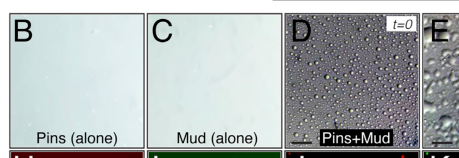

## Question

# Gene Research for Functional Annotation

## ⚠️ CRITICAL: Gene/Protein Identification Context

**BEFORE YOU BEGIN RESEARCH:** You MUST verify you are researching the CORRECT gene/protein. Gene symbols can be ambiguous, especially for less well-characterized genes from non-model organisms.

### Target Gene/Protein Identity (from UniProt):
- **UniProt Accession:** Q9VB22
- **Protein Description:** SubName: Full=Partner of inscuteable {ECO:0000313|EMBL:AAF56721.1};
- **Gene Information:** Name=pins {ECO:0000313|EMBL:AAF56721.1, ECO:0000313|FlyBase:FBgn0040080}; Synonyms=dLGN {ECO:0000313|EMBL:AAF56721.1}, Dmel\CG5692 {ECO:0000313|EMBL:AAF56721.1}, dPins {ECO:0000313|EMBL:AAF56721.1}, LGN {ECO:0000313|EMBL:AAF56721.1}, PINS {ECO:0000313|EMBL:AAF56721.1}, Pins {ECO:0000313|EMBL:AAF56721.1}, pins/raps {ECO:0000313|EMBL:AAF56721.1}, Rad {ECO:0000313|EMBL:AAF56721.1}, rad {ECO:0000313|EMBL:AAF56721.1}, RAPS {ECO:0000313|EMBL:AAF56721.1}, Raps {ECO:0000313|EMBL:AAF56721.1}, raps {ECO:0000313|EMBL:AAF56721.1}, rapsyn {ECO:0000313|EMBL:AAF56721.1}; ORFNames=CG5692 {ECO:0000313|EMBL:AAF56721.1, ECO:0000313|FlyBase:FBgn0040080}, Dmel_CG5692 {ECO:0000313|EMBL:AAF56721.1};
- **Organism (full):** Drosophila melanogaster (Fruit fly).
- **Protein Family:** Belongs to the GPSM family.
- **Key Domains:** GoLoco_motif. (IPR003109); GPSM. (IPR052386); TPR-like_helical_dom_sf. (IPR011990); TPR_rpt. (IPR019734); GoLoco (PF02188)

### MANDATORY VERIFICATION STEPS:

1. **Check if the gene symbol "pins" matches the protein description above**
2. **Verify the organism is correct:** Drosophila melanogaster (Fruit fly).
3. **Check if protein family/domains align with what you find in literature**
4. **If you find literature for a DIFFERENT gene with the same or similar symbol, STOP**

### If Gene Symbol is Ambiguous or You Cannot Find Relevant Literature:

**DO NOT PROCEED WITH RESEARCH ON A DIFFERENT GENE.** Instead:
- State clearly: "The gene symbol 'pins' is ambiguous or literature is limited for this specific protein"
- Explain what you found (e.g., "Found extensive literature on a different gene with the same symbol in a different organism")
- Describe the protein based ONLY on the UniProt information provided above
- Suggest that the protein function can be inferred from domain/family information

### Research Target:

Please provide a comprehensive research report on the gene **pins** (gene ID: pins, UniProt: Q9VB22) in DROME.

The research report should be a detailed narrative explaining the function, biological processes, and localization of the gene product. Citations should be given for all claims.

You should prioritize authoritative reviews and primary scientific literature when conducting research. You can supplement
this with annotations you find in gene/protein databases, but these can be outdated or inaccurate.

We are specifically interested in the primary function of the gene - for enzymes, what reaction is catalyzed, and what is the substrate specificity? For transporters, what is the substrate? For structural proteins or adapters, what is the broader structural role? For signaling molecules, what is the role in the pathway.

We are interested in where in or outside the cell the gene product carries out its function.

We are also interested in the signaling or biochemical pathways in which the gene functions. We are less interested in broad pleiotropic effects, except where these elucidate the precise role.

Include evidence where possible. We are interested in both experimental evidence as well as inference from structure, evolution, or bioinformatic analysis. Precise studies should be prioritized over high-throughput, where available.

## Output

Question: You are an expert researcher providing comprehensive, well-cited information.

Provide detailed information focusing on:
1. Key concepts and definitions with current understanding
2. Recent developments and latest research (prioritize 2023-2024 sources)
3. Current applications and real-world implementations
4. Expert opinions and analysis from authoritative sources
5. Relevant statistics and data from recent studies

Format as a comprehensive research report with proper citations. Include URLs and publication dates where available.
Always prioritize recent, authoritative sources and provide specific citations for all major claims.

# Gene Research for Functional Annotation

## ⚠️ CRITICAL: Gene/Protein Identification Context

**BEFORE YOU BEGIN RESEARCH:** You MUST verify you are researching the CORRECT gene/protein. Gene symbols can be ambiguous, especially for less well-characterized genes from non-model organisms.

### Target Gene/Protein Identity (from UniProt):
- **UniProt Accession:** Q9VB22
- **Protein Description:** SubName: Full=Partner of inscuteable {ECO:0000313|EMBL:AAF56721.1};
- **Gene Information:** Name=pins {ECO:0000313|EMBL:AAF56721.1, ECO:0000313|FlyBase:FBgn0040080}; Synonyms=dLGN {ECO:0000313|EMBL:AAF56721.1}, Dmel\CG5692 {ECO:0000313|EMBL:AAF56721.1}, dPins {ECO:0000313|EMBL:AAF56721.1}, LGN {ECO:0000313|EMBL:AAF56721.1}, PINS {ECO:0000313|EMBL:AAF56721.1}, Pins {ECO:0000313|EMBL:AAF56721.1}, pins/raps {ECO:0000313|EMBL:AAF56721.1}, Rad {ECO:0000313|EMBL:AAF56721.1}, rad {ECO:0000313|EMBL:AAF56721.1}, RAPS {ECO:0000313|EMBL:AAF56721.1}, Raps {ECO:0000313|EMBL:AAF56721.1}, raps {ECO:0000313|EMBL:AAF56721.1}, rapsyn {ECO:0000313|EMBL:AAF56721.1}; ORFNames=CG5692 {ECO:0000313|EMBL:AAF56721.1, ECO:0000313|FlyBase:FBgn0040080}, Dmel_CG5692 {ECO:0000313|EMBL:AAF56721.1};
- **Organism (full):** Drosophila melanogaster (Fruit fly).
- **Protein Family:** Belongs to the GPSM family.
- **Key Domains:** GoLoco_motif. (IPR003109); GPSM. (IPR052386); TPR-like_helical_dom_sf. (IPR011990); TPR_rpt. (IPR019734); GoLoco (PF02188)

### MANDATORY VERIFICATION STEPS:

1. **Check if the gene symbol "pins" matches the protein description above**
2. **Verify the organism is correct:** Drosophila melanogaster (Fruit fly).
3. **Check if protein family/domains align with what you find in literature**
4. **If you find literature for a DIFFERENT gene with the same or similar symbol, STOP**

### If Gene Symbol is Ambiguous or You Cannot Find Relevant Literature:

**DO NOT PROCEED WITH RESEARCH ON A DIFFERENT GENE.** Instead:
- State clearly: "The gene symbol 'pins' is ambiguous or literature is limited for this specific protein"
- Explain what you found (e.g., "Found extensive literature on a different gene with the same symbol in a different organism")
- Describe the protein based ONLY on the UniProt information provided above
- Suggest that the protein function can be inferred from domain/family information

### Research Target:

Please provide a comprehensive research report on the gene **pins** (gene ID: pins, UniProt: Q9VB22) in DROME.

The research report should be a detailed narrative explaining the function, biological processes, and localization of the gene product. Citations should be given for all claims.

You should prioritize authoritative reviews and primary scientific literature when conducting research. You can supplement
this with annotations you find in gene/protein databases, but these can be outdated or inaccurate.

We are specifically interested in the primary function of the gene - for enzymes, what reaction is catalyzed, and what is the substrate specificity? For transporters, what is the substrate? For structural proteins or adapters, what is the broader structural role? For signaling molecules, what is the role in the pathway.

We are interested in where in or outside the cell the gene product carries out its function.

We are also interested in the signaling or biochemical pathways in which the gene functions. We are less interested in broad pleiotropic effects, except where these elucidate the precise role.

Include evidence where possible. We are interested in both experimental evidence as well as inference from structure, evolution, or bioinformatic analysis. Precise studies should be prioritized over high-throughput, where available.

# Functional annotation of *Drosophila melanogaster pins* (UniProt Q9VB22)

## Identity and principal function

**Identity verified:** The target is *D. melanogaster* **Partner of Inscuteable (Pins)**, also called Raps, not a similarly named protein or mammalian LGN. The supplied UniProt accession Q9VB22 and gene designation **CG5692** identify the target; fly-specific studies independently identify Partner of Inscuteable as the spindle-orientation protein discussed below. Its TPR-repeat and GoLoco architecture agrees with the supplied GPSM-family annotation. References to mammalian LGN indicate homology, **not** direct experimental evidence for this fly protein. (yu2025implicationsofdrosophila pages 19-20, bowman2006thedrosophilanuma pages 1-2, mauser2012inscuteableregulatesthe pages 2-3)

**Primary annotation:** Pins is a regulated, intracellular **cortical adaptor for mitotic-spindle positioning**. It connects spatial polarity and G-protein signals at the cell cortex to proteins that engage astral spindle microtubules. Its principal output is to align the division spindle with the appropriate cellular axis so that differently localized fate determinants enter the intended daughter cells. It is not annotated as a catalyst or transporter: its relevant molecular specificity is for protein partners, especially GDP-bound Gαi, Inscuteable, Mud and Discs large (Dlg). This role is best established in dividing neuroblasts and sensory-organ precursors (SOPs), rather than universally across fly tissues. (bowman2006thedrosophilanuma pages 1-2, mauser2012inscuteableregulatesthe pages 1-2, bergstralh2016pinsisnot pages 10-13, pinot2024spatiotemporalregulationof pages 4-6)

The evidence map summarizes the domain-specific mechanisms and important tissue qualification discussed below.

| Molecular module or context | Experimentally supported function or localization | Key study, year, DOI |
|---|---|---|
| N-terminal seven-TPR array | Directly binds Inscuteable and Mud at overlapping sites. Pull-down, co-immunoprecipitation, and anisotropy experiments showed mutually exclusive complexes; Insc displaced Mud from Pins. Reported affinities were approximately 5 μM for Insc–Pins and 1.1 μM for Pins–Mud. (mauser2012inscuteableregulatesthe pages 3-5, mauser2012inscuteableregulatesthe pages 2-3) | Mauser & Prehoda, 2012; [10.1371/journal.pone.0029611](https://doi.org/10.1371/journal.pone.0029611) |
| Three C-terminal GoLoco motifs and Gαi | Gαi binding relieves Pins autoinhibition and permits TPR-mediated Mud recruitment. Activation was ultrasensitive, with an apparent Hill coefficient of 3.1; GL3 supplied the activating interaction, whereas GL1 and GL2 acted as decoys shaping the threshold response. (smith2011robustspindlealignment pages 1-2) | Smith & Prehoda, 2011; [10.1016/j.molcel.2011.06.030](https://doi.org/10.1016/j.molcel.2011.06.030) |
| Central linker–Dlg–Khc73 branch | Aurora-A phosphorylation of the Pins linker creates a Dlg-binding state; Dlg couples Pins to the plus-end-directed kinesin Khc73, supporting cortical capture of astral microtubule plus ends. Insc–Pins can retain this Dlg branch even while excluding Mud. (mauser2012inscuteableregulatesthe pages 1-2, lu2013molecularpathwaysregulating pages 8-9, lu2013molecularpathwaysregulating pages 3-4) | Mauser & Prehoda, 2012; [10.1371/journal.pone.0029611](https://doi.org/10.1371/journal.pone.0029611); synthesis reviewed by Lu & Johnston, 2013; [10.1242/dev.087627](https://doi.org/10.1242/dev.087627) |
| TPR–Mud–dynein branch | Pins binds Mud directly through its TPR region. Mud links cortical Pins to dynein/dynactin and astral microtubules, enabling cortical pulling forces that align the neuroblast spindle with the apical–basal polarity axis. (bowman2006thedrosophilanuma pages 1-2, lu2013molecularpathwaysregulating pages 8-9, lu2013molecularpathwaysregulating pages 3-4) | Bowman et al., 2006; [10.1016/j.devcel.2006.05.005](https://doi.org/10.1016/j.devcel.2006.05.005) |
| Pins–Mud–Hts biochemical assembly | Purified Pins TPR-linker and Mud CC-PBD fragments, at 100 μM each, formed spherical, fusing droplets; neither protein alone nor Pins plus Insc did so. Hts/Adducin associated with Mud and lowered the tested concentration requirement. This establishes biochemical sufficiency in vitro—not confirmed phase separation of endogenous complexes in vivo. (parra2023drosophilaadducinfacilitates pages 1-2, parra2023drosophilaadducinfacilitates pages 5-7, parra2023drosophilaadducinfacilitates pages 11-12, parra2023drosophilaadducinfacilitates media 2c87dcdf) | Parra, Moezzi & Johnston, 2023; [10.3389/fcell.2023.1220529](https://doi.org/10.3389/fcell.2023.1220529) |
| Sensory-organ precursor cortex | During mitosis in pupal-notum SOP cells, Pins and Dlg accumulate at the anterior lateral/anterobasal cortex with Numb and Neuralized. Mud associates with Pins anteriorly and with dynein to orient the spindle along the anterior–posterior axis with a slight apical–basal tilt. (pinot2024spatiotemporalregulationof pages 4-6) | Pinot & Le Borgne, 2024; [10.3390/cells13131133](https://doi.org/10.3390/cells13131133) |
| Wing imaginal-disc exception | Pins-null wing-disc cells retain normal division orientation. Mud remains at apicolateral cortical foci without Pins, demonstrating a tissue-specific, Pins-independent route for Mud localization and spindle orientation; Pins therefore is not universally required in fly epithelia. (bergstralh2016pinsisnot pages 13-16, bergstralh2016pinsisnot pages 10-13) | Bergstralh et al., 2016; [10.1242/dev.135475](https://doi.org/10.1242/dev.135475) |

*Table: Concise evidence map for Drosophila melanogaster Pins (Q9VB22), linking its molecular modules and tissue contexts to experimentally supported functions. The phase-separation result is explicitly limited to the purified in-vitro assay.*

## Molecular mechanism and pathway

Pins has **seven N-terminal tetratricopeptide repeats (TPRs)**, a **central linker**, and **three C-terminal GoLoco motifs**. TPRs bind Inscuteable or Mud; the GoLoco region binds Gαi. Purified-protein binding experiments found that Inscuteable and Mud occupy competing Pins-TPR complexes: adding Inscuteable displaced Mud from preassembled Pins–Mud. Reported dissociation constants were approximately **5 μM for Inscuteable–Pins** and **1.1 μM for Pins–Mud** under the study’s assay conditions. These are interaction measurements, not concentrations measured inside neuroblasts. (mauser2012inscuteableregulatesthe pages 2-3)

The GoLoco motifs recognize **GDP-bound Gαi** and regulate Pins conformation rather than catalyzing nucleotide exchange or hydrolysis. Gαi binding relieves an autoinhibited Pins state, allowing Mud to engage its TPR region. In a purified Gαi–Pins–Mud reconstitution, activation had an **apparent Hill coefficient of 3.1**. Specifically, GoLoco motif **GL3** supplied the activating interaction, while **GL1 and GL2** functioned as competing *decoys* that sharpened the activation threshold. A Pins mutant lacking that normal threshold failed to couple neuroblast spindle position robustly to cortical polarity. The quantitative Hill value describes the reconstituted assay, not a measured whole-cell response. (bowman2006thedrosophilanuma pages 1-2, lu2013molecularpathwaysregulating pages 8-9, smith2011robustspindlealignment pages 1-2, smith2011robustspindlealignment pages 7-8)

Pins connects to astral microtubules through **two distinguishable downstream branches**. In the Mud branch, its TPRs bind Mushroom body defect (**Mud**), a spindle-positioning protein associated with the dynein–dynactin machinery; cortical dynein can exert pulling forces on astral microtubules. In the other branch, **Aurora-A-dependent phosphorylation of the Pins linker** enables interaction with **Dlg**; Dlg associates with the plus-end kinesin **Khc73**, providing a route for cortical microtubule capture. Experiments in polarized fly S2 cells found that Inscuteable–Pins–Gαi recruits Dlg **but not Mud**, despite the presence of Gαi. Thus Inscuteable does more than recruit Pins: competition at the TPRs can favor the Dlg branch over Mud-dependent force generation. A proposed temporal switch from cortical attachment to pulling is a mechanistic interpretation, not a demonstrated universal sequence in every division. (mauser2012inscuteableregulatesthe pages 1-2, lu2013molecularpathwaysregulating pages 8-9, mauser2012inscuteableregulatesthe pages 2-3, lu2013molecularpathwaysregulating pages 3-4)

## Site of action and biological processes

In **mitotic larval neuroblasts**, Pins acts predominantly in an **apical crescent on the cytoplasmic face of the plasma-membrane cortex**. The Bazooka/Par-6/aPKC polarity machinery positions Inscuteable apically; Inscuteable recruits Pins into the cortical system containing Gαi, while Pins-associated Mud couples that polarity information to the spindle. Alignment with the apical–basal axis permits unequal segregation of basal fate determinants into the differentiating daughter rather than the self-renewing neuroblast. Mud can also occur at spindle-associated locations independently of Pins, so not every Mud localization reports a Pins complex. (deduyer2025roleofthe pages 62-66, bowman2006thedrosophilanuma pages 1-2, lu2013molecularpathwaysregulating pages 8-9, parra2023drosophilaadducinfacilitates pages 3-5)

In **pupal-notum SOPs**, the orientation is different: during mitosis, Pins and Dlg accumulate at the **anterior lateral/anterobasal cortex**, opposite the posterior polarity domain. A 2024 specialist review describes anterior Pins-associated Mud, together with dynein, as contributing to spindle orientation along the **anterior–posterior axis**, with a slight apical–basal tilt. Numb and Neuralized occupy the anterior determinant domain; downstream differences in daughter-cell Notch signaling are consequences of this asymmetric division, **not evidence that Pins itself is a Notch receptor or enzyme**. Localization and orientation therefore depend on cell type rather than on a single invariant “apical Pins” position. (pinot2024spatiotemporalregulationof pages 4-6)

Genetic perturbations corroborate the scaffold model but impose an important limit on generalization. Loss of Mud disrupts neuroblast spindle alignment, while loss or knockdown of Pins perturbs spindle positioning in susceptible contexts. **Conversely, Pins-null cells in the wing imaginal-disc epithelium retained normal division orientation** in a live-imaging study: Mud remained at apicolateral cortical foci without Pins. The authors concluded that alternative cortical Mud-localization mechanisms can make wing-disc spindle orientation Pins-independent. This is stronger evidence than inferring an essential role from Pins localization alone. (bowman2006thedrosophilanuma pages 1-2, bergstralh2016pinsisnot pages 10-13, bergstralh2016pinsisnot pages 13-16)

## Recent developments and strength of evidence

A **16 August 2023** primary study identified **Hu li tai shao (Hts/Adducin)** as a direct Mud-binding partner in the neuroblast spindle-positioning system. Hts loss disrupted spindle alignment comparably to Pins or Mud knockdown **without abolishing the apical Pins crescent**, separating establishment of cortical polarity from efficient spindle positioning. With purified Pins-TPR/linker and Mud fragments at **100 μM each**, the investigators observed spherical, fusing droplets; neither fragment alone, nor Pins combined with Inscuteable under the tested conditions, produced droplets. Hts promoted assembly at lower tested protein concentrations. The direct figure comparison supports **selective liquid-like phase separation in vitro**. Whether endogenous Pins–Mud undergoes the same phase transition, at physiological concentrations, inside neuroblasts remains a mechanistic hypothesis rather than an established cellular fact. (parra2023drosophilaadducinfacilitates pages 5-7, parra2023drosophilaadducinfacilitates pages 1-2, parra2023drosophilaadducinfacilitates pages 11-12, parra2023drosophilaadducinfacilitates media 2c87dcdf)

The **June 2024** SOP review integrates Pins into planar polarity, Mud–dynein-mediated spindle orientation and subsequent Notch-dependent daughter-fate asymmetry; it is an authoritative synthesis of the SOP system, whereas the direct binding, mutant and biochemical claims above are grounded chiefly in primary fly experiments. The practical application of this annotation is **mechanistic interpretation of fly neuroblast and SOP imaging, loss-of-function experiments, and reconstituted spindle-orientation assays**. The retrieved evidence supports Pins as a developmental cell-division model protein; it does **not** establish a clinical use, therapeutic indication or organism-wide requirement for Pins in all epithelia. (pinot2024spatiotemporalregulationof pages 4-6, parra2023drosophilaadducinfacilitates pages 1-2, bergstralh2016pinsisnot pages 10-13)

**Key sources and publication dates:** Bowman *et al.*, *Developmental Cell*, **June 2006**, https://doi.org/10.1016/j.devcel.2006.05.005 (bowman2006thedrosophilanuma pages 1-2); Smith and Prehoda, *Molecular Cell*, **August 2011**, https://doi.org/10.1016/j.molcel.2011.06.030 (smith2011robustspindlealignment pages 1-2); Mauser and Prehoda, *PLOS ONE*, **January 2012**, https://doi.org/10.1371/journal.pone.0029611 (mauser2012inscuteableregulatesthe pages 2-3); Bergstralh *et al.*, *Development*, **July 2016**, https://doi.org/10.1242/dev.135475 (bergstralh2016pinsisnot pages 10-13); Parra, Moezzi and Johnston, *Frontiers in Cell and Developmental Biology*, **16 August 2023**, https://doi.org/10.3389/fcell.2023.1220529 (parra2023drosophilaadducinfacilitates pages 1-2); Pinot and Le Borgne, *Cells*, **June 2024**, https://doi.org/10.3390/cells13131133 (pinot2024spatiotemporalregulationof pages 4-6).

References

1. (yu2025implicationsofdrosophila pages 19-20): Yue Yu, Hong-Sheng Zhu, Min-Yan Li, Xuming Ren, Lijuan Zhang, Yu Bai, and Huanping An. Implications of drosophila neuroblast development for tumorigenesis. Journal of Biological Methods, 13:e99010082, Oct 2025. URL: https://doi.org/10.14440/jbm.0031, doi:10.14440/jbm.0031. This article has 0 citations.

2. (bowman2006thedrosophilanuma pages 1-2): Sarah K. Bowman, Ralph A. Neumüller, Maria Novatchkova, Quansheng Du, and Juergen A. Knoblich. The drosophila numa homolog mud regulates spindle orientation in asymmetric cell division. Developmental cell, 10 6:731-42, Jun 2006. URL: https://doi.org/10.1016/j.devcel.2006.05.005, doi:10.1016/j.devcel.2006.05.005. This article has 366 citations and is from a highest quality peer-reviewed journal.

3. (mauser2012inscuteableregulatesthe pages 2-3): Jonathon F. Mauser and Kenneth E. Prehoda. Inscuteable regulates the pins-mud spindle orientation pathway. PLoS ONE, 7:e29611, Jan 2012. URL: https://doi.org/10.1371/journal.pone.0029611, doi:10.1371/journal.pone.0029611. This article has 42 citations and is from a peer-reviewed journal.

4. (mauser2012inscuteableregulatesthe pages 1-2): Jonathon F. Mauser and Kenneth E. Prehoda. Inscuteable regulates the pins-mud spindle orientation pathway. PLoS ONE, 7:e29611, Jan 2012. URL: https://doi.org/10.1371/journal.pone.0029611, doi:10.1371/journal.pone.0029611. This article has 42 citations and is from a peer-reviewed journal.

5. (bergstralh2016pinsisnot pages 10-13): Dan T Bergstralh, Holly E Lovegrove, Izabela Kujawiak, Nicole S Dawney, Jinwei Zhu, Samantha Cooper, Rongguang Zhang, and Daniel St Johnston. Pins is not required for spindle orientation in the drosophila wing disc. Development (Cambridge, England), 143:2573-2581, Jul 2016. URL: https://doi.org/10.1242/dev.135475, doi:10.1242/dev.135475. This article has 47 citations.

6. (pinot2024spatiotemporalregulationof pages 4-6): Mathieu Pinot and Roland Le Borgne. Spatio-temporal regulation of notch activation in asymmetrically dividing sensory organ precursor cells in drosophila melanogaster epithelium. Cells, 13:1133, Jun 2024. URL: https://doi.org/10.3390/cells13131133, doi:10.3390/cells13131133. This article has 3 citations.

7. (mauser2012inscuteableregulatesthe pages 3-5): Jonathon F. Mauser and Kenneth E. Prehoda. Inscuteable regulates the pins-mud spindle orientation pathway. PLoS ONE, 7:e29611, Jan 2012. URL: https://doi.org/10.1371/journal.pone.0029611, doi:10.1371/journal.pone.0029611. This article has 42 citations and is from a peer-reviewed journal.

8. (smith2011robustspindlealignment pages 1-2): Nicholas R. Smith and Kenneth E. Prehoda. Robust spindle alignment in drosophila neuroblasts by ultrasensitive activation of pins. Molecular cell, 43 4:540-9, Aug 2011. URL: https://doi.org/10.1016/j.molcel.2011.06.030, doi:10.1016/j.molcel.2011.06.030. This article has 27 citations and is from a highest quality peer-reviewed journal.

9. (lu2013molecularpathwaysregulating pages 8-9): Michelle S. Lu and Christopher A. Johnston. Molecular pathways regulating mitotic spindle orientation in animal cells. Development, 140:1843-1856, May 2013. URL: https://doi.org/10.1242/dev.087627, doi:10.1242/dev.087627. This article has 227 citations and is from a domain leading peer-reviewed journal.

10. (lu2013molecularpathwaysregulating pages 3-4): Michelle S. Lu and Christopher A. Johnston. Molecular pathways regulating mitotic spindle orientation in animal cells. Development, 140:1843-1856, May 2013. URL: https://doi.org/10.1242/dev.087627, doi:10.1242/dev.087627. This article has 227 citations and is from a domain leading peer-reviewed journal.

11. (parra2023drosophilaadducinfacilitates pages 1-2): Amalia S. Parra, Cameron A. Moezzi, and Christopher A. Johnston. Drosophila adducin facilitates phase separation and function of a conserved spindle orientation complex. Frontiers in Cell and Developmental Biology, Aug 2023. URL: https://doi.org/10.3389/fcell.2023.1220529, doi:10.3389/fcell.2023.1220529. This article has 6 citations.

12. (parra2023drosophilaadducinfacilitates pages 5-7): Amalia S. Parra, Cameron A. Moezzi, and Christopher A. Johnston. Drosophila adducin facilitates phase separation and function of a conserved spindle orientation complex. Frontiers in Cell and Developmental Biology, Aug 2023. URL: https://doi.org/10.3389/fcell.2023.1220529, doi:10.3389/fcell.2023.1220529. This article has 6 citations.

13. (parra2023drosophilaadducinfacilitates pages 11-12): Amalia S. Parra, Cameron A. Moezzi, and Christopher A. Johnston. Drosophila adducin facilitates phase separation and function of a conserved spindle orientation complex. Frontiers in Cell and Developmental Biology, Aug 2023. URL: https://doi.org/10.3389/fcell.2023.1220529, doi:10.3389/fcell.2023.1220529. This article has 6 citations.

14. (parra2023drosophilaadducinfacilitates media 2c87dcdf): Amalia S. Parra, Cameron A. Moezzi, and Christopher A. Johnston. Drosophila adducin facilitates phase separation and function of a conserved spindle orientation complex. Frontiers in Cell and Developmental Biology, Aug 2023. URL: https://doi.org/10.3389/fcell.2023.1220529, doi:10.3389/fcell.2023.1220529. This article has 6 citations.

15. (bergstralh2016pinsisnot pages 13-16): Dan T Bergstralh, Holly E Lovegrove, Izabela Kujawiak, Nicole S Dawney, Jinwei Zhu, Samantha Cooper, Rongguang Zhang, and Daniel St Johnston. Pins is not required for spindle orientation in the drosophila wing disc. Development (Cambridge, England), 143:2573-2581, Jul 2016. URL: https://doi.org/10.1242/dev.135475, doi:10.1242/dev.135475. This article has 47 citations.

16. (smith2011robustspindlealignment pages 7-8): Nicholas R. Smith and Kenneth E. Prehoda. Robust spindle alignment in drosophila neuroblasts by ultrasensitive activation of pins. Molecular cell, 43 4:540-9, Aug 2011. URL: https://doi.org/10.1016/j.molcel.2011.06.030, doi:10.1016/j.molcel.2011.06.030. This article has 27 citations and is from a highest quality peer-reviewed journal.

17. (deduyer2025roleofthe pages 62-66): Irène Deduyer. Role of the polar cortex on the mechanics of cytokinesis in diverse cell types and consequences of its disruption on cell fate and tissue organization. PhD thesis, Agence Bibliographique de l’Enseignement Supérieur, 2025. URL: https://doi.org/10.70675/192a73fbzf096z4b33z95fdzdd8b058fd47c, doi:10.70675/192a73fbzf096z4b33z95fdzdd8b058fd47c.

18. (parra2023drosophilaadducinfacilitates pages 3-5): Amalia S. Parra, Cameron A. Moezzi, and Christopher A. Johnston. Drosophila adducin facilitates phase separation and function of a conserved spindle orientation complex. Frontiers in Cell and Developmental Biology, Aug 2023. URL: https://doi.org/10.3389/fcell.2023.1220529, doi:10.3389/fcell.2023.1220529. This article has 6 citations.

## Artifacts

- [Edison artifact artifact-00](pins-deep-research-falcon_artifacts/artifact-00.md)

## Citations

1. smith2011robustspindlealignment pages 1-2
2. pinot2024spatiotemporalregulationof pages 4-6
3. mauser2012inscuteableregulatesthe pages 2-3
4. bowman2006thedrosophilanuma pages 1-2
5. bergstralh2016pinsisnot pages 10-13
6. parra2023drosophilaadducinfacilitates pages 1-2
7. yu2025implicationsofdrosophila pages 19-20
8. mauser2012inscuteableregulatesthe pages 1-2
9. mauser2012inscuteableregulatesthe pages 3-5
10. lu2013molecularpathwaysregulating pages 8-9
11. lu2013molecularpathwaysregulating pages 3-4
12. parra2023drosophilaadducinfacilitates pages 5-7
13. parra2023drosophilaadducinfacilitates pages 11-12
14. bergstralh2016pinsisnot pages 13-16
15. smith2011robustspindlealignment pages 7-8
16. deduyer2025roleofthe pages 62-66
17. parra2023drosophilaadducinfacilitates pages 3-5
18. 10.1371/journal.pone.0029611
19. 10.1016/j.molcel.2011.06.030
20. 10.1242/dev.087627
21. 10.1016/j.devcel.2006.05.005
22. 10.3389/fcell.2023.1220529
23. 10.3390/cells13131133
24. 10.1242/dev.135475
25. https://doi.org/10.1371/journal.pone.0029611
26. https://doi.org/10.1016/j.molcel.2011.06.030
27. https://doi.org/10.1242/dev.087627
28. https://doi.org/10.1016/j.devcel.2006.05.005
29. https://doi.org/10.3389/fcell.2023.1220529
30. https://doi.org/10.3390/cells13131133
31. https://doi.org/10.1242/dev.135475
32. https://doi.org/10.14440/jbm.0031,
33. https://doi.org/10.1016/j.devcel.2006.05.005,
34. https://doi.org/10.1371/journal.pone.0029611,
35. https://doi.org/10.1242/dev.135475,
36. https://doi.org/10.3390/cells13131133,
37. https://doi.org/10.1016/j.molcel.2011.06.030,
38. https://doi.org/10.1242/dev.087627,
39. https://doi.org/10.3389/fcell.2023.1220529,
40. https://doi.org/10.70675/192a73fbzf096z4b33z95fdzdd8b058fd47c,