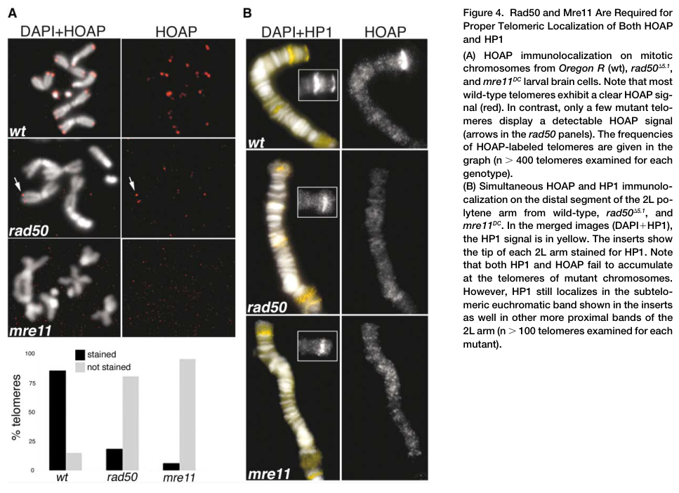

## Question

# Gene Research for Functional Annotation

## ⚠️ CRITICAL: Gene/Protein Identification Context

**BEFORE YOU BEGIN RESEARCH:** You MUST verify you are researching the CORRECT gene/protein. Gene symbols can be ambiguous, especially for less well-characterized genes from non-model organisms.

### Target Gene/Protein Identity (from UniProt):
- **UniProt Accession:** Q9W252
- **Protein Description:** RecName: Full=DNA repair protein RAD50; EC=3.6.-.- {ECO:0000250|UniProtKB:Q92878};
- **Gene Information:** Name=rad50; ORFNames=CG6339;
- **Organism (full):** Drosophila melanogaster (Fruit fly).
- **Protein Family:** Belongs to the SMC family. RAD50 subfamily. .
- **Key Domains:** P-loop_NTPase. (IPR027417); Rad50/SbcC_AAA. (IPR038729); Rad50_eukaryotes. (IPR004584); Zn_hook_RAD50. (IPR013134); AAA_23 (PF13476)

### MANDATORY VERIFICATION STEPS:

1. **Check if the gene symbol "rad50" matches the protein description above**
2. **Verify the organism is correct:** Drosophila melanogaster (Fruit fly).
3. **Check if protein family/domains align with what you find in literature**
4. **If you find literature for a DIFFERENT gene with the same or similar symbol, STOP**

### If Gene Symbol is Ambiguous or You Cannot Find Relevant Literature:

**DO NOT PROCEED WITH RESEARCH ON A DIFFERENT GENE.** Instead:
- State clearly: "The gene symbol 'rad50' is ambiguous or literature is limited for this specific protein"
- Explain what you found (e.g., "Found extensive literature on a different gene with the same symbol in a different organism")
- Describe the protein based ONLY on the UniProt information provided above
- Suggest that the protein function can be inferred from domain/family information

### Research Target:

Please provide a comprehensive research report on the gene **rad50** (gene ID: rad50, UniProt: Q9W252) in DROME.

The research report should be a detailed narrative explaining the function, biological processes, and localization of the gene product. Citations should be given for all claims.

You should prioritize authoritative reviews and primary scientific literature when conducting research. You can supplement
this with annotations you find in gene/protein databases, but these can be outdated or inaccurate.

We are specifically interested in the primary function of the gene - for enzymes, what reaction is catalyzed, and what is the substrate specificity? For transporters, what is the substrate? For structural proteins or adapters, what is the broader structural role? For signaling molecules, what is the role in the pathway.

We are interested in where in or outside the cell the gene product carries out its function.

We are also interested in the signaling or biochemical pathways in which the gene functions. We are less interested in broad pleiotropic effects, except where these elucidate the precise role.

Include evidence where possible. We are interested in both experimental evidence as well as inference from structure, evolution, or bioinformatic analysis. Precise studies should be prioritized over high-throughput, where available.

## Output

Question: You are an expert researcher providing comprehensive, well-cited information.

Provide detailed information focusing on:
1. Key concepts and definitions with current understanding
2. Recent developments and latest research (prioritize 2023-2024 sources)
3. Current applications and real-world implementations
4. Expert opinions and analysis from authoritative sources
5. Relevant statistics and data from recent studies

Format as a comprehensive research report with proper citations. Include URLs and publication dates where available.
Always prioritize recent, authoritative sources and provide specific citations for all major claims.

# Gene Research for Functional Annotation

## ⚠️ CRITICAL: Gene/Protein Identification Context

**BEFORE YOU BEGIN RESEARCH:** You MUST verify you are researching the CORRECT gene/protein. Gene symbols can be ambiguous, especially for less well-characterized genes from non-model organisms.

### Target Gene/Protein Identity (from UniProt):
- **UniProt Accession:** Q9W252
- **Protein Description:** RecName: Full=DNA repair protein RAD50; EC=3.6.-.- {ECO:0000250|UniProtKB:Q92878};
- **Gene Information:** Name=rad50; ORFNames=CG6339;
- **Organism (full):** Drosophila melanogaster (Fruit fly).
- **Protein Family:** Belongs to the SMC family. RAD50 subfamily. .
- **Key Domains:** P-loop_NTPase. (IPR027417); Rad50/SbcC_AAA. (IPR038729); Rad50_eukaryotes. (IPR004584); Zn_hook_RAD50. (IPR013134); AAA_23 (PF13476)

### MANDATORY VERIFICATION STEPS:

1. **Check if the gene symbol "rad50" matches the protein description above**
2. **Verify the organism is correct:** Drosophila melanogaster (Fruit fly).
3. **Check if protein family/domains align with what you find in literature**
4. **If you find literature for a DIFFERENT gene with the same or similar symbol, STOP**

### If Gene Symbol is Ambiguous or You Cannot Find Relevant Literature:

**DO NOT PROCEED WITH RESEARCH ON A DIFFERENT GENE.** Instead:
- State clearly: "The gene symbol 'rad50' is ambiguous or literature is limited for this specific protein"
- Explain what you found (e.g., "Found extensive literature on a different gene with the same symbol in a different organism")
- Describe the protein based ONLY on the UniProt information provided above
- Suggest that the protein function can be inferred from domain/family information

### Research Target:

Please provide a comprehensive research report on the gene **rad50** (gene ID: rad50, UniProt: Q9W252) in DROME.

The research report should be a detailed narrative explaining the function, biological processes, and localization of the gene product. Citations should be given for all claims.

You should prioritize authoritative reviews and primary scientific literature when conducting research. You can supplement
this with annotations you find in gene/protein databases, but these can be outdated or inaccurate.

We are specifically interested in the primary function of the gene - for enzymes, what reaction is catalyzed, and what is the substrate specificity? For transporters, what is the substrate? For structural proteins or adapters, what is the broader structural role? For signaling molecules, what is the role in the pathway.

We are interested in where in or outside the cell the gene product carries out its function.

We are also interested in the signaling or biochemical pathways in which the gene functions. We are less interested in broad pleiotropic effects, except where these elucidate the precise role.

Include evidence where possible. We are interested in both experimental evidence as well as inference from structure, evolution, or bioinformatic analysis. Precise studies should be prioritized over high-throughput, where available.

# Functional annotation of *Drosophila melanogaster* **rad50**

## Identity and principal function

**Identity check.** The target is the fruit-fly **rad50** gene, **CG6339**, corresponding to the UniProt accession **Q9W252 supplied in the question**. A fly primary study independently identifies CG6339 as *D. melanogaster* Rad50 and describes a predicted 1,318-amino-acid protein with conserved ATPase motifs, a long coiled coil and a central CXXC zinc-hook motif. These features agree with the supplied SMC-family/RAD50-domain annotation. The retrieved primary paper does not itself print Q9W252, so the accession-to-gene link rests on the supplied UniProt identification; the gene, species and protein class are independently corroborated. This report does not substitute findings about a similarly named gene in another organism for fly-specific evidence. (gorski2004disruptionofdrosophila pages 5-7)

**Primary functional annotation:** fly Rad50 is the ATP-dependent architectural subunit of the nuclear **Mre11–Rad50–Nbs (MRN) DNA-damage-response complex**. Its best-demonstrated functions in flies are maintaining mitotic chromosome integrity, preventing inappropriate chromosome-end fusion, and enabling an effective response to double-strand breaks (DSBs). Genetic epistasis, chromosome cytology and Rad50’s dependence on Mre11 for protein stability support its operation with Mre11 rather than as an isolated DNA-repair enzyme. (ciapponi2004thedrosophilamre11rad50 pages 3-4, syed2018themre11rad50nbs1complex pages 4-5)

## Molecular activity and substrate

**Reaction and division of labor.** RAD50 is an ATPase: its expected chemical reaction is **ATP + H₂O → ADP + inorganic phosphate**. ATP binding brings its nucleotide-binding heads together; hydrolysis changes MRN conformation, coupling DNA binding and bridging to access of the Mre11 catalytic site. The long coiled coils and zinc hook provide an architecture capable of connecting DNA molecules or ends. **Mre11, not Rad50, catalyzes DNA-strand cleavage.** Accordingly, assigning an intrinsic DNA exonuclease or endonuclease reaction to fly Rad50 would be incorrect. The ATPase mechanism is strongly supported by conserved fly sequence motifs and biochemical/structural studies of homologous complexes, **not by a purified-Q9W252 ATPase measurement in the retrieved fly studies**. (gorski2004disruptionofdrosophila pages 5-7, syed2018themre11rad50nbs1complex pages 4-5, otahalova2023importanceofgermline pages 5-7, colombo2024functionalandmolecular pages 1-2)

The relevant macromolecular substrates are DNA duplexes, particularly damaged chromosome ends or DSB-associated DNA in the context of MRN; no fly-specific nucleotide-sequence recognition motif or quantitative DNA-substrate preference was established in the studies reviewed. In the conserved resection pathway, MRN works with a CtIP/Sae2-like activator to initiate processing of DNA ends, generating substrates for homologous recombination. Evidence that Rad50 nucleotide state controls Mre11 access—including processing of protein-blocked ends—comes chiefly from non-fly biochemical studies and should be treated as **mechanistic inference for CG6339**, not a demonstrated fly substrate-specificity assay. (otahalova2023importanceofgermline pages 5-7, colombo2024functionalandmolecular pages 1-2, pizzul2024rif2interactionwith pages 2-4)

## Direct experimental evidence in flies

The following studies anchor the annotation; the table distinguishes experiments on **rad50 itself** from experiments on other MRN subunits that inform Rad50’s localization or complex function. (ciapponi2004thedrosophilamre11rad50 pages 3-4, gao2009mre11rad50nbscomplexis pages 3-4, bosso2019nbs1interactswith pages 2-4, xu2023hrrepairpathway pages 3-5)

| Biological function/context | Direct *Drosophila melanogaster* evidence | Inference and limitations | Study (date; DOI URL) |
|---|---|---|---|
| Gene/protein identity and architecture | The fly gene was identified as **rad50/CG6339** at cytological position 58E1. Its 4,015-nt cDNA encodes a predicted 1,318-aa protein containing conserved Walker A/B, signature and D-loop motifs, a long coiled coil, and a central CXXC zinc-hook motif. It shares 30% identity/53% similarity with human RAD50. (gorski2004disruptionofdrosophila pages 5-7) | Confirms that CG6339 is the fly RAD50 ortholog and that its architecture matches the SMC-family ATPase/zinc-hook annotation. The retrieved paper did not independently display UniProt accession Q9W252, and it did not biochemically assay fly ATP hydrolysis. | Gorski et al. (June 2004); [https://doi.org/10.1016/j.dnarep.2004.02.001](https://doi.org/10.1016/j.dnarep.2004.02.001) |
| Telomere protection and chromosome-break prevention | In larval-brain metaphases, **rad50^5.1** homozygotes had **44.4% double-telomere associations** and **10.8% chromosome breaks**, versus **0.2%** and **0%**, respectively, in Oregon-R controls. Similar rad50, mre11 and double-mutant phenotypes placed the genes in the same epistasis group. (ciapponi2004thedrosophilamre11rad50 pages 3-4) | Direct null-mutant cytogenetic evidence supports two related roles: chromosome-end protection and prevention/repair of chromosome breaks. It does not resolve whether RAD50 acts directly at every telomere or through the assembled Mre11–Rad50 complex. | Ciapponi et al. (August 2004); [https://doi.org/10.1016/j.cub.2004.07.019](https://doi.org/10.1016/j.cub.2004.07.019) |
| Recruitment of telomere-capping proteins | HOAP was detected at **80.5%** of wild-type mitotic telomeres but only **18.2%** of unfused **rad50^5.1** telomeres; HOAP was absent from fusion sites. HOAP and HP1 were undetectable at mutant polytene-chromosome telomeres, while HP1 persisted at the chromocenter and euchromatic bands. (ciapponi2004thedrosophilamre11rad50 pages 4-5, ciapponi2004thedrosophilamre11rad50 media b2fbad07) | Supports a telomere-selective requirement for Mre11–Rad50 in efficient HOAP/HP1 recruitment or retention. Residual undetectable HOAP may still provide partial protection; the experiment does not prove direct RAD50–HOAP binding. | Ciapponi et al. (August 2004); [https://doi.org/10.1016/j.cub.2004.07.019](https://doi.org/10.1016/j.cub.2004.07.019) |
| Chromosomal localization and dependence on Mre11 | Rad50 immunostaining was distributed along metaphase chromosome arms and enriched in pericentric heterochromatin. Rad50 protein was absent from mre11-deficient brains despite normal rad50 transcription, indicating instability without Mre11. (ciapponi2004thedrosophilamre11rad50 pages 3-4) | Direct localization and partner-dependence evidence supports operation within an Mre11–Rad50 complex. Broad chromosome association, rather than visible telomere enrichment, cautions against describing fly Rad50 as exclusively telomeric. | Ciapponi et al. (August 2004); [https://doi.org/10.1016/j.cub.2004.07.019](https://doi.org/10.1016/j.cub.2004.07.019) |
| Developmental chromatin loading and embryonic telomere capping | Wild-type embryos contained prominent Mre11–Rad50 foci on condensed chromosomes, but these foci were **not preferentially telomeric**. In maternal-effect **mre11^58S** and **nbs^2K** embryos, Mre11–Rad50 remained cytoplasmic but was excluded from interphase and metaphase chromatin as maternal Nbs became depleted; Mre11–Rad50 association itself remained efficient. (gao2009mre11rad50nbscomplexis pages 3-4, gao2009mre11rad50nbscomplexis pages 4-5, gao2009mre11rad50nbscomplexis pages 1-3) | Supports an Nbs-dependent chromatin-loading function for the Mre11–Rad50 subcomplex during rapid embryonic cycles. These were **mre11 and nbs mutants—not rad50 mutants**—so the result establishes developmental regulation of Rad50 localization rather than a rad50-loss phenotype. | Gao et al. (June 2009); [https://doi.org/10.1073/pnas.0902707106](https://doi.org/10.1073/pnas.0902707106) |
| HP1a association and stability | HP1a co-immunoprecipitated with endogenous Rad50, Mre11 and Nbs in S2 cells; GST-pulldown experiments implicated HP1a’s chromoshadow domain. HP1a protein abundance and chromosome localization declined by **more than 50%** in rad50, mre11 or nbs mutant larval brains. (bosso2019nbs1interactswith pages 1-2, bosso2019nbs1interactswith pages 2-4) | Provides biochemical association and mutant-correlation evidence that intact MRN helps stabilize HP1a. Functional rescue by HP1a overexpression was specific to nbs and did **not** rescue rad50 chromosome breakage, so an independent Rad50–HP1a pathway is not established. | Bosso et al. (December 2019); [https://doi.org/10.1038/s41419-019-2185-x](https://doi.org/10.1038/s41419-019-2185-x) |
| Irradiated neural-stem-cell maintenance | Neuroblast-specific **rad50 RNAi** produced no nuclear-Prospero phenotype without irradiation, but after **30 Gy X-rays**, **11.9%** of neuroblasts showed nuclear Prospero versus **8.6%** in the irradiated control. Larvae were irradiated at 48 h after egg laying, and the response peaked around 24 h. (xu2023hrrepairpathway pages 3-5) | Recent fly evidence connects Rad50 to maintenance of neuroblast identity under genotoxic stress and is consistent with MRN/HR function. The increment is modest, RNAi-based and a cell-fate readout—not a direct biochemical measurement of homologous recombination or RAD50 ATPase activity. | Xu et al. (May 2023); [https://doi.org/10.26508/lsa.202201802](https://doi.org/10.26508/lsa.202201802) |

*Table: Direct fly evidence links rad50/CG6339 to chromosome-end protection, genome repair, chromatin-associated MRN function, HP1a stability and neural-stem-cell maintenance after irradiation. The limitations column separates rad50-specific experiments from developmental or biochemical inferences involving other MRN subunits.*

The strongest quantitative chromosome evidence comes from Ciapponi and colleagues. In larval-brain metaphases, **44.4%** of *rad50*⁵·¹ cells had double-telomere associations and **10.8%** had chromosome breaks, compared with **0.2%** and **0%**, respectively, in Oregon-R controls. Similar abnormalities in *mre11* single mutants and *mre11 rad50* double mutants place the two genes in the same epistasis group. Mutant cells were also at least an order of magnitude more sensitive than controls to X-ray-induced chromosome breakage. These measurements support both chromosome-end protection and repair or prevention of damage-associated breaks; they do not measure RAD50 ATPase kinetics. (ciapponi2004thedrosophilamre11rad50 pages 3-4, ciapponi2004thedrosophilamre11rad50 pages 4-5)

A second, more precise telomere phenotype identifies a plausible route to end protection. The capping protein **HOAP** was detectable at **80.5%** of control mitotic telomeres but only **18.2%** of unfused *rad50*⁵·¹ telomeres; HOAP was not detected at fusion sites. HOAP and HP1 also failed to accumulate detectably at mutant polytene-chromosome ends, although HP1 remained at other chromosomal locations. Thus, Mre11–Rad50 is needed for normal localization or retention of telomere-capping factors. The data do **not** establish that Rad50 directly binds HOAP, and the authors did not see pronounced Rad50 enrichment specifically at normal telomeres. Drosophila chromosome ends are maintained by specialized retrotransposons rather than the usual telomerase-based mechanism, making this an end-**capping** result, not evidence that Rad50 synthesizes telomeric DNA. Figure 4 provides the underlying HOAP/HP1 localization comparison. (ciapponi2004thedrosophilamre11rad50 pages 4-5, ciapponi2004thedrosophilamre11rad50 media b2fbad07, ciapponi2004thedrosophilamre11rad50 pages 5-6)

Independent gene-disruption experiments found delayed larval development, no recovered homozygous mutant adults in the tested cross, elevated phospho-H2Av DNA-damage signal and **3.5-fold more spontaneous apoptotic cells** in third-instar wing discs. Aberrant anaphases in larval brains increased **45-fold** relative to heterozygous siblings. These are consequences of genome-maintenance failure, rather than evidence that apoptosis or cell-cycle control is Rad50’s primary biochemical activity. A separate rad50 allele study reported occasional adult escapers, so viability should not be described as an absolute property independent of allele and genetic context. (gorski2004disruptionofdrosophila pages 1-2, ciapponi2004thedrosophilamre11rad50 pages 1-2, gorski2004disruptionofdrosophila pages 7-9)

## Where Rad50 acts and how its partners position it

The relevant working compartment is **nuclear chromatin**. Antibody staining detected Rad50 along metaphase chromosome arms in fly larval brains, with enrichment in **pericentric heterochromatin**; chromosome-associated protein disappeared in *mre11* mutants despite continued *rad50* transcription, indicating dependence on Mre11 for Rad50 stability. In wild-type early embryos, Mre11–Rad50 produced prominent chromosomal foci that were **not consistently telomeric**. Rad50 should therefore not be annotated as exclusively or constitutively confined to telomeres. (ciapponi2004thedrosophilamre11rad50 pages 3-4, gao2009mre11rad50nbscomplexis pages 3-4)

Embryonic experiments refine this localization. In embryos maternally depleted of Nbs through *nbs* or *mre11* hypomorphic mutations, Mre11–Rad50 protein remained detectable but was excluded from interphase and mitotic **chromatin**, while cytoplasmic staining persisted; Mre11–Rad50 association was still detectable. This supports an Nbs-dependent chromatin-loading or retention step rather than simple loss of the Mre11–Rad50 interaction. Importantly, these are **not rad50-null embryo experiments**. The affected mothers produced embryos with frequent covalent telomere fusions and failed chromosome segregation, linking correct chromatin deployment of the complex to chromosome-end protection during early development. (gao2009mre11rad50nbscomplexis pages 3-4, gao2009mre11rad50nbscomplexis pages 4-5, gao2009mre11rad50nbscomplexis pages 1-3)

## Pathways, recent findings and research use

In the **DSB-response and homologous-recombination pathway**, MRN detects or organizes damaged ends and facilitates their processing; Rad50 contributes ATP-dependent structural control while Mre11 supplies nuclease activity. The complex also connects DNA lesions to checkpoint signaling, including ATM-related pathways in other eukaryotes. In flies, the chromosome-break and irradiation experiments strongly establish a genome-maintenance role, but assigning each downstream checkpoint event specifically to Rad50’s catalytic activity would go beyond those experiments. A 2024 yeast primary study further resolved how interaction of a phosphorylated Sae2/CtIP-related factor with Rad50 promotes the Mre11 cutting state; this is useful **comparative mechanism**, not direct evidence that the identical contacts have been tested in fly Rad50. (ciapponi2004thedrosophilamre11rad50 pages 3-4, syed2018themre11rad50nbs1complex pages 4-5, colombo2024functionalandmolecular pages 1-2, otahalova2023importanceofgermline pages 2-5)

A **2023 fly study** provides a contemporary functional application in irradiated neural stem cells. With neuroblast-specific *rad50* RNAi, **11.9%** of neuroblasts showed nuclear accumulation of the differentiation factor Prospero after **30 Gy X-rays**, versus **8.6%** in irradiated controls; Rad50 knockdown did not produce that readout without irradiation. The investigators interpreted their broader MRN/repair-gene screen as indicating a prominent role for homologous-recombination-associated functions in maintaining neuroblast identity under genotoxic stress. This is an RNAi and **cell-fate** phenotype, not a direct measurement of repair-product fidelity, DSB resection or Rad50 ATP turnover. (xu2023hrrepairpathway pages 3-5, xu2023hrrepairpathway pages 1-2)

A **2019 fly S2-cell and mutant analysis** found HP1a associated with Rad50, Mre11 and Nbs and found HP1a protein abundance and chromosome localization diminished when MRN components were lost. HP1a overexpression reduced chromosome damage in *nbs* mutants **but not in rad50 or mre11 mutants**. These results add a chromatin-protein-stability connection to MRN function while arguing against describing HP1a overexpression as a general rescue of Rad50 deficiency. This system, along with fly telomere and neuroblast assays, is an experimental implementation for dissecting genome maintenance; it is not a clinical use of the fly protein. (bosso2019nbs1interactswith pages 1-2, bosso2019nbs1interactswith pages 2-4, bosso2019nbs1interactswith pages 4-6)

**Overall assessment.** The confidence is **high** that CG6339 encodes the chromosome-associated Rad50 subunit needed for fly MRN-dependent genome integrity and telomere capping. The precise ATPase-driven conformational mechanism and DNA-substrate preferences for **Q9W252 itself** are supported primarily by orthology and studies of other organisms; they remain more narrowly evidenced than the fly genetic and localization phenotypes. The recent 2023 neuroblast result extends the biological setting without displacing the direct 2004–2009 experiments as the strongest evidence for the protein’s primary function. (gorski2004disruptionofdrosophila pages 5-7, ciapponi2004thedrosophilamre11rad50 pages 3-4, gao2009mre11rad50nbscomplexis pages 1-3, xu2023hrrepairpathway pages 3-5, otahalova2023importanceofgermline pages 5-7)

### Principal sources and publication dates

- Gorski *et al.* **June 2004**, *DNA Repair*: fly CG6339 identification and *rad50* disruption. https://doi.org/10.1016/j.dnarep.2004.02.001 (gorski2004disruptionofdrosophila pages 5-7, gorski2004disruptionofdrosophila pages 1-2)
- Ciapponi *et al.* **August 2004**, *Current Biology*: mutant cytogenetics, chromosomal localization and telomere-capping proteins. https://doi.org/10.1016/j.cub.2004.07.019 (ciapponi2004thedrosophilamre11rad50 pages 3-4, ciapponi2004thedrosophilamre11rad50 pages 4-5)
- Gao *et al.* **June 2009**, *PNAS*: embryonic MRN localization and maternal-effect telomere capping. https://doi.org/10.1073/pnas.0902707106 (gao2009mre11rad50nbscomplexis pages 3-4, gao2009mre11rad50nbscomplexis pages 1-3)
- Bosso *et al.* **December 2019**, *Cell Death & Disease*: MRN–HP1a association and mutant phenotypes. https://doi.org/10.1038/s41419-019-2185-x (bosso2019nbs1interactswith pages 2-4, bosso2019nbs1interactswith pages 4-6)
- Xu *et al.* **May 2023**, *Life Science Alliance*: *rad50* RNAi in irradiated fly neuroblasts. https://doi.org/10.26508/lsa.202201802 (xu2023hrrepairpathway pages 3-5)
- Otahalova *et al.* **March 2023**, *International Journal of Molecular Sciences*, and Colombo *et al.* **November 2024**, *Nucleic Acids Research*: comparative MRN ATPase/nuclease mechanisms, **not fly-specific biochemical measurements**. https://doi.org/10.3390/ijms24065612 ; https://doi.org/10.1093/nar/gkae1049 (otahalova2023importanceofgermline pages 5-7, colombo2024functionalandmolecular pages 1-2)

References

1. (gorski2004disruptionofdrosophila pages 5-7): Marcin M Gorski, Ron J Romeijn, Jan C.J Eeken, Anja W.M de Jong, Bert L van Veen, Karoly Szuhai, Leon H Mullenders, Wouter Ferro, and Albert Pastink. Disruption of drosophila rad50 causes pupal lethality, the accumulation of dna double-strand breaks and the induction of apoptosis in third instar larvae. DNA repair, 3 6:603-15, Jun 2004. URL: https://doi.org/10.1016/j.dnarep.2004.02.001, doi:10.1016/j.dnarep.2004.02.001. This article has 47 citations and is from a peer-reviewed journal.

2. (ciapponi2004thedrosophilamre11rad50 pages 3-4): Laura Ciapponi, Giovanni Cenci, Judith Ducau, Carlos Flores, Dena Johnson-Schlitz, Marcin M. Gorski, William R. Engels, and Maurizio Gatti. The drosophila mre11/rad50 complex is required to prevent both telomeric fusion and chromosome breakage. Current Biology, 14:1360-1366, Aug 2004. URL: https://doi.org/10.1016/j.cub.2004.07.019, doi:10.1016/j.cub.2004.07.019. This article has 164 citations and is from a highest quality peer-reviewed journal.

3. (syed2018themre11rad50nbs1complex pages 4-5): Aleem Syed and John A. Tainer. The mre11-rad50-nbs1 complex conducts the orchestration of damage signaling and outcomes to stress in dna replication and repair. Annual review of biochemistry, 87:263-294, Jun 2018. URL: https://doi.org/10.1146/annurev-biochem-062917-012415, doi:10.1146/annurev-biochem-062917-012415. This article has 517 citations and is from a domain leading peer-reviewed journal.

4. (otahalova2023importanceofgermline pages 5-7): Barbora Otahalova, Zuzana Volkova, Jana Soukupova, Petra Kleiblova, Marketa Janatova, Michal Vocka, Libor Macurek, and Zdenek Kleibl. Importance of germline and somatic alterations in human mre11, rad50, and nbn genes coding for mrn complex. International Journal of Molecular Sciences, 24:5612, Mar 2023. URL: https://doi.org/10.3390/ijms24065612, doi:10.3390/ijms24065612. This article has 37 citations.

5. (colombo2024functionalandmolecular pages 1-2): Chiara Vittoria Colombo, Erika Casari, Marco Gnugnoli, Flavio Corallo, Renata Tisi, and Maria Pia Longhese. Functional and molecular insights into the role of sae2 c-terminus in the activation of mrx endonuclease. Nucleic Acids Research, 52:13849-13864, Nov 2024. URL: https://doi.org/10.1093/nar/gkae1049, doi:10.1093/nar/gkae1049. This article has 1 citations and is from a highest quality peer-reviewed journal.

6. (pizzul2024rif2interactionwith pages 2-4): Paolo Pizzul, Erika Casari, Carlo Rinaldi, Marco Gnugnoli, Marco Mangiagalli, Renata Tisi, and Maria Pia Longhese. Rif2 interaction with rad50 counteracts tel1 functions in checkpoint signalling and dna tethering by releasing tel1 from mrx binding. Nucleic Acids Research, 52:2355-2371, Jan 2024. URL: https://doi.org/10.1093/nar/gkad1246, doi:10.1093/nar/gkad1246. This article has 18 citations and is from a highest quality peer-reviewed journal.

7. (gao2009mre11rad50nbscomplexis pages 3-4): Guanjun Gao, Xiaolin Bi, Jie Chen, Deepa Srikanta, and Yikang S. Rong. Mre11-rad50-nbs complex is required to cap telomeres during drosophila embryogenesis. Proceedings of the National Academy of Sciences, 106:10728-10733, Jun 2009. URL: https://doi.org/10.1073/pnas.0902707106, doi:10.1073/pnas.0902707106. This article has 52 citations and is from a highest quality peer-reviewed journal.

8. (bosso2019nbs1interactswith pages 2-4): Giuseppe Bosso, Francesca Cipressa, Maria Lina Moroni, Rosa Pennisi, Jacopo Albanesi, Valentina Brandi, Simona Cugusi, Fioranna Renda, Laura Ciapponi, Fabio Polticelli, Antonio Antoccia, Alessandra di Masi, and Giovanni Cenci. Nbs1 interacts with hp1 to ensure genome integrity. Cell Death &amp; Disease, Dec 2019. URL: https://doi.org/10.1038/s41419-019-2185-x, doi:10.1038/s41419-019-2185-x. This article has 29 citations and is from a peer-reviewed journal.

9. (xu2023hrrepairpathway pages 3-5): Xiao Xu, Huanping An, Cheng Wu, Rong-Xia Sang, Litao Wu, Y. Lou, Xiaohang Yang, and Yongmei Xi. Hr repair pathway plays a crucial role in maintaining neural stem cell fate under irradiation stress. Life Science Alliance, 6:e202201802, May 2023. URL: https://doi.org/10.26508/lsa.202201802, doi:10.26508/lsa.202201802. This article has 11 citations and is from a peer-reviewed journal.

10. (ciapponi2004thedrosophilamre11rad50 pages 4-5): Laura Ciapponi, Giovanni Cenci, Judith Ducau, Carlos Flores, Dena Johnson-Schlitz, Marcin M. Gorski, William R. Engels, and Maurizio Gatti. The drosophila mre11/rad50 complex is required to prevent both telomeric fusion and chromosome breakage. Current Biology, 14:1360-1366, Aug 2004. URL: https://doi.org/10.1016/j.cub.2004.07.019, doi:10.1016/j.cub.2004.07.019. This article has 164 citations and is from a highest quality peer-reviewed journal.

11. (ciapponi2004thedrosophilamre11rad50 media b2fbad07): Laura Ciapponi, Giovanni Cenci, Judith Ducau, Carlos Flores, Dena Johnson-Schlitz, Marcin M. Gorski, William R. Engels, and Maurizio Gatti. The drosophila mre11/rad50 complex is required to prevent both telomeric fusion and chromosome breakage. Current Biology, 14:1360-1366, Aug 2004. URL: https://doi.org/10.1016/j.cub.2004.07.019, doi:10.1016/j.cub.2004.07.019. This article has 164 citations and is from a highest quality peer-reviewed journal.

12. (gao2009mre11rad50nbscomplexis pages 4-5): Guanjun Gao, Xiaolin Bi, Jie Chen, Deepa Srikanta, and Yikang S. Rong. Mre11-rad50-nbs complex is required to cap telomeres during drosophila embryogenesis. Proceedings of the National Academy of Sciences, 106:10728-10733, Jun 2009. URL: https://doi.org/10.1073/pnas.0902707106, doi:10.1073/pnas.0902707106. This article has 52 citations and is from a highest quality peer-reviewed journal.

13. (gao2009mre11rad50nbscomplexis pages 1-3): Guanjun Gao, Xiaolin Bi, Jie Chen, Deepa Srikanta, and Yikang S. Rong. Mre11-rad50-nbs complex is required to cap telomeres during drosophila embryogenesis. Proceedings of the National Academy of Sciences, 106:10728-10733, Jun 2009. URL: https://doi.org/10.1073/pnas.0902707106, doi:10.1073/pnas.0902707106. This article has 52 citations and is from a highest quality peer-reviewed journal.

14. (bosso2019nbs1interactswith pages 1-2): Giuseppe Bosso, Francesca Cipressa, Maria Lina Moroni, Rosa Pennisi, Jacopo Albanesi, Valentina Brandi, Simona Cugusi, Fioranna Renda, Laura Ciapponi, Fabio Polticelli, Antonio Antoccia, Alessandra di Masi, and Giovanni Cenci. Nbs1 interacts with hp1 to ensure genome integrity. Cell Death &amp; Disease, Dec 2019. URL: https://doi.org/10.1038/s41419-019-2185-x, doi:10.1038/s41419-019-2185-x. This article has 29 citations and is from a peer-reviewed journal.

15. (ciapponi2004thedrosophilamre11rad50 pages 5-6): Laura Ciapponi, Giovanni Cenci, Judith Ducau, Carlos Flores, Dena Johnson-Schlitz, Marcin M. Gorski, William R. Engels, and Maurizio Gatti. The drosophila mre11/rad50 complex is required to prevent both telomeric fusion and chromosome breakage. Current Biology, 14:1360-1366, Aug 2004. URL: https://doi.org/10.1016/j.cub.2004.07.019, doi:10.1016/j.cub.2004.07.019. This article has 164 citations and is from a highest quality peer-reviewed journal.

16. (gorski2004disruptionofdrosophila pages 1-2): Marcin M Gorski, Ron J Romeijn, Jan C.J Eeken, Anja W.M de Jong, Bert L van Veen, Karoly Szuhai, Leon H Mullenders, Wouter Ferro, and Albert Pastink. Disruption of drosophila rad50 causes pupal lethality, the accumulation of dna double-strand breaks and the induction of apoptosis in third instar larvae. DNA repair, 3 6:603-15, Jun 2004. URL: https://doi.org/10.1016/j.dnarep.2004.02.001, doi:10.1016/j.dnarep.2004.02.001. This article has 47 citations and is from a peer-reviewed journal.

17. (ciapponi2004thedrosophilamre11rad50 pages 1-2): Laura Ciapponi, Giovanni Cenci, Judith Ducau, Carlos Flores, Dena Johnson-Schlitz, Marcin M. Gorski, William R. Engels, and Maurizio Gatti. The drosophila mre11/rad50 complex is required to prevent both telomeric fusion and chromosome breakage. Current Biology, 14:1360-1366, Aug 2004. URL: https://doi.org/10.1016/j.cub.2004.07.019, doi:10.1016/j.cub.2004.07.019. This article has 164 citations and is from a highest quality peer-reviewed journal.

18. (gorski2004disruptionofdrosophila pages 7-9): Marcin M Gorski, Ron J Romeijn, Jan C.J Eeken, Anja W.M de Jong, Bert L van Veen, Karoly Szuhai, Leon H Mullenders, Wouter Ferro, and Albert Pastink. Disruption of drosophila rad50 causes pupal lethality, the accumulation of dna double-strand breaks and the induction of apoptosis in third instar larvae. DNA repair, 3 6:603-15, Jun 2004. URL: https://doi.org/10.1016/j.dnarep.2004.02.001, doi:10.1016/j.dnarep.2004.02.001. This article has 47 citations and is from a peer-reviewed journal.

19. (otahalova2023importanceofgermline pages 2-5): Barbora Otahalova, Zuzana Volkova, Jana Soukupova, Petra Kleiblova, Marketa Janatova, Michal Vocka, Libor Macurek, and Zdenek Kleibl. Importance of germline and somatic alterations in human mre11, rad50, and nbn genes coding for mrn complex. International Journal of Molecular Sciences, 24:5612, Mar 2023. URL: https://doi.org/10.3390/ijms24065612, doi:10.3390/ijms24065612. This article has 37 citations.

20. (xu2023hrrepairpathway pages 1-2): Xiao Xu, Huanping An, Cheng Wu, Rong-Xia Sang, Litao Wu, Y. Lou, Xiaohang Yang, and Yongmei Xi. Hr repair pathway plays a crucial role in maintaining neural stem cell fate under irradiation stress. Life Science Alliance, 6:e202201802, May 2023. URL: https://doi.org/10.26508/lsa.202201802, doi:10.26508/lsa.202201802. This article has 11 citations and is from a peer-reviewed journal.

21. (bosso2019nbs1interactswith pages 4-6): Giuseppe Bosso, Francesca Cipressa, Maria Lina Moroni, Rosa Pennisi, Jacopo Albanesi, Valentina Brandi, Simona Cugusi, Fioranna Renda, Laura Ciapponi, Fabio Polticelli, Antonio Antoccia, Alessandra di Masi, and Giovanni Cenci. Nbs1 interacts with hp1 to ensure genome integrity. Cell Death &amp; Disease, Dec 2019. URL: https://doi.org/10.1038/s41419-019-2185-x, doi:10.1038/s41419-019-2185-x. This article has 29 citations and is from a peer-reviewed journal.

## Artifacts

- [Edison artifact artifact-00](rad50-deep-research-falcon_artifacts/artifact-00.md)

## Citations

1. gorski2004disruptionofdrosophila pages 5-7
2. xu2023hrrepairpathway pages 3-5
3. otahalova2023importanceofgermline pages 5-7
4. colombo2024functionalandmolecular pages 1-2
5. gorski2004disruptionofdrosophila pages 1-2
6. gorski2004disruptionofdrosophila pages 7-9
7. otahalova2023importanceofgermline pages 2-5
8. xu2023hrrepairpathway pages 1-2
9. https://doi.org/10.1016/j.dnarep.2004.02.001
10. https://doi.org/10.1016/j.cub.2004.07.019
11. https://doi.org/10.1073/pnas.0902707106
12. https://doi.org/10.1038/s41419-019-2185-x
13. https://doi.org/10.26508/lsa.202201802
14. https://doi.org/10.1016/j.dnarep.2004.02.001](https://doi.org/10.1016/j.dnarep.2004.02.001
15. https://doi.org/10.1016/j.cub.2004.07.019](https://doi.org/10.1016/j.cub.2004.07.019
16. https://doi.org/10.1073/pnas.0902707106](https://doi.org/10.1073/pnas.0902707106
17. https://doi.org/10.1038/s41419-019-2185-x](https://doi.org/10.1038/s41419-019-2185-x
18. https://doi.org/10.26508/lsa.202201802](https://doi.org/10.26508/lsa.202201802
19. https://doi.org/10.3390/ijms24065612
20. https://doi.org/10.1093/nar/gkae1049
21. https://doi.org/10.1016/j.dnarep.2004.02.001,
22. https://doi.org/10.1016/j.cub.2004.07.019,
23. https://doi.org/10.1146/annurev-biochem-062917-012415,
24. https://doi.org/10.3390/ijms24065612,
25. https://doi.org/10.1093/nar/gkae1049,
26. https://doi.org/10.1093/nar/gkad1246,
27. https://doi.org/10.1073/pnas.0902707106,
28. https://doi.org/10.1038/s41419-019-2185-x,
29. https://doi.org/10.26508/lsa.202201802,