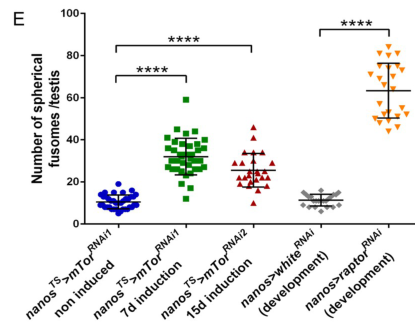

## Question

# Gene Research for Functional Annotation

## ⚠️ CRITICAL: Gene/Protein Identification Context

**BEFORE YOU BEGIN RESEARCH:** You MUST verify you are researching the CORRECT gene/protein. Gene symbols can be ambiguous, especially for less well-characterized genes from non-model organisms.

### Target Gene/Protein Identity (from UniProt):
- **UniProt Accession:** Q9W437
- **Protein Description:** SubName: Full=Raptor, isoform B {ECO:0000313|EMBL:AAF46122.2}; SubName: Full=Raptor, isoform C {ECO:0000313|EMBL:AHN59395.1};
- **Gene Information:** Name=raptor {ECO:0000313|EMBL:AAF46122.2, ECO:0000313|FlyBase:FBgn0029840}; Synonyms=4320 {ECO:0000313|EMBL:AAF46122.2}, Dmel\CG4320 {ECO:0000313|EMBL:AAF46122.2}, dRap {ECO:0000313|EMBL:AAF46122.2}, dRAPTOR {ECO:0000313|EMBL:AAF46122.2}, dRaptor {ECO:0000313|EMBL:AAF46122.2}, Raptor {ECO:0000313|EMBL:AAF46122.2}, raptor/CG4320 {ECO:0000313|EMBL:AAF46122.2}; ORFNames=CG4320 {ECO:0000313|EMBL:AAF46122.2, ECO:0000313|FlyBase:FBgn0029840}, Dmel_CG4320 {ECO:0000313|EMBL:AAF46122.2};
- **Organism (full):** Drosophila melanogaster (Fruit fly).
- **Protein Family:** Belongs to the WD repeat RAPTOR family.
- **Key Domains:** ARM-like. (IPR011989); ARM-type_fold. (IPR016024); Raptor. (IPR004083); Raptor_N. (IPR029347); WD40/YVTN_repeat-like_dom_sf. (IPR015943)

### MANDATORY VERIFICATION STEPS:

1. **Check if the gene symbol "raptor" matches the protein description above**
2. **Verify the organism is correct:** Drosophila melanogaster (Fruit fly).
3. **Check if protein family/domains align with what you find in literature**
4. **If you find literature for a DIFFERENT gene with the same or similar symbol, STOP**

### If Gene Symbol is Ambiguous or You Cannot Find Relevant Literature:

**DO NOT PROCEED WITH RESEARCH ON A DIFFERENT GENE.** Instead:
- State clearly: "The gene symbol 'raptor' is ambiguous or literature is limited for this specific protein"
- Explain what you found (e.g., "Found extensive literature on a different gene with the same symbol in a different organism")
- Describe the protein based ONLY on the UniProt information provided above
- Suggest that the protein function can be inferred from domain/family information

### Research Target:

Please provide a comprehensive research report on the gene **raptor** (gene ID: raptor, UniProt: Q9W437) in DROME.

The research report should be a detailed narrative explaining the function, biological processes, and localization of the gene product. Citations should be given for all claims.

You should prioritize authoritative reviews and primary scientific literature when conducting research. You can supplement
this with annotations you find in gene/protein databases, but these can be outdated or inaccurate.

We are specifically interested in the primary function of the gene - for enzymes, what reaction is catalyzed, and what is the substrate specificity? For transporters, what is the substrate? For structural proteins or adapters, what is the broader structural role? For signaling molecules, what is the role in the pathway.

We are interested in where in or outside the cell the gene product carries out its function.

We are also interested in the signaling or biochemical pathways in which the gene functions. We are less interested in broad pleiotropic effects, except where these elucidate the precise role.

Include evidence where possible. We are interested in both experimental evidence as well as inference from structure, evolution, or bioinformatic analysis. Precise studies should be prioritized over high-throughput, where available.

## Output

Question: You are an expert researcher providing comprehensive, well-cited information.

Provide detailed information focusing on:
1. Key concepts and definitions with current understanding
2. Recent developments and latest research (prioritize 2023-2024 sources)
3. Current applications and real-world implementations
4. Expert opinions and analysis from authoritative sources
5. Relevant statistics and data from recent studies

Format as a comprehensive research report with proper citations. Include URLs and publication dates where available.
Always prioritize recent, authoritative sources and provide specific citations for all major claims.

# Gene Research for Functional Annotation

## ⚠️ CRITICAL: Gene/Protein Identification Context

**BEFORE YOU BEGIN RESEARCH:** You MUST verify you are researching the CORRECT gene/protein. Gene symbols can be ambiguous, especially for less well-characterized genes from non-model organisms.

### Target Gene/Protein Identity (from UniProt):
- **UniProt Accession:** Q9W437
- **Protein Description:** SubName: Full=Raptor, isoform B {ECO:0000313|EMBL:AAF46122.2}; SubName: Full=Raptor, isoform C {ECO:0000313|EMBL:AHN59395.1};
- **Gene Information:** Name=raptor {ECO:0000313|EMBL:AAF46122.2, ECO:0000313|FlyBase:FBgn0029840}; Synonyms=4320 {ECO:0000313|EMBL:AAF46122.2}, Dmel\CG4320 {ECO:0000313|EMBL:AAF46122.2}, dRap {ECO:0000313|EMBL:AAF46122.2}, dRAPTOR {ECO:0000313|EMBL:AAF46122.2}, dRaptor {ECO:0000313|EMBL:AAF46122.2}, Raptor {ECO:0000313|EMBL:AAF46122.2}, raptor/CG4320 {ECO:0000313|EMBL:AAF46122.2}; ORFNames=CG4320 {ECO:0000313|EMBL:AAF46122.2, ECO:0000313|FlyBase:FBgn0029840}, Dmel_CG4320 {ECO:0000313|EMBL:AAF46122.2};
- **Organism (full):** Drosophila melanogaster (Fruit fly).
- **Protein Family:** Belongs to the WD repeat RAPTOR family.
- **Key Domains:** ARM-like. (IPR011989); ARM-type_fold. (IPR016024); Raptor. (IPR004083); Raptor_N. (IPR029347); WD40/YVTN_repeat-like_dom_sf. (IPR015943)

### MANDATORY VERIFICATION STEPS:

1. **Check if the gene symbol "raptor" matches the protein description above**
2. **Verify the organism is correct:** Drosophila melanogaster (Fruit fly).
3. **Check if protein family/domains align with what you find in literature**
4. **If you find literature for a DIFFERENT gene with the same or similar symbol, STOP**

### If Gene Symbol is Ambiguous or You Cannot Find Relevant Literature:

**DO NOT PROCEED WITH RESEARCH ON A DIFFERENT GENE.** Instead:
- State clearly: "The gene symbol 'raptor' is ambiguous or literature is limited for this specific protein"
- Explain what you found (e.g., "Found extensive literature on a different gene with the same symbol in a different organism")
- Describe the protein based ONLY on the UniProt information provided above
- Suggest that the protein function can be inferred from domain/family information

### Research Target:

Please provide a comprehensive research report on the gene **raptor** (gene ID: raptor, UniProt: Q9W437) in DROME.

The research report should be a detailed narrative explaining the function, biological processes, and localization of the gene product. Citations should be given for all claims.

You should prioritize authoritative reviews and primary scientific literature when conducting research. You can supplement
this with annotations you find in gene/protein databases, but these can be outdated or inaccurate.

We are specifically interested in the primary function of the gene - for enzymes, what reaction is catalyzed, and what is the substrate specificity? For transporters, what is the substrate? For structural proteins or adapters, what is the broader structural role? For signaling molecules, what is the role in the pathway.

We are interested in where in or outside the cell the gene product carries out its function.

We are also interested in the signaling or biochemical pathways in which the gene functions. We are less interested in broad pleiotropic effects, except where these elucidate the precise role.

Include evidence where possible. We are interested in both experimental evidence as well as inference from structure, evolution, or bioinformatic analysis. Precise studies should be prioritized over high-throughput, where available.

# Functional annotation report: *Drosophila melanogaster raptor* (Q9W437)

## Identity and principal function

The target is the fruit-fly gene **raptor**, also called **CG4320/dRaptor** (FlyBase FBgn0029840; [UniProt Q9W437](https://www.uniprot.org/uniprotkb/Q9W437/entry)), not the distinct fly transcription factor **REPTOR** or a mammalian or plant RAPTOR gene. Fly protein-interaction experiments identify dRaptor as a component of **target of rapamycin complex 1 (TORC1)**. The WD-repeat and ARM-like annotations supplied for Q9W437 are consistent with a protein-interaction scaffold, although they should not be mistaken for an experimentally solved structure of this fly isoform. (glatter2011modularityandhormone pages 10-11, glatter2011modularityandhormone pages 6-7, tiebe2015reptorandreptorbp pages 3-4)

**Primary molecular role:** dRaptor is a *noncatalytic organizing and substrate-recruitment subunit* of TORC1. The TOR protein supplies serine/threonine kinase activity; dRaptor does not itself catalyze a reaction or transport a substrate. Its relevant biochemical “specificity” is for participation in TORC1 and access to TORC1 targets, notably fly S6 kinase (dS6K) and the 4E-binding protein **Thor/d4E-BP**. Evidence that RAPTOR recognizes substrate TOR-signaling motifs comes from biochemical work on **mammalian**, rather than purified fly, proteins; fly affinity-purification data establish complex association but not direct binary binding at each interface. In particular, dRaptor is not the defining component of the distinct, dRictor-containing TORC2. (glatter2011modularityandhormone pages 6-7, glatter2011modularityandhormone pages 10-11, sarbassov2005phosphorylationandregulation pages 2-3, frappaolo2023usingdrosophilamelanogaster pages 3-4)

## Experimental basis for the annotation

In a quantitative study of the *Drosophila* insulin-receptor/TOR interactome, **Glatter and colleagues** purified tagged pathway proteins from Kc167 cells and identified dTOR, dRaptor, dGbL and Lobe together in the predominant detected dTORC1 assembly. They also detected Thor/d4E-BP in the TORC1-associated network and greater dS6K and d4E-BP association with dTOR complexes after insulin stimulation. Their wider dataset comprised **97 high-confidence interactions among 58 components**, of which **22%** changed with insulin. These are findings of association within cellular complexes, not proof that every recovered protein touches dRaptor directly. [Glatter *et al.*, *Molecular Systems Biology*, November 2011](https://doi.org/10.1038/msb.2011.79). (glatter2011modularityandhormone pages 6-7, glatter2011modularityandhormone pages 10-11, glatter2011modularityandhormone pages 1-2)

Functional perturbation supplies independent evidence. In cultured fly cells, **dRaptor RNAi reduced dS6K phosphorylation**, whereas dRictor depletion principally affected Akt phosphorylation. dRaptor depletion could *increase* phosphorylated dAkt; follow-up combinatorial RNAi showed that this increase required dTOR, dRictor and dLST8. This is consistent with reduced TORC1 activity relieving negative regulation of a separate TORC2–Akt output—not with dRaptor directly phosphorylating Akt. [Sarbassov *et al.*, *Science*, February 2005](https://doi.org/10.1126/science.1106148); [Yang *et al.*, *PNAS*, May 2006](https://doi.org/10.1073/pnas.0602282103). (sarbassov2005phosphorylationandregulation pages 2-3, yang2006tsc1tsc2andrheb pages 3-4)

TORC1 is therefore the most precise pathway assignment. Insulin/growth-factor signaling feeds through PI3K–Akt and the TSC–Rheb regulatory axis, whereas amino-acid availability acts through Rag-pathway machinery; these inputs regulate TORC1-mediated phosphorylation of targets involved in translation and cellular growth. Fly RNAi experiments establish that Rag-related proteins are required for amino-acid-induced **dS6K** phosphorylation. Direct Rag–RAPTOR binding and amino-acid-dependent lysosomal recruitment in the frequently cited foundational experiments, however, were demonstrated principally in **mammalian cells** and should be labelled as a conserved mechanistic model for dRaptor rather than a fly-specific binding measurement. [Sancak *et al.*, *Science*, June 2008](https://doi.org/10.1126/science.1157535); [Frappaolo and Giansanti, *Cells*, November 2023](https://doi.org/10.3390/cells12222622). (sancak2008theraggtpases pages 3-4, sancak2008theraggtpases pages 4-5, frappaolo2023usingdrosophilamelanogaster pages 3-4)

## Cellular processes and recent fly evidence

The best-supported direct consequences of dRaptor activity are TORC1-dependent **growth and translation signaling**, with context-dependent effects on proliferation and differentiation. For example, insulin slowed S-phase cells’ passage through G2/M in cultured fly cells; dRaptor or dTOR depletion diminished this response, whereas dRictor depletion had little effect. In the pulse-chase assay, **13% of insulin-treated versus 23% of control cells** reached G1 after 6 hours. Partial TORC1 inhibition can consequently accelerate division even though stronger inhibition restricts growth: these outcomes should not be collapsed into a simple claim that dRaptor always promotes cell number. [Wu *et al.*, *EMBO Journal*, January 2007](https://doi.org/10.1038/sj.emboj.7601487). (wu2007insulindelaysthe pages 3-4, wu2007insulindelaysthe pages 4-5, wu2007insulindelaysthe pages 5-7)

A particularly relevant **2024 direct raptor experiment** used germline-directed RNAi throughout development in the adult male testis. Effective dRaptor depletion reduced germ-cell phospho-S6 and increased cells with **spherical fusomes**—a marker of early germ cells—and **phospho-Mad**, a readout of BMP signaling. The reported analyses used **24 testes** for spherical-fusome counts and **20 testes** for phospho-Mad-positive cell counts in the raptor-RNAi condition. These observations support a requirement for germline TORC1 in timely early differentiation. Notably, an adult-onset raptor-RNAi regimen *did not* adequately reduce phospho-S6; the effective developmental regimen and ineffective adult regimen should not be treated as equivalent loss-of-function tests. [Clémot *et al.*, *PLOS ONE*, March 21, 2024](https://doi.org/10.1371/journal.pone.0300337), particularly [Figure 2](https://doi.org/10.1371/journal.pone.0300337.g002). (clemot2024mtorc1isrequired pages 2-3, clemot2024mtorc1isrequired pages 7-8, clemot2024mtorc1isrequired pages 8-10, clemot2024mtorc1isrequired media 2d779724, clemot2024mtorc1isrequired media 3febd899)

The same study reports increased TORC1 readout in **neighboring somatic cyst cells** after germline raptor depletion, evidence for a tissue-interaction consequence of perturbing TORC1. Its more extensive analyses of unusually large, poorly acidifying autolysosomes and accumulated Ref(2)P were performed chiefly after **Tor kinase** depletion, although a related cytoplasmic abnormality was observed following Raptor targeting. Those detailed autophagic-flux observations therefore must **not** be attributed wholesale to a raptor-specific experiment. [Clémot *et al.*, 2024](https://doi.org/10.1371/journal.pone.0300337). (clemot2024mtorc1isrequired pages 12-14, clemot2024mtorc1isrequired pages 8-10)

Another direct fly application of raptor RNAi is intestinal stem-cell regeneration: dRaptor depletion reduced the **early** phospho-histone-H3-positive proliferative response to bacterial challenge, while proliferation was higher during recovery, consistent with delayed rather than abolished regeneration. This is a tissue-specific experimental use of raptor to inhibit TORC1; it does not by itself establish a lifespan effect of raptor depletion. [Haller *et al.*, *Cell Stem Cell*, December 2017](https://doi.org/10.1016/j.stem.2017.11.008). (haller2017mtorc1activationduring pages 4-5)

## Where the protein acts—and what remains inferred

The defensible localization annotation is **intracellular, in TORC1-associated signaling complexes**. The established nutrient-signaling model places Rag-dependent TORC1 activation at the **cytosolic face of lysosomes**, where the complex encounters upstream regulators; dRaptor is a complex subunit, **not** a lysosomal-membrane transporter or a demonstrated integral membrane protein. Fly studies locate upstream GATOR components on lysosomal/autolysosomal membranes, but that does not itself image dRaptor. The sources examined here do **not** establish a precise, constitutive subcellular distribution for endogenous Q9W437 or distinguish its isoforms’ localization. [Bettedi *et al.*, *Cells*, October 2024](https://doi.org/10.3390/cells13211795); [Sancak *et al.*, *Cell*, April 2010](https://doi.org/10.1016/j.cell.2010.02.024). (bettedi2024unveilinggator2function pages 2-4, bettedi2024unveilinggator2function pages 1-2, sancak2010ragulatorragcomplextargets pages 6-7)

A fly study found that **Rheb**, an upstream TOR activator, depends on GOLPH3 for localization to the **Golgi**, with accompanying changes in TORC1 signaling. This does **not** demonstrate that fly dRaptor itself is Golgi-localized. Likewise, a **2024 mammalian-cell** study found substrate-selective lysosomal and nonlysosomal mTORC1 signaling, cautioning against the claim that every TORC1 reaction must occur on a lysosome; it cannot, without fly localization experiments, establish the corresponding spatial distribution of Q9W437. [Frappaolo *et al.*, *Cell Death & Disease*, November 2022](https://doi.org/10.1038/s41419-022-05438-9); [Fernandes *et al.*, *Nature Cell Biology*, October 2024](https://doi.org/10.1038/s41556-024-01523-7). (frappaolo2022golph3proteincontrols pages 6-9, frappaolo2023usingdrosophilamelanogaster pages 7-8, fernandes2024spatialandfunctional pages 3-4, fernandes2024spatialandfunctional pages 14-14)

**Conclusion.** Q9W437 is best annotated as the *D. melanogaster* **TORC1 scaffold/substrate-recruitment protein dRaptor**, linking nutrient and growth-factor inputs to TOR kinase outputs including dS6K and context-dependent Thor/4E-BP signaling. Its TORC1 membership and pathway requirement have direct fly biochemical and RNAi support; the precise locations of endogenous fly dRaptor, isoform-specific roles and individual purified-protein interfaces remain less firmly established than the general TORC1 pathway model. (glatter2011modularityandhormone pages 6-7, sarbassov2005phosphorylationandregulation pages 2-3, clemot2024mtorc1isrequired pages 8-10, fernandes2024spatialandfunctional pages 13-14)

References

1. (glatter2011modularityandhormone pages 10-11): Timo Glatter, Ralf B Schittenhelm, Oliver Rinner, Katarzyna Roguska, Alexander Wepf, Martin A Jünger, Katja Köhler, Irena Jevtov, Hyungwon Choi, Alexander Schmidt, Alexey I Nesvizhskii, Hugo Stocker, Ernst Hafen, Ruedi Aebersold, and Matthias Gstaiger. Modularity and hormone sensitivity of the drosophila melanogaster insulin receptor/target of rapamycin interaction proteome. Molecular Systems Biology, 7:547-547, Nov 2011. URL: https://doi.org/10.1038/msb.2011.79, doi:10.1038/msb.2011.79. This article has 77 citations and is from a highest quality peer-reviewed journal.

2. (glatter2011modularityandhormone pages 6-7): Timo Glatter, Ralf B Schittenhelm, Oliver Rinner, Katarzyna Roguska, Alexander Wepf, Martin A Jünger, Katja Köhler, Irena Jevtov, Hyungwon Choi, Alexander Schmidt, Alexey I Nesvizhskii, Hugo Stocker, Ernst Hafen, Ruedi Aebersold, and Matthias Gstaiger. Modularity and hormone sensitivity of the drosophila melanogaster insulin receptor/target of rapamycin interaction proteome. Molecular Systems Biology, 7:547-547, Nov 2011. URL: https://doi.org/10.1038/msb.2011.79, doi:10.1038/msb.2011.79. This article has 77 citations and is from a highest quality peer-reviewed journal.

3. (tiebe2015reptorandreptorbp pages 3-4): Marcel Tiebe, Marilena Lutz, Adriana De La Garza, Tina Buechling, Michael Boutros, and Aurelio A. Teleman. Reptor and reptor-bp regulate organismal metabolism and transcription downstream of torc1. Developmental cell, 33 3:272-84, May 2015. URL: https://doi.org/10.1016/j.devcel.2015.03.013, doi:10.1016/j.devcel.2015.03.013. This article has 119 citations and is from a highest quality peer-reviewed journal.

4. (sarbassov2005phosphorylationandregulation pages 2-3): Dos D. Sarbassov, David A. Guertin, Siraj M. Ali, and David M. Sabatini. Phosphorylation and regulation of akt/pkb by the rictor-mtor complex. Science, 307:1098-1101, Feb 2005. URL: https://doi.org/10.1126/science.1106148, doi:10.1126/science.1106148. This article has 9065 citations and is from a highest quality peer-reviewed journal.

5. (frappaolo2023usingdrosophilamelanogaster pages 3-4): Anna Frappaolo and Maria Grazia Giansanti. Using drosophila melanogaster to dissect the roles of the mtor signaling pathway in cell growth. Cells, 12:2622, Nov 2023. URL: https://doi.org/10.3390/cells12222622, doi:10.3390/cells12222622. This article has 28 citations.

6. (glatter2011modularityandhormone pages 1-2): Timo Glatter, Ralf B Schittenhelm, Oliver Rinner, Katarzyna Roguska, Alexander Wepf, Martin A Jünger, Katja Köhler, Irena Jevtov, Hyungwon Choi, Alexander Schmidt, Alexey I Nesvizhskii, Hugo Stocker, Ernst Hafen, Ruedi Aebersold, and Matthias Gstaiger. Modularity and hormone sensitivity of the drosophila melanogaster insulin receptor/target of rapamycin interaction proteome. Molecular Systems Biology, 7:547-547, Nov 2011. URL: https://doi.org/10.1038/msb.2011.79, doi:10.1038/msb.2011.79. This article has 77 citations and is from a highest quality peer-reviewed journal.

7. (yang2006tsc1tsc2andrheb pages 3-4): Qian Yang, Ken Inoki, Eunjung Kim, and Kun-Liang Guan. Tsc1/tsc2 and rheb have different effects on torc1 and torc2 activity. Proceedings of the National Academy of Sciences of the United States of America, 103 18:6811-6, May 2006. URL: https://doi.org/10.1073/pnas.0602282103, doi:10.1073/pnas.0602282103. This article has 248 citations and is from a highest quality peer-reviewed journal.

8. (sancak2008theraggtpases pages 3-4): Yasemin Sancak, Timothy R. Peterson, Yoav D. Shaul, Robert A. Lindquist, Carson C. Thoreen, Liron Bar-Peled, and David M. Sabatini. The rag gtpases bind raptor and mediate amino acid signaling to mtorc1. Science, 320:1496-1501, Jun 2008. URL: https://doi.org/10.1126/science.1157535, doi:10.1126/science.1157535. This article has 3590 citations and is from a highest quality peer-reviewed journal.

9. (sancak2008theraggtpases pages 4-5): Yasemin Sancak, Timothy R. Peterson, Yoav D. Shaul, Robert A. Lindquist, Carson C. Thoreen, Liron Bar-Peled, and David M. Sabatini. The rag gtpases bind raptor and mediate amino acid signaling to mtorc1. Science, 320:1496-1501, Jun 2008. URL: https://doi.org/10.1126/science.1157535, doi:10.1126/science.1157535. This article has 3590 citations and is from a highest quality peer-reviewed journal.

10. (wu2007insulindelaysthe pages 3-4): Mary Y W Wu, Megan Cully, Ditte Andersen, and Sally J Leevers. Insulin delays the progression of drosophila cells through g2/m by activating the dtor/draptor complex. The EMBO Journal, 26:371-379, Jan 2007. URL: https://doi.org/10.1038/sj.emboj.7601487, doi:10.1038/sj.emboj.7601487. This article has 44 citations.

11. (wu2007insulindelaysthe pages 4-5): Mary Y W Wu, Megan Cully, Ditte Andersen, and Sally J Leevers. Insulin delays the progression of drosophila cells through g2/m by activating the dtor/draptor complex. The EMBO Journal, 26:371-379, Jan 2007. URL: https://doi.org/10.1038/sj.emboj.7601487, doi:10.1038/sj.emboj.7601487. This article has 44 citations.

12. (wu2007insulindelaysthe pages 5-7): Mary Y W Wu, Megan Cully, Ditte Andersen, and Sally J Leevers. Insulin delays the progression of drosophila cells through g2/m by activating the dtor/draptor complex. The EMBO Journal, 26:371-379, Jan 2007. URL: https://doi.org/10.1038/sj.emboj.7601487, doi:10.1038/sj.emboj.7601487. This article has 44 citations.

13. (clemot2024mtorc1isrequired pages 2-3): Marie Clémot, Cecilia D’Alterio, Alexa C. Kwang, and D. Leanne Jones. Mtorc1 is required for differentiation of germline stem cells in the drosophila melanogaster testis. PLOS ONE, 19:e0300337, Mar 2024. URL: https://doi.org/10.1371/journal.pone.0300337, doi:10.1371/journal.pone.0300337. This article has 7 citations and is from a peer-reviewed journal.

14. (clemot2024mtorc1isrequired pages 7-8): Marie Clémot, Cecilia D’Alterio, Alexa C. Kwang, and D. Leanne Jones. Mtorc1 is required for differentiation of germline stem cells in the drosophila melanogaster testis. PLOS ONE, 19:e0300337, Mar 2024. URL: https://doi.org/10.1371/journal.pone.0300337, doi:10.1371/journal.pone.0300337. This article has 7 citations and is from a peer-reviewed journal.

15. (clemot2024mtorc1isrequired pages 8-10): Marie Clémot, Cecilia D’Alterio, Alexa C. Kwang, and D. Leanne Jones. Mtorc1 is required for differentiation of germline stem cells in the drosophila melanogaster testis. PLOS ONE, 19:e0300337, Mar 2024. URL: https://doi.org/10.1371/journal.pone.0300337, doi:10.1371/journal.pone.0300337. This article has 7 citations and is from a peer-reviewed journal.

16. (clemot2024mtorc1isrequired media 2d779724): Marie Clémot, Cecilia D’Alterio, Alexa C. Kwang, and D. Leanne Jones. Mtorc1 is required for differentiation of germline stem cells in the drosophila melanogaster testis. PLOS ONE, 19:e0300337, Mar 2024. URL: https://doi.org/10.1371/journal.pone.0300337, doi:10.1371/journal.pone.0300337. This article has 7 citations and is from a peer-reviewed journal.

17. (clemot2024mtorc1isrequired media 3febd899): Marie Clémot, Cecilia D’Alterio, Alexa C. Kwang, and D. Leanne Jones. Mtorc1 is required for differentiation of germline stem cells in the drosophila melanogaster testis. PLOS ONE, 19:e0300337, Mar 2024. URL: https://doi.org/10.1371/journal.pone.0300337, doi:10.1371/journal.pone.0300337. This article has 7 citations and is from a peer-reviewed journal.

18. (clemot2024mtorc1isrequired pages 12-14): Marie Clémot, Cecilia D’Alterio, Alexa C. Kwang, and D. Leanne Jones. Mtorc1 is required for differentiation of germline stem cells in the drosophila melanogaster testis. PLOS ONE, 19:e0300337, Mar 2024. URL: https://doi.org/10.1371/journal.pone.0300337, doi:10.1371/journal.pone.0300337. This article has 7 citations and is from a peer-reviewed journal.

19. (haller2017mtorc1activationduring pages 4-5): Samantha Haller, Subir Kapuria, Rebeccah R. Riley, Monique N. O’Leary, Katherine H. Schreiber, Julie K. Andersen, Simon Melov, Jianwen Que, Thomas A. Rando, Jason Rock, Brian K. Kennedy, Joseph T. Rodgers, and Heinrich Jasper. Mtorc1 activation during repeated regeneration impairs somatic stem cell maintenance. Cell stem cell, 21 6:806-818.e5, Dec 2017. URL: https://doi.org/10.1016/j.stem.2017.11.008, doi:10.1016/j.stem.2017.11.008. This article has 139 citations and is from a highest quality peer-reviewed journal.

20. (bettedi2024unveilinggator2function pages 2-4): Lucia Bettedi, Yingbiao Zhang, Shu Yang, and Mary A. Lilly. Unveiling gator2 function: novel insights from drosophila research. Cells, 13:1795, Oct 2024. URL: https://doi.org/10.3390/cells13211795, doi:10.3390/cells13211795. This article has 4 citations.

21. (bettedi2024unveilinggator2function pages 1-2): Lucia Bettedi, Yingbiao Zhang, Shu Yang, and Mary A. Lilly. Unveiling gator2 function: novel insights from drosophila research. Cells, 13:1795, Oct 2024. URL: https://doi.org/10.3390/cells13211795, doi:10.3390/cells13211795. This article has 4 citations.

22. (sancak2010ragulatorragcomplextargets pages 6-7): Yasemin Sancak, Liron Bar-Peled, Roberto Zoncu, Andrew L. Markhard, Shigeyuki Nada, and David M. Sabatini. Ragulator-rag complex targets mtorc1 to the lysosomal surface and is necessary for its activation by amino acids. Cell, 141:290-303, Apr 2010. URL: https://doi.org/10.1016/j.cell.2010.02.024, doi:10.1016/j.cell.2010.02.024. This article has 3185 citations and is from a highest quality peer-reviewed journal.

23. (frappaolo2022golph3proteincontrols pages 6-9): Anna Frappaolo, Angela Karimpour-Ghahnavieh, Giuliana Cesare, Stefano Sechi, Roberta Fraschini, Thomas Vaccari, and Maria Grazia Giansanti. Golph3 protein controls organ growth by interacting with tor signaling proteins in drosophila. Cell Death &amp; Disease, Nov 2022. URL: https://doi.org/10.1038/s41419-022-05438-9, doi:10.1038/s41419-022-05438-9. This article has 17 citations and is from a peer-reviewed journal.

24. (frappaolo2023usingdrosophilamelanogaster pages 7-8): Anna Frappaolo and Maria Grazia Giansanti. Using drosophila melanogaster to dissect the roles of the mtor signaling pathway in cell growth. Cells, 12:2622, Nov 2023. URL: https://doi.org/10.3390/cells12222622, doi:10.3390/cells12222622. This article has 28 citations.

25. (fernandes2024spatialandfunctional pages 3-4): Stephanie A. Fernandes, Danai-Dimitra Angelidaki, Julian Nüchel, Jiyoung Pan, Peter Gollwitzer, Yoav Elkis, Filippo Artoni, Sabine Wilhelm, Marija Kovacevic-Sarmiento, and Constantinos Demetriades. Spatial and functional separation of mtorc1 signalling in response to different amino acid sources. Nature Cell Biology, 26:1918-1933, Oct 2024. URL: https://doi.org/10.1038/s41556-024-01523-7, doi:10.1038/s41556-024-01523-7. This article has 75 citations and is from a highest quality peer-reviewed journal.

26. (fernandes2024spatialandfunctional pages 14-14): Stephanie A. Fernandes, Danai-Dimitra Angelidaki, Julian Nüchel, Jiyoung Pan, Peter Gollwitzer, Yoav Elkis, Filippo Artoni, Sabine Wilhelm, Marija Kovacevic-Sarmiento, and Constantinos Demetriades. Spatial and functional separation of mtorc1 signalling in response to different amino acid sources. Nature Cell Biology, 26:1918-1933, Oct 2024. URL: https://doi.org/10.1038/s41556-024-01523-7, doi:10.1038/s41556-024-01523-7. This article has 75 citations and is from a highest quality peer-reviewed journal.

27. (fernandes2024spatialandfunctional pages 13-14): Stephanie A. Fernandes, Danai-Dimitra Angelidaki, Julian Nüchel, Jiyoung Pan, Peter Gollwitzer, Yoav Elkis, Filippo Artoni, Sabine Wilhelm, Marija Kovacevic-Sarmiento, and Constantinos Demetriades. Spatial and functional separation of mtorc1 signalling in response to different amino acid sources. Nature Cell Biology, 26:1918-1933, Oct 2024. URL: https://doi.org/10.1038/s41556-024-01523-7, doi:10.1038/s41556-024-01523-7. This article has 75 citations and is from a highest quality peer-reviewed journal.

## Artifacts

## Citations

1. glatter2011modularityandhormone pages 10-11
2. glatter2011modularityandhormone pages 6-7
3. tiebe2015reptorandreptorbp pages 3-4
4. sarbassov2005phosphorylationandregulation pages 2-3
5. frappaolo2023usingdrosophilamelanogaster pages 3-4
6. glatter2011modularityandhormone pages 1-2
7. sancak2008theraggtpases pages 3-4
8. sancak2008theraggtpases pages 4-5
9. wu2007insulindelaysthe pages 3-4
10. wu2007insulindelaysthe pages 4-5
11. wu2007insulindelaysthe pages 5-7
12. sancak2010ragulatorragcomplextargets pages 6-7
13. frappaolo2023usingdrosophilamelanogaster pages 7-8
14. fernandes2024spatialandfunctional pages 3-4
15. fernandes2024spatialandfunctional pages 14-14
16. fernandes2024spatialandfunctional pages 13-14
17. UniProt Q9W437
18. Glatter *et al.*, *Molecular Systems Biology*, November 2011
19. Sarbassov *et al.*, *Science*, February 2005
20. Yang *et al.*, *PNAS*, May 2006
21. Sancak *et al.*, *Science*, June 2008
22. Frappaolo and Giansanti, *Cells*, November 2023
23. Wu *et al.*, *EMBO Journal*, January 2007
24. Clémot *et al.*, *PLOS ONE*, March 21, 2024
25. Figure 2
26. Clémot *et al.*, 2024
27. Haller *et al.*, *Cell Stem Cell*, December 2017
28. Bettedi *et al.*, *Cells*, October 2024
29. Sancak *et al.*, *Cell*, April 2010
30. Frappaolo *et al.*, *Cell Death & Disease*, November 2022
31. Fernandes *et al.*, *Nature Cell Biology*, October 2024
32. https://www.uniprot.org/uniprotkb/Q9W437/entry
33. https://doi.org/10.1038/msb.2011.79
34. https://doi.org/10.1126/science.1106148
35. https://doi.org/10.1073/pnas.0602282103
36. https://doi.org/10.1126/science.1157535
37. https://doi.org/10.3390/cells12222622
38. https://doi.org/10.1038/sj.emboj.7601487
39. https://doi.org/10.1371/journal.pone.0300337
40. https://doi.org/10.1371/journal.pone.0300337.g002
41. https://doi.org/10.1016/j.stem.2017.11.008
42. https://doi.org/10.3390/cells13211795
43. https://doi.org/10.1016/j.cell.2010.02.024
44. https://doi.org/10.1038/s41419-022-05438-9
45. https://doi.org/10.1038/s41556-024-01523-7
46. https://doi.org/10.1038/msb.2011.79,
47. https://doi.org/10.1016/j.devcel.2015.03.013,
48. https://doi.org/10.1126/science.1106148,
49. https://doi.org/10.3390/cells12222622,
50. https://doi.org/10.1073/pnas.0602282103,
51. https://doi.org/10.1126/science.1157535,
52. https://doi.org/10.1038/sj.emboj.7601487,
53. https://doi.org/10.1371/journal.pone.0300337,
54. https://doi.org/10.1016/j.stem.2017.11.008,
55. https://doi.org/10.3390/cells13211795,
56. https://doi.org/10.1016/j.cell.2010.02.024,
57. https://doi.org/10.1038/s41419-022-05438-9,
58. https://doi.org/10.1038/s41556-024-01523-7,