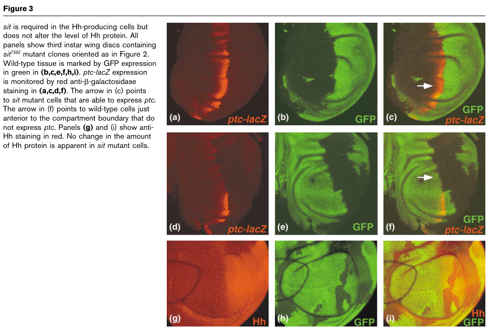

## Question

# Gene Research for Functional Annotation

## ⚠️ CRITICAL: Gene/Protein Identification Context

**BEFORE YOU BEGIN RESEARCH:** You MUST verify you are researching the CORRECT gene/protein. Gene symbols can be ambiguous, especially for less well-characterized genes from non-model organisms.

### Target Gene/Protein Identity (from UniProt):
- **UniProt Accession:** Q9VZU2
- **Protein Description:** RecName: Full=Protein-cysteine N-palmitoyltransferase Rasp; EC=2.3.1.-; AltName: Full=Protein central missing; AltName: Full=Protein sightless; AltName: Full=Protein skinny hedgehog;
- **Gene Information:** Name=rasp; Synonyms=cmn, sit, ski; ORFNames=CG11495;
- **Organism (full):** Drosophila melanogaster (Fruit fly).
- **Protein Family:** Belongs to the membrane-bound acyltransferase family. HHAT
- **Key Domains:** MB_O-acyltransferase. (IPR051085); MBOAT_fam. (IPR004299); MBOAT (PF03062)

### MANDATORY VERIFICATION STEPS:

1. **Check if the gene symbol "rasp" matches the protein description above**
2. **Verify the organism is correct:** Drosophila melanogaster (Fruit fly).
3. **Check if protein family/domains align with what you find in literature**
4. **If you find literature for a DIFFERENT gene with the same or similar symbol, STOP**

### If Gene Symbol is Ambiguous or You Cannot Find Relevant Literature:

**DO NOT PROCEED WITH RESEARCH ON A DIFFERENT GENE.** Instead:
- State clearly: "The gene symbol 'rasp' is ambiguous or literature is limited for this specific protein"
- Explain what you found (e.g., "Found extensive literature on a different gene with the same symbol in a different organism")
- Describe the protein based ONLY on the UniProt information provided above
- Suggest that the protein function can be inferred from domain/family information

### Research Target:

Please provide a comprehensive research report on the gene **rasp** (gene ID: rasp, UniProt: Q9VZU2) in DROME.

The research report should be a detailed narrative explaining the function, biological processes, and localization of the gene product. Citations should be given for all claims.

You should prioritize authoritative reviews and primary scientific literature when conducting research. You can supplement
this with annotations you find in gene/protein databases, but these can be outdated or inaccurate.

We are specifically interested in the primary function of the gene - for enzymes, what reaction is catalyzed, and what is the substrate specificity? For transporters, what is the substrate? For structural proteins or adapters, what is the broader structural role? For signaling molecules, what is the role in the pathway.

We are interested in where in or outside the cell the gene product carries out its function.

We are also interested in the signaling or biochemical pathways in which the gene functions. We are less interested in broad pleiotropic effects, except where these elucidate the precise role.

Include evidence where possible. We are interested in both experimental evidence as well as inference from structure, evolution, or bioinformatic analysis. Precise studies should be prioritized over high-throughput, where available.

## Output

Question: You are an expert researcher providing comprehensive, well-cited information.

Provide detailed information focusing on:
1. Key concepts and definitions with current understanding
2. Recent developments and latest research (prioritize 2023-2024 sources)
3. Current applications and real-world implementations
4. Expert opinions and analysis from authoritative sources
5. Relevant statistics and data from recent studies

Format as a comprehensive research report with proper citations. Include URLs and publication dates where available.
Always prioritize recent, authoritative sources and provide specific citations for all major claims.

# Gene Research for Functional Annotation

## ⚠️ CRITICAL: Gene/Protein Identification Context

**BEFORE YOU BEGIN RESEARCH:** You MUST verify you are researching the CORRECT gene/protein. Gene symbols can be ambiguous, especially for less well-characterized genes from non-model organisms.

### Target Gene/Protein Identity (from UniProt):
- **UniProt Accession:** Q9VZU2
- **Protein Description:** RecName: Full=Protein-cysteine N-palmitoyltransferase Rasp; EC=2.3.1.-; AltName: Full=Protein central missing; AltName: Full=Protein sightless; AltName: Full=Protein skinny hedgehog;
- **Gene Information:** Name=rasp; Synonyms=cmn, sit, ski; ORFNames=CG11495;
- **Organism (full):** Drosophila melanogaster (Fruit fly).
- **Protein Family:** Belongs to the membrane-bound acyltransferase family. HHAT
- **Key Domains:** MB_O-acyltransferase. (IPR051085); MBOAT_fam. (IPR004299); MBOAT (PF03062)

### MANDATORY VERIFICATION STEPS:

1. **Check if the gene symbol "rasp" matches the protein description above**
2. **Verify the organism is correct:** Drosophila melanogaster (Fruit fly).
3. **Check if protein family/domains align with what you find in literature**
4. **If you find literature for a DIFFERENT gene with the same or similar symbol, STOP**

### If Gene Symbol is Ambiguous or You Cannot Find Relevant Literature:

**DO NOT PROCEED WITH RESEARCH ON A DIFFERENT GENE.** Instead:
- State clearly: "The gene symbol 'rasp' is ambiguous or literature is limited for this specific protein"
- Explain what you found (e.g., "Found extensive literature on a different gene with the same symbol in a different organism")
- Describe the protein based ONLY on the UniProt information provided above
- Suggest that the protein function can be inferred from domain/family information

### Research Target:

Please provide a comprehensive research report on the gene **rasp** (gene ID: rasp, UniProt: Q9VZU2) in DROME.

The research report should be a detailed narrative explaining the function, biological processes, and localization of the gene product. Citations should be given for all claims.

You should prioritize authoritative reviews and primary scientific literature when conducting research. You can supplement
this with annotations you find in gene/protein databases, but these can be outdated or inaccurate.

We are specifically interested in the primary function of the gene - for enzymes, what reaction is catalyzed, and what is the substrate specificity? For transporters, what is the substrate? For structural proteins or adapters, what is the broader structural role? For signaling molecules, what is the role in the pathway.

We are interested in where in or outside the cell the gene product carries out its function.

We are also interested in the signaling or biochemical pathways in which the gene functions. We are less interested in broad pleiotropic effects, except where these elucidate the precise role.

Include evidence where possible. We are interested in both experimental evidence as well as inference from structure, evolution, or bioinformatic analysis. Precise studies should be prioritized over high-throughput, where available.

# Functional annotation of *rasp* in *Drosophila melanogaster*

**Identity verified.** The target is fly *rasp* (**CG11495; UniProt Q9VZU2**), also called *sightless* (*sit*), *skinny hedgehog* (*ski*) and *central missing* (*cmn*). The original *sightless* study mapped mutant alleles to CG11495 and identified a predicted multipass membrane protein homologous to membrane-bound acyltransferases. Subsequent work identifies it as the fly counterpart of Hedgehog acyltransferase (HHAT) in the MBOAT family. This report does not conflate fly Rasp with a similarly named protein in another organism. (lee2001sightlesshashomology pages 2-4, buglino2012palmitoylationofhedgehog pages 2-4, resh2021palmitoylationofhedgehog pages 2-3)

## Primary molecular function and substrate specificity

Rasp’s principal established function is **N-palmitoylation of secreted signaling proteins**, particularly fly Hedgehog (Hh) and the epidermal growth factor receptor (EGFR) ligand Spitz. After removal of a ligand’s signal peptide, Rasp-dependent modification places a 16-carbon palmitoyl group at its exposed **N-terminal cysteine**. For Hh, the mature modification is an *amide bond to the cysteine’s N-terminal amino group*—not the reversible cysteine-side-chain thioester commonly called S-palmitoylation. The enzymatic reaction is represented as palmitoyl-CoA + ligand-NH₂ → N-palmitoylated ligand + CoA; direct demonstration of this acyl donor and linkage with purified enzyme comes chiefly from **mammalian HHAT**, whereas the assignment to fly Rasp rests on fly genetic and cellular palmitoylation evidence. The precise catalytic route to the amide has not been established for purified fly Rasp. (miura2006lipidmodificationof pages 1-2, resh2021palmitoylationofhedgehog pages 2-3, resh2021palmitoylationofhedgehog pages 3-4)

For **Hh**, loss of Rasp yields non-palmitoylated, poorly active ligand without abolishing Hh synthesis, accumulation, autocleavage or ordinary secretion. Genetic mosaics place Rasp in **posterior, Hh-producing wing-disc cells**: loss there prevents *patched* (*ptc*) induction in neighboring anterior cells, whereas loss in responding anterior cells does not. These results distinguish modification of the outgoing signal from a requirement in the responding cell. Lee and Treisman’s original mutant-clone figure directly illustrates this producer-cell requirement and preservation of detectable Hh protein. (resh2021palmitoylationofhedgehog pages 2-3, lee2001sightlesshashomology pages 2-4, lee2001sightlesshashomology media 5159c850)

**Spitz is a second experimentally supported substrate.** *rasp* mutation impairs Spitz-dependent signaling in eye and wing discs; reducing *rasp* expression decreases Spitz hydrophobicity, and palmitate incorporation into Spitz in a heterologous cell assay depends on functional Rasp coexpression. Its acceptor is likewise the cysteine exposed at the Spitz N terminus after signal-peptide processing. By contrast, the related EGFR ligands **Gurken and Keren** have been proposed as additional substrates on phenotypic and sequence grounds, but should remain *putative* in an annotation that requires direct substrate evidence. Rasp and mammalian HHAT are not identical in recognition: N-terminal cysteine-to-serine substitutions in fly Hh or Spitz are not accepted by Rasp, whereas mammalian HHAT shows residual activity on an analogous Sonic hedgehog mutant. (buglino2012palmitoylationofhedgehog pages 9-11, miura2006lipidmodificationof pages 1-2, miura2006lipidmodificationof pages 4-5, resh2021palmitoylationofhedgehog pages 3-4)

The following evidence-tier summary separates direct fly results from conclusions inferred through mammalian HHAT:

| Annotation point | Evidence tier | Evidence and interpretation | Scope and limitation |
|---|---|---|---|
| Identity and family | **Direct fly genetic and sequence evidence** | *sightless* mutations map to **CG11495**, which encodes a predicted multipass membrane protein with membrane-bound acyltransferase homology and a conserved candidate catalytic histidine. The locus is also reported as *rasp*, *skinny hedgehog* (*ski*) and *central missing* (*cmn*), corresponding to Drosophila melanogaster Q9VZU2. [Lee and Treisman, 2001](https://doi.org/10.1016/S0960-9822(01)00323-2) (buglino2012palmitoylationofhedgehog pages 2-4, lee2001sightlesshashomology pages 4-5, lee2001sightlesshashomology pages 2-4) | Q9VZU2 is supplied by the UniProt record; the primary paper independently establishes CG11495 and its acyltransferase-family relationship. |
| Hedgehog N-palmitoylation | **Strong fly genetics; chemistry supported by ortholog biochemistry** | Loss of Rasp produces non-palmitoylated, inactive Hh without preventing Hh production, stability, cleavage or secretion. Rasp acts in posterior Hh-producing cells, where its loss prevents target activation in adjacent anterior cells. Purified mammalian HHAT transfers palmitate from palmitoyl-CoA to the exposed N-terminal cysteine through an amide linkage. [Lee and Treisman, 2001](https://doi.org/10.1016/S0960-9822(01)00323-2); [Resh, 2021](https://doi.org/10.1098/rsob.200414) (resh2021palmitoylationofhedgehog pages 2-3, lee2001sightlesshashomology pages 2-4) | The producer-cell requirement and loss of Hh palmitoylation are fly evidence. The acyl donor and linkage chemistry are established principally with mammalian HHAT and constitute conserved-mechanism inference for Rasp. |
| Spitz substrate | **Direct cellular and fly functional evidence** | *rasp* mutation impairs Spitz signaling in eye and wing discs; *rasp* siRNA reduces Spitz hydrophobicity in Triton X-114 partitioning, and Spitz palmitoylation in COS-1 cells requires co-expression of functional Rasp. The acceptor is Spitz’s N-terminal cysteine after signal-peptide cleavage. [Miura et al., 2006](https://doi.org/10.1016/j.devcel.2005.11.017) (buglino2012palmitoylationofhedgehog pages 9-11, miura2006lipidmodificationof pages 1-2) | COS-1 co-expression is a heterologous-cell assay complemented by Drosophila genetic phenotypes; it is not purified-Rasp enzymology. |
| Subcellular site | **Tentative fly localization; separate strong mammalian evidence** | Fly-focused evidence reports that Rasp **appears Golgi-localized**, consistent with secretory-pathway modification of Hh and Spitz. Mammalian HHAT instead resides in the ER membrane and links cytosolic palmitoyl-CoA access to a lumen-facing protein-substrate site. [Miura and Treisman, 2006](https://doi.org/10.4161/cc.5.11.2804); [Resh, 2021](https://doi.org/10.1098/rsob.200414) (resh2021palmitoylationofhedgehog pages 2-3, miura2006lipidmodificationof pages 1-2, schonbrun2023kineticmechanismand pages 34-41) | ER-lumen catalysis should not be assigned directly to fly Rasp. Available fly evidence favors Golgi localization but is less definitive than mammalian structural and topology evidence. |
| Gurken and Keren | **Putative substrates** | Phenotypic analysis suggests that the related EGFR ligands Gurken and Keren may be Rasp substrates; both have potentially suitable exposed N-terminal cysteines. [Miura and Treisman, 2006](https://doi.org/10.4161/cc.5.11.2804) (schonbrun2023kineticmechanismand pages 29-34, miura2006lipidmodificationof pages 4-5) | No direct palmitate-incorporation or purified-enzyme evidence was identified; these should be annotated as putative rather than established substrates. |
| 2024 inhibitor application | **Human HHAT only; no fly validation** | A 2024 study evaluated 37 new and 13 previously reported HHAT-inhibitor analogues. The human-HHAT probe IMP-1575 inhibited cellular SHH palmitoylation with **IC50 76 nM** and Hedgehog signaling with **EC50 99 nM**. [Ritzefeld et al., 2024](https://doi.org/10.1021/acs.jmedchem.3c01363) (ritzefeld2024designsynthesisand pages 6-8, ritzefeld2024designsynthesisand pages 1-2, ritzefeld2024designsynthesisand pages 8-9) | The study did **not** demonstrate inhibition of Drosophila Rasp or efficacy in flies; these values provide ortholog-based chemical-biology context only. |

*Table: Evidence-tier summary for Drosophila melanogaster Rasp/CG11495 (Q9VZU2), separating direct fly findings from mammalian-HHAT inference. It flags tentative substrates, localization uncertainty and the absence of fly testing for IMP-1575.*

## Where Rasp acts and what its modifications accomplish

Rasp acts **inside ligand-producing cells, in the membrane-bound secretory pathway**, before the modified ligands signal outside those cells; it is not itself the extracellular morphogen or an EGFR/Hh receptor. A fly-focused review reports that Rasp **appears to localize to the Golgi**, in contrast to Porcupine, another MBOAT involved in Wingless modification. This fly assignment should remain qualified: evidence for a **multipass ER-membrane enzyme acting on the lumen-facing protein substrate** is especially well developed for *mammalian HHAT*, not independently established as the exclusive location of fly Rasp. Mammalian HHAT structures and topology support access of cytosolic palmitoyl-CoA to a lumen-facing catalytic region through an intramembrane cavity; that provides a mechanistic analogy, not proof of identical fly compartmentalization. (miura2006lipidmodificationof pages 1-2, resh2021palmitoylationofhedgehog pages 2-3, schonbrun2023kineticmechanismand pages 34-41)

In the **Hh pathway**, Rasp modifies the ligand before it acts on recipient cells through Patched. Its palmitate is important for productive pathway activation, rather than simply ensuring ligand abundance: *rasp* mutants retain detectable Hh yet lose wing-disc *ptc* and *decapentaplegic* (*dpp*) responses and fail to stabilize full-length Cubitus interruptus at the compartment boundary. Hh lacking its palmitate can display a different physical distribution without achieving equivalent high-threshold signaling, so *spread* must not be mistaken for *activity*. Alongside Hh’s independently acquired C-terminal cholesterol, N-palmitate influences membrane association, ligand presentation and signaling range. Later wing-patterning experiments found that regulated removal of Hh’s palmitoylated N-terminal anchor can itself be required for a particular intervein pattern, underscoring that acylation and subsequent release are distinct steps. (lee2001sightlesshashomology pages 1-2, miura2006lipidmodificationof pages 2-4, miura2006lipidmodificationof pages 4-5, schurmann2018proteolyticprocessingof pages 1-2)

In the **Spitz–EGFR pathway**, palmitoylation chiefly restrains ligand escape and increases its concentration near producing cells. Unpalmitoylated Spitz can travel farther when overexpressed, yet becomes too dilute for normal local signaling; palmitoylation is **not** simply required for Spitz secretion or intrinsic ability to bind and activate EGFR in vitro. This is an instructive contrast: the same Rasp-dependent chemical modification supports effective local Spitz signaling and productive Hh signaling through partly different consequences for ligand presentation. (miura2006lipidmodificationof pages 1-2, miura2006lipidmodificationof pages 2-4)

## Recent research and applications: carefully separated from fly evidence

The most relevant **2024** experimental advance concerns **human HHAT**, not direct characterization of fly Rasp. Ritzefeld and colleagues evaluated **37 new** tetrahydrothienopyridine-related inhibitors alongside **13 previously reported** analogues. Their cell-active probe **IMP-1575** inhibited a cellular Sonic hedgehog palmitoylation readout with an **IC₅₀ of 76 nM** and a Hedgehog-pathway reporter with an **EC₅₀ of 99 nM**. A central amide, secondary amine and preferred stereochemistry contributed to potency; an inactive enantiomer supplies a useful control. These are chemical-biology tools and a rationale for exploring ligand-production-directed pathway inhibition, **not evidence that IMP-1575 inhibits fly Rasp or works in flies**. The series also has an application-limiting property: more than **90%** of tested compounds were metabolized after **15 minutes** in mouse liver microsomes. (ritzefeld2024designsynthesisand pages 1-2, ritzefeld2024designsynthesisand pages 6-8, ritzefeld2024designsynthesisand pages 8-9, ritzefeld2024designsynthesisand pages 9-10)

A **2024** expert review places HHAT-mediated ligand lipidation among emerging therapeutic targets in cancer, while structural and biochemical work on HHAT refines hypotheses about acyl-donor access and substrate recognition. These findings support conserved-family interpretation, but the available recent quantitative assays concern the **human orthologue**; they do not replace direct localization, kinetic or inhibitor measurements on Q9VZU2. For *rasp* functional annotation, the strongest conclusion remains **a producer-cell, secretory-pathway MBOAT required for N-terminal acylation of Hh and Spitz and thus for effective Hh and EGFR ligand signaling**. (tate2024proteinlipidationin pages 15-16, ritzefeld2024designsynthesisand pages 1-2, lee2001sightlesshashomology pages 2-4, buglino2012palmitoylationofhedgehog pages 9-11)

### Principal sources and dates

- Lee JD & Treisman JE. **July 2001.** Primary mapping of *sightless* to CG11495 and producer-cell genetic analysis. *Current Biology*. https://doi.org/10.1016/S0960-9822(01)00323-2. (lee2001sightlesshashomology pages 2-4)
- Miura GI *et al.* **February 2006.** Primary Spitz-palmitoylation study. *Developmental Cell*. https://doi.org/10.1016/j.devcel.2005.11.017; its experimental findings are discussed in the accessible reviews cited above. (buglino2012palmitoylationofhedgehog pages 9-11, miura2006lipidmodificationof pages 1-2)
- Miura GI & Treisman JE. **May 2006.** Fly-focused comparison of Hh and Spitz lipidation and Rasp localization. *Cell Cycle*. https://doi.org/10.4161/cc.5.11.2804. (miura2006lipidmodificationof pages 1-2, miura2006lipidmodificationof pages 2-4)
- Resh MD. **March 2021.** Authoritative review distinguishing fly Rasp genetics from mammalian HHAT biochemistry. *Open Biology*. https://doi.org/10.1098/rsob.200414. (resh2021palmitoylationofhedgehog pages 2-3, resh2021palmitoylationofhedgehog pages 3-4)
- Ritzefeld M *et al.* **January 2024.** Human-HHAT inhibitor study. *Journal of Medicinal Chemistry*. https://doi.org/10.1021/acs.jmedchem.3c01363. (ritzefeld2024designsynthesisand pages 1-2, ritzefeld2024designsynthesisand pages 6-8, ritzefeld2024designsynthesisand pages 8-9)

References

1. (lee2001sightlesshashomology pages 2-4): Jeffrey D. Lee and Jessica E. Treisman. Sightless has homology to transmembrane acyltransferases and is required to generate active hedgehog protein. Current Biology, 11:1147-1152, Jul 2001. URL: https://doi.org/10.1016/s0960-9822(01)00323-2, doi:10.1016/s0960-9822(01)00323-2. This article has 201 citations and is from a highest quality peer-reviewed journal.

2. (buglino2012palmitoylationofhedgehog pages 2-4): John A. Buglino and Marilyn D. Resh. Palmitoylation of hedgehog proteins. Vitamins and hormones, 88:229-52, Jan 2012. URL: https://doi.org/10.1016/b978-0-12-394622-5.00010-9, doi:10.1016/b978-0-12-394622-5.00010-9. This article has 80 citations.

3. (resh2021palmitoylationofhedgehog pages 2-3): Marilyn D. Resh. Palmitoylation of hedgehog proteins by hedgehog acyltransferase: roles in signalling and disease. Open Biology, Mar 2021. URL: https://doi.org/10.1098/rsob.200414, doi:10.1098/rsob.200414. This article has 38 citations and is from a peer-reviewed journal.

4. (miura2006lipidmodificationof pages 1-2): Grant I. Miura and Jessica E. Treisman. Lipid modification of secreted signaling proteins. Cell Cycle, 5:1184-1188, May 2006. URL: https://doi.org/10.4161/cc.5.11.2804, doi:10.4161/cc.5.11.2804. This article has 86 citations and is from a peer-reviewed journal.

5. (resh2021palmitoylationofhedgehog pages 3-4): Marilyn D. Resh. Palmitoylation of hedgehog proteins by hedgehog acyltransferase: roles in signalling and disease. Open Biology, Mar 2021. URL: https://doi.org/10.1098/rsob.200414, doi:10.1098/rsob.200414. This article has 38 citations and is from a peer-reviewed journal.

6. (lee2001sightlesshashomology media 5159c850): Jeffrey D. Lee and Jessica E. Treisman. Sightless has homology to transmembrane acyltransferases and is required to generate active hedgehog protein. Current Biology, 11:1147-1152, Jul 2001. URL: https://doi.org/10.1016/s0960-9822(01)00323-2, doi:10.1016/s0960-9822(01)00323-2. This article has 201 citations and is from a highest quality peer-reviewed journal.

7. (buglino2012palmitoylationofhedgehog pages 9-11): John A. Buglino and Marilyn D. Resh. Palmitoylation of hedgehog proteins. Vitamins and hormones, 88:229-52, Jan 2012. URL: https://doi.org/10.1016/b978-0-12-394622-5.00010-9, doi:10.1016/b978-0-12-394622-5.00010-9. This article has 80 citations.

8. (miura2006lipidmodificationof pages 4-5): Grant I. Miura and Jessica E. Treisman. Lipid modification of secreted signaling proteins. Cell Cycle, 5:1184-1188, May 2006. URL: https://doi.org/10.4161/cc.5.11.2804, doi:10.4161/cc.5.11.2804. This article has 86 citations and is from a peer-reviewed journal.

9. (lee2001sightlesshashomology pages 4-5): Jeffrey D. Lee and Jessica E. Treisman. Sightless has homology to transmembrane acyltransferases and is required to generate active hedgehog protein. Current Biology, 11:1147-1152, Jul 2001. URL: https://doi.org/10.1016/s0960-9822(01)00323-2, doi:10.1016/s0960-9822(01)00323-2. This article has 201 citations and is from a highest quality peer-reviewed journal.

10. (schonbrun2023kineticmechanismand pages 34-41): A Schonbrun. Kinetic mechanism and substrate specificity of hedgehog acyltransferase. Unknown journal, 2023.

11. (schonbrun2023kineticmechanismand pages 29-34): A Schonbrun. Kinetic mechanism and substrate specificity of hedgehog acyltransferase. Unknown journal, 2023.

12. (ritzefeld2024designsynthesisand pages 6-8): Markus Ritzefeld, Leran Zhang, Zhangping Xiao, Sebastian A. Andrei, Olivia Boyd, Naoko Masumoto, Ursula R. Rodgers, Markus Artelsmair, Lea Sefer, Angela Hayes, Efthymios-Spyridon Gavriil, Florence I. Raynaud, Rosemary Burke, Julian Blagg, Henry S. Rzepa, Christian Siebold, Anthony I. Magee, Thomas Lanyon-Hogg, and Edward W. Tate. Design, synthesis, and evaluation of inhibitors of hedgehog acyltransferase. Journal of Medicinal Chemistry, 67:1061-1078, Jan 2024. URL: https://doi.org/10.1021/acs.jmedchem.3c01363, doi:10.1021/acs.jmedchem.3c01363. This article has 8 citations and is from a highest quality peer-reviewed journal.

13. (ritzefeld2024designsynthesisand pages 1-2): Markus Ritzefeld, Leran Zhang, Zhangping Xiao, Sebastian A. Andrei, Olivia Boyd, Naoko Masumoto, Ursula R. Rodgers, Markus Artelsmair, Lea Sefer, Angela Hayes, Efthymios-Spyridon Gavriil, Florence I. Raynaud, Rosemary Burke, Julian Blagg, Henry S. Rzepa, Christian Siebold, Anthony I. Magee, Thomas Lanyon-Hogg, and Edward W. Tate. Design, synthesis, and evaluation of inhibitors of hedgehog acyltransferase. Journal of Medicinal Chemistry, 67:1061-1078, Jan 2024. URL: https://doi.org/10.1021/acs.jmedchem.3c01363, doi:10.1021/acs.jmedchem.3c01363. This article has 8 citations and is from a highest quality peer-reviewed journal.

14. (ritzefeld2024designsynthesisand pages 8-9): Markus Ritzefeld, Leran Zhang, Zhangping Xiao, Sebastian A. Andrei, Olivia Boyd, Naoko Masumoto, Ursula R. Rodgers, Markus Artelsmair, Lea Sefer, Angela Hayes, Efthymios-Spyridon Gavriil, Florence I. Raynaud, Rosemary Burke, Julian Blagg, Henry S. Rzepa, Christian Siebold, Anthony I. Magee, Thomas Lanyon-Hogg, and Edward W. Tate. Design, synthesis, and evaluation of inhibitors of hedgehog acyltransferase. Journal of Medicinal Chemistry, 67:1061-1078, Jan 2024. URL: https://doi.org/10.1021/acs.jmedchem.3c01363, doi:10.1021/acs.jmedchem.3c01363. This article has 8 citations and is from a highest quality peer-reviewed journal.

15. (lee2001sightlesshashomology pages 1-2): Jeffrey D. Lee and Jessica E. Treisman. Sightless has homology to transmembrane acyltransferases and is required to generate active hedgehog protein. Current Biology, 11:1147-1152, Jul 2001. URL: https://doi.org/10.1016/s0960-9822(01)00323-2, doi:10.1016/s0960-9822(01)00323-2. This article has 201 citations and is from a highest quality peer-reviewed journal.

16. (miura2006lipidmodificationof pages 2-4): Grant I. Miura and Jessica E. Treisman. Lipid modification of secreted signaling proteins. Cell Cycle, 5:1184-1188, May 2006. URL: https://doi.org/10.4161/cc.5.11.2804, doi:10.4161/cc.5.11.2804. This article has 86 citations and is from a peer-reviewed journal.

17. (schurmann2018proteolyticprocessingof pages 1-2): Sabine Schürmann, Georg Steffes, Dominique Manikowski, Philipp Kastl, Ursula Malkus, Shyam Bandari, Stefanie Ohlig, Corinna Ortmann, Rocio Rebollido-Rios, Mandy Otto, Harald Nüsse, Daniel Hoffmann, Christian Klämbt, Milos Galic, Jürgen Klingauf, and Kay Grobe. Proteolytic processing of palmitoylated hedgehog peptides specifies the 3-4 intervein region of the drosophila wing. eLife, Mar 2018. URL: https://doi.org/10.7554/elife.33033, doi:10.7554/elife.33033. This article has 18 citations and is from a domain leading peer-reviewed journal.

18. (ritzefeld2024designsynthesisand pages 9-10): Markus Ritzefeld, Leran Zhang, Zhangping Xiao, Sebastian A. Andrei, Olivia Boyd, Naoko Masumoto, Ursula R. Rodgers, Markus Artelsmair, Lea Sefer, Angela Hayes, Efthymios-Spyridon Gavriil, Florence I. Raynaud, Rosemary Burke, Julian Blagg, Henry S. Rzepa, Christian Siebold, Anthony I. Magee, Thomas Lanyon-Hogg, and Edward W. Tate. Design, synthesis, and evaluation of inhibitors of hedgehog acyltransferase. Journal of Medicinal Chemistry, 67:1061-1078, Jan 2024. URL: https://doi.org/10.1021/acs.jmedchem.3c01363, doi:10.1021/acs.jmedchem.3c01363. This article has 8 citations and is from a highest quality peer-reviewed journal.

19. (tate2024proteinlipidationin pages 15-16): Edward W. Tate, Lior Soday, Ana Losada de la Lastra, Mei Wang, and Hening Lin. Protein lipidation in cancer: mechanisms, dysregulation and emerging drug targets. Nature reviews. Cancer, 24:240-260, Feb 2024. URL: https://doi.org/10.1038/s41568-024-00666-x, doi:10.1038/s41568-024-00666-x. This article has 74 citations.

## Artifacts

- [Edison artifact artifact-00](rasp-deep-research-falcon_artifacts/artifact-00.md)

## Citations

1. lee2001sightlesshashomology pages 2-4
2. buglino2012palmitoylationofhedgehog pages 2-4
3. resh2021palmitoylationofhedgehog pages 2-3
4. miura2006lipidmodificationof pages 1-2
5. resh2021palmitoylationofhedgehog pages 3-4
6. buglino2012palmitoylationofhedgehog pages 9-11
7. miura2006lipidmodificationof pages 4-5
8. lee2001sightlesshashomology pages 4-5
9. schonbrun2023kineticmechanismand pages 34-41
10. schonbrun2023kineticmechanismand pages 29-34
11. ritzefeld2024designsynthesisand pages 6-8
12. ritzefeld2024designsynthesisand pages 1-2
13. ritzefeld2024designsynthesisand pages 8-9
14. lee2001sightlesshashomology pages 1-2
15. miura2006lipidmodificationof pages 2-4
16. schurmann2018proteolyticprocessingof pages 1-2
17. ritzefeld2024designsynthesisand pages 9-10
18. tate2024proteinlipidationin pages 15-16
19. Lee and Treisman, 2001
20. Resh, 2021
21. Miura et al., 2006
22. Miura and Treisman, 2006
23. Ritzefeld et al., 2024
24. https://doi.org/10.1016/S0960-9822(01
25. https://doi.org/10.1098/rsob.200414
26. https://doi.org/10.1016/j.devcel.2005.11.017
27. https://doi.org/10.4161/cc.5.11.2804
28. https://doi.org/10.1021/acs.jmedchem.3c01363
29. https://doi.org/10.1016/j.devcel.2005.11.017;
30. https://doi.org/10.4161/cc.5.11.2804.
31. https://doi.org/10.1098/rsob.200414.
32. https://doi.org/10.1021/acs.jmedchem.3c01363.
33. https://doi.org/10.1016/s0960-9822(01
34. https://doi.org/10.1016/b978-0-12-394622-5.00010-9,
35. https://doi.org/10.1098/rsob.200414,
36. https://doi.org/10.4161/cc.5.11.2804,
37. https://doi.org/10.1021/acs.jmedchem.3c01363,
38. https://doi.org/10.7554/elife.33033,
39. https://doi.org/10.1038/s41568-024-00666-x,