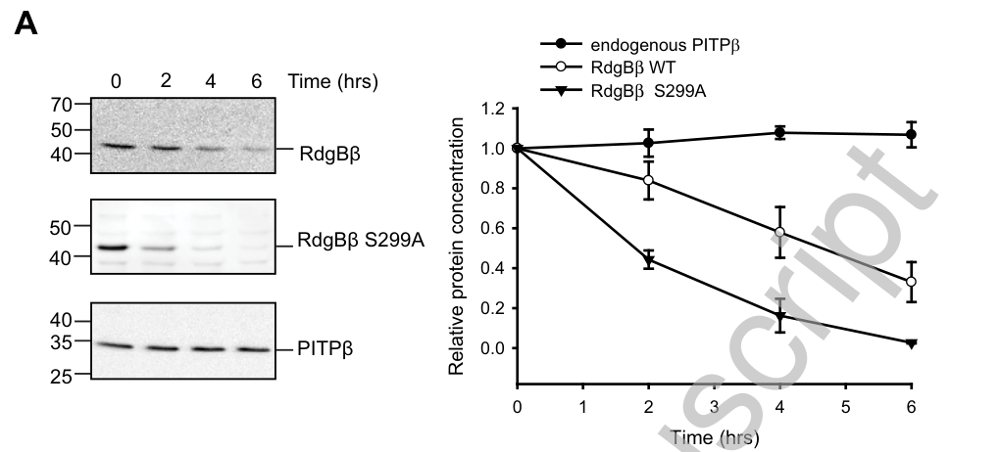

## Question

# Gene Research for Functional Annotation

## ⚠️ CRITICAL: Gene/Protein Identification Context

**BEFORE YOU BEGIN RESEARCH:** You MUST verify you are researching the CORRECT gene/protein. Gene symbols can be ambiguous, especially for less well-characterized genes from non-model organisms.

### Target Gene/Protein Identity (from UniProt):
- **UniProt Accession:** Q9U9P7
- **Protein Description:** RecName: Full=Cytoplasmic phosphatidylinositol transfer protein 1; AltName: Full=Retinal degeneration B homolog beta; Short=RdgBbeta;
- **Gene Information:** Name=rdgBbeta; ORFNames=CG17818;
- **Organism (full):** Drosophila melanogaster (Fruit fly).
- **Protein Family:** Belongs to the PtdIns transfer protein family. PI transfer
- **Key Domains:** PI_transfer. (IPR001666); PI_transfer_N. (IPR055261); START-like_dom_sf. (IPR023393); IP_trans (PF02121)

### MANDATORY VERIFICATION STEPS:

1. **Check if the gene symbol "rdgBbeta" matches the protein description above**
2. **Verify the organism is correct:** Drosophila melanogaster (Fruit fly).
3. **Check if protein family/domains align with what you find in literature**
4. **If you find literature for a DIFFERENT gene with the same or similar symbol, STOP**

### If Gene Symbol is Ambiguous or You Cannot Find Relevant Literature:

**DO NOT PROCEED WITH RESEARCH ON A DIFFERENT GENE.** Instead:
- State clearly: "The gene symbol 'rdgBbeta' is ambiguous or literature is limited for this specific protein"
- Explain what you found (e.g., "Found extensive literature on a different gene with the same symbol in a different organism")
- Describe the protein based ONLY on the UniProt information provided above
- Suggest that the protein function can be inferred from domain/family information

### Research Target:

Please provide a comprehensive research report on the gene **rdgBbeta** (gene ID: rdgBbeta, UniProt: Q9U9P7) in DROME.

The research report should be a detailed narrative explaining the function, biological processes, and localization of the gene product. Citations should be given for all claims.

You should prioritize authoritative reviews and primary scientific literature when conducting research. You can supplement
this with annotations you find in gene/protein databases, but these can be outdated or inaccurate.

We are specifically interested in the primary function of the gene - for enzymes, what reaction is catalyzed, and what is the substrate specificity? For transporters, what is the substrate? For structural proteins or adapters, what is the broader structural role? For signaling molecules, what is the role in the pathway.

We are interested in where in or outside the cell the gene product carries out its function.

We are also interested in the signaling or biochemical pathways in which the gene functions. We are less interested in broad pleiotropic effects, except where these elucidate the precise role.

Include evidence where possible. We are interested in both experimental evidence as well as inference from structure, evolution, or bioinformatic analysis. Precise studies should be prioritized over high-throughput, where available.

## Output

Question: You are an expert researcher providing comprehensive, well-cited information.

Provide detailed information focusing on:
1. Key concepts and definitions with current understanding
2. Recent developments and latest research (prioritize 2023-2024 sources)
3. Current applications and real-world implementations
4. Expert opinions and analysis from authoritative sources
5. Relevant statistics and data from recent studies

Format as a comprehensive research report with proper citations. Include URLs and publication dates where available.
Always prioritize recent, authoritative sources and provide specific citations for all major claims.

# Gene Research for Functional Annotation

## ⚠️ CRITICAL: Gene/Protein Identification Context

**BEFORE YOU BEGIN RESEARCH:** You MUST verify you are researching the CORRECT gene/protein. Gene symbols can be ambiguous, especially for less well-characterized genes from non-model organisms.

### Target Gene/Protein Identity (from UniProt):
- **UniProt Accession:** Q9U9P7
- **Protein Description:** RecName: Full=Cytoplasmic phosphatidylinositol transfer protein 1; AltName: Full=Retinal degeneration B homolog beta; Short=RdgBbeta;
- **Gene Information:** Name=rdgBbeta; ORFNames=CG17818;
- **Organism (full):** Drosophila melanogaster (Fruit fly).
- **Protein Family:** Belongs to the PtdIns transfer protein family. PI transfer
- **Key Domains:** PI_transfer. (IPR001666); PI_transfer_N. (IPR055261); START-like_dom_sf. (IPR023393); IP_trans (PF02121)

### MANDATORY VERIFICATION STEPS:

1. **Check if the gene symbol "rdgBbeta" matches the protein description above**
2. **Verify the organism is correct:** Drosophila melanogaster (Fruit fly).
3. **Check if protein family/domains align with what you find in literature**
4. **If you find literature for a DIFFERENT gene with the same or similar symbol, STOP**

### If Gene Symbol is Ambiguous or You Cannot Find Relevant Literature:

**DO NOT PROCEED WITH RESEARCH ON A DIFFERENT GENE.** Instead:
- State clearly: "The gene symbol 'rdgBbeta' is ambiguous or literature is limited for this specific protein"
- Explain what you found (e.g., "Found extensive literature on a different gene with the same symbol in a different organism")
- Describe the protein based ONLY on the UniProt information provided above
- Suggest that the protein function can be inferred from domain/family information

### Research Target:

Please provide a comprehensive research report on the gene **rdgBbeta** (gene ID: rdgBbeta, UniProt: Q9U9P7) in DROME.

The research report should be a detailed narrative explaining the function, biological processes, and localization of the gene product. Citations should be given for all claims.

You should prioritize authoritative reviews and primary scientific literature when conducting research. You can supplement
this with annotations you find in gene/protein databases, but these can be outdated or inaccurate.

We are specifically interested in the primary function of the gene - for enzymes, what reaction is catalyzed, and what is the substrate specificity? For transporters, what is the substrate? For structural proteins or adapters, what is the broader structural role? For signaling molecules, what is the role in the pathway.

We are interested in where in or outside the cell the gene product carries out its function.

We are also interested in the signaling or biochemical pathways in which the gene functions. We are less interested in broad pleiotropic effects, except where these elucidate the precise role.

Include evidence where possible. We are interested in both experimental evidence as well as inference from structure, evolution, or bioinformatic analysis. Precise studies should be prioritized over high-throughput, where available.

## Research report: Functional annotation of **rdgBbeta** (CG17818; UniProt **Q9U9P7**) in *Drosophila melanogaster*

### 1) Target verification and gene/protein identity (critical disambiguation)
The UniProt target **Q9U9P7** is annotated as *Drosophila melanogaster* **rdgBbeta (CG17818)**, described as a **cytoplasmic phosphatidylinositol transfer protein** (PITP-family) and “retinal degeneration B homolog beta (RdgBβ)”. The PITP-family review by Hsuan & Cockcroft explicitly lists a Drosophila **rdgBβ** entry (and discusses the **rdgBβ subfamily** as distinct from the multi-domain **rdgBα/Nir** proteins), supporting that the symbol **rdgBbeta** refers to a soluble PITP-domain protein rather than the photoreceptor degeneration gene **rdgB (rdgBα)** commonly studied in Drosophila phototransduction. (hsuan2001thepitpfamily pages 2-3)

A key species caveat from the same review is that **human RdgBβ has a short C-terminal extension whereas the Drosophila isoform does not**, meaning some mammalian regulatory motifs in the C-terminus may not be conserved in *Drosophila* and must not be transferred uncritically. (hsuan2001thepitpfamily pages 2-3)

### 2) Key concepts and definitions (current understanding)

#### 2.1 Phosphatidylinositol transfer proteins (PITPs)
PITPs are lipid-binding/transfer proteins that bind a **single phospholipid molecule** in a hydrophobic cavity and have long been studied for their ability to exchange lipids between membranes in vitro; they are now widely discussed as regulators of **phosphoinositide metabolism**, signaling, and membrane traffic. (hsuan2001thepitpfamily pages 2-3)

#### 2.2 Class I vs Class II PITPs; where RdgBβ fits
A commonly used functional distinction in the literature is:
- **Class I PITPs** (e.g., PITPα/β) exchange **PI and PC**.
- **Class II PITPs** (RdgB proteins) are emphasized as **PI and PA** binders/transfer proteins (with minimal PC), and are often discussed in the context of **phospholipase C (PLC) signaling** and the need to couple PI metabolism with PA flux. (cockcroft2016rdgbαreciprocallytransfers pages 8-11, cockcroft2013potentialrolefor pages 6-8)

RdgBβ is explicitly described as a **soluble class IIB PITP** that binds other proteins (e.g., 14-3-3, ATRAP) for functional recruitment to membranes—distinct from multi-domain RdgBα proteins that localize to ER–PM contact sites via VAP. (cockcroft2016rdgbαreciprocallytransfers pages 8-11)

### 3) Primary molecular function: lipid binding/transfer and substrate specificity

#### 3.1 Lipid ligands and inferred biochemical role
Expert review synthesis proposes that RdgBβ-class proteins preferentially bind/transfer **phosphatidylinositol (PI)** and **phosphatidic acid (PA)** with **very little phosphatidylcholine (PC)**, and that RdgBβ can transfer **PA robustly**, a property not typical of class I PITPs. (cockcroft2013potentialrolefor pages 6-8, cockcroft2016rdgbαreciprocallytransfers pages 8-11)

Mechanistically, this PI/PA specialization is interpreted as fitting the lipid-transport demands that accompany PLC activation (consumption of PI(4,5)P2 at the plasma membrane and generation/turnover of DAG and PA), where exchange of PI and PA between compartments can support restoration of signaling lipids. (cockcroft2013potentialrolefor pages 6-8, cockcroft2016rdgbαreciprocallytransfers pages 8-11)

#### 3.2 Quantitative biochemical evidence (mostly from mammalian PITPNC1/RdgBβ)
Direct quantitative assays in a Biochemical Journal primary paper on **RdgBβ/PITPNC1** report **very weak PI-transfer activity** compared with PITPα: detectable activity required ~10–100 μg/mL RdgBβ vs ~200–500 ng/mL PITPα (≈100–250× higher protein concentration required), and endogenous/overexpressed RdgBβ in cell/tissue fractions showed no measurable PI-transfer activity under those conditions. (garner2011thephosphatidylinositoltransfer pages 8-10, garner2011thephosphatidylinositoltransfer pages 11-13, garner2011thephosphatidylinositoltransfer pages 1-4, garner2011thephosphatidylinositoltransfer pages 10-11)

These results are commonly interpreted to mean that RdgBβ’s function likely depends on **context-specific membrane recruitment and/or regulation of the lipid-binding cavity**, rather than acting as a high-flux bulk cytosolic PI-transfer factor. (garner2011thephosphatidylinositoltransfer pages 1-4, cockcroft2016rdgbαreciprocallytransfers pages 3-6)

### 4) Subcellular localization and interaction partners (where it acts in the cell)

#### 4.1 Cytosolic protein with regulated membrane recruitment
RdgBβ/PITPNC1 is described as **mainly cytosolic** at baseline and can be recruited to membranes upon specific stimuli. In the primary study, treatment with **PMA** (activating PKC pathways) promoted **membrane recruitment** and co-localization with the integral membrane protein **ATRAP/AGTRAP**, which was proposed to serve as a recruitment factor. (garner2011thephosphatidylinositoltransfer pages 10-11, garner2011thephosphatidylinositoltransfer pages 1-4)

Quantitatively, the same study reports approximately **8-fold** enrichment of wild-type RdgBβ in membranes after PMA, and an even larger (**~14-fold**) membrane increase for a mutant defective in 14-3-3 binding, supporting a model where **14-3-3 binding restrains membrane translocation**. (garner2011thephosphatidylinositoltransfer pages 11-13, garner2011thephosphatidylinositoltransfer media 1c076168)

#### 4.2 Protein–protein interactions and regulation
Two key binding partners repeatedly emphasized in authoritative sources are:
- **14-3-3 adaptor proteins**, binding via phosphorylated motifs in an unstructured C-terminus (shown for mammalian PITPNC1/RdgBβ). (garner2011thephosphatidylinositoltransfer pages 8-10, garner2011thephosphatidylinositoltransfer pages 11-13)
- **ATRAP/AGTRAP**, binding via the **PITP domain** and promoting stimulus-dependent membrane recruitment (PMA/PKC-dependent). (garner2011thephosphatidylinositoltransfer pages 1-4, garner2011thephosphatidylinositoltransfer pages 10-11)

These interactions support an expert model in which RdgBβ executes function after **protein-mediated recruitment** to specific membrane regions, rather than via stable transmembrane anchoring. (cockcroft2016rdgbαreciprocallytransfers pages 8-11, garner2011thephosphatidylinositoltransfer pages 1-4)

### 5) Pathways and biological processes likely involving *Drosophila* rdgBbeta

#### 5.1 Relationship to PLC/phosphoinositide signaling frameworks
The PITP/RdgB literature frames RdgB-family PITPs as central to **phosphoinositide-cycle lipid flux** that is topologically split between membranes (e.g., ER vs plasma membrane), requiring lipid transfer steps to maintain signaling competence during/after PLC activation. While this framework is most directly developed for multi-domain **RdgBα** at ER–PM contact sites, Class II PITPs (including RdgBβ-class) are explicitly described as PI/PA transfer proteins, and thus conceptually positioned to couple **PI metabolism** with **PA handling** during signaling. (cockcroft2016rdgbαreciprocallytransfers pages 8-11, cockcroft2013potentialrolefor pages 6-8)

#### 5.2 Drosophila-specific functional evidence: current limitations
Within the retrieved corpus, **direct primary mechanistic studies specific to *Drosophila melanogaster* rdgBbeta/CG17818/Q9U9P7 were limited**, and much of the quantitative mechanistic evidence is from mammalian PITPNC1/RdgBβ. The strongest Drosophila-specific statement available is classification and structural distinction: Drosophila has a **rdgBβ** PITP-domain protein that **lacks the human C-terminal extension**, implying potential divergence in regulatory motifs. (hsuan2001thepitpfamily pages 2-3)

Accordingly, for functional annotation of *Drosophila* rdgBbeta, the most defensible current interpretation from this evidence set is:
- rdgBbeta encodes a **soluble Class II (Class IIB) PITP-domain protein**. (hsuan2001thepitpfamily pages 2-3, cockcroft2016rdgbαreciprocallytransfers pages 8-11)
- Its **primary biochemical capability** is most plausibly **PI/PA binding/transfer** (family inference), likely acting **locally at membranes** upon recruitment rather than as a bulk cytosolic transfer activity. (cockcroft2013potentialrolefor pages 6-8, cockcroft2016rdgbαreciprocallytransfers pages 3-6)
- Any proposed 14-3-3/ATRAP regulatory module should be treated as **hypothesis-by-homology** unless conserved motifs are verified in the *Drosophila* protein sequence, because of the explicit Drosophila/mammal C-terminal difference. (hsuan2001thepitpfamily pages 2-3)

### 6) Recent developments (prioritizing 2023–2024) and current research directions
The most directly relevant recent paper captured here for the broader RdgB/PITP field in Drosophila is a 2024 genetic screen focused on the multi-domain **RDGB (RdgBα)** lipid transfer protein at membrane contact sites, motivated by neurodegeneration/retinal degeneration phenotypes upon RDGB loss. Although it is not rdgBbeta-specific, it reflects **active 2024 research emphasis** on lipid-transfer mechanisms at contact sites and on identifying regulatory networks that modulate PITP-family lipid transfer function in vivo. (Life Science Alliance; publication date Mar 2024; https://doi.org/10.26508/lsa.202302525) (cockcroft2016rdgbαreciprocallytransfers pages 8-11)

For **rdgBbeta specifically**, the most recent information in the retrieved corpus remains primarily **review-level synthesis** and mammalian mechanistic studies rather than 2023–2024 Drosophila CG17818-focused primary work. (hsuan2001thepitpfamily pages 2-3, cockcroft2016rdgbαreciprocallytransfers pages 8-11)

### 7) Applications and real-world implementations

#### 7.1 Functional genomics and membrane-contact-site biology
RdgB-family PITPs (including Class II PITPs) are used conceptually and experimentally as paradigms for how lipid transfer supports signaling homeostasis across organelles, especially in models of PLC-driven phosphoinositide turnover and membrane contact site function. This is a widely adopted framework in cell biology and signaling research. (cockcroft2016rdgbαreciprocallytransfers pages 8-11, cockcroft2013potentialrolefor pages 6-8)

#### 7.2 Translational relevance via mammalian PITPNC1 (contextual, not Drosophila-specific)
While outside the *Drosophila* gene itself, authoritative expert sources discuss mammalian PITPNC1/RdgBβ in the context of regulated secretion and disease models (e.g., cancer secretory phenotypes), providing a translational motivation for mechanistic studies of RdgBβ-class proteins. (cockcroft2012thediversefunctions pages 206-209)

### 8) Key quantitative statistics/data (from primary evidence)
Quantitative findings most directly supporting mechanistic annotation (measured for mammalian PITPNC1/RdgBβ) include:
- **Protein stability:** ~**4 h** half-life for WT vs ~**2 h** for a 14-3-3-binding-defective mutant; degradation is **proteasome-dependent** and associated with ubiquitination. (garner2011thephosphatidylinositoltransfer pages 8-10, garner2011thephosphatidylinositoltransfer pages 1-4, garner2011thephosphatidylinositoltransfer media 1c076168)
- **Stimulus-dependent membrane recruitment:** PMA induces ~**8×** membrane enrichment for WT and ~**14×** for a 14-3-3-binding-defective mutant. (garner2011thephosphatidylinositoltransfer pages 11-13, garner2011thephosphatidylinositoltransfer media 1c076168)
- **Relative PI-transfer assay performance:** PITPα active at **~200–500 ng/mL**, whereas RdgBβ required **~10–100 μg/mL** for detectable activity (≈**100–250×** weaker by concentration). (garner2011thephosphatidylinositoltransfer pages 8-10, garner2011thephosphatidylinositoltransfer pages 11-13, garner2011thephosphatidylinositoltransfer pages 10-11)

### Evidence summary table
| Claim (short) | Evidence/Details | System/Organism | Source (paper + year + DOI URL) | Context ID(s) |
|---|---|---|---|---|
| Family classification: soluble Class IIB PITP | RdgBβ is described as a **soluble class IIB phosphatidylinositol transfer protein** within the RdgB/PITP family, distinct from multidomain RdgBα/Class IIA proteins; Drosophila has an rdgBβ subfamily member and assignment is based on PITP-domain similarity. | Family-level annotation; Drosophila + mammalian comparison | Hsuan & Cockcroft 2001, Genome Biology, https://doi.org/10.1186/gb-2001-2-9-reviews3011; Cockcroft et al. 2016, Biochem Soc Trans, https://doi.org/10.1042/bst20150228 | (hsuan2001thepitpfamily pages 2-3, cockcroft2016rdgbαreciprocallytransfers pages 8-11) |
| Lipid ligands/specificity: PI/PA vs PC | Class II/RdgBβ proteins are reported to bind and transfer **PI and PA**, with **very little PC**; under PLC/PLD-stimulated conditions RdgBβ shifts toward greater PA binding, and PA transfer is described as robust relative to Class I PITPs. | Conserved RdgBβ/PITPNC1 family conclusion | Cockcroft & Garner 2013, Adv Biol Regul, https://doi.org/10.1016/j.jbior.2013.07.007; Cockcroft et al. 2016, Biochem Soc Trans, https://doi.org/10.1042/bst20150228 | (cockcroft2013potentialrolefor pages 6-8, cockcroft2016rdgbαreciprocallytransfers pages 8-11) |
| 14-3-3 docking sites and stability control | Two phosphorylated serines in the disordered C-terminus (**Ser274 and Ser299**) form the 14-3-3 docking module; mutation of either site abolishes 14-3-3 binding. 14-3-3 shields nearby **PEST** sequences and stabilizes RdgBβ. | Human PITPNC1/RdgBβ experimental system; family-relevant inference | Garner et al. 2011, Biochem J, https://doi.org/10.1042/bj20110649 | (garner2011thephosphatidylinositoltransfer pages 8-10, garner2011thephosphatidylinositoltransfer pages 11-13, garner2011thephosphatidylinositoltransfer pages 13-14, garner2011thephosphatidylinositoltransfer media 1c076168) |
| Proteasome turnover / half-life | RdgBβ is **ubiquitinated** and degraded via the **proteasome**. Wild-type protein has an approximate **4 h half-life**, whereas a 14-3-3-binding-defective mutant is reduced to about **2 h**, indicating 14-3-3 binding protects against turnover. | Human PITPNC1/RdgBβ in cells | Garner et al. 2011, Biochem J, https://doi.org/10.1042/bj20110649 | (garner2011thephosphatidylinositoltransfer pages 8-10, garner2011thephosphatidylinositoltransfer pages 11-13, garner2011thephosphatidylinositoltransfer pages 1-4, garner2011thephosphatidylinositoltransfer media 1c076168) |
| ATRAP interaction and PKC/PMA dependence | The **PITP domain** of RdgBβ interacts with the integral membrane protein **ATRAP/AGTRAP** at a site distinct from the 14-3-3 site. Interaction and membrane recruitment increase after **PMA** treatment and are reduced by the PKC inhibitor **BIM**, supporting **PKC-dependent** regulation. | Human PITPNC1/RdgBβ; mechanistic family inference | Garner et al. 2011, Biochem J, https://doi.org/10.1042/bj20110649; Cockcroft & Garner 2013, Adv Biol Regul, https://doi.org/10.1016/j.jbior.2013.07.007 | (garner2011thephosphatidylinositoltransfer pages 8-10, garner2011thephosphatidylinositoltransfer pages 4-5, garner2011thephosphatidylinositoltransfer pages 10-11, cockcroft2013potentialrolefor pages 6-8, garner2011thephosphatidylinositoltransfer media 1c076168) |
| Membrane recruitment fold change | Upon PMA treatment, wild-type RdgBβ shows about an **8-fold increase** in the membrane fraction, whereas a 14-3-3-binding-deficient mutant shows about a **14-fold increase**, indicating 14-3-3 restrains membrane translocation. | Human PITPNC1/RdgBβ in COS-7 cells | Garner et al. 2011, Biochem J, https://doi.org/10.1042/bj20110649 | (garner2011thephosphatidylinositoltransfer pages 11-13, garner2011thephosphatidylinositoltransfer media 1c076168) |
| Very low/undetectable in vitro PI transfer | RdgBβ is far weaker than canonical PITPα in PI transfer assays. Reported thresholds: PITPα active at **~200–500 ng/ml**, while RdgBβ requires **~10–100 μg/ml** for detectable/significant activity (roughly **100–250-fold less active** by concentration). Endogenous/overexpressed RdgBβ fractions typically show **no detectable PI transfer** under tested conditions. | Human PITPNC1/RdgBβ; rat heart cytosol | Garner et al. 2011, Biochem J, https://doi.org/10.1042/bj20110649; Cockcroft et al. 2016, Biochem Soc Trans, https://doi.org/10.1042/bst20150228 | (garner2011thephosphatidylinositoltransfer pages 8-10, garner2011thephosphatidylinositoltransfer pages 11-13, garner2011thephosphatidylinositoltransfer pages 1-4, garner2011thephosphatidylinositoltransfer pages 10-11, cockcroft2016rdgbαreciprocallytransfers pages 3-6, garner2011thephosphatidylinositoltransfer media 1c076168) |
| Tissue enrichment / localization clue | RdgBβ is reported as enriched in **heart** (and also brain in review discussion); cytosolic activity peaks attributable to RdgBβ were not observed, leading to the proposal that it acts **locally at membranes/contact sites** after recruitment rather than as a bulk soluble transfer activity. | Rat heart / review interpretation | Cockcroft & Garner 2013, Adv Biol Regul, https://doi.org/10.1016/j.jbior.2013.07.007; Cockcroft et al. 2016, Biochem Soc Trans, https://doi.org/10.1042/bst20150228 | (cockcroft2013potentialrolefor pages 8-9, cockcroft2016rdgbαreciprocallytransfers pages 3-6) |
| Distinction from RdgBα | RdgBβ is a **small soluble** PITP with a short disordered tail and protein-partner-mediated membrane recruitment, whereas **RdgBα** is a **multidomain** protein with FFAT/DDHD/LSN2-related modules that localizes to **ER–PM contact sites** via VAP. This distinction is important to avoid confusing Drosophila rdgBbeta with rdgB/rdgBα phototransduction literature. | Family comparison | Hsuan & Cockcroft 2001, Genome Biology, https://doi.org/10.1186/gb-2001-2-9-reviews3011; Cockcroft et al. 2016, Biochem Soc Trans, https://doi.org/10.1042/bst20150228 | (hsuan2001thepitpfamily pages 2-3, cockcroft2016rdgbαreciprocallytransfers pages 8-11) |
| Drosophila-specific C-terminus difference | The Drosophila rdgBβ isoform is explicitly noted to **lack the short carboxy-terminal extension** present in human RdgBβ. Thus, C-terminal regulatory findings from mammalian PITPNC1/RdgBβ (e.g., Ser274/Ser299 14-3-3 docking) should be transferred to **Drosophila CG17818/Q9U9P7 cautiously**. | Drosophila-specific annotation | Hsuan & Cockcroft 2001, Genome Biology, https://doi.org/10.1186/gb-2001-2-9-reviews3011 | (hsuan2001thepitpfamily pages 2-3) |

*Table: This table compiles experimentally supported properties of the RdgBβ/PITPNC1 family most relevant to annotating Drosophila rdgBbeta (CG17818; UniProt Q9U9P7). It highlights where evidence is direct versus family-based inference and flags the important Drosophila-specific C-terminal difference.*

### Figures (primary evidence snapshots)
Cropped figure panels from the primary RdgBβ/PITPNC1 study document (i) the 14-3-3 phosphosite module and binding assays, (ii) protein half-life differences, (iii) low PI-transfer activity relative to PITPα, and (iv) PMA/ATRAP-associated membrane recruitment. (garner2011thephosphatidylinositoltransfer media 1c076168, garner2011thephosphatidylinositoltransfer media f519b69c, garner2011thephosphatidylinositoltransfer media 13836492, garner2011thephosphatidylinositoltransfer media 54c46ab2, garner2011thephosphatidylinositoltransfer media caf2756a, garner2011thephosphatidylinositoltransfer media e2864aea)

### Conclusion (functional annotation best supported by current evidence set)
Within the available and retrieved literature, *Drosophila* **rdgBbeta (CG17818; UniProt Q9U9P7)** is best annotated as a **soluble Class IIB PITP-domain protein** in the PtdIns transfer protein family, distinct from the multi-domain **RdgBα** phototransduction protein. (hsuan2001thepitpfamily pages 2-3, cockcroft2016rdgbαreciprocallytransfers pages 8-11)

Its **primary molecular function** is most plausibly **binding/transfer of PI and PA (not PC)** and participation in lipid homeostasis coupled to phosphoinositide signaling, likely acting **locally at membranes upon recruitment** (family-level inference), but **direct Drosophila CG17818-specific mechanistic evidence remains limited** in the retrieved corpus; therefore, mammalian PITPNC1/RdgBβ regulatory details (e.g., C-terminal 14-3-3 module) should be applied to *Drosophila* only after conservation is confirmed, especially given the reported Drosophila-vs-human C-terminal difference. (cockcroft2013potentialrolefor pages 6-8, cockcroft2016rdgbαreciprocallytransfers pages 3-6, hsuan2001thepitpfamily pages 2-3)

References

1. (hsuan2001thepitpfamily pages 2-3): Justin Hsuan and Shamshad Cockcroft. The pitp family of phosphatidylinositol transfer proteins. Genome Biology, 2:reviews3011.1-reviews3011.8, Aug 2001. URL: https://doi.org/10.1186/gb-2001-2-9-reviews3011, doi:10.1186/gb-2001-2-9-reviews3011. This article has 93 citations and is from a highest quality peer-reviewed journal.

2. (cockcroft2016rdgbαreciprocallytransfers pages 8-11): Shamshad Cockcroft, Kathryn Garner, Shweta Yadav, Evelyn Gomez-Espinoza, and Padinjat Raghu. Rdgbα reciprocally transfers pa and pi at er-pm contact sites to maintain pi(4,5)p2 homoeostasis during phospholipase c signalling in drosophila photoreceptors. Biochemical Society transactions, 44 1:286-92, Feb 2016. URL: https://doi.org/10.1042/bst20150228, doi:10.1042/bst20150228. This article has 38 citations and is from a peer-reviewed journal.

3. (cockcroft2013potentialrolefor pages 6-8): Shamshad Cockcroft and Kathryn Garner. Potential role for phosphatidylinositol transfer protein (pitp) family in lipid transfer during phospholipase c signalling. Advances in biological regulation, 53 3:280-91, Sep 2013. URL: https://doi.org/10.1016/j.jbior.2013.07.007, doi:10.1016/j.jbior.2013.07.007. This article has 44 citations and is from a peer-reviewed journal.

4. (garner2011thephosphatidylinositoltransfer pages 8-10): Kathryn Garner, Michelle Li, Natalie Ugwuanya, and Shamshad Cockcroft. The phosphatidylinositol transfer protein rdgbβ binds 14-3-3 via its unstructured c-terminus, whereas its lipid-binding domain interacts with the integral membrane protein atrap (angiotensin ii type i receptor-associated protein). The Biochemical journal, 439 1:97-111, Oct 2011. URL: https://doi.org/10.1042/bj20110649, doi:10.1042/bj20110649. This article has 42 citations.

5. (garner2011thephosphatidylinositoltransfer pages 11-13): Kathryn Garner, Michelle Li, Natalie Ugwuanya, and Shamshad Cockcroft. The phosphatidylinositol transfer protein rdgbβ binds 14-3-3 via its unstructured c-terminus, whereas its lipid-binding domain interacts with the integral membrane protein atrap (angiotensin ii type i receptor-associated protein). The Biochemical journal, 439 1:97-111, Oct 2011. URL: https://doi.org/10.1042/bj20110649, doi:10.1042/bj20110649. This article has 42 citations.

6. (garner2011thephosphatidylinositoltransfer pages 1-4): Kathryn Garner, Michelle Li, Natalie Ugwuanya, and Shamshad Cockcroft. The phosphatidylinositol transfer protein rdgbβ binds 14-3-3 via its unstructured c-terminus, whereas its lipid-binding domain interacts with the integral membrane protein atrap (angiotensin ii type i receptor-associated protein). The Biochemical journal, 439 1:97-111, Oct 2011. URL: https://doi.org/10.1042/bj20110649, doi:10.1042/bj20110649. This article has 42 citations.

7. (garner2011thephosphatidylinositoltransfer pages 10-11): Kathryn Garner, Michelle Li, Natalie Ugwuanya, and Shamshad Cockcroft. The phosphatidylinositol transfer protein rdgbβ binds 14-3-3 via its unstructured c-terminus, whereas its lipid-binding domain interacts with the integral membrane protein atrap (angiotensin ii type i receptor-associated protein). The Biochemical journal, 439 1:97-111, Oct 2011. URL: https://doi.org/10.1042/bj20110649, doi:10.1042/bj20110649. This article has 42 citations.

8. (cockcroft2016rdgbαreciprocallytransfers pages 3-6): Shamshad Cockcroft, Kathryn Garner, Shweta Yadav, Evelyn Gomez-Espinoza, and Padinjat Raghu. Rdgbα reciprocally transfers pa and pi at er-pm contact sites to maintain pi(4,5)p2 homoeostasis during phospholipase c signalling in drosophila photoreceptors. Biochemical Society transactions, 44 1:286-92, Feb 2016. URL: https://doi.org/10.1042/bst20150228, doi:10.1042/bst20150228. This article has 38 citations and is from a peer-reviewed journal.

9. (garner2011thephosphatidylinositoltransfer media 1c076168): Kathryn Garner, Michelle Li, Natalie Ugwuanya, and Shamshad Cockcroft. The phosphatidylinositol transfer protein rdgbβ binds 14-3-3 via its unstructured c-terminus, whereas its lipid-binding domain interacts with the integral membrane protein atrap (angiotensin ii type i receptor-associated protein). The Biochemical journal, 439 1:97-111, Oct 2011. URL: https://doi.org/10.1042/bj20110649, doi:10.1042/bj20110649. This article has 42 citations.

10. (cockcroft2012thediversefunctions pages 206-209): Shamshad Cockcroft. The diverse functions of phosphatidylinositol transfer proteins. Current topics in microbiology and immunology, 362:185-208, Jan 2012. URL: https://doi.org/10.1007/978-94-007-5025-8\_9, doi:10.1007/978-94-007-5025-8\_9. This article has 53 citations and is from a peer-reviewed journal.

11. (garner2011thephosphatidylinositoltransfer pages 13-14): Kathryn Garner, Michelle Li, Natalie Ugwuanya, and Shamshad Cockcroft. The phosphatidylinositol transfer protein rdgbβ binds 14-3-3 via its unstructured c-terminus, whereas its lipid-binding domain interacts with the integral membrane protein atrap (angiotensin ii type i receptor-associated protein). The Biochemical journal, 439 1:97-111, Oct 2011. URL: https://doi.org/10.1042/bj20110649, doi:10.1042/bj20110649. This article has 42 citations.

12. (garner2011thephosphatidylinositoltransfer pages 4-5): Kathryn Garner, Michelle Li, Natalie Ugwuanya, and Shamshad Cockcroft. The phosphatidylinositol transfer protein rdgbβ binds 14-3-3 via its unstructured c-terminus, whereas its lipid-binding domain interacts with the integral membrane protein atrap (angiotensin ii type i receptor-associated protein). The Biochemical journal, 439 1:97-111, Oct 2011. URL: https://doi.org/10.1042/bj20110649, doi:10.1042/bj20110649. This article has 42 citations.

13. (cockcroft2013potentialrolefor pages 8-9): Shamshad Cockcroft and Kathryn Garner. Potential role for phosphatidylinositol transfer protein (pitp) family in lipid transfer during phospholipase c signalling. Advances in biological regulation, 53 3:280-91, Sep 2013. URL: https://doi.org/10.1016/j.jbior.2013.07.007, doi:10.1016/j.jbior.2013.07.007. This article has 44 citations and is from a peer-reviewed journal.

14. (garner2011thephosphatidylinositoltransfer media f519b69c): Kathryn Garner, Michelle Li, Natalie Ugwuanya, and Shamshad Cockcroft. The phosphatidylinositol transfer protein rdgbβ binds 14-3-3 via its unstructured c-terminus, whereas its lipid-binding domain interacts with the integral membrane protein atrap (angiotensin ii type i receptor-associated protein). The Biochemical journal, 439 1:97-111, Oct 2011. URL: https://doi.org/10.1042/bj20110649, doi:10.1042/bj20110649. This article has 42 citations.

15. (garner2011thephosphatidylinositoltransfer media 13836492): Kathryn Garner, Michelle Li, Natalie Ugwuanya, and Shamshad Cockcroft. The phosphatidylinositol transfer protein rdgbβ binds 14-3-3 via its unstructured c-terminus, whereas its lipid-binding domain interacts with the integral membrane protein atrap (angiotensin ii type i receptor-associated protein). The Biochemical journal, 439 1:97-111, Oct 2011. URL: https://doi.org/10.1042/bj20110649, doi:10.1042/bj20110649. This article has 42 citations.

16. (garner2011thephosphatidylinositoltransfer media 54c46ab2): Kathryn Garner, Michelle Li, Natalie Ugwuanya, and Shamshad Cockcroft. The phosphatidylinositol transfer protein rdgbβ binds 14-3-3 via its unstructured c-terminus, whereas its lipid-binding domain interacts with the integral membrane protein atrap (angiotensin ii type i receptor-associated protein). The Biochemical journal, 439 1:97-111, Oct 2011. URL: https://doi.org/10.1042/bj20110649, doi:10.1042/bj20110649. This article has 42 citations.

17. (garner2011thephosphatidylinositoltransfer media caf2756a): Kathryn Garner, Michelle Li, Natalie Ugwuanya, and Shamshad Cockcroft. The phosphatidylinositol transfer protein rdgbβ binds 14-3-3 via its unstructured c-terminus, whereas its lipid-binding domain interacts with the integral membrane protein atrap (angiotensin ii type i receptor-associated protein). The Biochemical journal, 439 1:97-111, Oct 2011. URL: https://doi.org/10.1042/bj20110649, doi:10.1042/bj20110649. This article has 42 citations.

18. (garner2011thephosphatidylinositoltransfer media e2864aea): Kathryn Garner, Michelle Li, Natalie Ugwuanya, and Shamshad Cockcroft. The phosphatidylinositol transfer protein rdgbβ binds 14-3-3 via its unstructured c-terminus, whereas its lipid-binding domain interacts with the integral membrane protein atrap (angiotensin ii type i receptor-associated protein). The Biochemical journal, 439 1:97-111, Oct 2011. URL: https://doi.org/10.1042/bj20110649, doi:10.1042/bj20110649. This article has 42 citations.

## Artifacts

- [Edison artifact artifact-00](rdgBbeta-deep-research-falcon_artifacts/artifact-00.md)

## Citations

1. hsuan2001thepitpfamily pages 2-3
2. cockcroft2012thediversefunctions pages 206-209
3. cockcroft2013potentialrolefor pages 6-8
4. garner2011thephosphatidylinositoltransfer pages 8-10
5. garner2011thephosphatidylinositoltransfer pages 11-13
6. garner2011thephosphatidylinositoltransfer pages 1-4
7. garner2011thephosphatidylinositoltransfer pages 10-11
8. garner2011thephosphatidylinositoltransfer pages 13-14
9. garner2011thephosphatidylinositoltransfer pages 4-5
10. cockcroft2013potentialrolefor pages 8-9
11. https://doi.org/10.26508/lsa.202302525
12. https://doi.org/10.1186/gb-2001-2-9-reviews3011;
13. https://doi.org/10.1042/bst20150228
14. https://doi.org/10.1016/j.jbior.2013.07.007;
15. https://doi.org/10.1042/bj20110649
16. https://doi.org/10.1042/bj20110649;
17. https://doi.org/10.1016/j.jbior.2013.07.007
18. https://doi.org/10.1186/gb-2001-2-9-reviews3011
19. https://doi.org/10.1186/gb-2001-2-9-reviews3011,
20. https://doi.org/10.1042/bst20150228,
21. https://doi.org/10.1016/j.jbior.2013.07.007,
22. https://doi.org/10.1042/bj20110649,
23. https://doi.org/10.1007/978-94-007-5025-8\_9,