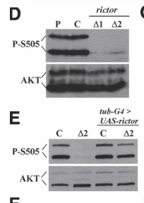

## Question

# Gene Research for Functional Annotation

## ⚠️ CRITICAL: Gene/Protein Identification Context

**BEFORE YOU BEGIN RESEARCH:** You MUST verify you are researching the CORRECT gene/protein. Gene symbols can be ambiguous, especially for less well-characterized genes from non-model organisms.

### Target Gene/Protein Identity (from UniProt):
- **UniProt Accession:** Q9VWJ6
- **Protein Description:** SubName: Full=Rapamycin-insensitive companion of Tor, isoform A {ECO:0000313|EMBL:AAF48942.2};
- **Gene Information:** Name=rictor {ECO:0000313|EMBL:AAF48942.2, ECO:0000313|FlyBase:FBgn0031006}; Synonyms=8002 {ECO:0000313|EMBL:AAF48942.2}, Dmel\CG8002 {ECO:0000313|EMBL:AAF48942.2}, dRic {ECO:0000313|EMBL:AAF48942.2}, dRICTOR {ECO:0000313|EMBL:AAF48942.2}, dRictor {ECO:0000313|EMBL:AAF48942.2}, RICTOR {ECO:0000313|EMBL:AAF48942.2}, Rictor {ECO:0000313|EMBL:AAF48942.2}; ORFNames=CG8002 {ECO:0000313|EMBL:AAF48942.2, ECO:0000313|FlyBase:FBgn0031006}, Dmel_CG8002 {ECO:0000313|EMBL:AAF48942.2};
- **Organism (full):** Drosophila melanogaster (Fruit fly).
- **Protein Family:** Belongs to the RICTOR family.
- **Key Domains:** ARM-type_fold. (IPR016024); Pianissimo_fam. (IPR028268); Pianissimo_N. (IPR028267); Rictor_IV. (IPR029453); RICTOR_M. (IPR029451)

### MANDATORY VERIFICATION STEPS:

1. **Check if the gene symbol "rictor" matches the protein description above**
2. **Verify the organism is correct:** Drosophila melanogaster (Fruit fly).
3. **Check if protein family/domains align with what you find in literature**
4. **If you find literature for a DIFFERENT gene with the same or similar symbol, STOP**

### If Gene Symbol is Ambiguous or You Cannot Find Relevant Literature:

**DO NOT PROCEED WITH RESEARCH ON A DIFFERENT GENE.** Instead:
- State clearly: "The gene symbol 'rictor' is ambiguous or literature is limited for this specific protein"
- Explain what you found (e.g., "Found extensive literature on a different gene with the same symbol in a different organism")
- Describe the protein based ONLY on the UniProt information provided above
- Suggest that the protein function can be inferred from domain/family information

### Research Target:

Please provide a comprehensive research report on the gene **rictor** (gene ID: rictor, UniProt: Q9VWJ6) in DROME.

The research report should be a detailed narrative explaining the function, biological processes, and localization of the gene product. Citations should be given for all claims.

You should prioritize authoritative reviews and primary scientific literature when conducting research. You can supplement
this with annotations you find in gene/protein databases, but these can be outdated or inaccurate.

We are specifically interested in the primary function of the gene - for enzymes, what reaction is catalyzed, and what is the substrate specificity? For transporters, what is the substrate? For structural proteins or adapters, what is the broader structural role? For signaling molecules, what is the role in the pathway.

We are interested in where in or outside the cell the gene product carries out its function.

We are also interested in the signaling or biochemical pathways in which the gene functions. We are less interested in broad pleiotropic effects, except where these elucidate the precise role.

Include evidence where possible. We are interested in both experimental evidence as well as inference from structure, evolution, or bioinformatic analysis. Precise studies should be prioritized over high-throughput, where available.

## Output

Question: You are an expert researcher providing comprehensive, well-cited information.

Provide detailed information focusing on:
1. Key concepts and definitions with current understanding
2. Recent developments and latest research (prioritize 2023-2024 sources)
3. Current applications and real-world implementations
4. Expert opinions and analysis from authoritative sources
5. Relevant statistics and data from recent studies

Format as a comprehensive research report with proper citations. Include URLs and publication dates where available.
Always prioritize recent, authoritative sources and provide specific citations for all major claims.

# Gene Research for Functional Annotation

## ⚠️ CRITICAL: Gene/Protein Identification Context

**BEFORE YOU BEGIN RESEARCH:** You MUST verify you are researching the CORRECT gene/protein. Gene symbols can be ambiguous, especially for less well-characterized genes from non-model organisms.

### Target Gene/Protein Identity (from UniProt):
- **UniProt Accession:** Q9VWJ6
- **Protein Description:** SubName: Full=Rapamycin-insensitive companion of Tor, isoform A {ECO:0000313|EMBL:AAF48942.2};
- **Gene Information:** Name=rictor {ECO:0000313|EMBL:AAF48942.2, ECO:0000313|FlyBase:FBgn0031006}; Synonyms=8002 {ECO:0000313|EMBL:AAF48942.2}, Dmel\CG8002 {ECO:0000313|EMBL:AAF48942.2}, dRic {ECO:0000313|EMBL:AAF48942.2}, dRICTOR {ECO:0000313|EMBL:AAF48942.2}, dRictor {ECO:0000313|EMBL:AAF48942.2}, RICTOR {ECO:0000313|EMBL:AAF48942.2}, Rictor {ECO:0000313|EMBL:AAF48942.2}; ORFNames=CG8002 {ECO:0000313|EMBL:AAF48942.2, ECO:0000313|FlyBase:FBgn0031006}, Dmel_CG8002 {ECO:0000313|EMBL:AAF48942.2};
- **Organism (full):** Drosophila melanogaster (Fruit fly).
- **Protein Family:** Belongs to the RICTOR family.
- **Key Domains:** ARM-type_fold. (IPR016024); Pianissimo_fam. (IPR028268); Pianissimo_N. (IPR028267); Rictor_IV. (IPR029453); RICTOR_M. (IPR029451)

### MANDATORY VERIFICATION STEPS:

1. **Check if the gene symbol "rictor" matches the protein description above**
2. **Verify the organism is correct:** Drosophila melanogaster (Fruit fly).
3. **Check if protein family/domains align with what you find in literature**
4. **If you find literature for a DIFFERENT gene with the same or similar symbol, STOP**

### If Gene Symbol is Ambiguous or You Cannot Find Relevant Literature:

**DO NOT PROCEED WITH RESEARCH ON A DIFFERENT GENE.** Instead:
- State clearly: "The gene symbol 'rictor' is ambiguous or literature is limited for this specific protein"
- Explain what you found (e.g., "Found extensive literature on a different gene with the same symbol in a different organism")
- Describe the protein based ONLY on the UniProt information provided above
- Suggest that the protein function can be inferred from domain/family information

### Research Target:

Please provide a comprehensive research report on the gene **rictor** (gene ID: rictor, UniProt: Q9VWJ6) in DROME.

The research report should be a detailed narrative explaining the function, biological processes, and localization of the gene product. Citations should be given for all claims.

You should prioritize authoritative reviews and primary scientific literature when conducting research. You can supplement
this with annotations you find in gene/protein databases, but these can be outdated or inaccurate.

We are specifically interested in the primary function of the gene - for enzymes, what reaction is catalyzed, and what is the substrate specificity? For transporters, what is the substrate? For structural proteins or adapters, what is the broader structural role? For signaling molecules, what is the role in the pathway.

We are interested in where in or outside the cell the gene product carries out its function.

We are also interested in the signaling or biochemical pathways in which the gene functions. We are less interested in broad pleiotropic effects, except where these elucidate the precise role.

Include evidence where possible. We are interested in both experimental evidence as well as inference from structure, evolution, or bioinformatic analysis. Precise studies should be prioritized over high-throughput, where available.

# Functional annotation of *Drosophila melanogaster rictor* (Q9VWJ6)

## Identity and principal function

The target is fruit-fly *rictor*, also called **CG8002** and dRictor—not a mammalian gene merely sharing the symbol. Primary fly studies explicitly identify *rictor* as CG8002 and show that its loss disrupts target-of-rapamycin complex 2 (**TORC2**) signaling. The accession Q9VWJ6, FlyBase identifier FBgn0031006, isoform designation and InterPro identifiers in the question are treated as supplied identifiers; the papers examined independently confirm the CG8002–*rictor* correspondence, but do not independently validate every database identifier or isoform-specific property. (hietakangas2007reevaluatingaktregulation pages 1-2, irena2015torc2mediatesthe pages 1-2)

**Rictor is a noncatalytic, complex-defining component of TORC2.** Its principal role is to help assemble and organize the TOR-containing signaling complex, distinguishing it from Raptor-containing TORC1 and enabling phosphorylation of particular downstream protein kinases. **Tor, not Rictor, supplies the serine/threonine kinase activity:** there is therefore no reaction catalyzed by isolated Rictor and no transporter substrate to assign. Fly TORC2 is described as containing Tor, Rictor, Sin1 and Lst8; experiments with fly *lst8* mutants support an important requirement for Lst8 in TORC2 signaling. (koikekumagai2009thetargetof pages 1-2, hietakangas2007reevaluatingaktregulation pages 1-2, wang2012lst8regulatescell pages 2-3, frappaolo2023usingdrosophilamelanogaster pages 5-7)

The supplied ARM-type fold, Pianissimo-family/N-terminal, RICTOR-middle and Rictor-IV domain annotations are consistent with a conserved, multidomain scaffold rather than an enzyme active site. A **2024 structural review**, largely based on non-fly structural work, describes Rictor’s armadillo-repeat, HEAT-like and C-terminal helical regions contacting mTOR and helping position Sin1 near the catalytic cleft. This provides a plausible structural explanation for the fly genetics, **not** an experimentally determined atomic structure or domain-by-domain mechanism for Q9VWJ6. (ragupathi2024themtorc2signaling pages 3-5)

## Molecular pathway and evidence

The best-established fly readout is phosphorylation of **Akt1 at Ser505**, its C-terminal hydrophobic-motif site. In *rictor* deletion mutants, phospho-Ser505 fell by **more than 95%**; expressing a *rictor* transgene restored it. *Sin1* mutants showed a similar defect. Rictor depletion also diminished insulin-stimulated phosphorylation of Akt substrates in S2 cells, while *rictor* mutants retained phosphorylation of the TORC1 outputs S6K and 4E-BP. Figure 1D–E of the original study shows the loss and transgene rescue. Together these observations establish Rictor’s importance for **TORC2-dependent Akt activation**, rather than a general requirement for all Tor signaling. They do not imply that Rictor itself phosphorylates Akt. (hietakangas2007reevaluatingaktregulation pages 2-3, hietakangas2007reevaluatingaktregulation pages 1-2, hietakangas2007reevaluatingaktregulation media 33c346d8, hietakangas2007reevaluatingaktregulation pages 4-5)

In pathway terms, insulin/PI3K signaling generates membrane PIP3 and recruits Akt; PDK1 phosphorylates Akt’s activation-loop site, while Rictor-containing TORC2 supports phosphorylation of its Ser505 hydrophobic motif. Akt then affects targets including Foxo and the growth-regulatory TSC/Rheb axis. Crucially, **Ser505 phosphorylation increases the range of Akt signaling rather than being absolutely required for fly viability**: *rictor* mutants are viable and fertile, and Akt bearing a nonphosphorylatable Ser505Ala substitution retains appreciable activity in vivo. Loss of *rictor* enhances Foxo-dependent phenotypes and suppresses overgrowth driven by PI3K activation or PTEN loss, but does not suppress overgrowth caused by TSC1 loss downstream. These epistasis results distinguish the TORC2–Akt contribution from TORC1-driven growth. (hietakangas2007reevaluatingaktregulation pages 1-2, hietakangas2007reevaluatingaktregulation pages 3-4, hietakangas2007reevaluatingaktregulation pages 4-5)

A second experimentally supported output is the NDR-family kinase **Tricornered (Trc)**. In fly embryos and S2 cells, loss or depletion of Rictor, Sin1 or Tor reduces Trc activity and phosphorylation of its **Thr449 hydrophobic motif**, without a comparable reduction at **Ser292**. Membrane-targeted, active Trc substantially rescues neuronal dendritic-tiling defects in *rictor* and *sin1* mutants. **Direct Tor-catalyzed phosphorylation of Trc Thr449 was not established in these experiments**: the study also implicates Hippo kinase in that modification and discusses a possible TORC2 role in positioning Trc for activation. Thus Trc is a well-supported **TORC2-dependent effector**, but assigning it an unqualified direct TORC2 substrate would overstate the fly evidence. Mammalian TORC2 substrates such as PKC and SGK should likewise not automatically be annotated as experimentally verified Q9VWJ6-dependent fly substrates. (koikekumagai2009thetargetof pages 6-7, koikekumagai2009thetargetof pages 8-9, koikekumagai2009thetargetof pages 11-12)

## Where Rictor acts

Rictor acts **inside cells as part of TORC2**, including in cultured S2 cells and fly neuronal and other tissues; the loss-of-function evidence does not suggest an extracellular or secreted role. PI3K-dependent Akt activation provides a rationale for TORC2 activity at or near cellular membranes, and the Trc study proposes membrane-associated signaling. However, the examined fly experiments **do not establish a definitive subcellular distribution of Rictor protein itself**. Membrane localization proposed for Sin1 or Trc, nuclear redistribution of downstream Myc, and FMR1-positive cytoplasmic stress granules must not be misreported as microscopy of Rictor. Plasma-membrane and other organellar distributions described in mammalian or yeast studies remain **cross-species hypotheses** for fly Rictor pending direct imaging or fractionation. (hietakangas2007reevaluatingaktregulation pages 1-2, ragupathi2024themtorc2signaling pages 3-5, irena2015torc2mediatesthe pages 4-5, koikekumagai2009thetargetof pages 11-12, kuo2015targetofrapamycin pages 6-8)

## Biological processes and recent findings

Rictor-dependent signaling has experimentally separable effects on tissue growth and neuronal architecture. In the original fly study, *rictor* deletion lowered adult body weight by approximately **10%** and reduced wing size, both rescued by transgenic Rictor. A **2023** multi-tissue morphometric study found **11–19% smaller** leg, wing and ommatidial cells in *rictor*Δ2 flies, depending on tissue and sex, while male flight-muscle cell size was unchanged. These findings support tissue-dependent cell-size regulation rather than a universal requirement for growth. A separate fly study placed TORC2 upstream of Myc-dependent growth and showed that *rictor* loss altered **Myc’s**, not Rictor’s, nuclear distribution. (hietakangas2007reevaluatingaktregulation pages 3-4, privalova2023systemicchangesin pages 6-7, kuo2015targetofrapamycin pages 6-8)

In developing sensory neurons, the Rictor–TORC2–Trc pathway supports dendritic tiling. Its importance is **developmental-stage and process specific**: a **2023** study found that Rictor, Sin1 or Trc depletion caused only **mild** defects during post-pruning dendrite *regrowth*, whereas depletion of TORC1-specific Raptor caused strong defects. This does not contradict the earlier tiling result; tiling and regrowth are different neuronal assays. At larval neuromuscular junctions, *rictor* and *sin1* mutants showed synaptic-bouton overgrowth, and *Tsc2;rictor* double mutants were not more severe than the single mutants, supporting a shared Tsc2–TORC2–Akt pathway in that context. The reported **24.1 ± 1.3 versus 16.5 ± 1.7 boutons** compare *Tsc2* mutants with controls—not *rictor* mutants—and should not be presented as a Rictor-specific effect size. Rheb-overexpression phenotypes were distinguishable from this Tsc2-dependent pathway. (koikekumagai2009thetargetof pages 1-2, sanal2023torc1regulationof pages 2-4, natarajan2013tuberoussclerosiscomplex pages 5-6, natarajan2013tuberoussclerosiscomplex pages 2-2)

Rictor also contributes to a defined cellular stress response. On heat exposure, fly larvae and S2 cells increase Akt Ser505 phosphorylation; Rictor or Sin1 loss prevents this response and compromises Akt protein maintenance under heat stress. *Rictor* mutants are selectively heat-sensitive in the tested conditions. In S2 cells and some larval tissues, TORC2 loss **delays** assembly of heat-induced FMR1/eIF4E-positive stress granules; longer heat exposure can diminish the observed difference, and the response varies by tissue. Raptor depletion did not reproduce the early stress-granule defect. These observations support a role in heat-response signaling and granule assembly, **not** a claim that Rictor is itself a granule constituent. (irena2015torc2mediatesthe pages 1-2, irena2015torc2mediatesthe pages 4-5, irena2015torc2mediatesthe pages 5-6, irena2015torc2mediatesthe pages 2-4)

The main organism-specific developments located from **2023–2024** therefore refine **where TORC2 matters**—quantifying tissue-specific cell-size effects and showing that TORC1, not TORC2, dominates one dendrite-regrowth assay—rather than replacing the foundational 2007–2015 biochemical annotation. The authoritative **2023 fly-focused review** and **2024 mTORC2 review** likewise emphasize that TORC2 is distinct from TORC1 and that its downstream outputs and compartment-specific regulation still require careful experimental discrimination. Fly *rictor* mutants, S2-cell RNAi and transgene rescue are established **research implementations** for separating these complexes; the findings are not evidence of a clinically implemented intervention directed at fly Rictor. (privalova2023systemicchangesin pages 6-7, sanal2023torc1regulationof pages 2-4, frappaolo2023usingdrosophilamelanogaster pages 5-7, ragupathi2024themtorc2signaling pages 3-5)

The following matrix separates observations in flies from pathway-level interpretation.

| Pathway / role | Direct fly observation and key quantitative result | Evidence level | Study, year, DOI / URL |
|---|---|---|---|
| TORC2–Akt signaling | Null-like *rictor/CG8002* deletions reduced Akt Ser505 phosphorylation by **more than 95%**; ubiquitous *rictor* expression restored it. Akt-substrate phosphorylation was strongly reduced, whereas TORC1 outputs S6K and 4E-BP were not meaningfully reduced. Mutants were viable and fertile but had approximately **10% lower body weight** and smaller wings. Rictor is noncatalytic; Tor provides kinase activity. (hietakangas2007reevaluatingaktregulation pages 2-3, hietakangas2007reevaluatingaktregulation pages 1-2, hietakangas2007reevaluatingaktregulation pages 3-4, hietakangas2007reevaluatingaktregulation pages 4-5) | **Strong direct fly evidence:** deletion, RNAi, immunoblotting, rescue and epistasis | Hietakangas & Cohen, **2007** — [10.1101/gad.416307](https://doi.org/10.1101/gad.416307) |
| TORC2–Tricornered signaling and dendritic tiling | Loss or depletion of Rictor, Sin1 or Tor reduced Trc hydrophobic-motif **Thr449** phosphorylation and activity, but did not significantly reduce **Ser292** phosphorylation. Okadaic acid stimulated Trc activity approximately **sevenfold**, an effect largely eliminated by TORC2-component RNAi. Active membrane-targeted Trc rescued *rictor* and *sin1* tiling defects. Direct phosphorylation of Trc by TORC2 was **not demonstrated**; Hippo also contributes strongly to Thr449 phosphorylation. (koikekumagai2009thetargetof pages 8-9, koikekumagai2009thetargetof pages 11-12, koikekumagai2009thetargetof pages 6-7, koikekumagai2009thetargetof pages 7-8) | **Strong pathway-placement evidence, but indirect substrate assignment:** genetics, RNAi, kinase assays, phosphosite blots and rescue; no purified direct kinase reaction | Koike-Kumagai et al., **2009** — [10.1038/emboj.2009.312](https://doi.org/10.1038/emboj.2009.312) |
| Tsc2–TORC2–Akt control of neuromuscular-junction growth | *rictor* and *sin1* mutants showed bouton overgrowth resembling *Tsc2/gig* loss; *Tsc2;rictor* double mutants were no more severe than either single mutant. *Tsc2* mutants had **24.1 ± 1.3 boutons versus 16.5 ± 1.7** in controls and markedly reduced Akt Ser505 phosphorylation; Akt mutants showed approximately **80% greater** synaptic growth. Raptor depletion to about **20% of wild type** did not increase bouton number. Rheb-driven overgrowth was mechanistically distinct. (natarajan2013tuberoussclerosiscomplex pages 6-8, natarajan2013tuberoussclerosiscomplex pages 1-2, natarajan2013tuberoussclerosiscomplex pages 5-6, natarajan2013tuberoussclerosiscomplex pages 2-2) | **Strong fly pathway evidence:** mutants, tissue-specific RNAi and rescue, double-mutant analysis, immunoblotting and NMJ morphometry | Natarajan et al., **2013** — [10.1093/hmg/ddt053](https://doi.org/10.1093/hmg/ddt053) |
| Heat response and stress-granule assembly | At **37 °C**, wild-type larvae and S2 cells increased Akt Ser505 phosphorylation, whereas Rictor- or Sin1-deficient samples did not. Rictor mutants were selectively heat-sensitive, and ubiquitous Rictor rescued paralysis. After **1–2 hours at 37 °C**, Rictor or Sin1 depletion delayed FMR1/eIF4E-positive stress-granule assembly; Raptor depletion did not. The results do **not** show that Rictor localizes to stress granules. (irena2015torc2mediatesthe pages 4-5, irena2015torc2mediatesthe pages 1-2, irena2015torc2mediatesthe pages 5-6, irena2015torc2mediatesthe pages 2-4) | **Strong fly loss-of-function and rescue evidence:** two deletion alleles, RNAi, survival assays, immunoblotting and imaging | Jevtov et al., **2015** — [10.1242/jcs.168724](https://doi.org/10.1242/jcs.168724) |
| Tissue-selective cell-size control | Relative to matched controls, **rictorΔ2** flies had **11–19% smaller cells** in legs, wings and ommatidia, depending on tissue and sex. The effect persisted after adjustment for thorax length. Male dorsal longitudinal flight-muscle cell size was **unchanged**, showing that Rictor-dependent size control is broad but not universal. (privalova2023systemicchangesin pages 6-7) | **Recent primary morphometric evidence:** null-like mutant, multiple tissues and covariate-adjusted comparisons | Privalova et al., **2023** — [10.1038/s41598-023-34674-y](https://doi.org/10.1038/s41598-023-34674-y) |
| TORC1 versus TORC2 in dendrite regrowth | In class-IV dendritic-arborization neurons, Raptor knockdown caused **strong** post-pruning dendrite-regrowth defects, whereas knockdown of Rictor, Sin1 or Trc caused only **mild** effects. Constitutively active S6K significantly rescued Tor-knockdown defects. Rictor/TORC2 therefore is not the principal Tor complex driving this regrowth process. (sanal2023torc1regulationof pages 2-4, sanal2023torc1regulationof pages 4-6) | **Recent tissue-specific comparative evidence:** neuronal RNAi, genetic validation and downstream rescue | Sanal et al., **2023** — [10.1371/journal.pgen.1010526](https://doi.org/10.1371/journal.pgen.1010526) |

*Table: Compact evidence matrix for *Drosophila melanogaster* rictor/CG8002 (Q9VWJ6), separating direct fly observations from pathway inference. It highlights quantitative findings and explicitly avoids assigning catalytic activity or stress-granule localization to Rictor.*

### Selected sources and publication dates

- Hietakangas V, Cohen SM. *Genes & Development*, **March 2007**. [https://doi.org/10.1101/gad.416307](https://doi.org/10.1101/gad.416307). Fly *rictor* identity, Akt Ser505, rescue and growth epistasis. (hietakangas2007reevaluatingaktregulation pages 1-2, hietakangas2007reevaluatingaktregulation pages 3-4)
- Koike-Kumagai M et al. *The EMBO Journal*, **December 2009**. [https://doi.org/10.1038/emboj.2009.312](https://doi.org/10.1038/emboj.2009.312). TORC2–Trc signaling and dendritic tiling. (koikekumagai2009thetargetof pages 6-7, koikekumagai2009thetargetof pages 11-12)
- Wang T et al. *Molecular and Cellular Biology*, **June 2012**. [https://doi.org/10.1128/MCB.06474-11](https://doi.org/10.1128/MCB.06474-11). Fly Lst8 and TORC2-versus-TORC1 growth signaling. (wang2012lst8regulatescell pages 2-3)
- Natarajan R et al. *Human Molecular Genetics*, **May 2013**. [https://doi.org/10.1093/hmg/ddt053](https://doi.org/10.1093/hmg/ddt053). Fly neuromuscular-junction Tsc2–TORC2–Akt genetics. (natarajan2013tuberoussclerosiscomplex pages 5-6, natarajan2013tuberoussclerosiscomplex pages 2-2)
- Jevtov I et al. *Journal of Cell Science*, **July 2015**. [https://doi.org/10.1242/jcs.168724](https://doi.org/10.1242/jcs.168724). Rictor deletion, heat sensitivity and stress granules. (irena2015torc2mediatesthe pages 1-2, irena2015torc2mediatesthe pages 5-6)
- Privalova V et al. *Scientific Reports*, **May 2023**. [https://doi.org/10.1038/s41598-023-34674-y](https://doi.org/10.1038/s41598-023-34674-y). Multi-tissue *rictor*Δ2 cell-size analysis. (privalova2023systemicchangesin pages 6-7)
- Sanal N et al. *PLOS Genetics*, **2023**. [https://doi.org/10.1371/journal.pgen.1010526](https://doi.org/10.1371/journal.pgen.1010526). TORC1–TORC2 comparison during dendrite regrowth. (sanal2023torc1regulationof pages 2-4)
- Frappaolo A, Giansanti MG. *Cells*, **November 2023**. [https://doi.org/10.3390/cells12222622](https://doi.org/10.3390/cells12222622). Fly-focused synthesis of TOR signaling. (frappaolo2023usingdrosophilamelanogaster pages 5-7)
- Ragupathi A, Kim C, Jacinto E. *Biochemical Journal*, **January 2024**. [https://doi.org/10.1042/BCJ20220325](https://doi.org/10.1042/BCJ20220325). Comparative TORC2 structure and signaling; structural extrapolations are not fly-specific proof. (ragupathi2024themtorc2signaling pages 3-5)

References

1. (hietakangas2007reevaluatingaktregulation pages 1-2): Ville Hietakangas and Stephen M. Cohen. Re-evaluating akt regulation: role of tor complex 2 in tissue growth. Genes & development, 21 6:632-7, Mar 2007. URL: https://doi.org/10.1101/gad.416307, doi:10.1101/gad.416307. This article has 176 citations and is from a highest quality peer-reviewed journal.

2. (irena2015torc2mediatesthe pages 1-2): Irena Jevtov, Margarita Zacharogianni, Marinke M. van Oorschot, Guus van Zadelhoff, Angelica Aguilera-Gomez, Igor Vuillez, Ineke Braakman, Ernst Hafen, Hugo Stocker, and Catherine Rabouille. Torc2 mediates the heat stress response in drosophila by promoting the formation of stress granules. Journal of Cell Science, 128:2497-2508, Jul 2015. URL: https://doi.org/10.1242/jcs.168724, doi:10.1242/jcs.168724. This article has 60 citations and is from a domain leading peer-reviewed journal.

3. (koikekumagai2009thetargetof pages 1-2): Makiko Koike-Kumagai, Kei-ichiro Yasunaga, Rei Morikawa, Takahiro Kanamori, and Kazuo Emoto. The target of rapamycin complex 2 controls dendritic tiling of drosophila sensory neurons through the tricornered kinase signalling pathway. The EMBO Journal, 28:3879-3892, Dec 2009. URL: https://doi.org/10.1038/emboj.2009.312, doi:10.1038/emboj.2009.312. This article has 87 citations.

4. (wang2012lst8regulatescell pages 2-3): Tao Wang, Rachel Blumhagen, Uyen Lao, Ying Kuo, and Bruce A. Edgar. Lst8 regulates cell growth via target-of-rapamycin complex 2 (torc2). Molecular and Cellular Biology, 32:2203-2213, Jun 2012. URL: https://doi.org/10.1128/mcb.06474-11, doi:10.1128/mcb.06474-11. This article has 56 citations and is from a domain leading peer-reviewed journal.

5. (frappaolo2023usingdrosophilamelanogaster pages 5-7): Anna Frappaolo and Maria Grazia Giansanti. Using drosophila melanogaster to dissect the roles of the mtor signaling pathway in cell growth. Cells, 12:2622, Nov 2023. URL: https://doi.org/10.3390/cells12222622, doi:10.3390/cells12222622. This article has 28 citations.

6. (ragupathi2024themtorc2signaling pages 3-5): Aparna Ragupathi, Christian Kim, and Estela Jacinto. The mtorc2 signaling network: targets and cross-talks. Biochemical Journal, 481:45-91, Jan 2024. URL: https://doi.org/10.1042/bcj20220325, doi:10.1042/bcj20220325. This article has 139 citations and is from a domain leading peer-reviewed journal.

7. (hietakangas2007reevaluatingaktregulation pages 2-3): Ville Hietakangas and Stephen M. Cohen. Re-evaluating akt regulation: role of tor complex 2 in tissue growth. Genes & development, 21 6:632-7, Mar 2007. URL: https://doi.org/10.1101/gad.416307, doi:10.1101/gad.416307. This article has 176 citations and is from a highest quality peer-reviewed journal.

8. (hietakangas2007reevaluatingaktregulation media 33c346d8): Ville Hietakangas and Stephen M. Cohen. Re-evaluating akt regulation: role of tor complex 2 in tissue growth. Genes & development, 21 6:632-7, Mar 2007. URL: https://doi.org/10.1101/gad.416307, doi:10.1101/gad.416307. This article has 176 citations and is from a highest quality peer-reviewed journal.

9. (hietakangas2007reevaluatingaktregulation pages 4-5): Ville Hietakangas and Stephen M. Cohen. Re-evaluating akt regulation: role of tor complex 2 in tissue growth. Genes & development, 21 6:632-7, Mar 2007. URL: https://doi.org/10.1101/gad.416307, doi:10.1101/gad.416307. This article has 176 citations and is from a highest quality peer-reviewed journal.

10. (hietakangas2007reevaluatingaktregulation pages 3-4): Ville Hietakangas and Stephen M. Cohen. Re-evaluating akt regulation: role of tor complex 2 in tissue growth. Genes & development, 21 6:632-7, Mar 2007. URL: https://doi.org/10.1101/gad.416307, doi:10.1101/gad.416307. This article has 176 citations and is from a highest quality peer-reviewed journal.

11. (koikekumagai2009thetargetof pages 6-7): Makiko Koike-Kumagai, Kei-ichiro Yasunaga, Rei Morikawa, Takahiro Kanamori, and Kazuo Emoto. The target of rapamycin complex 2 controls dendritic tiling of drosophila sensory neurons through the tricornered kinase signalling pathway. The EMBO Journal, 28:3879-3892, Dec 2009. URL: https://doi.org/10.1038/emboj.2009.312, doi:10.1038/emboj.2009.312. This article has 87 citations.

12. (koikekumagai2009thetargetof pages 8-9): Makiko Koike-Kumagai, Kei-ichiro Yasunaga, Rei Morikawa, Takahiro Kanamori, and Kazuo Emoto. The target of rapamycin complex 2 controls dendritic tiling of drosophila sensory neurons through the tricornered kinase signalling pathway. The EMBO Journal, 28:3879-3892, Dec 2009. URL: https://doi.org/10.1038/emboj.2009.312, doi:10.1038/emboj.2009.312. This article has 87 citations.

13. (koikekumagai2009thetargetof pages 11-12): Makiko Koike-Kumagai, Kei-ichiro Yasunaga, Rei Morikawa, Takahiro Kanamori, and Kazuo Emoto. The target of rapamycin complex 2 controls dendritic tiling of drosophila sensory neurons through the tricornered kinase signalling pathway. The EMBO Journal, 28:3879-3892, Dec 2009. URL: https://doi.org/10.1038/emboj.2009.312, doi:10.1038/emboj.2009.312. This article has 87 citations.

14. (irena2015torc2mediatesthe pages 4-5): Irena Jevtov, Margarita Zacharogianni, Marinke M. van Oorschot, Guus van Zadelhoff, Angelica Aguilera-Gomez, Igor Vuillez, Ineke Braakman, Ernst Hafen, Hugo Stocker, and Catherine Rabouille. Torc2 mediates the heat stress response in drosophila by promoting the formation of stress granules. Journal of Cell Science, 128:2497-2508, Jul 2015. URL: https://doi.org/10.1242/jcs.168724, doi:10.1242/jcs.168724. This article has 60 citations and is from a domain leading peer-reviewed journal.

15. (kuo2015targetofrapamycin pages 6-8): Ying Kuo, Huanwei Huang, Tao Cai, and Tao Wang. Target of rapamycin complex 2 regulates cell growth via myc in drosophila. Scientific Reports, May 2015. URL: https://doi.org/10.1038/srep10339, doi:10.1038/srep10339. This article has 28 citations and is from a peer-reviewed journal.

16. (privalova2023systemicchangesin pages 6-7): Valeriya Privalova, Anna Maria Labecka, Ewa Szlachcic, Anna Sikorska, and Marcin Czarnoleski. Systemic changes in cell size throughout the body of drosophila melanogaster associated with mutations in molecular cell cycle regulators. Scientific Reports, May 2023. URL: https://doi.org/10.1038/s41598-023-34674-y, doi:10.1038/s41598-023-34674-y. This article has 7 citations and is from a peer-reviewed journal.

17. (sanal2023torc1regulationof pages 2-4): Neeraja Sanal, Lorena Keding, Ulrike Gigengack, Esther Michalke, and Sebastian Rumpf. Torc1 regulation of dendrite regrowth after pruning is linked to actin and exocytosis. PLOS Genetics, Nov 2023. URL: https://doi.org/10.1371/journal.pgen.1010526, doi:10.1371/journal.pgen.1010526. This article has 11 citations and is from a domain leading peer-reviewed journal.

18. (natarajan2013tuberoussclerosiscomplex pages 5-6): Rajalaxmi Natarajan, Deepti Trivedi-Vyas, and Yogesh P. Wairkar. Tuberous sclerosis complex regulates drosophila neuromuscular junction growth via the torc2/akt pathway. Human molecular genetics, 22 10:2010-23, May 2013. URL: https://doi.org/10.1093/hmg/ddt053, doi:10.1093/hmg/ddt053. This article has 38 citations and is from a domain leading peer-reviewed journal.

19. (natarajan2013tuberoussclerosiscomplex pages 2-2): Rajalaxmi Natarajan, Deepti Trivedi-Vyas, and Yogesh P. Wairkar. Tuberous sclerosis complex regulates drosophila neuromuscular junction growth via the torc2/akt pathway. Human molecular genetics, 22 10:2010-23, May 2013. URL: https://doi.org/10.1093/hmg/ddt053, doi:10.1093/hmg/ddt053. This article has 38 citations and is from a domain leading peer-reviewed journal.

20. (irena2015torc2mediatesthe pages 5-6): Irena Jevtov, Margarita Zacharogianni, Marinke M. van Oorschot, Guus van Zadelhoff, Angelica Aguilera-Gomez, Igor Vuillez, Ineke Braakman, Ernst Hafen, Hugo Stocker, and Catherine Rabouille. Torc2 mediates the heat stress response in drosophila by promoting the formation of stress granules. Journal of Cell Science, 128:2497-2508, Jul 2015. URL: https://doi.org/10.1242/jcs.168724, doi:10.1242/jcs.168724. This article has 60 citations and is from a domain leading peer-reviewed journal.

21. (irena2015torc2mediatesthe pages 2-4): Irena Jevtov, Margarita Zacharogianni, Marinke M. van Oorschot, Guus van Zadelhoff, Angelica Aguilera-Gomez, Igor Vuillez, Ineke Braakman, Ernst Hafen, Hugo Stocker, and Catherine Rabouille. Torc2 mediates the heat stress response in drosophila by promoting the formation of stress granules. Journal of Cell Science, 128:2497-2508, Jul 2015. URL: https://doi.org/10.1242/jcs.168724, doi:10.1242/jcs.168724. This article has 60 citations and is from a domain leading peer-reviewed journal.

22. (koikekumagai2009thetargetof pages 7-8): Makiko Koike-Kumagai, Kei-ichiro Yasunaga, Rei Morikawa, Takahiro Kanamori, and Kazuo Emoto. The target of rapamycin complex 2 controls dendritic tiling of drosophila sensory neurons through the tricornered kinase signalling pathway. The EMBO Journal, 28:3879-3892, Dec 2009. URL: https://doi.org/10.1038/emboj.2009.312, doi:10.1038/emboj.2009.312. This article has 87 citations.

23. (natarajan2013tuberoussclerosiscomplex pages 6-8): Rajalaxmi Natarajan, Deepti Trivedi-Vyas, and Yogesh P. Wairkar. Tuberous sclerosis complex regulates drosophila neuromuscular junction growth via the torc2/akt pathway. Human molecular genetics, 22 10:2010-23, May 2013. URL: https://doi.org/10.1093/hmg/ddt053, doi:10.1093/hmg/ddt053. This article has 38 citations and is from a domain leading peer-reviewed journal.

24. (natarajan2013tuberoussclerosiscomplex pages 1-2): Rajalaxmi Natarajan, Deepti Trivedi-Vyas, and Yogesh P. Wairkar. Tuberous sclerosis complex regulates drosophila neuromuscular junction growth via the torc2/akt pathway. Human molecular genetics, 22 10:2010-23, May 2013. URL: https://doi.org/10.1093/hmg/ddt053, doi:10.1093/hmg/ddt053. This article has 38 citations and is from a domain leading peer-reviewed journal.

25. (sanal2023torc1regulationof pages 4-6): Neeraja Sanal, Lorena Keding, Ulrike Gigengack, Esther Michalke, and Sebastian Rumpf. Torc1 regulation of dendrite regrowth after pruning is linked to actin and exocytosis. PLOS Genetics, Nov 2023. URL: https://doi.org/10.1371/journal.pgen.1010526, doi:10.1371/journal.pgen.1010526. This article has 11 citations and is from a domain leading peer-reviewed journal.

## Artifacts

- [Edison artifact artifact-00](rictor-deep-research-falcon_artifacts/artifact-00.md)

## Citations

1. privalova2023systemicchangesin pages 6-7
2. frappaolo2023usingdrosophilamelanogaster pages 5-7
3. hietakangas2007reevaluatingaktregulation pages 1-2
4. koikekumagai2009thetargetof pages 1-2
5. hietakangas2007reevaluatingaktregulation pages 2-3
6. hietakangas2007reevaluatingaktregulation pages 4-5
7. hietakangas2007reevaluatingaktregulation pages 3-4
8. koikekumagai2009thetargetof pages 6-7
9. koikekumagai2009thetargetof pages 8-9
10. koikekumagai2009thetargetof pages 11-12
11. kuo2015targetofrapamycin pages 6-8
12. natarajan2013tuberoussclerosiscomplex pages 5-6
13. natarajan2013tuberoussclerosiscomplex pages 2-2
14. koikekumagai2009thetargetof pages 7-8
15. natarajan2013tuberoussclerosiscomplex pages 6-8
16. natarajan2013tuberoussclerosiscomplex pages 1-2
17. 10.1101/gad.416307
18. 10.1038/emboj.2009.312
19. 10.1093/hmg/ddt053
20. 10.1242/jcs.168724
21. 10.1038/s41598-023-34674-y
22. 10.1371/journal.pgen.1010526
23. https://doi.org/10.1101/gad.416307
24. https://doi.org/10.1038/emboj.2009.312
25. https://doi.org/10.1128/MCB.06474-11
26. https://doi.org/10.1093/hmg/ddt053
27. https://doi.org/10.1242/jcs.168724
28. https://doi.org/10.1038/s41598-023-34674-y
29. https://doi.org/10.1371/journal.pgen.1010526
30. https://doi.org/10.3390/cells12222622
31. https://doi.org/10.1042/BCJ20220325
32. https://doi.org/10.1101/gad.416307](https://doi.org/10.1101/gad.416307
33. https://doi.org/10.1038/emboj.2009.312](https://doi.org/10.1038/emboj.2009.312
34. https://doi.org/10.1128/MCB.06474-11](https://doi.org/10.1128/MCB.06474-11
35. https://doi.org/10.1093/hmg/ddt053](https://doi.org/10.1093/hmg/ddt053
36. https://doi.org/10.1242/jcs.168724](https://doi.org/10.1242/jcs.168724
37. https://doi.org/10.1038/s41598-023-34674-y](https://doi.org/10.1038/s41598-023-34674-y
38. https://doi.org/10.1371/journal.pgen.1010526](https://doi.org/10.1371/journal.pgen.1010526
39. https://doi.org/10.3390/cells12222622](https://doi.org/10.3390/cells12222622
40. https://doi.org/10.1042/BCJ20220325](https://doi.org/10.1042/BCJ20220325
41. https://doi.org/10.1101/gad.416307,
42. https://doi.org/10.1242/jcs.168724,
43. https://doi.org/10.1038/emboj.2009.312,
44. https://doi.org/10.1128/mcb.06474-11,
45. https://doi.org/10.3390/cells12222622,
46. https://doi.org/10.1042/bcj20220325,
47. https://doi.org/10.1038/srep10339,
48. https://doi.org/10.1038/s41598-023-34674-y,
49. https://doi.org/10.1371/journal.pgen.1010526,
50. https://doi.org/10.1093/hmg/ddt053,