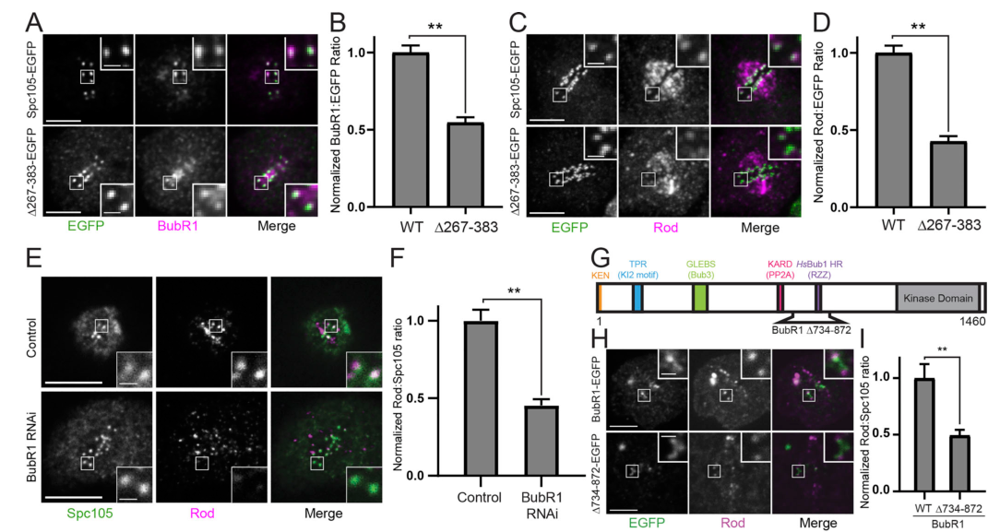

## Question

# Gene Research for Functional Annotation

## ⚠️ CRITICAL: Gene/Protein Identification Context

**BEFORE YOU BEGIN RESEARCH:** You MUST verify you are researching the CORRECT gene/protein. Gene symbols can be ambiguous, especially for less well-characterized genes from non-model organisms.

### Target Gene/Protein Identity (from UniProt):
- **UniProt Accession:** Q9V9W7
- **Protein Description:** SubName: Full=Rough deal {ECO:0000313|EMBL:AAF57162.2};
- **Gene Information:** Name=rod {ECO:0000313|EMBL:AAF57162.2, ECO:0000313|FlyBase:FBgn0003268}; Synonyms=Dmel\CG1569 {ECO:0000313|EMBL:AAF57162.2}, EP3408 {ECO:0000313|EMBL:AAF57162.2}, pNB20A {ECO:0000313|EMBL:AAF57162.2}, ROD {ECO:0000313|EMBL:AAF57162.2}, Rod {ECO:0000313|EMBL:AAF57162.2}, Rod1 {ECO:0000313|EMBL:AAF57162.2}; ORFNames=CG1569 {ECO:0000313|EMBL:AAF57162.2, ECO:0000313|FlyBase:FBgn0003268}, Dmel_CG1569 {ECO:0000313|EMBL:AAF57162.2};
- **Organism (full):** Drosophila melanogaster (Fruit fly).
- **Protein Family:** Not specified in UniProt
- **Key Domains:** ARM_KNTC1_1st. (IPR055403); ARM_KNTC1_2nd. (IPR055404); KNTC1. (IPR052802); KNTC1_N. (IPR055402); Rod_N. (IPR057303)

### MANDATORY VERIFICATION STEPS:

1. **Check if the gene symbol "rod" matches the protein description above**
2. **Verify the organism is correct:** Drosophila melanogaster (Fruit fly).
3. **Check if protein family/domains align with what you find in literature**
4. **If you find literature for a DIFFERENT gene with the same or similar symbol, STOP**

### If Gene Symbol is Ambiguous or You Cannot Find Relevant Literature:

**DO NOT PROCEED WITH RESEARCH ON A DIFFERENT GENE.** Instead:
- State clearly: "The gene symbol 'rod' is ambiguous or literature is limited for this specific protein"
- Explain what you found (e.g., "Found extensive literature on a different gene with the same symbol in a different organism")
- Describe the protein based ONLY on the UniProt information provided above
- Suggest that the protein function can be inferred from domain/family information

### Research Target:

Please provide a comprehensive research report on the gene **rod** (gene ID: rod, UniProt: Q9V9W7) in DROME.

The research report should be a detailed narrative explaining the function, biological processes, and localization of the gene product. Citations should be given for all claims.

You should prioritize authoritative reviews and primary scientific literature when conducting research. You can supplement
this with annotations you find in gene/protein databases, but these can be outdated or inaccurate.

We are specifically interested in the primary function of the gene - for enzymes, what reaction is catalyzed, and what is the substrate specificity? For transporters, what is the substrate? For structural proteins or adapters, what is the broader structural role? For signaling molecules, what is the role in the pathway.

We are interested in where in or outside the cell the gene product carries out its function.

We are also interested in the signaling or biochemical pathways in which the gene functions. We are less interested in broad pleiotropic effects, except where these elucidate the precise role.

Include evidence where possible. We are interested in both experimental evidence as well as inference from structure, evolution, or bioinformatic analysis. Precise studies should be prioritized over high-throughput, where available.

## Output

Question: You are an expert researcher providing comprehensive, well-cited information.

Provide detailed information focusing on:
1. Key concepts and definitions with current understanding
2. Recent developments and latest research (prioritize 2023-2024 sources)
3. Current applications and real-world implementations
4. Expert opinions and analysis from authoritative sources
5. Relevant statistics and data from recent studies

Format as a comprehensive research report with proper citations. Include URLs and publication dates where available.
Always prioritize recent, authoritative sources and provide specific citations for all major claims.

# Gene Research for Functional Annotation

## ⚠️ CRITICAL: Gene/Protein Identification Context

**BEFORE YOU BEGIN RESEARCH:** You MUST verify you are researching the CORRECT gene/protein. Gene symbols can be ambiguous, especially for less well-characterized genes from non-model organisms.

### Target Gene/Protein Identity (from UniProt):
- **UniProt Accession:** Q9V9W7
- **Protein Description:** SubName: Full=Rough deal {ECO:0000313|EMBL:AAF57162.2};
- **Gene Information:** Name=rod {ECO:0000313|EMBL:AAF57162.2, ECO:0000313|FlyBase:FBgn0003268}; Synonyms=Dmel\CG1569 {ECO:0000313|EMBL:AAF57162.2}, EP3408 {ECO:0000313|EMBL:AAF57162.2}, pNB20A {ECO:0000313|EMBL:AAF57162.2}, ROD {ECO:0000313|EMBL:AAF57162.2}, Rod {ECO:0000313|EMBL:AAF57162.2}, Rod1 {ECO:0000313|EMBL:AAF57162.2}; ORFNames=CG1569 {ECO:0000313|EMBL:AAF57162.2, ECO:0000313|FlyBase:FBgn0003268}, Dmel_CG1569 {ECO:0000313|EMBL:AAF57162.2};
- **Organism (full):** Drosophila melanogaster (Fruit fly).
- **Protein Family:** Not specified in UniProt
- **Key Domains:** ARM_KNTC1_1st. (IPR055403); ARM_KNTC1_2nd. (IPR055404); KNTC1. (IPR052802); KNTC1_N. (IPR055402); Rod_N. (IPR057303)

### MANDATORY VERIFICATION STEPS:

1. **Check if the gene symbol "rod" matches the protein description above**
2. **Verify the organism is correct:** Drosophila melanogaster (Fruit fly).
3. **Check if protein family/domains align with what you find in literature**
4. **If you find literature for a DIFFERENT gene with the same or similar symbol, STOP**

### If Gene Symbol is Ambiguous or You Cannot Find Relevant Literature:

**DO NOT PROCEED WITH RESEARCH ON A DIFFERENT GENE.** Instead:
- State clearly: "The gene symbol 'rod' is ambiguous or literature is limited for this specific protein"
- Explain what you found (e.g., "Found extensive literature on a different gene with the same symbol in a different organism")
- Describe the protein based ONLY on the UniProt information provided above
- Suggest that the protein function can be inferred from domain/family information

### Research Target:

Please provide a comprehensive research report on the gene **rod** (gene ID: rod, UniProt: Q9V9W7) in DROME.

The research report should be a detailed narrative explaining the function, biological processes, and localization of the gene product. Citations should be given for all claims.

You should prioritize authoritative reviews and primary scientific literature when conducting research. You can supplement
this with annotations you find in gene/protein databases, but these can be outdated or inaccurate.

We are specifically interested in the primary function of the gene - for enzymes, what reaction is catalyzed, and what is the substrate specificity? For transporters, what is the substrate? For structural proteins or adapters, what is the broader structural role? For signaling molecules, what is the role in the pathway.

We are interested in where in or outside the cell the gene product carries out its function.

We are also interested in the signaling or biochemical pathways in which the gene functions. We are less interested in broad pleiotropic effects, except where these elucidate the precise role.

Include evidence where possible. We are interested in both experimental evidence as well as inference from structure, evolution, or bioinformatic analysis. Precise studies should be prioritized over high-throughput, where available.

# Functional annotation report: *Drosophila melanogaster rod* (Rough deal; Q9V9W7)

## Identity and principal function

The target is **fruit-fly Rough deal (Rod)**, encoded by *rod* (CG1569; FlyBase FBgn0003268), not an unrelated gene sharing the symbol. The supplied UniProt accession Q9V9W7 identifies this protein; independent experiments on *D. melanogaster rod* identify Rod as the large structural subunit of the **Rod–Zw10–Zwilch (RZZ) complex**. RZZ acts at the outer kinetochore to organize its fibrous corona, recruit checkpoint and motor-associated proteins, and coordinate chromosome–spindle interactions. Rod is therefore best annotated as a **kinetochore scaffold/adaptor**, not an enzyme, transporter, or motor: no catalytic reaction or transported substrate is established for Rod. (menant2020mutationsinthe pages 5-8, menant2020mutationsinthe pages 1-5)

The supplied KNTC1, ARM_KNTC1 and Rod_N domain annotations are consistent with this identification. Published structural interpretation describes an approximately 240-kDa Rod subunit with an N-terminal β-propeller and extended α-solenoid, including a conserved C-terminal Rod_C region. The individual InterPro accession assignments in the question are database annotations; the experimental papers do not themselves validate every assigned domain boundary. RZZ migrates at approximately **700–800 kDa** in fly extracts, consistent with a proposed assembly containing two copies each of Rod, Zw10 and Zwilch; native-gel mass alone does not establish exact stoichiometry. (menant2020mutationsinthe pages 5-8, menant2020mutationsinthe pages 1-5)

## Where Rod acts and how it works

**Localization is cell-cycle dependent.** Fluorescent Rod is broadly cytoplasmic in interphase fly neuroblasts. During mitosis it becomes enriched at kinetochores—particularly unattached kinetochores and their outer fibrous corona—and is also detected along spindle microtubules as coronal material moves toward spindle poles. Fluorescent Rod and Zw10 arrive at and leave kinetochores together. Loss of *rod* prevents normal mitotic-apparatus localization of Zw10 without abolishing Zw10’s interphase Golgi localization; loss of *zw10* greatly diminishes Rod abundance and kinetochore recruitment. Thus the relevant functional location for **Rod**, rather than for every protein associated with it, is primarily the mitotic kinetochore/corona and its spindle-associated transport route. (menant2020mutationsinthe pages 5-8, menant2020mutationsinthe pages 19-23, menant2020mutationsinthe pages 1-5)

**Complex assembly and checkpoint signaling.** Co-immunoprecipitation from fly larval brains shows that Rod is required for robust association of Zw10 with Zwilch. At an unattached kinetochore, Rod-containing RZZ helps accumulate **Mad1–Mad2**, allowing spindle-assembly-checkpoint signaling that delays anaphase while spindle attachment remains inadequate. In the established checkpoint pathway, kinetochore-associated Mad1–Mad2 promotes formation of the Mad2–BubR1–Bub3–Cdc20 mitotic checkpoint complex, which inhibits APC/C; this downstream biochemical sequence is a checkpoint-pathway description, **not** evidence that Rod directly catalyzes checkpoint-complex assembly. Consistent with Rod’s role, fly *rod* mutants display chromosome-segregation defects, and functional studies identify RZZ as necessary for normal checkpoint responses. (menant2020mutationsinthe pages 5-8, menant2020mutationsinthe pages 1-5, fischer2023kinetochorecatalyzedmccformation pages 1-3)

**Dynein recruitment and signal removal.** Classical fly genetics showed that *rough deal* mutant cells lose kinetochore localization of both Zw10 and dynein. Later RNAi experiments in fly S2 cells showed that **Spindly** is specifically needed to load dynein at kinetochores: without Spindly, kinetochore Mad2 and RZZ persist and cells arrest in metaphase. Thus Rod supplies part of the RZZ recruitment platform, whereas Spindly connects that platform functionally to the dynein–dynactin motor machinery. Dynein-dependent movement of Rod/RZZ and checkpoint factors away from attached kinetochores—often called *streaming* or *stripping*—contributes to checkpoint silencing. This does **not** establish that Rod itself is a motor or directly binds dynein. (menant2020mutationsinthe pages 8-12, griffis2007spindlyanovel pages 1-2, starr1998zw10helpsrecruit pages 1-2)

## What recent work adds

A **2024 primary study in fly S2 cells** identified a route that retains a *core* RZZ pool even at bioriented kinetochores. Deleting residues **267–383** of the outer-kinetochore protein Spc105 reduced kinetochore BubR1 by approximately **45%** and Rod by approximately **60%**; BubR1 depletion also reduced Rod. Optogenetic oligomerization and replacement with self-associating protein regions supported a role for multivalent Spc105 assembly in recruiting this pool and maintaining segregation fidelity. Spc105–BubR1-mediated recruitment of Rod is well supported, but the proposed physical bridge to Rod and a continuously operating attachment-regulatory mechanism remain models, not demonstrated direct Spc105–Rod binding. The paper’s Figure 3 shows the Spc105-deletion and BubR1-depletion effects on Rod recruitment. (mcgory2024multimerizationofa pages 3-4, mcgory2024multimerizationofa pages 5-6, mcgory2024multimerizationofa pages 4-5, mcgory2024multimerizationofa media f47b5db7)

Fly **Rod_C mutagenesis** provides unusually precise evidence about Rod itself. Variants M5 and M6 assembled with Zw10 and Zwilch yet recruited poorly to kinetochores, separating **RZZ formation** from **RZZ targeting**. The C2011A/P2012A variant M15 supported fertile *rod*-null adults at **18 °C**, but at **29 °C** fewer than **5% of the expected** mutant adults survived; its kinetochore recruitment, rather than its association with Zw10 and Zwilch, became temperature sensitive. Other Rod_C variants impaired RZZ streaming even when dynein remained detectable at kinetochores. These results implicate Rod_C in kinetochore recruitment and transport-related function, without identifying a definitive direct-binding partner for that region. [Menant and Karess, *Biology of the Cell*, published July 2020; https://doi.org/10.1111/boc.201900105.] (menant2020mutationsinthe pages 8-12, menant2020mutationsinthe pages 12-15)

A **2023 human-cell** study provides complementary, explicitly cross-species context: RZZ–Spindly forms a polymeric corona platform whose interactions with CENP-E and dynein–dynactin coordinate motor loading; MPS1-dependent regulation contributes to corona assembly. Its HeLa-cell and recombinant-protein results should **not** be presented as a demonstrated CENP-E interaction or identical regulatory dependency for fly Rod Q9V9W7. [Cmentowski and colleagues, *The EMBO Journal*, published online **20 November 2023**; https://doi.org/10.15252/embj.2023114838.] (cmentowski2023rzz‐spindlyandcenp‐e pages 1-3)

**Meiosis requires an important qualification to the mitotic model.** In fly oocytes, subsequent direct work found that Rod and MPS1 support **homolog biorientation**, while the normal metaphase-I arrest was largely independent of spindle-checkpoint genes. An SPC105R region spanning approximately residues **123–473** was important for Rod localization and biorientation. Rod still streamed when end-on attachments were disrupted, and forcing RZZ to remain at kinetochores did not prevent end-on attachment: approximately **60%** of attachments remained end-on. Spindly depletion changed the *direction* of oocyte Rod streaming rather than abolishing it. Hence it would be inaccurate to claim universally that RZZ must stream away before end-on attachments can form; the relationship depends on whether mitosis or female meiosis is being examined. [Shapiro and colleagues, *PLOS Genetics*, published **29 January 2025**; https://doi.org/10.1371/journal.pgen.1011400.] (shapiro2025distinctcheckpointand pages 18-19, shapiro2025distinctcheckpointand pages 12-14, shapiro2025distinctcheckpointand pages 9-12, shapiro2025distinctcheckpointand pages 1-2)

The following evidence summary separates direct fruit-fly experiments from the human-cell comparison:

| Paper/year and DOI URL | Experimental system | Precise functional finding | Evidence / limitation |
|---|---|---|---|
| Starr et al., 1998 — [10.1083/jcb.142.3.763](https://doi.org/10.1083/jcb.142.3.763) | *Drosophila melanogaster* meiotic and mitotic cells; **rod** and **zw10** mutants | Dynein failed to localize to kinetochores in **zw10** mutants; both ZW10 and dynein lost kinetochore localization in **rough deal** mutants. A ZW10–dynamitin/p50 yeast two-hybrid interaction implicated dynactin in dynein recruitment. (starr1998zw10helpsrecruit pages 1-2) | Direct fly genetic and localization evidence establishes Rod upstream of kinetochore ZW10/dynein localization. The proposed recruitment mechanism was not a purified Rod–dynein interaction. |
| Griffis et al., 2007 — [10.1083/jcb.200702062](https://doi.org/10.1083/jcb.200702062) | *D. melanogaster* S2 cells; RNAi and live-cell localization | Spindly accumulated at unattached kinetochores. Its depletion selectively prevented kinetochore dynein recruitment and caused metaphase arrest with persistent kinetochore Mad2 and RZZ, supporting RZZ–Spindly-dependent dynein loading and checkpoint silencing. (griffis2007spindlyanovel pages 1-2) | Direct fly-cell evidence; establishes Rod-containing RZZ as part of the adaptor pathway rather than showing that Rod itself binds dynein directly. |
| Menant & Karess, 2020 — [10.1111/boc.201900105](https://doi.org/10.1111/boc.201900105) | *D. melanogaster* third-instar larval brains and live neuroblasts; co-IP, BN-PAGE, mutagenesis and rescue | Rod, Zw10 and Zwilch co-migrated in an approximately **700–800-kDa** RZZ assembly, consistent with a dimer containing two copies of each subunit. Rod was required for Zw10–Zwilch association and mitotic-apparatus recruitment. (menant2020mutationsinthe pages 5-8, menant2020mutationsinthe pages 1-5) | Direct biochemical and in-vivo fly evidence. Apparent native mass supports—but does not alone prove—the proposed 2:2:2 stoichiometry. |
| Menant & Karess, 2020 — [10.1111/boc.201900105](https://doi.org/10.1111/boc.201900105) | Transgenic fly Rod_C variants in a **rod-null** background | RodM15 (**C2011A/P2012A**) rescued null flies at 18°C, whereas at 29°C fewer than **5% of expected** homozygous adults survived. Kinetochore recruitment became strongly thermolabile, although association with Zw10 and Zwilch remained intact. (menant2020mutationsinthe pages 8-12) | Separation-of-function evidence assigns the conserved Rod_C region to kinetochore recruitment or higher-order assembly rather than basal RZZ-complex formation. |
| McGory et al., 2024 — [10.1083/jcb.202211122](https://doi.org/10.1083/jcb.202211122) | *D. melanogaster* S2 cells; Spc105 deletions/chimeras, optogenetic oligomerization and RNAi | Deleting Spc105 residues **267–383** reduced kinetochore BubR1 by approximately **45%** and Rod by approximately **60%**. BubR1 depletion produced a comparable Rod decrease; a self-associating IDR plus KI motifs restored recruitment, supporting a multivalent Spc105–BubR1 route to a persistent core RZZ pool. (mcgory2024multimerizationofa pages 5-6, mcgory2024multimerizationofa pages 4-5, mcgory2024multimerizationofa media f47b5db7) | Direct fly-cell evidence at bioriented kinetochores. The proposed molecular bridge and continuous attachment-regulatory role remain mechanistic models; the experiments do not demonstrate direct Spc105–Rod binding. |
| Cmentowski et al., 2023 — [10.15252/embj.2023114838](https://doi.org/10.15252/embj.2023114838) | **Human HeLa cells and recombinant human proteins—not Drosophila** | Human RZZ–Spindly and CENP-E formed an integrated corona platform: CENP-E retained RZZS when MPS1-driven polymerization was blocked and was required for physiological dynein–dynactin accumulation. (cmentowski2023rzz‐spindlyandcenp‐e pages 1-3) | Strong metazoan mechanistic context, but it must not be treated as direct evidence for Q9V9W7 or for an identical CENP-E dependency in flies. |
| Shapiro et al., 2025 — [10.1371/journal.pgen.1011400](https://doi.org/10.1371/journal.pgen.1011400) | *D. melanogaster* stage-14 oocytes; RNAi, SPC105R mutants/fusions, imaging and attachment assays | ROD and MPS1 promoted homolog biorientation independently of canonical meiotic SAC arrest. SPC105R residues **123–473** were required for ROD targeting. ROD streaming persisted without end-on attachments; even when RZZ was forcibly retained with Zw10–SPC105R, approximately **60%** of attachments remained end-on. (shapiro2025distinctcheckpointand pages 18-19, shapiro2025distinctcheckpointand pages 12-14, shapiro2025distinctcheckpointand pages 1-2) | Direct fly-oocyte evidence revises the simple model that streaming permits end-on attachment. Meiotic behavior is context-specific and should not automatically replace the established mitotic checkpoint-silencing model. |

*Table: Key experiments defining Drosophila Rough deal/Rod function, assembly, localization and dynein-related activities, with quantitative findings and species-specific limitations. Human RZZS–CENP-E evidence is explicitly separated from direct fly evidence.*

## Functional-annotation conclusion and use

**Recommended primary annotation:** Rod is the scaffold subunit of the *D. melanogaster* RZZ outer-kinetochore/corona complex. Its principal activities are supporting RZZ assembly and kinetochore localization, promoting Mad1–Mad2-associated spindle-checkpoint signaling and kinetochore recruitment of the Spindly–dynein machinery, and contributing to accurate chromosome–microtubule attachment and segregation. Its principal operating site is the **cytoplasmic face of kinetochores during cell division**, with dynamic redistribution along spindle microtubules; oocyte experiments establish an additional, context-dependent role in homolog biorientation. These experimentally tractable functions make fluorescent Rod localization, *rod* mutants, and Rod_C separation-of-function alleles useful research readouts for kinetochore recruitment, checkpoint silencing and chromosome-segregation fidelity; they do not imply an established therapeutic application of fly Rod itself. (menant2020mutationsinthe pages 5-8, menant2020mutationsinthe pages 8-12, shapiro2025distinctcheckpointand pages 12-14, mcgory2024multimerizationofa pages 3-4, griffis2007spindlyanovel pages 1-2)

**Key primary-source links:** Starr and colleagues, *Journal of Cell Biology*, **August 1998**, https://doi.org/10.1083/jcb.142.3.763; Griffis and colleagues, *Journal of Cell Biology*, **June 2007**, https://doi.org/10.1083/jcb.200702062; Menant and Karess, **July 2020**, https://doi.org/10.1111/boc.201900105; McGory and colleagues, *Journal of Cell Biology*, **January 2024**, https://doi.org/10.1083/jcb.202211122; and Shapiro and colleagues, **29 January 2025**, https://doi.org/10.1371/journal.pgen.1011400. (menant2020mutationsinthe pages 8-12, shapiro2025distinctcheckpointand pages 1-2, mcgory2024multimerizationofa pages 5-6, griffis2007spindlyanovel pages 1-2, starr1998zw10helpsrecruit pages 1-2)

References

1. (menant2020mutationsinthe pages 5-8): Alexandra Menant and Roger E. Karess. Mutations in the <i>drosophila rough deal</i> gene affecting rzz kinetochore function. Biology of the Cell, 112:300-315, Jul 2020. URL: https://doi.org/10.1111/boc.201900105, doi:10.1111/boc.201900105. This article has 5 citations and is from a peer-reviewed journal.

2. (menant2020mutationsinthe pages 1-5): Alexandra Menant and Roger E. Karess. Mutations in the <i>drosophila rough deal</i> gene affecting rzz kinetochore function. Biology of the Cell, 112:300-315, Jul 2020. URL: https://doi.org/10.1111/boc.201900105, doi:10.1111/boc.201900105. This article has 5 citations and is from a peer-reviewed journal.

3. (menant2020mutationsinthe pages 19-23): Alexandra Menant and Roger E. Karess. Mutations in the <i>drosophila rough deal</i> gene affecting rzz kinetochore function. Biology of the Cell, 112:300-315, Jul 2020. URL: https://doi.org/10.1111/boc.201900105, doi:10.1111/boc.201900105. This article has 5 citations and is from a peer-reviewed journal.

4. (fischer2023kinetochorecatalyzedmccformation pages 1-3): Elyse S. Fischer. Kinetochore-catalyzed mcc formation: a structural perspective. IUBMB life, 75:289-310, Dec 2023. URL: https://doi.org/10.1002/iub.2697, doi:10.1002/iub.2697. This article has 28 citations and is from a peer-reviewed journal.

5. (menant2020mutationsinthe pages 8-12): Alexandra Menant and Roger E. Karess. Mutations in the <i>drosophila rough deal</i> gene affecting rzz kinetochore function. Biology of the Cell, 112:300-315, Jul 2020. URL: https://doi.org/10.1111/boc.201900105, doi:10.1111/boc.201900105. This article has 5 citations and is from a peer-reviewed journal.

6. (griffis2007spindlyanovel pages 1-2): Eric R. Griffis, Nico Stuurman, and Ronald D. Vale. Spindly, a novel protein essential for silencing the spindle assembly checkpoint, recruits dynein to the kinetochore. The Journal of Cell Biology, 177:1005-1015, Jun 2007. URL: https://doi.org/10.1083/jcb.200702062, doi:10.1083/jcb.200702062. This article has 308 citations.

7. (starr1998zw10helpsrecruit pages 1-2): Daniel A. Starr, Byron C. Williams, Thomas S. Hays, and Michael L. Goldberg. Zw10 helps recruit dynactin and dynein to the kinetochore. The Journal of Cell Biology, 142:763-774, Aug 1998. URL: https://doi.org/10.1083/jcb.142.3.763, doi:10.1083/jcb.142.3.763. This article has 352 citations.

8. (mcgory2024multimerizationofa pages 3-4): Jessica M. McGory, Vikash Verma, Dylan M. Barcelos, and Thomas J. Maresca. Multimerization of a disordered kinetochore protein promotes accurate chromosome segregation by localizing a core dynein module. The Journal of Cell Biology, Jan 2024. URL: https://doi.org/10.1083/jcb.202211122, doi:10.1083/jcb.202211122. This article has 4 citations.

9. (mcgory2024multimerizationofa pages 5-6): Jessica M. McGory, Vikash Verma, Dylan M. Barcelos, and Thomas J. Maresca. Multimerization of a disordered kinetochore protein promotes accurate chromosome segregation by localizing a core dynein module. The Journal of Cell Biology, Jan 2024. URL: https://doi.org/10.1083/jcb.202211122, doi:10.1083/jcb.202211122. This article has 4 citations.

10. (mcgory2024multimerizationofa pages 4-5): Jessica M. McGory, Vikash Verma, Dylan M. Barcelos, and Thomas J. Maresca. Multimerization of a disordered kinetochore protein promotes accurate chromosome segregation by localizing a core dynein module. The Journal of Cell Biology, Jan 2024. URL: https://doi.org/10.1083/jcb.202211122, doi:10.1083/jcb.202211122. This article has 4 citations.

11. (mcgory2024multimerizationofa media f47b5db7): Jessica M. McGory, Vikash Verma, Dylan M. Barcelos, and Thomas J. Maresca. Multimerization of a disordered kinetochore protein promotes accurate chromosome segregation by localizing a core dynein module. The Journal of Cell Biology, Jan 2024. URL: https://doi.org/10.1083/jcb.202211122, doi:10.1083/jcb.202211122. This article has 4 citations.

12. (menant2020mutationsinthe pages 12-15): Alexandra Menant and Roger E. Karess. Mutations in the <i>drosophila rough deal</i> gene affecting rzz kinetochore function. Biology of the Cell, 112:300-315, Jul 2020. URL: https://doi.org/10.1111/boc.201900105, doi:10.1111/boc.201900105. This article has 5 citations and is from a peer-reviewed journal.

13. (cmentowski2023rzz‐spindlyandcenp‐e pages 1-3): Verena Cmentowski, Giuseppe Ciossani, Ennio d'Amico, Sabine Wohlgemuth, Mikito Owa, Brian Dynlacht, and Andrea Musacchio. Rzz‐spindly and cenp‐e form an integrated platform to recruit dynein to the kinetochore corona. The EMBO Journal, Nov 2023. URL: https://doi.org/10.15252/embj.2023114838, doi:10.15252/embj.2023114838. This article has 30 citations.

14. (shapiro2025distinctcheckpointand pages 18-19): Joanatta G. Shapiro, Neha Changela, Janet K. Jang, Jay N. Joshi, and Kim S. McKim. Distinct checkpoint and homolog biorientation pathways regulate meiosis i in drosophila oocytes. PLOS Genetics, 21:e1011400, Jan 2025. URL: https://doi.org/10.1371/journal.pgen.1011400, doi:10.1371/journal.pgen.1011400. This article has 2 citations and is from a domain leading peer-reviewed journal.

15. (shapiro2025distinctcheckpointand pages 12-14): Joanatta G. Shapiro, Neha Changela, Janet K. Jang, Jay N. Joshi, and Kim S. McKim. Distinct checkpoint and homolog biorientation pathways regulate meiosis i in drosophila oocytes. PLOS Genetics, 21:e1011400, Jan 2025. URL: https://doi.org/10.1371/journal.pgen.1011400, doi:10.1371/journal.pgen.1011400. This article has 2 citations and is from a domain leading peer-reviewed journal.

16. (shapiro2025distinctcheckpointand pages 9-12): Joanatta G. Shapiro, Neha Changela, Janet K. Jang, Jay N. Joshi, and Kim S. McKim. Distinct checkpoint and homolog biorientation pathways regulate meiosis i in drosophila oocytes. PLOS Genetics, 21:e1011400, Jan 2025. URL: https://doi.org/10.1371/journal.pgen.1011400, doi:10.1371/journal.pgen.1011400. This article has 2 citations and is from a domain leading peer-reviewed journal.

17. (shapiro2025distinctcheckpointand pages 1-2): Joanatta G. Shapiro, Neha Changela, Janet K. Jang, Jay N. Joshi, and Kim S. McKim. Distinct checkpoint and homolog biorientation pathways regulate meiosis i in drosophila oocytes. PLOS Genetics, 21:e1011400, Jan 2025. URL: https://doi.org/10.1371/journal.pgen.1011400, doi:10.1371/journal.pgen.1011400. This article has 2 citations and is from a domain leading peer-reviewed journal.

## Artifacts

- [Edison artifact artifact-00](rod-deep-research-falcon_artifacts/artifact-00.md)

## Citations

1. griffis2007spindlyanovel pages 1-2
2. menant2020mutationsinthe pages 8-12
3. menant2020mutationsinthe pages 5-8
4. menant2020mutationsinthe pages 1-5
5. menant2020mutationsinthe pages 19-23
6. fischer2023kinetochorecatalyzedmccformation pages 1-3
7. mcgory2024multimerizationofa pages 3-4
8. mcgory2024multimerizationofa pages 5-6
9. mcgory2024multimerizationofa pages 4-5
10. menant2020mutationsinthe pages 12-15
11. shapiro2025distinctcheckpointand pages 18-19
12. shapiro2025distinctcheckpointand pages 12-14
13. shapiro2025distinctcheckpointand pages 9-12
14. shapiro2025distinctcheckpointand pages 1-2
15. Menant and Karess, *Biology of the Cell*, published July 2020; https://doi.org/10.1111/boc.201900105.
16. Cmentowski and colleagues, *The EMBO Journal*, published online **20 November 2023**; https://doi.org/10.15252/embj.2023114838.
17. Shapiro and colleagues, *PLOS Genetics*, published **29 January 2025**; https://doi.org/10.1371/journal.pgen.1011400.
18. 10.1083/jcb.142.3.763
19. 10.1083/jcb.200702062
20. 10.1111/boc.201900105
21. 10.1083/jcb.202211122
22. 10.15252/embj.2023114838
23. 10.1371/journal.pgen.1011400
24. https://doi.org/10.1111/boc.201900105.]
25. https://doi.org/10.15252/embj.2023114838.]
26. https://doi.org/10.1371/journal.pgen.1011400.]
27. https://doi.org/10.1083/jcb.142.3.763
28. https://doi.org/10.1083/jcb.200702062
29. https://doi.org/10.1111/boc.201900105
30. https://doi.org/10.1083/jcb.202211122
31. https://doi.org/10.15252/embj.2023114838
32. https://doi.org/10.1371/journal.pgen.1011400
33. https://doi.org/10.1083/jcb.142.3.763;
34. https://doi.org/10.1083/jcb.200702062;
35. https://doi.org/10.1111/boc.201900105;
36. https://doi.org/10.1083/jcb.202211122;
37. https://doi.org/10.1371/journal.pgen.1011400.
38. https://doi.org/10.1111/boc.201900105,
39. https://doi.org/10.1002/iub.2697,
40. https://doi.org/10.1083/jcb.200702062,
41. https://doi.org/10.1083/jcb.142.3.763,
42. https://doi.org/10.1083/jcb.202211122,
43. https://doi.org/10.15252/embj.2023114838,
44. https://doi.org/10.1371/journal.pgen.1011400,