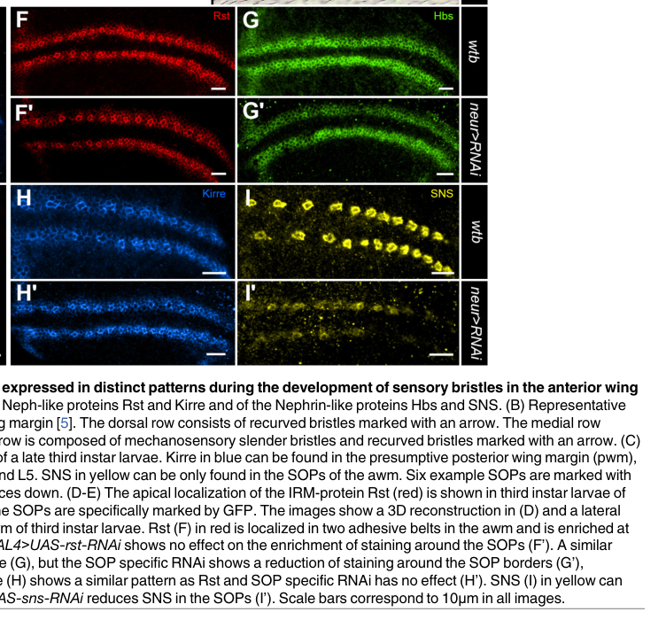

## Question

# Gene Research for Functional Annotation

## ⚠️ CRITICAL: Gene/Protein Identification Context

**BEFORE YOU BEGIN RESEARCH:** You MUST verify you are researching the CORRECT gene/protein. Gene symbols can be ambiguous, especially for less well-characterized genes from non-model organisms.

### Target Gene/Protein Identity (from UniProt):
- **UniProt Accession:** Q08180
- **Protein Description:** RecName: Full=Irregular chiasm C-roughest protein; Short=Protein IRREC; Flags: Precursor;
- **Gene Information:** Name=rst; ORFNames=CG4125;
- **Organism (full):** Drosophila melanogaster (Fruit fly).
- **Protein Family:** Not specified in UniProt
- **Key Domains:** CD80_C2-set. (IPR013162); Cell_adhesion_signaling. (IPR051275); Ig-like_dom. (IPR007110); Ig-like_dom_sf. (IPR036179); Ig-like_fold. (IPR013783)

### MANDATORY VERIFICATION STEPS:

1. **Check if the gene symbol "rst" matches the protein description above**
2. **Verify the organism is correct:** Drosophila melanogaster (Fruit fly).
3. **Check if protein family/domains align with what you find in literature**
4. **If you find literature for a DIFFERENT gene with the same or similar symbol, STOP**

### If Gene Symbol is Ambiguous or You Cannot Find Relevant Literature:

**DO NOT PROCEED WITH RESEARCH ON A DIFFERENT GENE.** Instead:
- State clearly: "The gene symbol 'rst' is ambiguous or literature is limited for this specific protein"
- Explain what you found (e.g., "Found extensive literature on a different gene with the same symbol in a different organism")
- Describe the protein based ONLY on the UniProt information provided above
- Suggest that the protein function can be inferred from domain/family information

### Research Target:

Please provide a comprehensive research report on the gene **rst** (gene ID: rst, UniProt: Q08180) in DROME.

The research report should be a detailed narrative explaining the function, biological processes, and localization of the gene product. Citations should be given for all claims.

You should prioritize authoritative reviews and primary scientific literature when conducting research. You can supplement
this with annotations you find in gene/protein databases, but these can be outdated or inaccurate.

We are specifically interested in the primary function of the gene - for enzymes, what reaction is catalyzed, and what is the substrate specificity? For transporters, what is the substrate? For structural proteins or adapters, what is the broader structural role? For signaling molecules, what is the role in the pathway.

We are interested in where in or outside the cell the gene product carries out its function.

We are also interested in the signaling or biochemical pathways in which the gene functions. We are less interested in broad pleiotropic effects, except where these elucidate the precise role.

Include evidence where possible. We are interested in both experimental evidence as well as inference from structure, evolution, or bioinformatic analysis. Precise studies should be prioritized over high-throughput, where available.

## Output

Question: You are an expert researcher providing comprehensive, well-cited information.

Provide detailed information focusing on:
1. Key concepts and definitions with current understanding
2. Recent developments and latest research (prioritize 2023-2024 sources)
3. Current applications and real-world implementations
4. Expert opinions and analysis from authoritative sources
5. Relevant statistics and data from recent studies

Format as a comprehensive research report with proper citations. Include URLs and publication dates where available.
Always prioritize recent, authoritative sources and provide specific citations for all major claims.

# Gene Research for Functional Annotation

## ⚠️ CRITICAL: Gene/Protein Identification Context

**BEFORE YOU BEGIN RESEARCH:** You MUST verify you are researching the CORRECT gene/protein. Gene symbols can be ambiguous, especially for less well-characterized genes from non-model organisms.

### Target Gene/Protein Identity (from UniProt):
- **UniProt Accession:** Q08180
- **Protein Description:** RecName: Full=Irregular chiasm C-roughest protein; Short=Protein IRREC; Flags: Precursor;
- **Gene Information:** Name=rst; ORFNames=CG4125;
- **Organism (full):** Drosophila melanogaster (Fruit fly).
- **Protein Family:** Not specified in UniProt
- **Key Domains:** CD80_C2-set. (IPR013162); Cell_adhesion_signaling. (IPR051275); Ig-like_dom. (IPR007110); Ig-like_dom_sf. (IPR036179); Ig-like_fold. (IPR013783)

### MANDATORY VERIFICATION STEPS:

1. **Check if the gene symbol "rst" matches the protein description above**
2. **Verify the organism is correct:** Drosophila melanogaster (Fruit fly).
3. **Check if protein family/domains align with what you find in literature**
4. **If you find literature for a DIFFERENT gene with the same or similar symbol, STOP**

### If Gene Symbol is Ambiguous or You Cannot Find Relevant Literature:

**DO NOT PROCEED WITH RESEARCH ON A DIFFERENT GENE.** Instead:
- State clearly: "The gene symbol 'rst' is ambiguous or literature is limited for this specific protein"
- Explain what you found (e.g., "Found extensive literature on a different gene with the same symbol in a different organism")
- Describe the protein based ONLY on the UniProt information provided above
- Suggest that the protein function can be inferred from domain/family information

### Research Target:

Please provide a comprehensive research report on the gene **rst** (gene ID: rst, UniProt: Q08180) in DROME.

The research report should be a detailed narrative explaining the function, biological processes, and localization of the gene product. Citations should be given for all claims.

You should prioritize authoritative reviews and primary scientific literature when conducting research. You can supplement
this with annotations you find in gene/protein databases, but these can be outdated or inaccurate.

We are specifically interested in the primary function of the gene - for enzymes, what reaction is catalyzed, and what is the substrate specificity? For transporters, what is the substrate? For structural proteins or adapters, what is the broader structural role? For signaling molecules, what is the role in the pathway.

We are interested in where in or outside the cell the gene product carries out its function.

We are also interested in the signaling or biochemical pathways in which the gene functions. We are less interested in broad pleiotropic effects, except where these elucidate the precise role.

Include evidence where possible. We are interested in both experimental evidence as well as inference from structure, evolution, or bioinformatic analysis. Precise studies should be prioritized over high-throughput, where available.

# Functional annotation of *rst* (Roughest/IrreC) in *Drosophila melanogaster*

## Identity and principal function

The supplied UniProt record identifies **Q08180** as the product of *rst* (CG4125), named irregular chiasm C–roughest protein. Independent literature confirms that fly *roughest* and *irregular chiasm C* designate the same locus and that its product, **Rst/IrreC**, is an immunoglobulin-superfamily cell-adhesion protein. This matches the Ig-like domains in the supplied annotation; it is **not** the distinct fly paralog Kirre/Dumbfounded or another organism’s similarly named gene. The publications examined establish the name, organism and protein class, although they do not independently print the Q08180–CG4125 accession mapping. (fischbach2009theirrecell pages 2-4, cortes2023structureandevolution pages 13-15)

**Primary annotation:** Rst is a **single-pass cell-surface recognition and adhesion receptor**. Its principal role is to establish selective contacts between neighboring cells, thereby organizing epithelial cell sorting and patterning, myoblast recognition, and visual-system axon organization. It is not an enzyme or transporter: the relevant molecular specificity is for **other cell-surface adhesion proteins**, principally Hibris (Hbs) and Sticks and stones (Sns). Rst and Kirre are the shorter, Neph/Kirrel-like members of the fly *irre* cell-recognition module (IRM); Hbs and Sns belong to its longer, nephrin-like branch. (fischbach2009theirrecell pages 2-4, fischbach2009theirrecell pages 4-6, cortes2023structureandevolution pages 13-15)

Rst has **five extracellular Ig-like domains**, a membrane-spanning segment and a cytoplasmic tail. Its first two Ig domains were classified as relatively V-type-like and its inner three as C-type-like; structural studies place a principal recognition interface in the outermost Ig domain. The C-terminal tail can recruit a PDZ-domain adaptor. Thus, the extracellular part recognizes an adjacent cell, while the intracellular part can couple the contact to cellular organization. The 2023 evolutionary synthesis supports conservation of this Kirrel/nephrin architecture across bilaterian animals, but does not establish identical downstream signaling in every species. (fischbach2009theirrecell pages 2-4, fischbach2009theirrecell pages 4-6, cortes2023structureandevolution pages 13-15, ozkan2014extracellulararchitectureof pages 3-4)

## Where Rst acts and what it binds

**Functional location is primarily the plasma membrane at cell–cell interfaces**, not the extracellular space as a freely soluble protein. In the developing eye, Rst becomes enriched at contacts between interommatidial cells (IOCs) and primary pigment cells (PPCs). In larval wing epithelium, staining places it in **apical adhesive belts at adherens-junction-level contacts** surrounding sensory-organ precursors. Rst is also found in developing visual-system neurons and their projections; overexpressed Rst is preferentially transported to photoreceptor presynaptic terminals. These distributions depend strongly on tissue and developmental time. The wing study’s immunolocalization provides direct visual evidence for its apical, junction-associated distribution. (fischbach2009theirrecell pages 6-7, linneweber2015thecelladhesion pages 4-5, linneweber2015thecelladhesion media 4927cbd9, fischbach2009theirrecell pages 14-17)

Direct biochemical work with purified fly proteins shows that Rst forms **heterophilic extracellular complexes with Hbs and Sns**; related assays also detect Rst homophilic association. Measured dissociation constants for the tested fly heterocomplexes were approximately **1–4 µM**, whereas Rst–Rst binding was very weak in conventional surface-plasmon-resonance measurements and more readily detected in a multivalent assay. Crystal structures of the Rst outer Ig domains and interface mutagenesis identify a shared recognition surface: Rst Q59 or F65 substitution abolished detectable homophilic interaction in the assay, and mutations weakening homophilic binding also weakened heterophilic binding. Cell-surface clustering and partner availability, rather than strong isolated homophilic affinity, therefore matter for interpreting Rst adhesion *in vivo*. (ozkan2014extracellulararchitectureof pages 1-3, ozkan2014extracellulararchitectureof pages 3-4)

**The direction of interaction matters.** Across two neighboring cells, Rst–Hbs/Sns interactions stabilize an adhesive interface; placing normally complementary proteins in the **same** membrane can instead promote loss of junctional protein. Rst’s C-terminal PDZ-binding region has been reported to interact with the adaptor **X11Lα/Dmint1** in the retina. Proper DE-cadherin localization is required for Rst-associated eye sorting, but that requirement does **not** itself demonstrate direct Rst–DE-cadherin binding. Proposed Cindr/Arf6 and cytoskeletal links are plausible ways to couple adhesion to cell movement, but their full Rst-specific causal sequence is less established than extracellular recognition. (bao2014notchcontrolscell pages 4-6, bao2014notchcontrolscell pages 6-9, fischbach2009theirrecell pages 4-6, fischbach2009theirrecell pages 7-9, finegan2020neuronalimmunoglobulinsuperfamily pages 6-7)

## Established biological processes and pathways

### Pupal eye: differential adhesion and fate-associated patterning

The best-resolved endogenous role is **sorting IOCs against PPCs to form the regular ommatidial lattice**. During pupal development, Rst made by IOCs is retained preferentially at IOC–PPC contacts, where PPC-associated Hbs and Sns provide complementary binding partners. Junctional Rst progressively disappears from IOC–IOC borders. Incorrect timing, intracellular-tail truncation or ectopic expression disrupts IOC rearrangement and can produce fused ommatidia, excess or misplaced pigment cells, and a rough eye. These observations support a primary **cell-positioning/adhesion** role; subsequent differences in cell survival and apoptosis need not imply that Rst is itself a dedicated apoptosis receptor. (fischbach2009theirrecell pages 6-7, bao2014notchcontrolscell pages 6-9, machado2011rsttranscriptionalactivity pages 2-3, machado2011rsttranscriptionalactivity pages 6-8)

An experimentally supported upstream circuit is **cone-cell Delta → Notch activation in PPC precursors → increased *hbs/sns* and suppressed *rst/kirre* transcription in PPCs**. This helps generate complementary adhesion identities. In a 2014 study, activated Notch in an IOC reduced Rst staining at its PPC-facing border by **40%**. Ectopic Hbs in an IOC reduced membrane Rst by **62.7%**, whereas ectopic Rst in a PPC reduced membrane Hbs by **92.8%**, with increased intracellular vesicles. These are measurements of junctional protein abundance under experimental manipulation, **not binding constants**. Together with Rst enrichment across normal IOC–PPC contacts, they support stabilizing **trans** interactions and destabilizing **cis** interactions. Notch is an upstream regulator of *rst* expression; Rst is not shown here to be a Notch receptor. (bao2014notchcontrolscell pages 2-4, bao2014notchcontrolscell pages 4-6, bao2014notchcontrolscell pages 6-9)

Rst dosage and **Kirre compensation** are important qualifications. In one retinal study, RNAi reduced *rst* mRNA to **20–35%** of control at the sorting stage and increased *kirre* mRNA **five- to tenfold**; lowering *kirre* did not produce an equivalent reciprocal increase in *rst*. Thus, a weak phenotype after Rst depletion cannot be interpreted as evidence that Rst is dispensable. A 2020 review also discusses Rst in the context of Decapentaplegic/BMP signaling and junctional organization, but the differential-adhesion and Notch-regulation results provide the more direct molecular account of its retinal function. (machado2011rsttranscriptionalactivity pages 6-8, machado2011rsttranscriptionalactivity pages 2-3, finegan2020neuronalimmunoglobulinsuperfamily pages 5-6)

### Myoblast fusion: recognition at a fusogenic contact

Rst can substitute partly for Kirre in the recognition of **muscle founder cells and fusion-competent myoblasts**. Loss of either gene alone yields comparatively limited defects, whereas combined loss severely impairs fusion and leaves unfused myoblasts; IRM-mediated contacts initiate the specialized fusogenic interface. The two proteins should nevertheless not be treated as identical: the particularly well-characterized recruitment of **Antisocial/Rolling pebbles** and subsequent actin-remodeling machinery is established chiefly for **Kirre** and its partners, not as a complete Rst-specific signaling cascade. A 2024 *Current Biology* study showed that ecdysone signaling directly increases *antisocial* transcription during fusion and identifies Rst as a redundant founder-cell adhesion molecule in its biological context; it did **not** demonstrate that ecdysone directly regulates *rst*. (fischbach2009theirrecell pages 4-6, fischbach2009theirrecell pages 6-7, ruan2024interorgansteroidhormone pages 1-3)

### Visual-system wiring and sensory-organ spacing

Fly genetic and anatomical studies implicate Rst in **optic-chiasm formation and normal axonal projections**. Rst expression persists in subsets of optic-lobe columnar neurons and neuropil during target-selection stages, consistent with recognition between developing neural processes; the precise endogenous Rst-dependent synaptic partner and downstream pathway are less securely established than its axon-pathfinding requirement. The authoritative 2023 receptor-evolution review specifically distinguishes Rst/IrreC, first characterized in the optic chiasm, from Kirre/Dumbfounded, characterized in myoblast fusion. Structural rescue of nematode synapses with fly Rst interaction domains supports conservation of recognition chemistry, **not proof that the same synaptogenic mechanism operates through Rst in flies**. (fischbach2009theirrecell pages 14-17, cortes2023structureandevolution pages 13-15, ozkan2014extracellulararchitectureof pages 7-8)

At the **anterior wing margin**, Rst is concentrated on apical borders of cells surrounding sensory-organ precursors and contributes to their regular spacing. Individual *rst* or *kirre* perturbations caused relatively mild spacing effects in a 2015 study, whereas simultaneous knockdown caused precursor clusters or gaps and much stronger adult bristle-spacing defects; ectopic Rst redistributed other IRM proteins and strongly disturbed the pattern. This is a tissue-level implementation of selective, spatially restricted adhesion rather than evidence for a separate enzymatic activity. (linneweber2015thecelladhesion pages 4-5, linneweber2015thecelladhesion pages 7-9, linneweber2015thecelladhesion media 4927cbd9)

### Membrane turnover and a nephrocyte qualification

Rst is dynamically **endocytosed from the apical retinal membrane**. An antibody-chase experiment found that, after 3 h 45 min, wild-type retinal cells retained approximately **18%** as many labeled intracellular Rst puncta as after an earlier chase, whereas *Sac1*-deficient cells retained approximately **70%**; uptake still occurred, indicating delayed degradation rather than a simple failure of internalization. Membrane residence and endolysosomal turnover are therefore parts of its functional localization. (griffiths2020cellularhomeostasisin pages 7-8)

**Do not assign Kirre’s normal nephrocyte role to Rst.** Garland-cell nephrocytes normally express **Kirre, not IrreC/Rst**, at the Sns-associated filtration diaphragm. Artificial expression of Rst can produce clustering or excessive nephrocyte fusion, showing that Rst has related interaction capacity; it does **not** establish that Rst is a physiological component of that diaphragm. This distinction is especially important when transferring annotations from mammalian NEPH proteins or from fly Kirre. (helmstadter2012functionalstudyof pages 3-4)

The following summary distinguishes direct Rst evidence from paralog-based or cross-species inference.

| System / location | Rst-specific function and experimental evidence | Scope / caveat | Dated source and DOI URL |
|---|---|---|---|
| Purified ectodomains | Fly Rst and Duf/Kirre formed heterocomplexes with Sns and Hbs at measured **Kd ≈1–4 µM**. Rst D1–D2 crystallized as a near-orthogonal homodimer; homophilic binding was very weak by SPR, and interface mutations also impaired heterophilic binding. | Direct fly-protein biochemistry and structure. Functional effects of affinity and geometry on synaptogenesis were tested mainly with *C. elegans* SYG-1/SYG-2, so those in-vivo conclusions are comparative rather than direct Rst evidence. | Özkan et al., *Cell*, **2014-01-30**, [doi:10.1016/j.cell.2014.01.004](https://doi.org/10.1016/j.cell.2014.01.004) (ozkan2014extracellulararchitectureof pages 1-3, ozkan2014extracellulararchitectureof pages 3-4, ozkan2014extracellulararchitectureof pages 7-8) |
| Pupal retina: interommatidial-cell–primary-pigment-cell junctions | Rst on interommatidial cells forms preferential trans adhesion with Hbs/Sns on primary pigment cells. Activated Notch suppressed *rst* transcription and reduced junctional Rst by **40%**; ectopic Hbs in an Rst-expressing cell reduced membrane Rst by **62.7%**, while ectopic Rst in an Hbs-expressing cell reduced membrane Hbs by **92.8%**, supporting stabilizing trans interactions but destabilizing cis interactions and turnover. | Rst is part of a four-protein IRM code with Kirre, Hbs and Sns. Notch regulates the code upstream; it is not shown to signal through Rst directly. | Bao, *PLoS Genetics*, **2014-01**, [doi:10.1371/journal.pgen.1004087](https://doi.org/10.1371/journal.pgen.1004087) (bao2014notchcontrolscell pages 2-4, bao2014notchcontrolscell pages 4-6, bao2014notchcontrolscell pages 6-9) |
| Pupal retina: transcriptional compensation | Reducing *rst* mRNA to **20–35%** of parental levels at 24% after puparium formation increased *kirre* mRNA **5–10-fold**. Lowering Kirre did not reciprocally change *rst* significantly. Rst redistribution and transcriptional timing correlate with cell sorting, pigment-cell differentiation and elimination of surplus cells. | Supports asymmetric compensation and partial redundancy, not direct Rst–Kirre protein signaling. Apoptosis phenotypes may follow altered sorting and adhesion rather than an autonomous death signal from Rst. | Machado et al., *PLoS ONE*, **2011-08**, [doi:10.1371/journal.pone.0022536](https://doi.org/10.1371/journal.pone.0022536) (machado2011rsttranscriptionalactivity pages 6-8, machado2011rsttranscriptionalactivity pages 2-3) |
| Larval wing margin: sensory-organ precursors | Rst is apically localized in adherens-junction belts of cells surrounding sensory-organ precursors and enriched at precursor borders. Single *rst* or *kirre* depletion caused mild effects, whereas double depletion produced missing/clustered precursors and severe spacing defects; ectopic Rst strongly redistributed other IRM proteins and randomized bristle spacing. | Demonstrates redundant Rst/Kirre patterning and differential adhesion; single-gene phenotypes underestimate Rst function because of compensation. | Linneweber et al., *PLOS ONE*, **2015-06-08**, [doi:10.1371/journal.pone.0128490](https://doi.org/10.1371/journal.pone.0128490) (linneweber2015thecelladhesion pages 4-5, linneweber2015thecelladhesion pages 7-9, linneweber2015thecelladhesion media 4927cbd9) |
| Embryonic myoblasts / fusogenic synapse | Rst and Kirre act redundantly in myoblast recognition and fusion: loss of either alone is mild, whereas loss of both leaves fusion-competent myoblasts unfused and is lethal. Rst occurs on founder cells and fusion-competent myoblasts; at least one Neph-like receptor is required to engage Sns/Hbs-family partners. | The best-defined intracellular scaffold pathway—Kirre binding Antisocial/Rolling pebbles—is principally Kirre based. The 2024 finding that ecdysone directly induces *antisocial* advances fusogenic-synapse biology but does **not** demonstrate direct regulation of, or signaling through, Rst. | Fischbach et al., *Journal of Neurogenetics*, **2009-01**, [doi:10.1080/01677060802471668](https://doi.org/10.1080/01677060802471668); Ruan et al., *Current Biology*, **2024-04-08**, [doi:10.1016/j.cub.2024.02.056](https://doi.org/10.1016/j.cub.2024.02.056) (fischbach2009theirrecell pages 4-6, fischbach2009theirrecell pages 6-7, ruan2024interorgansteroidhormone pages 1-3) |
| Optic lobe / visual-system neurons | Rst is required for normal optic-chiasm axon pathfinding and is expressed in overlapping sets of columnar neurons during target selection and synaptogenesis. Rst immunoreactivity occurs in defined neuropil layers and optic glomeruli, and overexpressed Rst is preferentially transported to photoreceptor presynaptic terminals. | Axon-pathfinding requirement is direct fly genetics; a specific endogenous synaptic ligand or downstream Rst signaling cascade remains less firmly resolved. The 2023 synthesis classifies Rst as one of two fly Kirrels but adds mainly evolutionary/structural context. | Fischbach et al., *Journal of Neurogenetics*, **2009-01**, [doi:10.1080/01677060802471668](https://doi.org/10.1080/01677060802471668); Cortés et al., *Developmental Dynamics*, **2023-07**, [doi:10.1002/dvdy.512](https://doi.org/10.1002/dvdy.512) (fischbach2009theirrecell pages 14-17, cortes2023structureandevolution pages 13-15) |
| Garland-cell nephrocytes | Endogenous nephrocytes express **Kirre, not Rst**, with Sns at the nephrocyte diaphragm. Ectopic Rst partially colocalized with Sns and caused abnormal nephrocyte clustering/hyperfusion, demonstrating biochemical competence in this context. | Rst should not be annotated as the normal nephrocyte slit-diaphragm receptor; that physiological role belongs to Kirre. Ectopic rescue/misexpression supports paralogous potential, not endogenous localization. | Helmstädter et al., *PLoS ONE*, **2012-07**, [doi:10.1371/journal.pone.0040300](https://doi.org/10.1371/journal.pone.0040300) (helmstadter2012functionalstudyof pages 3-4) |

*Table: Rst/IrreC-specific evidence across biochemical and developmental systems, with quantitative findings and explicit limits separating direct Rst results from IRM-family or Kirre-specific conclusions.*

## Research currency, applications and limits

**Recent literature should be used for interpretation rather than substituted for direct experiments.** The 2023 Kirrel/nephrin review integrates Rst into a conserved structural and evolutionary framework, while the 2024 myoblast-fusion study identifies a newly resolved hormonal input to the broader fusogenic machinery. Neither replaces the direct fly-protein binding, genetic perturbation and imaging studies that currently provide the strongest mechanistic annotation for Rst. The practical use of *rst* research is chiefly as a **Drosophila experimental model** for differential adhesion, epithelial rearrangement, sensory-neuron organization and redundant recognition systems, rather than as a clinically implemented therapeutic target. (cortes2023structureandevolution pages 13-15, ruan2024interorgansteroidhormone pages 1-3, ozkan2014extracellulararchitectureof pages 3-4, linneweber2015thecelladhesion pages 4-5)

**Functional conclusion:** annotate Q08180 as a **cell-surface, five-Ig-domain IRM/Kirrel-family adhesion and recognition protein**, acting predominantly at developmentally regulated intercellular junctions. Assign strong support to Rst-mediated Hbs/Sns recognition, retinal cell sorting, wing sensory-organ spacing and redundant myoblast-fusion recognition; assign Rst a supported optic-lobe guidance role while keeping specific synaptic and intracellular signaling mechanisms qualified. Exclude an endogenous Garland-nephrocyte slit-diaphragm role unless new Rst-specific evidence emerges. (ozkan2014extracellulararchitectureof pages 3-4, bao2014notchcontrolscell pages 6-9, linneweber2015thecelladhesion pages 4-5, fischbach2009theirrecell pages 4-6, fischbach2009theirrecell pages 14-17, helmstadter2012functionalstudyof pages 3-4)

### Selected dated sources and links

- Cortés E, Pak JS, Özkan E. “Structure and evolution of neuronal wiring receptors and ligands.” *Developmental Dynamics* (2023): https://doi.org/10.1002/dvdy.512. (cortes2023structureandevolution pages 13-15)
- Ruan Z-R *et al.* “Inter-organ steroid hormone signaling promotes myoblast fusion via direct transcriptional regulation of a single key effector gene.” *Current Biology*, **8 April 2024**: https://doi.org/10.1016/j.cub.2024.02.056. (ruan2024interorgansteroidhormone pages 1-3)
- Özkan E *et al.* “Extracellular architecture of the SYG-1/SYG-2 adhesion complex instructs synaptogenesis.” *Cell*, **30 January 2014**: https://doi.org/10.1016/j.cell.2014.01.004. (ozkan2014extracellulararchitectureof pages 1-3, ozkan2014extracellulararchitectureof pages 3-4)
- Bao S. “Notch controls cell adhesion in the Drosophila eye.” *PLoS Genetics* (January 2014): https://doi.org/10.1371/journal.pgen.1004087. (bao2014notchcontrolscell pages 2-4, bao2014notchcontrolscell pages 4-6)
- Machado MCR *et al.* “rst transcriptional activity influences kirre mRNA concentration…” *PLoS ONE* (August 2011): https://doi.org/10.1371/journal.pone.0022536. (machado2011rsttranscriptionalactivity pages 6-8, machado2011rsttranscriptionalactivity pages 2-3)
- Linneweber GA *et al.* “The cell adhesion molecules Roughest, Hibris, Kin of Irre and Sticks and Stones…” *PLOS ONE*, **8 June 2015**: https://doi.org/10.1371/journal.pone.0128490. (linneweber2015thecelladhesion pages 4-5)
- Helmstädter M *et al.* “Functional study of mammalian Neph proteins in Drosophila melanogaster.” *PLoS ONE* (July 2012): https://doi.org/10.1371/journal.pone.0040300. (helmstadter2012functionalstudyof pages 3-4)
- Griffiths NW *et al.* “Cellular homeostasis in the Drosophila retina requires the lipid phosphatase Sac1.” *Molecular Biology of the Cell* (May 2020): https://doi.org/10.1091/mbc.e20-02-0161. (griffiths2020cellularhomeostasisin pages 7-8)

References

1. (fischbach2009theirrecell pages 2-4): Karl-Friedrich Fischbach, Gerit Arne Linneweber, Till Felix Malte Andlauer, Alexander Hertenstein, Bernhard Bonengel, and Kokil Chaudhary. The irre cell recognition module (irm) proteins. Journal of Neurogenetics, 23:48-67, Jan 2009. URL: https://doi.org/10.1080/01677060802471668, doi:10.1080/01677060802471668. This article has 72 citations and is from a peer-reviewed journal.

2. (cortes2023structureandevolution pages 13-15): Elena Cortés, Joseph S. Pak, and Engin Özkan. Structure and evolution of neuronal wiring receptors and ligands. Developmental Dynamics, 252:27-60, Jul 2023. URL: https://doi.org/10.1002/dvdy.512, doi:10.1002/dvdy.512. This article has 31 citations and is from a peer-reviewed journal.

3. (fischbach2009theirrecell pages 4-6): Karl-Friedrich Fischbach, Gerit Arne Linneweber, Till Felix Malte Andlauer, Alexander Hertenstein, Bernhard Bonengel, and Kokil Chaudhary. The irre cell recognition module (irm) proteins. Journal of Neurogenetics, 23:48-67, Jan 2009. URL: https://doi.org/10.1080/01677060802471668, doi:10.1080/01677060802471668. This article has 72 citations and is from a peer-reviewed journal.

4. (ozkan2014extracellulararchitectureof pages 3-4): Engin Özkan, Poh Hui Chia, Ruiqi Rachel Wang, Natalia Goriatcheva, Dominika Borek, Zbyszek Otwinowski, Thomas Walz, Kang Shen, and K. Christopher Garcia. Extracellular architecture of the syg-1/syg-2 adhesion complex instructs synaptogenesis. Cell, 156:482-494, Jan 2014. URL: https://doi.org/10.1016/j.cell.2014.01.004, doi:10.1016/j.cell.2014.01.004. This article has 97 citations and is from a highest quality peer-reviewed journal.

5. (fischbach2009theirrecell pages 6-7): Karl-Friedrich Fischbach, Gerit Arne Linneweber, Till Felix Malte Andlauer, Alexander Hertenstein, Bernhard Bonengel, and Kokil Chaudhary. The irre cell recognition module (irm) proteins. Journal of Neurogenetics, 23:48-67, Jan 2009. URL: https://doi.org/10.1080/01677060802471668, doi:10.1080/01677060802471668. This article has 72 citations and is from a peer-reviewed journal.

6. (linneweber2015thecelladhesion pages 4-5): Gerit Arne Linneweber, Mathis Winking, and Karl-Friedrich Fischbach. The cell adhesion molecules roughest, hibris, kin of irre and sticks and stones are required for long range spacing of the drosophila wing disc sensory sensilla. PLOS ONE, 10:e0128490, Jun 2015. URL: https://doi.org/10.1371/journal.pone.0128490, doi:10.1371/journal.pone.0128490. This article has 25 citations and is from a peer-reviewed journal.

7. (linneweber2015thecelladhesion media 4927cbd9): Gerit Arne Linneweber, Mathis Winking, and Karl-Friedrich Fischbach. The cell adhesion molecules roughest, hibris, kin of irre and sticks and stones are required for long range spacing of the drosophila wing disc sensory sensilla. PLOS ONE, 10:e0128490, Jun 2015. URL: https://doi.org/10.1371/journal.pone.0128490, doi:10.1371/journal.pone.0128490. This article has 25 citations and is from a peer-reviewed journal.

8. (fischbach2009theirrecell pages 14-17): Karl-Friedrich Fischbach, Gerit Arne Linneweber, Till Felix Malte Andlauer, Alexander Hertenstein, Bernhard Bonengel, and Kokil Chaudhary. The irre cell recognition module (irm) proteins. Journal of Neurogenetics, 23:48-67, Jan 2009. URL: https://doi.org/10.1080/01677060802471668, doi:10.1080/01677060802471668. This article has 72 citations and is from a peer-reviewed journal.

9. (ozkan2014extracellulararchitectureof pages 1-3): Engin Özkan, Poh Hui Chia, Ruiqi Rachel Wang, Natalia Goriatcheva, Dominika Borek, Zbyszek Otwinowski, Thomas Walz, Kang Shen, and K. Christopher Garcia. Extracellular architecture of the syg-1/syg-2 adhesion complex instructs synaptogenesis. Cell, 156:482-494, Jan 2014. URL: https://doi.org/10.1016/j.cell.2014.01.004, doi:10.1016/j.cell.2014.01.004. This article has 97 citations and is from a highest quality peer-reviewed journal.

10. (bao2014notchcontrolscell pages 4-6): Sujin Bao. Notch controls cell adhesion in the drosophila eye. PLoS Genetics, 10:e1004087, Jan 2014. URL: https://doi.org/10.1371/journal.pgen.1004087, doi:10.1371/journal.pgen.1004087. This article has 33 citations and is from a domain leading peer-reviewed journal.

11. (bao2014notchcontrolscell pages 6-9): Sujin Bao. Notch controls cell adhesion in the drosophila eye. PLoS Genetics, 10:e1004087, Jan 2014. URL: https://doi.org/10.1371/journal.pgen.1004087, doi:10.1371/journal.pgen.1004087. This article has 33 citations and is from a domain leading peer-reviewed journal.

12. (fischbach2009theirrecell pages 7-9): Karl-Friedrich Fischbach, Gerit Arne Linneweber, Till Felix Malte Andlauer, Alexander Hertenstein, Bernhard Bonengel, and Kokil Chaudhary. The irre cell recognition module (irm) proteins. Journal of Neurogenetics, 23:48-67, Jan 2009. URL: https://doi.org/10.1080/01677060802471668, doi:10.1080/01677060802471668. This article has 72 citations and is from a peer-reviewed journal.

13. (finegan2020neuronalimmunoglobulinsuperfamily pages 6-7): Tara M. Finegan and Dan T. Bergstralh. Neuronal immunoglobulin superfamily cell adhesion molecules in epithelial morphogenesis: insights from drosophila. Philosophical Transactions of the Royal Society B, 375:20190553, Aug 2020. URL: https://doi.org/10.1098/rstb.2019.0553, doi:10.1098/rstb.2019.0553. This article has 24 citations.

14. (machado2011rsttranscriptionalactivity pages 2-3): Maiaro Cabral Rosa Machado, Shirlei Octacilio-Silva, Mara Silvia A. Costa, and Ricardo Guelerman P. Ramos. Rst transcriptional activity influences kirre mrna concentration in the drosophila pupal retina during the final steps of ommatidial patterning. PLoS ONE, 6:e22536, Aug 2011. URL: https://doi.org/10.1371/journal.pone.0022536, doi:10.1371/journal.pone.0022536. This article has 13 citations and is from a peer-reviewed journal.

15. (machado2011rsttranscriptionalactivity pages 6-8): Maiaro Cabral Rosa Machado, Shirlei Octacilio-Silva, Mara Silvia A. Costa, and Ricardo Guelerman P. Ramos. Rst transcriptional activity influences kirre mrna concentration in the drosophila pupal retina during the final steps of ommatidial patterning. PLoS ONE, 6:e22536, Aug 2011. URL: https://doi.org/10.1371/journal.pone.0022536, doi:10.1371/journal.pone.0022536. This article has 13 citations and is from a peer-reviewed journal.

16. (bao2014notchcontrolscell pages 2-4): Sujin Bao. Notch controls cell adhesion in the drosophila eye. PLoS Genetics, 10:e1004087, Jan 2014. URL: https://doi.org/10.1371/journal.pgen.1004087, doi:10.1371/journal.pgen.1004087. This article has 33 citations and is from a domain leading peer-reviewed journal.

17. (finegan2020neuronalimmunoglobulinsuperfamily pages 5-6): Tara M. Finegan and Dan T. Bergstralh. Neuronal immunoglobulin superfamily cell adhesion molecules in epithelial morphogenesis: insights from drosophila. Philosophical Transactions of the Royal Society B, 375:20190553, Aug 2020. URL: https://doi.org/10.1098/rstb.2019.0553, doi:10.1098/rstb.2019.0553. This article has 24 citations.

18. (ruan2024interorgansteroidhormone pages 1-3): Zhi-Rong Ruan, Ze Yu, Chao Xing, and Elizabeth H. Chen. Inter-organ steroid hormone signaling promotes myoblast fusion via direct transcriptional regulation of a single key effector gene. Current Biology, 34:1438-1452.e6, Apr 2024. URL: https://doi.org/10.1016/j.cub.2024.02.056, doi:10.1016/j.cub.2024.02.056. This article has 9 citations and is from a highest quality peer-reviewed journal.

19. (ozkan2014extracellulararchitectureof pages 7-8): Engin Özkan, Poh Hui Chia, Ruiqi Rachel Wang, Natalia Goriatcheva, Dominika Borek, Zbyszek Otwinowski, Thomas Walz, Kang Shen, and K. Christopher Garcia. Extracellular architecture of the syg-1/syg-2 adhesion complex instructs synaptogenesis. Cell, 156:482-494, Jan 2014. URL: https://doi.org/10.1016/j.cell.2014.01.004, doi:10.1016/j.cell.2014.01.004. This article has 97 citations and is from a highest quality peer-reviewed journal.

20. (linneweber2015thecelladhesion pages 7-9): Gerit Arne Linneweber, Mathis Winking, and Karl-Friedrich Fischbach. The cell adhesion molecules roughest, hibris, kin of irre and sticks and stones are required for long range spacing of the drosophila wing disc sensory sensilla. PLOS ONE, 10:e0128490, Jun 2015. URL: https://doi.org/10.1371/journal.pone.0128490, doi:10.1371/journal.pone.0128490. This article has 25 citations and is from a peer-reviewed journal.

21. (griffiths2020cellularhomeostasisin pages 7-8): Nigel W. Griffiths, Lauren M. Del Bel, Ronit Wilk, and Julie A. Brill. Cellular homeostasis in the<i>drosophila</i>retina requires the lipid phosphatase sac1. Molecular Biology of the Cell, 31:1183-1199, May 2020. URL: https://doi.org/10.1091/mbc.e20-02-0161, doi:10.1091/mbc.e20-02-0161. This article has 3 citations and is from a domain leading peer-reviewed journal.

22. (helmstadter2012functionalstudyof pages 3-4): Martin Helmstädter, Kevin Lüthy, Markus Gödel, Matias Simons, Ashish, Deepak Nihalani, Stefan A. Rensing, Karl-Friedrich Fischbach, and Tobias B. Huber. Functional study of mammalian neph proteins in drosophila melanogaster. PLoS ONE, 7:e40300, Jul 2012. URL: https://doi.org/10.1371/journal.pone.0040300, doi:10.1371/journal.pone.0040300. This article has 37 citations and is from a peer-reviewed journal.

## Artifacts

- [Edison artifact artifact-00](rst-deep-research-falcon_artifacts/artifact-00.md)

## Citations

1. griffiths2020cellularhomeostasisin pages 7-8
2. helmstadter2012functionalstudyof pages 3-4
3. cortes2023structureandevolution pages 13-15
4. ruan2024interorgansteroidhormone pages 1-3
5. linneweber2015thecelladhesion pages 4-5
6. fischbach2009theirrecell pages 2-4
7. fischbach2009theirrecell pages 4-6
8. ozkan2014extracellulararchitectureof pages 3-4
9. fischbach2009theirrecell pages 6-7
10. fischbach2009theirrecell pages 14-17
11. ozkan2014extracellulararchitectureof pages 1-3
12. bao2014notchcontrolscell pages 4-6
13. bao2014notchcontrolscell pages 6-9
14. fischbach2009theirrecell pages 7-9
15. finegan2020neuronalimmunoglobulinsuperfamily pages 6-7
16. machado2011rsttranscriptionalactivity pages 2-3
17. machado2011rsttranscriptionalactivity pages 6-8
18. bao2014notchcontrolscell pages 2-4
19. finegan2020neuronalimmunoglobulinsuperfamily pages 5-6
20. ozkan2014extracellulararchitectureof pages 7-8
21. linneweber2015thecelladhesion pages 7-9
22. doi:10.1016/j.cell.2014.01.004
23. doi:10.1371/journal.pgen.1004087
24. doi:10.1371/journal.pone.0022536
25. doi:10.1371/journal.pone.0128490
26. doi:10.1080/01677060802471668
27. doi:10.1016/j.cub.2024.02.056
28. doi:10.1002/dvdy.512
29. doi:10.1371/journal.pone.0040300
30. https://doi.org/10.1016/j.cell.2014.01.004
31. https://doi.org/10.1371/journal.pgen.1004087
32. https://doi.org/10.1371/journal.pone.0022536
33. https://doi.org/10.1371/journal.pone.0128490
34. https://doi.org/10.1080/01677060802471668
35. https://doi.org/10.1016/j.cub.2024.02.056
36. https://doi.org/10.1002/dvdy.512
37. https://doi.org/10.1371/journal.pone.0040300
38. https://doi.org/10.1002/dvdy.512.
39. https://doi.org/10.1016/j.cub.2024.02.056.
40. https://doi.org/10.1016/j.cell.2014.01.004.
41. https://doi.org/10.1371/journal.pgen.1004087.
42. https://doi.org/10.1371/journal.pone.0022536.
43. https://doi.org/10.1371/journal.pone.0128490.
44. https://doi.org/10.1371/journal.pone.0040300.
45. https://doi.org/10.1091/mbc.e20-02-0161.
46. https://doi.org/10.1080/01677060802471668,
47. https://doi.org/10.1002/dvdy.512,
48. https://doi.org/10.1016/j.cell.2014.01.004,
49. https://doi.org/10.1371/journal.pone.0128490,
50. https://doi.org/10.1371/journal.pgen.1004087,
51. https://doi.org/10.1098/rstb.2019.0553,
52. https://doi.org/10.1371/journal.pone.0022536,
53. https://doi.org/10.1016/j.cub.2024.02.056,
54. https://doi.org/10.1091/mbc.e20-02-0161,
55. https://doi.org/10.1371/journal.pone.0040300,