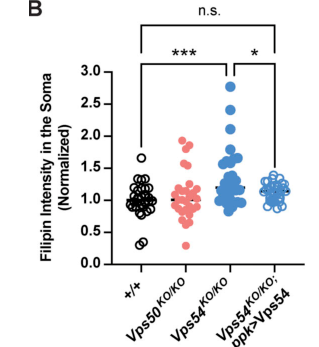

## Question

# Gene Research for Functional Annotation

## ⚠️ CRITICAL: Gene/Protein Identification Context

**BEFORE YOU BEGIN RESEARCH:** You MUST verify you are researching the CORRECT gene/protein. Gene symbols can be ambiguous, especially for less well-characterized genes from non-model organisms.

### Target Gene/Protein Identity (from UniProt):
- **UniProt Accession:** Q9VLC0
- **Protein Description:** RecName: Full=Vacuolar protein sorting-associated protein 54; AltName: Full=Protein scattered;
- **Gene Information:** Name=scat; ORFNames=CG3766;
- **Organism (full):** Drosophila melanogaster (Fruit fly).
- **Protein Family:** Belongs to the VPS54 family. .
- **Key Domains:** Vps54. (IPR039745); Vps54_C. (IPR012501); VPS54_N. (IPR019515); Vps54 (PF07928); Vps54_N (PF10475)

### MANDATORY VERIFICATION STEPS:

1. **Check if the gene symbol "scat" matches the protein description above**
2. **Verify the organism is correct:** Drosophila melanogaster (Fruit fly).
3. **Check if protein family/domains align with what you find in literature**
4. **If you find literature for a DIFFERENT gene with the same or similar symbol, STOP**

### If Gene Symbol is Ambiguous or You Cannot Find Relevant Literature:

**DO NOT PROCEED WITH RESEARCH ON A DIFFERENT GENE.** Instead:
- State clearly: "The gene symbol 'scat' is ambiguous or literature is limited for this specific protein"
- Explain what you found (e.g., "Found extensive literature on a different gene with the same symbol in a different organism")
- Describe the protein based ONLY on the UniProt information provided above
- Suggest that the protein function can be inferred from domain/family information

### Research Target:

Please provide a comprehensive research report on the gene **scat** (gene ID: scat, UniProt: Q9VLC0) in DROME.

The research report should be a detailed narrative explaining the function, biological processes, and localization of the gene product. Citations should be given for all claims.

You should prioritize authoritative reviews and primary scientific literature when conducting research. You can supplement
this with annotations you find in gene/protein databases, but these can be outdated or inaccurate.

We are specifically interested in the primary function of the gene - for enzymes, what reaction is catalyzed, and what is the substrate specificity? For transporters, what is the substrate? For structural proteins or adapters, what is the broader structural role? For signaling molecules, what is the role in the pathway.

We are interested in where in or outside the cell the gene product carries out its function.

We are also interested in the signaling or biochemical pathways in which the gene functions. We are less interested in broad pleiotropic effects, except where these elucidate the precise role.

Include evidence where possible. We are interested in both experimental evidence as well as inference from structure, evolution, or bioinformatic analysis. Precise studies should be prioritized over high-throughput, where available.

## Output

Question: You are an expert researcher providing comprehensive, well-cited information.

Provide detailed information focusing on:
1. Key concepts and definitions with current understanding
2. Recent developments and latest research (prioritize 2023-2024 sources)
3. Current applications and real-world implementations
4. Expert opinions and analysis from authoritative sources
5. Relevant statistics and data from recent studies

Format as a comprehensive research report with proper citations. Include URLs and publication dates where available.
Always prioritize recent, authoritative sources and provide specific citations for all major claims.

# Gene Research for Functional Annotation

## ⚠️ CRITICAL: Gene/Protein Identification Context

**BEFORE YOU BEGIN RESEARCH:** You MUST verify you are researching the CORRECT gene/protein. Gene symbols can be ambiguous, especially for less well-characterized genes from non-model organisms.

### Target Gene/Protein Identity (from UniProt):
- **UniProt Accession:** Q9VLC0
- **Protein Description:** RecName: Full=Vacuolar protein sorting-associated protein 54; AltName: Full=Protein scattered;
- **Gene Information:** Name=scat; ORFNames=CG3766;
- **Organism (full):** Drosophila melanogaster (Fruit fly).
- **Protein Family:** Belongs to the VPS54 family. .
- **Key Domains:** Vps54. (IPR039745); Vps54_C. (IPR012501); VPS54_N. (IPR019515); Vps54 (PF07928); Vps54_N (PF10475)

### MANDATORY VERIFICATION STEPS:

1. **Check if the gene symbol "scat" matches the protein description above**
2. **Verify the organism is correct:** Drosophila melanogaster (Fruit fly).
3. **Check if protein family/domains align with what you find in literature**
4. **If you find literature for a DIFFERENT gene with the same or similar symbol, STOP**

### If Gene Symbol is Ambiguous or You Cannot Find Relevant Literature:

**DO NOT PROCEED WITH RESEARCH ON A DIFFERENT GENE.** Instead:
- State clearly: "The gene symbol 'scat' is ambiguous or literature is limited for this specific protein"
- Explain what you found (e.g., "Found extensive literature on a different gene with the same symbol in a different organism")
- Describe the protein based ONLY on the UniProt information provided above
- Suggest that the protein function can be inferred from domain/family information

### Research Target:

Please provide a comprehensive research report on the gene **scat** (gene ID: scat, UniProt: Q9VLC0) in DROME.

The research report should be a detailed narrative explaining the function, biological processes, and localization of the gene product. Citations should be given for all claims.

You should prioritize authoritative reviews and primary scientific literature when conducting research. You can supplement
this with annotations you find in gene/protein databases, but these can be outdated or inaccurate.

We are specifically interested in the primary function of the gene - for enzymes, what reaction is catalyzed, and what is the substrate specificity? For transporters, what is the substrate? For structural proteins or adapters, what is the broader structural role? For signaling molecules, what is the role in the pathway.

We are interested in where in or outside the cell the gene product carries out its function.

We are also interested in the signaling or biochemical pathways in which the gene functions. We are less interested in broad pleiotropic effects, except where these elucidate the precise role.

Include evidence where possible. We are interested in both experimental evidence as well as inference from structure, evolution, or bioinformatic analysis. Precise studies should be prioritized over high-throughput, where available.

# Functional annotation of *scattered* (*scat*) in *Drosophila melanogaster*

## Identity and principal function

**The correct research target is *D. melanogaster scattered* (*scat*, CG3766), encoding Vps54**, the 940-amino-acid, GARP-specific vesicle-tethering subunit. This identity is stated explicitly in a 2023 GARP review and independently supported by fly genetic and biochemical studies. UniProt accession **Q9VLC0** and the Vps54/Vps54_N/Vps54_C domain annotations are supplied in the question; the papers examined establish the Scat–Vps54 identity but do not independently validate that accession or map those domains experimentally in fly Scat. There is no need to substitute research on another gene called “scat.” (khakurel2023roleofgarp pages 5-7, rosaferreira2015thesmallg pages 3-5, fari2016theroleof pages 2-4)

**Primary annotation:** Scat is a **nonenzymatic component of the Golgi-associated retrograde protein (GARP) complex**, which receives endosome-derived transport carriers at the **trans-Golgi network (TGN)** and helps organize their fusion machinery. It is not itself a sterol transporter, SNARE, lysosomal enzyme, or receptor; consequently, there is no catalytic reaction or molecular substrate specificity to assign to Scat. GARP consists of Vps51, Vps52, Vps53, and **Vps54/Scat**. The related endosome-associated recycling protein complex, EARP, shares the first three subunits but substitutes **Vps50** for Vps54. This distinction matters: a phenotype of shared Vps53 alone cannot be attributed specifically to GARP, whereas a Vps54-specific phenotype can. The conserved complex belongs to the predominantly α-helical CATCHR family of membrane tethers. (o’brien2022thegarpcomplex pages 1-2, khakurel2023roleofgarp pages 2-4, bonifacino2011transportaccordingto pages 1-2)

The evidence and its limits are summarized below.

| Functional annotation | Key fly experiment | Inference / limitation |
|---|---|---|
| **GARP-specific VPS54 subunit, distinct from EARP** | The 2023 review identifies *D. melanogaster* Scat/CG3766 as a 940-aa VPS54 ortholog. GARP contains Vps51, Vps52, Vps53 and Vps54, whereas EARP substitutes Vps50; CRISPR loss of Vps54 and Vps50 produced distinct neuronal and sterol phenotypes. (khakurel2023roleofgarp pages 5-7, o’brien2022thegarpcomplex pages 1-2, o’brien2022thegarpcomplex pages 4-6) | **Strong identity and complex-assignment evidence.** Scat is a nonenzymatic CATCHR-family tether subunit, not a transporter. Fly GARP stoichiometry and a purified-complex structure have not been determined. |
| **Peripheral cytosolic protein acting at the trans-Golgi network** | In testes, Scat-RFP rescued *scat¹* male sterility, localized adjacent to cis-Golgi dGM130 on the trans side and was absent from the mature acrosome. In larval motor-neuron somata, overexpressed HA-Scat colocalized with dStx16-positive TGN foci, with a Pearson correlation coefficient of 0.55 ± 0.02, but showed little overlap with Rab5, Rab7 or Rab11 compartments. (patel2020vps54regulatesdrosophila pages 3-4, patel2020vps54regulatesdrosophila pages 4-6, fari2016theroleof pages 2-4) | **Strong localization evidence, with a tagging caveat.** The testis construct was validated by functional rescue, whereas neuronal localization required overexpression. Association with the cytosolic membrane face is inferred from conserved GARP architecture rather than demonstrated directly by fly membrane-topology experiments. |
| **Arl5-dependent recruitment of GARP to the TGN** | Two affinity-purification approaches recovered CG3766/Scat and other GARP subunits preferentially with GTP-locked Arl5. In *Arl5* null follicle cells, the Golgi-to-cytosol ratio of Vps52-GFP was approximately 1.5-fold lower than in wild type, without a reduction in total Vps52-GFP. (rosaferreira2015thesmallg pages 3-5, rosaferreira2015thesmallg pages 5-6) | **Strong complex-level biochemical and localization evidence.** The results show an association between Arl5-GTP and GARP and partial dependence of GARP recruitment on Arl5, but they do not establish direct binding between Arl5 and Scat. |
| **Endosome-to-TGN retrieval and Golgi organization** | In *scat¹* spermatids, GFP-Lerp, the fly lysosomal-enzyme receptor homolog, became dispersed and lost its normal colocalization with dGolgin245; cis- and trans-Golgi markers also separated, disrupting the acroblast. Scat-RFP restored male fertility and behaved as a functional GARP component. (fari2016theroleof pages 4-6, fari2016theroleof pages 2-4) | **Moderate-to-strong cargo-pathway evidence.** Lerp redistribution supports defective receptor retrieval, but neither trafficking kinetics nor direct Scat–Lerp binding was measured. Mammalian CI-MPR must not be described as the receptor directly tested in these fly experiments. |
| **TGN SNARE organization and Rab-dependent synaptic development** | Loss or motor-neuron RNAi of *scat* made dStx16 staining more diffuse, an effect rescued by a Scat transgene, and caused neuromuscular-junction overgrowth. Rab5, Rab7 and Rab11 transgenes genetically suppressed overgrowth; combining *scat* RNAi with dominant-negative Rab7 reduced bouton number by 54% relative to *scat* RNAi and altered Dlg and GluRIIB but not GluRIIA. (patel2020vps54regulatesdrosophila pages 4-6, patel2020vps54regulatesdrosophilaa pages 14-17, patel2020vps54regulatesdrosophila pages 6-8) | **Strong genetic but moderate mechanistic evidence.** The findings support GARP-dependent SNARE organization and a Rab7-sensitive pathway, not direct physical Scat–Rab binding. Direct binding of fly Scat to the STX16 SNARE complex remains inferred from conserved mammalian and yeast mechanisms. |
| **TGN lipid homeostasis, granule maturation and crinophagy** | In Vps54-null neurons, filipin-detected free sterol accumulated at Golgin245-positive TGN structures rather than Rab7 endosomes, and neuronal expression of wild-type Vps54 rescued the phenotype. One null *Osbp* allele rescued filipin levels, TGN morphology and dendrite regrowth; however, Osbp overexpression also lowered filipin while worsening dendrite defects. Separately, Vps54 RNAi produced 0.1–1 µm immature glue granules instead of normal 3–3.5 µm granules and induced premature 4–8 µm crinosomes. (o’brien2022thegarpcomplex pages 6-8, o’brien2022thegarpcomplex pages 8-10, csizmadia2022developmentalprogram‐independentsecretory pages 5-7, csizmadia2022developmentalprogram‐independentsecretory pages 3-5, csizmadia2022developmentalprogram‐independentsecretory pages 7-9) | **Strong physiological evidence, with an indirect mechanism.** Scat/GARP maintains trafficking conditions that constrain TGN sterol and permit granule maturation; Scat is neither a sterol transporter nor a degradative enzyme. The Osbp-overexpression paradox shows that filipin abundance alone does not determine dendrite growth, while premature crinophagy is probably secondary to failed retrograde transport and granule maturation. |

*Table: Evidence-strength matrix for the experimentally supported functions of Drosophila Scat/CG3766. It separates direct fly findings from conserved-mechanism inferences and guards against misclassifying Scat as an enzyme, sterol transporter or direct Rab-binding protein.*

## Molecular mechanism and cellular location

**Site of action.** Scat functions principally on the **trans side of the Golgi/TGN**, within the cell rather than as a secreted protein. In fly testes, an Scat–RFP construct that **rescued mutant male sterility** localized adjacent to, but displaced from, the cis-Golgi marker dGM130 throughout spermatogenesis, including at the perinuclear *acroblast*, a ribbon-like Golgi organization in developing spermatids. It remained with Golgi structures during later development rather than entering the mature acrosome. In larval motor-neuron cell bodies, experimentally overexpressed HA–Scat colocalized with TGN-associated Syntaxin-16 (Pearson correlation coefficient **0.55 ± 0.02**) but overlapped much less with Rab5-, Rab7-, or Rab11-marked endosomes (**0.15 ± 0.01**, **0.22 ± 0.04**, and **0.178 ± 0.02**, respectively). Neuronal localization has an overexpression caveat; association with the **cytosolic face** of the TGN follows the established GARP model rather than a fly-specific membrane-topology assay. (fari2016theroleof pages 2-4, patel2020vps54regulatesdrosophila pages 3-4, patel2020vps54regulatesdrosophila pages 4-6, bonifacino2011transportaccordingto pages 1-2)

**Recruitment and tethering.** In two fly affinity-isolation approaches, GTP-locked Arl5 recovered all four GARP subunits, including **CG3766/Scat**. In *Arl5*-null follicle cells, Golgi-associated Vps52–GFP fell relative to its cytosolic pool: the Golgi/cytosol ratio was approximately **1.5-fold higher in controls**, although total Vps52–GFP was comparable. These results support **Arl5-assisted recruitment of the GARP complex** to the TGN, not obligatory direct binding of Arl5 to the isolated Scat polypeptide. On the receiving membrane, the prevailing mechanism is tethering followed by promotion or stabilization of SNARE-mediated fusion. N-terminal Vps54 interactions with the Syntaxin-16/Syntaxin-6/VTI1A/VAMP4 machinery and C-terminal carrier-recognition roles are described chiefly in yeast or mammalian studies; they are plausible for the conserved fly protein but should not be mistaken for fly domain-binding measurements. The 2023 review notes that GARP’s detailed structure and full mechanistic repertoire remain unresolved. (rosaferreira2015thesmallg pages 3-5, rosaferreira2015thesmallg pages 5-6, khakurel2023roleofgarp pages 4-5, khakurel2023roleofgarp pages 2-4)

**Fly evidence for the retrieval route.** In *scat¹* postmeiotic spermatids, GFP-tagged **Lerp**, the fly lysosomal-enzyme receptor homolog, was dispersed rather than concentrated with the trans-Golgi marker dGolgin245; the normal close organization of cis- and trans-Golgi markers was also lost. This provides a **specific receptor-localization readout** consistent with defective endosome-to-TGN retrieval and impaired acroblast integrity. It does *not* measure a Lerp transport rate or demonstrate direct Scat–Lerp binding. Mammalian mannose-6-phosphate-receptor recycling and lysosomal-hydrolase sorting provide mechanistic context, not proof that the same individual cargoes were tested in flies. Similarly, loss of fly *scat* made motor-neuron Syntaxin-16 staining more diffuse, an effect reversed by an Scat transgene, while detectable Syntaxin-16 puncta persisted. Thus fly evidence supports **TGN SNARE organization** without directly visualizing a Scat-mediated vesicle-tethering event. (fari2016theroleof pages 4-6, patel2020vps54regulatesdrosophila pages 4-6, khakurel2023roleofgarp pages 7-9)

## Biological pathways and experimentally defined consequences

**Spermatid Golgi organization.** The *scat¹* insertion eliminated detectable testis Scat protein; precise excision or germline expression of Scat–RFP reversed male sterility. Mutant males lacked mature sperm, with largely normal early germ-cell development and meiosis but defective postmeiotic acroblast organization, nuclear elongation, acrosome formation, and spermatid individualization. **All tested homozygous *scat¹* males were sterile.** These experiments strongly link Scat-dependent Golgi retrieval/organization to sperm differentiation; they do not make Scat a structural component of the acrosome. (fari2016theroleof pages 2-2, fari2016theroleof pages 2-4, fari2016theroleof pages 4-6)

**Secretory-granule maturation.** In larval salivary glands, RNAi against **Scattered/Vps54** or fellow GARP subunit Vps53 produced immature glue-containing granules of about **0.1–1 µm**, instead of normal mature granules of **3–3.5 µm**, together with premature acidic, degradative structures of approximately **4–8 µm**. Reporter imaging and ultrastructure support early **crinophagy**, in which immature secretory granules enter late-endosomal/lysosomal degradation. Perturbing Syntaxin-16, Synaptobrevin, or Rab6 produced related phenotypes. The parsimonious interpretation is that defective retrograde trafficking prevents normal granule maturation and *secondarily* promotes their degradation—not that Scat catalyzes crinophagy. (csizmadia2022developmentalprogram‐independentsecretory pages 1-2, csizmadia2022developmentalprogram‐independentsecretory pages 3-5, csizmadia2022developmentalprogram‐independentsecretory pages 5-7, csizmadia2022developmentalprogram‐independentsecretory pages 7-9)

**Neuronal membrane trafficking and lipid homeostasis.** In the peer-reviewed *Journal of Cell Biology* study published in **2023** (online **October 2022**), CRISPR *Vps54/scat* knockouts developed larval dendritic arbors of approximately normal size but showed reduced adult dendrite regrowth after developmental pruning. Defects became evident around **96 hours after puparium formation** in class-IV dendritic-arborization neurons; neuron-specific wild-type Vps54 rescued arborization. Both Vps54/GARP and Vps50/EARP affected this neuronal class, but the Vps54 defect was stronger, and only Vps54 was required for the adult class-I arbor in the reported comparison. These are developmental remodeling phenotypes, not evidence that all fly neurons obligatorily degenerate. (o’brien2022thegarpcomplex pages 2-4, o’brien2022thegarpcomplex pages 4-6)

Crucially, **free sterol**, detected by filipin, increased in Vps54-null neuronal somata and specifically in **Golgin245-positive TGN structures**, *not* detectably in Rab7-positive late endosomes or labeled lysosomes. For TGN-associated filipin the reported comparison was **P = 0.0038**, with **9–10 independent samples per genotype**; whole-soma staining differed at **P = 0.0004**, with **30–33 samples per genotype**, and was rescued by neuron-specific Vps54 expression. Removing one functional copy of ***Osbp*** restored sterol staining, TGN morphology, and dendrite regrowth; **PI4-kinase *fwd* knockdown worsened** dendrite morphology. The interpretation requires a qualification: *Osbp* **overexpression also lowered filipin staining while worsening the dendrite defect**. Hence excess TGN-associated sterol contributes to the phenotype, but filipin intensity alone cannot explain dendrite growth, and neither the source of the accumulated sterol nor a direct sterol-transport activity of Scat has been demonstrated. Cathepsin-L maturation was not detectably altered in young-adult knockout head lysates, arguing against a simple explanation based solely on failed lysosomal hydrolase maturation in this setting. The cropped Figure 6 measurements provide visual corroboration of the compartment-specific finding. (o’brien2022thegarpcomplex pages 8-10, o’brien2022thegarpcomplex pages 6-8, o’brien2022thegarpcomplex media 60c38f83, o’brien2022thegarpcomplex media 31b13e19)

**Motor-neuron synapses and adult physiology.** In larvae, *scat* loss or motor-neuron RNAi increased neuromuscular-junction growth. Presynaptic *scat* depletion caused smaller boutons and partially disrupted TGN Syntaxin-16 organization; the study found **genetic interactions**, not established direct Scat–Rab binding, with Rab5, Rab7, and Rab11. In particular, simultaneous *scat* RNAi and dominant-negative Rab7 reduced bouton number **54% relative to *scat* RNAi alone** and disturbed postsynaptic Dlg and GluRIIB, whereas GluRIIA remained visibly unaffected. The trans-synaptic mechanism remains unknown. In adults, independent *scat* deletion alleles caused shorter lifespan and progressive locomotor and muscle phenotypes: their **median lifespans** were **28 days for mutant males and 25–29 days for mutant females**, versus **47 and 44.5 days**, respectively, in the matched precise-excision control. These physiological outcomes support the importance of GARP-dependent trafficking but do not by themselves identify a transported synaptic substrate or establish a human disease caused by *scat*. (patel2020vps54regulatesdrosophila pages 3-4, patel2020vps54regulatesdrosophila pages 4-6, patel2020vps54regulatesdrosophila pages 6-8, wilkinson2021vps54regulateslifespan pages 3-5, wilkinson2021vps54regulateslifespan pages 5-7)

## Synthesis and evidentiary limits

The most specific, defensible functional description is: **Scat/Vps54 is the GARP-specific, primarily TGN-associated tethering-complex subunit that supports retrograde endosome-to-Golgi carrier reception and proper TGN fusion/cargo organization.** Fly experiments establish its identity, Golgi localization, Arl5-associated complex recruitment, Lerp and Syntaxin-16 localization defects, and requirements for acroblast integrity, granule maturation, synaptic organization, and neuronal TGN sterol balance. The precise vesicle-binding interface, direct fly SNARE-binding chemistry, transport rate and complete catalogue of physiological cargoes remain incompletely established. Fly Rab genetic interactions and altered sterol distribution must **not** be reannotated as direct Rab binding or sterol transport by Scat. The most recent directly informative synthesis identified here is the **2023** GARP review, together with the **2023-volume** neuronal study; no separate, comparably informative **2024** peer-reviewed Scat-specific experiment was identified in this literature search. (khakurel2023roleofgarp pages 2-4, rosaferreira2015thesmallg pages 3-5, fari2016theroleof pages 4-6, o’brien2022thegarpcomplex pages 8-10)

### Principal sources and publication dates

- Khakurel A, Lupashin VV. **March 2023.** “Role of GARP Vesicle Tethering Complex in Golgi Physiology.” *International Journal of Molecular Sciences* **24**, 6069. https://doi.org/10.3390/ijms24076069. (khakurel2023roleofgarp pages 2-4)
- O’Brien CE *et al.* **Online October 2022; 2023 journal volume.** “The GARP complex prevents sterol accumulation at the trans-Golgi network during dendrite remodeling.” *Journal of Cell Biology* **222**, e202112108. https://doi.org/10.1083/jcb.202112108. (o’brien2022thegarpcomplex pages 1-2, o’brien2022thegarpcomplex pages 8-10)
- Csizmadia T *et al.* **November 2022.** “Developmental program-independent secretory granule degradation in larval salivary gland cells of *Drosophila*.” *Traffic* **23**, 568–586. https://doi.org/10.1111/tra.12871. (csizmadia2022developmentalprogram‐independentsecretory pages 1-2, csizmadia2022developmentalprogram‐independentsecretory pages 3-5)
- Wilkinson EC *et al.* **October 2021.** “Vps54 Regulates Lifespan and Locomotor Behavior in Adult *Drosophila melanogaster*.” *Frontiers in Genetics* **12**, 762012. https://doi.org/10.3389/fgene.2021.762012. (wilkinson2021vps54regulateslifespan pages 3-5)
- Patel PH *et al.* **August 2020.** “Vps54 regulates *Drosophila* neuromuscular junction development and interacts genetically with Rab7 to control composition of the postsynaptic density.” *Biology Open* **9**, bio053421. https://doi.org/10.1242/bio.053421. (patel2020vps54regulatesdrosophila pages 1-2, patel2020vps54regulatesdrosophila pages 6-8)
- Fári K *et al.* **August 2016.** “The role of acroblast formation during *Drosophila* spermatogenesis.” *Biology Open* **5**, 1102–1110. https://doi.org/10.1242/bio.018275. (fari2016theroleof pages 2-4, fari2016theroleof pages 4-6)
- Rosa-Ferreira C *et al.* **March 2015.** “The small G protein Arl5 contributes to endosome-to-Golgi traffic by aiding the recruitment of the GARP complex to the Golgi.” *Biology Open* **4**, 474–481. https://doi.org/10.1242/bio.201410975. (rosaferreira2015thesmallg pages 3-5, rosaferreira2015thesmallg pages 5-6)

References

1. (khakurel2023roleofgarp pages 5-7): Amrita Khakurel and Vladimir V. Lupashin. Role of garp vesicle tethering complex in golgi physiology. International Journal of Molecular Sciences, 24:6069, Mar 2023. URL: https://doi.org/10.3390/ijms24076069, doi:10.3390/ijms24076069. This article has 25 citations.

2. (rosaferreira2015thesmallg pages 3-5): Cláudia Rosa-Ferreira, Chantal Christis, Isabel L. Torres, and Sean Munro. The small g protein arl5 contributes to endosome-to-golgi traffic by aiding the recruitment of the garp complex to the golgi. Biology Open, 4:474-481, Mar 2015. URL: https://doi.org/10.1242/bio.201410975, doi:10.1242/bio.201410975. This article has 40 citations and is from a peer-reviewed journal.

3. (fari2016theroleof pages 2-4): Karolina Fári, S. Takács, D. Ungar, and R. Sinka. The role of acroblast formation during drosophila spermatogenesis. Biology Open, 5:1102-1110, Aug 2016. URL: https://doi.org/10.1242/bio.018275, doi:10.1242/bio.018275. This article has 34 citations and is from a peer-reviewed journal.

4. (o’brien2022thegarpcomplex pages 1-2): Caitlin E. O’Brien, Susan H. Younger, Lily Yeh Jan, and Yuh Nung Jan. The garp complex prevents sterol accumulation at the trans-golgi network during dendrite remodeling. Journal of Cell Biology, Oct 2022. URL: https://doi.org/10.1083/jcb.202112108, doi:10.1083/jcb.202112108. This article has 12 citations and is from a highest quality peer-reviewed journal.

5. (khakurel2023roleofgarp pages 2-4): Amrita Khakurel and Vladimir V. Lupashin. Role of garp vesicle tethering complex in golgi physiology. International Journal of Molecular Sciences, 24:6069, Mar 2023. URL: https://doi.org/10.3390/ijms24076069, doi:10.3390/ijms24076069. This article has 25 citations.

6. (bonifacino2011transportaccordingto pages 1-2): Juan S. Bonifacino and Aitor Hierro. Transport according to garp: receiving retrograde cargo at the trans-golgi network. Trends in cell biology, 21 3:159-67, Mar 2011. URL: https://doi.org/10.1016/j.tcb.2010.11.003, doi:10.1016/j.tcb.2010.11.003. This article has 176 citations and is from a domain leading peer-reviewed journal.

7. (o’brien2022thegarpcomplex pages 4-6): Caitlin E. O’Brien, Susan H. Younger, Lily Yeh Jan, and Yuh Nung Jan. The garp complex prevents sterol accumulation at the trans-golgi network during dendrite remodeling. Journal of Cell Biology, Oct 2022. URL: https://doi.org/10.1083/jcb.202112108, doi:10.1083/jcb.202112108. This article has 12 citations and is from a highest quality peer-reviewed journal.

8. (patel2020vps54regulatesdrosophila pages 3-4): Prajal H. Patel, Emily C. Wilkinson, Emily L. Starke, Malea R. McGimsey, J. Todd Blankenship, and Scott A. Barbee. Vps54 regulates drosophila neuromuscular junction development and interacts genetically with rab7 to control composition of the postsynaptic density. Biology Open, Aug 2020. URL: https://doi.org/10.1242/bio.053421, doi:10.1242/bio.053421. This article has 15 citations and is from a peer-reviewed journal.

9. (patel2020vps54regulatesdrosophila pages 4-6): Prajal H. Patel, Emily C. Wilkinson, Emily L. Starke, Malea R. McGimsey, J. Todd Blankenship, and Scott A. Barbee. Vps54 regulates drosophila neuromuscular junction development and interacts genetically with rab7 to control composition of the postsynaptic density. Biology Open, Aug 2020. URL: https://doi.org/10.1242/bio.053421, doi:10.1242/bio.053421. This article has 15 citations and is from a peer-reviewed journal.

10. (rosaferreira2015thesmallg pages 5-6): Cláudia Rosa-Ferreira, Chantal Christis, Isabel L. Torres, and Sean Munro. The small g protein arl5 contributes to endosome-to-golgi traffic by aiding the recruitment of the garp complex to the golgi. Biology Open, 4:474-481, Mar 2015. URL: https://doi.org/10.1242/bio.201410975, doi:10.1242/bio.201410975. This article has 40 citations and is from a peer-reviewed journal.

11. (fari2016theroleof pages 4-6): Karolina Fári, S. Takács, D. Ungar, and R. Sinka. The role of acroblast formation during drosophila spermatogenesis. Biology Open, 5:1102-1110, Aug 2016. URL: https://doi.org/10.1242/bio.018275, doi:10.1242/bio.018275. This article has 34 citations and is from a peer-reviewed journal.

12. (patel2020vps54regulatesdrosophilaa pages 14-17): Prajal H. Patel, Emily C. Wilkinson, Emily L. Starke, Malea R. McGimsey, J. Todd Blankenship, and Scott A. Barbee. Vps54 regulates drosophila neuromuscular junction development and controls postsynaptic density composition via a rab7-dependent mechanism. bioRxiv, Feb 2020. URL: https://doi.org/10.1101/2020.02.17.952721, doi:10.1101/2020.02.17.952721. This article has 0 citations.

13. (patel2020vps54regulatesdrosophila pages 6-8): Prajal H. Patel, Emily C. Wilkinson, Emily L. Starke, Malea R. McGimsey, J. Todd Blankenship, and Scott A. Barbee. Vps54 regulates drosophila neuromuscular junction development and interacts genetically with rab7 to control composition of the postsynaptic density. Biology Open, Aug 2020. URL: https://doi.org/10.1242/bio.053421, doi:10.1242/bio.053421. This article has 15 citations and is from a peer-reviewed journal.

14. (o’brien2022thegarpcomplex pages 6-8): Caitlin E. O’Brien, Susan H. Younger, Lily Yeh Jan, and Yuh Nung Jan. The garp complex prevents sterol accumulation at the trans-golgi network during dendrite remodeling. Journal of Cell Biology, Oct 2022. URL: https://doi.org/10.1083/jcb.202112108, doi:10.1083/jcb.202112108. This article has 12 citations and is from a highest quality peer-reviewed journal.

15. (o’brien2022thegarpcomplex pages 8-10): Caitlin E. O’Brien, Susan H. Younger, Lily Yeh Jan, and Yuh Nung Jan. The garp complex prevents sterol accumulation at the trans-golgi network during dendrite remodeling. Journal of Cell Biology, Oct 2022. URL: https://doi.org/10.1083/jcb.202112108, doi:10.1083/jcb.202112108. This article has 12 citations and is from a highest quality peer-reviewed journal.

16. (csizmadia2022developmentalprogram‐independentsecretory pages 5-7): Tamás Csizmadia, Anna Dósa, Erika Farkas, Belián Valentin Csikos, Eszter Adél Kriska, Gábor Juhász, and Péter Lőw. Developmental program‐independent secretory granule degradation in larval salivary gland cells of <i>drosophila</i>. Traffic, 23:568-586, Nov 2022. URL: https://doi.org/10.1111/tra.12871, doi:10.1111/tra.12871. This article has 14 citations and is from a peer-reviewed journal.

17. (csizmadia2022developmentalprogram‐independentsecretory pages 3-5): Tamás Csizmadia, Anna Dósa, Erika Farkas, Belián Valentin Csikos, Eszter Adél Kriska, Gábor Juhász, and Péter Lőw. Developmental program‐independent secretory granule degradation in larval salivary gland cells of <i>drosophila</i>. Traffic, 23:568-586, Nov 2022. URL: https://doi.org/10.1111/tra.12871, doi:10.1111/tra.12871. This article has 14 citations and is from a peer-reviewed journal.

18. (csizmadia2022developmentalprogram‐independentsecretory pages 7-9): Tamás Csizmadia, Anna Dósa, Erika Farkas, Belián Valentin Csikos, Eszter Adél Kriska, Gábor Juhász, and Péter Lőw. Developmental program‐independent secretory granule degradation in larval salivary gland cells of <i>drosophila</i>. Traffic, 23:568-586, Nov 2022. URL: https://doi.org/10.1111/tra.12871, doi:10.1111/tra.12871. This article has 14 citations and is from a peer-reviewed journal.

19. (khakurel2023roleofgarp pages 4-5): Amrita Khakurel and Vladimir V. Lupashin. Role of garp vesicle tethering complex in golgi physiology. International Journal of Molecular Sciences, 24:6069, Mar 2023. URL: https://doi.org/10.3390/ijms24076069, doi:10.3390/ijms24076069. This article has 25 citations.

20. (khakurel2023roleofgarp pages 7-9): Amrita Khakurel and Vladimir V. Lupashin. Role of garp vesicle tethering complex in golgi physiology. International Journal of Molecular Sciences, 24:6069, Mar 2023. URL: https://doi.org/10.3390/ijms24076069, doi:10.3390/ijms24076069. This article has 25 citations.

21. (fari2016theroleof pages 2-2): Karolina Fári, S. Takács, D. Ungar, and R. Sinka. The role of acroblast formation during drosophila spermatogenesis. Biology Open, 5:1102-1110, Aug 2016. URL: https://doi.org/10.1242/bio.018275, doi:10.1242/bio.018275. This article has 34 citations and is from a peer-reviewed journal.

22. (csizmadia2022developmentalprogram‐independentsecretory pages 1-2): Tamás Csizmadia, Anna Dósa, Erika Farkas, Belián Valentin Csikos, Eszter Adél Kriska, Gábor Juhász, and Péter Lőw. Developmental program‐independent secretory granule degradation in larval salivary gland cells of <i>drosophila</i>. Traffic, 23:568-586, Nov 2022. URL: https://doi.org/10.1111/tra.12871, doi:10.1111/tra.12871. This article has 14 citations and is from a peer-reviewed journal.

23. (o’brien2022thegarpcomplex pages 2-4): Caitlin E. O’Brien, Susan H. Younger, Lily Yeh Jan, and Yuh Nung Jan. The garp complex prevents sterol accumulation at the trans-golgi network during dendrite remodeling. Journal of Cell Biology, Oct 2022. URL: https://doi.org/10.1083/jcb.202112108, doi:10.1083/jcb.202112108. This article has 12 citations and is from a highest quality peer-reviewed journal.

24. (o’brien2022thegarpcomplex media 60c38f83): Caitlin E. O’Brien, Susan H. Younger, Lily Yeh Jan, and Yuh Nung Jan. The garp complex prevents sterol accumulation at the trans-golgi network during dendrite remodeling. Journal of Cell Biology, Oct 2022. URL: https://doi.org/10.1083/jcb.202112108, doi:10.1083/jcb.202112108. This article has 12 citations and is from a highest quality peer-reviewed journal.

25. (o’brien2022thegarpcomplex media 31b13e19): Caitlin E. O’Brien, Susan H. Younger, Lily Yeh Jan, and Yuh Nung Jan. The garp complex prevents sterol accumulation at the trans-golgi network during dendrite remodeling. Journal of Cell Biology, Oct 2022. URL: https://doi.org/10.1083/jcb.202112108, doi:10.1083/jcb.202112108. This article has 12 citations and is from a highest quality peer-reviewed journal.

26. (wilkinson2021vps54regulateslifespan pages 3-5): Emily C. Wilkinson, Emily L. Starke, and Scott A. Barbee. Vps54 regulates lifespan and locomotor behavior in adult drosophila melanogaster. Frontiers in Genetics, Oct 2021. URL: https://doi.org/10.3389/fgene.2021.762012, doi:10.3389/fgene.2021.762012. This article has 9 citations and is from a peer-reviewed journal.

27. (wilkinson2021vps54regulateslifespan pages 5-7): Emily C. Wilkinson, Emily L. Starke, and Scott A. Barbee. Vps54 regulates lifespan and locomotor behavior in adult drosophila melanogaster. Frontiers in Genetics, Oct 2021. URL: https://doi.org/10.3389/fgene.2021.762012, doi:10.3389/fgene.2021.762012. This article has 9 citations and is from a peer-reviewed journal.

28. (patel2020vps54regulatesdrosophila pages 1-2): Prajal H. Patel, Emily C. Wilkinson, Emily L. Starke, Malea R. McGimsey, J. Todd Blankenship, and Scott A. Barbee. Vps54 regulates drosophila neuromuscular junction development and interacts genetically with rab7 to control composition of the postsynaptic density. Biology Open, Aug 2020. URL: https://doi.org/10.1242/bio.053421, doi:10.1242/bio.053421. This article has 15 citations and is from a peer-reviewed journal.

## Artifacts

- [Edison artifact artifact-00](scat-deep-research-falcon_artifacts/artifact-00.md)

## Citations

1. khakurel2023roleofgarp pages 2-4
2. khakurel2023roleofgarp pages 5-7
3. rosaferreira2015thesmallg pages 3-5
4. fari2016theroleof pages 2-4
5. bonifacino2011transportaccordingto pages 1-2
6. rosaferreira2015thesmallg pages 5-6
7. fari2016theroleof pages 4-6
8. khakurel2023roleofgarp pages 4-5
9. khakurel2023roleofgarp pages 7-9
10. fari2016theroleof pages 2-2
11. https://doi.org/10.3390/ijms24076069.
12. https://doi.org/10.1083/jcb.202112108.
13. https://doi.org/10.1111/tra.12871.
14. https://doi.org/10.3389/fgene.2021.762012.
15. https://doi.org/10.1242/bio.053421.
16. https://doi.org/10.1242/bio.018275.
17. https://doi.org/10.1242/bio.201410975.
18. https://doi.org/10.3390/ijms24076069,
19. https://doi.org/10.1242/bio.201410975,
20. https://doi.org/10.1242/bio.018275,
21. https://doi.org/10.1083/jcb.202112108,
22. https://doi.org/10.1016/j.tcb.2010.11.003,
23. https://doi.org/10.1242/bio.053421,
24. https://doi.org/10.1101/2020.02.17.952721,
25. https://doi.org/10.1111/tra.12871,
26. https://doi.org/10.3389/fgene.2021.762012,