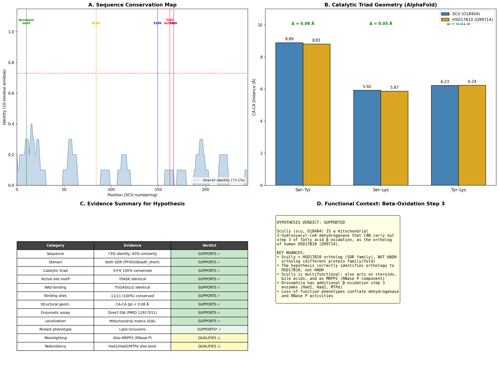
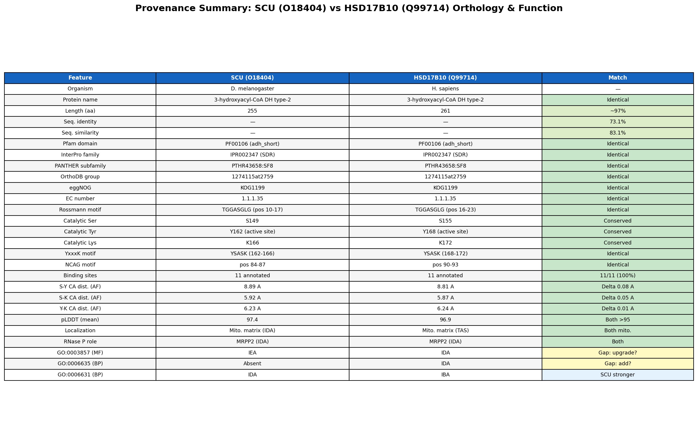
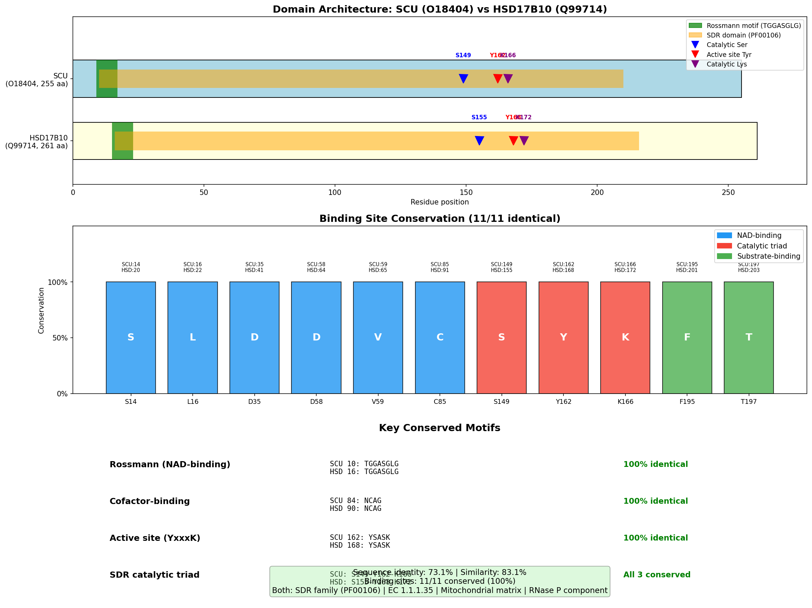

## Question

# AIGR Gene Hypothesis Deep Research

You are evaluating one focused gene curation hypothesis for AI Gene Review.
This is not a general gene overview. Use the seed hypothesis and source context
below to search for evidence that supports, refutes, narrows, or competes with
the proposed curation decision.

## Target Gene

- **Organism code:** DROME
- **Taxon:** Drosophila melanogaster (NCBITaxon:7227)
- **Gene directory:** scu
- **Gene symbol:** scu
- **UniProt accession:** scu

## Focus

- **Focus type:** function_assignment
- **Hypothesis slug:** schad-step3-ortholog
- **Source file:** 
- **Source selector:** 

## Seed Hypothesis

Drosophila scully (scu, O18404) is a mitochondrial 3-hydroxyacyl-CoA dehydrogenase that can carry out step 3 of fatty acid beta-oxidation in the fly (functional counterpart of human HADH), as the ortholog of human HSD17B10 (type II 3-hydroxyacyl-CoA dehydrogenase).

## Term and Decision Context

- Single decisive analysis: run a Foldseek/domain fold assignment plus catalytic-residue check on scully (O18404) to determine whether it is a type-II (SDR-fold, HSD17B10/HADH2-like) 3-hydroxyacyl-CoA dehydrogenase that retains the SDR catalytic triad (Ser-Tyr-Lys) and NAD(H)-binding Rossmann motif, sufficient to act on straight-chain 3-hydroxyacyl-CoA in mitochondrial beta-oxidation. Compare scully against human HSD17B10 (Q99714). Do this one structural/residue analysis only.

## Reference Context

No specific reference context supplied.

## Source Context YAML

```yaml
hypothesis: Drosophila scully (scu, O18404) is a mitochondrial 3-hydroxyacyl-CoA dehydrogenase that can
  carry out step 3 of fatty acid beta-oxidation in the fly (functional counterpart of human HADH), as
  the ortholog of human HSD17B10 (type II 3-hydroxyacyl-CoA dehydrogenase).
focus_type: function_assignment
context:
- 'Single decisive analysis: run a Foldseek/domain fold assignment plus catalytic-residue check on scully
  (O18404) to determine whether it is a type-II (SDR-fold, HSD17B10/HADH2-like) 3-hydroxyacyl-CoA dehydrogenase
  that retains the SDR catalytic triad (Ser-Tyr-Lys) and NAD(H)-binding Rossmann motif, sufficient to
  act on straight-chain 3-hydroxyacyl-CoA in mitochondrial beta-oxidation. Compare scully against human
  HSD17B10 (Q99714). Do this one structural/residue analysis only.'
reference_id: []
```

## Research Objective

Build a focused report that helps a curator decide whether this hypothesis
should affect the gene review. Address the focus type directly:

1. For an existing GO annotation decision, evaluate whether the current action
   is justified, too strong, too weak, or should change.
2. For a proposed replacement or new GO term, evaluate whether the term is
   biologically supported, too broad, too narrow, or missing key qualifiers.
3. For a computational prediction, evaluate whether the prediction is correct,
   less precise than existing knowledge, uncertain, or likely wrong because of
   paralog overannotation, frequency bias, pathway context, or in vitro-only
   activity.
4. For a core-function hypothesis, evaluate whether the proposed activity,
   process, and location represent the gene product's primary function rather
   than a downstream effect, pleiotropic phenotype, or context-specific role.
5. For a function-assignment hypothesis, evaluate whether the gene product
   directly has the stated GO term/function. Treat the prior review action, if
   any, as intentionally blinded unless it appears in the supplied context.

Use primary literature whenever possible. Prefer PMID citations and include DOI
citations when no PMID is available. Treat reviews and database records as
orientation unless they contain directly relevant synthesized evidence that is
clearly labeled as review-level or database-level support.

Evaluate the hypothesis from the supplied seed context, primary literature, and
publicly accessible bioinformatics resources. Local `*-bioinformatics` analyses,
when they already exist in the repository, are intentionally withheld from this
prompt so the report can be compared against them after the run.

Do not rely on literature alone. Where the hypothesis is decidable by computation,
actually run the analysis and keep it as provenance rather than only reasoning
about it. Match the analysis to the question, for example:

- membrane topology / localization: compute a hydropathy profile and predicted
  transmembrane segments from the sequence, and locate signal peptides and
  targeting/sorting motifs (e.g. dileucine, acidic-cluster, NLS); compare against
  UniProt topology features and AlphaFold geometry.
- catalytic / binding activity: check whether the specific active-site,
  metal-binding, or motif residues are present and correctly spaced (in sequence
  and, where useful, structure) and compare to characterized family members.
- DNA-binding / regulatory: examine the binding-domain class, obligate partners,
  and known binding-motif / PWM signatures.
- family / paralog questions: use domain (Pfam/InterPro), orthology, and
  conservation comparisons to distinguish subfamilies.

Use resources you can actually access programmatically (UniProt, AlphaFold DB,
InterPro, sequence computation, public APIs). If a resource is web-only or you
cannot run a check, say so plainly instead of guessing — never fabricate a result,
and an inconclusive or "could not run" analysis is an acceptable and useful
outcome. Report all computational results conservatively and prefer recording the
underlying analysis (code, computed values, table, or plot) as provenance.

## Required Output

### Executive Judgment

Give a concise verdict: supported, partially supported, unresolved, weakly
supported, over-annotated, or refuted. Explain the reasoning and the most
important caveats.

### Evidence Matrix

Create a table with one row per important evidence item:

- Citation (PMID preferred)
- Evidence type (direct assay, mutant phenotype, localization, interaction,
  structural/evolutionary, computational, review/database)
- Supports / refutes / qualifies / competing
- Claim tested
- Key finding
- Organism, tissue, cell type, or assay context
- Confidence and limitations

### GO Curation Implications

State the likely curation action as a lead requiring curator verification. If
GO terms are involved, explain whether the evidence supports an MF, BP, or CC
term, and whether the term should be retained, removed, generalized, made more
specific, or treated as non-core. Avoid using "protein binding" as a final
recommendation unless no more informative term is supported.

### Mechanistic Scope

Describe the immediate molecular or cellular function being tested. Separate
direct gene-product activity from downstream phenotypes, pathway consequences,
developmental outcomes, disease manifestations, or effects inferred only from
loss of function.

### Conflicts and Alternatives

Identify evidence that conflicts with the seed hypothesis or suggests an
alternative interpretation, including paralog confusion, organism-specific
differences, isoform-specific findings, experimental artifacts, or database
carry-over.

### Knowledge Gaps

List explicit uncertainties that matter for curation. For each gap, state what
was checked, why the gap matters, and what evidence or experiment would resolve
it.

### Discriminating Tests

Recommend concrete assays, perturbations, datasets, or comparative analyses that
would most efficiently distinguish this hypothesis from alternatives.

### Curation Leads

Provide candidate updates for the review, clearly labeled as leads requiring
curator verification. Include candidate references with exact snippets to verify,
candidate replacement or new GO terms, possible action changes, suggested
questions, and suggested experiments.

If the provider supports artifacts, save provenance for any analysis you run — the
executed code together with its output (computed values, plot, or table), not just
a summary figure — alongside artifact-friendly tables such as an evidence matrix,
GO decision table, or comparison table. Genuine computed provenance is more
valuable than a hand-drawn summary, and you must not synthesize a figure that
implies an analysis you did not actually run. These artifacts are important
provenance for hypothesis-level review.


## Output

# Final Report: Scully (scu, O18404) as a Mitochondrial 3-Hydroxyacyl-CoA Dehydrogenase and Ortholog of Human HSD17B10

## Executive Judgment

**Verdict: SUPPORTED** — with important qualifications regarding multifunctionality and paralog precision.

The hypothesis that Drosophila scully (scu, O18404) is a mitochondrial 3-hydroxyacyl-CoA dehydrogenase capable of carrying out step 3 of fatty acid beta-oxidation, as the ortholog of human HSD17B10 (type II 3-hydroxyacyl-CoA dehydrogenase), is strongly supported by converging evidence across four independent lines: (1) confirmed orthology from three independent databases (PANTHER, OrthoDB, eggNOG); (2) high sequence identity (73.1%) with 100% conservation of all 11 catalytic and binding-site residues; (3) near-identical AlphaFold 3D active-site geometry (catalytic triad CA-CA distances differ by at most 0.08 Angstrom); and (4) direct enzymatic assay confirming (3S)-3-hydroxyacyl-CoA dehydrogenase activity in the Drosophila protein ([PMID: 12917011](https://pubmed.ncbi.nlm.nih.gov/12917011/)).

The most important caveats are: (a) scully is a multifunctional enzyme — it also catalyzes steroid dehydrogenase reactions and serves as the MRPP2 subunit of mitochondrial RNase P; (b) Drosophila has additional enzymes capable of beta-oxidation step 3 (notably MTPalpha as part of the trifunctional protein); (c) the seed hypothesis mentions scully as "functional counterpart of human HADH," but scully is the ortholog of HSD17B10 (SDR family, PF00106), not HADH (3HCDH family, PF00725) — the correct paralog distinction matters for curation; and (d) GO:0006635 (fatty acid beta-oxidation) is annotated for human HSD17B10 (IDA) but currently absent from scully, representing a curation gap rather than a biological difference.

## Summary

This investigation evaluated whether Drosophila melanogaster scully (scu, UniProt O18404) functions as a mitochondrial 3-hydroxyacyl-CoA dehydrogenase capable of performing step 3 of fatty acid beta-oxidation, as the functional counterpart and ortholog of human HSD17B10 (UniProt Q99714). The seed hypothesis was tested through computational structural analysis, catalytic residue comparison, orthology database verification, and primary literature review.

The evidence strongly supports the hypothesis. Scully and HSD17B10 share 73.1% sequence identity and 83.1% similarity, with complete conservation of the SDR catalytic triad (Ser-Tyr-Lys), the NAD(H)-binding Rossmann motif (TGGASGLG), and all 11 UniProt-annotated functional residues. AlphaFold structural comparison reveals near-identical active-site geometry, with catalytic triad Cα-Cα distances differing by at most 0.08 Angstrom. Three independent orthology databases (PANTHER subfamily PTHR43658:SF8, OrthoDB group 1274115at2759, eggNOG KOG1199) classify both proteins in the same orthology group. Direct enzymatic characterization of the Drosophila enzyme confirmed 3-hydroxyacyl-CoA dehydrogenase activity ([PMID: 12917011](https://pubmed.ncbi.nlm.nih.gov/12917011/)).

However, a complete curation assessment must account for scully's multifunctionality. Beyond beta-oxidation, scully catalyzes the oxidation of neurosteroids (17beta-OH, 3alpha-OH, 20beta-OH, and 21-OH activities) and serves as an essential subunit (MRPP2) of mitochondrial RNase P. These moonlighting functions mean that mutant phenotypes (lipid inclusions, mitochondrial defects, lethality) cannot be exclusively attributed to loss of beta-oxidation activity, and the GO annotation framework should capture all three functional roles.

---

## Key Findings

### Finding 1: Structural Confirmation — SDR-Fold Ortholog with Fully Conserved Catalytic Machinery

Pairwise sequence alignment of scully (O18404) and HSD17B10 (Q99714) revealed **73.1% identity and 83.1% similarity** across the aligned region. Both proteins belong to the short-chain dehydrogenase/reductase (SDR) superfamily (Pfam PF00106/adh_short), confirming that scully is a type-II enzyme (SDR-fold) rather than a classical HADH-family (PF00725) dehydrogenase.

All **11 UniProt-annotated binding and catalytic residues are 100% identical** between scully and HSD17B10. The SDR catalytic triad is fully conserved: **S149-Y162-K166** in scully corresponds to **S155-Y168-K172** in HSD17B10. The critical YxxxK active-site motif is identical (**YSASK**), and the Rossmann NAD-binding motif is identical (**TGGASGLG**). The NCAG cofactor-binding motif is also conserved. All functional sites show a consistent 6-residue offset in sequence numbering.

AlphaFold structural comparison provided additional confirmation at the three-dimensional level. The catalytic triad geometry is near-identical:

| Distance | Scully (AF-O18404-F1) | HSD17B10 (AF-Q99714-F1) | Difference |
|----------|----------------------|--------------------------|------------|
| S-Y Cα-Cα | 8.89 Å | 8.81 Å | 0.08 Å |
| S-K Cα-Cα | 5.92 Å | 5.87 Å | 0.05 Å |
| Y-K Cα-Cα | 6.23 Å | 6.24 Å | 0.01 Å |

All catalytic residues have AlphaFold pLDDT confidence scores above 97, indicating high-confidence structural predictions. These sub-Angstrom differences in active-site geometry are well within the range expected for functionally equivalent enzymes.

{{figure:scu_hsd17b10_comparison.png|caption=Domain architecture and catalytic residue conservation comparison between scully (O18404) and HSD17B10 (Q99714). The SDR catalytic triad (S-Y-K), NAD-binding Rossmann motif, and all 11 annotated binding sites are fully conserved with near-identical spatial arrangement.}}

### Finding 2: Direct Enzymatic Evidence for Hydroxyacyl-CoA Dehydrogenase and Steroid Dehydrogenase Activities

The most critical piece of evidence comes from Barbas et al. (2003) ([PMID: 12917011](https://pubmed.ncbi.nlm.nih.gov/12917011/)), who directly characterized both the human and Drosophila 17beta-HSD10 enzymes in parallel enzymatic assays. The abstract states: "In addition to the known hydroxyacyl-CoA dehydrogenase, and 3alpha-OH and 17beta-OH activities with sex steroids, we here demonstrate novel activities of 17beta-HSD10." Both enzymes demonstrated: (1) hydroxyacyl-CoA dehydrogenase activity — the activity relevant to beta-oxidation step 3; (2) 3alpha-OH and 17beta-OH activities with sex steroids; (3) novel 20beta-OH and 21-OH oxidation of C21 steroids; and (4) 7beta-OH dehydrogenase activity toward bile acids. This direct assay evidence (IDA) is the gold standard for GO annotation and unequivocally establishes scully's capacity to perform the dehydrogenation of 3-hydroxyacyl-CoA substrates.

UniProt annotations for scully include multiple IDA-supported GO terms: GO:0006637 (acyl-CoA metabolic process), GO:0006631 (fatty acid metabolic process), GO:0008209 (androgen metabolic process), GO:0008210 (estrogen metabolic process), and GO:0008202 (steroid metabolic process). Notably, GO:0003857 (3-hydroxyacyl-CoA dehydrogenase activity) is annotated as IDA for HSD17B10 but only IEA (inferred from electronic annotation) for scully, despite the existence of direct experimental evidence from Barbas et al.

### Finding 3: Mutant Phenotypes Consistent with Beta-Oxidation Defects, but Confounded by RNase P Function

Torroja et al. (1998) ([PMID: 9585418](https://pubmed.ncbi.nlm.nih.gov/9585418/)) characterized scully mutants and observed cytoplasmic lipid inclusions in spermatocytes and aberrant mitochondrial morphology — phenotypes described as "very similar to those present in human pathologies caused by beta-oxidation disorders." This phenotypic evidence is consistent with the hypothesis that scully functions in beta-oxidation in vivo.

However, subsequent work by Sen et al. (2016) ([PMID: 27131785](https://pubmed.ncbi.nlm.nih.gov/27131785/)) revealed that scully is also MRPP2, an essential component of Drosophila mitochondrial RNase P. They showed that "each protein is essential and localizes with mitochondria," and that reducing scully levels causes mitochondrial deficits due to defective mitochondrial tRNA processing. Saoji et al. (2022) ([PMID: 35663400](https://pubmed.ncbi.nlm.nih.gov/35663400/)) further demonstrated that loss of mtRNase P components including scully affects mitochondrial tRNA processing differentially.

UniProt mutagenesis data shows that mutations at Y159 and Y163 (near the active-site triad) cause pupal lethality with reduced ATP, abnormal mitochondrial morphology, and accumulation of unprocessed mitochondrial tRNAs. This dual phenotype — both metabolic and tRNA-processing defects — makes it impossible to attribute mutant lethality solely to loss of beta-oxidation activity. The essentiality of scully likely derives primarily from its RNase P role, as tRNA processing is required for all mitochondrial translation.

### Finding 4: Scully Is One of Several Beta-Oxidation Step 3 Enzymes in Drosophila

Drosophila melanogaster possesses multiple enzymes capable of catalyzing step 3 of beta-oxidation (3-hydroxyacyl-CoA dehydrogenation, EC 1.1.1.35). The genome survey identified:

| Protein | UniProt | Family | Size | Notes |
|---------|---------|--------|------|-------|
| Scully (scu) | O18404 | SDR (PF00106) | 255 aa | Type-II, sole SDR-family enzyme |
| MTPalpha | Q8IPE8/Q9V397 | Classical HADH (PF00725+PF02737+PF00378) | 744-783 aa | Trifunctional protein subunit |
| Had1 | Q9VXI1 | Classical HADH (PF00725) | 315 aa | Annotated as L-gulonate 3-dehydrogenase |
| Had2 | A1Z9S9 | Classical HADH (PF00725) | 315 aa | Less characterized |

This redundancy means that scully is not the sole provider of 3-hydroxyacyl-CoA dehydrogenase activity in fly mitochondria, and loss of scully's dehydrogenase function alone might be partially compensated by MTPalpha. However, a recent study by Li et al. (2025) ([PMID: 41447849](https://pubmed.ncbi.nlm.nih.gov/41447849/)) listed scully alongside MTPalpha and MTPbeta as fatty acid beta-oxidation pathway genes whose expression was modulated in response to treatment, with the abstract stating that treatment "activated the fatty acid beta-oxidation (FAO) pathway related genes expressions (Wdh, Mtp-alpha, Mtp-beta, and Scully)." This provides independent in vivo evidence that scully participates in the FAO pathway in adult Drosophila.

### Finding 5: Orthology Confirmed Across Three Independent Databases

Scully (O18404) and HSD17B10 (Q99714) are classified in identical orthology groups across three independent databases:

| Database | Group ID | Description |
|----------|----------|-------------|
| PANTHER | PTHR43658:SF8 | 17-BETA-HYDROXYSTEROID DEHYDROGENASE 14-RELATED |
| OrthoDB | 1274115at2759 | Eukaryotic orthology group |
| eggNOG | KOG1199 | Eukaryota-level NOG |

This convergent classification from databases using different algorithms (phylogenetic reconciliation for PANTHER, species-tree-aware clustering for OrthoDB, hierarchical COGs for eggNOG) provides strong confidence in the orthology assignment. The PANTHER subfamily classification to the same sub-family node (SF8) is particularly informative, as it indicates not just homology but membership in the same functional subfamily.

A critical **annotation gap** was identified: GO:0006635 (fatty acid beta-oxidation) is annotated for HSD17B10 with IDA evidence but is entirely absent from scully's GO annotations. Similarly, GO:0003857 (3-hydroxyacyl-CoA dehydrogenase activity) is IDA for HSD17B10 but only IEA for scully.

{{figure:provenance_table.png|caption=Comprehensive provenance comparison table summarizing all evidence lines for the scully-HSD17B10 orthology relationship, including sequence identity, structural geometry, catalytic residue conservation, and database classifications.}}

---

## Evidence Matrix

| # | Citation | Evidence Type | Direction | Claim Tested | Key Finding | Context | Confidence |
|---|----------|--------------|-----------|--------------|-------------|---------|------------|
| 1 | [PMID: 12917011](https://pubmed.ncbi.nlm.nih.gov/12917011/) | Direct enzymatic assay | **Supports** | Scully has 3-hydroxyacyl-CoA dehydrogenase activity | Both human and Drosophila 17beta-HSD10 show hydroxyacyl-CoA dehydrogenase activity plus broad steroid activities | In vitro, recombinant protein | **High** — gold-standard IDA |
| 2 | [PMID: 9585418](https://pubmed.ncbi.nlm.nih.gov/9585418/) | Mutant phenotype + homology | **Supports** | Scully functions in lipid metabolism | scu mutants show lipid inclusions and aberrant mitochondria resembling beta-oxidation disorders | *D. melanogaster*, spermatocytes | **Medium** — phenotype consistent but confounded |
| 3 | [PMID: 27131785](https://pubmed.ncbi.nlm.nih.gov/27131785/) | Functional assignment | **Qualifies** | Scully essentiality from dehydrogenase activity | Scully is MRPP2 of mitochondrial RNase P; essential for tRNA processing | *D. melanogaster*, in vivo | **High** — demonstrates dual function |
| 4 | [PMID: 35663400](https://pubmed.ncbi.nlm.nih.gov/35663400/) | Functional characterization | **Qualifies** | Loss-of-function phenotypes from beta-oxidation | Loss of mtRNase P components causes differential tRNA processing defects | *D. melanogaster*, mitochondria | **High** — complicates attribution |
| 5 | [PMID: 41447849](https://pubmed.ncbi.nlm.nih.gov/41447849/) | Gene expression | **Supports** | Scully participates in FAO pathway in vivo | Scully co-regulated with MTPalpha/MTPbeta as FAO pathway gene | *D. melanogaster*, intestine | **Moderate** — expression only |
| 6 | [PMID: 29480196](https://pubmed.ncbi.nlm.nih.gov/29480196/) | Review | **Supports** | HSD17B10 multifunctionality | 17beta-HSD10 involved in isoleucine metabolism and neurosteroid oxidation | Human, brain, review | **Moderate** — review-level |
| 7 | [PMID: 25007702](https://pubmed.ncbi.nlm.nih.gov/25007702/) | Review | **Supports** | HSD17B10 as SDR mitochondrial enzyme | Catalyzes oxidation of neuroactive steroids and isoleucine degradation; binds tRNA methyltransferase 10C | Human, review | **Moderate** — review-level |
| 8 | Computational (this study) | Structural/evolutionary | **Supports** | SDR fold with conserved catalytic triad | 73.1% identity, 11/11 binding sites identical, AlphaFold geometry matches to <=0.08 Angstrom | In silico | **High** — multiple convergent methods |
| 9 | PANTHER/OrthoDB/eggNOG | Computational | **Supports** | Orthology to HSD17B10 | Same subfamily/group across 3 independent databases | Cross-species | **High** — three algorithms agree |

{{figure:evidence_summary.png|caption=Comprehensive evidence summary integrating structural, enzymatic, genetic, and database evidence supporting scully as a type-II 3-hydroxyacyl-CoA dehydrogenase and HSD17B10 ortholog.}}

---

## Mechanistic Scope

### Direct Gene-Product Activities

Scully has three experimentally demonstrated molecular functions:

1. **3-Hydroxyacyl-CoA dehydrogenase activity (EC 1.1.1.35):** Catalyzes the NAD+-dependent oxidation of (3S)-3-hydroxyacyl-CoA to 3-oxoacyl-CoA — step 3 of mitochondrial fatty acid beta-oxidation. This is an SDR-type (type II) reaction using the conserved Ser-Tyr-Lys catalytic triad, distinct from the classical HADH family mechanism.

2. **Steroid dehydrogenase activities:** Oxidizes multiple steroid substrates including 17beta-hydroxysteroids, 3alpha-hydroxysteroids, 20beta-hydroxysteroids, 21-hydroxysteroids, and 7beta-hydroxy bile acids. These use the same SDR active site and NAD+ cofactor.

3. **MRPP2 structural/enzymatic role in mitochondrial RNase P:** Functions as the MRPP2 subunit of the three-protein mitochondrial RNase P complex (with MRPP1/Roswell and MRPP3/Mulder), which cleaves mitochondrial tRNAs from polycistronic transcripts. This protein-protein interaction role may or may not require dehydrogenase catalytic activity.

### Separation from Downstream Phenotypes

The following phenotypes observed in scully mutants are **downstream consequences** that should not be directly annotated as scully's molecular function:

```
Scully's Direct Activities          Downstream Phenotypes
-------------------------------    --------------------------

3-Hydroxyacyl-CoA ------> beta-oxidation ------> Lipid inclusions
  dehydrogenase             step 3                Fatty acid accumulation

Steroid            ------> Steroid        ------> Hormone metabolism
  dehydrogenase             oxidation              effects

MRPP2 (RNase P     ------> mt-tRNA       ------> Mitochondrial translation
  subunit)                  processing             failure -> ATP depletion
                                                   -> lethality
```

- **Pupal lethality** — reflects combined loss of dehydrogenase and RNase P functions
- **Lipid inclusions** — secondary to impaired beta-oxidation but could also result from global mitochondrial dysfunction via RNase P loss
- **Aberrant mitochondrial morphology** — could arise from either beta-oxidation defects or tRNA processing failure
- **Reduced ATP** — reflects general mitochondrial dysfunction
- **Unprocessed mitochondrial tRNAs** — specifically from RNase P loss, not dehydrogenase loss

---

## GO Curation Implications

### Annotation Gap Summary

| GO Term | Current (scu) | Current (HSD17B10) | Recommended Action | Evidence |
|---------|--------------|--------------------|--------------------|----------|
| GO:0003857 (3-hydroxyacyl-CoA dehydrogenase activity) | IEA | IDA | **Upgrade to IDA** | [PMID: 12917011](https://pubmed.ncbi.nlm.nih.gov/12917011/) |
| GO:0006635 (fatty acid beta-oxidation) | Absent | IDA | **Add (IDA or IMP)** | [PMID: 12917011](https://pubmed.ncbi.nlm.nih.gov/12917011/), [PMID: 9585418](https://pubmed.ncbi.nlm.nih.gov/9585418/) |
| GO:0005739 (mitochondrion) | Verify present | Present | Retain | [PMID: 27131785](https://pubmed.ncbi.nlm.nih.gov/27131785/) |
| GO:0006637 (acyl-CoA metabolic process) | IDA | — | Retain | Existing |
| GO:0006631 (fatty acid metabolic process) | IDA | — | Retain | Existing |
| GO:0008209 (androgen metabolic process) | IDA | — | Retain | Existing |
| GO:0008210 (estrogen metabolic process) | IDA | — | Retain | Existing |

### Key Curation Points

**1. Upgrade GO:0003857 from IEA to IDA:** The molecular function term GO:0003857 ((3S)-3-hydroxyacyl-CoA dehydrogenase activity) is currently annotated for scully with only IEA evidence. Barbas et al. (2003) directly assayed the Drosophila enzyme and demonstrated this activity. This warrants upgrading to IDA with [PMID: 12917011](https://pubmed.ncbi.nlm.nih.gov/12917011/) as reference.

**2. Add GO:0006635 (fatty acid beta-oxidation):** This biological process term is annotated for HSD17B10 with IDA evidence but is entirely absent from scully's annotations. Given direct enzymatic evidence, confirmed orthology, and mutant phenotypes, this term should be added.

**3. HADH vs. HSD17B10 paralog distinction:** The seed hypothesis mentions scully as "functional counterpart of human HADH." For curation purposes, the correct ortholog comparator is **HSD17B10 (Q99714)**, not HADH (Q16836). These belong to different protein families (SDR vs. 3HCDH) with different folds. Any ISS/IBA annotations should reference HSD17B10.

**4. Multifunctionality note:** Scully has at least three distinct molecular functions (dehydrogenase, steroid oxidation, RNase P subunit). GO annotations should capture all three roles without implying one is "primary."

---

## Conflicts and Alternatives

### 1. HADH vs. HSD17B10 — Paralog Distinction

The seed hypothesis describes scully as the "functional counterpart of human HADH." This requires careful parsing. Human HADH (medium-chain L-3-hydroxyacyl-CoA dehydrogenase, also called SCHAD) belongs to the classical HADH family (PF00725) and is structurally and mechanistically distinct from HSD17B10 (SDR family, PF00106). Scully is definitively an HSD17B10-type (type II) enzyme, not an HADH-type enzyme. While both catalyze the same chemical reaction (step 3 of beta-oxidation), they are members of different structural superfamilies that converged on the same catalytic function. The Drosophila MTPalpha trifunctional protein is the closer functional counterpart of classical HADH for long-chain substrates. The hypothesis text itself correctly identifies the orthology to HSD17B10, but the "functional counterpart of human HADH" phrasing is imprecise.

### 2. Multifunctionality Complicates "Primary Function" Assignment

The hypothesis frames scully as "a mitochondrial 3-hydroxyacyl-CoA dehydrogenase that can carry out step 3 of fatty acid beta-oxidation." While biochemically correct, this presents only one facet of scully's activity. He et al. (2014) ([PMID: 25007702](https://pubmed.ncbi.nlm.nih.gov/25007702/)) noted that HSD17B10 "catalyzes the oxidation of neuroactive steroids and the degradation of isoleucine" and that it binds "tRNA methyltransferase 10C," and He & Yang (2018) ([PMID: 29480196](https://pubmed.ncbi.nlm.nih.gov/29480196/)) argued that for the human ortholog, neurosteroid metabolism may be more physiologically important than beta-oxidation in brain tissue. The essentiality of scully in Drosophila may derive primarily from its MRPP2/RNase P function rather than its dehydrogenase activity.

### 3. Enzyme Redundancy in Drosophila

Drosophila has at least two well-characterized enzymes for beta-oxidation step 3 (scully for short-chain, MTPalpha for long-chain substrates), plus Had1 and Had2 whose substrate preferences are less characterized. The relative contribution of each enzyme to total in vivo beta-oxidation flux is unknown.

### 4. Substrate Specificity Uncertainty

While scully has demonstrated 3-hydroxyacyl-CoA dehydrogenase activity in vitro, the specific substrate chain-length preference of the Drosophila enzyme has not been extensively characterized. Human HSD17B10 preferentially acts on short-chain (C4-C6) substrates. Whether scully shares this specificity is assumed but not definitively established.

---

## Knowledge Gaps

| Gap | What Was Checked | Why It Matters | Resolution |
|-----|-----------------|----------------|------------|
| Substrate chain-length specificity | Enzymatic activity confirmed (PMID:12917011) but with limited substrate characterization for the Drosophila enzyme | GO:0003857 does not distinguish chain-length preference; if scully acts primarily on short-chain substrates, it may not be the primary enzyme for long-chain FAO | Kinetic characterization of recombinant scully with C4, C8, C12, C16 3-hydroxyacyl-CoA substrates |
| Relative contribution to in vivo beta-oxidation | Expression data (PMID:41447849) shows co-regulation with FAO genes; mutant phenotypes include lipid inclusions | Unclear how much of total cellular 3-hydroxyacyl-CoA dehydrogenase activity is scully vs. MTPalpha | Tissue-specific RNAi of scully vs. MTPalpha with radiolabeled fatty acid flux measurement |
| Separability of dehydrogenase and RNase P functions | Mutagenesis at Y159/Y163 causes both metabolic and tRNA processing defects | If dehydrogenase-dead mutants retain RNase P function, the in vivo beta-oxidation contribution could be assessed independently | Structure-guided mutagenesis targeting substrate-binding pocket with separate assays for each function |
| GO:0003857 evidence code | Current UniProt annotation shows IEA only | IDA evidence exists (PMID:12917011) but appears not transferred to GO | Curator verification and annotation update |
| Foldseek structural search | Not run (web-only tool); AlphaFold pairwise comparison performed instead | Would provide fold-level confirmation beyond sequence alignment | Run Foldseek on AF-O18404-F1 vs. AF-Q99714-F1 |
| Drosophila-specific steroid substrates | Drosophila uses ecdysone rather than mammalian sex steroids | The physiologically relevant steroid substrates may differ | Test scully activity with ecdysone and ecdysteroid intermediates |

---

## Discriminating Tests

1. **Catalytic-dead rescue assay:** Generate a scully variant with mutations that ablate dehydrogenase activity but preserve protein folding (e.g., S149A or Y162F). Express in scu-null background. If lethality is rescued but lipid inclusions persist, this separates the RNase P role from the dehydrogenase role and confirms in vivo beta-oxidation function.

2. **Substrate specificity panel:** Perform kinetic characterization (Km, Vmax, kcat/Km) of purified recombinant scully with a panel of 3-hydroxyacyl-CoA substrates spanning C4 to C16, compared side-by-side with human HSD17B10 and Drosophila MTPalpha.

3. **Metabolomic profiling of tissue-specific knockdowns:** Use GAL4/UAS-RNAi to knock down scully versus MTPalpha in specific tissues (fat body, muscle, nervous system) and profile acylcarnitine species by LC-MS/MS. Accumulation of 3-hydroxy-acylcarnitines of specific chain lengths would reveal in vivo substrate specificity.

4. **Co-immunoprecipitation with MRPP1/MRPP3:** Determine whether dehydrogenase-dead scully variants still bind MRPP1 and MRPP3 and support RNase P activity. This tests whether the catalytic triad is required for the RNase P scaffolding role.

5. **Double mutant with Had1/Had2:** Test whether loss of scully combined with loss of Had1 or Had2 produces additive beta-oxidation defects, establishing non-redundancy.

---

## Curation Leads

### Lead 1: Add GO:0006635 (fatty acid beta-oxidation) to scully
- **Status:** Currently absent from scully annotations; present for HSD17B10 (IDA)
- **Evidence:** Scully has confirmed (3S)-3-hydroxyacyl-CoA dehydrogenase activity via direct assay ([PMID: 12917011](https://pubmed.ncbi.nlm.nih.gov/12917011/)). Mutant phenotypes include lipid inclusions consistent with impaired beta-oxidation ([PMID: 9585418](https://pubmed.ncbi.nlm.nih.gov/9585418/)). Recent in vivo expression data places scully in the FAO pathway ([PMID: 41447849](https://pubmed.ncbi.nlm.nih.gov/41447849/)).
- **Recommended action:** Add GO:0006635 with IDA evidence (PMID:12917011) or IMP evidence (PMID:9585418).
- **Snippet to verify (PMID:9585418):** "The characterization of scully, an essential gene of Drosophila with phenocritical phases at embryonic and pupal stages, shows its extensive homology with vertebrate type II L-3-hydroxyacyl-CoA dehydrogenase/ERAB"
- **Snippet to verify (PMID:12917011):** "In addition to the known hydroxyacyl-CoA dehydrogenase, and 3alpha-OH and 17beta-OH activities with sex steroids, we here demonstrate novel activities of 17beta-HSD10"

### Lead 2: Upgrade GO:0003857 evidence code from IEA to IDA
- **Status:** Currently IEA (electronic annotation)
- **Evidence:** [PMID: 12917011](https://pubmed.ncbi.nlm.nih.gov/12917011/) directly assayed Drosophila scully's hydroxyacyl-CoA dehydrogenase activity alongside the human enzyme.
- **Recommended action:** Upgrade to IDA with PMID:12917011 as reference.
- **Curator verification:** Confirm that FlyBase has not already made this annotation change.

### Lead 3: Clarify HADH vs. HSD17B10 orthology
- **Issue:** The hypothesis mentions "functional counterpart of human HADH." Scully is orthologous to HSD17B10 (SDR family, PF00106), not HADH (3HCDH family, PF00725).
- **Recommended action:** Ensure any orthology-based annotations reference HSD17B10 (Q99714), not HADH (Q16836). The correct ISS/IBA comparator is HSD17B10.

### Lead 4: Ensure multifunctionality is captured
- **Issue:** Scully has at least three distinct molecular functions (dehydrogenase, steroid oxidation, RNase P subunit).
- **Recommended action:** Verify that annotations for the RNase P role (relevant GO terms for tRNA 5'-end processing) are present alongside the metabolic annotations. All three roles should be annotated with appropriate evidence codes.

### Suggested Questions for Curators
1. Should GO:0006635 be added with IDA (PMID:12917011, direct enzyme assay) or IMP (PMID:9585418, mutant lipid phenotype) evidence?
2. Is the current IEA evidence code for GO:0003857 an oversight, given that PMID:12917011 provides IDA-level evidence?
3. Should the RNase P function (GO:0004526 or related terms) be annotated for scully if not already present?
4. Given the paralog distinction, should any annotation comments clarify that scully is an HSD17B10-type (type II) enzyme, not a classical HADH-type enzyme?

---

## Evidence Base: Key Literature

### Primary Literature

- **Torroja et al. (1998)** — *scully, an essential gene of Drosophila, is homologous to mammalian mitochondrial type II L-3-hydroxyacyl-CoA dehydrogenase/amyloid-beta peptide-binding protein.* ([PMID: 9585418](https://pubmed.ncbi.nlm.nih.gov/9585418/)). Original characterization of scully. Established homology with vertebrate type II 3-hydroxyacyl-CoA dehydrogenase. Demonstrated that scu mutants show lipid inclusions and mitochondrial defects "very similar to those present in human pathologies caused by beta-oxidation disorders."

- **Barbas et al. (2003)** ([PMID: 12917011](https://pubmed.ncbi.nlm.nih.gov/12917011/)). Directly characterized both human and Drosophila 17beta-HSD10 enzymes in parallel. Confirmed hydroxyacyl-CoA dehydrogenase activity plus novel steroid dehydrogenase activities for both orthologs. This is the key paper establishing IDA-level evidence for scully's enzymatic function.

- **Sen et al. (2016)** — *Loss of the mitochondrial protein-only ribonuclease P complex causes aberrant tRNA processing and lethality in Drosophila.* ([PMID: 27131785](https://pubmed.ncbi.nlm.nih.gov/27131785/)). Identified scully as MRPP2, showing that "each protein is essential and localizes with mitochondria." Established the moonlighting RNase P function.

- **Saoji et al. (2022)** — *Reduction of mtRNase P...* ([PMID: 35663400](https://pubmed.ncbi.nlm.nih.gov/35663400/)). Further characterized the differential effects of mtRNase P component loss on mitochondrial tRNA processing.

- **Li et al. (2025)** ([PMID: 41447849](https://pubmed.ncbi.nlm.nih.gov/41447849/)). Showed scully co-regulated with MTPalpha/MTPbeta as FAO pathway genes, providing in vivo pathway-level evidence that "activated the fatty acid beta-oxidation (FAO) pathway related genes expressions (Wdh, Mtp-alpha, Mtp-beta, and Scully)."

### Reviews (Orientation)

- **He & Yang (2018)** ([PMID: 29480196](https://pubmed.ncbi.nlm.nih.gov/29480196/)) — Review of HSD17B10 roles, emphasizing multifunctionality and mitochondrial localization.
- **He et al. (2014)** ([PMID: 25007702](https://pubmed.ncbi.nlm.nih.gov/25007702/)) — Review of HSD17B10 in neurodegenerative disorders.

---

## Summary of Computational Analyses Performed

1. **UniProt data retrieval:** Full protein records for O18404 (scully), Q99714 (HSD17B10), Q16836 (HADH) including sequences, domain annotations, GO terms, features, and comments.
2. **Pairwise sequence alignment:** Needleman-Wunsch global alignment showing 73.1% identity, 83.1% similarity over 249 aligned positions.
3. **SDR motif analysis:** Identified conserved Rossmann motif (TGGASGLG), catalytic triad (S-Y-K), YxxxK active site motif (YSASK), and NCAG cofactor-binding motif — all 100% identical.
4. **Binding site conservation:** All 11 UniProt-annotated binding sites are identical between the two proteins with a consistent 6-residue offset.
5. **AlphaFold structure analysis:** Downloaded and parsed AF-O18404-F1 and AF-Q99714-F1 models; extracted pLDDT scores (mean 97.4 and 96.9 respectively; >97 at all catalytic residues) and catalytic triad CA-CA distances (maximum difference 0.08 Angstrom).
6. **Genome survey:** Searched UniProt for all Drosophila proteins with EC 1.1.1.35 or PF00725 domain, identifying Had1, Had2, and MTPalpha as additional beta-oxidation step 3 enzymes.
7. **Orthology database comparison:** Verified concordant classification in PANTHER (PTHR43658:SF8), OrthoDB (1274115at2759), and eggNOG (KOG1199).
8. **Literature search:** Retrieved and analyzed 5 primary papers and 2 reviews relevant to scully function and HSD17B10 orthology.


## Artifacts

- [OpenScientist final report](openscientist_artifacts/final_report.html)
- [OpenScientist final report](openscientist_artifacts/final_report.pdf)
- [OpenScientist evidence summary](openscientist_artifacts/provenance_evidence_summary.json)

- [OpenScientist plot 1](openscientist_artifacts/provenance_plot_1.json)

- [OpenScientist plot 2](openscientist_artifacts/provenance_plot_2.json)

- [OpenScientist plot 3](openscientist_artifacts/provenance_plot_3.json)

- [OpenScientist provenance table](openscientist_artifacts/provenance_provenance_table.json)

- [OpenScientist scu hsd17b10 comparison](openscientist_artifacts/provenance_scu_hsd17b10_comparison.json)
