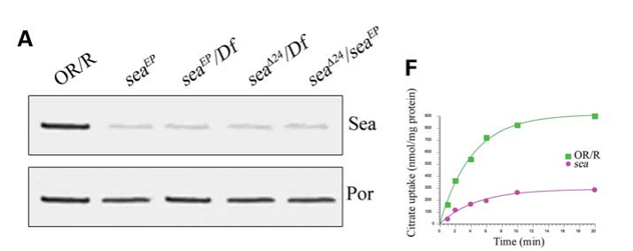

## Question

# Gene Research for Functional Annotation

## ⚠️ CRITICAL: Gene/Protein Identification Context

**BEFORE YOU BEGIN RESEARCH:** You MUST verify you are researching the CORRECT gene/protein. Gene symbols can be ambiguous, especially for less well-characterized genes from non-model organisms.

### Target Gene/Protein Identity (from UniProt):
- **UniProt Accession:** Q7KSQ0
- **Protein Description:** RecName: Full=Citrate transport protein {ECO:0000256|ARBA:ARBA00042640};
- **Gene Information:** Name=sea {ECO:0000313|EMBL:AAN13508.1, ECO:0000313|FlyBase:FBgn0037912}; Synonyms=anon-WO0140519.12 {ECO:0000313|EMBL:AAN13508.1}, CG31305 {ECO:0000313|EMBL:AAN13508.1}, DmCIC {ECO:0000313|EMBL:AAN13508.1}, Dmel\CG6782 {ECO:0000313|EMBL:AAN13508.1}, l(3)EP3364 {ECO:0000313|EMBL:AAN13508.1}, Sea {ECO:0000313|EMBL:AAN13508.1}, sea[Delta24] {ECO:0000313|EMBL:AAN13508.1}, SLC25A1 {ECO:0000313|EMBL:AAN13508.1}; ORFNames=CG6782 {ECO:0000313|EMBL:AAN13508.1, ECO:0000313|FlyBase:FBgn0037912}, Dmel_CG6782 {ECO:0000313|EMBL:AAN13508.1};
- **Organism (full):** Drosophila melanogaster (Fruit fly).
- **Protein Family:** Belongs to the mitochondrial carrier (TC 2.A.29) family.
- **Key Domains:** MCP_dom_sf. (IPR023395); MCP_transmembrane. (IPR018108); TXTP-like. (IPR049563); Mito_carr (PF00153)

### MANDATORY VERIFICATION STEPS:

1. **Check if the gene symbol "sea" matches the protein description above**
2. **Verify the organism is correct:** Drosophila melanogaster (Fruit fly).
3. **Check if protein family/domains align with what you find in literature**
4. **If you find literature for a DIFFERENT gene with the same or similar symbol, STOP**

### If Gene Symbol is Ambiguous or You Cannot Find Relevant Literature:

**DO NOT PROCEED WITH RESEARCH ON A DIFFERENT GENE.** Instead:
- State clearly: "The gene symbol 'sea' is ambiguous or literature is limited for this specific protein"
- Explain what you found (e.g., "Found extensive literature on a different gene with the same symbol in a different organism")
- Describe the protein based ONLY on the UniProt information provided above
- Suggest that the protein function can be inferred from domain/family information

### Research Target:

Please provide a comprehensive research report on the gene **sea** (gene ID: sea, UniProt: Q7KSQ0) in DROME.

The research report should be a detailed narrative explaining the function, biological processes, and localization of the gene product. Citations should be given for all claims.

You should prioritize authoritative reviews and primary scientific literature when conducting research. You can supplement
this with annotations you find in gene/protein databases, but these can be outdated or inaccurate.

We are specifically interested in the primary function of the gene - for enzymes, what reaction is catalyzed, and what is the substrate specificity? For transporters, what is the substrate? For structural proteins or adapters, what is the broader structural role? For signaling molecules, what is the role in the pathway.

We are interested in where in or outside the cell the gene product carries out its function.

We are also interested in the signaling or biochemical pathways in which the gene functions. We are less interested in broad pleiotropic effects, except where these elucidate the precise role.

Include evidence where possible. We are interested in both experimental evidence as well as inference from structure, evolution, or bioinformatic analysis. Precise studies should be prioritized over high-throughput, where available.

## Output

Question: You are an expert researcher providing comprehensive, well-cited information.

Provide detailed information focusing on:
1. Key concepts and definitions with current understanding
2. Recent developments and latest research (prioritize 2023-2024 sources)
3. Current applications and real-world implementations
4. Expert opinions and analysis from authoritative sources
5. Relevant statistics and data from recent studies

Format as a comprehensive research report with proper citations. Include URLs and publication dates where available.
Always prioritize recent, authoritative sources and provide specific citations for all major claims.

# Gene Research for Functional Annotation

## ⚠️ CRITICAL: Gene/Protein Identification Context

**BEFORE YOU BEGIN RESEARCH:** You MUST verify you are researching the CORRECT gene/protein. Gene symbols can be ambiguous, especially for less well-characterized genes from non-model organisms.

### Target Gene/Protein Identity (from UniProt):
- **UniProt Accession:** Q7KSQ0
- **Protein Description:** RecName: Full=Citrate transport protein {ECO:0000256|ARBA:ARBA00042640};
- **Gene Information:** Name=sea {ECO:0000313|EMBL:AAN13508.1, ECO:0000313|FlyBase:FBgn0037912}; Synonyms=anon-WO0140519.12 {ECO:0000313|EMBL:AAN13508.1}, CG31305 {ECO:0000313|EMBL:AAN13508.1}, DmCIC {ECO:0000313|EMBL:AAN13508.1}, Dmel\CG6782 {ECO:0000313|EMBL:AAN13508.1}, l(3)EP3364 {ECO:0000313|EMBL:AAN13508.1}, Sea {ECO:0000313|EMBL:AAN13508.1}, sea[Delta24] {ECO:0000313|EMBL:AAN13508.1}, SLC25A1 {ECO:0000313|EMBL:AAN13508.1}; ORFNames=CG6782 {ECO:0000313|EMBL:AAN13508.1, ECO:0000313|FlyBase:FBgn0037912}, Dmel_CG6782 {ECO:0000313|EMBL:AAN13508.1};
- **Organism (full):** Drosophila melanogaster (Fruit fly).
- **Protein Family:** Belongs to the mitochondrial carrier (TC 2.A.29) family.
- **Key Domains:** MCP_dom_sf. (IPR023395); MCP_transmembrane. (IPR018108); TXTP-like. (IPR049563); Mito_carr (PF00153)

### MANDATORY VERIFICATION STEPS:

1. **Check if the gene symbol "sea" matches the protein description above**
2. **Verify the organism is correct:** Drosophila melanogaster (Fruit fly).
3. **Check if protein family/domains align with what you find in literature**
4. **If you find literature for a DIFFERENT gene with the same or similar symbol, STOP**

### If Gene Symbol is Ambiguous or You Cannot Find Relevant Literature:

**DO NOT PROCEED WITH RESEARCH ON A DIFFERENT GENE.** Instead:
- State clearly: "The gene symbol 'sea' is ambiguous or literature is limited for this specific protein"
- Explain what you found (e.g., "Found extensive literature on a different gene with the same symbol in a different organism")
- Describe the protein based ONLY on the UniProt information provided above
- Suggest that the protein function can be inferred from domain/family information

### Research Target:

Please provide a comprehensive research report on the gene **sea** (gene ID: sea, UniProt: Q7KSQ0) in DROME.

The research report should be a detailed narrative explaining the function, biological processes, and localization of the gene product. Citations should be given for all claims.

You should prioritize authoritative reviews and primary scientific literature when conducting research. You can supplement
this with annotations you find in gene/protein databases, but these can be outdated or inaccurate.

We are specifically interested in the primary function of the gene - for enzymes, what reaction is catalyzed, and what is the substrate specificity? For transporters, what is the substrate? For structural proteins or adapters, what is the broader structural role? For signaling molecules, what is the role in the pathway.

We are interested in where in or outside the cell the gene product carries out its function.

We are also interested in the signaling or biochemical pathways in which the gene functions. We are less interested in broad pleiotropic effects, except where these elucidate the precise role.

Include evidence where possible. We are interested in both experimental evidence as well as inference from structure, evolution, or bioinformatic analysis. Precise studies should be prioritized over high-throughput, where available.

# Functional annotation report: *sea* (scheggia; CG6782), *Drosophila melanogaster*

**Identity and principal finding.** The specified UniProt entry **Q7KSQ0** refers to the fruit-fly gene *sea*/*scheggia* (**CG6782; FlyBase FBgn0037912**), whose product is the mitochondrial citrate carrier **Sea/DmCIC**. It is the fly counterpart of human **SLC25A1**, not a similarly named gene in another organism. A CG6782 transgene rescued the original *sea* mutant phenotype, and subsequent protein-localization and citrate-exchange experiments confirmed the assignment. Its mitochondrial-carrier family and PF00153 domain annotation are consistent with this experimentally established identity. (morciano2009aconservedrole pages 1-2, curcio2020drosophilamelanogastermitochondrial pages 1-3, li2018adrosophilamodel pages 3-6)

## Molecular function and site of action

**Sea is a transporter, not an enzyme:** its primary function is to exchange citrate and related organic acids across the **inner mitochondrial membrane**, ordinarily exporting citrate made in the mitochondrial matrix in exchange for a counter-substrate such as cytosolic L-malate. The carrier is an **obligatory antiporter**; it does not catalyze citrate synthesis or ATP-citrate-lyase cleavage. Characterization of reconstituted fly protein supports citrate and isocitrate transport and exchange involving cis-aconitate, L-malate, succinate and phosphoenolpyruvate. Citrate is the clearest physiologically established exported substrate. The citrate-carrier inhibitor 1,2,3-benzenetricarboxylate inhibits transport. The reported citrate homo-exchange *K*m is approximately **132 µM**; this value characterizes an in-vitro exchange assay, not a measured intracellular citrate concentration. These biochemical particulars are reported in the 2020 carrier review of Carrisi and colleagues’ 2008 primary characterization; the original 2008 paper was not available for independent full-text verification here. (curcio2020drosophilamelanogastermitochondrial pages 7-9)

Mitochondrial carriers typically have three related domains containing six membrane-spanning helices and conserved carrier-signature sequences, consistent with the supplied MCP/PF00153 annotations. This architecture supports Sea’s inner-membrane assignment but does **not**, on its own, establish its substrate specificity; the transport assays do that. In fly cells, an antibody detected an approximately **33-kDa** Sea protein in mitochondrial extracts, and Sea staining colocalized with Skap, an inner-mitochondrial-membrane marker. Morciano and colleagues’ **Figure 2** also shows lower [¹⁴C]citrate/citrate exchange by proteoliposomes made with *sea*-mutant mitochondrial extracts. Thus, the supported functional location is the **mitochondrial inner membrane**, linking the matrix and cytosol—not the plasma membrane or nucleus. (curcio2020drosophilamelanogastermitochondrial pages 1-3, morciano2009aconservedrole pages 3-4, morciano2009aconservedrole media 981f69c5)

The genetic and biochemical results agree quantitatively: *sea* mutants had approximately **70% less citrate/citrate exchange** and **70% less cytosolic citrate**, without a corresponding reduction in mitochondrial citrate. Their apparent exchange *K*m remained similar to control (**0.133 versus 0.132 mM**), whereas measured maximum exchange velocity fell from about **331.5 to 86.3 nmol·min⁻¹·mg⁻¹** in mitochondrial-extract reconstitutions. The interpretation is reduced carrier-dependent export capacity, rather than evidence that the mutant carrier recognizes a different substrate. Assay-specific velocities from mitochondrial extracts should not be equated with values for purified recombinant protein. (morciano2009aconservedrole pages 2-3, morciano2009aconservedrole pages 3-4)

## Biochemical processes illuminated by loss of Sea

**Citrate-to-acetyl-CoA and chromatin.** Exported citrate provides cytosolic ATP-citrate lyase with substrate for production of acetyl-CoA and oxaloacetate. Acetyl-CoA can supply lipid biosynthesis and protein acetylation; Sea’s direct step is *citrate exchange*, not any subsequent acetylation reaction. In fly *sea*-mutant cells, histone H4 acetylation fell by approximately **50%**, while measured histone acetyltransferase activity did not significantly change. Feeding citrate or inhibiting histone deacetylases reduced chromosome-breakage phenotypes. These findings support a model in which curtailed citrate supply restricts acetyl-CoA available for chromatin acetylation and thereby compromises chromosome integrity; they do not establish Sea as a nuclear protein or DNA-repair enzyme. Human SLC25A1 depletion produced analogous acetylation and chromosome defects, supporting conservation of this downstream relationship. (morciano2009aconservedrole pages 3-4, morciano2009aconservedrole pages 4-6, morciano2009aconservedrole pages 6-6)

**Glycolysis and L-2-hydroxyglutarate (L-2HG).** In *sea*-deficient larvae, lower citrate accompanies higher pyruvate, lactate and L-2HG. [U-¹³C₆]glucose tracing measured **60% greater production of labeled lactate**. Reducing phosphofructokinase expression lowered 2HG by **75%** and pyruvate and lactate by approximately **50%**; a citrate-supplemented diet also decreased all three metabolites. Lactate and 2HG levels were strongly associated (**r = 0.973; P < 0.01**). Genetic tests involving L-2HG dehydrogenase favored **impaired L-2HG degradation**, attributable to elevated lactate, over increased L-2HG synthesis as the principal reason for its accumulation. The pathway is therefore **Sea-dependent citrate export → altered glycolytic/lactate metabolism → reduced L-2HG clearance**. Sea has not been shown to transport L-2HG. Although citrate restrains glycolysis in these larvae, the exact insect glycolytic target of that regulation was not established. (li2018adrosophilamodel pages 6-8, li2018adrosophilamodel pages 8-11)

**Neuronal context.** Approximately halving neuronal *sea* expression increased larval neuromuscular-junction boutons and/or branching and raised synaptic mitochondrial content about **1.8-fold**. Combined reduction of *sea* and the ADP/ATP carrier gene *sesB* rescued synaptic morphology rather than simply aggravating it, and ATP/ADP ratios did not change consistently. These experiments demonstrate dosage-sensitive effects on synapse organization but do not identify a second direct transport function or establish citrate flux as the proximate cause of the neuronal phenotype. (gokhale2019systemsanalysisof pages 12-13, gokhale2019systemsanalysisof pages 10-12)

## Recent research and application to disease models

A particularly important **October 2023** finding limits an overly general account of Sea’s downstream role. In the male germline, depletion of mitochondrial **dCIC/Sea did not lower measured cytosolic citrate or impair male fertility**. Instead, citrate originating outside the gonad supported cytosolic ATP-citrate lyase, acetyl-CoA production and NatB-dependent **N-terminal protein acetylation**, which stabilized proteins needed for late spermatogenesis. This is evidence that a tissue can obtain essential citrate without relying on mitochondrial Sea export; it is **not** evidence that Sea itself imports extracellular citrate or directly performs N-terminal acetylation. The study did not establish an acetyl-CoA or acetylation change specifically caused by *sea* knockdown. (francois2023metabolicregulationof pages 1-2, francois2023metabolicregulationof pages 10-11)

In a **December 2025** fly study, *sea* RNAi partially suppressed eye defects from *Xpd* RNAi, restoring mean eye size to approximately **75% of wild type** and reducing associated DNA-damage and reactive-oxygen-species signals. Pharmacological SLC25A1 inhibition was also tested in human XPD-mutant cells. This is a **context-dependent genetic and experimental drug-response observation**: it does not overturn the earlier finding that Sea loss alone can cause chromosome instability. The proposed change in citrate flux was not directly measured in the fly Xpd experiments, so it should not be treated as a demonstrated new biochemical action of Sea or an established therapy. No comparably direct **2024** fly-Sea transport study was identified among the retrieved sources. (cho2025inhibitionofscheggiaslc25a1 pages 8-8, cho2025inhibitionofscheggiaslc25a1 pages 1-2)

Collectively, *sea* mutants are implemented as research models for **SLC25A1-associated citrate-transport deficiency** and its metabolic consequences. Fly citrate supplementation lowered the aberrant glycolytic metabolites and 2HG, but fly larvae predominantly accumulated **L-2HG**, whereas the cited human combined D-/L-2HG aciduria phenotype can differ in enantiomer balance. A reported human response to citrate was a case observation, not proof of broadly effective treatment. The most defensible functional annotation remains **mitochondrial citrate/tricarboxylate antiport**, with chromatin, 2HG and synaptic effects classified as downstream, tissue-dependent consequences. (li2018adrosophilamodel pages 3-6, li2018adrosophilamodel pages 8-11, li2018adrosophilamodel pages 11-13, francois2023metabolicregulationof pages 1-2)

The following evidence table distinguishes direct transport evidence from downstream phenotypes and gives dated links to the principal studies.

| Study (publication date; URL) | Directly established function or observation | Interpretation and limitations |
|---|---|---|
| **Carrisi et al., 2008** (September 2008; [DOI](https://doi.org/10.1093/jb/mvn076)), as summarized in a 2020 carrier review | Recombinant mature DmCIC/Sea was expressed in *E. coli*, purified, reconstituted into liposomes and shown to operate as an obligatory antiporter with citrate-carrier substrate specificity and inhibitor sensitivity. Citrate homo-exchange had an approximate **Kₘ of 132 µM** and **Vₘₐₓ of 11.75 mmol·min⁻¹·mg⁻¹ protein**. Reported exchange substrates include citrate, isocitrate, cis-aconitate, L-malate, succinate and phosphoenolpyruvate; 1,2,3-benzenetricarboxylate inhibits transport. (curcio2020drosophilamelanogastermitochondrial pages 7-9) | **Strongest evidence for molecular function:** Sea is a mitochondrial tricarboxylate carrier centered on citrate exchange, not an enzyme or extracellular-citrate transporter. The original 2008 article was unavailable to the present search, so kinetic and specificity details are taken from the authoritative 2020 review rather than independently checked against the primary report. |
| **Morciano et al., 2009** (November 2009; [DOI](https://doi.org/10.1093/hmg/ddp370)) | A wild-type **CG6782** transgene rescued the mutant phenotype. Anti-Sea detected an approximately **33-kDa mitochondrial protein**, and Sea colocalized with the inner-mitochondrial-membrane marker Skap. Mutants showed about **70% less [¹⁴C]citrate/citrate exchange** and **70% less cytosolic citrate**, with mitochondrial citrate unchanged. Transport Kₘ was essentially unchanged (**0.133 vs 0.132 mM**), whereas Vₘₐₓ fell from **331.5 to 86.3 nmol·min⁻¹·mg⁻¹**. Histone H4 acetylation fell about **50%**, and citrate or HDAC-inhibitor treatment reduced chromosome breakage. (morciano2009aconservedrole pages 2-3, morciano2009aconservedrole pages 3-4, morciano2009aconservedrole media 981f69c5) | **Direct genetic, localization and mitochondrial-exchange evidence** identifies CG6782/*sea* as DmCIC and links reduced export capacity—not altered citrate affinity—to depleted cytosolic citrate. Chromosome instability is a downstream consequence plausibly mediated by deficient citrate-derived acetyl-CoA and histone acetylation; it is not itself the carrier’s primary molecular function. |
| **Li, Hurlburt & Tennessen, 2018** (14 August 2018 online; [DOI](https://doi.org/10.1242/dmm.035337)) | *sea* mutants had lower citrate and higher pyruvate, lactate and L-2-hydroxyglutarate (L-2HG); a *sea* cDNA rescued the metabolic profile. [U-¹³C₆]glucose tracing showed a **60% increase in labeled lactate synthesis**. Pfk RNAi lowered 2HG by **75%** and pyruvate/lactate by about **50%**; dLdh RNAi lowered lactate and 2HG by about **60%**. Lactate and 2HG correlated strongly (**r = 0.973, P < 0.01**), and genetics supported impaired dL2HGDH-dependent degradation rather than increased L-2HG synthesis. (li2018adrosophilamodel pages 6-8, li2018adrosophilamodel pages 8-11) | Establishes an indirect pathway: reduced mitochondrial citrate export relieves restraint on glycolysis, elevates lactate and thereby inhibits L-2HG degradation. Citrate feeding lowered pyruvate, lactate and 2HG, but fly–human differences—especially D- versus L-2HG abundance and uncertain insect PFK regulation—limit clinical extrapolation. |
| **Gokhale et al., 2019** (1 May 2019; [DOI](https://doi.org/10.1523/JNEUROSCI.1983-18.2019)) | Approximately **50% neuronal reduction** of *sea* by RNAi or genomic allele increased larval neuromuscular-junction bouton number and/or branching and increased synaptic mitochondrial content about **1.8-fold**. ATP/ADP ratios were not consistently changed, and combined *sea*/*sesB* knockdown rescued synaptic morphology rather than worsening it. (gokhale2019systemsanalysisof pages 12-13, gokhale2019systemsanalysisof pages 10-12) | Supports a dosage-sensitive role for Sea in synapse development and mitochondrial distribution, not simply generalized energetic failure. These are neuronal morphology and genetic-interaction results; they do not directly measure citrate transport, synaptic-vesicle formation or acetylation. |
| **François et al., 2023** (October 2023; [DOI](https://doi.org/10.1038/s41467-023-42496-9)) | Germline depletion of dCIC/Sea did **not** reduce male fertility or measured cytosolic citrate. In contrast, cytosolic ATP-citrate lyase (dACLY) was required for fertility, and citrate supplied from outside the gonad supported acetyl-CoA production, NatB-dependent N-terminal acetylation and stabilization of proteins needed for spermatid differentiation. (francois2023metabolicregulationof pages 1-2, francois2023metabolicregulationof pages 10-11) | Important tissue-specific counterexample: mitochondrial Sea export is not the indispensable citrate source in the male germline. Sea should **not** be described as transporting extracellular citrate or as being NatB; external citrate uptake, dACLY and NatB form a distinct downstream route. The study did not directly measure acetyl-CoA or acetylation specifically after *sea* knockdown. |
| **Cho et al., 2025** (December 2025; [DOI](https://doi.org/10.1038/s41598-025-26976-0)) | *sea* RNAi partially suppressed the small-eye phenotype caused by *Xpd* RNAi—restoring average eye size to about **75% of wild type**—and reduced associated cell death, γ-H2AV DNA-damage signal and ROS. Pharmacological SLC25A1 inhibition also improved viability and unscheduled DNA synthesis in human XPD-mutant cells under reported conditions. (cho2025inhibitionofscheggiaslc25a1 pages 8-8, cho2025inhibitionofscheggiaslc25a1 pages 1-2) | Demonstrates a **context-dependent genetic interaction**, not that Sea is generally genome-protective or harmful: complete Sea deficiency itself causes chromosome instability, whereas partial inhibition can alleviate *Xpd*-deficient phenotypes. Citrate flux and acetylation were not directly measured in the fly experiments, and the human inhibitor concentrations require caution when interpreting specificity and translational relevance. |

*Table: Evidence supporting the identity and functions of Drosophila Sea/CG6782 (Q7KSQ0), arranged from direct transport assays to downstream and context-dependent phenotypes. The table distinguishes Sea’s mitochondrial citrate-exchange function from indirect metabolic, chromatin, neuronal and germline effects.*

References

1. (morciano2009aconservedrole pages 1-2): Patrizia Morciano, Chiara Carrisi, Loredana Capobianco, Linda Mannini, Giosalba Burgio, Gianluca Cestra, Giuseppe E. De Benedetto, Davide F.V. Corona, Antonio Musio, and Giovanni Cenci. A conserved role for the mitochondrial citrate transporter sea/slc25a1 in the maintenance of chromosome integrity. Human molecular genetics, 18 21:4180-8, Nov 2009. URL: https://doi.org/10.1093/hmg/ddp370, doi:10.1093/hmg/ddp370. This article has 80 citations and is from a domain leading peer-reviewed journal.

2. (curcio2020drosophilamelanogastermitochondrial pages 1-3): Rosita Curcio, Paola Lunetti, Vincenzo Zara, Alessandra Ferramosca, Federica Marra, Giuseppe Fiermonte, Anna Rita Cappello, Francesco De Leonardis, Loredana Capobianco, and Vincenza Dolce. Drosophila melanogaster mitochondrial carriers: similarities and differences with the human carriers. International Journal of Molecular Sciences, 21:6052, Aug 2020. URL: https://doi.org/10.3390/ijms21176052, doi:10.3390/ijms21176052. This article has 32 citations.

3. (li2018adrosophilamodel pages 3-6): Hongde Li, Alexander J. Hurlburt, and Jason M. Tennessen. A drosophila model of combined d-2- and l-2-hydroxyglutaric aciduria reveals a mechanism linking mitochondrial citrate export with oncometabolite accumulation. Disease Models & Mechanisms, Sep 2018. URL: https://doi.org/10.1242/dmm.035337, doi:10.1242/dmm.035337. This article has 39 citations and is from a domain leading peer-reviewed journal.

4. (curcio2020drosophilamelanogastermitochondrial pages 7-9): Rosita Curcio, Paola Lunetti, Vincenzo Zara, Alessandra Ferramosca, Federica Marra, Giuseppe Fiermonte, Anna Rita Cappello, Francesco De Leonardis, Loredana Capobianco, and Vincenza Dolce. Drosophila melanogaster mitochondrial carriers: similarities and differences with the human carriers. International Journal of Molecular Sciences, 21:6052, Aug 2020. URL: https://doi.org/10.3390/ijms21176052, doi:10.3390/ijms21176052. This article has 32 citations.

5. (morciano2009aconservedrole pages 3-4): Patrizia Morciano, Chiara Carrisi, Loredana Capobianco, Linda Mannini, Giosalba Burgio, Gianluca Cestra, Giuseppe E. De Benedetto, Davide F.V. Corona, Antonio Musio, and Giovanni Cenci. A conserved role for the mitochondrial citrate transporter sea/slc25a1 in the maintenance of chromosome integrity. Human molecular genetics, 18 21:4180-8, Nov 2009. URL: https://doi.org/10.1093/hmg/ddp370, doi:10.1093/hmg/ddp370. This article has 80 citations and is from a domain leading peer-reviewed journal.

6. (morciano2009aconservedrole media 981f69c5): Patrizia Morciano, Chiara Carrisi, Loredana Capobianco, Linda Mannini, Giosalba Burgio, Gianluca Cestra, Giuseppe E. De Benedetto, Davide F.V. Corona, Antonio Musio, and Giovanni Cenci. A conserved role for the mitochondrial citrate transporter sea/slc25a1 in the maintenance of chromosome integrity. Human molecular genetics, 18 21:4180-8, Nov 2009. URL: https://doi.org/10.1093/hmg/ddp370, doi:10.1093/hmg/ddp370. This article has 80 citations and is from a domain leading peer-reviewed journal.

7. (morciano2009aconservedrole pages 2-3): Patrizia Morciano, Chiara Carrisi, Loredana Capobianco, Linda Mannini, Giosalba Burgio, Gianluca Cestra, Giuseppe E. De Benedetto, Davide F.V. Corona, Antonio Musio, and Giovanni Cenci. A conserved role for the mitochondrial citrate transporter sea/slc25a1 in the maintenance of chromosome integrity. Human molecular genetics, 18 21:4180-8, Nov 2009. URL: https://doi.org/10.1093/hmg/ddp370, doi:10.1093/hmg/ddp370. This article has 80 citations and is from a domain leading peer-reviewed journal.

8. (morciano2009aconservedrole pages 4-6): Patrizia Morciano, Chiara Carrisi, Loredana Capobianco, Linda Mannini, Giosalba Burgio, Gianluca Cestra, Giuseppe E. De Benedetto, Davide F.V. Corona, Antonio Musio, and Giovanni Cenci. A conserved role for the mitochondrial citrate transporter sea/slc25a1 in the maintenance of chromosome integrity. Human molecular genetics, 18 21:4180-8, Nov 2009. URL: https://doi.org/10.1093/hmg/ddp370, doi:10.1093/hmg/ddp370. This article has 80 citations and is from a domain leading peer-reviewed journal.

9. (morciano2009aconservedrole pages 6-6): Patrizia Morciano, Chiara Carrisi, Loredana Capobianco, Linda Mannini, Giosalba Burgio, Gianluca Cestra, Giuseppe E. De Benedetto, Davide F.V. Corona, Antonio Musio, and Giovanni Cenci. A conserved role for the mitochondrial citrate transporter sea/slc25a1 in the maintenance of chromosome integrity. Human molecular genetics, 18 21:4180-8, Nov 2009. URL: https://doi.org/10.1093/hmg/ddp370, doi:10.1093/hmg/ddp370. This article has 80 citations and is from a domain leading peer-reviewed journal.

10. (li2018adrosophilamodel pages 6-8): Hongde Li, Alexander J. Hurlburt, and Jason M. Tennessen. A drosophila model of combined d-2- and l-2-hydroxyglutaric aciduria reveals a mechanism linking mitochondrial citrate export with oncometabolite accumulation. Disease Models & Mechanisms, Sep 2018. URL: https://doi.org/10.1242/dmm.035337, doi:10.1242/dmm.035337. This article has 39 citations and is from a domain leading peer-reviewed journal.

11. (li2018adrosophilamodel pages 8-11): Hongde Li, Alexander J. Hurlburt, and Jason M. Tennessen. A drosophila model of combined d-2- and l-2-hydroxyglutaric aciduria reveals a mechanism linking mitochondrial citrate export with oncometabolite accumulation. Disease Models & Mechanisms, Sep 2018. URL: https://doi.org/10.1242/dmm.035337, doi:10.1242/dmm.035337. This article has 39 citations and is from a domain leading peer-reviewed journal.

12. (gokhale2019systemsanalysisof pages 12-13): Avanti Gokhale, Amanda A. H. Freeman, Cortnie Hartwig, Julia L. Bassell, Stephanie A. Zlatic, Christie Sapp, Trishna Vadlamudi, Farida Abudulai, Amanda Crocker, Erica Werner, Zhexing Wen, Gabriela M. Repetto, Joseph A. Gogos, Steven M. Claypool, Jennifer K. Forsyth, Carrie Bearden, Jill Gausier, David A. Lewis, Nicholas T. Seyfried, and Victor Faundez. Systems analysis of the 22q11.2 microdeletion syndrome converges on a mitochondrial interactome necessary for synapse function and behavior. The Journal of Neuroscience, 39:3561-3581, May 2019. URL: https://doi.org/10.1523/jneurosci.1983-18.2019, doi:10.1523/jneurosci.1983-18.2019. This article has 72 citations.

13. (gokhale2019systemsanalysisof pages 10-12): Avanti Gokhale, Amanda A. H. Freeman, Cortnie Hartwig, Julia L. Bassell, Stephanie A. Zlatic, Christie Sapp, Trishna Vadlamudi, Farida Abudulai, Amanda Crocker, Erica Werner, Zhexing Wen, Gabriela M. Repetto, Joseph A. Gogos, Steven M. Claypool, Jennifer K. Forsyth, Carrie Bearden, Jill Gausier, David A. Lewis, Nicholas T. Seyfried, and Victor Faundez. Systems analysis of the 22q11.2 microdeletion syndrome converges on a mitochondrial interactome necessary for synapse function and behavior. The Journal of Neuroscience, 39:3561-3581, May 2019. URL: https://doi.org/10.1523/jneurosci.1983-18.2019, doi:10.1523/jneurosci.1983-18.2019. This article has 72 citations.

14. (francois2023metabolicregulationof pages 1-2): Charlotte M. François, Thomas Pihl, Marion Dunoyer de Segonzac, Chloé Hérault, and Bruno Hudry. Metabolic regulation of proteome stability via n-terminal acetylation controls male germline stem cell differentiation and reproduction. Nature Communications, Oct 2023. URL: https://doi.org/10.1038/s41467-023-42496-9, doi:10.1038/s41467-023-42496-9. This article has 21 citations and is from a highest quality peer-reviewed journal.

15. (francois2023metabolicregulationof pages 10-11): Charlotte M. François, Thomas Pihl, Marion Dunoyer de Segonzac, Chloé Hérault, and Bruno Hudry. Metabolic regulation of proteome stability via n-terminal acetylation controls male germline stem cell differentiation and reproduction. Nature Communications, Oct 2023. URL: https://doi.org/10.1038/s41467-023-42496-9, doi:10.1038/s41467-023-42496-9. This article has 21 citations and is from a highest quality peer-reviewed journal.

16. (cho2025inhibitionofscheggiaslc25a1 pages 8-8): Dong-Gyu Cho, Jea-Hoon Jung, Ji-hyun Hwang, and Kwang-Wook Choi. Inhibition of scheggia/slc25a1 citrate transporter alleviates xpd deficits. Scientific Reports, Dec 2025. URL: https://doi.org/10.1038/s41598-025-26976-0, doi:10.1038/s41598-025-26976-0. This article has 0 citations and is from a peer-reviewed journal.

17. (cho2025inhibitionofscheggiaslc25a1 pages 1-2): Dong-Gyu Cho, Jea-Hoon Jung, Ji-hyun Hwang, and Kwang-Wook Choi. Inhibition of scheggia/slc25a1 citrate transporter alleviates xpd deficits. Scientific Reports, Dec 2025. URL: https://doi.org/10.1038/s41598-025-26976-0, doi:10.1038/s41598-025-26976-0. This article has 0 citations and is from a peer-reviewed journal.

18. (li2018adrosophilamodel pages 11-13): Hongde Li, Alexander J. Hurlburt, and Jason M. Tennessen. A drosophila model of combined d-2- and l-2-hydroxyglutaric aciduria reveals a mechanism linking mitochondrial citrate export with oncometabolite accumulation. Disease Models & Mechanisms, Sep 2018. URL: https://doi.org/10.1242/dmm.035337, doi:10.1242/dmm.035337. This article has 39 citations and is from a domain leading peer-reviewed journal.

## Artifacts

- [Edison artifact artifact-00](sea-deep-research-falcon_artifacts/artifact-00.md)

## Citations

1. curcio2020drosophilamelanogastermitochondrial pages 7-9
2. morciano2009aconservedrole pages 1-2
3. curcio2020drosophilamelanogastermitochondrial pages 1-3
4. li2018adrosophilamodel pages 3-6
5. morciano2009aconservedrole pages 3-4
6. morciano2009aconservedrole pages 2-3
7. morciano2009aconservedrole pages 4-6
8. morciano2009aconservedrole pages 6-6
9. li2018adrosophilamodel pages 6-8
10. li2018adrosophilamodel pages 8-11
11. gokhale2019systemsanalysisof pages 12-13
12. gokhale2019systemsanalysisof pages 10-12
13. francois2023metabolicregulationof pages 1-2
14. francois2023metabolicregulationof pages 10-11
15. li2018adrosophilamodel pages 11-13
16. Delta24
17. ¹⁴C
18. U-¹³C₆
19. DOI
20. https://doi.org/10.1093/jb/mvn076
21. https://doi.org/10.1093/hmg/ddp370
22. https://doi.org/10.1242/dmm.035337
23. https://doi.org/10.1523/JNEUROSCI.1983-18.2019
24. https://doi.org/10.1038/s41467-023-42496-9
25. https://doi.org/10.1038/s41598-025-26976-0
26. https://doi.org/10.1093/hmg/ddp370,
27. https://doi.org/10.3390/ijms21176052,
28. https://doi.org/10.1242/dmm.035337,
29. https://doi.org/10.1523/jneurosci.1983-18.2019,
30. https://doi.org/10.1038/s41467-023-42496-9,
31. https://doi.org/10.1038/s41598-025-26976-0,