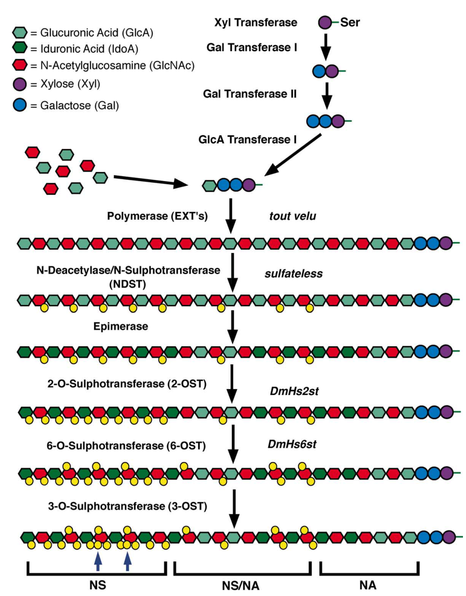

## Question

# Gene Research for Functional Annotation

## ⚠️ CRITICAL: Gene/Protein Identification Context

**BEFORE YOU BEGIN RESEARCH:** You MUST verify you are researching the CORRECT gene/protein. Gene symbols can be ambiguous, especially for less well-characterized genes from non-model organisms.

### Target Gene/Protein Identity (from UniProt):
- **UniProt Accession:** O02373
- **Protein Description:** RecName: Full=UDP-glucose 6-dehydrogenase; Short=UDP-Glc dehydrogenase; Short=UDP-GlcDH; Short=UDPGDH; EC=1.1.1.22; AltName: Full=Protein sugarless; AltName: Full=Protein suppenkasper;
- **Gene Information:** Name=sgl; Synonyms=kiwi, ska; ORFNames=CG10072;
- **Organism (full):** Drosophila melanogaster (Fruit fly).
- **Protein Family:** Belongs to the UDP-glucose/GDP-mannose dehydrogenase
- **Key Domains:** 6-PGluconate_DH-like_C_sf. (IPR008927); NAD(P)-bd_dom_sf. (IPR036291); UDP-Glc/GDP-Man. (IPR017476); UDP-Glc/GDP-Man_DH_C. (IPR014027); UDP-Glc/GDP-Man_DH_C_sf. (IPR036220)

### MANDATORY VERIFICATION STEPS:

1. **Check if the gene symbol "sgl" matches the protein description above**
2. **Verify the organism is correct:** Drosophila melanogaster (Fruit fly).
3. **Check if protein family/domains align with what you find in literature**
4. **If you find literature for a DIFFERENT gene with the same or similar symbol, STOP**

### If Gene Symbol is Ambiguous or You Cannot Find Relevant Literature:

**DO NOT PROCEED WITH RESEARCH ON A DIFFERENT GENE.** Instead:
- State clearly: "The gene symbol 'sgl' is ambiguous or literature is limited for this specific protein"
- Explain what you found (e.g., "Found extensive literature on a different gene with the same symbol in a different organism")
- Describe the protein based ONLY on the UniProt information provided above
- Suggest that the protein function can be inferred from domain/family information

### Research Target:

Please provide a comprehensive research report on the gene **sgl** (gene ID: sgl, UniProt: O02373) in DROME.

The research report should be a detailed narrative explaining the function, biological processes, and localization of the gene product. Citations should be given for all claims.

You should prioritize authoritative reviews and primary scientific literature when conducting research. You can supplement
this with annotations you find in gene/protein databases, but these can be outdated or inaccurate.

We are specifically interested in the primary function of the gene - for enzymes, what reaction is catalyzed, and what is the substrate specificity? For transporters, what is the substrate? For structural proteins or adapters, what is the broader structural role? For signaling molecules, what is the role in the pathway.

We are interested in where in or outside the cell the gene product carries out its function.

We are also interested in the signaling or biochemical pathways in which the gene functions. We are less interested in broad pleiotropic effects, except where these elucidate the precise role.

Include evidence where possible. We are interested in both experimental evidence as well as inference from structure, evolution, or bioinformatic analysis. Precise studies should be prioritized over high-throughput, where available.

## Output

Question: You are an expert researcher providing comprehensive, well-cited information.

Provide detailed information focusing on:
1. Key concepts and definitions with current understanding
2. Recent developments and latest research (prioritize 2023-2024 sources)
3. Current applications and real-world implementations
4. Expert opinions and analysis from authoritative sources
5. Relevant statistics and data from recent studies

Format as a comprehensive research report with proper citations. Include URLs and publication dates where available.
Always prioritize recent, authoritative sources and provide specific citations for all major claims.

# Gene Research for Functional Annotation

## ⚠️ CRITICAL: Gene/Protein Identification Context

**BEFORE YOU BEGIN RESEARCH:** You MUST verify you are researching the CORRECT gene/protein. Gene symbols can be ambiguous, especially for less well-characterized genes from non-model organisms.

### Target Gene/Protein Identity (from UniProt):
- **UniProt Accession:** O02373
- **Protein Description:** RecName: Full=UDP-glucose 6-dehydrogenase; Short=UDP-Glc dehydrogenase; Short=UDP-GlcDH; Short=UDPGDH; EC=1.1.1.22; AltName: Full=Protein sugarless; AltName: Full=Protein suppenkasper;
- **Gene Information:** Name=sgl; Synonyms=kiwi, ska; ORFNames=CG10072;
- **Organism (full):** Drosophila melanogaster (Fruit fly).
- **Protein Family:** Belongs to the UDP-glucose/GDP-mannose dehydrogenase
- **Key Domains:** 6-PGluconate_DH-like_C_sf. (IPR008927); NAD(P)-bd_dom_sf. (IPR036291); UDP-Glc/GDP-Man. (IPR017476); UDP-Glc/GDP-Man_DH_C. (IPR014027); UDP-Glc/GDP-Man_DH_C_sf. (IPR036220)

### MANDATORY VERIFICATION STEPS:

1. **Check if the gene symbol "sgl" matches the protein description above**
2. **Verify the organism is correct:** Drosophila melanogaster (Fruit fly).
3. **Check if protein family/domains align with what you find in literature**
4. **If you find literature for a DIFFERENT gene with the same or similar symbol, STOP**

### If Gene Symbol is Ambiguous or You Cannot Find Relevant Literature:

**DO NOT PROCEED WITH RESEARCH ON A DIFFERENT GENE.** Instead:
- State clearly: "The gene symbol 'sgl' is ambiguous or literature is limited for this specific protein"
- Explain what you found (e.g., "Found extensive literature on a different gene with the same symbol in a different organism")
- Describe the protein based ONLY on the UniProt information provided above
- Suggest that the protein function can be inferred from domain/family information

### Research Target:

Please provide a comprehensive research report on the gene **sgl** (gene ID: sgl, UniProt: O02373) in DROME.

The research report should be a detailed narrative explaining the function, biological processes, and localization of the gene product. Citations should be given for all claims.

You should prioritize authoritative reviews and primary scientific literature when conducting research. You can supplement
this with annotations you find in gene/protein databases, but these can be outdated or inaccurate.

We are specifically interested in the primary function of the gene - for enzymes, what reaction is catalyzed, and what is the substrate specificity? For transporters, what is the substrate? For structural proteins or adapters, what is the broader structural role? For signaling molecules, what is the role in the pathway.

We are interested in where in or outside the cell the gene product carries out its function.

We are also interested in the signaling or biochemical pathways in which the gene functions. We are less interested in broad pleiotropic effects, except where these elucidate the precise role.

Include evidence where possible. We are interested in both experimental evidence as well as inference from structure, evolution, or bioinformatic analysis. Precise studies should be prioritized over high-throughput, where available.

# Functional annotation of *Drosophila melanogaster* sugarless (*sgl*)

## Identity and principal function

**Identity check:** The supplied UniProt accession **O02373** and ORF name **CG10072** designate the intended fly protein. Independent Drosophila literature identifies *sugarless* (*sgl*), also called *kiwi* and *suppenkasper*, as the fly homolog of **UDP-glucose 6-dehydrogenase** (UGDH; EC 1.1.1.22), not a similarly named gene from another organism. Cloning and sequence comparison of a fly locus at cytological position 65D support that assignment. The supplied NAD-binding and UDP-glucose/GDP-mannose-dehydrogenase-family domain annotations are consistent with it; the accession and CG number themselves are identifiers provided in the question rather than independently established by the papers examined. (e2002udpglucosedehydrogenasea pages 126-129, nybakken2002heparansulfateproteoglycan pages 4-5)

Sgl’s primary role is **nucleotide-sugar production**, not direct signal transduction. It oxidizes UDP-glucose to UDP-glucuronate (UDP-GlcA). The accepted net reaction for this enzyme class is **UDP-glucose + 2 NAD⁺ + H₂O → UDP-glucuronate + 2 NADH + 2 H⁺**. Fly genetic and sequence evidence identifies Sgl with this reaction; the two-NAD⁺ stoichiometry is directly described in work on a closely related *Caenorhabditis elegans* enzyme, rather than established here by a purified-fly-Sgl assay. (e2002udpglucosedehydrogenasea pages 1-6, zimmer2021integrationofsugar pages 1-2, hwang2002thecaenorhabditiselegans pages 2-3)

**Substrate specificity requires the same qualification.** UDP-glucose is the established physiological substrate. In a recombinant *C. elegans* UGDH assay, UDP-galactose, UDP-mannose, UDP-GlcA, UDP-GlcNAc, dTDP-glucose, ADP-glucose, CDP-glucose and GDP-glucose did **not** support detectable NAD⁺ reduction under the tested conditions. That is compelling family-level evidence, **not** a measured substrate panel for Drosophila Sgl. Likewise, UDP-xylose feedback inhibition and its oligomeric structural mechanism have been characterized principally for mammalian UGDH and should not be asserted as directly tested regulation of Sgl. (hwang2002thecaenorhabditiselegans pages 2-3, zimmer2021integrationofsugar pages 4-6, zimmer2021integrationofsugar pages 6-7)

## Where the protein acts

The best-supported working localization is **inside the cell, in the cytosol**: a fly-specific study describes UDP-GlcDH as cytoplasmic, and a later UGDH review places the NAD-dependent reaction in the cytosol. This is distinct from the location of its downstream products’ use. UDP-GlcA is supplied to intracellular glycan-biosynthetic compartments, notably the Golgi, where glycosaminoglycan chains are assembled on proteoglycan core proteins; mature heparan-sulfate proteoglycans then function at the **cell surface and in extracellular matrix**. Thus Sgl is not itself the extracellular proteoglycan or a Golgi chain-polymerizing glycosyltransferase. The retrieved fly evidence does not establish a finer-resolution, experimentally imaged subcellular distribution for endogenous Sgl. (e2002udpglucosedehydrogenasea pages 1-6, zimmer2021integrationofsugar pages 1-2, nybakken2002heparansulfateproteoglycan pages 2-4)

## Biochemical pathway and developmental signaling

UDP-GlcA supplies glucuronic-acid residues for the common proteoglycan linkage region and for extension of heparan-sulfate and chondroitin-sulfate chains. It also supplies UDP-xylose, needed to initiate the linkage region. Sgl therefore acts **upstream of glycosaminoglycan synthesis**; subsequent extracellular effects on ligands and receptors are consequences of precursor availability, rather than additional catalytic activities of Sgl. The heparan-sulfate assembly scheme is illustrated in Figure 1 of Nybakken and Perrimon’s review. (zimmer2021integrationofsugar pages 1-2, nybakken2002heparansulfateproteoglycan pages 4-5, nybakken2002heparansulfateproteoglycan media e977b197)

The strongest fly-specific pathway evidence concerns **Wingless (Wg/Wnt)**. Eliminating both maternal and zygotic *sgl* produces a *wg*-like embryonic segment-polarity phenotype. Reported injection of **UDP-GlcA or heparan sulfate** into *sgl*-null embryos rescued the phenotype, while heparinase treatment of otherwise wild-type embryos reproduced aspects of it. Together, these genetic, bypass and degradation experiments support a causal chain from Sgl-dependent precursor production to heparan-sulfate-dependent Wg signaling. They do not make Sgl a Wg ligand, receptor or intracellular Wnt-pathway component. (nybakken2002heparansulfateproteoglycan pages 4-5, ornitz2000fgfsheparansulfate pages 2-3)

**FGF signaling** provides a second, pathway-specific connection. A contemporary expert analysis reports that *sgl*- and *sulfateless*-null embryos share developmental defects with the FGF-pathway genes *heartless*, *branchless* and *breathless*, and describes epistasis placing the glycan-biosynthetic requirement upstream of FGF-pathway components. Heparan sulfate is accordingly interpreted as helping FGF ligand–receptor signaling; the precise molecular contribution of fly Sgl itself remains its upstream supply of UDP-GlcA. (ornitz2000fgfsheparansulfate pages 2-3)

Evidence also implicates Sgl-dependent glycans in **Decapentaplegic (Dpp/BMP)** signaling. In a 2002 fly study, embryos carrying zygotic *sgl* defects lost or strongly reduced the Dpp-responsive **Kruppel** signal in the amnioserosa and showed reduced or interrupted **even-skipped** and **tinman** expression in dorsal tissues. Approximately **one-quarter of embryos from the experimental cross** showed substantially reduced even-skipped and tinman signals; that proportion describes the cross, not penetrance in a molecularly confirmed set of homozygous mutants. Dorsal cuticle and closure defects accompanied these molecular observations. Separately, induced heparinase III produced related dorsal defects: **68% of 500 treated embryos** had the reported lethal U-shaped phenotype, versus none of the listed controls. Crucially, **68% is a heparinase-treatment result, not an *sgl*-mutant lethality estimate**. These results favor an extracellular glycan-mediated explanation for the Dpp phenotype, without demonstrating direct Sgl–Dpp binding. (e2002udpglucosedehydrogenasea pages 135-138, e2002udpglucosedehydrogenasea pages 154-157)

## Developmental expression, present use and limits of the evidence

Fly transcript analysis detected an approximately **2.4-kb** UDP-GlcDH RNA. In situ observations placed embryonic transcript accumulation in the amnioserosa from stage 9, with weaker stage-11 signal in presumptive pericardial cells and head segments; larval leg imaginal discs showed broadly distributed transcript. These measurements locate **gene expression**, not the catalytic protein within a cell. Fly loss-of-function, precursor-bypass and heparinase experiments make *sgl* a practical genetic tool for testing whether a developmental signaling phenotype depends on glycosaminoglycan production. (e2002udpglucosedehydrogenasea pages 132-135, nybakken2002heparansulfateproteoglycan pages 4-5, ornitz2000fgfsheparansulfate pages 2-3)

**Currency and confidence:** The most useful retrieved modern biochemical synthesis was published in **2021**; searches did not identify a **2023–2024 study directly measuring Drosophila Sgl catalysis or localization**. Foundational fly genetics is older, and some original 1997 articles could not be examined in full; the rescue and FGF findings above are therefore reported through a contemporary expert review. Human UGDH work on hexamer dynamics and UDP-xylose inhibition, and *C. elegans* work on substrate specificity, refine the conserved-enzyme model but must remain labeled **ortholog evidence**, not new fly-specific measurements. A recent review also cautions by comparison that fly UGDH deficiency concerns proteoglycan GAG chains, whereas hyaluronan synthesis and ER glucuronidation discussed for other organisms should not automatically be assigned physiological roles for *Drosophila sgl*. (zimmer2021integrationofsugar pages 2-4, ornitz2000fgfsheparansulfate pages 2-3, hwang2002thecaenorhabditiselegans pages 2-3, zimmer2021integrationofsugar pages 4-6)

**Selected source details:** Nybakken and Perrimon, *Biochimica et Biophysica Acta* **2002**, https://doi.org/10.1016/S0304-4165(02)00395-1; Scanga, University of Alberta doctoral thesis **2002**, https://doi.org/10.7939/r3-btw4-hy02; Ornitz, *BioEssays* **2000**, https://doi.org/10.1002/(SICI)1521-1878(200002)22:2%3C108::AID-BIES2%3E3.0.CO;2-M; Hwang and Horvitz, *PNAS* **2002**, https://doi.org/10.1073/pnas.172522499; Zimmer, Barycki and Simpson, *Journal of Histochemistry & Cytochemistry* **2021**, https://doi.org/10.1369/0022155420947500. (nybakken2002heparansulfateproteoglycan pages 4-5, e2002udpglucosedehydrogenasea pages 1-6, ornitz2000fgfsheparansulfate pages 2-3, hwang2002thecaenorhabditiselegans pages 2-3, zimmer2021integrationofsugar pages 1-2)

The following evidence map separates observations made in flies from inference based on conserved UGDH biochemistry.

| Assertion | Direct fly evidence or source evidence | Inference / limitation | Citation |
|---|---|---|---|
| **Identity, aliases, and family** | *D. melanogaster* **sugarless (sgl)**—also **suppenkasper** and **kiwi**—is identified as the fly homolog of UDP-glucose dehydrogenase; cloned sequence mapped to cytological region 65D and matched the UDP-GlcDH family. | Confirms the supplied O02373 description and UDP-glucose/GDP-mannose dehydrogenase-family annotation. O02373 and CG10072 are supplied database identifiers, not independently established by these papers. | (e2002udpglucosedehydrogenasea pages 126-129, nybakken2002heparansulfateproteoglycan pages 4-5) |
| **Reaction and cofactor** | Fly sources describe Sgl as producing UDP-glucuronate from UDP-glucose. Conserved UGDH chemistry is **UDP-glucose + 2 NAD⁺ + H₂O → UDP-glucuronate + 2 NADH + 2 H⁺**; the two-NAD⁺ stoichiometry was directly documented for recombinant *C. elegans* SQV-4. | The retrieved fly studies establish gene–enzyme identity genetically and by sequence but do not provide purified-Sgl kinetics; exact stoichiometry is conserved-enzyme inference supported by an ortholog assay. | (e2002udpglucosedehydrogenasea pages 1-6, zimmer2021integrationofsugar pages 1-2, hwang2002thecaenorhabditiselegans pages 2-3) |
| **Cellular and pathway localization** | The fly thesis calls UDP-GlcDH **cytoplasmic**. Current UGDH understanding places catalysis in the **cytosol**, followed by transport of UDP-glucuronate into Golgi/ER lumina; proteoglycan-chain assembly occurs in the Golgi, and mature heparan-sulfate proteoglycans act at cell surfaces or in extracellular matrix. | Sgl itself should not be described as a Golgi glycosyltransferase or extracellular protein. Its intracellular product supplies spatially separate Golgi biosynthesis whose extracellular products modulate signaling. | (nybakken2002heparansulfateproteoglycan pages 2-4, e2002udpglucosedehydrogenasea pages 1-6, zimmer2021integrationofsugar pages 1-2) |
| **Wingless/Wnt pathway** | Removing maternal and zygotic **sgl** phenocopies the embryonic *wg* segment-polarity phenotype. Injecting UDP-glucuronic acid or heparan sulfate into *sgl*-null embryos rescued the phenotype, whereas heparinase injection into wild type phenocopied it. | This supports an indirect biochemical role: Sgl supplies glucuronate for HS/GAG synthesis, and HS controls extracellular Wg distribution or reception; Sgl is not itself a Wg receptor or canonical intracellular transducer. | (nybakken2002heparansulfateproteoglycan pages 4-5, ornitz2000fgfsheparansulfate pages 2-3) |
| **FGF pathway** | *sgl* and *sulfateless* null embryos share phenotypes with the fly FGF-pathway genes *heartless*, *branchless*, and *breathless*; epistasis places the HS-biosynthetic genes upstream of these FGF-pathway components. | The most defensible interpretation is that Sgl-dependent HS promotes ligand–receptor complex formation, stability, or ligand distribution—not that Sgl directly catalyzes an FGF-pathway reaction. | (ornitz2000fgfsheparansulfate pages 2-3) |
| **Dpp/BMP pathway** | At embryonic stages 11–12, zygotic *sgl*/UDP-GlcDH loss abolished or strongly reduced Dpp-responsive **Kruppel** in the amnioserosa and reduced/interrupted **even-skipped** and **tinman** in dorsal tissues; approximately one-quarter of embryos from the analyzed cross showed reduced EVE/TIN. | These data support attenuated, dosage-sensitive Dpp signaling. They do not establish direct physical binding between Sgl and Dpp. | (e2002udpglucosedehydrogenasea pages 135-138) |
| **Heparinase phenocopy and the 68% statistic** | Induced, secreted heparinase III depleted HS and produced U-shaped dorsal defects plus loss of KR/TIN; **68% of 500 heat-treated hsGal4/UAS-heparinase III embryos** were scored as dead with the reported phenotype, versus none in listed controls. | **This is heparinase-treatment lethality, not an sgl-mutant lethality rate.** It supports HS as the downstream extracellular mediator of the Sgl-dependent Dpp phenotype. | (e2002udpglucosedehydrogenasea pages 154-157) |
| **Substrate specificity** | Recombinant *C. elegans* SQV-4 reduced NAD⁺ with UDP-glucose but not UDP-galactose, UDP-mannose, UDP-glucuronate, UDP-GlcNAc, dTDP-glucose, ADP-glucose, CDP-glucose, or GDP-glucose under the reported conditions. | This is strong **ortholog evidence**, not a direct substrate panel for purified Drosophila Sgl; fly specificity should therefore be annotated as family-based inference. | (hwang2002thecaenorhabditiselegans pages 2-3) |
| **UDP-xylose feedback inhibition and oligomeric mechanism** | Mammalian/human UGDH studies show UDP-xylose occupying the UDP-glucose site and stabilizing an inhibited conformational state; removal of UDP-xylose can raise cellular UGDH activity by more than an order of magnitude. | These mechanistic findings are **ortholog-only** in the retrieved evidence and should not be presented as experimentally demonstrated regulation of fly Sgl. | (zimmer2021integrationofsugar pages 4-6, zimmer2021integrationofsugar pages 6-7) |
| **Currency of evidence** | The most recent retrieved synthesis is a 2021 UGDH review; the decisive fly-specific evidence remains the foundational 1997-era genetics and subsequent fly work. | No retrieved 2023–2024 study directly tested Drosophila **sgl** catalysis or mechanism; recent general GAG/UGDH literature should not be misrepresented as fly-specific validation. | (zimmer2021integrationofsugar pages 2-4, zimmer2021integrationofsugar pages 1-2) |

*Table: Evidence-weighted annotation of Drosophila sugarless, separating direct fly results from conserved-enzyme and mammalian-ortholog inferences. It also clarifies cellular compartmentation and prevents misattribution of the 68% heparinase phenotype to sgl mutants.*

References

1. (e2002udpglucosedehydrogenasea pages 126-129): Sam E Scanga. Udp-glucose dehydrogenase: a gene involved in the biosynthesis of heparin-like gags is required for dpp signaling in drosophila melanogaster. Text, 2002. URL: https://doi.org/10.7939/r3-btw4-hy02, doi:10.7939/r3-btw4-hy02. This article has 0 citations and is from a peer-reviewed journal.

2. (nybakken2002heparansulfateproteoglycan pages 4-5): Kent Nybakken and Norbert Perrimon. Heparan sulfate proteoglycan modulation of developmental signaling in drosophila. Biochimica et biophysica acta, 1573 3:280-91, Dec 2002. URL: https://doi.org/10.1016/s0304-4165(02)00395-1, doi:10.1016/s0304-4165(02)00395-1. This article has 181 citations.

3. (e2002udpglucosedehydrogenasea pages 1-6): Sam E Scanga. Udp-glucose dehydrogenase: a gene involved in the biosynthesis of heparin-like gags is required for dpp signaling in drosophila melanogaster. Text, 2002. URL: https://doi.org/10.7939/r3-btw4-hy02, doi:10.7939/r3-btw4-hy02. This article has 0 citations and is from a peer-reviewed journal.

4. (zimmer2021integrationofsugar pages 1-2): Brenna M. Zimmer, Joseph J. Barycki, and Melanie A. Simpson. Integration of sugar metabolism and proteoglycan synthesis by udp-glucose dehydrogenase. Journal of Histochemistry & Cytochemistry, 69:13-23, Aug 2021. URL: https://doi.org/10.1369/0022155420947500, doi:10.1369/0022155420947500. This article has 57 citations and is from a peer-reviewed journal.

5. (hwang2002thecaenorhabditiselegans pages 2-3): Ho-Yon Hwang and H. Robert Horvitz. The caenorhabditis elegans vulval morphogenesis gene sqv-4 encodes a udp-glucose dehydrogenase that is temporally and spatially regulated. Proceedings of the National Academy of Sciences of the United States of America, 99:14224-14229, Oct 2002. URL: https://doi.org/10.1073/pnas.172522499, doi:10.1073/pnas.172522499. This article has 80 citations and is from a highest quality peer-reviewed journal.

6. (zimmer2021integrationofsugar pages 4-6): Brenna M. Zimmer, Joseph J. Barycki, and Melanie A. Simpson. Integration of sugar metabolism and proteoglycan synthesis by udp-glucose dehydrogenase. Journal of Histochemistry & Cytochemistry, 69:13-23, Aug 2021. URL: https://doi.org/10.1369/0022155420947500, doi:10.1369/0022155420947500. This article has 57 citations and is from a peer-reviewed journal.

7. (zimmer2021integrationofsugar pages 6-7): Brenna M. Zimmer, Joseph J. Barycki, and Melanie A. Simpson. Integration of sugar metabolism and proteoglycan synthesis by udp-glucose dehydrogenase. Journal of Histochemistry & Cytochemistry, 69:13-23, Aug 2021. URL: https://doi.org/10.1369/0022155420947500, doi:10.1369/0022155420947500. This article has 57 citations and is from a peer-reviewed journal.

8. (nybakken2002heparansulfateproteoglycan pages 2-4): Kent Nybakken and Norbert Perrimon. Heparan sulfate proteoglycan modulation of developmental signaling in drosophila. Biochimica et biophysica acta, 1573 3:280-91, Dec 2002. URL: https://doi.org/10.1016/s0304-4165(02)00395-1, doi:10.1016/s0304-4165(02)00395-1. This article has 181 citations.

9. (nybakken2002heparansulfateproteoglycan media e977b197): Kent Nybakken and Norbert Perrimon. Heparan sulfate proteoglycan modulation of developmental signaling in drosophila. Biochimica et biophysica acta, 1573 3:280-91, Dec 2002. URL: https://doi.org/10.1016/s0304-4165(02)00395-1, doi:10.1016/s0304-4165(02)00395-1. This article has 181 citations.

10. (ornitz2000fgfsheparansulfate pages 2-3): David M. Ornitz. Fgfs, heparan sulfate and fgfrs: complex interactions essential for development. BioEssays : news and reviews in molecular, cellular and developmental biology, 22 2:108-12, Feb 2000. URL: https://doi.org/10.1002/(sici)1521-1878(200002)22:2<108::aid-bies2>3.0.co;2-m, doi:10.1002/(sici)1521-1878(200002)22:2<108::aid-bies2>3.0.co;2-m. This article has 1138 citations.

11. (e2002udpglucosedehydrogenasea pages 135-138): Sam E Scanga. Udp-glucose dehydrogenase: a gene involved in the biosynthesis of heparin-like gags is required for dpp signaling in drosophila melanogaster. Text, 2002. URL: https://doi.org/10.7939/r3-btw4-hy02, doi:10.7939/r3-btw4-hy02. This article has 0 citations and is from a peer-reviewed journal.

12. (e2002udpglucosedehydrogenasea pages 154-157): Sam E Scanga. Udp-glucose dehydrogenase: a gene involved in the biosynthesis of heparin-like gags is required for dpp signaling in drosophila melanogaster. Text, 2002. URL: https://doi.org/10.7939/r3-btw4-hy02, doi:10.7939/r3-btw4-hy02. This article has 0 citations and is from a peer-reviewed journal.

13. (e2002udpglucosedehydrogenasea pages 132-135): Sam E Scanga. Udp-glucose dehydrogenase: a gene involved in the biosynthesis of heparin-like gags is required for dpp signaling in drosophila melanogaster. Text, 2002. URL: https://doi.org/10.7939/r3-btw4-hy02, doi:10.7939/r3-btw4-hy02. This article has 0 citations and is from a peer-reviewed journal.

14. (zimmer2021integrationofsugar pages 2-4): Brenna M. Zimmer, Joseph J. Barycki, and Melanie A. Simpson. Integration of sugar metabolism and proteoglycan synthesis by udp-glucose dehydrogenase. Journal of Histochemistry & Cytochemistry, 69:13-23, Aug 2021. URL: https://doi.org/10.1369/0022155420947500, doi:10.1369/0022155420947500. This article has 57 citations and is from a peer-reviewed journal.

## Artifacts

- [Edison artifact artifact-00](sgl-deep-research-falcon_artifacts/artifact-00.md)

## Citations

1. ornitz2000fgfsheparansulfate pages 2-3
2. e2002udpglucosedehydrogenasea pages 135-138
3. e2002udpglucosedehydrogenasea pages 154-157
4. hwang2002thecaenorhabditiselegans pages 2-3
5. e2002udpglucosedehydrogenasea pages 126-129
6. nybakken2002heparansulfateproteoglycan pages 4-5
7. e2002udpglucosedehydrogenasea pages 1-6
8. zimmer2021integrationofsugar pages 1-2
9. zimmer2021integrationofsugar pages 4-6
10. zimmer2021integrationofsugar pages 6-7
11. nybakken2002heparansulfateproteoglycan pages 2-4
12. e2002udpglucosedehydrogenasea pages 132-135
13. zimmer2021integrationofsugar pages 2-4
14. https://doi.org/10.1016/S0304-4165(02
15. https://doi.org/10.7939/r3-btw4-hy02;
16. https://doi.org/10.1002/(SICI
17. https://doi.org/10.1073/pnas.172522499;
18. https://doi.org/10.1369/0022155420947500.
19. https://doi.org/10.7939/r3-btw4-hy02,
20. https://doi.org/10.1016/s0304-4165(02
21. https://doi.org/10.1369/0022155420947500,
22. https://doi.org/10.1073/pnas.172522499,
23. https://doi.org/10.1002/(sici