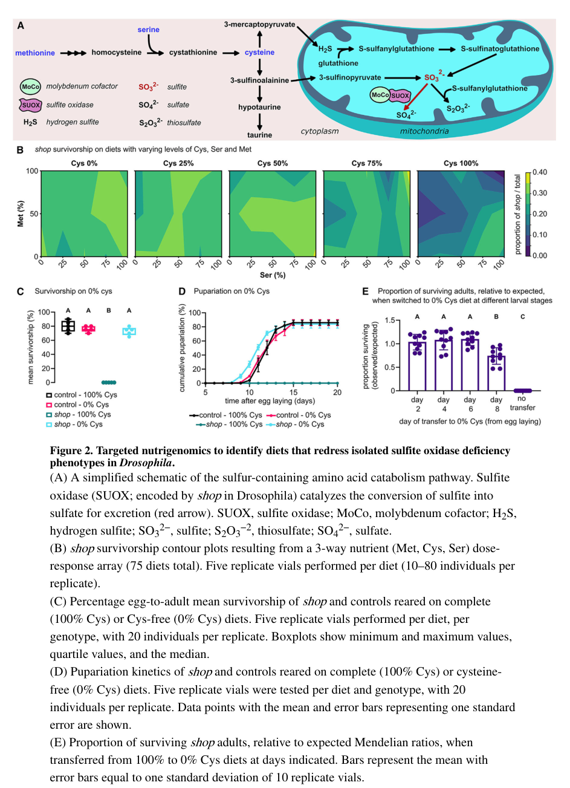

## Question

# Gene Research for Functional Annotation

## ⚠️ CRITICAL: Gene/Protein Identification Context

**BEFORE YOU BEGIN RESEARCH:** You MUST verify you are researching the CORRECT gene/protein. Gene symbols can be ambiguous, especially for less well-characterized genes from non-model organisms.

### Target Gene/Protein Identity (from UniProt):
- **UniProt Accession:** Q9VWP4
- **Protein Description:** RecName: Full=Sulfite oxidase, mitochondrial {ECO:0000305}; EC=1.8.3.1 {ECO:0000269|PubMed:30158546}; AltName: Full=Protein shopper {ECO:0000303|PubMed:30158546}; Flags: Precursor;
- **Gene Information:** Name=shop {ECO:0000303|PubMed:30158546, ECO:0000312|FlyBase:FBgn0030966}; ORFNames=CG7280 {ECO:0000312|FlyBase:FBgn0030966};
- **Organism (full):** Drosophila melanogaster (Fruit fly).
- **Protein Family:** Not specified in UniProt
- **Key Domains:** Cyt_B5-like_heme/steroid-bd. (IPR001199); Cyt_B5-like_heme/steroid_sf. (IPR036400); Cyt_B5_heme-BS. (IPR018506); Ig_E-set. (IPR014756); MoCF_OxRdtse_dimer. (IPR005066)

### MANDATORY VERIFICATION STEPS:

1. **Check if the gene symbol "shop" matches the protein description above**
2. **Verify the organism is correct:** Drosophila melanogaster (Fruit fly).
3. **Check if protein family/domains align with what you find in literature**
4. **If you find literature for a DIFFERENT gene with the same or similar symbol, STOP**

### If Gene Symbol is Ambiguous or You Cannot Find Relevant Literature:

**DO NOT PROCEED WITH RESEARCH ON A DIFFERENT GENE.** Instead:
- State clearly: "The gene symbol 'shop' is ambiguous or literature is limited for this specific protein"
- Explain what you found (e.g., "Found extensive literature on a different gene with the same symbol in a different organism")
- Describe the protein based ONLY on the UniProt information provided above
- Suggest that the protein function can be inferred from domain/family information

### Research Target:

Please provide a comprehensive research report on the gene **shop** (gene ID: shop, UniProt: Q9VWP4) in DROME.

The research report should be a detailed narrative explaining the function, biological processes, and localization of the gene product. Citations should be given for all claims.

You should prioritize authoritative reviews and primary scientific literature when conducting research. You can supplement
this with annotations you find in gene/protein databases, but these can be outdated or inaccurate.

We are specifically interested in the primary function of the gene - for enzymes, what reaction is catalyzed, and what is the substrate specificity? For transporters, what is the substrate? For structural proteins or adapters, what is the broader structural role? For signaling molecules, what is the role in the pathway.

We are interested in where in or outside the cell the gene product carries out its function.

We are also interested in the signaling or biochemical pathways in which the gene functions. We are less interested in broad pleiotropic effects, except where these elucidate the precise role.

Include evidence where possible. We are interested in both experimental evidence as well as inference from structure, evolution, or bioinformatic analysis. Precise studies should be prioritized over high-throughput, where available.

## Output

Question: You are an expert researcher providing comprehensive, well-cited information.

Provide detailed information focusing on:
1. Key concepts and definitions with current understanding
2. Recent developments and latest research (prioritize 2023-2024 sources)
3. Current applications and real-world implementations
4. Expert opinions and analysis from authoritative sources
5. Relevant statistics and data from recent studies

Format as a comprehensive research report with proper citations. Include URLs and publication dates where available.
Always prioritize recent, authoritative sources and provide specific citations for all major claims.

# Gene Research for Functional Annotation

## ⚠️ CRITICAL: Gene/Protein Identification Context

**BEFORE YOU BEGIN RESEARCH:** You MUST verify you are researching the CORRECT gene/protein. Gene symbols can be ambiguous, especially for less well-characterized genes from non-model organisms.

### Target Gene/Protein Identity (from UniProt):
- **UniProt Accession:** Q9VWP4
- **Protein Description:** RecName: Full=Sulfite oxidase, mitochondrial {ECO:0000305}; EC=1.8.3.1 {ECO:0000269|PubMed:30158546}; AltName: Full=Protein shopper {ECO:0000303|PubMed:30158546}; Flags: Precursor;
- **Gene Information:** Name=shop {ECO:0000303|PubMed:30158546, ECO:0000312|FlyBase:FBgn0030966}; ORFNames=CG7280 {ECO:0000312|FlyBase:FBgn0030966};
- **Organism (full):** Drosophila melanogaster (Fruit fly).
- **Protein Family:** Not specified in UniProt
- **Key Domains:** Cyt_B5-like_heme/steroid-bd. (IPR001199); Cyt_B5-like_heme/steroid_sf. (IPR036400); Cyt_B5_heme-BS. (IPR018506); Ig_E-set. (IPR014756); MoCF_OxRdtse_dimer. (IPR005066)

### MANDATORY VERIFICATION STEPS:

1. **Check if the gene symbol "shop" matches the protein description above**
2. **Verify the organism is correct:** Drosophila melanogaster (Fruit fly).
3. **Check if protein family/domains align with what you find in literature**
4. **If you find literature for a DIFFERENT gene with the same or similar symbol, STOP**

### If Gene Symbol is Ambiguous or You Cannot Find Relevant Literature:

**DO NOT PROCEED WITH RESEARCH ON A DIFFERENT GENE.** Instead:
- State clearly: "The gene symbol 'shop' is ambiguous or literature is limited for this specific protein"
- Explain what you found (e.g., "Found extensive literature on a different gene with the same symbol in a different organism")
- Describe the protein based ONLY on the UniProt information provided above
- Suggest that the protein function can be inferred from domain/family information

### Research Target:

Please provide a comprehensive research report on the gene **shop** (gene ID: shop, UniProt: Q9VWP4) in DROME.

The research report should be a detailed narrative explaining the function, biological processes, and localization of the gene product. Citations should be given for all claims.

You should prioritize authoritative reviews and primary scientific literature when conducting research. You can supplement
this with annotations you find in gene/protein databases, but these can be outdated or inaccurate.

We are specifically interested in the primary function of the gene - for enzymes, what reaction is catalyzed, and what is the substrate specificity? For transporters, what is the substrate? For structural proteins or adapters, what is the broader structural role? For signaling molecules, what is the role in the pathway.

We are interested in where in or outside the cell the gene product carries out its function.

We are also interested in the signaling or biochemical pathways in which the gene functions. We are less interested in broad pleiotropic effects, except where these elucidate the precise role.

Include evidence where possible. We are interested in both experimental evidence as well as inference from structure, evolution, or bioinformatic analysis. Precise studies should be prioritized over high-throughput, where available.

# Functional annotation of *Drosophila melanogaster shop* (CG7280; UniProt Q9VWP4)

## Identity and principal function

**The target is the correct fly gene:** *shop*, named **shopper**, is *D. melanogaster* **CG7280**, the homolog of human **SUOX**. It encodes a **mitochondrial sulfite oxidase**, not a transporter or a similarly named gene from another organism. Otto and colleagues identified CG7280 genetically and experimentally established its sulfite-oxidase function; a subsequent fly-disease study explicitly identifies SUOX as encoded by *shop*. Q9VWP4 is the accession specified in the question; the experimental papers generally use *shop* or CG7280 rather than the UniProt accession. (otto2018thesulfiteoxidase pages 1-2, otto2018thesulfiteoxidase pages 5-6, martelli2024identifyingpotentialdietary pages 20-24)

Shopper catalyzes the terminal oxidative step of sulfur-amino-acid catabolism: **sulfite is converted to sulfate**. Sulfite is therefore its experimentally supported substrate; sulfate is the product, **not** another substrate. In assays of fly protein extracts, investigators supplied sodium sulfite and monitored reduction of cytochrome *c* as the electron-acceptor readout. Loss or knockdown of *shop* decreased measured sulfite-oxidase activity and raised sulfite levels; a *D. virilis shopper* construct restored activity and normalized sulfite, while overexpression increased activity. These complementary perturbations provide substantially stronger functional evidence than sequence similarity alone. The available experiments do **not** establish a quantitative specificity profile against alternative sulfur compounds or prove that cytochrome *c* is the exclusive physiological electron acceptor. (otto2018thesulfiteoxidase pages 5-6, otto2018thesulfiteoxidase pages 11-11, martelli2024identifyingpotentialdietary pages 20-24)

The protein has the expected architecture of an animal sulfite oxidase: an N-terminal, heme-associated cytochrome-*b*5 domain linked to a molybdenum-cofactor (**Moco**) catalytic domain. This agrees with the cytochrome-*b*5-like and molybdenum-oxidoreductase annotations supplied for Q9VWP4. The biochemical review places fly Suox among the Moco- and heme-containing enzymes; perturbing fly Moco-biosynthesis genes also yields *shop*-like phenotypes. Domain assignment is principally comparative/annotation evidence, whereas the fly extract assays directly test enzyme-associated activity. (marelja2018ironsulfurand pages 9-10, otto2018thesulfiteoxidase pages 6-7)

The following evidence map separates observations from compartmental or mechanistic inference. (otto2018thesulfiteoxidase pages 1-2, otto2018thesulfiteoxidase pages 6-7, marelja2018ironsulfurand pages 9-10)

| Aspect | Finding | Evidence type | Source URL (year) |
|---|---|---|---|
| Identity | In *Drosophila melanogaster*, **CG7280** is **shopper (shop)** and encodes the fly sulfite oxidase; the protein is homologous to human **SUOX**. (otto2018thesulfiteoxidase pages 1-2) | Primary genetic and comparative evidence | [Otto et al., *Nature Communications*](https://doi.org/10.1038/s41467-018-05645-z) (2018) |
| Catalytic function and cofactors | Shopper oxidizes **sulfite to sulfate**. Whole-larva extract assays used sulfite as substrate and cytochrome *c* as the electron acceptor. Comparative annotation identifies a molybdenum-cofactor catalytic domain and an N-terminal cytochrome-*b*5 heme domain; direct comparative substrate-specificity testing was not reported. (otto2018thesulfiteoxidase pages 11-11, marelja2018ironsulfurand pages 9-10) | Primary extract assay plus sequence-based biochemical annotation | [Otto et al.](https://doi.org/10.1038/s41467-018-05645-z) (2018); [Marelja et al.](https://doi.org/10.3389/fphys.2018.00050) (2018) |
| Subcellular localization | Tagged Shopper formed mitochondrial puncta and colocalized with mitochondrial markers in cultured cells and glia. Assignment to the **mitochondrial intermembrane space** is consistent with sulfite-oxidase homology and review annotation, but the fluorescence experiments did not resolve the intramitochondrial compartment directly. (otto2018thesulfiteoxidase pages 6-7, marelja2018ironsulfurand pages 9-10) | Imaging-based mitochondrial localization; inferred/review-based suborganelle assignment | [Otto et al.](https://doi.org/10.1038/s41467-018-05645-z) (2018); [Marelja et al.](https://doi.org/10.3389/fphys.2018.00050) (2018) |
| Glial and neural mechanism | Loss of *shop* reduced sulfite-oxidase activity and increased sulfite; expression in **ensheathing glia** rescued mutant behavior. Perturbing glutamate-cycle components phenocopied *shop* loss, while increasing glutamate dehydrogenase (**Gdh**) in ensheathing glia rescued head-bending abnormalities, supporting a sulfite–glutamate-homeostasis mechanism. (otto2018thesulfiteoxidase pages 6-7, otto2018thesulfiteoxidase pages 8-9) | Biochemical measurements, cell-type-specific genetics, phenocopy and rescue | [Otto et al.](https://doi.org/10.1038/s41467-018-05645-z) (2018) |
| Nutrigenomic application | A **75-diet** methionine/cysteine/serine array showed that cysteine depletion produced the strongest single-nutrient rescue of *shop* lethality. A cysteine-free larval diet shifted the mutant metabolome toward controls, reduced toxic sulfur metabolites, and restored locomotion and neuromuscular-junction physiology. Translation remains provisional because the work used flies, null alleles, and lifelong controlled diets; vertebrate validation is required. (martelli2024identifyingpotentialdietary pages 5-6, martelli2024identifyingpotentialdietary pages 6-8, martelli2024identifyingpotentialdietary pages 8-10) | Controlled dietary intervention, metabolomics, behavior, and electrophysiology; preclinical fly model | [Martelli et al., *Cell Reports*](https://doi.org/10.1016/j.celrep.2024.113861) (February 2024) |

*Table: Evidence supporting the identity, enzymatic function, mitochondrial localization, glial mechanism, and experimental application of Drosophila shop/CG7280. The table distinguishes direct observations from sequence- or homology-based inference.*

## Site of action and pathways

**Subcellular site.** Tagged Shopper overlaps mitochondrial markers in cultured fly cells and glia, providing experimental support for mitochondrial localization. The more precise assignment to the **mitochondrial intermembrane space** appears in a fly molybdoenzyme review and is consistent with the known sulfite-oxidase architecture, but the reported fluorescence colocalization does not itself resolve which mitochondrial compartment contains the protein. Shopper is thus best annotated as mitochondrial, with intermembrane-space localization qualified as a finer assignment. Its catalytic role is intracellular; the evidence does not identify it as a secreted protein. (otto2018thesulfiteoxidase pages 7-8, otto2018thesulfiteoxidase pages 6-7, marelja2018ironsulfurand pages 9-10)

**Metabolic pathway.** Shopper removes sulfite generated during degradation of sulfur-containing amino acids, notably cysteine and methionine, producing sulfate. *shop* deficiency instead leads to sulfite accumulation and abnormalities involving thiosulfate and S-sulfocysteine. This is the biochemical basis for using *shop* mutants as a fly model of **isolated sulfite oxidase deficiency**. Although sulfate is the expected product, sulfate abundance was **not significantly lower** in the 2024 mutant metabolomics experiment; the authors noted other potential sulfate sources, including sulfatases or gut microbiota. Bulk sulfate concentration therefore should not be treated as a specific measurement of Shopper reaction flux. (martelli2024identifyingpotentialdietary pages 5-6, martelli2024identifyingpotentialdietary pages 6-8, martelli2024identifyingpotentialdietary pages 20-24)

**Neural consequence, not a second catalytic function.** Genetic localization places an important functional requirement in **ensheathing glia**, which surround the CNS neuropil. Glial *shop* depletion disrupts larval locomotion, whereas expression directed to ensheathing glia rescues mutant behavior. Perturbing glial glutamate-cycle genes produces related behavioral defects, and increasing glial glutamate dehydrogenase (**Gdh**) rescues a *shop*-mutant head-bending phenotype. These experiments support a model in which excess sulfite disrupts glial glutamate homeostasis and consequently neuronal activity. Specific proposed links—including inhibition of particular glutamate-metabolizing enzymes or transport processes—should not be mistaken for an independently established alternative enzyme reaction catalyzed by Shopper. (otto2018thesulfiteoxidase pages 1-2, otto2018thesulfiteoxidase pages 8-9, otto2018thesulfiteoxidase pages 6-7)

## Recent experimental developments and application

The most directly relevant **2023–2024 advance** is Martelli and colleagues’ *Cell Reports* study, published **February 2024**. In a screen of **35** fly models of inherited amino-acid metabolic disorders, **25** showed diet-dependent phenotypes; *shop* was notably diet-sensitive. Investigators then tested **75** combinations of cysteine, serine and methionine concentrations in the *shop* deficiency model. Removing dietary cysteine had the strongest single-nutrient rescue effect: a **0% cysteine larval diet**, rather than added cysteine, restored adult viability and developmental timing. Diet-switching experiments placed the critical intervention window within the **first six larval days**. These percentages denote compositions of the experimental synthetic diets, not a prescribed human diet. (martelli2024identifyingpotentialdietary pages 3-5, martelli2024identifyingpotentialdietary pages 5-6, martelli2024identifyingpotentialdietary pages 8-10)

In five-day-old larvae, metabolomics profiled **1,381 putatively identified metabolites**, of which **921** differed significantly under the study’s analysis (**ANOVA, p < 0.05**). Cysteine restriction shifted the mutant profile toward controls and reduced thiosulfate, S-sulfocysteine and other sulfur-pathway abnormalities. Conversely, adding sulfite or thiosulfate to the cysteine-free diet selectively worsened mutant health, strengthening the case that accumulation of these compounds contributes to disease manifestations. The dietary rescue extended beyond survival: larval locomotion improved, and evoked and spontaneous neuromuscular-junction responses returned toward normal. These observations support *shop* flies as a **preclinical nutrigenomics and mechanistic model**, not proof of an effective human treatment. (martelli2024identifyingpotentialdietary pages 5-6, martelli2024identifyingpotentialdietary pages 6-8)

A later peer-reviewed **June 2026** study independently applied a **51-diet** amino-acid screening platform to *shop*^C15^ flies. It reproduced improved survival with cysteine depletion and found complete lethality when dietary cysteine was raised to **150%** of its reference concentration; it also identified other candidate nutrient modifiers. This is a subsequent fly-model extension, not evidence that those interventions work in patients. The 2024 investigators themselves cautioned that fly physiology, null alleles and sustained controlled diets can differ materially from human disease and recommended validation in vertebrate models. (novosiadla2026aflexiblesynthetic pages 3-6, martelli2024identifyingpotentialdietary pages 8-10)

## Evidence boundaries and key sources

The **high-confidence annotation** is a mitochondrial, Moco/heme-associated enzyme whose primary reaction is sulfite oxidation to sulfate, with an experimentally important site of action in ensheathing glia. Unresolved details include a direct purified-Shopper substrate panel, experimentally resolved intramitochondrial topology, and whether the complete proposed chain from sulfite accumulation to each altered glutamate-handling step has been demonstrated in vivo. The nutritional results establish rescue in flies, not a clinical implementation for isolated sulfite oxidase deficiency. (otto2018thesulfiteoxidase pages 11-11, otto2018thesulfiteoxidase pages 6-7, marelja2018ironsulfurand pages 9-10, martelli2024identifyingpotentialdietary pages 8-10)

**Primary studies and biochemical context, with publication dates and URLs:**

1. Otto N, *et al.* “The sulfite oxidase Shopper controls neuronal activity by regulating glutamate homeostasis in *Drosophila* ensheathing glia.” *Nature Communications*, **August 2018**. https://doi.org/10.1038/s41467-018-05645-z. Primary source for gene identity, enzymatic perturbations, mitochondrial imaging and glial genetics. (otto2018thesulfiteoxidase pages 1-2, otto2018thesulfiteoxidase pages 5-6, otto2018thesulfiteoxidase pages 6-7)
2. Marelja Z, Leimkühler S, Missirlis F. “Iron Sulfur and Molybdenum Cofactor Enzymes Regulate the *Drosophila* Life Cycle by Controlling Cell Metabolism.” *Frontiers in Physiology*, **February 2018**. https://doi.org/10.3389/fphys.2018.00050. Review supporting domain/cofactor interpretation and the finer intermembrane-space assignment. (marelja2018ironsulfurand pages 9-10)
3. Martelli F, *et al.* “Identifying potential dietary treatments for inherited metabolic disorders using *Drosophila* nutrigenomics.” *Cell Reports*, **February 2024**. https://doi.org/10.1016/j.celrep.2024.113861. Primary source for *shop* dietary rescue, metabolomics, neuromuscular physiology and translational limitations. (martelli2024identifyingpotentialdietary pages 5-6, martelli2024identifyingpotentialdietary pages 6-8, martelli2024identifyingpotentialdietary pages 8-10)
4. Novosiadla Z, *et al.* “A flexible synthetic diet platform for *Drosophila* nutrigenomics.” *Genes & Nutrition*, **June 2026**. https://doi.org/10.1186/s12263-026-00808-w. Subsequent fly dietary-screening extension. (novosiadla2026aflexiblesynthetic pages 3-6)

References

1. (otto2018thesulfiteoxidase pages 1-2): Nils Otto, Zvonimir Marelja, Andreas Schoofs, Holger Kranenburg, Jonas Bittern, Kerem Yildirim, Dimitri Berh, Maria Bethke, Silke Thomas, Sandra Rode, Benjamin Risse, Xiaoyi Jiang, Michael Pankratz, Silke Leimkühler, and Christian Klämbt. The sulfite oxidase shopper controls neuronal activity by regulating glutamate homeostasis in drosophila ensheathing glia. Nature Communications, Aug 2018. URL: https://doi.org/10.1038/s41467-018-05645-z, doi:10.1038/s41467-018-05645-z. This article has 68 citations and is from a highest quality peer-reviewed journal.

2. (otto2018thesulfiteoxidase pages 5-6): Nils Otto, Zvonimir Marelja, Andreas Schoofs, Holger Kranenburg, Jonas Bittern, Kerem Yildirim, Dimitri Berh, Maria Bethke, Silke Thomas, Sandra Rode, Benjamin Risse, Xiaoyi Jiang, Michael Pankratz, Silke Leimkühler, and Christian Klämbt. The sulfite oxidase shopper controls neuronal activity by regulating glutamate homeostasis in drosophila ensheathing glia. Nature Communications, Aug 2018. URL: https://doi.org/10.1038/s41467-018-05645-z, doi:10.1038/s41467-018-05645-z. This article has 68 citations and is from a highest quality peer-reviewed journal.

3. (martelli2024identifyingpotentialdietary pages 20-24): Felipe Martelli, Jiayi Lin, Sarah Mele, Wendy Imlach, O. Kanca, Christopher K. Barlow, Jefferson Paril, Ralf B. Schittenhelm, John Christodoulou, Hugo J. Bellen, Matthew D. W. Piper, and Travis K. Johnson. Identifying potential dietary treatments for inherited metabolic disorders using drosophila nutrigenomics. Cell reports, 43:113861-113861, Feb 2024. URL: https://doi.org/10.1016/j.celrep.2024.113861, doi:10.1016/j.celrep.2024.113861. This article has 10 citations and is from a highest quality peer-reviewed journal.

4. (otto2018thesulfiteoxidase pages 11-11): Nils Otto, Zvonimir Marelja, Andreas Schoofs, Holger Kranenburg, Jonas Bittern, Kerem Yildirim, Dimitri Berh, Maria Bethke, Silke Thomas, Sandra Rode, Benjamin Risse, Xiaoyi Jiang, Michael Pankratz, Silke Leimkühler, and Christian Klämbt. The sulfite oxidase shopper controls neuronal activity by regulating glutamate homeostasis in drosophila ensheathing glia. Nature Communications, Aug 2018. URL: https://doi.org/10.1038/s41467-018-05645-z, doi:10.1038/s41467-018-05645-z. This article has 68 citations and is from a highest quality peer-reviewed journal.

5. (marelja2018ironsulfurand pages 9-10): Zvonimir Marelja, S. Leimkühler, and F. Missirlis. Iron sulfur and molybdenum cofactor enzymes regulate the drosophila life cycle by controlling cell metabolism. Frontiers in Physiology, Feb 2018. URL: https://doi.org/10.3389/fphys.2018.00050, doi:10.3389/fphys.2018.00050. This article has 68 citations.

6. (otto2018thesulfiteoxidase pages 6-7): Nils Otto, Zvonimir Marelja, Andreas Schoofs, Holger Kranenburg, Jonas Bittern, Kerem Yildirim, Dimitri Berh, Maria Bethke, Silke Thomas, Sandra Rode, Benjamin Risse, Xiaoyi Jiang, Michael Pankratz, Silke Leimkühler, and Christian Klämbt. The sulfite oxidase shopper controls neuronal activity by regulating glutamate homeostasis in drosophila ensheathing glia. Nature Communications, Aug 2018. URL: https://doi.org/10.1038/s41467-018-05645-z, doi:10.1038/s41467-018-05645-z. This article has 68 citations and is from a highest quality peer-reviewed journal.

7. (otto2018thesulfiteoxidase pages 8-9): Nils Otto, Zvonimir Marelja, Andreas Schoofs, Holger Kranenburg, Jonas Bittern, Kerem Yildirim, Dimitri Berh, Maria Bethke, Silke Thomas, Sandra Rode, Benjamin Risse, Xiaoyi Jiang, Michael Pankratz, Silke Leimkühler, and Christian Klämbt. The sulfite oxidase shopper controls neuronal activity by regulating glutamate homeostasis in drosophila ensheathing glia. Nature Communications, Aug 2018. URL: https://doi.org/10.1038/s41467-018-05645-z, doi:10.1038/s41467-018-05645-z. This article has 68 citations and is from a highest quality peer-reviewed journal.

8. (martelli2024identifyingpotentialdietary pages 5-6): Felipe Martelli, Jiayi Lin, Sarah Mele, Wendy Imlach, O. Kanca, Christopher K. Barlow, Jefferson Paril, Ralf B. Schittenhelm, John Christodoulou, Hugo J. Bellen, Matthew D. W. Piper, and Travis K. Johnson. Identifying potential dietary treatments for inherited metabolic disorders using drosophila nutrigenomics. Cell reports, 43:113861-113861, Feb 2024. URL: https://doi.org/10.1016/j.celrep.2024.113861, doi:10.1016/j.celrep.2024.113861. This article has 10 citations and is from a highest quality peer-reviewed journal.

9. (martelli2024identifyingpotentialdietary pages 6-8): Felipe Martelli, Jiayi Lin, Sarah Mele, Wendy Imlach, O. Kanca, Christopher K. Barlow, Jefferson Paril, Ralf B. Schittenhelm, John Christodoulou, Hugo J. Bellen, Matthew D. W. Piper, and Travis K. Johnson. Identifying potential dietary treatments for inherited metabolic disorders using drosophila nutrigenomics. Cell reports, 43:113861-113861, Feb 2024. URL: https://doi.org/10.1016/j.celrep.2024.113861, doi:10.1016/j.celrep.2024.113861. This article has 10 citations and is from a highest quality peer-reviewed journal.

10. (martelli2024identifyingpotentialdietary pages 8-10): Felipe Martelli, Jiayi Lin, Sarah Mele, Wendy Imlach, O. Kanca, Christopher K. Barlow, Jefferson Paril, Ralf B. Schittenhelm, John Christodoulou, Hugo J. Bellen, Matthew D. W. Piper, and Travis K. Johnson. Identifying potential dietary treatments for inherited metabolic disorders using drosophila nutrigenomics. Cell reports, 43:113861-113861, Feb 2024. URL: https://doi.org/10.1016/j.celrep.2024.113861, doi:10.1016/j.celrep.2024.113861. This article has 10 citations and is from a highest quality peer-reviewed journal.

11. (otto2018thesulfiteoxidase pages 7-8): Nils Otto, Zvonimir Marelja, Andreas Schoofs, Holger Kranenburg, Jonas Bittern, Kerem Yildirim, Dimitri Berh, Maria Bethke, Silke Thomas, Sandra Rode, Benjamin Risse, Xiaoyi Jiang, Michael Pankratz, Silke Leimkühler, and Christian Klämbt. The sulfite oxidase shopper controls neuronal activity by regulating glutamate homeostasis in drosophila ensheathing glia. Nature Communications, Aug 2018. URL: https://doi.org/10.1038/s41467-018-05645-z, doi:10.1038/s41467-018-05645-z. This article has 68 citations and is from a highest quality peer-reviewed journal.

12. (martelli2024identifyingpotentialdietary pages 3-5): Felipe Martelli, Jiayi Lin, Sarah Mele, Wendy Imlach, O. Kanca, Christopher K. Barlow, Jefferson Paril, Ralf B. Schittenhelm, John Christodoulou, Hugo J. Bellen, Matthew D. W. Piper, and Travis K. Johnson. Identifying potential dietary treatments for inherited metabolic disorders using drosophila nutrigenomics. Cell reports, 43:113861-113861, Feb 2024. URL: https://doi.org/10.1016/j.celrep.2024.113861, doi:10.1016/j.celrep.2024.113861. This article has 10 citations and is from a highest quality peer-reviewed journal.

13. (novosiadla2026aflexiblesynthetic pages 3-6): Zoriana Novosiadla, Sarah Mele, Emily J Kerton, John Christodoulou, Sebastian Dworkin, Matthew D. W. Piper, and Travis K. Johnson. A flexible synthetic diet platform for drosophila nutrigenomics. Genes &amp; Nutrition, Jun 2026. URL: https://doi.org/10.1186/s12263-026-00808-w, doi:10.1186/s12263-026-00808-w. This article has 0 citations and is from a peer-reviewed journal.

## Artifacts

- [Edison artifact artifact-00](shop-deep-research-falcon_artifacts/artifact-00.md)

## Citations

1. otto2018thesulfiteoxidase pages 1-2
2. marelja2018ironsulfurand pages 9-10
3. novosiadla2026aflexiblesynthetic pages 3-6
4. otto2018thesulfiteoxidase pages 5-6
5. martelli2024identifyingpotentialdietary pages 20-24
6. otto2018thesulfiteoxidase pages 11-11
7. otto2018thesulfiteoxidase pages 6-7
8. otto2018thesulfiteoxidase pages 8-9
9. martelli2024identifyingpotentialdietary pages 5-6
10. martelli2024identifyingpotentialdietary pages 6-8
11. martelli2024identifyingpotentialdietary pages 8-10
12. otto2018thesulfiteoxidase pages 7-8
13. martelli2024identifyingpotentialdietary pages 3-5
14. Otto et al., *Nature Communications*
15. Otto et al.
16. Marelja et al.
17. Martelli et al., *Cell Reports*
18. https://doi.org/10.1038/s41467-018-05645-z
19. https://doi.org/10.3389/fphys.2018.00050
20. https://doi.org/10.1016/j.celrep.2024.113861
21. https://doi.org/10.1038/s41467-018-05645-z.
22. https://doi.org/10.3389/fphys.2018.00050.
23. https://doi.org/10.1016/j.celrep.2024.113861.
24. https://doi.org/10.1186/s12263-026-00808-w.
25. https://doi.org/10.1038/s41467-018-05645-z,
26. https://doi.org/10.1016/j.celrep.2024.113861,
27. https://doi.org/10.3389/fphys.2018.00050,
28. https://doi.org/10.1186/s12263-026-00808-w,