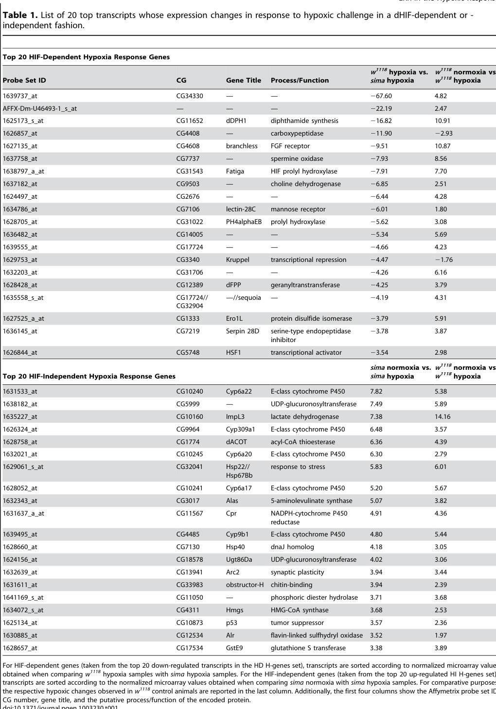

## Question

# Gene Research for Functional Annotation

## ⚠️ CRITICAL: Gene/Protein Identification Context

**BEFORE YOU BEGIN RESEARCH:** You MUST verify you are researching the CORRECT gene/protein. Gene symbols can be ambiguous, especially for less well-characterized genes from non-model organisms.

### Target Gene/Protein Identity (from UniProt):
- **UniProt Accession:** Q24167
- **Protein Description:** RecName: Full=Protein similar;
- **Gene Information:** Name=sima; ORFNames=CG45051;
- **Organism (full):** Drosophila melanogaster (Fruit fly).
- **Protein Family:** Not specified in UniProt
- **Key Domains:** bHLH_dom. (IPR011598); HLH_DNA-bd_sf. (IPR036638); PAC. (IPR001610); PAS. (IPR000014); PAS-like_dom_sf. (IPR035965)

### MANDATORY VERIFICATION STEPS:

1. **Check if the gene symbol "sima" matches the protein description above**
2. **Verify the organism is correct:** Drosophila melanogaster (Fruit fly).
3. **Check if protein family/domains align with what you find in literature**
4. **If you find literature for a DIFFERENT gene with the same or similar symbol, STOP**

### If Gene Symbol is Ambiguous or You Cannot Find Relevant Literature:

**DO NOT PROCEED WITH RESEARCH ON A DIFFERENT GENE.** Instead:
- State clearly: "The gene symbol 'sima' is ambiguous or literature is limited for this specific protein"
- Explain what you found (e.g., "Found extensive literature on a different gene with the same symbol in a different organism")
- Describe the protein based ONLY on the UniProt information provided above
- Suggest that the protein function can be inferred from domain/family information

### Research Target:

Please provide a comprehensive research report on the gene **sima** (gene ID: sima, UniProt: Q24167) in DROME.

The research report should be a detailed narrative explaining the function, biological processes, and localization of the gene product. Citations should be given for all claims.

You should prioritize authoritative reviews and primary scientific literature when conducting research. You can supplement
this with annotations you find in gene/protein databases, but these can be outdated or inaccurate.

We are specifically interested in the primary function of the gene - for enzymes, what reaction is catalyzed, and what is the substrate specificity? For transporters, what is the substrate? For structural proteins or adapters, what is the broader structural role? For signaling molecules, what is the role in the pathway.

We are interested in where in or outside the cell the gene product carries out its function.

We are also interested in the signaling or biochemical pathways in which the gene functions. We are less interested in broad pleiotropic effects, except where these elucidate the precise role.

Include evidence where possible. We are interested in both experimental evidence as well as inference from structure, evolution, or bioinformatic analysis. Precise studies should be prioritized over high-throughput, where available.

## Output

Question: You are an expert researcher providing comprehensive, well-cited information.

Provide detailed information focusing on:
1. Key concepts and definitions with current understanding
2. Recent developments and latest research (prioritize 2023-2024 sources)
3. Current applications and real-world implementations
4. Expert opinions and analysis from authoritative sources
5. Relevant statistics and data from recent studies

Format as a comprehensive research report with proper citations. Include URLs and publication dates where available.
Always prioritize recent, authoritative sources and provide specific citations for all major claims.

# Gene Research for Functional Annotation

## ⚠️ CRITICAL: Gene/Protein Identification Context

**BEFORE YOU BEGIN RESEARCH:** You MUST verify you are researching the CORRECT gene/protein. Gene symbols can be ambiguous, especially for less well-characterized genes from non-model organisms.

### Target Gene/Protein Identity (from UniProt):
- **UniProt Accession:** Q24167
- **Protein Description:** RecName: Full=Protein similar;
- **Gene Information:** Name=sima; ORFNames=CG45051;
- **Organism (full):** Drosophila melanogaster (Fruit fly).
- **Protein Family:** Not specified in UniProt
- **Key Domains:** bHLH_dom. (IPR011598); HLH_DNA-bd_sf. (IPR036638); PAC. (IPR001610); PAS. (IPR000014); PAS-like_dom_sf. (IPR035965)

### MANDATORY VERIFICATION STEPS:

1. **Check if the gene symbol "sima" matches the protein description above**
2. **Verify the organism is correct:** Drosophila melanogaster (Fruit fly).
3. **Check if protein family/domains align with what you find in literature**
4. **If you find literature for a DIFFERENT gene with the same or similar symbol, STOP**

### If Gene Symbol is Ambiguous or You Cannot Find Relevant Literature:

**DO NOT PROCEED WITH RESEARCH ON A DIFFERENT GENE.** Instead:
- State clearly: "The gene symbol 'sima' is ambiguous or literature is limited for this specific protein"
- Explain what you found (e.g., "Found extensive literature on a different gene with the same symbol in a different organism")
- Describe the protein based ONLY on the UniProt information provided above
- Suggest that the protein function can be inferred from domain/family information

### Research Target:

Please provide a comprehensive research report on the gene **sima** (gene ID: sima, UniProt: Q24167) in DROME.

The research report should be a detailed narrative explaining the function, biological processes, and localization of the gene product. Citations should be given for all claims.

You should prioritize authoritative reviews and primary scientific literature when conducting research. You can supplement
this with annotations you find in gene/protein databases, but these can be outdated or inaccurate.

We are specifically interested in the primary function of the gene - for enzymes, what reaction is catalyzed, and what is the substrate specificity? For transporters, what is the substrate? For structural proteins or adapters, what is the broader structural role? For signaling molecules, what is the role in the pathway.

We are interested in where in or outside the cell the gene product carries out its function.

We are also interested in the signaling or biochemical pathways in which the gene functions. We are less interested in broad pleiotropic effects, except where these elucidate the precise role.

Include evidence where possible. We are interested in both experimental evidence as well as inference from structure, evolution, or bioinformatic analysis. Precise studies should be prioritized over high-throughput, where available.

# Functional annotation report: *Drosophila melanogaster sima*

## Identity and principal function

**Target:** *sima*, encoding Similar (Sima), in *Drosophila melanogaster*. The accession **UniProt Q24167** and ORF name **CG45051** are supplied in the question; the papers examined confirm the fly gene and protein name but do **not** independently establish that accession-to-ORF mapping. Crucially, *sima* is **not** *sim* (*single minded*): experiments found that *sim* mutants retained a hypoxia-responsive reporter, whereas Similar was identified as the fly HIF-α-like regulator. This distinction also separates Sima from the developmental factor Trachealess (*trh*). (lavistallanos2002controlofthe pages 1-2, lavistallanos2002controlofthe pages 6-9)

**Recommended primary annotation:** Sima is an **oxygen-regulated, intracellular transcription-factor subunit**. Together with Tango (Tgo), the fly HIF-β/ARNT-like partner, it activates hypoxia-responsive gene expression. Its biological role is to connect oxygen availability to transcriptional adaptation, including feedback on oxygen sensing and regulation of oxygen-delivery and growth pathways. It is **not** itself the prolyl hydroxylase, an enzyme that consumes an extracellular substrate, or a secreted signaling ligand. (lavistallanos2002controlofthe pages 1-2, romero2007cellularanddevelopmental pages 7-10, acevedo2010oxygensensingin pages 2-5)

The supplied UniProt annotations—**bHLH DNA-binding/helix–loop–helix, PAS and PAC-related domains**—fit this experimentally established bHLH–PAS transcription-factor identity. The basic region supports recognition of hypoxia-response elements (HREs; core **5′-(A/G)CGTG-3′**); HLH and PAS regions contribute to partner association. The oxygen-dependent degradation domain (ODDD) provides a separate regulatory function. PAC is a domain annotation, **not** evidence of catalytic activity. Literature identifies Sima as a HIF-α-like homologue, rather than specifying an enzymatic protein family. (lavistallanos2002controlofthe pages 1-2, romero2007cellularanddevelopmental pages 7-10, romero2008regulationofthe pages 1-2)

## Mechanism and cellular location

**Oxygen sensing occurs upstream of Sima.** In oxygenated cells, the fly prolyl-4-hydroxylase Fatiga (identified as CG1114 in the original experiments) limits Sima abundance and activity. Sima’s ODDD spans approximately **residues 692–863**; **Pro850** is implicated in hydroxylase-dependent regulation. The established HIF-pathway model links oxygen-dependent hydroxylation to VHL-associated ubiquitination and proteasomal turnover. When oxygen falls, reduced hydroxylase activity permits Sima accumulation. Fatiga loss-of-function or RNAi causes Sima accumulation and inappropriate HRE-reporter activity even in normoxia. The original ODDD-deletion experiment establishes the importance of that region but, by itself, does not prove the individual biochemical contribution of every residue it removes. (lavistallanos2002controlofthe pages 6-9, romero2007cellularanddevelopmental pages 7-10, lavistallanos2002controlofthe pages 9-10, tamamouna2018thehypoxiainduciblefactor1α pages 7-10)

**Sima functions at nuclear DNA but moves between compartments.** Ectopically expressed full-length Sima was predominantly **cytoplasmic in normoxic embryos** and became **nuclear after hypoxia**; deleting residues 692–863 produced constitutive nuclear accumulation and HRE-reporter activation. Thus, protein stabilization alone does not fully describe activation. Subsequent primary experiments showed continuous nuclear–cytoplasmic shuttling: a C-terminal bipartite nuclear-localization signal promotes import, while two bHLH-domain nuclear-export signals promote **CRM1-dependent export**. After accumulation at **1% O₂**, Sima was cleared from nuclei within approximately **10 minutes of reoxygenation**. Blocking export or mutating the export signals increased transcriptional output; additional CRM1-independent export may also occur. There is no evidence here that Sima performs its transcriptional function outside the cell. (lavistallanos2002controlofthe pages 6-9, romero2008regulationofthe pages 1-2, romero2008regulationofthe pages 10-11)

## Established pathways and biological processes

**HIF transcription and negative feedback.** Sima–Tgo activates oxygen-responsive transcription; both partners are required for the canonical hypoxic reporter response. A particularly well-supported endogenous output is **fatigaB**: its hypoxic induction disappears in *sima* mutants, Sima overexpression increases its expression, and mutation of a tested upstream **HRE2** abolishes Sima- and hypoxia-responsive reporter activation. Producing the Fatiga hydroxylase through this pathway provides negative feedback on Sima activity when oxygen becomes available again. Fatiga isoforms are not functionally interchangeable: in the tested mutant-rescue experiments FgaB rescued lethality and suppressed inappropriate normoxic LDH-reporter expression more effectively than FgaA. (romero2007cellularanddevelopmental pages 7-10, acevedo2010oxygensensingin pages 2-5, acevedo2010oxygensensingin pages 6-7, acevedo2010oxygensensingin pages 5-6)

**Tracheal adaptation and oxygen delivery.** Hypoxia-responsive Sima activity is particularly pronounced in the tracheal system, the fly’s oxygen-delivery network. *Branchless* (*bnl*) encodes an FGF ligand involved in directing tracheal branching toward oxygen-poor tissue; transcriptomic and developmental analyses support a **Sima-dependent component** of its hypoxic expression. Sima-dependent effects on terminal tracheal sprouting are also supported by genetic perturbation of the Fatiga/miR-190 pathway. *Branchless* induction and sprouting are relevant pathway outcomes, but a hypoxia-responsive transcript alone should **not** be described as proof that Sima directly occupies its endogenous promoter. (lavistallanos2002controlofthe pages 1-2, ezcurra2016mir190enhanceshifdependent pages 7-9, romero2007cellularanddevelopmental pages 4-7, li2013hifandnonhifregulated pages 4-6, li2013hifandnonhifregulated pages 3-4)

**Metabolic adaptation is not exclusively Sima-driven.** *sima* mutants fail to mobilize glycogen normally during a six-hour hypoxic challenge, and Sima interacts with the fly estrogen-related receptor, dERR, in a hypoxic transcriptional programme. Nevertheless, dERR also regulates a separable Sima-independent programme. In late-third-instar larvae, **Ldh/ImpL3** and **Pfk** retain hypoxic transcriptional responses without Sima. Ldh is consequently a useful *hypoxia-response readout*, not a universally specific assay of direct Sima transcriptional activity. A distinct **2023** mechanism enables Ldh mRNA translation during hypoxia through its CA-rich 3′-UTR sequence and the cap-binding factor eIF4EHP; that result does not show that Sima binds Ldh RNA or directs its translation. (li2013hifandnonhifregulated pages 1-2, li2013hifandnonhifregulated pages 4-6, li2013hifandnonhifregulated pages 6-10, li2013hifandnonhifregulated pages 3-4, liang2023eif4ehppromotesldh pages 1-2)

**Growth control and tissue context.** Sima signaling also restrains growth pathways. Fat-body Sima overexpression reduced Akt phosphorylation and larval growth; Tribbles knockdown abolished the growth effect, and a reporter assay supported Tribbles as a Sima-regulated gene. More recent wing-disc work links increasing endogenous Sima activity to **Scylla/REDD1 induction and reduced TOR signaling**, helping prevent growing tissue from demanding more oxygen than is available. These are tissue- and context-specific outputs of the transcription factor, not a separate catalytic function. (zhao2024growthinducedphysiologicalhypoxia pages 6-8, zhao2024growthinducedphysiologicalhypoxia pages 3-6)

## Quantitative evidence and recent developments

The following evidence matrix separates core Sima mechanisms from hypoxic responses that remain when Sima is depleted. The **2024 Zhao dataset was a preprint**; its subsequent peer-reviewed article describes the same Sima–TOR feedback model, rather than an independent replication. (zhao2024growthinducedphysiologicalhypoxia pages 6-8, turingan2024hypoxiadelayssteroidinduced pages 7-10, li2013hifandnonhifregulated pages 3-4)

| Aspect | Experimentally supported finding and quantitative result | Source | Caveat |
|---|---|---|---|
| Oxygen-dependent abundance and transcription | At **5% O2 for 14 h**, the LDH hypoxia-reporter transcript increased **9.7-10.4-fold**, whereas endogenous **sima mRNA increased only 1.3-1.5-fold**, showing that hypoxia primarily regulates Sima post-transcriptionally. Deleting residues **692-863** stabilized Sima in normoxia and caused constitutive nuclear localization and reporter activation, defining an oxygen-dependent degradation domain. (lavistallanos2002controlofthe pages 6-9) | Lavista-Llanos et al. (2002); [DOI](https://doi.org/10.1128/MCB.22.19.6842-6853.2002) | The deletion removes a large regulatory region and does not isolate the contribution of an individual residue. |
| Nuclear trafficking | Sima continuously shuttles between the nucleus and cytoplasm. Two bHLH-domain export signals mediate **CRM1-dependent nuclear export**; after accumulation at **1% O2**, Sima was exported to the cytoplasm within approximately **10 min after reoxygenation**. NES mutants produced **2-3-fold** higher Sima-dependent reporter induction than wild-type Sima. (romero2008regulationofthe pages 8-10, romero2008regulationofthe pages 10-11) | Romero et al. (2008); [DOI](https://doi.org/10.1128/MCB.01027-07) | Deleting the HLH domain slowed but did not eliminate export, indicating that CRM1-independent export also contributes. |
| Negative feedback through Fatiga | Hypoxia induces the potent **fatigaB (fgaB)** prolyl-hydroxylase isoform in a Sima-dependent manner. A regulatory fragment responded to Sima and **1% O2**, whereas mutation of **HRE2** abolished both responses, supporting direct HRE-mediated feedback. FgaB fully rescued fatiga-mutant lethality and suppressed constitutive normoxic LDH-reporter activity more effectively than FgaA. (acevedo2010oxygensensingin pages 2-5, acevedo2010oxygensensingin pages 6-7, acevedo2010oxygensensingin pages 5-6) | Acevedo et al. (2010); [DOI](https://doi.org/10.1371/journal.pone.0012390) | Reporter and genetic evidence strongly support direct regulation, but the cited experiments did not establish endogenous Sima occupancy by chromatin immunoprecipitation. |
| Sima-dependent transcriptional targets | Late-third-instar transcriptomics classified **branchless** and **fatiga** as HIF/Sima-dependent. Their hypoxic induction in wild type was **10.87-fold** and **7.70-fold**, respectively; under hypoxia, wild-type expression exceeded that in sima mutants by **29.51-fold** for branchless and **27.91-fold** for fatiga. (li2013hifandnonhifregulated pages 3-4, li2013hifandnonhifregulated media 16102572) | Li et al. (2013); [DOI](https://doi.org/10.1371/journal.pgen.1003230) | Dependence varied with developmental stage; branchless retained some Sima-independent responsiveness at one mid-L3 time point. |
| Sima-independent hypoxic transcription | In the same late-L3 dataset, **ImpL3/Ldh** was classified as HIF/Sima-independent: hypoxia induced it **14.16-fold in wild type** and **7.38-fold in sima mutants**. Ldh is therefore a useful hypoxia marker but cannot universally be treated as a direct, exclusively Sima-dependent target. (li2013hifandnonhifregulated pages 4-6, li2013hifandnonhifregulated pages 3-4, li2013hifandnonhifregulated media 16102572) | Li et al. (2013); [DOI](https://doi.org/10.1371/journal.pgen.1003230) | Classification is stage-specific; Sima's contribution to Ldh regulation differs across development, and dERR participates in both HIF-dependent and HIF-independent programs. |
| Selective LDH translation | At **1% O2 for 24 h**, the **Ldh 3-prime UTR** promoted reporter translation without a corresponding difference in reporter-mRNA abundance. A **32-nt CA-rich motif** and cap-binding factor **eIF4EHP** enabled Ldh mRNA translation despite broad hypoxic suppression of protein synthesis. (liang2023eif4ehppromotesldh pages 1-2) | Liang et al. (2023; published online 5 May 2023); [DOI](https://doi.org/10.15252/embr.202256460) | This is post-transcriptional regulation of an adaptive output, not evidence that Sima directly controls Ldh translation or binds its 3-prime UTR. |
| Sima-independent maturation response | Shifting larvae to **5% O2 at 120 h after egg laying** delayed pupation by approximately **34 h**. Ubiquitous or tissue-specific sima knockdown did not reverse the delay and sometimes modestly worsened it, showing that this maturation response is **Sima-independent** and instead involves reduced EGF signaling and ecdysone production. (turingan2024hypoxiadelayssteroidinduced pages 5-7, turingan2024hypoxiadelayssteroidinduced pages 7-10) | Turingan et al. (2024; published 26 April 2024); [DOI](https://doi.org/10.1371/journal.pgen.1011232) | Sima remains important for other hypoxic adaptations; this negative result applies specifically to the late-larval maturation delay tested. |
| Physiological hypoxia and Sima-Scylla-TOR feedback | A synthetic HRE reporter detected **17% O2** and increased approximately **4-fold at 5% O2** after 2.5 h. During normal wing-disc growth, rising Sima activity induced **Scylla/REDD1** and restrained TOR; scylla RNAi enlarged adult wings by **12%**, while loss of Sima increased TOR-associated stress. (zhao2024growthinducedphysiologicalhypoxia pages 6-8, zhao2024growthinducedphysiologicalhypoxia pages 3-6) | Zhao et al. (2024 preprint), [DOI](https://doi.org/10.1101/2024.06.04.597345); subsequently peer-reviewed as Zhao et al. (2025), [DOI](https://doi.org/10.1038/s41467-025-67089-6) | The quantitative details were extracted from the 2024 preprint. The later publication supports the same feedback model, but the two versions are not independent experiments. |

*Table: Experimental evidence defining Drosophila Sima's oxygen-dependent regulation, nuclear trafficking, transcriptional outputs, and developmental roles. The matrix distinguishes direct Sima mechanisms from Sima-independent hypoxic responses.*

An important **2024 negative result** limits overgeneralization: at **5% O₂**, late-larval hypoxia delayed pupation by roughly **34 hours** even when exposure began after critical weight. Ubiquitous, prothoracic-gland, neuronal, fat-body and imaginal-disc *sima* knockdown **did not rescue** that delay; some manipulations modestly worsened it. The study instead implicated reduced Spitz/EGF signaling and ecdysone production. Sima therefore mediates major hypoxia adaptations, **not every consequence of low oxygen**. (turingan2024hypoxiadelayssteroidinduced pages 5-7, turingan2024hypoxiadelayssteroidinduced pages 7-10)

The **2024 wing-disc preprint**, later reported in a **2025 peer-reviewed Nature Communications publication**, extends Sima function to *physiological* hypoxia during ordinary development in ambient air. Its sensitive HRE reporter responded after **2.5 hours** at **17% O₂** and increased about **fourfold at 5% O₂**. Sima-dependent Scylla induction correlated with TOR restraint; *scylla* RNAi enlarged adult wings by **12%**, whereas Sima loss heightened TOR-associated tissue stress. These quantitative measurements are from the accessible preprint; the later publication supports the overall feedback conclusion. (zhao2024growthinducedphysiologicalhypoxia pages 6-8, zhao2024growthinducedphysiologicalhypoxia pages 3-6)

## Applications, evidential limits and selected sources

**Current implementation is primarily experimental:** *sima* genetics, HRE reporters and oxygen-sensitive protein reporters are used in living flies to distinguish hypoxic transcription, oxygen-responsive tracheal growth and growth–oxygen feedback. A **March 2024** review identifies the fly as a useful *preclinical* model of hypoxia tolerance relevant to stroke research, while cautioning that flies lack mammalian blood vessels and that fly pathway effects do not necessarily translate to mammalian stroke. These studies support mechanistic discovery and assay development, **not an established human therapy based on manipulating fly Sima**. (quadrosmennella2024whatcanthe pages 3-4, zhao2024growthinducedphysiologicalhypoxia pages 3-6, quadrosmennella2024whatcanthe pages 5-6)

Key dated sources and permanent URLs are: Lavista-Llanos *et al.*, **October 2002**, original Sima/Tgo hypoxia study, https://doi.org/10.1128/MCB.22.19.6842-6853.2002; Romero *et al.*, **May 2008**, Sima nuclear export, https://doi.org/10.1128/MCB.01027-07; Acevedo *et al.*, **August 2010**, Fatiga isoforms and feedback, https://doi.org/10.1371/journal.pone.0012390; Li *et al.*, **31 January 2013**, Sima-dependent versus -independent responses, https://doi.org/10.1371/journal.pgen.1003230. (lavistallanos2002controlofthe pages 1-2, romero2008regulationofthe pages 1-2, acevedo2010oxygensensingin pages 2-5, li2013hifandnonhifregulated pages 1-2)

Recent sources are Liang *et al.*, **5 May 2023 online**, selective hypoxic Ldh translation, https://doi.org/10.15252/embr.202256460; Quadros-Mennella *et al.*, **March 2024** review, https://doi.org/10.3389/fncel.2024.1347980; Turingan *et al.*, **26 April 2024**, Sima-independent maturation delay, https://doi.org/10.1371/journal.pgen.1011232; and Zhao *et al.*, **June 2024 preprint**, https://doi.org/10.1101/2024.06.04.597345, subsequently published as **2025** research, https://doi.org/10.1038/s41467-025-67089-6. (liang2023eif4ehppromotesldh pages 1-2, quadrosmennella2024whatcanthe pages 3-4, turingan2024hypoxiadelayssteroidinduced pages 7-10, zhao2024growthinducedphysiologicalhypoxia pages 6-8)

References

1. (lavistallanos2002controlofthe pages 1-2): Sofía Lavista-Llanos, Lázaro Centanin, Maximiliano Irisarri, Daniela M. Russo, Jonathan M. Gleadle, Silvia N. Bocca, Mariana Muzzopappa, Peter J. Ratcliffe, and Pablo Wappner. Control of the hypoxic response in drosophila melanogaster by the basic helix-loop-helix pas protein similar. Molecular and Cellular Biology, 22:6842-6853, Oct 2002. URL: https://doi.org/10.1128/mcb.22.19.6842-6853.2002, doi:10.1128/mcb.22.19.6842-6853.2002. This article has 294 citations and is from a domain leading peer-reviewed journal.

2. (lavistallanos2002controlofthe pages 6-9): Sofía Lavista-Llanos, Lázaro Centanin, Maximiliano Irisarri, Daniela M. Russo, Jonathan M. Gleadle, Silvia N. Bocca, Mariana Muzzopappa, Peter J. Ratcliffe, and Pablo Wappner. Control of the hypoxic response in drosophila melanogaster by the basic helix-loop-helix pas protein similar. Molecular and Cellular Biology, 22:6842-6853, Oct 2002. URL: https://doi.org/10.1128/mcb.22.19.6842-6853.2002, doi:10.1128/mcb.22.19.6842-6853.2002. This article has 294 citations and is from a domain leading peer-reviewed journal.

3. (romero2007cellularanddevelopmental pages 7-10): Nuria Magdalena Romero, Andrés Dekanty, and Pablo Wappner. Cellular and developmental adaptations to hypoxia: a drosophila perspective. Methods in enzymology, 435:123-44, Jan 2007. URL: https://doi.org/10.1016/s0076-6879(07)35007-6, doi:10.1016/s0076-6879(07)35007-6. This article has 63 citations and is from a peer-reviewed journal.

4. (acevedo2010oxygensensingin pages 2-5): Julieta M. Acevedo, Lazaro Centanin, Andrés Dekanty, and Pablo Wappner. Oxygen sensing in drosophila: multiple isoforms of the prolyl hydroxylase fatiga have different capacity to regulate hifα/sima. PLoS ONE, 5:e12390, Aug 2010. URL: https://doi.org/10.1371/journal.pone.0012390, doi:10.1371/journal.pone.0012390. This article has 32 citations and is from a peer-reviewed journal.

5. (romero2008regulationofthe pages 1-2): Nuria M. Romero, Maximiliano Irisarri, Peggy Roth, Ana Cauerhff, Christos Samakovlis, and Pablo Wappner. Regulation of the <i>drosophila</i> hypoxia-inducible factor α sima by crm1-dependent nuclear export. Molecular and Cellular Biology, 28:3410-3423, May 2008. URL: https://doi.org/10.1128/mcb.01027-07, doi:10.1128/mcb.01027-07. This article has 28 citations and is from a domain leading peer-reviewed journal.

6. (lavistallanos2002controlofthe pages 9-10): Sofía Lavista-Llanos, Lázaro Centanin, Maximiliano Irisarri, Daniela M. Russo, Jonathan M. Gleadle, Silvia N. Bocca, Mariana Muzzopappa, Peter J. Ratcliffe, and Pablo Wappner. Control of the hypoxic response in drosophila melanogaster by the basic helix-loop-helix pas protein similar. Molecular and Cellular Biology, 22:6842-6853, Oct 2002. URL: https://doi.org/10.1128/mcb.22.19.6842-6853.2002, doi:10.1128/mcb.22.19.6842-6853.2002. This article has 294 citations and is from a domain leading peer-reviewed journal.

7. (tamamouna2018thehypoxiainduciblefactor1α pages 7-10): Vasilia Tamamouna and Chrysoula Pitsouli. The hypoxia-inducible factor-1α in angiogenesis and cancer: insights from the drosophila model. Gene Expression and Regulation in Mammalian Cells - Transcription Toward the Establishment of Novel Therapeutics, Feb 2018. URL: https://doi.org/10.5772/intechopen.72318, doi:10.5772/intechopen.72318. This article has 6 citations.

8. (romero2008regulationofthe pages 10-11): Nuria M. Romero, Maximiliano Irisarri, Peggy Roth, Ana Cauerhff, Christos Samakovlis, and Pablo Wappner. Regulation of the <i>drosophila</i> hypoxia-inducible factor α sima by crm1-dependent nuclear export. Molecular and Cellular Biology, 28:3410-3423, May 2008. URL: https://doi.org/10.1128/mcb.01027-07, doi:10.1128/mcb.01027-07. This article has 28 citations and is from a domain leading peer-reviewed journal.

9. (acevedo2010oxygensensingin pages 6-7): Julieta M. Acevedo, Lazaro Centanin, Andrés Dekanty, and Pablo Wappner. Oxygen sensing in drosophila: multiple isoforms of the prolyl hydroxylase fatiga have different capacity to regulate hifα/sima. PLoS ONE, 5:e12390, Aug 2010. URL: https://doi.org/10.1371/journal.pone.0012390, doi:10.1371/journal.pone.0012390. This article has 32 citations and is from a peer-reviewed journal.

10. (acevedo2010oxygensensingin pages 5-6): Julieta M. Acevedo, Lazaro Centanin, Andrés Dekanty, and Pablo Wappner. Oxygen sensing in drosophila: multiple isoforms of the prolyl hydroxylase fatiga have different capacity to regulate hifα/sima. PLoS ONE, 5:e12390, Aug 2010. URL: https://doi.org/10.1371/journal.pone.0012390, doi:10.1371/journal.pone.0012390. This article has 32 citations and is from a peer-reviewed journal.

11. (ezcurra2016mir190enhanceshifdependent pages 7-9): Ana Laura De Lella Ezcurra, Agustina Paola Bertolin, Kevin Kim, Maximiliano Javier Katz, Lautaro Gándara, Tvisha Misra, Stefan Luschnig, Norbert Perrimon, Mariana Melani, and Pablo Wappner. Mir-190 enhances hif-dependent responses to hypoxia in drosophila by inhibiting the prolyl-4-hydroxylase fatiga. PLOS Genetics, 12:e1006073, May 2016. URL: https://doi.org/10.1371/journal.pgen.1006073, doi:10.1371/journal.pgen.1006073. This article has 44 citations and is from a domain leading peer-reviewed journal.

12. (romero2007cellularanddevelopmental pages 4-7): Nuria Magdalena Romero, Andrés Dekanty, and Pablo Wappner. Cellular and developmental adaptations to hypoxia: a drosophila perspective. Methods in enzymology, 435:123-44, Jan 2007. URL: https://doi.org/10.1016/s0076-6879(07)35007-6, doi:10.1016/s0076-6879(07)35007-6. This article has 63 citations and is from a peer-reviewed journal.

13. (li2013hifandnonhifregulated pages 4-6): Yan Li, Divya Padmanabha, Luciana B. Gentile, Catherine I. Dumur, Robert B. Beckstead, and Keith D. Baker. Hif- and non-hif-regulated hypoxic responses require the estrogen-related receptor in drosophila melanogaster. PLoS Genetics, 9:e1003230, Jan 2013. URL: https://doi.org/10.1371/journal.pgen.1003230, doi:10.1371/journal.pgen.1003230. This article has 120 citations and is from a domain leading peer-reviewed journal.

14. (li2013hifandnonhifregulated pages 3-4): Yan Li, Divya Padmanabha, Luciana B. Gentile, Catherine I. Dumur, Robert B. Beckstead, and Keith D. Baker. Hif- and non-hif-regulated hypoxic responses require the estrogen-related receptor in drosophila melanogaster. PLoS Genetics, 9:e1003230, Jan 2013. URL: https://doi.org/10.1371/journal.pgen.1003230, doi:10.1371/journal.pgen.1003230. This article has 120 citations and is from a domain leading peer-reviewed journal.

15. (li2013hifandnonhifregulated pages 1-2): Yan Li, Divya Padmanabha, Luciana B. Gentile, Catherine I. Dumur, Robert B. Beckstead, and Keith D. Baker. Hif- and non-hif-regulated hypoxic responses require the estrogen-related receptor in drosophila melanogaster. PLoS Genetics, 9:e1003230, Jan 2013. URL: https://doi.org/10.1371/journal.pgen.1003230, doi:10.1371/journal.pgen.1003230. This article has 120 citations and is from a domain leading peer-reviewed journal.

16. (li2013hifandnonhifregulated pages 6-10): Yan Li, Divya Padmanabha, Luciana B. Gentile, Catherine I. Dumur, Robert B. Beckstead, and Keith D. Baker. Hif- and non-hif-regulated hypoxic responses require the estrogen-related receptor in drosophila melanogaster. PLoS Genetics, 9:e1003230, Jan 2013. URL: https://doi.org/10.1371/journal.pgen.1003230, doi:10.1371/journal.pgen.1003230. This article has 120 citations and is from a domain leading peer-reviewed journal.

17. (liang2023eif4ehppromotesldh pages 1-2): Manfei Liang, Clara Hody, Vanessa Yammine, Romuald Soin, Yuqiu Sun, Xing Lin, Xiaoying Tian, Romane Meurs, Camille Perdrau, Nadège Delacourt, Marina Oumalis, Fabienne Andris, Louise Conrard, Véronique Kruys, and Cyril Gueydan. Eif4ehp promotes ldh mrna translation in and fruit fly adaptation to hypoxia. EMBO reports, May 2023. URL: https://doi.org/10.15252/embr.202256460, doi:10.15252/embr.202256460. This article has 9 citations and is from a highest quality peer-reviewed journal.

18. (zhao2024growthinducedphysiologicalhypoxia pages 6-8): Yifan Zhao, Cyrille Alexandre, Gavin P. Kelly, Gantas Perez-Mockus, and Jean-Paul Vincent. Growth-induced physiological hypoxia correlates with growth deceleration during normal development. BioRxiv, Jun 2024. URL: https://doi.org/10.1101/2024.06.04.597345, doi:10.1101/2024.06.04.597345. This article has 8 citations.

19. (zhao2024growthinducedphysiologicalhypoxia pages 3-6): Yifan Zhao, Cyrille Alexandre, Gavin P. Kelly, Gantas Perez-Mockus, and Jean-Paul Vincent. Growth-induced physiological hypoxia correlates with growth deceleration during normal development. BioRxiv, Jun 2024. URL: https://doi.org/10.1101/2024.06.04.597345, doi:10.1101/2024.06.04.597345. This article has 8 citations.

20. (turingan2024hypoxiadelayssteroidinduced pages 7-10): Michael J. Turingan, Tan Li, Jenna Wright, Abhishek Sharma, Kate Ding, Shahoon Khan, Byoungchun Lee, and Savraj S. Grewal. Hypoxia delays steroid-induced developmental maturation in drosophila by suppressing egf signaling. PLOS Genetics, 20:e1011232, Apr 2024. URL: https://doi.org/10.1371/journal.pgen.1011232, doi:10.1371/journal.pgen.1011232. This article has 8 citations and is from a domain leading peer-reviewed journal.

21. (romero2008regulationofthe pages 8-10): Nuria M. Romero, Maximiliano Irisarri, Peggy Roth, Ana Cauerhff, Christos Samakovlis, and Pablo Wappner. Regulation of the <i>drosophila</i> hypoxia-inducible factor α sima by crm1-dependent nuclear export. Molecular and Cellular Biology, 28:3410-3423, May 2008. URL: https://doi.org/10.1128/mcb.01027-07, doi:10.1128/mcb.01027-07. This article has 28 citations and is from a domain leading peer-reviewed journal.

22. (li2013hifandnonhifregulated media 16102572): Yan Li, Divya Padmanabha, Luciana B. Gentile, Catherine I. Dumur, Robert B. Beckstead, and Keith D. Baker. Hif- and non-hif-regulated hypoxic responses require the estrogen-related receptor in drosophila melanogaster. PLoS Genetics, 9:e1003230, Jan 2013. URL: https://doi.org/10.1371/journal.pgen.1003230, doi:10.1371/journal.pgen.1003230. This article has 120 citations and is from a domain leading peer-reviewed journal.

23. (turingan2024hypoxiadelayssteroidinduced pages 5-7): Michael J. Turingan, Tan Li, Jenna Wright, Abhishek Sharma, Kate Ding, Shahoon Khan, Byoungchun Lee, and Savraj S. Grewal. Hypoxia delays steroid-induced developmental maturation in drosophila by suppressing egf signaling. PLOS Genetics, 20:e1011232, Apr 2024. URL: https://doi.org/10.1371/journal.pgen.1011232, doi:10.1371/journal.pgen.1011232. This article has 8 citations and is from a domain leading peer-reviewed journal.

24. (quadrosmennella2024whatcanthe pages 3-4): Princy S. Quadros-Mennella, Kurt M. Lucin, and Robin E. White. What can the common fruit fly teach us about stroke?: lessons learned from the hypoxic tolerant drosophila melanogaster. Frontiers in Cellular Neuroscience, Mar 2024. URL: https://doi.org/10.3389/fncel.2024.1347980, doi:10.3389/fncel.2024.1347980. This article has 8 citations.

25. (quadrosmennella2024whatcanthe pages 5-6): Princy S. Quadros-Mennella, Kurt M. Lucin, and Robin E. White. What can the common fruit fly teach us about stroke?: lessons learned from the hypoxic tolerant drosophila melanogaster. Frontiers in Cellular Neuroscience, Mar 2024. URL: https://doi.org/10.3389/fncel.2024.1347980, doi:10.3389/fncel.2024.1347980. This article has 8 citations.

## Artifacts

- [Edison artifact artifact-00](sima-deep-research-falcon_artifacts/artifact-00.md)

## Citations

1. lavistallanos2002controlofthe pages 6-9
2. lavistallanos2002controlofthe pages 1-2
3. romero2007cellularanddevelopmental pages 7-10
4. acevedo2010oxygensensingin pages 2-5
5. romero2008regulationofthe pages 1-2
6. lavistallanos2002controlofthe pages 9-10
7. romero2008regulationofthe pages 10-11
8. acevedo2010oxygensensingin pages 6-7
9. acevedo2010oxygensensingin pages 5-6
10. romero2007cellularanddevelopmental pages 4-7
11. li2013hifandnonhifregulated pages 4-6
12. li2013hifandnonhifregulated pages 3-4
13. li2013hifandnonhifregulated pages 1-2
14. li2013hifandnonhifregulated pages 6-10
15. zhao2024growthinducedphysiologicalhypoxia pages 6-8
16. zhao2024growthinducedphysiologicalhypoxia pages 3-6
17. turingan2024hypoxiadelayssteroidinduced pages 7-10
18. romero2008regulationofthe pages 8-10
19. turingan2024hypoxiadelayssteroidinduced pages 5-7
20. quadrosmennella2024whatcanthe pages 3-4
21. quadrosmennella2024whatcanthe pages 5-6
22. DOI
23. https://doi.org/10.1128/MCB.22.19.6842-6853.2002
24. https://doi.org/10.1128/MCB.01027-07
25. https://doi.org/10.1371/journal.pone.0012390
26. https://doi.org/10.1371/journal.pgen.1003230
27. https://doi.org/10.15252/embr.202256460
28. https://doi.org/10.1371/journal.pgen.1011232
29. https://doi.org/10.1101/2024.06.04.597345
30. https://doi.org/10.1038/s41467-025-67089-6
31. https://doi.org/10.1128/MCB.22.19.6842-6853.2002;
32. https://doi.org/10.1128/MCB.01027-07;
33. https://doi.org/10.1371/journal.pone.0012390;
34. https://doi.org/10.1371/journal.pgen.1003230.
35. https://doi.org/10.15252/embr.202256460;
36. https://doi.org/10.3389/fncel.2024.1347980;
37. https://doi.org/10.1371/journal.pgen.1011232;
38. https://doi.org/10.1101/2024.06.04.597345,
39. https://doi.org/10.1038/s41467-025-67089-6.
40. https://doi.org/10.1128/mcb.22.19.6842-6853.2002,
41. https://doi.org/10.1016/s0076-6879(07
42. https://doi.org/10.1371/journal.pone.0012390,
43. https://doi.org/10.1128/mcb.01027-07,
44. https://doi.org/10.5772/intechopen.72318,
45. https://doi.org/10.1371/journal.pgen.1006073,
46. https://doi.org/10.1371/journal.pgen.1003230,
47. https://doi.org/10.15252/embr.202256460,
48. https://doi.org/10.1371/journal.pgen.1011232,
49. https://doi.org/10.3389/fncel.2024.1347980,