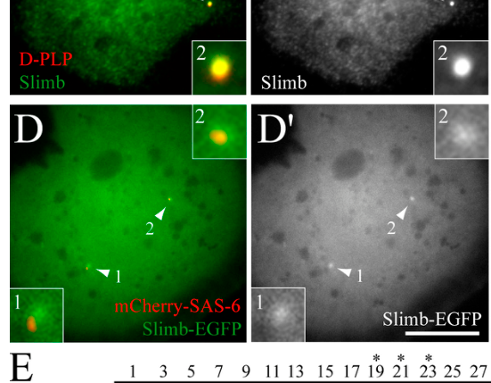

## Question

# Gene Research for Functional Annotation

## ⚠️ CRITICAL: Gene/Protein Identification Context

**BEFORE YOU BEGIN RESEARCH:** You MUST verify you are researching the CORRECT gene/protein. Gene symbols can be ambiguous, especially for less well-characterized genes from non-model organisms.

### Target Gene/Protein Identity (from UniProt):
- **UniProt Accession:** A0A0B4KHK1
- **Protein Description:** SubName: Full=Supernumerary limbs, isoform B {ECO:0000313|EMBL:AGB96182.1};
- **Gene Information:** Name=slmb {ECO:0000313|EMBL:AGB96182.1, ECO:0000313|FlyBase:FBgn0283468}; Synonyms=BcDNA:GM02031 {ECO:0000313|EMBL:AGB96182.1}, beta-TrCP {ECO:0000313|EMBL:AGB96182.1}, betaTrCP {ECO:0000313|EMBL:AGB96182.1}, crd {ECO:0000313|EMBL:AGB96182.1}, Dmel\CG3412 {ECO:0000313|EMBL:AGB96182.1}, FBXW1 {ECO:0000313|EMBL:AGB96182.1}, ica {ECO:0000313|EMBL:AGB96182.1}, l(3)00295 {ECO:0000313|EMBL:AGB96182.1}, MENE (3R)-B {ECO:0000313|EMBL:AGB96182.1}, MENE(3R)-B {ECO:0000313|EMBL:AGB96182.1}, shv {ECO:0000313|EMBL:AGB96182.1}, SLIMB {ECO:0000313|EMBL:AGB96182.1}, Slimb {ECO:0000313|EMBL:AGB96182.1}, slimb {ECO:0000313|EMBL:AGB96182.1}, Slimb/beta-TRCP {ECO:0000313|EMBL:AGB96182.1}, Slimb/beta-TrCP {ECO:0000313|EMBL:AGB96182.1}, Slimb/Beta-TRCP1 {ECO:0000313|EMBL:AGB96182.1}, Slimb/betaTrCP {ECO:0000313|EMBL:AGB96182.1}, SLMB {ECO:0000313|EMBL:AGB96182.1}, Slmb {ECO:0000313|EMBL:AGB96182.1}, wel {ECO:0000313|EMBL:AGB96182.1}; ORFNames=CG3412 {ECO:0000313|EMBL:AGB96182.1, ECO:0000313|FlyBase:FBgn0283468}, Dmel_CG3412 {ECO:0000313|EMBL:AGB96182.1};
- **Organism (full):** Drosophila melanogaster (Fruit fly).
- **Protein Family:** Not specified in UniProt
- **Key Domains:** Beta-TrCP_D. (IPR021977); F-box-like_dom_sf. (IPR036047); F-box_dom. (IPR001810); WD-F-box_domain-protein. (IPR050995); WD40/YVTN_repeat-like_dom_sf. (IPR015943)

### MANDATORY VERIFICATION STEPS:

1. **Check if the gene symbol "slmb" matches the protein description above**
2. **Verify the organism is correct:** Drosophila melanogaster (Fruit fly).
3. **Check if protein family/domains align with what you find in literature**
4. **If you find literature for a DIFFERENT gene with the same or similar symbol, STOP**

### If Gene Symbol is Ambiguous or You Cannot Find Relevant Literature:

**DO NOT PROCEED WITH RESEARCH ON A DIFFERENT GENE.** Instead:
- State clearly: "The gene symbol 'slmb' is ambiguous or literature is limited for this specific protein"
- Explain what you found (e.g., "Found extensive literature on a different gene with the same symbol in a different organism")
- Describe the protein based ONLY on the UniProt information provided above
- Suggest that the protein function can be inferred from domain/family information

### Research Target:

Please provide a comprehensive research report on the gene **slmb** (gene ID: slmb, UniProt: A0A0B4KHK1) in DROME.

The research report should be a detailed narrative explaining the function, biological processes, and localization of the gene product. Citations should be given for all claims.

You should prioritize authoritative reviews and primary scientific literature when conducting research. You can supplement
this with annotations you find in gene/protein databases, but these can be outdated or inaccurate.

We are specifically interested in the primary function of the gene - for enzymes, what reaction is catalyzed, and what is the substrate specificity? For transporters, what is the substrate? For structural proteins or adapters, what is the broader structural role? For signaling molecules, what is the role in the pathway.

We are interested in where in or outside the cell the gene product carries out its function.

We are also interested in the signaling or biochemical pathways in which the gene functions. We are less interested in broad pleiotropic effects, except where these elucidate the precise role.

Include evidence where possible. We are interested in both experimental evidence as well as inference from structure, evolution, or bioinformatic analysis. Precise studies should be prioritized over high-throughput, where available.

## Output

Question: You are an expert researcher providing comprehensive, well-cited information.

Provide detailed information focusing on:
1. Key concepts and definitions with current understanding
2. Recent developments and latest research (prioritize 2023-2024 sources)
3. Current applications and real-world implementations
4. Expert opinions and analysis from authoritative sources
5. Relevant statistics and data from recent studies

Format as a comprehensive research report with proper citations. Include URLs and publication dates where available.
Always prioritize recent, authoritative sources and provide specific citations for all major claims.

# Gene Research for Functional Annotation

## ⚠️ CRITICAL: Gene/Protein Identification Context

**BEFORE YOU BEGIN RESEARCH:** You MUST verify you are researching the CORRECT gene/protein. Gene symbols can be ambiguous, especially for less well-characterized genes from non-model organisms.

### Target Gene/Protein Identity (from UniProt):
- **UniProt Accession:** A0A0B4KHK1
- **Protein Description:** SubName: Full=Supernumerary limbs, isoform B {ECO:0000313|EMBL:AGB96182.1};
- **Gene Information:** Name=slmb {ECO:0000313|EMBL:AGB96182.1, ECO:0000313|FlyBase:FBgn0283468}; Synonyms=BcDNA:GM02031 {ECO:0000313|EMBL:AGB96182.1}, beta-TrCP {ECO:0000313|EMBL:AGB96182.1}, betaTrCP {ECO:0000313|EMBL:AGB96182.1}, crd {ECO:0000313|EMBL:AGB96182.1}, Dmel\CG3412 {ECO:0000313|EMBL:AGB96182.1}, FBXW1 {ECO:0000313|EMBL:AGB96182.1}, ica {ECO:0000313|EMBL:AGB96182.1}, l(3)00295 {ECO:0000313|EMBL:AGB96182.1}, MENE (3R)-B {ECO:0000313|EMBL:AGB96182.1}, MENE(3R)-B {ECO:0000313|EMBL:AGB96182.1}, shv {ECO:0000313|EMBL:AGB96182.1}, SLIMB {ECO:0000313|EMBL:AGB96182.1}, Slimb {ECO:0000313|EMBL:AGB96182.1}, slimb {ECO:0000313|EMBL:AGB96182.1}, Slimb/beta-TRCP {ECO:0000313|EMBL:AGB96182.1}, Slimb/beta-TrCP {ECO:0000313|EMBL:AGB96182.1}, Slimb/Beta-TRCP1 {ECO:0000313|EMBL:AGB96182.1}, Slimb/betaTrCP {ECO:0000313|EMBL:AGB96182.1}, SLMB {ECO:0000313|EMBL:AGB96182.1}, Slmb {ECO:0000313|EMBL:AGB96182.1}, wel {ECO:0000313|EMBL:AGB96182.1}; ORFNames=CG3412 {ECO:0000313|EMBL:AGB96182.1, ECO:0000313|FlyBase:FBgn0283468}, Dmel_CG3412 {ECO:0000313|EMBL:AGB96182.1};
- **Organism (full):** Drosophila melanogaster (Fruit fly).
- **Protein Family:** Not specified in UniProt
- **Key Domains:** Beta-TrCP_D. (IPR021977); F-box-like_dom_sf. (IPR036047); F-box_dom. (IPR001810); WD-F-box_domain-protein. (IPR050995); WD40/YVTN_repeat-like_dom_sf. (IPR015943)

### MANDATORY VERIFICATION STEPS:

1. **Check if the gene symbol "slmb" matches the protein description above**
2. **Verify the organism is correct:** Drosophila melanogaster (Fruit fly).
3. **Check if protein family/domains align with what you find in literature**
4. **If you find literature for a DIFFERENT gene with the same or similar symbol, STOP**

### If Gene Symbol is Ambiguous or You Cannot Find Relevant Literature:

**DO NOT PROCEED WITH RESEARCH ON A DIFFERENT GENE.** Instead:
- State clearly: "The gene symbol 'slmb' is ambiguous or literature is limited for this specific protein"
- Explain what you found (e.g., "Found extensive literature on a different gene with the same symbol in a different organism")
- Describe the protein based ONLY on the UniProt information provided above
- Suggest that the protein function can be inferred from domain/family information

### Research Target:

Please provide a comprehensive research report on the gene **slmb** (gene ID: slmb, UniProt: A0A0B4KHK1) in DROME.

The research report should be a detailed narrative explaining the function, biological processes, and localization of the gene product. Citations should be given for all claims.

You should prioritize authoritative reviews and primary scientific literature when conducting research. You can supplement
this with annotations you find in gene/protein databases, but these can be outdated or inaccurate.

We are specifically interested in the primary function of the gene - for enzymes, what reaction is catalyzed, and what is the substrate specificity? For transporters, what is the substrate? For structural proteins or adapters, what is the broader structural role? For signaling molecules, what is the role in the pathway.

We are interested in where in or outside the cell the gene product carries out its function.

We are also interested in the signaling or biochemical pathways in which the gene functions. We are less interested in broad pleiotropic effects, except where these elucidate the precise role.

Include evidence where possible. We are interested in both experimental evidence as well as inference from structure, evolution, or bioinformatic analysis. Precise studies should be prioritized over high-throughput, where available.

# Functional annotation of *slmb* in *Drosophila melanogaster*

## Identity and scope

The supplied UniProt record identifies **A0A0B4KHK1** as *D. melanogaster* **supernumerary limbs (slmb), isoform B**, with F-box and WD40-related domains. This identity is consistent with fly literature: *slmb* encodes **Slimb**, the fly β-TrCP-family F-box/WD40 protein. Here, “β-TrCP” denotes homology, **not** a substitution of experiments on human FBXW1 or FBXW11 for fly evidence. The studies below generally investigate *slmb*/Slimb without resolving isoform B; their findings should therefore be annotated to the fly gene product, not asserted as experimentally demonstrated properties unique to A0A0B4KHK1. The accession-to-isoform mapping comes from the UniProt information supplied in the question, rather than independent accession-specific experimental verification. (ho2006fboxproteinsthe pages 2-4, wong2013acullin1basedscf pages 5-6)

## Primary molecular function

**Slimb is a substrate-recognition adaptor of an SCF E3 ubiquitin ligase, not an enzyme that independently catalyzes phosphorylation or ubiquitin transfer.** In the fly complex, its F-box connects it through SkpA to the Cul1 scaffold; Roc1a provides the RING-associated interface for the ubiquitin-charged E2. Its WD40-containing region helps select substrates. The functional output is substrate ubiquitination followed, for established targets, by proteasomal degradation or regulated partial proteolysis. Recognition is often phosphorylation-dependent, but there is **no single obligatory phosphodegron sequence or kinase for every Slimb substrate**. The experimentally identified Cul1–SkpA–Roc1a–Slimb machinery and WD40-dependent Akt ubiquitination support this assignment. (ho2006fboxproteinsthe pages 2-4, wong2013acullin1basedscf pages 1-2, wong2013acullin1basedscf pages 15-16)

The table summarizes fly-specific pathways, the strength of the substrate evidence, and relevant cellular sites. It distinguishes localization of **Slimb itself** from localization of a protein that Slimb regulates. (rogers2009thescfslimbubiquitin pages 4-6, smelkinson2006processingofthe pages 1-2, ribeiro2014crumbspromotesexpanded pages 6-7)

| Pathway / fly substrate | Biochemical mechanism and direct assay | Functional outcome / demonstrated site | Key peer-reviewed source (year; DOI) |
|---|---|---|---|
| Hedgehog — **Ci-155 → Ci-75** | **Direct binding:** sequential PKA-, CK1-, and GSK3-dependent phosphorylation of Ci stimulates binding to full-length Slimb in pull-down assays; alanine substitution of the relevant sites abolishes stimulated binding. A heterologous β-TrCP phosphodegron restores processing in vivo. | SCF^Slimb initiates partial proteasomal processing of Ci-155 into transcriptional repressor Ci-75 when Hedgehog is absent. Evidence derives from embryos, wing discs, and cultured-cell/in-vitro assays; it does not resolve a Slimb isoform. (smelkinson2006processingofthe pages 1-2) | Smelkinson & Kalderon (2006); [10.1016/j.cub.2005.12.012](https://doi.org/10.1016/j.cub.2005.12.012) |
| Wingless/Wnt — **Armadillo (Arm/β-catenin)** | **Primarily genetic and protein-stability evidence in flies:** Arm accumulates cell-autonomously in *slimb* mutant wing-disc clones; CK1α or Slimb depletion also stabilizes Arm. The retrieved fly evidence does not itself show purified direct Arm–Slimb binding. | SCF^Slimb promotes turnover of phosphorylated Arm when Wingless signaling is inactive, restricting Wg pathway output. Arm localization or accumulation is substrate evidence, not proof that Slimb occupies the same compartment. (ho2006fboxproteinsthe pages 4-5, nguyen2015drosophilacaseinkinase pages 16-18, ho2006fboxproteinsthe pages 2-4) | Ho et al. (2006); [10.1007/s11373-005-9058-2](https://doi.org/10.1007/s11373-005-9058-2). Nguyen et al. (2015); [10.1371/journal.pgen.1005014](https://doi.org/10.1371/journal.pgen.1005014) |
| Centrosome cycle — **Plk4/Sak** | **Direct physical and ubiquitination evidence:** Slimb co-immunoprecipitates with Plk4. Mutating the Plk4 DSGIIT degron to DAGIIA (S293A/T297A) abolishes detectable Slimb binding and ubiquitination. Plk4 trans-autophosphorylation generates the degron; 2023 separation-of-function experiments show dimerization and condensation facilitate autodestruction but are not required for centriole assembly. | Limits Plk4 abundance and centriole reduplication. Slimb is mostly cytoplasmic but is directly demonstrated at centrioles by endogenous immunostaining, Slimb–EGFP/SAS-6 colocalization, and centriole co-purification. (rogers2009thescfslimbubiquitin pages 4-6, cunhaferreira2013regulationofautophosphorylation pages 7-9, ryniawec2023pololikekinase4 pages 10-12, rogers2009thescfslimbubiquitin media c22565c6) | Rogers et al. (2009); [10.1083/jcb.200808049](https://doi.org/10.1083/jcb.200808049). Cunha-Ferreira et al. (2013); [10.1016/j.cub.2013.09.037](https://doi.org/10.1016/j.cub.2013.09.037). Ryniawec et al. (2023); [10.1091/mbc.e22-12-0572](https://doi.org/10.1091/mbc.e22-12-0572) |
| Hippo/polarity — **Expanded (Ex)** | **Direct recognition and ubiquitination:** Crumbs promotes Ex phosphorylation and association with Slimb. Ex S453A abolishes Slimb association and Crumbs-induced ubiquitination; S462A reduces association. Slimb RNAi completely blocks Crumbs-induced Ex ubiquitination, and *slmb* mutant clones accumulate Ex. | Tunes Hippo signaling and Yorkie repression by controlling apical-membrane-associated Ex turnover. Ex accumulation at the apical membrane is not, by itself, evidence that Slimb is membrane-localized; degradation may occur at the membrane or after endocytosis. (ribeiro2014crumbspromotesexpanded pages 1-2, ribeiro2014crumbspromotesexpanded pages 2-3, ribeiro2014crumbspromotesexpanded pages 6-7) | Ribeiro et al. (2014); [10.1073/pnas.1315508111](https://doi.org/10.1073/pnas.1315508111) |
| Circadian clock — **PERIOD (PER), Ser47 region** | **Direct phosphosite-dependent binding:** PER residues 1–100 are necessary and sufficient for SLIMB binding in pull-down assays; DBT-dependent Ser47 phosphorylation strongly promotes recognition. S47A markedly weakens binding and stabilizes PER, whereas phosphomimetic S47D accelerates turnover. | Sets clock pace through phosphorylated PER degradation, especially late-night/early-morning nuclear PER. S47A flies show ~30.7-h rhythms versus 23.3 h for wild-type control; S47D gives ~22.1–22.5 h. Nuclear PER behavior does not independently prove exclusive nuclear localization of Slimb. (chiu2008thephosphooccupancyof pages 6-7, chiu2008thephosphooccupancyof pages 3-4, chiu2008thephosphooccupancyof pages 1-2, chiu2008thephosphooccupancyof pages 8-9) | Chiu et al. (2008); [10.1101/gad.1682708](https://doi.org/10.1101/gad.1682708) |
| InR/PI3K/TOR during neuronal remodeling — **Akt** | **Complex and ubiquitination evidence:** Slimb forms a complex with Akt and promotes Akt ubiquitination in a WD40-dependent manner. Genetic analyses place Cul1, Roc1a, SkpA, and Slimb in the same pruning machinery. | Inactivates Akt/InR–PI3K–TOR signaling to permit ecdysone-triggered ddaC dendrite and mushroom-body γ-axon pruning. The demonstrated anatomical outcome is neuronal; a precise intracellular site of Slimb–Akt action was not established. (wong2013acullin1basedscf pages 15-16, wong2013acullin1basedscf pages 1-2, wong2013acullin1basedscf pages 5-6, wong2013acullin1basedscf pages 3-5) | Wong et al. (2013); [10.1371/journal.pbio.1001657](https://doi.org/10.1371/journal.pbio.1001657) |
| Toll/NF-κB — **Cactus/IκB** | **Strong pathway requirement, but direct fly binding remains less complete:** Slimb RNAi blocks Toll-induced Cactus degradation in EGFR–Toll S2 cells. Recombinant Pelle directly phosphorylates Cactus; S74A/S78A/S116A reduces phosphorylation by 75–80%. Fly genetic evidence supports Slimb-dependent Dorsal activation, but retrieved assays do not demonstrate purified Cactus–Slimb binding. | Promotes Cactus destruction and releases Dorsal/Dif for nuclear activity. Dependence is context-sensitive: adult responses and viral β-TrCP-inhibitor experiments suggest Slimb may not be the sole Cactus receptor in every tissue or stage. (daigneault2013theirakhomolog pages 1-2, daigneault2013theirakhomolog pages 3-5, spencer1999signalinducedubiquitinationof pages 5-6, daigneault2013theirakhomolog pages 2-3) | Daigneault et al. (2013); [10.1371/journal.pone.0075150](https://doi.org/10.1371/journal.pone.0075150) |
| Condensin II / genome organization — **Cap-H2** | **Physical association plus pathway evidence:** endogenous Slimb co-immunoprecipitates with Cap-H2–EGFP but not EGFP alone; the Cap-H2 C terminus contains a DSGISS candidate degron. Slimb depletion stabilizes Cap-H2, although CK1α depletion does not abolish Slimb association or Cap-H2 ubiquitination. | Restricts interphase condensin-II activity, chromosome compaction, and homolog unpairing by limiting Cap-H2. Increased chromatin-bound Cap-H2 after CK1α loss concerns substrate localization and must not be treated as proof of Slimb localization there. (nguyen2015drosophilacaseinkinase pages 16-18, nguyen2015drosophilacaseinkinase pages 4-6, nguyen2015drosophilacaseinkinase pages 18-19) | Nguyen et al. (2015); [10.1371/journal.pgen.1005014](https://doi.org/10.1371/journal.pgen.1005014) |

*Table: High-confidence fly-specific evidence connecting Slimb to its principal substrates, biochemical mechanisms, pathway outcomes, and demonstrated sites of action. Findings generally concern slmb/Slimb and should not be interpreted as specific to UniProt A0A0B4KHK1 isoform B.*

### Mechanistic interpretation of the principal pathways

**Hedgehog and Wingless.** In the absence of Hedgehog, PKA-, CK1- and GSK3-dependent phosphorylation of full-length Cubitus interruptus (**Ci-155**) promotes **direct binding to Slimb** and conversion to the **Ci-75 transcriptional repressor**. The particularly strong evidence is a phospho-Ci/Slimb binding assay, loss of stimulated binding upon phosphosite mutation, and restoration of processing by an introduced Slimb-binding motif. This is *partial processing*, not simple complete destruction of Ci. When Wingless signaling is inactive, SCF^Slimb promotes turnover of phosphorylated **Armadillo**, the fly β-catenin homolog; Armadillo accumulates in *slmb* mutant wing tissue. Together these actions restrain inappropriate Hedgehog and Wingless pathway output. (smelkinson2006processingofthe pages 1-2, ho2006fboxproteinsthe pages 4-5, nguyen2015drosophilacaseinkinase pages 16-18)

**Centrioles.** Slimb binds the centriole-duplication kinase **Plk4/Sak** and limits its abundance, preventing centriole reduplication. In fly cells, replacing Plk4’s **DSGIIT** recognition sequence with **DAGIIA**—the S293A/T297A substitutions—abolished detectable Slimb association and Plk4 ubiquitin labeling; Slimb depletion stabilized Plk4. Subsequent experiments linked phosphorylation of this degron to Plk4’s own kinase activity. This is a well-defined example of substrate specificity arising from a phosphorylated recognition site rather than from constitutive destruction of every Plk4 molecule. (rogers2009thescfslimbubiquitin pages 4-6, cunhaferreira2013regulationofautophosphorylation pages 1-3)

**Hippo signaling.** Slimb directly regulates **Expanded (Ex)**, an upstream growth-restraining Hippo component. Apical polarity protein Crumbs recruits Ex and promotes its phosphorylation-dependent recognition by SCF^Slimb. Mutation of Ex **Ser453** eliminated detectable Slimb association and Crumbs-induced ubiquitination; Slimb depletion likewise blocked the induced ubiquitination, while *slmb* mutant wing-disc clones accumulated Ex. Ex turnover consequently tunes Hippo-mediated inhibition of the growth regulator Yorkie. Whether Ex is ultimately degraded *at* the apical membrane or after endocytosis remains unresolved; apical Ex staining alone does not establish membrane localization of Slimb. (ribeiro2014crumbspromotesexpanded pages 1-2, ribeiro2014crumbspromotesexpanded pages 6-7, zhang2015scfslmbe3ligasemediated pages 7-9)

**Clock and neuronal remodeling.** DOUBLETIME-dependent phosphorylation within the N-terminal Slimb-binding region of **PERIOD (PER)**, notably **Ser47**, promotes PER recognition and turnover, helping set circadian timing. In an experimental *per*-null background, PER-S47A transgenes produced approximately **30.7-hour** behavioral periods, PER-S47D approximately **22.1–22.5 hours**, and the tagged wild-type PER control **23.3 hours**; these are effects of **PER mutations**, not measurements of Slimb isoform B. Separately, Slimb associates with and promotes ubiquitination of **Akt**. Fly genetic experiments place Cul1, SkpA, Roc1a and Slimb in a mechanism that attenuates InR/PI3K/TOR signaling to permit developmental dendrite pruning; the exact Akt ubiquitination site and precise intracellular site of that reaction were not established in the retrieved evidence. (chiu2008thephosphooccupancyof pages 3-4, chiu2008thephosphooccupancyof pages 6-7, wong2013acullin1basedscf pages 15-16, wong2013acullin1basedscf pages 1-2)

**Additional, context-dependent targets.** In Toll-activated fly S2 cells, *slmb* RNAi blocked degradation of **Cactus**, the IκB-family inhibitor; recombinant Pelle phosphorylated Cactus at signal-responsive sites. The authors cautioned that Slimb need not be the sole Cactus-turnover mechanism in every fly tissue or developmental stage. Slimb also associates with the condensin-II subunit **Cap-H2** and restricts its abundance and chromosome-organizing activity. Although CK1α depletion stabilized chromatin-bound Cap-H2, it did **not** abolish the measured Slimb–Cap-H2 association, illustrating why a universal rule that CK1α phosphorylation is required for *all* Slimb binding would be inaccurate. Evidence that Slimb influences Imd/Relish signaling does not, by itself, establish **Relish as a directly ubiquitinated Slimb substrate**. (daigneault2013theirakhomolog pages 1-2, daigneault2013theirakhomolog pages 2-3, nguyen2015drosophilacaseinkinase pages 16-18, khush2002aubiquitinproteasomepathway pages 4-6)

## Where Slimb acts

The clearest **direct Slimb-localization** evidence is in *Drosophila* S2 cells: endogenous Slimb was reported as **mostly cytoplasmic but enriched at centrioles**. Centriolar enrichment was supported by Slimb immunostaining, live-cell Slimb–EGFP colocalization with the centriole marker SAS-6, reduced staining after Slimb depletion, and partial copurification with centrioles. Cropped microscopy panels from the primary study show the centriolar signals. These observations support an intracellular, cytoplasmic/centriole-associated action; they do not imply that all Slimb molecules reside at centrosomes. (rogers2009thescfslimbubiquitin pages 4-6, rogers2009thescfslimbubiquitin media c22565c6)

PER turnover is studied in the context of **nuclear PER**, Expanded turnover in the context of **apical epithelial Ex**, and Cap-H2 regulation in the context of **chromatin-bound Cap-H2**. Those are informative sites for pathway activity, but substrate location should not automatically be assigned to the receptor. The available experiments do not establish a single exclusive nuclear, chromatin, or apical-membrane residence for Slimb isoform B. (chiu2008thephosphooccupancyof pages 1-2, ribeiro2014crumbspromotesexpanded pages 6-7, nguyen2015drosophilacaseinkinase pages 18-19)

## Recent developments and research use

A **July 2023** fly study refined the Plk4 self-destruction model: separation-of-function experiments found that Plk4 homodimerization and condensate formation can facilitate the concentration-dependent trans-autophosphorylation that precedes Slimb-linked turnover, yet **neither structure is obligatory for centriole assembly**. Its implication for *slmb* is improved understanding of *how its Plk4 substrate becomes recognizable*, not discovery of a different identity or function for Slimb. (ryniawec2023pololikekinase4 pages 1-2, ryniawec2023pololikekinase4 pages 10-12)

A **November 2024 preprint** on PP2A^Wrd reported dephosphorylation and stabilization of Expanded, opposing Crumbs-associated Ex turnover. It treated SCF^Slimb-mediated Ex degradation principally as an **established pathway**, not as a newly proven Slimb-isoform-B reaction. Likewise, an **August 2024** S2-cell CRISPR methods paper used Slimb RNAi in a Plk4-related experimental setting; its main advance was gene-edited cell-line methodology, not a new substrate-specificity assignment for Slimb. These distinctions matter when prioritizing recent publications over older, more decisive biochemical experiments. (sekar2024adualrole pages 1-6, ryniawec2024generatingcrispreditedclonal pages 2-3)

A later **February 2025** fly study reported that USP14 interacts with Slimb and affects PER stability through a Slimb-dependent mechanism; it implicated **PER Lys1117 and Lys1118** in turnover. This extends the clock-protein mechanism but does not identify ubiquitin acceptor residues on Slimb or resolve the properties of Slimb isoform B. Experimental applications of the fly system are therefore mechanistic—testing phosphodegrons, E3-substrate regulation, tissue growth, circadian timing, and centriole-number control—not evidence here for a clinical use of A0A0B4KHK1. (kang2025drosophilaubiquitinspecificpeptidase pages 5-7, kang2025drosophilaubiquitinspecificpeptidase pages 1-2, rogers2009thescfslimbubiquitin pages 4-6, ribeiro2014crumbspromotesexpanded pages 6-7)

## Selected source links and publication dates

- Smelkinson and Kalderon, **10 January 2006**, direct Slimb binding and Ci processing: https://doi.org/10.1016/j.cub.2005.12.012. (smelkinson2006processingofthe pages 1-2)
- Chiu *et al.*, **July 2008**, PER phosphosite recognition and clock-period measurements: https://doi.org/10.1101/gad.1682708. (chiu2008thephosphooccupancyof pages 3-4, chiu2008thephosphooccupancyof pages 6-7)
- Rogers *et al.*, **January 2009**, Plk4 degradation and direct Slimb centriole localization: https://doi.org/10.1083/jcb.200808049. (rogers2009thescfslimbubiquitin pages 4-6)
- Wong *et al.*, **September 2013**, SCF^Slimb, Akt and neuronal pruning: https://doi.org/10.1371/journal.pbio.1001657. (wong2013acullin1basedscf pages 1-2)
- Ribeiro *et al.*, **April 2014**, Crumbs-dependent Slimb recognition of Expanded: https://doi.org/10.1073/pnas.1315508111. (ribeiro2014crumbspromotesexpanded pages 6-7)
- Ryniawec *et al.*, **July 2023**, Plk4 dimerization and condensates: https://doi.org/10.1091/mbc.e22-12-0572. (ryniawec2023pololikekinase4 pages 1-2)
- Sekar *et al.*, **November 2024**, PP2A–Expanded study (**preprint**): https://doi.org/10.1101/2024.11.14.623552. (sekar2024adualrole pages 1-6)
- Kang *et al.*, **February 2025**, USP14–Slimb–PER regulation: https://doi.org/10.1038/s42003-025-07632-9. (kang2025drosophilaubiquitinspecificpeptidase pages 1-2)

**Annotation conclusion:** For UniProt **A0A0B4KHK1**, the best-supported *gene-level* functional annotation is **F-box/WD40 substrate receptor of intracellular SCF^Slimb ubiquitin ligase complexes**, directing context-dependent proteasomal turnover or processing of phosphorylated regulatory proteins. The strongest directly demonstrated sites for Slimb itself are the **cytoplasm and centrioles**; isoform-B-specific substrate preference and localization remain unverified by the cited experiments. (ho2006fboxproteinsthe pages 2-4, rogers2009thescfslimbubiquitin pages 4-6, smelkinson2006processingofthe pages 1-2)

References

1. (ho2006fboxproteinsthe pages 2-4): Margaret S. Ho, Pei-I Tsai, and Cheng-Ting Chien. F-box proteins: the key to protein degradation. Journal of biomedical science, 13 2:181-91, Feb 2006. URL: https://doi.org/10.1007/s11373-005-9058-2, doi:10.1007/s11373-005-9058-2. This article has 206 citations and is from a domain leading peer-reviewed journal.

2. (wong2013acullin1basedscf pages 5-6): Jack Jing Lin Wong, Song Li, Edwin Kok Hao Lim, Yan Wang, Cheng Wang, Heng Zhang, Daniel Kirilly, Chunlai Wu, Yih-Cherng Liou, Hongyan Wang, and Fengwei Yu. A cullin1-based scf e3 ubiquitin ligase targets the inr/pi3k/tor pathway to regulate neuronal pruning. PLoS Biology, 11:e1001657, Sep 2013. URL: https://doi.org/10.1371/journal.pbio.1001657, doi:10.1371/journal.pbio.1001657. This article has 107 citations and is from a highest quality peer-reviewed journal.

3. (wong2013acullin1basedscf pages 1-2): Jack Jing Lin Wong, Song Li, Edwin Kok Hao Lim, Yan Wang, Cheng Wang, Heng Zhang, Daniel Kirilly, Chunlai Wu, Yih-Cherng Liou, Hongyan Wang, and Fengwei Yu. A cullin1-based scf e3 ubiquitin ligase targets the inr/pi3k/tor pathway to regulate neuronal pruning. PLoS Biology, 11:e1001657, Sep 2013. URL: https://doi.org/10.1371/journal.pbio.1001657, doi:10.1371/journal.pbio.1001657. This article has 107 citations and is from a highest quality peer-reviewed journal.

4. (wong2013acullin1basedscf pages 15-16): Jack Jing Lin Wong, Song Li, Edwin Kok Hao Lim, Yan Wang, Cheng Wang, Heng Zhang, Daniel Kirilly, Chunlai Wu, Yih-Cherng Liou, Hongyan Wang, and Fengwei Yu. A cullin1-based scf e3 ubiquitin ligase targets the inr/pi3k/tor pathway to regulate neuronal pruning. PLoS Biology, 11:e1001657, Sep 2013. URL: https://doi.org/10.1371/journal.pbio.1001657, doi:10.1371/journal.pbio.1001657. This article has 107 citations and is from a highest quality peer-reviewed journal.

5. (rogers2009thescfslimbubiquitin pages 4-6): Gregory C. Rogers, Nasser M. Rusan, David M. Roberts, Mark Peifer, and Stephen L. Rogers. The scfslimb ubiquitin ligase regulates plk4/sak levels to block centriole reduplication. The Journal of Cell Biology, 184:225-239, Jan 2009. URL: https://doi.org/10.1083/jcb.200808049, doi:10.1083/jcb.200808049. This article has 300 citations.

6. (smelkinson2006processingofthe pages 1-2): Margery G. Smelkinson and Daniel Kalderon. Processing of the drosophila hedgehog signaling effector ci-155 to the repressor ci-75 is mediated by direct binding to the scf component slimb. Current Biology, 16:110-116, Jan 2006. URL: https://doi.org/10.1016/j.cub.2005.12.012, doi:10.1016/j.cub.2005.12.012. This article has 118 citations and is from a highest quality peer-reviewed journal.

7. (ribeiro2014crumbspromotesexpanded pages 6-7): Paulo Ribeiro, Maxine Holder, David Frith, Ambrosius P. Snijders, and Nicolas Tapon. Crumbs promotes expanded recognition and degradation by the scfslimb/β-trcp ubiquitin ligase. Proceedings of the National Academy of Sciences, 111:E1980-E1989, Apr 2014. URL: https://doi.org/10.1073/pnas.1315508111, doi:10.1073/pnas.1315508111. This article has 67 citations and is from a highest quality peer-reviewed journal.

8. (ho2006fboxproteinsthe pages 4-5): Margaret S. Ho, Pei-I Tsai, and Cheng-Ting Chien. F-box proteins: the key to protein degradation. Journal of biomedical science, 13 2:181-91, Feb 2006. URL: https://doi.org/10.1007/s11373-005-9058-2, doi:10.1007/s11373-005-9058-2. This article has 206 citations and is from a domain leading peer-reviewed journal.

9. (nguyen2015drosophilacaseinkinase pages 16-18): Huy Q. Nguyen, Jonathan Nye, Daniel W. Buster, Joseph E. Klebba, Gregory C. Rogers, and Giovanni Bosco. Drosophila casein kinase i alpha regulates homolog pairing and genome organization by modulating condensin ii subunit cap-h2 levels. PLOS Genetics, 11:e1005014, Feb 2015. URL: https://doi.org/10.1371/journal.pgen.1005014, doi:10.1371/journal.pgen.1005014. This article has 38 citations and is from a domain leading peer-reviewed journal.

10. (cunhaferreira2013regulationofautophosphorylation pages 7-9): Inês Cunha-Ferreira, Inês Bento, Ana Pimenta-Marques, Swadhin Chandra Jana, Mariana Lince-Faria, Paulo Duarte, Joana Borrego-Pinto, Samuel Gilberto, Tiago Amado, Daniela Brito, Ana Rodrigues-Martins, Janusz Debski, Nikola Dzhindzhev, and Mónica Bettencourt-Dias. Regulation of autophosphorylation controls plk4 self-destruction and centriole number. Current Biology, 23:2245-2254, Nov 2013. URL: https://doi.org/10.1016/j.cub.2013.09.037, doi:10.1016/j.cub.2013.09.037. This article has 159 citations and is from a highest quality peer-reviewed journal.

11. (ryniawec2023pololikekinase4 pages 10-12): John M. Ryniawec, Daniel W. Buster, Lauren K. Slevin, Cody J. Boese, Anastasia Amoiroglou, Spencer M. Dean, Kevin C. Slep, and Gregory C. Rogers. Polo-like kinase 4 homodimerization and condensate formation regulate its own protein levels but are not required for centriole assembly. Molecular Biology of the Cell, Jul 2023. URL: https://doi.org/10.1091/mbc.e22-12-0572, doi:10.1091/mbc.e22-12-0572. This article has 14 citations and is from a domain leading peer-reviewed journal.

12. (rogers2009thescfslimbubiquitin media c22565c6): Gregory C. Rogers, Nasser M. Rusan, David M. Roberts, Mark Peifer, and Stephen L. Rogers. The scfslimb ubiquitin ligase regulates plk4/sak levels to block centriole reduplication. The Journal of Cell Biology, 184:225-239, Jan 2009. URL: https://doi.org/10.1083/jcb.200808049, doi:10.1083/jcb.200808049. This article has 300 citations.

13. (ribeiro2014crumbspromotesexpanded pages 1-2): Paulo Ribeiro, Maxine Holder, David Frith, Ambrosius P. Snijders, and Nicolas Tapon. Crumbs promotes expanded recognition and degradation by the scfslimb/β-trcp ubiquitin ligase. Proceedings of the National Academy of Sciences, 111:E1980-E1989, Apr 2014. URL: https://doi.org/10.1073/pnas.1315508111, doi:10.1073/pnas.1315508111. This article has 67 citations and is from a highest quality peer-reviewed journal.

14. (ribeiro2014crumbspromotesexpanded pages 2-3): Paulo Ribeiro, Maxine Holder, David Frith, Ambrosius P. Snijders, and Nicolas Tapon. Crumbs promotes expanded recognition and degradation by the scfslimb/β-trcp ubiquitin ligase. Proceedings of the National Academy of Sciences, 111:E1980-E1989, Apr 2014. URL: https://doi.org/10.1073/pnas.1315508111, doi:10.1073/pnas.1315508111. This article has 67 citations and is from a highest quality peer-reviewed journal.

15. (chiu2008thephosphooccupancyof pages 6-7): Joanna C. Chiu, Jens T. Vanselow, Achim Kramer, and Isaac Edery. The phospho-occupancy of an atypical slimb-binding site on period that is phosphorylated by doubletime controls the pace of the clock. Genes & development, 22 13:1758-72, Jul 2008. URL: https://doi.org/10.1101/gad.1682708, doi:10.1101/gad.1682708. This article has 210 citations and is from a highest quality peer-reviewed journal.

16. (chiu2008thephosphooccupancyof pages 3-4): Joanna C. Chiu, Jens T. Vanselow, Achim Kramer, and Isaac Edery. The phospho-occupancy of an atypical slimb-binding site on period that is phosphorylated by doubletime controls the pace of the clock. Genes & development, 22 13:1758-72, Jul 2008. URL: https://doi.org/10.1101/gad.1682708, doi:10.1101/gad.1682708. This article has 210 citations and is from a highest quality peer-reviewed journal.

17. (chiu2008thephosphooccupancyof pages 1-2): Joanna C. Chiu, Jens T. Vanselow, Achim Kramer, and Isaac Edery. The phospho-occupancy of an atypical slimb-binding site on period that is phosphorylated by doubletime controls the pace of the clock. Genes & development, 22 13:1758-72, Jul 2008. URL: https://doi.org/10.1101/gad.1682708, doi:10.1101/gad.1682708. This article has 210 citations and is from a highest quality peer-reviewed journal.

18. (chiu2008thephosphooccupancyof pages 8-9): Joanna C. Chiu, Jens T. Vanselow, Achim Kramer, and Isaac Edery. The phospho-occupancy of an atypical slimb-binding site on period that is phosphorylated by doubletime controls the pace of the clock. Genes & development, 22 13:1758-72, Jul 2008. URL: https://doi.org/10.1101/gad.1682708, doi:10.1101/gad.1682708. This article has 210 citations and is from a highest quality peer-reviewed journal.

19. (wong2013acullin1basedscf pages 3-5): Jack Jing Lin Wong, Song Li, Edwin Kok Hao Lim, Yan Wang, Cheng Wang, Heng Zhang, Daniel Kirilly, Chunlai Wu, Yih-Cherng Liou, Hongyan Wang, and Fengwei Yu. A cullin1-based scf e3 ubiquitin ligase targets the inr/pi3k/tor pathway to regulate neuronal pruning. PLoS Biology, 11:e1001657, Sep 2013. URL: https://doi.org/10.1371/journal.pbio.1001657, doi:10.1371/journal.pbio.1001657. This article has 107 citations and is from a highest quality peer-reviewed journal.

20. (daigneault2013theirakhomolog pages 1-2): Jessica Daigneault, Liv Klemetsaune, and Steven A. Wasserman. The irak homolog pelle is the functional counterpart of iκb kinase in the drosophila toll pathway. PLoS ONE, 8:e75150, Sep 2013. URL: https://doi.org/10.1371/journal.pone.0075150, doi:10.1371/journal.pone.0075150. This article has 54 citations and is from a peer-reviewed journal.

21. (daigneault2013theirakhomolog pages 3-5): Jessica Daigneault, Liv Klemetsaune, and Steven A. Wasserman. The irak homolog pelle is the functional counterpart of iκb kinase in the drosophila toll pathway. PLoS ONE, 8:e75150, Sep 2013. URL: https://doi.org/10.1371/journal.pone.0075150, doi:10.1371/journal.pone.0075150. This article has 54 citations and is from a peer-reviewed journal.

22. (spencer1999signalinducedubiquitinationof pages 5-6): E. Spencer, Jin-qi Jiang, and Zhijian J. Chen. Signal-induced ubiquitination of iκbα by the f-box protein slimb/β-trcp. Genes & Development, 13:284-294, Feb 1999. URL: https://doi.org/10.1101/gad.13.3.284, doi:10.1101/gad.13.3.284. This article has 571 citations and is from a highest quality peer-reviewed journal.

23. (daigneault2013theirakhomolog pages 2-3): Jessica Daigneault, Liv Klemetsaune, and Steven A. Wasserman. The irak homolog pelle is the functional counterpart of iκb kinase in the drosophila toll pathway. PLoS ONE, 8:e75150, Sep 2013. URL: https://doi.org/10.1371/journal.pone.0075150, doi:10.1371/journal.pone.0075150. This article has 54 citations and is from a peer-reviewed journal.

24. (nguyen2015drosophilacaseinkinase pages 4-6): Huy Q. Nguyen, Jonathan Nye, Daniel W. Buster, Joseph E. Klebba, Gregory C. Rogers, and Giovanni Bosco. Drosophila casein kinase i alpha regulates homolog pairing and genome organization by modulating condensin ii subunit cap-h2 levels. PLOS Genetics, 11:e1005014, Feb 2015. URL: https://doi.org/10.1371/journal.pgen.1005014, doi:10.1371/journal.pgen.1005014. This article has 38 citations and is from a domain leading peer-reviewed journal.

25. (nguyen2015drosophilacaseinkinase pages 18-19): Huy Q. Nguyen, Jonathan Nye, Daniel W. Buster, Joseph E. Klebba, Gregory C. Rogers, and Giovanni Bosco. Drosophila casein kinase i alpha regulates homolog pairing and genome organization by modulating condensin ii subunit cap-h2 levels. PLOS Genetics, 11:e1005014, Feb 2015. URL: https://doi.org/10.1371/journal.pgen.1005014, doi:10.1371/journal.pgen.1005014. This article has 38 citations and is from a domain leading peer-reviewed journal.

26. (cunhaferreira2013regulationofautophosphorylation pages 1-3): Inês Cunha-Ferreira, Inês Bento, Ana Pimenta-Marques, Swadhin Chandra Jana, Mariana Lince-Faria, Paulo Duarte, Joana Borrego-Pinto, Samuel Gilberto, Tiago Amado, Daniela Brito, Ana Rodrigues-Martins, Janusz Debski, Nikola Dzhindzhev, and Mónica Bettencourt-Dias. Regulation of autophosphorylation controls plk4 self-destruction and centriole number. Current Biology, 23:2245-2254, Nov 2013. URL: https://doi.org/10.1016/j.cub.2013.09.037, doi:10.1016/j.cub.2013.09.037. This article has 159 citations and is from a highest quality peer-reviewed journal.

27. (zhang2015scfslmbe3ligasemediated pages 7-9): Hongtao Zhang, Changqing Li, Hanqing Chen, Chuanxian Wei, Fei Dai, Honggang Wu, Wen Dui, Wu-Min Deng, and Renjie Jiao. Scfslmb e3 ligase-mediated degradation of expanded is inhibited by the hippo pathway in drosophila. Cell Research, 25:93-109, Dec 2015. URL: https://doi.org/10.1038/cr.2014.166, doi:10.1038/cr.2014.166. This article has 34 citations and is from a domain leading peer-reviewed journal.

28. (khush2002aubiquitinproteasomepathway pages 4-6): Ranjiv S. Khush, William D. Cornwell, Jennifer N. Uram, and Bruno Lemaitre. A ubiquitin-proteasome pathway represses the drosophila immune deficiency signaling cascade. Current Biology, 12:1728-1737, Oct 2002. URL: https://doi.org/10.1016/s0960-9822(02)01214-9, doi:10.1016/s0960-9822(02)01214-9. This article has 150 citations and is from a highest quality peer-reviewed journal.

29. (ryniawec2023pololikekinase4 pages 1-2): John M. Ryniawec, Daniel W. Buster, Lauren K. Slevin, Cody J. Boese, Anastasia Amoiroglou, Spencer M. Dean, Kevin C. Slep, and Gregory C. Rogers. Polo-like kinase 4 homodimerization and condensate formation regulate its own protein levels but are not required for centriole assembly. Molecular Biology of the Cell, Jul 2023. URL: https://doi.org/10.1091/mbc.e22-12-0572, doi:10.1091/mbc.e22-12-0572. This article has 14 citations and is from a domain leading peer-reviewed journal.

30. (sekar2024adualrole pages 1-6): Aashika Sekar, Alberto Rizzo, Elodie Sins, Alexander D. Fulford, and Paulo S. Ribeiro. A dual role for the pp2a phosphatase in hippo signalling regulation. bioRxiv, Nov 2024. URL: https://doi.org/10.1101/2024.11.14.623552, doi:10.1101/2024.11.14.623552. This article has 0 citations.

31. (ryniawec2024generatingcrispreditedclonal pages 2-3): John M. Ryniawec, Anastasia Amoiroglou, and Gregory C Rogers. Generating crispr-edited clonal lines of cultured drosophila s2 cells. Biology Methods & Protocols, Aug 2024. URL: https://doi.org/10.1093/biomethods/bpae059, doi:10.1093/biomethods/bpae059. This article has 1 citations.

32. (kang2025drosophilaubiquitinspecificpeptidase pages 5-7): So Who Kang, Jung-Eun Park, Soonhyuck Ok, Minhui Um, Hyeonjeong Son, Seunghee Byun, Nayoung Park, Su Jin Lee, Thị Xuân Thùy Trần, Gyeongmin Kim, Jeonghun Yeom, Kyunggon Kim, Eun Young Kim, and Min-Ji Kang. Drosophila ubiquitin-specific peptidase 14 stabilizes the period protein by regulating a ubiquitin ligase slimb. Communications Biology, Feb 2025. URL: https://doi.org/10.1038/s42003-025-07632-9, doi:10.1038/s42003-025-07632-9. This article has 1 citations and is from a peer-reviewed journal.

33. (kang2025drosophilaubiquitinspecificpeptidase pages 1-2): So Who Kang, Jung-Eun Park, Soonhyuck Ok, Minhui Um, Hyeonjeong Son, Seunghee Byun, Nayoung Park, Su Jin Lee, Thị Xuân Thùy Trần, Gyeongmin Kim, Jeonghun Yeom, Kyunggon Kim, Eun Young Kim, and Min-Ji Kang. Drosophila ubiquitin-specific peptidase 14 stabilizes the period protein by regulating a ubiquitin ligase slimb. Communications Biology, Feb 2025. URL: https://doi.org/10.1038/s42003-025-07632-9, doi:10.1038/s42003-025-07632-9. This article has 1 citations and is from a peer-reviewed journal.

## Artifacts

- [Edison artifact artifact-00](slmb-deep-research-falcon_artifacts/artifact-00.md)

## Citations

1. smelkinson2006processingofthe pages 1-2
2. rogers2009thescfslimbubiquitin pages 4-6
3. ribeiro2014crumbspromotesexpanded pages 6-7
4. sekar2024adualrole pages 1-6
5. kang2025drosophilaubiquitinspecificpeptidase pages 1-2
6. ho2006fboxproteinsthe pages 2-4
7. ho2006fboxproteinsthe pages 4-5
8. nguyen2015drosophilacaseinkinase pages 16-18
9. cunhaferreira2013regulationofautophosphorylation pages 7-9
10. ribeiro2014crumbspromotesexpanded pages 1-2
11. ribeiro2014crumbspromotesexpanded pages 2-3
12. chiu2008thephosphooccupancyof pages 6-7
13. chiu2008thephosphooccupancyof pages 3-4
14. chiu2008thephosphooccupancyof pages 1-2
15. chiu2008thephosphooccupancyof pages 8-9
16. daigneault2013theirakhomolog pages 1-2
17. daigneault2013theirakhomolog pages 3-5
18. spencer1999signalinducedubiquitinationof pages 5-6
19. daigneault2013theirakhomolog pages 2-3
20. nguyen2015drosophilacaseinkinase pages 4-6
21. nguyen2015drosophilacaseinkinase pages 18-19
22. cunhaferreira2013regulationofautophosphorylation pages 1-3
23. khush2002aubiquitinproteasomepathway pages 4-6
24. ryniawec2024generatingcrispreditedclonal pages 2-3
25. kang2025drosophilaubiquitinspecificpeptidase pages 5-7
26. 10.1016/j.cub.2005.12.012
27. 10.1007/s11373-005-9058-2
28. 10.1371/journal.pgen.1005014
29. 10.1083/jcb.200808049
30. 10.1016/j.cub.2013.09.037
31. 10.1091/mbc.e22-12-0572
32. 10.1073/pnas.1315508111
33. 10.1101/gad.1682708
34. 10.1371/journal.pbio.1001657
35. 10.1371/journal.pone.0075150
36. https://doi.org/10.1016/j.cub.2005.12.012
37. https://doi.org/10.1007/s11373-005-9058-2
38. https://doi.org/10.1371/journal.pgen.1005014
39. https://doi.org/10.1083/jcb.200808049
40. https://doi.org/10.1016/j.cub.2013.09.037
41. https://doi.org/10.1091/mbc.e22-12-0572
42. https://doi.org/10.1073/pnas.1315508111
43. https://doi.org/10.1101/gad.1682708
44. https://doi.org/10.1371/journal.pbio.1001657
45. https://doi.org/10.1371/journal.pone.0075150
46. https://doi.org/10.1016/j.cub.2005.12.012.
47. https://doi.org/10.1101/gad.1682708.
48. https://doi.org/10.1083/jcb.200808049.
49. https://doi.org/10.1371/journal.pbio.1001657.
50. https://doi.org/10.1073/pnas.1315508111.
51. https://doi.org/10.1091/mbc.e22-12-0572.
52. https://doi.org/10.1101/2024.11.14.623552.
53. https://doi.org/10.1038/s42003-025-07632-9.
54. https://doi.org/10.1007/s11373-005-9058-2,
55. https://doi.org/10.1371/journal.pbio.1001657,
56. https://doi.org/10.1083/jcb.200808049,
57. https://doi.org/10.1016/j.cub.2005.12.012,
58. https://doi.org/10.1073/pnas.1315508111,
59. https://doi.org/10.1371/journal.pgen.1005014,
60. https://doi.org/10.1016/j.cub.2013.09.037,
61. https://doi.org/10.1091/mbc.e22-12-0572,
62. https://doi.org/10.1101/gad.1682708,
63. https://doi.org/10.1371/journal.pone.0075150,
64. https://doi.org/10.1101/gad.13.3.284,
65. https://doi.org/10.1038/cr.2014.166,
66. https://doi.org/10.1016/s0960-9822(02
67. https://doi.org/10.1101/2024.11.14.623552,
68. https://doi.org/10.1093/biomethods/bpae059,
69. https://doi.org/10.1038/s42003-025-07632-9,