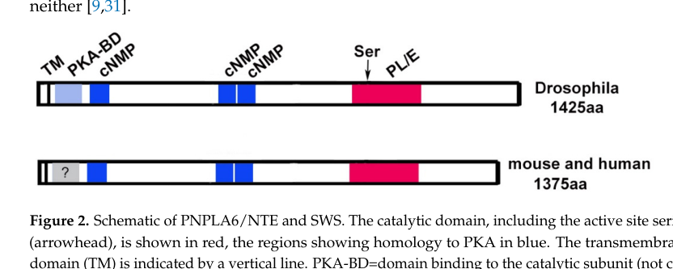

## Question

# Gene Research for Functional Annotation

## ⚠️ CRITICAL: Gene/Protein Identification Context

**BEFORE YOU BEGIN RESEARCH:** You MUST verify you are researching the CORRECT gene/protein. Gene symbols can be ambiguous, especially for less well-characterized genes from non-model organisms.

### Target Gene/Protein Identity (from UniProt):
- **UniProt Accession:** Q9U969
- **Protein Description:** RecName: Full=Neuropathy target esterase sws; AltName: Full=Swiss cheese; Short=DSWS; EC=3.1.1.5;
- **Gene Information:** Name=sws; ORFNames=CG2212;
- **Organism (full):** Drosophila melanogaster (Fruit fly).
- **Protein Family:** Belongs to the NTE family. .
- **Key Domains:** Acyl_Trfase/lysoPLipase. (IPR016035); cNMP-bd_dom. (IPR000595); cNMP-bd_dom_sf. (IPR018490); LysoPLipase_patatin_CS. (IPR001423); NTE. (IPR050301)

### MANDATORY VERIFICATION STEPS:

1. **Check if the gene symbol "sws" matches the protein description above**
2. **Verify the organism is correct:** Drosophila melanogaster (Fruit fly).
3. **Check if protein family/domains align with what you find in literature**
4. **If you find literature for a DIFFERENT gene with the same or similar symbol, STOP**

### If Gene Symbol is Ambiguous or You Cannot Find Relevant Literature:

**DO NOT PROCEED WITH RESEARCH ON A DIFFERENT GENE.** Instead:
- State clearly: "The gene symbol 'sws' is ambiguous or literature is limited for this specific protein"
- Explain what you found (e.g., "Found extensive literature on a different gene with the same symbol in a different organism")
- Describe the protein based ONLY on the UniProt information provided above
- Suggest that the protein function can be inferred from domain/family information

### Research Target:

Please provide a comprehensive research report on the gene **sws** (gene ID: sws, UniProt: Q9U969) in DROME.

The research report should be a detailed narrative explaining the function, biological processes, and localization of the gene product. Citations should be given for all claims.

You should prioritize authoritative reviews and primary scientific literature when conducting research. You can supplement
this with annotations you find in gene/protein databases, but these can be outdated or inaccurate.

We are specifically interested in the primary function of the gene - for enzymes, what reaction is catalyzed, and what is the substrate specificity? For transporters, what is the substrate? For structural proteins or adapters, what is the broader structural role? For signaling molecules, what is the role in the pathway.

We are interested in where in or outside the cell the gene product carries out its function.

We are also interested in the signaling or biochemical pathways in which the gene functions. We are less interested in broad pleiotropic effects, except where these elucidate the precise role.

Include evidence where possible. We are interested in both experimental evidence as well as inference from structure, evolution, or bioinformatic analysis. Precise studies should be prioritized over high-throughput, where available.

## Output

Question: You are an expert researcher providing comprehensive, well-cited information.

Provide detailed information focusing on:
1. Key concepts and definitions with current understanding
2. Recent developments and latest research (prioritize 2023-2024 sources)
3. Current applications and real-world implementations
4. Expert opinions and analysis from authoritative sources
5. Relevant statistics and data from recent studies

Format as a comprehensive research report with proper citations. Include URLs and publication dates where available.
Always prioritize recent, authoritative sources and provide specific citations for all major claims.

# Gene Research for Functional Annotation

## ⚠️ CRITICAL: Gene/Protein Identification Context

**BEFORE YOU BEGIN RESEARCH:** You MUST verify you are researching the CORRECT gene/protein. Gene symbols can be ambiguous, especially for less well-characterized genes from non-model organisms.

### Target Gene/Protein Identity (from UniProt):
- **UniProt Accession:** Q9U969
- **Protein Description:** RecName: Full=Neuropathy target esterase sws; AltName: Full=Swiss cheese; Short=DSWS; EC=3.1.1.5;
- **Gene Information:** Name=sws; ORFNames=CG2212;
- **Organism (full):** Drosophila melanogaster (Fruit fly).
- **Protein Family:** Belongs to the NTE family. .
- **Key Domains:** Acyl_Trfase/lysoPLipase. (IPR016035); cNMP-bd_dom. (IPR000595); cNMP-bd_dom_sf. (IPR018490); LysoPLipase_patatin_CS. (IPR001423); NTE. (IPR050301)

### MANDATORY VERIFICATION STEPS:

1. **Check if the gene symbol "sws" matches the protein description above**
2. **Verify the organism is correct:** Drosophila melanogaster (Fruit fly).
3. **Check if protein family/domains align with what you find in literature**
4. **If you find literature for a DIFFERENT gene with the same or similar symbol, STOP**

### If Gene Symbol is Ambiguous or You Cannot Find Relevant Literature:

**DO NOT PROCEED WITH RESEARCH ON A DIFFERENT GENE.** Instead:
- State clearly: "The gene symbol 'sws' is ambiguous or literature is limited for this specific protein"
- Explain what you found (e.g., "Found extensive literature on a different gene with the same symbol in a different organism")
- Describe the protein based ONLY on the UniProt information provided above
- Suggest that the protein function can be inferred from domain/family information

### Research Target:

Please provide a comprehensive research report on the gene **sws** (gene ID: sws, UniProt: Q9U969) in DROME.

The research report should be a detailed narrative explaining the function, biological processes, and localization of the gene product. Citations should be given for all claims.

You should prioritize authoritative reviews and primary scientific literature when conducting research. You can supplement
this with annotations you find in gene/protein databases, but these can be outdated or inaccurate.

We are specifically interested in the primary function of the gene - for enzymes, what reaction is catalyzed, and what is the substrate specificity? For transporters, what is the substrate? For structural proteins or adapters, what is the broader structural role? For signaling molecules, what is the role in the pathway.

We are interested in where in or outside the cell the gene product carries out its function.

We are also interested in the signaling or biochemical pathways in which the gene functions. We are less interested in broad pleiotropic effects, except where these elucidate the precise role.

Include evidence where possible. We are interested in both experimental evidence as well as inference from structure, evolution, or bioinformatic analysis. Precise studies should be prioritized over high-throughput, where available.

# Research Report: Functional Annotation of **swiss cheese (sws)** (Drosophila melanogaster; UniProt **Q9U969**; CG2212)

## 0) Target verification (mandatory disambiguation)
The Drosophila gene **swiss cheese (sws; SWS; CG2212; UniProt Q9U969)** is consistently described as the **Drosophila ortholog of human PNPLA6/NTE (Neuropathy Target Esterase)**, an evolutionarily conserved, ER-anchored patatin-like phospholipase/esterase. Multiple independent sources explicitly make this mapping and show functional interchangeability via **rescue of fly phenotypes by human NTE/PNPLA6**, supporting correct gene/protein identity rather than symbol ambiguity. (sunderhaus2019diseaseassociatedpnpla6mutations pages 1-2, kretzschmar2022pnpla6nteanevolutionary pages 4-5, dutta2016glialexpressionof pages 1-2)

## 1) Key concepts and current definitions

### 1.1 What is SWS/PNPLA6/NTE?
**SWS** is the Drosophila member of the **PNPLA6/NTE (neuropathy target esterase) family** of patatin-like phospholipases, best understood as an **ER-membrane-associated phospholipase/esterase required for membrane lipid homeostasis and nervous-system integrity**. (kretzschmar2022pnpla6nteanevolutionary pages 4-5, sunderhaus2019erresponsesplay pages 1-2)

### 1.2 Domain architecture (how the protein is built)
Authoritative reviews and biochemical analyses converge on a conserved architecture:
- **N-terminal transmembrane (TM) segment** that anchors the protein in **endoplasmic reticulum (ER) membranes**. (chang2019characterizationofthe pages 1-3, kretzschmar2022pnpla6nteanevolutionary pages 4-5)
- A regulatory region containing **cyclic nucleotide-binding (cNMP) sites** (often discussed as part of a PKA-regulatory–like region). (kretzschmar2022pnpla6nteanevolutionary pages 4-5)
- A **C-terminal patatin-like catalytic phospholipase/esterase domain** (often termed the **NTE esterase domain/NEST/EST**), which contains the catalytic residues required for activity. (chang2019characterizationofthe pages 1-3, kretzschmar2022pnpla6nteanevolutionary pages 2-4)

A schematic summarizing the conserved PNPLA6/NTE and SWS domains is shown in Figure 2 of Kretzschmar (2022). (kretzschmar2022pnpla6nteanevolutionary media d9b31ec5)

### 1.3 Enzymatic function: reaction, substrates, and products
Across model systems, PNPLA6/NTE and SWS are described as **(lyso)phospholipases** that preferentially act on:
- **Phosphatidylcholine (PC)**
- **Lysophosphatidylcholine (LPC)**

Mechanistically, they deacylate these substrates (i.e., hydrolyze fatty acyl ester bonds), and a key downstream product discussed is **glycerophosphocholine (GPC)** derived from PC/LPC deacylation (directly or via intermediates), consistent with phospholipase B–like net activity on PC. (kretzschmar2022pnpla6nteanevolutionary pages 4-5)

### 1.4 Catalytic residues (what enables catalysis)
Catalytic function maps to the C-terminal patatin-like domain; biochemical and mutational studies identify an essential **active-site serine** and associated acidic residues as critical for hydrolase function. For human NTE, mutagenesis implicates residues including **Ser966** (and acidic residues such as Asp960/Asp1086 as part of the catalytic machinery), and review-level summaries highlight the required active-site serine within the NEST domain. (chang2019characterizationofthe pages 1-3, kretzschmar2022pnpla6nteanevolutionary pages 2-4)

## 2) Subcellular localization and where SWS acts

### 2.1 Endoplasmic reticulum (primary site)
SWS/PNPLA6 is primarily described as **ER-localized**: ER anchoring is mediated by the N-terminal transmembrane segment, and SWS is reported as enriched/primarily localized to ER membranes in flies. (kretzschmar2022pnpla6nteanevolutionary pages 4-5, sunderhaus2019erresponsesplay pages 1-2)

### 2.2 Dynamic relationship with lipid droplets (context from PNPLA6/NTE)
Work on mammalian NTE indicates the **catalytic C-terminal region has high affinity for lipid droplets**, and perturbing this region can shift lipid storage phenotypes (e.g., TAG increase and lipid droplet clustering) while decreasing cellular PC, linking phospholipid turnover to storage-lipid remodeling. Although this evidence is from NTE, SWS is repeatedly treated as the functional ortholog and the same domain logic is used to interpret SWS phenotypes. (chang2019characterizationofthe pages 1-3)

### 2.3 Cell types/tissues: neurons, glia, and barrier-forming glia
SWS is functionally required in both **neurons and multiple glial types**, with especially strong recent evidence for a crucial role in **surface/subperineurial glia** that form the Drosophila blood–brain barrier (BBB). (kretzschmar2022pnpla6nteanevolutionary pages 5-7, tsap2024unravelingthelink pages 5-6)

## 3) Biological processes and pathways (functional annotation)

### 3.1 Core biochemical pathway: phosphatidylcholine/lysophospholipid homeostasis
Loss of SWS/PNPLA6 function leads to disruptions in PC/LPC-related lipid pools, consistent with its role as a PC/LPC (lyso)phospholipase. In Drosophila, sws mutants show increased PC and LPC (and, in some studies, LPA), supporting these as physiological substrates/linked pathway metabolites. (sunderhaus2019diseaseassociatedpnpla6mutations pages 1-2, melentev2021lossofswiss pages 8-9)

### 3.2 ER stress as a mechanistic bridge between lipid imbalance and degeneration
A mechanistic model supported by fly genetics is that altered ER membrane lipid composition (including increased LPC/PC) promotes **ER stress** and downstream neurodegeneration. In sws mutants, ER-stress signatures (e.g., GRP78 elevation and XBP splicing) and SERCA-related mechanisms are implicated, and interventions that enhance protective ER responses or chemical chaperoning suppress phenotypes while also lowering LPC. (sunderhaus2019erresponsesplay pages 1-2)

### 3.3 Glia-dependent neuronal ensheathment and circuit function
Glial SWS is required for normal **neuronal ensheathment** and functional output. Tissue-specific knockdown studies show early and progressive locomotor impairments and structural glial phenotypes; importantly, rescue requires phospholipase activity (phospholipase-dead SWS fails to rescue glial knockdown locomotor phenotypes). (dutta2016glialexpressionof pages 5-6, dutta2016glialexpressionof pages 1-2)

### 3.4 Blood–brain barrier integrity, lysosomal pathology, and inflammation (2024 development)
A major recent development is the demonstration that SWS/NTE is required in BBB-forming glia to maintain barrier structure and selective permeability. Loss of sws disrupts septate-junction organization and produces a **leaky BBB** (10 kDa dextran entering brains). (tsap2024unravelingthelink pages 10-12)

This BBB-glia pathology is accompanied by **lysosomal accumulations** and multilamellar bodies (lysosome-like structures containing membrane material/lipid droplets/partially degraded organelles), connecting SWS loss to phenotypes resembling lysosomal storage disorders. (tsap2024unravelingthelink pages 6-8)

Tsap et al. further show an age-dependent **innate immune/inflammatory transcriptional response** (AMP upregulation) and **elevated free fatty acids** in BBB-defective mutants; SPG-specific SWS expression normalizes inflammatory gene expression, and anti-inflammatory and autophagy-promoting drugs reduce surface-glia phenotypes (with partial rescue of barrier function). (tsap2024unravelingthelink pages 12-13, tsap2024unravelingthelink pages 10-12)

## 4) Recent developments (prioritizing 2023–2024)

### 4.1 2024: BBB-glia mechanism linking SWS/NTE to barrier failure, lysosomes, and inflammation
**Tsap et al., eLife (Apr 2024)** provide strong evidence that SWS is required in BBB-forming glia for septate-junction organization and barrier integrity, with penetrant permeability defects and rescue by Drosophila SWS or human NTE. (tsap2024unravelingthelink pages 10-12, tsap2024unravelingthelink pages 5-6)

### 4.2 2024: Quantitative NTE activity as a genotype→phenotype biomarker (human PNPLA6)
**Liu et al., Brain (May 2024)** establish and validate functional assays quantifying NTE hydrolase activity and relate residual activity to clinical phenotypes across **118 individuals** (23 new + 95 previously reported). Individuals with retinopathy or endocrinopathy show markedly lower residual activity (~28%) than those without (~48–51%), and the study proposes threshold-like behavior (e.g., <50% associated with retinopathy onset; >40% required for embryonic viability in mouse modeling). These results strengthen interpretation of PNPLA6 variants and position **NTE activity as a practical biomarker**, which also informs how strongly sws loss-of-function may perturb core enzymatic function in fly models. (liu2024neuropathytargetesterase pages 1-2, liu2024neuropathytargetesterase pages 6-7, liu2024neuropathytargetesterase pages 11-12)

### 4.3 2023: Clinical/mechanistic synthesis and open questions
**Liu & Hufnagel, Ophthalmic Genetics (Sep 2023)** emphasize that PNPLA6/NTE is an ER-facing membrane phospholipase with roles in phospholipid homeostasis/trafficking and axonal integrity, summarize animal models (including Drosophila sws), and highlight that genotype–retinopathy relationships remain an active research area despite well-characterized biochemistry. (liu2023pnpla6disorderswhat’s pages 1-3)

## 5) Current applications and real-world implementations

### 5.1 Drosophila sws as an in vivo functional assay platform for human PNPLA6/NTE
Drosophila sws is widely used as a **disease model** because sws loss causes progressive locomotor decline and neurodegeneration, and because **human NTE/PNPLA6 can rescue multiple sws phenotypes**, enabling functional testing of wild-type versus disease-associated variants in an intact nervous system. (sujkowski2015delayedinductionof pages 9-11, kretzschmar2022pnpla6nteanevolutionary pages 7-9)

### 5.2 Therapeutic concept testing in vivo (proof-of-principle)
Neuron-specific adult induction of human NTE in sws mutants can substantially rescue degeneration and mobility, including when induced after degenerative phenotypes have already developed, supporting a proof-of-concept that restoring NTE/SWS function (or downstream pathway modulation) may be beneficial even after onset in model systems. (sujkowski2015delayedinductionof pages 9-11, sujkowski2015delayedinductionof pages 1-2)

### 5.3 Organophosphate-induced delayed neuropathy (OPIDN): target identification and biomarker logic
PNPLA6/NTE is the canonical molecular target implicated in **organophosphate-induced delayed neuropathy (OPIDN)**, in which neuropathic OPs covalently inhibit the catalytic serine and undergo an “aging” reaction leading to essentially irreversible inhibition. Review-level synthesis describes OPIDN as typically delayed (2–4 weeks) and associated with high inhibition (commonly discussed as ~70% inhibition) of NTE activity, connecting a measurable enzymatic endpoint (esterase inhibition/aging) to neuropathic risk. (kretzschmar2022pnpla6nteanevolutionary pages 1-2, kretzschmar2022pnpla6nteanevolutionary pages 2-4)

## 6) Relevant statistics and data highlights

### 6.1 Quantitative lipid changes in sws loss-of-function (Drosophila)
In a targeted metabolite/lipid analysis, sws-null mutants showed **elevated PC, LPC, and LPA**, reported as **pmol per mg protein**, with sample sizes WT n=8, heterozygotes n=4, mutants n=5 (with t-test significance markers), providing quantitative support for lipid-homeostasis disruption consistent with loss of PC/LPC deacylation capacity. (melentev2021lossofswiss pages 8-9)

### 6.2 Quantitative BBB permeability penetrance (Drosophila; 2024)
Using a **10 kDa dextran assay**, dye was found inside “almost all” sws1 mutant brains, and BBB permeability after glial sws downregulation was observed in **>80% of analyzed brains** (≥44 hemispheres; ≥3 biological replicates). (tsap2024unravelingthelink pages 10-12)

### 6.3 Quantitative NTE activity–phenotype relationships (human PNPLA6; 2024)
In the Brain 2024 cohort and meta-analysis (n=118 individuals total), residual NTE activity was ~**28%** in those with retinopathy/endocrinopathy vs ~**48–51%** in those without those features, supporting an activity-threshold model for tissue vulnerability and positioning NTE activity as a clinically relevant functional readout. (liu2024neuropathytargetesterase pages 6-7, liu2024neuropathytargetesterase pages 11-12)

### 6.4 Quantitative glia-dependent locomotor deficits and enzymatic requirement
Glial knockdown studies provide behavioral quantitation (e.g., fast phototaxis transitions and age-dependent reductions in walking speed) and show that rescue depends on phospholipase activity (phospholipase-dead SWS fails to rescue). (dutta2016glialexpressionof pages 5-6)

## 7) Expert synthesis and interpretation

### 7.1 Primary function (most supported)
The most strongly supported primary molecular function of SWS is as an **ER-anchored patatin-like phospholipase/esterase** that maintains **phosphatidylcholine/lysophosphatidylcholine homeostasis** (and downstream choline-containing metabolites such as GPC) in membranes. (kretzschmar2022pnpla6nteanevolutionary pages 4-5)

### 7.2 Mechanistic pathway model (integrating 2019–2024 evidence)
A cohesive model supported by multiple lines of evidence is:
1) **Loss of SWS enzymatic activity** perturbs ER membrane lipid composition (PC/LPC imbalance) (sunderhaus2019diseaseassociatedpnpla6mutations pages 1-2, melentev2021lossofswiss pages 8-9)
2) This promotes **ER stress** and calcium-handling disruptions (SERCA-linked), contributing to degeneration (sunderhaus2019erresponsesplay pages 1-2)
3) In barrier glia, lipid-raft/junction disorganization and lysosomal membrane storage phenotypes contribute to **BBB leak**, which triggers or exacerbates **inflammation/innate immunity** and free-fatty-acid changes (tsap2024unravelingthelink pages 10-12, tsap2024unravelingthelink pages 12-13)

### 7.3 Conservation and translational relevance
Functional rescue by human PNPLA6/NTE across neuronal and glial contexts in flies indicates that core biochemical roles and several cell-biological consequences are conserved, supporting Drosophila sws as a translationally relevant system for variant interpretation and pathway-targeted interventions. (sujkowski2015delayedinductionof pages 9-11, tsap2024unravelingthelink pages 10-12)

## Evidence map
The following table provides a compact evidence map from the sources used.

| Topic/claim | Key evidence summary | Best supporting citation IDs |
|---|---|---|
| Identity / orthology | Drosophila **swiss cheese (sws/SWS)** is consistently identified as the fly ortholog of human **PNPLA6/NTE**; rescue of sws phenotypes by vertebrate NTE supports true functional orthology rather than name similarity. | (sunderhaus2019diseaseassociatedpnpla6mutations pages 1-2, kretzschmar2022pnpla6nteanevolutionary pages 4-5, dutta2016glialexpressionof pages 1-2) |
| Domain architecture | SWS/PNPLA6 proteins share an **N-terminal transmembrane anchor**, **cyclic nucleotide-binding regulatory region**, and **C-terminal patatin-like phospholipase/esterase domain**; a figure in the 2022 review summarizes this architecture. | (chang2019characterizationofthe pages 1-3, kretzschmar2022pnpla6nteanevolutionary pages 4-5, tsap2024unravelingthelink pages 5-6, kretzschmar2022pnpla6nteanevolutionary media d9b31ec5) |
| Catalytic mechanism | The catalytic activity maps to the C-terminal esterase/patatin region; mutagenesis implicates the active serine and acidic residues as required for hydrolase function, and active-site mutation abolishes esterase activity/rescue. | (chang2019characterizationofthe pages 1-3, kretzschmar2022pnpla6nteanevolutionary pages 2-4, kretzschmar2022pnpla6nteanevolutionary pages 7-9) |
| Enzymatic reaction & substrates | PNPLA6/NTE and SWS are described as **(lyso)phospholipases** that preferentially hydrolyze **phosphatidylcholine (PC)** and **lysophosphatidylcholine (LPC)**, with **glycerophosphocholine (GPC)** as a downstream product of PC/LPC deacylation. | (sunderhaus2019diseaseassociatedpnpla6mutations pages 1-2, kretzschmar2022pnpla6nteanevolutionary pages 4-5, chang2019characterizationofthe pages 1-3) |
| Subcellular localization | SWS/PNPLA6 is primarily **ER-localized** via its transmembrane anchor; the catalytic C-terminal region can also associate with **lipid droplets**, linking membrane phospholipid turnover to neutral-lipid remodeling. | (chang2019characterizationofthe pages 1-3, kretzschmar2022pnpla6nteanevolutionary pages 4-5, sunderhaus2019erresponsesplay pages 1-2) |
| Cell-type expression / site of action | In flies, SWS is expressed in **neurons and multiple glial populations**, including **ensheathing glia** and **surface/subperineurial glia** that form the blood-brain barrier, indicating both neuronal and glial autonomous roles. | (sunderhaus2019diseaseassociatedpnpla6mutations pages 1-2, kretzschmar2022pnpla6nteanevolutionary pages 5-7, tsap2024unravelingthelink pages 5-6) |
| Primary biological roles | Best-supported roles are maintenance of **phospholipid homeostasis**, **ER membrane integrity/stress responses**, **axon maintenance**, **glial ensheathment**, and **blood-brain barrier organization/permeability**. Loss causes age-progressive neurodegeneration and membrane/lysosomal abnormalities. | (sunderhaus2019erresponsesplay pages 1-2, kretzschmar2022pnpla6nteanevolutionary pages 5-7, tsap2024unravelingthelink pages 3-5, tsap2024unravelingthelink pages 10-12) |
| Key quantitative findings | Recent PNPLA6 work showed residual NTE activity tracks phenotype severity: individuals with retinopathy/endocrinopathy averaged about **28%** activity versus **48-51%** without those features, with **<50%** activity associated with retinopathy onset; in flies, sws mutants show elevated PC/LPC and BBB leak in **>80%** of analyzed brains after glial knockdown. | (liu2024neuropathytargetesterase pages 6-7, liu2023neuropathytargetesterase pages 10-14, liu2024neuropathytargetesterase pages 11-12, tsap2024unravelingthelink pages 10-12) |
| Glial BBB-specific findings (2024) | Tsap et al. showed SWS is required in **surface glia/SPG** for proper septate-junction organization and barrier integrity; mutants accumulate lysosomal/membranous material and show inflammatory/FFA changes consistent with barrier failure. | (tsap2024unravelingthelink pages 5-6, tsap2024unravelingthelink pages 10-12, tsap2024unravelingthelink pages 6-8, tsap2024unravelingthelink pages 12-13) |
| Rescue / conservation | Wild-type fly SWS and human PNPLA6/NTE can rescue multiple fly phenotypes, including glial organization, BBB defects, locomotor decline, lifespan, and neurodegeneration; phospholipase-dead variants fail to rescue key glial defects, highlighting enzymatic conservation. | (tsap2024unravelingthelink pages 10-12, dutta2016glialexpressionof pages 5-6, sujkowski2015delayedinductionof pages 9-11, kretzschmar2022pnpla6nteanevolutionary pages 7-9) |

*Table: This table summarizes the strongest functional-annotation evidence for Drosophila sws/Q9U969, including orthology, domains, enzymatic activity, localization, biological roles, and key quantitative findings. It is useful as a compact evidence map for building a narrative gene-function report with traceable citation IDs.*

## Key references (with publication dates and URLs)
- Tsap MI et al. **eLife** (Apr 2024). “Unraveling the link between neuropathy target esterase NTE/SWS… and leaky brain barrier.” https://doi.org/10.7554/elife.98020 (tsap2024unravelingthelink pages 10-12)
- Liu J et al. **Brain** (May 2024). “Neuropathy target esterase activity defines phenotypes among PNPLA6 disorders.” https://doi.org/10.1093/brain/awae055 (liu2024neuropathytargetesterase pages 1-2)
- Liu J, Hufnagel RB. **Ophthalmic Genetics** (Sep 2023). “PNPLA6 disorders: what’s in a name?” https://doi.org/10.1080/13816810.2023.2254830 (liu2023pnpla6disorderswhat’s pages 1-3)
- Kretzschmar D. **Metabolites** (Mar 2022). “PNPLA6/NTE, an Evolutionary Conserved Phospholipase…” https://doi.org/10.3390/metabo12040284 (kretzschmar2022pnpla6nteanevolutionary pages 1-2)
- Sunderhaus ER et al. **Neurobiology of Disease** (Oct 2019). “ER responses play a key role in SWS/NTE-associated neurodegeneration.” https://doi.org/10.1016/j.nbd.2019.104520 (sunderhaus2019erresponsesplay pages 1-2)
- Dutta S et al. **Disease Models & Mechanisms** (Mar 2016). “Glial expression of SWS is required for neuronal ensheathment and function.” https://doi.org/10.1242/dmm.022236 (dutta2016glialexpressionof pages 1-2)
- Sujkowski A et al. **PLoS ONE** (Dec 2015). “Delayed induction of human NTE rescues Drosophila sws mutants.” https://doi.org/10.1371/journal.pone.0145356 (sujkowski2015delayedinductionof pages 1-2)

References

1. (sunderhaus2019diseaseassociatedpnpla6mutations pages 1-2): Elizabeth R. Sunderhaus, Alexander D. Law, and Doris Kretzschmar. Disease-associated pnpla6 mutations maintain partial functions when analyzed in drosophila. Frontiers in Neuroscience, Nov 2019. URL: https://doi.org/10.3389/fnins.2019.01207, doi:10.3389/fnins.2019.01207. This article has 28 citations and is from a peer-reviewed journal.

2. (kretzschmar2022pnpla6nteanevolutionary pages 4-5): Doris Kretzschmar. Pnpla6/nte, an evolutionary conserved phospholipase linked to a group of complex human diseases. Metabolites, 12:284, Mar 2022. URL: https://doi.org/10.3390/metabo12040284, doi:10.3390/metabo12040284. This article has 27 citations.

3. (dutta2016glialexpressionof pages 1-2): Sudeshna Dutta, Franziska Rieche, Nina Eckl, Carsten Duch, and Doris Kretzschmar. Glial expression of swiss cheese (sws), the drosophila orthologue of neuropathy target esterase (nte), is required for neuronal ensheathment and function. Disease Models & Mechanisms, 9:283-294, Mar 2016. URL: https://doi.org/10.1242/dmm.022236, doi:10.1242/dmm.022236. This article has 71 citations and is from a domain leading peer-reviewed journal.

4. (sunderhaus2019erresponsesplay pages 1-2): Elizabeth R. Sunderhaus, Alexander D. Law, and Doris Kretzschmar. Er responses play a key role in swiss-cheese/neuropathy target esterase-associated neurodegeneration. Neurobiology of Disease, 130:104520, Oct 2019. URL: https://doi.org/10.1016/j.nbd.2019.104520, doi:10.1016/j.nbd.2019.104520. This article has 36 citations and is from a domain leading peer-reviewed journal.

5. (chang2019characterizationofthe pages 1-3): Pingan Chang, Ling He, Yu Wang, Christoph Heier, Yijun Wu, and Feifei Huang. Characterization of the interaction of neuropathy target esterase with the endoplasmic reticulum and lipid droplets. Biomolecules, 9:848, Dec 2019. URL: https://doi.org/10.3390/biom9120848, doi:10.3390/biom9120848. This article has 23 citations.

6. (kretzschmar2022pnpla6nteanevolutionary pages 2-4): Doris Kretzschmar. Pnpla6/nte, an evolutionary conserved phospholipase linked to a group of complex human diseases. Metabolites, 12:284, Mar 2022. URL: https://doi.org/10.3390/metabo12040284, doi:10.3390/metabo12040284. This article has 27 citations.

7. (kretzschmar2022pnpla6nteanevolutionary media d9b31ec5): Doris Kretzschmar. Pnpla6/nte, an evolutionary conserved phospholipase linked to a group of complex human diseases. Metabolites, 12:284, Mar 2022. URL: https://doi.org/10.3390/metabo12040284, doi:10.3390/metabo12040284. This article has 27 citations.

8. (kretzschmar2022pnpla6nteanevolutionary pages 5-7): Doris Kretzschmar. Pnpla6/nte, an evolutionary conserved phospholipase linked to a group of complex human diseases. Metabolites, 12:284, Mar 2022. URL: https://doi.org/10.3390/metabo12040284, doi:10.3390/metabo12040284. This article has 27 citations.

9. (tsap2024unravelingthelink pages 5-6): Mariana I Tsap, Andriy S Yatsenko, Jan Hegermann, Bibiana Beckmann, Dimitrios Tsikas, and Halyna R Shcherbata. Unraveling the link between neuropathy target esterase nte/sws, lysosomal storage diseases, inflammation, abnormal fatty acid metabolism, and leaky brain barrier. eLife, Apr 2024. URL: https://doi.org/10.7554/elife.98020, doi:10.7554/elife.98020. This article has 6 citations and is from a domain leading peer-reviewed journal.

10. (melentev2021lossofswiss pages 8-9): Pavel A. Melentev, Elena V. Ryabova, Nina V. Surina, Darya R. Zhmujdina, Artem E. Komissarov, Ekaterina A. Ivanova, Natalia P. Boltneva, Galina F. Makhaeva, Mariana I. Sliusarenko, Andriy S. Yatsenko, Iryna I. Mohylyak, Nataliya P. Matiytsiv, Halyna R. Shcherbata, and Svetlana V. Sarantseva. Loss of swiss cheese in neurons contributes to neurodegeneration with mitochondria abnormalities, reactive oxygen species acceleration and accumulation of lipid droplets in drosophila brain. International Journal of Molecular Sciences, 22:8275, Jul 2021. URL: https://doi.org/10.3390/ijms22158275, doi:10.3390/ijms22158275. This article has 26 citations.

11. (dutta2016glialexpressionof pages 5-6): Sudeshna Dutta, Franziska Rieche, Nina Eckl, Carsten Duch, and Doris Kretzschmar. Glial expression of swiss cheese (sws), the drosophila orthologue of neuropathy target esterase (nte), is required for neuronal ensheathment and function. Disease Models & Mechanisms, 9:283-294, Mar 2016. URL: https://doi.org/10.1242/dmm.022236, doi:10.1242/dmm.022236. This article has 71 citations and is from a domain leading peer-reviewed journal.

12. (tsap2024unravelingthelink pages 10-12): Mariana I Tsap, Andriy S Yatsenko, Jan Hegermann, Bibiana Beckmann, Dimitrios Tsikas, and Halyna R Shcherbata. Unraveling the link between neuropathy target esterase nte/sws, lysosomal storage diseases, inflammation, abnormal fatty acid metabolism, and leaky brain barrier. eLife, Apr 2024. URL: https://doi.org/10.7554/elife.98020, doi:10.7554/elife.98020. This article has 6 citations and is from a domain leading peer-reviewed journal.

13. (tsap2024unravelingthelink pages 6-8): Mariana I Tsap, Andriy S Yatsenko, Jan Hegermann, Bibiana Beckmann, Dimitrios Tsikas, and Halyna R Shcherbata. Unraveling the link between neuropathy target esterase nte/sws, lysosomal storage diseases, inflammation, abnormal fatty acid metabolism, and leaky brain barrier. eLife, Apr 2024. URL: https://doi.org/10.7554/elife.98020, doi:10.7554/elife.98020. This article has 6 citations and is from a domain leading peer-reviewed journal.

14. (tsap2024unravelingthelink pages 12-13): Mariana I Tsap, Andriy S Yatsenko, Jan Hegermann, Bibiana Beckmann, Dimitrios Tsikas, and Halyna R Shcherbata. Unraveling the link between neuropathy target esterase nte/sws, lysosomal storage diseases, inflammation, abnormal fatty acid metabolism, and leaky brain barrier. eLife, Apr 2024. URL: https://doi.org/10.7554/elife.98020, doi:10.7554/elife.98020. This article has 6 citations and is from a domain leading peer-reviewed journal.

15. (liu2024neuropathytargetesterase pages 1-2): James Liu, Yi He, Cara Lwin, Marina Han, Bin Guan, Amelia Naik, Chelsea Bender, Nia Moore, Laryssa A Huryn, Yuri V Sergeev, Haohua Qian, Yong Zeng, Lijin Dong, Pinghu Liu, Jingqi Lei, Carl J Haugen, Lev Prasov, Ruifang Shi, Hélène Dollfus, Petros Aristodemou, Yannik Laich, Andrea H Németh, John Taylor, Susan Downes, Maciej R Krawczynski, Isabelle Meunier, Melissa Strassberg, Jessica Tenney, Josephine Gao, Matthew A Shear, Anthony T Moore, Jacque L Duncan, Beatriz Menendez, Sarah Hull, Andrea L Vincent, Carly E Siskind, Elias I Traboulsi, Craig Blackstone, Robert A Sisk, Virginia Miraldi Utz, Andrew R Webster, Michel Michaelides, Gavin Arno, Matthis Synofzik, and Robert B Hufnagel. Neuropathy target esterase activity defines phenotypes among pnpla6 disorders. Brain : a journal of neurology, 147:2085-2097, May 2024. URL: https://doi.org/10.1093/brain/awae055, doi:10.1093/brain/awae055. This article has 9 citations.

16. (liu2024neuropathytargetesterase pages 6-7): James Liu, Yi He, Cara Lwin, Marina Han, Bin Guan, Amelia Naik, Chelsea Bender, Nia Moore, Laryssa A Huryn, Yuri V Sergeev, Haohua Qian, Yong Zeng, Lijin Dong, Pinghu Liu, Jingqi Lei, Carl J Haugen, Lev Prasov, Ruifang Shi, Hélène Dollfus, Petros Aristodemou, Yannik Laich, Andrea H Németh, John Taylor, Susan Downes, Maciej R Krawczynski, Isabelle Meunier, Melissa Strassberg, Jessica Tenney, Josephine Gao, Matthew A Shear, Anthony T Moore, Jacque L Duncan, Beatriz Menendez, Sarah Hull, Andrea L Vincent, Carly E Siskind, Elias I Traboulsi, Craig Blackstone, Robert A Sisk, Virginia Miraldi Utz, Andrew R Webster, Michel Michaelides, Gavin Arno, Matthis Synofzik, and Robert B Hufnagel. Neuropathy target esterase activity defines phenotypes among pnpla6 disorders. Brain : a journal of neurology, 147:2085-2097, May 2024. URL: https://doi.org/10.1093/brain/awae055, doi:10.1093/brain/awae055. This article has 9 citations.

17. (liu2024neuropathytargetesterase pages 11-12): James Liu, Yi He, Cara Lwin, Marina Han, Bin Guan, Amelia Naik, Chelsea Bender, Nia Moore, Laryssa A Huryn, Yuri V Sergeev, Haohua Qian, Yong Zeng, Lijin Dong, Pinghu Liu, Jingqi Lei, Carl J Haugen, Lev Prasov, Ruifang Shi, Hélène Dollfus, Petros Aristodemou, Yannik Laich, Andrea H Németh, John Taylor, Susan Downes, Maciej R Krawczynski, Isabelle Meunier, Melissa Strassberg, Jessica Tenney, Josephine Gao, Matthew A Shear, Anthony T Moore, Jacque L Duncan, Beatriz Menendez, Sarah Hull, Andrea L Vincent, Carly E Siskind, Elias I Traboulsi, Craig Blackstone, Robert A Sisk, Virginia Miraldi Utz, Andrew R Webster, Michel Michaelides, Gavin Arno, Matthis Synofzik, and Robert B Hufnagel. Neuropathy target esterase activity defines phenotypes among pnpla6 disorders. Brain : a journal of neurology, 147:2085-2097, May 2024. URL: https://doi.org/10.1093/brain/awae055, doi:10.1093/brain/awae055. This article has 9 citations.

18. (liu2023pnpla6disorderswhat’s pages 1-3): James Liu and Robert B. Hufnagel. Pnpla6 disorders: what’s in a name? Ophthalmic Genetics, 44:530-538, Sep 2023. URL: https://doi.org/10.1080/13816810.2023.2254830, doi:10.1080/13816810.2023.2254830. This article has 15 citations and is from a peer-reviewed journal.

19. (sujkowski2015delayedinductionof pages 9-11): Alyson Sujkowski, Shirley Rainier, John K. Fink, and Robert J. Wessells. Delayed induction of human nte (pnpla6) rescues neurodegeneration and mobility defects of drosophila swiss cheese (sws) mutants. PLoS ONE, 10:e0145356, Dec 2015. URL: https://doi.org/10.1371/journal.pone.0145356, doi:10.1371/journal.pone.0145356. This article has 24 citations and is from a peer-reviewed journal.

20. (kretzschmar2022pnpla6nteanevolutionary pages 7-9): Doris Kretzschmar. Pnpla6/nte, an evolutionary conserved phospholipase linked to a group of complex human diseases. Metabolites, 12:284, Mar 2022. URL: https://doi.org/10.3390/metabo12040284, doi:10.3390/metabo12040284. This article has 27 citations.

21. (sujkowski2015delayedinductionof pages 1-2): Alyson Sujkowski, Shirley Rainier, John K. Fink, and Robert J. Wessells. Delayed induction of human nte (pnpla6) rescues neurodegeneration and mobility defects of drosophila swiss cheese (sws) mutants. PLoS ONE, 10:e0145356, Dec 2015. URL: https://doi.org/10.1371/journal.pone.0145356, doi:10.1371/journal.pone.0145356. This article has 24 citations and is from a peer-reviewed journal.

22. (kretzschmar2022pnpla6nteanevolutionary pages 1-2): Doris Kretzschmar. Pnpla6/nte, an evolutionary conserved phospholipase linked to a group of complex human diseases. Metabolites, 12:284, Mar 2022. URL: https://doi.org/10.3390/metabo12040284, doi:10.3390/metabo12040284. This article has 27 citations.

23. (tsap2024unravelingthelink pages 3-5): Mariana I Tsap, Andriy S Yatsenko, Jan Hegermann, Bibiana Beckmann, Dimitrios Tsikas, and Halyna R Shcherbata. Unraveling the link between neuropathy target esterase nte/sws, lysosomal storage diseases, inflammation, abnormal fatty acid metabolism, and leaky brain barrier. eLife, Apr 2024. URL: https://doi.org/10.7554/elife.98020, doi:10.7554/elife.98020. This article has 6 citations and is from a domain leading peer-reviewed journal.

24. (liu2023neuropathytargetesterase pages 10-14): James Liu, Yi He, Cara Lwin, Marina Han, Bin Guan, Amelia Naik, Chelsea Bender, Nia Moore, Laryssa A. Huryn, Yuri Sergeev, Haohua Qian, Yong Zeng, Lijin Dong, Pinghu Liu, Jingqi Lei, Carl J. Haugen, Lev Prasov, Ruifang Shi, Hélène Dollfus, Petros Aristodemou, Yannik Laich, Andrea H. Németh, John Taylor, Susan Downes, Maciej Krawczynski, Isabelle Meunier, Melissa Strassberg, Jessica Tenney, Josephine Gao, Matthew A. Shear, Anthony T. Moore, Jacque L. Duncan, Beatriz Menendez, Sarah Hull, Andrea Vincent, Carly E. Siskind, Elias I. Traboulsi, Craig Blackstone, Robert Sisk, Virginia Utz, Andrew R. Webster, Michel Michaelides, Gavin Arno, Matthis Synofzik, and Robert B Hufnagel. Neuropathy target esterase activity predicts retinopathy among pnpla6 disorders. bioRxiv, Jun 2023. URL: https://doi.org/10.1101/2023.06.09.544373, doi:10.1101/2023.06.09.544373. This article has 1 citations.

## Artifacts

- [Edison artifact artifact-00](sws-deep-research-falcon_artifacts/artifact-00.md)

## Citations

1. chang2019characterizationofthe pages 1-3
2. sunderhaus2019erresponsesplay pages 1-2
3. tsap2024unravelingthelink pages 10-12
4. tsap2024unravelingthelink pages 6-8
5. melentev2021lossofswiss pages 8-9
6. dutta2016glialexpressionof pages 5-6
7. liu2024neuropathytargetesterase pages 1-2
8. dutta2016glialexpressionof pages 1-2
9. sujkowski2015delayedinductionof pages 1-2
10. tsap2024unravelingthelink pages 5-6
11. tsap2024unravelingthelink pages 12-13
12. liu2024neuropathytargetesterase pages 6-7
13. liu2024neuropathytargetesterase pages 11-12
14. sujkowski2015delayedinductionof pages 9-11
15. tsap2024unravelingthelink pages 3-5
16. liu2023neuropathytargetesterase pages 10-14
17. https://doi.org/10.7554/elife.98020
18. https://doi.org/10.1093/brain/awae055
19. https://doi.org/10.1080/13816810.2023.2254830
20. https://doi.org/10.3390/metabo12040284
21. https://doi.org/10.1016/j.nbd.2019.104520
22. https://doi.org/10.1242/dmm.022236
23. https://doi.org/10.1371/journal.pone.0145356
24. https://doi.org/10.3389/fnins.2019.01207,
25. https://doi.org/10.3390/metabo12040284,
26. https://doi.org/10.1242/dmm.022236,
27. https://doi.org/10.1016/j.nbd.2019.104520,
28. https://doi.org/10.3390/biom9120848,
29. https://doi.org/10.7554/elife.98020,
30. https://doi.org/10.3390/ijms22158275,
31. https://doi.org/10.1093/brain/awae055,
32. https://doi.org/10.1080/13816810.2023.2254830,
33. https://doi.org/10.1371/journal.pone.0145356,
34. https://doi.org/10.1101/2023.06.09.544373,