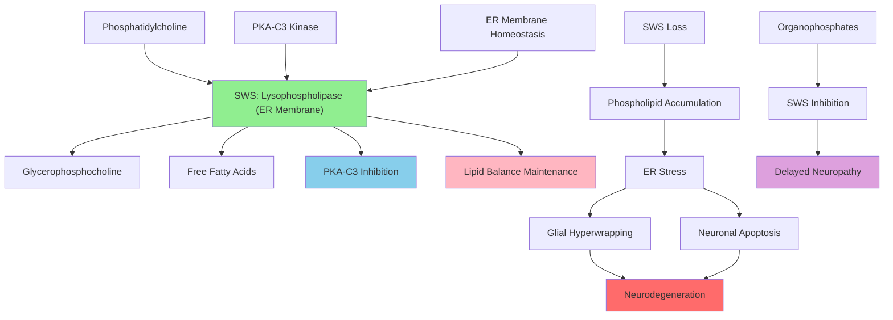

# Pathway Summary for sws

## Overview
Swiss cheese (sws) encodes a neuropathy target esterase that functions as a phospholipase B enzyme, deacylating intracellular phosphatidylcholine (PtdCho) at both sn-1 and sn-2 positions to generate glycerophosphocholine [Q9U969]. This endoplasmic reticulum-localized enzyme is essential for membrane lipid homeostasis and cell survival in both neurons and glia of the adult brain, with progressive loss of function leading to age-dependent neurodegeneration [GO_REF:0000033].

## Phospholipid Metabolism and Membrane Homeostasis
SWS catalyzes the deacylation of phosphatidylcholine through its lysophospholipase activity, removing fatty acid chains from both the sn-1 and sn-2 positions [GO_REF:0000033]. This enzymatic activity is crucial for maintaining proper membrane lipid composition and preventing the accumulation of potentially toxic lipid intermediates in neural tissue. The enzyme's function is particularly important in the adult brain where membrane turnover and lipid homeostasis are essential for neuronal survival and function.

## Endoplasmic Reticulum Membrane Maintenance
Localized to the endoplasmic reticulum membrane, SWS plays a critical role in ER lipid homeostasis and membrane integrity [GO_REF:0000033]. The protein's positioning at the ER allows it to regulate phospholipid metabolism at this crucial cellular site where membrane synthesis and protein folding occur. Disruption of SWS function leads to ER stress and membrane abnormalities that contribute to neuronal dysfunction and death.

## PKA-C3 Regulation and Kinase Signaling
Beyond its enzymatic function, SWS acts as a noncanonical regulatory subunit for PKA-C3, inhibiting the kinase activity of this protein kinase A catalytic subunit [file:fly/sws/sws-deep-research.md]. This regulatory relationship represents a unique mechanism linking lipid metabolism with cAMP-dependent signaling pathways. The protein kinase regulation function demonstrates the multifunctional nature of SWS in coordinating cellular metabolism and signaling.

## Neurodegeneration and Cell Death Pathways
Loss of SWS function triggers a cascade of events leading to progressive neurodegeneration, including glial hyperwrapping, neuronal apoptosis, and behavioral deficits [Q9U969]. The neurodegenerative process involves disrupted lipid homeostasis, ER stress, and altered cell signaling that ultimately results in neuronal death. This pathway represents a model for understanding lipid metabolism-related neurodegeneration in other systems.

## Pathway Diagram

## Glial Cell Function and Neuron-Glia Interactions
SWS is essential for proper glial cell function, with loss of the enzyme leading to abnormal glial hyperwrapping of neurons [Q9U969]. This glial dysfunction contributes to the overall neurodegenerative phenotype and demonstrates the importance of SWS in maintaining proper neuron-glia interactions. The enzyme's role in both neuronal and glial lipid homeostasis highlights its broad importance in neural tissue maintenance.

## Age-Dependent Degeneration and Longevity
The neurodegenerative phenotype caused by SWS loss is age-dependent, with symptoms progressively worsening over time [Q9U969]. This temporal aspect suggests that SWS function becomes increasingly critical as organisms age, possibly due to accumulated metabolic stress or reduced cellular repair capacity. The age-dependent nature makes SWS a valuable model for studying aging-related neurodegeneration.

## Organophosphate Toxicity and Environmental Neuropathy
The vertebrate ortholog of SWS, neuropathy target esterase (NTE), is the molecular target of organophosphate compounds that cause organophosphate-induced delayed neuropathy (OPIDN) [Q9U969]. This connection highlights the evolutionary conservation of SWS/NTE function and its importance in environmental toxicology. Understanding SWS mechanisms provides insights into organophosphate neurotoxicity and potential therapeutic interventions.

## Behavioral Consequences and Neural Circuit Function
SWS dysfunction leads to behavioral abnormalities including locomotor deficits and altered neuronal excitability [file:fly/sws/sws-deep-research.md]. These behavioral phenotypes reflect the underlying neural circuit dysfunction caused by neurodegeneration and altered membrane properties. The behavioral readouts provide functional endpoints for understanding how lipid metabolism disruption affects neural circuit operation.

## Therapeutic Implications and Drug Development
SWS represents a potential therapeutic target for neurodegenerative diseases involving lipid metabolism dysfunction. Understanding the enzyme's regulation and substrate specificity may inform the development of modulators that could prevent or slow neurodegeneration. The protein's dual role in lipid metabolism and kinase regulation also suggests multiple potential intervention points for therapeutic development.

## Evolutionary Conservation and Comparative Biology
SWS is conserved across species, with orthologs found in vertebrates (NTE) and other invertebrates, indicating the fundamental importance of this enzymatic activity for neural function [Q9U969]. Comparative studies across species have revealed both conserved and divergent aspects of SWS/NTE function, providing insights into the evolution of neural lipid metabolism and its relationship to neurodegeneration susceptibility.