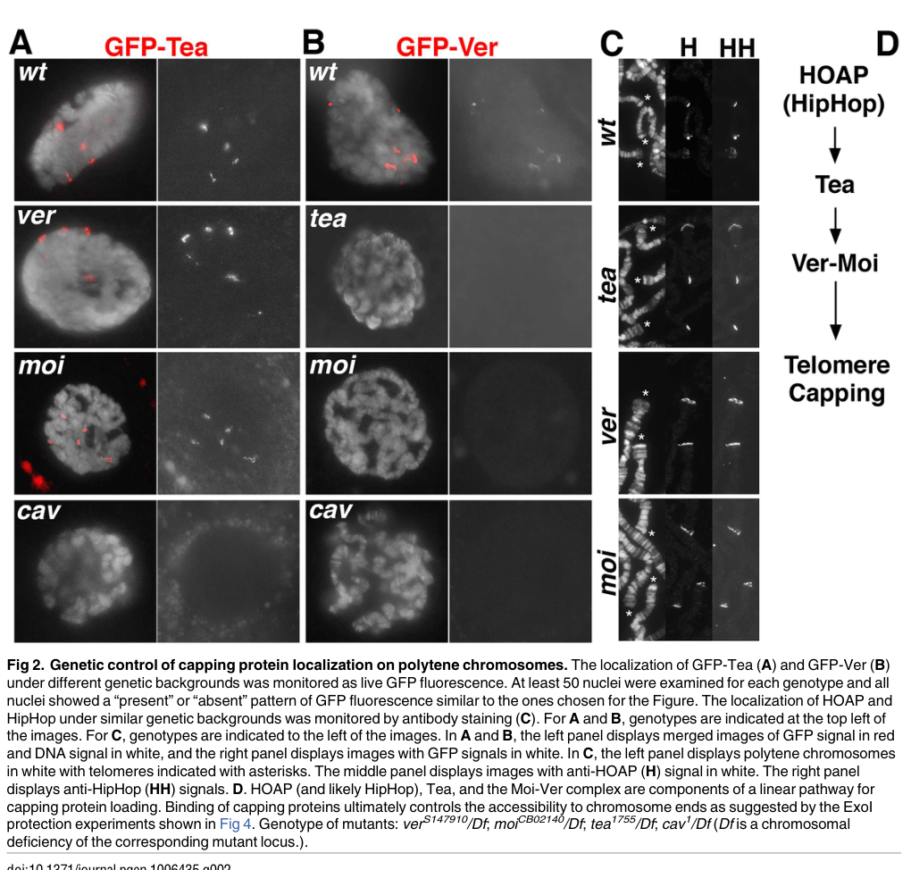

## Question

# Gene Research for Functional Annotation

## ⚠️ CRITICAL: Gene/Protein Identification Context

**BEFORE YOU BEGIN RESEARCH:** You MUST verify you are researching the CORRECT gene/protein. Gene symbols can be ambiguous, especially for less well-characterized genes from non-model organisms.

### Target Gene/Protein Identity (from UniProt):
- **UniProt Accession:** E1JH25
- **Protein Description:** RecName: Full=Protein telomere ends associated {ECO:0000303|PubMed:27835648};
- **Gene Information:** Name=tea {ECO:0000303|PubMed:27835648, ECO:0000312|FlyBase:FBgn0285892}; ORFNames=CG30007 {ECO:0000312|FlyBase:FBgn0285892};
- **Organism (full):** Drosophila melanogaster (Fruit fly).
- **Protein Family:** Not specified in UniProt
- **Key Domains:** Tea_C. (IPR054730); Tea_helical. (IPR057624); Tea_mid. (IPR054729); Tea_C (PF22884); Tea_helical (PF24236)

### MANDATORY VERIFICATION STEPS:

1. **Check if the gene symbol "tea" matches the protein description above**
2. **Verify the organism is correct:** Drosophila melanogaster (Fruit fly).
3. **Check if protein family/domains align with what you find in literature**
4. **If you find literature for a DIFFERENT gene with the same or similar symbol, STOP**

### If Gene Symbol is Ambiguous or You Cannot Find Relevant Literature:

**DO NOT PROCEED WITH RESEARCH ON A DIFFERENT GENE.** Instead:
- State clearly: "The gene symbol 'tea' is ambiguous or literature is limited for this specific protein"
- Explain what you found (e.g., "Found extensive literature on a different gene with the same symbol in a different organism")
- Describe the protein based ONLY on the UniProt information provided above
- Suggest that the protein function can be inferred from domain/family information

### Research Target:

Please provide a comprehensive research report on the gene **tea** (gene ID: tea, UniProt: E1JH25) in DROME.

The research report should be a detailed narrative explaining the function, biological processes, and localization of the gene product. Citations should be given for all claims.

You should prioritize authoritative reviews and primary scientific literature when conducting research. You can supplement
this with annotations you find in gene/protein databases, but these can be outdated or inaccurate.

We are specifically interested in the primary function of the gene - for enzymes, what reaction is catalyzed, and what is the substrate specificity? For transporters, what is the substrate? For structural proteins or adapters, what is the broader structural role? For signaling molecules, what is the role in the pathway.

We are interested in where in or outside the cell the gene product carries out its function.

We are also interested in the signaling or biochemical pathways in which the gene functions. We are less interested in broad pleiotropic effects, except where these elucidate the precise role.

Include evidence where possible. We are interested in both experimental evidence as well as inference from structure, evolution, or bioinformatic analysis. Precise studies should be prioritized over high-throughput, where available.

## Output

Question: You are an expert researcher providing comprehensive, well-cited information.

Provide detailed information focusing on:
1. Key concepts and definitions with current understanding
2. Recent developments and latest research (prioritize 2023-2024 sources)
3. Current applications and real-world implementations
4. Expert opinions and analysis from authoritative sources
5. Relevant statistics and data from recent studies

Format as a comprehensive research report with proper citations. Include URLs and publication dates where available.
Always prioritize recent, authoritative sources and provide specific citations for all major claims.

# Gene Research for Functional Annotation

## ⚠️ CRITICAL: Gene/Protein Identification Context

**BEFORE YOU BEGIN RESEARCH:** You MUST verify you are researching the CORRECT gene/protein. Gene symbols can be ambiguous, especially for less well-characterized genes from non-model organisms.

### Target Gene/Protein Identity (from UniProt):
- **UniProt Accession:** E1JH25
- **Protein Description:** RecName: Full=Protein telomere ends associated {ECO:0000303|PubMed:27835648};
- **Gene Information:** Name=tea {ECO:0000303|PubMed:27835648, ECO:0000312|FlyBase:FBgn0285892}; ORFNames=CG30007 {ECO:0000312|FlyBase:FBgn0285892};
- **Organism (full):** Drosophila melanogaster (Fruit fly).
- **Protein Family:** Not specified in UniProt
- **Key Domains:** Tea_C. (IPR054730); Tea_helical. (IPR057624); Tea_mid. (IPR054729); Tea_C (PF22884); Tea_helical (PF24236)

### MANDATORY VERIFICATION STEPS:

1. **Check if the gene symbol "tea" matches the protein description above**
2. **Verify the organism is correct:** Drosophila melanogaster (Fruit fly).
3. **Check if protein family/domains align with what you find in literature**
4. **If you find literature for a DIFFERENT gene with the same or similar symbol, STOP**

### If Gene Symbol is Ambiguous or You Cannot Find Relevant Literature:

**DO NOT PROCEED WITH RESEARCH ON A DIFFERENT GENE.** Instead:
- State clearly: "The gene symbol 'tea' is ambiguous or literature is limited for this specific protein"
- Explain what you found (e.g., "Found extensive literature on a different gene with the same symbol in a different organism")
- Describe the protein based ONLY on the UniProt information provided above
- Suggest that the protein function can be inferred from domain/family information

### Research Target:

Please provide a comprehensive research report on the gene **tea** (gene ID: tea, UniProt: E1JH25) in DROME.

The research report should be a detailed narrative explaining the function, biological processes, and localization of the gene product. Citations should be given for all claims.

You should prioritize authoritative reviews and primary scientific literature when conducting research. You can supplement
this with annotations you find in gene/protein databases, but these can be outdated or inaccurate.

We are specifically interested in the primary function of the gene - for enzymes, what reaction is catalyzed, and what is the substrate specificity? For transporters, what is the substrate? For structural proteins or adapters, what is the broader structural role? For signaling molecules, what is the role in the pathway.

We are interested in where in or outside the cell the gene product carries out its function.

We are also interested in the signaling or biochemical pathways in which the gene functions. We are less interested in broad pleiotropic effects, except where these elucidate the precise role.

Include evidence where possible. We are interested in both experimental evidence as well as inference from structure, evolution, or bioinformatic analysis. Precise studies should be prioritized over high-throughput, where available.

# Functional annotation report: *tea* (CG30007), *Drosophila melanogaster*

## Identity and principal function

**Identity verified.** The target is the *D. melanogaster* gene *tea*, also called **CG30007**, encoding **Tea, “telomere ends associated”** (UniProt **E1JH25**). The investigators who characterized it identified CG30007-derived peptides while purifying telomere-associated proteins, named the locus *tea*, and demonstrated its function genetically. This is not an unrelated gene or a reference to tea-derived compounds. [UniProt entry](https://www.uniprot.org/uniprotkb/E1JH25/entry); [Zhang et al., *PLOS Genetics*, published 11 November 2016](https://doi.org/10.1371/journal.pgen.1006435). (zhang2016mtvanssdna pages 2-5, zhang2016mtvanssdna pages 1-2)

**Primary annotation:** Tea is an essential **nuclear chromosome-end capping protein** and component of the **Moi–Tea–Ver (MTV) complex**. Its best-supported specific role is to enable localization of the Moi–Ver module at telomeres, where the assembled complex can bind and shield single-stranded DNA (ssDNA). It is a structural/assembly factor in telomere protection, **not a characterized enzyme or transporter**; no catalytic reaction or transported substrate has been established. Its experimentally demonstrated cellular site of action is the **telomere at the ends of nuclear chromosomes**, not an extracellular location. (zhang2016mtvanssdna pages 2-5, zhang2016mtvanssdna pages 6-8, zhang2016mtvanssdna pages 8-10, zhang2016mtvanssdna pages 5-6)

The following evidence distinguishes findings **directly about Tea** from biochemical properties established only for the **assembled MTV complex**. (zhang2016mtvanssdna pages 2-5, zhang2016mtvanssdna pages 6-8, zhang2016mtvanssdna pages 8-10)

| Observation | Assay and quantitative data | Interpretation / important limitation | Citation |
|---|---|---|---|
| **Tea is essential for chromosome-end protection** | RNAi against *tea/CG30007* caused end-to-end fusions in S2 cells. Lethal *tea* allele/deficiency combinations showed a mean of **6.7 telomere fusions per nucleus across 90 nuclei**, with ≥1 fusion in every nucleus. A wild-type **10-kb genomic *tea* transgene** restored viability and eliminated fusions. | Strong genetic loss-and-rescue evidence establishes Tea as a telomere-capping factor rather than merely a telomere-associated marker. | (zhang2016mtvanssdna pages 2-5) |
| **Tea localizes specifically to telomeres** | Endogenously tagged N-terminal EGFP–Tea formed interphase nuclear foci and **5–6 strips** in salivary-gland polytene nuclei; anti-GFP staining localized the protein to polytene chromosome ends. For localization-dependency experiments, **≥50 nuclei per genotype** showed consistent present/absent patterns. | Establishes nuclear, chromosome-end localization at endogenous expression. The strips correspond mainly to visible euchromatic chromosome-arm telomeres; fluorescence does not by itself identify the underlying DNA substrate. | (zhang2016mtvanssdna pages 2-5, zhang2016mtvanssdna pages 5-6) |
| **Genetic localization hierarchy is consistent with HOAP → Tea → Moi/Ver** | GFP–Tea was lost from telomeres in *cav/HOAP* mutants but remained apparently normal in *moi* or *ver* mutants. GFP–Ver was lost in *tea* mutants, whereas HOAP and HipHop foci persisted after Tea loss. | Supports an ordered recruitment pathway in which HOAP-dependent telomeric chromatin enables Tea localization and Tea enables Moi–Ver recruitment. These localization dependencies **do not prove direct physical HOAP–Tea binding** or a strictly linear biochemical mechanism. | (zhang2016mtvanssdna pages 5-6, zhang2016mtvanssdna media 0e436c86) |
| **Tea participates in a Moi–Tea–Ver complex** | Yeast three-hybrid analysis detected strong interaction of **C-terminal Tea** with Moi and Ver together; neither Tea fragment interacted detectably with Moi or Ver alone in two-hybrid assays. Moi/Ver truncations and several missense variants disrupted the tripartite interaction. Independent 2017 Ver affinity-purification/mass spectrometry identified **Moi and CG30007/Tea as the most abundant Ver interactors**. | Genetic, interaction, and proteomic evidence supports an MTV complex. The data do not define residue-level Tea interfaces, complex stoichiometry, or show that every association is direct. | (zhang2016mtvanssdna pages 6-8, cicconi2017thedrosophilatelomerecapping pages 15-16) |
| **Purified MTV preferentially binds ssDNA** | Partially purified recombinant MTV bound unrelated **10–84-nt ssDNA** substrates but not dsDNA tested up to **60 bp**; it also bound duplex substrates bearing either **3′ or 5′ single-stranded overhangs**. The Moi–Ver subcomplex did not bind under the same conditions. | Establishes sequence-independent ssDNA binding for the assembled MTV preparation and no absolute 3′-end requirement in vitro. It **does not establish Tea-alone DNA binding**, binding constants, physiological strand polarity, or direct recognition of native fly telomeres. | (zhang2016mtvanssdna pages 6-8, zhang2016mtvanssdna pages 8-10) |
| **MTV can shield ssDNA from exonucleolytic degradation** | MTV-bound oligonucleotides resisted bacterial **Exonuclease I** degradation; comparable protection was not produced by Moi–Ver or bacterial SSB under the assay conditions. Controls argued against nonspecific poisoning of ExoI. | Supports an ssDNA-accessibility/protection mechanism for MTV. It remains an **in-vitro bacterial-nuclease assay**: an endogenous *Drosophila* telomeric overhang was not directly demonstrated, and in-vivo overhang protection or processing was not measured. | (zhang2016mtvanssdna pages 8-10) |

*Table: Experimental evidence supporting Tea/CG30007 as an essential telomere-capping component of the Moi–Tea–Ver complex. The table separates direct Tea findings and quantitative results from complex-level properties and unresolved mechanistic inferences.*

## Biological mechanism and localization

Unlike typical telomerase-dependent telomeres, *D. melanogaster* chromosome ends are elongated using the specialized retrotransposons **HeT-A, TART and TAHRE**. **Elongation and capping are distinct processes:** the terminal DNA sequence is not required to specify a protected chromosome end. Within the proposed capping architecture, **HOAP–HipHop** occupies a broader duplex-DNA-associated telomeric region, whereas **MTV** is the ssDNA-protecting module. The latter assignment is strongly supported by purified-complex biochemistry, but the proposed location of MTV on a native terminal ssDNA overhang has not been directly demonstrated. [Zhang et al., 2016](https://doi.org/10.1371/journal.pgen.1006435); [Cui et al., *PLOS Genetics*, published 23 November 2021](https://doi.org/10.1371/journal.pgen.1009925). (zhang2016mtvanssdna pages 1-2, cui2021tamingactivetransposons pages 2-4, zhang2016mtvanssdna pages 8-10)

Tea’s telomeric localization was established using **EGFP tagged at the endogenous *tea* locus**: the protein formed foci in interphase nuclei, approximately **5–6 strips** in salivary-gland polytene nuclei, and anti-GFP staining identified those polytene signals specifically at chromosome ends. Tea depletion by RNA interference caused chromosome end-to-end fusion in cultured cells. Mutant/deficiency animals were lethal and exhibited an average of **6.7 telomere fusions per nucleus among 90 nuclei examined**; every examined nucleus had at least one fusion. A wild-type *tea* genomic transgene restored viability and eliminated the observed fusions. Together, endogenous localization and loss-and-rescue genetics make chromosome-end protection a high-confidence annotation. (zhang2016mtvanssdna pages 2-5, zhang2016mtvanssdna pages 5-6)

Genetic localization experiments place Tea **downstream of HOAP/Cav and upstream of Moi–Ver recruitment**: loss of HOAP eliminated discernible GFP–Tea telomeric stripes; Tea remained apparently localized without Ver or Moi; and Ver localization was defective without Tea. Conversely, HOAP and HipHop foci persisted in *tea* mutants. At least **50 nuclei per genotype** were assessed for the reported localization patterns. These observations support a recruitment hierarchy, **HOAP-associated telomeric chromatin → Tea → Moi–Ver**, but do **not** demonstrate direct HOAP–Tea binding or prove that recruitment is an obligatorily linear biochemical process. **Figure 2 of Zhang et al.** illustrates the observations and the authors’ proposed model. (zhang2016mtvanssdna pages 5-6, zhang2016mtvanssdna media 0e436c86)

Yeast three-hybrid experiments detected association of the **Tea C-terminal region with Moi and Ver together**; the tested Tea fragments did not detectably bind either partner individually in the corresponding two-hybrid assays. Moi/Ver interaction-disrupting mutations impaired the tripartite assay and caused telomere-capping defects in flies. Independently, Ver affinity-purification/mass spectrometry identified **Tea/CG30007 and Moi as prominent Ver-associated proteins**. Thus, an MTV assembly is supported by complementary genetic and protein-interaction methods, although its precise stoichiometry and Tea’s residue-level binding interfaces are unresolved. [Cicconi et al., *Nucleic Acids Research*, published December 2016; volume dated 2017](https://doi.org/10.1093/nar/gkw1244). (zhang2016mtvanssdna pages 6-8, cicconi2017thedrosophilatelomerecapping pages 15-16)

## Substrate specificity and limits of biochemical inference

**The substrate demonstrated is ssDNA bound by MTV, not by isolated Tea.** Partially purified recombinant MTV bound unrelated ssDNA oligonucleotides as short as **10 nucleotides** and up to **84 nucleotides** tested, but did not bind tested double-stranded DNA of up to **60 base pairs** under the reported conditions. It recognized both **3′ and 5′ single-stranded overhangs** in vitro; therefore, binding did not absolutely require a free 3′ overhang. The Moi–Ver preparation did not bind those substrates under the same experimental conditions. MTV-bound oligonucleotides also resisted degradation by **bacterial exonuclease I** in vitro, consistent with a role in restricting access to chromosome ends. These results establish substrate preference and protection **for the prepared complex**, not an intrinsic Tea-only DNA-binding specificity or protection against a demonstrated endogenous nuclease. (zhang2016mtvanssdna pages 6-8, zhang2016mtvanssdna pages 8-10)

A subsequent independent study directly demonstrated that **Ver itself** binds ssDNA, including overhang-bearing substrates, and highlighted differences between purified-Ver assays and earlier Moi–Ver-complex assays. Its authors explicitly left open whether Tea binds DNA independently or instead enhances Ver binding. They also observed increased RPA and DNA-damage-marker association at **Ver-deficient**, not specifically Tea-deficient, telomeres; those data should not be presented as a direct Tea phenotype. Both groups cautioned that a native *Drosophila* terminal ssDNA overhang had **not been directly established** by their experiments. [Cicconi et al., 2017](https://doi.org/10.1093/nar/gkw1244). (cicconi2017thedrosophilatelomerecapping pages 12-14, cicconi2017thedrosophilatelomerecapping pages 15-16, zhang2016mtvanssdna pages 8-10)

## Protein domains, evolution and research status

The supplied UniProt/InterPro annotations list **Tea_C (IPR054730; PF22884), Tea_mid (IPR054729), and Tea_helical (IPR057624; PF24236)** for E1JH25. These names are **Tea-associated region classifications**, not evidence that Tea has an experimentally demonstrated catalytic domain or a proven standalone DNA-binding domain. The 2016 functional study detected an MTV-interacting **C-terminal Tea region** but reported no identifiable conventional Tea domain with the structural-prediction methods then used; the 2017 study likewise noted that Tea’s DNA-binding activity remained untested. Tea homologs were reported within *Drosophila*, without an identified homolog outside that group in the 2016 analysis. Consequently, functional resemblance of MTV to **CST or TPP1–POT1** denotes **analogous ssDNA-protection roles**, not established Tea orthology or structural equivalence. [Zhang et al., 2016](https://doi.org/10.1371/journal.pgen.1006435); [Cicconi et al., 2017](https://doi.org/10.1093/nar/gkw1244). (zhang2016mtvanssdna pages 2-5, zhang2016mtvanssdna pages 6-8, zhang2016mtvanssdna pages 10-12, cicconi2017thedrosophilatelomerecapping pages 15-16)

**Recent developments require careful attribution.** A 2021 study discussed MTV as a proposed contributor to recruitment of telomeric retrotransposon ribonucleoproteins, while identifying evidence principally for the **Ver subunit**, and explicitly qualified an equivalent role for Tea as possible rather than established. A **2023** experimental study demonstrated ATM–Nbs-dependent phosphorylation of **HOAP** after DNA-damaging treatment and listed Tea as a capping-complex component; it did **not** show that Tea is phosphorylated in that pathway. A [2025 study of retrotransposon transcription](https://doi.org/10.1126/sciadv.adr2299) identified Mediator, E2F1–Dp and Scalloped/dTEAD as regulators, but did not establish Tea as one of those transcription factors. The retrieved **2023–2024 literature supplies context, not a new direct Tea-specific mechanistic test**; no validated Tea-specific clinical or therapeutic implementation was identified. [Cui et al., 2021](https://doi.org/10.1371/journal.pgen.1009925); [On, Kato and Itoh, *Journal of Insect Biotechnology and Sericology* **92**, 1–15, 2023](https://doi.org/10.11416/jibs.92.1_1); [Liu et al., *Science Advances*, published 3 January 2025](https://doi.org/10.1126/sciadv.adr2299). (cui2021tamingactivetransposons pages 2-4, on2023telomerecappingprotein pages 1-2, liu2025transcriptionalcouplingof pages 1-2)

**Bottom line:** Annotate E1JH25/Tea as a **telomere-localized, essential capping/MTV-assembly protein involved in chromosome-end protection**. Annotate **sequence-independent ssDNA binding and exonuclease shielding to MTV**, while retaining **Tea-alone DNA binding, native overhang occupancy, and a direct Tea-specific role in retrotransposon targeting** as unresolved. Its practical current use is as an experimentally tractable *Drosophila* model for understanding how telomeres are protected without telomerase, rather than as an established applied target. (zhang2016mtvanssdna pages 2-5, zhang2016mtvanssdna pages 6-8, zhang2016mtvanssdna pages 8-10, cicconi2017thedrosophilatelomerecapping pages 12-14, cui2021tamingactivetransposons pages 2-4)

References

1. (zhang2016mtvanssdna pages 2-5): Yi Zhang, Liang Zhang, Xiaona Tang, Shilpa R. Bhardwaj, Jingyun Ji, and Yikang S. Rong. Mtv, an ssdna protecting complex essential for transposon-based telomere maintenance in drosophila. PLOS Genetics, 12:e1006435, Nov 2016. URL: https://doi.org/10.1371/journal.pgen.1006435, doi:10.1371/journal.pgen.1006435. This article has 39 citations and is from a domain leading peer-reviewed journal.

2. (zhang2016mtvanssdna pages 1-2): Yi Zhang, Liang Zhang, Xiaona Tang, Shilpa R. Bhardwaj, Jingyun Ji, and Yikang S. Rong. Mtv, an ssdna protecting complex essential for transposon-based telomere maintenance in drosophila. PLOS Genetics, 12:e1006435, Nov 2016. URL: https://doi.org/10.1371/journal.pgen.1006435, doi:10.1371/journal.pgen.1006435. This article has 39 citations and is from a domain leading peer-reviewed journal.

3. (zhang2016mtvanssdna pages 6-8): Yi Zhang, Liang Zhang, Xiaona Tang, Shilpa R. Bhardwaj, Jingyun Ji, and Yikang S. Rong. Mtv, an ssdna protecting complex essential for transposon-based telomere maintenance in drosophila. PLOS Genetics, 12:e1006435, Nov 2016. URL: https://doi.org/10.1371/journal.pgen.1006435, doi:10.1371/journal.pgen.1006435. This article has 39 citations and is from a domain leading peer-reviewed journal.

4. (zhang2016mtvanssdna pages 8-10): Yi Zhang, Liang Zhang, Xiaona Tang, Shilpa R. Bhardwaj, Jingyun Ji, and Yikang S. Rong. Mtv, an ssdna protecting complex essential for transposon-based telomere maintenance in drosophila. PLOS Genetics, 12:e1006435, Nov 2016. URL: https://doi.org/10.1371/journal.pgen.1006435, doi:10.1371/journal.pgen.1006435. This article has 39 citations and is from a domain leading peer-reviewed journal.

5. (zhang2016mtvanssdna pages 5-6): Yi Zhang, Liang Zhang, Xiaona Tang, Shilpa R. Bhardwaj, Jingyun Ji, and Yikang S. Rong. Mtv, an ssdna protecting complex essential for transposon-based telomere maintenance in drosophila. PLOS Genetics, 12:e1006435, Nov 2016. URL: https://doi.org/10.1371/journal.pgen.1006435, doi:10.1371/journal.pgen.1006435. This article has 39 citations and is from a domain leading peer-reviewed journal.

6. (zhang2016mtvanssdna media 0e436c86): Yi Zhang, Liang Zhang, Xiaona Tang, Shilpa R. Bhardwaj, Jingyun Ji, and Yikang S. Rong. Mtv, an ssdna protecting complex essential for transposon-based telomere maintenance in drosophila. PLOS Genetics, 12:e1006435, Nov 2016. URL: https://doi.org/10.1371/journal.pgen.1006435, doi:10.1371/journal.pgen.1006435. This article has 39 citations and is from a domain leading peer-reviewed journal.

7. (cicconi2017thedrosophilatelomerecapping pages 15-16): Alessandro Cicconi, Emanuela Micheli, Fiammetta Vernì, Alison Jackson, Ana Citlali Gradilla, Francesca Cipressa, Domenico Raimondo, Giuseppe Bosso, James G. Wakefield, Laura Ciapponi, Giovanni Cenci, Maurizio Gatti, Stefano Cacchione, and Grazia Daniela Raffa. The drosophila telomere-capping protein verrocchio binds single-stranded dna and protects telomeres from dna damage response. Nucleic Acids Research, 45:3068-3085, Dec 2017. URL: https://doi.org/10.1093/nar/gkw1244, doi:10.1093/nar/gkw1244. This article has 31 citations and is from a highest quality peer-reviewed journal.

8. (cui2021tamingactivetransposons pages 2-4): Ming Cui, Yaofu Bai, Kaili Li, and Yi-Kang S. Rong. Taming active transposons at drosophila telomeres: the interconnection between hiphop’s roles in capping and transcriptional silencing. PLOS Genetics, 17:e1009925, Nov 2021. URL: https://doi.org/10.1371/journal.pgen.1009925, doi:10.1371/journal.pgen.1009925. This article has 16 citations and is from a domain leading peer-reviewed journal.

9. (cicconi2017thedrosophilatelomerecapping pages 12-14): Alessandro Cicconi, Emanuela Micheli, Fiammetta Vernì, Alison Jackson, Ana Citlali Gradilla, Francesca Cipressa, Domenico Raimondo, Giuseppe Bosso, James G. Wakefield, Laura Ciapponi, Giovanni Cenci, Maurizio Gatti, Stefano Cacchione, and Grazia Daniela Raffa. The drosophila telomere-capping protein verrocchio binds single-stranded dna and protects telomeres from dna damage response. Nucleic Acids Research, 45:3068-3085, Dec 2017. URL: https://doi.org/10.1093/nar/gkw1244, doi:10.1093/nar/gkw1244. This article has 31 citations and is from a highest quality peer-reviewed journal.

10. (zhang2016mtvanssdna pages 10-12): Yi Zhang, Liang Zhang, Xiaona Tang, Shilpa R. Bhardwaj, Jingyun Ji, and Yikang S. Rong. Mtv, an ssdna protecting complex essential for transposon-based telomere maintenance in drosophila. PLOS Genetics, 12:e1006435, Nov 2016. URL: https://doi.org/10.1371/journal.pgen.1006435, doi:10.1371/journal.pgen.1006435. This article has 39 citations and is from a domain leading peer-reviewed journal.

11. (on2023telomerecappingprotein pages 1-2): K On, Y Kato, and M Itoh. Telomere capping protein hoap is phosphorylated via the atm-nbs pathway following treatment with dsb inducing drugs in drosophila. Unknown journal, 2023.

12. (liu2025transcriptionalcouplingof pages 1-2): Mengmeng Liu, Xiao-Jun Xie, Xiao Li, Xingjie Ren, Jasmine L. Sun, Zhen Lin, Rajitha-Udakara-Sampath Hemba-Waduge, and Jun-Yuan Ji. Transcriptional coupling of telomeric retrotransposons with the cell cycle. Science Advances, Jan 2025. URL: https://doi.org/10.1126/sciadv.adr2299, doi:10.1126/sciadv.adr2299. This article has 8 citations and is from a highest quality peer-reviewed journal.

## Artifacts

- [Edison artifact artifact-00](tea-deep-research-falcon_artifacts/artifact-00.md)

## Citations

1. zhang2016mtvanssdna pages 2-5
2. zhang2016mtvanssdna pages 8-10
3. zhang2016mtvanssdna pages 1-2
4. zhang2016mtvanssdna pages 6-8
5. zhang2016mtvanssdna pages 5-6
6. cicconi2017thedrosophilatelomerecapping pages 15-16
7. cui2021tamingactivetransposons pages 2-4
8. cicconi2017thedrosophilatelomerecapping pages 12-14
9. zhang2016mtvanssdna pages 10-12
10. on2023telomerecappingprotein pages 1-2
11. liu2025transcriptionalcouplingof pages 1-2
12. UniProt entry
13. Zhang et al., *PLOS Genetics*, published 11 November 2016
14. Zhang et al., 2016
15. Cui et al., *PLOS Genetics*, published 23 November 2021
16. Cicconi et al., *Nucleic Acids Research*, published December 2016; volume dated 2017
17. Cicconi et al., 2017
18. 2025 study of retrotransposon transcription
19. Cui et al., 2021
20. On, Kato and Itoh, *Journal of Insect Biotechnology and Sericology* **92**, 1–15, 2023
21. Liu et al., *Science Advances*, published 3 January 2025
22. https://www.uniprot.org/uniprotkb/E1JH25/entry
23. https://doi.org/10.1371/journal.pgen.1006435
24. https://doi.org/10.1371/journal.pgen.1009925
25. https://doi.org/10.1093/nar/gkw1244
26. https://doi.org/10.1126/sciadv.adr2299
27. https://doi.org/10.11416/jibs.92.1_1
28. https://doi.org/10.1371/journal.pgen.1006435,
29. https://doi.org/10.1093/nar/gkw1244,
30. https://doi.org/10.1371/journal.pgen.1009925,
31. https://doi.org/10.1126/sciadv.adr2299,