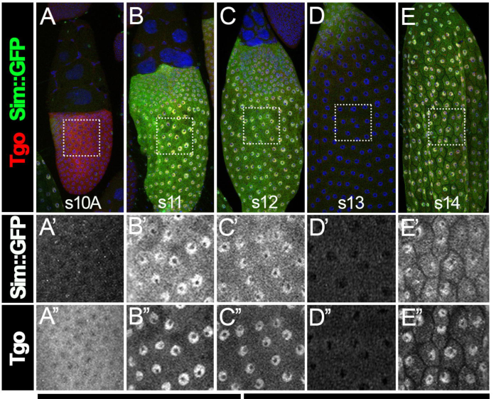

## Question

# Gene Research for Functional Annotation

## ⚠️ CRITICAL: Gene/Protein Identification Context

**BEFORE YOU BEGIN RESEARCH:** You MUST verify you are researching the CORRECT gene/protein. Gene symbols can be ambiguous, especially for less well-characterized genes from non-model organisms.

### Target Gene/Protein Identity (from UniProt):
- **UniProt Accession:** O15945
- **Protein Description:** RecName: Full=Aryl hydrocarbon receptor nuclear translocator homolog; Short=dARNT; AltName: Full=Hypoxia-inducible factor 1-beta; AltName: Full=Protein tango;
- **Gene Information:** Name=tgo; Synonyms=ARNT, HIF-1-beta; ORFNames=CG11987;
- **Organism (full):** Drosophila melanogaster (Fruit fly).
- **Protein Family:** Not specified in UniProt
- **Key Domains:** bHLH_dom. (IPR011598); Circadian_TF. (IPR050933); HLH_DNA-bd_sf. (IPR036638); Nuc_translocat. (IPR001067); PAS. (IPR000014)

### MANDATORY VERIFICATION STEPS:

1. **Check if the gene symbol "tgo" matches the protein description above**
2. **Verify the organism is correct:** Drosophila melanogaster (Fruit fly).
3. **Check if protein family/domains align with what you find in literature**
4. **If you find literature for a DIFFERENT gene with the same or similar symbol, STOP**

### If Gene Symbol is Ambiguous or You Cannot Find Relevant Literature:

**DO NOT PROCEED WITH RESEARCH ON A DIFFERENT GENE.** Instead:
- State clearly: "The gene symbol 'tgo' is ambiguous or literature is limited for this specific protein"
- Explain what you found (e.g., "Found extensive literature on a different gene with the same symbol in a different organism")
- Describe the protein based ONLY on the UniProt information provided above
- Suggest that the protein function can be inferred from domain/family information

### Research Target:

Please provide a comprehensive research report on the gene **tgo** (gene ID: tgo, UniProt: O15945) in DROME.

The research report should be a detailed narrative explaining the function, biological processes, and localization of the gene product. Citations should be given for all claims.

You should prioritize authoritative reviews and primary scientific literature when conducting research. You can supplement
this with annotations you find in gene/protein databases, but these can be outdated or inaccurate.

We are specifically interested in the primary function of the gene - for enzymes, what reaction is catalyzed, and what is the substrate specificity? For transporters, what is the substrate? For structural proteins or adapters, what is the broader structural role? For signaling molecules, what is the role in the pathway.

We are interested in where in or outside the cell the gene product carries out its function.

We are also interested in the signaling or biochemical pathways in which the gene functions. We are less interested in broad pleiotropic effects, except where these elucidate the precise role.

Include evidence where possible. We are interested in both experimental evidence as well as inference from structure, evolution, or bioinformatic analysis. Precise studies should be prioritized over high-throughput, where available.

## Output

Question: You are an expert researcher providing comprehensive, well-cited information.

Provide detailed information focusing on:
1. Key concepts and definitions with current understanding
2. Recent developments and latest research (prioritize 2023-2024 sources)
3. Current applications and real-world implementations
4. Expert opinions and analysis from authoritative sources
5. Relevant statistics and data from recent studies

Format as a comprehensive research report with proper citations. Include URLs and publication dates where available.
Always prioritize recent, authoritative sources and provide specific citations for all major claims.

# Gene Research for Functional Annotation

## ⚠️ CRITICAL: Gene/Protein Identification Context

**BEFORE YOU BEGIN RESEARCH:** You MUST verify you are researching the CORRECT gene/protein. Gene symbols can be ambiguous, especially for less well-characterized genes from non-model organisms.

### Target Gene/Protein Identity (from UniProt):
- **UniProt Accession:** O15945
- **Protein Description:** RecName: Full=Aryl hydrocarbon receptor nuclear translocator homolog; Short=dARNT; AltName: Full=Hypoxia-inducible factor 1-beta; AltName: Full=Protein tango;
- **Gene Information:** Name=tgo; Synonyms=ARNT, HIF-1-beta; ORFNames=CG11987;
- **Organism (full):** Drosophila melanogaster (Fruit fly).
- **Protein Family:** Not specified in UniProt
- **Key Domains:** bHLH_dom. (IPR011598); Circadian_TF. (IPR050933); HLH_DNA-bd_sf. (IPR036638); Nuc_translocat. (IPR001067); PAS. (IPR000014)

### MANDATORY VERIFICATION STEPS:

1. **Check if the gene symbol "tgo" matches the protein description above**
2. **Verify the organism is correct:** Drosophila melanogaster (Fruit fly).
3. **Check if protein family/domains align with what you find in literature**
4. **If you find literature for a DIFFERENT gene with the same or similar symbol, STOP**

### If Gene Symbol is Ambiguous or You Cannot Find Relevant Literature:

**DO NOT PROCEED WITH RESEARCH ON A DIFFERENT GENE.** Instead:
- State clearly: "The gene symbol 'tgo' is ambiguous or literature is limited for this specific protein"
- Explain what you found (e.g., "Found extensive literature on a different gene with the same symbol in a different organism")
- Describe the protein based ONLY on the UniProt information provided above
- Suggest that the protein function can be inferred from domain/family information

### Research Target:

Please provide a comprehensive research report on the gene **tgo** (gene ID: tgo, UniProt: O15945) in DROME.

The research report should be a detailed narrative explaining the function, biological processes, and localization of the gene product. Citations should be given for all claims.

You should prioritize authoritative reviews and primary scientific literature when conducting research. You can supplement
this with annotations you find in gene/protein databases, but these can be outdated or inaccurate.

We are specifically interested in the primary function of the gene - for enzymes, what reaction is catalyzed, and what is the substrate specificity? For transporters, what is the substrate? For structural proteins or adapters, what is the broader structural role? For signaling molecules, what is the role in the pathway.

We are interested in where in or outside the cell the gene product carries out its function.

We are also interested in the signaling or biochemical pathways in which the gene functions. We are less interested in broad pleiotropic effects, except where these elucidate the precise role.

Include evidence where possible. We are interested in both experimental evidence as well as inference from structure, evolution, or bioinformatic analysis. Precise studies should be prioritized over high-throughput, where available.

# Functional annotation of *Drosophila melanogaster* **tgo** (Tango; UniProt O15945)

## Identity and principal function

The supplied UniProt record identifies **tgo**, also called *tango* and CG11987, as the fruit-fly ortholog of aryl hydrocarbon receptor nuclear translocator (ARNT/HIF-1β). Fly-specific experimental papers independently confirm that *tango* encodes an ARNT-related **basic helix–loop–helix–PAS (bHLH–PAS) transcription-factor subunit**. Its principal function is to form DNA-binding, transcriptionally active heterodimers with partner proteins—not to catalyze a reaction or transport a substrate. The N-terminal bHLH region participates in DNA recognition and dimerization, PAS regions support partner interactions, and a glutamine-rich, histidine–proline-containing C-terminal region contributes transcriptional activation. The supplied accession and CG identifier come from the user-provided UniProt identity; the cited primary papers verify the matching gene name, organism, orthology and domain architecture rather than independently establishing those database identifiers. (sonnenfeld2005analysisofthe pages 1-2, p1998regulationofbhlhpas pages 1-2, edwards2022theevolutionand pages 1-3)

**Tgo is the shared subunit; its partner largely determines the biological program.** Established partners include Single-minded (Sim), Trachealess (Trh), Similar (Sima), Spineless (Ss) and Dysfusion (Dys). Their complexes regulate, respectively, CNS-midline specification, respiratory and salivary-duct development, hypoxic transcription, appendage patterning, and tracheal fusion or distal-joint morphogenesis. This interpretation is supported by partner-interaction assays, mutant phenotypes, reporter experiments and tissue-specific localization, rather than by sequence similarity alone. (p1998regulationofbhlhpas pages 1-2, jiang2007transcriptionalspecificityof pages 4-5, lavistallanos2002controlofthe pages 4-6, emmons1999thespinelessaristapediaand pages 6-7, cordoba2014thebhlhpastranscription pages 6-6)

## Molecular mechanism and cellular location

Tgo is broadly expressed in embryos but is predominantly **cytoplasmic where an appropriate partner is absent**. It accumulates in **nuclei** of embryonic CNS-midline, tracheal and salivary-duct cells expressing Sim or Trh. Removing the relevant partner prevents Tgo nuclear accumulation in its lineage; ectopic Sim or Trh redirects Tgo to nuclei and activates a CME-containing reporter. Conversely, cultured-cell experiments found that Sim and Trh also depend on Tgo for efficient nuclear localization. Thus, the operative location for Tgo’s transcriptional function is the **cell nucleus**, although an undimerized cytoplasmic pool exists. This is a demonstrated fly-specific localization mechanism, not an assumption based on mammalian ARNT. (p1998regulationofbhlhpas pages 5-6, p1998regulationofbhlhpas pages 1-2)

Tgo-containing dimers recognize related but **partner-dependent DNA elements**. Sim:Tgo and Trh:Tgo preferentially activate the **ACGTG** CNS-midline element; Ss:Tgo preferentially responds to an XRE-like element with a **GCGTG** core; Dys:Tgo has broader **NCGTG** recognition. Shared ACGTG recognition does not make Sim and Trh interchangeable: neighboring enhancer sequence and factors including Ventral veinless contribute to tissue-specific output. Tgo’s C terminus is functional rather than merely structural: Trh plus Tgo increased a *breathless* reporter approximately **sixfold** in cultured cells, whereas disruption of Tgo’s glutamine-rich activation region strongly impaired activation and affected tracheal development in vivo. (sonnenfeld2005analysisofthe pages 6-8, jiang2007transcriptionalspecificityof pages 1-2, long2014acomparisonof pages 16-17, emmons1999thespinelessaristapediaand pages 2-3)

The following comparison separates experimentally supported partnerships from conclusions that remain inferential.

| Partner / context | Biochemical or transcriptional role and element | Strongest fly-specific experimental evidence | Evidence limitations |
|---|---|---|---|
| **Single-minded (Sim)** — embryonic CNS midline | Sim:Tgo is a heterodimeric transcriptional activator that preferentially recognizes the CNS midline element **ACGTG**. Dimerization promotes nuclear accumulation of both proteins. | In *sim* mutants, Tgo fails to accumulate in midline nuclei; ectopic Sim recruits Tgo to nuclei and activates a multimerized CME reporter. **Ward et al., 1998**, [Development 125:1599–1608](https://doi.org/10.17615/fs4w-mk37). (p1998regulationofbhlhpas pages 5-6, p1998regulationofbhlhpas pages 1-2) | ACGTG is not sufficient to explain tissue specificity: Trh:Tgo recognizes the same core, so flanking sequence and tissue-specific cofactors help determine enhancer output. (long2014acomparisonof pages 16-17, long2014acomparisonof pages 1-2) |
| **Trachealess (Trh)** — trachea and salivary duct | Trh:Tgo activates transcription through **ACGTG** elements; Trh supplies lineage specificity, while Tgo supplies the common class-II partner and a C-terminal activation region. | Trh is required for nuclear Tgo in tracheal and salivary tissues. In S2 cells, Trh plus Tgo increased a *breathless* reporter about sixfold; deleting Tgo’s polyglutamine-rich C terminus nearly abolished activation. **Sonnenfeld et al., 2005**, [Development Genes and Evolution 215:221–229](https://doi.org/10.1007/s00427-004-0462-9). (sonnenfeld2005analysisofthe pages 6-8, p1998regulationofbhlhpas pages 6-7) | *breathless* regulation and developmental phenotypes do not prove that every affected gene is a direct Trh:Tgo target. Trh:Tgo specificity also depends on factors such as Ventral veinless and enhancer context. (jiang2007transcriptionalspecificityof pages 1-2, sonnenfeld2005analysisofthe pages 1-2) |
| **Similar (Sima)** — hypoxic response | Sima:Tgo is the fly HIF complex and recognizes hypoxia-response elements summarized as **RCGTG**. Sima is the oxygen-regulated HIF-α component; Tgo is the required HIF-β/ARNT-like partner. | Strong *tgo5* mutant embryos failed to induce an LDH-HRE reporter during hypoxia. At 5% O₂, reporter β-galactosidase mRNA rose **9.7–10.4-fold**, whereas *sima* mRNA rose only **1.3–1.5-fold**, supporting post-transcriptional regulation of Sima. **Lavista-Llanos et al., 2002**, [Molecular and Cellular Biology 22:6842–6853](https://doi.org/10.1128/MCB.22.19.6842-6853.2002). (lavistallanos2002controlofthe pages 4-6) | The 9.7–10.4-fold value is from an artificial HRE reporter, **not a native target gene**. Oxygen sensing chiefly regulates Sima through stabilization and localization; it should not be described as direct oxygen sensing by Tgo. (romero2007cellularanddevelopmental pages 7-10, lavistallanos2002controlofthe pages 9-10) |
| **Spineless (Ss)** — antenna, tarsus and bristles | Ss:Tgo is an AHR:ARNT-like developmental complex that preferentially activates xenobiotic-response-element reporters with a **GCGTG** core. | Yeast two-hybrid assays demonstrated direct Ss–Tgo interaction; neither protein alone activated the reporter, whereas coexpression activated XRE reporters. *tgo* alleles enhanced *ss*, and mutant clones reproduced distal antennal-to-leg transformations, tarsal loss and reduced bristles. **Emmons et al., 1999**, [Development 126:3937–3945](https://doi.org/10.1242/dev.126.17.3937). (emmons1999thespinelessaristapediaand pages 6-7, emmons1999thespinelessaristapediaand pages 2-3, emmons1999thespinelessaristapediaand pages 3-5) | XRE-reporter activation does **not** show that Tgo binds dioxin or another ligand. Ss:Tgo association appeared ligand-independent, and native direct targets in these appendage phenotypes were not established by these assays. (emmons1999thespinelessaristapediaand pages 1-2, emmons1999thespinelessaristapediaand pages 7-8) |
| **Dysfusion (Dys)** — tracheal fusion cells | Dys:Tgo is a DNA-binding activator with broad NCGTG recognition and preference **TCGTG > GCGTG > ACGTG > CCGTG**. | Co-immunoprecipitation, colocalization and misexpression support Dys:Tgo association and partner-driven nuclear localization. Four-copy reporters were activated **17×, 10×, 7× and 3×**, respectively; mutation of TCGTG motifs disrupted a tracheal fusion-cell enhancer. **Jiang & Crews, 2007**, [Journal of Biological Chemistry 282:28659–28668](https://doi.org/10.1074/jbc.M703803200). (jiang2007transcriptionalspecificityof pages 4-5, jiang2007transcriptionalspecificityof pages 1-2, jiang2007transcriptionalspecificityof pages 5-7) | The fold values are from synthetic multimerized reporters, **not native-target expression changes**. Native-enhancer tests support TCGTG function, but not every Dys-dependent gene has been shown to be directly occupied by Dys:Tgo. (jiang2007transcriptionalspecificityof pages 5-7, jiang2007transcriptionalspecificityof pages 9-11) |
| **Dysfusion (Dys)** — Notch-dependent tarsal joints | Notch–Su(H) directly activates *dys*; Dys then requires Tgo for the distal-joint program involving apoptosis and Rho-GTPase regulation. | Joint-specific *tgo* RNAi disrupted tarsal joints and reduced *bib*, *rpr* and *RhoGap71E* expression; ectopic Dys could not activate *rpr* in *tgo*-mutant cells. Su(H) binding to the 640-bp *dys* regulatory module was demonstrated separately. **Córdoba & Estella, 2014**, [PLOS Genetics 10:e1004621](https://doi.org/10.1371/journal.pgen.1004621). (cordoba2014thebhlhpastranscription pages 6-6, cordoba2014thebhlhpastranscription pages 9-10, cordoba2014thebhlhpastranscription pages 6-9) | Direct cis-regulatory binding was shown for **Su(H) at the *dys* enhancer**, not for Dys:Tgo at *rpr*, *hid*, *RhoGEF2* or *RhoGAP71E*. Those downstream links are primarily genetic and expression evidence. (cordoba2014thebhlhpastranscription pages 9-10, cordoba2014thebhlhpastranscription pages 10-12) |
| **Single-minded (Sim)** — late oogenesis, 2023 report | Sim:Tgo is proposed to promote follicle-cell differentiation during stages 10B–12. Tgo is nuclear with Sim, downregulated at stage 13 and re-upregulated at stage 14. A definitive ovary-specific response element was not established. | Two *tgo* RNAi lines reduced Tgo, prevented normal Br-C/Cut downregulation and Hnt induction, and produced abnormal follicle morphology. One analysis reported less than **5%** octopamine-induced rupture after *tgo* RNAi versus about **60%** in controls. **Oramas et al., December 2023**, [bioRxiv preprint](https://doi.org/10.1101/2022.12.30.522327). (oramas2023thebhlhpastranscriptional media 7cc9780f, oramas2023thebhlhpastranscriptional pages 5-9, oramas2023thebhlhpastranscriptional pages 28-31) | This is a **preprint**, not established here as peer reviewed. Stage-14 drivers did not efficiently deplete Tgo; therefore, a direct stage-14 Tgo role in regulating *Oamb*, *Nox* or *Mmp2* remains **unproven**. Those target-gene results were demonstrated principally for Sim. (oramas2023thebhlhpastranscriptional pages 9-13, oramas2023thebhlhpastranscriptional pages 17-21, oramas2023thebhlhpastranscriptional pages 13-17) |

*Table: Fly-specific evidence for the principal bHLH-PAS partners and sequence preferences of Drosophila Tango/Tgo (O15945). Reporter-derived fold changes and unresolved direct-target or stage-specific claims are explicitly distinguished from established native mechanisms.*

### Principal biological pathways

**Midline and respiratory development.** Sim:Tgo activates midline regulatory elements during CNS-midline differentiation, whereas Trh:Tgo acts in the trachea and salivary duct. Tgo is also required for appropriate *breathless* expression; *breathless* encodes a fibroblast growth factor receptor important in tracheal development. Dys:Tgo acts later in tracheal fusion cells: biochemical association, nuclear colocalization and cis-regulatory tests support a transcriptional role, and **TCGTG** motifs are necessary in an experimentally tested fusion-cell enhancer. In synthetic four-site reporters, Dys:Tgo produced approximately **17-, 10-, 7- and 3-fold** activation with TCGTG, GCGTG, ACGTG and CCGTG, respectively. These are **reporter measurements**, not fold changes in endogenous genes. (sonnenfeld2005analysisofthe pages 1-2, jiang2007transcriptionalspecificityof pages 1-2, jiang2007transcriptionalspecificityof pages 5-7)

**Oxygen response.** Sima is the fly HIF-α counterpart and Tgo supplies the ARNT/HIF-β-like partner. Under oxygen-replete conditions, the oxygen-dependent prolyl hydroxylase Fatiga promotes Sima turnover; reduced oxygen permits Sima stabilization, nuclear accumulation and HIF-dependent transcription. **Sima, rather than Tgo, is the principal oxygen-regulated subunit.** Importantly, direct fly genetics show Tgo is required: strongly mutant *tgo5* embryos did not induce an HRE-based LDH reporter under hypoxia. In the reported 5% oxygen experiment, reporter β-galactosidase mRNA increased **9.7–10.4-fold**, compared with only **1.3–1.5-fold** for *sima* mRNA, consistent with substantial post-transcriptional control of Sima. The LDH construct is an experimental reporter and its induction must not be interpreted as an endogenous fly *LDH* measurement. (romero2007cellularanddevelopmental pages 7-10, lavistallanos2002controlofthe pages 9-10, lavistallanos2002controlofthe pages 4-6)

**Appendage identity and Notch-dependent joints.** Ss:Tgo interaction was detected by yeast two-hybrid assay; together, but not individually, the proteins activated XRE reporters. *tgo* mutations enhanced *ss* phenotypes, and mutant somatic clones showed distal antennal transformations, missing tarsal structures and reduced bristle growth. In a distinct distal-joint program, Notch-responsive Su(H) binds a *dys* regulatory module; Dys then requires Tgo for joint-associated transcription. Joint-specific Tgo depletion disrupted tarsal joints and reduced *bib*, *rpr* and *RhoGap71E* expression. Direct binding by Su(H) to the *dys* enhancer **has** been tested; direct occupancy of each downstream joint gene by Dys:Tgo **has not** been established by those genetic experiments. (emmons1999thespinelessaristapediaand pages 6-7, emmons1999thespinelessaristapediaand pages 3-5, cordoba2014thebhlhpastranscription pages 6-6, cordoba2014thebhlhpastranscription pages 9-10, cordoba2014thebhlhpastranscription pages 6-9)

## Research published in 2023–2024 and present applications

A **December 2023 bioRxiv preprint** extends the Sim:Tgo model to ovarian follicle cells. Tgo was observed in follicle-cell nuclei during stages 10B–12, declined at stage 13 and reappeared at stage 14; its nuclear localization depended on Sim. Follicle-cell *tgo* RNAi impaired differentiation, including persistence of Br-C and Cut and failure to induce Hnt, and was associated with defective egg production and ovulation-related phenotypes. In one reported ex vivo assay, fewer than **5%** of follicles after *tgo* RNAi ruptured in response to octopamine, versus approximately **60%** of controls. The study’s cropped follicle-cell images show Tgo localization and differentiation defects following depletion. These results make follicle maturation a promising additional **fly-specific** function, but the report is a **preprint**, and the authors could not efficiently deplete Tgo *specifically at stage 14*. Consequently, their stage-14 findings that Sim regulates *Oamb*, *Nox* and *Mmp2* should **not** be presented as proof that Tgo directly regulates those genes at that stage. (oramas2023thebhlhpastranscriptional pages 1-5, oramas2023thebhlhpastranscriptional media 7cc9780f, oramas2023thebhlhpastranscriptional pages 5-9, oramas2023thebhlhpastranscriptional pages 17-21)

A **March 2024 review** discusses fly hypoxia as a model for understanding conserved responses relevant to stroke, identifying Sima and Tgo as HIF counterparts. In practical research, genetically manipulated flies, cultured cells, HRE reporters and tissue-specific RNAi are used to dissect oxygen-responsive transcription and developmental programs; these are **research implementations, not clinical applications of Tgo**. The review notes an important translational limit: flies lack blood vessels and therefore cannot reproduce vessel-occlusion stroke directly. Its statement that Tgo loss of function had not been tested in fly hypoxia should be read cautiously alongside the earlier **2002 *tgo5* embryo HRE-reporter experiment**: that experiment establishes a Tgo requirement for hypoxic *reporter induction*, while not establishing Tgo’s contribution to whole-animal hypoxia survival or stroke-like outcomes. (quadrosmennella2024whatcanthe pages 4-5, quadrosmennella2024whatcanthe pages 3-4, lavistallanos2002controlofthe pages 4-6)

**Boundary of annotation.** ARNT homology does not make Tgo itself a demonstrated dioxin-binding receptor. Ss:Tgo activation of an XRE reporter shows transcription-factor specificity, not ligand binding or xenobiotic detoxification by Tgo. Likewise, contemporary fly juvenile-hormone receptor studies identify **Met and Gce** as the ligand-binding receptor proteins; those findings must not be reassigned to *tgo* simply because these proteins also possess bHLH–PAS domains. No catalytic substrate, transported molecule, or direct small-molecule ligand for Tgo is established by the cited fly experiments. (emmons1999thespinelessaristapediaand pages 1-2, emmons1999thespinelessaristapediaand pages 7-8, kolonkoadamska2023interactionpatternsof pages 1-2)

### Selected sources and publication dates

- Ward MP, Mosher JT & Crews ST. *Development* **125**, 1599–1608 (**1998**), “Regulation of bHLH-PAS protein subcellular localization during Drosophila embryogenesis.” [Accessible repository record](https://doi.org/10.17615/fs4w-mk37). (p1998regulationofbhlhpas pages 1-2)
- Emmons RB *et al.* *Development* **126**, 3937–3945 (**August 1999 online**), “The Spineless-Aristapedia and Tango bHLH-PAS proteins interact to control antennal and tarsal development.” https://doi.org/10.1242/dev.126.17.3937. (emmons1999thespinelessaristapediaand pages 1-2)
- Lavista-Llanos S *et al.* *Molecular and Cellular Biology* **22**, 6842–6853 (**October 2002**), “Control of the Hypoxic Response in Drosophila melanogaster by the Basic Helix-Loop-Helix PAS Protein Similar.” https://doi.org/10.1128/MCB.22.19.6842-6853.2002. (lavistallanos2002controlofthe pages 4-6)
- Sonnenfeld MJ, Delvecchio C & Sun X. *Development Genes and Evolution* **215**, 221–229 (**April 2005**), “Analysis of the transcriptional activation domain of the Drosophila tango bHLH-PAS transcription factor.” https://doi.org/10.1007/s00427-004-0462-9. (sonnenfeld2005analysisofthe pages 1-2)
- Jiang L & Crews ST. *Journal of Biological Chemistry* **282**, 28659–28668 (**September 2007**), “Transcriptional Specificity of Drosophila Dysfusion and the Control of Tracheal Fusion Cell Gene Expression.” https://doi.org/10.1074/jbc.M703803200. (jiang2007transcriptionalspecificityof pages 5-7)
- Córdoba S & Estella C. *PLOS Genetics* **10**, e1004621 (**October 2014**), “The bHLH-PAS Transcription Factor Dysfusion Regulates Tarsal Joint Formation in Response to Notch Activity.” https://doi.org/10.1371/journal.pgen.1004621. (cordoba2014thebhlhpastranscription pages 9-10)
- Edwards HE & Gorelick DA. *Biochemical Society Transactions* **50**, 1227–1243 (**June 2022**), bHLH–PAS family structure/function review. https://doi.org/10.1042/BST20211225. (edwards2022theevolutionand pages 1-3)
- Oramas R *et al.* **December 2023 bioRxiv preprint**, “The bHLH-PAS transcriptional complex Sim:Tgo plays active roles in late oogenesis to promote follicle maturation and ovulation.” https://doi.org/10.1101/2022.12.30.522327. (oramas2023thebhlhpastranscriptional pages 1-5, oramas2023thebhlhpastranscriptional pages 17-21)
- Quadros-Mennella PS, Lucin KM & White RE. *Frontiers in Cellular Neuroscience* **18** (**March 2024**), “What can the common fruit fly teach us about stroke?” https://doi.org/10.3389/fncel.2024.1347980. (quadrosmennella2024whatcanthe pages 4-5, quadrosmennella2024whatcanthe pages 3-4)

References

1. (sonnenfeld2005analysisofthe pages 1-2): Margaret J. Sonnenfeld, Christopher Delvecchio, and Xuetao Sun. Analysis of the transcriptional activation domain of the drosophila tango bhlh-pas transcription factor. Development Genes and Evolution, 215:221-229, Apr 2005. URL: https://doi.org/10.1007/s00427-004-0462-9, doi:10.1007/s00427-004-0462-9. This article has 39 citations and is from a peer-reviewed journal.

2. (p1998regulationofbhlhpas pages 1-2): M P Ward, J T Mosher, and S T Crews. Regulation of bhlh-pas protein subcellular localization during drosophila embryogenesis. Text, 1998. URL: https://doi.org/10.17615/fs4w-mk37, doi:10.17615/fs4w-mk37. This article has 107 citations and is from a peer-reviewed journal.

3. (edwards2022theevolutionand pages 1-3): Hailey E. Edwards and Daniel A. Gorelick. The evolution and structure/function of bhlh-pas transcription factor family. Biochemical Society transactions, 50:1227-1243, Jun 2022. URL: https://doi.org/10.1042/bst20211225, doi:10.1042/bst20211225. This article has 36 citations and is from a peer-reviewed journal.

4. (jiang2007transcriptionalspecificityof pages 4-5): Lan Jiang and Stephen T. Crews. Transcriptional specificity of drosophila dysfusion and the control of tracheal fusion cell gene expression*. Journal of Biological Chemistry, 282:28659-28668, Sep 2007. URL: https://doi.org/10.1074/jbc.m703803200, doi:10.1074/jbc.m703803200. This article has 32 citations and is from a domain leading peer-reviewed journal.

5. (lavistallanos2002controlofthe pages 4-6): Sofía Lavista-Llanos, Lázaro Centanin, Maximiliano Irisarri, Daniela M. Russo, Jonathan M. Gleadle, Silvia N. Bocca, Mariana Muzzopappa, Peter J. Ratcliffe, and Pablo Wappner. Control of the hypoxic response in drosophila melanogaster by the basic helix-loop-helix pas protein similar. Molecular and Cellular Biology, 22:6842-6853, Oct 2002. URL: https://doi.org/10.1128/mcb.22.19.6842-6853.2002, doi:10.1128/mcb.22.19.6842-6853.2002. This article has 294 citations and is from a domain leading peer-reviewed journal.

6. (emmons1999thespinelessaristapediaand pages 6-7): Richard B. Emmons, Dianne Duncan, Patricia A. Estes, Paula Kiefel, Jack T. Mosher, Margaret Sonnenfeld, Mary P. Ward, Ian Duncan, and Stephen T. Crews. The spineless-aristapedia and tango bhlh-pas proteins interact to control antennal and tarsal development in <i>drosophila</i>. Development, 126:3937-3945, Sep 1999. URL: https://doi.org/10.1242/dev.126.17.3937, doi:10.1242/dev.126.17.3937. This article has 178 citations and is from a domain leading peer-reviewed journal.

7. (cordoba2014thebhlhpastranscription pages 6-6): Sergio Córdoba and Carlos Estella. The bhlh-pas transcription factor dysfusion regulates tarsal joint formation in response to notch activity during drosophila leg development. PLoS Genetics, 10:e1004621, Oct 2014. URL: https://doi.org/10.1371/journal.pgen.1004621, doi:10.1371/journal.pgen.1004621. This article has 27 citations and is from a domain leading peer-reviewed journal.

8. (p1998regulationofbhlhpas pages 5-6): M P Ward, J T Mosher, and S T Crews. Regulation of bhlh-pas protein subcellular localization during drosophila embryogenesis. Text, 1998. URL: https://doi.org/10.17615/fs4w-mk37, doi:10.17615/fs4w-mk37. This article has 107 citations and is from a peer-reviewed journal.

9. (sonnenfeld2005analysisofthe pages 6-8): Margaret J. Sonnenfeld, Christopher Delvecchio, and Xuetao Sun. Analysis of the transcriptional activation domain of the drosophila tango bhlh-pas transcription factor. Development Genes and Evolution, 215:221-229, Apr 2005. URL: https://doi.org/10.1007/s00427-004-0462-9, doi:10.1007/s00427-004-0462-9. This article has 39 citations and is from a peer-reviewed journal.

10. (jiang2007transcriptionalspecificityof pages 1-2): Lan Jiang and Stephen T. Crews. Transcriptional specificity of drosophila dysfusion and the control of tracheal fusion cell gene expression*. Journal of Biological Chemistry, 282:28659-28668, Sep 2007. URL: https://doi.org/10.1074/jbc.m703803200, doi:10.1074/jbc.m703803200. This article has 32 citations and is from a domain leading peer-reviewed journal.

11. (long2014acomparisonof pages 16-17): Sarah K. R. Long, Eric Fulkerson, Rebecca Breese, Giovanna Hernandez, Cara Davis, Mark A. Melton, Rachana R. Chandran, Napoleon Butler, Lan Jiang, and Patricia Estes. A comparison of midline and tracheal gene regulation during drosophila development. PLoS ONE, 9:e85518, Jan 2014. URL: https://doi.org/10.1371/journal.pone.0085518, doi:10.1371/journal.pone.0085518. This article has 13 citations and is from a peer-reviewed journal.

12. (emmons1999thespinelessaristapediaand pages 2-3): Richard B. Emmons, Dianne Duncan, Patricia A. Estes, Paula Kiefel, Jack T. Mosher, Margaret Sonnenfeld, Mary P. Ward, Ian Duncan, and Stephen T. Crews. The spineless-aristapedia and tango bhlh-pas proteins interact to control antennal and tarsal development in <i>drosophila</i>. Development, 126:3937-3945, Sep 1999. URL: https://doi.org/10.1242/dev.126.17.3937, doi:10.1242/dev.126.17.3937. This article has 178 citations and is from a domain leading peer-reviewed journal.

13. (long2014acomparisonof pages 1-2): Sarah K. R. Long, Eric Fulkerson, Rebecca Breese, Giovanna Hernandez, Cara Davis, Mark A. Melton, Rachana R. Chandran, Napoleon Butler, Lan Jiang, and Patricia Estes. A comparison of midline and tracheal gene regulation during drosophila development. PLoS ONE, 9:e85518, Jan 2014. URL: https://doi.org/10.1371/journal.pone.0085518, doi:10.1371/journal.pone.0085518. This article has 13 citations and is from a peer-reviewed journal.

14. (p1998regulationofbhlhpas pages 6-7): M P Ward, J T Mosher, and S T Crews. Regulation of bhlh-pas protein subcellular localization during drosophila embryogenesis. Text, 1998. URL: https://doi.org/10.17615/fs4w-mk37, doi:10.17615/fs4w-mk37. This article has 107 citations and is from a peer-reviewed journal.

15. (romero2007cellularanddevelopmental pages 7-10): Nuria Magdalena Romero, Andrés Dekanty, and Pablo Wappner. Cellular and developmental adaptations to hypoxia: a drosophila perspective. Methods in enzymology, 435:123-44, Jan 2007. URL: https://doi.org/10.1016/s0076-6879(07)35007-6, doi:10.1016/s0076-6879(07)35007-6. This article has 63 citations and is from a peer-reviewed journal.

16. (lavistallanos2002controlofthe pages 9-10): Sofía Lavista-Llanos, Lázaro Centanin, Maximiliano Irisarri, Daniela M. Russo, Jonathan M. Gleadle, Silvia N. Bocca, Mariana Muzzopappa, Peter J. Ratcliffe, and Pablo Wappner. Control of the hypoxic response in drosophila melanogaster by the basic helix-loop-helix pas protein similar. Molecular and Cellular Biology, 22:6842-6853, Oct 2002. URL: https://doi.org/10.1128/mcb.22.19.6842-6853.2002, doi:10.1128/mcb.22.19.6842-6853.2002. This article has 294 citations and is from a domain leading peer-reviewed journal.

17. (emmons1999thespinelessaristapediaand pages 3-5): Richard B. Emmons, Dianne Duncan, Patricia A. Estes, Paula Kiefel, Jack T. Mosher, Margaret Sonnenfeld, Mary P. Ward, Ian Duncan, and Stephen T. Crews. The spineless-aristapedia and tango bhlh-pas proteins interact to control antennal and tarsal development in <i>drosophila</i>. Development, 126:3937-3945, Sep 1999. URL: https://doi.org/10.1242/dev.126.17.3937, doi:10.1242/dev.126.17.3937. This article has 178 citations and is from a domain leading peer-reviewed journal.

18. (emmons1999thespinelessaristapediaand pages 1-2): Richard B. Emmons, Dianne Duncan, Patricia A. Estes, Paula Kiefel, Jack T. Mosher, Margaret Sonnenfeld, Mary P. Ward, Ian Duncan, and Stephen T. Crews. The spineless-aristapedia and tango bhlh-pas proteins interact to control antennal and tarsal development in <i>drosophila</i>. Development, 126:3937-3945, Sep 1999. URL: https://doi.org/10.1242/dev.126.17.3937, doi:10.1242/dev.126.17.3937. This article has 178 citations and is from a domain leading peer-reviewed journal.

19. (emmons1999thespinelessaristapediaand pages 7-8): Richard B. Emmons, Dianne Duncan, Patricia A. Estes, Paula Kiefel, Jack T. Mosher, Margaret Sonnenfeld, Mary P. Ward, Ian Duncan, and Stephen T. Crews. The spineless-aristapedia and tango bhlh-pas proteins interact to control antennal and tarsal development in <i>drosophila</i>. Development, 126:3937-3945, Sep 1999. URL: https://doi.org/10.1242/dev.126.17.3937, doi:10.1242/dev.126.17.3937. This article has 178 citations and is from a domain leading peer-reviewed journal.

20. (jiang2007transcriptionalspecificityof pages 5-7): Lan Jiang and Stephen T. Crews. Transcriptional specificity of drosophila dysfusion and the control of tracheal fusion cell gene expression*. Journal of Biological Chemistry, 282:28659-28668, Sep 2007. URL: https://doi.org/10.1074/jbc.m703803200, doi:10.1074/jbc.m703803200. This article has 32 citations and is from a domain leading peer-reviewed journal.

21. (jiang2007transcriptionalspecificityof pages 9-11): Lan Jiang and Stephen T. Crews. Transcriptional specificity of drosophila dysfusion and the control of tracheal fusion cell gene expression*. Journal of Biological Chemistry, 282:28659-28668, Sep 2007. URL: https://doi.org/10.1074/jbc.m703803200, doi:10.1074/jbc.m703803200. This article has 32 citations and is from a domain leading peer-reviewed journal.

22. (cordoba2014thebhlhpastranscription pages 9-10): Sergio Córdoba and Carlos Estella. The bhlh-pas transcription factor dysfusion regulates tarsal joint formation in response to notch activity during drosophila leg development. PLoS Genetics, 10:e1004621, Oct 2014. URL: https://doi.org/10.1371/journal.pgen.1004621, doi:10.1371/journal.pgen.1004621. This article has 27 citations and is from a domain leading peer-reviewed journal.

23. (cordoba2014thebhlhpastranscription pages 6-9): Sergio Córdoba and Carlos Estella. The bhlh-pas transcription factor dysfusion regulates tarsal joint formation in response to notch activity during drosophila leg development. PLoS Genetics, 10:e1004621, Oct 2014. URL: https://doi.org/10.1371/journal.pgen.1004621, doi:10.1371/journal.pgen.1004621. This article has 27 citations and is from a domain leading peer-reviewed journal.

24. (cordoba2014thebhlhpastranscription pages 10-12): Sergio Córdoba and Carlos Estella. The bhlh-pas transcription factor dysfusion regulates tarsal joint formation in response to notch activity during drosophila leg development. PLoS Genetics, 10:e1004621, Oct 2014. URL: https://doi.org/10.1371/journal.pgen.1004621, doi:10.1371/journal.pgen.1004621. This article has 27 citations and is from a domain leading peer-reviewed journal.

25. (oramas2023thebhlhpastranscriptional media 7cc9780f): Rebecca Oramas, Elizabeth Knapp, Baosheng Zeng, and Jianjun Sun. The bhlh-pas transcriptional complex sim:tgo plays active roles in late oogenesis to promote follicle maturation and ovulation. BioRxiv, Dec 2023. URL: https://doi.org/10.1101/2022.12.30.522327, doi:10.1101/2022.12.30.522327. This article has 8 citations.

26. (oramas2023thebhlhpastranscriptional pages 5-9): Rebecca Oramas, Elizabeth Knapp, Baosheng Zeng, and Jianjun Sun. The bhlh-pas transcriptional complex sim:tgo plays active roles in late oogenesis to promote follicle maturation and ovulation. BioRxiv, Dec 2023. URL: https://doi.org/10.1101/2022.12.30.522327, doi:10.1101/2022.12.30.522327. This article has 8 citations.

27. (oramas2023thebhlhpastranscriptional pages 28-31): Rebecca Oramas, Elizabeth Knapp, Baosheng Zeng, and Jianjun Sun. The bhlh-pas transcriptional complex sim:tgo plays active roles in late oogenesis to promote follicle maturation and ovulation. BioRxiv, Dec 2023. URL: https://doi.org/10.1101/2022.12.30.522327, doi:10.1101/2022.12.30.522327. This article has 8 citations.

28. (oramas2023thebhlhpastranscriptional pages 9-13): Rebecca Oramas, Elizabeth Knapp, Baosheng Zeng, and Jianjun Sun. The bhlh-pas transcriptional complex sim:tgo plays active roles in late oogenesis to promote follicle maturation and ovulation. BioRxiv, Dec 2023. URL: https://doi.org/10.1101/2022.12.30.522327, doi:10.1101/2022.12.30.522327. This article has 8 citations.

29. (oramas2023thebhlhpastranscriptional pages 17-21): Rebecca Oramas, Elizabeth Knapp, Baosheng Zeng, and Jianjun Sun. The bhlh-pas transcriptional complex sim:tgo plays active roles in late oogenesis to promote follicle maturation and ovulation. BioRxiv, Dec 2023. URL: https://doi.org/10.1101/2022.12.30.522327, doi:10.1101/2022.12.30.522327. This article has 8 citations.

30. (oramas2023thebhlhpastranscriptional pages 13-17): Rebecca Oramas, Elizabeth Knapp, Baosheng Zeng, and Jianjun Sun. The bhlh-pas transcriptional complex sim:tgo plays active roles in late oogenesis to promote follicle maturation and ovulation. BioRxiv, Dec 2023. URL: https://doi.org/10.1101/2022.12.30.522327, doi:10.1101/2022.12.30.522327. This article has 8 citations.

31. (oramas2023thebhlhpastranscriptional pages 1-5): Rebecca Oramas, Elizabeth Knapp, Baosheng Zeng, and Jianjun Sun. The bhlh-pas transcriptional complex sim:tgo plays active roles in late oogenesis to promote follicle maturation and ovulation. BioRxiv, Dec 2023. URL: https://doi.org/10.1101/2022.12.30.522327, doi:10.1101/2022.12.30.522327. This article has 8 citations.

32. (quadrosmennella2024whatcanthe pages 4-5): Princy S. Quadros-Mennella, Kurt M. Lucin, and Robin E. White. What can the common fruit fly teach us about stroke?: lessons learned from the hypoxic tolerant drosophila melanogaster. Frontiers in Cellular Neuroscience, Mar 2024. URL: https://doi.org/10.3389/fncel.2024.1347980, doi:10.3389/fncel.2024.1347980. This article has 8 citations.

33. (quadrosmennella2024whatcanthe pages 3-4): Princy S. Quadros-Mennella, Kurt M. Lucin, and Robin E. White. What can the common fruit fly teach us about stroke?: lessons learned from the hypoxic tolerant drosophila melanogaster. Frontiers in Cellular Neuroscience, Mar 2024. URL: https://doi.org/10.3389/fncel.2024.1347980, doi:10.3389/fncel.2024.1347980. This article has 8 citations.

34. (kolonkoadamska2023interactionpatternsof pages 1-2): M. Kolonko-Adamska, A. Zawadzka-Kazimierczuk, P. Bartosińska-Marzec, W. Koźmiński, G. Popowicz, A. Krężel, A. Ożyhar, and B. Greb-Markiewicz. Interaction patterns of methoprene-tolerant and germ cell-expressed drosophila jh receptors suggest significant differences in their functioning. Frontiers in Molecular Biosciences, Aug 2023. URL: https://doi.org/10.3389/fmolb.2023.1215550, doi:10.3389/fmolb.2023.1215550. This article has 2 citations.

## Artifacts

- [Edison artifact artifact-00](tgo-deep-research-falcon_artifacts/artifact-00.md)

## Citations

1. lavistallanos2002controlofthe pages 4-6
2. p1998regulationofbhlhpas pages 1-2
3. emmons1999thespinelessaristapediaand pages 1-2
4. sonnenfeld2005analysisofthe pages 1-2
5. jiang2007transcriptionalspecificityof pages 5-7
6. cordoba2014thebhlhpastranscription pages 9-10
7. edwards2022theevolutionand pages 1-3
8. jiang2007transcriptionalspecificityof pages 4-5
9. emmons1999thespinelessaristapediaand pages 6-7
10. cordoba2014thebhlhpastranscription pages 6-6
11. p1998regulationofbhlhpas pages 5-6
12. sonnenfeld2005analysisofthe pages 6-8
13. jiang2007transcriptionalspecificityof pages 1-2
14. long2014acomparisonof pages 16-17
15. emmons1999thespinelessaristapediaand pages 2-3
16. long2014acomparisonof pages 1-2
17. p1998regulationofbhlhpas pages 6-7
18. romero2007cellularanddevelopmental pages 7-10
19. lavistallanos2002controlofthe pages 9-10
20. emmons1999thespinelessaristapediaand pages 3-5
21. emmons1999thespinelessaristapediaand pages 7-8
22. jiang2007transcriptionalspecificityof pages 9-11
23. cordoba2014thebhlhpastranscription pages 6-9
24. cordoba2014thebhlhpastranscription pages 10-12
25. oramas2023thebhlhpastranscriptional pages 5-9
26. oramas2023thebhlhpastranscriptional pages 28-31
27. oramas2023thebhlhpastranscriptional pages 9-13
28. oramas2023thebhlhpastranscriptional pages 17-21
29. oramas2023thebhlhpastranscriptional pages 13-17
30. oramas2023thebhlhpastranscriptional pages 1-5
31. quadrosmennella2024whatcanthe pages 4-5
32. quadrosmennella2024whatcanthe pages 3-4
33. kolonkoadamska2023interactionpatternsof pages 1-2
34. Development 125:1599–1608
35. Development Genes and Evolution 215:221–229
36. Molecular and Cellular Biology 22:6842–6853
37. Development 126:3937–3945
38. Journal of Biological Chemistry 282:28659–28668
39. PLOS Genetics 10:e1004621
40. bioRxiv preprint
41. Accessible repository record
42. https://doi.org/10.17615/fs4w-mk37
43. https://doi.org/10.1007/s00427-004-0462-9
44. https://doi.org/10.1128/MCB.22.19.6842-6853.2002
45. https://doi.org/10.1242/dev.126.17.3937
46. https://doi.org/10.1074/jbc.M703803200
47. https://doi.org/10.1371/journal.pgen.1004621
48. https://doi.org/10.1101/2022.12.30.522327
49. https://doi.org/10.1242/dev.126.17.3937.
50. https://doi.org/10.1128/MCB.22.19.6842-6853.2002.
51. https://doi.org/10.1007/s00427-004-0462-9.
52. https://doi.org/10.1074/jbc.M703803200.
53. https://doi.org/10.1371/journal.pgen.1004621.
54. https://doi.org/10.1042/BST20211225.
55. https://doi.org/10.1101/2022.12.30.522327.
56. https://doi.org/10.3389/fncel.2024.1347980.
57. https://doi.org/10.1007/s00427-004-0462-9,
58. https://doi.org/10.17615/fs4w-mk37,
59. https://doi.org/10.1042/bst20211225,
60. https://doi.org/10.1074/jbc.m703803200,
61. https://doi.org/10.1128/mcb.22.19.6842-6853.2002,
62. https://doi.org/10.1242/dev.126.17.3937,
63. https://doi.org/10.1371/journal.pgen.1004621,
64. https://doi.org/10.1371/journal.pone.0085518,
65. https://doi.org/10.1016/s0076-6879(07
66. https://doi.org/10.1101/2022.12.30.522327,
67. https://doi.org/10.3389/fncel.2024.1347980,
68. https://doi.org/10.3389/fmolb.2023.1215550,