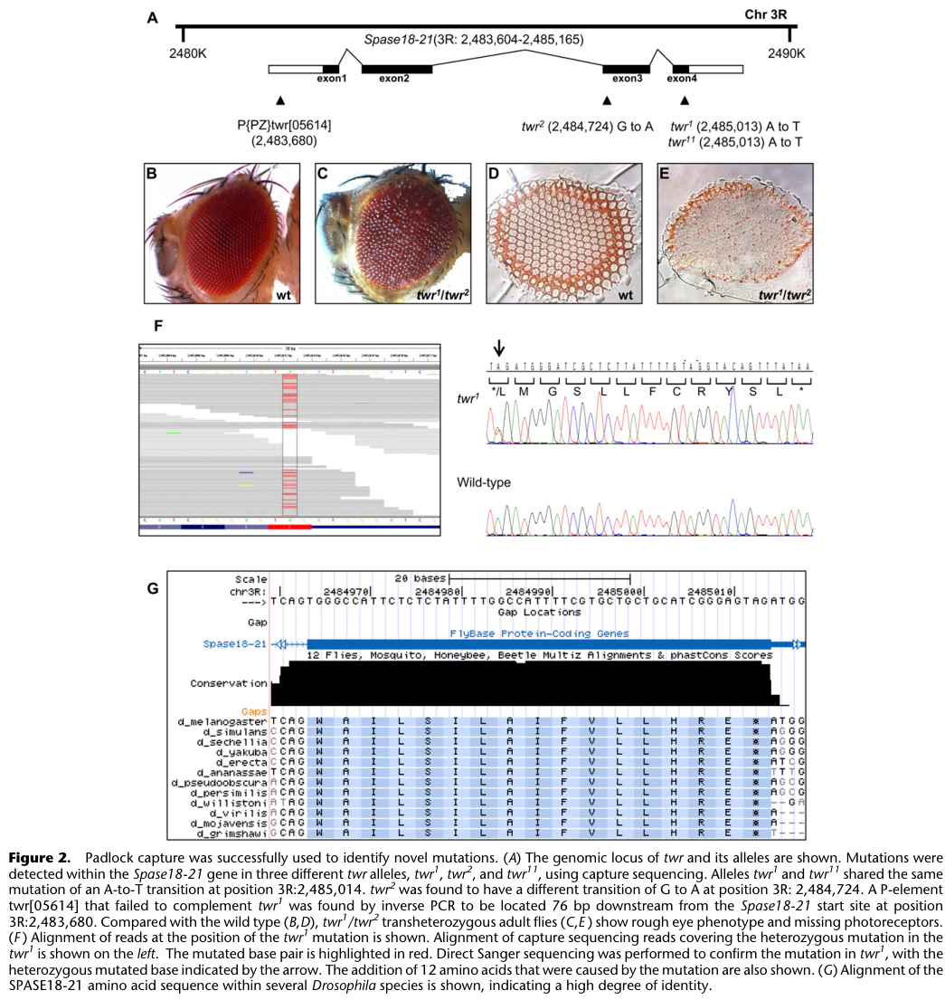

## Question

# Gene Research for Functional Annotation

## ⚠️ CRITICAL: Gene/Protein Identification Context

**BEFORE YOU BEGIN RESEARCH:** You MUST verify you are researching the CORRECT gene/protein. Gene symbols can be ambiguous, especially for less well-characterized genes from non-model organisms.

### Target Gene/Protein Identity (from UniProt):
- **UniProt Accession:** O97066
- **Protein Description:** RecName: Full=Signal peptidase complex catalytic subunit SEC11 {ECO:0000256|ARBA:ARBA00019685, ECO:0000256|RuleBase:RU362047}; EC=3.4.21.89 {ECO:0000256|ARBA:ARBA00013208, ECO:0000256|RuleBase:RU362047};
- **Gene Information:** Name=twr {ECO:0000313|EMBL:AAF54100.1, ECO:0000313|FlyBase:FBgn0262801}; Synonyms=AF160889 {ECO:0000313|EMBL:AAF54100.1}, BcDNA:GM04682 {ECO:0000313|EMBL:AAF54100.1}, BG:DS00004.11 {ECO:0000313|EMBL:AAF54100.1}, Dmel\CG2358 {ECO:0000313|EMBL:AAF54100.1}, EfW5 {ECO:0000313|EMBL:AAF54100.1}, l(3)05614 {ECO:0000313|EMBL:AAF54100.1}, l(3)84Aa {ECO:0000313|EMBL:AAF54100.1}, Ov15 {ECO:0000313|EMBL:AAF54100.1}, Spase18-21 {ECO:0000313|EMBL:AAF54100.1}, Spase18/21 {ECO:0000313|EMBL:AAF54100.1}; ORFNames=CG2358 {ECO:0000313|EMBL:AAF54100.1, ECO:0000313|FlyBase:FBgn0262801}, Dmel_CG2358 {ECO:0000313|EMBL:AAF54100.1};
- **Organism (full):** Drosophila melanogaster (Fruit fly).
- **Protein Family:** Belongs to the peptidase S26B family.
- **Key Domains:** LexA/Signal_pep-like_sf. (IPR036286); Pept_S26A_signal_pept_1_CS. (IPR019758); Pept_S26A_signal_pept_1_Ser-AS. (IPR019756); Peptidase_S24_S26A/B/C. (IPR015927); Peptidase_S26. (IPR019533)

### MANDATORY VERIFICATION STEPS:

1. **Check if the gene symbol "twr" matches the protein description above**
2. **Verify the organism is correct:** Drosophila melanogaster (Fruit fly).
3. **Check if protein family/domains align with what you find in literature**
4. **If you find literature for a DIFFERENT gene with the same or similar symbol, STOP**

### If Gene Symbol is Ambiguous or You Cannot Find Relevant Literature:

**DO NOT PROCEED WITH RESEARCH ON A DIFFERENT GENE.** Instead:
- State clearly: "The gene symbol 'twr' is ambiguous or literature is limited for this specific protein"
- Explain what you found (e.g., "Found extensive literature on a different gene with the same symbol in a different organism")
- Describe the protein based ONLY on the UniProt information provided above
- Suggest that the protein function can be inferred from domain/family information

### Research Target:

Please provide a comprehensive research report on the gene **twr** (gene ID: twr, UniProt: O97066) in DROME.

The research report should be a detailed narrative explaining the function, biological processes, and localization of the gene product. Citations should be given for all claims.

You should prioritize authoritative reviews and primary scientific literature when conducting research. You can supplement
this with annotations you find in gene/protein databases, but these can be outdated or inaccurate.

We are specifically interested in the primary function of the gene - for enzymes, what reaction is catalyzed, and what is the substrate specificity? For transporters, what is the substrate? For structural proteins or adapters, what is the broader structural role? For signaling molecules, what is the role in the pathway.

We are interested in where in or outside the cell the gene product carries out its function.

We are also interested in the signaling or biochemical pathways in which the gene functions. We are less interested in broad pleiotropic effects, except where these elucidate the precise role.

Include evidence where possible. We are interested in both experimental evidence as well as inference from structure, evolution, or bioinformatic analysis. Precise studies should be prioritized over high-throughput, where available.

## Output

Question: You are an expert researcher providing comprehensive, well-cited information.

Provide detailed information focusing on:
1. Key concepts and definitions with current understanding
2. Recent developments and latest research (prioritize 2023-2024 sources)
3. Current applications and real-world implementations
4. Expert opinions and analysis from authoritative sources
5. Relevant statistics and data from recent studies

Format as a comprehensive research report with proper citations. Include URLs and publication dates where available.
Always prioritize recent, authoritative sources and provide specific citations for all major claims.

# Gene Research for Functional Annotation

## ⚠️ CRITICAL: Gene/Protein Identification Context

**BEFORE YOU BEGIN RESEARCH:** You MUST verify you are researching the CORRECT gene/protein. Gene symbols can be ambiguous, especially for less well-characterized genes from non-model organisms.

### Target Gene/Protein Identity (from UniProt):
- **UniProt Accession:** O97066
- **Protein Description:** RecName: Full=Signal peptidase complex catalytic subunit SEC11 {ECO:0000256|ARBA:ARBA00019685, ECO:0000256|RuleBase:RU362047}; EC=3.4.21.89 {ECO:0000256|ARBA:ARBA00013208, ECO:0000256|RuleBase:RU362047};
- **Gene Information:** Name=twr {ECO:0000313|EMBL:AAF54100.1, ECO:0000313|FlyBase:FBgn0262801}; Synonyms=AF160889 {ECO:0000313|EMBL:AAF54100.1}, BcDNA:GM04682 {ECO:0000313|EMBL:AAF54100.1}, BG:DS00004.11 {ECO:0000313|EMBL:AAF54100.1}, Dmel\CG2358 {ECO:0000313|EMBL:AAF54100.1}, EfW5 {ECO:0000313|EMBL:AAF54100.1}, l(3)05614 {ECO:0000313|EMBL:AAF54100.1}, l(3)84Aa {ECO:0000313|EMBL:AAF54100.1}, Ov15 {ECO:0000313|EMBL:AAF54100.1}, Spase18-21 {ECO:0000313|EMBL:AAF54100.1}, Spase18/21 {ECO:0000313|EMBL:AAF54100.1}; ORFNames=CG2358 {ECO:0000313|EMBL:AAF54100.1, ECO:0000313|FlyBase:FBgn0262801}, Dmel_CG2358 {ECO:0000313|EMBL:AAF54100.1};
- **Organism (full):** Drosophila melanogaster (Fruit fly).
- **Protein Family:** Belongs to the peptidase S26B family.
- **Key Domains:** LexA/Signal_pep-like_sf. (IPR036286); Pept_S26A_signal_pept_1_CS. (IPR019758); Pept_S26A_signal_pept_1_Ser-AS. (IPR019756); Peptidase_S24_S26A/B/C. (IPR015927); Peptidase_S26. (IPR019533)

### MANDATORY VERIFICATION STEPS:

1. **Check if the gene symbol "twr" matches the protein description above**
2. **Verify the organism is correct:** Drosophila melanogaster (Fruit fly).
3. **Check if protein family/domains align with what you find in literature**
4. **If you find literature for a DIFFERENT gene with the same or similar symbol, STOP**

### If Gene Symbol is Ambiguous or You Cannot Find Relevant Literature:

**DO NOT PROCEED WITH RESEARCH ON A DIFFERENT GENE.** Instead:
- State clearly: "The gene symbol 'twr' is ambiguous or literature is limited for this specific protein"
- Explain what you found (e.g., "Found extensive literature on a different gene with the same symbol in a different organism")
- Describe the protein based ONLY on the UniProt information provided above
- Suggest that the protein function can be inferred from domain/family information

### Research Target:

Please provide a comprehensive research report on the gene **twr** (gene ID: twr, UniProt: O97066) in DROME.

The research report should be a detailed narrative explaining the function, biological processes, and localization of the gene product. Citations should be given for all claims.

You should prioritize authoritative reviews and primary scientific literature when conducting research. You can supplement
this with annotations you find in gene/protein databases, but these can be outdated or inaccurate.

We are specifically interested in the primary function of the gene - for enzymes, what reaction is catalyzed, and what is the substrate specificity? For transporters, what is the substrate? For structural proteins or adapters, what is the broader structural role? For signaling molecules, what is the role in the pathway.

We are interested in where in or outside the cell the gene product carries out its function.

We are also interested in the signaling or biochemical pathways in which the gene functions. We are less interested in broad pleiotropic effects, except where these elucidate the precise role.

Include evidence where possible. We are interested in both experimental evidence as well as inference from structure, evolution, or bioinformatic analysis. Precise studies should be prioritized over high-throughput, where available.

# Functional annotation of *twr* in *Drosophila melanogaster*

## Identity and evidence standard

**The target is *twr* (*tower*), CG2358, UniProt [O97066](https://www.uniprot.org/uniprotkb/O97066/entry), also called Spase18/21—not Spase12.** The supplied UniProt record describes a SEC11-like signal-peptidase catalytic subunit in the S26B peptidase family. Independent fly studies explicitly identify CG2358 as Spase18/21 and genetically identify *twr* as the Spase18-21 locus. Spase12 is a **different**, accessory signal-peptidase-complex (SPC) gene; its mutant phenotypes should not be attributed to *twr*. (wang2010rapididentificationof pages 4-5, gilbert2013drosophilasignalpeptidase pages 2-3, abrams2005crebaregulatessecretory pages 5-7, fox2015transcriptionalregulationof pages 11-13)

The strongest gene-specific identification comes from [Wang and colleagues, *Genome Research*, July 2010](https://doi.org/10.1101/gr.102921.109). They found lesions in Spase18-21 in three *twr* alleles: *twr¹* and *twr¹¹* share a stop-codon change that adds **12 amino acids** to TWR, whereas *twr²* disrupts an exon-3 splice acceptor. A fourth, noncomplementing P-element allele mapped near the gene; mobilization yielded wild-type revertants. Together, these provide substantially stronger locus identification than a name match alone. Figure 2 documents the alleles and associated eye phenotype. (wang2010rapididentificationof pages 4-5, wang2010rapididentificationof pages 5-6, wang2010rapididentificationof media 3880de16)

## Primary biochemical function and substrate specificity

**Best-supported primary function:** TWR/Spase18/21 is the fly **SEC11-family catalytic component of the ER signal peptidase complex**. The reaction is hydrolysis of a peptide bond at the end of a *cleavable signal peptide* as a newly synthesized secretory or membrane-protein precursor enters the endoplasmic reticulum (ER): precursor protein + H₂O → removed signal peptide + processed protein. This is a protein-biogenesis step, not a general extracellular protease activity or a specific signal-transduction reaction. The fly complex contains Spase18/21, Spase22/23, Spase25 and Spase12; Spase18/21 corresponds to yeast Sec11 and human SEC11A/SEC11C. (gilbert2013drosophilasignalpeptidase pages 1-2, gilbert2013drosophilasignalpeptidase pages 2-3, chung2024spc2modulatessubstrate pages 1-2)

There is **complex-level biochemical evidence in flies**: embryo-derived *Drosophila* microsomes cleave the signal peptide of a murine myeloma immunoglobulin light chain in an in-vitro translation assay. This demonstrates that fly ER membranes contain functional SPC activity, but it does **not** isolate TWR or assign a measured cleavage rate or individual substrate to TWR specifically. The catalytic-subunit assignment rests principally on SEC11 homology, SPC organization and the *twr* genetic identification. (gilbert2013drosophilasignalpeptidase pages 2-3, wang2010rapididentificationof pages 4-5)

Substrates are expected to be **ER-directed precursor proteins bearing accessible, cleavable signal sequences**, rather than every membrane-spanning helix. Such signals have an amino-terminal *n-region*, a hydrophobic *h-region* and a more polar cleavage-site *c-region*. Comparative SPC studies favor small, uncharged residues at positions **−3 and −1** relative to the scissile bond; signal anchors are ordinarily retained rather than cleaved. These are well-established general selection principles, **not an experimentally measured *Drosophila twr* substrate catalogue or a universal sequence consensus**. (chung2024spc2modulatessubstrate pages 1-2, liaci2021structureofthe pages 1-3)

Human SPC cryo-EM and mechanistic analysis support a **Ser–His–Asp catalytic triad** in the SEC11 paralogs and a membrane-associated substrate-entry window that locally thins the bilayer. The luminal SPC22/23 domain helps stabilize the catalytic core. These results make a corresponding mechanism plausible for TWR, but the exact TWR active-site residues and their individual contributions have **not** been established by the retrieved fly-specific experiments; human residue numbers must not be assigned to the fly protein without sequence mapping. (liaci2021structureofthe pages 8-10)

## Cellular location and pathway

**Most likely site of action:** the **ER membrane, with cleavage at its luminal interface**. This follows from TWR’s identity as the fly Sec11 ortholog, the ER-microsome cleavage assay and the established orientation of the conserved SPC catalytic machinery. It should be recorded as a **strong homology- and complex-supported localization**, rather than as direct imaging of tagged endogenous TWR. The mature cargo can subsequently traffic through the secretory pathway; TWR itself is not thereby shown to reside at the cell surface or at the cargo’s final destination. (gilbert2013drosophilasignalpeptidase pages 1-2, gilbert2013drosophilasignalpeptidase pages 2-3, chung2024spc2modulatessubstrate pages 1-2, liaci2021structureofthe pages 8-10)

The relevant biochemical pathway is **ER entry and maturation of secretory and selected membrane proteins**: targeting and translocation bring the precursor to the ER, SPC removes an appropriate signal peptide, and the processed protein proceeds toward folding and sorting. Thus TWR could influence many downstream secreted factors or receptors **indirectly**, but the retrieved *twr*-specific work does not establish that it cleaves a particular fly signaling ligand or receptor, or acts as a dedicated component of a named signaling cascade. (gilbert2013drosophilasignalpeptidase pages 1-2, gilbert2013drosophilasignalpeptidase pages 2-3, chung2024spc2modulatessubstrate pages 1-2)

There is a more specific **regulatory connection** to the fly secretory-capacity program. [Abrams and Andrew, *Development*, June 2005](https://doi.org/10.1242/dev.01863), catalogued CG2358 among the SPC genes expressed in secretory tissues and examined their regulation by CrebA. A subsequent [review by Fox and Andrew, *Frontiers in Biology*, 2015](https://doi.org/10.1007/s11515-014-1338-7) tabulates *twr/CG2358* expression as **2.3-fold lower in CrebA-null material** and CrebA-dependent by in-situ analysis. This supports transcriptional coordination with secretory machinery; it does not show that CrebA changes TWR’s catalytic specificity or prove direct binding to the *twr* promoter. (abrams2005crebaregulatessecretory pages 5-7, fox2015transcriptionalregulationof pages 11-13, abrams2005crebaregulatessecretory pages 10-11)

## Organismal evidence and recent developments

The clearly documented *twr*-specific phenotype is developmental: Wang and colleagues reported **homozygous lethality** among the examined mutant alleles and **rough, disorganized eyes with missing or degenerative photoreceptors** in *twr¹/twr²* transheterozygotes. These observations demonstrate biological importance, but do not identify which uncleaved client causes the eye defect. In particular, the extensive differentiation and melanotic-mass phenotypes reported in the **2013 Spase12 study concern Spase12, not TWR**. (wang2010rapididentificationof pages 4-5, wang2010rapididentificationof pages 5-6, wang2010rapididentificationof media 3880de16, gilbert2013drosophilasignalpeptidase pages 1-2)

Among the relevant **2023–2024** literature retrieved, the strongest direct mechanistic advance is [Chung and colleagues, *Journal of Cell Biology*, November 2024](https://doi.org/10.1083/jcb.202211035): in **yeast**, perturbing accessory subunit Spc2 changed discrimination among signal sequences and selection of cleavage sites; membrane simulations implicated altered thinning near the SPC substrate-entry window. This refines the interpretation of SPC substrate specificity as a property of the **assembled complex**, rather than of SEC11 alone. It does **not** test fly TWR or establish the same quantitative preferences in flies. No retrieved 2023–2024 study directly measures purified TWR activity, maps its endogenous ER localization, or identifies its native fly substrates. (chung2024spc2modulatessubstrate pages 1-2, chung2024spc2modulatessubstrate pages 7-8)

In practice, *twr* mutants provide a **fly genetic model for studying the consequences of impaired ER signal-peptide processing**; the documented readouts are viability and eye organization. Conserved SPC structures and yeast substrate assays provide testable hypotheses for fly work, not evidence of a TWR-specific therapeutic or industrial implementation. A priority for more precise annotation would be a TWR-dependent cleavage assay, coupled to substrate identification and endogenous localization. (wang2010rapididentificationof pages 4-5, gilbert2013drosophilasignalpeptidase pages 2-3, chung2024spc2modulatessubstrate pages 1-2, liaci2021structureofthe pages 8-10)

The evidence tiers underlying this annotation are summarized below.

| Finding | Supporting study | Evidence tier | Key limitation |
|---|---|---|---|
| **Gene identity:** *twr* is *Spase18-21/CG2358*. Mutations were found in *twr¹*, *twr²*, and *twr¹¹*. The noncomplementing P-element allele *twr⁰⁵⁶¹⁴* mapped near the gene and reverted after mobilization. The *twr¹/twr¹¹* stop-codon mutation extends TWR by 12 residues. | Wang et al., 2010, [Genome Research](https://doi.org/10.1101/gr.102921.109) (wang2010rapididentificationof pages 2-4, wang2010rapididentificationof pages 4-5, wang2010rapididentificationof pages 5-6) | **Direct, gene-specific Drosophila genetics** | Establishes locus identity and functional importance, but not purified-protein catalysis or localization. |
| **SPC activity in flies:** Microsomes isolated from *Drosophila* embryos cleaved the signal peptide of murine myeloma light-chain IgG in vitro. | Gilbert et al., 2013, [PLOS ONE](https://doi.org/10.1371/journal.pone.0060908), citing the original microsome study (gilbert2013drosophilasignalpeptidase pages 2-3) | **Direct Drosophila biochemical evidence at complex level** | The assay tested the intact microsomal SPC, not isolated TWR/Spase18/21, and did not determine TWR-specific kinetics or substrate range. |
| **Transcriptional regulation:** *twr/CG2358* expression decreased **2.3-fold** in *CrebA*-null material and was classified as CrebA-dependent using in-situ evidence. | Fox and Andrew, 2015, [Frontiers in Biology](https://doi.org/10.1007/s11515-014-1338-7) (fox2015transcriptionalregulationof pages 11-13) | **Fly-specific expression evidence** | Supports regulation within the secretory-capacity program, but not direct CrebA binding at the *twr* promoter or a TWR-specific signaling output. |
| **Catalytic mechanism and specificity:** Homologous SEC11 is an ER-membrane protease with a lumen-facing active site. Human structures identify a Ser–His–Asp catalytic triad and membrane-thinning window favoring short signal-peptide hydrophobic regions; cleavage sites favor small neutral residues at −1 and −3. Yeast Spc2 also tunes substrate and cleavage-site selection. | Liaci et al., 2021, [Molecular Cell](https://doi.org/10.1016/j.molcel.2021.07.031); Chung et al., 2024, [Journal of Cell Biology](https://doi.org/10.1083/jcb.202211035) (liaci2021structureofthe pages 8-10, liaci2021structureofthe pages 1-3, chung2024spc2modulatessubstrate pages 7-8, chung2024spc2modulatessubstrate pages 1-2) | **Strong homolog-based structural and mechanistic inference** | No fly-specific active-site mutagenesis, purified TWR cleavage assay, or experimental TWR localization was found; exact *Drosophila* substrate preferences remain unmeasured. |
| **Organismal phenotype:** *twr¹/twr²* transheterozygotes had rough, disorganized adult eyes and missing or degenerative photoreceptors; *twr* mutant alleles were reported as homozygous lethal. | Wang et al., 2010, [Genome Research](https://doi.org/10.1101/gr.102921.109) (wang2010rapididentificationof pages 4-5, wang2010rapididentificationof pages 5-6, wang2010rapididentificationof media 3880de16) | **Direct, gene-specific Drosophila phenotype** | Demonstrates a developmental requirement but does not identify the affected client proteins or prove involvement in a specific signaling pathway. |

*Table: Evidence-tier summary separating direct fly-specific findings for twr/CG2358 from mechanisms inferred using conserved human and yeast signal-peptidase complexes. It highlights the absence of a purified TWR catalytic assay or experimentally verified TWR localization.*

References

1. (wang2010rapididentificationof pages 4-5): Hui Wang, Abanti Chattopadhyay, Zhe Li, Bryce Daines, Yumei Li, Chunxu Gao, Richard Gibbs, Kun Zhang, and Rui Chen. Rapid identification of heterozygous mutations in drosophila melanogaster using genomic capture sequencing. Genome research, 20 7:981-8, Jul 2010. URL: https://doi.org/10.1101/gr.102921.109, doi:10.1101/gr.102921.109. This article has 34 citations and is from a highest quality peer-reviewed journal.

2. (gilbert2013drosophilasignalpeptidase pages 2-3): Erin Haase Gilbert, Su-Jin Kwak, Rui Chen, and Graeme Mardon. Drosophila signal peptidase complex member spase12 is required for development and cell differentiation. PLoS ONE, 8:e60908, Apr 2013. URL: https://doi.org/10.1371/journal.pone.0060908, doi:10.1371/journal.pone.0060908. This article has 23 citations and is from a peer-reviewed journal.

3. (abrams2005crebaregulatessecretory pages 5-7): Elliott W. Abrams and Deborah J. Andrew. Creba regulates secretory activity in the drosophila salivary gland and epidermis. Development, 132:2743-2758, Jun 2005. URL: https://doi.org/10.1242/dev.01863, doi:10.1242/dev.01863. This article has 124 citations and is from a domain leading peer-reviewed journal.

4. (fox2015transcriptionalregulationof pages 11-13): Rebecca M. Fox and Deborah J. Andrew. Transcriptional regulation of secretory capacity by bzip transcription factors. Frontiers in Biology, 10:28-51, Nov 2015. URL: https://doi.org/10.1007/s11515-014-1338-7, doi:10.1007/s11515-014-1338-7. This article has 49 citations.

5. (wang2010rapididentificationof pages 5-6): Hui Wang, Abanti Chattopadhyay, Zhe Li, Bryce Daines, Yumei Li, Chunxu Gao, Richard Gibbs, Kun Zhang, and Rui Chen. Rapid identification of heterozygous mutations in drosophila melanogaster using genomic capture sequencing. Genome research, 20 7:981-8, Jul 2010. URL: https://doi.org/10.1101/gr.102921.109, doi:10.1101/gr.102921.109. This article has 34 citations and is from a highest quality peer-reviewed journal.

6. (wang2010rapididentificationof media 3880de16): Hui Wang, Abanti Chattopadhyay, Zhe Li, Bryce Daines, Yumei Li, Chunxu Gao, Richard Gibbs, Kun Zhang, and Rui Chen. Rapid identification of heterozygous mutations in drosophila melanogaster using genomic capture sequencing. Genome research, 20 7:981-8, Jul 2010. URL: https://doi.org/10.1101/gr.102921.109, doi:10.1101/gr.102921.109. This article has 34 citations and is from a highest quality peer-reviewed journal.

7. (gilbert2013drosophilasignalpeptidase pages 1-2): Erin Haase Gilbert, Su-Jin Kwak, Rui Chen, and Graeme Mardon. Drosophila signal peptidase complex member spase12 is required for development and cell differentiation. PLoS ONE, 8:e60908, Apr 2013. URL: https://doi.org/10.1371/journal.pone.0060908, doi:10.1371/journal.pone.0060908. This article has 23 citations and is from a peer-reviewed journal.

8. (chung2024spc2modulatessubstrate pages 1-2): Yeonji Chung, Chewon Yim, Gilberto P. Pereira, Sungjoon Son, Lisbeth R. Kjølbye, Lauren E. Mazurkiewicz, Amy M. Weeks, Friedrich Förster, Gunnar von Heijne, Paulo C.T. Souza, and Hyun Kim. Spc2 modulates substrate- and cleavage site-selection in the yeast signal peptidase complex. Journal of Cell Biology, Nov 2024. URL: https://doi.org/10.1083/jcb.202211035, doi:10.1083/jcb.202211035. This article has 8 citations and is from a highest quality peer-reviewed journal.

9. (liaci2021structureofthe pages 1-3): A. Manuel Liaci, Barbara Steigenberger, Sem Tamara, Paulo Cesar Telles de Souza, Mariska Gröllers-Mulderij, Patrick Ogrissek, Siewert Jan Marrink, Richard Scheltema, and Friedrich Förster. Structure of the human signal peptidase complex reveals the determinants for signal peptide cleavage. SSRN Electronic Journal, Jan 2021. URL: https://doi.org/10.2139/ssrn.3778304, doi:10.2139/ssrn.3778304. This article has 163 citations.

10. (liaci2021structureofthe pages 8-10): A. Manuel Liaci, Barbara Steigenberger, Sem Tamara, Paulo Cesar Telles de Souza, Mariska Gröllers-Mulderij, Patrick Ogrissek, Siewert Jan Marrink, Richard Scheltema, and Friedrich Förster. Structure of the human signal peptidase complex reveals the determinants for signal peptide cleavage. SSRN Electronic Journal, Jan 2021. URL: https://doi.org/10.2139/ssrn.3778304, doi:10.2139/ssrn.3778304. This article has 163 citations.

11. (abrams2005crebaregulatessecretory pages 10-11): Elliott W. Abrams and Deborah J. Andrew. Creba regulates secretory activity in the drosophila salivary gland and epidermis. Development, 132:2743-2758, Jun 2005. URL: https://doi.org/10.1242/dev.01863, doi:10.1242/dev.01863. This article has 124 citations and is from a domain leading peer-reviewed journal.

12. (chung2024spc2modulatessubstrate pages 7-8): Yeonji Chung, Chewon Yim, Gilberto P. Pereira, Sungjoon Son, Lisbeth R. Kjølbye, Lauren E. Mazurkiewicz, Amy M. Weeks, Friedrich Förster, Gunnar von Heijne, Paulo C.T. Souza, and Hyun Kim. Spc2 modulates substrate- and cleavage site-selection in the yeast signal peptidase complex. Journal of Cell Biology, Nov 2024. URL: https://doi.org/10.1083/jcb.202211035, doi:10.1083/jcb.202211035. This article has 8 citations and is from a highest quality peer-reviewed journal.

13. (wang2010rapididentificationof pages 2-4): Hui Wang, Abanti Chattopadhyay, Zhe Li, Bryce Daines, Yumei Li, Chunxu Gao, Richard Gibbs, Kun Zhang, and Rui Chen. Rapid identification of heterozygous mutations in drosophila melanogaster using genomic capture sequencing. Genome research, 20 7:981-8, Jul 2010. URL: https://doi.org/10.1101/gr.102921.109, doi:10.1101/gr.102921.109. This article has 34 citations and is from a highest quality peer-reviewed journal.

## Artifacts

- [Edison artifact artifact-00](twr-deep-research-falcon_artifacts/artifact-00.md)

## Citations

1. liaci2021structureofthe pages 8-10
2. gilbert2013drosophilasignalpeptidase pages 2-3
3. fox2015transcriptionalregulationof pages 11-13
4. wang2010rapididentificationof pages 4-5
5. abrams2005crebaregulatessecretory pages 5-7
6. wang2010rapididentificationof pages 5-6
7. gilbert2013drosophilasignalpeptidase pages 1-2
8. liaci2021structureofthe pages 1-3
9. abrams2005crebaregulatessecretory pages 10-11
10. wang2010rapididentificationof pages 2-4
11. O97066
12. Wang and colleagues, *Genome Research*, July 2010
13. Abrams and Andrew, *Development*, June 2005
14. review by Fox and Andrew, *Frontiers in Biology*, 2015
15. Chung and colleagues, *Journal of Cell Biology*, November 2024
16. Genome Research
17. PLOS ONE
18. Frontiers in Biology
19. Molecular Cell
20. Journal of Cell Biology
21. https://www.uniprot.org/uniprotkb/O97066/entry
22. https://doi.org/10.1101/gr.102921.109
23. https://doi.org/10.1242/dev.01863
24. https://doi.org/10.1007/s11515-014-1338-7
25. https://doi.org/10.1083/jcb.202211035
26. https://doi.org/10.1371/journal.pone.0060908
27. https://doi.org/10.1016/j.molcel.2021.07.031
28. https://doi.org/10.1101/gr.102921.109,
29. https://doi.org/10.1371/journal.pone.0060908,
30. https://doi.org/10.1242/dev.01863,
31. https://doi.org/10.1007/s11515-014-1338-7,
32. https://doi.org/10.1083/jcb.202211035,
33. https://doi.org/10.2139/ssrn.3778304,