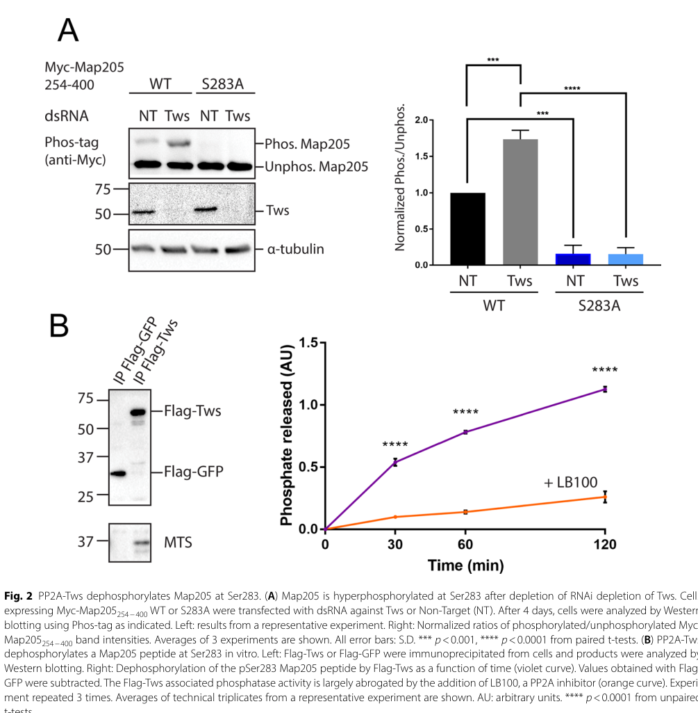

## Question

# Gene Research for Functional Annotation

## ⚠️ CRITICAL: Gene/Protein Identification Context

**BEFORE YOU BEGIN RESEARCH:** You MUST verify you are researching the CORRECT gene/protein. Gene symbols can be ambiguous, especially for less well-characterized genes from non-model organisms.

### Target Gene/Protein Identity (from UniProt):
- **UniProt Accession:** P36872
- **Protein Description:** RecName: Full=Protein phosphatase PP2A 55 kDa regulatory subunit; Short=PR55; AltName: Full=Protein phosphatase PP2A regulatory subunit B; AltName: Full=Protein twins;
- **Gene Information:** Name=tws; Synonyms=aar, Pp2A-85F; ORFNames=CG6235;
- **Organism (full):** Drosophila melanogaster (Fruit fly).
- **Protein Family:** Belongs to the phosphatase 2A regulatory subunit B family.
- **Key Domains:** PP2A_PR55. (IPR000009); PP2A_PR55_CS. (IPR018067); WD40/YVTN_repeat-like_dom_sf. (IPR015943); WD40_repeat_dom_sf. (IPR036322); WD40_rpt. (IPR001680)

### MANDATORY VERIFICATION STEPS:

1. **Check if the gene symbol "tws" matches the protein description above**
2. **Verify the organism is correct:** Drosophila melanogaster (Fruit fly).
3. **Check if protein family/domains align with what you find in literature**
4. **If you find literature for a DIFFERENT gene with the same or similar symbol, STOP**

### If Gene Symbol is Ambiguous or You Cannot Find Relevant Literature:

**DO NOT PROCEED WITH RESEARCH ON A DIFFERENT GENE.** Instead:
- State clearly: "The gene symbol 'tws' is ambiguous or literature is limited for this specific protein"
- Explain what you found (e.g., "Found extensive literature on a different gene with the same symbol in a different organism")
- Describe the protein based ONLY on the UniProt information provided above
- Suggest that the protein function can be inferred from domain/family information

### Research Target:

Please provide a comprehensive research report on the gene **tws** (gene ID: tws, UniProt: P36872) in DROME.

The research report should be a detailed narrative explaining the function, biological processes, and localization of the gene product. Citations should be given for all claims.

You should prioritize authoritative reviews and primary scientific literature when conducting research. You can supplement
this with annotations you find in gene/protein databases, but these can be outdated or inaccurate.

We are specifically interested in the primary function of the gene - for enzymes, what reaction is catalyzed, and what is the substrate specificity? For transporters, what is the substrate? For structural proteins or adapters, what is the broader structural role? For signaling molecules, what is the role in the pathway.

We are interested in where in or outside the cell the gene product carries out its function.

We are also interested in the signaling or biochemical pathways in which the gene functions. We are less interested in broad pleiotropic effects, except where these elucidate the precise role.

Include evidence where possible. We are interested in both experimental evidence as well as inference from structure, evolution, or bioinformatic analysis. Precise studies should be prioritized over high-throughput, where available.

## Output

Question: You are an expert researcher providing comprehensive, well-cited information.

Provide detailed information focusing on:
1. Key concepts and definitions with current understanding
2. Recent developments and latest research (prioritize 2023-2024 sources)
3. Current applications and real-world implementations
4. Expert opinions and analysis from authoritative sources
5. Relevant statistics and data from recent studies

Format as a comprehensive research report with proper citations. Include URLs and publication dates where available.
Always prioritize recent, authoritative sources and provide specific citations for all major claims.

# Gene Research for Functional Annotation

## ⚠️ CRITICAL: Gene/Protein Identification Context

**BEFORE YOU BEGIN RESEARCH:** You MUST verify you are researching the CORRECT gene/protein. Gene symbols can be ambiguous, especially for less well-characterized genes from non-model organisms.

### Target Gene/Protein Identity (from UniProt):
- **UniProt Accession:** P36872
- **Protein Description:** RecName: Full=Protein phosphatase PP2A 55 kDa regulatory subunit; Short=PR55; AltName: Full=Protein phosphatase PP2A regulatory subunit B; AltName: Full=Protein twins;
- **Gene Information:** Name=tws; Synonyms=aar, Pp2A-85F; ORFNames=CG6235;
- **Organism (full):** Drosophila melanogaster (Fruit fly).
- **Protein Family:** Belongs to the phosphatase 2A regulatory subunit B family.
- **Key Domains:** PP2A_PR55. (IPR000009); PP2A_PR55_CS. (IPR018067); WD40/YVTN_repeat-like_dom_sf. (IPR015943); WD40_repeat_dom_sf. (IPR036322); WD40_rpt. (IPR001680)

### MANDATORY VERIFICATION STEPS:

1. **Check if the gene symbol "tws" matches the protein description above**
2. **Verify the organism is correct:** Drosophila melanogaster (Fruit fly).
3. **Check if protein family/domains align with what you find in literature**
4. **If you find literature for a DIFFERENT gene with the same or similar symbol, STOP**

### If Gene Symbol is Ambiguous or You Cannot Find Relevant Literature:

**DO NOT PROCEED WITH RESEARCH ON A DIFFERENT GENE.** Instead:
- State clearly: "The gene symbol 'tws' is ambiguous or literature is limited for this specific protein"
- Explain what you found (e.g., "Found extensive literature on a different gene with the same symbol in a different organism")
- Describe the protein based ONLY on the UniProt information provided above
- Suggest that the protein function can be inferred from domain/family information

### Research Target:

Please provide a comprehensive research report on the gene **tws** (gene ID: tws, UniProt: P36872) in DROME.

The research report should be a detailed narrative explaining the function, biological processes, and localization of the gene product. Citations should be given for all claims.

You should prioritize authoritative reviews and primary scientific literature when conducting research. You can supplement
this with annotations you find in gene/protein databases, but these can be outdated or inaccurate.

We are specifically interested in the primary function of the gene - for enzymes, what reaction is catalyzed, and what is the substrate specificity? For transporters, what is the substrate? For structural proteins or adapters, what is the broader structural role? For signaling molecules, what is the role in the pathway.

We are interested in where in or outside the cell the gene product carries out its function.

We are also interested in the signaling or biochemical pathways in which the gene functions. We are less interested in broad pleiotropic effects, except where these elucidate the precise role.

Include evidence where possible. We are interested in both experimental evidence as well as inference from structure, evolution, or bioinformatic analysis. Precise studies should be prioritized over high-throughput, where available.

# Functional annotation report: *Drosophila melanogaster twins* (*tws*; UniProt P36872)

## Identity and principal function

The target is **Twins (Tws)**, the *D. melanogaster* protein phosphatase 2A (PP2A) **B55/PR55 regulatory subunit**, encoded by *tws* (also called *aar* or *Pp2A-85F*; CG6235). Fly studies explicitly identify *twins* as the B55 gene; this agrees with the supplied UniProt PP2A_PR55 and WD40-repeat annotations. Tws is distinct from the PP2A catalytic protein **Microtubule star (Mts)**, the scaffold **PP2A-29B**, the B56-family regulators **Wrd/Wdb**, and the unrelated Cdc25 protein **Twine**. Drosophila has one B55 gene. (moazzen2009nonrequirementofa pages 19-23, wehbe2019identificationandcharacterization pages 87-90, merigliano2017arolefor pages 1-2, emondfraser2023identificationofpp2ab55 pages 3-4, ogawa2009proteinphosphatase2a pages 2-3)

**Primary molecular role:** Tws selects and helps target phosphoprotein substrates for a PP2A holoenzyme assembled from Tws, the PP2A-29B scaffold, and catalytic Mts. The reaction—performed by **Mts, not isolated Tws**—is hydrolysis of a protein phosphoserine or phosphothreonine ester, yielding the dephosphorylated protein and inorganic phosphate. The WD40-containing B55 architecture provides a basis for regulatory-subunit recognition and positioning of substrates. This is principally a **cell-internal dephosphorylation and cell-cycle-signaling function**, not an extracellular activity. Association of Tws with both core subunits has been demonstrated by affinity purification of functional tagged Tws from early embryos. (moazzen2009nonrequirementofa pages 19-23, guelle2024pp2atwsdephosphorylatesmap205 pages 1-3, williams2014greatwallphosphorylatedendosulfineis pages 1-2, emondfraser2023identificationofpp2ab55 pages 4-5)

Substrate selection is **biased toward mitotic cyclin-dependent-kinase (CDK) phosphosites**, often serine/threonine followed by proline, but is not restricted to a single protein or site. Tws-depletion phosphoproteomics found enrichment of proline-adjacent hyperphosphorylated sites. Direct substrate evidence is strongest for Map205 Ser283; Otefin Ser50/Ser54 has convergent phosphorylation, interaction, and functional-mutant evidence. Crucially, a phosphorylation change after *tws* knockdown alone does **not** establish direct enzymatic action. (guelle2024pp2atwsdephosphorylatesmap205 pages 1-3, guelle2024pp2atwsdephosphorylatesmap205 pages 3-6, emondfraser2023identificationofpp2ab55 pages 7-8, emondfraser2023identificationofpp2ab55 pages 4-5)

The following evidence-ranked summary distinguishes demonstrated PP2A-Tws reactions from pathway-level inferences.

| Substrate/pathway | Direct evidence and quantitative result | Biological compartment/outcome | Confidence/caveat |
|---|---|---|---|
| **Map205 Ser283 — Polo/cytokinesis** | Tws depletion produced an approximately **2-fold increase** in Map205-pSer283. Immunoprecipitated Flag-Tws co-purified catalytic **Mts** and dephosphorylated a pSer283 peptide in vitro; activity was largely blocked by LB100. Three experiments; cellular Phos-tag result *p* < 0.001–0.0001 and peptide assay *p* < 0.0001. Guelle *et al.*, published **December 2024**, [DOI](https://doi.org/10.1186/s13008-024-00141-x). (guelle2024pp2atwsdephosphorylatesmap205 pages 3-6, guelle2024pp2atwsdephosphorylatesmap205 pages 1-3, guelle2024pp2atwsdephosphorylatesmap205 media 918181cc) | Dephosphorylation at mitotic exit restores Map205-dependent recruitment of Polo to **central-spindle microtubules**, supporting spindle organization, cytokinesis and timely abscission. | **High/direct holoenzyme evidence.** Tws is the targeting B55 subunit; catalytic chemistry is performed by Mts in the PP2A-A–Mts–Tws holoenzyme—not by isolated Tws. |
| **Otefin/Emerin Ser50 and Ser54 — nuclear-envelope reassembly** | Quadruplicate Tws-RNAi phosphoproteomics detected hyperphosphorylated CDK-motif peptides at Ser50/Ser54; Tws loss disrupted Otefin–BAF association. Phosphomimetic and nonphosphorylatable mutants altered interactions with BAF/lamin and recruitment timing. Emond-Fraser *et al.*, published **July 2023**, [DOI](https://doi.org/10.1098/rsob.230104). (emondfraser2023identificationofpp2ab55 pages 3-4, emondfraser2023identificationofpp2ab55 pages 7-8, emondfraser2023identificationofpp2ab55 pages 4-5, emondfraser2023identificationofpp2ab55 pages 9-11) | Dephosphorylation promotes Otefin–BAF–lamin complex formation and Otefin recruitment to **reassembling nuclei/inner nuclear envelope** during telophase; phosphomimetic Otefin delays reassembly and reduces embryonic hatching. | **Moderate-to-high, convergent cellular evidence.** Strong Tws dependence and functional phosphosite evidence, but the study did **not** demonstrate dephosphorylation of purified Otefin by a purified PP2A-Tws holoenzyme. |
| **Greatwall-phosphorylated Endosulfine Ser68 — mitotic switch** | Purified PP2A-B55 heterotrimers dephosphorylated pEndos. pEndos had **Kₘ ≈ 0.4–1.7 nM** and **kcat ≈ 0.005–0.066 s⁻¹**, versus CDK substrate Kₘ **71–99 µM** and kcat **21–25 s⁻¹**. Thiophosphorylated Endos inhibited PP2A-B55 with IC₅₀ **197 ± 14 pM**, approximately 3,000-fold more potently than unphosphorylated Endos. Williams *et al.*, published **11 March 2014**, [DOI](https://doi.org/10.7554/eLife.01695). (williams2014greatwallphosphorylatedendosulfineis pages 1-2, williams2014greatwallphosphorylatedendosulfineis pages 9-12, williams2014greatwallphosphorylatedendosulfineis pages 13-15, williams2014greatwallphosphorylatedendosulfineis pages 12-13) | In the **cytoplasmic mitotic control system**, Greatwall-generated pEndos tightly occupies PP2A-B55 and is dephosphorylated slowly—“unfair competition.” When Greatwall shuts off, pEndos clearance reactivates PP2A-B55 for mitotic exit. | **High for the conserved B55 mechanism; qualified for P36872.** Kinetics came from purified B55 heterotrimers and Drosophila Endos reagents, not an unequivocally purified native fly PP2A-Tws complex. |
| **Wingless/Wnt → Shaggy/GSK3 → Armadillo** | tws mutant clones cell-autonomously reduced cytoplasmic Armadillo and Wg targets. Dominant-negative Sgg rescued tws phenotypes; Dsh overexpression did not. Sgg-driven wing-to-notum transformation increased from **30% to 87%** in *tws* heterozygotes, whereas degradation-resistant ArmS10 bypassed tws dependence. Bajpai *et al.*, published **March 2004**, [DOI](https://doi.org/10.1242/dev.00980). (bajpai2004drosophilatwinsregulates pages 1-2, bajpai2004drosophilatwinsregulates pages 5-6, bajpai2004drosophilatwinsregulates pages 4-5) | Acts in **wing-imaginal-disc cells**, genetically downstream of Dishevelled and upstream of Sgg/Armadillo stabilization, enabling Wg-responsive transcription and normal wing patterning. | **Moderate/genetic and indirect.** Evidence supports Tws-dependent inhibition of Sgg or the destruction complex; it does not establish Armadillo, Sgg or proposed Axin as a direct PP2A-Tws substrate. |
| **DNA-damage response — γ-H2Av and Ku70** | After irradiation, Tws accumulated almost exclusively in nuclei at **2 h**, formed foci overlapping nearly all γ-H2Av foci, and returned to the cytoplasm by **6 h**. *tws* mutants retained γ-H2Av foci and failed to initiate the G2/M checkpoint. Unirradiated *tws* brains had **38.2%** cells with chromosome aberrations and **1.017 aberrations/cell**, versus **0.4%** and **0.004/cell** in wild type; *tws ku70* double mutants fell to **0.3%** and **0.003/cell**. Merigliano *et al.*, published **March 2017**, [DOI](https://doi.org/10.1534/genetics.116.192781). (merigliano2017arolefor pages 10-11, merigliano2017arolefor pages 8-10, merigliano2017arolefor pages 6-8) | Damage-responsive Tws localization occurs in **larval-brain nuclei and γ-H2Av foci**; PP2A-Tws supports γ-H2Av-focus resolution, G2/M checkpoint signaling and chromosome integrity. | **High for phenotype/localization; low-to-moderate for substrate assignment.** Ku70 suppression is genetic; direct Ku70 dephosphorylation by PP2A-Tws was proposed but not biochemically shown. γ-H2Av loss may reflect direct dephosphorylation and/or repair-focus resolution. |
| **BAF Thr4/Ser5 — revised nuclear-reassembly assignment** | New work showed that Ankle2 binds the PP2A-29B/Mts core through its ankyrin domain and competes with Tws for the regulatory-subunit position. Ankle2 depletion hyperphosphorylated BAF Thr4/Ser5. Li *et al.*, published **February 2025**, [DOI](https://doi.org/10.7554/eLife.104233.3). (li2025mechanismsofpp2aankle2 pages 16-17, li2025mechanismsofpp2aankle2 pages 4-5, li2025mechanismsofpp2aankle2 pages 5-7) | PP2A–Ankle2 promotes BAF dephosphorylation and recruitment to **telophase chromosomes/reassembling nuclear envelope**. | **High evidence for Ankle2 as an alternative PP2A regulatory subunit.** BAF should no longer be assigned solely to PP2A-Tws: older Tws-associated assays support possible activity, but the current model identifies mutually exclusive PP2A–Ankle2 and PP2A–Tws complexes. |

*Table: Evidence-ranked substrates and pathways for Drosophila Twins/PP2A-B55, separating direct holoenzyme biochemistry from genetic or pathway-level inference. Caveats prevent confusion of Tws with catalytic Mts, B56-family subunits, or the alternative PP2A regulator Ankle2.*

## Biochemical control and experimentally resolved substrates

**Greatwall–Endosulfine switch.** At mitotic entry, cyclin B–CDK1 activates Greatwall (Gwl), which phosphorylates Endosulfine (Endos). Phosphorylated Endos occupies and inhibits PP2A-B55/Tws, protecting mitotic CDK phosphosites from premature removal. When Gwl activity falls at mitotic exit, PP2A-B55 slowly dephosphorylates its tightly bound inhibitor, permitting dephosphorylation of other substrates. This mechanism is termed **“inhibition by unfair competition.”** Fly embryo genetics independently demonstrate antagonism between Gwl and PP2A-Tws during mitosis and meiosis. (emondfraser2023identificationofpp2ab55 pages 3-4, williams2014greatwallphosphorylatedendosulfineis pages 1-2, wang2011pp2atwinsisantagonized pages 1-2)

In purified PP2A-B55 assays, phosphorylated Endos had a **Kₘ of approximately 0.4–1.7 nM** and **kcat of approximately 0.005–0.066 s⁻¹**, compared with **Kₘ 71–99 µM** and **kcat 21–25 s⁻¹** for a representative CDK-phosphorylated substrate. Thus, Endos binds exceptionally tightly but is processed slowly; these are measurements on purified B55-containing heterotrimers, **not kinetic constants measured specifically for native fly Tws**. The study examined the Drosophila Endos Ser68 phosphomimetic. Williams and colleagues, *eLife*, **11 March 2014**, https://doi.org/10.7554/eLife.01695. (williams2014greatwallphosphorylatedendosulfineis pages 9-12, williams2014greatwallphosphorylatedendosulfineis pages 13-15, williams2014greatwallphosphorylatedendosulfineis pages 12-13)

**Map205–Polo regulation, a well-supported direct substrate relationship.** Guelle and colleagues found that removing Tws increased phosphorylation of the Map205 CDK site **Ser283 approximately twofold** in Drosophila cells. Immunoprecipitated Flag-Tws co-purified Mts and released phosphate from a Map205-pSer283 peptide **in vitro**; a PP2A inhibitor largely suppressed that activity. Dephosphorylation restores Map205-dependent binding and localization of Polo kinase to microtubules during mitotic exit and cytokinesis. Tws depletion reduced Polo accumulation on central-spindle microtubules and disrupted cytokinetic spindle behavior; it did **not** comparably abolish Polo localization to centrosomes, kinetochores, or the midbody core. The published **Figure 2** displays both the cellular Phos-tag experiment and the peptide-phosphatase assay. Guelle *et al.*, *Cell Division*, **December 2024**, https://doi.org/10.1186/s13008-024-00141-x. (guelle2024pp2atwsdephosphorylatesmap205 pages 3-6, guelle2024pp2atwsdephosphorylatesmap205 pages 1-3, guelle2024pp2atwsdephosphorylatesmap205 media 918181cc)

**Otefin/Emerin and postmitotic nuclear-envelope assembly.** A 2023 study combined Tws affinity purification from embryos with quantitative phosphoproteomics after Tws depletion in cultured fly cells; the latter used **four replicates per condition**. It identified Tws-sensitive Otefin phosphopeptides at **Ser50 and Ser54**, immediately beside its BAF-binding LEM domain. Phosphorylation disfavors Otefin association with barrier-to-autointegration factor (**BAF**), lamin, and additional Otefin; dephosphorylation favors complex formation and timely recruitment of Otefin to reassembling nuclei. Phosphomimetic and nonphosphorylatable Otefin variants altered recruitment timing, and the phosphomimetic variant reduced embryonic hatching. These mutually reinforcing observations strongly implicate PP2A-Tws, although they are **not** a purified-Otefin dephosphorylation assay. Emond-Fraser *et al.*, *Open Biology*, **July 2023**, https://doi.org/10.1098/rsob.230104. (emondfraser2023identificationofpp2ab55 pages 1-2, emondfraser2023identificationofpp2ab55 pages 11-13, emondfraser2023identificationofpp2ab55 pages 3-4, emondfraser2023identificationofpp2ab55 pages 7-8, emondfraser2023identificationofpp2ab55 pages 4-5)

## Where Tws acts

**Tws itself is found in both cytoplasm and nucleus**, rather than constitutively confined to the nuclear envelope or microtubules. In unirradiated larval-brain cells it was immunodetected in both compartments; **two hours after X irradiation** it accumulated almost exclusively in nuclei, forming foci overlapping nearly all detected γ-H2Av DNA-damage foci, and **by six hours** it redistributed toward the cytoplasm. This is direct localization evidence for **Tws protein**. By contrast, experiments showing Polo on microtubules or Otefin at the inner nuclear membrane locate **their substrates or effectors**; they do not by themselves establish stable residence of Tws at either structure. Merigliano *et al.*, *Genetics*, **March 2017**, https://doi.org/10.1534/genetics.116.192781. (merigliano2017arolefor pages 6-8, guelle2024pp2atwsdephosphorylatesmap205 pages 3-6, emondfraser2023identificationofpp2ab55 pages 9-11)

The best-defined functional sites are therefore **intracellular**: CDK-controlled mitotic cytoplasm and spindle-associated signaling, the vicinity of chromosomes as the nuclear envelope reforms, and damage-responsive nuclei. In early embryos, Polo and PP2A-Tws also cooperate to maintain **centrosome attachment to nuclei**, with reduced Tws causing detachments particularly at mitotic exit. Wang *et al.*, *PLoS Genetics*, **11 August 2011**, https://doi.org/10.1371/journal.pgen.1002227. (guelle2024pp2atwsdephosphorylatesmap205 pages 3-6, emondfraser2023identificationofpp2ab55 pages 4-5, merigliano2017arolefor pages 6-8, wang2011pp2atwinsisantagonized pages 1-2)

## Other supported pathways—and their limits

**Wingless/Wnt signaling.** In wing imaginal discs, *tws* mutant cells lose Wingless-dependent cytoplasmic **Armadillo/β-catenin** accumulation and expression of Wingless target genes. Epistasis places Tws after Dishevelled but before **Shaggy/GSK3** and Armadillo stabilization: inhibiting Shaggy rescued *tws*-related signaling defects, whereas degradation-resistant Armadillo bypassed the requirement. This supports positive regulation of Wingless signal transmission **upstream of Armadillo stabilization**, not a demonstrated direct Tws-catalyzed reaction on Armadillo, Shaggy, or the proposed target Axin. Bajpai *et al.*, *Development*, **March 2004**, https://doi.org/10.1242/dev.00980. (bajpai2004drosophilatwinsregulates pages 1-2, bajpai2004drosophilatwinsregulates pages 5-6, bajpai2004drosophilatwinsregulates pages 4-5)

**Genome integrity and DNA-damage response.** Tws deficiency produces persistent γ-H2Av foci and impairs initiation of the irradiation-induced **G2/M checkpoint**. In a larval-brain analysis, **38.2%** of *tws* mutant cells had chromosome aberrations versus **0.4%** of wild-type cells; eliminating *ku70* suppressed the mutant frequency to **0.3%**. Together with damage-induced nuclear recruitment of Tws, these data implicate PP2A-Tws in checkpoint regulation and DNA-repair-associated phosphorylation. However, Ku70 as a **direct** PP2A-Tws substrate is a genetic model, not biochemically established; γ-H2Av-focus clearance likewise must not be equated uncritically with a purified direct reaction on H2Av. Merigliano *et al.*, *Genetics*, **March 2017**, https://doi.org/10.1534/genetics.116.192781. (merigliano2017arolefor pages 13-14, merigliano2017arolefor pages 10-11, merigliano2017arolefor pages 8-10, merigliano2017arolefor pages 6-8)

**Actin organization.** Fly loss-of-function and overexpression experiments indicate that Tws promotes F-actin assembly in several tissues and affects border-cell migration. Genetic ordering places Tws downstream of **Rho** and upstream of effects involving Moesin and myosin light chain; altered phosphorylation of these proteins does **not** establish that either is a directly dephosphorylated Tws substrate. Yeh and Chang, *PLOS ONE*, **October 2017**, https://doi.org/10.1371/journal.pone.0186037. (yeh2017anovelfunction pages 1-2, yeh2017anovelfunction pages 8-10)

**Important specificity update.** Earlier experiments associated PP2A-Tws with BAF recruitment and showed activity of Tws-containing immunoprecipitates on a BAF phosphopeptide. However, a later study found that **Ankle2** binds the PP2A-29B/Mts core and **competes with Tws** for the regulatory-subunit position; Ankle2 depletion increased BAF **Thr4/Ser5** phosphorylation. Accordingly, BAF dephosphorylation during nuclear reassembly should **not be assigned uniquely to Tws**: distinct PP2A–Tws and PP2A–Ankle2 complexes may contribute in different settings. Li *et al.*, *eLife*, **February 2025**, https://doi.org/10.7554/eLife.104233.3. (mehsen2019therolesof pages 111-117, li2025mechanismsofpp2aankle2 pages 4-5, li2025mechanismsofpp2aankle2 pages 5-7)

Similarly, **PP2A is not synonymous with PP2A-Tws** in every pathway. For example, a **November 2024 bioRxiv preprint** investigating Expanded/Hippo signaling assigned the clearer Crumbs-dependent Expanded-stabilizing activity to **PP2A-Wrd**; *tws* depletion did not block that effect in its tested wing-disc context. Nor does a biochemical demonstration that catalytic **Mts** dephosphorylates neuroblast Par-6, by itself, establish that the responsible complex contains Tws. These distinctions are essential for accurate gene-specific annotation. Sekar *et al.*, https://doi.org/10.1101/2024.11.14.623552; Ogawa *et al.*, *Journal of Cell Science*, **September 2009**, https://doi.org/10.1242/jcs.050955. (sekar2024adualrole pages 19-23, ogawa2009proteinphosphatase2a pages 1-2, ogawa2009proteinphosphatase2a pages 3-4, ogawa2009proteinphosphatase2a pages 2-3)

**Conclusion.** The most defensible primary annotation of P36872 is **an intracellular WD40/B55 substrate-selecting regulatory component of PP2A that promotes appropriately timed phosphoserine/phosphothreonine removal, especially during mitotic exit**. Map205-pSer283 provides direct Tws-associated holoenzyme biochemical evidence; Otefin-pSer50/pSer54 provides strong cellular and developmental evidence. Wingless signaling, cytoskeletal regulation, and genome maintenance broaden its physiological relevance, but their proposed individual direct substrates require more stringent validation. (guelle2024pp2atwsdephosphorylatesmap205 pages 3-6, emondfraser2023identificationofpp2ab55 pages 7-8, bajpai2004drosophilatwinsregulates pages 5-6, merigliano2017arolefor pages 13-14, emondfraser2023identificationofpp2ab55 pages 4-5)

References

1. (moazzen2009nonrequirementofa pages 19-23): Hoda Moazzen, Robyn Rosenfeld, and Anthony Percival-Smith. Non-requirement of a regulatory subunit of protein phosphatase 2a, pp2a-b′, for activation of sex comb reduced activity in drosophila melanogaster. Mechanisms of Development, 126:605-610, Aug 2009. URL: https://doi.org/10.1016/j.mod.2009.06.1084, doi:10.1016/j.mod.2009.06.1084. This article has 8 citations.

2. (wehbe2019identificationandcharacterization pages 87-90): Layale Salem Wehbé. Identification and characterization of phosphoprotein phosphatases, PP4 and PP2A, as new negative regulators of the IMD pathway in Drosophila. PhD thesis, Agence Bibliographique de l’Enseignement Supérieur, 2019. URL: https://doi.org/10.70675/aec74835zc4ccz49d2z9c87z169d045ad7f7, doi:10.70675/aec74835zc4ccz49d2z9c87z169d045ad7f7.

3. (merigliano2017arolefor pages 1-2): Chiara Merigliano, Antonio Marzio, Fioranna Renda, Maria Patrizia Somma, Maurizio Gatti, and Fiammetta Vernì. A role for the twins protein phosphatase (pp2a-b55) in the maintenance of <i>drosophila</i> genome integrity. Genetics, 205:1151-1167, Mar 2017. URL: https://doi.org/10.1534/genetics.116.192781, doi:10.1534/genetics.116.192781. This article has 46 citations and is from a domain leading peer-reviewed journal.

4. (emondfraser2023identificationofpp2ab55 pages 3-4): Virginie Emond-Fraser, Myreille Larouche, Peter Kubiniok, Éric Bonneil, Jingjing Li, Mohammed Bourouh, Laura Frizzi, Pierre Thibault, and Vincent Archambault. Identification of pp2a-b55 targets uncovers regulation of emerin during nuclear envelope reassembly in drosophila. Open Biology, Jul 2023. URL: https://doi.org/10.1098/rsob.230104, doi:10.1098/rsob.230104. This article has 13 citations and is from a peer-reviewed journal.

5. (ogawa2009proteinphosphatase2a pages 2-3): Hironori Ogawa, Nao Ohta, Woongjoon Moon, and Fumio Matsuzaki. Protein phosphatase 2a negatively regulates apkc signaling by modulating phosphorylation of par-6 in drosophila neuroblast asymmetric divisions. Journal of Cell Science, 122:3242-3249, Sep 2009. URL: https://doi.org/10.1242/jcs.050955, doi:10.1242/jcs.050955. This article has 69 citations and is from a domain leading peer-reviewed journal.

6. (guelle2024pp2atwsdephosphorylatesmap205 pages 1-3): Marine Guelle, Virginie Emond-Fraser, and Vincent Archambault. Pp2a-tws dephosphorylates map205, is required for polo localization to microtubules and promotes cytokinesis in drosophila. Cell Division, Dec 2024. URL: https://doi.org/10.1186/s13008-024-00141-x, doi:10.1186/s13008-024-00141-x. This article has 0 citations and is from a peer-reviewed journal.

7. (williams2014greatwallphosphorylatedendosulfineis pages 1-2): Byron C Williams, Joshua J Filter, Kristina A Blake-Hodek, Brian E Wadzinski, Nicholas J Fuda, David Shalloway, and Michael L Goldberg. Greatwall-phosphorylated endosulfine is both an inhibitor and a substrate of pp2a-b55 heterotrimers. eLife, Mar 2014. URL: https://doi.org/10.7554/elife.01695, doi:10.7554/elife.01695. This article has 132 citations and is from a domain leading peer-reviewed journal.

8. (emondfraser2023identificationofpp2ab55 pages 4-5): Virginie Emond-Fraser, Myreille Larouche, Peter Kubiniok, Éric Bonneil, Jingjing Li, Mohammed Bourouh, Laura Frizzi, Pierre Thibault, and Vincent Archambault. Identification of pp2a-b55 targets uncovers regulation of emerin during nuclear envelope reassembly in drosophila. Open Biology, Jul 2023. URL: https://doi.org/10.1098/rsob.230104, doi:10.1098/rsob.230104. This article has 13 citations and is from a peer-reviewed journal.

9. (guelle2024pp2atwsdephosphorylatesmap205 pages 3-6): Marine Guelle, Virginie Emond-Fraser, and Vincent Archambault. Pp2a-tws dephosphorylates map205, is required for polo localization to microtubules and promotes cytokinesis in drosophila. Cell Division, Dec 2024. URL: https://doi.org/10.1186/s13008-024-00141-x, doi:10.1186/s13008-024-00141-x. This article has 0 citations and is from a peer-reviewed journal.

10. (emondfraser2023identificationofpp2ab55 pages 7-8): Virginie Emond-Fraser, Myreille Larouche, Peter Kubiniok, Éric Bonneil, Jingjing Li, Mohammed Bourouh, Laura Frizzi, Pierre Thibault, and Vincent Archambault. Identification of pp2a-b55 targets uncovers regulation of emerin during nuclear envelope reassembly in drosophila. Open Biology, Jul 2023. URL: https://doi.org/10.1098/rsob.230104, doi:10.1098/rsob.230104. This article has 13 citations and is from a peer-reviewed journal.

11. (guelle2024pp2atwsdephosphorylatesmap205 media 918181cc): Marine Guelle, Virginie Emond-Fraser, and Vincent Archambault. Pp2a-tws dephosphorylates map205, is required for polo localization to microtubules and promotes cytokinesis in drosophila. Cell Division, Dec 2024. URL: https://doi.org/10.1186/s13008-024-00141-x, doi:10.1186/s13008-024-00141-x. This article has 0 citations and is from a peer-reviewed journal.

12. (emondfraser2023identificationofpp2ab55 pages 9-11): Virginie Emond-Fraser, Myreille Larouche, Peter Kubiniok, Éric Bonneil, Jingjing Li, Mohammed Bourouh, Laura Frizzi, Pierre Thibault, and Vincent Archambault. Identification of pp2a-b55 targets uncovers regulation of emerin during nuclear envelope reassembly in drosophila. Open Biology, Jul 2023. URL: https://doi.org/10.1098/rsob.230104, doi:10.1098/rsob.230104. This article has 13 citations and is from a peer-reviewed journal.

13. (williams2014greatwallphosphorylatedendosulfineis pages 9-12): Byron C Williams, Joshua J Filter, Kristina A Blake-Hodek, Brian E Wadzinski, Nicholas J Fuda, David Shalloway, and Michael L Goldberg. Greatwall-phosphorylated endosulfine is both an inhibitor and a substrate of pp2a-b55 heterotrimers. eLife, Mar 2014. URL: https://doi.org/10.7554/elife.01695, doi:10.7554/elife.01695. This article has 132 citations and is from a domain leading peer-reviewed journal.

14. (williams2014greatwallphosphorylatedendosulfineis pages 13-15): Byron C Williams, Joshua J Filter, Kristina A Blake-Hodek, Brian E Wadzinski, Nicholas J Fuda, David Shalloway, and Michael L Goldberg. Greatwall-phosphorylated endosulfine is both an inhibitor and a substrate of pp2a-b55 heterotrimers. eLife, Mar 2014. URL: https://doi.org/10.7554/elife.01695, doi:10.7554/elife.01695. This article has 132 citations and is from a domain leading peer-reviewed journal.

15. (williams2014greatwallphosphorylatedendosulfineis pages 12-13): Byron C Williams, Joshua J Filter, Kristina A Blake-Hodek, Brian E Wadzinski, Nicholas J Fuda, David Shalloway, and Michael L Goldberg. Greatwall-phosphorylated endosulfine is both an inhibitor and a substrate of pp2a-b55 heterotrimers. eLife, Mar 2014. URL: https://doi.org/10.7554/elife.01695, doi:10.7554/elife.01695. This article has 132 citations and is from a domain leading peer-reviewed journal.

16. (bajpai2004drosophilatwinsregulates pages 1-2): Ruchi Bajpai, Kalpana Makhijani, Prashanth Ramesh Rao, and L. S. Shashidhara. Drosophila twins regulates armadillo levels in response to wg/wnt signal. Development, 131:1007-1016, Mar 2004. URL: https://doi.org/10.1242/dev.00980, doi:10.1242/dev.00980. This article has 58 citations and is from a domain leading peer-reviewed journal.

17. (bajpai2004drosophilatwinsregulates pages 5-6): Ruchi Bajpai, Kalpana Makhijani, Prashanth Ramesh Rao, and L. S. Shashidhara. Drosophila twins regulates armadillo levels in response to wg/wnt signal. Development, 131:1007-1016, Mar 2004. URL: https://doi.org/10.1242/dev.00980, doi:10.1242/dev.00980. This article has 58 citations and is from a domain leading peer-reviewed journal.

18. (bajpai2004drosophilatwinsregulates pages 4-5): Ruchi Bajpai, Kalpana Makhijani, Prashanth Ramesh Rao, and L. S. Shashidhara. Drosophila twins regulates armadillo levels in response to wg/wnt signal. Development, 131:1007-1016, Mar 2004. URL: https://doi.org/10.1242/dev.00980, doi:10.1242/dev.00980. This article has 58 citations and is from a domain leading peer-reviewed journal.

19. (merigliano2017arolefor pages 10-11): Chiara Merigliano, Antonio Marzio, Fioranna Renda, Maria Patrizia Somma, Maurizio Gatti, and Fiammetta Vernì. A role for the twins protein phosphatase (pp2a-b55) in the maintenance of <i>drosophila</i> genome integrity. Genetics, 205:1151-1167, Mar 2017. URL: https://doi.org/10.1534/genetics.116.192781, doi:10.1534/genetics.116.192781. This article has 46 citations and is from a domain leading peer-reviewed journal.

20. (merigliano2017arolefor pages 8-10): Chiara Merigliano, Antonio Marzio, Fioranna Renda, Maria Patrizia Somma, Maurizio Gatti, and Fiammetta Vernì. A role for the twins protein phosphatase (pp2a-b55) in the maintenance of <i>drosophila</i> genome integrity. Genetics, 205:1151-1167, Mar 2017. URL: https://doi.org/10.1534/genetics.116.192781, doi:10.1534/genetics.116.192781. This article has 46 citations and is from a domain leading peer-reviewed journal.

21. (merigliano2017arolefor pages 6-8): Chiara Merigliano, Antonio Marzio, Fioranna Renda, Maria Patrizia Somma, Maurizio Gatti, and Fiammetta Vernì. A role for the twins protein phosphatase (pp2a-b55) in the maintenance of <i>drosophila</i> genome integrity. Genetics, 205:1151-1167, Mar 2017. URL: https://doi.org/10.1534/genetics.116.192781, doi:10.1534/genetics.116.192781. This article has 46 citations and is from a domain leading peer-reviewed journal.

22. (li2025mechanismsofpp2aankle2 pages 16-17): Jingjing Li, Xinyue Wang, Laia Jordana, Éric Bonneil, Victoria Ginestet, Momina Ahmed, Mohammed Bourouh, Cristina Mirela Pascariu, T Martin Schmeing, Pierre Thibault, and Vincent Archambault. Mechanisms of pp2a-ankle2 dependent nuclear reassembly after mitosis. eLife, Feb 2025. URL: https://doi.org/10.7554/elife.104233.3, doi:10.7554/elife.104233.3. This article has 10 citations and is from a domain leading peer-reviewed journal.

23. (li2025mechanismsofpp2aankle2 pages 4-5): Jingjing Li, Xinyue Wang, Laia Jordana, Éric Bonneil, Victoria Ginestet, Momina Ahmed, Mohammed Bourouh, Cristina Mirela Pascariu, T Martin Schmeing, Pierre Thibault, and Vincent Archambault. Mechanisms of pp2a-ankle2 dependent nuclear reassembly after mitosis. eLife, Feb 2025. URL: https://doi.org/10.7554/elife.104233.3, doi:10.7554/elife.104233.3. This article has 10 citations and is from a domain leading peer-reviewed journal.

24. (li2025mechanismsofpp2aankle2 pages 5-7): Jingjing Li, Xinyue Wang, Laia Jordana, Éric Bonneil, Victoria Ginestet, Momina Ahmed, Mohammed Bourouh, Cristina Mirela Pascariu, T Martin Schmeing, Pierre Thibault, and Vincent Archambault. Mechanisms of pp2a-ankle2 dependent nuclear reassembly after mitosis. eLife, Feb 2025. URL: https://doi.org/10.7554/elife.104233.3, doi:10.7554/elife.104233.3. This article has 10 citations and is from a domain leading peer-reviewed journal.

25. (wang2011pp2atwinsisantagonized pages 1-2): Peng Wang, Xavier Pinson, and Vincent Archambault. Pp2a-twins is antagonized by greatwall and collaborates with polo for cell cycle progression and centrosome attachment to nuclei in drosophila embryos. PLoS Genetics, 7:e1002227, Aug 2011. URL: https://doi.org/10.1371/journal.pgen.1002227, doi:10.1371/journal.pgen.1002227. This article has 50 citations and is from a domain leading peer-reviewed journal.

26. (emondfraser2023identificationofpp2ab55 pages 1-2): Virginie Emond-Fraser, Myreille Larouche, Peter Kubiniok, Éric Bonneil, Jingjing Li, Mohammed Bourouh, Laura Frizzi, Pierre Thibault, and Vincent Archambault. Identification of pp2a-b55 targets uncovers regulation of emerin during nuclear envelope reassembly in drosophila. Open Biology, Jul 2023. URL: https://doi.org/10.1098/rsob.230104, doi:10.1098/rsob.230104. This article has 13 citations and is from a peer-reviewed journal.

27. (emondfraser2023identificationofpp2ab55 pages 11-13): Virginie Emond-Fraser, Myreille Larouche, Peter Kubiniok, Éric Bonneil, Jingjing Li, Mohammed Bourouh, Laura Frizzi, Pierre Thibault, and Vincent Archambault. Identification of pp2a-b55 targets uncovers regulation of emerin during nuclear envelope reassembly in drosophila. Open Biology, Jul 2023. URL: https://doi.org/10.1098/rsob.230104, doi:10.1098/rsob.230104. This article has 13 citations and is from a peer-reviewed journal.

28. (merigliano2017arolefor pages 13-14): Chiara Merigliano, Antonio Marzio, Fioranna Renda, Maria Patrizia Somma, Maurizio Gatti, and Fiammetta Vernì. A role for the twins protein phosphatase (pp2a-b55) in the maintenance of <i>drosophila</i> genome integrity. Genetics, 205:1151-1167, Mar 2017. URL: https://doi.org/10.1534/genetics.116.192781, doi:10.1534/genetics.116.192781. This article has 46 citations and is from a domain leading peer-reviewed journal.

29. (yeh2017anovelfunction pages 1-2): Po-An Yeh and Ching-Jin Chang. A novel function of twins, b subunit of protein phosphatase 2a, in regulating actin polymerization. PLoS ONE, 12:e0186037, Oct 2017. URL: https://doi.org/10.1371/journal.pone.0186037, doi:10.1371/journal.pone.0186037. This article has 4 citations and is from a peer-reviewed journal.

30. (yeh2017anovelfunction pages 8-10): Po-An Yeh and Ching-Jin Chang. A novel function of twins, b subunit of protein phosphatase 2a, in regulating actin polymerization. PLoS ONE, 12:e0186037, Oct 2017. URL: https://doi.org/10.1371/journal.pone.0186037, doi:10.1371/journal.pone.0186037. This article has 4 citations and is from a peer-reviewed journal.

31. (mehsen2019therolesof pages 111-117): H Mehsen. The roles of protein phosphatase 2a in nuclear envelope reformation after mitosis in drosophila. Unknown journal, 2019.

32. (sekar2024adualrole pages 19-23): Aashika Sekar, Alberto Rizzo, Elodie Sins, Alexander D. Fulford, and Paulo S. Ribeiro. A dual role for the pp2a phosphatase in hippo signalling regulation. bioRxiv, Nov 2024. URL: https://doi.org/10.1101/2024.11.14.623552, doi:10.1101/2024.11.14.623552. This article has 0 citations.

33. (ogawa2009proteinphosphatase2a pages 1-2): Hironori Ogawa, Nao Ohta, Woongjoon Moon, and Fumio Matsuzaki. Protein phosphatase 2a negatively regulates apkc signaling by modulating phosphorylation of par-6 in drosophila neuroblast asymmetric divisions. Journal of Cell Science, 122:3242-3249, Sep 2009. URL: https://doi.org/10.1242/jcs.050955, doi:10.1242/jcs.050955. This article has 69 citations and is from a domain leading peer-reviewed journal.

34. (ogawa2009proteinphosphatase2a pages 3-4): Hironori Ogawa, Nao Ohta, Woongjoon Moon, and Fumio Matsuzaki. Protein phosphatase 2a negatively regulates apkc signaling by modulating phosphorylation of par-6 in drosophila neuroblast asymmetric divisions. Journal of Cell Science, 122:3242-3249, Sep 2009. URL: https://doi.org/10.1242/jcs.050955, doi:10.1242/jcs.050955. This article has 69 citations and is from a domain leading peer-reviewed journal.

## Artifacts

- [Edison artifact artifact-00](tws-deep-research-falcon_artifacts/artifact-00.md)

## Citations

1. moazzen2009nonrequirementofa pages 19-23
2. wehbe2019identificationandcharacterization pages 87-90
3. merigliano2017arolefor pages 1-2
4. williams2014greatwallphosphorylatedendosulfineis pages 1-2
5. williams2014greatwallphosphorylatedendosulfineis pages 9-12
6. williams2014greatwallphosphorylatedendosulfineis pages 13-15
7. williams2014greatwallphosphorylatedendosulfineis pages 12-13
8. bajpai2004drosophilatwinsregulates pages 1-2
9. bajpai2004drosophilatwinsregulates pages 5-6
10. bajpai2004drosophilatwinsregulates pages 4-5
11. merigliano2017arolefor pages 10-11
12. merigliano2017arolefor pages 8-10
13. merigliano2017arolefor pages 6-8
14. merigliano2017arolefor pages 13-14
15. yeh2017anovelfunction pages 1-2
16. yeh2017anovelfunction pages 8-10
17. mehsen2019therolesof pages 111-117
18. sekar2024adualrole pages 19-23
19. DOI
20. https://doi.org/10.1186/s13008-024-00141-x
21. https://doi.org/10.1098/rsob.230104
22. https://doi.org/10.7554/eLife.01695
23. https://doi.org/10.1242/dev.00980
24. https://doi.org/10.1534/genetics.116.192781
25. https://doi.org/10.7554/eLife.104233.3
26. https://doi.org/10.7554/eLife.01695.
27. https://doi.org/10.1186/s13008-024-00141-x.
28. https://doi.org/10.1098/rsob.230104.
29. https://doi.org/10.1534/genetics.116.192781.
30. https://doi.org/10.1371/journal.pgen.1002227.
31. https://doi.org/10.1242/dev.00980.
32. https://doi.org/10.1371/journal.pone.0186037.
33. https://doi.org/10.7554/eLife.104233.3.
34. https://doi.org/10.1101/2024.11.14.623552;
35. https://doi.org/10.1242/jcs.050955.
36. https://doi.org/10.1016/j.mod.2009.06.1084,
37. https://doi.org/10.70675/aec74835zc4ccz49d2z9c87z169d045ad7f7,
38. https://doi.org/10.1534/genetics.116.192781,
39. https://doi.org/10.1098/rsob.230104,
40. https://doi.org/10.1242/jcs.050955,
41. https://doi.org/10.1186/s13008-024-00141-x,
42. https://doi.org/10.7554/elife.01695,
43. https://doi.org/10.1242/dev.00980,
44. https://doi.org/10.7554/elife.104233.3,
45. https://doi.org/10.1371/journal.pgen.1002227,
46. https://doi.org/10.1371/journal.pone.0186037,
47. https://doi.org/10.1101/2024.11.14.623552,