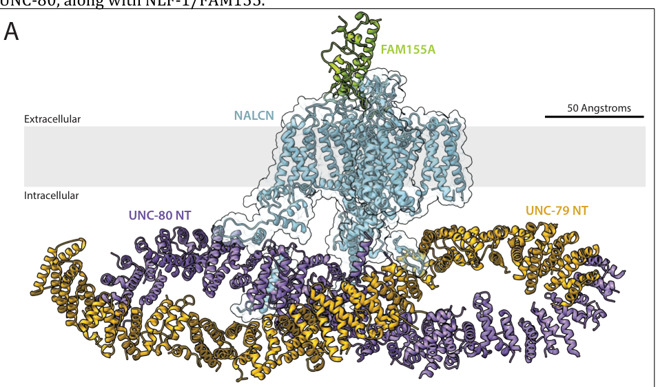

## Question

# Gene Research for Functional Annotation

## ⚠️ CRITICAL: Gene/Protein Identification Context

**BEFORE YOU BEGIN RESEARCH:** You MUST verify you are researching the CORRECT gene/protein. Gene symbols can be ambiguous, especially for less well-characterized genes from non-model organisms.

### Target Gene/Protein Identity (from UniProt):
- **UniProt Accession:** Q9VDY5
- **Protein Description:** SubName: Full=Uncoordinated 79, isoform C {ECO:0000313|EMBL:AAF55654.3};
- **Gene Information:** Name=unc79 {ECO:0000313|EMBL:AAF55654.3, ECO:0000313|FlyBase:FBgn0038693}; Synonyms=anon-WO0153538.74 {ECO:0000313|EMBL:AAF55654.3}, anon-WO0172774.15 {ECO:0000313|EMBL:AAF55654.3}, Dmel\CG5237 {ECO:0000313|EMBL:AAF55654.3}, DUNC79 {ECO:0000313|EMBL:AAF55654.3}, Dunc79 {ECO:0000313|EMBL:AAF55654.3}, dunc79 {ECO:0000313|EMBL:AAF55654.3}, UNC79 {ECO:0000313|EMBL:AAF55654.3}; ORFNames=CG5237 {ECO:0000313|EMBL:AAF55654.3, ECO:0000313|FlyBase:FBgn0038693}, Dmel_CG5237 {ECO:0000313|EMBL:AAF55654.3};
- **Organism (full):** Drosophila melanogaster (Fruit fly).
- **Protein Family:** Not specified in UniProt
- **Key Domains:** ARM-type_fold. (IPR016024); HEAT_UNC79_C. (IPR060043); UNC-79_N. (IPR059253); UNC79. (IPR024855); HEAT_UNC79_C (PF26723)

### MANDATORY VERIFICATION STEPS:

1. **Check if the gene symbol "unc79" matches the protein description above**
2. **Verify the organism is correct:** Drosophila melanogaster (Fruit fly).
3. **Check if protein family/domains align with what you find in literature**
4. **If you find literature for a DIFFERENT gene with the same or similar symbol, STOP**

### If Gene Symbol is Ambiguous or You Cannot Find Relevant Literature:

**DO NOT PROCEED WITH RESEARCH ON A DIFFERENT GENE.** Instead:
- State clearly: "The gene symbol 'unc79' is ambiguous or literature is limited for this specific protein"
- Explain what you found (e.g., "Found extensive literature on a different gene with the same symbol in a different organism")
- Describe the protein based ONLY on the UniProt information provided above
- Suggest that the protein function can be inferred from domain/family information

### Research Target:

Please provide a comprehensive research report on the gene **unc79** (gene ID: unc79, UniProt: Q9VDY5) in DROME.

The research report should be a detailed narrative explaining the function, biological processes, and localization of the gene product. Citations should be given for all claims.

You should prioritize authoritative reviews and primary scientific literature when conducting research. You can supplement
this with annotations you find in gene/protein databases, but these can be outdated or inaccurate.

We are specifically interested in the primary function of the gene - for enzymes, what reaction is catalyzed, and what is the substrate specificity? For transporters, what is the substrate? For structural proteins or adapters, what is the broader structural role? For signaling molecules, what is the role in the pathway.

We are interested in where in or outside the cell the gene product carries out its function.

We are also interested in the signaling or biochemical pathways in which the gene functions. We are less interested in broad pleiotropic effects, except where these elucidate the precise role.

Include evidence where possible. We are interested in both experimental evidence as well as inference from structure, evolution, or bioinformatic analysis. Precise studies should be prioritized over high-throughput, where available.

## Output

Question: You are an expert researcher providing comprehensive, well-cited information.

Provide detailed information focusing on:
1. Key concepts and definitions with current understanding
2. Recent developments and latest research (prioritize 2023-2024 sources)
3. Current applications and real-world implementations
4. Expert opinions and analysis from authoritative sources
5. Relevant statistics and data from recent studies

Format as a comprehensive research report with proper citations. Include URLs and publication dates where available.
Always prioritize recent, authoritative sources and provide specific citations for all major claims.

# Gene Research for Functional Annotation

## ⚠️ CRITICAL: Gene/Protein Identification Context

**BEFORE YOU BEGIN RESEARCH:** You MUST verify you are researching the CORRECT gene/protein. Gene symbols can be ambiguous, especially for less well-characterized genes from non-model organisms.

### Target Gene/Protein Identity (from UniProt):
- **UniProt Accession:** Q9VDY5
- **Protein Description:** SubName: Full=Uncoordinated 79, isoform C {ECO:0000313|EMBL:AAF55654.3};
- **Gene Information:** Name=unc79 {ECO:0000313|EMBL:AAF55654.3, ECO:0000313|FlyBase:FBgn0038693}; Synonyms=anon-WO0153538.74 {ECO:0000313|EMBL:AAF55654.3}, anon-WO0172774.15 {ECO:0000313|EMBL:AAF55654.3}, Dmel\CG5237 {ECO:0000313|EMBL:AAF55654.3}, DUNC79 {ECO:0000313|EMBL:AAF55654.3}, Dunc79 {ECO:0000313|EMBL:AAF55654.3}, dunc79 {ECO:0000313|EMBL:AAF55654.3}, UNC79 {ECO:0000313|EMBL:AAF55654.3}; ORFNames=CG5237 {ECO:0000313|EMBL:AAF55654.3, ECO:0000313|FlyBase:FBgn0038693}, Dmel_CG5237 {ECO:0000313|EMBL:AAF55654.3};
- **Organism (full):** Drosophila melanogaster (Fruit fly).
- **Protein Family:** Not specified in UniProt
- **Key Domains:** ARM-type_fold. (IPR016024); HEAT_UNC79_C. (IPR060043); UNC-79_N. (IPR059253); UNC79. (IPR024855); HEAT_UNC79_C (PF26723)

### MANDATORY VERIFICATION STEPS:

1. **Check if the gene symbol "unc79" matches the protein description above**
2. **Verify the organism is correct:** Drosophila melanogaster (Fruit fly).
3. **Check if protein family/domains align with what you find in literature**
4. **If you find literature for a DIFFERENT gene with the same or similar symbol, STOP**

### If Gene Symbol is Ambiguous or You Cannot Find Relevant Literature:

**DO NOT PROCEED WITH RESEARCH ON A DIFFERENT GENE.** Instead:
- State clearly: "The gene symbol 'unc79' is ambiguous or literature is limited for this specific protein"
- Explain what you found (e.g., "Found extensive literature on a different gene with the same symbol in a different organism")
- Describe the protein based ONLY on the UniProt information provided above
- Suggest that the protein function can be inferred from domain/family information

### Research Target:

Please provide a comprehensive research report on the gene **unc79** (gene ID: unc79, UniProt: Q9VDY5) in DROME.

The research report should be a detailed narrative explaining the function, biological processes, and localization of the gene product. Citations should be given for all claims.

You should prioritize authoritative reviews and primary scientific literature when conducting research. You can supplement
this with annotations you find in gene/protein databases, but these can be outdated or inaccurate.

We are specifically interested in the primary function of the gene - for enzymes, what reaction is catalyzed, and what is the substrate specificity? For transporters, what is the substrate? For structural proteins or adapters, what is the broader structural role? For signaling molecules, what is the role in the pathway.

We are interested in where in or outside the cell the gene product carries out its function.

We are also interested in the signaling or biochemical pathways in which the gene functions. We are less interested in broad pleiotropic effects, except where these elucidate the precise role.

Include evidence where possible. We are interested in both experimental evidence as well as inference from structure, evolution, or bioinformatic analysis. Precise studies should be prioritized over high-throughput, where available.

# Functional annotation report: *Drosophila melanogaster* unc79 (CG5237; UniProt Q9VDY5)

## Identity and principal function

**Identity verified before interpretation.** Humphrey and colleagues explicitly identified **CG5237** as the *D. melanogaster* ortholog of unc-79 and called the fly gene **dunc79**. Lear and colleagues subsequently studied fly **unc79/dunc79** separately from **unc80/CG18437**. These are different genes. The Q9VDY5 accession and isoform-C designation are supplied by the UniProt annotation in the question; the cited experimental papers establish the CG5237–dunc79 identity but do not independently map that accession or test isoform C specifically. [Humphrey et al., *Current Biology*, 3 April 2007, https://doi.org/10.1016/j.cub.2007.02.037; Lear et al., *PLOS ONE*, November 2013, https://doi.org/10.1371/journal.pone.0078147.] (humphrey2007aputativecation pages 2-3, lear2013unc79andunc80 pages 2-3)

**Best-supported annotation:** fly UNC79 is a large, **non-pore-forming auxiliary protein of the neuronal NARROW ABDOMEN (NA) ion-channel complex**, not an enzyme or an ion transporter in its own right. NA is the fly ortholog of mammalian NALCN; UNC79 and the distinct protein UNC80 associate with it and are required for normal abundance and function of the complex. Consequently, there is **no catalytic reaction, enzyme substrate, or UNC79-specific transported substrate** to assign. The physiologically relevant permeant ion belongs to the **NA channel pore**: principally extracellular Na⁺ entering neurons as a depolarizing background current. [Lear et al., 2013, https://doi.org/10.1371/journal.pone.0078147; Flourakis et al., *Cell*, August 2015, https://doi.org/10.1016/j.cell.2015.07.036.] (lear2013unc79andunc80 pages 1-2, flourakis2015aconservedbicycle pages 5-6, flourakis2015aconservedbicycle pages 4-4)

The supplied UniProt ARM-type-fold, UNC79 and C-terminal HEAT-repeat annotations fit an extended protein-interaction scaffold. Earlier fly research described UNC79 as lacking recognizable motifs; later **human**, not fly, cryo-electron microscopy resolved UNC79 as a HEAT-repeat-rich protein, explaining why those modern structural annotations are compatible rather than contradictory. This is evidence for a structural role, **not proof that every human interface is identical in Q9VDY5 isoform C**. [Lear et al., 2013, https://doi.org/10.1371/journal.pone.0078147; Kschonsak et al., *Nature* **603**, 180–186, 2022, https://doi.org/10.1038/s41586-021-04313-5; Monteil et al., *Physiological Reviews* **104**, 399–472, January 2024, https://doi.org/10.1152/physrev.00014.2022.] (lear2013unc79andunc80 pages 2-3, monteil2024newinsightsinto pages 15-17, kschonsak2022structuralarchitectureof pages 1-2)

## Molecular mechanism and evidence in flies

**Physical association and protein-level dependence are demonstrated directly.** Reciprocal co-immunoprecipitation from adult fly-head membrane preparations recovered NA with UNC79 or UNC80 and UNC79 with NA or UNC80. Mutation or neuronal knockdown of any one component reduced abundance of the other complex proteins, while their transcript levels were much less affected. The simplest supported interpretation is **post-transcriptional interdependence during channel-complex assembly, stability and/or trafficking**; co-immunoprecipitation alone does not determine whether a particular pair binds directly or which of those post-transcriptional processes dominates. [Lear et al., 2013, https://doi.org/10.1371/journal.pone.0078147.] (lear2013unc79andunc80 pages 6-9, lear2013unc79andunc80 pages 11-12)

UNC79 does **more than merely increase measured NA abundance**. Raising NA, UNC80, or both in *unc79* mutants did not restore robust rhythms, whereas expression of UNC79 in circadian neurons rescued the *unc79* phenotype. Each auxiliary component is therefore functionally necessary in the tested fly system, although these experiments cannot separate effects on NA localization from effects on its gating. An important species caveat is that mammalian **Unc79** knockout can retain NALCN protein and basal conductance; one must not substitute that mammalian phenotype for the fly protein-abundance result. [Lear et al., 2013, https://doi.org/10.1371/journal.pone.0078147; Monteil et al., January 2024, https://doi.org/10.1152/physrev.00014.2022.] (lear2013unc79andunc80 pages 10-11, lear2013unc79andunc80 pages 9-10, monteil2024newinsightsinto pages 15-17)

Human structural experiments refine—but do not replace—the fly evidence. A roughly **1-MDa** reconstituted NALCN–FAM155A–UNC79–UNC80 complex places UNC79 and UNC80 in a large intertwined **intracellular superhelix** docked beneath the membrane channel. The 2024 expert review describes **32 HEAT repeats in human UNC79** and **31 in UNC80**, contacts from intracellular NALCN linkers to this assembly, and an extracellular FAM155A component. Crosslinking and cryo-EM support a physically constrained scaffold that can couple channel organization to activity. These structures were obtained from **human proteins**, not Drosophila Q9VDY5. [Kschonsak et al., 2022, https://doi.org/10.1038/s41586-021-04313-5; Monteil et al., January 2024, https://doi.org/10.1152/physrev.00014.2022.] (kschonsak2022structuralarchitectureof pages 1-2, monteil2024newinsightsinto pages 15-17, monteil2024newinsightsinto media f31eccca)

| Question | Directly demonstrated in *Drosophila melanogaster* | Supported by ortholog/human structure, but not directly shown in fly | Remaining uncertainty |
|---|---|---|---|
| **Locus identity** | The fly **unc79/dunc79** ortholog is **CG5237**, matching the supplied Q9VDY5 annotation; it is distinct from **unc80/CG18437** (lear2013unc79andunc80 pages 2-3, humphrey2007aputativecation pages 2-3). | Animal UNC79 orthologs are conserved components of the NALCN channelosome (monteil2024newinsightsinto pages 17-19). | The Q9VDY5-to-CG5237 mapping was supplied by UniProt rather than established by the cited experiments; isoform-C-specific functions have not been resolved. |
| **Channel scaffold/partner and NA stability** | NA, UNC79 and UNC80 co-immunoprecipitate from adult-head membrane extracts. Loss of any component lowers the other proteins with comparatively little transcript change, while excess NA or UNC80 cannot replace UNC79 function (lear2013unc79andunc80 pages 6-9, lear2013unc79andunc80 pages 10-11, lear2013unc79andunc80 pages 11-12). Developmentally produced NA-complex proteins, including UNC79 measured in head extracts, persist with little decay for at least **5–7 adult days** (moose2017thenarrowabdomen pages 1-2, moose2017thenarrowabdomen pages 2-3). | Human cryo-EM resolves an approximately **1-MDa** channelosome in which UNC79 contains **32 HEAT repeats** and intertwines with UNC80 as an intracellular superhelical scaffold contacting NALCN linkers (monteil2024newinsightsinto pages 15-17, kschonsak2022structuralarchitectureof pages 1-2). | Fly co-immunoprecipitation shows association, not which contacts are direct. No fly UNC79 structure, exact binding interface, trafficking mechanism or neuron-specific half-life has been measured. |
| **Functional compartment** | *unc79* knockdown and rescue establish function in neurons, including **PDF-positive circadian pacemaker neurons**; recovery with membrane fractions places UNC79 in a membrane-associated complex (lear2013unc79andunc80 pages 6-9, lear2013unc79andunc80 pages 10-11, lear2013unc79andunc80 pages 9-10). | Human structures place UNC79 on the **cytoplasmic face of the plasma-membrane NALCN complex**, beneath the channel’s voltage-sensor domains (monteil2024newinsightsinto pages 15-17, monteil2024newinsightsinto media f31eccca). | Cytoplasmic-face placement in fly is a strong orthology-based inference, not direct microscopy. Endogenous distribution among soma, axon, dendrite, synapse and intracellular membranes remains unresolved. |
| **Ionic selectivity and catalysis** | No enzymatic reaction or transport substrate is attributable to UNC79 itself. Fly electrophysiology shows that its partner **NA** supplies a resting inward sodium-leak conductance in clock neurons, but these experiments did not manipulate *unc79* directly (flourakis2015aconservedbicycle pages 6-7, flourakis2015aconservedbicycle pages 5-6). | Reconstituted human channelosomes conduct small monovalent cations with **PNa ≈ PLi > PK > PCs**; UNC79 is a non-pore-forming accessory protein, whereas NALCN forms the ion-conducting pore (monteil2024newinsightsinto pages 24-25). | Fly UNC79’s quantitative effect on channel conductance, gating and ion selectivity has not been isolated electrophysiologically. It should not be annotated as an enzyme or pore-forming transporter. |
| **Pacemaker and behavioral output** | Strong **unc79^x25** mutants were only **7% rhythmic (n=56)** in constant darkness, versus **97% rhythmic (n=61)** after *tim*-GAL4-driven UNC79 rescue. *tim*-GAL4 *unc79* RNAi yielded **0% rhythmicity (n=35)** versus **94% (n=53)** for the driver control (lear2013unc79andunc80 pages 6-9, lear2013unc79andunc80 pages 9-10). Mutants also show hesitant walking and agent-selective anesthetic sensitivity resembling *na* mutants (humphrey2007aputativecation pages 1-2, humphrey2007aputativecation pages 2-3). | Conserved NALCN complexes depolarize neurons and support resting membrane potential, excitability, circadian rhythms and locomotor output; current expert synthesis treats UNC79 as an accessory scaffold within this system (monteil2024newinsightsinto pages 24-25, monteil2024newinsightsinto pages 15-17). | The behavioral evidence is strong, but direct *unc79*-specific patch-clamp measurements are lacking. Effects on anesthesia, walking and rhythms may combine altered NA abundance, localization, assembly and gating. |

*Table: Evidence-tier summary for *Drosophila melanogaster* CG5237/unc79 (UniProt Q9VDY5), separating direct fly findings from human structural inference. It highlights the strongest quantitative behavioral evidence and the principal unresolved mechanistic questions.*

## Biological process and pathway

The most precisely supported fly pathway is **circadian-clock output through NA-dependent membrane excitability**. Fly circadian pacemaker neurons require unc79 for sustained locomotor rhythmicity, consistent with UNC79 enabling the NA channel complex to supply depolarizing background conductance downstream of the molecular clock. RNAi driven in clock neurons and rescue with a clock-neuron driver establish a neuronal site of action; knockdown in **PDF-expressing pacemaker neurons** also reduces free-running rhythmicity. These data establish a functional requirement in those populations, **not exclusive expression there**. [Lear et al., 2013, https://doi.org/10.1371/journal.pone.0078147.] (lear2013unc79andunc80 pages 9-10, lear2013unc79andunc80 pages 6-9)

The quantitative genetic evidence is substantial. In constant darkness, strong **unc79^x25** mutants were **7% rhythmic (n = 56)**; expressing UNC79 with *tim*-GAL4 increased this to **97% (n = 61)**. Separately, *tim*-GAL4-driven *unc79* RNAi produced **0% rhythmic flies (n = 35)**, compared with **94% (n = 53)** for the listed driver control; PDF-neuron *unc79* RNAi yielded **38% (n = 32)**, compared with **97% (n = 30)** for its corresponding control. These are genotype-specific behavioral measurements, not estimates of UNC79 channel conductance. [Lear et al., 2013, Tables 2–3, https://doi.org/10.1371/journal.pone.0078147.] (lear2013unc79andunc80 pages 6-9, lear2013unc79andunc80 pages 9-10)

Patch-clamp work supplies the **channel-level physiological link**, but manipulated **NA or its regulator Nlf-1**, not *unc79* itself. In fly DN1p pacemaker neurons, loss of NA reduced inward sodium-leak current and eliminated its normal daily rhythm; neuron-targeted NA rescue restored the current. Nlf-1 depletion similarly reduced leak current, hyperpolarized and silenced DN1p neurons, while Nlf-1 overexpression enhanced evening excitability. Together with opposing potassium conductances, clock-regulated NA current helps produce day–night changes in firing. It is therefore well supported that UNC79 participates in this pathway through its NA-complex role, but **a direct unc79-specific patch-clamp demonstration of its effect on fly current or ion selectivity is lacking**. [Flourakis et al., 2015, https://doi.org/10.1016/j.cell.2015.07.036.] (flourakis2015aconservedbicycle pages 6-7, flourakis2015aconservedbicycle pages 8-9, flourakis2015aconservedbicycle pages 5-6)

Beyond circadian output, *dunc79* and *na* mutants share **hesitant locomotion** and preferentially altered sensitivity to **halothane relative to enflurane**; double-mutant analysis placed the genes in a shared functional pathway. These results make the fly a practical genetic model for channel-complex function and anesthetic sensitivity, but do **not** establish UNC79 as a direct anesthetic-binding site. [Humphrey et al., 3 April 2007, https://doi.org/10.1016/j.cub.2007.02.037.] (humphrey2007aputativecation pages 1-2, humphrey2007aputativecation pages 2-3)

## Where UNC79 functions

The best-supported **cellular context** is neurons of the fly brain, particularly the circadian pacemaker network. Recovery with NA from adult-head **membrane preparations** demonstrates association with a membrane-containing complex, but does not independently prove that fly UNC79 is an integral membrane protein or identify an endogenous somatic, axonal, dendritic or synaptic address. The **cytoplasmic face of the neuronal plasma-membrane channel** is the most plausible working localization because that is where the human UNC79–UNC80 scaffold sits relative to NALCN; this placement is explicitly **ortholog-based inference for fly UNC79**, not fly-specific microscopy. [Lear et al., 2013, https://doi.org/10.1371/journal.pone.0078147; Kschonsak et al., 2022, https://doi.org/10.1038/s41586-021-04313-5; Monteil et al., January 2024, Figure 4A, https://doi.org/10.1152/physrev.00014.2022.] (lear2013unc79andunc80 pages 10-11, monteil2024newinsightsinto pages 15-17, monteil2024newinsightsinto media f31eccca)

The complex is unusually persistent: temperature-controlled developmental/adult expression experiments found that developmentally produced NA-complex proteins remain detectable in adult fly heads with little loss for **at least five to seven days**, and developmental expression supports adult rhythmicity. Adult expression is not wholly irrelevant: sufficiently driven adult NA transgene expression can restore behavior in an appropriate experimental setting. Head-level persistence should not be mistaken for a measured UNC79 half-life at individual neuronal membranes. [Moose et al., *Frontiers in Cellular Neuroscience*, June 2017, https://doi.org/10.3389/fncel.2017.00159.] (moose2017thenarrowabdomen pages 1-2, moose2017thenarrowabdomen pages 2-3, moose2017thenarrowabdomen pages 6-8)

## Recent research and translational interpretation

The **January 2024 authoritative review** integrates the completed human structures and heterologous electrophysiology. The fully reconstituted human complex conducts small monovalent ions with reported permeability **PNa ≈ PLi > PK > PCs**; extracellular divalent ions can directly inhibit the pore. **These are human NALCN-channel properties, not a substrate-specificity measurement on fly UNC79.** The review also emphasizes that mammalian versus invertebrate dependencies among complex components differ, limiting direct transfer of mechanistic details. [Monteil et al., January 2024, https://doi.org/10.1152/physrev.00014.2022.] (monteil2024newinsightsinto pages 24-25, monteil2024newinsightsinto pages 15-17)

In **May 2024**, Schott and colleagues used structure-guided mutations to uncover otherwise inaccessible **human NALCN pore-region** responses to phenytoin and 2-APB. This demonstrates an experimental route toward modulating the channelosome, **not** a validated UNC79-directed therapy, a fly UNC79 drug interaction, or clinical efficacy. Current real-world use of fly *unc79* remains **experimental genetic and neurophysiological research**, particularly testing circadian output, channel-complex assembly and anesthesia-related phenotypes. [Schott et al., *PNAS*, May 2024, https://doi.org/10.1073/pnas.2401591121; Humphrey et al., 2007, https://doi.org/10.1016/j.cub.2007.02.037.] (schott2024unplugginglateralfenestrationsa pages 1-2, schott2024unplugginglateralfenestrationsa pages 9-10, humphrey2007aputativecation pages 2-3)

**Conclusion.** Annotate Q9VDY5/CG5237 as a neuronal, HEAT/ARM-fold-associated **UNC79 accessory scaffold/regulator of the NA sodium-leak-channel complex**, acting chiefly in membrane-excitability and circadian-output pathways. Fly protein association, genetic necessity, rescue and post-transcriptional interdependence are experimentally supported; cytoplasmic-face architecture and detailed ion permeation follow principally from human structure and channel recordings. The unresolved fly-specific questions are UNC79’s exact subcellular distribution, direct interaction interfaces, influence on NA gating versus trafficking, and isoform-C-specific activity. (lear2013unc79andunc80 pages 6-9, lear2013unc79andunc80 pages 9-10, monteil2024newinsightsinto pages 15-17, flourakis2015aconservedbicycle pages 5-6)

References

1. (humphrey2007aputativecation pages 2-3): John A. Humphrey, Kevin S. Hamming, Colin M. Thacker, Robert L. Scott, Margaret M. Sedensky, Terrance P. Snutch, Phil G. Morgan, and Howard A. Nash. A putative cation channel and its novel regulator: cross-species conservation of effects on general anesthesia. Current Biology, 17:624-629, Apr 2007. URL: https://doi.org/10.1016/j.cub.2007.02.037, doi:10.1016/j.cub.2007.02.037. This article has 131 citations and is from a highest quality peer-reviewed journal.

2. (lear2013unc79andunc80 pages 2-3): Bridget C. Lear, Eric J. Darrah, Benjamin T. Aldrich, Senetibeb Gebre, Robert L. Scott, Howard A. Nash, and Ravi Allada. Unc79 and unc80, putative auxiliary subunits of the narrow abdomen ion channel, are indispensable for robust circadian locomotor rhythms in drosophila. PLoS ONE, 8:e78147, Nov 2013. URL: https://doi.org/10.1371/journal.pone.0078147, doi:10.1371/journal.pone.0078147. This article has 62 citations and is from a peer-reviewed journal.

3. (lear2013unc79andunc80 pages 1-2): Bridget C. Lear, Eric J. Darrah, Benjamin T. Aldrich, Senetibeb Gebre, Robert L. Scott, Howard A. Nash, and Ravi Allada. Unc79 and unc80, putative auxiliary subunits of the narrow abdomen ion channel, are indispensable for robust circadian locomotor rhythms in drosophila. PLoS ONE, 8:e78147, Nov 2013. URL: https://doi.org/10.1371/journal.pone.0078147, doi:10.1371/journal.pone.0078147. This article has 62 citations and is from a peer-reviewed journal.

4. (flourakis2015aconservedbicycle pages 5-6): Matthieu Flourakis, Elzbieta Kula-Eversole, Alan L. Hutchison, Tae Hee Han, Kimberly Aranda, Devon L. Moose, Kevin P. White, Aaron R. Dinner, Bridget C. Lear, Dejian Ren, Casey O. Diekman, Indira M. Raman, and Ravi Allada. A conserved bicycle model for circadian clock control of membrane excitability. Cell, 162:836-848, Aug 2015. URL: https://doi.org/10.1016/j.cell.2015.07.036, doi:10.1016/j.cell.2015.07.036. This article has 252 citations and is from a highest quality peer-reviewed journal.

5. (flourakis2015aconservedbicycle pages 4-4): Matthieu Flourakis, Elzbieta Kula-Eversole, Alan L. Hutchison, Tae Hee Han, Kimberly Aranda, Devon L. Moose, Kevin P. White, Aaron R. Dinner, Bridget C. Lear, Dejian Ren, Casey O. Diekman, Indira M. Raman, and Ravi Allada. A conserved bicycle model for circadian clock control of membrane excitability. Cell, 162:836-848, Aug 2015. URL: https://doi.org/10.1016/j.cell.2015.07.036, doi:10.1016/j.cell.2015.07.036. This article has 252 citations and is from a highest quality peer-reviewed journal.

6. (monteil2024newinsightsinto pages 15-17): Arnaud Monteil, Nathalie C. Guérineau, Antonio Gil-Nagel, Paloma Parra-Diaz, Philippe Lory, and Adriano Senatore. New insights into the physiology and pathophysiology of the atypical sodium leak channel nalcn. Physiological Reviews, 104:399-472, Jan 2024. URL: https://doi.org/10.1152/physrev.00014.2022, doi:10.1152/physrev.00014.2022. This article has 47 citations and is from a highest quality peer-reviewed journal.

7. (kschonsak2022structuralarchitectureof pages 1-2): Marc Kschonsak, Han Chow Chua, Claudia Weidling, Nourdine Chakouri, Cameron L. Noland, Katharina Schott, Timothy Chang, Christine Tam, Nidhi Patel, Christopher P. Arthur, Alexander Leitner, Manu Ben-Johny, Claudio Ciferri, Stephan Alexander Pless, and Jian Payandeh. Structural architecture of the human nalcn channelosome. Nature, 603:180-186, Dec 2022. URL: https://doi.org/10.1038/s41586-021-04313-5, doi:10.1038/s41586-021-04313-5. This article has 48 citations and is from a highest quality peer-reviewed journal.

8. (lear2013unc79andunc80 pages 6-9): Bridget C. Lear, Eric J. Darrah, Benjamin T. Aldrich, Senetibeb Gebre, Robert L. Scott, Howard A. Nash, and Ravi Allada. Unc79 and unc80, putative auxiliary subunits of the narrow abdomen ion channel, are indispensable for robust circadian locomotor rhythms in drosophila. PLoS ONE, 8:e78147, Nov 2013. URL: https://doi.org/10.1371/journal.pone.0078147, doi:10.1371/journal.pone.0078147. This article has 62 citations and is from a peer-reviewed journal.

9. (lear2013unc79andunc80 pages 11-12): Bridget C. Lear, Eric J. Darrah, Benjamin T. Aldrich, Senetibeb Gebre, Robert L. Scott, Howard A. Nash, and Ravi Allada. Unc79 and unc80, putative auxiliary subunits of the narrow abdomen ion channel, are indispensable for robust circadian locomotor rhythms in drosophila. PLoS ONE, 8:e78147, Nov 2013. URL: https://doi.org/10.1371/journal.pone.0078147, doi:10.1371/journal.pone.0078147. This article has 62 citations and is from a peer-reviewed journal.

10. (lear2013unc79andunc80 pages 10-11): Bridget C. Lear, Eric J. Darrah, Benjamin T. Aldrich, Senetibeb Gebre, Robert L. Scott, Howard A. Nash, and Ravi Allada. Unc79 and unc80, putative auxiliary subunits of the narrow abdomen ion channel, are indispensable for robust circadian locomotor rhythms in drosophila. PLoS ONE, 8:e78147, Nov 2013. URL: https://doi.org/10.1371/journal.pone.0078147, doi:10.1371/journal.pone.0078147. This article has 62 citations and is from a peer-reviewed journal.

11. (lear2013unc79andunc80 pages 9-10): Bridget C. Lear, Eric J. Darrah, Benjamin T. Aldrich, Senetibeb Gebre, Robert L. Scott, Howard A. Nash, and Ravi Allada. Unc79 and unc80, putative auxiliary subunits of the narrow abdomen ion channel, are indispensable for robust circadian locomotor rhythms in drosophila. PLoS ONE, 8:e78147, Nov 2013. URL: https://doi.org/10.1371/journal.pone.0078147, doi:10.1371/journal.pone.0078147. This article has 62 citations and is from a peer-reviewed journal.

12. (monteil2024newinsightsinto media f31eccca): Arnaud Monteil, Nathalie C. Guérineau, Antonio Gil-Nagel, Paloma Parra-Diaz, Philippe Lory, and Adriano Senatore. New insights into the physiology and pathophysiology of the atypical sodium leak channel nalcn. Physiological Reviews, 104:399-472, Jan 2024. URL: https://doi.org/10.1152/physrev.00014.2022, doi:10.1152/physrev.00014.2022. This article has 47 citations and is from a highest quality peer-reviewed journal.

13. (monteil2024newinsightsinto pages 17-19): Arnaud Monteil, Nathalie C. Guérineau, Antonio Gil-Nagel, Paloma Parra-Diaz, Philippe Lory, and Adriano Senatore. New insights into the physiology and pathophysiology of the atypical sodium leak channel nalcn. Physiological Reviews, 104:399-472, Jan 2024. URL: https://doi.org/10.1152/physrev.00014.2022, doi:10.1152/physrev.00014.2022. This article has 47 citations and is from a highest quality peer-reviewed journal.

14. (moose2017thenarrowabdomen pages 1-2): Devon L. Moose, Stephanie J. Haase, Benjamin T. Aldrich, and Bridget C. Lear. The narrow abdomen ion channel complex is highly stable and persists from development into adult stages to promote behavioral rhythmicity. Frontiers in Cellular Neuroscience, Jun 2017. URL: https://doi.org/10.3389/fncel.2017.00159, doi:10.3389/fncel.2017.00159. This article has 17 citations.

15. (moose2017thenarrowabdomen pages 2-3): Devon L. Moose, Stephanie J. Haase, Benjamin T. Aldrich, and Bridget C. Lear. The narrow abdomen ion channel complex is highly stable and persists from development into adult stages to promote behavioral rhythmicity. Frontiers in Cellular Neuroscience, Jun 2017. URL: https://doi.org/10.3389/fncel.2017.00159, doi:10.3389/fncel.2017.00159. This article has 17 citations.

16. (flourakis2015aconservedbicycle pages 6-7): Matthieu Flourakis, Elzbieta Kula-Eversole, Alan L. Hutchison, Tae Hee Han, Kimberly Aranda, Devon L. Moose, Kevin P. White, Aaron R. Dinner, Bridget C. Lear, Dejian Ren, Casey O. Diekman, Indira M. Raman, and Ravi Allada. A conserved bicycle model for circadian clock control of membrane excitability. Cell, 162:836-848, Aug 2015. URL: https://doi.org/10.1016/j.cell.2015.07.036, doi:10.1016/j.cell.2015.07.036. This article has 252 citations and is from a highest quality peer-reviewed journal.

17. (monteil2024newinsightsinto pages 24-25): Arnaud Monteil, Nathalie C. Guérineau, Antonio Gil-Nagel, Paloma Parra-Diaz, Philippe Lory, and Adriano Senatore. New insights into the physiology and pathophysiology of the atypical sodium leak channel nalcn. Physiological Reviews, 104:399-472, Jan 2024. URL: https://doi.org/10.1152/physrev.00014.2022, doi:10.1152/physrev.00014.2022. This article has 47 citations and is from a highest quality peer-reviewed journal.

18. (humphrey2007aputativecation pages 1-2): John A. Humphrey, Kevin S. Hamming, Colin M. Thacker, Robert L. Scott, Margaret M. Sedensky, Terrance P. Snutch, Phil G. Morgan, and Howard A. Nash. A putative cation channel and its novel regulator: cross-species conservation of effects on general anesthesia. Current Biology, 17:624-629, Apr 2007. URL: https://doi.org/10.1016/j.cub.2007.02.037, doi:10.1016/j.cub.2007.02.037. This article has 131 citations and is from a highest quality peer-reviewed journal.

19. (flourakis2015aconservedbicycle pages 8-9): Matthieu Flourakis, Elzbieta Kula-Eversole, Alan L. Hutchison, Tae Hee Han, Kimberly Aranda, Devon L. Moose, Kevin P. White, Aaron R. Dinner, Bridget C. Lear, Dejian Ren, Casey O. Diekman, Indira M. Raman, and Ravi Allada. A conserved bicycle model for circadian clock control of membrane excitability. Cell, 162:836-848, Aug 2015. URL: https://doi.org/10.1016/j.cell.2015.07.036, doi:10.1016/j.cell.2015.07.036. This article has 252 citations and is from a highest quality peer-reviewed journal.

20. (moose2017thenarrowabdomen pages 6-8): Devon L. Moose, Stephanie J. Haase, Benjamin T. Aldrich, and Bridget C. Lear. The narrow abdomen ion channel complex is highly stable and persists from development into adult stages to promote behavioral rhythmicity. Frontiers in Cellular Neuroscience, Jun 2017. URL: https://doi.org/10.3389/fncel.2017.00159, doi:10.3389/fncel.2017.00159. This article has 17 citations.

21. (schott2024unplugginglateralfenestrationsa pages 1-2): Katharina Schott, Samuel George Usher, Oscar Serra, Vincenzo Carnevale, Stephan Alexander Pless, and Han Chow Chua. Unplugging lateral fenestrations of nalcn reveals a hidden drug binding site within the pore region. Proceedings of the National Academy of Sciences of the United States of America, May 2024. URL: https://doi.org/10.1073/pnas.2401591121, doi:10.1073/pnas.2401591121. This article has 5 citations and is from a highest quality peer-reviewed journal.

22. (schott2024unplugginglateralfenestrationsa pages 9-10): Katharina Schott, Samuel George Usher, Oscar Serra, Vincenzo Carnevale, Stephan Alexander Pless, and Han Chow Chua. Unplugging lateral fenestrations of nalcn reveals a hidden drug binding site within the pore region. Proceedings of the National Academy of Sciences of the United States of America, May 2024. URL: https://doi.org/10.1073/pnas.2401591121, doi:10.1073/pnas.2401591121. This article has 5 citations and is from a highest quality peer-reviewed journal.

## Artifacts

- [Edison artifact artifact-00](unc79-deep-research-falcon_artifacts/artifact-00.md)

## Citations

1. monteil2024newinsightsinto pages 17-19
2. monteil2024newinsightsinto pages 24-25
3. humphrey2007aputativecation pages 2-3
4. flourakis2015aconservedbicycle pages 5-6
5. flourakis2015aconservedbicycle pages 4-4
6. monteil2024newinsightsinto pages 15-17
7. kschonsak2022structuralarchitectureof pages 1-2
8. moose2017thenarrowabdomen pages 1-2
9. moose2017thenarrowabdomen pages 2-3
10. flourakis2015aconservedbicycle pages 6-7
11. humphrey2007aputativecation pages 1-2
12. flourakis2015aconservedbicycle pages 8-9
13. moose2017thenarrowabdomen pages 6-8
14. schott2024unplugginglateralfenestrationsa pages 1-2
15. schott2024unplugginglateralfenestrationsa pages 9-10
16. Humphrey et al., *Current Biology*, 3 April 2007, https://doi.org/10.1016/j.cub.2007.02.037; Lear et al., *PLOS ONE*, November 2013, https://doi.org/10.1371/journal.pone.0078147.
17. Lear et al., 2013, https://doi.org/10.1371/journal.pone.0078147; Flourakis et al., *Cell*, August 2015, https://doi.org/10.1016/j.cell.2015.07.036.
18. Lear et al., 2013, https://doi.org/10.1371/journal.pone.0078147; Kschonsak et al., *Nature* **603**, 180–186, 2022, https://doi.org/10.1038/s41586-021-04313-5; Monteil et al., *Physiological Reviews* **104**, 399–472, January 2024, https://doi.org/10.1152/physrev.00014.2022.
19. Lear et al., 2013, https://doi.org/10.1371/journal.pone.0078147.
20. Lear et al., 2013, https://doi.org/10.1371/journal.pone.0078147; Monteil et al., January 2024, https://doi.org/10.1152/physrev.00014.2022.
21. Kschonsak et al., 2022, https://doi.org/10.1038/s41586-021-04313-5; Monteil et al., January 2024, https://doi.org/10.1152/physrev.00014.2022.
22. Lear et al., 2013, Tables 2–3, https://doi.org/10.1371/journal.pone.0078147.
23. Flourakis et al., 2015, https://doi.org/10.1016/j.cell.2015.07.036.
24. Humphrey et al., 3 April 2007, https://doi.org/10.1016/j.cub.2007.02.037.
25. Lear et al., 2013, https://doi.org/10.1371/journal.pone.0078147; Kschonsak et al., 2022, https://doi.org/10.1038/s41586-021-04313-5; Monteil et al., January 2024, Figure 4A, https://doi.org/10.1152/physrev.00014.2022.
26. Moose et al., *Frontiers in Cellular Neuroscience*, June 2017, https://doi.org/10.3389/fncel.2017.00159.
27. Monteil et al., January 2024, https://doi.org/10.1152/physrev.00014.2022.
28. Schott et al., *PNAS*, May 2024, https://doi.org/10.1073/pnas.2401591121; Humphrey et al., 2007, https://doi.org/10.1016/j.cub.2007.02.037.
29. https://doi.org/10.1016/j.cub.2007.02.037;
30. https://doi.org/10.1371/journal.pone.0078147.]
31. https://doi.org/10.1371/journal.pone.0078147;
32. https://doi.org/10.1016/j.cell.2015.07.036.]
33. https://doi.org/10.1038/s41586-021-04313-5;
34. https://doi.org/10.1152/physrev.00014.2022.]
35. https://doi.org/10.1016/j.cub.2007.02.037.]
36. https://doi.org/10.3389/fncel.2017.00159.]
37. https://doi.org/10.1073/pnas.2401591121;
38. https://doi.org/10.1016/j.cub.2007.02.037,
39. https://doi.org/10.1371/journal.pone.0078147,
40. https://doi.org/10.1016/j.cell.2015.07.036,
41. https://doi.org/10.1152/physrev.00014.2022,
42. https://doi.org/10.1038/s41586-021-04313-5,
43. https://doi.org/10.3389/fncel.2017.00159,
44. https://doi.org/10.1073/pnas.2401591121,