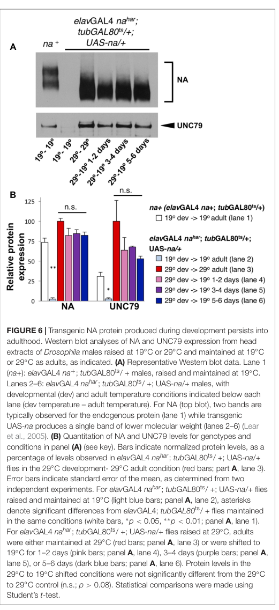

## Question

# Gene Research for Functional Annotation

## ⚠️ CRITICAL: Gene/Protein Identification Context

**BEFORE YOU BEGIN RESEARCH:** You MUST verify you are researching the CORRECT gene/protein. Gene symbols can be ambiguous, especially for less well-characterized genes from non-model organisms.

### Target Gene/Protein Identity (from UniProt):
- **UniProt Accession:** Q9VB11
- **Protein Description:** RecName: Full=Protein unc-80 homolog;
- **Gene Information:** Name=unc80 {ECO:0000312|FlyBase:FBgn0039536}; ORFNames=CG18437 {ECO:0000312|FlyBase:FBgn0039536};
- **Organism (full):** Drosophila melanogaster (Fruit fly).
- **Protein Family:** Belongs to the unc-80 family. .
- **Key Domains:** UNC80_C. (IPR046460); UNC80_central. (IPR045852); UNC80_N. (IPR031542); UNC80 (PF19424); UNC80_C (PF20262)

### MANDATORY VERIFICATION STEPS:

1. **Check if the gene symbol "unc80" matches the protein description above**
2. **Verify the organism is correct:** Drosophila melanogaster (Fruit fly).
3. **Check if protein family/domains align with what you find in literature**
4. **If you find literature for a DIFFERENT gene with the same or similar symbol, STOP**

### If Gene Symbol is Ambiguous or You Cannot Find Relevant Literature:

**DO NOT PROCEED WITH RESEARCH ON A DIFFERENT GENE.** Instead:
- State clearly: "The gene symbol 'unc80' is ambiguous or literature is limited for this specific protein"
- Explain what you found (e.g., "Found extensive literature on a different gene with the same symbol in a different organism")
- Describe the protein based ONLY on the UniProt information provided above
- Suggest that the protein function can be inferred from domain/family information

### Research Target:

Please provide a comprehensive research report on the gene **unc80** (gene ID: unc80, UniProt: Q9VB11) in DROME.

The research report should be a detailed narrative explaining the function, biological processes, and localization of the gene product. Citations should be given for all claims.

You should prioritize authoritative reviews and primary scientific literature when conducting research. You can supplement
this with annotations you find in gene/protein databases, but these can be outdated or inaccurate.

We are specifically interested in the primary function of the gene - for enzymes, what reaction is catalyzed, and what is the substrate specificity? For transporters, what is the substrate? For structural proteins or adapters, what is the broader structural role? For signaling molecules, what is the role in the pathway.

We are interested in where in or outside the cell the gene product carries out its function.

We are also interested in the signaling or biochemical pathways in which the gene functions. We are less interested in broad pleiotropic effects, except where these elucidate the precise role.

Include evidence where possible. We are interested in both experimental evidence as well as inference from structure, evolution, or bioinformatic analysis. Precise studies should be prioritized over high-throughput, where available.

## Output

Question: You are an expert researcher providing comprehensive, well-cited information.

Provide detailed information focusing on:
1. Key concepts and definitions with current understanding
2. Recent developments and latest research (prioritize 2023-2024 sources)
3. Current applications and real-world implementations
4. Expert opinions and analysis from authoritative sources
5. Relevant statistics and data from recent studies

Format as a comprehensive research report with proper citations. Include URLs and publication dates where available.
Always prioritize recent, authoritative sources and provide specific citations for all major claims.

# Gene Research for Functional Annotation

## ⚠️ CRITICAL: Gene/Protein Identification Context

**BEFORE YOU BEGIN RESEARCH:** You MUST verify you are researching the CORRECT gene/protein. Gene symbols can be ambiguous, especially for less well-characterized genes from non-model organisms.

### Target Gene/Protein Identity (from UniProt):
- **UniProt Accession:** Q9VB11
- **Protein Description:** RecName: Full=Protein unc-80 homolog;
- **Gene Information:** Name=unc80 {ECO:0000312|FlyBase:FBgn0039536}; ORFNames=CG18437 {ECO:0000312|FlyBase:FBgn0039536};
- **Organism (full):** Drosophila melanogaster (Fruit fly).
- **Protein Family:** Belongs to the unc-80 family. .
- **Key Domains:** UNC80_C. (IPR046460); UNC80_central. (IPR045852); UNC80_N. (IPR031542); UNC80 (PF19424); UNC80_C (PF20262)

### MANDATORY VERIFICATION STEPS:

1. **Check if the gene symbol "unc80" matches the protein description above**
2. **Verify the organism is correct:** Drosophila melanogaster (Fruit fly).
3. **Check if protein family/domains align with what you find in literature**
4. **If you find literature for a DIFFERENT gene with the same or similar symbol, STOP**

### If Gene Symbol is Ambiguous or You Cannot Find Relevant Literature:

**DO NOT PROCEED WITH RESEARCH ON A DIFFERENT GENE.** Instead:
- State clearly: "The gene symbol 'unc80' is ambiguous or literature is limited for this specific protein"
- Explain what you found (e.g., "Found extensive literature on a different gene with the same symbol in a different organism")
- Describe the protein based ONLY on the UniProt information provided above
- Suggest that the protein function can be inferred from domain/family information

### Research Target:

Please provide a comprehensive research report on the gene **unc80** (gene ID: unc80, UniProt: Q9VB11) in DROME.

The research report should be a detailed narrative explaining the function, biological processes, and localization of the gene product. Citations should be given for all claims.

You should prioritize authoritative reviews and primary scientific literature when conducting research. You can supplement
this with annotations you find in gene/protein databases, but these can be outdated or inaccurate.

We are specifically interested in the primary function of the gene - for enzymes, what reaction is catalyzed, and what is the substrate specificity? For transporters, what is the substrate? For structural proteins or adapters, what is the broader structural role? For signaling molecules, what is the role in the pathway.

We are interested in where in or outside the cell the gene product carries out its function.

We are also interested in the signaling or biochemical pathways in which the gene functions. We are less interested in broad pleiotropic effects, except where these elucidate the precise role.

Include evidence where possible. We are interested in both experimental evidence as well as inference from structure, evolution, or bioinformatic analysis. Precise studies should be prioritized over high-throughput, where available.

# Functional annotation report: *Drosophila melanogaster unc80* (CG18437; UniProt Q9VB11)

## Identity and principal function

**Identity verified.** The target is the fruit-fly gene *unc80*, also called *CG18437*, encoding protein UNC80—not the distinct pore-forming gene *narrow abdomen* (*na*). Lear and colleagues explicitly identify fly *unc80/CG18437* as a partner of NA, the fly ortholog of mammalian NALCN. This matches the supplied UniProt identification and UNC80-family assignment. The supplied UNC80_N, UNC80_central and UNC80_C domain annotations are consistent with an extended UNC80-family protein; they do **not** establish an enzyme active site or an ion-conducting pore in fly UNC80. (lear2013unc79andunc80 pages 1-2, lear2013unc79andunc80 pages 10-11, zhou2022architectureofthe pages 1-2)

**Primary annotation:** UNC80 is a large, neuronal **auxiliary assembly and regulatory component of the NA sodium-leak-channel complex**. Fly-head membrane-extract immunoprecipitations recover NA with UNC80 or UNC79 and recover UNC79 with UNC80 or NA. Loss of *unc80* sharply reduces NA and UNC79 protein despite relatively preserved transcripts, demonstrating a post-transcriptional contribution to maintaining the complex. Conversely, providing NA or UNC79 does not restore rhythmic behavior in *unc80* mutants: UNC80 has a non-substitutable function beyond merely increasing the other proteins’ abundance. Co-immunoprecipitation establishes association, not the precise fly subunit stoichiometry or which contacts are direct. (lear2013unc79andunc80 pages 1-2, lear2013unc79andunc80 pages 6-9, lear2013unc79andunc80 pages 4-5, lear2013unc79andunc80 pages 10-11)

UNC80 **does not itself catalyze a reaction or transport an identified substrate**. The transported species belongs to the associated NA pore: the NA-dependent inward **Na⁺ leak** promotes neuronal depolarization. A 2024 authoritative review describes the reconstituted mammalian NALCN complex as preferentially permeable to small monovalent cations, approximately Na⁺ ≈ Li⁺ > K⁺ > Cs⁺; extracellular divalent cations can inhibit its current. Those quantitative selectivity measurements are **not measurements of fly UNC80 or purified fly NA**. (monteil2024newinsightsinto pages 24-25, flourakis2015aconservedbicycle pages 5-6, flourakis2015aconservedbicycle pages 4-5)

The following evidence summary separates direct fly observations from channel-specific and cross-species findings. (lear2013unc79andunc80 pages 6-9, flourakis2015aconservedbicycle pages 5-6, zhou2022architectureofthe pages 1-2)

| Observation | Evidence/species | Interpretation and limit |
|---|---|---|
| NA, UNC79 and UNC80 co-immunoprecipitate from adult-head membrane extracts; loss or neuronal knockdown of one component reduces the other proteins with comparatively small or absent transcript changes. | Direct *Drosophila melanogaster* biochemical, mutant, RNAi and qPCR evidence from Lear et al., 2013. (lear2013unc79andunc80 pages 6-9, lear2013unc79andunc80 pages 4-5) | Q9VB11/CG18437 is a post-transcriptionally interdependent component of the fly NA channel complex. Co-immunoprecipitation does not establish stoichiometry or every direct contact. |
| Severe *unc80* disruption nearly abolishes free-running rhythmicity: *unc80* x42, 0% rhythmic (*n*=9). A background-matched *tim-GAL4; unc80* x42 control was 3% rhythmic (*n*=66), versus 93% (*n*=42) after *tim-GAL4*-driven HA-UNC80 rescue. | Direct fly loss-of-function and tissue-specific rescue evidence from Lear et al., 2013. (lear2013unc79andunc80 pages 9-10, lear2013unc79andunc80 pages 4-5) | Neuronal UNC80 is required for robust circadian locomotor output, and the phenotype maps to *unc80*. Behavior does not directly measure ion flow or establish subcellular localization. |
| DN1p pacemaker neurons carry an NA-dependent, voltage-independent inward Na⁺ leak that is larger in the morning; *na* mutants are hyperpolarized and electrically silent, whereas DN1p-specific NA rescue restores excitability. | Direct fly patch-clamp evidence for pore-forming NA, not an independent UNC80 electrophysiological measurement, from Flourakis et al., 2015. (flourakis2015aconservedbicycle pages 5-6, flourakis2015aconservedbicycle pages 4-5) | This defines the conductance whose normal operation likely requires the UNC80-containing complex. It does not prove that UNC80 conducts Na⁺ or that UNC80 abundance is rhythmic. |
| UNC79 and UNC80 form a large intracellular HEAT/armadillo-repeat scaffold that engages NALCN cytoplasmic linkers; disrupting interfaces reduces current, while mammalian experiments implicate the assembly in surface delivery and relief of channel autoinhibition. | Human/mammalian cryo-EM and heterologous electrophysiology, 2022. (zhou2022architectureofthe pages 1-2, kang2022structureandmechanism pages 1-2) | Supports a conserved model in which fly UNC80 is a cytosolic structural and regulatory auxiliary protein rather than the pore. Application to Q9VB11 is homology-based; residue-level domain equivalence has not been demonstrated in flies. |

*Table: Direct fly genetics and biochemistry establish UNC80 as an essential NA-complex component, while electrophysiology defines the associated NA conductance. Mammalian structures refine the scaffold model but remain homolog-based for Q9VB11.*

## Biological pathway and experimental evidence

The most securely established fly pathway is **circadian-clock output → NA-complex-dependent membrane excitability in pacemaker neurons → rhythmic locomotor activity**. In DN1p clock neurons, electrophysiology directly attributes a voltage-independent, morning-enhanced inward sodium conductance to **NA**: *na* mutants are hyperpolarized and markedly less excitable, and targeted NA re-expression restores excitability. In the proposed sodium–potassium “bicycle,” morning sodium leak favors firing, whereas increased resting potassium conductance favors evening suppression. Importantly, this study manipulated and recorded **NA-associated current**, not current following an isolated *unc80* manipulation; UNC80’s role in the conductance is inferred from its experimentally established partnership with NA. (flourakis2015aconservedbicycle pages 5-6, flourakis2015aconservedbicycle pages 8-9, flourakis2015aconservedbicycle pages 4-5)

Direct *unc80* genetics strongly connects that molecular complex to behavior. Under constant darkness, severe *unc80* insertion alleles yielded **4% rhythmic flies (*n*=27)** or **0% (*n*=9)**. Broad clock-neuron *unc80* RNAi driven by *tim*-GAL4 yielded **0% rhythmic flies (*n*=40)** versus **94% (*n*=53)** for its driver control; *pdf*-GAL4-driven knockdown yielded **13% (*n*=31)** versus **97% (*n*=30)** for its corresponding control. In a rescue comparison, an *unc80* mutant control was **3% rhythmic (*n*=66)**, whereas *tim*-GAL4-driven HA-UNC80 restored **93% (*n*=42)**; a second *unc80* rescue configuration reached **100% (*n*=38)**. These experiments support an essential function within the clock-neuron network, including PDF-expressing neurons, but neither locomotor recording nor tissue-specific rescue alone determines UNC80’s exact subcellular address. (lear2013unc79andunc80 pages 9-10, lear2013unc79andunc80 pages 6-9, lear2013unc79andunc80 pages 4-5)

At the molecular level, immunoblots show that strong mutations in any of *na*, *unc79* or *unc80* lower all three corresponding proteins. In *unc80* mutants, *na* and *unc79* transcripts remain near normal; in *na* mutants, reported reductions in partner transcripts were under **23%**, compared with protein decreases of at least **86%**. Together with neuronal knockdown and rescue, these results favor post-transcriptional complex stabilization or assembly rather than a primary transcription-factor role for UNC80. Precisely how fly UNC80 controls trafficking versus gating remains unresolved. (lear2013unc79andunc80 pages 1-2, lear2013unc79andunc80 pages 11-12, lear2013unc79andunc80 pages 4-5, lear2013unc79andunc80 pages 10-11)

## Cellular location and structural interpretation

**Directly established in flies:** UNC80 associates with NA and UNC79 in **adult-head membrane preparations** and is required functionally in neuronal pacemaker populations. This supports a membrane-*associated* neuronal complex, **not** a demonstrated UNC80 transmembrane pore or a proven dendritic, axonal, endoplasmic-reticulum or exclusively plasma-membrane location for Q9VB11. (lear2013unc79andunc80 pages 1-2, lear2013unc79andunc80 pages 11-12, lear2013unc79andunc80 pages 10-11)

**Mechanistic inference from homologs:** Human/mammalian cryo-electron microscopy resolves UNC80 and UNC79 as intertwined, HEAT/armadillo-repeat-rich proteins forming a large **cytoplasmic scaffold beneath the membrane-embedded NALCN–FAM155A channel**. The scaffold associates with NALCN’s intracellular linkers; disrupting interfaces reduces reconstituted channel current. One mammalian structural study additionally implicates distinct contacts in cell-surface delivery and in relief of NALCN autoinhibition. These structures give a compelling explanation for fly UNC80’s auxiliary role but have **not** mapped those individual contacts in CG18437. (zhou2022architectureofthe pages 1-2, zhou2022architectureofthe pages 2-5, kang2022structureandmechanism pages 1-2, kschonsak2022structuralarchitectureof pages 1-2)

Mammalian cell and neuron experiments further separate UNC80’s molecular functions: an N-terminal region associates with NALCN, whereas a more distal C-terminal region binds UNC79 and permits dendritic distribution of the complex. A disease-associated truncated UNC80 can support a measurable whole-cell NALCN current yet fail to achieve normal dendritic localization. Those localization and human-residue assignments must **not** be transferred to specific residues or neuronal compartments of fly Q9VB11 without fly experiments. (wie2020intellectualdisabilityassociatedunc80 pages 8-10, wie2020intellectualdisabilityassociatedunc80 pages 6-8, wie2020intellectualdisabilityassociatedunc80 pages 10-11, wie2020intellectualdisabilityassociatedunc80 pages 1-2)

## Developmental regulation and newer research

The fly NA channel system provides an important caution about inferring mechanism from rhythmic transcripts. A 2015 study found rhythmic *Nlf-1* expression in DN1p neurons and proposed that this channel regulator connects the clock to rhythmic sodium leak; *unc79* and *unc80* transcripts were **not** themselves rhythmic in that analysis. A subsequent temperature-shift study showed that much functional adult NA complex can be produced **during development**: NA and UNC79 protein persisted in adult heads for at least **5–7 days**. Pooled data estimated NA protein at **86.8%** of its constitutively expressed level after an approximately six-day shift, corresponding to an approximate **29-day NA half-life** under the authors’ assumptions. **UNC80 was not separately quantified in those stability assays**, so this is not an UNC80 half-life. The later authors consequently favored substantial post-translational regulation of the already-established adult complex rather than daily wholesale synthesis driven by *Nlf-1*. Their measured NA/UNC79 persistence is illustrated in the retrieved cropped Figure 6. (flourakis2015aconservedbicycle pages 5-6, moose2017thenarrowabdomen pages 9-10, moose2017thenarrowabdomen pages 1-2, moose2017thenarrowabdomen media 388343a6)

The leading **2023–2024 perspective** is the 2024 *Physiological Reviews* synthesis, which integrates complex composition, biophysics, channel regulation and disease; the key resolved UNC79–UNC80 scaffold structures appeared in 2022. A **May 2024 mouse**, not fly, study found that experimental alteration of *Unc80* RNA editing changes activity and olfactory responses. Its mouse editing-site and olfactory conclusions should not be annotated onto Drosophila CG18437 without fly-specific validation. The literature retrieved here did not establish a new **2023–2024 fly-*unc80*-specific** mechanism superseding the direct fly genetics. (monteil2024newinsightsinto pages 24-25, zhou2022architectureofthe pages 1-2, kang2022structureandmechanism pages 1-2, chen2024imbalanceinunc80 pages 2-3, chen2024imbalanceinunc80 pages 1-2)

## Research use and remaining uncertainty

In practice, *Drosophila unc80* mutant, RNAi and rescue lines provide an **in-vivo genetic system** for testing NA-channel-complex integrity and circadian-neuron output; mammalian reconstituted complexes and structural studies provide complementary assays for interpreting conserved assembly and channelopathies. This is a research application, **not** evidence of a clinical implementation involving fly UNC80. The most consequential annotation gaps are direct fly UNC80 subcellular imaging, tests of whether it independently changes NA surface delivery or gating in identified neurons, and fly-specific mapping of the predicted UNC80-family domains onto the structurally defined mammalian interfaces. (lear2013unc79andunc80 pages 9-10, lear2013unc79andunc80 pages 10-11, zhou2022architectureofthe pages 1-2, kang2022structureandmechanism pages 1-2)

### Principal sources and links

- Lear BC *et al.* **November 2013**, *PLoS ONE* 8:e78147, direct fly *unc80* genetics, complex association and rescue. https://doi.org/10.1371/journal.pone.0078147 (lear2013unc79andunc80 pages 1-2, lear2013unc79andunc80 pages 9-10)
- Flourakis M *et al.* **August 2015**, *Cell* 162:836–848, direct **NA** electrophysiology in fly clock neurons. https://doi.org/10.1016/j.cell.2015.07.036 (flourakis2015aconservedbicycle pages 5-6, flourakis2015aconservedbicycle pages 4-5)
- Moose DL *et al.* **June 2017**, *Frontiers in Cellular Neuroscience* 11:159, developmental persistence of measured **NA and UNC79**. https://doi.org/10.3389/fncel.2017.00159 (moose2017thenarrowabdomen pages 9-10)
- Wie J *et al.* **July 2020**, *Nature Communications*, mammalian UNC80 interaction domains and dendritic targeting. https://doi.org/10.1038/s41467-020-17105-8 (wie2020intellectualdisabilityassociatedunc80 pages 8-10, wie2020intellectualdisabilityassociatedunc80 pages 10-11)
- Zhou L *et al.* **April 2022**, *Cell Discovery* 8, human channelosome architecture. https://doi.org/10.1038/s41421-022-00392-4 (zhou2022architectureofthe pages 1-2)
- Kang Y and Chen L. **May 2022**, *Nature Communications* 13, mammalian assembly, trafficking and autoinhibition. https://doi.org/10.1038/s41467-022-30403-7 (kang2022structureandmechanism pages 1-2)
- Monteil A *et al.* **January 2024**, *Physiological Reviews* 104:399–472, authoritative NALCN-complex review. https://doi.org/10.1152/physrev.00014.2022 (monteil2024newinsightsinto pages 24-25, monteil2024newinsightsinto pages 29-31)
- Chen H-W *et al.* **May 2024**, *International Journal of Molecular Sciences* 25:5985, **mouse-specific** UNC80 RNA-editing study. https://doi.org/10.3390/ijms25115985 (chen2024imbalanceinunc80 pages 2-3, chen2024imbalanceinunc80 pages 1-2)

References

1. (lear2013unc79andunc80 pages 1-2): Bridget C. Lear, Eric J. Darrah, Benjamin T. Aldrich, Senetibeb Gebre, Robert L. Scott, Howard A. Nash, and Ravi Allada. Unc79 and unc80, putative auxiliary subunits of the narrow abdomen ion channel, are indispensable for robust circadian locomotor rhythms in drosophila. PLoS ONE, 8:e78147, Nov 2013. URL: https://doi.org/10.1371/journal.pone.0078147, doi:10.1371/journal.pone.0078147. This article has 62 citations and is from a peer-reviewed journal.

2. (lear2013unc79andunc80 pages 10-11): Bridget C. Lear, Eric J. Darrah, Benjamin T. Aldrich, Senetibeb Gebre, Robert L. Scott, Howard A. Nash, and Ravi Allada. Unc79 and unc80, putative auxiliary subunits of the narrow abdomen ion channel, are indispensable for robust circadian locomotor rhythms in drosophila. PLoS ONE, 8:e78147, Nov 2013. URL: https://doi.org/10.1371/journal.pone.0078147, doi:10.1371/journal.pone.0078147. This article has 62 citations and is from a peer-reviewed journal.

3. (zhou2022architectureofthe pages 1-2): Lunni Zhou, Haobin Liu, Qingqing Zhao, Jian-Ping Wu, and Zhen Yan. Architecture of the human nalcn channelosome. Cell Discovery, Apr 2022. URL: https://doi.org/10.1038/s41421-022-00392-4, doi:10.1038/s41421-022-00392-4. This article has 23 citations and is from a peer-reviewed journal.

4. (lear2013unc79andunc80 pages 6-9): Bridget C. Lear, Eric J. Darrah, Benjamin T. Aldrich, Senetibeb Gebre, Robert L. Scott, Howard A. Nash, and Ravi Allada. Unc79 and unc80, putative auxiliary subunits of the narrow abdomen ion channel, are indispensable for robust circadian locomotor rhythms in drosophila. PLoS ONE, 8:e78147, Nov 2013. URL: https://doi.org/10.1371/journal.pone.0078147, doi:10.1371/journal.pone.0078147. This article has 62 citations and is from a peer-reviewed journal.

5. (lear2013unc79andunc80 pages 4-5): Bridget C. Lear, Eric J. Darrah, Benjamin T. Aldrich, Senetibeb Gebre, Robert L. Scott, Howard A. Nash, and Ravi Allada. Unc79 and unc80, putative auxiliary subunits of the narrow abdomen ion channel, are indispensable for robust circadian locomotor rhythms in drosophila. PLoS ONE, 8:e78147, Nov 2013. URL: https://doi.org/10.1371/journal.pone.0078147, doi:10.1371/journal.pone.0078147. This article has 62 citations and is from a peer-reviewed journal.

6. (monteil2024newinsightsinto pages 24-25): Arnaud Monteil, Nathalie C. Guérineau, Antonio Gil-Nagel, Paloma Parra-Diaz, Philippe Lory, and Adriano Senatore. New insights into the physiology and pathophysiology of the atypical sodium leak channel nalcn. Physiological Reviews, 104:399-472, Jan 2024. URL: https://doi.org/10.1152/physrev.00014.2022, doi:10.1152/physrev.00014.2022. This article has 47 citations and is from a highest quality peer-reviewed journal.

7. (flourakis2015aconservedbicycle pages 5-6): Matthieu Flourakis, Elzbieta Kula-Eversole, Alan L. Hutchison, Tae Hee Han, Kimberly Aranda, Devon L. Moose, Kevin P. White, Aaron R. Dinner, Bridget C. Lear, Dejian Ren, Casey O. Diekman, Indira M. Raman, and Ravi Allada. A conserved bicycle model for circadian clock control of membrane excitability. Cell, 162:836-848, Aug 2015. URL: https://doi.org/10.1016/j.cell.2015.07.036, doi:10.1016/j.cell.2015.07.036. This article has 252 citations and is from a highest quality peer-reviewed journal.

8. (flourakis2015aconservedbicycle pages 4-5): Matthieu Flourakis, Elzbieta Kula-Eversole, Alan L. Hutchison, Tae Hee Han, Kimberly Aranda, Devon L. Moose, Kevin P. White, Aaron R. Dinner, Bridget C. Lear, Dejian Ren, Casey O. Diekman, Indira M. Raman, and Ravi Allada. A conserved bicycle model for circadian clock control of membrane excitability. Cell, 162:836-848, Aug 2015. URL: https://doi.org/10.1016/j.cell.2015.07.036, doi:10.1016/j.cell.2015.07.036. This article has 252 citations and is from a highest quality peer-reviewed journal.

9. (lear2013unc79andunc80 pages 9-10): Bridget C. Lear, Eric J. Darrah, Benjamin T. Aldrich, Senetibeb Gebre, Robert L. Scott, Howard A. Nash, and Ravi Allada. Unc79 and unc80, putative auxiliary subunits of the narrow abdomen ion channel, are indispensable for robust circadian locomotor rhythms in drosophila. PLoS ONE, 8:e78147, Nov 2013. URL: https://doi.org/10.1371/journal.pone.0078147, doi:10.1371/journal.pone.0078147. This article has 62 citations and is from a peer-reviewed journal.

10. (kang2022structureandmechanism pages 1-2): Yunlu Kang and Lei Chen. Structure and mechanism of nalcn-fam155a-unc79-unc80 channel complex. Nature Communications, May 2022. URL: https://doi.org/10.1038/s41467-022-30403-7, doi:10.1038/s41467-022-30403-7. This article has 38 citations and is from a highest quality peer-reviewed journal.

11. (flourakis2015aconservedbicycle pages 8-9): Matthieu Flourakis, Elzbieta Kula-Eversole, Alan L. Hutchison, Tae Hee Han, Kimberly Aranda, Devon L. Moose, Kevin P. White, Aaron R. Dinner, Bridget C. Lear, Dejian Ren, Casey O. Diekman, Indira M. Raman, and Ravi Allada. A conserved bicycle model for circadian clock control of membrane excitability. Cell, 162:836-848, Aug 2015. URL: https://doi.org/10.1016/j.cell.2015.07.036, doi:10.1016/j.cell.2015.07.036. This article has 252 citations and is from a highest quality peer-reviewed journal.

12. (lear2013unc79andunc80 pages 11-12): Bridget C. Lear, Eric J. Darrah, Benjamin T. Aldrich, Senetibeb Gebre, Robert L. Scott, Howard A. Nash, and Ravi Allada. Unc79 and unc80, putative auxiliary subunits of the narrow abdomen ion channel, are indispensable for robust circadian locomotor rhythms in drosophila. PLoS ONE, 8:e78147, Nov 2013. URL: https://doi.org/10.1371/journal.pone.0078147, doi:10.1371/journal.pone.0078147. This article has 62 citations and is from a peer-reviewed journal.

13. (zhou2022architectureofthe pages 2-5): Lunni Zhou, Haobin Liu, Qingqing Zhao, Jian-Ping Wu, and Zhen Yan. Architecture of the human nalcn channelosome. Cell Discovery, Apr 2022. URL: https://doi.org/10.1038/s41421-022-00392-4, doi:10.1038/s41421-022-00392-4. This article has 23 citations and is from a peer-reviewed journal.

14. (kschonsak2022structuralarchitectureof pages 1-2): Marc Kschonsak, Han Chow Chua, Claudia Weidling, Nourdine Chakouri, Cameron L. Noland, Katharina Schott, Timothy Chang, Christine Tam, Nidhi Patel, Christopher P. Arthur, Alexander Leitner, Manu Ben-Johny, Claudio Ciferri, Stephan Alexander Pless, and Jian Payandeh. Structural architecture of the human nalcn channelosome. Nature, 603:180-186, Dec 2022. URL: https://doi.org/10.1038/s41586-021-04313-5, doi:10.1038/s41586-021-04313-5. This article has 48 citations and is from a highest quality peer-reviewed journal.

15. (wie2020intellectualdisabilityassociatedunc80 pages 8-10): J. Wie, Apoorva Bharthur, Morgan Wolfgang, V. Narayanan, K. Ramsey, Newell Ana Amanda Matt Matthew Sampathkumar Ryan Isabelle Belnap Claasen Courtright de Both Huentelman Ranga, N. Belnap, A. Claasen, A. Courtright, M. D. De Both, M. Huentelman, S. Rangasamy, R. Richholt, I. Schrauwen, A. Siniard, Szabolics Szelinger, K. Aranda, Qi Zhang, Yandong Zhou, and Dejian Ren. Intellectual disability-associated unc80 mutations reveal inter-subunit interaction and dendritic function of the nalcn channel complex. Nature Communications, Jul 2020. URL: https://doi.org/10.1038/s41467-020-17105-8, doi:10.1038/s41467-020-17105-8. This article has 35 citations and is from a highest quality peer-reviewed journal.

16. (wie2020intellectualdisabilityassociatedunc80 pages 6-8): J. Wie, Apoorva Bharthur, Morgan Wolfgang, V. Narayanan, K. Ramsey, Newell Ana Amanda Matt Matthew Sampathkumar Ryan Isabelle Belnap Claasen Courtright de Both Huentelman Ranga, N. Belnap, A. Claasen, A. Courtright, M. D. De Both, M. Huentelman, S. Rangasamy, R. Richholt, I. Schrauwen, A. Siniard, Szabolics Szelinger, K. Aranda, Qi Zhang, Yandong Zhou, and Dejian Ren. Intellectual disability-associated unc80 mutations reveal inter-subunit interaction and dendritic function of the nalcn channel complex. Nature Communications, Jul 2020. URL: https://doi.org/10.1038/s41467-020-17105-8, doi:10.1038/s41467-020-17105-8. This article has 35 citations and is from a highest quality peer-reviewed journal.

17. (wie2020intellectualdisabilityassociatedunc80 pages 10-11): J. Wie, Apoorva Bharthur, Morgan Wolfgang, V. Narayanan, K. Ramsey, Newell Ana Amanda Matt Matthew Sampathkumar Ryan Isabelle Belnap Claasen Courtright de Both Huentelman Ranga, N. Belnap, A. Claasen, A. Courtright, M. D. De Both, M. Huentelman, S. Rangasamy, R. Richholt, I. Schrauwen, A. Siniard, Szabolics Szelinger, K. Aranda, Qi Zhang, Yandong Zhou, and Dejian Ren. Intellectual disability-associated unc80 mutations reveal inter-subunit interaction and dendritic function of the nalcn channel complex. Nature Communications, Jul 2020. URL: https://doi.org/10.1038/s41467-020-17105-8, doi:10.1038/s41467-020-17105-8. This article has 35 citations and is from a highest quality peer-reviewed journal.

18. (wie2020intellectualdisabilityassociatedunc80 pages 1-2): J. Wie, Apoorva Bharthur, Morgan Wolfgang, V. Narayanan, K. Ramsey, Newell Ana Amanda Matt Matthew Sampathkumar Ryan Isabelle Belnap Claasen Courtright de Both Huentelman Ranga, N. Belnap, A. Claasen, A. Courtright, M. D. De Both, M. Huentelman, S. Rangasamy, R. Richholt, I. Schrauwen, A. Siniard, Szabolics Szelinger, K. Aranda, Qi Zhang, Yandong Zhou, and Dejian Ren. Intellectual disability-associated unc80 mutations reveal inter-subunit interaction and dendritic function of the nalcn channel complex. Nature Communications, Jul 2020. URL: https://doi.org/10.1038/s41467-020-17105-8, doi:10.1038/s41467-020-17105-8. This article has 35 citations and is from a highest quality peer-reviewed journal.

19. (moose2017thenarrowabdomen pages 9-10): Devon L. Moose, Stephanie J. Haase, Benjamin T. Aldrich, and Bridget C. Lear. The narrow abdomen ion channel complex is highly stable and persists from development into adult stages to promote behavioral rhythmicity. Frontiers in Cellular Neuroscience, Jun 2017. URL: https://doi.org/10.3389/fncel.2017.00159, doi:10.3389/fncel.2017.00159. This article has 17 citations.

20. (moose2017thenarrowabdomen pages 1-2): Devon L. Moose, Stephanie J. Haase, Benjamin T. Aldrich, and Bridget C. Lear. The narrow abdomen ion channel complex is highly stable and persists from development into adult stages to promote behavioral rhythmicity. Frontiers in Cellular Neuroscience, Jun 2017. URL: https://doi.org/10.3389/fncel.2017.00159, doi:10.3389/fncel.2017.00159. This article has 17 citations.

21. (moose2017thenarrowabdomen media 388343a6): Devon L. Moose, Stephanie J. Haase, Benjamin T. Aldrich, and Bridget C. Lear. The narrow abdomen ion channel complex is highly stable and persists from development into adult stages to promote behavioral rhythmicity. Frontiers in Cellular Neuroscience, Jun 2017. URL: https://doi.org/10.3389/fncel.2017.00159, doi:10.3389/fncel.2017.00159. This article has 17 citations.

22. (chen2024imbalanceinunc80 pages 2-3): Hui-Wen Chen, Chung-Pei Ma, En Chin, Yi-Tung Chen, Teh-Cheng Wang, Yu-Ping Kuo, Chia-Hao Su, Po-Jung Huang, and Bertrand Chin-Ming Tan. Imbalance in unc80 rna editing disrupts dynamic neuronal activity and olfactory perception. International Journal of Molecular Sciences, 25:5985, May 2024. URL: https://doi.org/10.3390/ijms25115985, doi:10.3390/ijms25115985. This article has 1 citations.

23. (chen2024imbalanceinunc80 pages 1-2): Hui-Wen Chen, Chung-Pei Ma, En Chin, Yi-Tung Chen, Teh-Cheng Wang, Yu-Ping Kuo, Chia-Hao Su, Po-Jung Huang, and Bertrand Chin-Ming Tan. Imbalance in unc80 rna editing disrupts dynamic neuronal activity and olfactory perception. International Journal of Molecular Sciences, 25:5985, May 2024. URL: https://doi.org/10.3390/ijms25115985, doi:10.3390/ijms25115985. This article has 1 citations.

24. (monteil2024newinsightsinto pages 29-31): Arnaud Monteil, Nathalie C. Guérineau, Antonio Gil-Nagel, Paloma Parra-Diaz, Philippe Lory, and Adriano Senatore. New insights into the physiology and pathophysiology of the atypical sodium leak channel nalcn. Physiological Reviews, 104:399-472, Jan 2024. URL: https://doi.org/10.1152/physrev.00014.2022, doi:10.1152/physrev.00014.2022. This article has 47 citations and is from a highest quality peer-reviewed journal.

## Artifacts

- [Edison artifact artifact-00](unc80-deep-research-falcon_artifacts/artifact-00.md)

## Citations

1. moose2017thenarrowabdomen pages 9-10
2. zhou2022architectureofthe pages 1-2
3. kang2022structureandmechanism pages 1-2
4. monteil2024newinsightsinto pages 24-25
5. flourakis2015aconservedbicycle pages 5-6
6. flourakis2015aconservedbicycle pages 4-5
7. flourakis2015aconservedbicycle pages 8-9
8. zhou2022architectureofthe pages 2-5
9. kschonsak2022structuralarchitectureof pages 1-2
10. moose2017thenarrowabdomen pages 1-2
11. monteil2024newinsightsinto pages 29-31
12. https://doi.org/10.1371/journal.pone.0078147
13. https://doi.org/10.1016/j.cell.2015.07.036
14. https://doi.org/10.3389/fncel.2017.00159
15. https://doi.org/10.1038/s41467-020-17105-8
16. https://doi.org/10.1038/s41421-022-00392-4
17. https://doi.org/10.1038/s41467-022-30403-7
18. https://doi.org/10.1152/physrev.00014.2022
19. https://doi.org/10.3390/ijms25115985
20. https://doi.org/10.1371/journal.pone.0078147,
21. https://doi.org/10.1038/s41421-022-00392-4,
22. https://doi.org/10.1152/physrev.00014.2022,
23. https://doi.org/10.1016/j.cell.2015.07.036,
24. https://doi.org/10.1038/s41467-022-30403-7,
25. https://doi.org/10.1038/s41586-021-04313-5,
26. https://doi.org/10.1038/s41467-020-17105-8,
27. https://doi.org/10.3389/fncel.2017.00159,
28. https://doi.org/10.3390/ijms25115985,