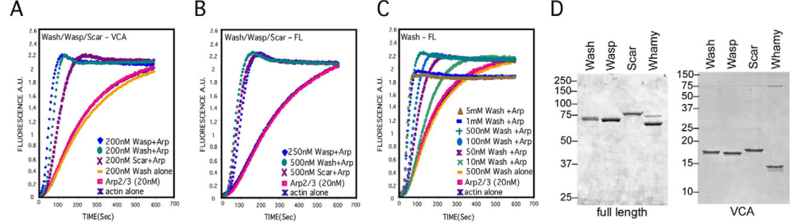

## Question

# Gene Research for Functional Annotation

## ⚠️ CRITICAL: Gene/Protein Identification Context

**BEFORE YOU BEGIN RESEARCH:** You MUST verify you are researching the CORRECT gene/protein. Gene symbols can be ambiguous, especially for less well-characterized genes from non-model organisms.

### Target Gene/Protein Identity (from UniProt):
- **UniProt Accession:** Q7JW27
- **Protein Description:** RecName: Full=WASH complex subunit 1 {ECO:0000250|UniProtKB:A8K0Z3}; AltName: Full=Protein washout; AltName: Full=WAS protein family homolog 1;
- **Gene Information:** Name=wash {ECO:0000312|FlyBase:FBgn0033692}; ORFNames=CG13176 {ECO:0000312|FlyBase:FBgn0033692};
- **Organism (full):** Drosophila melanogaster (Fruit fly).
- **Protein Family:** Belongs to the WASH1 family. .
- **Key Domains:** WASH1. (IPR028290); WASH1_WAHD. (IPR021854); WASH_WAHD (PF11945)

### MANDATORY VERIFICATION STEPS:

1. **Check if the gene symbol "wash" matches the protein description above**
2. **Verify the organism is correct:** Drosophila melanogaster (Fruit fly).
3. **Check if protein family/domains align with what you find in literature**
4. **If you find literature for a DIFFERENT gene with the same or similar symbol, STOP**

### If Gene Symbol is Ambiguous or You Cannot Find Relevant Literature:

**DO NOT PROCEED WITH RESEARCH ON A DIFFERENT GENE.** Instead:
- State clearly: "The gene symbol 'wash' is ambiguous or literature is limited for this specific protein"
- Explain what you found (e.g., "Found extensive literature on a different gene with the same symbol in a different organism")
- Describe the protein based ONLY on the UniProt information provided above
- Suggest that the protein function can be inferred from domain/family information

### Research Target:

Please provide a comprehensive research report on the gene **wash** (gene ID: wash, UniProt: Q7JW27) in DROME.

The research report should be a detailed narrative explaining the function, biological processes, and localization of the gene product. Citations should be given for all claims.

You should prioritize authoritative reviews and primary scientific literature when conducting research. You can supplement
this with annotations you find in gene/protein databases, but these can be outdated or inaccurate.

We are specifically interested in the primary function of the gene - for enzymes, what reaction is catalyzed, and what is the substrate specificity? For transporters, what is the substrate? For structural proteins or adapters, what is the broader structural role? For signaling molecules, what is the role in the pathway.

We are interested in where in or outside the cell the gene product carries out its function.

We are also interested in the signaling or biochemical pathways in which the gene functions. We are less interested in broad pleiotropic effects, except where these elucidate the precise role.

Include evidence where possible. We are interested in both experimental evidence as well as inference from structure, evolution, or bioinformatic analysis. Precise studies should be prioritized over high-throughput, where available.

## Output

Question: You are an expert researcher providing comprehensive, well-cited information.

Provide detailed information focusing on:
1. Key concepts and definitions with current understanding
2. Recent developments and latest research (prioritize 2023-2024 sources)
3. Current applications and real-world implementations
4. Expert opinions and analysis from authoritative sources
5. Relevant statistics and data from recent studies

Format as a comprehensive research report with proper citations. Include URLs and publication dates where available.
Always prioritize recent, authoritative sources and provide specific citations for all major claims.

# Gene Research for Functional Annotation

## ⚠️ CRITICAL: Gene/Protein Identification Context

**BEFORE YOU BEGIN RESEARCH:** You MUST verify you are researching the CORRECT gene/protein. Gene symbols can be ambiguous, especially for less well-characterized genes from non-model organisms.

### Target Gene/Protein Identity (from UniProt):
- **UniProt Accession:** Q7JW27
- **Protein Description:** RecName: Full=WASH complex subunit 1 {ECO:0000250|UniProtKB:A8K0Z3}; AltName: Full=Protein washout; AltName: Full=WAS protein family homolog 1;
- **Gene Information:** Name=wash {ECO:0000312|FlyBase:FBgn0033692}; ORFNames=CG13176 {ECO:0000312|FlyBase:FBgn0033692};
- **Organism (full):** Drosophila melanogaster (Fruit fly).
- **Protein Family:** Belongs to the WASH1 family. .
- **Key Domains:** WASH1. (IPR028290); WASH1_WAHD. (IPR021854); WASH_WAHD (PF11945)

### MANDATORY VERIFICATION STEPS:

1. **Check if the gene symbol "wash" matches the protein description above**
2. **Verify the organism is correct:** Drosophila melanogaster (Fruit fly).
3. **Check if protein family/domains align with what you find in literature**
4. **If you find literature for a DIFFERENT gene with the same or similar symbol, STOP**

### If Gene Symbol is Ambiguous or You Cannot Find Relevant Literature:

**DO NOT PROCEED WITH RESEARCH ON A DIFFERENT GENE.** Instead:
- State clearly: "The gene symbol 'wash' is ambiguous or literature is limited for this specific protein"
- Explain what you found (e.g., "Found extensive literature on a different gene with the same symbol in a different organism")
- Describe the protein based ONLY on the UniProt information provided above
- Suggest that the protein function can be inferred from domain/family information

### Research Target:

Please provide a comprehensive research report on the gene **wash** (gene ID: wash, UniProt: Q7JW27) in DROME.

The research report should be a detailed narrative explaining the function, biological processes, and localization of the gene product. Citations should be given for all claims.

You should prioritize authoritative reviews and primary scientific literature when conducting research. You can supplement
this with annotations you find in gene/protein databases, but these can be outdated or inaccurate.

We are specifically interested in the primary function of the gene - for enzymes, what reaction is catalyzed, and what is the substrate specificity? For transporters, what is the substrate? For structural proteins or adapters, what is the broader structural role? For signaling molecules, what is the role in the pathway.

We are interested in where in or outside the cell the gene product carries out its function.

We are also interested in the signaling or biochemical pathways in which the gene functions. We are less interested in broad pleiotropic effects, except where these elucidate the precise role.

Include evidence where possible. We are interested in both experimental evidence as well as inference from structure, evolution, or bioinformatic analysis. Precise studies should be prioritized over high-throughput, where available.

# Functional annotation report: *Drosophila melanogaster wash* (UniProt Q7JW27)

## Identity and principal function

The research target is the fruit-fly gene **wash** (*washout*; CG13176; FlyBase FBgn0033692), identified as UniProt **Q7JW27** in the supplied accession information. The fly literature independently identifies its product as **Wash**, a member of the WASH branch of the Wiskott–Aldrich syndrome protein family—not the distinct fly proteins WASp or SCAR/WAVE. Its annotated WASH1/WAHD family domains are consistent with this identification. The experimentally characterized C-terminal **VCA** region binds and activates the Arp2/3 complex; the resulting activity promotes *branched actin-filament assembly*. Wash is therefore best annotated as an **actin-nucleation-promoting and cytoskeletal-organizing protein**, not an enzyme with a small-molecule substrate or a transporter with a transported solute. It also bundles and crosslinks pre-existing F-actin and microtubules in purified-protein assays. (nagel2017drosophilawashis pages 1-4, verboon2018washexhibitscontextdependent pages 1-3, liu2009washfunctionsdownstream pages 2-4)

Fly Wash can act with four partners—**FAM21, Strumpellin, SWIP and CCDC53**—in the five-protein WASH regulatory complex, termed **SHRC** in the fly studies. Its activities are context dependent: direct binding to active Rho1 and Spire is documented in oogenesis, whereas SHRC-associated functions are demonstrated in oocytes and at the nuclear envelope. Neither the fly gene name nor these interactions should be substituted for findings about mammalian WASH1 without species-specific evidence. (nagel2017drosophilawashis pages 1-4, liu2009washfunctionsdownstream pages 6-7, verboon2018washexhibitscontextdependent pages 9-12)

The following evidence map separates **observed molecular or cellular effects** from proposed downstream mechanisms.

| Cellular site / system | Wash mechanistic function and immediate partner or cargo | Direct D. melanogaster evidence | Primary reference |
|---|---|---|---|
| Purified-protein system | The C-terminal VCA region activates Arp2/3-dependent branched-actin nucleation; full-length Wash also bundles and crosslinks F-actin with microtubules. | Pyrene-actin assays with purified full-length Wash and Wash-VCA demonstrated concentration- and Arp2/3-dependent polymerization. Microscopy and co-sedimentation showed filament bundling and crosslinking. Under the same conditions, fly Wasp bundled only microtubules and Scar bundled neither. (liu2009washfunctionsdownstream pages 2-4, liu2009washfunctionsdownstream media 72c38dd0) | Liu et al. (2009), Development. [DOI: 10.1242/dev.035246](https://doi.org/10.1242/dev.035246) |
| Rab7-positive late endosomes in macrophages | Produces dynamic endosomal F-actin patches and supports retrieval or recycling of βPS-integrin from late endosomes. | Live imaging showed overlapping Wash-EGFP and F-actin patches; Wash loss or RNAi abolished these patches. Mutants accumulated βPS-integrin in Rab7-positive, but not Rab4-positive, compartments, supporting a late-endosomal recycling defect accompanied by impaired spreading and migration. (nagel2017drosophilawashis pages 25-30, nagel2017drosophilawashis pages 9-11) | Nagel et al. (2017), Journal of Cell Science. [DOI: 10.1242/jcs.193086](https://doi.org/10.1242/jcs.193086) |
| Lysosomes and phagolysosomes | Associates with Vha55, a V-ATPase B subunit, and is required for timely phagolysosome neutralization. | Wash localized with F-actin on Lamp1- or Vha55-positive organelles, and co-immunoprecipitation detected a Wash-Vha55 association. Mutants had enlarged Vha55-positive lysosomes and normal bacterial uptake but persistent pHrodo fluorescence after approximately 60 minutes, indicating delayed neutralization. These findings are consistent with, but do not directly visualize, V-ATPase retrieval. (nagel2017drosophilawashis pages 30-34, nagel2017drosophilawashis pages 11-13, nagel2017drosophilawashis pages 9-11) | Nagel et al. (2017), Journal of Cell Science. [DOI: 10.1242/jcs.193086](https://doi.org/10.1242/jcs.193086) |
| Oocyte cortex and ring-canal-associated actin | Couples Rho1 and Spire signaling, and can operate with the SHRC subunits FAM21, Strumpellin, SWIP and CCDC53, to organize cortical actin and restrain premature ooplasmic streaming. | Purified Wash bound active Rho1-GTP and Spire directly; genetic reduction or RNAi disrupted cortical actin and accelerated streaming. All four SHRC proteins localized to the cortex, and their depletion phenocopied Wash loss. Long-maintained null stocks can appear normal because compensation arises within about five generations, accompanied by increased cortical SCAR; acute RNAi and newly homozygosed or outcrossed mutants retain the phenotype. (liu2009washfunctionsdownstream pages 6-7, liu2009washfunctionsdownstream pages 4-4, verboon2018washexhibitscontextdependent pages 5-7, verboon2018washexhibitscontextdependent pages 9-12) | Liu et al. (2009), Development. [DOI: 10.1242/dev.035246](https://doi.org/10.1242/dev.035246); Verboon et al. (2018), Journal of Cell Science. [DOI: 10.1242/jcs.211573](https://doi.org/10.1242/jcs.211573) |
| Nucleus, nuclear lamina and chromatin | Directly binds B-type Lamin Dm0 and contributes to nuclear shape, lamin-associated heterochromatin organization and chromatin accessibility. | GST pull-down, nuclear co-immunoprecipitation and proximity-ligation assays established physical Wash-Lamin interaction. DamID identified 593 Wash-associated domains that strongly overlapped lamin-associated and transcriptionally silent chromatin; Wash depletion increased accessibility at constitutive-heterochromatin borders and disrupted nuclear morphology and chromosome organization. (verboon2015washinteractswith pages 2-4, verboon2015washinteractswith pages 4-6) | Verboon et al. (2015), Current Biology. [DOI: 10.1016/j.cub.2015.01.052](https://doi.org/10.1016/j.cub.2015.01.052) |
| Nuclear-envelope buds in salivary-gland nuclei | Works with SHRC, Arp2/3 and capping proteins Cpa and Cpb during early nuclear-envelope budding; its separate Lamin-B interaction organizes the lamina. | Wash-null or RNAi nuclei had almost no dFz2C-marked buds. Selective disruption of Wash-SHRC or Wash-Arp2/3 binding severely impaired budding, as did Arp3, Arpc1, Cpa or Cpb depletion; Arp2/3 and Cpa localized near buds. Wash-Lamin-B disruption instead caused lamin-mesh separation and a milder budding defect. Wash and SHRC act after aPKC-dependent site establishment but before Torsin-mediated scission. (verboon2020drosophilawashand pages 8-9, verboon2020drosophilawashand pages 9-11, verboon2020drosophilawashand pages 11-14) | Verboon et al. (2020), Journal of Cell Science. [DOI: 10.1242/jcs.243576](https://doi.org/10.1242/jcs.243576) |
| Heterochromatic DNA double-strand breaks | Wash and SCAR independently promote Arp2/3-dependent nuclear F-actin assembly used for myosin-driven break relocation toward the nuclear periphery. | RNAi against Wash or Scar impaired break relocalization, whereas depletion of canonical Wasp did not; combined Scar and Wash depletion resembled Arp2/3 loss. Live imaging and perturbation placed Arp2/3-generated filaments upstream of myosin- and Unc45-driven directed motion, repair completion and suppression of chromosome rearrangements, although direct Wash recruitment or myosin activation was not biochemically demonstrated. (caridi2018nuclearfactinand pages 1-2, caridi2018nuclearfactinand pages 6-8) | Caridi et al. (2018), Nature. [DOI: 10.1038/s41586-018-0242-8](https://doi.org/10.1038/s41586-018-0242-8) |

*Table: Experimental evidence for the molecular functions and cellular locations of Drosophila melanogaster Wash (UniProt Q7JW27). The matrix separates direct fly evidence from mechanistic inference and highlights important caveats.*

## Where Wash acts and what it does

**Endosomes, lysosomes and cell adhesion.** In fly macrophages, Wash-EGFP occupies dynamic F-actin patches on vesicles, notably **Rab4-positive and Rab7-positive endosomes**; Wash loss or RNAi eliminates the conspicuous vesicular actin patches. Mutant cells accumulate the βPS-integrin adhesion receptor in **Rab7-positive late endosomes**, but not detectably in Rab4-positive compartments. This makes late-endosomal retrieval/recycling of βPS-integrin the best-supported explanation for reduced peripheral adhesion, impaired macrophage spreading and diminished migration. Wash was not detected at the focal adhesions themselves; its primary demonstrated role here is upstream **membrane trafficking and local actin organization**, not serving as a focal-adhesion structural component. In one endosomal-vesicle analysis, βPS-integrin accumulation differed between six control and six mutant macrophages, with **12 versus 19 vesicles analyzed** (*P* < 0.047). (nagel2017drosophilawashis pages 25-30, nagel2017drosophilawashis pages 6-9, nagel2017drosophilawashis pages 9-11)

Wash also associates with **Lamp1- and Vha55-marked lysosomes** and with F-actin patches on acidifying phagolysosomes. Co-immunoprecipitation establishes an association with **Vha55**, the regulatory B subunit of the proton-pumping V-ATPase. Wash-mutant Vha55-positive lysosomes averaged **0.59 µm²**, versus **0.36 µm²** in controls (549 versus 628 vesicles; *P* < 0.0001). Mutant macrophages take up pH-sensitive labeled bacteria, but their phagolysosomal fluorescence continues rising after approximately **60 minutes**, when the control signal has leveled off: uptake is preserved, whereas timely **neutralization after acidification** is impaired. Wash-dependent actin-mediated retrieval of V-ATPase is a plausible mechanistic model, **not a directly visualized V-ATPase-retrieval event in these fly experiments**. (nagel2017drosophilawashis pages 30-34, nagel2017drosophilawashis pages 11-13, nagel2017drosophilawashis pages 9-11)

In the **larval fat body**, Wash marks actin-rich, Atg8-positive vesicles. Under amino-acid starvation, mutants have more prominent acidic compartments, increased active cathepsin-B staining and higher amounts of Atg8 protein, including lipidated Atg8-II; starved mutants die sooner, and a Wash-EGFP transgene rescues survival. These observations implicate Wash in the **acidification and functional handling of autophagic compartments**. They do not by themselves establish a precisely quantified change in autophagic *flux*: Atg8 accumulation and acid-sensitive dyes can reflect more than one underlying step. (nagel2017drosophilawashis pages 30-34, nagel2017drosophilawashis pages 11-13)

**Oocyte cortex and Rho1 signaling.** Wash is enriched at the **stage 7–9 oocyte cortex** and is also detected in nurse and follicle cells. Purified Wash preferentially binds GTP-loaded **Rho1**, rather than the tested Rac or Cdc42 proteins, and directly binds **Spire**; association with the formin **Cappuccino** was found in complexes but was not established as direct binding. Purified Wash activates Arp2/3-mediated actin assembly and bundles/crosslinks F-actin and microtubules. Together, these activities provide a biochemical route by which Rho1/Spire-associated Wash could coordinate cortical filament architecture and restrain **premature ooplasmic streaming**. In the original reduced-Wash condition, stage-7 yolk-granule movement averaged **38.6 ± 1.7 nm/s**, versus **20.9 ± 2 nm/s** in controls. Rho1-GTP binding did *not* increase Wash-mediated Arp2/3 nucleation in the purified assay, so Rho1 should not be described as a proven direct activator of that biochemical activity. (liu2009washfunctionsdownstream pages 6-7, liu2009washfunctionsdownstream pages 4-4, liu2009washfunctionsdownstream pages 2-4, verboon2018washexhibitscontextdependent pages 5-7)

Interpretation of oogenesis requires a **genetic-background caveat**. A 2017 study found a viable wash-null stock and attributed earlier severe developmental phenotypes to a second-site lesion. A 2018 reanalysis confirmed an unrelated background lethal mutation but found cortical Wash with independent antibodies and an endogenous-promoter fusion, and reproduced premature streaming and cortical/outer-ring-canal actin defects using independent RNAi lines and newly homozygosed or outcrossed mutants. Homozygous stocks kept for approximately **five generations** became substantially healthier, coincident with increased **SCAR** at the oocyte cortex. Thus Wash loss can be **compensated in some stocks**; viability of an established stock neither proves that every earlier phenotype was caused by wash nor proves that Wash has no oocyte function. SCAR compensation is supported by localization and genetics, although the exact compensatory mechanism is not fully resolved. (nagel2017drosophilawashis pages 11-13, verboon2018washexhibitscontextdependent pages 5-7, verboon2018washexhibitscontextdependent pages 12-14, verboon2018washexhibitscontextdependent pages 7-9, verboon2018washexhibitscontextdependent pages 9-12)

**Nucleus: lamina, budding and DNA repair.** Nuclear Wash **directly binds the B-type lamin Lamin Dm0** in purified-protein pull-downs and associates with it in embryo nuclear extracts. Removing Wash from the nucleus compromises nuclear morphology and chromosome organization. Genome-wide DamID identified **593 Wash-associated domains**, averaging approximately **40 kb** and substantially overlapping lamin-associated, predominantly transcriptionally silent chromatin; Wash depletion increased accessibility at constitutive-heterochromatin borders. These results support a **lamina/chromatin-organizing role**, not a demonstrated Wash DNA-binding specificity or a universal direct transcription-activation function. (verboon2015washinteractswith pages 2-4, verboon2015wiskottaldrichsyndromeproteins pages 10-13, verboon2015washinteractswith pages 4-6)

A distinct nuclear function occurs at **nuclear-envelope buds** in larval salivary glands. Wash, SHRC, Arp2/3 and the actin-capping proteins **Cpa/Cpb** help generate buds assayed by dFz2C-associated foci. Control nuclei averaged **6.6 ± 0.3 buds**, versus **0.2 ± 0.0** in wash-null nuclei and **0.1 ± 0.0** after wash RNAi, with approximately 101–104 nuclei per group (*P* < 0.0001). A Wash mutant defective in Arp2/3 association gave **0.5 ± 0.1 buds per nucleus**, as did one defective in SHRC interaction; a mutant defective in Lamin-B interaction gave a less severe **1.5 ± 0.1**. The experiments distinguish an **SHRC–Arp2/3-dependent bud-formation role** from a partly independent **Wash–Lamin structural role** that maintains lamin meshwork organization. Genetic ordering places Wash/SHRC after proposed aPKC-dependent establishment of budding sites and before Torsin-associated bud scission; exactly how its actin network deforms the nuclear envelope remains unresolved. (verboon2020drosophilawashand pages 8-9, verboon2020drosophilawashand pages 4-6, verboon2020drosophilawashand pages 16-18, verboon2020drosophilawashand pages 11-14)

Wash also contributes, alongside **SCAR but not canonical WASp**, to Arp2/3-dependent **nuclear F-actin formation at heterochromatic DNA double-strand breaks**. In fly cells, depletion of Wash or SCAR impairs the relocation of breaks from heterochromatin toward the nuclear periphery, where myosins and Unc45 participate in directed movement needed for effective repair. This assigns Wash a specific **actin-dependent relocation** role; it does not demonstrate direct DNA binding, direct activation of the myosin motors or a general requirement for the initial DNA-damage response. (caridi2018nuclearfactinand pages 1-2, caridi2018nuclearfactinand pages 6-8)

## Recent perspective, applications and limits

A **February 2023** specialist review identifies fly Wash, SHRC, Cpa and Arp2/3 as components of the nuclear-envelope-budding machinery, while emphasizing that **how these factors mechanically drive budding and whether the mechanism is conserved elsewhere remain open questions**. In the literature retrieved for this report, the strongest fly-specific mechanistic experiments remain the 2009–2020 studies above; the 2023 review synthesizes those findings rather than reporting a new 2023–2024 fly-Wash experiment. A **2023 mTORC1–endolysosomal actin** study provides a newer *mammalian* WASH comparison, but does **not** establish an mTORC1-signaling role for Q7JW27 in flies. (keuenhof2023nuclearenvelopebudding pages 6-9, priya2023codependenciesofmtorc1 pages 1-2)

The immediate real-world implementation of this knowledge is **functional annotation and experimental use of Drosophila models**: Wash perturbation provides tractable assays of βPS-integrin trafficking and macrophage motility, phagolysosome pH, oocyte cytoskeletal organization, and nuclear-envelope budding. Those assays support mechanistic studies; the retrieved evidence does **not** establish a clinical application or therapy targeting fly Wash. The most defensible single-line annotation is: **a WASH-family Arp2/3 activator and actin/microtubule organizer that acts at endolysosomal membranes, the oocyte cortex and selected nuclear structures to control cargo sorting, organelle pH regulation, cytoskeletal architecture and nuclear remodeling**. (liu2009washfunctionsdownstream pages 6-7, verboon2020drosophilawashand pages 8-9, nagel2017drosophilawashis pages 9-11, liu2009washfunctionsdownstream pages 2-4)

### Key sources and publication dates

- Liu *et al.*, **August 2009**, *Development*, “Wash functions downstream of Rho and links linear and branched actin nucleation factors.” https://doi.org/10.1242/dev.035246. (liu2009washfunctionsdownstream pages 6-7, liu2009washfunctionsdownstream pages 2-4)
- Verboon *et al.*, **March 2015**, *Current Biology*, “Wash interacts with lamin and affects global nuclear organization.” https://doi.org/10.1016/j.cub.2015.01.052. (verboon2015washinteractswith pages 2-4, verboon2015washinteractswith pages 4-6)
- Nagel *et al.*, **January 2017**, *Journal of Cell Science*, “Drosophila WASH is required for integrin-mediated cell adhesion, cell motility and lysosomal neutralization.” https://doi.org/10.1242/jcs.193086. (nagel2017drosophilawashis pages 30-34, nagel2017drosophilawashis pages 9-11)
- Verboon *et al.*, **April 2018**, *Journal of Cell Science*, “Wash exhibits context-dependent phenotypes and, along with the WASH regulatory complex, regulates Drosophila oogenesis.” https://doi.org/10.1242/jcs.211573. (verboon2018washexhibitscontextdependent pages 12-14, verboon2018washexhibitscontextdependent pages 9-12)
- Caridi *et al.*, **June 2018**, *Nature*, “Nuclear F-actin and myosins drive relocalization of heterochromatic breaks.” https://doi.org/10.1038/s41586-018-0242-8. (caridi2018nuclearfactinand pages 1-2)
- Verboon *et al.*, **July 2020**, *Journal of Cell Science*, “Drosophila Wash and the Wash regulatory complex function in nuclear envelope budding.” https://doi.org/10.1242/jcs.243576. (verboon2020drosophilawashand pages 8-9, verboon2020drosophilawashand pages 11-14)
- Keuenhof *et al.*, **February 2023**, *Nucleus*, “Nuclear envelope budding and its cellular functions” [review]. https://doi.org/10.1080/19491034.2023.2178184. (keuenhof2023nuclearenvelopebudding pages 6-9)

References

1. (nagel2017drosophilawashis pages 1-4): Benedikt M. Nagel, Meike Bechtold, Luis Garcia Rodriguez, and Sven Bogdan. Drosophila wash is required for integrin-mediated cell adhesion, cell motility and lysosomal neutralization. Journal of Cell Science, 130:344-359, Jan 2017. URL: https://doi.org/10.1242/jcs.193086, doi:10.1242/jcs.193086. This article has 49 citations and is from a domain leading peer-reviewed journal.

2. (verboon2018washexhibitscontextdependent pages 1-3): Jeffrey M. Verboon, Jacob R. Decker, Mitsutoshi Nakamura, and Susan M. Parkhurst. Wash exhibits context-dependent phenotypes and, along with the wash regulatory complex, regulates drosophila oogenesis. Journal of Cell Science, Apr 2018. URL: https://doi.org/10.1242/jcs.211573, doi:10.1242/jcs.211573. This article has 17 citations and is from a domain leading peer-reviewed journal.

3. (liu2009washfunctionsdownstream pages 2-4): Raymond Liu, Maria Teresa Abreu-Blanco, Kevin C. Barry, Elena V. Linardopoulou, Gregory E. Osborn, and Susan M. Parkhurst. Wash functions downstream of rho and links linear and branched actin nucleation factors. Development, 136:2849-2860, Aug 2009. URL: https://doi.org/10.1242/dev.035246, doi:10.1242/dev.035246. This article has 135 citations and is from a domain leading peer-reviewed journal.

4. (liu2009washfunctionsdownstream pages 6-7): Raymond Liu, Maria Teresa Abreu-Blanco, Kevin C. Barry, Elena V. Linardopoulou, Gregory E. Osborn, and Susan M. Parkhurst. Wash functions downstream of rho and links linear and branched actin nucleation factors. Development, 136:2849-2860, Aug 2009. URL: https://doi.org/10.1242/dev.035246, doi:10.1242/dev.035246. This article has 135 citations and is from a domain leading peer-reviewed journal.

5. (verboon2018washexhibitscontextdependent pages 9-12): Jeffrey M. Verboon, Jacob R. Decker, Mitsutoshi Nakamura, and Susan M. Parkhurst. Wash exhibits context-dependent phenotypes and, along with the wash regulatory complex, regulates drosophila oogenesis. Journal of Cell Science, Apr 2018. URL: https://doi.org/10.1242/jcs.211573, doi:10.1242/jcs.211573. This article has 17 citations and is from a domain leading peer-reviewed journal.

6. (liu2009washfunctionsdownstream media 72c38dd0): Raymond Liu, Maria Teresa Abreu-Blanco, Kevin C. Barry, Elena V. Linardopoulou, Gregory E. Osborn, and Susan M. Parkhurst. Wash functions downstream of rho and links linear and branched actin nucleation factors. Development, 136:2849-2860, Aug 2009. URL: https://doi.org/10.1242/dev.035246, doi:10.1242/dev.035246. This article has 135 citations and is from a domain leading peer-reviewed journal.

7. (nagel2017drosophilawashis pages 25-30): Benedikt M. Nagel, Meike Bechtold, Luis Garcia Rodriguez, and Sven Bogdan. Drosophila wash is required for integrin-mediated cell adhesion, cell motility and lysosomal neutralization. Journal of Cell Science, 130:344-359, Jan 2017. URL: https://doi.org/10.1242/jcs.193086, doi:10.1242/jcs.193086. This article has 49 citations and is from a domain leading peer-reviewed journal.

8. (nagel2017drosophilawashis pages 9-11): Benedikt M. Nagel, Meike Bechtold, Luis Garcia Rodriguez, and Sven Bogdan. Drosophila wash is required for integrin-mediated cell adhesion, cell motility and lysosomal neutralization. Journal of Cell Science, 130:344-359, Jan 2017. URL: https://doi.org/10.1242/jcs.193086, doi:10.1242/jcs.193086. This article has 49 citations and is from a domain leading peer-reviewed journal.

9. (nagel2017drosophilawashis pages 30-34): Benedikt M. Nagel, Meike Bechtold, Luis Garcia Rodriguez, and Sven Bogdan. Drosophila wash is required for integrin-mediated cell adhesion, cell motility and lysosomal neutralization. Journal of Cell Science, 130:344-359, Jan 2017. URL: https://doi.org/10.1242/jcs.193086, doi:10.1242/jcs.193086. This article has 49 citations and is from a domain leading peer-reviewed journal.

10. (nagel2017drosophilawashis pages 11-13): Benedikt M. Nagel, Meike Bechtold, Luis Garcia Rodriguez, and Sven Bogdan. Drosophila wash is required for integrin-mediated cell adhesion, cell motility and lysosomal neutralization. Journal of Cell Science, 130:344-359, Jan 2017. URL: https://doi.org/10.1242/jcs.193086, doi:10.1242/jcs.193086. This article has 49 citations and is from a domain leading peer-reviewed journal.

11. (liu2009washfunctionsdownstream pages 4-4): Raymond Liu, Maria Teresa Abreu-Blanco, Kevin C. Barry, Elena V. Linardopoulou, Gregory E. Osborn, and Susan M. Parkhurst. Wash functions downstream of rho and links linear and branched actin nucleation factors. Development, 136:2849-2860, Aug 2009. URL: https://doi.org/10.1242/dev.035246, doi:10.1242/dev.035246. This article has 135 citations and is from a domain leading peer-reviewed journal.

12. (verboon2018washexhibitscontextdependent pages 5-7): Jeffrey M. Verboon, Jacob R. Decker, Mitsutoshi Nakamura, and Susan M. Parkhurst. Wash exhibits context-dependent phenotypes and, along with the wash regulatory complex, regulates drosophila oogenesis. Journal of Cell Science, Apr 2018. URL: https://doi.org/10.1242/jcs.211573, doi:10.1242/jcs.211573. This article has 17 citations and is from a domain leading peer-reviewed journal.

13. (verboon2015washinteractswith pages 2-4): Jeffrey M. Verboon, Hector Rincon-Arano, Timothy R. Werwie, Jeffrey J. Delrow, David Scalzo, Vivek Nandakumar, Mark Groudine, and Susan M. Parkhurst. Wash interacts with lamin and affects global nuclear organization. Current biology : CB, 25:804-810, Mar 2015. URL: https://doi.org/10.1016/j.cub.2015.01.052, doi:10.1016/j.cub.2015.01.052. This article has 71 citations.

14. (verboon2015washinteractswith pages 4-6): Jeffrey M. Verboon, Hector Rincon-Arano, Timothy R. Werwie, Jeffrey J. Delrow, David Scalzo, Vivek Nandakumar, Mark Groudine, and Susan M. Parkhurst. Wash interacts with lamin and affects global nuclear organization. Current biology : CB, 25:804-810, Mar 2015. URL: https://doi.org/10.1016/j.cub.2015.01.052, doi:10.1016/j.cub.2015.01.052. This article has 71 citations.

15. (verboon2020drosophilawashand pages 8-9): Jeffrey M. Verboon, Mitsutoshi Nakamura, Kerri A. Davidson, Jacob R. Decker, Vivek Nandakumar, and Susan M. Parkhurst. <i>drosophila</i> wash and the wash regulatory complex function in nuclear envelope budding. Journal of Cell Science, Jul 2020. URL: https://doi.org/10.1242/jcs.243576, doi:10.1242/jcs.243576. This article has 16 citations and is from a domain leading peer-reviewed journal.

16. (verboon2020drosophilawashand pages 9-11): Jeffrey M. Verboon, Mitsutoshi Nakamura, Kerri A. Davidson, Jacob R. Decker, Vivek Nandakumar, and Susan M. Parkhurst. <i>drosophila</i> wash and the wash regulatory complex function in nuclear envelope budding. Journal of Cell Science, Jul 2020. URL: https://doi.org/10.1242/jcs.243576, doi:10.1242/jcs.243576. This article has 16 citations and is from a domain leading peer-reviewed journal.

17. (verboon2020drosophilawashand pages 11-14): Jeffrey M. Verboon, Mitsutoshi Nakamura, Kerri A. Davidson, Jacob R. Decker, Vivek Nandakumar, and Susan M. Parkhurst. <i>drosophila</i> wash and the wash regulatory complex function in nuclear envelope budding. Journal of Cell Science, Jul 2020. URL: https://doi.org/10.1242/jcs.243576, doi:10.1242/jcs.243576. This article has 16 citations and is from a domain leading peer-reviewed journal.

18. (caridi2018nuclearfactinand pages 1-2): Christopher P. Caridi, Carla D’Agostino, Taehyun Ryu, Grzegorz Zapotoczny, Laetitia Delabaere, Xiao Li, Varandt Y. Khodaverdian, Nuno Amaral, Emily Lin, Alesandra R. Rau, and Irene Chiolo. Nuclear f-actin and myosins drive relocalization of heterochromatic breaks. Nature, 559:54-60, Jun 2018. URL: https://doi.org/10.1038/s41586-018-0242-8, doi:10.1038/s41586-018-0242-8. This article has 476 citations and is from a highest quality peer-reviewed journal.

19. (caridi2018nuclearfactinand pages 6-8): Christopher P. Caridi, Carla D’Agostino, Taehyun Ryu, Grzegorz Zapotoczny, Laetitia Delabaere, Xiao Li, Varandt Y. Khodaverdian, Nuno Amaral, Emily Lin, Alesandra R. Rau, and Irene Chiolo. Nuclear f-actin and myosins drive relocalization of heterochromatic breaks. Nature, 559:54-60, Jun 2018. URL: https://doi.org/10.1038/s41586-018-0242-8, doi:10.1038/s41586-018-0242-8. This article has 476 citations and is from a highest quality peer-reviewed journal.

20. (nagel2017drosophilawashis pages 6-9): Benedikt M. Nagel, Meike Bechtold, Luis Garcia Rodriguez, and Sven Bogdan. Drosophila wash is required for integrin-mediated cell adhesion, cell motility and lysosomal neutralization. Journal of Cell Science, 130:344-359, Jan 2017. URL: https://doi.org/10.1242/jcs.193086, doi:10.1242/jcs.193086. This article has 49 citations and is from a domain leading peer-reviewed journal.

21. (verboon2018washexhibitscontextdependent pages 12-14): Jeffrey M. Verboon, Jacob R. Decker, Mitsutoshi Nakamura, and Susan M. Parkhurst. Wash exhibits context-dependent phenotypes and, along with the wash regulatory complex, regulates drosophila oogenesis. Journal of Cell Science, Apr 2018. URL: https://doi.org/10.1242/jcs.211573, doi:10.1242/jcs.211573. This article has 17 citations and is from a domain leading peer-reviewed journal.

22. (verboon2018washexhibitscontextdependent pages 7-9): Jeffrey M. Verboon, Jacob R. Decker, Mitsutoshi Nakamura, and Susan M. Parkhurst. Wash exhibits context-dependent phenotypes and, along with the wash regulatory complex, regulates drosophila oogenesis. Journal of Cell Science, Apr 2018. URL: https://doi.org/10.1242/jcs.211573, doi:10.1242/jcs.211573. This article has 17 citations and is from a domain leading peer-reviewed journal.

23. (verboon2015wiskottaldrichsyndromeproteins pages 10-13): Jeffrey M Verboon, Bina Sugumar, and Susan M Parkhurst. Wiskott-aldrich syndrome proteins in the nucleus: awash with possibilities. Nucleus, 6:349-359, Aug 2015. URL: https://doi.org/10.1080/19491034.2015.1086051, doi:10.1080/19491034.2015.1086051. This article has 26 citations and is from a peer-reviewed journal.

24. (verboon2020drosophilawashand pages 4-6): Jeffrey M. Verboon, Mitsutoshi Nakamura, Kerri A. Davidson, Jacob R. Decker, Vivek Nandakumar, and Susan M. Parkhurst. <i>drosophila</i> wash and the wash regulatory complex function in nuclear envelope budding. Journal of Cell Science, Jul 2020. URL: https://doi.org/10.1242/jcs.243576, doi:10.1242/jcs.243576. This article has 16 citations and is from a domain leading peer-reviewed journal.

25. (verboon2020drosophilawashand pages 16-18): Jeffrey M. Verboon, Mitsutoshi Nakamura, Kerri A. Davidson, Jacob R. Decker, Vivek Nandakumar, and Susan M. Parkhurst. <i>drosophila</i> wash and the wash regulatory complex function in nuclear envelope budding. Journal of Cell Science, Jul 2020. URL: https://doi.org/10.1242/jcs.243576, doi:10.1242/jcs.243576. This article has 16 citations and is from a domain leading peer-reviewed journal.

26. (keuenhof2023nuclearenvelopebudding pages 6-9): Katharina S. Keuenhof, Verena Kohler, Filomena Broeskamp, Dimitra Panagaki, Sean D. Speese, Sabrina Büttner, and Johanna L. Höög. Nuclear envelope budding and its cellular functions. Nucleus, Feb 2023. URL: https://doi.org/10.1080/19491034.2023.2178184, doi:10.1080/19491034.2023.2178184. This article has 27 citations and is from a peer-reviewed journal.

27. (priya2023codependenciesofmtorc1 pages 1-2): Amulya Priya, Sandra Antoine-Bally, Anne-Sophie Macé, Pedro Monteiro, Valentin Sabatet, David Remy, Florent Dingli, Damarys Loew, Constantinos Demetriades, Alexis M. Gautreau, and Philippe Chavrier. Codependencies of mtorc1 signaling and endolysosomal actin structures. Science Advances, Sep 2023. URL: https://doi.org/10.1126/sciadv.add9084, doi:10.1126/sciadv.add9084. This article has 11 citations and is from a highest quality peer-reviewed journal.

## Artifacts

- [Edison artifact artifact-00](wash-deep-research-falcon_artifacts/artifact-00.md)

## Citations

1. caridi2018nuclearfactinand pages 1-2
2. keuenhof2023nuclearenvelopebudding pages 6-9
3. nagel2017drosophilawashis pages 1-4
4. verboon2018washexhibitscontextdependent pages 1-3
5. liu2009washfunctionsdownstream pages 2-4
6. liu2009washfunctionsdownstream pages 6-7
7. verboon2018washexhibitscontextdependent pages 9-12
8. nagel2017drosophilawashis pages 25-30
9. nagel2017drosophilawashis pages 9-11
10. nagel2017drosophilawashis pages 30-34
11. nagel2017drosophilawashis pages 11-13
12. liu2009washfunctionsdownstream pages 4-4
13. verboon2018washexhibitscontextdependent pages 5-7
14. verboon2015washinteractswith pages 2-4
15. verboon2015washinteractswith pages 4-6
16. verboon2020drosophilawashand pages 8-9
17. verboon2020drosophilawashand pages 9-11
18. verboon2020drosophilawashand pages 11-14
19. caridi2018nuclearfactinand pages 6-8
20. nagel2017drosophilawashis pages 6-9
21. verboon2018washexhibitscontextdependent pages 12-14
22. verboon2018washexhibitscontextdependent pages 7-9
23. verboon2015wiskottaldrichsyndromeproteins pages 10-13
24. verboon2020drosophilawashand pages 4-6
25. verboon2020drosophilawashand pages 16-18
26. DOI: 10.1242/dev.035246
27. DOI: 10.1242/jcs.193086
28. DOI: 10.1242/jcs.211573
29. DOI: 10.1016/j.cub.2015.01.052
30. DOI: 10.1242/jcs.243576
31. DOI: 10.1038/s41586-018-0242-8
32. review
33. https://doi.org/10.1242/dev.035246
34. https://doi.org/10.1242/jcs.193086
35. https://doi.org/10.1242/jcs.211573
36. https://doi.org/10.1016/j.cub.2015.01.052
37. https://doi.org/10.1242/jcs.243576
38. https://doi.org/10.1038/s41586-018-0242-8
39. https://doi.org/10.1242/dev.035246.
40. https://doi.org/10.1016/j.cub.2015.01.052.
41. https://doi.org/10.1242/jcs.193086.
42. https://doi.org/10.1242/jcs.211573.
43. https://doi.org/10.1038/s41586-018-0242-8.
44. https://doi.org/10.1242/jcs.243576.
45. https://doi.org/10.1080/19491034.2023.2178184.
46. https://doi.org/10.1242/jcs.193086,
47. https://doi.org/10.1242/jcs.211573,
48. https://doi.org/10.1242/dev.035246,
49. https://doi.org/10.1016/j.cub.2015.01.052,
50. https://doi.org/10.1242/jcs.243576,
51. https://doi.org/10.1038/s41586-018-0242-8,
52. https://doi.org/10.1080/19491034.2015.1086051,
53. https://doi.org/10.1080/19491034.2023.2178184,
54. https://doi.org/10.1126/sciadv.add9084,