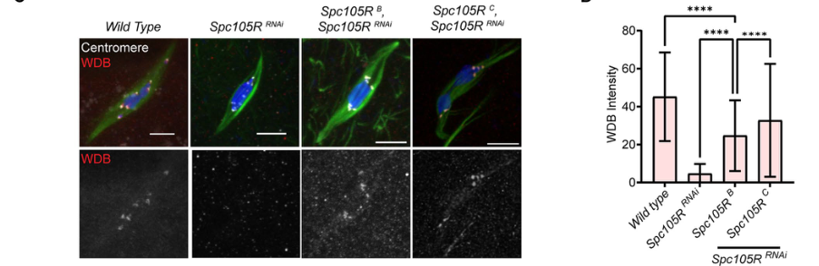

## Question

# Gene Research for Functional Annotation

## ⚠️ CRITICAL: Gene/Protein Identification Context

**BEFORE YOU BEGIN RESEARCH:** You MUST verify you are researching the CORRECT gene/protein. Gene symbols can be ambiguous, especially for less well-characterized genes from non-model organisms.

### Target Gene/Protein Identity (from UniProt):
- **UniProt Accession:** A0A6F7R657
- **Protein Description:** SubName: Full=Widerborst, isoform H {ECO:0000313|EMBL:AAN14118.2};
- **Gene Information:** Name=wdb {ECO:0000313|EMBL:AAN14118.2, ECO:0000313|FlyBase:FBgn0027492}; Synonyms=0318/07 {ECO:0000313|EMBL:AAN14118.2}, B56-2 {ECO:0000313|EMBL:AAN14118.2}, BcDNA:LD34343 {ECO:0000313|EMBL:AAN14118.2}, BEST:LD02456 {ECO:0000313|EMBL:AAN14118.2}, dB56-2 {ECO:0000313|EMBL:AAN14118.2}, Dmel\CG5643 {ECO:0000313|EMBL:AAN14118.2}, dPP2A {ECO:0000313|EMBL:AAN14118.2}, dPP2A-B56-2 {ECO:0000313|EMBL:AAN14118.2}, EP3559 {ECO:0000313|EMBL:AAN14118.2}, l(3)S031807 {ECO:0000313|EMBL:AAN14118.2}, LD02456 {ECO:0000313|EMBL:AAN14118.2}, PP2-AB {ECO:0000313|EMBL:AAN14118.2}, PP2A {ECO:0000313|EMBL:AAN14118.2}, PP2a {ECO:0000313|EMBL:AAN14118.2}, PP2A-B' {ECO:0000313|EMBL:AAN14118.2}, PP2A[B'-2] {ECO:0000313|EMBL:AAN14118.2}, wbd {ECO:0000313|EMBL:AAN14118.2}, WDB {ECO:0000313|EMBL:AAN14118.2}, Wdb {ECO:0000313|EMBL:AAN14118.2}, Widerborst {ECO:0000313|EMBL:AAN14118.2}; ORFNames=CG5643 {ECO:0000313|EMBL:AAN14118.2, ECO:0000313|FlyBase:FBgn0027492}, Dmel_CG5643 {ECO:0000313|EMBL:AAN14118.2};
- **Organism (full):** Drosophila melanogaster (Fruit fly).
- **Protein Family:** Belongs to the phosphatase 2A regulatory subunit B56
- **Key Domains:** ARM-like. (IPR011989); ARM-type_fold. (IPR016024); PP2A_B56. (IPR002554); B56 (PF01603)

### MANDATORY VERIFICATION STEPS:

1. **Check if the gene symbol "wdb" matches the protein description above**
2. **Verify the organism is correct:** Drosophila melanogaster (Fruit fly).
3. **Check if protein family/domains align with what you find in literature**
4. **If you find literature for a DIFFERENT gene with the same or similar symbol, STOP**

### If Gene Symbol is Ambiguous or You Cannot Find Relevant Literature:

**DO NOT PROCEED WITH RESEARCH ON A DIFFERENT GENE.** Instead:
- State clearly: "The gene symbol 'wdb' is ambiguous or literature is limited for this specific protein"
- Explain what you found (e.g., "Found extensive literature on a different gene with the same symbol in a different organism")
- Describe the protein based ONLY on the UniProt information provided above
- Suggest that the protein function can be inferred from domain/family information

### Research Target:

Please provide a comprehensive research report on the gene **wdb** (gene ID: wdb, UniProt: A0A6F7R657) in DROME.

The research report should be a detailed narrative explaining the function, biological processes, and localization of the gene product. Citations should be given for all claims.

You should prioritize authoritative reviews and primary scientific literature when conducting research. You can supplement
this with annotations you find in gene/protein databases, but these can be outdated or inaccurate.

We are specifically interested in the primary function of the gene - for enzymes, what reaction is catalyzed, and what is the substrate specificity? For transporters, what is the substrate? For structural proteins or adapters, what is the broader structural role? For signaling molecules, what is the role in the pathway.

We are interested in where in or outside the cell the gene product carries out its function.

We are also interested in the signaling or biochemical pathways in which the gene functions. We are less interested in broad pleiotropic effects, except where these elucidate the precise role.

Include evidence where possible. We are interested in both experimental evidence as well as inference from structure, evolution, or bioinformatic analysis. Precise studies should be prioritized over high-throughput, where available.

## Output

Question: You are an expert researcher providing comprehensive, well-cited information.

Provide detailed information focusing on:
1. Key concepts and definitions with current understanding
2. Recent developments and latest research (prioritize 2023-2024 sources)
3. Current applications and real-world implementations
4. Expert opinions and analysis from authoritative sources
5. Relevant statistics and data from recent studies

Format as a comprehensive research report with proper citations. Include URLs and publication dates where available.
Always prioritize recent, authoritative sources and provide specific citations for all major claims.

# Gene Research for Functional Annotation

## ⚠️ CRITICAL: Gene/Protein Identification Context

**BEFORE YOU BEGIN RESEARCH:** You MUST verify you are researching the CORRECT gene/protein. Gene symbols can be ambiguous, especially for less well-characterized genes from non-model organisms.

### Target Gene/Protein Identity (from UniProt):
- **UniProt Accession:** A0A6F7R657
- **Protein Description:** SubName: Full=Widerborst, isoform H {ECO:0000313|EMBL:AAN14118.2};
- **Gene Information:** Name=wdb {ECO:0000313|EMBL:AAN14118.2, ECO:0000313|FlyBase:FBgn0027492}; Synonyms=0318/07 {ECO:0000313|EMBL:AAN14118.2}, B56-2 {ECO:0000313|EMBL:AAN14118.2}, BcDNA:LD34343 {ECO:0000313|EMBL:AAN14118.2}, BEST:LD02456 {ECO:0000313|EMBL:AAN14118.2}, dB56-2 {ECO:0000313|EMBL:AAN14118.2}, Dmel\CG5643 {ECO:0000313|EMBL:AAN14118.2}, dPP2A {ECO:0000313|EMBL:AAN14118.2}, dPP2A-B56-2 {ECO:0000313|EMBL:AAN14118.2}, EP3559 {ECO:0000313|EMBL:AAN14118.2}, l(3)S031807 {ECO:0000313|EMBL:AAN14118.2}, LD02456 {ECO:0000313|EMBL:AAN14118.2}, PP2-AB {ECO:0000313|EMBL:AAN14118.2}, PP2A {ECO:0000313|EMBL:AAN14118.2}, PP2a {ECO:0000313|EMBL:AAN14118.2}, PP2A-B' {ECO:0000313|EMBL:AAN14118.2}, PP2A[B'-2] {ECO:0000313|EMBL:AAN14118.2}, wbd {ECO:0000313|EMBL:AAN14118.2}, WDB {ECO:0000313|EMBL:AAN14118.2}, Wdb {ECO:0000313|EMBL:AAN14118.2}, Widerborst {ECO:0000313|EMBL:AAN14118.2}; ORFNames=CG5643 {ECO:0000313|EMBL:AAN14118.2, ECO:0000313|FlyBase:FBgn0027492}, Dmel_CG5643 {ECO:0000313|EMBL:AAN14118.2};
- **Organism (full):** Drosophila melanogaster (Fruit fly).
- **Protein Family:** Belongs to the phosphatase 2A regulatory subunit B56
- **Key Domains:** ARM-like. (IPR011989); ARM-type_fold. (IPR016024); PP2A_B56. (IPR002554); B56 (PF01603)

### MANDATORY VERIFICATION STEPS:

1. **Check if the gene symbol "wdb" matches the protein description above**
2. **Verify the organism is correct:** Drosophila melanogaster (Fruit fly).
3. **Check if protein family/domains align with what you find in literature**
4. **If you find literature for a DIFFERENT gene with the same or similar symbol, STOP**

### If Gene Symbol is Ambiguous or You Cannot Find Relevant Literature:

**DO NOT PROCEED WITH RESEARCH ON A DIFFERENT GENE.** Instead:
- State clearly: "The gene symbol 'wdb' is ambiguous or literature is limited for this specific protein"
- Explain what you found (e.g., "Found extensive literature on a different gene with the same symbol in a different organism")
- Describe the protein based ONLY on the UniProt information provided above
- Suggest that the protein function can be inferred from domain/family information

### Research Target:

Please provide a comprehensive research report on the gene **wdb** (gene ID: wdb, UniProt: A0A6F7R657) in DROME.

The research report should be a detailed narrative explaining the function, biological processes, and localization of the gene product. Citations should be given for all claims.

You should prioritize authoritative reviews and primary scientific literature when conducting research. You can supplement
this with annotations you find in gene/protein databases, but these can be outdated or inaccurate.

We are specifically interested in the primary function of the gene - for enzymes, what reaction is catalyzed, and what is the substrate specificity? For transporters, what is the substrate? For structural proteins or adapters, what is the broader structural role? For signaling molecules, what is the role in the pathway.

We are interested in where in or outside the cell the gene product carries out its function.

We are also interested in the signaling or biochemical pathways in which the gene functions. We are less interested in broad pleiotropic effects, except where these elucidate the precise role.

Include evidence where possible. We are interested in both experimental evidence as well as inference from structure, evolution, or bioinformatic analysis. Precise studies should be prioritized over high-throughput, where available.

# Functional annotation report: *Drosophila melanogaster* **wdb** (Widerborst)

## Identity and principal function

**Identity verified.** The target is *D. melanogaster* **wdb**, also called **Widerborst**, **CG5643** and **B56-2**. Published studies identify CG5643 as a PP2A B56-family gene and distinguish Wdb from the other B56-family regulatory subunit **Well-rounded (Wrd)** and the B55-family subunit **Twins (Tws)**. The supplied UniProt accession **A0A6F7R657** designates *Widerborst, isoform H*; the studies reviewed below generally investigate the gene or Wdb protein **without establishing that their results apply specifically to isoform H**. (li2002b56associatedproteinphosphatase pages 2-3, wehbe2019identificationandcharacterization pages 87-90, jang2021multiplepoolsof pages 1-4)

**Functional annotation:** Wdb is a **substrate-targeting regulatory subunit of protein phosphatase 2A (PP2A)**, not the phosphatase’s catalytic enzyme. A PP2A holoenzyme comprises a structural A/scaffold subunit, the catalytic C subunit **Microtubule star (Mts)**, and a regulatory subunit such as Wdb. The catalytic reaction is removal of phosphate from protein phosphoserine or phosphothreonine; Wdb’s principal role is to direct and constrain that activity to particular protein complexes and cellular locations. Its supplied B56/ARM-like domain annotation is consistent with this experimentally established regulatory-subunit identity, but a sequence domain alone does not establish an isoform-H-specific substrate or location. (liu2007afunctionalgenomics pages 1-2, mayrhofer2020proteinphosphatase2a pages 10-13, li2002b56associatedproteinphosphatase pages 2-3)

**Substrate-specificity boundary.** Among the strongest Wdb-linked candidate targets is Akt1: Wdb and Akt1 associate in ovaries, and Wdb loss raises cytoplasmic phospho-Ser505-Akt1. Nevertheless, this is **not** a demonstration that a purified Wdb-containing holoenzyme directly removes phosphate from Akt1 Ser505. Likewise, genetic and cellular evidence implicates Wdb in regulating PERIOD (PER), MEI-S332-associated meiotic cohesion, and Notch effector M8, but it does not establish a comprehensive list of directly dephosphorylated substrates or exact Wdb-dependent target residues. (vereshchagina2008theproteinphosphatase pages 6-8, sathyanarayanan2004posttranslationalregulationof pages 8-9, bose2014theserthrphosphatase pages 1-2, joshi2024meiosisspecificfunctionsof pages 5-8)

The evidence matrix distinguishes Wdb-specific findings from results obtained with Wrd, Tws, or the PP2A catalytic subunit alone.

| Process / where | Wdb-specific observation | Mechanistic confidence and limitation | Primary source (year and DOI URL) |
|---|---|---|---|
| Insulin/PI3K/Akt signaling; ovarian nurse and follicle-cell cytoplasm | Wdb co-immunoprecipitates with Akt1. Loss of `wdb` elevates cytoplasmic phospho-Ser505-Akt1 and LSD2 and enlarges nurse-cell lipid droplets; an `Akt1` hypomorph suppresses the droplet phenotype. | **Strong association and genetic evidence.** Supports Wdb targeting PP2A toward a cytoplasmic Akt1 pool, but direct dephosphorylation of Akt1 Ser505 or Thr342 was not demonstrated. Effects were not detected in eye-disc clones. No isoform-H-specific evidence. | Vereshchagina et al. (2008), [10.1242/jcs.035220](https://doi.org/10.1242/jcs.035220) (vereshchagina2008theproteinphosphatase pages 3-5, vereshchagina2008theproteinphosphatase pages 6-8) |
| Meiosis; chromosome arms and centromeres in spermatocytes | Wdb appears on chromosome arms in late prophase I and then colocalizes with MEI-S332/Shugoshin at centromeres through metaphase I and again in meiosis II. Reduced Wdb function lowers normal MEI-S332 localization from 77% to 31% in a sensitized background. | **Strong localization and genetic-interaction evidence.** Wdb and the distinct B56 paralog Wrd are partly redundant and reciprocally support MEI-S332 localization; the relevant phosphoprotein substrate was not directly identified. | Pinto and Orr-Weaver (2017), [10.1073/pnas.1718450114](https://doi.org/10.1073/pnas.1718450114) (pinto2017drosophilaproteinphosphatases pages 2-3) |
| Oocyte meiosis; kinetochore and centromere | SPC105R depletion abolishes kinetochore WDB-HA, whereas its C-terminal 676 residues restore WDB recruitment. An SPC105R N-terminal–MIS12 fusion also recruits WDB independently of NDC80; the 2024 study analyzed 154–195 oocytes per WDB comparison. | **Strong, current localization evidence.** Places Wdb-containing PP2A-B56 in an SPC105R–BUBR1–MEI-S332 cohesion-protection pathway, but Wdb is regulatory rather than catalytic. Some meiotic functions are shared with Wrd. No isoform-H assignment. | Joshi et al. (2024), [10.1091/mbc.e24-02-0067](https://doi.org/10.1091/mbc.e24-02-0067) (joshi2024meiosisspecificfunctionsof pages 9-11, joshi2024meiosisspecificfunctionsof pages 5-8, joshi2024meiosisspecificfunctionsof media bc7235a9) |
| Circadian clock; S2 cells and clock neurons | `wdb` RNAi reduces PER abundance, whereas Wdb overexpression increases PER, enriches hypophosphorylated PER, advances nuclear entry, and lengthens behavioral period dose-dependently by approximately 0.7–2 hours. | **Strong genetic and cell-biological evidence.** Wdb targets PP2A activity affecting PER stability and timing, but direct PER dephosphorylation was shown with PP2A catalytic or core preparations, not a purified Wdb holoenzyme. TWS also regulates PER; no exact Wdb-directed site or isoform-H specificity is known. | Sathyanarayanan et al. (2004), [10.1016/S0092-8674(04)00128-X](https://doi.org/10.1016/S0092-8674(04)00128-X) (sathyanarayanan2004posttranslationalregulationof pages 3-4, sathyanarayanan2004posttranslationalregulationof pages 8-9, sathyanarayanan2004posttranslationalregulationof pages 6-7) |
| Starvation-induced autophagy; larval fat body | `wdb` RNAi eliminates starvation-induced mCherry–Atg8a granules, and `wdb` expression rises strongly after 5 hours of starvation. Wdb depletion does not alter rapamycin-induced LysoTracker or Atg8a structures. | **Moderate, stimulus-dependent evidence.** Supports a role in starvation-induced rather than general TOR-inhibition-induced autophagy. Autolysosomal localization reported in the study concerns another PP2A B′ construct, not Wdb; no direct Wdb substrate is established. | Bánréti et al. (2012), [10.4161/auto.19081](https://doi.org/10.4161/auto.19081) (banreti2012pp2aregulatesautophagy pages 3-6) |
| Notch signaling; bristles, wing and R8 photoreceptor development | Hypomorphic `wdb` enhances Notch-sensitive eye and R8 defects, whereas Wdb overexpression rescues `N^spl`, `E(spl)^D`, ectopic M8 and phosphomimetic M8-S159D phenotypes. Facet counts changed from approximately 320 in `N^spl` controls to 200 with reduced Wdb and 480 with Wdb overexpression. | **Strong genetic evidence; proposed biochemical mechanism.** Results support PP2A–Wdb inhibition of Notch output, possibly through M8 dephosphorylation near its CK2 site, but direct Wdb–M8 binding and the targeted residue were not demonstrated. | Bose et al. (2014), [10.1371/journal.pone.0101884](https://doi.org/10.1371/journal.pone.0101884) (bose2014theserthrphosphatase pages 1-2, bose2014theserthrphosphatase pages 4-5) |
| Hippo pathway; Expanded proteostasis in S2 cells and wing discs | In S2 cells, `wdb` depletion reduces Mts-dependent dephosphorylation and stabilization of Expanded during Crumbs signaling. In wing discs, `wdb` depletion has no detectable effect, whereas depletion of the distinct paralog `wrd` blocks Expanded stabilization. | **Preprint; context-dependent evidence.** Wdb may provide a redundant PP2A-targeting function in cultured cells, but in-vivo evidence favors Wrd. Expanded dephosphorylation by a Wdb-containing holoenzyme was not directly reconstituted, and catalytic-Mts effects cannot automatically be assigned to Wdb. | Sekar et al. (2024 preprint), [10.1101/2024.11.14.623552](https://doi.org/10.1101/2024.11.14.623552) (sekar2024adualrole pages 19-23) |
| Cell survival; cultured S2 cells and embryos | Single depletion of B56-2/Wdb does not measurably impair S2-cell growth or morphology, whereas simultaneous depletion of Wdb/B56-2 and B56-1 causes apoptotic morphology and at least a fivefold increase in DEVD-caspase activity. | **Strong redundancy evidence.** Establishes a survival function for the combined B56-targeted PP2A pool, not a Wdb-exclusive anti-apoptotic mechanism. Wdb is a targeting subunit rather than the catalytic enzyme; direct substrates and isoform-H specificity remain unknown. | Li et al. (2002), [10.1128/MCB.22.11.3674-3684.2002](https://doi.org/10.1128/MCB.22.11.3674-3684.2002) (li2002b56associatedproteinphosphatase pages 5-6, li2002b56associatedproteinphosphatase pages 6-8) |

*Table: Evidence summary for Drosophila melanogaster Wdb/CG5643 (PP2A B56-2), distinguishing Wdb-specific observations from Wrd redundancy and catalytic-PP2A effects. No cited study assigns these functions specifically to UniProt isoform H.*

## Where Wdb functions, and how

**Ovarian cytoplasm: insulin/PI3K/Akt signaling.** In nurse and follicle cells, Wdb limits a *cytoplasmic* pool of activated Akt1. Two independent loss-of-function alleles raised cytoplasmic phospho-Ser505-Akt1 in nurse-cell clones without an obvious corresponding increase in nuclear staining; Wdb and Akt1 co-immunoprecipitated from ovarian extracts. Mutant nurse cells accumulated enlarged lipid droplets and more LSD2, a lipid-droplet-associated storage protein. An *Akt1* hypomorph fully suppressed the droplet phenotype but only partly suppressed elevated LSD2. These results make spatial control of Akt signaling—and consequently lipid storage—the most clearly resolved signaling function of Wdb. The effect is tissue-dependent: increased phospho-Akt1 was not detected in Wdb-mutant eye-disc clones. One quantitative genetic result illustrates the interaction: female flies with a hypomorphic *Akt1* combination weighed **0.61 ± 0.01 mg**, versus **0.91 ± 0.07 mg** when also heterozygous for loss-of-function *wdb* (*P* < 0.001). (vereshchagina2008theproteinphosphatase pages 3-5, vereshchagina2008theproteinphosphatase pages 6-8)

**Meiotic chromosomes and centromeres: local cohesion protection.** In spermatocytes, Wdb is detectable along chromosome arms in late prophase I, then colocalizes with the shugoshin **MEI-S332** at centromeres through metaphase I; both return to centromeres in meiosis II before sister-chromatid separation. Yeast two-hybrid experiments support interaction of MEI-S332 with both Wdb and Wrd, and genetic experiments show reciprocal support for centromere localization. In a sensitized *mei-S332* background, the proportion of spermatocytes with normal MEI-S332 localization fell from **77%** in sibling controls to **31%** with reduced *wdb* dosage. These data support recruitment or retention of a locally acting PP2A-B56 pool, rather than identifying the cohesin phosphosite that Wdb targets. (pinto2017drosophilaproteinphosphatases pages 2-3)

In oocytes, Wdb marks a kinetochore/centromere PP2A-B56 pool involved in the broader machinery that preserves sister-centromere cohesion and regulates kinetochore–microtubule attachments. **Joshi and colleagues’ August 2024 study** showed that depletion of kinetochore protein SPC105R abolishes centromeric WDB-HA, while an SPC105R construct retaining its **C-terminal 676 amino acids** restores recruitment alongside BUBR1 and MEI-S332. A separately kinetochore-targeted SPC105R N-terminal–MIS12 construct also recruited Wdb, revealing more than one route by which SPC105R regions can support this localization. Figure 4 directly documents the WDB-HA localization comparison; the reported groups comprised **134–195 oocytes**. Earlier work found partially redundant Wdb and Wrd functions in oocyte spindle, attachment and cohesion phenotypes, so a combined B56-loss phenotype must not be assigned exclusively to Wdb. (joshi2024meiosisspecificfunctionsof pages 5-8, joshi2024meiosisspecificfunctionsof pages 9-11, joshi2024meiosisspecificfunctionsof media bc7235a9, jang2021multiplepoolsof pages 1-4, jang2020multiplepoolsof pages 14-18)

**Circadian clock cells: PER abundance and timing.** In S2 cells, *wdb* RNAi reduces PER protein and Wdb overexpression raises it. In flies, clock-cell Wdb overexpression increases hypophosphorylated PER, blunts the amplitude of PER cycling and lengthens behavioral period: approximately **0.7 hour** with one overexpression transgene and **1.5–2 hours** with stronger expression. Wdb overexpression also advances PER nuclear entry in larval lateral neurons. This supports Wdb-mediated targeting of PP2A within the circadian phosphorylation–degradation cycle. Purified PP2A preparations dephosphorylated PER in vitro, **but those assays did not isolate a Wdb-containing holoenzyme**; TWS also influences PER, and the exact Wdb-dependent PER sites remain unresolved. A 2023 study of PER foci manipulated the catalytic subunit Mts, not Wdb, and therefore does not supply new Wdb-specific evidence. (sathyanarayanan2004posttranslationalregulationof pages 3-4, sathyanarayanan2004posttranslationalregulationof pages 6-7, sathyanarayanan2004posttranslationalregulationof pages 8-9, li2023phosphorylationpromotesthe pages 4-5)

**Developmental signaling and nutrient responses.** Genetic tests place Wdb as a negative regulator of Notch-associated output in bristle, wing and R8-photoreceptor development. Reduced *wdb* aggravated a Notch-sensitive eye phenotype, whereas Wdb overexpression rescued defects involving Notch, **E(spl)-M8**, and an M8-S159D CK2-site phosphomimetic. In one experiment, the approximately **320 ± 10** facets of Notch-mutant controls fell to approximately **200 ± 11** with reduced Wdb and rose to approximately **480 ± 11** with Wdb overexpression. Dephosphorylation of M8 near its CK2-regulated site is a plausible interpretation, **not an experimentally established direct Wdb–M8 reaction**. In larval fat body, *wdb* knockdown eliminated starvation-induced Atg8a-positive granules and *wdb* expression increased after five hours of starvation; knockdown did **not** inhibit rapamycin-induced autophagic structures in the same study. Its demonstrated autophagy role is thus condition-dependent, and localization of a different PP2A B′ construct to autolysosomes should not be attributed to Wdb. (bose2014theserthrphosphatase pages 4-5, bose2014theserthrphosphatase pages 1-2, banreti2012pp2aregulatesautophagy pages 3-6)

**Neural stem cells and Hippo signaling.** Work on larval neural stem-cell reactivation places Mts–Wdb in the Akt-inhibitory, quiescence-associated arm of signaling; in contrast, Mob4/Cka-containing STRIPAK redirects PP2A-associated activity toward inhibition of Hippo during reactivation. These are distinct PP2A targeting contexts, not evidence that Wdb itself is the STRIPAK subunit responsible for Hippo inhibition. A **November 2024 preprint** found that *wdb* depletion weakened Mts-dependent dephosphorylation and stabilization of the Hippo regulator Expanded in **cultured S2 cells**. Crucially, *wdb* depletion had **no detectable effect** in its corresponding **wing-disc** test, whereas *wrd* depletion did. Thus Expanded regulation is a tentative, context-dependent Wdb function; the stronger in-vivo assignment in that work is to Wrd. (gilranedo2019stripakmembersorchestrate pages 3-4, gilranedo2019stripakmembersorchestrate pages 6-8, sekar2024adualrole pages 19-23)

**Cell survival and paralog redundancy.** Early S2-cell experiments found that depletion of either B56-family gene alone caused no detectable growth or morphological defect under the tested conditions, whereas depletion of **both** B56-1 and B56-2/Wdb produced apoptosis and at least a **fivefold** rise in caspase activity. This establishes a survival role for the *combined* B56-directed PP2A pool—not an exclusive anti-apoptotic substrate or function of Wdb. (li2002b56associatedproteinphosphatase pages 5-6, liu2007afunctionalgenomics pages 1-2)

## Interpretation and current limits

The most defensible primary annotation is **intracellular PP2A-B56 targeting subunit with compartment- and partner-dependent serine/threonine phosphoprotein regulation**. Its well-supported operating sites include ovarian **cytoplasm** and meiotic **chromosome arms/centromeres**; clock-neuron manipulations place its activity in the PER regulatory cycle without establishing one constitutive Wdb-only organelle. Wdb has no established extracellular, transporter or autonomous phosphatase function. Akt1 association and meiotic centromere recruitment provide particularly strong molecular anchoring; precise direct target residues, the rules that select substrates across tissues, and applicability of the gene-level results to **UniProt isoform H** remain open. (vereshchagina2008theproteinphosphatase pages 6-8, pinto2017drosophilaproteinphosphatases pages 2-3, joshi2024meiosisspecificfunctionsof pages 5-8, sathyanarayanan2004posttranslationalregulationof pages 8-9)

**Selected primary sources and dates:** Joshi *et al.*, *Molecular Biology of the Cell* (**August 2024**), https://doi.org/10.1091/mbc.e24-02-0067 (joshi2024meiosisspecificfunctionsof pages 5-8); Sekar *et al.*, **bioRxiv preprint, November 2024**, https://doi.org/10.1101/2024.11.14.623552 (sekar2024adualrole pages 19-23); Jang *et al.*, *Journal of Cell Science* (**July 2021**), https://doi.org/10.1242/jcs.254037 (jang2021multiplepoolsof pages 1-4); Pinto and Orr-Weaver, *PNAS* (**2017**), https://doi.org/10.1073/pnas.1718450114 (pinto2017drosophilaproteinphosphatases pages 2-3); Vereshchagina *et al.*, *Journal of Cell Science* (**October 2008**), https://doi.org/10.1242/jcs.035220 (vereshchagina2008theproteinphosphatase pages 6-8); Sathyanarayanan *et al.*, *Cell* (**February 2004**), https://doi.org/10.1016/S0092-8674(04)00128-X (sathyanarayanan2004posttranslationalregulationof pages 3-4).

References

1. (li2002b56associatedproteinphosphatase pages 2-3): Xinghai Li, Anne Scuderi, Anthea Letsou, and David M. Virshup. B56-associated protein phosphatase 2a is required for survival and protects from apoptosis in drosophila melanogaster. Molecular and Cellular Biology, 22:3674-3684, Jun 2002. URL: https://doi.org/10.1128/mcb.22.11.3674-3684.2002, doi:10.1128/mcb.22.11.3674-3684.2002. This article has 183 citations and is from a domain leading peer-reviewed journal.

2. (wehbe2019identificationandcharacterization pages 87-90): Layale Salem Wehbé. Identification and characterization of phosphoprotein phosphatases, PP4 and PP2A, as new negative regulators of the IMD pathway in Drosophila. PhD thesis, Agence Bibliographique de l’Enseignement Supérieur, 2019. URL: https://doi.org/10.70675/aec74835zc4ccz49d2z9c87z169d045ad7f7, doi:10.70675/aec74835zc4ccz49d2z9c87z169d045ad7f7.

3. (jang2021multiplepoolsof pages 1-4): Janet K. Jang, Amy C. Gladstein, Arunika Das, Joanatta G. Shapiro, Zachary L. Sisco, and Kim S. McKim. Multiple pools of pp2a regulate spindle assembly, kinetochore attachments and cohesion in <i>drosophila</i> oocytes. Journal of Cell Science, Jul 2021. URL: https://doi.org/10.1242/jcs.254037, doi:10.1242/jcs.254037. This article has 25 citations and is from a domain leading peer-reviewed journal.

4. (liu2007afunctionalgenomics pages 1-2): Wei Liu, Adam M. Silverstein, Hongjun Shu, Bobbie Martinez, and Marc C. Mumby. A functional genomics analysis of the b56 isoforms of drosophila protein phosphatase 2a. Molecular &amp; Cellular Proteomics, 6:319-332, Feb 2007. URL: https://doi.org/10.1074/mcp.m600272-mcp200, doi:10.1074/mcp.m600272-mcp200. This article has 15 citations and is from a domain leading peer-reviewed journal.

5. (mayrhofer2020proteinphosphatase2a pages 10-13): B Mayrhofer. Protein phosphatase 2a in the circadian clock of the linden bug pyrrhocoris apterus. Unknown journal, 2020.

6. (vereshchagina2008theproteinphosphatase pages 6-8): Natalia Vereshchagina, Marie-Christine Ramel, Emmanuelle Bitoun, and Clive Wilson. The protein phosphatase pp2a-b′ subunit widerborst is a negative regulator of cytoplasmic activated akt and lipid metabolism in drosophila. Journal of Cell Science, 121:3383-3392, Oct 2008. URL: https://doi.org/10.1242/jcs.035220, doi:10.1242/jcs.035220. This article has 79 citations and is from a domain leading peer-reviewed journal.

7. (sathyanarayanan2004posttranslationalregulationof pages 8-9): Sriram Sathyanarayanan, Xiangzhong Zheng, Rui Xiao, and Amita Sehgal. Posttranslational regulation of drosophila period protein by protein phosphatase 2a. Cell, 116:603-615, Feb 2004. URL: https://doi.org/10.1016/s0092-8674(04)00128-x, doi:10.1016/s0092-8674(04)00128-x. This article has 360 citations and is from a highest quality peer-reviewed journal.

8. (bose2014theserthrphosphatase pages 1-2): Anasua Bose, Adam T. Majot, and Ashok P. Bidwai. The ser/thr phosphatase pp2a regulatory subunit widerborst inhibits notch signaling. PLoS ONE, 9:e101884, Jul 2014. URL: https://doi.org/10.1371/journal.pone.0101884, doi:10.1371/journal.pone.0101884. This article has 17 citations and is from a peer-reviewed journal.

9. (joshi2024meiosisspecificfunctionsof pages 5-8): Jay N. Joshi, Neha Changela, Lia Mahal, Janet Jang, Tyler Defosse, Lin-Ing Wang, Arunika Das, Joanatta G. Shapiro, and Kim McKim. Meiosis-specific functions of kinetochore protein spc105r required for chromosome segregation in <i>drosophila</i> oocytes. Molecular Biology of the Cell, Aug 2024. URL: https://doi.org/10.1091/mbc.e24-02-0067, doi:10.1091/mbc.e24-02-0067. This article has 6 citations and is from a domain leading peer-reviewed journal.

10. (vereshchagina2008theproteinphosphatase pages 3-5): Natalia Vereshchagina, Marie-Christine Ramel, Emmanuelle Bitoun, and Clive Wilson. The protein phosphatase pp2a-b′ subunit widerborst is a negative regulator of cytoplasmic activated akt and lipid metabolism in drosophila. Journal of Cell Science, 121:3383-3392, Oct 2008. URL: https://doi.org/10.1242/jcs.035220, doi:10.1242/jcs.035220. This article has 79 citations and is from a domain leading peer-reviewed journal.

11. (pinto2017drosophilaproteinphosphatases pages 2-3): Belinda S. Pinto and Terry L. Orr-Weaver. Drosophila protein phosphatases 2a b′ wdb and wrd regulate meiotic centromere localization and function of the mei-s332 shugoshin. Proceedings of the National Academy of Sciences of the United States of America, 114:12988-12993, Nov 2017. URL: https://doi.org/10.1073/pnas.1718450114, doi:10.1073/pnas.1718450114. This article has 24 citations and is from a highest quality peer-reviewed journal.

12. (joshi2024meiosisspecificfunctionsof pages 9-11): Jay N. Joshi, Neha Changela, Lia Mahal, Janet Jang, Tyler Defosse, Lin-Ing Wang, Arunika Das, Joanatta G. Shapiro, and Kim McKim. Meiosis-specific functions of kinetochore protein spc105r required for chromosome segregation in <i>drosophila</i> oocytes. Molecular Biology of the Cell, Aug 2024. URL: https://doi.org/10.1091/mbc.e24-02-0067, doi:10.1091/mbc.e24-02-0067. This article has 6 citations and is from a domain leading peer-reviewed journal.

13. (joshi2024meiosisspecificfunctionsof media bc7235a9): Jay N. Joshi, Neha Changela, Lia Mahal, Janet Jang, Tyler Defosse, Lin-Ing Wang, Arunika Das, Joanatta G. Shapiro, and Kim McKim. Meiosis-specific functions of kinetochore protein spc105r required for chromosome segregation in <i>drosophila</i> oocytes. Molecular Biology of the Cell, Aug 2024. URL: https://doi.org/10.1091/mbc.e24-02-0067, doi:10.1091/mbc.e24-02-0067. This article has 6 citations and is from a domain leading peer-reviewed journal.

14. (sathyanarayanan2004posttranslationalregulationof pages 3-4): Sriram Sathyanarayanan, Xiangzhong Zheng, Rui Xiao, and Amita Sehgal. Posttranslational regulation of drosophila period protein by protein phosphatase 2a. Cell, 116:603-615, Feb 2004. URL: https://doi.org/10.1016/s0092-8674(04)00128-x, doi:10.1016/s0092-8674(04)00128-x. This article has 360 citations and is from a highest quality peer-reviewed journal.

15. (sathyanarayanan2004posttranslationalregulationof pages 6-7): Sriram Sathyanarayanan, Xiangzhong Zheng, Rui Xiao, and Amita Sehgal. Posttranslational regulation of drosophila period protein by protein phosphatase 2a. Cell, 116:603-615, Feb 2004. URL: https://doi.org/10.1016/s0092-8674(04)00128-x, doi:10.1016/s0092-8674(04)00128-x. This article has 360 citations and is from a highest quality peer-reviewed journal.

16. (banreti2012pp2aregulatesautophagy pages 3-6): Ágnes Bánréti, Tamás Lukácsovich, György Csikós, Miklós Erdélyi, and Miklós Sass. Pp2a regulates autophagy in two alternative ways in drosophila. Autophagy, 8:623-636, Apr 2012. URL: https://doi.org/10.4161/auto.19081, doi:10.4161/auto.19081. This article has 71 citations and is from a domain leading peer-reviewed journal.

17. (bose2014theserthrphosphatase pages 4-5): Anasua Bose, Adam T. Majot, and Ashok P. Bidwai. The ser/thr phosphatase pp2a regulatory subunit widerborst inhibits notch signaling. PLoS ONE, 9:e101884, Jul 2014. URL: https://doi.org/10.1371/journal.pone.0101884, doi:10.1371/journal.pone.0101884. This article has 17 citations and is from a peer-reviewed journal.

18. (sekar2024adualrole pages 19-23): Aashika Sekar, Alberto Rizzo, Elodie Sins, Alexander D. Fulford, and Paulo S. Ribeiro. A dual role for the pp2a phosphatase in hippo signalling regulation. bioRxiv, Nov 2024. URL: https://doi.org/10.1101/2024.11.14.623552, doi:10.1101/2024.11.14.623552. This article has 0 citations.

19. (li2002b56associatedproteinphosphatase pages 5-6): Xinghai Li, Anne Scuderi, Anthea Letsou, and David M. Virshup. B56-associated protein phosphatase 2a is required for survival and protects from apoptosis in drosophila melanogaster. Molecular and Cellular Biology, 22:3674-3684, Jun 2002. URL: https://doi.org/10.1128/mcb.22.11.3674-3684.2002, doi:10.1128/mcb.22.11.3674-3684.2002. This article has 183 citations and is from a domain leading peer-reviewed journal.

20. (li2002b56associatedproteinphosphatase pages 6-8): Xinghai Li, Anne Scuderi, Anthea Letsou, and David M. Virshup. B56-associated protein phosphatase 2a is required for survival and protects from apoptosis in drosophila melanogaster. Molecular and Cellular Biology, 22:3674-3684, Jun 2002. URL: https://doi.org/10.1128/mcb.22.11.3674-3684.2002, doi:10.1128/mcb.22.11.3674-3684.2002. This article has 183 citations and is from a domain leading peer-reviewed journal.

21. (jang2020multiplepoolsof pages 14-18): Janet K. Jang, Amy C. Gladstein, Arunika Das, Zachary L. Sisco, and Kim S. McKim. Multiple pools of protein phosphatase 2a-b56 function to antagonize spindle assembly, promote kinetochore attachments and maintain cohesion in drosophila oocytes. bioRxiv, Aug 2020. URL: https://doi.org/10.1101/2020.08.01.232512, doi:10.1101/2020.08.01.232512. This article has 0 citations.

22. (li2023phosphorylationpromotesthe pages 4-5): Mengna Li, Shujing Li, and Luoying Zhang. Phosphorylation promotes the accumulation of period protein foci. Research, Apr 2023. URL: https://doi.org/10.34133/research.0139, doi:10.34133/research.0139. This article has 13 citations and is from a peer-reviewed journal.

23. (gilranedo2019stripakmembersorchestrate pages 3-4): Jon Gil-Ranedo, Eleanor Gonzaga, Karolina J. Jaworek, Christian Berger, Torsten Bossing, and Claudia S. Barros. Stripak members orchestrate hippo and insulin receptor signaling to promote neural stem cell reactivation. Cell Reports, 27:2921-2933.e5, Jun 2019. URL: https://doi.org/10.1016/j.celrep.2019.05.023, doi:10.1016/j.celrep.2019.05.023. This article has 73 citations and is from a highest quality peer-reviewed journal.

24. (gilranedo2019stripakmembersorchestrate pages 6-8): Jon Gil-Ranedo, Eleanor Gonzaga, Karolina J. Jaworek, Christian Berger, Torsten Bossing, and Claudia S. Barros. Stripak members orchestrate hippo and insulin receptor signaling to promote neural stem cell reactivation. Cell Reports, 27:2921-2933.e5, Jun 2019. URL: https://doi.org/10.1016/j.celrep.2019.05.023, doi:10.1016/j.celrep.2019.05.023. This article has 73 citations and is from a highest quality peer-reviewed journal.

## Artifacts

- [Edison artifact artifact-00](wdb-deep-research-falcon_artifacts/artifact-00.md)

## Citations

1. pinto2017drosophilaproteinphosphatases pages 2-3
2. sekar2024adualrole pages 19-23
3. joshi2024meiosisspecificfunctionsof pages 5-8
4. jang2021multiplepoolsof pages 1-4
5. vereshchagina2008theproteinphosphatase pages 6-8
6. sathyanarayanan2004posttranslationalregulationof pages 3-4
7. wehbe2019identificationandcharacterization pages 87-90
8. liu2007afunctionalgenomics pages 1-2
9. sathyanarayanan2004posttranslationalregulationof pages 8-9
10. bose2014theserthrphosphatase pages 1-2
11. vereshchagina2008theproteinphosphatase pages 3-5
12. joshi2024meiosisspecificfunctionsof pages 9-11
13. sathyanarayanan2004posttranslationalregulationof pages 6-7
14. bose2014theserthrphosphatase pages 4-5
15. jang2020multiplepoolsof pages 14-18
16. li2023phosphorylationpromotesthe pages 4-5
17. gilranedo2019stripakmembersorchestrate pages 3-4
18. gilranedo2019stripakmembersorchestrate pages 6-8
19. B'-2
20. 10.1242/jcs.035220
21. 10.1073/pnas.1718450114
22. 10.1091/mbc.e24-02-0067
23. 10.1016/S0092-8674(04)00128-X
24. 10.4161/auto.19081
25. 10.1371/journal.pone.0101884
26. 10.1101/2024.11.14.623552
27. 10.1128/MCB.22.11.3674-3684.2002
28. https://doi.org/10.1242/jcs.035220
29. https://doi.org/10.1073/pnas.1718450114
30. https://doi.org/10.1091/mbc.e24-02-0067
31. https://doi.org/10.1016/S0092-8674(04
32. https://doi.org/10.4161/auto.19081
33. https://doi.org/10.1371/journal.pone.0101884
34. https://doi.org/10.1101/2024.11.14.623552
35. https://doi.org/10.1128/MCB.22.11.3674-3684.2002
36. https://doi.org/10.1242/jcs.254037
37. https://doi.org/10.1128/mcb.22.11.3674-3684.2002,
38. https://doi.org/10.70675/aec74835zc4ccz49d2z9c87z169d045ad7f7,
39. https://doi.org/10.1242/jcs.254037,
40. https://doi.org/10.1074/mcp.m600272-mcp200,
41. https://doi.org/10.1242/jcs.035220,
42. https://doi.org/10.1016/s0092-8674(04
43. https://doi.org/10.1371/journal.pone.0101884,
44. https://doi.org/10.1091/mbc.e24-02-0067,
45. https://doi.org/10.1073/pnas.1718450114,
46. https://doi.org/10.4161/auto.19081,
47. https://doi.org/10.1101/2024.11.14.623552,
48. https://doi.org/10.1101/2020.08.01.232512,
49. https://doi.org/10.34133/research.0139,
50. https://doi.org/10.1016/j.celrep.2019.05.023,