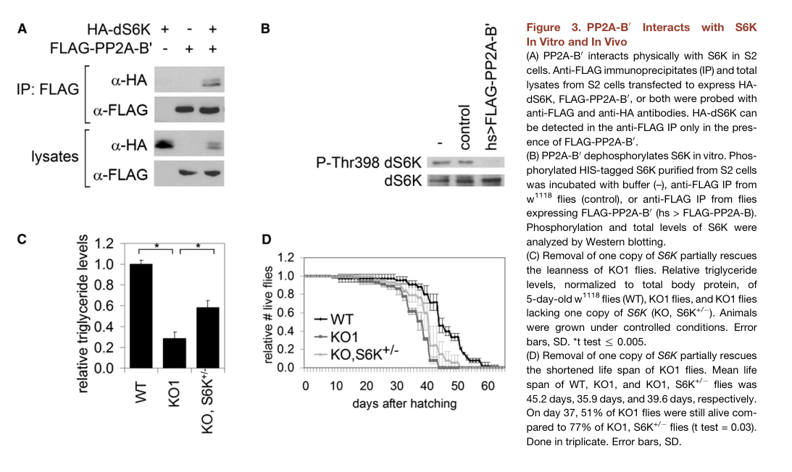

## Question

# Gene Research for Functional Annotation

## ⚠️ CRITICAL: Gene/Protein Identification Context

**BEFORE YOU BEGIN RESEARCH:** You MUST verify you are researching the CORRECT gene/protein. Gene symbols can be ambiguous, especially for less well-characterized genes from non-model organisms.

### Target Gene/Protein Identity (from UniProt):
- **UniProt Accession:** Q8IN89
- **Protein Description:** SubName: Full=Well-rounded, isoform B {ECO:0000313|EMBL:AAN13758.1};
- **Gene Information:** Name=wrd {ECO:0000313|EMBL:AAN13758.1, ECO:0000313|FlyBase:FBgn0042693}; Synonyms=anon-WO0118547.420 {ECO:0000313|EMBL:AAN13758.1}, B' {ECO:0000313|EMBL:AAN13758.1}, B'/PR61 {ECO:0000313|EMBL:AAN13758.1}, B56-1 {ECO:0000313|EMBL:AAN13758.1}, BcDNA:GM05554 {ECO:0000313|EMBL:AAN13758.1}, CG 7913 {ECO:0000313|EMBL:AAN13758.1}, CG7901 {ECO:0000313|EMBL:AAN13758.1}, dB56-1 {ECO:0000313|EMBL:AAN13758.1}, Dmel\CG7913 {ECO:0000313|EMBL:AAN13758.1}, dPP2A {ECO:0000313|EMBL:AAN13758.1}, dPP2A-B56-1 {ECO:0000313|EMBL:AAN13758.1}, i234 {ECO:0000313|EMBL:AAN13758.1}, PP2A {ECO:0000313|EMBL:AAN13758.1}, PP2A B' {ECO:0000313|EMBL:AAN13758.1}, PP2A-B {ECO:0000313|EMBL:AAN13758.1}, PP2A-B' {ECO:0000313|EMBL:AAN13758.1}, pp2A-B' {ECO:0000313|EMBL:AAN13758.1}, PP2A[B'-1] {ECO:0000313|EMBL:AAN13758.1}, Wrd {ECO:0000313|EMBL:AAN13758.1}; ORFNames=CG7913 {ECO:0000313|EMBL:AAN13758.1, ECO:0000313|FlyBase:FBgn0042693}, Dmel_CG7913 {ECO:0000313|EMBL:AAN13758.1};
- **Organism (full):** Drosophila melanogaster (Fruit fly).
- **Protein Family:** Belongs to the phosphatase 2A regulatory subunit B56
- **Key Domains:** ARM-like. (IPR011989); ARM-type_fold. (IPR016024); PP2A_B56. (IPR002554); B56 (PF01603)

### MANDATORY VERIFICATION STEPS:

1. **Check if the gene symbol "wrd" matches the protein description above**
2. **Verify the organism is correct:** Drosophila melanogaster (Fruit fly).
3. **Check if protein family/domains align with what you find in literature**
4. **If you find literature for a DIFFERENT gene with the same or similar symbol, STOP**

### If Gene Symbol is Ambiguous or You Cannot Find Relevant Literature:

**DO NOT PROCEED WITH RESEARCH ON A DIFFERENT GENE.** Instead:
- State clearly: "The gene symbol 'wrd' is ambiguous or literature is limited for this specific protein"
- Explain what you found (e.g., "Found extensive literature on a different gene with the same symbol in a different organism")
- Describe the protein based ONLY on the UniProt information provided above
- Suggest that the protein function can be inferred from domain/family information

### Research Target:

Please provide a comprehensive research report on the gene **wrd** (gene ID: wrd, UniProt: Q8IN89) in DROME.

The research report should be a detailed narrative explaining the function, biological processes, and localization of the gene product. Citations should be given for all claims.

You should prioritize authoritative reviews and primary scientific literature when conducting research. You can supplement
this with annotations you find in gene/protein databases, but these can be outdated or inaccurate.

We are specifically interested in the primary function of the gene - for enzymes, what reaction is catalyzed, and what is the substrate specificity? For transporters, what is the substrate? For structural proteins or adapters, what is the broader structural role? For signaling molecules, what is the role in the pathway.

We are interested in where in or outside the cell the gene product carries out its function.

We are also interested in the signaling or biochemical pathways in which the gene functions. We are less interested in broad pleiotropic effects, except where these elucidate the precise role.

Include evidence where possible. We are interested in both experimental evidence as well as inference from structure, evolution, or bioinformatic analysis. Precise studies should be prioritized over high-throughput, where available.

## Output

Question: You are an expert researcher providing comprehensive, well-cited information.

Provide detailed information focusing on:
1. Key concepts and definitions with current understanding
2. Recent developments and latest research (prioritize 2023-2024 sources)
3. Current applications and real-world implementations
4. Expert opinions and analysis from authoritative sources
5. Relevant statistics and data from recent studies

Format as a comprehensive research report with proper citations. Include URLs and publication dates where available.
Always prioritize recent, authoritative sources and provide specific citations for all major claims.

# Gene Research for Functional Annotation

## ⚠️ CRITICAL: Gene/Protein Identification Context

**BEFORE YOU BEGIN RESEARCH:** You MUST verify you are researching the CORRECT gene/protein. Gene symbols can be ambiguous, especially for less well-characterized genes from non-model organisms.

### Target Gene/Protein Identity (from UniProt):
- **UniProt Accession:** Q8IN89
- **Protein Description:** SubName: Full=Well-rounded, isoform B {ECO:0000313|EMBL:AAN13758.1};
- **Gene Information:** Name=wrd {ECO:0000313|EMBL:AAN13758.1, ECO:0000313|FlyBase:FBgn0042693}; Synonyms=anon-WO0118547.420 {ECO:0000313|EMBL:AAN13758.1}, B' {ECO:0000313|EMBL:AAN13758.1}, B'/PR61 {ECO:0000313|EMBL:AAN13758.1}, B56-1 {ECO:0000313|EMBL:AAN13758.1}, BcDNA:GM05554 {ECO:0000313|EMBL:AAN13758.1}, CG 7913 {ECO:0000313|EMBL:AAN13758.1}, CG7901 {ECO:0000313|EMBL:AAN13758.1}, dB56-1 {ECO:0000313|EMBL:AAN13758.1}, Dmel\CG7913 {ECO:0000313|EMBL:AAN13758.1}, dPP2A {ECO:0000313|EMBL:AAN13758.1}, dPP2A-B56-1 {ECO:0000313|EMBL:AAN13758.1}, i234 {ECO:0000313|EMBL:AAN13758.1}, PP2A {ECO:0000313|EMBL:AAN13758.1}, PP2A B' {ECO:0000313|EMBL:AAN13758.1}, PP2A-B {ECO:0000313|EMBL:AAN13758.1}, PP2A-B' {ECO:0000313|EMBL:AAN13758.1}, pp2A-B' {ECO:0000313|EMBL:AAN13758.1}, PP2A[B'-1] {ECO:0000313|EMBL:AAN13758.1}, Wrd {ECO:0000313|EMBL:AAN13758.1}; ORFNames=CG7913 {ECO:0000313|EMBL:AAN13758.1, ECO:0000313|FlyBase:FBgn0042693}, Dmel_CG7913 {ECO:0000313|EMBL:AAN13758.1};
- **Organism (full):** Drosophila melanogaster (Fruit fly).
- **Protein Family:** Belongs to the phosphatase 2A regulatory subunit B56
- **Key Domains:** ARM-like. (IPR011989); ARM-type_fold. (IPR016024); PP2A_B56. (IPR002554); B56 (PF01603)

### MANDATORY VERIFICATION STEPS:

1. **Check if the gene symbol "wrd" matches the protein description above**
2. **Verify the organism is correct:** Drosophila melanogaster (Fruit fly).
3. **Check if protein family/domains align with what you find in literature**
4. **If you find literature for a DIFFERENT gene with the same or similar symbol, STOP**

### If Gene Symbol is Ambiguous or You Cannot Find Relevant Literature:

**DO NOT PROCEED WITH RESEARCH ON A DIFFERENT GENE.** Instead:
- State clearly: "The gene symbol 'wrd' is ambiguous or literature is limited for this specific protein"
- Explain what you found (e.g., "Found extensive literature on a different gene with the same symbol in a different organism")
- Describe the protein based ONLY on the UniProt information provided above
- Suggest that the protein function can be inferred from domain/family information

### Research Target:

Please provide a comprehensive research report on the gene **wrd** (gene ID: wrd, UniProt: Q8IN89) in DROME.

The research report should be a detailed narrative explaining the function, biological processes, and localization of the gene product. Citations should be given for all claims.

You should prioritize authoritative reviews and primary scientific literature when conducting research. You can supplement
this with annotations you find in gene/protein databases, but these can be outdated or inaccurate.

We are specifically interested in the primary function of the gene - for enzymes, what reaction is catalyzed, and what is the substrate specificity? For transporters, what is the substrate? For structural proteins or adapters, what is the broader structural role? For signaling molecules, what is the role in the pathway.

We are interested in where in or outside the cell the gene product carries out its function.

We are also interested in the signaling or biochemical pathways in which the gene functions. We are less interested in broad pleiotropic effects, except where these elucidate the precise role.

Include evidence where possible. We are interested in both experimental evidence as well as inference from structure, evolution, or bioinformatic analysis. Precise studies should be prioritized over high-throughput, where available.

# Functional annotation report: *Drosophila melanogaster* **wrd** (Well-rounded; UniProt Q8IN89)

## Identity and primary molecular function

**Identity verified.** The literature identifies *D. melanogaster* **wrd/CG7913** as **Well-rounded**, a protein phosphatase 2A (PP2A) **B′/B56 regulatory subunit**. This matches the organism, gene designation, and B56-family/ARM-like-domain annotation supplied for Q8IN89. Wrd is **not** Widerborst (**Wdb**), the other fly B56 subunit, nor is it the catalytic PP2A subunit **Microtubule star (Mts)** or scaffold **PP2A-29B**. The publications examined establish the *wrd/CG7913* identity; the Q8IN89 accession itself comes from the supplied UniProt record. (pinto2017drosophilaproteinphosphatases pages 2-2, mayrhofer2020proteinphosphatase2a pages 10-13, hahn2010pp2aregulatorysubunit pages 1-2)

**Functional definition:** Wrd recruits or positions proteins for dephosphorylation by the Mts-containing PP2A holoenzyme. **Wrd does not itself catalyze a reaction.** The relevant biochemical reaction, performed by PP2A’s catalytic subunit, is hydrolysis of phosphate from phosphoserine/phosphothreonine residues on protein substrates. The B56-family assignment and ARM-like fold support a protein-interaction/targeting role; they do not, by themselves, establish a particular substrate or a fixed cellular location. The strongest experimentally established Wrd-directed substrate is **S6 kinase (S6K)**; **Expanded (Ex)** is a more recently reported, context-dependent target in Hippo signaling. (pinto2017drosophilaproteinphosphatases pages 2-2, mayrhofer2020proteinphosphatase2a pages 10-13, hahn2010pp2aregulatorysubunit pages 1-2, hahn2010pp2aregulatorysubunit pages 4-5, sekar2024adualrole pages 23-27)

The following summary distinguishes direct biochemical findings from genetic pathway assignments.

| Context/pathway | Wrd-specific molecular evidence or precise phenotype | Localization and caveat | Primary source URL/date |
|---|---|---|---|
| **Identity and PP2A-B56 holoenzyme** | *D. melanogaster* **wrd/CG7913** encodes Well-rounded, a B′/B56 regulatory subunit that confers substrate recruitment on a PP2A holoenzyme containing catalytic **Mts** and scaffold **PP2A-29B**. Wrd is distinct from the paralogous B56 subunit Widerborst (**Wdb**) and is not itself catalytic. (pinto2017drosophilaproteinphosphatases pages 2-2, mayrhofer2020proteinphosphatase2a pages 10-13) | B56 architecture supports a targeting and scaffolding role rather than intrinsic phosphatase activity. Localization is expected to depend on interaction partners; no universal Wrd compartment has been established. | [Pinto and Orr-Weaver, PNAS](https://doi.org/10.1073/pnas.1718450114), **24 October 2017** |
| **Insulin/TOR-S6K signaling — strongest direct substrate evidence** | Wrd/CG7913 physically associated with S6K, and immunopurified FLAG-Wrd-PP2A strongly dephosphorylated phosphorylated S6K *in vitro*. Loss of Wrd elevated S6K phosphorylation; Akt, 4E-BP phosphorylation, and FOXO readouts were not elevated, arguing for S6K-level specificity rather than global TORC1 activation. Thr398 is the TORC1-regulated Drosophila S6K site examined. Mutants retained **28%** of control triglycerides; mean lifespan fell from **53.8 days** (control, *n*=97) to **38.5 days** (mutant, *n*=79). Removing one S6K copy rescued metabolic defects and partly rescued lifespan. (hahn2010pp2aregulatorysubunit pages 1-2, hahn2010pp2aregulatorysubunit pages 2-3, hahn2010pp2aregulatorysubunit pages 3-4, hahn2010pp2aregulatorysubunit pages 4-5, hahn2010pp2aregulatorysubunit media 6957c4a7) | Evidence comes from whole larvae or adults, S2 cells, and immunopurified complexes; the study did not resolve the intracellular site at which endogenous Wrd-PP2A acts on S6K. | [Hahn et al., Cell Metabolism](https://doi.org/10.1016/j.cmet.2010.03.015), **5 May 2010** |
| **Male meiosis — MEI-S332/Shugoshin and centromeric cohesion** | Wrd and MEI-S332 interacted directly in yeast two-hybrid assays. In a sensitized *mei-S332* mutant background, loss of *wrd* reduced spermatocytes with normal MEI-S332 staining from **95% to 58%**; complete Wrd loss also enhanced meiosis-II nondisjunction. These results support partially redundant cooperation between Wrd and Wdb in MEI-S332 localization and accurate sister-chromatid segregation. (pinto2017drosophilaproteinphosphatases pages 1-2, pinto2017drosophilaproteinphosphatases pages 4-5, pinto2017drosophilaproteinphosphatases pages 2-3) | Wrd itself **was not detected on meiotic chromosomes by immunofluorescence**; centromeric localization was demonstrated for Wdb, not Wrd. MEI-S332 is therefore an interactor and functional partner, but direct dephosphorylation of MEI-S332 by Wrd-PP2A was not shown. (pinto2017drosophilaproteinphosphatases pages 2-2) | [Pinto and Orr-Weaver, PNAS](https://doi.org/10.1073/pnas.1718450114), **24 October 2017** |
| **Female meiosis — Wrd/Wdb redundancy** | *wrd* RNAi reduced transcript to approximately **5%** while retaining substantial fertility (**1,440 progeny from 20 vials; 72 per vial**). Combined Wrd/Wdb loss was severe: one combination yielded **4 progeny from 14 vials**, and another yielded none. Wrd/Wdb double-deficient oocytes showed lateral rather than normal end-on kinetochore-microtubule attachments, supporting redundant PP2A-B56 control of attachment geometry, cohesion, and fertility. (jang2021multiplepoolsof pages 8-11, jang2021multiplepoolsof pages 1-4) | Much of the genotype-specific evidence is supplementary. Tagged **WDB**, not Wrd, was visualized on chromosomes; these data do not establish bona fide centromeric localization of Wrd or identify a direct Wrd substrate. (jang2021multiplepoolsof pages 1-4, jang2021multiplepoolsof pages 4-8) | [Jang et al., Journal of Cell Science](https://doi.org/10.1242/jcs.254037), **July 2021** |
| **Neuromuscular-junction homeostatic plasticity** | The fly gene designated **PPP2R5D/wrd** in this study acted as a modifier of several heterozygous autism-gene ortholog mutations. Double-heterozygous combinations could abolish rapid presynaptic homeostatic potentiation; restoring a wild-type CHD2 copy rescued the phenotype. Homozygous Wrd loss significantly suppressed, but did not eliminate, homeostatic potentiation, indicating that Wrd contributes to robustness rather than being absolutely essential. (genc2020homeostaticplasticityfails pages 10-12, genc2020homeostaticplasticityfails pages 12-13) | Wrd is expressed in third-instar motoneurons and reported at the NMJ. Baseline morphology and intrinsic excitability did not explain the sensitized phenotype, and no direct phosphoprotein substrate was identified. The study's human-gene naming should not be interpreted as proof of a simple one-to-one orthology relationship. | [Genç et al., eLife](https://doi.org/10.7554/eLife.55775), **28 July 2020** |
| **Hippo signaling — Expanded proteostasis** | PP2A-Wrd dephosphorylated and stabilized the N-terminal region of Expanded (Ex), opposing Crumbs/CKI-driven Ex degradation and reducing Yorkie output. *wrd* depletion prevented Mts-dependent Ex stabilization in wing discs, whereas *wdb* or *tws* depletion did not under Crumbs-stimulated conditions. Catalytically active **Mts-R268A**, which selectively lost Wrd binding while retaining activity, failed to stabilize Ex. Wrd co-immunoprecipitated with Ex specifically in the presence of Crumbs and bound Kibra; this Hippo-activating complex contrasts with Hippo-inhibitory PP2A-Cka/STRIPAK. (sekar2024adualrole pages 19-23, sekar2024adualrole pages 27-31, sekar2024adualrole pages 23-27) | Experiments used S2 cells and posterior wing-disc compartments. Ex is junctional or apical-cortical, but direct imaging of endogenous Wrd at that site was not established. This evidence is from a **2024 preprint** and should be treated as provisional. | [Sekar et al., bioRxiv](https://doi.org/10.1101/2024.11.14.623552), **14 November 2024** |

*Table: Evidence-tiered summary of experimentally supported functions of Drosophila melanogaster Wrd/CG7913, with explicit localization limits and distinctions from Wdb. Direct biochemical evidence is strongest for S6K and, provisionally, Expanded.*

## Substrate specificity and signaling pathways

### S6K: direct biochemical evidence

In the insulin/nutrient–TORC1 pathway, TORC1 phosphorylates fly S6K at **Thr398**, whereas Wrd-containing PP2A counteracts S6K phosphorylation. Hahn and colleagues generated *CG7913/wrd* knockout flies, found elevated phospho-S6K, and reversed that phenotype by expressing the regulatory subunit. Wrd and S6K co-immunoprecipitated; importantly, an **immunopurified Wrd-containing complex dephosphorylated phosphorylated S6K in vitro**, unlike the control preparation. Figure 3 presents both that biochemical assay and rescue of mutant leanness by lowering *S6K* dosage. This supports substrate-directed PP2A activity rather than assigning catalytic activity to Wrd itself. [Hahn *et al.*, *Cell Metabolism*, **5 May 2010**](https://doi.org/10.1016/j.cmet.2010.03.015). (hahn2010pp2aregulatorysubunit pages 1-2, hahn2010pp2aregulatorysubunit pages 3-4, hahn2010pp2aregulatorysubunit pages 4-5, hahn2010pp2aregulatorysubunit media 6957c4a7)

The specificity evidence is particularly informative: *wrd* knockout increased S6K phosphorylation **without increasing Akt or 4E-BP phosphorylation**, and a FOXO-responsive readout was unchanged. Thus, the result is better interpreted as **selective opposition to S6K phosphorylation**, not a demonstrated increase in overall TORC1 or upstream Akt activity. Removing one *S6K* allele rescued metabolic abnormalities and partly rescued lifespan. Under the reported conditions, mutant flies had **28% of control triglyceride levels**; mean lifespan was **38.5 days** (*n*=79), versus **53.8 days** for controls (*n*=97). These organismal measurements corroborate pathway function but are not additional molecular substrates. [Hahn *et al.*, **2010**](https://doi.org/10.1016/j.cmet.2010.03.015). (hahn2010pp2aregulatorysubunit pages 2-3, hahn2010pp2aregulatorysubunit pages 3-4)

### Expanded: recent, context-dependent Hippo mechanism

A **14 November 2024 bioRxiv preprint** reports that PP2A–Wrd counteracts **Crumbs-driven phosphorylation and degradation of Expanded (Ex)** in fly S2 cells and wing discs. By stabilizing this upstream Hippo activator, the Wrd complex limits Yorkie-dependent transcriptional output. Wing-disc *wrd* knockdown prevented Mts-dependent stabilization of an Ex reporter during Crumbs stimulation; comparable *wdb* or *tws* knockdown did not have that effect in this assay. A catalytically active Mts variant that selectively impaired **Wrd**, but not Wdb, binding also failed to stabilize Ex. Wrd associated with Ex in co-immunoprecipitation **when Crumbs was present** and separately associated with Kibra. [Sekar *et al.*, bioRxiv, **14 November 2024**](https://doi.org/10.1101/2024.11.14.623552). (sekar2024adualrole pages 19-23, sekar2024adualrole pages 27-31, sekar2024adualrole pages 23-27)

The proposed pathway distinction is consequential: **PP2A–Wrd promotes Hippo activity** by protecting Ex, whereas a different PP2A assembly containing **Cka/STRIPAK inhibits Hippo signaling**. The preprint also reports regulation of Ex levels without added Crumbs, involving both Wrd- and Tws-associated PP2A, but **Wrd–Ex association was detected only with Crumbs**. Consequently, direct Wrd-dependent dephosphorylation is best supported in the Crumbs-stimulated setting; an indirect mechanism remains possible under other conditions. This is a **preprint finding**, not evidence that every PP2A or B56 complex has the same effect on Hippo signaling. [Sekar *et al.*, **2024**](https://doi.org/10.1101/2024.11.14.623552). (sekar2024adualrole pages 27-31, sekar2024adualrole pages 23-27)

## Chromosome-associated function and intracellular location

Wrd also acts with Wdb and the shugoshin **MEI-S332** in meiotic chromosome segregation. In a yeast two-hybrid assay, Wrd interacted with MEI-S332. Male-meiosis genetics showed that Wrd contributes to robust **MEI-S332 centromere localization** and protection of sister-chromatid segregation: in a sensitized *mei-S332* background, loss of *wrd* reduced cells with normal MEI-S332 staining from **95% to 58%** and enhanced meiosis-II nondisjunction. Loss of *wrd* alone did not substantially disrupt segregation, consistent with **partial compensation by Wdb**. These data establish an interaction and functional pathway, **not** direct dephosphorylation of MEI-S332 or cohesin by Wrd-associated PP2A. [Pinto and Orr-Weaver, *PNAS*, **5 December 2017**](https://doi.org/10.1073/pnas.1718450114). (pinto2017drosophilaproteinphosphatases pages 1-2, pinto2017drosophilaproteinphosphatases pages 4-5, pinto2017drosophilaproteinphosphatases pages 2-3)

**Localization must be stated narrowly.** The 2017 study visualized **Wdb** along meiotic chromosomes and subsequently at centromeric regions, but **could not detect Wrd on meiotic chromosomes by immunofluorescence**. Wrd’s genetic effect on centromeric MEI-S332 therefore does **not** demonstrate that Wrd itself occupies centromeres. In female oocytes, supplementary experiments found that severe combined Wrd/Wdb depletion impaired fertility and that double-deficient oocytes could retain lateral rather than normal end-on kinetochore–microtubule attachments. Those results support a shared B56-associated meiotic role, without assigning each oocyte phenotype or a specific chromosome compartment exclusively to Wrd. [Pinto and Orr-Weaver, **2017**](https://doi.org/10.1073/pnas.1718450114); [Jang *et al.*, *Journal of Cell Science*, **July 2021**](https://doi.org/10.1242/jcs.254037). (jang2021multiplepoolsof pages 8-11, pinto2017drosophilaproteinphosphatases pages 2-2, jang2021multiplepoolsof pages 1-4)

Outside meiosis, experimentally relevant settings include **larval S2 cells, wing-disc epithelium, and motor-neuron/neuromuscular-junction preparations**. The Hippo study places Wrd-dependent activity in an Ex/Crumbs pathway associated with the **apical junctional cortex**, but its co-immunoprecipitation and wing-disc reporter assays do not establish a comprehensive endogenous Wrd localization map. Likewise, the S6K experiments do not resolve the intracellular compartment in which endogenous Wrd encounters S6K. No extracellular function or secretion is established by these studies. (hahn2010pp2aregulatorysubunit pages 1-2, sekar2024adualrole pages 23-27, genc2020homeostaticplasticityfails pages 10-12)

## Neuronal evidence and interpretation limits

An electrophysiological study identified the fly PP2A regulatory gene it called **PPP2R5D/*wrd*** as a modifier of **presynaptic homeostatic potentiation** at the neuromuscular junction. Combining a heterozygous *wrd*-related deletion with certain heterozygous neurodevelopmental-gene mutations impaired compensation for reduced postsynaptic receptor function; restoring the relevant wild-type **CHD2** copy rescued the sensitized phenotype. Homozygous loss significantly **reduced but did not abolish** rapid potentiation. This identifies a neuronal context for Wrd-dependent PP2A function, but **does not identify the presynaptic phosphoprotein substrate**; the authors also cautioned against explaining that rapid phenotype simply through S6K/TOR signaling. [Genç *et al.*, *eLife*, **July 2020**](https://doi.org/10.7554/elife.55775). (genc2020homeostaticplasticityfails pages 10-12, genc2020homeostaticplasticityfails pages 12-13)

Care is needed when generalizing neuronal PP2A results: in a **2022** fly dendrite study, *wrd* knockdown did **not** markedly change the measured dendritic morphology, while manipulations of other PP2A components produced effects. Such results should not be assigned to Wrd merely because they concern PP2A. Earlier primary reports specifically on Wrd and synaptic growth or the Syd-1/Liprin-α axonal pathway were identified bibliographically but their full texts could not be checked in this retrieval; their detailed mechanistic claims are therefore not relied on here. [Bhattacharjee *et al.*, *Frontiers in Molecular Neuroscience*, **November 2022**](https://doi.org/10.3389/fnmol.2022.926567). (bhattacharjee2022pp2aphosphataseregulates pages 6-8)

**Overall assessment.** The best-supported functional annotation is **intracellular, B56-directed PP2A substrate recruitment**, with **S6K dephosphorylation** providing the clearest direct biochemical substrate evidence. Wrd additionally participates in MEI-S332-dependent meiotic organization and synaptic regulation; the **2024** Ex findings substantially sharpen its proposed role as a context-specific **Hippo activator**. Substrate identity, physical residence, and even signaling direction must be assigned to the **particular Wrd-containing complex and experimental context**, not inferred indiscriminately from Wdb or from PP2A as a whole. (hahn2010pp2aregulatorysubunit pages 4-5, pinto2017drosophilaproteinphosphatases pages 1-2, sekar2024adualrole pages 23-27, genc2020homeostaticplasticityfails pages 12-13)

References

1. (pinto2017drosophilaproteinphosphatases pages 2-2): Belinda S. Pinto and Terry L. Orr-Weaver. Drosophila protein phosphatases 2a b′ wdb and wrd regulate meiotic centromere localization and function of the mei-s332 shugoshin. Proceedings of the National Academy of Sciences of the United States of America, 114:12988-12993, Nov 2017. URL: https://doi.org/10.1073/pnas.1718450114, doi:10.1073/pnas.1718450114. This article has 24 citations and is from a highest quality peer-reviewed journal.

2. (mayrhofer2020proteinphosphatase2a pages 10-13): B Mayrhofer. Protein phosphatase 2a in the circadian clock of the linden bug pyrrhocoris apterus. Unknown journal, 2020.

3. (hahn2010pp2aregulatorysubunit pages 1-2): Katrin Hahn, Merce Miranda, Víctor A. Francis, Joan Vendrell, Antonio Zorzano, and Aurelio A. Teleman. Pp2a regulatory subunit pp2a-b' counteracts s6k phosphorylation. Cell metabolism, 11 5:438-44, May 2010. URL: https://doi.org/10.1016/j.cmet.2010.03.015, doi:10.1016/j.cmet.2010.03.015. This article has 167 citations and is from a highest quality peer-reviewed journal.

4. (hahn2010pp2aregulatorysubunit pages 4-5): Katrin Hahn, Merce Miranda, Víctor A. Francis, Joan Vendrell, Antonio Zorzano, and Aurelio A. Teleman. Pp2a regulatory subunit pp2a-b' counteracts s6k phosphorylation. Cell metabolism, 11 5:438-44, May 2010. URL: https://doi.org/10.1016/j.cmet.2010.03.015, doi:10.1016/j.cmet.2010.03.015. This article has 167 citations and is from a highest quality peer-reviewed journal.

5. (sekar2024adualrole pages 23-27): Aashika Sekar, Alberto Rizzo, Elodie Sins, Alexander D. Fulford, and Paulo S. Ribeiro. A dual role for the pp2a phosphatase in hippo signalling regulation. bioRxiv, Nov 2024. URL: https://doi.org/10.1101/2024.11.14.623552, doi:10.1101/2024.11.14.623552. This article has 0 citations.

6. (hahn2010pp2aregulatorysubunit pages 2-3): Katrin Hahn, Merce Miranda, Víctor A. Francis, Joan Vendrell, Antonio Zorzano, and Aurelio A. Teleman. Pp2a regulatory subunit pp2a-b' counteracts s6k phosphorylation. Cell metabolism, 11 5:438-44, May 2010. URL: https://doi.org/10.1016/j.cmet.2010.03.015, doi:10.1016/j.cmet.2010.03.015. This article has 167 citations and is from a highest quality peer-reviewed journal.

7. (hahn2010pp2aregulatorysubunit pages 3-4): Katrin Hahn, Merce Miranda, Víctor A. Francis, Joan Vendrell, Antonio Zorzano, and Aurelio A. Teleman. Pp2a regulatory subunit pp2a-b' counteracts s6k phosphorylation. Cell metabolism, 11 5:438-44, May 2010. URL: https://doi.org/10.1016/j.cmet.2010.03.015, doi:10.1016/j.cmet.2010.03.015. This article has 167 citations and is from a highest quality peer-reviewed journal.

8. (hahn2010pp2aregulatorysubunit media 6957c4a7): Katrin Hahn, Merce Miranda, Víctor A. Francis, Joan Vendrell, Antonio Zorzano, and Aurelio A. Teleman. Pp2a regulatory subunit pp2a-b' counteracts s6k phosphorylation. Cell metabolism, 11 5:438-44, May 2010. URL: https://doi.org/10.1016/j.cmet.2010.03.015, doi:10.1016/j.cmet.2010.03.015. This article has 167 citations and is from a highest quality peer-reviewed journal.

9. (pinto2017drosophilaproteinphosphatases pages 1-2): Belinda S. Pinto and Terry L. Orr-Weaver. Drosophila protein phosphatases 2a b′ wdb and wrd regulate meiotic centromere localization and function of the mei-s332 shugoshin. Proceedings of the National Academy of Sciences of the United States of America, 114:12988-12993, Nov 2017. URL: https://doi.org/10.1073/pnas.1718450114, doi:10.1073/pnas.1718450114. This article has 24 citations and is from a highest quality peer-reviewed journal.

10. (pinto2017drosophilaproteinphosphatases pages 4-5): Belinda S. Pinto and Terry L. Orr-Weaver. Drosophila protein phosphatases 2a b′ wdb and wrd regulate meiotic centromere localization and function of the mei-s332 shugoshin. Proceedings of the National Academy of Sciences of the United States of America, 114:12988-12993, Nov 2017. URL: https://doi.org/10.1073/pnas.1718450114, doi:10.1073/pnas.1718450114. This article has 24 citations and is from a highest quality peer-reviewed journal.

11. (pinto2017drosophilaproteinphosphatases pages 2-3): Belinda S. Pinto and Terry L. Orr-Weaver. Drosophila protein phosphatases 2a b′ wdb and wrd regulate meiotic centromere localization and function of the mei-s332 shugoshin. Proceedings of the National Academy of Sciences of the United States of America, 114:12988-12993, Nov 2017. URL: https://doi.org/10.1073/pnas.1718450114, doi:10.1073/pnas.1718450114. This article has 24 citations and is from a highest quality peer-reviewed journal.

12. (jang2021multiplepoolsof pages 8-11): Janet K. Jang, Amy C. Gladstein, Arunika Das, Joanatta G. Shapiro, Zachary L. Sisco, and Kim S. McKim. Multiple pools of pp2a regulate spindle assembly, kinetochore attachments and cohesion in <i>drosophila</i> oocytes. Journal of Cell Science, Jul 2021. URL: https://doi.org/10.1242/jcs.254037, doi:10.1242/jcs.254037. This article has 25 citations and is from a domain leading peer-reviewed journal.

13. (jang2021multiplepoolsof pages 1-4): Janet K. Jang, Amy C. Gladstein, Arunika Das, Joanatta G. Shapiro, Zachary L. Sisco, and Kim S. McKim. Multiple pools of pp2a regulate spindle assembly, kinetochore attachments and cohesion in <i>drosophila</i> oocytes. Journal of Cell Science, Jul 2021. URL: https://doi.org/10.1242/jcs.254037, doi:10.1242/jcs.254037. This article has 25 citations and is from a domain leading peer-reviewed journal.

14. (jang2021multiplepoolsof pages 4-8): Janet K. Jang, Amy C. Gladstein, Arunika Das, Joanatta G. Shapiro, Zachary L. Sisco, and Kim S. McKim. Multiple pools of pp2a regulate spindle assembly, kinetochore attachments and cohesion in <i>drosophila</i> oocytes. Journal of Cell Science, Jul 2021. URL: https://doi.org/10.1242/jcs.254037, doi:10.1242/jcs.254037. This article has 25 citations and is from a domain leading peer-reviewed journal.

15. (genc2020homeostaticplasticityfails pages 10-12): Özgür Genç, Joon-Yong An, Richard D Fetter, Yelena Kulik, Giulia Zunino, Stephan J Sanders, and Graeme W Davis. Homeostatic plasticity fails at the intersection of autism-gene mutations and a novel class of common genetic modifiers. eLife, Jul 2020. URL: https://doi.org/10.7554/elife.55775, doi:10.7554/elife.55775. This article has 31 citations and is from a domain leading peer-reviewed journal.

16. (genc2020homeostaticplasticityfails pages 12-13): Özgür Genç, Joon-Yong An, Richard D Fetter, Yelena Kulik, Giulia Zunino, Stephan J Sanders, and Graeme W Davis. Homeostatic plasticity fails at the intersection of autism-gene mutations and a novel class of common genetic modifiers. eLife, Jul 2020. URL: https://doi.org/10.7554/elife.55775, doi:10.7554/elife.55775. This article has 31 citations and is from a domain leading peer-reviewed journal.

17. (sekar2024adualrole pages 19-23): Aashika Sekar, Alberto Rizzo, Elodie Sins, Alexander D. Fulford, and Paulo S. Ribeiro. A dual role for the pp2a phosphatase in hippo signalling regulation. bioRxiv, Nov 2024. URL: https://doi.org/10.1101/2024.11.14.623552, doi:10.1101/2024.11.14.623552. This article has 0 citations.

18. (sekar2024adualrole pages 27-31): Aashika Sekar, Alberto Rizzo, Elodie Sins, Alexander D. Fulford, and Paulo S. Ribeiro. A dual role for the pp2a phosphatase in hippo signalling regulation. bioRxiv, Nov 2024. URL: https://doi.org/10.1101/2024.11.14.623552, doi:10.1101/2024.11.14.623552. This article has 0 citations.

19. (bhattacharjee2022pp2aphosphataseregulates pages 6-8): Shatabdi Bhattacharjee, Erin N. Lottes, Sumit Nanda, Andre Golshir, Atit A. Patel, Giorgio A. Ascoli, and Daniel N. Cox. Pp2a phosphatase regulates cell-type specific cytoskeletal organization to drive dendrite diversity. Frontiers in Molecular Neuroscience, Nov 2022. URL: https://doi.org/10.3389/fnmol.2022.926567, doi:10.3389/fnmol.2022.926567. This article has 14 citations.

## Artifacts

- [Edison artifact artifact-00](wrd-deep-research-falcon_artifacts/artifact-00.md)

## Citations

1. pinto2017drosophilaproteinphosphatases pages 2-2
2. sekar2024adualrole pages 23-27
3. pinto2017drosophilaproteinphosphatases pages 1-2
4. pinto2017drosophilaproteinphosphatases pages 4-5
5. pinto2017drosophilaproteinphosphatases pages 2-3
6. jang2021multiplepoolsof pages 8-11
7. jang2021multiplepoolsof pages 1-4
8. jang2021multiplepoolsof pages 4-8
9. genc2020homeostaticplasticityfails pages 10-12
10. genc2020homeostaticplasticityfails pages 12-13
11. sekar2024adualrole pages 19-23
12. sekar2024adualrole pages 27-31
13. B'-1
14. Pinto and Orr-Weaver, PNAS
15. Hahn et al., Cell Metabolism
16. Jang et al., Journal of Cell Science
17. Genç et al., eLife
18. Sekar et al., bioRxiv
19. Hahn *et al.*, *Cell Metabolism*, **5 May 2010**
20. Hahn *et al.*, **2010**
21. Sekar *et al.*, bioRxiv, **14 November 2024**
22. Sekar *et al.*, **2024**
23. Pinto and Orr-Weaver, *PNAS*, **5 December 2017**
24. Pinto and Orr-Weaver, **2017**
25. Jang *et al.*, *Journal of Cell Science*, **July 2021**
26. Genç *et al.*, *eLife*, **July 2020**
27. Bhattacharjee *et al.*, *Frontiers in Molecular Neuroscience*, **November 2022**
28. https://doi.org/10.1073/pnas.1718450114
29. https://doi.org/10.1016/j.cmet.2010.03.015
30. https://doi.org/10.1242/jcs.254037
31. https://doi.org/10.7554/eLife.55775
32. https://doi.org/10.1101/2024.11.14.623552
33. https://doi.org/10.7554/elife.55775
34. https://doi.org/10.3389/fnmol.2022.926567
35. https://doi.org/10.1073/pnas.1718450114,
36. https://doi.org/10.1016/j.cmet.2010.03.015,
37. https://doi.org/10.1101/2024.11.14.623552,
38. https://doi.org/10.1242/jcs.254037,
39. https://doi.org/10.7554/elife.55775,
40. https://doi.org/10.3389/fnmol.2022.926567,