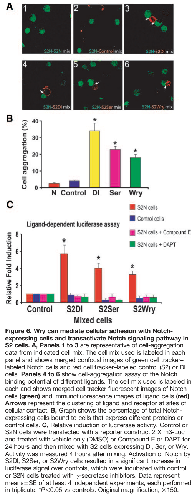

## Question

# Gene Research for Functional Annotation

## ⚠️ CRITICAL: Gene/Protein Identification Context

**BEFORE YOU BEGIN RESEARCH:** You MUST verify you are researching the CORRECT gene/protein. Gene symbols can be ambiguous, especially for less well-characterized genes from non-model organisms.

### Target Gene/Protein Identity (from UniProt):
- **UniProt Accession:** Q7KU08
- **Protein Description:** SubName: Full=Weary, isoform B {ECO:0000313|EMBL:AAS64628.2};
- **Gene Information:** Name=wry {ECO:0000313|EMBL:AAS64628.2, ECO:0000313|FlyBase:FBgn0051665}; Synonyms=CG12704 {ECO:0000313|EMBL:AAS64628.2}, CG15621 {ECO:0000313|EMBL:AAS64628.2}, CT35769 {ECO:0000313|EMBL:AAS64628.2}, Dmel\CG31665 {ECO:0000313|EMBL:AAS64628.2}; ORFNames=CG31665 {ECO:0000313|EMBL:AAS64628.2, ECO:0000313|FlyBase:FBgn0051665}, Dmel_CG31665 {ECO:0000313|EMBL:AAS64628.2};
- **Organism (full):** Drosophila melanogaster (Fruit fly).
- **Protein Family:** Not specified in UniProt
- **Key Domains:** EGF. (IPR000742); EGF-like_Ca-bd_dom. (IPR001881); EGF-type_Asp/Asn_hydroxyl_site. (IPR000152); EGF_Ca-bd_CS. (IPR018097); Growth_fac_rcpt_cys_sf. (IPR009030)

### MANDATORY VERIFICATION STEPS:

1. **Check if the gene symbol "wry" matches the protein description above**
2. **Verify the organism is correct:** Drosophila melanogaster (Fruit fly).
3. **Check if protein family/domains align with what you find in literature**
4. **If you find literature for a DIFFERENT gene with the same or similar symbol, STOP**

### If Gene Symbol is Ambiguous or You Cannot Find Relevant Literature:

**DO NOT PROCEED WITH RESEARCH ON A DIFFERENT GENE.** Instead:
- State clearly: "The gene symbol 'wry' is ambiguous or literature is limited for this specific protein"
- Explain what you found (e.g., "Found extensive literature on a different gene with the same symbol in a different organism")
- Describe the protein based ONLY on the UniProt information provided above
- Suggest that the protein function can be inferred from domain/family information

### Research Target:

Please provide a comprehensive research report on the gene **wry** (gene ID: wry, UniProt: Q7KU08) in DROME.

The research report should be a detailed narrative explaining the function, biological processes, and localization of the gene product. Citations should be given for all claims.

You should prioritize authoritative reviews and primary scientific literature when conducting research. You can supplement
this with annotations you find in gene/protein databases, but these can be outdated or inaccurate.

We are specifically interested in the primary function of the gene - for enzymes, what reaction is catalyzed, and what is the substrate specificity? For transporters, what is the substrate? For structural proteins or adapters, what is the broader structural role? For signaling molecules, what is the role in the pathway.

We are interested in where in or outside the cell the gene product carries out its function.

We are also interested in the signaling or biochemical pathways in which the gene functions. We are less interested in broad pleiotropic effects, except where these elucidate the precise role.

Include evidence where possible. We are interested in both experimental evidence as well as inference from structure, evolution, or bioinformatic analysis. Precise studies should be prioritized over high-throughput, where available.

## Output

Question: You are an expert researcher providing comprehensive, well-cited information.

Provide detailed information focusing on:
1. Key concepts and definitions with current understanding
2. Recent developments and latest research (prioritize 2023-2024 sources)
3. Current applications and real-world implementations
4. Expert opinions and analysis from authoritative sources
5. Relevant statistics and data from recent studies

Format as a comprehensive research report with proper citations. Include URLs and publication dates where available.
Always prioritize recent, authoritative sources and provide specific citations for all major claims.

# Gene Research for Functional Annotation

## ⚠️ CRITICAL: Gene/Protein Identification Context

**BEFORE YOU BEGIN RESEARCH:** You MUST verify you are researching the CORRECT gene/protein. Gene symbols can be ambiguous, especially for less well-characterized genes from non-model organisms.

### Target Gene/Protein Identity (from UniProt):
- **UniProt Accession:** Q7KU08
- **Protein Description:** SubName: Full=Weary, isoform B {ECO:0000313|EMBL:AAS64628.2};
- **Gene Information:** Name=wry {ECO:0000313|EMBL:AAS64628.2, ECO:0000313|FlyBase:FBgn0051665}; Synonyms=CG12704 {ECO:0000313|EMBL:AAS64628.2}, CG15621 {ECO:0000313|EMBL:AAS64628.2}, CT35769 {ECO:0000313|EMBL:AAS64628.2}, Dmel\CG31665 {ECO:0000313|EMBL:AAS64628.2}; ORFNames=CG31665 {ECO:0000313|EMBL:AAS64628.2, ECO:0000313|FlyBase:FBgn0051665}, Dmel_CG31665 {ECO:0000313|EMBL:AAS64628.2};
- **Organism (full):** Drosophila melanogaster (Fruit fly).
- **Protein Family:** Not specified in UniProt
- **Key Domains:** EGF. (IPR000742); EGF-like_Ca-bd_dom. (IPR001881); EGF-type_Asp/Asn_hydroxyl_site. (IPR000152); EGF_Ca-bd_CS. (IPR018097); Growth_fac_rcpt_cys_sf. (IPR009030)

### MANDATORY VERIFICATION STEPS:

1. **Check if the gene symbol "wry" matches the protein description above**
2. **Verify the organism is correct:** Drosophila melanogaster (Fruit fly).
3. **Check if protein family/domains align with what you find in literature**
4. **If you find literature for a DIFFERENT gene with the same or similar symbol, STOP**

### If Gene Symbol is Ambiguous or You Cannot Find Relevant Literature:

**DO NOT PROCEED WITH RESEARCH ON A DIFFERENT GENE.** Instead:
- State clearly: "The gene symbol 'wry' is ambiguous or literature is limited for this specific protein"
- Explain what you found (e.g., "Found extensive literature on a different gene with the same symbol in a different organism")
- Describe the protein based ONLY on the UniProt information provided above
- Suggest that the protein function can be inferred from domain/family information

### Research Target:

Please provide a comprehensive research report on the gene **wry** (gene ID: wry, UniProt: Q7KU08) in DROME.

The research report should be a detailed narrative explaining the function, biological processes, and localization of the gene product. Citations should be given for all claims.

You should prioritize authoritative reviews and primary scientific literature when conducting research. You can supplement
this with annotations you find in gene/protein databases, but these can be outdated or inaccurate.

We are specifically interested in the primary function of the gene - for enzymes, what reaction is catalyzed, and what is the substrate specificity? For transporters, what is the substrate? For structural proteins or adapters, what is the broader structural role? For signaling molecules, what is the role in the pathway.

We are interested in where in or outside the cell the gene product carries out its function.

We are also interested in the signaling or biochemical pathways in which the gene functions. We are less interested in broad pleiotropic effects, except where these elucidate the precise role.

Include evidence where possible. We are interested in both experimental evidence as well as inference from structure, evolution, or bioinformatic analysis. Precise studies should be prioritized over high-throughput, where available.

# Functional annotation report: *Drosophila melanogaster* weary (*wry*)

## Identity and principal function

**Identity verified.** The fly gene **CG31665** was named **weary (*wry*)** in the primary experimental study. This matches the organism, gene name and CG31665 synonym supplied for UniProt **Q7KU08**. The study examined Wry at the gene/protein level; it did **not** establish that every experimental result is specific to the UniProt-described **isoform B**. Wry contains epidermal-growth-factor-like repeats and a transmembrane region, consistent with the supplied domain annotations, but lacks the **Delta–Serrate–Lag-2 (DSL) domain** of the established fly Notch ligands Delta and Serrate. An EGF-like domain should not be mistaken for evidence that Wry is an EGF-receptor ligand. (kim2010genedeletionscreen pages 3-6, kim2010genedeletionscreen pages 1-2)

**Best-supported primary function:** Wry is an **atypical, membrane-associated activator of Notch signaling** that helps maintain normal function of the *adult fly heart*. Its experimentally demonstrated activity is to enable adhesion of Wry-expressing cells to Notch-expressing cells and stimulate a γ-secretase-dependent Notch transcriptional reporter. It is not characterized as an enzyme or transporter, so there is no established catalytic reaction or transported substrate. Its apparent signaling partner is the **Notch receptor**, although a purified-protein binding assay and binding affinity have not been reported in the examined primary study. (kim2010genedeletionscreen pages 1-2, kim2010genedeletionscreen pages 6-7, kim2010genedeletionscreen media 9ff93ea4)

The following evidence summary separates observations from their functional interpretation. **The figure citation refers to the inspected, cropped Figure 6** showing cell-contact imaging, aggregation and reporter results. (kim2010genedeletionscreen media 9ff93ea4)

| Question | Direct observation / numeric result | Supported interpretation / limitation |
|---|---|---|
| Molecular identity and architecture | In *Drosophila melanogaster*, CG31665 was named **weary (wry)**. The protein contains EGF repeats and a transmembrane domain but lacks the canonical Delta–Serrate–Lag-2 (DSL) domain (kim2010genedeletionscreen pages 3-6, kim2010genedeletionscreen pages 1-2). | Supports annotation as an atypical, membrane-associated Notch-ligand candidate. The study did not establish that every result applies specifically to UniProt isoform B, Q7KU08, rather than to Wry generally. |
| Association with Notch-expressing cells | In mixed S2-cell assays, cells expressing Wry, Delta, or Serrate produced approximately **20–35% aggregation**, versus approximately **5%** for Notch-only controls. Ligand and receptor signals clustered at cell contacts (kim2010genedeletionscreen pages 6-7, kim2010genedeletionscreen media 9ff93ea4). | Supports Notch-dependent cell adhesion or receptor association. Because this was a cell-aggregation assay rather than a purified-protein assay, it does not prove direct biochemical binding or provide a binding affinity. |
| Notch transcriptional activation | Wry-expressing cells stimulated an m3-Luc Notch reporter by approximately **3-fold**, compared with **4–5-fold** for Delta or Serrate. Compound E and DAPT blocked Wry-dependent activation. Results came from at least **four independent experiments**, each performed in triplicate (kim2010genedeletionscreen pages 7-8, kim2010genedeletionscreen pages 6-7). | Strong functional evidence that Wry activates a γ-secretase-dependent Notch pathway in fly cells despite lacking a DSL domain. Reporter activation does not establish every intermediate or distinguish all possible downstream branches. |
| Genetic causality for cardiac dysfunction | Two independent insertions, f00122 and 22697, disrupted CG31665, reduced its expression, and phenocopied deficiency-associated cardiomyopathy. Precise excision of f00122 restored normal heart function, and cardiac Wry expression rescued the deficiency phenotype (kim2010genedeletionscreen pages 3-6, kim2010genedeletionscreen pages 2-3). | Convergent insertion, excision, RNAi, and rescue evidence identifies **wry/CG31665** as the causal locus rather than a neighboring gene. |
| Adult requirement independent of development | With Gal80ts/Gal4, shifting adults from **18°C to 26°C** induced cardiac CG31665 RNAi and worsened function; returning them to **18°C** restored function (kim2010genedeletionscreen pages 3-6). | Shows an inducible and reversible requirement for Wry in maintenance of the mature fly heart, rather than only in embryonic cardiac development. The experiment does not resolve whether the effect is cardiomyocyte-autonomous. |
| Placement in the Notch pathway | Cardiac expression of Notch, Delta, Serrate, or the positive transcriptional regulator Su(H) rescued the wry-deficiency cardiac phenotype; the Notch antagonist Hairless did not (kim2010genedeletionscreen pages 6-7). | Genetic epistasis supports Wry acting upstream of, or converging on, Notch–Su(H) signaling. Rescue by overexpression does not establish the immediate physical receptor–ligand step. |
| Cellular compartment | Wry has a predicted transmembrane segment, and tagged Wry clustered with Notch-expressing cells at sites of cell–cell contact in S2 cultures (kim2010genedeletionscreen pages 3-6, kim2010genedeletionscreen pages 6-7, kim2010genedeletionscreen media 9ff93ea4). | The best-supported localization is a cell-surface or membrane-associated protein acting at intercellular contacts. Its membrane topology, distribution in the adult heart, and expression in cardiomyocytes versus neighboring peri- or epicardial cells remain unresolved. |
| Cross-species activity | Wry-expressing HEK293 cells did **not** activate an RBP-J reporter in Notch-expressing mouse C2C12 cells, whereas the positive-control ligand DNER produced approximately **7-fold** activation (kim2010genedeletionscreen pages 13-16). | Wry activity appears species- or context-dependent. The negative mammalian assay argues against assuming conserved mammalian ligand activity or therapeutic translatability. |
| Overall evidence assessment | Later expert reviews described CG31665/Wry as an atypical Notch ligand whose loss causes dilated cardiomyopathy and highlighted Notch signaling in adult fly-heart maintenance (seyres2012genesandnetworks pages 4-5, wolf2012modelingdilatedcardiomyopathies pages 7-8). | The annotation rests mainly on one detailed 2010 primary study and subsequent reviews. Independent mechanistic replication and direct 2023–2024 studies of *Drosophila* Wry were not identified. |

*Table: Experimental evidence supporting Wry/CG31665 as an atypical membrane-associated Notch ligand required for adult fly cardiac function. The table separates direct observations from interpretations and unresolved limitations.*

## Mechanism and biological process

The strongest molecular evidence comes from Kim, Wolf and Rockman’s *Circulation Research* study, published **16 April 2010**. In mixed *Drosophila* S2-cell cultures, Wry-expressing cells associated with Notch-expressing cells, and signals for ligand and receptor clustered at their points of contact. Cells expressing Wry, Delta or Serrate yielded approximately **20–35% aggregation**, compared with approximately **5%** in the Notch-only control. Thus, Wry supports a cell-contact-associated ligand role, but aggregation alone cannot establish direct binding between purified Wry and Notch. [Kim et al., 2010](https://doi.org/10.1161/CIRCRESAHA.109.213785). (kim2010genedeletionscreen pages 6-7, kim2010genedeletionscreen media 9ff93ea4)

When Wry-expressing S2 cells were mixed with Notch-expressing reporter cells, Wry produced approximately **threefold** activation of the Notch-responsive *m3-Luc* reporter; Delta and Serrate produced approximately **four- to fivefold** activation. The γ-secretase inhibitors **Compound E** and **DAPT** blocked Wry-dependent activation. Reporter data were reported from **at least four independent experiments, each performed in triplicate**. Together these results support Wry acting upstream of Notch proteolysis and downstream transcription despite lacking a DSL domain. They do not establish the precise receptor-contact residues or exclude additional cofactors. [Kim et al., 2010](https://doi.org/10.1161/CIRCRESAHA.109.213785). (kim2010genedeletionscreen pages 6-7, kim2010genedeletionscreen pages 7-8, kim2010genedeletionscreen media 9ff93ea4)

The relevant pathway is **Notch-dependent intercellular signaling**, not EGF-receptor signaling. In the established fly pathway, ligand engagement permits proteolytic release of the Notch intracellular domain; that domain enters the nucleus and cooperates with **Suppressor of Hairless [Su(H)]** to regulate transcription, including *Enhancer of split* genes. Cardiac expression of Notch, Delta, Serrate or Su(H) rescued the heart phenotype associated with the *wry*-containing deficiency, whereas expression of the Notch antagonist Hairless did not. This genetic rescue places Wry functionally upstream of, or convergent on, Notch–Su(H) signaling; it does not independently prove every molecular step occurs in the same adult-heart cell. [Kim et al., 2010](https://doi.org/10.1161/CIRCRESAHA.109.213785). (kim2010genedeletionscreen pages 1-2, kim2010genedeletionscreen pages 6-7)

## In-vivo role and strength of causal evidence

The main demonstrated biological process is **maintenance of adult cardiac contractile function**. An optical-coherence-tomography screen of awake flies identified a chromosome-2L deficiency associated with enlarged cardiac dimensions and reduced fractional shortening. Overlapping deficiencies narrowed the candidate interval to **16 genes**. Two independent insertions in **CG31665**, *f00122* and *22697*, reproduced abnormal heart function and reduced CG31665 expression; precise excision of *f00122* restored normal function. Cardiac or broader CG31665 knockdown impaired function, and cardiac Wry expression rescued the deficiency-associated phenotype. These complementary tests provide substantially stronger causal evidence for the locus than the original multigene deletion alone. [Kim et al., 2010](https://doi.org/10.1161/CIRCRESAHA.109.213785). (kim2010genedeletionscreen pages 2-3, kim2010genedeletionscreen pages 3-6)

A temperature-controlled cardiac RNAi experiment further separated adult function from developmental effects: inducing CG31665 knockdown after eclosion by shifting flies from **18 °C to 26 °C** worsened cardiac function, while returning them to **18 °C** restored it. Comparable inducible, reversible phenotypes followed interference with Delta or Serrate. Conversely, cardiac Wry expression restored function in flies with **Serrate RNAi**, but wing-specific Wry expression did not correct their wing-vein phenotype. Thus Wry can support the adult-heart Notch pathway without being shown to substitute for Serrate in every tissue. [Kim et al., 2010](https://doi.org/10.1161/CIRCRESAHA.109.213785). (kim2010genedeletionscreen pages 3-6, kim2010genedeletionscreen pages 7-8, kim2010genedeletionscreen pages 6-7)

## Where Wry acts

The supported **subcellular site of action** is the **membrane at contacts between neighboring cells**: Wry has a transmembrane segment, and tagged Wry clustered with Notch-expressing cells at S2-cell contact sites. A ligand acting across adjacent cell membranes is consistent with these observations. The examined experiments do **not** establish Wry’s precise membrane topology, its endogenous protein distribution in the intact heart, or whether the critical cardiac interaction is between cardiomyocytes or between cardiomyocytes and neighboring cells. [Kim et al., 2010](https://doi.org/10.1161/CIRCRESAHA.109.213785). (kim2010genedeletionscreen pages 3-6, kim2010genedeletionscreen pages 7-8, kim2010genedeletionscreen pages 6-7)

At the **tissue-expression** level, RT-PCR detected *wry* transcript in embryos, larvae, pupae and adults, with relatively high expression in **16–24-hour embryos, pupae and adult heads**. Transcript was detectable in dissected adult heart but at a low level relative to muscle. These measurements locate **RNA**, not endogenous Wry protein, and do not identify the expressing heart-cell type. [Kim et al., 2010, supplemental results](https://doi.org/10.1161/CIRCRESAHA.109.213785). (kim2010genedeletionscreen pages 13-16)

## Interpretation, recent research and applications

A review of fly cardiac genetics published in **September 2012** describes CG31665/*wry* as a Notch-ligand discovery linking Notch signaling to maintenance of adult heart function. A second review, published in **April 2012**, likewise characterizes Wry as an atypical DSL-lacking ligand on the basis of the aggregation and inhibitor experiments. These are useful expert assessments, but they principally summarize the **2010 primary study**, rather than provide independent biochemical replication. [Seyres, Röder and Perrin, 2012](https://doi.org/10.1093/bfgp/els028); [Wolf, 2012](https://doi.org/10.1016/j.tcm.2012.06.012). (seyres2012genesandnetworks pages 4-5, wolf2012modelingdilatedcardiomyopathies pages 7-8)

**Recency limitation:** The targeted literature search did not identify a verified **2023–2024 direct functional study of *D. melanogaster* CG31665/Wry** that supersedes these experiments. A **March 2025** paper mapped a gene called *wry* in ***Bicyclus anynana* butterfly larval brains**, reporting transcript signal in anterior central-brain regions and optic lobes. Its different organism, transcript-level readout and lack of demonstrated functional equivalence to fly CG31665 mean it is **not evidence for localization or function of Drosophila Q7KU08**. [Banerjee, Zhang and Monteiro, 2025](https://doi.org/10.3390/mps8020031). (banerjee2025mappinggeneexpression pages 12-14, banerjee2025mappinggeneexpression pages 1-2)

The principal real-world use of this finding is as a ***Drosophila* genetic model** for investigating adult-heart maintenance and candidate Notch-pathway mechanisms in cardiomyopathy—not as an established human drug target. Indeed, fly Wry expressed in HEK293 cells did **not** activate a Notch-responsive reporter in mouse C2C12 cells under the tested conditions, whereas the positive-control ligand DNER gave approximately **sevenfold** activation. That negative cross-species assay and the absence of established human Wry activity preclude treating the fly result as proof of a conserved therapeutic mechanism. [Kim et al., 2010](https://doi.org/10.1161/CIRCRESAHA.109.213785). (kim2010genedeletionscreen pages 13-16)

**Overall annotation:** *wry*/CG31665 encodes a DSL-lacking, EGF-repeat-containing, membrane-associated **Notch-pathway ligand/activator in fly-cell assays**, with strong fly-genetic evidence that the locus is required to maintain normal **adult cardiac function**. Its exact isoform-B-specific activity, direct binding interface, endogenous cardiac protein localization and conservation of this activity outside flies remain unresolved. (kim2010genedeletionscreen pages 3-6, kim2010genedeletionscreen pages 6-7, kim2010genedeletionscreen pages 13-16, kim2010genedeletionscreen media 9ff93ea4)

References

1. (kim2010genedeletionscreen pages 3-6): Il-Man Kim, Matthew J. Wolf, and Howard A. Rockman. Gene deletion screen for cardiomyopathy in adult drosophila identifies a new notch ligand. Circulation Research, 106:1233-1243, Apr 2010. URL: https://doi.org/10.1161/circresaha.109.213785, doi:10.1161/circresaha.109.213785. This article has 61 citations and is from a highest quality peer-reviewed journal.

2. (kim2010genedeletionscreen pages 1-2): Il-Man Kim, Matthew J. Wolf, and Howard A. Rockman. Gene deletion screen for cardiomyopathy in adult drosophila identifies a new notch ligand. Circulation Research, 106:1233-1243, Apr 2010. URL: https://doi.org/10.1161/circresaha.109.213785, doi:10.1161/circresaha.109.213785. This article has 61 citations and is from a highest quality peer-reviewed journal.

3. (kim2010genedeletionscreen pages 6-7): Il-Man Kim, Matthew J. Wolf, and Howard A. Rockman. Gene deletion screen for cardiomyopathy in adult drosophila identifies a new notch ligand. Circulation Research, 106:1233-1243, Apr 2010. URL: https://doi.org/10.1161/circresaha.109.213785, doi:10.1161/circresaha.109.213785. This article has 61 citations and is from a highest quality peer-reviewed journal.

4. (kim2010genedeletionscreen media 9ff93ea4): Il-Man Kim, Matthew J. Wolf, and Howard A. Rockman. Gene deletion screen for cardiomyopathy in adult drosophila identifies a new notch ligand. Circulation Research, 106:1233-1243, Apr 2010. URL: https://doi.org/10.1161/circresaha.109.213785, doi:10.1161/circresaha.109.213785. This article has 61 citations and is from a highest quality peer-reviewed journal.

5. (kim2010genedeletionscreen pages 7-8): Il-Man Kim, Matthew J. Wolf, and Howard A. Rockman. Gene deletion screen for cardiomyopathy in adult drosophila identifies a new notch ligand. Circulation Research, 106:1233-1243, Apr 2010. URL: https://doi.org/10.1161/circresaha.109.213785, doi:10.1161/circresaha.109.213785. This article has 61 citations and is from a highest quality peer-reviewed journal.

6. (kim2010genedeletionscreen pages 2-3): Il-Man Kim, Matthew J. Wolf, and Howard A. Rockman. Gene deletion screen for cardiomyopathy in adult drosophila identifies a new notch ligand. Circulation Research, 106:1233-1243, Apr 2010. URL: https://doi.org/10.1161/circresaha.109.213785, doi:10.1161/circresaha.109.213785. This article has 61 citations and is from a highest quality peer-reviewed journal.

7. (kim2010genedeletionscreen pages 13-16): Il-Man Kim, Matthew J. Wolf, and Howard A. Rockman. Gene deletion screen for cardiomyopathy in adult drosophila identifies a new notch ligand. Circulation Research, 106:1233-1243, Apr 2010. URL: https://doi.org/10.1161/circresaha.109.213785, doi:10.1161/circresaha.109.213785. This article has 61 citations and is from a highest quality peer-reviewed journal.

8. (seyres2012genesandnetworks pages 4-5): Denis Seyres, L. Röder, and L. Perrin. Genes and networks regulating cardiac development and function in flies: genetic and functional genomic approaches. Briefings in functional genomics, 11 5:366-74, Sep 2012. URL: https://doi.org/10.1093/bfgp/els028, doi:10.1093/bfgp/els028. This article has 20 citations and is from a peer-reviewed journal.

9. (wolf2012modelingdilatedcardiomyopathies pages 7-8): Matthew J. Wolf. Modeling dilated cardiomyopathies in drosophila. Trends in cardiovascular medicine, 22 3:55-61, Apr 2012. URL: https://doi.org/10.1016/j.tcm.2012.06.012, doi:10.1016/j.tcm.2012.06.012. This article has 23 citations and is from a peer-reviewed journal.

10. (banerjee2025mappinggeneexpression pages 12-14): Tirtha Das Banerjee, Linwan Zhang, and Antónia Monteiro. Mapping gene expression in whole larval brains of bicyclus anynana butterflies. Methods and Protocols, 8:31, Mar 2025. URL: https://doi.org/10.3390/mps8020031, doi:10.3390/mps8020031. This article has 3 citations and is from a peer-reviewed journal.

11. (banerjee2025mappinggeneexpression pages 1-2): Tirtha Das Banerjee, Linwan Zhang, and Antónia Monteiro. Mapping gene expression in whole larval brains of bicyclus anynana butterflies. Methods and Protocols, 8:31, Mar 2025. URL: https://doi.org/10.3390/mps8020031, doi:10.3390/mps8020031. This article has 3 citations and is from a peer-reviewed journal.

## Artifacts

- [Edison artifact artifact-00](wry-deep-research-falcon_artifacts/artifact-00.md)

## Citations

1. kim2010genedeletionscreen pages 3-6
2. kim2010genedeletionscreen pages 6-7
3. kim2010genedeletionscreen pages 13-16
4. kim2010genedeletionscreen pages 1-2
5. kim2010genedeletionscreen pages 7-8
6. kim2010genedeletionscreen pages 2-3
7. seyres2012genesandnetworks pages 4-5
8. wolf2012modelingdilatedcardiomyopathies pages 7-8
9. banerjee2025mappinggeneexpression pages 12-14
10. banerjee2025mappinggeneexpression pages 1-2
11. Kim et al., 2010
12. Su(H)
13. Kim et al., 2010, supplemental results
14. Seyres, Röder and Perrin, 2012
15. Wolf, 2012
16. Banerjee, Zhang and Monteiro, 2025
17. https://doi.org/10.1161/CIRCRESAHA.109.213785
18. https://doi.org/10.1093/bfgp/els028
19. https://doi.org/10.1016/j.tcm.2012.06.012
20. https://doi.org/10.3390/mps8020031
21. https://doi.org/10.1161/circresaha.109.213785,
22. https://doi.org/10.1093/bfgp/els028,
23. https://doi.org/10.1016/j.tcm.2012.06.012,
24. https://doi.org/10.3390/mps8020031,