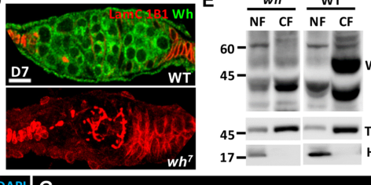
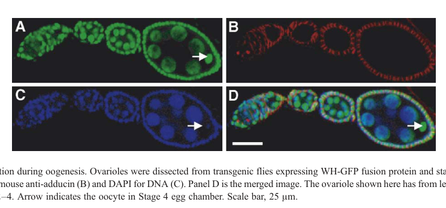

## Question

# Gene Research for Functional Annotation

## ⚠️ CRITICAL: Gene/Protein Identification Context

**BEFORE YOU BEGIN RESEARCH:** You MUST verify you are researching the CORRECT gene/protein. Gene symbols can be ambiguous, especially for less well-characterized genes from non-model organisms.

### Target Gene/Protein Identity (from UniProt):
- **UniProt Accession:** Q9W415
- **Protein Description:** RecName: Full=tRNA (guanine-N(7)-)-methyltransferase non-catalytic subunit wuho {ECO:0000255|HAMAP-Rule:MF_03056}; AltName: Full=protein wuho {ECO:0000312|FlyBase:FBgn0029857};
- **Gene Information:** Name=wuho {ECO:0000255|HAMAP-Rule:MF_03056, ECO:0000312|FlyBase:FBgn0029857}; Synonyms=wh {ECO:0000303|PubMed:39317727}; ORFNames=CG15897 {ECO:0000312|FlyBase:FBgn0029857};
- **Organism (full):** Drosophila melanogaster (Fruit fly).
- **Protein Family:** Belongs to the WD repeat TRM82 family. {ECO:0000255|HAMAP-
- **Key Domains:** Trm82. (IPR028884); TRM82_WD. (IPR063589); WD40/YVTN_repeat-like_dom_sf. (IPR015943); WD40_repeat_dom_sf. (IPR036322); WD40_rpt. (IPR001680)

### MANDATORY VERIFICATION STEPS:

1. **Check if the gene symbol "wuho" matches the protein description above**
2. **Verify the organism is correct:** Drosophila melanogaster (Fruit fly).
3. **Check if protein family/domains align with what you find in literature**
4. **If you find literature for a DIFFERENT gene with the same or similar symbol, STOP**

### If Gene Symbol is Ambiguous or You Cannot Find Relevant Literature:

**DO NOT PROCEED WITH RESEARCH ON A DIFFERENT GENE.** Instead:
- State clearly: "The gene symbol 'wuho' is ambiguous or literature is limited for this specific protein"
- Explain what you found (e.g., "Found extensive literature on a different gene with the same symbol in a different organism")
- Describe the protein based ONLY on the UniProt information provided above
- Suggest that the protein function can be inferred from domain/family information

### Research Target:

Please provide a comprehensive research report on the gene **wuho** (gene ID: wuho, UniProt: Q9W415) in DROME.

The research report should be a detailed narrative explaining the function, biological processes, and localization of the gene product. Citations should be given for all claims.

You should prioritize authoritative reviews and primary scientific literature when conducting research. You can supplement
this with annotations you find in gene/protein databases, but these can be outdated or inaccurate.

We are specifically interested in the primary function of the gene - for enzymes, what reaction is catalyzed, and what is the substrate specificity? For transporters, what is the substrate? For structural proteins or adapters, what is the broader structural role? For signaling molecules, what is the role in the pathway.

We are interested in where in or outside the cell the gene product carries out its function.

We are also interested in the signaling or biochemical pathways in which the gene functions. We are less interested in broad pleiotropic effects, except where these elucidate the precise role.

Include evidence where possible. We are interested in both experimental evidence as well as inference from structure, evolution, or bioinformatic analysis. Precise studies should be prioritized over high-throughput, where available.

## Output

Question: You are an expert researcher providing comprehensive, well-cited information.

Provide detailed information focusing on:
1. Key concepts and definitions with current understanding
2. Recent developments and latest research (prioritize 2023-2024 sources)
3. Current applications and real-world implementations
4. Expert opinions and analysis from authoritative sources
5. Relevant statistics and data from recent studies

Format as a comprehensive research report with proper citations. Include URLs and publication dates where available.
Always prioritize recent, authoritative sources and provide specific citations for all major claims.

# Gene Research for Functional Annotation

## ⚠️ CRITICAL: Gene/Protein Identification Context

**BEFORE YOU BEGIN RESEARCH:** You MUST verify you are researching the CORRECT gene/protein. Gene symbols can be ambiguous, especially for less well-characterized genes from non-model organisms.

### Target Gene/Protein Identity (from UniProt):
- **UniProt Accession:** Q9W415
- **Protein Description:** RecName: Full=tRNA (guanine-N(7)-)-methyltransferase non-catalytic subunit wuho {ECO:0000255|HAMAP-Rule:MF_03056}; AltName: Full=protein wuho {ECO:0000312|FlyBase:FBgn0029857};
- **Gene Information:** Name=wuho {ECO:0000255|HAMAP-Rule:MF_03056, ECO:0000312|FlyBase:FBgn0029857}; Synonyms=wh {ECO:0000303|PubMed:39317727}; ORFNames=CG15897 {ECO:0000312|FlyBase:FBgn0029857};
- **Organism (full):** Drosophila melanogaster (Fruit fly).
- **Protein Family:** Belongs to the WD repeat TRM82 family. {ECO:0000255|HAMAP-
- **Key Domains:** Trm82. (IPR028884); TRM82_WD. (IPR063589); WD40/YVTN_repeat-like_dom_sf. (IPR015943); WD40_repeat_dom_sf. (IPR036322); WD40_rpt. (IPR001680)

### MANDATORY VERIFICATION STEPS:

1. **Check if the gene symbol "wuho" matches the protein description above**
2. **Verify the organism is correct:** Drosophila melanogaster (Fruit fly).
3. **Check if protein family/domains align with what you find in literature**
4. **If you find literature for a DIFFERENT gene with the same or similar symbol, STOP**

### If Gene Symbol is Ambiguous or You Cannot Find Relevant Literature:

**DO NOT PROCEED WITH RESEARCH ON A DIFFERENT GENE.** Instead:
- State clearly: "The gene symbol 'wuho' is ambiguous or literature is limited for this specific protein"
- Explain what you found (e.g., "Found extensive literature on a different gene with the same symbol in a different organism")
- Describe the protein based ONLY on the UniProt information provided above
- Suggest that the protein function can be inferred from domain/family information

### Research Target:

Please provide a comprehensive research report on the gene **wuho** (gene ID: wuho, UniProt: Q9W415) in DROME.

The research report should be a detailed narrative explaining the function, biological processes, and localization of the gene product. Citations should be given for all claims.

You should prioritize authoritative reviews and primary scientific literature when conducting research. You can supplement
this with annotations you find in gene/protein databases, but these can be outdated or inaccurate.

We are specifically interested in the primary function of the gene - for enzymes, what reaction is catalyzed, and what is the substrate specificity? For transporters, what is the substrate? For structural proteins or adapters, what is the broader structural role? For signaling molecules, what is the role in the pathway.

We are interested in where in or outside the cell the gene product carries out its function.

We are also interested in the signaling or biochemical pathways in which the gene functions. We are less interested in broad pleiotropic effects, except where these elucidate the precise role.

Include evidence where possible. We are interested in both experimental evidence as well as inference from structure, evolution, or bioinformatic analysis. Precise studies should be prioritized over high-throughput, where available.

# Functional annotation of *Drosophila melanogaster* wuho (Q9W415)

## Identity and principal function

**Identity verified.** The requested UniProt accession Q9W415 is supplied as *D. melanogaster* **wuho**, also called **wh** or **CG15897**. The original fly study explicitly identifies CG15897 as *wh/wuho* and describes a protein with five WD40 repeats; later fly studies identify Wh as the counterpart of yeast Trm82 and human WDR4. These names, organism and domains are concordant. WDR4 and Trm82 findings are useful for comparison, but are not substituted here for experiments on fly Wh. (wu2006anewdrosophila pages 1-2, rastegari2020wd40proteinwuho pages 1-2, kaneko2024mettl1dependentm7gtrna pages 3-5)

**Best-supported primary biochemical role:** Wh is the **non-catalytic WD40 partner of Mettl1** in the fly tRNA N⁷-methylguanosine (**m⁷G**) methyltransferase complex. The complex transfers a methyl group from *S*-adenosyl-L-methionine to guanine N7 in the variable loop of selected tRNAs, conventionally designated **m⁷G46**. **Mettl1 supplies the catalytic methyltransferase activity; Wh is required for the tested activity but is not itself established to catalyze methyl transfer.** The WD40/Trm82-family assignment is consistent with a protein-interaction or enzyme-support role, rather than an independent methyltransferase active site. (kaneko2024mettl1dependentm7gtrna pages 3-5, kaneko2024mettl1dependentm7gtrna pages 5-6, tomikawa20187methylguanosinemodificationsin pages 3-5, leulliot2008structureofthe pages 1-2)

The evidence now goes beyond homology. In a 2024 fly study, Wh co-immunoprecipitated with Mettl1–FLAG from ovaries under two extraction conditions, and purified recombinant Mettl1 bound purified Wh in a GST pull-down. In vitro tRNA methylation required Wh alongside Mettl1; m⁷G-dependent cleavage products were also lost from *wh*-mutant testes. Thus, both physical partnership and a requirement for the tRNA-modification reaction have experimental support in this organism. (kaneko2024mettl1dependentm7gtrna pages 3-5, kaneko2024mettl1dependentm7gtrna pages 5-6)

The following table separates directly tested functions from interpretation and remaining limitations.

| Aspect | Specific direct evidence | Interpretation or limitation | Sources |
|---|---|---|---|
| Identity and family | The *D. melanogaster* gene **CG15897** was named **wh/wuho**; its protein contains five WD40 repeats and is homologous to yeast Trm82 and human WDR4. Null phenotypes were rescued by a *wh* transgene but not by a neighboring *top3β* transgene. | Confirms that the literature concerns the requested Q9W415 protein and supports classification in the WD-repeat Trm82/WDR4 family. | Wu et al., 2006, [doi:10.1016/j.ydbio.2006.04.459](https://doi.org/10.1016/j.ydbio.2006.04.459) (wu2006anewdrosophila pages 1-2, wu2006anewdrosophila pages 3-4) |
| Mettl1 methyltransferase complex | Mettl1–Flag co-immunoprecipitated Wh from fly ovaries under two buffer conditions; purified MBP–Mettl1 bound GST–Wh, but not GST alone. Recombinant Mettl1 required Wh for detectable tRNA methylation. Mei-P26, Nanos and Bgcn were not detected in Mettl1 immunoprecipitates. | **Strong direct evidence** that Wh is the non-catalytic partner of catalytic Mettl1 in a distinct fly complex. Absence from Mettl1 immunoprecipitates does not exclude separate Wh–Mei-P26 complexes. | Kaneko et al., 2024, [doi:10.1038/s41467-024-52389-0](https://doi.org/10.1038/s41467-024-52389-0) (kaneko2024mettl1dependentm7gtrna pages 3-5) |
| Reaction and substrate specificity | In vitro, Mettl1 plus GST–Wh methylated tRNA-TrpCCA. Recognition required the variable-loop **RAGGU** motif: replacing its fourth G with C abolished modification. NaBH₄/aniline cleavage products were lost from *wh*-mutant testes, supporting Wh-dependent tRNA m⁷G formation. | Supports methylation of guanosine—canonically G46—using SAM by Mettl1, with Wh required but not itself catalytic. The fly assay establishes motif dependence more directly than a universal G46 rule for every substrate. | Kaneko et al., 2024, [doi:10.1038/s41467-024-52389-0](https://doi.org/10.1038/s41467-024-52389-0) (kaneko2024mettl1dependentm7gtrna pages 5-6, kanekoUnknownyearmettl1dependentm7a pages 5-6); Tomikawa, 2018, [doi:10.3390/ijms19124080](https://doi.org/10.3390/ijms19124080) (tomikawa20187methylguanosinemodificationsin pages 3-5) |
| tRNA targets and stability | TRAC-seq identified **23** Mettl1/Wh-dependent m⁷G tRNAs in testes and **22** in ovaries. In Mettl1-knockout testes, **15 of the 23 modified tRNAs** decreased significantly; ProTGG and ValCAC decreased by northern blot, whereas modified TrpCCA did not. ArgTCT was classified as modified in testes but not ovaries, possibly because of ovarian read depth. | Shows substrate-selective stabilization rather than uniform effects. The 15-of-23 result follows **Mettl1 knockout, not Wh knockout**; it is not direct proof that Wh loss destabilizes all these tRNAs. | Kaneko et al., 2024, [doi:10.1038/s41467-024-52389-0](https://doi.org/10.1038/s41467-024-52389-0) (kaneko2024mettl1dependentm7gtrna pages 7-8, kaneko2024mettl1dependentm7gtrna pages 6-7) |
| Ovarian Mei-P26 pathway | Wh co-immunoprecipitated Mei-P26 in ovaries. *wh* and *mei-p26* mutants shared GSC loss, stem-cysts, mitotic persistence and meiotic failure. Wh loss disrupted BMP/pMad–Bam regulation and Sxl-complex targeting of the *nanos* 3′ UTR; Wh also associated with Nos, Bgcn and dMyc. Removing one *bam* or *dmyc* copy partially rescued selected defects. | Supports a context-dependent WD40 scaffold/adaptor role involving BMP signaling, *nanos* translational repression and dMyc/ribosome biogenesis. The experiments did **not** establish that every Mei-P26-associated phenotype is independent of Wh-mediated tRNA methylation. | Rastegari et al., 2020, [doi:10.1242/dev.182063](https://doi.org/10.1242/dev.182063) (rastegari2020wd40proteinwuho pages 6-7, rastegari2020wd40proteinwuho pages 7-9, rastegari2020wd40proteinwuho pages 9-11) |
| Ovarian localization: nuclear result | A functional, rescuing WH–GFP transgene appeared in nuclei of nurse cells, follicle cells and oocytes from the germarium through approximately stage 4. | Supports nuclear access in early oogenesis, but a GFP fusion and anti-GFP imaging may not reproduce endogenous Wh distribution. It does not identify the compartment where tRNA methylation occurs. | Wu et al., 2006, [doi:10.1016/j.ydbio.2006.04.459](https://doi.org/10.1016/j.ydbio.2006.04.459) (wu2006anewdrosophila pages 7-9, wu2006anewdrosophila media 39abd1fb) |
| Ovarian localization: cytosolic result | Endogenous Wh immunostaining was cytoplasmic in nearly all ovarian germ and somatic cells; biochemical fractionation placed most Wh in the cytosolic fraction, with H3 and β-tubulin as compartment controls and *wh* mutant ovaries as an antibody control. | Supports **predominantly cytosolic endogenous Wh** in adult ovaries but conflicts with the earlier WH–GFP result. Dynamic or dual localization remains plausible; the biochemical site of tRNA m⁷G installation was not mapped directly. | Rastegari et al., 2020, [doi:10.1242/dev.182063](https://doi.org/10.1242/dev.182063) (rastegari2020wd40proteinwuho pages 2-3, rastegari2020wd40proteinwuho media 9bb8eb7a) |
| Intestinal let-7 pathway | In the fly gut, Wdr4/Wh and Mettl1 depletion lowered m⁷G signal and let-7 abundance; anti-m⁷G immunoprecipitation enriched let-7. let-7 inhibition phenocopied Wdr4 loss, whereas let-7 expression, TOR inhibition or JNK suppression rescued aspects of ISC overproliferation and enlarged nucleoli. A proximity-ligation assay supported Wdr4–Mettl1 association. | Emerging evidence for a Wdr4–Mettl1–let-7–TOR/JNK/dMyc axis. Anti-m⁷G IP supports association with an m⁷G-bearing RNA but **does not map the modified nucleotide**; fly let-7 also lacks the canonical mammalian RAGGU context, so orthogonal site mapping is needed. | Kajal et al., 2026, [doi:10.1038/s44319-026-00701-y](https://doi.org/10.1038/s44319-026-00701-y) (kajal2026wdr4regulatesribosome pages 14-15, kajal2026wdr4regulatesribosome pages 13-14, kajal2026wdr4regulatesribosome pages 29-33) |

*Table: Evidence-graded summary of biochemical, RNA-substrate, localization and developmental findings for Drosophila Wuho/Q9W415. It distinguishes direct fly evidence from inference and highlights unresolved localization and substrate questions.*

## Substrate specificity and biochemical consequences

The reconstituted fly reaction methylated **tRNA-TrpCCA**. A recognized target contains a variable-loop **RAGGU** sequence motif, where R denotes a purine; replacing the motif’s fourth nucleotide, G, with C abolished detectable methylation in the reported assay. This demonstrates sequence dependence for the tested substrate, **not** that every fly tRNA bearing the motif is modified. The position-46 designation reflects the characterized tRNA m⁷G46 reaction and its comparative biochemical literature. (kaneko2024mettl1dependentm7gtrna pages 5-6, kaneko2024mettl1dependentm7gtrna pages 6-7, tomikawa20187methylguanosinemodificationsin pages 3-5)

Site-mapping by TRAC-seq identified **23 m⁷G-modified tRNAs in testes and 22 in ovaries**. tRNA-ArgTCT was classified as modified in testes but not in the ovary dataset; the investigators noted that limited ovarian read depth might explain that difference, so it should not be taken as proof of absolute tissue-specific modification. In *Mettl1*-knockout testes, **15 of the 23 modified tRNAs** decreased significantly in steady-state abundance. Northern blots confirmed decreases for tRNA-ProTGG and tRNA-ValCAC, whereas modified tRNA-TrpCCA did not show the same abundance decrease: modification does not stabilize every substrate equally. Importantly, the 15-of-23 abundance result is from **Mettl1 knockout**, while the direct *wh*-mutant result cited above is loss of m⁷G-associated cleavage products; equivalent Wh-specific abundance measurements should not be assumed. (kaneko2024mettl1dependentm7gtrna pages 6-7, kaneko2024mettl1dependentm7gtrna pages 7-8, kaneko2024mettl1dependentm7gtrna pages 5-6)

The proposed physiological sequence is **Wh–Mettl1-dependent tRNA methylation → maintenance of susceptible tRNA pools → efficient decoding of their codons → translation needed for germ-cell differentiation**. Ribosome profiling in *Mettl1* mutants showed stalling at codons decoded by depleted tRNAs, and increased EF1α1 expression partially counteracted male sterility, consistent with a tRNA-stability contribution. These downstream findings establish consequences of disrupting the methylation pathway, rather than proving that every *wh* phenotype is caused solely by tRNA decay. (kaneko2024mettl1dependentm7gtrna pages 5-6, kaneko2024mettl1dependentm7gtrna pages 7-8, kaneko2024mettl1dependentm7gtrna pages 6-7)

## Germline pathways and in-vivo function

**Spermatogenesis.** The initial genetic study found that *wh*-null males were sterile: developing spermatids arrested during elongation, and seminal vesicles lacked mature sperm. A *wh* transgene restored fertility, whereas a neighboring *top3β* transgene did not, separating the *wh* phenotype from the original deletion’s effect on that adjacent gene. This is a functional fly model of gene-dependent gametogenesis, not a clinical application. The 2024 discovery of Wh-dependent tRNA m⁷G supplies a plausible molecular explanation, although a Wh separation-of-function allele has not established which individual tRNA substrates cause the spermatid defect. (wu2006anewdrosophila pages 3-4, wu2006anewdrosophila pages 1-2, wu2006anewdrosophila pages 9-11, kaneko2024mettl1dependentm7gtrna pages 5-6)

The partner enzyme provides further mechanistic validation: *Mettl1*-knockout males produced **approximately one-tenth as many progeny** as controls and lacked elongated spermatids and mature sperm. Wild-type Mettl1 restored the phenotype, whereas a catalytically inactive L157A/D160A variant did not; germline-specific Mettl1 expression rescued male sterility. The fertility ratio and catalytic-rescue experiment concern **Mettl1 mutants**, not a quantitative fertility assay of *wh* mutants. (kaneko2024mettl1dependentm7gtrna pages 1-2, kaneko2024mettl1dependentm7gtrna pages 3-3, kaneko2024mettl1dependentm7gtrna pages 5-6)

**Ovarian germ-cell regulation.** Wh also physically associates with the TRIM-NHL protein **Mei-p26** in fly ovaries. Wh and Mei-p26 mutants exhibit overlapping defects in germline-stem-cell maintenance, abscission from daughter cells, control of cyst division and entry into meiosis. In one study, **67 ± 6% of *wh⁷* mutant germaria** contained stem cells connected to multiple daughters in abnormal “stem-cysts” (**n = 250**); germline-restricted Wh knockdown reproduced stem-cyst and stem-cell-loss phenotypes, supporting a cell-autonomous contribution. An independently generated *wh* CRISPR allele helped address the original allele’s neighboring-gene deletion. (rastegari2020wd40proteinwuho pages 2-3, rastegari2020wd40proteinwuho pages 3-5, rastegari2020wd40proteinwuho pages 5-6)

The proposed regulatory model is **Wh–Mei-p26/Nanos restraint of Brat → preservation of Mad/BMP signaling → repression of *bam*** in stem cells. In differentiating progeny, Wh supports a Mei-p26-associated **Bam–Sxl–Bgcn** pathway that represses *nanos* translation; Wh loss prevented Sxl-associated recovery of the *nanos* 3′ UTR. Wh also co-immunoprecipitated with Nos, Bgcn and dMyc in the reported assays, while *wh* mutants displayed altered microRNA levels and increased indicators of ribosome biogenesis. Removing one *bam* copy restored stem-cell number, and lowering *dmyc* partially suppressed nucleolar and proliferation defects. These observations support a **context-dependent WD40 adaptor/regulatory role**, but the detailed assemblies and whether any effect is independent of tRNA methylation remain incompletely established. Mei-p26, Nos and Bgcn were **not detected** in the 2024 Mettl1 immunoprecipitates, consistent with distinguishable Wh-containing complexes rather than a single proven Mettl1–Mei-p26 complex. (rastegari2020wd40proteinwuho pages 6-7, rastegari2020wd40proteinwuho pages 7-9, rastegari2020wd40proteinwuho pages 9-11, kaneko2024mettl1dependentm7gtrna pages 3-5)

## Cellular and subcellular localization

Wh acts **inside cells**, with direct evidence in ovarian germ cells, ovarian somatic cells and the testis niche and germline. A functional WH–GFP reporter was especially prominent in **somatic testis hub cells**, although hub cells and early germ cells remained present in mutant testes: high niche expression does not mean hub-cell maintenance is its essential function. The reporter also appeared **nuclear** in early ovarian nurse cells, follicle cells and oocytes, approximately through egg-chamber stage 4. (wu2006anewdrosophila pages 7-9, wu2006anewdrosophila pages 1-2, wu2006anewdrosophila media 39abd1fb)

A subsequent analysis of **endogenous Wh**, however, found staining predominantly in the **cytoplasm** of nearly all ovarian germ and somatic cells. Nuclear/cytosolic fractionation placed most ovarian Wh in the cytosolic fraction, using histone H3 and β-tubulin compartment markers and *wh* mutants as a specificity control. The nuclear WH–GFP and predominantly cytosolic endogenous-protein findings should both be reported; differences in construct, method or cellular state have not been resolved. **No cited experiment localizes the Wh-dependent methyl-transfer reaction itself exclusively to either nucleus or cytosol.** (rastegari2020wd40proteinwuho pages 2-3, rastegari2020wd40proteinwuho media 9bb8eb7a, wu2006anewdrosophila media 39abd1fb)

## Newer findings and boundaries of interpretation

A July **2024** aging study observed that expression of fly Wuho and the fly Mettl1 counterpart fell with age. Its roughly **20% lifespan reduction** followed knockdown of the **Mettl1 counterpart**, **not Wuho**; neither the lifespan number nor mammalian senescence experiments should be misattributed to a fly *wh* perturbation. (fu2024perturbationofmettl1mediated pages 3-4)

A later, February **2026**, fly intestinal study extends the possible RNA scope of Wh/Wdr4. In intestinal stem and progenitor cells, Wdr4 and Mettl1 perturbation lowered m⁷G signal and **let-7** microRNA abundance; anti-m⁷G immunoprecipitation recovered let-7, and Wdr4–Mettl1 association was supported by proximity ligation. let-7 overexpression, TOR inhibition or JNK suppression rescued aspects of the increased stem-cell proliferation and ribosome-biogenesis phenotype, supporting a **let-7–TOR–JNK–dMyc** model. Nevertheless, the cited immunoprecipitation does **not map an exact modified nucleotide in fly let-7**, and the paper notes that fly let-7 lacks the conventional mammalian RAGGU context. This is a promising tissue-specific extension, **not a reason to replace the directly reconstituted tRNA reaction as Wh’s best-established primary function**. The work uses fly gut genetics and human WDR4 rescue in flies; it is not evidence of a therapeutic implementation. (kajal2026wdr4regulatesribosome pages 29-33, kajal2026wdr4regulatesribosome pages 13-14, kajal2026wdr4regulatesribosome pages 14-15)

**Functional-annotation conclusion.** Annotate Q9W415 as a **WD40/Trm82-family, non-catalytic Mettl1-associated tRNA guanine-N7 methyltransferase subunit**, required for m⁷G modification of selected tRNAs. Separately record the **experimentally supported Wh–Mei-p26-associated ovarian regulatory role**, without asserting that it is biochemically independent of tRNA modification. Describe cellular localization as **predominantly cytosolic in endogenous adult ovarian measurements, with nuclear signal reported for a rescuing WH–GFP reporter**; a unique subcellular site of catalysis is undetermined. (kaneko2024mettl1dependentm7gtrna pages 3-5, kaneko2024mettl1dependentm7gtrna pages 5-6, rastegari2020wd40proteinwuho pages 5-6, rastegari2020wd40proteinwuho media 9bb8eb7a, wu2006anewdrosophila media 39abd1fb)

### Principal sources and publication dates

- Kaneko S. *et al.* **September 2024**. “Mettl1-dependent m7G tRNA modification is essential for maintaining spermatogenesis and fertility in *Drosophila melanogaster*.” *Nature Communications*. https://doi.org/10.1038/s41467-024-52389-0. Direct fly complex, substrate and modification experiments. (kaneko2024mettl1dependentm7gtrna pages 3-5, kaneko2024mettl1dependentm7gtrna pages 6-7)
- Fu Y. *et al.* **July 2024**. “Perturbation of METTL1-mediated tRNA N7-methylguanosine modification induces senescence and aging.” *Nature Communications*. https://doi.org/10.1038/s41467-024-49796-8. Fly expression observation; distinction between Wuho and partner-gene knockdown. (fu2024perturbationofmettl1mediated pages 3-4)
- Rastegari E. *et al.* **January 2020**. “WD40 protein Wuho controls germline homeostasis via TRIM-NHL tumor suppressor Mei-p26 in *Drosophila*.” *Development*. https://doi.org/10.1242/dev.182063. Ovarian interaction, genetics and endogenous localization. (rastegari2020wd40proteinwuho pages 1-2, rastegari2020wd40proteinwuho pages 2-3)
- Wu J., Hou J.H. and Hsieh T.-S. **Available online May 2006; journal issue August 2006**. “A new *Drosophila* gene wh (wuho) with WD40 repeats is essential for spermatogenesis and has maximal expression in hub cells.” *Developmental Biology*. https://doi.org/10.1016/j.ydbio.2006.04.459. Gene identity, rescue, reproductive phenotype and WH–GFP localization. (wu2006anewdrosophila pages 1-2, wu2006anewdrosophila pages 7-9)
- Kajal K. *et al.* **February 2026**. “Wdr4 regulates ribosome biogenesis and intestinal homeostasis via let-7.” *EMBO Reports*. https://doi.org/10.1038/s44319-026-00701-y. Later fly intestinal extension, with RNA-site specificity still requiring clarification. (kajal2026wdr4regulatesribosome pages 1-2, kajal2026wdr4regulatesribosome pages 14-15)
- Tomikawa C. **December 2018**. “7-Methylguanosine Modifications in Transfer RNA (tRNA).” *International Journal of Molecular Sciences*. https://doi.org/10.3390/ijms19124080. Comparative review of m⁷G46 chemistry and Trm8–Trm82. (tomikawa20187methylguanosinemodificationsin pages 3-5)

References

1. (wu2006anewdrosophila pages 1-2): Jianhong Wu, Joshua H. Hou, and Tao-shih Hsieh. A new drosophila gene wh (wuho) with wd40 repeats is essential for spermatogenesis and has maximal expression in hub cells. Developmental biology, 296 1:219-30, Aug 2006. URL: https://doi.org/10.1016/j.ydbio.2006.04.459, doi:10.1016/j.ydbio.2006.04.459. This article has 33 citations and is from a peer-reviewed journal.

2. (rastegari2020wd40proteinwuho pages 1-2): Elham Rastegari, Kreeti Kajal, Boon-Shing Tan, Fu Huang, Ruey-Hwa Chen, Tao-Shieh Hsieh, and Hwei-Jan Hsu. Wd40 protein wuho controls germline homeostasis via trim-nhl tumor suppressor mei-p26 in drosophila. Development, Jan 2020. URL: https://doi.org/10.1242/dev.182063, doi:10.1242/dev.182063. This article has 23 citations and is from a domain leading peer-reviewed journal.

3. (kaneko2024mettl1dependentm7gtrna pages 3-5): Shunya Kaneko, Keita Miyoshi, Kotaro Tomuro, Makoto Terauchi, Ryoya Tanaka, Shu Kondo, Naoki Tani, Kei-Ichiro Ishiguro, Atsushi Toyoda, Azusa Kamikouchi, Hideki Noguchi, Shintaro Iwasaki, and Kuniaki Saito. Mettl1-dependent m7g trna modification is essential for maintaining spermatogenesis and fertility in drosophila melanogaster. Nature Communications, Sep 2024. URL: https://doi.org/10.1038/s41467-024-52389-0, doi:10.1038/s41467-024-52389-0. This article has 30 citations and is from a highest quality peer-reviewed journal.

4. (kaneko2024mettl1dependentm7gtrna pages 5-6): Shunya Kaneko, Keita Miyoshi, Kotaro Tomuro, Makoto Terauchi, Ryoya Tanaka, Shu Kondo, Naoki Tani, Kei-Ichiro Ishiguro, Atsushi Toyoda, Azusa Kamikouchi, Hideki Noguchi, Shintaro Iwasaki, and Kuniaki Saito. Mettl1-dependent m7g trna modification is essential for maintaining spermatogenesis and fertility in drosophila melanogaster. Nature Communications, Sep 2024. URL: https://doi.org/10.1038/s41467-024-52389-0, doi:10.1038/s41467-024-52389-0. This article has 30 citations and is from a highest quality peer-reviewed journal.

5. (tomikawa20187methylguanosinemodificationsin pages 3-5): Chie Tomikawa. 7-methylguanosine modifications in transfer rna (trna). International Journal of Molecular Sciences, 19:4080, Dec 2018. URL: https://doi.org/10.3390/ijms19124080, doi:10.3390/ijms19124080. This article has 272 citations.

6. (leulliot2008structureofthe pages 1-2): Nicolas Leulliot, Maxime Chaillet, Dominique Durand, Nathalie Ulryck, Karine Blondeau, and Herman van Tilbeurgh. Structure of the yeast trna m7g methylation complex. Structure, 16 1:52-61, Jan 2008. URL: https://doi.org/10.1016/j.str.2007.10.025, doi:10.1016/j.str.2007.10.025. This article has 123 citations and is from a domain leading peer-reviewed journal.

7. (wu2006anewdrosophila pages 3-4): Jianhong Wu, Joshua H. Hou, and Tao-shih Hsieh. A new drosophila gene wh (wuho) with wd40 repeats is essential for spermatogenesis and has maximal expression in hub cells. Developmental biology, 296 1:219-30, Aug 2006. URL: https://doi.org/10.1016/j.ydbio.2006.04.459, doi:10.1016/j.ydbio.2006.04.459. This article has 33 citations and is from a peer-reviewed journal.

8. (kanekoUnknownyearmettl1dependentm7a pages 5-6): S Kaneko, K Miyoshi, K Tomuro, M Terauchi, and R Tanaka. Mettl1-dependent m 7 g trna modification is essential for maintaining spermatogenesis. Unknown journal, Unknown year.

9. (kaneko2024mettl1dependentm7gtrna pages 7-8): Shunya Kaneko, Keita Miyoshi, Kotaro Tomuro, Makoto Terauchi, Ryoya Tanaka, Shu Kondo, Naoki Tani, Kei-Ichiro Ishiguro, Atsushi Toyoda, Azusa Kamikouchi, Hideki Noguchi, Shintaro Iwasaki, and Kuniaki Saito. Mettl1-dependent m7g trna modification is essential for maintaining spermatogenesis and fertility in drosophila melanogaster. Nature Communications, Sep 2024. URL: https://doi.org/10.1038/s41467-024-52389-0, doi:10.1038/s41467-024-52389-0. This article has 30 citations and is from a highest quality peer-reviewed journal.

10. (kaneko2024mettl1dependentm7gtrna pages 6-7): Shunya Kaneko, Keita Miyoshi, Kotaro Tomuro, Makoto Terauchi, Ryoya Tanaka, Shu Kondo, Naoki Tani, Kei-Ichiro Ishiguro, Atsushi Toyoda, Azusa Kamikouchi, Hideki Noguchi, Shintaro Iwasaki, and Kuniaki Saito. Mettl1-dependent m7g trna modification is essential for maintaining spermatogenesis and fertility in drosophila melanogaster. Nature Communications, Sep 2024. URL: https://doi.org/10.1038/s41467-024-52389-0, doi:10.1038/s41467-024-52389-0. This article has 30 citations and is from a highest quality peer-reviewed journal.

11. (rastegari2020wd40proteinwuho pages 6-7): Elham Rastegari, Kreeti Kajal, Boon-Shing Tan, Fu Huang, Ruey-Hwa Chen, Tao-Shieh Hsieh, and Hwei-Jan Hsu. Wd40 protein wuho controls germline homeostasis via trim-nhl tumor suppressor mei-p26 in drosophila. Development, Jan 2020. URL: https://doi.org/10.1242/dev.182063, doi:10.1242/dev.182063. This article has 23 citations and is from a domain leading peer-reviewed journal.

12. (rastegari2020wd40proteinwuho pages 7-9): Elham Rastegari, Kreeti Kajal, Boon-Shing Tan, Fu Huang, Ruey-Hwa Chen, Tao-Shieh Hsieh, and Hwei-Jan Hsu. Wd40 protein wuho controls germline homeostasis via trim-nhl tumor suppressor mei-p26 in drosophila. Development, Jan 2020. URL: https://doi.org/10.1242/dev.182063, doi:10.1242/dev.182063. This article has 23 citations and is from a domain leading peer-reviewed journal.

13. (rastegari2020wd40proteinwuho pages 9-11): Elham Rastegari, Kreeti Kajal, Boon-Shing Tan, Fu Huang, Ruey-Hwa Chen, Tao-Shieh Hsieh, and Hwei-Jan Hsu. Wd40 protein wuho controls germline homeostasis via trim-nhl tumor suppressor mei-p26 in drosophila. Development, Jan 2020. URL: https://doi.org/10.1242/dev.182063, doi:10.1242/dev.182063. This article has 23 citations and is from a domain leading peer-reviewed journal.

14. (wu2006anewdrosophila pages 7-9): Jianhong Wu, Joshua H. Hou, and Tao-shih Hsieh. A new drosophila gene wh (wuho) with wd40 repeats is essential for spermatogenesis and has maximal expression in hub cells. Developmental biology, 296 1:219-30, Aug 2006. URL: https://doi.org/10.1016/j.ydbio.2006.04.459, doi:10.1016/j.ydbio.2006.04.459. This article has 33 citations and is from a peer-reviewed journal.

15. (wu2006anewdrosophila media 39abd1fb): Jianhong Wu, Joshua H. Hou, and Tao-shih Hsieh. A new drosophila gene wh (wuho) with wd40 repeats is essential for spermatogenesis and has maximal expression in hub cells. Developmental biology, 296 1:219-30, Aug 2006. URL: https://doi.org/10.1016/j.ydbio.2006.04.459, doi:10.1016/j.ydbio.2006.04.459. This article has 33 citations and is from a peer-reviewed journal.

16. (rastegari2020wd40proteinwuho pages 2-3): Elham Rastegari, Kreeti Kajal, Boon-Shing Tan, Fu Huang, Ruey-Hwa Chen, Tao-Shieh Hsieh, and Hwei-Jan Hsu. Wd40 protein wuho controls germline homeostasis via trim-nhl tumor suppressor mei-p26 in drosophila. Development, Jan 2020. URL: https://doi.org/10.1242/dev.182063, doi:10.1242/dev.182063. This article has 23 citations and is from a domain leading peer-reviewed journal.

17. (rastegari2020wd40proteinwuho media 9bb8eb7a): Elham Rastegari, Kreeti Kajal, Boon-Shing Tan, Fu Huang, Ruey-Hwa Chen, Tao-Shieh Hsieh, and Hwei-Jan Hsu. Wd40 protein wuho controls germline homeostasis via trim-nhl tumor suppressor mei-p26 in drosophila. Development, Jan 2020. URL: https://doi.org/10.1242/dev.182063, doi:10.1242/dev.182063. This article has 23 citations and is from a domain leading peer-reviewed journal.

18. (kajal2026wdr4regulatesribosome pages 14-15): Kreeti Kajal, Elham Rastegari, Wen-Der Wang, Jian-Chiuan Li, Chun-Hong Chen, Wan Hsuan Chou, Wei Chiao Chang, Tzu-Yang Lin, Kevin Tsai, Tsai Ming Lu, Kartik Venkatachalam, and Hwei-Jan Hsu. Wdr4 regulates ribosome biogenesis and intestinal homeostasis via let-7. EMBO Reports, 27:1870-1903, Feb 2026. URL: https://doi.org/10.1038/s44319-026-00701-y, doi:10.1038/s44319-026-00701-y. This article has 0 citations and is from a highest quality peer-reviewed journal.

19. (kajal2026wdr4regulatesribosome pages 13-14): Kreeti Kajal, Elham Rastegari, Wen-Der Wang, Jian-Chiuan Li, Chun-Hong Chen, Wan Hsuan Chou, Wei Chiao Chang, Tzu-Yang Lin, Kevin Tsai, Tsai Ming Lu, Kartik Venkatachalam, and Hwei-Jan Hsu. Wdr4 regulates ribosome biogenesis and intestinal homeostasis via let-7. EMBO Reports, 27:1870-1903, Feb 2026. URL: https://doi.org/10.1038/s44319-026-00701-y, doi:10.1038/s44319-026-00701-y. This article has 0 citations and is from a highest quality peer-reviewed journal.

20. (kajal2026wdr4regulatesribosome pages 29-33): Kreeti Kajal, Elham Rastegari, Wen-Der Wang, Jian-Chiuan Li, Chun-Hong Chen, Wan Hsuan Chou, Wei Chiao Chang, Tzu-Yang Lin, Kevin Tsai, Tsai Ming Lu, Kartik Venkatachalam, and Hwei-Jan Hsu. Wdr4 regulates ribosome biogenesis and intestinal homeostasis via let-7. EMBO Reports, 27:1870-1903, Feb 2026. URL: https://doi.org/10.1038/s44319-026-00701-y, doi:10.1038/s44319-026-00701-y. This article has 0 citations and is from a highest quality peer-reviewed journal.

21. (wu2006anewdrosophila pages 9-11): Jianhong Wu, Joshua H. Hou, and Tao-shih Hsieh. A new drosophila gene wh (wuho) with wd40 repeats is essential for spermatogenesis and has maximal expression in hub cells. Developmental biology, 296 1:219-30, Aug 2006. URL: https://doi.org/10.1016/j.ydbio.2006.04.459, doi:10.1016/j.ydbio.2006.04.459. This article has 33 citations and is from a peer-reviewed journal.

22. (kaneko2024mettl1dependentm7gtrna pages 1-2): Shunya Kaneko, Keita Miyoshi, Kotaro Tomuro, Makoto Terauchi, Ryoya Tanaka, Shu Kondo, Naoki Tani, Kei-Ichiro Ishiguro, Atsushi Toyoda, Azusa Kamikouchi, Hideki Noguchi, Shintaro Iwasaki, and Kuniaki Saito. Mettl1-dependent m7g trna modification is essential for maintaining spermatogenesis and fertility in drosophila melanogaster. Nature Communications, Sep 2024. URL: https://doi.org/10.1038/s41467-024-52389-0, doi:10.1038/s41467-024-52389-0. This article has 30 citations and is from a highest quality peer-reviewed journal.

23. (kaneko2024mettl1dependentm7gtrna pages 3-3): Shunya Kaneko, Keita Miyoshi, Kotaro Tomuro, Makoto Terauchi, Ryoya Tanaka, Shu Kondo, Naoki Tani, Kei-Ichiro Ishiguro, Atsushi Toyoda, Azusa Kamikouchi, Hideki Noguchi, Shintaro Iwasaki, and Kuniaki Saito. Mettl1-dependent m7g trna modification is essential for maintaining spermatogenesis and fertility in drosophila melanogaster. Nature Communications, Sep 2024. URL: https://doi.org/10.1038/s41467-024-52389-0, doi:10.1038/s41467-024-52389-0. This article has 30 citations and is from a highest quality peer-reviewed journal.

24. (rastegari2020wd40proteinwuho pages 3-5): Elham Rastegari, Kreeti Kajal, Boon-Shing Tan, Fu Huang, Ruey-Hwa Chen, Tao-Shieh Hsieh, and Hwei-Jan Hsu. Wd40 protein wuho controls germline homeostasis via trim-nhl tumor suppressor mei-p26 in drosophila. Development, Jan 2020. URL: https://doi.org/10.1242/dev.182063, doi:10.1242/dev.182063. This article has 23 citations and is from a domain leading peer-reviewed journal.

25. (rastegari2020wd40proteinwuho pages 5-6): Elham Rastegari, Kreeti Kajal, Boon-Shing Tan, Fu Huang, Ruey-Hwa Chen, Tao-Shieh Hsieh, and Hwei-Jan Hsu. Wd40 protein wuho controls germline homeostasis via trim-nhl tumor suppressor mei-p26 in drosophila. Development, Jan 2020. URL: https://doi.org/10.1242/dev.182063, doi:10.1242/dev.182063. This article has 23 citations and is from a domain leading peer-reviewed journal.

26. (fu2024perturbationofmettl1mediated pages 3-4): Yudong Fu, Fan Jiang, Xiao Zhang, Yingyi Pan, Rui Xu, Xiu Liang, Xiaofen Wu, Xingqiang Li, Kaixuan Lin, Ruona Shi, Xiaofei Zhang, Dominique Ferrandon, Jing Liu, Duanqing Pei, Jie Wang, and Tao Wang. Perturbation of mettl1-mediated trna n7- methylguanosine modification induces senescence and aging. Nature Communications, Jul 2024. URL: https://doi.org/10.1038/s41467-024-49796-8, doi:10.1038/s41467-024-49796-8. This article has 49 citations and is from a highest quality peer-reviewed journal.

27. (kajal2026wdr4regulatesribosome pages 1-2): Kreeti Kajal, Elham Rastegari, Wen-Der Wang, Jian-Chiuan Li, Chun-Hong Chen, Wan Hsuan Chou, Wei Chiao Chang, Tzu-Yang Lin, Kevin Tsai, Tsai Ming Lu, Kartik Venkatachalam, and Hwei-Jan Hsu. Wdr4 regulates ribosome biogenesis and intestinal homeostasis via let-7. EMBO Reports, 27:1870-1903, Feb 2026. URL: https://doi.org/10.1038/s44319-026-00701-y, doi:10.1038/s44319-026-00701-y. This article has 0 citations and is from a highest quality peer-reviewed journal.

## Artifacts

- [Edison artifact artifact-00](wuho-deep-research-falcon_artifacts/artifact-00.md)

## Citations

1. wu2006anewdrosophila pages 1-2
2. leulliot2008structureofthe pages 1-2
3. wu2006anewdrosophila pages 3-4
4. wu2006anewdrosophila pages 7-9
5. wu2006anewdrosophila pages 9-11
6. doi:10.1016/j.ydbio.2006.04.459
7. doi:10.1038/s41467-024-52389-0
8. doi:10.3390/ijms19124080
9. doi:10.1242/dev.182063
10. doi:10.1038/s44319-026-00701-y
11. https://doi.org/10.1016/j.ydbio.2006.04.459
12. https://doi.org/10.1038/s41467-024-52389-0
13. https://doi.org/10.3390/ijms19124080
14. https://doi.org/10.1242/dev.182063
15. https://doi.org/10.1038/s44319-026-00701-y
16. https://doi.org/10.1038/s41467-024-52389-0.
17. https://doi.org/10.1038/s41467-024-49796-8.
18. https://doi.org/10.1242/dev.182063.
19. https://doi.org/10.1016/j.ydbio.2006.04.459.
20. https://doi.org/10.1038/s44319-026-00701-y.
21. https://doi.org/10.3390/ijms19124080.
22. https://doi.org/10.1016/j.ydbio.2006.04.459,
23. https://doi.org/10.1242/dev.182063,
24. https://doi.org/10.1038/s41467-024-52389-0,
25. https://doi.org/10.3390/ijms19124080,
26. https://doi.org/10.1016/j.str.2007.10.025,
27. https://doi.org/10.1038/s44319-026-00701-y,
28. https://doi.org/10.1038/s41467-024-49796-8,