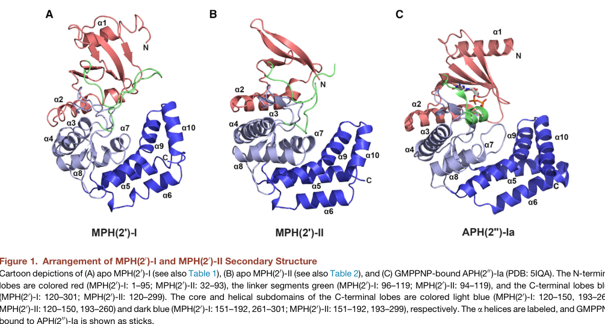

## Question

# Gene Research for Functional Annotation

## ⚠️ CRITICAL: Gene/Protein Identification Context

**BEFORE YOU BEGIN RESEARCH:** You MUST verify you are researching the CORRECT gene/protein. Gene symbols can be ambiguous, especially for less well-characterized genes from non-model organisms.

### Target Gene/Protein Identity (from UniProt):
- **UniProt Accession:** A0A0H3EUF3
- **Protein Description:** SubName: Full=Macrolide 2'-phosphotransferase II protein MphB {ECO:0000313|EMBL:ADR29924.1};
- **Gene Information:** OrderedLocusNames=NRG857_30123 {ECO:0000313|EMBL:ADR29924.1};
- **Organism (full):** Escherichia coli O83:H1 (strain NRG 857C / AIEC).
- **Protein Family:** Not specified in UniProt
- **Key Domains:** AGP_Transferase. (IPR051678); Aminoglycoside_PTrfase. (IPR002575); Kinase-like_dom_sf. (IPR011009); APH (PF01636)

### MANDATORY VERIFICATION STEPS:

1. **Check if the gene symbol "A0A0H3EUF3_ECO8N" matches the protein description above**
2. **Verify the organism is correct:** Escherichia coli O83:H1 (strain NRG 857C / AIEC).
3. **Check if protein family/domains align with what you find in literature**
4. **If you find literature for a DIFFERENT gene with the same or similar symbol, STOP**

### If Gene Symbol is Ambiguous or You Cannot Find Relevant Literature:

**DO NOT PROCEED WITH RESEARCH ON A DIFFERENT GENE.** Instead:
- State clearly: "The gene symbol 'A0A0H3EUF3_ECO8N' is ambiguous or literature is limited for this specific protein"
- Explain what you found (e.g., "Found extensive literature on a different gene with the same symbol in a different organism")
- Describe the protein based ONLY on the UniProt information provided above
- Suggest that the protein function can be inferred from domain/family information

### Research Target:

Please provide a comprehensive research report on the gene **A0A0H3EUF3_ECO8N** (gene ID: A0A0H3EUF3_ECO8N, UniProt: A0A0H3EUF3) in ECO8N.

The research report should be a detailed narrative explaining the function, biological processes, and localization of the gene product. Citations should be given for all claims.

You should prioritize authoritative reviews and primary scientific literature when conducting research. You can supplement
this with annotations you find in gene/protein databases, but these can be outdated or inaccurate.

We are specifically interested in the primary function of the gene - for enzymes, what reaction is catalyzed, and what is the substrate specificity? For transporters, what is the substrate? For structural proteins or adapters, what is the broader structural role? For signaling molecules, what is the role in the pathway.

We are interested in where in or outside the cell the gene product carries out its function.

We are also interested in the signaling or biochemical pathways in which the gene functions. We are less interested in broad pleiotropic effects, except where these elucidate the precise role.

Include evidence where possible. We are interested in both experimental evidence as well as inference from structure, evolution, or bioinformatic analysis. Precise studies should be prioritized over high-throughput, where available.

## Output

Question: You are an expert researcher providing comprehensive, well-cited information.

Provide detailed information focusing on:
1. Key concepts and definitions with current understanding
2. Recent developments and latest research (prioritize 2023-2024 sources)
3. Current applications and real-world implementations
4. Expert opinions and analysis from authoritative sources
5. Relevant statistics and data from recent studies

Format as a comprehensive research report with proper citations. Include URLs and publication dates where available.
Always prioritize recent, authoritative sources and provide specific citations for all major claims.

# Gene Research for Functional Annotation

## ⚠️ CRITICAL: Gene/Protein Identification Context

**BEFORE YOU BEGIN RESEARCH:** You MUST verify you are researching the CORRECT gene/protein. Gene symbols can be ambiguous, especially for less well-characterized genes from non-model organisms.

### Target Gene/Protein Identity (from UniProt):
- **UniProt Accession:** A0A0H3EUF3
- **Protein Description:** SubName: Full=Macrolide 2'-phosphotransferase II protein MphB {ECO:0000313|EMBL:ADR29924.1};
- **Gene Information:** OrderedLocusNames=NRG857_30123 {ECO:0000313|EMBL:ADR29924.1};
- **Organism (full):** Escherichia coli O83:H1 (strain NRG 857C / AIEC).
- **Protein Family:** Not specified in UniProt
- **Key Domains:** AGP_Transferase. (IPR051678); Aminoglycoside_PTrfase. (IPR002575); Kinase-like_dom_sf. (IPR011009); APH (PF01636)

### MANDATORY VERIFICATION STEPS:

1. **Check if the gene symbol "A0A0H3EUF3_ECO8N" matches the protein description above**
2. **Verify the organism is correct:** Escherichia coli O83:H1 (strain NRG 857C / AIEC).
3. **Check if protein family/domains align with what you find in literature**
4. **If you find literature for a DIFFERENT gene with the same or similar symbol, STOP**

### If Gene Symbol is Ambiguous or You Cannot Find Relevant Literature:

**DO NOT PROCEED WITH RESEARCH ON A DIFFERENT GENE.** Instead:
- State clearly: "The gene symbol 'A0A0H3EUF3_ECO8N' is ambiguous or literature is limited for this specific protein"
- Explain what you found (e.g., "Found extensive literature on a different gene with the same symbol in a different organism")
- Describe the protein based ONLY on the UniProt information provided above
- Suggest that the protein function can be inferred from domain/family information

### Research Target:

Please provide a comprehensive research report on the gene **A0A0H3EUF3_ECO8N** (gene ID: A0A0H3EUF3_ECO8N, UniProt: A0A0H3EUF3) in ECO8N.

The research report should be a detailed narrative explaining the function, biological processes, and localization of the gene product. Citations should be given for all claims.

You should prioritize authoritative reviews and primary scientific literature when conducting research. You can supplement
this with annotations you find in gene/protein databases, but these can be outdated or inaccurate.

We are specifically interested in the primary function of the gene - for enzymes, what reaction is catalyzed, and what is the substrate specificity? For transporters, what is the substrate? For structural proteins or adapters, what is the broader structural role? For signaling molecules, what is the role in the pathway.

We are interested in where in or outside the cell the gene product carries out its function.

We are also interested in the signaling or biochemical pathways in which the gene functions. We are less interested in broad pleiotropic effects, except where these elucidate the precise role.

Include evidence where possible. We are interested in both experimental evidence as well as inference from structure, evolution, or bioinformatic analysis. Precise studies should be prioritized over high-throughput, where available.

# Research Report: Functional Annotation of **A0A0H3EUF3_ECO8N** (UniProt A0A0H3EUF3) — Macrolide 2′-Phosphotransferase II (MphB)

## 0. Target verification (identity and scope)
The user-specified UniProt description identifies A0A0H3EUF3 as **macrolide 2′-phosphotransferase type II (MphB)** from *Escherichia coli* O83:H1 (strain NRG 857C / AIEC). Direct UniProt retrieval was not available through the current toolchain; therefore, this report verifies identity indirectly by matching the provided description and InterPro/Pfam domain expectations (APH/kinase-like phosphotransferase superfamily) to authoritative biochemical and structural literature on **MphB/MPH(2′)-II**. These studies characterize **MPH(2′)-II (MphB)** as a kinase-like enzyme that phosphorylates macrolides at the **desosamine 2′-OH**, conferring macrolide resistance, consistent with the UniProt-provided functional label and APH-like domain annotation. (taniguchi2004theroleof pages 1-2, taniguchi2004theroleof pages 2-4, fong2017structuralbasisfor pages 1-3, pawlowski2018theevolutionof pages 4-6)

## 1. Key concepts and definitions (current understanding)
### 1.1 What is MphB?
**MphB (macrolide 2′-phosphotransferase II; MPH(2′)-II)** is an antibiotic resistance enzyme that **chemically inactivates macrolide antibiotics** by **phosphorylation**. It belongs to a broader class of **macrolide phosphotransferases (Mph)**, which are **kinase-like** enzymes evolutionarily/structurally related to aminoglycoside phosphotransferases. (fong2017structuralbasisfor pages 1-3, pawlowski2018theevolutionof pages 6-7)

### 1.2 Reaction chemistry (what bond is made, what position is modified?)
Multiple lines of evidence support that Mph enzymes, including MphB, inactivate macrolides by **O-phosphorylation of the desosamine sugar**, specifically at the **2′-hydroxyl (2′-OH)** position. A tandem-MS-supported analysis cited in a Nature Communications study identifies **MphB** as a **macrolide 2′-phosphotransferase that phosphorylates the desosamine 2′-OH of erythromycin**. (pawlowski2018theevolutionof pages 4-6)

### 1.3 Cofactors and donor nucleotide usage
MphB is a **nucleotidyl-phosphate–dependent kinase-like enzyme** requiring a **divalent metal ion** (typically Mg2+ in kinase chemistry) for nucleotide handling/catalysis. Structural work observed divalent metal in the nucleotide-binding pocket (Mg2+ or Ca2+ in structures) and highlighted metal-coordinating residues. (fong2017structuralbasisfor pages 5-6)

The literature indicates **purine nucleotides** can be used as phosphate donors, with some differences between experimental systems/studies: mutational enzymology work describes transfer of the **γ-phosphate of ATP** to macrolides, whereas a high-resolution structural/enzymology study reported that **MPH(2′)-II shows a preference for GTP over ATP**. These findings can be reconciled by the view that MphB is a kinase-like enzyme that can act with ATP but may be optimized for guanine nucleotides in vitro for some homologs/assay formats. (taniguchi2004theroleof pages 1-2, fong2017structuralbasisfor pages 1-3, fong2017structuralbasisfor pages 16-17)

## 2. Molecular function: substrate specificity and catalytic determinants
### 2.1 Substrate spectrum (which macrolides are modified?)
Evidence supports a **broad macrolide spectrum** for MphB/MPH(2′)-II, spanning **14-, 15-, and 16-membered lactone macrolides** and including the ketolide **telithromycin**. A biochemical panel reported substrates including **oleandomycin, troleandomycin, erythromycin, clarithromycin, roxithromycin, azithromycin, kitasamycin, spiramycin, josamycin, rokitamycin, and tylosin**. (taniguchi2004theroleof pages 2-4)

Importantly, a Nature Communications study notes that although earlier reports had described MphB as narrow-spectrum (e.g., erythromycin but not azithromycin), their results show **MphB conferred resistance to all macrolides tested**, and **inactivated both azithromycin and telithromycin**. (pawlowski2018theevolutionof pages 3-4, pawlowski2018theevolutionof pages 4-6)

### 2.2 Catalytic residues and mechanistic interpretation
Mutagenesis and structural work converge on conserved active-site residues. In one functional study, substitution of a conserved histidine showed **His205 is critical**: the H205A mutant reduced activity to **<1%** (relative to wild type) with oleandomycin, while other substitutions retained substantially more activity, implying a key catalytic/nucleotide-binding role. (taniguchi2004theroleof pages 2-4)

Structural analysis similarly emphasizes a catalytic core involving residues such as **Asp200** (proposed catalytic role) and **His205/Asp219** (metal coordination) in the nucleotide pocket. (fong2017structuralbasisfor pages 5-6)

### 2.3 Quantitative activity and resistance metrics (available data)
The 2004 mutagenesis/biochemical study reports relative activities (nmol·h−1·mg−1) across macrolides and shows that mutations in conserved nucleotide-binding residues reduce both **enzymatic activity** and **macrolide MICs** (e.g., MIC reductions to approximately one-half for H198A and one-eighth for H205A compared with wild type, per excerpt). (taniguchi2004theroleof pages 2-4)

A 2023 WGS-focused study (primarily addressing mphA) cites a prior *E. coli* mphB example associated with an erythromycin **MIC of 128 μg/mL**, indicating that high-level resistance can be associated with mphB carriage in Enterobacterales contexts. (wang2023characterizationofresistance pages 7-9)

## 3. Structural biology and domain architecture (linking UniProt domains to function)
### 3.1 Fold and domain organization
Mph enzymes adopt a **bi-lobed kinase fold** reminiscent of aminoglycoside phosphotransferases, with an N-terminal lobe and C-terminal lobe, and (in the 2017 structural study) a prominent **interdomain linker** that contributes to an expanded macrolide-binding pocket. This architecture is consistent with the UniProt-provided APH/kinase-like domain annotations for A0A0H3EUF3. (fong2017structuralbasisfor pages 1-3, pawlowski2018theevolutionof pages 6-7)

### 3.2 Binding pocket features that explain broad-spectrum macrolide activity
The 2017 study describes the macrolide-binding pocket as largely hydrophobic with a negatively charged patch, rationalizing binding of diverse macrolide scaffolds. It also reports structures of MPH(2′)-II (MphB-type) in complex with multiple macrolides and guanine nucleotides (e.g., GDP observed in a ternary structure), supporting how nucleotide and antibiotic binding are coordinated in the active site. (fong2017structuralbasisfor pages 1-3, fong2017structuralbasisfor pages 5-6, fong2017structuralbasisfor pages 16-17)

### 3.3 Visual evidence from structural figures
The following figure crops from Fong et al. (2017) depict (i) overall domain architecture and (ii) active-site organization and macrolide binding in MPH(2′)-II (MphB-type). (fong2017structuralbasisfor media bf5dafa2, fong2017structuralbasisfor media 8aeb75cf, fong2017structuralbasisfor media 7b5acc3d, fong2017structuralbasisfor media 53437096)

## 4. Cellular localization and biological process context
### 4.1 Cellular localization (what is known and what is not)
The retrieved sources characterize MphB as a cytosolic enzyme expressed in bacteria (e.g., recombinant expression in *E. coli* for biochemical and structural work), consistent with its role in **intracellular antibiotic inactivation**; however, none of the retrieved excerpts provide a definitive experimentally validated subcellular localization statement (e.g., cytosol vs periplasm) for the native protein in the target AIEC strain. Therefore, localization should be annotated conservatively as **intracellular/cytosolic**, inferred from enzyme class and expression/assay context, rather than as a directly demonstrated localization in *E. coli* O83:H1 NRG 857C. (fong2017structuralbasisfor pages 16-17, taniguchi2004theroleof pages 2-4)

### 4.2 Pathway/process role
MphB participates in the **antibiotic resistance process** (macrolide resistance) by **drug modification (phosphorylation)**. This is a direct resistance mechanism distinct from target modification (erm methylases) or efflux. (taniguchi2004theroleof pages 1-2, fong2017structuralbasisfor pages 1-3)

## 5. Genetic context, mobility, and real-world implementation
### 5.1 Plasmid association and horizontal transfer potential
A key feature of mph-family resistance determinants is association with mobile elements. A 2010 study reports **mphB on a transferable multidrug resistance plasmid** (pAPEC-O103-ColBM) in extraintestinal *E. coli*, where it contributed to decreased erythromycin susceptibility in a broader MDR plasmid background. (johnson2010sequenceanalysisand pages 7-8)

Environmental mobilization is supported by characterization of a mosaic plasmid from fish farm sediment containing an mphB-like ORF (high similarity to MphB) that, when expressed in *E. coli*, produced a **32-fold increase in erythromycin resistance**, illustrating cross-host functionality and HGT risk. (yang2014characterizationofa pages 9-13)

### 5.2 Recent developments (2023–2024) emphasizing genomics/surveillance
While recent (2023–2024) primary biochemical studies specific to MphB were not prominent in the retrieved corpus, **genome sequencing and AMR surveillance** studies continue to mention mphB as a macrolide-inactivating phosphotransferase in clinically relevant Gram-negative pathogens. For example, a 2024 hospital isolate WGS study of multidrug-resistant *Klebsiella pneumoniae* explicitly lists **mphB as a phosphotransferase that phosphorylates macrolide antibiotics** among detected resistance determinants. (wang2023characterizationofresistance pages 7-9)

A 2023 study on azithromycin-resistant *Salmonella enterica* (primarily focusing on mphA plasmids) cites prior mphB-associated high MICs in *E. coli* and illustrates how WGS/hybrid assembly and plasmid comparisons are used to understand dissemination of macrolide resistance in Enterobacterales. (wang2023characterizationofresistance pages 7-9)

## 6. Applications and implementations
### 6.1 Clinical microbiology and genomic AMR prediction
In real-world settings, mph genes (including mphB) are used as **genomic markers** in WGS-based AMR prediction pipelines, informing antibiotic stewardship when macrolide therapy (e.g., azithromycin) is considered. WGS studies highlight that these determinants are often plasmid-associated and can spread across Enterobacterales, increasing the importance of genomic surveillance. (wang2023characterizationofresistance pages 7-9, johnson2010sequenceanalysisand pages 7-8)

### 6.2 Structural insights enabling inhibitor design (research application)
High-resolution structural characterization of MPH(2′)-II provides templates for rational inhibitor development or for predicting evolvability of resistance; the 2017 structural study resolved complexes with nucleotides and diverse macrolides, defining a drug-binding pocket and key residues that could be targeted. (fong2017structuralbasisfor pages 1-3, fong2017structuralbasisfor pages 5-6, fong2017structuralbasisfor media bf5dafa2)

## 7. Expert synthesis and authoritative interpretation
Across mechanistic enzymology and structural biology, authoritative sources converge on the model that MphB/MPH(2′)-II is a **kinase-like macrolide inactivation enzyme** that targets the **desosamine 2′-OH** and accommodates a broad macrolide spectrum via a binding pocket shaped by an interdomain linker and conserved catalytic residues. (pawlowski2018theevolutionof pages 4-6, fong2017structuralbasisfor pages 1-3, fong2017structuralbasisfor pages 5-6)

A notable expert-level update is the reassessment of MphB specificity: contrary to earlier assumptions of narrow spectrum, experimental evidence indicates it can inactivate **azithromycin and telithromycin** and confer resistance across tested macrolides, highlighting the potential clinical relevance of mphB beyond erythromycin-only contexts. (pawlowski2018theevolutionof pages 3-4, pawlowski2018theevolutionof pages 4-6)

## 8. Evidence summary table
| Feature/Question | Evidence summary | Key source(s) with year, URL/DOI, and Citation ID |
|---|---|---|
| Reaction catalyzed | A0A0H3EUF3 matches the characterized MphB/MPH(2')-II class: a macrolide 2'-phosphotransferase that inactivates macrolide antibiotics by O-phosphorylation. The reaction transfers a phosphate from a nucleoside triphosphate to the drug, abolishing activity. | Taniguchi et al., 2004, *FEMS Microbiology Letters*; https://doi.org/10.1016/S0378-1097(03)00961-3 (taniguchi2004theroleof pages 1-2, taniguchi2004theroleof pages 2-4); Fong et al., 2017, *Structure*; https://doi.org/10.1016/j.str.2017.03.007 (fong2017structuralbasisfor pages 1-3) |
| Phosphorylation site | The modified position is the desosamine 2'-OH of the macrolide. Tandem-MS-supported work identified MphB as phosphorylating the desosamine 2'-OH of erythromycin, and related figures mark the same 2'-OH site on azithromycin. | Pawlowski et al., 2018, *Nature Communications*; https://doi.org/10.1038/s41467-017-02680-0 (pawlowski2018theevolutionof pages 4-6, pawlowski2018theevolutionof pages 3-4, pawlowski2018theevolutionof pages 6-7) |
| Nucleotide donor preference | The donor specificity is somewhat mixed across studies: biochemical mutagenesis assays used ATP and describe transfer of the γ-phosphate of ATP, whereas structural/enzymology work reported that MPH(2')-II shows a preference for GTP over ATP. Together, these data support that MphB is a kinase-like phosphotransferase with strong purine nucleotide usage, with GTP preference highlighted by the 2017 structural study. | Taniguchi et al., 2004; https://doi.org/10.1016/S0378-1097(03)00961-3 (taniguchi2004theroleof pages 1-2, taniguchi2004theroleof pages 2-4); Fong et al., 2017; https://doi.org/10.1016/j.str.2017.03.007 (fong2017structuralbasisfor pages 1-3, fong2017structuralbasisfor pages 16-17) |
| Metal/cofactor | Divalent metal is required/implicated in catalysis and nucleotide binding. Structural work observed at least one metal ion (Mg2+ or Ca2+) in the nucleotide pocket, and mutational analysis linked His205 to ATP binding via Mg-mediated interactions. | Fong et al., 2017; https://doi.org/10.1016/j.str.2017.03.007 (fong2017structuralbasisfor pages 5-6); Taniguchi et al., 2004; https://doi.org/10.1016/S0378-1097(03)00961-3 (taniguchi2004theroleof pages 2-4) |
| Substrate spectrum | MphB is broad-spectrum among macrolides. Reported substrates include 14-, 15-, and 16-membered macrolides such as oleandomycin, troleandomycin, erythromycin, clarithromycin, roxithromycin, azithromycin, kitasamycin, spiramycin, josamycin, rokitamycin, tylosin, and the ketolide telithromycin; one study explicitly states MphB conferred resistance to all tested macrolides and inactivated azithromycin and telithromycin. | Taniguchi et al., 2004; https://doi.org/10.1016/S0378-1097(03)00961-3 (taniguchi2004theroleof pages 2-4); Fong et al., 2017; https://doi.org/10.1016/j.str.2017.03.007 (fong2017structuralbasisfor pages 1-3, fong2017structuralbasisfor pages 16-17); Pawlowski et al., 2018; https://doi.org/10.1038/s41467-017-02680-0 (pawlowski2018theevolutionof pages 4-6, pawlowski2018theevolutionof pages 3-4) |
| Resistance phenotype data | Expression of mphB increases macrolide resistance in bacterial hosts. Quantitatively, mutating conserved residues reduced MICs relative to wild type (H198A to about one-half and H205A to about one-eighth of wild-type MIC), and a related mphB-like plasmid ORF conferred a 32-fold increase in erythromycin resistance when expressed in *E. coli*; an additional surveillance paper cites prior *E. coli* mphB with erythromycin MIC 128 µg/mL. | Taniguchi et al., 2004; https://doi.org/10.1016/S0378-1097(03)00961-3 (taniguchi2004theroleof pages 2-4); Yang et al., 2014; https://doi.org/10.1128/AEM.03257-13 (yang2014characterizationofa pages 9-13); Wang et al., 2023; https://doi.org/10.3389/fcimb.2023.1116172 (wang2023characterizationofresistance pages 7-9) |
| Key catalytic residues | Functionally important residues include Asp200, His205, and Asp219 in/near the nucleotide-binding catalytic region. Mutagenesis showed H205 is critical: H205A dropped activity to <1% with oleandomycin, whereas H198A and H205N retained substantial activity, indicating H205 is especially important for catalysis/nucleotide handling. | Fong et al., 2017; https://doi.org/10.1016/j.str.2017.03.007 (fong2017structuralbasisfor pages 5-6); Taniguchi et al., 2004; https://doi.org/10.1016/S0378-1097(03)00961-3 (taniguchi2004theroleof pages 1-2, taniguchi2004theroleof pages 2-4) |
| Structural fold/domains | MphB has a kinase-like aminoglycoside phosphotransferase-related fold with two lobes/domains. Structural studies describe an N-terminal β-sheet-rich lobe, a linker segment, and a mainly α-helical C-terminal lobe/subdomains forming a deep macrolide-binding cleft; this aligns well with the UniProt/APH-family domain assignment for A0A0H3EUF3. | Fong et al., 2017; https://doi.org/10.1016/j.str.2017.03.007 (fong2017structuralbasisfor pages 1-3, fong2017structuralbasisfor pages 5-6, fong2017structuralbasisfor media bf5dafa2); Pawlowski et al., 2018; https://doi.org/10.1038/s41467-017-02680-0 (pawlowski2018theevolutionof pages 6-7) |
| Genetic context/mobility | mphB is mobile and has been found on transferable multidrug-resistance plasmids in *E. coli*. A transferable hybrid plasmid pAPEC-O103-ColBM carries mphB in extraintestinal *E. coli*, and broader literature/evidence links mph-family genes to plasmids, transposon-associated regions, and mosaic mobile elements, supporting horizontal spread across taxa. | Johnson et al., 2010, *Infection and Immunity*; https://doi.org/10.1128/IAI.01174-09 (johnson2010sequenceanalysisand pages 7-8); Yang et al., 2014; https://doi.org/10.1128/AEM.03257-13 (yang2014characterizationofa pages 9-13) |
| Real-world surveillance/WGS notes | Recent WGS-based surveillance continues to detect mphB in clinically relevant Gram-negative pathogens, although most 2023–2024 azithromycin surveillance emphasizes mphA rather than mphB. A 2024 hospital-isolate genomics study identified mphB in multidrug-resistant *Klebsiella pneumoniae*, and 2023 Salmonella plasmid surveillance cited prior mphB-associated high MICs in *E. coli* while illustrating how WGS/hybrid assembly is used to track mobile macrolide resistance determinants across Enterobacterales. | Dinda et al., 2024, *Access Microbiology*; https://doi.org/10.1099/acmi.0.000667.v4 (wang2023characterizationofresistance pages 7-9); Wang et al., 2023; https://doi.org/10.3389/fcimb.2023.1116172 (wang2023characterizationofresistance pages 7-9) |

*Table: This table summarizes the experimentally supported functional annotation of UniProt A0A0H3EUF3 as MphB/macrolide 2'-phosphotransferase type II. It compiles reaction chemistry, substrate range, catalytic features, structural biology, mobility, and recent surveillance relevance using only the cited evidence contexts.*

## 9. Limitations and confidence
1. **Strain-specific information**: No strain-specific primary literature was retrieved directly linking UniProt A0A0H3EUF3 / locus NRG857_30123 in *E. coli* O83:H1 (NRG 857C/AIEC) to phenotype or genomic neighborhood; functional inference is therefore made at the **MphB homolog** level using well-characterized MphB/MPH(2′)-II literature. (fong2017structuralbasisfor pages 1-3, taniguchi2004theroleof pages 2-4)
2. **Localization**: No direct experimental subcellular localization evidence for MphB was found in the retrieved excerpts; localization is inferred as intracellular/cytosolic based on enzyme class and assay context. (fong2017structuralbasisfor pages 16-17, taniguchi2004theroleof pages 2-4)
3. **Recent (2023–2024) mechanistic advances**: Retrieved 2023–2024 sources were predominantly surveillance/genomics; the most detailed mechanistic/structural evidence remains from 2004–2018 foundational studies. (wang2023characterizationofresistance pages 7-9, fong2017structuralbasisfor pages 1-3, pawlowski2018theevolutionof pages 4-6)

## 10. Key references (with publication dates and URLs)
- Taniguchi K. et al. (2004-03). *FEMS Microbiology Letters*. “The role of histidine residues conserved in the putative ATP-binding region of macrolide 2′-phosphotransferase II.” https://doi.org/10.1016/S0378-1097(03)00961-3 (taniguchi2004theroleof pages 1-2, taniguchi2004theroleof pages 2-4)
- Fong D.H. et al. (2017-05). *Structure*. “Structural basis for kinase-mediated macrolide antibiotic resistance.” https://doi.org/10.1016/j.str.2017.03.007 (fong2017structuralbasisfor pages 1-3, fong2017structuralbasisfor pages 5-6, fong2017structuralbasisfor pages 16-17, fong2017structuralbasisfor media bf5dafa2, fong2017structuralbasisfor media 8aeb75cf, fong2017structuralbasisfor media 7b5acc3d, fong2017structuralbasisfor media 53437096)
- Pawlowski A.C. et al. (2018-01). *Nature Communications*. “The evolution of substrate discrimination in macrolide antibiotic resistance enzymes.” https://doi.org/10.1038/s41467-017-02680-0 (pawlowski2018theevolutionof pages 4-6, pawlowski2018theevolutionof pages 3-4, pawlowski2018theevolutionof pages 6-7)
- Johnson T.J. et al. (2010-05). *Infection and Immunity*. “Sequence analysis and characterization of a transferable hybrid plasmid encoding multidrug resistance…” https://doi.org/10.1128/IAI.01174-09 (johnson2010sequenceanalysisand pages 7-8)
- Wang H. et al. (2023-03). *Frontiers in Cellular and Infection Microbiology*. “Characterization of resistance genes and plasmids…” https://doi.org/10.3389/fcimb.2023.1116172 (wang2023characterizationofresistance pages 7-9)
- Dinda V. et al. (2024-01). *Access Microbiology*. “Whole genome sequencing and genotyping Klebsiella pneumoniae multi-drug resistant hospital isolates…” https://doi.org/10.1099/acmi.0.000667.v4 (wang2023characterizationofresistance pages 7-9)

References

1. (taniguchi2004theroleof pages 1-2): Kazuo Taniguchi, Akio Nakamura, Kazue Tsurubuchi, Koji O'Hara, and Tetsuo Sawai. The role of histidine residues conserved in the putative atp-binding region of macrolide 2′-phosphotransferase ii. FEMS Microbiology Letters, 232:123-126, Mar 2004. URL: https://doi.org/10.1016/s0378-1097(03)00961-3, doi:10.1016/s0378-1097(03)00961-3. This article has 7 citations and is from a peer-reviewed journal.

2. (taniguchi2004theroleof pages 2-4): Kazuo Taniguchi, Akio Nakamura, Kazue Tsurubuchi, Koji O'Hara, and Tetsuo Sawai. The role of histidine residues conserved in the putative atp-binding region of macrolide 2′-phosphotransferase ii. FEMS Microbiology Letters, 232:123-126, Mar 2004. URL: https://doi.org/10.1016/s0378-1097(03)00961-3, doi:10.1016/s0378-1097(03)00961-3. This article has 7 citations and is from a peer-reviewed journal.

3. (fong2017structuralbasisfor pages 1-3): Desiree H. Fong, David L. Burk, Jonathan Blanchet, Amy Y. Yan, and Albert M. Berghuis. Structural basis for kinase-mediated macrolide antibiotic resistance. Structure, 25 5:750-761.e5, May 2017. URL: https://doi.org/10.1016/j.str.2017.03.007, doi:10.1016/j.str.2017.03.007. This article has 40 citations and is from a domain leading peer-reviewed journal.

4. (pawlowski2018theevolutionof pages 4-6): Andrew C. Pawlowski, Peter J. Stogios, Kalinka Koteva, Tatiana Skarina, Elena Evdokimova, Alexei Savchenko, and Gerard D. Wright. The evolution of substrate discrimination in macrolide antibiotic resistance enzymes. Nature Communications, Jan 2018. URL: https://doi.org/10.1038/s41467-017-02680-0, doi:10.1038/s41467-017-02680-0. This article has 102 citations and is from a highest quality peer-reviewed journal.

5. (pawlowski2018theevolutionof pages 6-7): Andrew C. Pawlowski, Peter J. Stogios, Kalinka Koteva, Tatiana Skarina, Elena Evdokimova, Alexei Savchenko, and Gerard D. Wright. The evolution of substrate discrimination in macrolide antibiotic resistance enzymes. Nature Communications, Jan 2018. URL: https://doi.org/10.1038/s41467-017-02680-0, doi:10.1038/s41467-017-02680-0. This article has 102 citations and is from a highest quality peer-reviewed journal.

6. (fong2017structuralbasisfor pages 5-6): Desiree H. Fong, David L. Burk, Jonathan Blanchet, Amy Y. Yan, and Albert M. Berghuis. Structural basis for kinase-mediated macrolide antibiotic resistance. Structure, 25 5:750-761.e5, May 2017. URL: https://doi.org/10.1016/j.str.2017.03.007, doi:10.1016/j.str.2017.03.007. This article has 40 citations and is from a domain leading peer-reviewed journal.

7. (fong2017structuralbasisfor pages 16-17): Desiree H. Fong, David L. Burk, Jonathan Blanchet, Amy Y. Yan, and Albert M. Berghuis. Structural basis for kinase-mediated macrolide antibiotic resistance. Structure, 25 5:750-761.e5, May 2017. URL: https://doi.org/10.1016/j.str.2017.03.007, doi:10.1016/j.str.2017.03.007. This article has 40 citations and is from a domain leading peer-reviewed journal.

8. (pawlowski2018theevolutionof pages 3-4): Andrew C. Pawlowski, Peter J. Stogios, Kalinka Koteva, Tatiana Skarina, Elena Evdokimova, Alexei Savchenko, and Gerard D. Wright. The evolution of substrate discrimination in macrolide antibiotic resistance enzymes. Nature Communications, Jan 2018. URL: https://doi.org/10.1038/s41467-017-02680-0, doi:10.1038/s41467-017-02680-0. This article has 102 citations and is from a highest quality peer-reviewed journal.

9. (wang2023characterizationofresistance pages 7-9): Hongmei Wang, Hang Cheng, Baoxing Huang, Xiumei Hu, Yunsheng Chen, Lei Zheng, Liang Yang, Jikui Deng, and Qian Wang. Characterization of resistance genes and plasmids from sick children caused by salmonella enterica resistance to azithromycin in shenzhen, china. Frontiers in Cellular and Infection Microbiology, Mar 2023. URL: https://doi.org/10.3389/fcimb.2023.1116172, doi:10.3389/fcimb.2023.1116172. This article has 26 citations.

10. (fong2017structuralbasisfor media bf5dafa2): Desiree H. Fong, David L. Burk, Jonathan Blanchet, Amy Y. Yan, and Albert M. Berghuis. Structural basis for kinase-mediated macrolide antibiotic resistance. Structure, 25 5:750-761.e5, May 2017. URL: https://doi.org/10.1016/j.str.2017.03.007, doi:10.1016/j.str.2017.03.007. This article has 40 citations and is from a domain leading peer-reviewed journal.

11. (fong2017structuralbasisfor media 8aeb75cf): Desiree H. Fong, David L. Burk, Jonathan Blanchet, Amy Y. Yan, and Albert M. Berghuis. Structural basis for kinase-mediated macrolide antibiotic resistance. Structure, 25 5:750-761.e5, May 2017. URL: https://doi.org/10.1016/j.str.2017.03.007, doi:10.1016/j.str.2017.03.007. This article has 40 citations and is from a domain leading peer-reviewed journal.

12. (fong2017structuralbasisfor media 7b5acc3d): Desiree H. Fong, David L. Burk, Jonathan Blanchet, Amy Y. Yan, and Albert M. Berghuis. Structural basis for kinase-mediated macrolide antibiotic resistance. Structure, 25 5:750-761.e5, May 2017. URL: https://doi.org/10.1016/j.str.2017.03.007, doi:10.1016/j.str.2017.03.007. This article has 40 citations and is from a domain leading peer-reviewed journal.

13. (fong2017structuralbasisfor media 53437096): Desiree H. Fong, David L. Burk, Jonathan Blanchet, Amy Y. Yan, and Albert M. Berghuis. Structural basis for kinase-mediated macrolide antibiotic resistance. Structure, 25 5:750-761.e5, May 2017. URL: https://doi.org/10.1016/j.str.2017.03.007, doi:10.1016/j.str.2017.03.007. This article has 40 citations and is from a domain leading peer-reviewed journal.

14. (johnson2010sequenceanalysisand pages 7-8): Timothy J. Johnson, Dianna Jordan, Subhashinie Kariyawasam, Adam L. Stell, Nathan P. Bell, Yvonne M. Wannemuehler, Claudia Fernández Alarcón, Ganwu Li, Kelly A. Tivendale, Catherine M. Logue, and Lisa K. Nolan. Sequence analysis and characterization of a transferable hybrid plasmid encoding multidrug resistance and enabling zoonotic potential for extraintestinal <i>escherichia coli</i>. May 2010. URL: https://doi.org/10.1128/iai.01174-09, doi:10.1128/iai.01174-09. This article has 108 citations and is from a peer-reviewed journal.

15. (yang2014characterizationofa pages 9-13): Jing Yang, Chao Wang, Jinyu Wu, Li Liu, Gang Zhang, and Jie Feng. Characterization of a multiresistant mosaic plasmid from a fish farm sediment exiguobacterium sp. isolate reveals aggregation of functional clinic-associated antibiotic resistance genes. Applied and Environmental Microbiology, 80:1482-1488, Feb 2014. URL: https://doi.org/10.1128/aem.03257-13, doi:10.1128/aem.03257-13. This article has 28 citations and is from a peer-reviewed journal.

## Artifacts

- [Edison artifact artifact-00](A0A0H3EUF3_ECO8N-deep-research-falcon_artifacts/artifact-00.md)

## Citations

1. pawlowski2018theevolutionof pages 4-6
2. fong2017structuralbasisfor pages 5-6
3. taniguchi2004theroleof pages 2-4
4. wang2023characterizationofresistance pages 7-9
5. johnson2010sequenceanalysisand pages 7-8
6. yang2014characterizationofa pages 9-13
7. fong2017structuralbasisfor pages 1-3
8. pawlowski2018theevolutionof pages 6-7
9. taniguchi2004theroleof pages 1-2
10. fong2017structuralbasisfor pages 16-17
11. pawlowski2018theevolutionof pages 3-4
12. https://doi.org/10.1016/S0378-1097(03
13. https://doi.org/10.1016/j.str.2017.03.007
14. https://doi.org/10.1038/s41467-017-02680-0
15. https://doi.org/10.1128/AEM.03257-13
16. https://doi.org/10.3389/fcimb.2023.1116172
17. https://doi.org/10.1128/IAI.01174-09
18. https://doi.org/10.1099/acmi.0.000667.v4
19. https://doi.org/10.1016/s0378-1097(03
20. https://doi.org/10.1016/j.str.2017.03.007,
21. https://doi.org/10.1038/s41467-017-02680-0,
22. https://doi.org/10.3389/fcimb.2023.1116172,
23. https://doi.org/10.1128/iai.01174-09,
24. https://doi.org/10.1128/aem.03257-13,